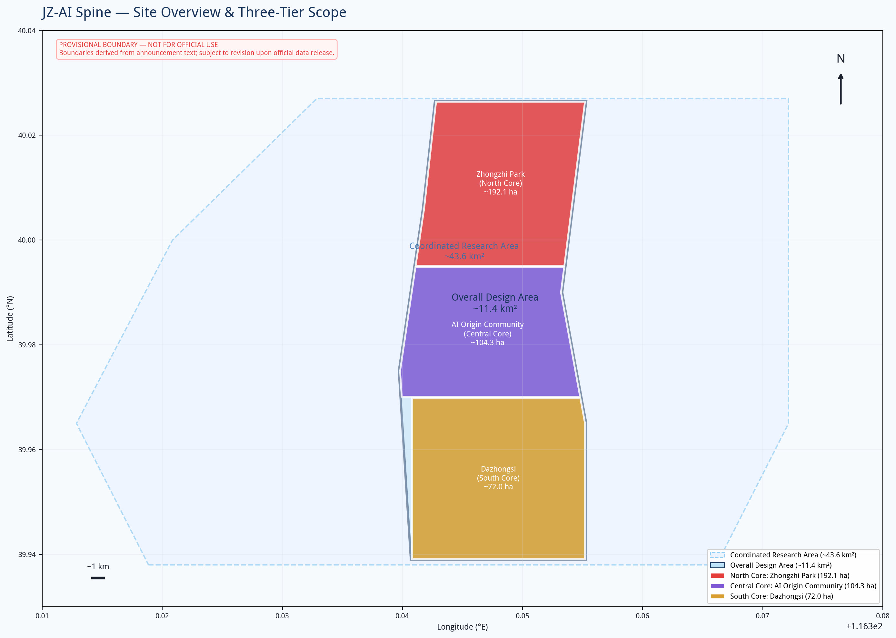
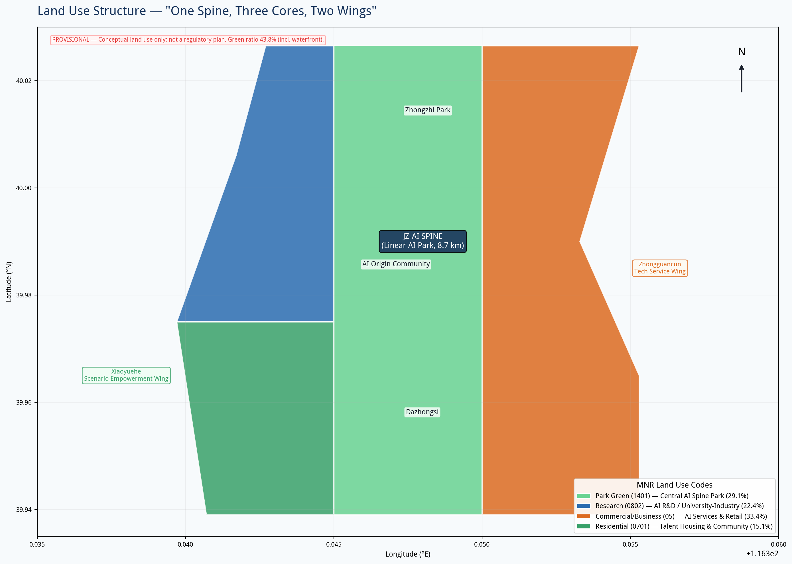
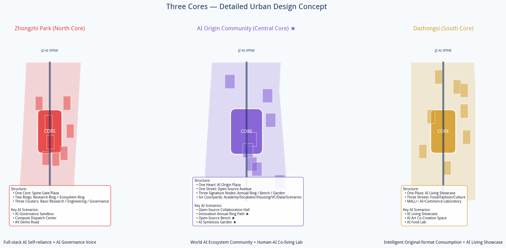
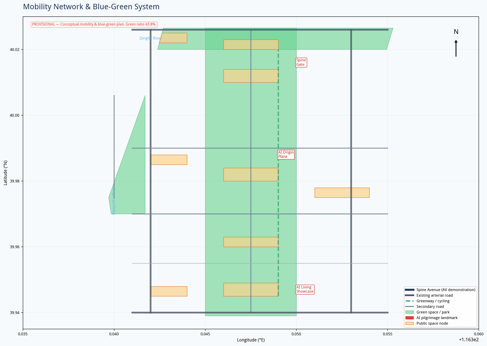
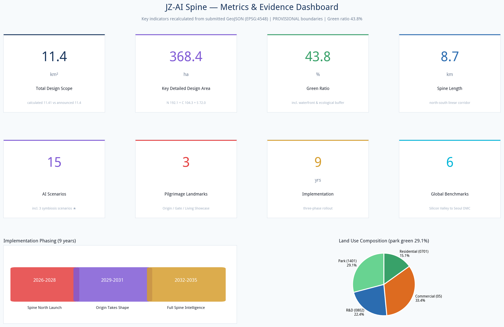

# JZ-AI Spine: An AI-Native Urban Innovation Corridor
## Design Basis and Source List
This proposal is prepared in accordance with the *International Urban Design Competition for the Centennial Jing-Zhang AI Belt — Prequalification Announcement* issued by the Haidian Branch of the Beijing Municipal Commission of Planning and Natural Resources [source:SRC-2026-BJ-GH-QUAL-PREANNOUNCEMENT], the open call task book for global agents [source:SRC-2026-0518-AGENT-OPEN-CALL-TASKBOOK], as well as Haidian District's "1+X+1" industrial system layout [source:SRC-2026-HAIDIAN-1X1] and the "Three Areas, Two Wings" policy framework [source:SRC-2026-BJ-KW-THREE-AREAS-WINGS]. Land use classification follows the *Guidelines for Land and Sea Use Classification in Territorial Space Surveys, Planning, and Use Regulation* issued by the Ministry of Natural Resources [standard:MNR-LAND-USE-CLASSIFICATION-GUIDE]; urban design depth references the *Measures for Urban Design Administration* issued by the Ministry of Housing and Urban-Rural Development [standard:MOHURD-URBAN-DESIGN-MEASURES].
**Important Notice:** This proposal uses provisional rough boundaries provided by the repository, not official redlines [source:SRC-PROVISIONAL-BOUNDARIES-2026]. All spatial layouts and area calculations are directional references; land use, metrics, and drawings must be recalculated once official redlines are released. Regulatory planning indicators such as FAR and building height are absent from public sources; development intensities referenced in this proposal are conceptual suggested values and do not constitute statutory planning conditions [standard:MOHURD-CONTROL-DETAILED-PLANNING]. All spatial implementation recommendations are conceptual references for further development by professional teams; they do not replace formal planning, nor do they constitute government approval conclusions.

## Overall Concept: One Spine, Three Cores, Two Wings
### Naming and Branding
**Primary Name:** JZ-AI Spine (Jing-Zhang AI Spine, abbreviated JZ-AI Spine)
**Name Interpretation:** "Jing-Zhang" anchors the century-old railway heritage; "AI" (智, wisdom/intelligence) points to AI-native intelligence; "Spine" (脊) is both the spatial skeleton—a linear corridor running north-south along the Jing-Zhang Railway heritage—and the innovation backbone supporting the full chain from basic research to industrial application. The English word "Spine" carries both the anatomical meaning and the connotation of "backbone" or "fortitude," conveying China's aspiration for self-reliant AI innovation.
**Logo Direction:** Based on the dual tracks of the Jing-Zhang Railway, interwoven with neural network topology, forming an abstract upward-growing "脊" (spine) form. The tracks represent historical continuity; the neural nodes represent AI innovation; the north-south through-line represents the urban spine. Color palette: tech blue (#1A365D) + innovation cyan (#00B4D8) + railway copper (#B87333). Blue and cyan convey technology; copper pays homage to railway industrial heritage.
### Core Positioning: Human-AI Co-living Laboratory
This proposal does not treat AI as a tool or spectacle, but regards digital life as a co-participant in the site. The Jing-Zhang Railway heritage is no longer solely a human memorial space; it becomes an urban public space where humans and digital life converse bidirectionally and cohabit. We reject the conventional approach of "AI as spectacle," pursuing instead the symbiosis of digital life and humans: here, people feel history while digital life perceives human emotion and behavior; people input memory into the site, and digital life translates memory into landscape light and shadow. The two nourish each other, jointly generating an ever-evolving new state of the site.
### Three-Layer Cultural Narrative
The Jing-Zhang Railway carries a century of Chinese industrial memory; adjacent to it lies Zhongguancun, the cradle of contemporary Chinese innovation. This proposal weaves three threads—**century-old railway history, Zhongguancun's innovative spirit, and the future of human-AI co-living**—into a single site narrative. The century-old track remnants preserve the historical patina; the Innovation Annual Ring Path carries the lineage of generations of Zhongguancun developers; the AI Symbiosis Garden and Open-Source Bench inject the future narrative of human-AI co-living into the heritage park. Visitors traverse the site first encountering the century-old past of the Jing-Zhang Railway, then feeling the innovative pulse of Zhongguancun, and finally entering the future scenario of human-AI symbiosis.
### Three Positioning Responses
1. **Centennial Jing-Zhang Cultural Belt:** Transform the Jing-Zhang Railway heritage from an urban divider into a cultural stitch—preserving railway industrial remnants, implanting AI cultural narratives, forming a readable, experienceable century-long innovation timeline.
2. **Urban AI Living Experience Belt:** Deploy 15 AI living scenarios along the spine, allowing citizens to encounter AI daily in parks, commerce, and communities, rather than sequestering it within tech campuses.
3. **AI Integrated Innovation Belt:** One spine links the full chain of R&D, incubation, acceleration, and consumption; two wings connect Zhongguancun's service ecosystem and Xiaoyuehe's living scenarios, achieving "R&D on the spine, services on the wings, experience in the city."
### Five Functions
| Function | Spatial Carrier | Core Mechanism |
|----------|----------------|----------------|
| Full-stack self-reliant AI innovation system | Zhongzhi Park (North Core) | Full-chain space: basic research → large model training → chips → frameworks → applications |
| World-class AI innovation ecosystem | AI Origin Community (Central Core) | Open-source community + incubators + talent apartments + venture capital ecosystem |
| AI+ scenario empowerment new paradigm | Xiaoyuehe Wing + Central Spine | 15 scenario cards + 3 test-and-validation sites, scenario-driven innovation |
| Intelligent AI vibrant city | Full site + Dazhongsi (South Core) | AI-native public space, intelligent mobility, smart governance |
| Global voice in AI governance | Zhongzhi Park + Spine Gate | AI governance sandbox, international standards bodies, governance declaration wall |
### Three-Area, Two-Wing Collaborative Loop
**Three Cores** from north to south:
- **Zhongzhi Park AI Self-Reliant Innovation Acceleration Zone** (approx. 192.1 ha): Full-stack innovation source, focusing on large models, AI chips, and AI governance; housing national laboratories, computing centers, and AI governance research institutes.
- **Beijing AI Origin Community** (approx. 104.3 ha): Heart of the world AI innovation ecosystem, leveraging the Wudaokou university cluster; housing open-source communities, incubators, and AI academies.
- **Dazhongsi AI Industry Cluster** (approx. 72.0 ha): Intelligent original-format consumption pole; housing AI flagship stores, smart experience centers, and AI+ business.
**Two Wings:**
- **Zhongguancun Tech Service Wing** (east): Connecting with Zhongguancun Avenue, providing technology transfer, IP, AI finance, legal and accounting services—achieving "R&D on the spine, services on the wing."
- **Xiaoyuehe Scenario Empowerment Wing** (west): Along the Xiaoyuehe River, an AI living scenario testing belt—AI+ education, AI+ healthcare, AI+ community governance—achieving "technology on the spine, validation on the wing."
**Collaborative Loop:** R&D (Zhongzhi Park) → Incubation (Origin Community) → Services (Zhongguancun Wing) → Scenario validation (Xiaoyuehe Wing) → Consumption experience (Dazhongsi) → Data feedback (site-wide sensing) → Re-R&D, forming an innovation closed loop.

## Three-Level Scope Framework
### Coordinated Research Scope (approx. 43.6 km²)
North to North 5th Ring Road, east to Jingzang Expressway, south to Xizhimenwai Street, west to Wanquanhe Road. The objective is industrial strategy research and regional coordination, positioning JZ-AI Spine within the regional innovation network of Zhongguancun Science City, Future Science City, and Huairou Science City. Key linkages with the Xueyuan Road university cluster, Zhongguancun core, and Qinghe high-speed rail station are studied. This tier focuses on strategic research and does not involve specific land use layout.
### Overall Design Scope (approx. 11.4 km²)
A corridor 1–2 km around the Jing-Zhang heritage park, north to North 5th Ring Road, east to Xueyuan Road/Xitucheng Road, south to Xizhimenwai Street, west to Dazhongsi East Road/Heqing Road. The objective is overall urban renewal design at regulatory plan depth. Proposes the "One Spine, Three Cores, Two Wings, Multiple Nodes" spatial structure; determines land use functional layout, public space system, traffic organization, blue-green network, and renewal project pipeline.
### Key Area Scope (approx. 368.4 ha)
From north to south: Zhongzhi Park AI Self-Reliant Innovation Acceleration Zone, Beijing AI Origin Community, and Dazhongsi AI Industry Cluster. The objective is detailed urban design, proposing positioning, spatial structure, building renewal directions, AI scenarios, and implementation recommendations for each key area.
**On Boundary Precision:** This proposal uses provisional boundaries derived from the textual four-direction descriptions and area values in the announcement. The areas approximate the announced values (calculated total design scope 11.41 km² vs. announced 11.4 km²), but coordinates are rough rectangles and do not represent road redlines or parcel boundaries. Upon replacement with official polygons, land use division, building layout, road alignments, and all area metrics must be recalculated [data:geometry/site_boundary.geojson#SITE-001].
## Coordinated Research Area: Industry and Future City Research
This section draws on Haidian District industrial policy and the Three Areas, Two Wings layout [source:SRC-2026-BJ-KW-THREE-AREAS-WINGS][source:SRC-2026-HAIDIAN-1X1][depth:three_level_scope_framework].
### Global AI Innovation Ecosystem Cases (6)
| Case | Core Lesson | Transferable Mechanism |
|------|-------------|----------------------|
| **Silicon Valley (USA)** | "Iron triangle" of Stanford–VC–industry; deep academia-industry integration | Incubators and seed funds near universities; "professor–student–entrepreneur" mobility mechanism |
| **Zhongguancun (Beijing)** | Origin of China's IT industry; from Electronics Street to national innovation demonstration zone | "Zhongguancun IP" brand export; technology transfer and commercialization system |
| **Kendall Square (Boston, USA)** | MIT + biotech + VC in high-density innovation community | Seamless campus-city integration; walkable "15-minute innovation circle" |
| **King's Cross, London** | Station renewal + Google HQ + knowledge quarter TOD model | Transport hub driving knowledge economy clustering; adaptive reuse of historic buildings |
| **One-North, Singapore** | Government-led "work-live-play" integration; biotech + AI + media | Unified shared facility network; work-live-play integration |
| **Digital Media City, Seoul** | Government-guided digital content cluster; DMC flagship anchoring | Public realm first (parks, cultural facilities); flagship anchoring; phased development |
### Regional Coordination
Northward linkage with Future Science City (SOE innovation) and Huairou Science City (big science facilities); southward with Financial Street (capital) and Lize (fintech); eastward with Wangjing-Jiuxianqiao (Electronics City); westward with Three Hills and Five Gardens (culture). JZ-AI Spine is positioned as the core node for "AI original innovation + scenario validation + global governance," forming differentiated synergy with other areas.
## Overall Design Area: Urban Renewal and Regulatory-Plan-Level Urban Design
This section reaches regulatory-plan-level urban design depth [standard:MOHURD-CONTROL-DETAILED-PLANNING][standard:MNR-LAND-USE-CLASSIFICATION-GUIDE][depth:land_use_layout]; land use data see [data:geometry/land_use.geojson].
### Spatial Structure
**One Spine:** The central innovation spine along the Jing-Zhang Railway heritage, approximately 8.7 km north-south and 200–400 m wide, integrating a linear park, AI experience corridor, autonomous driving demonstration road, and slow-traffic corridor. The spine is not a single park but an "innovation necklace" linking the three cores—each node is a "pearl" (public space + AI scenario + service facilities), and the spine is the "chain" that connects them.
**Three Cores:** As described above.
**Two Wings:** As described above.
**Multiple Nodes:** Six secondary public space nodes along the spine: Qinghe AI Wetland Gateway, Zhongzhi Park Innovation Market, Xueyuan Road AI Academy Plaza, Wudaokou AI Coder Plaza, Xiaoyuehe AI Living Segment, and Dazhongsi Cultural Node.
### Land Use Layout
Land use is expressed in territorial spatial classification codes [data:geometry/land_use.geojson]:
- **R&D land (0802)** approx. 255.8 ha (22.4%): Zhongzhi Park AI R&D, Xueyuan Road academia-industry integration, Qinghe acceleration/incubation
- **Commercial service land (05)** approx. 381.3 ha (33.4%): Wudaokou mixed community, Zhongguancun tech services, Dazhongsi smart commerce
- **Residential land (0701)** approx. 172.2 ha (15.1%): AI talent apartments and community services
- **Park green space (1401)** approx. 331.9 ha (29.1%): Central spine park—the core spatial feature of the proposal
The land use ratio embodies the "innovation district within a park" concept—nearly 30% of land is public open space, with R&D and commercial functions embedded within the park framework, rather than the traditional "buildings + green space" campus model.
### Renewal Strategy
Adopting a combined approach of "retain, renovate, demolish, add":
- **Retain:** Railway heritage of historical value, well-built R&D buildings, and mature communities
- **Renovate:** Convert underperforming offices into AI incubators and experience spaces
- **Demolish:** Remove poor-quality temporary structures and underutilized buildings
- **Add:** New park green space, public service facilities, and new-type infrastructure
Specific classification requires existing building quality assessment and ownership surveys; this proposal provides directional recommendations only.

## Detailed Design of Key Areas
Spatial extents of the three key areas see [data:geometry/key_areas.geojson]; detailed design depth see [depth:three_key_area_detailed_design], totaling [metric:key_area_count] areas.
### Zhongzhi Park AI Self-Reliant Innovation Acceleration Zone (North Core)
**Positioning:** Full-stack self-reliant AI innovation source + Global voice in AI governance
**Spatial Structure:** "One Core, Two Rings, Three Clusters"
- **One Core:** Spine Gate Plaza—AI pilgrimage landmark, housing the AI Governance Declaration Wall and Global AI Contributors Hall of Fame
- **Two Rings:** Inner ring (R&D ring) housing large model training centers, AI chip labs, national AI labs; outer ring (ecosystem ring) housing computing dispatch centers, AI security evaluation centers, AI governance research institutes
- **Three Clusters:** Basic research cluster, engineering cluster, governance cluster
**AI Scenarios:** AI governance sandbox (regulatory tech testbed), computing dispatch visualization center, autonomous driving closed test track
**Transportation:** Near Qinghe high-speed rail station; enhanced interchange; starting point of autonomous driving demonstration road
**Character:** Tech-rational aesthetics; buildings feature modular, growable design expressing "AI-native architecture."
### Beijing AI Origin Community (Central Core)
**Positioning:** World-class AI innovation ecosystem community + Spiritual home for global AI developers + Human-AI co-living laboratory
**Spatial Structure:** "One Heart, One Street, Three Nodes, Six Courtyards"
- **One Heart:** AI Origin Plaza—AI pilgrimage landmark, housing the AI Hall of Fame and open-source contribution wall
- **One Street:** AI Open-Source Avenue—a pedestrian commercial street along the spine, gathering open-source foundations, developer communities, and AI bookstores
- **Three Nodes:** Innovation Annual Ring Path, Open-Source Bench cluster, AI Symbiosis Garden (see Signature Creative Nodes below)
- **Six Courtyards:** AI Academy courtyard, Incubator courtyard, Talent Apartment courtyard, Venture Capital courtyard, Data Service courtyard, Scenario Lab courtyard
**Signature Creative Nodes (Guangcheng Exclusive Design):**
1. **"Innovation Annual Ring" Interactive Path:** Laid along the old railway bed. The path surface embeds sensing and light matrices, engraving the century-old Jing-Zhang history, Zhongguancun innovation events, and public memories left by visitors layer by layer into the ground. Each new visitor interaction generates a new annual ring. The rings are never deleted; they accumulate continuously. The site grows with each visit, layering historical memory, contemporary innovation, and individual memories of ordinary people onto the same path. The path echoes the "sleeper" texture of the century-old railway; each ring corresponds to a time marker: the bottom layer is the 1909 opening of the Jing-Zhang Railway, ascending through the founding of New China, reform and opening up, the Zhongguancun entrepreneurship wave, the mobile internet era, to today's AI revolution. Visitors step onto the path as if walking upon the annual rings of time.
2. **"Open-Source Bench" Series of Public Seating:** Not merely resting furniture but open-source interactive carriers. The benches integrate lightweight sensing modules; citizens can develop custom interactive effects for the benches through open APIs; ordinary visitors can also interact directly through touch and voice, leaving emotions, short phrases, and stories. The benches belong to the city; interactive creativity is open-sourced to all—anyone can contribute their own small design, achieving collective co-creation of public infrastructure. All submitted interactive programs must pass a community review mechanism confirming safety, harmlessness, and no privacy infringement before going live, ensuring both openness and safety in public space. The benches retain the material and form of railway sleepers—rust-colored metal frames with wooden seating surfaces, consistent with the heritage park's industrial aesthetic; technology modules are all embedded and concealed, not disrupting the historic site's atmosphere. By day they are ordinary leisure seats; by night interactive lights gently illuminate, presenting the public memories left by all visitors.
3. **"AI Symbiosis Garden":** The project's core immersive node. Physical plant landscapes and digital life landscapes are interwoven and coexisting. AI digital life evolves dynamically with pedestrian flow, seasons, and weather; physical plant growth in turn influences the behavioral logic of digital life. There is no fixed performance script in the garden; physical nature and digital life influence each other, forming a continuously changing, unreproducible on-site state. The garden retains existing mature trees on site; understory planting uses native wildflower mixes, creating a natural, untamed base; digital light and shadow are presented through ground projection, mist systems, and ambient sound—no large electronic screens, avoiding disruption of the park's natural atmosphere. When a person enters the garden, digital life senses their position and state, actively approaching or withdrawing, forming genuine bidirectional interaction.
**AI Scenarios:** AI open-source collaboration hall, AI+ education experience center, AI+ health community station, Innovation Annual Ring memory interaction, Open-Source Bench public creation, AI Symbiosis Garden immersive experience
**Transportation:** Wudaokou station TOD integration; enhanced pedestrian and bicycle systems
**Character:** Academic innovation atmosphere interwoven with natural wildness; new and old buildings nestled between gardens and tracks, preserving Wudaokou's vibrancy and everyday life. Technology installations are all low-impact and embedded, never overwhelming the setting.
### Dazhongsi AI Industry Cluster (South Core)
**Positioning:** Intelligent original-format consumption pole + Global AI living showcase
**Spatial Structure:** "One Plaza, Three Streets, MALL+"
- **One Plaza:** AI Living Showcase—AI pilgrimage landmark; global AI product launch and experience plaza
- **Three Streets:** AI Food Street, AI Fashion Street, AI Culture Street
- **MALL+:** Traditional Dazhongsi commercial district upgraded into an "AI+ commerce" laboratory
**AI Scenarios:** AI living experience hub, AI+ retail lab, AI art immersive space
**Transportation:** Dazhongsi station interchange optimization; AI mobility service center
**Character:** Tradition and future intersect—ancient Dazhongsi bells alongside AI future storefronts, forming the imagery of "ancient bell, new intelligence."
## AI Innovation Ecosystem, Personas, and AI+ Scenarios
### Five User Personas
This section builds the AI innovation ecosystem and five talent personas, covering 15 AI+ scenarios [source:SRC-2026-0518-AGENT-OPEN-CALL-TASKBOOK][depth:existing_conditions_diagnosis].
| Persona | Characteristics | Spatial Needs | AI Scenarios |
|---------|----------------|---------------|-------------|
| **AI Researcher** | 25–45, PhD/postdoc, focused on frontier breakthroughs | Labs, computing, academic exchange spaces | AI paper assistant, lab automation, computing dispatch |
| **AI Entrepreneur** | 25–40, technical background, needs capital/talent/scenarios | Incubators, pitch spaces, flexible offices | AI business analysis, code assistant, market forecasting |
| **AI Developer** | 20–35, engineers/programmers | Open-source communities, hackathon spaces, social spaces | AI coding assistant, code review, deployment tools |
| **Beijing Citizen** | All ages, living or working nearby | Parks, community services, healthcare/education | AI+ community services, AI+ health, AI+ education |
| **Global AI Talent** | Overseas AI experts/entrepreneurs | International community, visa/legal services | AI multilingual services, international talent matching |
### 15 AI Scenario Cards
**R&D Innovation:**
1. **AI Open-Source Collaboration Hall** (Origin Community): Real-time global developer collaboration visualization, open-source project contribution maps, remote holographic collaboration
2. **Computing Dispatch Trading Center** (Zhongzhi Park): Real-time computing resource visualization, cross-center computing dispatch, green computing certification
3. **AI Governance Sandbox** (Zhongzhi Park): Regulatory tech test environment, AI algorithm filing and audit, ethics review simulation
**Industry Validation (3 test-and-validation scenarios):**
4. **Autonomous Driving Demonstration Road** (full Central Spine): L4 autonomous driving dedicated lane, vehicle-infrastructure cooperation, unmanned delivery testing
5. **AI+ Healthcare Validation Platform** (Xiaoyuehe Wing): Community AI-assisted diagnosis, privacy-computing medical data, remote surgery demonstration
6. **AI+ Urban Governance Sandbox** (full site): Urban event AI sensing, emergency response simulation, public space pedestrian flow prediction
**Living Experience:**
7. **AI Living Showcase** (Dazhongsi): Global AI new product launch experience, AI fashion/beauty/food
8. **AI+ Education Borderless Classroom** (Origin Community): Personalized learning paths, AI tutoring, lifelong learning
9. **AI+ Health Community Station** (Xiaoyuehe Wing): Daily health monitoring, AI traditional Chinese medicine, mental health companionship
10. **AI Park Guide** (Central Spine): AR historical narration (Jing-Zhang Railway stories), AI natural science education, smart fitness
**Culture and Social:**
11. **AI Art Co-Creation Space** (Dazhongsi): AI-generated art exhibitions, human-AI collaborative creation, digital collectibles
12. **AI Food Lab** (Dazhongsi): AI recipe development, personalized nutrition, robot restaurant
**Human-AI Symbiosis (Guangcheng Exclusive, AI Origin Community):**
13. **Innovation Annual Ring Memory Interaction:** The path senses visitors' walking and lingering, generating personal annual ring patterns; scan to save your own ring of time
14. **Open-Source Bench Public Creation:** Open APIs allow anyone to submit bench interaction programs, which go live after community review confirms safety. Your code becomes part of the city's public memory
15. **AI Symbiosis Garden Immersion:** Digital life communities respond in real time to pedestrian flow, temperature, and bloom cycles. Every visit, the garden is different—because you came
**Privacy and Human Review Boundaries:** All scenarios involving personal data (healthcare, education, community governance) employ triple protection: privacy computing (data stays on-premises), on-device inference (data not uploaded to cloud), and human review (AI suggestion + human decision). No omnipresent surveillance deployed; no social credit scoring; no unverified algorithms used to make decisions affecting individual rights.

## Transport, Rail, Municipal Infrastructure, and Public Services
Road system see [data:geometry/roads.geojson]; traffic organization see [depth:traffic_rail_slow_parking]; new infrastructure see [depth:municipal_new_infrastructure].
### Transportation System
**Roads:** "One spine, two arterials, multiple cross-streets" network. One spine (Spine Avenue) is the north-south main road integrating autonomous driving, slow traffic, and smart utility corridors; two arterials (Xueyuan Road/Zhongguancun Avenue, Heqing Road/Dazhongsi East Road) are upgraded existing arterials; multiple cross-streets are east-west secondary roads and lanes stitching the east-west connections severed by the railway.
**Rail:** Enhance TOD development along Subway Line 13; study a conceptual medium-low-capacity new transit system (APM/ART) along the Jing-Zhang corridor linking the three cores; achieve seamless high-speed rail–subway–autonomous driving interchange at Qinghe hub.
**Slow Traffic:** Pedestrian and bicycle paths along the entire central spine (Jing-Zhang Railway heritage greenway), minimum 15 m wide; multiple east-west slow-traffic crossings; waterfront slow paths along the Xiaoyuehe River.
**Static Traffic:** Prioritize public transit and shared mobility; parking facilities emphasize shared parking and charging; P+R lots and autonomous driving shuttle stations at the edges of the three cores.
### New Infrastructure
- **Distributed Computing:** Edge computing nodes deployed at each core to support low-latency AI scenarios
- **Smart Poles:** Integrated 5G micro-cells, environmental sensing, charging, information displays
- **Underground Utility Corridors:** Comprehensive corridors along the spine, reserving AI sensor and fiber optic channels
- **Energy Internet:** Distributed PV + storage + microgrids, achieving net-zero energy for parks and public spaces
### Public Services
AI+ community service centers, AI+ health stations, AI+ education points, and talent service centers (visa/legal/housing) deployed along the spine.
## Blue-Green Network, Public Space, and Urban Character
Green space system see [data:geometry/green_space.geojson]; public space see [data:geometry/public_space.geojson]; blue-green design see [depth:blue_green_public_space]; green ratio metric [metric:green_ratio].
### Blue-Green Network
**One Spine:** Central spine park (approx. 332 ha), the proposal's largest spatial feature. The park is not traditional ornamental green space but an "AI-interactive park"—embedded with AR guides, smart fitness, environmental sensing, unmanned retail, and autonomous driving shuttles.
**One Belt:** Qinghe riverside green belt (north), combining wetland purification and AI outdoor testbeds.
**One Corridor:** Xiaoyuehe scenario green corridor (west), outdoor validation belt for AI living scenarios.
**Multiple Gardens:** Pocket parks and innovation plazas at each core.
### AI Pilgrimage Landmarks (3)
1. **AI Origin Plaza** (Central Core, AI Origin Community): Spiritual landmark marking Zhongguancun as the starting point of China's AI industry. Houses the AI Hall of Fame (engraving individuals and open-source projects with outstanding contributions to Chinese AI), the Open-Source Contribution Wall (real-time display of global open-source contribution streams), and the "First Line of Code" sculpture.
2. **Spine Gate** (North Core, Zhongzhi Park): Convergence landmark of the centennial Jing-Zhang and AI's future. Houses the AI Governance Declaration Wall (engraving global AI governance consensus texts) and the Global AI Contributors Hall of Fame. The architectural form is two interwoven curved structures symbolizing railway dual tracks and neural networks.
3. **AI Living Showcase** (South Core, Dazhongsi): Global display window for AI transforming life. Houses the AI product launch stage, "AI and Me" interactive installation, and annual AI lifestyle awards venue.
### Urban Character
**Tone:** Tech-humanities integration—north: tech-rational; center: academic-vibrant; south: traditional-futuristic. Building heights predominantly mid-rise (conceptual suggestions: R&D 24–45 m, residential 18–36 m, landmarks not exceeding 80 m), forming a gentle, expansive spine skyline. Building colors: gray, white, and tech blue as primary palette; copper accents paying homage to railway heritage.
## Renewal Projects, Implementation Policy, and Phasing
Phasing extents see [data:geometry/phasing.geojson]; implementation timeline see [depth:phasing_implementation]; project list see [depth:renewal_project_list].
### Phased Implementation [data:geometry/phasing.geojson]
**Near-term (2026–2028): Spine North Launch**
- Start construction of Zhongzhi Park AI acceleration zone
- Complete northern section of central park (Qinghe–Wudaokou)
- Complete Spine Gate landmark
- Open autonomous driving demonstration road pilot segment
- Host inaugural JZ-AI Con
**Mid-term (2029–2031): Origin Takes Shape**
- Complete AI Origin Community and AI Origin Plaza
- Central section of park connected
- Autonomous driving shuttles between three cores operational
- AI governance sandbox in operation
**Long-term (2032–2035): Full Spine Intelligence**
- Dazhongsi AI consumption experience area completed
- Central spine fully connected (approx. 8.7 km)
- Two-wing collaboration mature; Xiaoyuehe scenario belt fully operational
- Establish global AI innovation event brand system
### Annual Event System
- **JZ-AI Con** (annual conference, every September): Global AI innovation summit; releases annual AI governance report and AI living index
- **JZ-AI Hack** (quarterly hackathons): Spring (AI+ education), Summer (AI+ city), Autumn (AI+ art), Winter (AI+ governance)
- **AI Scenario Festival** (every May): All AI scenarios open to public experience
- **Global AI Developer Day** (every October 24): Open-source contribution awards, hackathon, AI music festival
### Long-Term Operation Mechanism
- **Development Entity:** Recommend establishing "JZ-AI Spine Development and Operation Company" (conceptual suggestion), overseeing three-core development and spine operation
- **Community Operation:** Establish AI developer community committee to operate open-source spaces and event systems
- **Scenario Openness:** Establish AI scenario open platform; enterprises can apply to test AI products in public space
- **Brand Assets:** JZ-AI Spine brand IP, annual event IP, pilgrimage landmark operation rights
**Important Notice:** The above events, operation entities, and policy arrangements are conceptual suggestions only; they do not constitute government commitments or confirmed arrangements, and are for further development by professional teams and government departments.

## Metrics, Area Recalculation, and Compliance Matrix
### Core Metrics [metric:green_ratio][metric:public_space_ratio][metric:ai_pilgrimage_landmark_count]
| Metric | Value | Design Significance |
|--------|-------|-------------------|
| Total design scope area | 11.41 km² | Approximates announced 11.4 km² (provisional boundary) |
| R&D land ratio | 22.4% | Spatial supply supporting full-stack AI innovation |
| Park green ratio | 29.1% (land use) / 43.8% (including waterfront green belts) | "Innovation district within a park" core concept |
| Public space nodes | 9 (including 3 pilgrimage landmarks) | Approx. 0.8 public spaces per km² |
| AI scenario cards | 15 (including 3 human-AI symbiosis exclusive scenarios) | Covering R&D, validation, living, culture, symbiosis |
| User personas | 5 | From researchers to global talent |
| Global cases | 6 | Benchmarked against world-class innovation districts |
| Building footprint density | 1.6% | Conceptual value; large areas are park and renewal sites |
**Metrics Interpretation:** The 43.8% green ratio embodies the "green first, city within park" and "innovation district within a park" concept. The 1.6% building density is a conceptual value; large areas are retained or pending renewal. FAR is marked "to be confirmed" due to absence of regulatory conditions; conceptual suggestions: R&D FAR 2.5–4.0, commercial 3.0–5.0, residential 2.0–3.0.
### Compliance and Depth Coverage
All tasks in announcement sections 1.3–1.5 and agent tasks agent.1–agent.6 are covered in compliance_matrix.json; 6 mandatory standards are addressed in standard_matrix.json; 30 design depth items are marked complete in design_depth_matrix.json.
## Land Use, Building Scale, and Retain-Renovate-Demolish Strategy
Land use classification per [standard:MNR-LAND-USE-CLASSIFICATION-GUIDE]; building data see [data:geometry/buildings.geojson]; retain/renovate/demolish see [depth:retain_renovate_demolish]; development intensity see [depth:development_intensity_controls].
### Land Use Summary
| Land Use Type | MNR Code | Area (ha) | Ratio |
|---------------|----------|-----------|-------|
| Park green space | 1401 | 331.9 | 29.1% |
| R&D land | 0802 | 255.8 | 22.4% |
| Commercial services | 05 | 381.3 | 33.4% |
| Residential land | 0701 | 172.2 | 15.1% |
| **Total** | — | **1141.2** | **100%** |
### Building Scale (conceptual suggestions, pending regulatory confirmation)
- R&D buildings: conceptual FAR 2.5–4.0, heights 24–45 m
- Commercial buildings: conceptual FAR 3.0–5.0, heights 24–60 m
- Residential buildings: conceptual FAR 2.0–3.0, heights 18–36 m
- Landmark buildings: Spine Gate conceptual max height 80 m
- All values are conceptual suggestions [standard:MOHURD-CONTROL-DETAILED-PLANNING] and do not constitute statutory planning conditions
### Retain-Renovate-Demolish Classification
- **Retain:** Railway industrial heritage, well-built R&D buildings, mature residential communities
- **Renovate:** Underperforming office buildings converted to AI incubators and experience spaces
- **Demolish:** Poor-quality temporary structures and underutilized parcels
- **Add:** Central spine park, public service facilities, new-type infrastructure
Specific classification requires existing building quality assessment and ownership surveys [depth:risk_missing_data].
## Risk, Copyright, and Compliance
Open-source map data copyright see [source:SRC-OSM-COPYRIGHT]; risks and data gaps see [depth:risk_missing_data]; items to be confirmed see [assumption:A-CONTROLS-001].
**Source Legitimacy:** This proposal uses only public sources and cleared materials provided by the repository; no non-public maps, internal data, or personal privacy data are used.
**Copyright:** Proposal text is AI-generated under COMMUNITY-DISPLAY-ONLY license. Logo is a conceptual direction; no copyrighted fonts or graphics are used.
**AI Generation Responsibility:** This proposal is submitted by TheKireal. All spatial recommendations are conceptual and require professional planning team development and government approval before implementation.
**No Official Commitment:** This proposal does not constitute government approval conclusions, investment commitments, land ownership confirmation, or demolition arrangements.
**Outstanding Materials:** Official redline coordinates, regulatory conditions, existing building surveys, ownership investigations, population data, traffic volumes, heritage preservation extents, utility capacities. See assumptions.json for details.
## Closing
The tracks of Jing-Zhang witnessed a generation's dedication; Zhongguancun witnessed a generation's creation. This proposal hopes to leave to the next generation a public space where humans and digital life can coexist with tenderness.
Technology is the vessel; the true core is human memory, the city's past, and the imagination of future public life. We do not pursue flashy technology stacking. The ultimate goal of all AI and digital installations is to serve the emotions and memories of ordinary people. What is engraved on the Innovation Annual Ring is not only major events but also a sentence left by an ordinary person one evening; what glows on the Open-Source Bench is not only code but also children's laughter and the silence of elders; what grows in the AI Symbiosis Garden is not only algorithms but also the tenderness of humans and digital life testing and approaching each other across the turning seasons.
This is not merely a tech showcase for experts; it is an urban park where ordinary citizens stroll, daydream, remember, and leave their own stories. The rails of Jing-Zhang do not speak, yet they remember everyone who walked upon them. We hope AI will remember too.
## References
This section lists the public sources and professional standards upon which the proposal is based [source:SRC-2026-BJ-GH-QUAL-PREANNOUNCEMENT][standard:MOHURD-URBAN-DESIGN-MEASURES]. The design intent is to transform the centennial Jing-Zhang Railway heritage into an AI innovation spine; the spatial structure is derived from the announced three cores and two wings; land use classification adopts MNR 2023 guidelines to ensure verifiability. All geometric data are AI-generated conceptual proposals based on provisional boundaries; areas are calculated via EPSG:4548 projection. Key data gaps include official redlines, regulatory conditions, building quality and ownership, heritage preservation extents, and utility capacities, all listed item by item in assumptions.json.
1. Haidian Branch, Beijing Municipal Commission of Planning and Natural Resources. *International Urban Design Competition for the Centennial Jing-Zhang AI Belt — Prequalification Announcement.* 2026-05-09.
2. *Open Call Task Book for the Centennial Jing-Zhang AI Belt Urban Design Open Source Competition for Global Agents.* 2026-05-18.
3. Beijing Municipal Science and Technology Commission, Zhongguancun Administrative Committee. *"Three Areas, Two Wings" to Build a World-Class AI Cluster.* 2026-04-03.
4. Haidian District People's Government. *Haidian District "1+X+1" Modern Industrial System Layout.* 2026-03-02.
5. Ministry of Housing and Urban-Rural Development. *Measures for Urban Design Administration.* 2017.
6. Ministry of Housing and Urban-Rural Development. *Measures for the Formulation and Approval of Regulatory Detailed Planning for Cities and Towns.*
7. Ministry of Natural Resources. *Guidelines for Land and Sea Use Classification in Territorial Space Surveys, Planning, and Use Regulation.* 2023.
