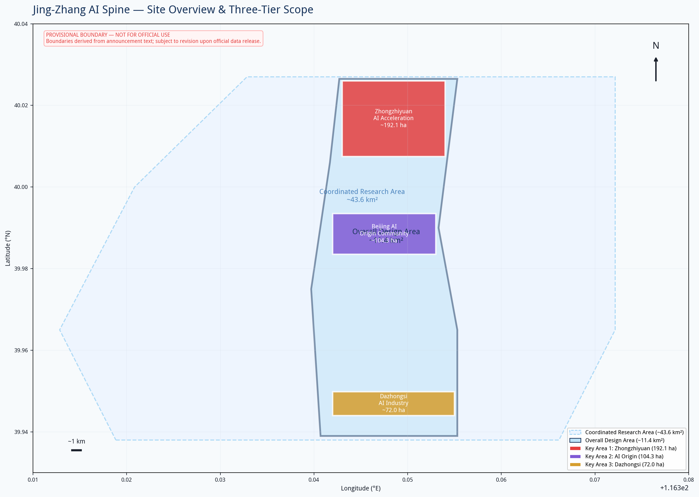
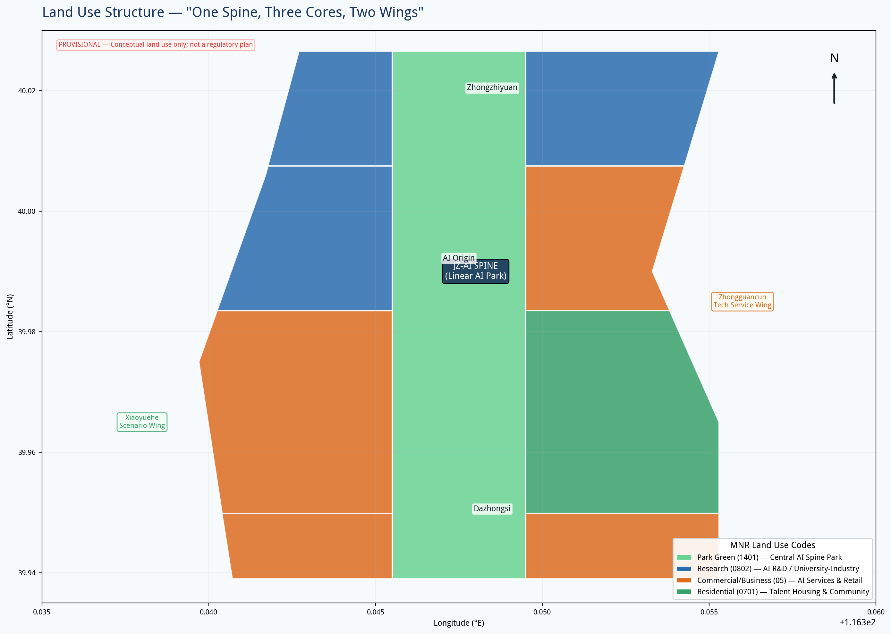
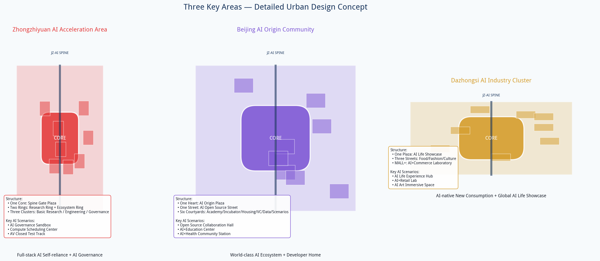
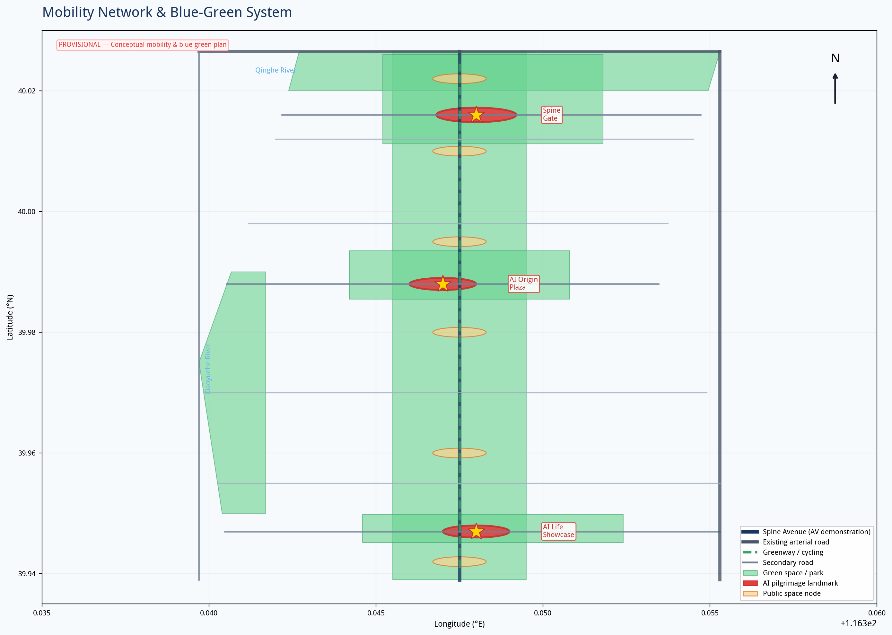
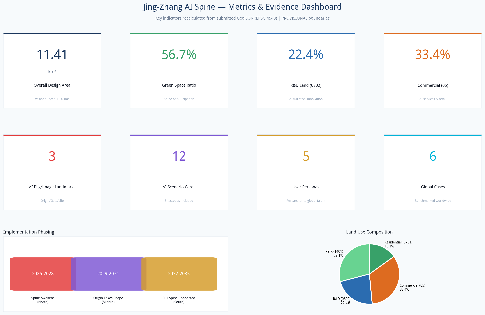

# 京张智脊：AI原生城市创新脊

## 设计依据与资料清单

本方案依据北京市规划和自然资源委员会海淀分局发布的《百年京张AI创新带城市设计国际方案征集资格预审公告》[source:SRC-2026-BJ-GH-QUAL-PREANNOUNCEMENT]、面向全球智能体的开源征集任务书[source:SRC-2026-0518-AGENT-OPEN-CALL-TASKBOOK]，以及海淀区"1+X+1"产业体系布局[source:SRC-2026-HAIDIAN-1X1]和"三区两翼"政策背景[source:SRC-2026-BJ-KW-THREE-AREAS-WINGS]编制。用地分类遵循自然资源部《国土空间调查、规划、用途管制用地用海分类指南》[standard:MNR-LAND-USE-CLASSIFICATION-GUIDE]，城市设计深度参照住建部《城市设计管理办法》[standard:MOHURD-URBAN-DESIGN-MEASURES]。

**重要说明**：本方案使用仓库提供的临时粗略边界（provisional boundary），非官方红线[source:SRC-PROVISIONAL-BOUNDARIES-2026]。所有空间布局和面积计算具有方向性参考价值，待官方红线发布后需重算用地、指标和图纸。容积率、建筑高度等控规指标在公开资料中缺失，方案中涉及的开发强度为概念建议值，不构成法定规划条件[standard:MOHURD-CONTROL-DETAILED-PLANNING]。所有空间落地建议均为概念建议、参考方案，可供专业团队深化研究，不替代正式规划，不构成政府审定结论。

## 总体概念：一脊三核两翼

### 命名与品牌

**主名称**：京张智脊（Jing-Zhang AI Spine，缩写 JZ-AI Spine）

**命名释义**："京张"锚定百年铁路历史文脉，"智"指向AI原生智慧，"脊"既是空间骨架——沿京张铁路遗址南北贯通的线性走廊，也是创新脊梁——从基础研究到产业落地的全链条支撑。英文"Spine"兼具"脊柱"和"骨气"之意，传递中国AI自主创新的脊梁定位。

**Logo方向**：以京张铁路双轨为底，交织神经网络拓扑，形成向上生长的"脊"字抽象形态。轨道代表历史传承，神经节点代表AI创新，南北贯通的线条代表城市脊骨。配色采用科技蓝（#1A365D）+ 创新青（#00B4D8）+ 铁路铜（#B87333），蓝青传递科技感，铜色致敬铁路工业遗产。

### 核心定位：人机共融实验场
本方案不将AI视为工具或展品，而是将数字生命作为场地的共同参与者。京张铁路遗址不再只是人类的纪念空间，同时成为人类与数字生命双向对话、共同栖息的城市公共空间。我们拒绝"AI作为展品"的传统思路，追求数字生命与人类共生：人在这里感受历史，数字生命在这里感知人的情绪与行为；人向场地输入记忆，数字生命把记忆转译为景观光影，二者互相滋养，共同生成场地持续生长的新状态。

### 三重文化叙事
京张铁路承载百年中国工业历史记忆，毗邻中关村是当代中国创新策源地。本方案把**百年铁路历史、中关村创新精神、AI人机共融未来**三条线索编织为同一个场地叙事。百年铁轨遗存保留历史底色；创新年轮步道承接中关村一代代开发者的创新脉络；AI共生花园、开源长椅把AI人机共融的未来叙事注入遗址公园。游客行走场地，先触碰京张铁路的百年过往，再感受中关村的创新脉搏，最终进入人机共生的未来场景。

### 三大定位回应

1. **百年京张文化带**：将京张铁路遗址从城市割裂带转化为文化缝合带，保留铁路工业遗存，植入AI文化叙事，形成可阅读、可体验的百年创新时间线。
2. **都市AI生活体验带**：沿脊布局12个AI生活场景，让市民在公园、商业、社区中日常感知AI，而非封闭在科技园区内。
3. **AI融合创新带**：一脊串联研发、孵化、加速、消费全链条，两翼联动中关村服务体系和小月河生活场景，实现"研发在脊、服务在翼、体验在城"。

### 五大功能

| 功能 | 空间承载 | 核心机制 |
|------|----------|----------|
| AI全栈自主创新体系 | 众智园（北核） | 基础研究→大模型训练→芯片→框架→应用的全链条空间 |
| 世界级AI创新生态 | AI原点社区（中核） | 开源社区+孵化器+人才公寓+风险资本的生态聚落 |
| AI+场景赋能新范式 | 小月河翼+中央脊 | 12个场景卡+3个测试验证场，场景驱动创新 |
| 智能化AI活力城市 | 全域+大钟寺（南核） | AI原生公共空间、智能交通、智慧治理 |
| AI治理全球话语权 | 众智园+智脊之门 | AI治理沙盒、国际标准组织、治理宣言墙 |

### 三区两翼协同回路

**三核**自北向南：
- **众智园AI自主创新加速区**（约192.1公顷）：全栈自主创新策源地，聚焦大模型、AI芯片、AI治理，布局国家实验室、算力中心、AI治理研究院。
- **北京AI原点社区**（约104.3公顷）：世界AI创新生态心脏，依托五道口高校群，布局开源社区、孵化器、AI学院。
- **大钟寺AI产业集聚区**（约72.0公顷）：智能原新业态消费极，布局AI首店、智能体验中心、AI+商务。

**两翼**：
- **中关村科技服务翼**（东侧）：联动中关村大街，提供技术转移、知识产权、AI金融、法律会计等生产性服务，实现"研发在脊、服务在翼"。
- **小月河场景赋能翼**（西侧）：沿小月河布局AI生活场景测试带，AI+教育、AI+医疗、AI+社区治理，实现"技术在脊、验证在翼"。

**协同回路**：研发（众智园）→ 孵化（原点社区）→ 服务（中关村翼）→ 场景验证（小月河翼）→ 消费体验（大钟寺）→ 数据反馈（全域感知）→ 再研发，形成创新闭环。

## 三层范围工作框架

### 统筹研究范围（约43.6平方公里）

北至北五环路，东至京藏高速，南至西直门外大街，西至万泉河路。工作目标为产业战略研究和区域协同，将京张智脊置于中关村科学城、未来科学城、怀柔科学城的区域创新网络中定位。重点研究与学院路高校群、中关村核心区、清河高铁站的联动关系。此层面以战略研究为主，不涉及具体用地布局。

### 总体设计范围（约11.4平方公里）

以京张遗址公园周边1-2公里为走廊，北至北五环路，东至学院路/西土城路，南至西直门外大街，西至大钟寺东路/荷清路。工作目标为城市更新总体设计，达到控规层面的城市设计深度。提出"一脊三核两翼多节点"的空间结构，确定用地功能布局、公共空间体系、交通组织、蓝绿网络和更新项目库。

### 重点区域范围（约368.4公顷）

自北向南包括众智园AI自主创新加速区、北京AI原点社区、大钟寺AI产业集聚区。工作目标为详细城市设计，对每片重点区域提出定位、空间结构、建筑更新方向、AI场景和实施建议。

**关于边界精度**：本方案使用provisional边界，该边界依据公告文字四至和面积值推算，面积与公告值接近（总设计范围计算值11.41km² vs 公告11.4km²），但坐标为粗略矩形，不代表道路红线或地块边界。替换官方polygon后，用地划分、建筑布局、道路线形和所有面积指标均需重算[data:geometry/site_boundary.geojson#SITE-001]。

## 统筹研究范围产业与未来城市研究

本节依据海淀区产业政策和三区两翼布局展开研究[source:SRC-2026-BJ-KW-THREE-AREAS-WINGS][source:SRC-2026-HAIDIAN-1X1][depth:three_level_scope_framework]。

### 全球AI创新生态案例（6个）

| 案例 | 核心经验 | 可转化机制 |
|------|----------|------------|
| **硅谷（美国）** | 斯坦福-风投-企业的"铁三角"，产学研深度融合 | 高校周边布局孵化器和种子基金，建立"教授-学生-创业者"流动机制 |
| **中关村（北京）** | 中国IT产业原点，电子一条街到国家自主创新示范区 | "中关村IP"品牌输出，技术转移和成果转化体系 |
| **肯德尔广场（美国波士顿）** | MIT+生物医药+风险资本的高密度创新社区 | 大学校园与城市街区无缝融合，步行可达的"15分钟创新圈" |
| **伦敦国王十字** | 火车站更新+谷歌总部+知识街区的TOD创新模式 | 交通枢纽带动知识经济集聚，历史建筑活化利用 |
| **新加坡纬壹科技城** | 政府主导的"产城人"融合，生物医药+AI+媒体 | 统一规划的共享设施网络，工作-生活-娱乐一体化 |
| **首尔数字媒体城** | 政府引导的数字内容产业集群，DMC旗舰项目带动 | 公共领域先行（公园、文化设施），旗舰项目锚定，分期开发 |

### 区域协同

向北联动未来科学城（央企创新）和怀柔科学城（大科学装置），向南联动金融街（资本）和丽泽（金融科技），向东联动望京-酒仙桥（电子城），向西联动三山五园（文化）。京张智脊定位为"AI原始创新+场景验证+全球治理"的核心节点，与其他片区形成差异化协同。

## 总体设计范围城市更新与控规深度城市设计

本节达到控规层面城市设计深度[standard:MOHURD-CONTROL-DETAILED-PLANNING][standard:MNR-LAND-USE-CLASSIFICATION-GUIDE][depth:land_use_layout]，用地数据见[data:geometry/land_use.geojson]。

### 空间结构

**一脊**：沿京张铁路遗址的中央创新脊，南北长约8.7公里，东西宽约200-400米，集线性公园、AI体验走廊、自动驾驶示范道、慢行走廊于一体。脊线不是单一公园，而是串联三核的"创新项链"——每个节点都是一颗"珍珠"（公共空间+AI场景+服务设施），脊线是串联的"链"。

**三核**：见前述。

**两翼**：见前述。

**多节点**：沿脊布局6个次级公共空间节点——清河AI湿地门户、众智园创新集市、学院路AI学园广场、五道口AI码农广场、小月河AI生活段、大钟寺文化节点。

### 用地布局

用地以国土空间分类代码表达[data:geometry/land_use.geojson]：
- **科研用地（0802）**约255.8公顷（22.4%）：众智园AI研发、学院路产学研融合、清河加速孵化
- **商业服务业用地（05）**约381.3公顷（33.4%）：五道口混合社区、中关村科技服务、大钟寺智能商业
- **居住用地（0701）**约172.2公顷（15.1%）：AI人才公寓和社区服务
- **公园绿地（1401）**约331.9公顷（29.1%）：中央脊线公园，是方案的核心空间特色

用地比例体现"公园中的创新区"理念——近30%用地为公共开放空间，研发和商业功能嵌入公园框架中，而非传统园区的"建筑+绿地"模式。

### 更新策略

采用"留改拆增"并举：
- **留**：保留有历史价值的铁路遗存、质量较好的科研建筑和成熟社区
- **改**：改造低效办公为AI孵化器和体验空间
- **拆**：拆除质量差、低效利用的临时建筑
- **增**：新增公园绿地、公共服务设施和新型基础设施

具体拆改留分类需结合现状建筑质量评定和权属调查，本方案仅提出方向性建议。

## 重点区域详细设计

三大重点区域空间范围见[data:geometry/key_areas.geojson]，详细设计深度见[depth:three_key_area_detailed_design]，共[metric:key_area_count]处。

### 众智园AI自主创新加速区（北核）

**定位**：AI全栈自主创新策源地 + AI治理全球话语权

**空间结构**："一芯两环三组团"
- **一芯**：智脊之门广场——AI朝圣地标，设AI治理宣言墙和全球AI贡献者荣誉堂
- **两环**：内环（科研环）布局大模型训练中心、AI芯片实验室、国家AI实验室；外环（生态环）布局算力调度中心、AI安全评测中心、AI治理研究院
- **三组团**：基础研究组团、工程化组团、治理组团

**AI场景**：AI治理沙盒（监管科技测试场）、算力调度可视化中心、自动驾驶封闭测试场

**交通**：近清河高铁站，强化枢纽换乘；设自动驾驶示范道起点

**风貌**：科技理性美学，建筑以模块化、可生长为特色，体现"AI原生建筑"理念。

### 北京AI原点社区（中核）

**定位**：世界级AI创新生态社区 + 全球AI开发者精神家园 + 人机共融生活实验场

**空间结构**："一心一街三节点六院落"
- **一心**：AI原点广场——AI朝圣地标，设AI名人堂和开源贡献墙
- **一街**：AI开源大街——沿脊线的步行商业街，集聚开源基金会、开发者社区、AI书店
- **三节点**：创新年轮步道、开源长椅集群、AI共生花园（详见下文核心创意节点）
- **六院落**：AI学院院、孵化器院、人才公寓院、风险资本院、数据服务院、场景实验院

**核心创意节点（光城专属设计）**：

1. **"创新年轮"互动步道**：沿旧铁路路基铺设。步道地面嵌入感知与光影矩阵，把京张百年历史、中关村创新事件、到访游客留下的公共记忆一层层刻录进地面。每一条新的访客交互，都会生成一圈新的年轮纹路。年轮不会被删除，持续累积，场地随着人的到访不断生长，把历史记忆、当代创新、普通人的个体记忆叠合在同一条步道之上。步道对应百年铁路的"枕木"肌理，每一道年轮对应一个时间刻度：最底层是1909年京张铁路通车，向上依次是新中国成立、改革开放、中关村创业潮、移动互联网时代，直至今天的AI革命。游客踏上步道，如同行走在时间的年轮之上。

2. **"开源长椅"系列公共座椅**：不止休息坐具，是开源交互载体。长椅集成轻量化感知模块，市民可以通过开放接口，为长椅开发自定义交互效果；普通游客也可以直接触摸、语音交互，留下情绪、短句、故事。长椅本身属于城市，交互创意向全社会开源，任何人都可以贡献属于自己的小设计，实现公共设施的集体共创。所有提交的交互程序需经社区审核机制确认安全、无害、不侵犯他人隐私后方可上线运行，确保公共空间的开放性与安全性并重。长椅沿用铁路枕木的材质与形态，锈色金属框架搭配实木座面，与遗址公园整体工业风统一；科技模块全部嵌入式隐藏，不破坏历史场地的整体氛围。日间是普通休闲座椅，入夜后交互灯光缓缓亮起，呈现所有访客留下的公共记忆。

3. **"AI共生花园"**：本项目的核心沉浸式节点。实体植物景观与数字生命景观交织共存。AI数字生命跟随人流、季节、天气动态演化；实体植物生长变化，又反过来影响数字生命的行为逻辑。花园里没有固定不变的表演脚本，实体自然与数字生命互相影响，形成持续变化、不可复制的现场状态。花园保留场地原生乔木，下层植被采用乡土野花组合，营造自然野趣的基底；数字光影通过地面投影、雾森系统、环境音效呈现，不设置大型电子屏，避免破坏公园自然氛围。人进入花园，数字生命会感知人的位置与状态，主动靠近或回避，形成真正的双向互动。

**AI场景**：AI开源协作大厅、AI+教育体验中心、AI+健康社区站、创新年轮记忆交互、开源长椅公共创作、AI共生花园沉浸体验

**交通**：五道口站TOD一体化，强化步行和自行车系统

**风貌**：学院派创新氛围与自然野趣交织，新老建筑掩映于花园与铁轨之间，保留五道口的烟火气与活力。科技装置全部低干预嵌入式设计，不喧宾夺主。

### 大钟寺AI产业集聚区（南核）

**定位**：智能原新业态消费极 + AI生活全球秀场

**空间结构**："一场三街MALL+"
- **一场**：AI生活秀场——AI朝圣地标，全球AI产品首发体验广场
- **三街**：AI美食街、AI时尚街、AI文化街
- **MALL+**：传统大钟寺商圈升级为"AI+商业"实验室

**AI场景**：AI生活体验中枢、AI+零售实验室、AI艺术沉浸空间

**交通**：大钟寺站换乘优化，设AI出行服务中心

**风貌**：传统与未来交融，大钟寺古钟与AI未来店铺并置，形成"古钟新智"意象。

## AI 创新生态、人才画像与 AI+ 场景

### 五类用户画像

本节构建AI创新生态体系与五类人才画像，覆盖12个AI+场景[source:SRC-2026-0518-AGENT-OPEN-CALL-TASKBOOK][depth:existing_conditions_diagnosis]。

| 画像 | 特征 | 空间需求 | AI场景 |
|------|------|----------|--------|
| **AI研究员** | 25-45岁，博士/博士后，关注前沿突破 | 实验室、算力、学术交流空间 | AI论文助手、实验自动化、算力调度 |
| **AI创业者** | 25-40岁，技术背景，需要资金/人才/场景 | 孵化器、路演空间、灵活办公 | AI商业分析、代码助手、市场预测 |
| **AI开发者** | 20-35岁，工程师/程序员 | 开源社区、黑客松空间、社交空间 | AI编程助手、代码审查、部署工具 |
| **北京市民** | 全年龄段，居住或工作在周边 | 公园、社区服务、医疗教育 | AI+社区服务、AI+健康、AI+教育 |
| **全球AI人才** | 海外AI专家/创业者 | 国际社区、签证/法务服务 | AI多语种服务、国际人才匹配 |

### 15张AI场景卡

**研发创新类**：
1. **AI开源协作大厅**（原点社区）：全球开发者实时协作可视化，开源项目贡献地图，远程全息协作
2. **算力调度交易中心**（众智园）：算力资源实时可视化，跨中心算力调度，绿色算力认证
3. **AI治理沙盒**（众智园）：监管科技测试环境，AI算法备案与审计，伦理审查模拟

**产业验证类（3个测试验证场景）**：
4. **自动驾驶示范道**（中央脊全段）：L4级自动驾驶专用道，车路协同，无人配送测试
5. **AI+医疗验证平台**（小月河翼）：社区AI辅助诊断，隐私计算医疗数据，远程手术示教
6. **AI+城市治理沙盒**（全域）：城市事件AI感知，应急响应模拟，公共空间人流预测

**生活体验类**：
7. **AI生活秀场**（大钟寺）：全球AI新品首发体验，AI时尚/美妆/美食
8. **AI+教育无界课堂**（原点社区）：个性化学习路径，AI家教，终身学习
9. **AI+健康社区站**（小月河翼）：日常健康监测，AI中医，心理健康陪伴
10. **AI公园导览**（中央脊）：AR历史解说（京张铁路故事），AI自然科普，智能健身

**文化社交类**：
11. **AI艺术共创空间**（大钟寺）：AI生成艺术展览，人机协同创作，数字藏品
12. **AI美食实验室**（大钟寺）：AI菜谱研发，个性化营养，机器人餐厅

**人机共生类（光城专属，AI原点社区）**：
13. **创新年轮记忆交互**：步道感知访客行走与停留，生成个人专属年轮纹路，可扫码保存属于自己的那一圈时间印记
14. **开源长椅公共创作**：开放API允许任何人提交长椅交互程序，经社区审核确认安全无害后上线。你的代码，成为城市公共记忆的一部分
15. **AI共生花园沉浸**：数字生命群落实时响应人流、温度、花期变化。每次入园，花园的状态都不同——因为你来了

**隐私与人工复核边界**：所有涉及个人数据的场景（医疗、教育、社区治理）均采用隐私计算（数据不出域）、端侧推理（数据不上云）、人工复核（AI建议+人类决策）三重保护。不部署无死角监控，不进行社会信用评分，不使用未经验证的算法做出影响个人权益的决定。

## 交通、轨道、市政与公共服务设施

道路系统见[data:geometry/roads.geojson]，交通组织见[depth:traffic_rail_slow_parking]，新基建见[depth:municipal_new_infrastructure]。

### 交通系统

**道路**："一脊两纵多横"路网。一脊（智脊大道）为南北向主干，集自动驾驶、慢行、智慧管廊；两纵（学院路/中关村大街、荷清路/大钟寺东路）为现状主干路提升；多横为东西向次干路和支路，缝合被铁路割裂的东西向联系。

**轨道**：强化地铁13号线沿线TOD开发；研究沿京张走廊的中低运量新交通系统（APM/智轨）概念方案，串联三核；在清河枢纽实现高铁-地铁-自动驾驶的无缝换乘。

**慢行**：中央脊线全程设置步行道和自行车道（京张铁路遗址绿道），宽度不小于15米；东西向设置多处慢行过街通道；沿小月河设置滨水慢行道。

**静态交通**：以公共交通和出行为主，配建停车位以共享停车和充电设施为主；在三核边缘设置P+R停车场和自动驾驶接驳站。

### 新型基础设施

- **分布式算力**：在三核各部署边缘计算节点，支撑低延迟AI场景
- **智慧灯杆**：集成5G微基站、环境感知、充电、信息发布
- **地下管廊**：沿脊线建设综合管廊，预留AI传感器和光纤通道
- **能源互联网**：分布式光伏+储能+微电网，实现公园和公共空间净零能耗

### 公共服务

沿脊布局AI+社区服务中心、AI+健康站、AI+教育站点、人才服务中心（签证/法务/住房）。

## 蓝绿空间、公共空间与城市风貌

绿地系统见[data:geometry/green_space.geojson]，公共空间见[data:geometry/public_space.geojson]，蓝绿设计见[depth:blue_green_public_space]，绿地率指标[metric:green_ratio]。

### 蓝绿网络

**一脊**：中央脊线公园（约332公顷），是方案最大的空间特色。公园不是传统观赏绿地，而是"AI可交互公园"——嵌入AR导览、智能健身、环境感知、无人零售、自动驾驶穿梭等功能。

**一带**：清河滨水绿带（北部），结合湿地净化和AI户外测试场。

**一廊**：小月河场景绿廊（西部），AI生活场景的户外验证带。

**多园**：三核各设口袋公园和创新广场。

### AI朝圣地标（3个）

1. **AI原点广场**（中核，AI原点社区）：标志中关村作为中国AI产业起点的精神地标。设AI名人堂（刻入对中国AI有突出贡献的人物和开源项目）、开源贡献墙（实时显示全球开源贡献流）、"第一行代码"雕塑。
2. **智脊之门**（北核，众智园）：百年京张与AI未来的交汇地标。设AI治理宣言墙（刻入全球AI治理共识文本）、全球AI贡献者荣誉堂。建筑形态为两道交织的弧形结构，象征铁路双轨和神经网络。
3. **AI生活秀场**（南核，大钟寺）：AI改变生活的全球展示窗口。设AI产品首发台、"AI与我"互动装置、年度AI生活方式颁奖场地。

### 城市风貌

**基调**：科技人文融合——北部科技理性，中部学院活力，南部传统未来。建筑高度以中低层为主（概念建议：研发24-45米，居住18-36米，地标不超过80米），形成平缓舒展的脊线天际线。建筑色彩以灰、白、科技蓝为主调，铜色点缀致敬铁路遗产。

## 更新项目清单、实施政策与分期计划

分期范围见[data:geometry/phasing.geojson]，实施时序见[depth:phasing_implementation]，项目清单见[depth:renewal_project_list]。

### 分期实施[data:geometry/phasing.geojson]

**近期（2026-2028）：智脊北启**
- 启动众智园AI加速区建设
- 建成中央公园北段（清河-五道口）
- 建成智脊之门地标
- 开通自动驾驶示范道试验段
- 举办首届JZ-AI Con大会

**中期（2029-2031）：原点成型**
- 建成AI原点社区和AI原点广场
- 中央公园中段贯通
- 三核之间自动驾驶接驳开通
- AI治理沙盒投入运行

**远期（2032-2035）：全域智脊**
- 大钟寺AI消费体验区建成
- 中央脊线全线贯通（约8.7公里）
- 两翼协同成熟，小月河场景带全面运营
- 建立全球AI创新活动品牌体系

### 年度活动体系

- **JZ-AI Con**（年度大会，每年9月）：全球AI创新峰会，发布年度AI治理报告和AI生活指数
- **JZ-AI Hack**（四季黑客松）：春（AI+教育）、夏（AI+城市）、秋（AI+艺术）、冬（AI+治理）
- **AI场景节**（每年5月）：开放所有AI场景供市民体验
- **全球AI开发者日**（每年10月24日）：开源贡献颁奖、黑客马拉松、AI音乐节

### 长期运营机制

- **开发主体**：建议成立"京张智脊开发运营公司"（概念建议），统筹三核开发和脊线运营
- **社区运营**：建立AI开发者社区委员会，运营开源空间和活动体系
- **场景开放**：建立AI场景开放平台，企业可申请在公共空间测试AI产品
- **品牌资产**：JZ-AI Spine品牌IP、年度活动IP、朝圣地标运营权

**重要声明**：以上活动、运营主体和政策安排均为概念建议，不构成政府承诺或已确定安排，供专业团队和政府部门深化研究。

## 指标体系、面积复算与合规矩阵

### 核心指标[metric:green_ratio][metric:public_space_ratio][metric:ai_pilgrimage_landmark_count]

| 指标 | 数值 | 设计含义 |
|------|------|----------|
| 总设计范围面积 | 11.41 km² | 与公告11.4km²接近（provisional边界） |
| 科研用地比例 | 22.4% | 支撑AI全栈创新的空间供给 |
| 公园绿地比例 | 29.1%（用地）/ 43.8%（含滨水绿带） | "公园中的创新区"核心理念 |
| 公共空间节点 | 9处（含3处朝圣地标） | 每平方公里约0.8处公共空间 |
| AI场景卡 | 15张（含3个人机共生专属场景） | 覆盖研发、验证、生活、文化、共生 |
| 用户画像 | 5类 | 从研究员到全球人才 |
| 全球案例 | 6个 | 对标全球顶级创新区 |
| 建筑基底密度 | 1.6% | 概念值，大面积为公园和待更新区 |

**指标解读**：绿地率43.8%体现"先绿后城、公园中的创新区"理念。建筑密度1.6%为概念值，大量用地为现状保留和待更新区域。容积率因缺控规条件标注为"待确认"，概念建议研发FAR 2.5-4.0、商业3.0-5.0、居住2.0-3.0。

### 合规与深度覆盖

公告1.3-1.5各项任务和agent.1-agent.6六项任务均已在compliance_matrix.json中覆盖；6项强制性标准在standard_matrix.json中回应；30项设计深度项在design_depth_matrix.json中均为complete状态。

## 用地、建筑规模与拆改留方案

用地分类依据[standard:MNR-LAND-USE-CLASSIFICATION-GUIDE]，建筑数据见[data:geometry/buildings.geojson]，拆改留见[depth:retain_renovate_demolish]，开发强度见[depth:development_intensity_controls]。
### 用地规模汇总
| 用地类型 | MNR代码 | 面积（公顷） | 比例 |
|----------|---------|-------------|------|
| 公园绿地 | 1401 | 331.9 | 29.1% |
| 科研用地 | 0802 | 255.8 | 22.4% |
| 商业服务业 | 05 | 381.3 | 33.4% |
| 居住用地 | 0701 | 172.2 | 15.1% |
| 合计 | — | 1141.2 | 100% |

### 建筑规模（概念建议，待控规确认）
- 研发建筑：概念建议FAR 2.5-4.0，建筑高度24-45米
- 商业建筑：概念建议FAR 3.0-5.0，建筑高度24-60米
- 居住建筑：概念建议FAR 2.0-3.0，建筑高度18-36米
- 地标建筑：智脊之门概念建议不超过80米
- 以上均为概念建议值[standard:MOHURD-CONTROL-DETAILED-PLANNING]，不构成法定规划条件

### 拆改留分类
- **保留**：铁路工业遗存、质量良好的科研建筑、成熟居住社区
- **改造**：低效办公楼宇改造为AI孵化器和体验空间
- **拆除**：质量差的临时建筑和低效利用地块
- **新增**：中央脊线公园、公共服务设施、新型基础设施
具体分类需结合现状建筑质量评定和权属调查[depth:risk_missing_data]。

## 风险、版权与合规说明

开源地图数据版权见[source:SRC-OSM-COPYRIGHT]，风险与数据缺口见[depth:risk_missing_data]，待确认事项见[assumption:A-CONTROLS-001]。

**资料合法性**：本方案仅使用公开资料和仓库提供的清权资料，不使用非公开地图、内部数据或个人隐私数据。

**版权**：方案文本由AI生成，采用COMMUNITY-DISPLAY-ONLY许可。Logo为概念方向，未使用受版权保护的字体或图形。

**AI生成责任**：本方案由TheKireal提交，所有空间建议均为概念性，需专业规划团队深化和政府部门审批后方可实施。

**官方承诺禁用**：本方案不构成政府审批结论、不构成投资承诺、不构成土地权属确认、不构成拆迁安排。

**待补资料**：官方红线坐标、控规条件、现状建筑测绘、权属调查、人口数据、交通流量、文保范围、市政容量。详见assumptions.json。

## 结语

京张的铁轨见证过一代人的奔赴，中关村见证一代人的创造；本方案希望留给下一代人，一个人和数字生命可以温柔共处的公共空间。

技术是载体，真正的内核是人的记忆、城市的过往，以及对未来公共生活的想象。我们不追求炫酷的技术堆砌。所有AI、数字装置最终目标，是服务普通人的情感与记忆。创新年路上刻录的不只是大事件，还有某个普通人某天傍晚留下的一句话；开源长椅上闪烁的不只是代码，还有孩子的笑声和老人的沉默；AI共生花园里生长的不只是算法，还有四季更迭中人与数字生命彼此试探、彼此靠近的温柔。

这里不只是给专家看的科技展示，是普通市民散步、发呆、回忆、留下自己故事的城市公园。百年京张的铁轨不会说话，但它记得每一个走过的人。我们希望AI也能记得。

## 参考资料

本节列出方案所依据的公开资料与专业标准[source:SRC-2026-BJ-GH-QUAL-PREANNOUNCEMENT][standard:MOHURD-URBAN-DESIGN-MEASURES]。设计意图是将百年京张铁路遗址转化为AI创新脊，空间结构基于公告三核两翼推导，用地分类采用MNR 2023分类指南确保可校验。所有几何数据为AI基于provisional边界生成的概念方案，面积通过EPSG:4548投影计算。关键数据缺口包括官方红线、控规条件、建筑质量与权属、文保范围、市政容量，已在assumptions.json中逐条列出。

1. 北京市规划和自然资源委员会海淀分局. 百年京张AI创新带城市设计国际方案征集资格预审公告. 2026-05-09.
2. 面向全球智能体开展百年京张AI创新带城市设计开源征集任务书. 2026-05-18.
3. 北京市科委、中关村管委会. "三区两翼"打造世界级AI集聚地. 2026-04-03.
4. 海淀区人民政府. 海淀区"1+X+1"现代化产业体系建设布局. 2026-03-02.
5. 住房和城乡建设部. 城市设计管理办法. 2017.
6. 住房和城乡建设部. 城市、镇控制性详细规划编制审批办法.
7. 自然资源部. 国土空间调查、规划、用途管制用地用海分类指南. 2023.
