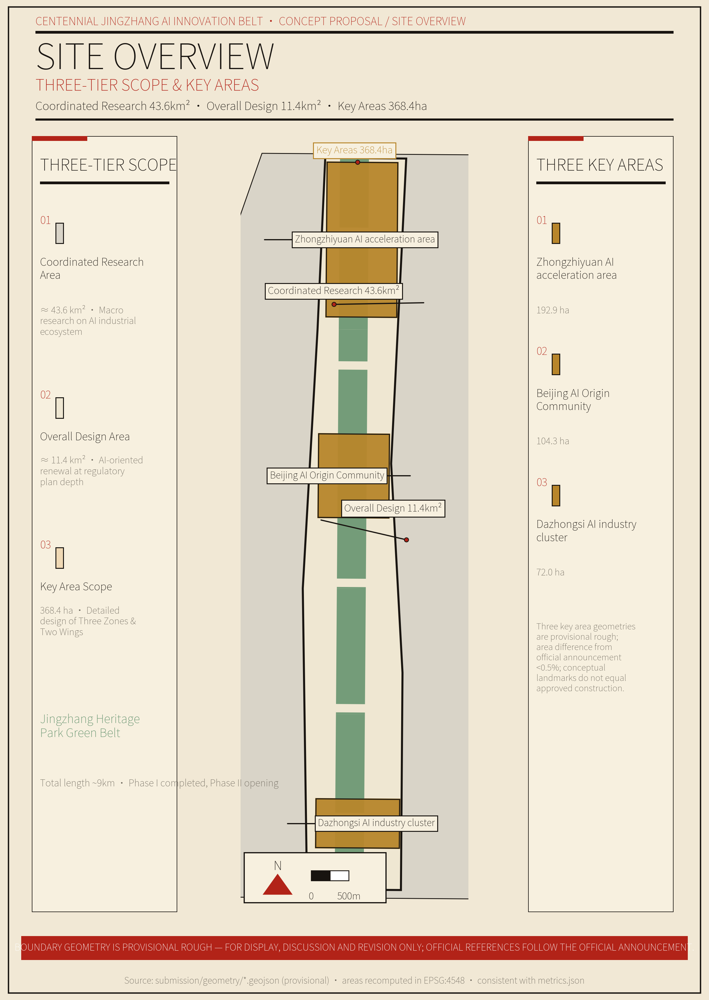
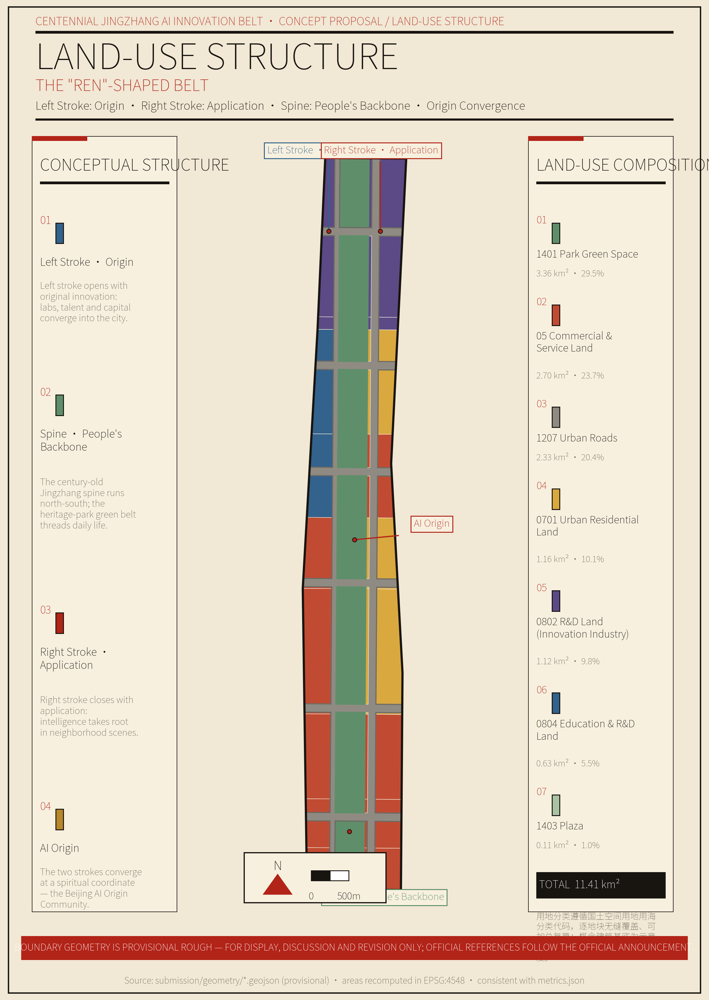
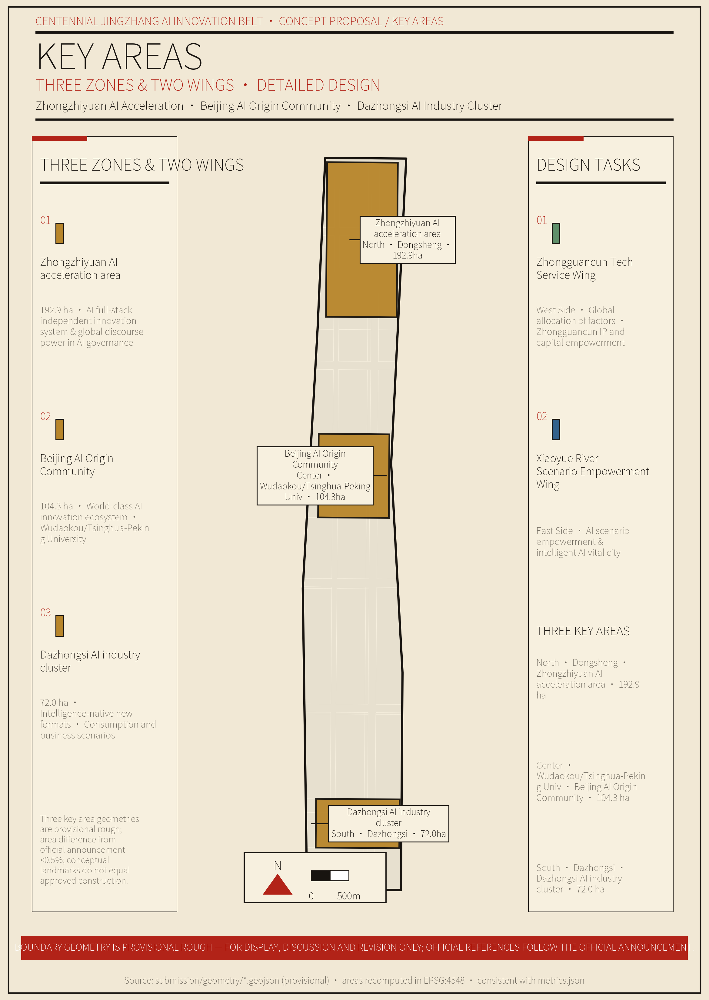
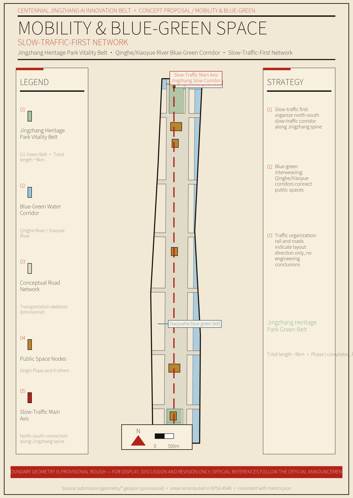
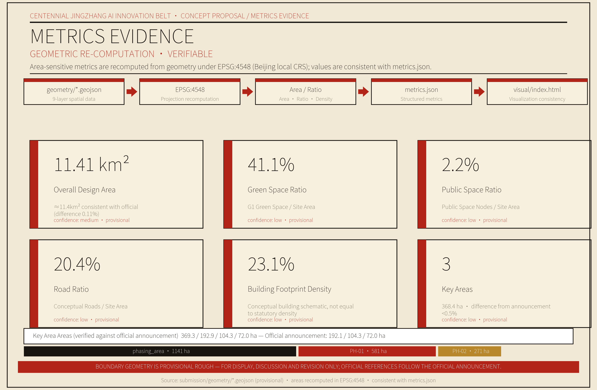

# The Ren Belt — A National Innovation Spine Designed for "People"

> This proposal implements the *Beijing–Tianjin–Hebei Coordinated Development Plan Outline*, aligns with the *Beijing Master Plan (2016–2035)*, and carries out the *Haidian District 15th Five-Year Plan Outline*. Anchoring the goal of building a world-leading science and technology park and a global artificial-intelligence industry hub, it uses the Centennial Jingzhang AI Innovation Belt as the spatial vehicle to explore a national innovation spine "designed for people."

---

## Chapter 1 Design Basis and Materials Inventory

Every judgment in this proposal rests solely on public, rights-cleared, and traceable materials. Where official data are lacking, we say so plainly and mark the item as pending; concepts are never passed off as facts.

This proposal relies on three categories of materials. First, the *Prequalification Announcement of the International Solicitation for the Urban Design of the Centennial Jingzhang AI Innovation Belt* (Haidian Branch, Beijing Municipal Commission of Planning and Natural Resources, May 9, 2026), which establishes the project name, organizers, design scope, design tasks, and submission depth [source:OFFICIAL-ANNOUNCEMENT-20260509]. Second, the *Excerpt of the Taskbook for the Worldwide Agent-Based "Centennial Jingzhang AI Innovation Belt Urban Design Open Solicitation"* (May 18, 2026), which establishes the three positioning, the five functions, the three zones and two wings, the six agent-facing tasks, and the boundary clauses [source:AGENT-TASKBOOK-20260518]. Third, professional standards including the *Urban Design Administrative Measures*, the *Regulations on the Compilation and Approval of Detailed Control Plans for Cities and Towns*, and the *Guide for Land and Sea Use Classification in Territorial Survey, Planning, and Use Control* [standard:MOHURD-URBAN-DESIGN-MEASURES] [standard:MOHURD-CONTROL-DETAILED-PLANNING] [standard:MNR-LAND-USE-CLASSIFICATION-GUIDE].

On data, we rely on the Haidian District Statistical Bulletin on National Economic and Social Development, publicly available materials on the Jingzhang Railway Heritage Park, and public media reports [source:HAIDIAN-BASIC-2025] [source:JINGZHANG-RAILWAY] [source:HAIDIAN-AI-INDUSTRY], all registered in `sources.json` under four tiers — formal-ready, background_only, provisional_only, and no; the national-strategy and industry-ecosystem framing is documented separately [source:NATIONAL-STRATEGIC-PROJECTS].

This proposal faces three categories of material gaps, handled as follows. **First, no official precise boundaries.** The exact boundary polygons of the three tiers and the three key areas have not been released. This proposal therefore uses repository-maintained provisional rough polygons, marked `geometry_role="provisional_constraint"`, `official_boundary=false`, `boundary_precision="provisional_rough"`, used only for generation, self-check, and visualization, never as official red lines or precise-area claims. Once official polygons are released, all area-sensitive metrics must be recomputed in EPSG:4548 [source:PROVISIONAL-BOUNDARIES-20260605]. **Second, no control-plan conditions.** Statutory controls such as floor-area ratio, building height, and building intensity lack official control plans, existing-building data, ownership, or engineering conditions, and are uniformly recorded `status=unknown`. Conceptual massing or design quantities recomputed from geometry may be retained, but they are marked as concept suggestions and low-confidence design quantities, not statutory control values [standard:MOHURD-CONTROL-DETAILED-PLANNING]. **Third, engineering conditions pending.** Municipal networks, energy loads, municipal capacity, and rail and road engineering conditions are marked "pending formal data" in the relevant chapters.

After key judgments, the main text uses verifiable citation markers (`[source:…]`, `[standard:…]`, `[depth:…]`, `[data:…]`, `[metric:…]`); sentences remain complete and readable once the markers are removed. All spatial recommendations in this proposal are concept suggestions, reference options, or directions open for professional teams to deepen; they do not substitute for formal planning and do not constitute government-approval conclusions [source:AGENT-TASKBOOK-20260518].

---

## Chapter 2 Three-Tier Scope: Working Framework

Three tiers, three depths, three levels of responsibility. The coordinated-research tier sets direction, the overall-design tier sets structure, and the key-area tier sets scenarios; each tier promises only what it can decide, and cross-tier leaps are prohibited [depth:overall_spatial_structure].

The **coordinated research scope** covers approximately 43.6 km². Its goal is to build a world-class AI innovation ecosystem, explore an artificial-intelligence-driven future-city form, and establish the "Ren" overall concept; it is compiled at special-planning depth, with qualitative strategy, macro data, spatial structure, and regional synergy as its main deliverables [source:OFFICIAL-ANNOUNCEMENT-20260509]. The **overall design scope** covers approximately 11.4 km². AI-oriented and driven by urban regeneration, it forms an urban design at detailed-control-plan depth, with land-use layout, guiding indicators, and three categories of facilities as its main deliverables. The **key-area detailed design** covers approximately 368.4 hectares, carrying out refined design for the three key areas — Zhongzhiyuan, Beijing AI Origin Community, and Dazhongsi — with scenarios, public space, urban character, and a concept-project list as its main deliverables [source:AGENT-TASKBOOK-20260518].

The three tiers unfold from north to south along the main spine of the Jingzhang Railway Heritage Park, with industrial strategy, overall urban design, and key-area detailed design implemented level by level. The boundary polygons of the three tiers and the three key areas are drawn from the repository's provisional geometry — rectangles or rough polygons — used only as a basis for generation and display. Once official polygons arrive, the site area, land-use breakdown, green and public-space ratios, and key-area areas must be recomputed [source:PROVISIONAL-BOUNDARIES-20260605] [metric:site_area].

---

## Chapter 3 Coordinated Research Scope: Industry and Future-City Research

The Belt is designed as a "Ren" (人) — a national innovation spine designed for people. **Strategy-led, livelihood-supported**: the foundation stone of the national long-term strategy is the main line; the carrier of people's better lives is the base.

### (1) Establishing the "Ren" Overall Concept

In 1909, Zhan Tianyou's "Ren"-shaped switchback carried China's first independently designed and built trunk railway over Badaling [source:JINGZHANG-RAILWAY]. Today, the same "Ren" must carry the national innovation system over the steep slope from being "big" to being "strong."

This concept arises from four progressive layers of historical and present-day logic. **Origin, 1909**: a "Ren" climbed the mountain — the starting point of national self-strengthening. **Continuation, the century-long slope**: Haidian is already a national strategic emerging-technology highland, and the new slope is the bottleneck from "big" to "strong" — original innovation, critical core technology, industrial transformation, and global voice. **Transformation, translate rather than copy**: we do not copy the shape of the "Ren" but translate its spirit — talent at the core, people as the root; all physical actions are stock regeneration, not newly built landmarks. **Convergence, converging on "people"**: the end point of strategy is still people — enabling better lives and making talent willing to put down roots; the human wisdom converging here is also using science and technology to lead human progress and the intelligent development of civilization.

Why this design? Because Haidian itself is a national strategic emerging-technology highland. In 2025, Haidian's GDP reached RMB 1,369.14 billion; it hosts 92 national key laboratories (17.9% of the national total) and 692 CAS and CAE academicians (36.23% of the national total) [source:HAIDIAN-BASIC-2025]. The proposal's ambition cannot stop at improving one urban district; it must become a load-bearing foundation stone in the national innovation system. At the same time, no strategic highland can stand on land where people cannot settle — the 9 km heritage park links approximately 70 communities and serves roughly 450,000 residents, and the improvement of people's lives is precisely the base that supports the main line [source:JINGZHANG-RAILWAY]. What converges here is not only China's innovators but the wisdom of humanity; the "Ren" thereby points to leading human progress and the intelligent development of civilization through scientific and technological innovation, echoing the goals of a global AI industry hub and pilgrimage site [source:AGENT-TASKBOOK-20260518].

### (2) Building the Naming System and Visual Identity

The main name is the Ren Belt (People's Curve), with the full name reading "Centennial Jingzhang AI Innovation Belt — the Ren Belt." The naming logic is threefold: the glyph is globally readable and centers on people; the glyph originates from the historical gene of Jingzhang's independent innovation, translated rather than copied; and the spatial landing is the natural form of the 9 km heritage-park spine. The visual identity takes an open curve modeled on the "Ren"-shaped switchback as the Logo direction, with the convergence point focused on the Wudaokou AI Origin Community; the wayfinding, signage, symbol system, and the Belt's overall Logo are designed as one, without confusion (see Chapter 9) [source:AGENT-TASKBOOK-20260518] [source:JINGZHANG-RAILWAY].

### (3) Implementing the Synergy of the Three Positioning

The three positioning are not three parallel belts but three functional layers of the same innovation belt. The Centennial Jingzhang cultural belt carries the spiritual layer, using the 9 km Jingzhang heritage park as its vertical spine to transmit the spirit of independent innovation; the AI-integrated innovation belt carries the dynamic layer, with the left stroke for origination and the right stroke for application, forming a closed loop from origination to transformation; the urban AI life-experience belt carries the perception layer, using the convergence point as its origin so that innovation benefits residents along the corridor. The three layers support one another and jointly correspond to the official three positioning [source:AGENT-TASKBOOK-20260518].

### (4) Optimizing the Three Zones and Two Wings Layout

The three zones and two wings are embedded in the "Ren" structure. Zhongzhiyuan, in the north, inherits the left stroke and the northern end of the vertical spine, undertaking the function of an AI full-stack independent innovation system and global voice in AI governance; the AI Origin Community, in the middle, is the convergence point itself, undertaking the function of a world-class AI innovation ecosystem; Dazhongsi, in the south, inherits the southern end of the right stroke, undertaking AI-native new business forms; the Zhongguancun Tech-service Wing, in the west, inherits the left stroke, undertaking global factor allocation and the empowerment of Zhongguancun IP and capital; the Xiaoyue River Scenario Wing, in the east, inherits the eastern edge of the vertical spine, undertaking AI scenario enablement and a smart, vibrant AI city [source:AGENT-TASKBOOK-20260518].

The three zones and two wings form a synergistic loop of origination, transformation, empowerment, and feedback: the left stroke originates, supported by university research space; the right stroke transforms, relying on Dazhongsi and Dongsheng industrialization; the two wings empower, providing services and scenarios; and the convergence point feeds back, pooling talent and capital. The five functions are respectively anchored on the origination, transformation, perception, service, and governance parts of the "Ren" [source:AGENT-TASKBOOK-20260518].

### (5) Cultivating the Strategic Emerging-Technology Industry System

The official name centers on AI, so AI is retained as the name and the anchor; but Haidian's strategic emerging-technology highland spans a full spectrum. Numerous innovative enterprises exist in integrated circuits, biomedicine and health, intelligent manufacturing, quantum information, commercial aerospace, and information software, whose work matters equally. The industrial narrative uses AI as the anchor while covering the full spectrum, refusing to lock its view onto a single track.

At the coordinated-research tier, the industrial-system judgment is as follows. AI is the anchor: more than 1,900 AI enterprises (about 70% of Beijing's total), 89 registered large models (one-third of the national total), 135 AI2000 top global scholars (34% of the national total), 297 embodied-intelligence enterprises, and 22 humanoid-robot integrator firms [source:HAIDIAN-AI-INDUSTRY]. Strategic emerging industries — integrated circuits, biomedicine and health, quantum information, commercial aerospace, intelligent connected vehicles, 6G and future communications — are laid out in parallel, completing the picture of Haidian's strategic emerging-technology highland [source:HAIDIAN-AI-INDUSTRY].

Why this design? Because Haidian, as the core area of the Zhongguancun National Innovation Demonstration Zone and the core carrier of the national S&T innovation center, bears the mission of national scientific and technological self-reliance [source:HAIDIAN-BASIC-2025] [source:NATIONAL-STRATEGIC-PROJECTS]. Industrial design must match the overall judgment that "Haidian is a national strategic emerging-technology highland." The above are all coordinated-research-tier structural judgments; specific locations and scales await overall-design and control-plan deepening; enterprise lists and investment figures are neither listed nor fabricated here [source:AGENT-TASKBOOK-20260518].

### (6) Drawing on Global Innovation-Ecosystem Experience

We draw on the general mechanisms of global innovation-district development, taking only their mechanisms without copying their forms; anything involving investment, enterprises, or specific institutions is expressed as concept suggestions and directions for deepening. Silicon Valley's experience lies in the closed loop of university origination, capital acceleration, and industry clustering, applicable to the left stroke and the Zhongguancun Tech-service Wing; Boston's Kendall Square lies in innovation neighborhoods blending universities, hospitals, enterprises, and public space, applicable to the AI Origin Community; Singapore's Jurong Innovation District lies in a government-led, unified-operation, integrated-living park model, applicable to Zhongzhiyuan; Japan's Kashiwa-no-ha lies in university-centered district regeneration that balances sustainability and livelihood scenarios, applicable to the Xiaoyue River Scenario Wing; Munich lies in synergizing traditional industry with new technology and opening test scenarios, applicable to Dazhongsi; Tel Aviv lies in an open-source ecosystem, developer communities, and global dissemination, applicable to the long-term operation system; London's King's Cross lies in activating public space through stock regeneration of a disused railway industrial zone, applicable to the vitality belt along the vertical-spine heritage park. Case characterizations are qualitative and drawn from public research; specific data await item-by-item verification and registration in `sources.json` [source:AGENT-TASKBOOK-20260518].

### (7) Envisioning the Future-City Form

The coordinated-research tier offers a conceptual hypothesis for the future-city form: the innovation belt, with the "Ren" as its main axis, is composed of three parts — innovation neighborhoods of balanced density, a continuous public spine, and an origin community that is livable and workable. AI is not only an industry but also a way the city operates; its diagnostic, simulation, and operational applications must pass the technical-fitness test (see Chapter 6). This form is a coordinated-tier hypothesis for the overall-design tier to deepen, not a statutory conclusion [depth:overall_spatial_structure].

### (8) Anchoring the "Three Science Cities + One District" and Beijing–Tianjin–Hebei Synergy

The innovation belt is not an isolated urban regeneration but a synergistic node within Beijing's "three science cities plus one district" and the Beijing–Tianjin–Hebei innovation network, a structural judgment at the coordinated-research tier. Beijing has formed an innovation pattern of Zhongguancun Science City, Huairou Science City, and the Future Science City (the "three cities") plus the Beijing Economic-Technological Development Area (the "one district"): Haidian, as the core carrier of Zhongguancun Science City, plays the hub role of original innovation and achievement transformation; Huairou Science City focuses on large scientific facilities and basic research; the Future Science City focuses on central-enterprise R&D and applied innovation; and the Economic-Technological Development Area focuses on advanced manufacturing and industrial transformation. The innovation belt should accordingly be positioned as the connecting belt between origination and transformation, rather than duplicating the same functions [source:NATIONAL-STRATEGIC-PROJECTS].

At the Beijing–Tianjin–Hebei level, Haidian is deeply integrated into the national strategy of coordinated development, relying on the Beijing–Tianjin–Hebei National Technology Innovation Center to form synergy in artificial intelligence, integrated circuits, biomedicine, commercial aerospace, and cultural tourism; carriers such as the Zhongguancun AI "Beiwei" Community provide space for industrial undertaking [source:NATIONAL-STRATEGIC-PROJECTS] [source:HAIDIAN-AI-INDUSTRY]. The innovation belt's role in this chain should be expressed as the origination and pilot-verification links of the "original-innovation origination — achievement-transformation pilot verification — Beijing–Tianjin–Hebei industrialization undertaking" chain; the specific synergy mechanisms and factor-flow directions are concept judgments at the coordinated-research tier, for professional teams to deepen, not predetermined arrangements.

---

## Chapter 4 Overall Design Scope: Urban Regeneration and Control-Plan-Depth Urban Design

The "Ren" is seated into the land-use skeleton. **The focus is stock regeneration, the key is guiding indicators, and the core is retaining, renovating, and demolishing with preservation, reuse, and upgrading as the priority.**

The overall design scope covers approximately 11.4 km². With the Jingzhang heritage park as its axis, it implements the land-use skeleton of the four strokes of the "Ren": the left stroke originates, securing university research space; the right stroke applies, arranging industrial and commercial land; the vertical spine is the public backbone, arranging green and public space; and the convergence point is composite land, integrating community, innovation, and services. The land-use layout reaches control-plan depth and is expressed through guiding indicators such as baseline intensity, baseline height, and dominant functions, without statutory planning judgments [depth:overall_spatial_structure] [data:geometry/land_use.geojson] [standard:MOHURD-CONTROL-DETAILED-PLANNING]. Why guiding indicators? Because "baseline" and "dominant" inherently carry reference and flexibility — they provide professional judgment while leaving room for later deepening, in line with common practice in Beijing control plans, and avoid passing off concept schemes as approved indicators [standard:MOHURD-URBAN-DESIGN-MEASURES].

The overall regeneration framework first establishes principles: **demolition is the last option; retention and renovation are the real key to activating aging spaces.** The corridor consists mainly of the built Jingzhang heritage park, existing universities, and existing industrial parks, and regeneration proceeds along the main line of preservation, reuse, and upgrading. First, preservation: the Jingzhang Railway Heritage Park, historical and cultural remains, and existing public space are preserved as a priority. Second, renovation: old buildings and low-efficiency industrial space are upgraded in quality and efficiency — the principal path. Third, demolition: limited to dilapidated structures, illegal construction, and low-quality space that genuinely cannot be reused; it is the last option, handled case by case, without predetermined conclusions. The retention, renovation, and demolition classification of specific parcels belongs to the key-area and implementation tiers; this tier provides only principles and guidance, and the relevant control indicators are recorded under `status=unknown` [depth:retain_renovate_demolish].

Facility support should give priority to three categories: innovation-service platforms, talent-living service facilities, and new infrastructure (computing, data, and energy at the edge, integrated), laid out in combination with conventional municipal facilities. The innovation belt is a stock-regeneration area, so facility provision focuses on infill and composite reuse, without adding land intensity [standard:MOHURD-URBAN-DESIGN-MEASURES]. Professional calculations such as municipal networks, energy loads, and municipal capacity lack control-plan conditions; they are pending confirmation and no calculation conclusions are offered.

---

## Chapter 5 Key Areas: Detailed Design

Three key areas, three landing points, jointly drawing one "Ren." Each area forms a complete mini-proposal across seven elements — positioning, spatial structure, building regeneration, mobility and slow traffic, public space, AI scenarios, and implementation risks; the two wings are guided mainly by concepts. All are concept suggestions and do not substitute for statutory planning [depth:three_key_area_detailed_design] [data:geometry/key_areas.geojson].

### (1) Zhongzhiyuan AI Independent Innovation Accelerator (North · about 192.1 ha)

**Positioning**: the origination core of an AI full-stack independent innovation system, inheriting the left stroke and the northern end of the vertical spine, landing on the existing carrier of Zhongguancun Dongsheng Science Park · Xuebeiyuan [source:NATIONAL-STRATEGIC-PROJECTS]. **Spatial structure**: taking Xuebeiyuan as the core, weaving innovation-acceleration space and living amenities on both sides to integrate park, neighborhood, and community; connecting the Qinghe blue-green belt to the north and the northern section of the heritage-park vitality belt to the south. **Building regeneration**: mainly upgrading existing industrial buildings; newly inserted space is kept at concept-level design quantities, without demolition conclusions. **Mobility and slow traffic**: strengthening pedestrian and cycling links with the northern heritage park and the Dongsheng innovation corridor, with station transfer relying on existing rail transit. **Public space**: reserving venues for public technical testing and demonstration, forming a northern vitality node with the Zhongzhiyuan plaza. **AI scenarios**: full-stack innovation scenarios for technology R&D, corresponding to A1 (data diagnosis), A2 (spatial simulation), and T1 (embodied-intelligence and robot testing) (see Chapter 6). **Implementation risk**: changing industrial-space demand and the sequencing of Xuebeiyuan's opening (expected July 2026) and their linkage with the proposal await confirmation [source:NATIONAL-STRATEGIC-PROJECTS].

### (2) Beijing AI Origin Community (Middle · about 104.3 ha)

**Positioning**: a world-class AI innovation ecosystem and the convergence point of the "Ren" itself; it builds a one-kilometer "near-campus innovation ecosystem circle" around "Tsinghua–PKU–CAS" (Tsinghua University, Peking University, and the Chinese Academy of Sciences), and was selected in January 2026 as one of Beijing's first batch of AI innovation districts [source:NATIONAL-STRATEGIC-PROJECTS]. **Spatial structure**: taking Wudaokou as the origin, weaving innovation services, public interaction, and living scenarios along the one-kilometer campus circle, practicing the "ten-minute rule" — within a ten-minute walk one can connect with AI professors, investors, and computing providers. **Building regeneration**: mainly gradual renewal of existing communities and neighborhoods, protecting the existing urban fabric and community texture, without large-scale demolition and construction. **Mobility and slow traffic**: strengthening integration of the Wudaokou rail station and slow-traffic stitching, prioritizing walking and cycling. **Public space**: providing AI public interaction and exhibition spaces around the convergence point, where the "Ren" Origin Plaza is sited (see Chapter 9 pilgrimage landmarks). **AI scenarios**: corresponding to A4 ("ten-minute rule" innovation matching), B7 (AI+education), B9 (public-space operations), and T2 (autonomous-driving shuttle pilot) (see Chapter 6). **Implementation risk**: ownership around campuses and community coordination are sensitive; renewal must follow statutory procedures and full public participation.

### (3) Dazhongsi AI Industry Cluster (South · about 72.0 ha)

**Positioning**: a cluster of AI-native new business forms, inheriting the southern end of the right stroke and focusing on agents, content consumption, and intelligent terminals [source:NATIONAL-STRATEGIC-PROJECTS]. **Spatial structure**: building on existing commercial and industrial carriers, inserting AI-native consumption and business scenarios to form a composite neighborhood of scenarios, consumption, and innovation. **Building regeneration**: mainly functional renewal and format upgrading of commercial buildings, without demolition conclusions. **Mobility and slow traffic**: connecting Dazhongsi metro station with the southern heritage park, strengthening station-area slow traffic. **Public space**: providing venues for demonstrating and experiencing AI-native new business forms, forming a southern vitality node with the Dazhongsi plaza. **AI scenarios**: corresponding to B10 (intelligent-terminal and content-consumption experiences) and T3 (controlled testing of large-model industry applications) (see Chapter 6). **Implementation risk**: commercial formats evolve rapidly, so the operation mechanism must remain flexible, with no predetermined commercial commitments.

### (4) The Two Wings: Zhongguancun Tech-service Wing and Xiaoyue River Scenario Wing

**Zhongguancun Tech-service Wing** lies in the west, inheriting the left stroke, positioned as a top-tier service platform linking global innovation subjects and factors; it encourages the agglomeration of Zhongguancun IP and capital empowerment, talent services, and innovation-factor space. **Xiaoyue River Scenario Wing** lies in the east, inheriting the eastern edge of the vertical spine, encouraging embodied intelligence, AI+healthcare, AI+film and television, and other scenarios to land, along with smart-city application pilots, undertaking test-and-verification scenarios such as T1 (embodied intelligence) and T3 (controlled testing of large models). Both wings are guided mainly by concepts, with no parcel-level conclusions [source:AGENT-TASKBOOK-20260518].

---

## Chapter 6 AI Innovation Ecosystem, Talent Profiles, and AI+ Scenarios

Scenario design starts from people, not from technology. **The core question is "whom it serves"; the bottom lines are human review as a backstop, clear privacy boundaries, and traceable operating entities.** This chapter turns the scenario requirements of the six agent tasks from a "promised quantity" into "card-by-card delivery": six personas, one anti-showcasing Fitness Record, ten scenario cards, and three industry test-and-verification scenarios, all in the voice of concept suggestions or test verification, not constituting confirmed government arrangements [source:AGENT-TASKBOOK-20260518].

### (1) Six User Personas

Six personas are divided according to people's real needs, covering the full spectrum of "innovators — workers — residents — students — visitors" of the belt. The personas are based on public population and talent structure — Haidian has a total talent pool of 2.0058 million, with more than 80% of the corridor's talent coming from the whole district [source:HAIDIAN-BASIC-2025] [source:NATIONAL-STRATEGIC-PROJECTS].

| Persona | Real needs | Main spatial landing | Corresponding scenario cards |
|---|---|---|---|
| AI scientists and R&D personnel | Laboratories, computing, exchange, origination environment | Zhongzhiyuan R&D scenarios, Origin Community interaction spaces | A1, A2, A4 |
| Tech entrepreneurs and developers | Low-cost startups, investor connections, open-source community | Origin Community, Zhongguancun Tech-service Wing, operation system | A4, B10 |
| Enterprise employees and commuters | Convenient commuting, work–life balance | Dazhongsi and Dongsheng commuting and living scenarios | A5, B10, T2 |
| Corridor residents (especially the elderly) | Convenient living, accessibility, intergenerational care | Urban AI life-experience belt, community AI services | A5, B6, B8 |
| Students and young people (incl. young migrants) | Education, housing, innovation inspiration | Education scenarios, youth apartments, public space | B7, B9 |
| Visitors and pilgrims | Cultural experience, pilgrimage, international dissemination | Heritage-park guided tours, pilgrimage landmarks | A3, B6 |

### (2) Technical-Fitness Test and Fitness Record

Six questions: **necessity** (can the problem be solved without it?), **efficiency gain** (is the improvement order-of-magnitude?), **livelihood relevance** (does it directly serve people's lives?), **data reliability** (is it verifiable and labelable?), **verifiability** (can it be audited and recomputed?), **strategic value** (does it serve the main line?). A failure on the first or sixth question means it is not used at all; other combinations are downgraded to exploration. Applications are graded: **A-grade must be used** (diagnosis, simulation, dissemination, key industry-chain analysis); **B-grade may be explored** (tours, operations, edge pilots); **C-grade is deliberately not used** (basic municipal works, conventional slow traffic, routine daily services use mature conventional solutions). Three prohibited lines: technology must not substitute for statutory judgment; false precision must not be manufactured; livelihood must not be masked by technological narrative.

Fitness Record (auditable six-question verdicts; ✓ = pass, ○ = conditional):

| Technology | Necessity | Efficiency | Livelihood | Data | Verifiable | Strategy | Grade | Disposition |
|---|---|---|---|---|---|---|---|---|
| Cross-source diagnostic analysis of urban physical examination data | ✓ | ✓ | ✓ | ✓ | ✓ | ✓ | A | Use; data must be public and traceable |
| Coupled spatial simulation of industry and population | ✓ | ✓ | ○ | ✓ | ✓ | ✓ | A | Use; mark as concept inference |
| Multilingual global dissemination and content production | ✓ | ✓ | ○ | ✓ | ✓ | ✓ | A | Use; content must be rights-cleared |
| "Ten-minute rule" innovation matching | ✓ | ✓ | ✓ | ○ | ✓ | ✓ | A | Use; anonymize personal data |
| AI-assisted government affairs and "receive-and-respond" services | ✓ | ✓ | ✓ | ✓ | ✓ | ✓ | A | Use; retain human channels |
| Heritage-park intelligent guided tours and accessibility assistance | ○ | ○ | ✓ | ✓ | ✓ | ○ | B | Explore; conventional tours in parallel |
| AI+education large-model-assisted teaching | ○ | ○ | ✓ | ○ | ✓ | ○ | B | Explore; teacher human review |
| AI+healthcare community health assistant | ○ | ○ | ✓ | ○ | ○ | ○ | B | Explore; medical conclusions human-reviewed |
| AI+public-space crowd and energy optimization | ○ | ✓ | ✓ | ✓ | ✓ | ○ | B | Explore; operations assistance only |
| Intelligent-terminal and content-consumption experiences | ○ | ○ | ✓ | ✓ | ✓ | ○ | B | Explore; avoid over-entertainment |
| Basic municipal network monitoring | ✗ | ✗ | ✓ | — | — | ○ | C | Deliberately not used; mature monitoring instead |
| Conventional slow-traffic lighting | ✗ | ✗ | ✓ | — | — | ✗ | C | Deliberately not used; conventional lighting |

The record of C-grade refusals is the auditable evidence that the proposal has "judgment" — an agent also possesses bottom-line thinking, professional discipline, and judgment that serves the people.

### (3) Ten Scenario Cards

Each card is registered by eight elements — space / subjects / operating data / privacy / human review / operator / layer / risk — and linked card by card in `compliance_matrix.json`. The following are readable summaries; all operating arrangements are concept suggestions.

**A1 Cross-source diagnostic analysis of urban physical examination data (strategy-supporting)** — Space: the whole overall-design scope. Subjects: planning, operations, and decision-making bodies. Data (concept): cross-validation of multiple public data sources. Privacy: no personally identifiable information. Human review: conclusions reviewed by professional teams. Operator: to be deepened by professional teams. Layer: `constraints.geojson`. Risk: data timeliness and caliber differences; sources and confidence must be labeled.

**A2 Coupled spatial simulation of industry and population (strategy-supporting)** — Space: the coordinated-research scope. Subjects: industry and spatial decision-making bodies. Data (concept): public industry and population data. Privacy: aggregated, anonymized. Human review: results do not substitute for statutory judgment. Operator: to be deepened by professional teams. Layer: `land_use.geojson`. Risk: model assumption bias; must be labeled as concept inference.

**A3 Multilingual global dissemination and content production (strategy-supporting)** — Space: online and corridor cultural nodes. Subjects: global innovators and the public. Data (concept): multilingual content. Privacy: no personal data. Human review: content human-reviewed. Operator: long-term operation system. Layer: `green_space.geojson` (cultural nodes). Risk: content rights clearance and inappropriate-content control.

**A4 Origin Community "ten-minute rule" innovation matching (strategy-supporting)** — Space: Wudaokou AI Origin Community. Subjects: scientists, entrepreneurs, investors. Data (concept): public innovation-subject information. Privacy: personal information anonymized. Human review: matching results autonomously connected by both parties. Operator: Origin Community operation mechanism. Layer: `key_areas.geojson` (KEY_AREA-002). Risk: data quality and matching bias.

**A5 AI-assisted government affairs and "receive-and-respond" services (strategy-supporting)** — Space: corridor government service windows. Subjects: residents and enterprises. Data (concept): public government-service data. Privacy: per government norms. Human review: human processing channels retained. Operator: government departments (concept suggestion). Layer: `public_space.geojson`. Risk: technology must not substitute for statutory judgment [standard:BARRIER-FREE-ENVIRONMENT-LAW].

**B6 Heritage-park intelligent guided tours and accessibility assistance (livelihood-service)** — Space: the 9 km Jingzhang heritage park. Subjects: visitors, residents, disabled and elderly groups. Data (concept): tour content and accessibility information. Privacy: no personally identifiable information. Human review: conventional tours and human services in parallel. Operator: heritage-park public mechanism. Layer: `green_space.geojson`. Risk: digital divide; conventional modes must run in parallel [standard:ELDERLY-SMART-TECH-PLAN-2020-45].

**B7 AI+education large-model-assisted teaching (livelihood-service)** — Space: corridor education and public space. Subjects: students, young people, teachers. Data (concept): teaching-assistance content. Privacy: no student personally identifiable information. Human review: teachers gate teaching content. Operator: educational institutions (concept suggestion). Layer: `land_use.geojson` (education land). Risk: content quality and orientation must be human-reviewed.

**B8 AI+healthcare community health assistant (livelihood-service)** — Space: corridor communities. Subjects: residents, especially the elderly. Data (concept): health education and reminders. Privacy: health-data boundaries clear and anonymized. Human review: medical conclusions always human-reviewed. Operator: community health institutions (concept suggestion). Layer: `public_space.geojson`. Risk: no diagnostic conclusions; human backstop.

**B9 AI+public-space crowd and energy optimization (livelihood-service)** — Space: heritage park and public space. Subjects: operators and the public. Data (concept): aggregated crowd and energy data. Privacy: aggregated, anonymized. Human review: operational decisions made by operators. Operator: public-space operation mechanism. Layer: `public_space.geojson`. Risk: no over-surveillance; operations assistance only.

**B10 Intelligent-terminal and content-consumption experiences (livelihood-service)** — Space: Dazhongsi AI-native new-business-form neighborhood. Subjects: consumers, enterprises. Data (concept): consumption-experience content. Privacy: no personally identifiable information. Human review: content compliance review. Operator: commercial operators (concept suggestion). Layer: `land_use.geojson` (commercial land). Risk: avoid over-entertainment and vulgarization.

### (4) Three Industry Test-and-Verification Scenarios

Test-and-verification scenarios are industry-grade, controlled, and exit-capable pilots, all marked "test verification, not approved operations" and not written as confirmed operating arrangements.

**T1 Embodied-intelligence and robot public services** — Space: Xiaoyue River Scenario Wing, Zhongzhiyuan. Subjects: R&D enterprises and public scenarios. Boundary: controlled area, public notice, exit-capable at any time. Risk: safety and ethics review first.

**T2 Autonomous-driving shuttle and delivery pilot** — Space: limited routes from Zhongzhiyuan to the Origin Community. Subjects: campus commuting and last-mile delivery. Boundary: limited routes, human supervision, closed or semi-closed testing. Risk: traffic safety and regulatory compliance.

**T3 Controlled testing of large-model industry applications (AI+law, AI+healthcare)** — Space: Zhongguancun Tech-service Wing professional scenarios. Subjects: professional service institutions. Boundary: controlled testing, conclusions human-reviewed, no substitution for professional judgment. Risk: generated-content compliance and liability boundaries.

### (5) Scenario–Space–Operation Mapping and Compliance Boundaries

Scenario-to-space-to-operation mapping is registered in `compliance_matrix.json`, verifiable card by card. Compliance boundaries: on privacy, no personally identifiable sensitive information is collected, and scenarios involving personal data define clear boundaries and are anonymized; on human review, public-service scenarios retain human-review and human-processing channels, echoing the spirit of Article 39 of the Law on the Construction of a Barrier-Free Environment [standard:BARRIER-FREE-ENVIRONMENT-LAW]; on the digital divide, conventional service modes run in parallel with intelligent services, referencing the spirit of State Council General Office Document No. 45 (2020) [standard:ELDERLY-SMART-TECH-PLAN-2020-45]. Immature technologies must not be written as ready for full deployment, and test scenarios must not be written as approved operations; all scenario operating arrangements are concept suggestions and do not constitute confirmed government arrangements [source:AGENT-TASKBOOK-20260518].

---

## Chapter 7 Land Use, Building Scale, and the Retain–Renovate–Demolish Approach

This tier provides only concept-level judgments, never statutory conclusions. **Wherever official conditions are lacking, state "pending" truthfully rather than passing off estimates as approvals.**

The land-use layout builds on the spatial structure of Chapter 4 and divides into four functional zones — origination, application, public, and composite — with conceptual land-use proportions; land-use classification semantics uniformly follow the *Guide for Land and Sea Use Classification* [standard:MNR-LAND-USE-CLASSIFICATION-GUIDE] [data:geometry/buildings.geojson]. On building scale and intensity, floor-area ratio, building height, and building intensity lack official control-plan conditions and are uniformly recorded `status=unknown`; conceptual massing or design quantities recomputed from geometry may be retained, marked as concept suggestions and low-confidence design quantities, and explicitly not equal to statutory control values [standard:MOHURD-CONTROL-DETAILED-PLANNING]. The retain–renovate–demolish classification prioritizes preservation, reuse, and upgrading: preservation targets are the heritage park, historical remains, existing public space, and university research space; renovation targets are old buildings and low-efficiency space; demolition is limited to dilapidated structures, illegal construction, and low-quality space that genuinely cannot be reused, handled case by case. The classification is a concept suggestion, to be recomputed once existing-building and ownership data are completed; it is not a predetermined conclusion [depth:retain_renovate_demolish].

---

## Chapter 8 Mobility, Rail, Municipal Infrastructure, and Public Service Facilities

Slow traffic first, rail integration, livelihood facilities. **The 9 km heritage park itself is the strongest slow-traffic spine, and walking and cycling connectivity should be strengthened along it.** [data:geometry/roads.geojson] [depth:traffic_rail_slow_parking]

Mobility is organized in three main respects. First, slow traffic first: rely on the heritage park to connect the north–south slow-traffic spine and stitch the east and west sides (the east–west stitching and north–south connectivity concept strategy is detailed in Chapter 9). Second, rail integration: rail stations such as Wudaokou and Dazhongsi strengthen TOD connections. Third, parking and non-motorized-vehicle optimization: control the fragmentation of innovation space by motor vehicles. Innovation-service platforms and talent-living services are concentrated in the service wing. On new infrastructure, computing, data, and energy are integrated at the edge, based on the current computing capacity of 3,500P and the extension of Beijing's pilot zone for a foundational data system to Haidian [source:HAIDIAN-AI-INDUSTRY]. On conventional municipal integration, professional calculations of municipal networks, energy, and capacity lack control-plan conditions; they are pending confirmation and no conclusions are offered.

---

## Chapter 9 Blue-Green Space, Public Space, and Urban Character

The vertical spine is the backbone of the "Ren" and the stock basis of every physical action in this proposal. **The focus is the vitality belt, the key is pilgrimage landmarks, and the core is the cultural-fusion narrative.**

**Shaping the heritage-park vitality belt.** The 9 km Jingzhang Railway Heritage Park (approximately 3.3 km², linking about 70 communities and serving roughly 450,000 residents; Phase 1 built, Phase 2 open) [source:JINGZHANG-RAILWAY] should be shaped as the public backbone of a century of independent-innovation spirit and as a living vitality belt for 450,000 residents, rather than a newly built landmark [data:geometry/green_space.geojson] [data:geometry/public_space.geojson].

**Building the blue-green public-space system.** With the vertical-spine heritage park as the main axis, the Qinghe and Xiaoyue River blue-green spaces and community public spaces along the corridor are connected to form a continuous blue-green public-space network; walking and cycling paths, public activity spaces, and technology-testing and application-demonstration scenarios are arranged along the network. Public-space area and green ratio are important indicators whose design meaning lies in supporting talent exchange and residents' daily life [metric:public_space_ratio] [metric:green_ratio].

**Implementing east–west stitching and north–south connectivity.** Transverse stitching passages are set along the vertical spine to break the railway line's division of communities and functions on the east and west; a north–south public pedestrian system is connected along the spine, joining the north, middle, and south areas so that the "Ren" is drawn in one stroke. This strategy is a concept suggestion; specific alignments await deepening by professional teams [source:AGENT-TASKBOOK-20260518].

**Guiding the urban-character tone.** The urban tone is one of historical depth, restrained innovation, and people-friendly livability. Building character along the corridor should respect the Jingzhang historical remains and the character-control requirements of the Three Hills and Five Gardens area; roof forms, massing, skyline, and landscape nodes should be expressed through guiding guidelines, not statutory character conclusions [standard:MOHURD-URBAN-DESIGN-MEASURES]. Three strong constraints unique to Haidian — the character control of the Three Hills and Five Gardens, the protection of university research space, and Western Hills ecological protection — must not be touched by any spatial action.

**Setting pilgrimage landmarks and honorary displays.** Pilgrimage landmarks are not "AI spectacles" but spiritual anchor points that let people perceive, in real space, the journey of independent innovation and popular creation. Three pilgrimage landmarks are proposed. The "Ren" Origin Plaza, at the Wudaokou AI Origin Community, signifies the convergence of human wisdom and the origin of innovation, echoing the high-dimensional meaning; the Jingzhang "Ren" Commemoration Trail, in the heritage park, signifies the dialogue between the 1909 spirit of independent innovation and contemporary innovation; the Zhongguancun Innovation Honor Gallery, in the Zhongguancun Tech-service Wing, carries an innovation-culture honor-display system. All landmarks, wayfinding, Logo, fonts, images, figures, and enterprise marks are right-cleared and must not be over-entertained; concept landmarks must not be written as approved construction [source:AGENT-TASKBOOK-20260518].

**Building the cultural-fusion narrative.** The cultural narrative rejects nostalgia and piling-on; history is a spiritual resource, translated into innovation momentum for the present and the future. The narrative unfolds in three layers: the Jingzhang layer — the 1909 switchback is the genetic starting point of independent innovation; the Zhongguancun layer — the cradle of China's science-and-technology institutional reform since the 1980s; and the new AI-culture layer — today's strategic emerging technologies anchored by AI are writing a new "Ren." Expression carriers include wayfinding, signage, symbol systems (designed as one with the Belt's overall Logo), spatial cultural nodes, public art, and honorary displays. The narrative serves urban character and international dissemination, not as a substitute for argument [source:AGENT-TASKBOOK-20260518].

---

## Chapter 10 Renewal Project List, Implementation Policies, and Phasing

Oriented by "activating stock, infilling livelihood, and supporting innovation," **everything here is a concept suggestion and a direction for deepening, involving no investment calculations, no settled sequencing, and no approval judgments.** [depth:renewal_project_list] [data:geometry/phasing.geojson]

The renewal project list is expressed in three elements: the concept project, its renewal unit, and the statutory-document direction it can enter. Heritage-park vitality-belt infill: renewal unit along the vertical spine, which may enter urban-renewal implementation plans and special plans. Origin-Community gradual renewal: renewal unit of Wudaokou Community, which may enter district control-plan deepening and urban-renewal implementation plans. Dazhongsi format renewal: renewal unit of the Dazhongsi area, which may enter area planning and urban-renewal implementation plans. Xuebeiyuan innovation-acceleration completion: renewal unit of the Dongsheng area, which may enter industrial-park renewal and control-plan deepening. Service-wing factor-platform agglomeration: renewal unit of the Zhongguancun area, which may enter comprehensive implementation plans.

On long-term operation, the innovation belt is the **long-term operation of a national strategic asset**, and the operation mechanism precedes facility construction. Four types of mechanisms are proposed: an annual-activity system, an annual activity matrix led by the Zhongguancun Forum; developer-community operation, regularized operation of an open-source ecosystem plus a developer community; scenario-open operation, opening AI scenarios and public-experience routes; and international dissemination and investment attraction, a global channel for spreading innovation outcomes and attracting investment and talent. The landing points of the mechanisms are the convergence-point operation mechanism, the heritage-park public mechanism, and a global innovation-activity system, echoing the goals of a global AI industry hub and pilgrimage site. All activities, investment attraction, funds, policies, and operating arrangements are concept suggestions and directions for deepening, and must not be expressed as confirmed government arrangements [source:AGENT-TASKBOOK-20260518].

---

## Chapter 11 Indicators, Area Recalculation, and Compliance Matrices

Indicators serve the goal of "designing for people," and **every indicator explains its design meaning, not just a number.**

The green and public-space ratios are recomputed from `geometry/green_space.geojson` and `geometry/public_space.geojson`; their design meaning lies in the material basis supporting talent exchange and residents' daily life [metric:green_ratio]. Slow-traffic connectivity is computed from `geometry/roads.geojson`; its design meaning lies in the continuity of the vertical spine, which bears on the daily living quality of 450,000 residents. Key-area areas are computed from `geometry/key_areas.geojson` and checked against official values, reflecting the spatial capacity of the three zones [metric:key_area_area]. The number of renewal projects is computed from `geometry/phasing.geojson`, reflecting the concrete levers of stock activation. Innovation-factor density cites public data, reflecting the agglomeration of talent, enterprises, and platforms. The number of AI-scenario nodes is registered in `compliance_matrix.json`, reflecting the perceivability of scenarios.

All areas are recomputed from geometry in EPSG:4548; indicators of provisional origin are marked confidence=low with the note "computed from the repository's provisional rough boundary, not for official area claims," and are recomputed once official polygons arrive [source:PROVISIONAL-BOUNDARIES-20260605]. On compliance matrices, `compliance_matrix.json` covers the announcement and the six tasks, `standard_matrix.json` covers professional standards, and `design_depth_matrix.json` covers design depth; the three matrices are registered item by item along with the main text, and the main text does not duplicate the full indexes [depth:metrics_recalculation].

---

## Chapter 12 Risk, Copyright, and Compliance

Risks are truthfully disclosed and compliance boundaries are made explicit — **no exaggeration, no concealment, no overstepping.**

On risk and pending materials, official boundary polygons, control-plan conditions, existing buildings and ownership, municipal capacity, and engineering conditions are absent; the related indicators are recorded `status=unknown` and are to be recomputed once formal conditions are completed [depth:risk_missing_data]; public participation and statutory approval processes are preconditions for implementation. On copyright and compliance, all cited and generated content is registered in `report/copyright_statement.md`; no non-public data, personal privacy, or un-cleared trademarks, fonts, images, or portraits are used, and concept landmarks and test scenarios are not written as approved construction or approved operations. On AI-generation responsibility, this proposal was generated by agents; the generation method and sources are disclosed in `manifest.json`, `agent.json`, and `sources.json` (charter.6), and humans and professional teams remain the final judges (charter.7) [source:AGENT-TASKBOOK-20260518]. Overall statement: this proposal is an open co-creation suggestion that does not substitute for formal planning and does not constitute a government-approval conclusion.

---

## Chapter 13 References

1. Prequalification Announcement of the International Solicitation for the Urban Design of the Centennial Jingzhang AI Innovation Belt (Haidian Branch, Beijing Municipal Commission of Planning and Natural Resources, May 9, 2026)
2. Excerpt of the Taskbook for the Worldwide Agent-Based "Centennial Jingzhang AI Innovation Belt Urban Design Open Solicitation" (May 18, 2026)
3. Urban Design Administrative Measures (Ministry of Housing and Urban-Rural Development, 2017)
4. Regulations on the Compilation and Approval of Detailed Control Plans for Cities and Towns (MOHURD)
5. Guide for Land and Sea Use Classification in Territorial Survey, Planning, and Use Control (Ministry of Natural Resources, 2023)
6. Interim Measures for the Administration of Generative Artificial-Intelligence Services (Cyberspace Administration of China and six other departments, 2023)
7. Law of the People's Republic of China on the Construction of a Barrier-Free Environment (Standing Committee of the National People's Congress, 2023)
8. Implementation Plan of the General Office of the State Council on Effectively Solving the Difficulties of the Elderly in Using Smart Technologies (Guobanfa No. 45 (2020))
9. Haidian District Statistical Bulletin on National Economic and Social Development (2025)
10. Haidian District AI Industry and S&T Innovation Data (compiled from public reports of Beijing News, Zhongguancun Science City Administrative Committee, and others)
11. National Strategic Projects and Centennial Jingzhang AI Innovation Belt Data (compiled from public reports of People's Daily Online, Beijing Daily, Xinhua News Agency, and others)
12. Publicly available materials on the Jingzhang Railway Heritage Park (planning interpretations of the Beijing Municipal Commission of Planning and Natural Resources, Capital Civilization Net, Guangming Online, and others)

> The complete machine-readable index is governed by `sources.json` and the three matrix files; this list only covers the principal materials that affect the proposal's judgments [source:SITE-PACKAGE].
