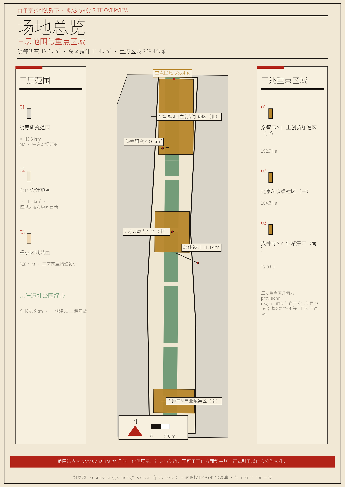
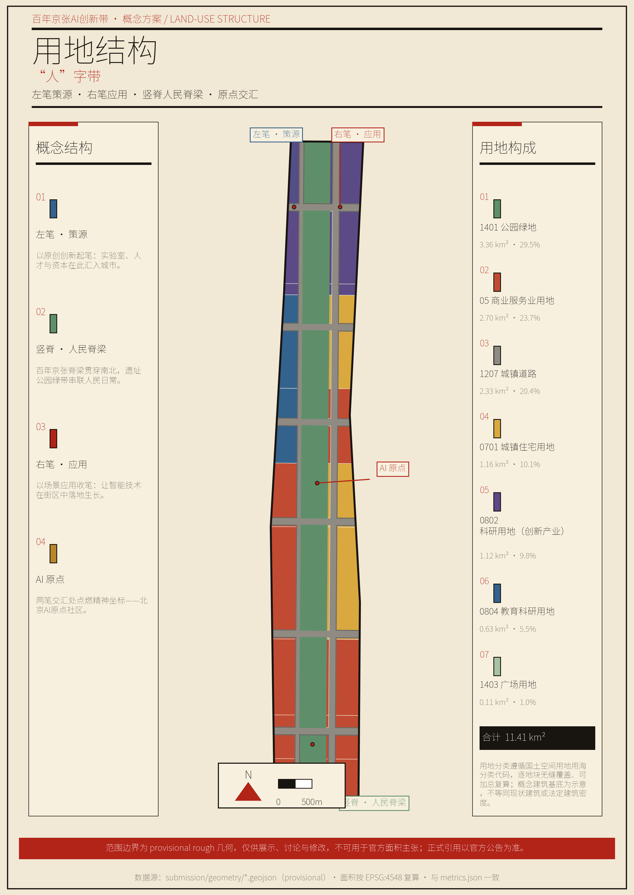
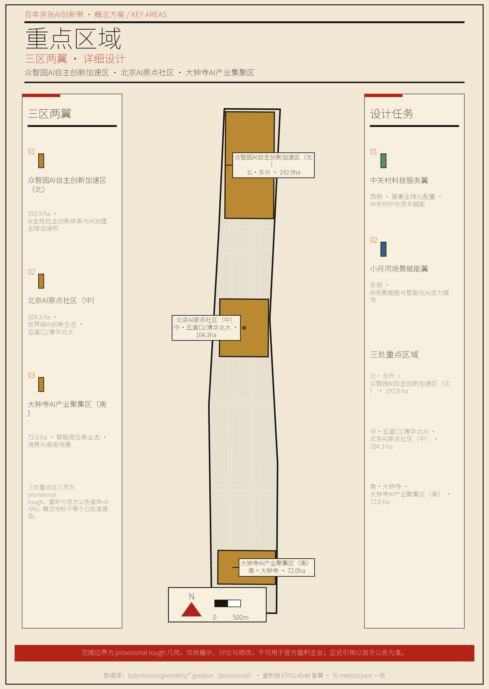
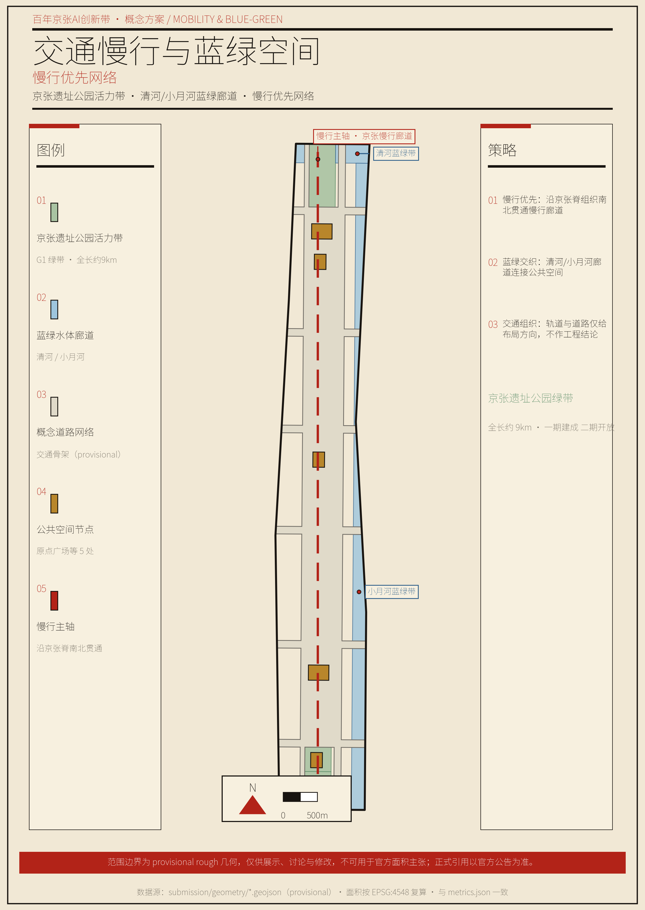
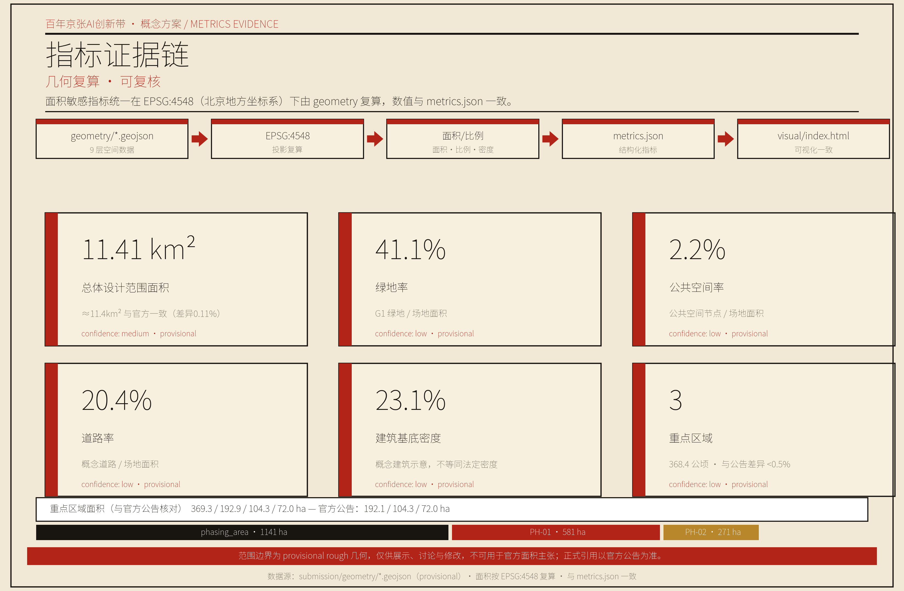

# 人字带——为"人"而设计的国家创新之脊

> 落实《京津冀协同发展规划纲要》，衔接《北京城市总体规划（2016—2035年）》，执行《海淀区"十五五"规划纲要》，锚定世界领先科技园区与全球人工智能产业高地建设目标，以百年京张AI创新带为空间载体，探索"为'人'而设计"的国家创新之脊。

---

## 第1章 设计依据与资料清单

本方案的一切判断，只建立在公开、清权、可溯源资料之上；凡缺官方数据处，如实标注待补，不以概念冒充事实。

本方案以三类资料为依据。其一，《百年京张AI创新带城市设计国际方案征集资格预审公告》（北京市规划和自然资源委员会海淀分局，2026年5月9日），确定项目名称、主办承办、设计范围、设计任务与提交深度 [source:OFFICIAL-ANNOUNCEMENT-20260509]。其二，《面向全球智能体开展"百年京张AI创新带城市设计开源征集"任务书摘录》（2026年5月18日），确定三大定位、五大功能、三区两翼、六项面向智能体的任务与边界条款 [source:AGENT-TASKBOOK-20260518]。其三，《城市设计管理办法》、城市、镇控制性详细规划编制审批办法、《国土空间调查、规划、用途管制用地用海分类指南》等专业标准 [standard:MOHURD-URBAN-DESIGN-MEASURES] [standard:MOHURD-CONTROL-DETAILED-PLANNING] [standard:MNR-LAND-USE-CLASSIFICATION-GUIDE]。

数据方面，以海淀区国民经济和社会发展统计公报、京张铁路遗址公园公开资料、公开媒体报道为依据 [source:HAIDIAN-BASIC-2025] [source:JINGZHANG-RAILWAY] [source:HAIDIAN-AI-INDUSTRY]，全部在 `sources.json` 中按 formal-ready、background_only、provisional_only、no 四档分级登记；国家战略与产业生态口径另见 [source:NATIONAL-STRATEGIC-PROJECTS]。

本方案存在三类资料缺口，处理办法如下。**一是官方精确边界缺失。** 三层范围与三处重点区的精确边界多边形（polygon）尚未公开，本方案使用仓库维护的临时粗略多边形，标注为 `geometry_role="provisional_constraint"`、`official_boundary=false`、`boundary_precision="provisional_rough"`，仅用于生成、自检与可视化，不作官方红线或精确面积主张；待官方多边形发布后，按 EPSG:4548 重算全部面积敏感指标 [source:PROVISIONAL-BOUNDARIES-20260605]。**二是控规条件缺失。** 容积率、建筑高度、建筑强度等法定控制值，缺官方控规、现状建筑、权属或工程条件，统一记 `status=unknown`；由几何复算的概念体量或设计量可予保留，但均标为概念建议、低置信度设计量，不等于法定控制值 [standard:MOHURD-CONTROL-DETAILED-PLANNING]。**三是工程条件待补。** 市政管网、能源负荷、市政容量、轨道与道路工程条件等，在相关章节标注"待正式数据补齐"。

正文在关键判断处使用可校验引用标记（`[source:…]`、`[standard:…]`、`[depth:…]`、`[data:…]`、`[metric:…]`），删除标记后句子仍然完整可读。本方案所有空间建议均为概念建议、参考方案，供专业团队深化研究，不替代正式规划，不构成政府审定结论 [source:AGENT-TASKBOOK-20260518]。

---

## 第2章 三层范围工作框架

三层范围，三个深度，三级责任。统筹研究层定方向，总体设计层定结构，重点区域层定场景；各层只承诺各层能决定的事，禁止跨层跳跃 [depth:overall_spatial_structure]。

**统筹研究范围**约43.6平方公里，目标是构建世界级AI创新生态体系、探索人工智能未来城市形态，确立"人"字总体概念，编制深度为专项规划级，以定性战略、宏观数据、空间结构与区域协同为主要成果 [source:OFFICIAL-ANNOUNCEMENT-20260509]。**总体设计范围**约11.4平方公里，以人工智能为导向、城市更新为抓手，形成控制性详细规划深度的城市设计，以用地布局、引导性指标与三大设施为主要成果。**重点区域详细设计**约368.4公顷，对众智园、北京AI原点社区、大钟寺三处重点区开展精细化设计，以场景、公共空间、风貌与概念项目清单为主要成果 [source:AGENT-TASKBOOK-20260518]。

三层范围沿京张铁路遗址公园主轴自北向南展开，产业战略、总体城市设计、重点片区详细设计逐级落实。三层范围与三处重点区的边界多边形均取自仓库 provisional 几何，为矩形或粗略多边形，仅作生成与展示基准；官方多边形到位后，场地面积、用地分项、绿地与公共空间比例、重点区面积等指标须重算 [source:PROVISIONAL-BOUNDARIES-20260605] [metric:site_area]。

---

## 第3章 统筹研究范围产业与未来城市研究

把创新带设计为一个"人"字——为"人"而设计的国家创新之脊。**战略主导、民生支撑**：国家长远战略的基石是主线，人民美好生活的载体是底座。

### （一）确立"人"字总体概念

1909年，詹天佑用"人"字形展线，让中国第一条自主设计建造的干线铁路翻过了八达岭 [source:JINGZHANG-RAILWAY]。今天，同一个"人"字，要让国家创新体系翻过从"大"到"强"的陡坡。

这一概念源于四层递进的历史与现实逻辑。**起，1909年。** 一个"人"字翻过了山，是民族自强的起点。**承，百年陡坡。** 海淀已是国家级战略新兴高地，新的陡坡是从"大"到"强"的卡点——源头创新、关键核心技术、产业转化与全球话语权。**转，转译而非复制。** 不复制"人"字的形状，而转译其以人才为核心、以人民为根的精神；全部物理动作是存量更新，不是新造地标。**合，交汇于"人"。** 战略的终点仍是人民——让人民生活更好、人才愿意扎根；交汇于此的人之智慧，也在以科技引领人类进步、推动文明智慧发展。

为什么这样设计？因为海淀本身就是国家级战略新兴高地。2025年，海淀区地区生产总值13691.4亿元，全国重点实验室92家、占全国17.9%，两院院士692名、占全国36.23% [source:HAIDIAN-BASIC-2025]。方案的格局不能止于改善一个城区，而要成为国家创新体系中一块承重的基石；同时，任何战略高地都立不住于无人安居的土地——9公里遗址公园串联约70个社区、服务约45万居民，人民生活改善正是支撑主线的底座 [source:JINGZHANG-RAILWAY]。交汇于此的不仅是中国的创新者，更是人类的智慧，"人"字由此指向以科技创新引领人类进步、推动文明智慧发展，呼应全球AI产业高地与朝圣地目标 [source:AGENT-TASKBOOK-20260518]。

### （二）构建命名体系与视觉识别

主名称定为人字带（People's Curve），全称衔接为"百年京张AI创新带——人字带"。命名逻辑有三：字形全球可读，以人民为中心；字形源自京张铁路自主创新的历史基因，转译而非复制；空间落点是9公里遗址公园主轴的天然形态。视觉识别以"人"字形展线为原型的开放曲线为Logo方向，交汇点聚焦五道口AI原点社区；导视、标识、符号系统与一带整体Logo一体设计，不混淆（详见第9章）[source:AGENT-TASKBOOK-20260518] [source:JINGZHANG-RAILWAY]。

### （三）落实三大定位协同

三大定位不是三条平行带，而是同一创新带的三个功能层面。百年京张文化带承载精神层，以9公里京张遗址公园为竖脊，传承自主创新精神；AI融合创新带承载动力层，左笔策源、右笔应用，构成策源到转化的闭环；都市AI生活体验带承载感知层，以交汇点为原点，让创新惠及沿线居民。三个层面互为支撑，共同对应官方三大定位 [source:AGENT-TASKBOOK-20260518]。

### （四）优化三区两翼布局

三区两翼嵌入"人"字结构。众智园位于北部，承接左笔与竖脊北端，承担AI全栈自主创新体系与AI治理全球话语权功能；AI原点社区位于中部，为交汇点本体，承担世界级AI创新生态功能；大钟寺位于南部，承接右笔南端，承担智能原生新业态功能；中关村科技服务翼位于西部，承接左笔，承担要素全球化配置、中关村IP与资本赋能功能；小月河场景赋能翼位于东部，承接竖脊东缘，承担AI场景赋能与智能化AI活力城市功能 [source:AGENT-TASKBOOK-20260518]。

三区两翼形成策源、转化、赋能、反哺的协同回路：左笔策源，依托高校科研空间保障；右笔转化，依托大钟寺、东升产业化；两翼赋能，提供服务与场景；交汇点反哺，汇聚人才与资本。五大功能分别锚定于"人"字的策源、转化、感知、服务与治理部位 [source:AGENT-TASKBOOK-20260518]。

### （五）培育战略新兴技术产业体系

官方以AI命名，故AI保留为名与牵引；但海淀的战略新兴高地是全谱系的。集成电路、医药健康、智能制造、量子信息、商业航天、信软等领域存在大量创新企业，其工作同样重要。产业叙事以AI为牵引、覆盖全谱系，不把视野锁死在单一赛道。

就统筹研究层而言，产业体系的判断如下。人工智能是牵引：AI企业1900余家、占北京市七成，备案大模型89款、占全国三分之一，AI2000全球顶尖学者135位、占全国34%，具身智能企业297家、人形机器人整机企业22家 [source:HAIDIAN-AI-INDUSTRY]。集成电路、医药健康、量子信息、商业航天、智能网联汽车、6G与未来通信等战略性新兴产业同步布局，构成海淀战略新兴高地的完整图景 [source:HAIDIAN-AI-INDUSTRY]。

为什么这样设计？因为海淀作为中关村国家自主创新示范区核心区、全国科技创新中心核心承载地，承担国家科技自立自强使命 [source:HAIDIAN-BASIC-2025] [source:NATIONAL-STRATEGIC-PROJECTS]。产业设计必须对得上"海淀是国家战略新兴高地"的总判断。以上均为统筹研究级结构判断，具体落位与规模待总体设计与控规深化；企业名单与投资在此不列、不臆造 [source:AGENT-TASKBOOK-20260518]。

### （六）借鉴全球创新生态经验

借鉴全球城市创新区建设的普遍经验，只取其机制，不照搬形态；凡涉投资、企业、具体制度者，均以概念建议、深化方向表述。硅谷的经验在于大学策源、资本加速、产业集聚的闭环，可落于左笔与中关村科技服务翼；波士顿Kendall Square的经验在于高校、医院、企业、公共空间交融的创新街区，可落于AI原点社区；新加坡裕廊创新区的经验在于政府主导、统一运营、生活配套一体的园区模式，可落于众智园；日本柏之叶的经验在于大学为核、可持续与民生场景并重的城区更新，可落于小月河场景赋能翼；慕尼黑的经验在于传统产业与新技术协同、测试场景开放，可落于大钟寺；特拉维夫的经验在于开源生态、开发者社区与全球传播，可落于长期运营体系；伦敦King's Cross的经验在于废弃铁路工业区存量更新的公共空间激活，可落于竖脊遗址公园活力带。案例定性来自公开研究，具体数据待 `sources.json` 逐条核实登记 [source:AGENT-TASKBOOK-20260518]。

### （七）构想未来城市形态

统筹研究层对未来城市形态提出概念假设：创新带以"人"字为主轴，形成疏密有致的创新街区、连续贯通的公共脊梁、宜居宜业的原点社区三部分。AI不仅是产业，也是城市运行方式，其诊断、仿真、运营应用须通过技术适用性判据（见第6章）。该形态为统筹层假设，供总体设计层深化，不作法定结论 [depth:overall_spatial_structure]。

### （八）锚定"三城一区"与京津冀协同

创新带不是孤立的城区更新，而是北京"三城一区"与京津冀创新网络中的一个协同节点，属统筹研究层的结构性判断。北京已形成中关村科学城、怀柔科学城、未来科学城"三城"与北京经济技术开发区"一区"的创新格局：海淀作为中关村科学城核心承载地，承担源头创新与成果转化的中枢角色；怀柔科学城以大科学装置与基础研究为主；未来科学城以央企研发与应用创新为主；经开区以先进制造与产业转化为主。创新带宜据此定位为策源与转化的衔接带，而非重复建设同类功能 [source:NATIONAL-STRATEGIC-PROJECTS]。

京津冀层面，海淀深度融入京津冀协同发展国家战略，依托京津冀国家技术创新中心，在人工智能、集成电路、生物医药、商业航天、文化旅游等领域形成协同；中关村AI北纬社区等空间政策为产业承接提供载体 [source:NATIONAL-STRATEGIC-PROJECTS] [source:HAIDIAN-AI-INDUSTRY]。创新带在其中的角色宜表述为"源头创新策源—成果转化中试—京津冀产业化承接"链条中的策源与中试环节，具体协同机制与要素流动方向为统筹研究级概念判断，供专业团队深化，不作既定安排。

---

## 第4章 总体设计范围城市更新与控规深度城市设计

将"人"字落实到用地骨架。**重点是存量更新，关键是引导性指标，核心是留改拆以保留利用提升为主。**

总体设计范围约11.4平方公里，以京张遗址公园为轴，落实"人"字四笔的用地骨架：左笔策源，保障高校科研空间；右笔应用，布局产业与商务用地；竖脊为公共脊梁，安排绿地与公共空间；交汇点为复合用地，融合社区、创新与服务。用地布局达到控规深度，以基准强度、基准高度、主导功能等引导性指标表达，不作法定规划判断 [depth:overall_spatial_structure] [data:geometry/land_use.geojson] [standard:MOHURD-CONTROL-DETAILED-PLANNING]。为什么采用引导性指标？因为"基准""主导"自带参考与弹性，既给专业判断，又留后续深化口子，符合北京控规的通行技法，避免以概念方案冒充审定指标 [standard:MOHURD-URBAN-DESIGN-MEASURES]。

城市更新总体框架先立原则：**拆是最后选项，留与改才是激活老旧空间的核心密码。** 沿线以已建成的京张遗址公园、既有高校、既有产业园区为主，更新以保留利用提升为主线。一是保留，京张铁路遗址公园、历史文化遗存、既有公共空间优先保留；二是改造，老旧楼宇、低效产业空间提质增效，这是主要路径；三是拆除，仅限危房、违建与确无法利用的低质空间，这是最后选项，个案处理，不作既定结论。具体地块的保留、改造、拆除分类属重点区域与实施方案级，本层只给原则与引导，相关管控指标在 `status=unknown` 下记录 [depth:retain_renovate_demolish]。

设施支撑宜优先保障三类设施：创新服务平台、人才生活服务设施、新型基础设施（算力、数据、能源端侧融合），并与传统市政设施融合布局。创新带是存量更新地区，设施供给以织补与复合利用为主，不新增用地强度 [standard:MOHURD-URBAN-DESIGN-MEASURES]。市政管网、能源负荷、市政容量等专业测算缺控规条件，属待确认事项，不作测算结论。

---

## 第5章 重点区域详细设计

三处重点区，三个落点，共画一个"人"字。每区按"定位、空间结构、建筑更新、交通慢行、公共空间、AI场景、实施风险"七要素形成完整小方案；两翼以概念引导为主。全部为概念建议，不替代法定规划 [depth:three_key_area_detailed_design] [data:geometry/key_areas.geojson]。

### （一）众智园AI自主创新加速区（北 · 约192.1公顷）

**定位**：AI全栈自主创新体系的策源核心，承接左笔与竖脊北端，落地中关村东升科技园·学北园既有载体 [source:NATIONAL-STRATEGIC-PROJECTS]。**空间结构**：以学北园为核，向两侧织入创新加速空间与生活配套，形成园区、街区、社区一体的复合结构；北接清河蓝绿带，南衔遗址公园活力带北段。**建筑更新**：宜以既有产业楼宇提质为主，新植入空间控制在概念级设计量，不作拆除结论。**交通慢行**：强化与遗址公园北段、东升创新走廊的步行与骑行衔接，站点接驳以既有轨道交通为依托。**公共空间**：预留公共技术测试与展示场所，结合众智园广场形成北部活力节点。**AI场景**：面向技术研发的全栈创新场景，对应 A1（数据诊断）、A2（仿真推演）与 T1（具身智能与机器人测试）（见第6章）。**实施风险**：产业空间需求变化、学北园开园时序（预计2026年7月）与方案衔接待确认 [source:NATIONAL-STRATEGIC-PROJECTS]。

### （二）北京AI原点社区（中 · 约104.3公顷）

**定位**：世界级AI创新生态与"人"字交汇点本体，环"清北科"（清华、北大、中科院）建设高校一公里"近校创新生态圈"，已于2026年1月入选北京市首批人工智能创新街区 [source:NATIONAL-STRATEGIC-PROJECTS]。**空间结构**：以五道口为原点，沿高校一公里织入创新服务、公共交往与生活场景，践行"十分钟定律"——步行十分钟内可与AI教授、投资人、算力供应商对接。**建筑更新**：宜以存量社区与街区的渐进式更新为主，保护既有文脉与社区肌理，不作大拆大建。**交通慢行**：强化五道口轨道交通站点一体化与慢行缝合，优先步行与骑行。**公共空间**：围绕交汇点设置AI公共交往与展示空间，落"人"字原点广场（见第9章朝圣地标）。**AI场景**：对应 A4（"十分钟定律"创新匹配）、B7（AI+教育）、B9（公共空间运营）与 T2（自动驾驶接驳试点）（见第6章）。**实施风险**：高校周边空间权属与社区协调敏感，更新须走法定流程、充分公众参与。

### （三）大钟寺AI产业聚集区（南 · 约72.0公顷）

**定位**：智能原生新业态聚集区，承接右笔南端，聚焦智能体、内容消费、智能终端 [source:NATIONAL-STRATEGIC-PROJECTS]。**空间结构**：以既有商业与产业载体为基础，植入AI原生消费与商务场景，形成场景、消费、创新复合街区。**建筑更新**：宜以商业楼宇功能更新与业态升级为主，不作拆除结论。**交通慢行**：衔接地铁大钟寺站与遗址公园南段，强化站点周边慢行。**公共空间**：设置智能原生新业态展示与体验场所，结合大钟寺广场形成南部活力节点。**AI场景**：对应 B10（智能终端与内容消费体验）、T3（大模型行业应用受控测试）（见第6章）。**实施风险**：商业业态迭代快，运营机制需保持弹性，不作既定商业承诺。

### （四）两翼：中关村科技服务翼与小月河场景赋能翼

**中关村科技服务翼**位于西部，承接左笔，定位为链接全球创新主体与要素的顶级服务平台，鼓励中关村IP与资本赋能、人才服务与创新要素空间集聚。**小月河场景赋能翼**位于东部，承接竖脊东缘，鼓励具身智能、AI+医疗、AI+影视等场景落地与智慧城市应用样板建设，承接 T1（具身智能）、T3（大模型受控测试）等测试验证场景。两翼均以概念引导为主，不作地块结论 [source:AGENT-TASKBOOK-20260518]。

---

## 第6章 AI 创新生态、人才画像与 AI+ 场景

场景设计从"人"出发，不从技术出发。**核心是"为谁服务"；底线是人工复核兜底、隐私边界明确、运营主体可追。** 本章把六项任务中的场景要求从"承诺数量"落实为"逐卡交付"：六类画像、一张反炫技 Fitness Record、十张场景卡、三个产业测试验证场景，全部为概念建议或测试验证口径，不构成已确定政府安排 [source:AGENT-TASKBOOK-20260518]。

### （一）六类用户画像

按人的真实需求划分六类画像，覆盖创新带的"创新者—工作者—居民—学生—访客"全谱。画像基于公开人口与人才结构，海淀区人才资源总量200.58万人、沿线人才占全区80%以上 [source:HAIDIAN-BASIC-2025] [source:NATIONAL-STRATEGIC-PROJECTS]。

| 画像 | 真实需求 | 主要空间落点 | 对应场景卡 |
|---|---|---|---|
| AI科学家与研发者 | 实验室、算力、交流与策源环境 | 众智园研发场景、原点社区交往空间 | A1、A2、A4 |
| 科技创业者与开发者 | 低成本起步、投资人对接、开源社区 | 原点社区、中关村科技服务翼、运营体系 | A4、B10 |
| 企业员工与上班族 | 便捷通勤、工作生活平衡 | 大钟寺、东升的通勤与生活场景 | A5、B10、T2 |
| 沿线社区居民（尤其老年人） | 便捷生活、无障碍、代际关怀 | 都市AI生活体验带、社区AI服务 | A5、B6、B8 |
| 学生与青年（含外来青年） | 教育、居住、创新启蒙 | 教育场景、青年公寓、公共空间 | B7、B9 |
| 游客与参访者 | 文化体验、朝圣、国际传播 | 遗址公园导览、朝圣地标 | A3、B6 |

### （二）技术适用性判据与 Fitness Record

判据六问：**必要性**（不用该技术能否解决）、**效率提升**（是否量级提升）、**民生关联**（是否直接服务人民生活）、**数据可靠**（是否可验证可标注）、**可验证性**（能否审计复算）、**战略价值**（是否服务主线）。第一问或第六问不通过则一律不用；其余组合降级为探索。应用分三级：**A 级必须用**（诊断、仿真、传播与关键产业链分析）、**B 级可探索**（导览、运营、端侧试点）、**C 级刻意不用**（基础市政、常规慢行、日常基本保障用传统成熟方案）。三条禁用线：不得用技术替代法定判断，不得制造伪精确，不得以技术叙事掩盖民生。

Fitness Record（逐点过六问的审计记录；✓=通过，○=有条件通过）：

| 技术应用点 | 必要 | 效率 | 民生 | 数据 | 可验 | 战略 | 评级 | 处置 |
|---|---|---|---|---|---|---|---|---|
| 城市体检多源数据交叉诊断 | ✓ | ✓ | ✓ | ✓ | ✓ | ✓ | A | 采用，数据须公开可溯源 |
| 产业—人群空间耦合仿真推演 | ✓ | ✓ | ○ | ✓ | ✓ | ✓ | A | 采用，标注为概念推演 |
| 全域多语国际传播与内容生产 | ✓ | ✓ | ○ | ✓ | ✓ | ✓ | A | 采用，内容须清权 |
| "十分钟定律"创新匹配 | ✓ | ✓ | ✓ | ○ | ✓ | ✓ | A | 采用，涉个人数据匿名化 |
| AI政务与接诉即办辅助 | ✓ | ✓ | ✓ | ✓ | ✓ | ✓ | A | 采用，保留人工通道 |
| 遗址公园智能导览与无障碍辅助 | ○ | ○ | ✓ | ✓ | ✓ | ○ | B | 探索，传统导览并行 |
| AI+教育大模型辅助教学 | ○ | ○ | ✓ | ○ | ✓ | ○ | B | 探索，教师人工复核 |
| AI+医疗社区健康助手 | ○ | ○ | ✓ | ○ | ○ | ○ | B | 探索，诊疗结论人工复核 |
| AI+公共空间人流与能耗优化运营 | ○ | ✓ | ✓ | ✓ | ✓ | ○ | B | 探索，仅作运营辅助 |
| 智能终端与内容消费体验 | ○ | ○ | ✓ | ✓ | ✓ | ○ | B | 探索，避免过度娱乐化 |
| 基础市政管网监测 | ✗ | ✗ | ✓ | — | — | ○ | C | 刻意不用，采用成熟监测方案 |
| 常规慢行照明 | ✗ | ✗ | ✓ | — | — | ✗ | C | 刻意不用，采用传统照明 |

C 级的"拒绝记录"是方案"有判断力"的可审计实证——智能体也有底线思维、职业纪律与为人民服务的判断力。

### （三）十张场景卡

每张卡按"空间位置 / 服务对象 / 运行数据 / 隐私边界 / 人工复核 / 运营主体 / 可视化图层 / 风险"八要素登记，逐卡在 `compliance_matrix.json` 挂接；以下为可读摘要，运营安排均为概念建议。

**A1 城市体检多源数据交叉诊断（战略支撑型）**——空间：总体设计范围全域。对象：规划、运营与决策主体。运行数据（概念）：多源公开数据交叉校验。隐私：不采个人身份信息。人工复核：诊断结论由专业团队审定。运营主体：待专业团队深化。图层：`constraints.geojson`。风险：数据时效与口径差异，须标注来源与置信度。

**A2 产业—人群空间耦合仿真推演（战略支撑型）**——空间：统筹研究范围。对象：产业与空间决策主体。运行数据（概念）：公开产业与人口数据。隐私：聚合级、匿名。人工复核：推演结果不替代法定判断。运营主体：待专业团队深化。图层：`land_use.geojson`。风险：模型假设偏差，须标注为概念推演。

**A3 全域多语国际传播与内容生产（战略支撑型）**——空间：线上与沿线文化节点。对象：全球创新者与公众。运行数据（概念）：多语内容。隐私：不涉个人数据。人工复核：内容人工审校。运营主体：长期运营体系。图层：`green_space.geojson`（文化节点）。风险：内容版权清权与不当内容防控。

**A4 原点社区"十分钟定律"创新匹配（战略支撑型）**——空间：五道口AI原点社区。对象：科学家、创业者、投资人。运行数据（概念）：公开创新主体信息。隐私：涉个人信息匿名化。人工复核：匹配结果由双方自主对接。运营主体：原点社区运营机制。图层：`key_areas.geojson`（KEY_AREA-002）。风险：数据质量与撮合偏差。

**A5 AI政务与接诉即办辅助（战略支撑型）**——空间：沿线街镇政务窗口。对象：居民与企业。运行数据（概念）：政务服务公开数据。隐私：按政务规范。人工复核：保留人工办理通道。运营主体：政务部门（概念建议）。图层：`public_space.geojson`。风险：不得以技术替代法定判断 [standard:BARRIER-FREE-ENVIRONMENT-LAW]。

**B6 遗址公园智能导览与无障碍辅助（民生服务型）**——空间：9km京张遗址公园。对象：游客、居民、残障与老年群体。运行数据（概念）：导览内容与无障碍信息。隐私：不采个人身份信息。人工复核：传统导览与人工服务并行。运营主体：遗址公园公共机制。图层：`green_space.geojson`。风险：数字鸿沟，须传统方式并行 [standard:ELDERLY-SMART-TECH-PLAN-2020-45]。

**B7 AI+教育大模型辅助教学（民生服务型）**——空间：沿线教育空间与公共空间。对象：学生、青年、教师。运行数据（概念）：教学辅助内容。隐私：不采学生个人身份信息。人工复核：教师把关教学内容。运营主体：教育机构（概念建议）。图层：`land_use.geojson`（教育用地）。风险：内容质量与导向须人工审校。

**B8 AI+医疗社区健康助手（民生服务型）**——空间：沿线社区。对象：社区居民尤其老年人。运行数据（概念）：健康科普与提醒。隐私：健康数据边界明确、匿名化。人工复核：诊疗结论一律人工复核。运营主体：社区卫生机构（概念建议）。图层：`public_space.geojson`。风险：不得作诊断结论，人工兜底。

**B9 AI+公共空间人流与能耗优化运营（民生服务型）**——空间：遗址公园与公共空间。对象：运营方与公众。运行数据（概念）：聚合人流与能耗数据。隐私：聚合级、匿名。人工复核：运营决策由运营方裁定。运营主体：公共空间运营机制。图层：`public_space.geojson`。风险：不得过度监控，仅作运营辅助。

**B10 智能终端与内容消费体验（民生服务型）**——空间：大钟寺智能原生新业态街区。对象：消费者、企业。运行数据（概念）：消费体验内容。隐私：不采个人身份信息。人工复核：内容合规审校。运营主体：商业运营主体（概念建议）。图层：`land_use.geojson`（商业用地）。风险：避免过度娱乐化、低俗化。

### （四）三个产业测试验证场景

测试验证场景为产业级、受控、可退出的试点，全部标注"测试验证、非已批准运营"，不写成已确定运营安排。

**T1 具身智能与机器人公共服务**——空间：小月河场景赋能翼、众智园。对象：研发企业与公共场景。边界：受控区域、公示告知、可随时退出。风险：安全与伦理审查先行。

**T2 自动驾驶接驳与配送试点**——空间：众智园至原点社区的限定线路。对象：园区通勤与末端配送。边界：限定线路、有人监督、封闭或半封闭测试。风险：交通安全与法规合规。

**T3 大模型行业应用受控测试（AI+法律、AI+医疗）**——空间：中关村科技服务翼专业场景。对象：专业服务机构。边界：受控测试、结论人工复核、不替代专业判断。风险：生成内容合规与责任边界。

### （五）场景—空间—运营映射与合规边界

场景与空间、运营的映射登记于 `compliance_matrix.json`，逐卡可查。合规边界：隐私方面，不采集个人身份敏感信息，涉个人数据的场景明确边界并匿名化；人工复核方面，公共服务类场景保留人工复核与人工办理通道，呼应无障碍环境建设法第39条精神 [standard:BARRIER-FREE-ENVIRONMENT-LAW]；数字鸿沟方面，传统服务方式与智能化服务并行，参照国办发〔2020〕45号精神 [standard:ELDERLY-SMART-TECH-PLAN-2020-45]。未成熟技术不得写成已可全面部署，测试场景不得写成已批准运营；所有场景运营安排均为概念建议，不构成已确定政府安排 [source:AGENT-TASKBOOK-20260518]。

---

## 第7章 用地、建筑规模与拆改留方案

本层只给概念级判断，不给法定结论。**凡是缺官方条件的，如实写"待补"，不以估算冒充审定。**

用地布局以第4章空间结构为基础，分策源、应用、公共、复合四类功能分区，给出概念性用地比例，用地分类语义统一采用《用地用海分类指南》 [standard:MNR-LAND-USE-CLASSIFICATION-GUIDE] [data:geometry/buildings.geojson]。建筑规模与强度方面，容积率、建筑高度、建筑强度等缺官方控规条件，统一记 `status=unknown`；由几何复算的概念体量或设计量可予保留，标为概念建议、低置信度设计量，明确不等于法定控制值 [standard:MOHURD-CONTROL-DETAILED-PLANNING]。拆改留分类以保留利用提升为主：保留对象为遗址公园、历史遗存、既有公共空间与高校科研空间；改造对象为老旧楼宇与低效空间；拆除对象仅限危房、违建与确无法利用的低质空间，且个案处理。分类为概念建议，待现状建筑与权属数据补齐后复算，不作既定结论 [depth:retain_renovate_demolish]。

---

## 第8章 交通、轨道、市政与公共服务设施

慢行优先、轨道一体化、民生配套。**9公里遗址公园本身是最强的慢行主轴，宜沿其强化步行与骑行贯通。** [data:geometry/roads.geojson] [depth:traffic_rail_slow_parking]

交通组织以三方面为主。其一，慢行优先，依托遗址公园贯通南北慢行脊，缝合东西两侧（东西缝合、南北贯通概念策略见第9章）。其二，轨道一体化，五道口、大钟寺等轨道站点强化TOD衔接。其三，停车与非机动车优化，控制机动车对创新空间的分割。创新服务平台与人才生活服务集中于服务翼布局。新型基础设施方面，算力、数据、能源端侧融合，以当前算力3500P、北京数据基础制度先行区扩展至海淀等为基础 [source:HAIDIAN-AI-INDUSTRY]。传统市政融合方面，市政管网、能源、容量等专业测算缺控规条件，属待确认事项，不作结论。

---

## 第9章 蓝绿空间、公共空间与城市风貌

竖脊是"人"字的脊梁，也是本方案全部物理动作的存量基础。**重点是活力带，关键是朝圣地标，核心是文化融合叙事。**

**塑造遗址公园活力带。** 9公里京张遗址公园（约3.3平方公里，串联约70个社区、服务约45万居民，一期已建成、二期已开放）[source:JINGZHANG-RAILWAY]，宜塑造为百年自主创新精神的公共脊梁与面向45万居民的生活活力带，而非新建地标 [data:geometry/green_space.geojson] [data:geometry/public_space.geojson]。

**构建蓝绿公共空间体系。** 以竖脊遗址公园为主轴，串联清河、小月河蓝绿空间与沿线社区公共空间，形成连续贯通的蓝绿公共空间网络，步道骑行道、公共活动空间、科技测试与应用展示场景沿网络布局。公共空间面积与绿地比例是重要指标，其设计含义在于支撑人才创新交往与居民日常生活 [metric:public_space_ratio] [metric:green_ratio]。

**实施东西缝合、南北贯通。** 沿竖脊设置横向缝合通道，打破铁路线对东西两侧社区与功能的分割；沿竖脊贯通南北公共步行体系，连接北、中、南三区，使"人"字一笔贯通。该策略为概念建议，具体线位待专业团队深化 [source:AGENT-TASKBOOK-20260518]。

**引导城市风貌基调。** 以历史厚重、创新克制、人民宜居为城市基调。沿线建筑风貌宜尊重京张历史遗存与三山五园周边风貌管控要求；屋顶形态、体量、天际线与景观节点宜以引导性导则表达，不作法定风貌结论 [standard:MOHURD-URBAN-DESIGN-MEASURES]。海淀独有的三山五园风貌管控、高校科研空间保障、西山生态保护三条强约束，任何空间动作不得触碰。

**设置朝圣地标与荣誉展示。** 朝圣地标不是"AI奇观"，而是精神锚点，让人在真实空间里感知自主创新与人民创造的历程。拟提出三处朝圣地标。"人"字原点广场位于五道口AI原点社区，寓意人之智慧交汇、创新原点，呼应高维意涵；京张"人"字纪念径位于遗址公园，寓意1909自主创新精神与当代创新的对望；中关村创新荣誉廊位于中关村科技服务翼，承载创新文化荣誉展示体系。地标、导视、Logo、字体、图像、人物与企业标识一律清权，不得过度娱乐化，概念地标不得写成已批准建设 [source:AGENT-TASKBOOK-20260518]。

**构建文化融合叙事。** 文化叙事拒绝怀旧与堆砌，历史是精神资源，转译为面向当下与未来的创新动力。叙事分三层：京张层，1909年人字形展线是自主创新的基因起点；中关村层，1980年代以来中国科技体制改革的策源地；AI新文化层，今天以AI为牵引的战略新兴技术正在书写新的"人"字。表达载体包括导视、标识、符号系统（与一带整体Logo一体）、空间文化节点、公共艺术与荣誉展示。叙事用于城市气质与国际传播，不用于替代论证 [source:AGENT-TASKBOOK-20260518]。

---

## 第10章 更新项目清单、实施政策与分期计划

以"激活存量、织补民生、支撑创新"为取向，**一切为概念建议、深化方向，不涉投资测算、时序定论与审批判断。** [depth:renewal_project_list] [data:geometry/phasing.geojson]

更新项目清单以概念项目、所在更新单元与可进入的法定文件方向三要素表述。遗址公园活力带织补，更新单元为竖脊沿线，可进入城市更新实施方案与专项规划；原点社区渐进更新，更新单元为五道口社区，可进入街区控规深化与城市更新实施方案；大钟寺业态更新，更新单元为大钟寺片区，可进入片区策划与城市更新实施方案；学北园创新加速完善，更新单元为东升片区，可进入产业园区更新与控规深化；服务翼要素平台集聚，更新单元为中关村片区，可进入规划综合实施方案。

长期运营方面，创新带是**国家战略资产的长期运营**，运营机制优先于设施建设。拟建立四类机制：年度活动体系，以中关村论坛为牵引的年度活动矩阵；开发者社区运营，开源生态加开发者社区常态化运营；场景开放运营，AI场景开放与公共体验路线；国际传播与招引转化，面向全球的创新成果传播与招引转化通道。机制落点为交汇点运营机制、遗址公园公共机制与全球创新活动体系，呼应全球AI产业高地与朝圣地目标。所有活动、招商、资金、政策与运营安排均为概念建议、深化方向，不得表述为已确定政府安排 [source:AGENT-TASKBOOK-20260518]。

---

## 第11章 指标体系、面积复算与合规矩阵

指标服务于"为'人'设计"的目标，**每个指标都解释其设计含义，而不只是数字。**

绿地与公共空间比例，由 `geometry/green_space.geojson` 与 `geometry/public_space.geojson` 复算，其设计含义在于支撑人才创新交往与居民日常生活的物质基础 [metric:green_ratio]。慢行连通度，由 `geometry/roads.geojson` 计算，其设计含义在于竖脊贯通性，关系45万居民日常生活品质。重点区域面积，由 `geometry/key_areas.geojson` 计算并与官方值核对，体现三区空间容量 [metric:key_area_area]。更新项目数量，由 `geometry/phasing.geojson` 计算，体现存量激活的实际抓手。创新要素密度，引用公开数据，体现人才、企业、平台集聚度。AI场景节点数，登记于 `compliance_matrix.json`，体现场景可感知度。

全部面积由几何在 EPSG:4548 下复算；provisional 来源指标 confidence 标为 low，注明"由仓库 provisional rough 边界计算，不可用于官方面积主张"，官方多边形到位后重算 [source:PROVISIONAL-BOUNDARIES-20260605]。合规矩阵方面，`compliance_matrix.json` 覆盖公告与六项任务，`standard_matrix.json` 覆盖专业标准，`design_depth_matrix.json` 覆盖设计深度，三矩阵随正文逐条登记，正文不复制完整索引 [depth:metrics_recalculation]。

---

## 第12章 风险、版权与合规说明

如实告知风险，明确合规边界，**不夸大、不隐瞒、不越权。**

风险与待补资料方面，官方边界多边形、控规条件、现状建筑与权属、市政容量、工程条件缺位，相关指标记 `status=unknown`，待正式条件补齐后复算 [depth:risk_missing_data]；公众参与与法定审批流程为实施前提。版权与合规方面，所有引用与生成内容已登记 `report/copyright_statement.md`，不使用非公开数据、个人隐私、未清权商标、字体、图片与肖像，概念地标与测试场景不写成已批准建设、已批准运营。AI生成责任方面，本方案由Agent生成，生成方法与来源在 `manifest.json`、`agent.json`、`sources.json` 中披露（charter.6），人类与专业团队为最终判断者（charter.7）[source:AGENT-TASKBOOK-20260518]。总声明：本方案为开放共创建议，不替代正式规划，不构成政府审定结论。

---

## 第13章 参考资料

1. 百年京张AI创新带城市设计国际方案征集资格预审公告（北京市规自委海淀分局，2026年5月9日）
2. 面向全球智能体开展"百年京张AI创新带城市设计开源征集"任务书摘录（2026年5月18日）
3. 城市设计管理办法（住建部，2017）
4. 城市、镇控制性详细规划编制审批办法（住建部）
5. 国土空间调查、规划、用途管制用地用海分类指南（自然资源部，2023）
6. 生成式人工智能服务管理暂行办法（国家网信办等七部门，2023）
7. 中华人民共和国无障碍环境建设法（全国人大常委会，2023）
8. 国务院办公厅关于切实解决老年人运用智能技术困难实施方案（国办发〔2020〕45号）
9. 海淀区国民经济和社会发展统计公报（2025）
10. 海淀区AI产业与科技创新数据（新京报、中关村科学城管委会等公开报道汇编）
11. 国家级战略项目与百年京张AI创新带数据（人民网、北京日报、新华社等公开报道汇编）
12. 京张铁路遗址公园公开资料（北京市规自委规划解读、首都文明网、光明网等）

> 完整机器索引以 `sources.json` 及三个矩阵文件为准；本列表仅列影响方案判断的主要材料 [source:SITE-PACKAGE]。
