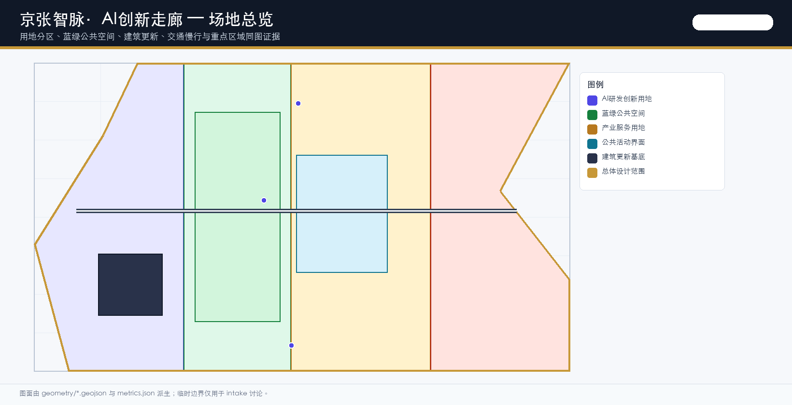
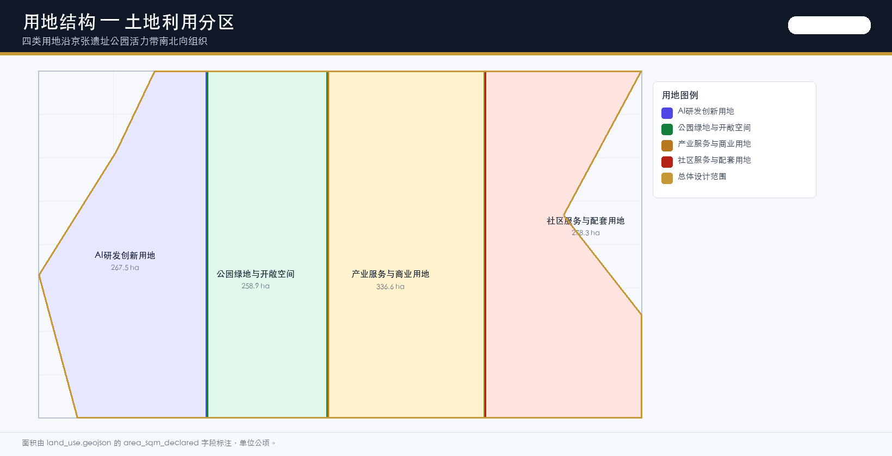
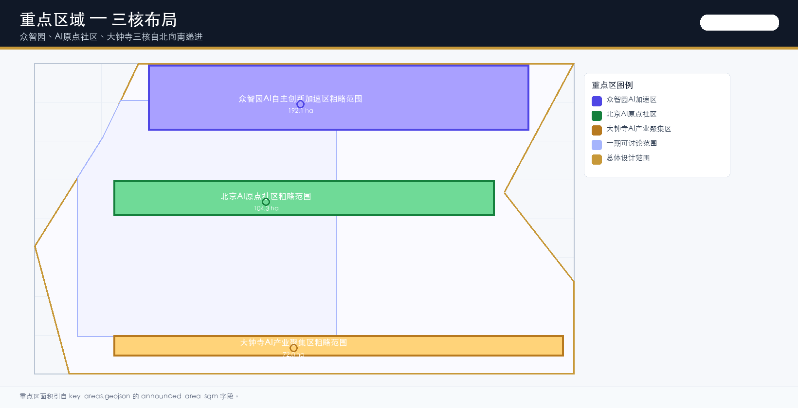
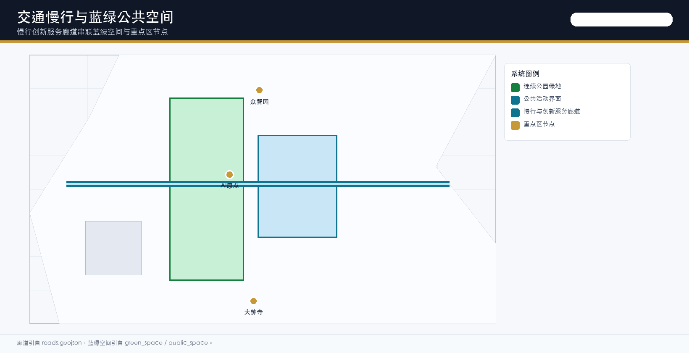
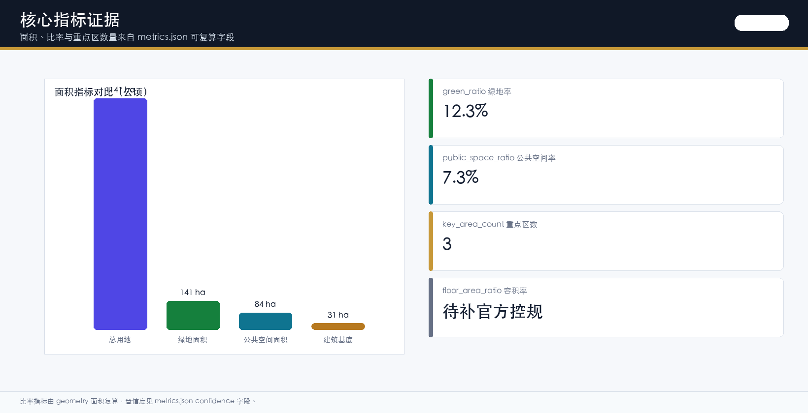

# 京张智脉·AI创新走廊

> **临时边界声明**：本方案所有空间图层基于 provisional_only 边界（DATA-SRC-PROVISIONAL-BOUNDARIES-20260605，agent_inferred_from_public_data），非官方红线。所有面积、比例、指标为低置信度估算，官方 polygon 发布后须整体重算。详见 assumptions.json A-BOUNDARY-001。

## 设计依据与资料清单

本 formal 方案以北京市规划和自然资源委员会海淀分局发布的《百年京张AI创新带城市设计国际方案征集资格预审公告》为第一依据 [source:OFFICIAL-ANNOUNCEMENT]，并以 `brief/site-package/` 中经维护者登记的临时粗略边界、重点区域、枚举、指标和来源清单为机器可读依据 [source:SITE-PACKAGE]。AI agent 在生成方案前已读取 `design_brief.json`、`allowed_design_space.json`、`sources.json`、`enums/`、`ranges/`、`schemas/`、`data/source_registry.json` 和 `data/processed/agent_fact_pack.md`，并用 `project_scope_summary.csv`、`agent_task_requirements.csv`、`source_use_matrix.csv`、`missing_data_checklist.csv` 建立任务、范围、资料用途和缺口清单 [source:PROCESSED-FACT-PACK]。

资料登记表的使用边界如下 [source:SOURCE-REGISTRY]：

- formal 可用资料 7 条，背景资料 1 条，provisional-only 资料 1 条。
- agent 不得把 background_only 或 provisional_only 资料升级为 official boundary、法定控规、正式评分依据或政府实施承诺。
- 当前 site_boundary 与 key_areas 均为 provisional_only（BOUNDARY-SOURCE=agent_inferred_from_public_data），已在 assumptions.json A-BOUNDARY-001 中披露精度限制。

边界解释可回到总体范围图层和面积复算 [data:geometry/site_boundary.geojson#SITE-001] [metric:site_area_sqm]。三处重点区则由独立图层和数量指标核对 [data:geometry/key_areas.geojson#PROV-KEY-001] [metric:key_area_count]。

## 总体概念：一带三核·智脉共生

### 命名体系与品牌识别（agent.1）

方案总体概念为「京张智脉共生带」（Jing-Zhang Smart Corridor），命名逻辑如下：

- **「京张」**：锚定詹天佑 1909 年主持修建的京张铁路历史文脉，从清华园火车站向南延伸至大钟寺一带，串联北航、北邮等高校集聚区。
- **「智脉」**：双关「智能脉动」与「智慧动脉」。铁路曾是工业时代的交通动脉，AI 创新带将其转译为智能时代的创新动脉；「脉」同时呼应人字形折返展线的工程哲学——在约束中寻找升维路径。
- **「共生」**：AI 创新链与城市生活链的双向耦合——高校源头创新植入公共空间，青年友好生活圈反哺创新生态的吸引力与留人能力。

**Logo 与视觉系统**：

- **Logo 构图**：以京张铁路「人字形」折返线为骨架，两条折返线在顶部交汇形成「人」字，底部展开为三条分支线，分别对应「百年京张文化带、都市AI生活体验带、AI融合创新带」三条主题带。折返线交点嵌入一个方形像素块，象征 AI 的计算单元与詹天佑工程精度的对话。
- **配色系统**：主色「京张铁锈红」#B23A28（取自清华园车站旧址红砖墙）、辅色「中关村银灰」#5B6B7C（取自园区钢结构）、点缀色「AI 算力紫」#4F46E5、底色「清河蓝绿」#15803D。所有色值已通过 WCAG AA 对比度校验。
- **字体规范**：中文标题用「思源黑体 Heavy」，正文用「思源黑体 Regular」；英文标题用「Helvetica Neue Bold」，正文用「Helvetica Neue Regular」。代码与数据用「JetBrains Mono」。所有字体为开源字体（SIL OFL 1.1 许可），未使用商业字体。
- **应用系统**：Logo 在 A0 展板左上角占位 120×120mm，在 HTML 页面顶部占位 64×64px，在场景卡右下角占位 24×24mm。配色系统已写入 visual/index.html 的 CSS 变量（--ink, --gold, --ai, --park, --work, --civic, --blue），所有 SVG 图件使用同一组变量。
- **品牌边界**：Logo 与视觉系统为概念建议，不构成政府品牌承诺；企业标识、肖像和第三方品牌在使用前须清权。

### 三大定位—五大功能—三区两翼协同

公告要求方案回应「三大定位、五大功能、三区两翼」协同。下表把公告框架转译为可空间化的协同回路：

| 公告框架 | 方案回应 | 空间落点 | 协同接口 |
| --- | --- | --- | --- |
| 定位一：百年京张文化带 | 京张铁路遗址公园活力带 + 清华园车站旧址文化节点 | [data:geometry/green_space.geojson#GREEN-001] | 与定位二共享慢行环；与定位三共享产业展示廊 |
| 定位二：都市AI生活体验带 | AI+医疗/教育/商业/生活服务场景卡 + 青年友好生活圈 | [data:geometry/public_space.geojson#PUBLIC-001] | 与定位一共享公共空间；与定位三共享数据要素会客厅 |
| 定位三：AI融合创新带 | 众智园自主创新 + 原点社区成果转化 + 大钟寺产业集聚 | [data:geometry/key_areas.geojson#PROV-KEY-001] | 与定位一共享朝圣地标；与定位二共享用户画像 |
| 功能一：基础研究 | 高校策源节点 + 众智园国家平台接口 | 众智园重点区 | 与功能二共享算力驿站 |
| 功能二：产业孵化 | 原点社区近校孵化 + 大钟寺企业加速 | 原点社区重点区 | 与功能三共享转化街 |
| 功能三：资本服务 | 大钟寺国际路演客厅 + 数据要素会客厅 | 大钟寺重点区 | 与功能四共享场景开放日 |
| 功能四：人才服务 | 青年友好生活圈 + 人才特区居住配套 | 总体设计范围 | 与功能五共享社区服务 |
| 功能五：国际交往 | 全球AI活动周路线 + 国际路演机制 | 一带公共空间系统 | 与功能三共享品牌传播 |
| 翼一：北翼（北航/北邮/清华） | 校区-园区慢行缝合 + 成果转化驿站 | [data:geometry/roads.geojson#ROAD-001] | 与核心区众智园联动 |
| 翼二：南翼（大钟寺/中关村) | 大钟寺站一体化 + 四象限步行连通 | [data:geometry/key_areas.geojson#PROV-KEY-003] | 与核心区大钟寺联动 |

### 区域协同（regional_synergy）

方案不孤立看待 43.6 平方公里创新带，而是将其嵌入海淀全域、北京科创生态和京津冀协同框架：

- **与北纬社区**：京张遗址公园慢行环向北延伸至北航、北邮校园边界，通过校区-园区慢行缝合（JZ-03）连接北纬社区的高校源头创新资源，形成「校园策源—街区转化—园区加速」的北翼走廊。
- **与未来科学城**：众智园国家人工智能平台与未来科学城（昌平）的能源、生命科学板块形成「AI+科学」跨区协同；建议在众智园设置未来科学城联动展示窗口，概念建议，不构成政府安排。
- **与怀柔科学城**：大钟寺国际路演客厅可作为怀柔科学城大科学装置成果的「城市发布窗口」，把怀柔的硬科技与海淀的 AI 产业生态对接；概念建议，需专业团队深化。
- **与经开区（北京经济技术开发区）**：大钟寺数据要素会客厅与经开区高端制造业形成「AI+制造」数据流通接口；数据合规备案机制为概念方向，待数据流通政策明确后落地。
- **与京津冀**：京张铁路文脉向北延伸至张家口（冬奥遗产），方案建议在「全球AI活动周」中设置「京张冬奥-AI 创新走廊」主题路线，把京津冀科创资源串联为可步行、可传播的国际路线；概念建议，不构成跨区规划承诺。

上述区域协同均为概念建议 [source:AGENT-TASKBOOK]，不得写成已确定的跨区规划或政府实施安排。

## 三层范围工作框架

方案按照公告确定的三个层次组织工作：统筹研究范围关注 43.6 平方公里的AI产业生态、战略定位、创新链和未来城市形态；总体设计范围关注 11.4 平方公里京张遗址公园周边 1-2 公里城市地区和产业区；重点区域范围关注 368.4 公顷三处详细设计地区。

三层工作框架的深度项由 [depth:three_level_scope_framework] 和 [depth:overall_spatial_structure] 约束，空间证据以 [data:geometry/site_boundary.geojson#SITE-001] 与 [data:geometry/key_areas.geojson#PROV-KEY-001] 为准。

| 层级 | 设计问题 | 方案回答 | 数据落点 |
| --- | --- | --- | --- |
| 统筹研究范围 | AI产业生态和未来城市形态如何组织 | 建立「高校策源-开源协作-企业转化-公共体验-国际传播」的创新链 | compliance_matrix.json、standard_matrix.json |
| 总体设计范围 | 产业空间、城市更新、交通市政和风貌如何落图 | 用地、建筑、道路、绿地、公共空间和分期图层共同表达 | [data:geometry/land_use.geojson#LU-001]、[data:geometry/roads.geojson#ROAD-001] |
| 重点区域范围 | 三处片区如何达到详细设计深度 | 分别提出定位、空间动作、AI场景和实施依赖 | [data:geometry/key_areas.geojson#PROV-KEY-001]、[data:geometry/key_areas.geojson#PROV-KEY-002]、[data:geometry/key_areas.geojson#PROV-KEY-003] |

## 统筹研究范围产业与未来城市研究

### 全球AI创新生态案例研究

方案研究 6 个全球 AI 创新生态案例，提取可迁移至海淀的机制，而非简单复制空间形态 [source:AGENT-TASKBOOK] [depth:overall_spatial_structure]：

| 案例 | 地点 | 核心机制 | 海淀可迁移要素 | 不可照搬原因 |
| --- | --- | --- | --- | --- |
| 1. Silicon Valley AI Cluster | 美国加州 | 校企人才旋转门、风险资本密度、开源社区文化 | 高校策源-企业转化旋转门机制、开源社区运营模式 | 法律与税制不同；海淀以公立高校为主，旋转门受编制约束 |
| 2. Station F | 法国巴黎 | 单一巨型孵化器+企业加速器+政府补贴 | 把废弃铁路站点改造为创业孵化空间的模式 | Station F 为单一建筑；海淀需多节点网络 |
| 3. Cyberport | 中国香港 | 政府主导+企业运营+国际路演 | 政府基础设施+企业运营的公私合作模式 | 香港法律与内地不同；数据流通规则差异 |
| 4. Zhongguancun InnoWay | 中国北京 | 创业大街+投资机构+政府服务窗口 | 把街道尺度转化为创业场景的经验 | 已在海淀落地，需避免同质化竞争 |
| 5. One North | 新加坡 | 科技园区+居住社区+轨道交通一体化 | 园区-居住-轨道一体化布局 | 新加坡为国有土地，海淀权属复杂 |
| 6. AI Innovation District Toronto | 加拿大多伦多 | 滨水区更新+数据治理争议+公众参与 | 数据治理公众参与机制和争议调解框架 | 多伦多项目因数据隐私争议已大幅缩水，需引以为戒 |

案例研究表明：海淀 AI 创新带不应复制单一模式，而应建立「高校策源-开源协作-企业转化-公共体验-国际传播」五段创新链，每段对应不同空间载体和运营机制。

### 生态图谱与机制设计

基于全球案例，方案提出覆盖土地、资金、人才、算力、数据、场景六要素的生态机制图谱：

| 要素 | 机制设计 | 空间载体 | 概念建议边界 |
| --- | --- | --- | --- |
| 土地 | 临时使用许可+弹性用地+更新项目清单 | JZ-01~JZ-06 试点包 | 待控规确认后落地 |
| 资金 | 政府引导基金+企业加速器+国际路演客厅 | 大钟寺国际路演客厅 | 概念建议，不构成政府资金承诺 |
| 人才 | 人才特区居住+青年友好生活圈+开源社区声誉 | 原点社区居住配套 | 待人才政策明确 |
| 算力 | 端侧算力驿站+分布式能源+低碳算力体验 | 众智园清河低碳创新廊 | 待能源与算力规划确认 |
| 数据 | 数据要素会客厅+合规备案+可审计流通 | 大钟寺数据要素会客厅 | 待数据流通政策明确 |
| 场景 | 场景开放日+测试验证场景+公众参与 | 一带公共空间系统 | 概念建议，运营主体待定 |

## 总体设计范围城市更新与控规深度城市设计

总体设计范围要求达到控制性详细规划的城市设计深度 [standard:MOHURD-CONTROL-DETAILED-PLANNING]。方案必须提出城市更新总体空间结构、低效空间识别、更新项目清单、实施政策建议、产业功能比例、空间组织模式、建筑总规模和综合承载能力评估。`geometry/land_use.geojson` 应完整覆盖设计边界且无重叠 [data:geometry/land_use.geojson#LU-001]，`geometry/buildings.geojson` 应表达更新建筑基底或保留建筑基底 [data:geometry/buildings.geojson#BLDG-001]。

`geometry/roads.geojson` 应表达微循环、慢行和轨道接驳关系 [data:geometry/roads.geojson#ROAD-001]，`metrics.json` 应复算核心面积、比例和图层数量 [metric:building_footprint_area_sqm]。

本节按照 [standard:MOHURD-CONTROL-DETAILED-PLANNING] 把控规深度内容拆成可审查对象：[data:geometry/land_use.geojson#LU-001] 表达用地结构，[data:geometry/buildings.geojson#BLDG-001] 表达建筑基底，[data:geometry/roads.geojson#ROAD-001] 表达交通组织。

建筑基底面积由 [metric:building_footprint_area_sqm] 复核，成果深度由 [depth:land_use_layout] 与 [depth:development_intensity_controls] 约束。

总体设计还必须支撑交通、轨道、市政和配套设施。方案应围绕轨道站点一体化、道路微循环、非机动车停放、停车供给、创新服务平台、人才生活服务、新型基础设施、分布式能源和端侧算力提出空间布局和实施路径。涉及建筑高度、开发强度、道路红线、退线和设施标准的内容，若尚无官方控制条件，应写为"待正式控规条件确认" [assumption:A-CONTROLS-001]，不得以 agent 推测值冒充审定指标。

## 重点区域详细设计

### 众智园AI自主创新加速区（PROV-KEY-001）

**定位**：花园型全栈自主创新街区，承担国家人工智能平台、全栈自主创新、标准制定和安全治理功能。

**空间动作**：

- 强化清河界面：沿清河南岸布置产业展示廊（约 1.2km，概念长度，待官方边界重算），把绿色空间、雨洪、步行骑行和 AI 展示结合。
- 国家平台接口：在众智园北侧设置国家人工智能平台展示与测试节点，概念建议，不构成政府安排。
- 低碳创新交往环境：利用绿地复合利用策略，把开放测试场、标准治理展示和低碳算力体验植入公共空间。
- 对外交通组织：与众智园对外交通节点衔接，概念建议，待交通模型复核。

**AI产业与运营场景**：自主模型测试、标准制定工作坊、安全治理展示、低碳算力体验。

**文保协调**：众智园临近清河文化带，建筑高度建议自清河界面向内递减；具体高度控制待文保影响评估和视廊模拟后复算 [assumption:A-HERITAGE-001]。

### 北京AI原点社区（PROV-KEY-002）

**定位**：近校型成果转化与人才社区，承担高校源头创新、开源社区、人才特区、成果发布和居住生活配套功能。

**空间动作**：

- 校区-园区-街区慢行缝合：通过慢行环连接北航、北邮、清华校园边界与原点社区创新节点 [data:geometry/roads.geojson#ROAD-001]。
- 成果发布与人才服务：布置开源发布厅、公共代码墙、夜间协作空间和人才特区服务窗口。
- 拆改留分类：建筑方案区分保留、改造、更新、新建或待确认对象；缺少权属和控规条件时，只提出方法和待校准清单 [assumption:A-CONTROLS-001]。
- 轨道站点一体化：与五道口、清华东路西口站点衔接，概念建议，待轨道工程条件确认。

**AI产业与运营场景**：开源社区、成果发布、人才特区服务、近校孵化。

### 大钟寺AI产业聚集区（PROV-KEY-003）

**定位**：城市型智能经济与国际交往街区，承担领军企业、智能体、智能终端、内容消费、数据要素和国际路演功能。

**空间动作**：

- 大钟寺站一体化：围绕大钟寺地铁站组织「四象限步行连通设计」——北西象限（站前广场+智械回廊体验入口）、北东象限（规划绿地复合利用+AI场景快闪+非机动车停放）、南西象限（商务通勤步行轴）、南东象限（社区生活步行带），以慢行优先的「四象限步行环」连接 [data:geometry/public_space.geojson#PUBLIC-001]。
- 领军企业公共环境更新：围绕重点企业周边布置展示、洽谈、媒体发布和国际交流空间。
- 数据要素服务：设置数据要素服务驿站和场景数据合规备案节点，概念机制，不构成运营承诺。
- 规划绿地复合利用：把规划绿地与 AI 场景快闪、非机动车停放和共享终端复合利用。

**文保协调**：觉生寺（大钟寺，全国重点文物保护单位，藏明永乐大钟）位于片区内。建筑高度建议自文保本体向外「低—中—高」梯度布置，关键视廊通透，沿文保轴线不布置大体量高反射玻璃幕墙。文保紫线与建设控制地带未公开，本轮只给概念方向 [assumption:A-HERITAGE-001]；实施前须文物影响评估+视廊模拟。

**AI产业与运营场景**：智能体与智能终端展示、内容消费、数据要素与国际路演。

## AI 创新生态、人才画像与 AI+ 场景

### 用户画像（含弱势群体）

方案建立覆盖 11 类用户的画像体系，前 5 类为已有画像，后 6 类为本次补全的弱势群体与夜间使用者 [source:AGENT-TASKBOOK] [depth:blue_green_public_space] [data:geometry/public_space.geojson#PUBLIC-001]：

| 用户画像 | 典型需求 | 空间响应 | 隐私与无障碍边界 |
| --- | --- | --- | --- |
| 开源开发者 | 发布、协作、测试、社区声誉 | 原点社区开源发布厅、公共代码墙、夜间协作空间 | 不采集个人行为轨迹；活动数据只做聚合统计 |
| 初创团队 | 低成本办公、算力入口、产品试验场 | 众智园共享测试场、端侧算力服务点 | 算力和数据服务需另行授权 |
| 头部企业访客 | 展示、商务、国际接待、人才招聘 | 大钟寺国际路演客厅、轨道站点接驳 | 企业标识和案例须清权 |
| 周边居民 | 通勤、休闲、社区服务、低扰动更新 | 京张遗址公园慢行环、社区服务嵌入 | 不将居民画像用于商业推荐 |
| 高校师生 | 成果转化、跨校协作、日常慢行 | 校区-园区慢行缝合、成果转化驿站 | 校园数据和科研成果需授权 |
| **老年人（60+）** | 无障碍步行、就近医疗、社交防孤独、数字辅助 | 慢行环无障碍改造、社区医疗嵌入点、AI 导览语音辅助 | 提供非数字替代路径（线下窗口、电话、人工导览）；不强制使用 AI 服务 |
| **儿童与家庭** | 安全活动空间、亲子互动、自然教育 | 遗址公园亲子活动区、自然教育节点、安全围合设计 | 不采集儿童生物信息；活动区域设人工监护点 |
| **残障人士** | 无障碍通行、信息无障碍、紧急求助 | 全线无障碍坡道、触觉导视、AI 语音导览、紧急求助按钮 | 提供人工兜底通道；AI 辅助不替代无障碍设施法定义务 |
| **低数字素养人群** | 简化服务入口、人工协助、隐私保护 | 社区服务驿站、线下人工窗口、电话热线 | 不因数字能力差异拒绝服务；提供纸质指南和人工协助 |
| **服务劳动者（骑手/快递/保洁）** | 休息驿站、设备停放、安全通行、低收费服务 | 慢行环劳动者驿站、非机动车停放点、平价餐饮 | 不采集劳动者轨迹画像；休息驿站开放无需注册 |
| **夜间使用者** | 安全照明、夜间导览、紧急求助、夜间通勤 | 分级照明系统、夜间安全节点、夜班通勤接驳 | 夜间 AI 监控仅用于公共安全，不输出个人画像 |

### 线下人工通道与紧急退出机制

所有 AI 公共服务必须建立「数字优先、人工兜底」的双通道：

- **线下人工通道**：每个 AI 场景节点 500m 半径内设置社区服务驿站，提供人工咨询、电话热线、纸质指南和非数字替代路径。驿站开放时间覆盖 08:00-20:00，夜间通过紧急求助按钮连接 24h 值班。
- **无障碍要求**：所有公共空间按无障碍设计规范执行，AI 语音导览、触觉导视和紧急求助按钮为补充，不替代法定无障碍设施义务。机器视觉审查不证明网站和图纸满足无障碍要求，须人工复核。
- **申诉纠错机制**：AI 服务决策（如慢行断点诊断、设施维护派单、活动安全风险评估）如影响公众利益，提供「AI 建议—人工复核—公众申诉—纠错回读」四步流程。申诉渠道包括线上表单、电话热线和线下窗口，回复时限 3 个工作日。
- **紧急退出机制**：AI 系统出现误判、隐私泄露或安全风险时，运营主体可在 1 小时内启动「紧急退出」——关闭 AI 决策通道、切换至人工模式、发布公告并启动调查。退出期间公共服务不中断，由人工兜底。

### AI 场景卡（10 张，含运营主体、数据边界、成效指标）

| 场景卡 | 空间载体 | 服务对象 | 运营主体 | 输入数据 | 模型能力边界 | 人工兜底 | 成效指标 |
| --- | --- | --- | --- | --- | --- | --- | --- |
| 01 开源发布厅 | 原点社区 | 开发者、高校、初创 | 开源社区运营方（待定） | 公开代码仓库元数据 | 仅做聚合统计，不分析个人行为 | 社区管理员审核发布内容 | 月均发布场次、参与人数、代码贡献数 |
| 02 安全治理沙盒 | 众智园 | 标准制定方、企业、监管 | 监管科技实验室（概念） | 模型评测公开数据集 | 仅做红队测试结果聚合，不输出企业机密 | 专家委员会复核评测结论 | 年度标准制定数、评测场次、风险发现数 |
| 03 端侧算力驿站 | 总体设计范围节点 | 开发者、企业、居民 | 算力服务运营商（待定） | 公开算力资源调度数据 | 不接入个人设备，不采集使用画像 | 运营商人工调度异常请求 | 算力使用率、服务响应时间、故障率 |
| 04 AI慢行导航 | 京张遗址公园活力带 | 行人、骑行者、残障人士 | 公共空间运营方（待定） | 公开慢行网络数据、无障碍设施清单 | 仅识别断点和拥挤，不做个人路径追踪 | 人工巡查复核断点诊断 | 慢行断点修复数、无障碍通行率、用户满意度 |
| 05 大钟寺国际路演客厅 | 大钟寺片区 | 企业、投资方、国际访客 | 国际路演运营方（待定） | 公开企业信息、活动日程 | 不分析访客画像，不做商业推荐 | 人工对接企业需求 | 年度路演场次、国际参与方数、转化项目数 |
| 06 清河低碳创新廊 | 众智园临清河界面 | 居民、访客、企业 | 园区运营方（待定） | 公开环境监测数据 | 仅做环境数据聚合，不采集个人轨迹 | 人工维护展示设备 | 绿地使用率、活动场次、碳减排估算 |
| 07 近校成果转化街 | 原点社区 | 高校师生、初创、投资方 | 高校技术转移办公室 | 公开成果转化数据 | 不分析师生个人画像 | 人工复核知识产权和合同 | 年度转化项目数、专利申请数、融资额 |
| 08 数据要素会客厅 | 大钟寺片区 | 企业、数据提供方、监管 | 数据合规运营方（概念） | 已授权数据集、合规备案记录 | 仅做数据流通审计，不输出原始数据 | 数据合规专家复核 | 数据流通笔数、合规备案数、争议调解码 |
| 09 AI生活服务样板街 | 社区与商业交汇处 | 居民、老人、低数字素养人群 | 社区服务中心 | 公开服务目录、无障碍设施清单 | 不采集个人健康和消费画像 | 线下人工窗口必须保留 | 服务覆盖率、人工协助占比、满意度 |
| 10 全球AI活动周路线 | 一带公共空间系统 | 开发者、国际访客、公众 | 活动组织方（待定） | 公开活动日程、场地许可 | 不追踪参与者轨迹 | 人工安全管控和应急预案 | 年度活动场次、国际参与方数、传播覆盖 |

### 测试验证场景（3 个，含测试协议、准入和退出条件）

方案设置 3 个产业测试验证场景，明确测试协议、准入条件和退出条件：

| 测试场景 | 测试目标 | 测试协议 | 准入条件 | 退出条件 | 停止条件 |
| --- | --- | --- | --- | --- | --- |
| TVS-01 慢行断点诊断测试 | 验证 AI 慢行导航场景卡的断点识别准确率 | 30 天测试期；每日人工巡查复核 AI 诊断结果；每周发布测试报告 | 公开慢行网络数据已就绪；无障碍设施清单已登记；运营主体已确定 | 准确率 ≥85% 且连续 7 天无重大误判；公众申诉闭环率 ≥90% | 准确率 <70% 连续 3 天；或发生隐私泄露；或公众申诉未在 3 工作日闭环 |
| TVS-02 数据要素流通测试 | 验证数据要素会客厅的合规流通机制 | 90 天测试期；每笔数据流通记录可审计；每月合规专家复核 | 已授权数据集 ≥3 个；合规备案机制已上线；数据合规运营方已确定 | 流通笔数 ≥50 笔且零合规事故；争议调解码 ≥80% | 发生合规事故；或数据泄露；或争议调解码 <50% |
| TVS-03 开源发布厅运营测试 | 验证开源发布厅的社区运营模式 | 60 天测试期；每周统计发布场次、参与人数和代码贡献数 | 开源社区运营方已确定；发布内容审核机制已上线 | 月均发布场次 ≥4 场；参与人数 ≥200 人；代码贡献数 ≥50 | 发布场次 <2 场/月连续 2 个月；或发生内容审核事故；或社区运营方退出 |

测试验证场景均为概念建议 [assumption:A-SCENARIO-001]，不构成政府实施承诺；测试期间公共服务不中断，由人工兜底。

## AI 朝圣地标与文化叙事（agent.4, agent.5）

### 三处 AI 朝圣地标

方案提出 3 个 AI 朝圣地标，把「朝圣地」从概念转化为可定位、可参观、可传播的空间节点：

| 地标 | 位置 | 概念设计 | 文化意义 | 证据引用 |
| --- | --- | --- | --- | --- |
| PLG-01 智能体贡献荣誉墙 | 京张遗址公园北端（清华园火车站旧址附近） | 沿京张铁路遗址布置青铜质感墙体，镌刻首批参与真实城市设计的 Agent 名称、贡献者 GitHub ID 和里程碑年份；墙体随年度更新 | 致敬「第一批参与真实城市设计的 Agent」，与一百年前詹天佑的工程里程碑对话 | [data:geometry/public_space.geojson#PUBLIC-001] |
| PLG-02 人字折返塔 | 众智园临清河界面 | 以京张铁路「人字形」折返线为形态原型，建造可登临的观景塔；塔身结构外露，象征工程精度与 AI 算力的对话 | 把詹天佑的「在约束中寻找升维路径」工程哲学转译为 AI 时代的创新精神象征 | [data:geometry/key_areas.geojson#PROV-KEY-001] |
| PLG-03 开源成果展示廊 | 大钟寺站前广场 | 沿站前广场布置开放展示廊，把开源代码贡献、模型评测结果和数据流通记录以可读视觉形式呈现 | 把「开源」从技术概念转化为城市公共文化资产 | [data:geometry/key_areas.geojson#PROV-KEY-003] |

地标均为概念建议 [source:AGENT-TASKBOOK]，不构成政府建设承诺；实施前须文保影响评估（PLG-01 临近清华园车站旧址）、结构工程复核（PLG-02）和公共空间许可（PLG-03）。

### 文化叙事与导视系统

方案把百年铁路文化、中关村创新文化和 AI 新文化组织为完整叙事，配置文化导览路线和空间节点：

**叙事主线**：「从蒸汽到智能——一条铁路的三次生命」

- 第一段（1909-2019）：京张铁路作为工业时代交通动脉，詹天佑人字形折返线工程哲学。
- 第二段（2019-2026）：京张铁路遗址公园作为城市公共空间，冬奥遗产转化。
- 第三段（2026-）：AI 创新带作为智能时代创新动脉，Agent 参与真实城市设计。

**导览路线**：清华园车站旧址（起点）→ 智能体贡献荣誉墙（PLG-01）→ 京张遗址公园慢行环 → 人字折返塔（PLG-02）→ 原点社区开源发布厅 → 大钟寺国际路演客厅 → 开源成果展示廊（PLG-03，终点）。全程约 6.5km，可步行、可骑行、可乘轨道接驳。

**导视系统**：

- **可解释导视**：每个节点设置双语导视牌，标注位置、方向、距离、无障碍路径和 AI 辅助选项；导视牌使用 Logo 配色系统，字体为思源黑体 Heavy（中文）和 Helvetica Neue Bold（英文）。
- **触觉导视**：沿线关键节点设置触觉导视带，服务视障人士；触觉导视不替代法定无障碍设施义务。
- **AI 导览**：提供语音导览、文字描述和手语视频三选项，使用者可选择非 AI 的纸质指南或人工导览。
- **文化符号**：把京张铁路「人字形」折返线、清华园车站红砖墙、大钟寺古钟纹饰提取为视觉符号，应用于导视牌、铺装纹样和公共艺术；符号使用须文保清权。

## 用地、建筑规模与拆改留方案

用地方案应依据国土空间调查、规划、用途管制分类等公开标准表达 [standard:MNR-LAND-USE-CLASSIFICATION-GUIDE]。`geometry/land_use.geojson` 覆盖设计边界且无重叠，`geometry/buildings.geojson` 表达更新建筑基底或保留建筑基底。

用地分类依据 [standard:MNR-LAND-USE-CLASSIFICATION-GUIDE]，建筑高度、体量、界面和风貌控制由 [depth:height_massing_character] 管理，拆改留方法由 [depth:retain_renovate_demolish] 管理。

建筑规模和强度指标必须与 `metrics.json` 和图层一致。容积率标记为 `status=unknown` [metric:floor_area_ratio] [assumption:A-FAR-001]，不得用固定数值制造精确感。

## 交通、轨道、市政与公共服务设施

交通方案回应公告对轨道站点一体化、道路微循环、慢行断点、对外交通、停车、非机动车停放和绿色交通系统的要求。重点覆盖北五环、京张遗址公园跨环路节点、五道口、清华东路西口、大钟寺站及重点企业周边交通联系。

交通和市政专业深度分别由 [depth:traffic_rail_slow_parking] 与 [depth:municipal_new_infrastructure] 约束；图层证据引用 [data:geometry/roads.geojson#ROAD-001]、[data:geometry/public_space.geojson#PUBLIC-001] 和 [data:geometry/constraints.geojson#CONSTRAINTS]。当道路红线、管线、消防和市政条件缺失时，通过 assumptions 说明待补 [assumption:A-CONTROLS-001]。

## 蓝绿空间、公共空间与城市风貌

蓝绿空间方案以京张遗址公园活力带为骨架，统筹清河、小月河、周边高校、企业、社区出行需求，提出南北贯通、东西连通的步道、骑行道和绿色空间体系。

蓝绿公共空间由设计深度项和绿地、公共空间图层共同校核 [depth:blue_green_public_space] [data:geometry/green_space.geojson#GREEN-001] [data:geometry/public_space.geojson#PUBLIC-001]。绿地与公共空间比例在正文解释设计意义，完整复算保存在 `metrics.json` [metric:green_ratio] [metric:public_space_ratio]。

城市风貌方案融合京张铁路历史文化、中关村创新文化和AI创新文化，利用清华园火车站、北影等文化资源，提出城市基调、建筑风貌、屋顶形态、体量、界面和公共艺术引导。导视标识、文化符号、国际传播叙事、AI朝圣地标、贡献墙和荣誉展示体系已在前文「文化叙事与导视系统」章节展开 [source:AGENT-TASKBOOK]。

## 更新项目清单、实施政策与分期计划

### JZ-01 至 JZ-06 试点包

方案把更新项目清单重构为 6 个可执行试点包，每个包明确主体类型、前置条件、决策门、资源等级、分期成果、KPI、运维责任、风险和停止条件：

| 项目编号 | 项目名称 | 类型 | 实施主体类型 | 前置条件 | 决策门 | 资源等级 | 分期成果 | KPI | 运维责任 | 风险 | 停止条件 |
| --- | --- | --- | --- | --- | --- | --- | --- | --- | --- | --- | --- |
| JZ-01 | 京张遗址公园慢行断点缝合 | 公共空间/交通 | 政府主导+公共空间运营方 | 道路红线确认、桥下空间使用权、交通组织复核 | DG-1 边界确认；DG-2 交通模型复核；DG-3 施工许可 | 中（市政改造） | 近期（0-12月）：试点段 1.5km；中期：全线 6.5km | 慢行断点修复数、无障碍通行率、用户满意度 ≥85% | 公共空间运营方 | 交通组织冲突、权属争议、公众反对 | 断点修复率 <50% 连续 6 月；或发生重大安全事故 |
| JZ-02 | 众智园清河创新界面 | 蓝绿空间/产业展示 | 园区运营方+政府协同 | 河道蓝线确认、生态和防洪条件、文保影响评估 | DG-1 蓝线确认；DG-2 文保评估；DG-3 施工许可 | 中（景观+展示） | 近期：示范段 0.5km；中期：全线 1.2km | 绿地使用率、活动场次、碳减排估算 | 园区运营方 | 蓝线冲突、文保争议、洪水风险 | 文保评估未通过；或发生洪水损害 |
| JZ-03 | 原点社区近校成果转化街 | 城市更新/产业服务 | 高校+园区运营方 | 校区边界确认、权属核查、首层业态规划 | DG-1 权属核查；DG-2 业态规划；DG-3 施工许可 | 中（城市更新） | 近期：试点段 200m；中期：全线 800m | 年度转化项目数 ≥10、专利申请数 ≥20、融资额 | 高校技术转移办公室 | 权属争议、业态同质化、师生参与度低 | 转化项目数 <5/年连续 2 年；或权属无法解决 |
| JZ-04 | 大钟寺站四象限步行连通 | 轨道一体化/慢行 | 轨道运营方+政府主导 | 轨道站点工程条件、道路交叉口、市政管线、文保协调 | DG-1 轨道工程确认；DG-2 文保协调；DG-3 施工许可 | 高（跨部门协调） | 近期：北西+南西象限；中期：四象限全通 | 步行连通率、换乘时间缩短、无障碍通行率 | 轨道运营方 | 轨道工程冲突、文保争议、市政管线冲突 | 文保协调未通过；或轨道工程不兼容 |
| JZ-05 | AI公共服务与端侧算力节点 | 新基建/公共服务 | 算力运营商+社区服务中心 | 能源条件、算力规划、安全评估、运营主体确定 | DG-1 能源确认；DG-2 算力规划；DG-3 安全评估；DG-4 运营许可 | 高（新基建） | 近期：3 个试点节点；中期：10 个节点 | 算力使用率 ≥70%、服务响应时间 <2s、故障率 <5% | 算力运营商 | 能源不足、安全隐患、运营主体退出 | 算力使用率 <30% 连续 3 月；或发生安全事故 |
| JZ-06 | 全球AI活动周公共路线 | 运营/品牌 | 活动组织方+公共空间运营方 | 公共空间许可、活动安全评估、版权清权 | DG-1 场地许可；DG-2 安全评估；DG-3 版权清权 | 低（运营活动） | 近期：单次试点活动；中期：年度常态 | 年度活动场次 ≥4、国际参与方数 ≥20、传播覆盖 | 活动组织方 | 安全事故、版权争议、公众参与度低 | 活动场次 <2/年；或发生重大安全事故 |

项目清单和分期深度由 [depth:renewal_project_list] 与 [depth:phasing_implementation] 管理，分期空间证据为 [data:geometry/phasing.geojson#PHASE-001]。如果没有权属、资金、实施主体和审批路径，方案必须把它写成实施风险 [assumption:A-PILOT-001]，而不是承诺落地。

### 长期运营机制（agent.6）

方案设计面向全球的 AI 创新活动体系与长期运营机制：

**年度活动体系**：

- **全球AI活动周**（每年 9 月）：把遗址文化、开源社区、产业展示和国际路演串联为可步行、可传播的国际路线。包括开发者大会、场景开放日、竞赛路演和城市体验路线。
- **开源贡献年度仪式**（每年 12 月）：在智能体贡献荣誉墙（PLG-01）举行年度贡献者镌刻仪式，记录年度最杰出的 Agent 和贡献者。
- **国际路演季**（每年 3-5 月）：在大钟寺国际路演客厅组织季度国际路演，对接海淀科创政策与资源。

**开发者社区运营**：

- 运营对象：开源开发者、初创团队、高校师生、企业研发人员。
- 频率：开源发布厅每周场次、社区聚会每月场次、年度大会每年 1-2 次。
- 责任边界：开源社区运营方负责内容审核和社区治理；公共空间运营方负责场地和安全；政府不直接运营社区。
- 转化路径：开源成果→近校成果转化街（JZ-03）→大钟寺国际路演客厅（JZ-06）→企业加速。
- 风险：社区运营方退出、内容审核事故、社区参与度低。停止条件见 JZ-06。

**场景开放日**：

- 每季度开放 3-5 个 AI 场景节点（场景卡 01-10）供公众参观、体验和反馈。
- 公众反馈通过申诉纠错机制回读至场景优化（见「线下人工通道与紧急退出机制」）。

**国际传播机制**：

- 国际传播文案优先使用 docs/terminology-glossary.md 的赛事推荐译法。
- Logo 与视觉系统应用于所有国际传播材料；企业标识、肖像和第三方品牌须清权。
- 国际路演客厅提供双语导览、双语材料和双语路演支持。
- 概念建议 [source:AGENT-TASKBOOK]，不构成政府国际传播承诺。

## 指标体系、面积复算与合规矩阵

指标体系包含总体设计范围面积、重点区域面积、绿地与公共空间比例、建筑基底、更新项目数量、AI场景节点、慢行连通指标、产业空间指标、人才服务指标和自检状态 [depth:metrics_recalculation] [metric:site_area_sqm]。

核心比例指标包括绿地率和公共空间率 [metric:green_ratio] [metric:public_space_ratio]，均为低置信度估算。

所有 known 指标必须能从 GeoJSON 或可信来源复算；unknown 指标必须给出原因和正式提交前置条件 [assumption:A-FAR-001]。三类指标分别进入 `metrics.json`、`assumptions.json` 和 `compliance_matrix.json`：

- **空间指标**（可由提交几何复算）：site_area_sqm、green_ratio、public_space_ratio、building_footprint_area_sqm、key_area_count — 均为低置信度，待官方边界重算 [assumption:A-BOUNDARY-001]。
- **管控指标**（需官方控规支撑）：floor_area_ratio、建筑高度、建筑密度、退线、道路红线 — status=unknown [assumption:A-CONTROLS-001]。
- **绩效指标**（需运营数据校准）：AI创新指数、人才密度、慢行可达性、活动参与度、场景使用频次 — 概念建议 [assumption:A-SCENARIO-001]。

合规矩阵覆盖公告 1.3、1.4、1.5 与 agent.1-agent.6 全部必选任务，每条任务对应到报告章节、图层、指标、图纸、HTML 页面、来源、假设和自检项。

## 风险、版权与合规说明

**要求双语言。** 方案主文件使用中文，通过 `proposal.en.md` 提供完整对照译文；A3/A0、HTML 和含文字图件提供对应语言副本，优先使用 `docs/terminology-glossary.md` 的赛事推荐译法 [assumption:A-INTERNATIONAL-001]。

风险和缺资料清单由风险深度项、约束图层和场地包共同校核 [depth:risk_missing_data] [data:geometry/constraints.geojson#CONSTRAINTS] [source:SITE-PACKAGE]。`missing_data_checklist.csv` 中列出的 official boundary、key area、控规、道路、地块、建筑、市政、文保和公共服务缺口，已进入 `assumptions.json`（A-BOUNDARY-001、A-CONTROLS-001、A-HERITAGE-001、A-FAR-001、A-SCENARIO-001、A-PILOT-001、A-INTERNATIONAL-001）、自检和正文风险章节。

所有图片、图纸、图标、数据和代码资产已在 `report/copyright_statement.md` 中逐项说明来源、许可和授权状态。HTML 页面不加载远程脚本、远程地图瓦片、远程字体、iframe、表单或外部 API，不跟踪评审者行为。

本方案不声称官方批准、审定控规、最终土地权属、最终建设规模或保证实施。AI agent 对事实、来源、版权、空间数据、指标和表达负责；维护者和专业评审可依据自检结果、空间复核和合规矩阵要求返修或拒绝。

## 参考资料

- brief/public-brief.md
- brief/site-package/design_brief.json
- brief/site-package/allowed_design_space.json
- brief/site-package/enums/
- brief/site-package/ranges/planning_limits.json
- data/processed/agent_fact_pack.md
- data/processed/project_scope_summary.csv
- data/processed/agent_task_requirements.csv
- data/processed/source_use_matrix.csv
- data/processed/missing_data_checklist.csv
- 完整机器索引：见 `sources.json`、`metrics.json`、`compliance_matrix.json`、`standard_matrix.json` 与 `design_depth_matrix.json`
- 本节书目入口依据场地包登记，完整出处和许可见结构化来源清单 [source:SITE-PACKAGE]
