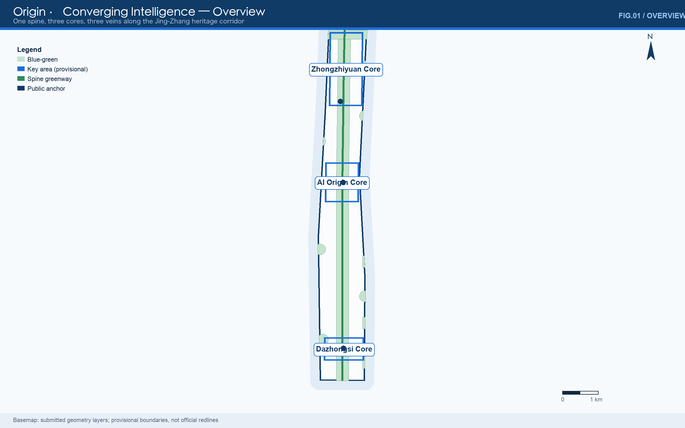
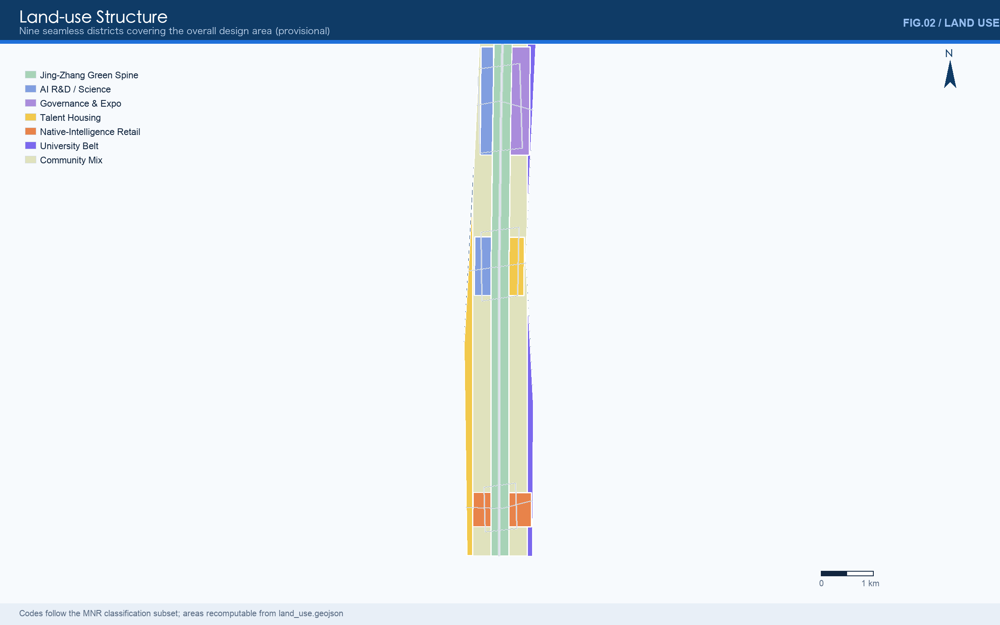
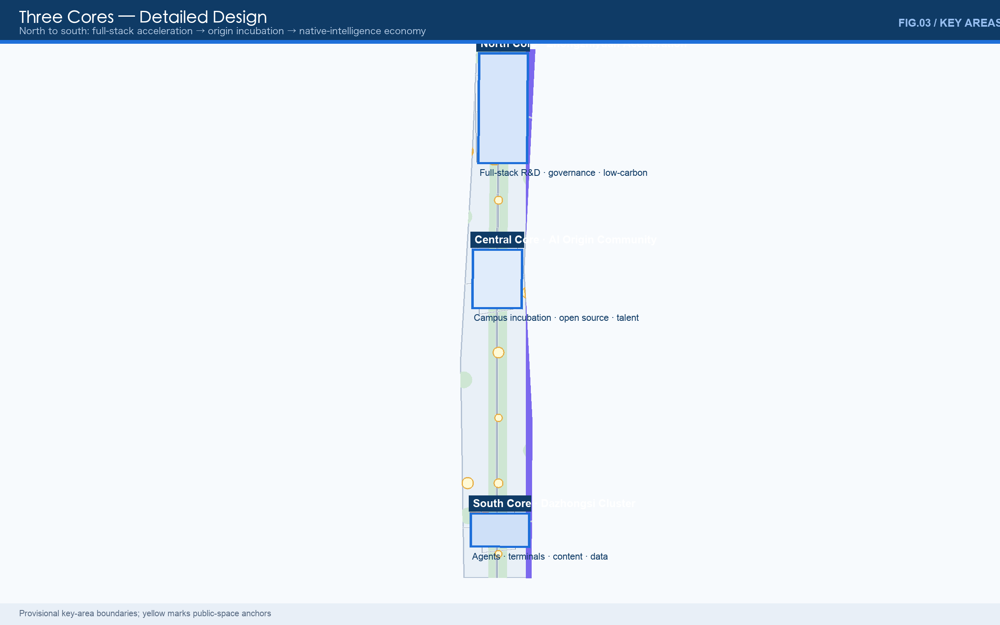
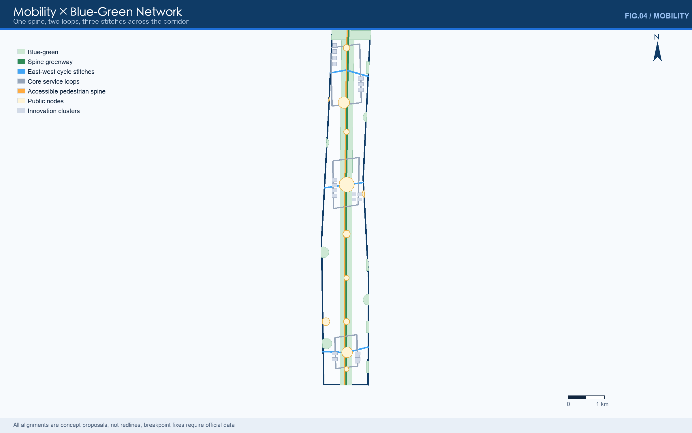
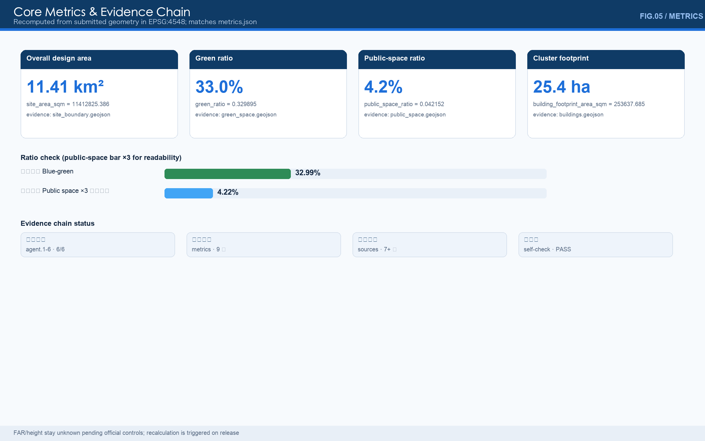

# Origin · Converging Intelligence on Jing-Zhang

> A century ago this railway proved that China could design its own trunk line; today this corridor can prove that a Chinese city can natively grow artificial intelligence. "Origin" is both the spatial anchor of the Beijing AI Origin Community and the spiritual starting point of global AI innovation — every major launch is a new origin.

## Design Basis and Source List

This formal proposal takes the *Prequalification Announcement of the Centennial Jing-Zhang AI Innovation Belt International Urban Design Open Call* (issued by the Haidian Branch of the Beijing Municipal Commission of Planning and Natural Resources) as its primary basis, together with the machine-readable provisional boundaries, key areas, enumerations, metrics and source inventories registered by maintainers under `brief/site-package/`. Before generation, the agent read `design_brief.json`, `allowed_design_space.json`, `sources.json`, `enums/`, `ranges/`, `schemas/`, `data/source_registry.json` and `data/processed/agent_fact_pack.md`, and organised tasks, scope, permitted source usage and known gaps with `project_scope_summary.csv`, `agent_task_requirements.csv`, `source_use_matrix.csv` and `missing_data_checklist.csv`. Every design judgement is decomposed into traceable sources, recomputable metrics, verifiable layers and human-reviewable assumptions; narrative text never substitutes for GeoJSON, metric tables, A3 booklets, A0 boards and the HTML presentation [source:OFFICIAL-ANNOUNCEMENT] [source:AGENT-TASKBOOK] [depth:existing_conditions_diagnosis].

Usage boundaries of the source registry [source:SOURCE-REGISTRY]:

- `data/source_registry.json` registers permitted uses of public, cleared and provisional materials.
- Current summary: 7 formal-usable sources, 1 background source, 1 provisional-only source.
- This proposal never promotes background_only or provisional_only material into official boundaries, statutory controls, formal scoring evidence or government implementation commitments.

`data/processed/agent_fact_pack.md` is a reading-navigation layer, not a new authority [source:PROCESSED-FACT-PACK]; factual judgements return to the registered primary materials [source:OFFICIAL-ANNOUNCEMENT] [source:AGENT-TASKBOOK]; full source relations live in `sources.json`.

While official `SITE_BOUNDARY` and the three `KEY_AREA` polygons remain unreleased, this package is generated from `brief/site-package/geometry/provisional_boundaries.geojson`. `geometry/site_boundary.geojson` and `geometry/key_areas.geojson` are flagged `provisional_constraint`, `official_boundary=false`, usable only for generation, self-checks, visualisation and design discussion — never as official redlines, approval bases, precise-area bases or statutory conclusions. This organiser-side data gap does not block content scoring; once official polygons arrive, site boundary, key areas, land use, roads, green space, public space, buildings, phasing and metrics must all be recalculated [data:geometry/site_boundary.geojson#SITE-001] [metric:site_area_sqm].

The submittable state is: **provisional boundary, precision warnings retained, recalculation pending official data; content scoring not blocked.**

## Overall Concept: One Spine, Three Cores, Three Veins (agent.1)

### Concept logic

The Jing-Zhang inheritance is not the rails themselves but the method of "designed and built by ourselves". Zhan Tianyou's "人"-shaped (switchback) line turned an impossible gradient into a possible railway — system design breaking single-point limits. That method is isomorphic to today's full-stack AI autonomy (chips → frameworks → models → applications). The proposal therefore refuses to turn the heritage into static scenery and instead compiles it into the city's innovation operating system: **Origin · Converging Intelligence on Jing-Zhang** (Origin Belt for short).

- **One spine** — the Jing-Zhang Spine: a north-south continuous greenway and public-space axis built on the relics park, 9.7 km linking the whole belt [data:geometry/roads.geojson#ROAD-001].
- **Three cores** — Zhongzhiyuan (north, full-stack acceleration), Beijing AI Origin Community (centre, origin incubation), Dazhongsi (south, native-intelligence economy) [data:geometry/key_areas.geojson#PROV-KEY-001] [data:geometry/key_areas.geojson#PROV-KEY-002] [data:geometry/key_areas.geojson#PROV-KEY-003].
- **Three veins** — culture-narrative vein (Jing-Zhang → Zhongguancun → AI culture), blue-green vein (Qinghe — Xiaoyuehe — spine green), smart-service vein (edge-compute posts — data-element salon — developer service chain) [data:geometry/green_space.geojson#GREEN-001] [data:geometry/public_space.geojson#PUBLIC-001].

### Naming system

| Level | Name | Function |
| --- | --- | --- |
| Belt | 原点·智汇京张 / Origin · Converging Intelligence on Jing-Zhang | Origin = launch place & spiritual start; Convergence = intelligence gathering |
| Short name | 智汇京张 / Origin Belt | international short name |
| Axis | 京张智脊 / Jing-Zhang Spine | contemporary translation of the relics park |
| Cores | Origin / Convergence / Echo | launch — gather — echo |
| Node roots | Origin (launch type), Convergence (exchange type), Vein (connection type) | belt-wide naming consistency |
| Annual events | AI Week / Origin Launch Day | linked to the operations system |

The naming answers the three positionings (centennial Jing-Zhang culture belt, urban AI life-experience belt, AI fusion-innovation belt): the spine carries the culture belt, the veins organise life experience, the cores land fusion innovation. Synergy with the five functions and "three areas, two wings" is mapped in the compliance matrix under agent.1 [source:AGENT-TASKBOOK].

### Logo and visual identity direction

- **Mark**: the "人"-shaped line abstracted into two ascending converging strokes, readable at once as railway gradient, neural link and data flow. No uncleared fonts, images or corporate marks are used.
- **Colour**: sky blue (#1E6FD9) to deep-sea blue (#0F3B66) dual primary, with origin-orange as the launch-moment accent; all boards and figures of this package follow the system.
- **Extension**: each core takes a variant (north blue, centre green, south warm orange); node plaques share one "Origin / Convergence / Vein" template.

## Three-Level Scope Framework

The proposal follows the announced three levels: the 43.6 km² coordinated research area (industry ecology, strategy, innovation chains, future urban form); the 11.4 km² overall design area (provisional recomputation 11.41 km²) for the renewal framework, industry layout, mobility-utility support and townscape control; and the 368.4 ha key detailed-design areas for functions, massing, retain-renovate-demolish categories, public-space connection and traffic organisation [depth:three_level_scope_framework] [depth:overall_spatial_structure].

| Level | Design question | Answer | Data anchor |
| --- | --- | --- | --- |
| Coordinated research | How to organise the AI ecology and future form | A five-link chain: university sourcing → open-source collaboration → enterprise conversion → public experience → global communication | compliance_matrix.json, standard_matrix.json |
| Overall design | How renewal, mobility and townscape land on the map | Nine seamless districts + one spine, three loops, three stitches + blue-green composite system | [data:geometry/land_use.geojson#LU-001], [data:geometry/roads.geojson#ROAD-001] |
| Key detailed design | How three districts reach detailed depth | Positioning, spatial moves, AI scenarios and implementation dependencies per core | [data:geometry/key_areas.geojson#PROV-KEY-001] – [data:geometry/key_areas.geojson#PROV-KEY-003] |

No area, ratio, scale or project count that cannot be recomputed from structured data enters formal conclusions [depth:metrics_recalculation].

## Coordinated Research Area: Industry and Future City Research

This section answers the coordinated research area's core task — building a world-class AI innovation ecology (agent.2); the overall concept and naming (agent.1) appear in the preceding chapter. The proposal maps Haidian's universities, institutes, leading firms, compute-algorithm-data factors, incubation platforms and science services into a spatial framework linking the AI innovation chain, industry chain, talent chain and urban-service chain. Future-city-form research asks how AI changes work, living, socialising, learning, mobility and public services, and lands AI mobility, continuous green space, innovation services and international live-work atmosphere in locatable districts, nodes, corridors and scenarios rather than vague visions [source:AGENT-TASKBOOK] [standard:PROJECT-AGENT-OPEN-CALL-TASKBOOK].

### Regional synergy: from corridor to innovation arc

The belt is not an isolated corridor but the central spine of Beijing's "innovation arc": north to the North-Latitude Community and Future Science City (energy and life sciences), east to Huairou Science City (major scientific facilities), south to the Economic-Technological Development Area (industrialisation) and the Yizhuang connected-vehicle test zone; at the Jing-Jin-Ji scale, forming a "sourcing — testing — mass production" division of labour with Tianjin (compute and manufacturing) and Xiong'an (digital-twin city). The belt's ecological niche is **sourcing and launches**: with globally rare university and open-source density, it deepens the "0→1 launch place", delegates "1→N mass production" to partner regions, and uses launch events (Origin Plaza) and standards voice (Zhongzhiyuan governance sandbox) to organise the arc. Suggested mechanisms: a joint three-cities-one-area scenario list, cross-district compute-data dispatch protocol, and a co-edited Jing-Jin-Ji AI industry map (all concept proposals) [source:AGENT-TASKBOOK].

### Planning innovation: comprehensive planning and space-industry fusion

Three methodological contributions (concept proposals for professional deepening): first, **scenarios before boundaries** — with replaceable provisional geometry and a full-recalculation trigger, data absence becomes a manageable engineering process rather than a blocker, a specimen for data-contractualised territorial planning; second, **spatially memorable contribution** — open-source contributions, launches and governance participation enter the urban honours system, making digital contribution a plannable territorial asset (steles, honour walls, naming), exploring the spatialisation of non-material property in renewal-era cities; third, **industry-space granularity alignment** — nine land-use districts map one-to-one onto the eight factor mechanisms (land↔districts, compute↔smart-service nodes, data↔salon), making regulatory-plan language and industry language mutually translatable and reducing statutory-conversion loss.

### Six global reference cases

| Case | Comparability | Lesson for this belt |
| --- | --- | --- |
| Station F, Paris (station warehouse conversion, 2017) | Station heritage → world's largest startup incubator | Station heritage can directly host AI incubation; organisational prototype of the Origin Community |
| King's Cross Knowledge Quarter, London | Station + canal heritage + Google UK + Central Saint Martins | A rail gateway can host corporates and an art school alike — reference for the Dazhongsi station quadrants |
| West Bund, Shanghai (riverside industrial heritage → "Model Space" LLM community) | Corridor-scale industrial heritage turned AI highland | Corridor-type (not park-type) AI urban renewal, structurally akin to Jing-Zhang |
| Nanshan Science Park — Shenzhen University | campus–park–community interlock | Organisation of near-campus incubation and talent commuting for the Origin Community |
| Marunouchi, Tokyo | corporate headquarters + urban campus | Corporate open labs shared with the street — reference for Dazhongsi business |
| Stanford Research Park — Sand Hill Road | university–venture–startup loop | The sourcing–capital–conversion closed loop for the Zhongguancun service wing |

### Ecology map and factor mechanisms

The five links land spatially: university sourcing (Xueyuan Road university belt [data:geometry/land_use.geojson#LU-007]) → open-source collaboration (Origin release hall) → enterprise conversion (Zhongzhiyuan) → public experience (spine and cores) → global communication (Dazhongsi roadshow lounge and Echo Hall). Eight factor mechanisms are concept directions for professional deepening, not commitments:

| Factor | Mechanism | Landing |
| --- | --- | --- |
| Land | renewal units with mixed-use elasticity; scenarios before formats | nine districts |
| Space | "launch as exhibition": roadshow halls, release halls, test fields as standard | core component library |
| Industry | corporate open labs + SME scenario vouchers | Dazhongsi, Zhongzhiyuan |
| Capital | early-fund liaison offices (Zhongguancun wing) | transfer street |
| Talent | talent apartments + visitor apartments + membership | [data:geometry/buildings.geojson#BLDG-001] clusters |
| Compute | edge-compute posts + low-carbon energy synergy | smart-service vein |
| Data | data-element salon: compliant, authorised, auditable | Dazhongsi |
| Scenarios | two city-scenario lists per year (see operations) | belt-wide |

### Two-wing support mechanism (Zhongguancun wing × Xiaoyuehe wing)

In the "three areas, two wings" framework the wings are factor configurators, not supporting roles. The **Zhongguancun science-service wing** supplies capital, IP and global interfaces: intellectual-property services, early-stage funds and multinational networks from Zhongguancun Science City land on the belt as fund liaison offices and IP workstations on the transfer street plus a legal-service package, giving the three cores a dual "capital + rights" channel. The **Xiaoyuehe scenario wing** supplies scenarios and vitality: everyday living, retail and campus demand along the river output the scenario list (AI life-service street S09), test demand (robot delivery T2) and public-experience routes (the S10 AI Week route shared with the spine slow loop), letting core technologies complete last-mile validation in real blocks. Wings and cores close the loop: demand flows in from Xiaoyuehe, resources flow in from Zhongguancun, launches return to Origin Plaza.

## Overall Design Area: Urban Renewal and Regulatory-Plan-Level Urban Design

The overall design area requires regulatory-plan-level urban-design depth. The proposal sets out the overall renewal structure, low-efficiency space identification, a renewal project list and implementation-policy advice (see the renewal chapter), supported by: `geometry/land_use.geojson` with nine seamless, non-overlapping districts (spatial review passed) [depth:land_use_layout]; `geometry/roads.geojson` for micro-circulation, slow traffic and rail access; and `metrics.json` recomputing core areas, ratios and layer counts. Industry-function ratios are expressed through districts: R&D, science and education concentrate in the cores and university belt; housing and services organise the spine-side band and wings; commerce clusters at Dazhongsi in the south. Total building scale remains unknown pending official controls (see Metrics). Land and building detail follows in the next section.

## Land Use, Building Scale, and Retain-Renovate-Demolish Strategy

The land-use plan follows the MNR classification guide to form complete, closed, seamless districts [standard:MNR-LAND-USE-CLASSIFICATION-GUIDE]: the Jing-Zhang spine park green (1401) runs north-south; the cores place science/research (0802), culture-exhibition (0803), housing (0701) and commerce (05); the wings carry the Xueyuan Road university belt (0804) and western renewal housing (0701); the spine-side community-service band (0702) completes the cover [data:geometry/land_use.geojson#LU-001]. Districts fully cover the provisional boundary without overlap; areas are recomputable from the layer.

The renewal framework works at three intensities — "stage scenes, add services, micro-renew". The building layer expresses 21 innovation clusters (4 AI R&D, 3 labs, 4 incubators, 4 talent apartments, 4 intelligent-economy offices, 2 mixed-use) with typological intent distinguishing retention, renovation, renewal and new construction; footprint recomputes from geometry [data:geometry/buildings.geojson#BLDG-001] [metric:building_footprint_area_sqm]. Height and massing methods are governed by [depth:height_massing_character] and [depth:development_intensity_controls]. Retain-renovate-demolish stays methodological until official cadastre, existing-building and control data arrive [depth:retain_renovate_demolish]. Heights, FAR, density and setbacks remain "to be confirmed by official regulatory conditions" (floor_area_ratio stays unknown in metrics.json). The A3 booklet carries the project list and metric tables; the A0 boards carry key structures; the HTML links metrics with layers.

## Detailed Design of Key Areas

The three areas are carried as provisional boundaries with prominent disclosure in text, HTML, sources, assumptions and self-check; depth is checked by [depth:three_key_area_detailed_design].

### North Core · Zhongzhiyuan AI Acceleration Area (~192.1 ha)

- **Positioning**: garden-type full-stack autonomy district — national platforms, standards, safety governance, low-carbon exchange environment.
- **Moves**: Qinghe edge as low-carbon innovation walk [data:geometry/green_space.geojson#GREEN-002]; AI R&D clusters west, governance-and-exhibition clusters east [data:geometry/land_use.geojson#LU-002] [data:geometry/land_use.geojson#LU-003]; an autonomy service loop links test fields and halls [data:geometry/roads.geojson#ROAD-005].
- **AI scenarios**: open model test field, standards workshops, safety-governance sandbox (bookable, visitable, supervisable), low-carbon compute centre.
- **Dependencies**: river blue-line and flood conditions, external traffic review, national-platform co-construction.

### Central Core · Beijing AI Origin Community (~104.3 ha)

- **Positioning**: near-campus conversion and talent community — China's launch place and spiritual origin.
- **Moves**: campus–park–street slow-traffic stitching [data:geometry/roads.geojson#ROAD-006]; incubation clusters west, talent housing east [data:geometry/land_use.geojson#LU-004] [data:geometry/land_use.geojson#LU-005]; Origin Plaza as launch and public-life centre [data:geometry/public_space.geojson#PUBLIC-001].
- **AI scenarios**: open-source release hall, Origin Plaza launches, campus transfer street, talent co-working barns.
- **Dependencies**: campus-edge coordination, ground-floor clearance, station integration.

### South Core · Dazhongsi AI Industry Cluster (~72.0 ha)

- **Positioning**: urban intelligent economy and international exchange — agents, terminals, content and data elements.
- **Moves**: station-quadrant pedestrian reconnection [data:geometry/roads.geojson#ROAD-007]; Gateway Plaza [data:geometry/public_space.geojson#PUBLIC-003]; intelligent-economy offices along the rail corridor [data:geometry/land_use.geojson#LU-006]; planned green reused as roadshow theatre and soundscape garden.
- **AI scenarios**: agent showroom, data-element salon, international roadshow theatre, Echo Hall landmark.
- **Dependencies**: station entrances, quadrants' property coordination, utility corridors.

## AI Innovation Ecosystem, Personas, and AI+ Scenarios

The proposal builds spatial demand profiles for AI talent and enterprises covering R&D offices, open-source collaboration, launches, enterprise services, talent housing, social learning, consumption, recreation and international exchange; it forms thirteen scenario cards (10 urban + 3 industry test fields) and five personas, with the full scenario-space-operation mapping in `visual/index.en.html` and the A3 pages. Every card states its privacy boundary and human-review mechanism, answering charter.4 (AI-native) and charter.10 (human-centred governance) of [source:AGENT-TASKBOOK].

| # | Card | Carrier | Design | Privacy & review |
| --- | --- | --- | --- | --- |
| S01 | Open-source release hall | Origin | launches, contribution wall, mini-roadshow | aggregates only; no behavioural tracking |
| S02 | Safety-governance sandbox | Zhongzhiyuan | red-teaming, standards testing, bookable visits | anonymised data; human sign-off |
| S03 | Edge-compute post | smart-service vein | inference, hot model updates, energy display | opt-in; public energy data |
| S04 | AI walk wayfinding | spine greenway | gap sensing, crowding, accessible routes | low-intrusion sensors; explainable signage |
| S05 | Global roadshow lounge | Dazhongsi | agent launches, media days, deal talks | cleared corporate content |
| S06 | Qinghe low-carbon walk | Zhongzhiyuan edge | stormwater education, carbon-point trail | public environmental aggregates |
| S07 | Campus transfer street | Origin | incubation, IP, funding matchmaking | authorised research data |
| S08 | Data-element salon | Dazhongsi | compliant flows, audit, registration | traceable, auditable, revocable |
| S09 | AI life-service street | community edge | AI + health/education/legal/living | one-tap recommendation opt-out |
| S10 | Global AI Week route | public spaces | culture—open source—industry loop | data minimisation |
| T1 | Autonomous shuttle test | 5th Ring—Zhongzhiyuan | L4 pilot corridor (concept) | regulatory sandbox only |
| T2 | Robot delivery test | three cores | building-to-park last mile | speed/zone limited in public space |
| T3 | Civic-agent pilot | governance | public-space event triage | human-in-the-loop; appealable |

| Persona | Needs | Spatial response | Check boundary |
| --- | --- | --- | --- |
| Open-source developer | publish, collaborate, reputation | Origin Plaza, release hall, night co-work | no individual tracking; aggregates only |
| Startup team | cheap space, compute, test field | shared test field, compute posts | compute/data opt-in |
| Enterprise visitor | showcase, hosting, hiring | roadshow lounge, gateway, shuttle loop | cleared marks and cases |
| Resident | commute, leisure, low disturbance | slow loop, embedded services | no commercial profiling |
| Faculty & student | transfer, cross-campus, walking | transfer street, university belt | authorised campus data |

Urban agents may assist with gap detection, space heat, maintenance, service demand and event safety, but never replace approval, output unauthorised profiling, or claim official commitments. All scenario nodes enter [data:geometry/public_space.geojson#PUBLIC-001] and the compliance matrix [depth:scenario_space_operation].

## AI Public Space, Pilgrimage Landmarks and Honours (agent.4)

### Jing-Zhang relics-park AI public-space system

Strategy "stitch east-west, connect north-south": the 9.7 km spine greenway [data:geometry/roads.geojson#ROAD-001]; three east-west cycle stitches [data:geometry/roads.geojson#ROAD-002]–[data:geometry/roads.geojson#ROAD-004]; twelve public nodes (Origin Plaza, Convergence Living Room, Dazhongsi Gateway + spine developer nodes + stitch portals) form a component library — launch stage, code wall, test bench, honour stele, compute kiosk, wayfinding tower [data:geometry/public_space.geojson#PUBLIC-001] [depth:blue_green_public_space].

### Three AI pilgrimage landmarks (concept proposals)

| Landmark | Location | Experience | Narrative |
| --- | --- | --- | --- |
| Origin Plaza | central core | each major launch engraves its moment and (authorised) contributor IDs into the ground | "every launch is a new origin" |
| Convergence Beacon | north core | open-source honour wall + full-stack milestone steles; nightly light renders training curves | "relay of autonomy" |
| Echo Hall | south core | ancient-bell acoustics converse with generative soundscapes; questions become bell ripples | "a century-old bell dialogues with machine intelligence" |

The honours system connects with the open call's Milestone mechanism: agent-contribution honour walls, AI milestones, open-source achievement galleries and a global developer wall along the spine, updated annually (final form, position and construction subject to selection, approval and delivery). Landmarks stay public, accessible, participatory — no over-entertainment.

## Culture Narrative and Signage (agent.5)

- **Jing-Zhang culture (1909– )**: the "self-reliant design" origin story; the switchback motif becomes logo and paving pattern; Tsinghua Yuan station memory node as narrative start.
- **Zhongguancun culture (1980s– )**: from the electronics street to the innovation demonstration zone, carried by the transfer street and release hall.
- **AI culture (2020s– )**: open, sharing, human-machine symbiosis, carried by spine nodes, developer walks and honour walls.

Three cultures form one timeline: walking the spine southward passes the three waves — steel autonomy, electronic autonomy, intelligence autonomy; the route doubles as the AI Week route (S10). Heritage fabric is protected in place rather than used as tech decoration; statutory heritage requirements follow official designation.

Signage is kept distinct from the belt logo system: "switchback + data flow" base pattern, three-colour zoning (north blue / centre green / south orange), three-tier hierarchy (belt — core — node), bilingual with braille and accessible audio. International copy direction: *"Where a century of self-reliance meets the age of intelligence."* [standard:MOHURD-URBAN-DESIGN-MEASURES]

## Long-Term Operations and Global Events (agent.6)

### Annual system (concept, not confirmed arrangements)

| Frequency | Event | Content | Conversion |
| --- | --- | --- | --- |
| yearly | Global AI Week | open-source summit + hackathon + launch night + spine public day | talent → visitor housing → landing |
| yearly | Origin Launch Day | global model/product launches | launch → exhibition → HQ matchmaking |
| quarterly | Convergence Market | developer fair, scenario open day | demand → enterprise match |
| monthly | Governance Open Day | sandbox visits by reservation | trust building |
| daily | Spine Run & Code | morning runs + mobile coding posts | community stickiness |

### Developer community operations

"Contribution as identity": open-source contributions, scenario testing, dataset releases and governance participation earn contribution points redeemable for space rights (co-work seats, test-field slots, roadshow seats) and honour displays (annual stele candidates). Suggested operator structure: government guidance + platform company + developer self-governance committee (subject to official decision). City scenarios open in two batches per year with data boundaries and acceptance criteria; SMEs apply with scenario vouchers.

### Global communication and conversion

The "three waves" storyline plus milestone marketing (launches, steles, AI Week) through global developer communities, open-source foundations and university alliances. Conversion path: international visitor → AI Week experience → roadshow matchmaking → visitor housing → registration → ecosystem contribution, each step measurable and classified as third-category operational metrics pending calibration.

## Transport, Rail, Municipal Infrastructure, and Public Services

The mobility plan answers station integration, micro-circulation, slow-traffic gaps, parking and green mobility: "one spine, three loops, three stitches" — the spine greenway north-south; core service loop and near-campus loop for internal access; three east-west cycle stitches across the corridor [data:geometry/roads.geojson#ROAD-001]–[data:geometry/roads.geojson#ROAD-008] [depth:traffic_rail_slow_parking]. Key nodes: the 5th-Ring crossing, Wudaokou, Qinghuadonglu Xikou and Dazhongsi stations and leading-firm frontages; alignments and redlines await official conditions — all lines are concept proposals (design_proposal).

Municipal and public services cover AI industry-service facilities, innovation platforms, talent living services, new infrastructure, distributed energy, edge computing and conventional utilities: edge-compute posts along the smart-service vein; distributed energy paired with Qinghe stormwater reuse; public services configured per core with service radii and operating models pending formal deepening. Pipeline, energy, drainage, flood and fire documents are preconditions [depth:municipal_new_infrastructure] [data:geometry/constraints.geojson].

## Blue-Green Network, Public Space, and Urban Character

The blue-green plan takes the relics-park vitality belt as its skeleton, coordinating Qinghe, Xiaoyuehe and surrounding universities, firms and communities into a north-south connected, east-west linked system of walks, cycle paths and green space. The system comprises the spine park [data:geometry/green_space.geojson#GREEN-001], Qinghe eco-edge [data:geometry/green_space.geojson#GREEN-002], Xiaoyuehe segmented green wedges [data:geometry/green_space.geojson#GREEN-003] and five neighbourhood AI parks; the Xiaoyuehe wedges are spatially composite with the university belt (five riverside wedges passing through education-research land, changing neither tenure nor district function); the green ratio recomputes to 32.99% [metric:green_ratio]. Public space organises twelve nodes — Origin Plaza, Convergence Living Room, Dazhongsi Gateway and spine developer nodes — with a public-space ratio of 4.22% [metric:public_space_ratio] [data:geometry/public_space.geojson#PUBLIC-001]. Design intent: the blue-green network is the daily carrier of the "urban AI life-experience belt" — every developer reaches a natural edge within fifteen minutes — while green volume buffers microclimate and stormwater pressures of intense corridor development [depth:blue_green_public_space].

Townscape fuses the three cultures with a "blue-green skeleton, intelligent façade" keynote; roofs, massing, interfaces and public art differentiate by core (long-span light structures for northern test fields, pitched-roof memory in the central mixed district, a signature portal massing in the south), drawing on Tsinghua Yuan station and other cultural resources [standard:MOHURD-URBAN-DESIGN-MEASURES]; heritage and control bases follow official designation — without them, statements are design advice, not control lines. Full formulas, source files and confidence for both ratios live in `metrics.json` and match the visual page's data-values; on official boundaries both ratios and the green layer must be recalculated.

## Renewal Projects, Implementation Policy, and Phasing

| ID | Project | Type | Dependencies | Evidence |
| --- | --- | --- | --- | --- |
| JZ-01 | Jing-Zhang spine greenway (9.7 km) | public / slow traffic | right-of-way, traffic review | [data:geometry/roads.geojson#ROAD-001] |
| JZ-02 | Zhongzhiyuan Qinghe low-carbon edge | blue-green / showcase | blue line, flood conditions | [data:geometry/green_space.geojson#GREEN-002] |
| JZ-03 | Origin campus transfer street | renewal / services | campus edge, tenure, ground floors | [data:geometry/land_use.geojson#LU-004] |
| JZ-04 | Dazhongsi station quadrants | rail integration / walking | station scheme, utilities | [data:geometry/roads.geojson#ROAD-007] |
| JZ-05 | Edge-compute post chain | new infra / services | energy, compute, operator | [data:geometry/public_space.geojson#PUBLIC-001] |
| JZ-06 | AI Week public route | operations / brand | permits, safety, clearance | [data:geometry/phasing.geojson#PHASE-001] |

Phasing is the renewal path, distinct from the 100-day call window [depth:phasing_implementation]: Phase 1 (years 0–3) Origin Community pilot + mid-spine — build the "origin" identity through launches; Phase 2 (3–6) Zhongzhiyuan + Dazhongsi gateways — scale and internationalise; Phase 3 (6–10) wings renewal and belt-wide operations. Light starts (events, signage, compute kiosks) may precede works; tenure-, control-, utility- and traffic-dependent projects wait for official conditions [data:geometry/phasing.geojson#PHASE-001]–[data:geometry/phasing.geojson#PHASE-003].

## Metrics, Area Recalculation, and Compliance Matrix

Three metric classes: spatial metrics recomputed from submitted geometry in EPSG:4548 — area 11,412,825.386 m², green ratio 32.9895%, public-space ratio 4.2152%, cluster footprint 253,637.685 m², 12 scenario nodes [metric:site_area_sqm] [metric:green_ratio] [metric:public_space_ratio]; control metrics (FAR, height, density, setback) stay unknown with reasons; operational metrics (launches, visitors, contribution points) await calibration [depth:metrics_recalculation].

The compliance matrix maps every mandatory task of announcement 1.3/1.4/1.5 and agent.1–agent.6 to sections, layers, metrics, drawings and HTML evidence; machine-readable versions live in `compliance_matrix.json`, `standard_matrix.json`, `design_depth_matrix.json`. `scripts/spatial_review.py` and `scripts/visual_review.py` results are formal self-check evidence.

## Risk, Copyright, and Compliance

**Bilingual contract.** The primary file is Chinese; `proposal.en.md` provides the full English counterpart; A3/A0, HTML and text-bearing figures each provide language counterparts (.en.pdf / .en.html / .en.png). All images, drawings, icons, data and code declare source, licence and authorisation in `sources.json` or `report/copyright_statement.md`; HTML loads no remote scripts, tiles, fonts, iframes, forms or APIs, and does not track reviewers.

Risk and data-gap lists are checked by [depth:risk_missing_data], the constraints layer and the site package [data:geometry/constraints.geojson] [source:SITE-PACKAGE]: official boundaries, key-area polygons, control indicators, redlines, tenure, existing buildings, utilities, heritage and public-service gaps all enter `assumptions.json`, self-check and this chapter. Principal risks: ring-road crossing feasibility, station property coordination, public acceptance of scenario data governance, long-term operating funds — mitigated by precondition lists, pilots, and the tripartite operator structure.

This proposal claims no official approval, statutory plan, final tenure, final scale or guaranteed implementation. All spatial suggestions are "concept proposals / reference schemes for professional deepening" and do not replace formal planning or constitute government conclusions. The agent is responsible for facts, sources, copyright, spatial data, metrics and expression; maintainers and reviewers may require repair or rejection based on self-check, spatial review and the compliance matrix.

## References

- brief/public-brief.md
- brief/site-package/design_brief.json, allowed_design_space.json, enums/, ranges/planning_limits.json
- data/processed/agent_fact_pack.md and its four worksheets
- Machine indexes: `sources.json`, `metrics.json`, `compliance_matrix.json`, `standard_matrix.json`, `design_depth_matrix.json`
- Full provenance and licences in the structured source list [source:SITE-PACKAGE]
