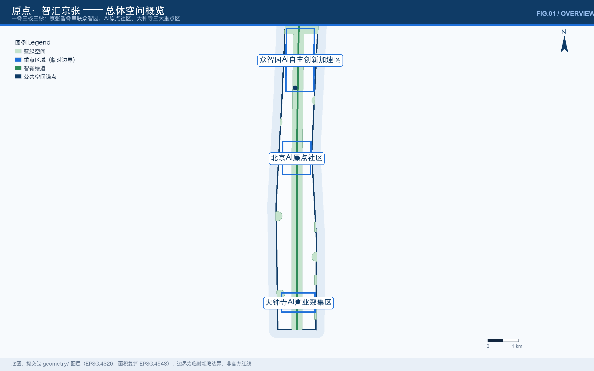
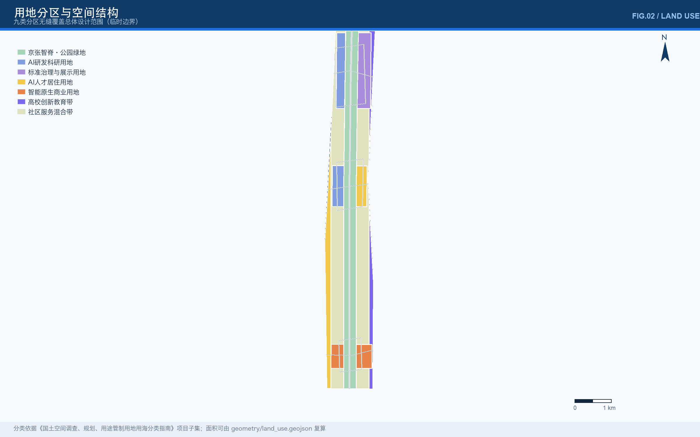
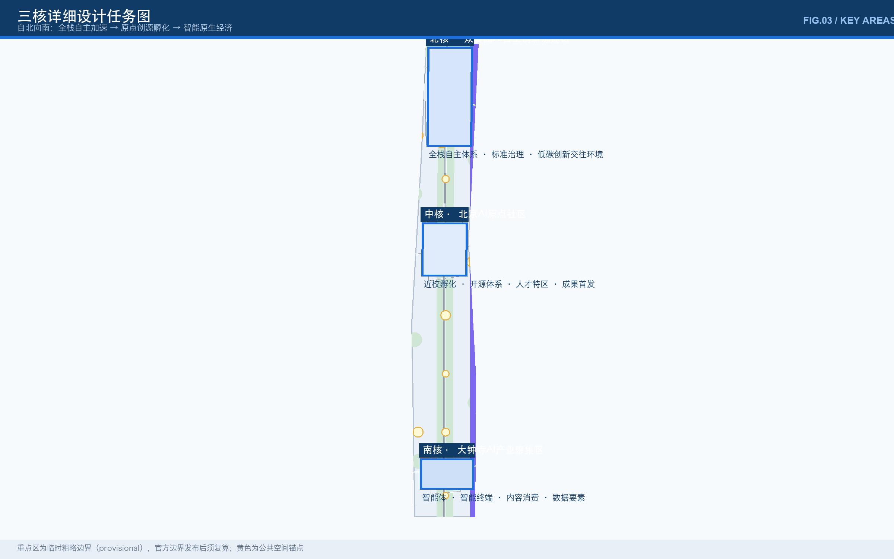
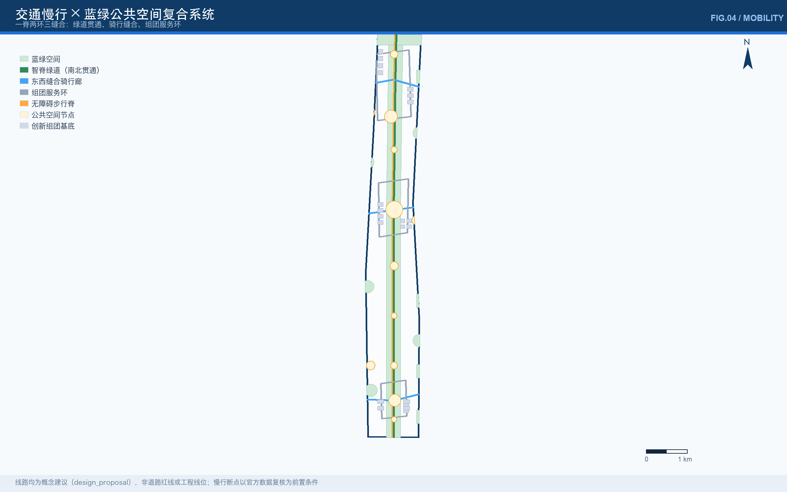
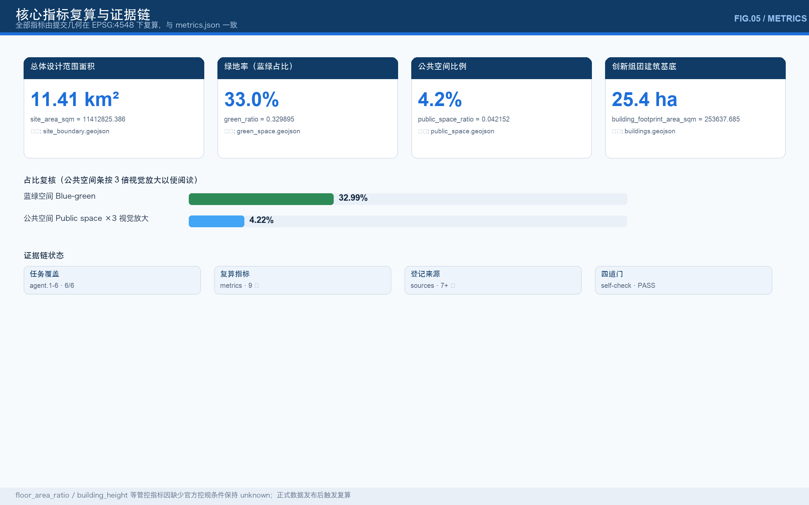

# 原点·智汇京张

> 百年前，这条铁路证明中国人可以自主设计干线工程；今天，这条走廊证明中国城市可以原生孕育人工智能。「原点」既是北京AI原点社区的空间锚点，也是全球 AI 创新的精神起点——每一次成果首发，都是一个新的原点。

## 设计依据与资料清单

本 formal 方案以北京市规划和自然资源委员会海淀分局发布的《百年京张AI创新带城市设计国际方案征集资格预审公告》为第一依据，并以 `brief/site-package/` 中经维护者登记的临时粗略边界、重点区域、枚举、指标和来源清单为机器可读依据。AI agent 在生成方案前已读取 `design_brief.json`、`allowed_design_space.json`、`sources.json`、`enums/`、`ranges/`、`schemas/`、`data/source_registry.json` 和 `data/processed/agent_fact_pack.md`，并以 `project_scope_summary.csv`、`agent_task_requirements.csv`、`source_use_matrix.csv`、`missing_data_checklist.csv` 建立任务、范围、资料用途和缺口清单。所有设计判断拆分为可追溯来源、可复算指标、可校验图层和可人工复核假设；文本叙述不替代 GeoJSON、指标表、A3 文册、A0 展板和 HTML 电子展示成果 [source:OFFICIAL-ANNOUNCEMENT] [source:AGENT-TASKBOOK] [depth:existing_conditions_diagnosis]。

资料登记表的使用边界如下 [source:SOURCE-REGISTRY]：

- `data/source_registry.json` 登记公开、清权与临时资料的用途边界。
- 当前登记摘要：formal 可用资料 7 条，背景资料 1 条，provisional-only 资料 1 条。
- 本方案不把 background_only 或 provisional_only 资料升级为 official boundary、法定控规、正式评分依据或政府实施承诺。

`data/processed/agent_fact_pack.md` 是本方案的阅读导航层，不是新的权威来源 [source:PROCESSED-FACT-PACK]；事实判断回到已登记的原始材料 [source:OFFICIAL-ANNOUNCEMENT] [source:AGENT-TASKBOOK]，完整来源关系由 `sources.json` 保存。

本方案在官方 `SITE_BOUNDARY` 与三处 `KEY_AREA` 精确边界尚未发布时，使用 `brief/site-package/geometry/provisional_boundaries.geojson` 生成临时 formal 包。`geometry/site_boundary.geojson` 与 `geometry/key_areas.geojson` 均标注为 `provisional_constraint`、`official_boundary=false`，仅用于方案生成、自检、可视化和设计讨论，不能作为 official redline、审批依据、精确面积依据或法定控制结论。该组织方数据缺口不阻断内容评分；替换 official polygons 后，site boundary、key areas、land use、roads、green space、public space、buildings、phasing 和 metrics 均需全量重算 [data:geometry/site_boundary.geojson#SITE-001] [metric:site_area_sqm]。

本次提交的可评分状态为：**临时边界，保留精度警示并待正式数据发布后复算；不阻断内容评分**。正文中的空间结构、场景、项目和指标均按"可讨论、可复核、可替换官方边界后重算"的原则写入。

## 总体概念：一脊三核三脉（agent.1）

### 概念生成逻辑

京张铁路的遗产不是铁轨本身，而是"自主设计、自主建造"的方法论。詹天佑在青龙桥用"人"字形线路把不可能的坡度变成可能——用系统设计突破单点极限。这个方法论与今天 AI 全栈自主创新（芯片—框架—模型—应用）同构。因此本方案不把铁路遗产做成静态布景，而是把它编译为城市创新操作系统：「原点·智汇京张」（Origin · Converging Intelligence on Jing-Zhang），简称「智汇京张」/ Origin Belt。

- **一脊**：京张智脊——以遗址公园为骨架的南北贯通绿道与公共空间主轴，9.7 公里串联全带 [data:geometry/roads.geojson#ROAD-001]。
- **三核**：众智园（北核·全栈自主加速）、北京AI原点社区（中核·创源孵化）、大钟寺（南核·智能原生经济）[data:geometry/key_areas.geojson#PROV-KEY-001] [data:geometry/key_areas.geojson#PROV-KEY-002] [data:geometry/key_areas.geojson#PROV-KEY-003]。
- **三脉**：文化叙事脉（百年京张→中关村→AI新文化）、生态蓝绿脉（清河—小月河—智脊绿地）、智慧服务脉（算力驿站—数据会客厅—开发者服务链）[data:geometry/green_space.geojson#GREEN-001] [data:geometry/public_space.geojson#PUBLIC-001]。

### 命名体系

| 层级 | 命名 | 英文 | 词根逻辑 |
| --- | --- | --- | --- |
| 一带主名 | 原点·智汇京张 | Origin · Converging Intelligence on Jing-Zhang | 原点=首发地/精神起点；智汇=智力汇聚 |
| 简称/口号 | 智汇京张 | Origin Belt | 国际传播短名 |
| 主轴 | 京张智脊 | Jing-Zhang Spine | 遗址公园的当代转译 |
| 三核 | 原点·众智·钟寺 | Origin / Convergence / Echo | 首发—汇聚—回声 |
| 节点词根 | 原点 Origin（首发类）、智汇 Convergence（交流类）、脉 Vein（连接类） | — | 全带命名一致性 |
| 年度活动 | 全球AI活动周·原点首发日 | AI Week / Origin Launch Day | 与运营体系联动 |

命名体系回应公告"三大定位"（百年京张文化带、都市AI生活体验带、AI融合创新带）：智脊承载文化带，三脉组织生活体验，三核落地融合创新。"五大功能"与"三区两翼"的协同回路见 compliance_matrix 中 agent.1 条目：众智园对应全栈自主体系与治理话语权，原点社区对应世界级创新生态，大钟寺对应智能原生新业态，中关村科技服务翼承接资本与 IP 赋能，小月河场景赋能翼承接场景与活力 [source:AGENT-TASKBOOK]。

### Logo 与视觉识别方向

- **图形方向**：把"人"字形线路抽象为两条交汇上升的折线，同时读作铁路坡道、神经元连接与数据流——百年工程符号与 AI 符号同构。禁止使用任何未清权字体、图片与企业标识。
- **色彩方向**：天青蓝（#1E6FD9，智能与天空）至深海蓝（#0F3B66，专业与历史）的双蓝主色，辅以原点橙作为首发时刻的强调色；全带导视、图纸、展板（含本方案 FIG.01–FIG.05）均按此体系执行。
- **延展方向**：三核各取主色变体（北核蓝、中核绿、南核暖橙），节点铭牌按"原点/智汇/脉"词根统一版式，构成可生长的识别系统。

## 三层范围工作框架

方案按公告三层组织：统筹研究范围（43.6 km²）关注 AI 产业生态、战略定位、创新链和未来城市形态；总体设计范围（11.4 km²，本包临时边界复算 11.41 km²）关注城市更新总体框架、产业空间布局、交通市政支撑和城市风貌控制；重点区域范围（368.4 ha）关注三处详细设计地区的功能业态、建筑规模、拆改留分类、公共空间连通和交通组织 [depth:three_level_scope_framework] [depth:overall_spatial_structure]。

| 层级 | 设计问题 | 方案回答 | 数据落点 |
| --- | --- | --- | --- |
| 统筹研究范围 | AI产业生态和未来城市形态如何组织 | 建立"高校策源—开源协作—企业转化—公共体验—国际传播"创新链 | compliance_matrix.json、standard_matrix.json |
| 总体设计范围 | 产业空间、城市更新、交通市政和风貌如何落图 | 九类用地分区+一脊三环三缝合交通+蓝绿复合系统 | [data:geometry/land_use.geojson#LU-001]、[data:geometry/roads.geojson#ROAD-001] |
| 重点区域范围 | 三处片区如何达到详细设计深度 | 三核分别给出定位、空间动作、AI场景和实施依赖 | [data:geometry/key_areas.geojson#PROV-KEY-001] 至 [data:geometry/key_areas.geojson#PROV-KEY-003] |

三层工作不是互相割裂的图纸集合：统筹研究决定产业链和城市形态判断，总体设计把判断落为用地、建筑、道路、绿地、公共空间和分期图层，重点区域详细设计验证具体地块的可实施性。任何无法从结构化数据复算的面积、比例、规模或项目数量，不写入正式结论 [depth:metrics_recalculation]。

## 统筹研究范围产业与未来城市研究

本节回应统筹研究范围（43.6 km²）的核心任务——构建世界级 AI 创新生态体系，并落实面向智能体任务书的 agent.2（生态案例与要素机制）；总体概念与命名体系（agent.1）见前章。方案梳理海淀高校院所、头部企业、算力算法数据要素、孵化平台与科技服务资源，提出 AI 创新链、产业链、人才链和城市服务链的空间协同框架：未来城市形态研究回答 AI 如何改变工作、生活、社交、学习、交通和公共服务，并把 AI 交通系统、连续绿色空间、创新服务设施和国际化生活工作氛围落实为可定位的功能区、节点、廊道和场景，而非泛泛的技术愿景 [source:AGENT-TASKBOOK] [standard:PROJECT-AGENT-OPEN-CALL-TASKBOOK]。

### 区域协同：从走廊到创新极弧

本带不是孤立走廊，而是北京国际科技创新中心"创新极弧"的中央脊梁：向北衔接北纬社区与未来科学城（能源与生命科学），向东衔接怀柔科学城（大科学装置），向南衔接经开区（产业化制造）与亦庄智能网联测试区；在京津冀尺度上，与天津算力与制造、雄安新区数字孪生城市形成"策源—试验—量产"分工。本带的生态位是**策源与首发**：高校密度与开源社区密度全球罕见，把"0→1 首发地"做深，把"1→N 量产"让渡给协同区域，用首发事件（原点广场）与标准话语权（众智园治理沙盒）把走廊变成极弧的组织中枢。协同机制建议：三城一区联合场景清单、跨区算力与数据调度协议、京津冀 AI 产业链地图共编（均为概念建议）[source:AGENT-TASKBOOK]。

### 规划创新：综合规划与空间产业融合的方法论

本方案对"综合规划、空间产业融合与国土空间规划创新"的三点方法论贡献（概念建议，供专业团队深化）：其一，**场景先行、边界后置**——在官方边界未发布阶段，用可替换的 provisional 几何 + 全量复算触发机制，把"数据缺位"从阻塞变成可管理的工程流程，为国土空间规划的数据契约化提供样本；其二，**贡献可记忆的空间治理**——把开源贡献、首发事件、治理参与写入城市空间的荣誉体系，使"数字贡献"成为可规划的国土空间资产（碑刻、荣誉墙、命名权），探索存量时代的非物质产权空间化；其三，**产业-空间颗粒度对齐**——九类用地分区与八要素机制一一挂接（土地↔分区、算力↔智慧服务脉节点、数据↔会客厅），让控规深度的用地语言与产业语言可互译，降低后续法定化的转译损耗。

### 全球案例研究

方案选取六个与"遗产/校区—AI产业—城市生活"高度可比的公开案例，均可在权威公开渠道核实：

| 案例 | 可比点 | 对本带的启示 |
| --- | --- | --- |
| 巴黎 Station F（拉法叶老车站仓库改建，2017） | 车站遗产改建为全球最大初创孵化器 | 车站遗产可直接转译为 AI 孵化容器；"原点社区"的组织原型 |
| 伦敦 King's Cross 知识区（车站片区更新） | 车站+运河遗产+谷歌伦敦总部+中央圣马丁 | 交通遗产门户可同时承载巨头与艺术院校，对应大钟寺站四象限 |
| 上海徐汇西岸（滨江工业遗产→"模速空间"大模型生态社区） | 工业遗产走廊整体转型 AI 高地 | "走廊式"而非"园区式"的 AI 城市更新路径，与京张走廊同构 |
| 深圳南山科技园—深圳大学环 | 校区—园区—社区互嵌 | 近校孵化与人才通勤半径的组织方式，对应原点社区 |
| 东京丸之内产学协创 | 企业总部群+大学都市中心 | 大企业开放实验室与街区共享，对应大钟寺智能原生商务 |
| 斯坦福研究园区—沙丘路 | 大学—风险资本—创业循环 | "策源—资本—转化"闭环的要素配置，对应中关村科技服务翼 |

### 生态图谱与要素机制

创新链五环节的空间落点：高校策源（学院路高校带 [data:geometry/land_use.geojson#LU-007]）→ 开源协作（原点社区开源发布厅）→ 企业转化（众智园加速区）→ 公共体验（智脊与三核公共空间）→ 国际传播（大钟寺路演客厅与钟寺回声厅）。八要素机制（概念建议，均为可供专业团队深化研究的方向，非确定承诺）：

| 要素 | 机制建议 | 空间落点 |
| --- | --- | --- |
| 土地 | 更新单元+混合用地弹性，先试场景后定业态 | 总体范围九类分区 |
| 空间 | 首发即展陈：路演厅、发布厅、测试场成为标配 | 三核公共空间组件库 |
| 产业 | 大企业开放实验室+中小企业场景券 | 大钟寺、众智园 |
| 资金 | 沿带设立早期基金联络处（对接中关村翼） | 原点社区转化街 |
| 人才 | 人才公寓+访客公寓+协作会员制 | [data:geometry/buildings.geojson#BLDG-001] 组团 |
| 算力 | 端侧算力驿站+低碳能源协同 | 智慧服务脉节点 |
| 数据 | 数据要素会客厅：合规、授权、可审计 | 大钟寺 |
| 场景 | 每年两批开放城市场景清单（见运营章节） | 全带 |

### 两翼支撑机制（中关村翼 × 小月河翼）

"三区两翼"中两翼不是配角而是要素配置器。**中关村科技服务翼**承担资本、IP 与全球资源接口：以中关村科学城的知识产权服务、早期基金与跨国机构网络为供给端，在本带的落点是原点社区转化街的"基金联络处+知识产权工作站"与 A-CONTROLS 级法律服务包，为三核输出"资本+权利"双通道。**小月河场景赋能翼**承担场景与活力供给：以小月河沿线居住、商业与高校日常为需求端，输出场景清单（AI+生活服务样板街 S09）、测试需求（T2 机器人配送）与公共体验路径（S10 活动周路线与智脊慢行环共用），让三核的技术在真实街区完成"最后一公里"验证。两翼与三核构成"需求从小月河来、资源从中关村来、首发回到原点广场去"的闭环回路。

## 总体设计范围城市更新与控规深度城市设计

总体设计范围要求达到控制性详细规划的城市设计深度：方案必须提出城市更新总体空间结构、低效空间识别、更新项目清单、实施政策建议、产业功能比例、空间组织模式、建筑总规模与综合承载能力评估。本方案以"九类用地分区 + 一脊三环三缝合交通骨架 + 蓝绿复合系统 + 21 处创新组团"四件套回答上述要求，并全部落为可校验图层：`geometry/land_use.geojson` 以九类分区无缝覆盖设计临时边界且无重叠（空间复核通过）[depth:land_use_layout]；`geometry/roads.geojson` 表达微循环、慢行和轨道接驳关系；`geometry/buildings.geojson` 表达更新建筑基底；`metrics.json` 复算核心面积、比例和图层数量。产业功能比例以用地分区表达：研发科研与教育文化类用地集中三核与高校带，居住与服务类用地组织脊侧与两翼，商业服务用地南聚大钟寺；建筑总规模因缺少官方控规条件保持 unknown（见指标章节）。更新项目清单与实施政策见"更新项目清单、实施政策与分期计划"章节；用地与建筑细节见下一章。

## 用地、建筑规模与拆改留方案

用地方案依据国土空间调查、规划、用途管制分类等公开标准表达，形成完整、闭合、无缝的用地分区 [standard:MNR-LAND-USE-CLASSIFICATION-GUIDE]：京张智脊公园绿地（1401）南北贯穿；三核分别落位科研（0802）、文化展示（0803）、居住（0701）与商业（05）；两翼为学院路高校创新教育带（0804）与西侧更新居住片区（0701）；脊侧为社区服务与混合更新带（0702）[data:geometry/land_use.geojson#LU-001]。用地分区完整覆盖临时边界、互不重叠，面积可由图层复算。

更新框架按"造场景—补服务—微更新"三级展开：三核以公共空间与场景容器为先导（造场景）；脊侧带补足社区服务与人才配套（补服务）；两翼以低扰动微更新与慢行织补为主（微更新）。建筑基底图层表达 21 处创新组团（AI研发 4、实验室 3、孵化器 4、人才公寓 4、智能经济办公 4、混合功能 2），区分保留、改造、更新、新建的类型学意图，基底总面积由几何复算 [data:geometry/buildings.geojson#BLDG-001] [metric:building_footprint_area_sqm]。建筑高度与体量控制的方法层级由 [depth:height_massing_character] 与 [depth:development_intensity_controls] 约束。拆改留分类在官方权属、现状建筑与控规条件发布前保持方法化表述，不输出地块级结论 [depth:retain_renovate_demolish]。

涉及建筑高度、开发强度、建筑密度、退线和设施标准的内容，均写为"待正式控规条件确认"，不以 agent 推测值冒充审定指标（floor_area_ratio 保持 unknown，见 metrics.json）。A3 文册给出更新项目清单和指标复核表，A0 展板表达关键空间结构和重点片区，HTML 页面提供指标和图层联动查看。

## 重点区域详细设计

重点区域详细设计是必选项；三处片区均在 `geometry/key_areas.geojson` 中以临时边界表达，正文、HTML、sources、assumptions 与 self_check 均醒目标注其 provisional 属性。设计表达覆盖功能业态、建筑形态、公共空间系统、交通组织、慢行连通与实施依赖，深度自查由 [depth:three_key_area_detailed_design] 约束。

### 北核·众智园AI自主创新加速区（约192.1 ha）

- **定位**：花园型全栈自主创新街区——国家平台、标准制定、安全治理与低碳创新交往环境。
- **空间动作**：强化清河界面为低碳创新廊（雨洪教育+碳积分步道 [data:geometry/green_space.geojson#GREEN-002]）；西侧布置 AI 研发组团、东侧布置标准治理与产业展示组团 [data:geometry/land_use.geojson#LU-002] [data:geometry/land_use.geojson#LU-003]；自主创新服务环串联测试场与展馆 [data:geometry/roads.geojson#ROAD-005]。
- **AI 场景**：自主模型开放测试场、标准制定工作坊、安全治理沙盒（可预约、可参观、可监管）、低碳算力体验中心。
- **实施依赖**：河道蓝线与防洪条件、对外交通组织复核、国家平台共建协议。

### 中核·北京AI原点社区（约104.3 ha）

- **定位**：近校型成果转化与人才社区——中国 AI 的"首发地"与精神原点。
- **空间动作**：校区—园区—街区慢行缝合（近校慢行环 [data:geometry/roads.geojson#ROAD-006]）；西部近校孵化组团+东部人才居住组团 [data:geometry/land_use.geojson#LU-004] [data:geometry/land_use.geojson#LU-005]；原点广场作为成果首发与公共生活中心 [data:geometry/public_space.geojson#PUBLIC-001]。
- **AI 场景**：开源发布厅、原点广场·成果首发、近校成果转化街（孵化/知识产权/投融资）、人才协作仓。
- **实施依赖**：校区边界协调、首层业态清权、轨道站点一体化方案。

### 南核·大钟寺AI产业聚集区（约72.0 ha）

- **定位**：城市型智能经济与国际交往街区——智能体、智能终端、内容消费与数据要素。
- **空间动作**：大钟寺站四象限步行连通（接驳环 [data:geometry/roads.geojson#ROAD-007]）；站前钟寺门户广场 [data:geometry/public_space.geojson#PUBLIC-003]；智能经济办公与混合组团沿轨道交通走廊布置 [data:geometry/land_use.geojson#LU-006]；规划绿地复合利用为路演剧场与声景花园。
- **AI 场景**：智能体展示客厅、数据要素会客厅、国际路演剧场、钟寺回声厅声景地标。
- **实施依赖**：轨道站点出入口方案、路口四象限产权协调、市政管线综合。

## AI 创新生态、人才画像与 AI+ 场景

方案建立面向 AI 人才和企业的空间需求画像，覆盖研发办公、开源协作、成果发布、企业服务、人才居住、社交学习、消费生活、运动休闲和国际交往；形成 13 张 AI 场景卡（10 张城市场景 + 3 个产业测试验证场景）与 5 类用户画像；场景-空间-运营映射的完整数据在 `visual/index.html` 场景区与 A3 文册第 3-5 页，可交互切换。每个场景标注隐私边界与人工复核机制，回应 [source:AGENT-TASKBOOK] 对 AI 原生（charter.4）与人本治理（charter.10）的要求。

| # | 场景卡 | 空间载体 | 设计说明 | 隐私与复核 |
| --- | --- | --- | --- | --- |
| S01 | 开源发布厅 | 原点社区 | 成果首发、代码贡献墙、小型路演 | 聚合统计，不采集个人行为轨迹 |
| S02 | 安全治理沙盒 | 众智园 | 红队测试、标准评测、可预约参观 | 脱敏数据；结论须人工复核签发 |
| S03 | 端侧算力驿站 | 智慧服务脉节点 | 推理服务、模型热更新、能耗可视 | 授权接入；能耗数据公开 |
| S04 | AI 慢行导航 | 智脊绿道 | 断点识别、拥挤提示、无障碍路径 | 低侵入传感；可解释导视 |
| S05 | 国际路演客厅 | 大钟寺 | 智能体发布、媒体日、国际洽谈 | 企业内容须清权 |
| S06 | 清河低碳创新廊 | 众智园临清河 | 雨洪教育、碳积分步道、科普展 | 环境数据聚合公开 |
| S07 | 近校成果转化街 | 原点社区 | 孵化、知识产权、投融资对接 | 成果数据须授权使用 |
| S08 | 数据要素会客厅 | 大钟寺 | 合规流通、审计追溯、资产登记 | 全程留痕、可审计、可撤回 |
| S09 | AI 生活服务样板街 | 社区商业界面 | AI+医疗/教育/法律/生活服务 | 服务推荐可一键关闭 |
| S10 | 全球AI活动周路线 | 一带公共空间 | 文化—开源—产业—路演步行环线 | 活动数据最小化 |
| T1 | 自动驾驶接驳测试 | 北五环—众智园 | L4 接驳试点走廊（概念建议） | 限监管沙盒内运行 |
| T2 | 机器人配送测试 | 三核组团 | 楼宇—公园末端配送验证 | 公共区域限速限区 |
| T3 | 城市智能体试点 | 治理场景 | 公共空间事件分派与复核 | 人在回路；公众可申诉 |

| 用户画像 | 典型需求 | 空间响应 | 自检边界 |
| --- | --- | --- | --- |
| 开源开发者 | 发布、协作、测试、社区声誉 | 原点广场、开源发布厅、夜间协作空间 | 不采集个人行为轨迹；活动数据只做聚合统计 |
| 初创团队 | 低成本办公、算力入口、产品试验场 | 众智园共享测试场、端侧算力驿站 | 算力和数据服务需另行授权 |
| 头部企业访客 | 展示、商务、国际接待、人才招聘 | 大钟寺路演客厅、站前门户、接驳环 | 企业标识和案例须清权 |
| 周边居民 | 通勤、休闲、社区服务、低扰动更新 | 智脊慢行环、社区服务嵌入、活动分级 | 居民画像不用于商业推荐 |
| 高校师生 | 成果转化、跨校协作、日常慢行 | 近校慢行环、转化街、教育带 | 校园数据和科研成果需授权 |

AI 治理建议遵守数据最小化、公开来源、可解释与人工复核原则：城市智能体可辅助识别慢行断点、公共空间热力、设施维护、企业服务需求和活动安全风险，但不替代规划审批、不输出未经授权的个人画像、不声称获得官方实施承诺。所有场景节点进入 [data:geometry/public_space.geojson#PUBLIC-001] 图层与合规矩阵 [depth:scenario_space_operation]。

## AI 公共空间、朝圣地标与荣誉体系（agent.4）

### 京张遗址公园 AI 公共空间系统

以"东西缝合、南北贯通"为概念策略：南北向 9.7 公里智脊绿道贯通 [data:geometry/roads.geojson#ROAD-001]，三条东西缝合骑行廊跨走廊联系高校带与居住片 [data:geometry/roads.geojson#ROAD-002] 至 [data:geometry/roads.geojson#ROAD-004]；12 个公共空间节点（原点广场、智汇客厅、钟寺门户+智脊开发者节点+东西缝合口）构成公共空间组件库：发布台、代码墙、测试台、荣誉碑、算力亭、导视塔六类标准组件按需组合 [data:geometry/public_space.geojson#PUBLIC-001] [depth:blue_green_public_space]。

### 三个 AI 朝圣地标（概念建议）

| 地标 | 位置 | 体验设计 | 精神叙事 |
| --- | --- | --- | --- |
| 原点广场 Origin Plaza | 中核 | 每一次重要成果首发，广场地面铭刻首发时刻与贡献者 ID（经授权） | "每一次首发都是新的原点" |
| 智汇灯塔 Convergence Beacon | 北核 | 开源贡献荣誉墙+全栈自主里程碑碑刻，夜间以数据流灯光演绎训练曲线 | "自主创新的接力" |
| 钟寺回声厅 Echo Hall | 南核 | 古钟声学与 AI 生成的对话声景；访客提问化作钟声涟漪 | "百年钟声与机器智能对话" |

荣誉体系与征集 Milestone 机制衔接：智能体贡献荣誉墙、人工智能里程碑、开源成果展示廊与全球开发者荣誉墙沿智脊布置，可持续更新，记录每年最杰出的贡献（碑刻形式、位置以最终评选、审批及实际落成为准）。所有地标设计为公共、可进入、可参与的日常空间，避免过度娱乐化与网红化。

## 文化叙事与导视系统（agent.5）

### 三文化融合叙事

- **百年京张文化（1909—）**："自主设计"的原点叙事。智脊北段保留铁路记忆线索，人字形线路符号转译为 Logo 与铺装纹样；清华园火车站记忆节点作为叙事起点。
- **中关村文化（1980s—）**："敢为天下先"的电子一条街到自主创新示范区叙事，由近校成果转化街与开源发布厅承接。
- **AI 新文化（2020s—）**：开源、共享、人机共生的开发者文化，由智脊节点群、开发者步道与荣誉墙承接。

三文化不是三个展区，而是一条连续的时间轴：沿智脊自北向南行走，即走过"钢铁自主—电子自主—智能自主"的三次浪潮，导览路线与 S10 活动周路线共用。文化表达避免把遗产当作科技装饰：铁轨、枕木、信号构件等实物遗存优先原位保护展示，具体文保要求以官方认定为准。

### 导视与符号系统

导视系统独立于一带 Logo 系统（避免混淆）：以"人字纹+数据流"为基础纹样，三色分区（北蓝/中绿/南橙）；标识分级为带级（智脊主标识）—核级（三核门户）—节点级（组件铭牌）；多语种（中/英+盲文与无障碍语音）。国际传播文案方向："Where a century of self-reliance meets the age of intelligence."（百年自强，遇见智能时代）——把詹天佑叙事转译为全球开发者可理解的精神资产 [standard:MOHURD-URBAN-DESIGN-MEASURES]。

## 长期运营与全球活动体系（agent.6）

### 年度活动体系（概念建议，非确定安排）

| 频率 | 活动 | 内容 | 转化路径 |
| --- | --- | --- | --- |
| 年度 | 全球AI活动周 | 京张开源峰会+开发者马拉松+成果首发夜+智脊公共日 | 国际人才→访客公寓→落地合作 |
| 年度 | 原点首发日 | 重大模型/产品全球首发 | 首发→展陈→总部对接 |
| 季度 | 智汇集市 | 开发者市集、场景开放日 | 场景需求→企业对接 |
| 月度 | 治理开放日 | 安全治理沙盒公众预约参观 | 公众参与→信任积累 |
| 常态 | 智脊晨跑代码 | 沿脊晨跑+移动编程驿站 | 社区黏性 |

### 开发者社区运营机制

以"贡献即身份"为核心：开源贡献、场景测试、数据集发布、治理参与四类行为进入贡献积分；积分对应空间权益（协作仓工位、测试场时段、路演席位）与荣誉展示（年度碑刻候选）。运营主体建议为"政府引导+平台公司+开发者自治委员会"三元结构，具体以官方确定为准。AI 场景开放运营：每年两批发布城市场景清单（含数据边界与验收标准），中小企业凭场景券申请试验。

### 国际传播与招引转化

传播主线"三浪叙事"（钢铁自主—电子自主—智能自主）+ 里程碑事件营销（首发、碑刻、活动周）；渠道为全球开发者社区、开源基金会合作、高校联盟。招引转化路径：国际访客→活动周体验→路演对接→访客公寓驻留→注册落地→生态贡献，每环节设置可度量指标（访客数、对接数、注册数、贡献数），作为运营绩效指标进入 metrics 第三类（待运营数据校准）。

## 交通、轨道、市政与公共服务设施

交通方案回应公告对轨道站点一体化、道路微循环、慢行断点、停车、非机动车停放和绿色交通系统的要求："一脊三环三缝合"——智脊绿道南北贯通，三核服务环与近校慢行环组织组团内部接驳，三条东西缝合骑行廊跨走廊联系 [data:geometry/roads.geojson#ROAD-001] 至 [data:geometry/roads.geojson#ROAD-008] [depth:traffic_rail_slow_parking]。重点覆盖北五环跨环路节点、五道口、清华东路西口、大钟寺站及重点企业周边的接驳组织；具体线位、红线与工程方案待官方条件。所有线路为概念建议（design_proposal），非道路红线或工程线位。

市政和公共服务设施覆盖 AI 产业服务设施、创新服务平台、人才生活服务设施、新型基础设施、分布式能源、端侧算力与传统市政设施融合：端侧算力驿站沿智慧服务脉布置，分布式能源与清河低碳廊的雨洪利用协同，公共服务设施按三核组团配置服务半径与运营模式（待正式深化）。管线、能源、排水、防洪、消防等工程资料列入正式深化前置条件 [depth:municipal_new_infrastructure] [data:geometry/constraints.geojson]。

## 蓝绿空间、公共空间与城市风貌

蓝绿空间方案以京张遗址公园活力带为骨架，统筹清河、小月河与周边高校、企业、社区的出行与休闲需求，提出南北贯通、东西连通的步道、骑行道和绿色空间体系。蓝绿系统由智脊公园绿地 [data:geometry/green_space.geojson#GREEN-001]、清河生态低碳界面 [data:geometry/green_space.geojson#GREEN-002]、小月河分段绿脉 [data:geometry/green_space.geojson#GREEN-003] 与五个邻里 AI 公园构成；其中小月河分段绿脉与学院路高校带为空间复合关系（五段滨水绿楔穿行教育科研用地，绿地不改变用地权属与功能分区），绿地率由提交几何复算为 32.99% [metric:green_ratio]；公共空间以原点广场、智汇客厅、钟寺门户等 12 个节点组织，公共空间比例 4.22% [metric:public_space_ratio] [data:geometry/public_space.geojson#PUBLIC-001]。设计意图：让蓝绿网络成为"都市AI生活体验带"的日常载体——开发者可在 15 分钟内从工位抵达自然界面；同时以绿量缓解走廊高强度开发的微气候与雨洪压力 [depth:blue_green_public_space]。

城市风貌方案融合京张铁路历史文化、中关村创新文化与 AI 新文化，利用清华园火车站等文化资源提出城市基调、建筑风貌、屋顶形态、体量、界面和公共艺术引导 [standard:MOHURD-URBAN-DESIGN-MEASURES]：基调为"蓝绿骨架+智性立面"，屋顶形态按三核分区差异化（北核测试场的大跨轻构筑、中核混合街区的坡顶记忆、南核门户地标的标志性体量）；导视标识、文化符号与 AI 朝圣地标见文化叙事章节；文保与控规依据以官方认定为准，缺少依据时给出的是设计建议而非控制线。指标含义：绿地率与公共空间比例的完整复算公式、来源文件和置信度保存在 `metrics.json`，正文数值与 visual 页 data-value 完全一致；当官方边界发布后，上述两项比例与蓝绿图层面状要素需同步复算。

## 更新项目清单、实施政策与分期计划

| 项目编号 | 项目名称 | 类型 | 主要依赖 | 证据引用 |
| --- | --- | --- | --- | --- |
| JZ-01 | 京张智脊绿道贯通（南北9.7km） | 公共空间/慢行 | 沿线权属、交通组织复核 | [data:geometry/roads.geojson#ROAD-001] |
| JZ-02 | 众智园清河低碳创新界面 | 蓝绿/产业展示 | 河道蓝线、生态防洪条件 | [data:geometry/green_space.geojson#GREEN-002] |
| JZ-03 | 原点社区近校成果转化街 | 城市更新/产业服务 | 校区边界、权属、首层业态 | [data:geometry/land_use.geojson#LU-004] |
| JZ-04 | 大钟寺站四象限步行连通 | 轨道一体化/慢行 | 轨道站点方案、交叉口、管线 | [data:geometry/roads.geojson#ROAD-007] |
| JZ-05 | 端侧算力驿站与服务节点链 | 新基建/公共服务 | 能源、算力、安全与运营主体 | [data:geometry/public_space.geojson#PUBLIC-001] |
| JZ-06 | 全球AI活动周公共路线 | 运营/品牌 | 公共空间许可、活动安全、清权 | [data:geometry/phasing.geojson#PHASE-001] |

分期与 100 天征集周期区分：实施分期为城市更新推进路径 [depth:phasing_implementation]。一期（0-3 年）原点社区先行区+智脊中段——以首发场景与社区营造快速形成"原点"认知；二期（3-6 年）众智园加速区+大钟寺门户区——产业规模与国际化；三期（6-10 年）两翼更新与全域运营——形成完整带状生态。轻量启动项（活动、导视、算力亭）可先于工程实施；涉及权属、控规、市政、交通的项目必须等待官方条件确认 [data:geometry/phasing.geojson#PHASE-001] 至 [data:geometry/phasing.geojson#PHASE-003]。

## 指标体系、面积复算与合规矩阵

三类指标分治：第一类空间指标由提交几何在 EPSG:4548 下复算——总体范围面积 11,412,825.386 ㎡、绿地率 32.9895%、公共空间比例 4.2152%、组团基底 253,637.685 ㎡、场景节点 12 个 [metric:site_area_sqm] [metric:green_ratio] [metric:public_space_ratio]；第二类管控指标（容积率、建筑高度、建筑密度、退线）保持 unknown 并说明原因；第三类运营绩效指标（首发数、访客数、贡献积分）待运营数据校准 [depth:metrics_recalculation]。

合规矩阵为任务响应性主控文件：公告 1.3/1.4/1.5 与 agent.1–agent.6 全部必选任务映射到章节、图层、指标、图纸与 HTML 证据；`compliance_matrix.json`、`standard_matrix.json`、`design_depth_matrix.json` 保存机器可读版本。`scripts/spatial_review.py` 与 `scripts/visual_review.py` 结果为 formal 自检证据。

## 风险、版权与合规说明

**双语契约。** 本方案主文件为中文，`proposal.en.md` 提供完整英文对照译文；A3/A0、HTML 与含文字图件均提供对应语言副本（.en.pdf / .en.html / .en.png）。所有图片、图纸、图标、数据与代码资产在 `sources.json` 或 `report/copyright_statement.md` 说明来源、许可与授权状态；HTML 页面不加载远程脚本、远程地图瓦片、远程字体、iframe、表单或外部 API，不跟踪评审者行为。

风险与缺资料清单由 [depth:risk_missing_data]、约束图层与场地包共同校核 [data:geometry/constraints.geojson] [source:SITE-PACKAGE]：official boundary、key area 精确边界、控规指标、道路红线、地块权属、建筑现状、市政、文保与公共服务数据缺口均已进入 `assumptions.json`、自检与本章。主要实施风险：跨环路慢行节点的工程可行性、轨道站点产权协调、场景数据治理的公众接受度、运营资金的长期性；对应缓解为前置条件清单+试点验证+三元运营结构。

本方案不声称官方批准、审定控规、最终土地权属、最终建设规模或保证实施。所有空间落地建议均为"概念建议、参考方案、可供专业团队深化研究"，不替代正式规划，不构成政府审定结论。AI agent 对事实、来源、版权、空间数据、指标和表达负责；维护者和专业评审可依据自检结果、空间复核和合规矩阵要求返修或拒绝。

## 参考资料

- brief/public-brief.md
- brief/site-package/design_brief.json
- brief/site-package/allowed_design_space.json
- brief/site-package/enums/ 与 brief/site-package/ranges/planning_limits.json
- data/processed/agent_fact_pack.md 及其索引的四张工作表
- 完整机器索引：`sources.json`、`metrics.json`、`compliance_matrix.json`、`standard_matrix.json` 与 `design_depth_matrix.json`
- 本节书目入口依据场地包登记，完整出处和许可见结构化来源清单 [source:SITE-PACKAGE]
