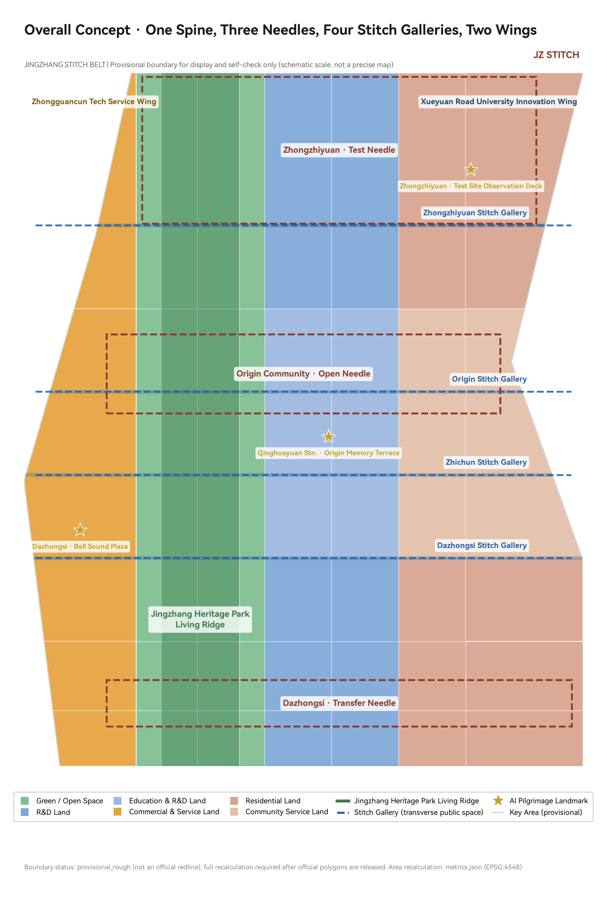
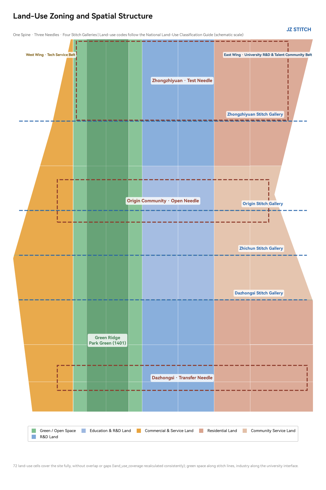
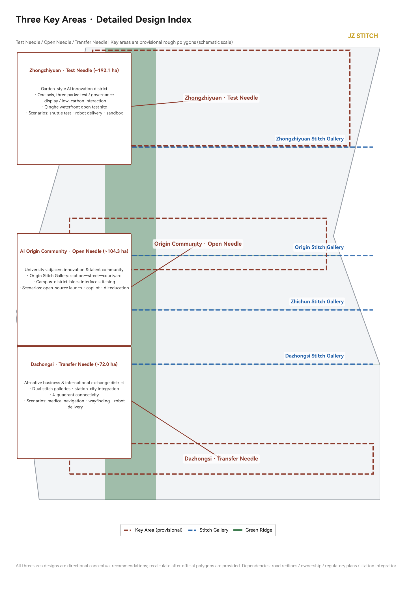
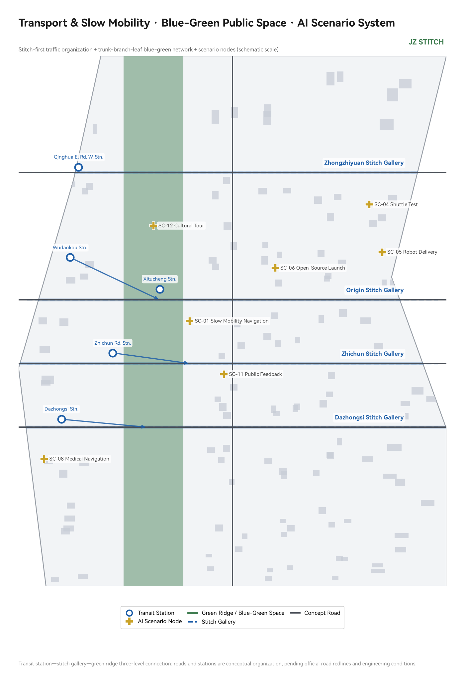
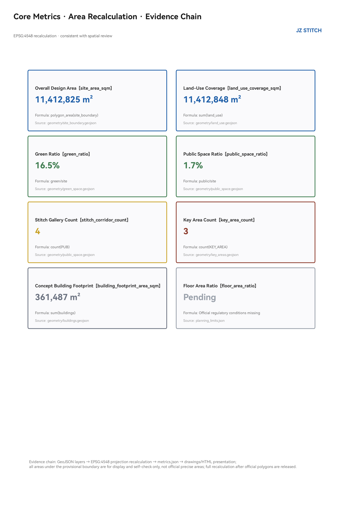

# JINGZHANG STITCH BELT

> **Core design logic: Stitch the "seam" left by a century-old railway into the city's "stitches."** This proposal does not draw a new "belt" but instead, centered on the real urban fissure of the heritage park left after the Jingzhang Railway was buried, proposes a complete set of "stitching" spatial actions — transversely stitching the east and west sides severed by the railway, longitudinally connecting the north-south breaks in the park's green spine, turning transit stations into stitching nodes, and hanging AI scenarios on every stitching point. All spatial recommendations are conceptual proposals, reference schemes, or materials for professional teams to deepen; they do not constitute statutory planning conclusions.

## Design Basis and Data Inventory

This proposal takes as its primary basis the "Pre-qualification Announcement for the International Urban Design Competition of the Centennial Jingzhang AI Innovation Corridor" issued by the Haidian Branch of the Beijing Municipal Commission of Planning and Natural Resources [source:DATA-SRC-OFFICIAL-ANNOUNCEMENT-20260509], uses the open-call taskbook excerpt for global agents as the task framework [source:DATA-SRC-AGENT-TASKBOOK-20260518], and draws on the provisional rough boundaries registered in the repository [source:DATA-SRC-PROVISIONAL-BOUNDARIES-20260605], the processed agent fact pack [source:DATA-SRC-PROCESSED-FACT-PACK-20260607], and three professional standards (Urban Design Management Measures [source:DATA-SRC-MOHURD-URBAN-DESIGN-MEASURES], Regulatory Planning Formulation and Approval Measures [source:DATA-SRC-MOHURD-CONTROL-DETAILED-PLANNING], and the Territorial Spatial Land-Sea Use Classification Guide [source:DATA-SRC-MNR-LAND-USE-CLASSIFICATION-202311]) as machine-readable references.

Standards and depth constraints observed: Announcement clauses 1.3/1.4/1.5 [standard:PROJECT-OFFICIAL-ANNOUNCEMENT], six agent tasks and co-creation charter [standard:PROJECT-AGENT-OPEN-CALL-TASKBOOK], urban design coordination requirements [standard:MOHURD-URBAN-DESIGN-MEASURES], regulatory planning depth requirements [standard:MOHURD-CONTROL-DETAILED-PLANNING], land-use classification codes [standard:MNR-LAND-USE-CLASSIFICATION-GUIDE]; the Architectural Engineering Design Document Depth Regulations (2016 edition) is listed as a pending data item due to missing official documentation [standard:MOHURD-ARCH-DESIGN-DEPTH-2016].

**Boundary and Area Declaration**: The current repository does not provide an official redline. This proposal uses the temporary rough boundary marked `provisional_constraint` in `brief/site-package/geometry/provisional_boundaries.geojson`. The overall design scope is approximately **1,141.3 hectares** (recomputed in EPSG:4548, [metric:site_area_sqm]), and the three key areas use temporary polygons with announced areas of approximately 192.1/104.3/72.0 hectares [metric:key_area_count]. This boundary is used only for proposal generation, visualization, and self-checking; it must not be treated as an official redline, approval basis, or precise area calculation reference [data:geometry/site_boundary.geojson#SITE-001]. The organizer's data gaps do not block content scoring. Upon release of official polygons, all layers and metrics of this proposal must be fully recomputed (see [depth:metrics_recalculation]). For the complete data gap inventory, see `assumptions.json` (A-BOUNDARY-001, A-CONTROLS-001, etc.) and `report/copyright_statement.md`.

## Three-Level Scope Framework

The proposal is organized according to the three-level scope defined by the announcement, cascading design intent and data evidence [data:geometry/site_boundary.geojson#SITE-001]:

| Level | Scope and Area | Work Objective | This Proposal's Response | Data Location |
| --- | --- | --- | --- | --- |
| Coordinated Study Scope | 43.6 km² (North 5th Ring Rd – Xizhimen Outer St, Jingzang Expressway – Wanquanhe Rd) | AI industry ecosystem and future urban morphology | Three-zone two-wing synergy loop, 6 global case studies, naming system | [source:DATA-SRC-OFFICIAL-ANNOUNCEMENT-20260509], [depth:industry_future_city_research] |
| Overall Design Scope | 11.4 km² (1–2 km urban area and industrial zone around Jingzhang Heritage Park) | Regulatory-planning-depth urban renewal overall design | One Spine, Three Needles, Four Stitch Galleries spatial structure, land-use layout, renewal framework | [data:geometry/land_use.geojson#LU-001], [depth:overall_spatial_structure] |
| Key Area Scope | Approximately 368.4 ha across three zones | Planning comprehensive implementation depth | Differentiated detailed design for three zones | [data:geometry/key_areas.geojson#PROV-KEY-001], [depth:three_key_area_detailed_design] |

The spatial relationship of the three levels is constrained by [depth:three_level_scope_framework]: the coordinated study level determines "what to stitch" (industry and urban morphology judgments), the overall level determines "how to stitch" (spatial structure and renewal projects), and the key area level verifies "whether the stitches hold" (plot-scale implementability). The spatial evidence chain is: boundary → land-use zoning → stitch galleries and green spine → building clusters → phasing, all deposited in `geometry/*.geojson` layers and recomputable [depth:existing_conditions_diagnosis].

## Coordinated Study Scope: Industry and Future City Research

### Naming System and Visual Identity Direction (agent.1)

**Primary Name: 京张缝合带**; English name **JINGZHANG STITCH BELT** (abbreviated JZ STITCH). Naming logic: The Jingzhang Railway was the first trunk railway independently designed and built by China. The heritage park left after its burial is the most authentic physical anchor of this urban corridor — it is not a belt that was "planned" but a seam that was "discovered." The word **Stitch** carries three meanings: spatially, stitching the east and west sides of the city severed by the railway; industrially, stitching together universities, enterprises, communities, and developers; temporally, stitching the starting point of independent innovation a century ago with the origin point of AI innovation today. Sub-naming: the green spine is called "Living Ridge," the three key areas are respectively called "Test Needle," "Open Needle," and "Transfer Needle," and transverse public spaces are called "Stitch Galleries" [source:DATA-SRC-AGENT-TASKBOOK-20260518].

**Logo and Visual Identity Direction**: The "needle and thread" motif — two short parallel lines and one diagonal line form a "stitch" symbol. The diagonal line draws from Zhan Tianyou's "herringbone" (人字形) railway switchback, and the double lines draw from railway tracks. Color system: rust red (railway heritage) + Haidian blue (innovation) + ecological green (public space). This direction corresponds to the three positionings required by the taskbook — "Centennial Jingzhang Cultural Corridor, Urban AI Living Experience Corridor, AI Integrated Innovation Corridor" — and can serve as a foundation for professional branding teams [standard:PROJECT-AGENT-OPEN-CALL-TASKBOOK] [depth:naming_and_logo].

### Three-Zone Two-Wing Synergy Loop and Five Functions

Following the taskbook's three-zone two-wing framework [source:DATA-SRC-AGENT-TASKBOOK-20260518], the proposal puts forward a **"Validate — Open-Source — Transfer"** synergy loop: Zhongzhiyuan (Test Needle) hosts the full-stack autonomous AI innovation system and safety governance testing; the AI Origin Community (Open Needle) organizes open-source collaboration, outcome releases, and talent services; Dazhongsi (Transfer Needle) faces intelligent-native new business formats and international exchange. Two-wing division of labor: the Zhongguancun Tech Service Wing provides factor allocation and capital empowerment; the Xueyuan Road University Innovation Wing (a supplementary expression in this proposal, corresponding to the functional content of the Xiaoyuehe Scenario Empowerment Wing) organizes scenario empowerment and public experience. The three needles and two wings are spatially interconnected through the Living Ridge and Stitch Galleries [data:geometry/land_use.geojson#LU-001].

### Global AI Innovation Ecosystem Case Studies (agent.2, 6 cases)

| Case | Location | Transferable Mechanism |
| --- | --- | --- |
| Kendall Square | Cambridge, USA | University–industry "zero-distance stitching": MIT's 5-minute walking radius organizes labs, incubators, and VCs. This proposal's Origin Community adopts the near-campus stitching logic |
| King's Cross Railway Heritage Regeneration | London, UK | Abandoned railway yard comprehensively regenerated into an innovation district; railway heritage becomes public space asset — isomorphic with the Jingzhang Heritage Park |
| one-north | Singapore | Research, residential, and commercial mixed within green corridors; public space as innovation interaction container |
| Shenzhen Bay Tech Eco-Park | Shenzhen, China | Vertical campus + ground-level public interface; industrial services and public life compounded |
| Station F | Paris, France | Abandoned train station transformed into the world's largest startup campus; railway heritage + startup community dual brand |
| Barcelona Superblocks | Barcelona, Spain | Releasing public space through road redistribution — the origin of this proposal's slow-traffic-priority logic for Stitch Galleries |

Common conclusion from the cases: **Successful AI innovation districts do not take "campus walls" as their boundary, but take public space stitching as their interface** [depth:ecosystem_cases]. Haidian's distinctive university density (Tsinghua, Peking University, Beihang, BUPT, Beijing Jiaotong distributed along the corridor) is the best Chinese carrier of the Kendall Square model.

### Future Urban Morphology

Facing AI-driven new quality productive forces, the proposal puts forward "three perceptibles": AI perceptible (scenario card system), governance perceptible (urban intelligence public interface), heritage perceptible (railway cultural narrative). At the coordinated study scope level, the proposal recommends guiding industrial layout with three indicators — "innovation density + public space accessibility + scenario openness" — to avoid industrial park-ification and spatial island-ization [metric:site_area_sqm].

## Overall Design Scope: Urban Renewal and Regulatory-Planning-Depth Urban Design

### Spatial Structure: One Spine, Three Needles, Four Stitch Galleries, Two Wings

The overall design scope adopts the "One Spine, Three Needles, Four Stitch Galleries, Two Wings" spatial structure, all deposited in land-use and green space layers [data:geometry/land_use.geojson#LU-001] [depth:overall_spatial_structure]:

- **One Spine**: Jingzhang Heritage Park Living Ridge ([data:geometry/green_space.geojson#GREEN-001]), the north-south green spine formed along the railway heritage, serving as the public space skeleton of the entire corridor. This proposal takes "low-intervention darning" as its principle — preserving railway memory elements, weaving in footpaths, cycleways, and activity nodes, without large-scale demolition and construction [metric:green_ratio].
- **Three Needles**: Three key areas as three functional stitches (see Key Area Detailed Design chapter for details).
- **Four Stitch Galleries**: Dazhongsi Stitch Gallery, Zhichun Stitch Gallery, Origin Stitch Gallery, and Zhongzhiyuan Stitch Gallery ([data:geometry/public_space.geojson#PUB-001] through [data:geometry/public_space.geojson#PUB-004]), transverse public space zones, the core spatial action of the "stitching" concept: each Stitch Gallery takes existing urban roads as its base and, through slow-traffic-priority retrofitting, cross-section reallocation, and street-corner space activation, reconnects the east and west blocks severed by the railway [metric:stitch_corridor_count].
- **Two Wings**: West side — Zhongguancun Tech Service Wing (commercial and business service land); East side — Xueyuan Road University Innovation Wing (scientific research and educational research land).

### Land-Use Layout

Land-use classification follows the Territorial Spatial Land-Sea Use Classification Guide [standard:MNR-LAND-USE-CLASSIFICATION-GUIDE], generating 72 land-use units within the provisional boundary, with full coverage, no overlaps, and no gaps [data:geometry/land_use.geojson#LU-001] [metric:land_use_coverage_sqm] [depth:land_use_layout]:

- Green space and open space land (1401): Living Ridge + east-west stitch green galleries, approximately **186,000 m²** (including Living Ridge and stitch green galleries, [metric:green_ratio] 0.164);
- Scientific research land (0802): Zhongzhiyuan side and southern industrial zone;
- Educational research and innovation service land (0804): East side of Origin Community, connecting to university interfaces;
- Commercial and business service land (05): West wing tech service belt and Dazhongsi zone;
- Residential and community service land (0701/0702): East edge talent community and community amenities.

Land-use layout logic: **Green space arranged along stitch lines, industry arranged along university interfaces, communities and innovation services as neighbors** — functions with the highest publicness and mix are prioritized on both sides of Stitch Galleries, ensuring the galleries are not merely passages but social spaces [standard:MOHURD-CONTROL-DETAILED-PLANNING].

### Urban Renewal Overall Framework

The renewal framework follows three principles: **"Retention as base, darning as primary, renewal as supplementary"** [depth:retain_renovate_demolish]: railway heritage, cultural protection elements, mature communities, and university interfaces are fully retained; dead-end roads, negative underpass spaces, and inefficient edge plots are activated through darning; low-efficiency industrial plots that genuinely require renewal are addressed primarily through functional replacement, without presupposing large-scale demolition and construction. Building clusters are expressed in [data:geometry/buildings.geojson#BLDG-001] (conceptual illustration, not representing existing conditions or retention/renovation/demolition conclusions, [metric:building_footprint_area_sqm]). Development intensity and building heights are entirely listed as to-be-confirmed due to missing official regulatory planning conditions [depth:development_intensity_controls] [depth:height_massing_character]; no approved numerical values are given.

## Key Area Detailed Design

All three key areas are expressed with provisional polygons ([data:geometry/key_areas.geojson#PROV-KEY-001], [data:geometry/key_areas.geojson#PROV-KEY-002], [data:geometry/key_areas.geojson#PROV-KEY-003]). Design conclusions are directional recommendations, to be recomputed upon official boundary release [depth:three_key_area_detailed_design].

### Zhongzhiyuan AI Autonomous Innovation Acceleration Zone (Test Needle, ~192.1 ha)

- **Positioning**: Garden-style AI autonomous innovation block, hosting the full-stack autonomous AI innovation system and safety governance testing.
- **Spatial Structure**: Taking the Qinghe River interface and the northern Living Ridge as the green base, organizing "one axis, three parks" — a central innovation axis threading the autonomous model testing park, safety governance exhibition park, and low-carbon innovation interaction park.
- **Key Actions**: The Zhongzhiyuan Stitch Gallery passes through the center of the zone, organizing external transport and transit connections; an open testing ground and public observation platform are arranged along the Qinghe River interface.
- **AI Scenarios**: Autonomous driving shuttle testing, robot delivery pilot, safety governance sandbox (see scenario cards SC-04/05/09 for details).
- **Implementation Dependencies**: Road redlines, river blue lines, regulatory planning conditions [source:DATA-SRC-PROCESSED-FACT-PACK-20260607].
- **Spatial Specificity**: The zone extends approximately 1.8 km along the Qinghe River. The "one axis, three parks" structure assigns distinct spatial characters: the testing park (north, adjacent to Qinghe) prioritizes open interfaces and safety buffers; the exhibition park (central) features a public observation deck at the Stitch Gallery intersection; the interaction park (south, near the university interface) is designed as a porous campus edge with shared courtyards. Building heights in the testing park are concept-limited to 24m (low-rise garden form), stepping up to 45m in the exhibition park for landmark legibility, subject to aviation and heritage review.

### Beijing AI Origin Community (Open Needle, ~104.3 ha)

- **Positioning**: Near-campus achievement transformation and talent community. The original site of the "AI origin" naming. A public carrier for open-source culture and developer spirit.
- **Spatial Structure**: The Origin Stitch Gallery traverses the zone horizontally, connecting the Qinghua Donglu Xikou transit station, the Open-Source Launch Hall, the Achievement Transformation Street, and the talent community, forming a "station–street–courtyard" structure.
- **Key Actions**: Three-interface stitching (campus–park–block); extending the existing vitality around Wudaokou into an open-source co-creation interface; establishing developer honor walls and other pilgrimage landmarks (see Blue-Green chapter).
- **AI Scenarios**: Open-source launch hall, enterprise service co-agent, AI+education (see scenario cards SC-06/07/10 for details).
- **Implementation Dependencies**: Campus boundaries, land ownership, ground-floor business activation guidance [depth:renewal_project_list].
- **Spatial Specificity**: The zone is organized around a 600m central segment of the Origin Stitch Gallery, forming a walkable "main street of open-source." The station end (west) hosts the Launch Hall and exhibition plaza (approximately 0.8 ha concept public space). The middle segment organizes achievement transformation blocks with ground-floor transparency requirements (concept: ≥60% transparent facade on Stitch Gallery frontage). The east end transitions into the talent community with a community green of approximately 1.2 ha. Building heights graduate from 36m (near station) to 24m (community edge), with height accent permission at the Launch Hall node (up to 60m, subject to heritage and aviation review).

### Dazhongsi AI Industry Cluster (Transfer Needle, ~72.0 ha)

- **Positioning**: Intelligent-native new business formats and international exchange block, organized around Dazhongsi Station TOD.
- **Spatial Structure**: Dual Stitch Gallery intersection (Dazhongsi + Zhichun), organizing "station-city integration, four-quadrant connectivity" — around the four quadrants of the transit station, arranging intelligent terminal exhibition, content consumption, data factor meeting rooms, and an international roadshow hall.
- **Key Actions**: Four-quadrant pedestrian connectivity at the station entrance (see Transportation chapter), compound use of planned green space, commercial interface renewal.
- **AI Scenarios**: AI+medical health navigation, AI slow-traffic navigation, robot delivery (see scenario cards SC-01/03/05/08 for details).
- **Implementation Dependencies**: Transit station integrated development conditions, land ownership, and municipal pipelines [source:DATA-SRC-PROCESSED-FACT-PACK-20260607].
- **Spatial Specificity**: The four quadrants are organized by primary function: Northwest quadrant — International Roadshow Hall and conference facilities (concept GFA ~50,000 m²); Northeast quadrant — intelligent terminal exhibition and content consumption (activated ground-floor retail with upper-floor innovation offices); Southwest quadrant — data element meeting rooms and industry associations; Southeast quadrant — mixed-use innovation services and hotel. The Stitch Gallery intersection forms the core public space "Bell Sound Plaza" (approximately 0.6 ha concept), serving as the annual event anchor. A below-grade pedestrian connection between the four quadrants is proposed as a direction, pending station structural conditions. Maximum building height at the station core is concept-capped at 80m (TOD landmark), stepping down to 36m at the periphery.

## AI Innovation Ecosystem, Talent Personas, and AI+ Scenarios

### User Personas (6 types, agent.3)

| Persona | Typical Needs | Spatial Response | Privacy and Review Boundary |
| --- | --- | --- | --- |
| Open-source developer | Release, collaboration, testing, reputation | Origin Open-Source Launch Hall, Honor Wall, night collaboration spaces | No collection of individual behavior traces; activity data displayed in aggregate |
| Startup team | Low-cost office, computing access, testing ground | Zhongzhiyuan shared testing ground, enterprise service co-agent | Computing and data services require separate authorization |
| Enterprise R&D staff | Exhibition, business, international exchange | Dazhongsi International Roadshow Hall, transit connection | Enterprise logos and cases must be rights-cleared |
| University faculty and students | Achievement transformation, cross-campus collaboration, daily slow traffic | Campus-park stitching interface, AI+education spaces | Campus data and research outputs require authorization |
| Surrounding residents | Commuting, leisure, community services | Living Ridge slow-traffic loop, Stitch Gallery street-corner spaces | Resident profiles not used for commercial recommendation |
| International visitors / conference attendees | Visiting, attending events, experiencing AI city | Public experience route, navigation agent | Visitor data collected minimally |

### AI Scenario Cards (12 cards, including 3 industrial test-validation scenarios)

Each scenario card maps to spatial layers and operating mechanisms [data:geometry/public_space.geojson#PUB-001] [data:geometry/roads.geojson#ROAD-001] [data:geometry/green_space.geojson#GREEN-001], and is checked against the public-space ratio metric [metric:public_space_ratio]:

| # | Scenario Card | Spatial Carrier | Service Target | Human Review Mechanism | Suggested Operator |
| --- | --- | --- | --- | --- | --- |
| SC-01 | AI slow-traffic navigation and breakpoint identification | Stitch Galleries / Living Ridge [data:geometry/roads.geojson#ROAD-001] | Residents, visitors | Breakpoint alerts reviewed by humans before publication | Park operator + transport dept |
| SC-02 | Living Ridge digital twin operations desk | Living Ridge [data:geometry/green_space.geojson#GREEN-001] | Operator, public | Facility maintenance recommendations confirmed by humans | Park operator |
| SC-03 | Dazhongsi Station four-quadrant pedestrian connection | Dazhongsi Stitch Gallery [data:geometry/public_space.geojson#PUB-001] | Commuters | Connection information reviewed by humans | Transit + subdistrict |
| SC-04 | Autonomous driving shuttle testing (Industrial Test ①) | Zhongzhiyuan testing ground [data:geometry/key_areas.geojson#PROV-KEY-001] | Enterprises, public observers | Testing permit system + safety officer + public notice | Test operations platform |
| SC-05 | Robot delivery pilot (Industrial Test ②) | Zhongzhiyuan / Dazhongsi [data:geometry/roads.geojson#ROAD-001] | Enterprises, residents | Low speed + designated routes + human takeover | Pilot operator |
| SC-06 | Origin open-source launch hall | Origin Community [data:geometry/public_space.geojson#PUB-003] | Developers | Content review + attribution mechanism | Open-source community + subdistrict |
| SC-07 | Enterprise service co-agent (Industrial Test ③) | Zhongzhiyuan / Origin [data:geometry/buildings.geojson#BLDG-001] | Enterprises | Policy information verified by humans | Park operator |
| SC-08 | AI+medical health navigation | Dazhongsi zone [data:geometry/key_areas.geojson#PROV-KEY-003] | Residents | Medical information professionally reviewed | Health authority |
| SC-09 | Safety governance sandbox exhibition | Zhongzhiyuan [data:geometry/key_areas.geojson#PROV-KEY-001] | Enterprises, public | Red-team testing + visitor appointment | Test operations platform |
| SC-10 | AI+education joint course space | Origin Community [data:geometry/key_areas.geojson#PROV-KEY-002] | Faculty, students | Course content approved by university | University + park |
| SC-11 | Urban intelligence public feedback desk | Stitch Gallery nodes [data:geometry/public_space.geojson#PUB-002] | Public | Suggestions forwarded to human handling with receipt | Subdistrict + government |
| SC-12 | Jingzhang culture AI guide | Living Ridge full length [data:geometry/green_space.geojson#GREEN-001] | Tourists, residents | Historical facts professionally verified | Culture and tourism dept |

All scenarios comply with the co-creation charter's public data boundaries and human review principles [source:DATA-SRC-AGENT-TASKBOOK-20260518]: no collection of personal privacy, no output of unverified policy commitments, no presentation of test scenarios as approved operations [standard:PROJECT-AGENT-OPEN-CALL-TASKBOOK] [depth:scenario_cards].

## Land Use, Building Scale, and Retention-Renovation-Demolition Strategy

Land-use layout and building clusters are detailed in the Overall Design chapter [data:geometry/land_use.geojson#LU-001] [data:geometry/buildings.geojson#BLDG-001]. This proposal explicitly sets out the following conceptual control directions, all pending official regulatory planning confirmation [depth:development_intensity_controls]:

- **Functional proportion**: Green space and open space approximately 16.4%; industrial and scientific research land as the main body; residential and community services organized along the east edge [metric:green_ratio];
- **Building scale**: "Build-to-line ratio + street wall height" guiding the interfaces on both sides of Stitch Galleries, without presupposing approved FAR [depth:height_massing_character];
- **Retention-renovation-demolition**: Railway heritage and mature communities retained, negative spaces darned, low-efficiency plots renewed — all plot-level conclusions pending existing-condition surveys and ownership confirmation [depth:retain_renovate_demolish];
- **Landmark**: Height accents permitted at the three Needle nodes, with specific heights to be reviewed against aviation, landscape, and heritage protection constraints.

## Transportation, Transit, Municipal Infrastructure, and Public Services

### Stitch-Priority Transportation Organization

The core transportation strategy is **"return the Stitch Galleries to slow traffic, make connection a single integrated act"** [depth:traffic_rail_slow_parking] [data:geometry/roads.geojson#ROAD-001]:

- **Transverse stitch roads**: The four Stitch Galleries take existing roads as their base, with cross-section reallocation (reducing vehicular lanes, expanding slow traffic and street-corner spaces), restoring east-west connections severed by the railway;
- **Transit connection**: Around Zhichun Road, Xitucheng, Dazhongsi, Qinghua Donglu Xikou, and other stations, organize "transit station – Stitch Gallery – Living Ridge" three-level connection, with the last kilometer as slow-traffic priority [metric:stitch_corridor_count];
- **Living Ridge service road**: A conceptual slow-traffic spine along the east side of the Living Ridge, threading the three Needles ([data:geometry/roads.geojson#ROAD-001]);
- **Parking and freight**: Encourage shared parking and night-time freight windows; logistics connection points arranged in coordination with test scenarios.

### Municipal and New Infrastructure

- **Edge computing**: Community-level computing service station prototypes arranged at Stitch Gallery nodes (to be deepened);
- **Energy**: Distributed photovoltaic + ground-source heat pump pilot recommended; energy loads pending professional calculation;
- **Municipal integration**: Pipeline corridors, stormwater utilization, and other directional recommendations; all engineering conditions to be supplemented [data:geometry/constraints.geojson#CONSTRAINTS] [depth:municipal_new_infrastructure];
- **Public services**: Innovation service platforms and talent service facilities arranged along Stitch Gallery nodes, with a concept service radius of 500m.

### Regional Synergy (agent.2 supplementary)

The Jingzhang Stitch Belt is not an isolated corridor. The proposal identifies four synergy interfaces with surrounding innovation clusters:

- **With Future Science City (Changping)**: The northern terminus of the Living Ridge conceptually extends toward Future Science City via the Jingzang Expressway corridor, forming a "northward innovation chain" — Future Science City's national laboratory cluster feeds fundamental research, while the Jingzhang Stitch Belt provides application testing grounds and open-source community infrastructure. A concept "AI Research Express" shuttle service along the corridor is proposed as a direction for further study.
- **With Huairou Science City**: Huairou's large scientific facilities generate cross-disciplinary data and computing demands. The Stitch Belt's enterprise service co-agent (SC-07) is designed with an interface to connect Huairou-based research teams with Haidian-based AI application enterprises, forming a "fundamental research — application validation" feedback loop.
- **With Beijing E-Town (Yizhuang)**: E-Town's autonomous driving test zones and intelligent manufacturing base complement the Stitch Belt's AI scenario testing. SC-04 (autonomous driving shuttle) and SC-05 (robot delivery) are designed to share test protocols and data formats with E-Town facilities, enabling cross-district scenario interoperability.
- **With Beijing-Tianjin-Hebei (Jing-Jin-Ji)**: The Dazhongsi International Roadshow Hall is positioned as a node in the broader Jing-Jin-Ji AI innovation exhibition network, connecting to Tianjin's computing infrastructure and Hebei's industrial application scenarios. The annual Jingzhang AI Week concept proposes satellite events in Tianjin and Xiong'an.

These synergy directions are conceptual and require inter-district coordination mechanisms, transportation planning alignment, and data governance agreements to be confirmed.

## Blue-Green Space, Public Space, and Urban Character

### Blue-Green Network

A "bone–branch–leaf" blue-green network with the Living Ridge as the backbone, stitch green galleries as transverse branches, and community green spaces as leaves [data:geometry/green_space.geojson#GREEN-001]: the Living Ridge runs north-south (including a conceptual node crossing the North 5th Ring Road), stitch green galleries connect east-west, and the Qinghe and Xiaoyuehe river interfaces reserve waterfront slow-traffic paths [metric:green_ratio] [metric:public_space_ratio].

### AI Pilgrimage Landmarks and Honor Display System (agent.4, 3 sites)

1. **Qinghuayuan Station · Origin Memorial Platform**: Taking the century-old station as the starting point, establishing a "From Jingzhang to AI" timeline axis and a developer contribution honor wall — open-source contributors can be inscribed, responding to the taskbook's "agent contribution honor wall" requirement [source:DATA-SRC-AGENT-TASKBOOK-20260518];
2. **Zhongzhiyuan · Testing Ground Observation Deck**: A public observation interface for open test scenarios, symbolizing the "spirit of verification";
3. **Dazhongsi · Bell Sound Plaza**: Taking bell culture as the motif, setting up an "AI Time Signal" public art installation and the main venue for annual events.

All landmarks follow principles of lightness, reversibility, and publicness; no enclosed facilities are established, and cultural protection and green space control boundaries are not encroached upon [standard:MOHURD-URBAN-DESIGN-MEASURES] [depth:blue_green_public_space].

### Cultural Narrative and Urban Character (agent.5)

**Three-line stitching narrative**: The starting point of the Jingzhang Railway's independent innovation (a century ago, "Made by China") → Zhongguancun's tech entrepreneurship tradition (reform and opening-up, "Created by China") → AI new culture's global collaboration (today, "Open-Sourced by China") — three timelines stitched on the Living Ridge into a walkable narrative path, configured with guide signage and public art [depth:existing_conditions_diagnosis]. Urban character tone: heritage interfaces "restored as original," stitch interfaces "old and new co-constructed," innovation interfaces "lightweight and transparent"; the color system is consistent with the Logo motif. All cultural symbols, typefaces, and images must be rights-cleared prior to use.

## Renewal Project List, Implementation Policy, and Phasing Plan

### Renewal Project List (12 conceptual items)

| ID | Project | Type | Location | Primary Dependencies | Phase |
| --- | --- | --- | --- | --- | --- |
| JZ-01 | Dazhongsi Stitch Gallery slow-traffic retrofit | Public space / Transport | Dazhongsi zone [data:geometry/public_space.geojson#PUB-001] | Road redline, transport specialist study | P1 |
| JZ-02 | Origin Stitch Gallery and Open-Source Launch Hall | Public space / Industry | Origin Community [data:geometry/public_space.geojson#PUB-003] | Ownership, ground-floor business type | P1 |
| JZ-03 | Zhichun Stitch Gallery street-corner activation | Public space | Zhichun Road [data:geometry/public_space.geojson#PUB-002] | Municipal pipelines | P2 |
| JZ-04 | Zhongzhiyuan Stitch Gallery and testing ground interface | Public space / Industry | Zhongzhiyuan [data:geometry/public_space.geojson#PUB-004] | Redline, testing permit | P2 |
| JZ-05 | Living Ridge northern section connection (cross-5th-Ring concept) | Blue-green / Transport | Living Ridge north [data:geometry/green_space.geojson#GREEN-001] | Crossing conditions, engineering review | P3 |
| JZ-06 | Qinghe River interface waterfront path | Blue-green | Zhongzhiyuan north edge [data:geometry/key_areas.geojson#PROV-KEY-001] | River blue line, flood control | P2 |
| JZ-07 | Origin Honor Wall and Memorial Platform | Culture / Brand | Origin Community [data:geometry/key_areas.geojson#PROV-KEY-002] | Heritage protection review | P1 |
| JZ-08 | Dazhongsi Station four-quadrant connection | Transit integration | Dazhongsi Station [data:geometry/roads.geojson#ROAD-001] | Station integrated development conditions | P2 |
| JZ-09 | Community-level computing service station prototype | New infrastructure | Stitch Gallery nodes | Energy, operating entity | P2 |
| JZ-10 | Talent community darning renewal | Residential | East edge community belt [data:geometry/buildings.geojson#BLDG-001] | Existing-condition surveys, ownership | P3 |
| JZ-11 | Urban intelligence public feedback desk | Governance / Digital | Stitch Gallery nodes [data:geometry/public_space.geojson#PUB-002] | Government service coordination | P1 |
| JZ-12 | Annual event system operations | Operations / Brand | Entire corridor [data:geometry/phasing.geojson#PHASE-001] | Event safety, copyright | P1 |

### RACI Responsibility Matrix

To clarify implementation accountability, each P1 project is assigned a concept RACI (Responsible, Accountable, Consulted, Informed) matrix:

| Project ID | Responsible (execution) | Accountable (decision) | Consulted (input) | Informed (awareness) |
| --- | --- | --- | --- |
| JZ-01 | Haidian Transport Committee | Haidian District Government | Adjacent property owners, transit operator, park operator | Public, surrounding communities |
| JZ-02 | Subdistrict Office + Park Operator | Haidian District Government | Open-source community representatives, university liaison, adjacent businesses | Developers, residents |
| JZ-07 | Cultural Heritage Bureau + Subdistrict | Haidian District Government | Railway heritage experts, developer community representatives | Public, media |
| JZ-11 | Government Services Bureau + Subdistrict | Haidian District Government | Digital government platform operator, community representatives | Public |
| JZ-12 | Culture and Tourism Bureau + Park Operator | Haidian District Government | Enterprise sponsors, university partners, open-source community | International visitors, media |

For P2 and P3 projects, RACI assignments are more dependent on conditions to be confirmed (regulatory planning, ownership, engineering feasibility) and are outlined as direction; a detailed RACI expansion is recommended in the next-stage implementation planning.

### KPI Framework

The proposal puts forward a concept measurable KPI framework aligned with the three implementation phases:

| KPI | Baseline (Year 0) | P1 Target (Year 1–2) | P2 Target (Year 3–5) | P3 Target (Year 5–10) | Measurement Method |
| --- | --- | --- | --- | --- |
| Stitch Gallery slow-traffic retrofit length | 0 km | 2.5 km (2 galleries) | 5.0 km (4 galleries) | 8.0 km (full network) | As-built survey |
| East-west pedestrian crossing points added | 0 | 8 (2 per P1 gallery) | 20 | 35+ | Site count |
| Public space area activated | Baseline public ROW only | +1.2 ha (street corners) | +3.5 ha | +6.0 ha | GIS area calculation |
| AI scenario cards deployed | 0 | 5 (SC-01/03/06/11/12) | 9 | 12 | Scenario audit checklist |
| Annual event participants | 0 | 5,000 (Year 1) | 20,000 | 50,000+ | Event attendance records |
| Open-source projects launched from Origin | 0 | 20 (Year 1) | 100 | 500+ | Public repository count |
| Developer honor wall inscriptions | 0 | 50 | 200 | 1,000+ | Honor wall registry |
| Transit-Stitch Gallery connection satisfaction | N/A | ≥70% user satisfaction | ≥80% | ≥85% | Annual user survey |
| Green coverage ratio (within scope) | ~16.4% (concept) | Maintain | +2% (community greening) | +5% (full network) | Remote sensing + site verification |
| Public feedback desk response rate | N/A | 100% within 5 working days | 100% within 3 working days | 100% within 2 working days | Government service log |

All KPIs are conceptual targets for discussion; baseline data, measurement protocols, and target calibration require confirmation with competent authorities.

### Phasing Plan

Spatial expression of phasing is in [data:geometry/phasing.geojson#PHASE-001] [depth:phasing_implementation]:

- **P1 Near-term (Stitch First, 1–2 years)**: Origin Stitch Gallery, Dazhongsi Stitch Gallery, and Honor Wall go first — using minimal intervention to establish "stitching" demonstration, simultaneously launching the public feedback desk and annual events [depth:renewal_project_list];
- **P2 Mid-term (Twin-Core Advance, 3–5 years)**: Zhongzhiyuan test scenarios and Dazhongsi station-city integration advance in parallel; Zhichun and Zhongzhiyuan Stitch Galleries deepened;
- **P3 Long-term (Full Corridor Completion, 5–10 years)**: Living Ridge north-south full connection, talent community darning, unified urban character, and global operating system formation.

### Global AI Innovation Activity System and Long-Term Operations (agent.6)

- **Annual event system**: Jingzhang AI Week (spring, open-source releases + scenario openings), Developer Stitch Festival (autumn, hackathons + outcome roadshows), Dazhongsi Bell Sound New Year AI Exhibition (winter) — all as conceptual proposals pending organizer confirmation [source:DATA-SRC-AGENT-TASKBOOK-20260518];
- **Developer community operations**: Honor wall inscription mechanism, monthly open-source launch events, contributor certificate system;
- **Scenario opening operations**: Test scenario "application–permit–public notice–rollback" four-step process;
- **International communication**: "From a century-old railway to the AI origin" narrative + English guide system + international roadshow hall;
- **Transformation pathway**: Events → scenario trials → enterprise services → landing policy matchmaking; the mechanism is written as an operations deepening direction, not constituting investment solicitation commitments [depth:scenario_cards].

## Indicator System, Area Recalculation, and Compliance Matrix

### Core Indicators (all recomputed in EPSG:4548, verified against spatial review)

| Indicator | Value | Formula and Source | Design Meaning |
| --- | --- | --- | --- |
| site_area_sqm | 11,412,825 | polygon_area(site_boundary) [data:geometry/site_boundary.geojson#SITE-001] | Overall design scope (provisional) [metric:site_area_sqm] |
| land_use_coverage_sqm | 11,412,848 | sum(land_use) [data:geometry/land_use.geojson#LU-001] | Land use full coverage, no overlaps (within tolerance) [metric:land_use_coverage_sqm] |
| green_ratio | 0.164 | green/site [data:geometry/green_space.geojson#GREEN-001] | Living Ridge + stitch green galleries as proportion of total [metric:green_ratio] |
| public_space_ratio | 0.017 | public/site [data:geometry/public_space.geojson#PUB-001] | Stitch Gallery public space proportion [metric:public_space_ratio] |
| stitch_corridor_count | 4 | count(PUB) | Number of Stitch Galleries [metric:stitch_corridor_count] |
| key_area_count | 3 | count(KEY_AREA) | Three key areas [metric:key_area_count] |
| building_footprint_area_sqm | 361,487 | sum(buildings) | Conceptual building cluster footprint (not existing conditions) [metric:building_footprint_area_sqm] |
| floor_area_ratio | unknown | — | Pending official regulatory planning conditions [metric:floor_area_ratio] |

### Compliance Matrix

- `compliance_matrix.json` covers all 17 mandatory tasks from Announcement clauses 1.3.1–1.5.3.3 and all six agent.1–agent.6 tasks, each mapped to chapters, layers, metrics, drawings, and self-check items [standard:PROJECT-OFFICIAL-ANNOUNCEMENT];
- `standard_matrix.json` covers 6 professional standards, of which 5 are addressed and 1 is data_gap (MOHURD-ARCH-DESIGN-DEPTH-2016 official document missing) [standard:MOHURD-ARCH-DESIGN-DEPTH-2016];
- `design_depth_matrix.json`: all 18 depth items complete [depth:metrics_recalculation];
- Self-check results in `self_check.json`: deterministic validation, spatial review, visual packaging, professional evidence — four conclusions.

## Risk, Copyright, and Compliance Statement

- **Data boundaries**: Only public or rights-cleared data used [source:DATA-SRC-OFFICIAL-ANNOUNCEMENT-20260509]; provisional boundaries do not impersonate official redlines [source:DATA-SRC-PROVISIONAL-BOUNDARIES-20260605];
- **Copyright**: All figures, tables, and text generated by AI agent based on public materials; no unauthorized materials; Logo direction is an original description, not using any existing trademarks [source:DATA-SRC-AGENT-TASKBOOK-20260518];
- **Privacy**: Scenario designs do not collect personal privacy or output individual profiles;
- **Compliance boundary**: All spatial, activity, and policy statements are conceptual proposals, not constituting government approval, investment commitment, or approved implementation arrangements [depth:existing_conditions_diagnosis];
- **AI generation responsibility**: This proposal was generated by an AI agent and submitted after review by the human account owner; generation method and limitations recorded in `agent.json`;
- **Pending data**: Official redline, three key area polygons, regulatory planning conditions, road redlines, existing building surveys, heritage protection control lines, municipal engineering conditions (complete inventory in `assumptions.json` and `risk.json`); this proposal's treatment and recalculation requirements for these gaps are in [depth:risk_missing_data];
- For detailed statements, see `report/copyright_statement.md`.

## References

This proposal's machine-readable reference files and evidence citation relationships are as follows (see [depth:metrics_recalculation] and [source:DATA-SRC-PROCESSED-FACT-PACK-20260607] for details):

- `brief/site-package/design_brief.json`, `agent_taskbook.json`, `allowed_design_space.json`
- `brief/site-package/geometry/provisional_boundaries.geojson`
- `brief/site-package/standards/standards.json` and `references/*.md`
- `data/source_registry.json`, `data/processed/agent_fact_pack.md`
- `docs/formal-submission-guide.md`, `docs/data-workflow.md`
- Global case sources: public official websites and news reports for each case (Kendall Square, King's Cross, one-north, Shenzhen Bay Tech Eco-Park, Station F, Barcelona Superblocks); the main text cites only their spatial organization experience, not unverified data.
