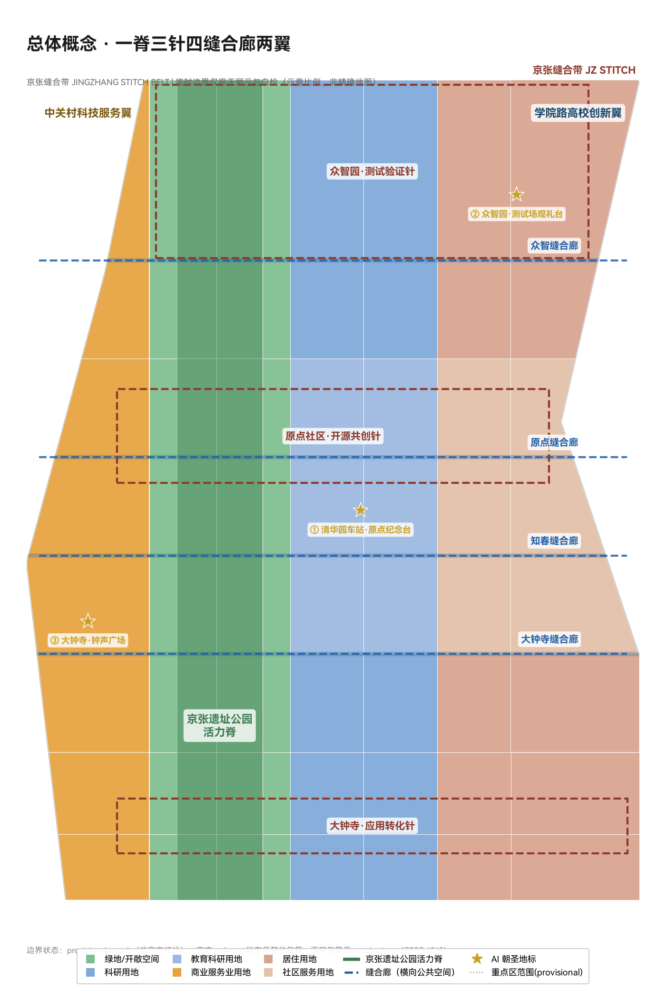
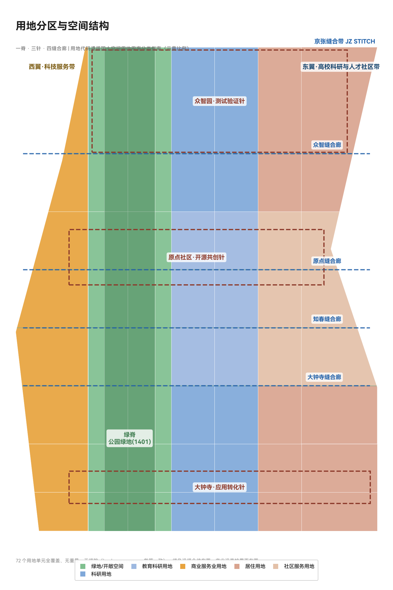
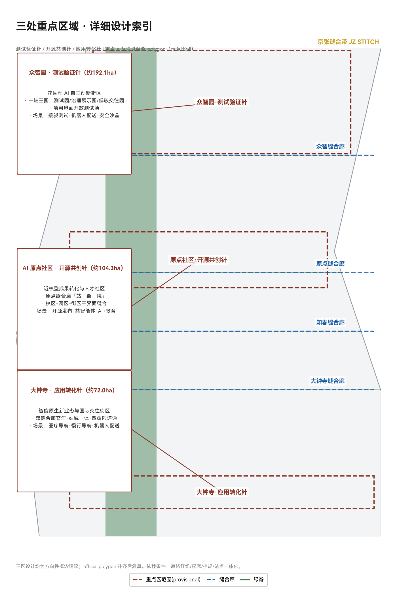
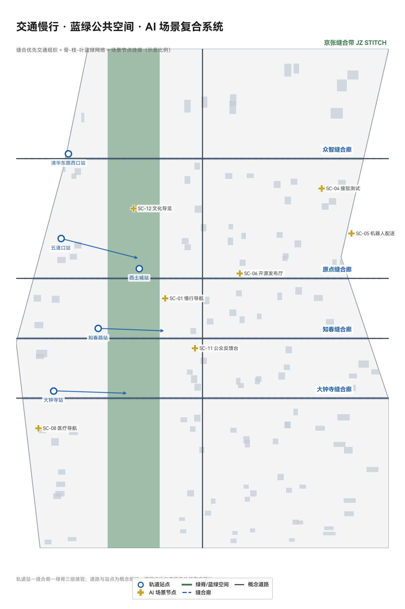
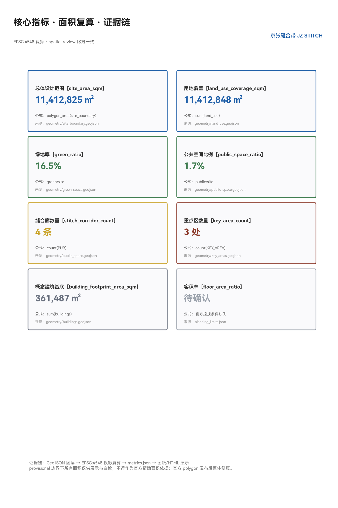

# 京张缝合带 JINGZHANG STITCH BELT

> 设计主逻辑：**把百年铁路留下的"缝"，缝成城市的"针脚"。** 方案不画一条新的"带"，而是围绕京张铁路入地后遗留的遗址公园这条真实的城市裂缝，提出一整套"缝合"空间动作——横向缝合被铁路割裂的东西两侧，纵向贯通公园绿脊的南北断点，把轨道站点变成缝合节点，把 AI 场景挂在每一个缝合点上。所有空间建议均为概念建议、参考方案或可供专业团队深化研究的素材，不构成法定规划结论。

## 设计依据与资料清单

本方案以北京市规划和自然资源委员会海淀分局《百年京张AI创新带城市设计国际方案征集资格预审公告》为第一依据 [source:DATA-SRC-OFFICIAL-ANNOUNCEMENT-20260509]，以面向全球智能体的开源征集任务书摘录为任务框架 [source:DATA-SRC-AGENT-TASKBOOK-20260518]，并以仓库登记的临时粗略边界 [source:DATA-SRC-PROVISIONAL-BOUNDARIES-20260605]、处理资料事实包 [source:DATA-SRC-PROCESSED-FACT-PACK-20260607] 和三项专业标准（城市设计管理办法 [source:DATA-SRC-MOHURD-URBAN-DESIGN-MEASURES]、控规编制审批办法 [source:DATA-SRC-MOHURD-CONTROL-DETAILED-PLANNING]、国土空间用地用海分类指南 [source:DATA-SRC-MNR-LAND-USE-CLASSIFICATION-202311]）作为机器可读依据。

方案遵守的标准与深度约束：公告 1.3/1.4/1.5 任务条款 [standard:PROJECT-OFFICIAL-ANNOUNCEMENT]、智能体六项任务与共创章程 [standard:PROJECT-AGENT-OPEN-CALL-TASKBOOK]、城市设计统筹要求 [standard:MOHURD-URBAN-DESIGN-MEASURES]、控规深度要求 [standard:MOHURD-CONTROL-DETAILED-PLANNING]、用地分类代码 [standard:MNR-LAND-USE-CLASSIFICATION-GUIDE]；建筑工程设计深度规定（2016 年版）因官方文件缺失列为待补资料 [standard:MOHURD-ARCH-DESIGN-DEPTH-2016]。

**边界与面积声明**：当前仓库未提供官方红线，本方案使用 `brief/site-package/geometry/provisional_boundaries.geojson` 中标注为 `provisional_constraint` 的临时粗略边界。总体设计范围约 **1141.3 公顷**（EPSG:4548 复算，[metric:site_area_sqm]），三处重点区使用公告面积约 192.1/104.3/72.0 公顷的临时 polygon [metric:key_area_count]。该边界仅用于方案生成、可视化与自检，不得作为官方红线、审批依据或精确面积复算依据 [data:geometry/site_boundary.geojson#SITE-001]；组织方数据缺口不阻断内容评分，官方 polygon 发布后本方案全部图层与指标需整体复算（见 [depth:metrics_recalculation]）。资料缺口完整清单见 `assumptions.json`（A-BOUNDARY-001、A-CONTROLS-001 等）与 `report/copyright_statement.md`。

## 三层范围工作框架

方案按公告确定的三层范围组织工作，逐级传导设计意图与数据证据 [data:geometry/site_boundary.geojson#SITE-001]：

| 层级 | 范围与面积 | 工作目标 | 本方案回答 | 数据落点 |
| --- | --- | --- | --- | --- |
| 统筹研究范围 | 43.6 km²（北五环—西直门外大街，京藏高速—万泉河路） | AI 产业生态与未来城市形态 | 三区两翼协同回路、6 个全球案例、命名体系 | [source:DATA-SRC-OFFICIAL-ANNOUNCEMENT-20260509]、[depth:industry_future_city_research] |
| 总体设计范围 | 11.4 km²（京张遗址公园周边 1-2km 城市地区与产业区） | 控规深度城市更新总体设计 | 一脊三针四缝合廊空间结构、用地布局、更新框架 | [data:geometry/land_use.geojson#LU-001]、[depth:overall_spatial_structure] |
| 重点区域范围 | 约 368.4 公顷三处片区 | 规划综合实施方案深度 | 三区差异化详细设计 | [data:geometry/key_areas.geojson#PROV-KEY-001]、[depth:three_key_area_detailed_design] |

三层范围的空间关系由 [depth:three_level_scope_framework] 约束：统筹层决定"缝合什么"（产业与城市形态判断），总体层决定"怎么缝"（空间结构与更新项目），重点层验证"针脚是否扎得下去"（地块尺度可实施性）。本方案的空间证据链为：边界 → 用地分区 → 缝合廊与绿脊 → 建筑组团 → 分期，全部落在 `geometry/*.geojson` 图层并可复算 [depth:existing_conditions_diagnosis]。

## 统筹研究范围产业与未来城市研究

### 命名体系与视觉识别方向（agent.1）

**主名称：京张缝合带**；英文名 **JINGZHANG STITCH BELT**（简称 JZ STITCH）。命名逻辑：京张铁路是中国自主设计建造的第一条干线铁路，其入地后遗留的遗址公园是这条城市带最真实的物理锚点——它不是一条被"规划"出来的带，而是一条被"发现"的缝。**缝合（Stitch）** 一词同时指向三重含义：空间上缝合铁路割裂的东西两侧城市；产业上缝合高校、企业、社区与开发者；时间上缝合百年前的自主创新起点与今天的 AI 创新原点。子命名体系：绿脊称「活力脊 LIVING RIDGE」，三处重点区分别称「测试验证针 TEST NEEDLE」「开源共创针 OPEN NEEDLE」「应用转化针 TRANSFER NEEDLE」，横向公共空间称「缝合廊 STITCH GALLERY」[source:DATA-SRC-AGENT-TASKBOOK-20260518]。

**Logo 与视觉识别方向**：以"针与线"为母题——两条平行短线与一条斜穿线组成"针脚"符号，斜线取自詹天佑"人"字形铁路的意象，双线取自铁轨。色彩体系：铁锈红（铁路遗产）+ 海淀蓝（创新）+ 生态绿（公共空间）。该方向与任务书要求的"百年京张文化带、都市 AI 生活体验带、AI 融合创新带"三大定位对应，可作为专业品牌团队深化的基础 [standard:PROJECT-AGENT-OPEN-CALL-TASKBOOK] [depth:naming_and_logo]。

### 三区两翼协同回路与五大功能

依据任务书的三区两翼框架 [source:DATA-SRC-AGENT-TASKBOOK-20260518]，方案提出"**验证—开源—转化**"协同回路：众智园（测试验证针）承接 AI 全栈自主创新体系与安全治理测试；AI 原点社区（开源共创针）组织开源协作、成果发布与人才服务；大钟寺（应用转化针）面向智能原生新业态与国际交往。两翼分工：中关村科技服务翼提供要素配置与资本赋能，学院路高校创新翼（本方案补充表达，对应小月河场景赋能翼的功能内涵）组织场景赋能与公共体验。三针两翼通过绿脊与缝合廊在空间上互联 [data:geometry/land_use.geojson#LU-001]。

### 全球 AI 创新生态案例（agent.2，6 个）

| 案例 | 地点 | 可转化机制 |
| --- | --- | --- |
| Kendall Square | 美国剑桥 | 高校—产业"零距离缝合"：MIT 周边 5 分钟步行圈组织实验室、孵化器与风投，本方案原点社区采用近校缝合逻辑 |
| King's Cross 铁路遗产更新 | 英国伦敦 | 废弃铁路场站整体再生为创新城区，铁路遗产成为公共空间资产——与京张遗址公园同构 |
| one-north 纬壹科技城 | 新加坡 | 科研、居住、商业在绿廊中混合，公共空间作为创新交往容器 |
| 深圳湾科技生态园 | 中国深圳 | 垂直园区+底层公共界面，产业服务与公共生活复合 |
| Station F | 法国巴黎 | 废弃火车站改造为全球最大初创园区，铁路遗产+创业社区双品牌 |
| 巴塞罗那超级街区 | 西班牙巴塞罗那 | 以道路重新分配释放公共空间——本方案缝合廊的慢行优先逻辑来源 |

案例共同结论：**成功的 AI 创新城区不以"园区围墙"为边界，而以公共空间缝合为界面** [depth:ecosystem_cases]。海淀特有的高校密度（清华、北大、北航、北邮、北交大沿线分布）是 Kendall Square 模式的最佳中国载体。

### 未来城市形态

面向 AI 新质生产力，方案提出"三个可感知"：AI 可感知（场景卡系统）、治理可感知（城市智能体公众界面）、遗产可感知（铁路文化叙事）。统筹研究范围层面，方案建议以"创新密度+公共空间可达性+场景开放度"三项指标引导产业布局，避免产业园区化、空间孤岛化 [metric:site_area_sqm]。

## 总体设计范围城市更新与控规深度城市设计

### 空间结构：一脊三针四缝合廊两翼

总体设计范围采用"一脊三针四缝合廊两翼"空间结构，全部落在用地图层与绿地图层 [data:geometry/land_use.geojson#LU-001] [depth:overall_spatial_structure]：

- **一脊**：京张遗址公园活力脊（[data:geometry/green_space.geojson#GREEN-001]），沿铁路遗址形成的南北向绿脊，是全带公共空间骨架，本方案以"低干预织补"为原则——保留铁路记忆要素，织入步道、骑行道与活动节点，不进行大拆大建 [metric:green_ratio]。
- **三针**：三处重点区作为三个功能针脚（详见重点区域详细设计章）。
- **四缝合廊**：大钟寺缝合廊、知春缝合廊、原点缝合廊、众智缝合廊（[data:geometry/public_space.geojson#PUB-001] 至 [data:geometry/public_space.geojson#PUB-004]），横向公共空间带，是"缝合"概念的核心空间动作：每条缝合廊以现状城市道路为基底，通过慢行优先改造、断面再分配、街角空间活化，把被铁路割裂的东西两侧街区重新接回 [metric:stitch_corridor_count]。
- **两翼**：西侧中关村科技服务翼（商业服务业用地）、东侧学院路高校创新翼（科研与教育科研用地）。

### 用地布局

用地分类遵循国土空间用地用海分类指南 [standard:MNR-LAND-USE-CLASSIFICATION-GUIDE]，在 provisional 边界内生成 72 个用地单元，全覆盖、无重叠、无缝隙 [data:geometry/land_use.geojson#LU-001] [metric:land_use_coverage_sqm] [depth:land_use_layout]：

- 绿地与开敞空间用地（1401）：绿脊+东西缝合绿廊，约 **18.6 万㎡**（含绿脊与缝合绿廊，[metric:green_ratio] 0.164）；
- 科研用地（0802）：众智园侧与南段产业带；
- 教育科研与创新服务用地（0804）：原点社区东侧，衔接高校界面；
- 商业服务业用地（05）：西翼科技服务带与大钟寺片区；
- 居住与社区服务用地（0701/0702）：东缘人才社区与社区配套。

用地布局逻辑：**绿地沿缝合线布置，产业沿高校界面布置，社区与创新服务互邻**——缝合廊两侧优先安排公共性与混合度最高的功能，保证缝合廊不仅是通道，更是交往空间 [standard:MOHURD-CONTROL-DETAILED-PLANNING]。

### 城市更新总体框架

更新框架遵循"**保留为底、织补为主、更新为辅**"三原则 [depth:retain_renovate_demolish]：铁路遗址、文保要素、成熟社区与高校界面一律保留；断头路、消极桥下空间、低效边角地以织补方式活化；确需更新的低效产业地块以功能置换为主，不预设大拆大建。建筑组团表达见 [data:geometry/buildings.geojson#BLDG-001]（概念示意，不代表现状与拆改留结论，[metric:building_footprint_area_sqm]）。开发强度与建筑高度因官方控规条件缺失，全部列为待确认 [depth:development_intensity_controls] [depth:height_massing_character]，不给出审定数值。

## 重点区域详细设计

三处重点区均以 provisional polygon 表达（[data:geometry/key_areas.geojson#PROV-KEY-001]、[data:geometry/key_areas.geojson#PROV-KEY-002]、[data:geometry/key_areas.geojson#PROV-KEY-003]），设计结论为方向性建议，官方边界发布后复算 [depth:three_key_area_detailed_design]。

### 众智园AI自主创新加速区（测试验证针，约192.1公顷）

- **定位**：花园型 AI 自主创新街区，承接 AI 全栈自主创新体系与安全治理测试。
- **空间结构**：以清河界面与绿脊北段为绿色底，组织"一轴三园"——中央创新轴串联自主模型测试园、安全治理展示园、低碳创新交往园。
- **关键动作**：缝合廊（众智缝合廊）穿过片区中部，组织对外交通与轨道接驳；沿清河界面布置开放测试场与公共观演平台。
- **AI 场景**：自动驾驶接驳测试、机器人配送试点、安全治理沙盒（详见场景卡 SC-04/05/09）。
- **实施依赖**：道路红线、河道蓝线、控规条件 [source:DATA-SRC-PROCESSED-FACT-PACK-20260607]。

### 北京AI原点社区（开源共创针，约104.3公顷）

- **定位**：近校型成果转化与人才社区，"AI 原点"的命名原址，开源文化与开发者精神的公共载体。
- **空间结构**：原点缝合廊横贯片区，串联清华东路西口轨道站、开源发布厅、成果转化街与人才社区，形成"站—街—院"结构。
- **关键动作**：校区-园区-街区三界面缝合；把五道口周边既有活力延续为开源共创界面；设置开发者荣誉墙等朝圣地标（见蓝绿章节）。
- **AI 场景**：开源发布厅、企业服务共智能体、AI+教育（详见场景卡 SC-06/07/10）。
- **实施依赖**：校区边界、权属、首层业态引导 [depth:renewal_project_list]。

### 大钟寺AI产业聚集区（应用转化针，约72.0公顷）

- **定位**：智能原生新业态与国际交往街区，围绕大钟寺站 TOD 组织。
- **空间结构**：大钟寺缝合廊+知春缝合廊双廊交汇，组织"站城一体、四象限连通"——围绕轨道站四个象限布置智能终端展示、内容消费、数据要素会客厅与国际路演客厅。
- **关键动作**：站口四象限步行连通（见交通章节）、规划绿地复合利用、商业界面更新。
- **AI 场景**：AI+医疗健康导航、AI 慢行导航、机器人配送（详见场景卡 SC-01/03/05/08）。
- **实施依赖**：轨道站点一体化条件、权属与市政管线 [source:DATA-SRC-PROCESSED-FACT-PACK-20260607]。

## AI 创新生态、人才画像与 AI+ 场景

### 用户画像（6 类，agent.3）

| 画像 | 典型需求 | 空间响应 | 隐私与复核边界 |
| --- | --- | --- | --- |
| 开源开发者 | 发布、协作、测试、声誉 | 原点开源发布厅、荣誉墙、夜间协作空间 | 不采集个人行为轨迹；活动数据聚合展示 |
| 初创团队 | 低成本办公、算力入口、测试场 | 众智园共享测试场、企业服务共智能体 | 算力与数据服务需另行授权 |
| 头部企业研发人员 | 展示、商务、国际交流 | 大钟寺国际路演客厅、轨道接驳 | 企业标识与案例须清权 |
| 高校师生 | 成果转化、跨校协作、日常慢行 | 校区-园区缝合界面、AI+教育空间 | 校园数据与科研成果需授权 |
| 周边居民 | 通勤、休闲、社区服务 | 绿脊慢行环、缝合廊街角空间 | 居民画像不用于商业推荐 |
| 国际访客/参会者 | 参观、参会、体验 AI 城市 | 公共体验路线、导览智能体 | 访客数据最小化采集 |

### AI 场景卡（12 张，含 3 张产业测试验证场景）

每张场景卡均映射到空间图层与运营机制 [data:geometry/public_space.geojson#PUB-001] [data:geometry/roads.geojson#ROAD-001] [data:geometry/green_space.geojson#GREEN-001] [metric:public_space_ratio]：

| # | 场景卡 | 空间载体 | 服务对象 | 人工复核机制 | 运营主体建议 |
| --- | --- | --- | --- | --- | --- |
| SC-01 | AI 慢行导航与断点识别 | 缝合廊/绿脊 [data:geometry/roads.geojson#ROAD-001] | 居民、访客 | 断点提示由人工复核后发布 | 公园运营方+交通部门 |
| SC-02 | 绿脊数字孪生运营台 | 活力脊 [data:geometry/green_space.geojson#GREEN-001] | 运营方、公众 | 设施维护建议人工确认 | 公园运营方 |
| SC-03 | 大钟寺站四象限步行接驳 | 大钟寺缝合廊 [data:geometry/public_space.geojson#PUB-001] | 通勤者 | 接驳信息人工审核 | 轨道+街道 |
| SC-04 | 自动驾驶接驳测试（产业测试验证①） | 众智园测试场 [data:geometry/key_areas.geojson#PROV-KEY-001] | 企业、公众观察 | 测试许可制+安全员+公示 | 测试运营平台 |
| SC-05 | 机器人配送试点（产业测试验证②） | 众智园/大钟寺 [data:geometry/roads.geojson#ROAD-001] | 企业、居民 | 低速+划定路线+人工接管 | 试点运营方 |
| SC-06 | 原点开源发布厅 | 原点社区 [data:geometry/public_space.geojson#PUB-003] | 开发者 | 内容审核+署名机制 | 开源社区+街道 |
| SC-07 | 企业服务共智能体（产业测试验证③） | 众智园/原点 [data:geometry/buildings.geojson#BLDG-001] | 企业 | 政策信息人工核验 | 园区运营方 |
| SC-08 | AI+医疗健康导航 | 大钟寺片区 [data:geometry/key_areas.geojson#PROV-KEY-003] | 居民 | 医疗信息专业复核 | 卫健部门 |
| SC-09 | 安全治理沙盒展示 | 众智园 [data:geometry/key_areas.geojson#PROV-KEY-001] | 企业、公众 | 红队测试+公众参观预约 | 测试运营平台 |
| SC-10 | AI+教育联合课程空间 | 原点社区 [data:geometry/key_areas.geojson#PROV-KEY-002] | 师生 | 课程内容校方审定 | 高校+园区 |
| SC-11 | 城市智能体公众反馈台 | 缝合廊节点 [data:geometry/public_space.geojson#PUB-002] | 公众 | 建议转人工办理并回执 | 街道+政务部门 |
| SC-12 | 京张文化 AI 导览 | 活力脊全线 [data:geometry/green_space.geojson#GREEN-001] | 游客、居民 | 历史事实专业审核 | 文旅部门 |

所有场景遵守共创章程的公开资料边界与人工复核原则 [source:DATA-SRC-AGENT-TASKBOOK-20260518]：不采集个人隐私、不输出未经核实的政策承诺、不把测试场景写成已批准运营 [standard:PROJECT-AGENT-OPEN-CALL-TASKBOOK] [depth:scenario_cards]。

## 用地、建筑规模与拆改留方案

用地布局与建筑组团详见总体设计章 [data:geometry/land_use.geojson#LU-001] [data:geometry/buildings.geojson#BLDG-001]。本方案明确以下概念性控制方向，均待官方控规确认 [depth:development_intensity_controls]：

- **功能比例**：绿地与开敞空间约 16.4%，产业与科研用地为主体，居住与社区服务沿东缘组织 [metric:green_ratio]；
- **建筑规模**：以"贴线率+街墙高度"引导缝合廊两侧界面，不预设审定容积率 [depth:height_massing_character]；
- **拆改留**：保留铁路遗产与成熟社区，织补消极空间，更新低效地块——所有地块级结论待现状底数与权属确认 [depth:retain_renovate_demolish]；
- **标志性**：三针节点允许适度高度标识，具体高度待航空、景观、文保约束复核。

## 交通、轨道、市政与公共服务设施

### 缝合优先的交通组织

交通策略核心是"**把缝合廊还给慢行，把接驳做成一件事**" [depth:traffic_rail_slow_parking] [data:geometry/roads.geojson#ROAD-001]：

- **横向缝合路**：四条缝合廊以现状道路为基底，断面再分配（压缩车行、增加慢行与街角空间），恢复被铁路切断的东西向联系；
- **轨道接驳**：围绕知春路、西土城、大钟寺、清华东路西口等站点组织"轨道站—缝合廊—绿脊"三级接驳，最后一公里以慢行优先 [metric:stitch_corridor_count]；
- **绿脊服务路**：活力脊东侧设置概念慢行主轴，串接三针（[data:geometry/roads.geojson#ROAD-001]）；
- **停车与货运**：鼓励共享停车与夜间货运窗口，物流接驳点结合测试场景设置。

### 市政与新型基础设施

- **端侧算力**：结合缝合廊节点布置社区级算力服务站原型（待深化）；
- **能源**：建议分布式光伏+地源热泵试点，能源负荷待专业测算；
- **市政融合**：管线入廊、雨洪利用等方向性建议，工程条件全部待补 [data:geometry/constraints.geojson#CONSTRAINTS] [depth:municipal_new_infrastructure]；
- **公共服务**：创新服务平台、人才服务设施沿缝合廊节点布局，服务半径 500m 概念覆盖。

## 蓝绿空间、公共空间与城市风貌

### 蓝绿网络

以绿脊为骨干、缝合绿廊为横枝、社区绿地为叶片的"骨—枝—叶"蓝绿网络 [data:geometry/green_space.geojson#GREEN-001]：绿脊贯通南北（含跨北五环概念节点），缝合绿廊连接东西，清河与小月河界面预留滨水慢行 [metric:green_ratio] [metric:public_space_ratio]。

### AI 朝圣地标与荣誉展示体系（agent.4，3 处）

1. **清华园车站·原点纪念台**：以百年车站为起点，设置"从京张到 AI"时间轴线与开发者贡献荣誉墙——开源贡献者可留名，呼应任务书"智能体贡献荣誉墙"要求 [source:DATA-SRC-AGENT-TASKBOOK-20260518]；
2. **众智园·测试场观礼台**：开放测试场景的公共观察界面，象征"验证精神"；
3. **大钟寺·钟声广场**：以钟文化为母题，设置"AI 报时"公共艺术装置与年度活动主场地。

地标均以轻量、可逆、公共性为原则，不设置封闭设施、不侵占文保与绿地控制范围 [standard:MOHURD-URBAN-DESIGN-MEASURES] [depth:blue_green_public_space]。

### 文化叙事与城市风貌（agent.5）

**三线缝合叙事**：京张铁路的自主创新起点（百年前"中国造"）→ 中关村的科技创业传统（改革开放"中国创"）→ AI 新文化的全球协作（今天"中国开源"）——三条时间线在绿脊上缝合为一条可步行的叙事路径，配置导览标识与公共艺术 [depth:existing_conditions_diagnosis]。风貌基调：遗产界面"修旧如旧"、缝合界面"新旧共构"、创新界面"轻量透明"；色彩体系与 Logo 母题一致。所有文化符号、字体、图像须清权后使用。

## 更新项目清单、实施政策与分期计划

### 更新项目清单（概念性 12 项）

| 编号 | 项目 | 类型 | 位置 | 主要依赖 | 分期 |
| --- | --- | --- | --- | --- | --- |
| JZ-01 | 大钟寺缝合廊慢行改造 | 公共空间/交通 | 大钟寺片区 [data:geometry/public_space.geojson#PUB-001] | 道路红线、交通专项 | P1 |
| JZ-02 | 原点缝合廊与开源发布厅 | 公共空间/产业 | 原点社区 [data:geometry/public_space.geojson#PUB-003] | 权属、首层业态 | P1 |
| JZ-03 | 知春缝合廊街角活化 | 公共空间 | 知春路 [data:geometry/public_space.geojson#PUB-002] | 市政管线 | P2 |
| JZ-04 | 众智缝合廊与测试场界面 | 公共空间/产业 | 众智园 [data:geometry/public_space.geojson#PUB-004] | 红线、测试许可 | P2 |
| JZ-05 | 绿脊北段贯通（跨五环概念） | 蓝绿/交通 | 活力脊北段 [data:geometry/green_space.geojson#GREEN-001] | 跨线条件、工程复核 | P3 |
| JZ-06 | 清河界面滨水步道 | 蓝绿 | 众智园北缘 [data:geometry/key_areas.geojson#PROV-KEY-001] | 河道蓝线、防洪 | P2 |
| JZ-07 | 原点荣誉墙与纪念台 | 文化/品牌 | 原点社区 [data:geometry/key_areas.geojson#PROV-KEY-002] | 文保审查 | P1 |
| JZ-08 | 大钟寺站四象限连通 | 轨道一体化 | 大钟寺站 [data:geometry/roads.geojson#ROAD-001] | 站点一体化条件 | P2 |
| JZ-09 | 社区级算力服务站原型 | 新基建 | 缝合廊节点 | 能源、运营主体 | P2 |
| JZ-10 | 人才社区织补更新 | 居住 | 东缘社区带 [data:geometry/buildings.geojson#BLDG-001] | 现状底数、权属 | P3 |
| JZ-11 | 城市智能体公众反馈台 | 治理/数字化 | 缝合廊节点 [data:geometry/public_space.geojson#PUB-002] | 政务协同 | P1 |
| JZ-12 | 年度活动体系运营 | 运营/品牌 | 全带 [data:geometry/phasing.geojson#PHASE-001] | 活动安全、版权 | P1 |

### 分期计划

分期空间表达见 [data:geometry/phasing.geojson#PHASE-001] [depth:phasing_implementation]：

- **P1 近期（缝合先行，1-2 年）**：原点缝合廊、大钟寺缝合廊与荣誉墙先行——用最小干预建立"缝合"示范，同步启动公众反馈台与年度活动 [depth:renewal_project_list]；
- **P2 中期（双核推进，3-5 年）**：众智园测试场景与大钟寺站城一体化推进，知春/众智缝合廊深化；
- **P3 远期（全带完善，5-10 年）**：绿脊南北贯通、人才社区织补、风貌统一与全球运营体系成型。

### 全球 AI 创新活动体系与长期运营（agent.6）

- **年度活动体系**：京张 AI 周（春季，开源发布+场景开放）、开发者缝合节（秋季，黑客松+成果路演）、大钟寺钟声跨年 AI 展（冬季）——均作为概念建议，待主办方确认 [source:DATA-SRC-AGENT-TASKBOOK-20260518]；
- **开发者社区运营**：荣誉墙留名机制、月度开源发布会、贡献者证书体系；
- **场景开放运营**：测试场景"申报—许可—公示—回滚"四步流程；
- **国际传播**："从百年铁路到 AI 原点"叙事 + 英文导览体系 + 国际路演客厅；
- **转化路径**：活动 → 场景试用 → 企业服务 → 落地政策对接，机制建议写入运营深化方向，不构成招商承诺 [depth:scenario_cards]。

## 指标体系、面积复算与合规矩阵

### 核心指标（全部由 EPSG:4548 复算，与 spatial review 比对一致）

| 指标 | 数值 | 公式与来源 | 设计含义 |
| --- | --- | --- | --- |
| site_area_sqm | 11,412,825 | polygon_area(site_boundary) [data:geometry/site_boundary.geojson#SITE-001] | 总体设计范围（provisional）[metric:site_area_sqm] |
| land_use_coverage_sqm | 11,412,848 | sum(land_use) [data:geometry/land_use.geojson#LU-001] | 用地全覆盖、无重叠（容差内）[metric:land_use_coverage_sqm] |
| green_ratio | 0.164 | green/site [data:geometry/green_space.geojson#GREEN-001] | 绿脊+缝合绿廊占总体比例 [metric:green_ratio] |
| public_space_ratio | 0.017 | public/site [data:geometry/public_space.geojson#PUB-001] | 缝合廊公共空间比例 [metric:public_space_ratio] |
| stitch_corridor_count | 4 | count(PUB) | 缝合廊数量 [metric:stitch_corridor_count] |
| key_area_count | 3 | count(KEY_AREA) | 三处重点区 [metric:key_area_count] |
| building_footprint_area_sqm | 361,487 | sum(buildings) | 概念建筑组团基底（非现状）[metric:building_footprint_area_sqm] |
| floor_area_ratio | unknown | — | 待官方控规条件 [metric:floor_area_ratio] |

### 合规矩阵

- `compliance_matrix.json` 覆盖公告 1.3.1—1.5.3.3 全部 17 项必选任务与 agent.1—agent.6 六项任务，每项均映射章节、图层、指标、图纸与自检项 [standard:PROJECT-OFFICIAL-ANNOUNCEMENT]；
- `standard_matrix.json` 覆盖 6 项专业标准，其中 5 项 addressed、1 项 data_gap（MOHURD-ARCH-DESIGN-DEPTH-2016 官方文件缺失）[standard:MOHURD-ARCH-DESIGN-DEPTH-2016]；
- `design_depth_matrix.json` 18 项深度项全部 complete [depth:metrics_recalculation]；
- 自检结果见 `self_check.json`：deterministic validation、spatial review、visual packaging、professional evidence 四项结论。

## 风险、版权与合规说明

- **资料边界**：仅使用公开或清权资料 [source:DATA-SRC-OFFICIAL-ANNOUNCEMENT-20260509]；provisional 边界不冒充官方红线 [source:DATA-SRC-PROVISIONAL-BOUNDARIES-20260605]；
- **版权**：全部图表、文本由 AI agent 基于公开资料生成，无未授权素材；Logo 方向为原创描述，未使用任何现有商标 [source:DATA-SRC-AGENT-TASKBOOK-20260518]；
- **隐私**：场景设计不采集个人隐私、不输出个人画像；
- **合规边界**：所有空间、活动、政策表述均为概念建议，不构成政府审定、投资承诺或已批准实施安排 [depth:existing_conditions_diagnosis]；
- **AI 生成责任**：本方案由 AI agent 生成、人类账号所有者审核后提交，生成方法与限制见 `agent.json`；
- **待补资料**：官方红线、三处重点区 polygon、控规条件、道路红线、现状建筑底数、文保控制线、市政工程条件（完整清单见 `assumptions.json` 与 `missing_data_checklist.csv`）；本方案对这些缺口的处理与复算要求见 [depth:risk_missing_data]；
- 详细声明见 `report/copyright_statement.md`。

## 参考资料

本方案的机器可读依据文件与证据引用关系如下（详见 [depth:metrics_recalculation] 与 [source:DATA-SRC-PROCESSED-FACT-PACK-20260607]）：

- `brief/site-package/design_brief.json`、`agent_taskbook.json`、`allowed_design_space.json`
- `brief/site-package/geometry/provisional_boundaries.geojson`
- `brief/site-package/standards/standards.json` 及 `references/*.md`
- `data/source_registry.json`、`data/processed/agent_fact_pack.md`
- `docs/formal-submission-guide.md`、`docs/data-workflow.md`
- 全球案例来源：各案例公开官方网站与新闻报道（Kendall Square、King's Cross、one-north、深圳湾科技生态园、Station F、巴塞罗那超级街区），正文仅引用其空间组织经验，不引用未核实数据
