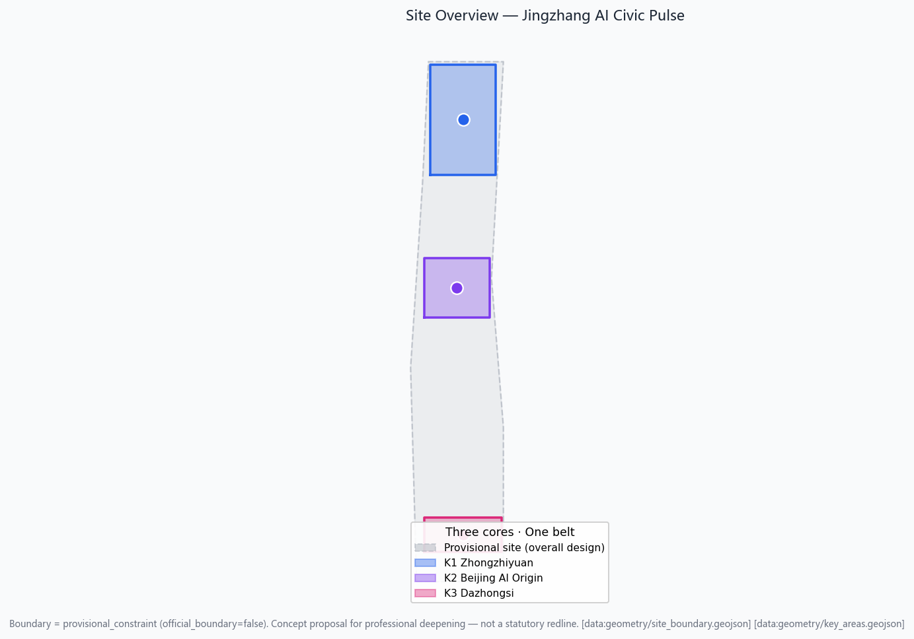
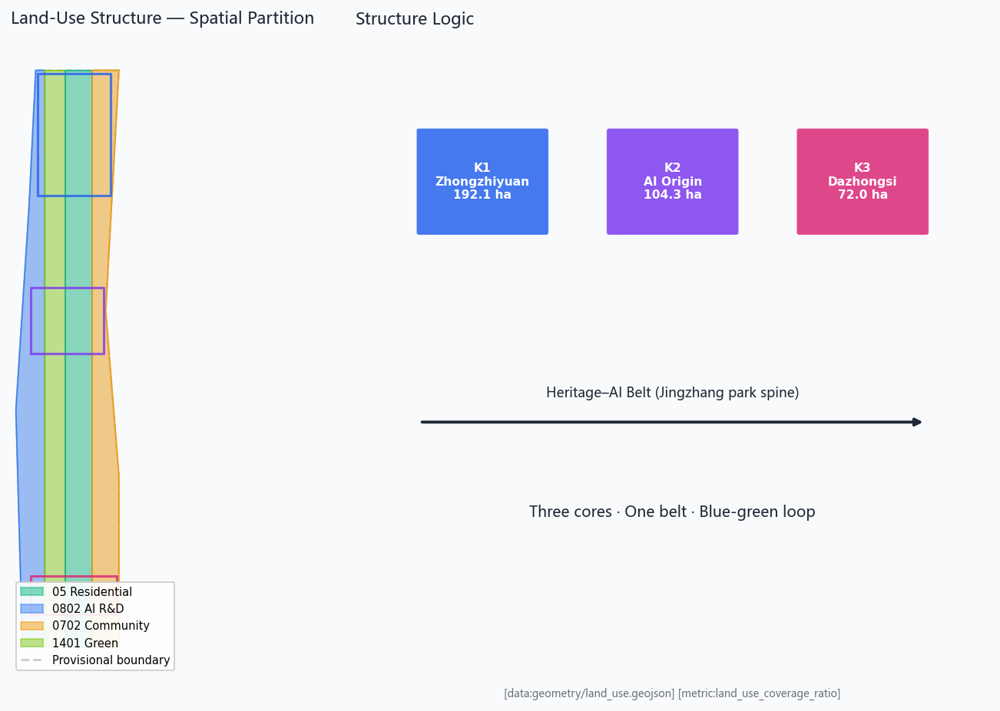
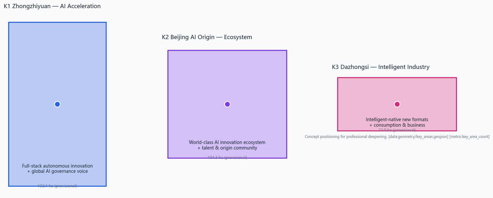
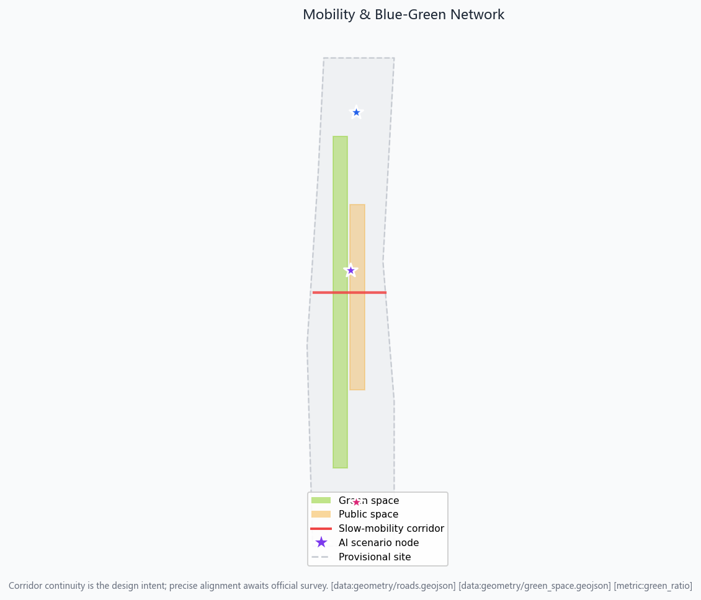
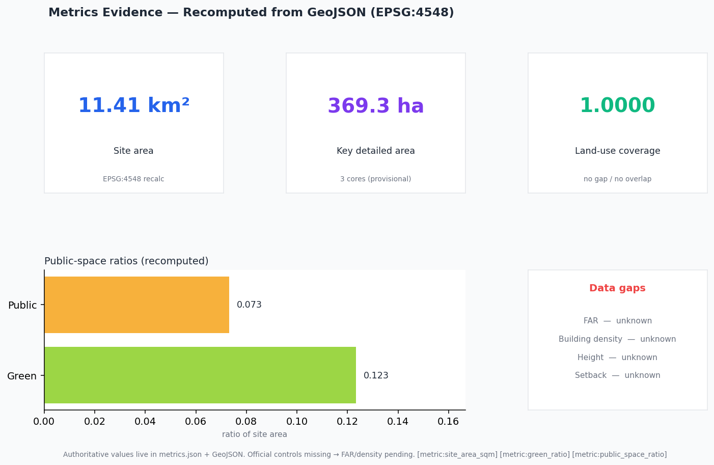

<!-- PARTICIPANT-DESIGN: Jingzhang AI Civic Pulse — concept proposal by TomatoCodeBase (ZCode Agent) from public sources and provisional boundary. -->

# Jingzhang AI Civic Pulse: An Agent-Co-Created Urban Narrative Belt on the Centennial Railway Heritage

## Design Basis and Source Inventory

This formal proposal takes the *International Design Open Call Prequalification Announcement for the Centennial Jing-Zhang AI Innovation Belt* issued by the Haidian Branch of the Beijing Municipal Commission of Planning and Natural Resources as its primary basis, and uses the provisional coarse boundary, key areas, enumerations, metrics and source inventories registered by maintainers under `brief/site-package/` as machine-readable inputs. Before generating the proposal an AI agent must read `design_brief.json`, `allowed_design_space.json`, `sources.json`, `enums/`, `ranges/`, `schemas/`, `data/source_registry.json` and `data/processed/agent_fact_pack.md`, and use `project_scope_summary.csv`, `agent_task_requirements.csv`, `source_use_matrix.csv` and `missing_data_checklist.csv` to build task, scope, source-use and gap inventories. Every design judgment must be decomposed into traceable sources, recomputable metrics, auditable layers and human-reviewable assumptions. The announcement requires the proposal to reach urban-design depth at the regulatory detailed-planning level and at the comprehensive-implementation-planning level, so narrative text cannot substitute for GeoJSON, metric tables, A3 booklets, A0 boards and the HTML electronic exhibit.

The proposal is not a free-standing vision text; it organizes deliverables from the announcement, the agent open-call taskbook and the site package. This section places only the most decisive evidence next to each judgment [source:OFFICIAL-ANNOUNCEMENT] [source:AGENT-TASKBOOK] [depth:existing_conditions_diagnosis]. The complete source and standards coverage is kept in `sources.json`, `standard_matrix.json` and `design_depth_matrix.json`; the body does not repeat the machine index.

The usage boundary of the source registry is as follows [source:SOURCE-REGISTRY]:

- `data/source_registry.json` registers the usage boundary of public, cleared and provisional sources.
- Current summary: formal-ready sources 5, background-only 0, provisional-only 1.
- An agent must not upgrade background_only or provisional_only material into official boundary, statutory control, formal scoring evidence or government implementation commitment.

`data/processed/agent_fact_pack.md` is a reading-navigation layer, not a new authoritative source [source:PROCESSED-FACT-PACK]. It helps the agent organize the three scope levels, the three key areas, announcement tasks, agent.1-agent.6, source availability and missing-data items into a readable proposal; factual judgments still return to the registered original materials [source:OFFICIAL-ANNOUNCEMENT] [source:AGENT-TASKBOOK], with the complete source graph held in `sources.json`.

This package, when official `SITE_BOUNDARY` or the three `KEY_AREA` polygons are not yet available, uses `brief/site-package/geometry/provisional_boundaries.geojson` to produce a provisional formal package. Both `geometry/site_boundary.geojson` and `geometry/key_areas.geojson` must be flagged as `provisional_constraint` with `official_boundary=false`; they may be used only for proposal generation, self-check, visualization and design discussion, and must not serve as an official redline, approval basis, precise-area basis or statutory control conclusion. This organizer-side data gap does not block content scoring; once official polygons are substituted, site boundary, key areas, land use, roads, green space, public space, buildings, phasing and metrics must all be recomputed.

The scorable state of this package is: **provisional boundary, precision caveat retained, pending recomputation on official data release; does not block content scoring.** Accordingly, every spatial structure, scenario, project and metric in the body is written as "discussable, re-checkable, and recomputable after official boundary substitution." When official boundary and key-area polygons are updated, the agent must re-run scaffolding, self-check and drawing/HTML generation; it cannot simply swap a single file.

Boundary interpretation returns to the overall-scope layer and area recomputation [data:geometry/site_boundary.geojson#SITE-001] [metric:site_area_sqm]. The three key areas are cross-checked by an independent layer and a count metric [data:geometry/key_areas.geojson#PROV-KEY-001] [metric:key_area_count]. Readers can thus step from the body into the evidence without first parsing a string of machine identifiers.

## Three-Level Scope Working Framework

The proposal organizes work along the three levels fixed by the announcement: the coordinated research area addresses the AI industry ecosystem, strategic positioning, innovation chain and future-city form across 43.6 km²; the overall design area addresses the 11.4 km² urban area and industrial zones within 1-2 km of the Jingzhang heritage park, requiring an overall urban-renewal framework, industrial spatial layout, transport/municipal support and urban-character control; the key detailed-design area covers the 368.4 ha across three detailed-design districts, requiring clarity on function and format, building scale, retain/renovate/demolish classification, public-space continuity and transport organization. The three levels are mapped item by item in `compliance_matrix.json`, ensuring that the mandatory tasks of announcement sections 1.3, 1.4, 1.5 and agent.1-agent.6 each have section, layer, metric, drawing and HTML evidence.

The depth of the three-level framework is governed by [depth:three_level_scope_framework] and [depth:overall_spatial_structure]; spatial evidence is anchored at [data:geometry/site_boundary.geojson#SITE-001] and [data:geometry/key_areas.geojson#PROV-KEY-001]; the task basis follows [standard:PROJECT-OFFICIAL-ANNOUNCEMENT]; the scope index navigates via the three-level scope table in `project_scope_summary.csv` within [source:PROCESSED-FACT-PACK].

The three levels are not isolated drawing sets. Coordinated research decides the industry-chain and urban-form judgments; overall design translates them into renewal projects, spatial structure and facility capacity; key-area detailed design verifies the implementability of specific parcels, buildings, transport, public space and AI application scenarios. When generating the proposal, the agent must first lock the official or provisional boundary and constraints adopted by this submission, then generate land use, buildings, roads, green space, public space, phasing and AI service nodes, and finally recompute metrics from these layers and explain in the body which conclusions remain constrained by the provisional boundary. Any area, ratio, scale or project count that cannot be recomputed from structured data must not be written as a formal conclusion.

The master concept proposed here is "Jingzhang AI Symbiotic Pulse Belt": with the Jingzhang heritage park as the historical and public-space spine, the three key areas (Zhongzhiyuan, Beijing AI Origin Community, Dazhongsi) as innovation anchors, and universities, enterprises, communities and rail stations as the everyday network, forming a spatial organization of "one belt, three cores, multi-point scenarios, and a blue-green slow-mobility composite loop." The "one belt" is not a new redline; it is a translation of the announcement's three levels into a working method; the "three cores" correspond to the three key areas; "multi-point scenarios" correspond to operable AI+ public-service, industry-service and urban-life nodes; the "composite loop" couples slow mobility, green space, public space and event routes.

| Level | Design question | Proposal response | Data anchor |
| --- | --- | --- | --- |
| Coordinated research area | How to organize the AI industry ecosystem and future-city form | Establish an innovation chain of "university sourcing · open collaboration · enterprise conversion · public experience · international communication" | compliance_matrix.json, standard_matrix.json |
| Overall design area | How to map industry space, renewal, transport/municipal and character onto plans | Expressed jointly by land-use, building, road, green, public-space and phasing layers | [data:geometry/land_use.geojson#LU-001], [data:geometry/roads.geojson#ROAD-001] |
| Key detailed-design area | How the three districts reach detailed-design depth | Positioning, spatial moves, AI scenarios and implementation dependencies for each | [data:geometry/key_areas.geojson#PROV-KEY-001], [data:geometry/key_areas.geojson#PROV-KEY-002], [data:geometry/key_areas.geojson#PROV-KEY-003] |

## Coordinated Research Area — Industry and Future-City Research

The core task of the coordinated research area is to build a world-class AI innovation ecosystem. The proposal should map Haidian's universities and institutes, leading enterprises, computing/algorithm/data factors, incubators, listed companies, unicorns and technology-service resources, and propose a spatial-coordination framework for the AI innovation chain, industry chain, talent chain and urban-service chain. The naming scheme and logo should serve the overall recognizability of the "Centennial Jingzhang Cultural Belt · Urban AI Life Experience Belt · AI Convergence Innovation Belt," not stop at a slogan; they should explain links to the industry ecosystem, public space and cultural resources. The agent open-call taskbook also requires responses to the "five functions" and "three areas and two wings" synergy, forming a naming system, visual identity, overall spatial-structure diagram, scenario opening and operation mechanism that can be deepened; this section must tag these requirements as originating from the agent open call via [source:AGENT-TASKBOOK] and [standard:PROJECT-AGENT-OPEN-CALL-TASKBOOK], not as statutory planning controls.

Coordinated research does not introduce a pseudo-precise redline; through the urban-character, public-space and building-layout coordination required by [standard:MOHURD-URBAN-DESIGN-MEASURES], it returns to [data:geometry/land_use.geojson#LU-001], [data:geometry/public_space.geojson#PUBLIC-001] and [depth:overall_spatial_structure], showing that industry strategy ultimately lands in a visible, re-checkable spatial structure.

Future-city form research should answer how AI changes work, life, socializing, learning, transport and public services. The proposal should turn AI transport systems, continuous green space, innovation-service facilities and an internationalized live-work atmosphere into locatable functional zones, nodes, corridors and scenarios, rather than vaguely describing a technology vision. The agent should write industry-strategy indicators, AI innovation indices, talent density, spatial-supply types and AI+ vertical-application focus areas into the metric system, marking which are official, which are design suggestions, and which still await formal-data calibration. Any global AI event, developer community, open scenario or pilgrimage route should be phrased as "concept proposal / reference scheme / for professional team deeper study," and must not be written as a confirmed government event or implementation arrangement.

## Overall Design Area — Urban Renewal and Regulatory-Plan-Depth Urban Design

The overall design area must reach urban-design depth at the regulatory detailed-planning level. The proposal must put forward an overall urban-renewal spatial structure, inefficient-space identification, a renewal-project list, implementation-policy recommendations, industry-function ratios, a spatial-organization model, total building scale and a comprehensive capacity assessment. `geometry/land_use.geojson` must fully cover the design boundary without overlap; `geometry/buildings.geojson` must express renewed or retained building footprints; `geometry/roads.geojson` must express micro-circulation, slow mobility and rail-interchange relationships; `metrics.json` must recompute core areas, ratios and layer counts.

This section decomposes regulatory-plan-depth content into auditable objects per [standard:MOHURD-CONTROL-DETAILED-PLANNING]: [data:geometry/land_use.geojson#LU-001] expresses land-use structure, [data:geometry/buildings.geojson#BLDG-001] expresses building footprints, [data:geometry/roads.geojson#ROAD-001] expresses transport organization, [metric:building_footprint_area_sqm] is used to cross-check footprint area, and [depth:land_use_layout] with [depth:development_intensity_controls] constrain deliverable depth.

Overall design must also support transport, rail, municipal and supporting facilities. The proposal should address rail-station integration, road micro-circulation, bicycle parking, parking supply, innovation-service platforms, talent life services, new infrastructure, distributed energy and edge computing with spatial layout and implementation pathways. Content on building height, development intensity, road redline, setback and facility standards, where official control conditions are absent, should be written as "pending confirmation of formal regulatory-planning conditions," and must not use agent-guessed values to impersonate approved indicators.

## Key Area Detailed Design

Key-area detailed design is mandatory. The Zhongzhiyuan AI Autonomous Innovation Acceleration Area should propose detailed schemes around the national AI platform, full-stack autonomous innovation, standards setting, safety governance, industry display, external transport, Qinghe culture, a low-carbon green innovation-contact environment and green-space AI scenarios. The Beijing AI Origin Community should propose detailed schemes around near-campus innovation, achievement incubation and conversion, a talent special zone, an open-source system, brand events, building retain/renovate/demolish, achievement display and release, residential life support, campus-park slow-mobility links and rail-station integration. The Dazhongsi AI Industry Cluster should propose detailed schemes around leading enterprises, agents, smart terminals, content consumption, data factors, digital assets, commercial services, composite use of planned green space, Dazhongsi station integration and four-quadrant pedestrian connectivity at the intersection.

The detailed design of the three key areas must cite [data:geometry/key_areas.geojson#PROV-KEY-001], [data:geometry/key_areas.geojson#PROV-KEY-002] and [data:geometry/key_areas.geojson#PROV-KEY-003], and is checked for comprehensive-implementation-planning depth by [depth:three_key_area_detailed_design]. A description that only says "build a demonstration zone" without function, building, transport, public-space and implementation-project evidence should be treated as incomplete.

The three key areas must appear in `geometry/key_areas.geojson`. If the repository provides official polygons, they should be used as `official_constraint`; if official polygons are absent, `provisional_constraint` may be used temporarily, but the body, HTML, sources, assumptions and self_check must state that they cannot serve as a formal scoring or approval basis. `compliance_matrix.json` should cover announcement 1.5.3.1, 1.5.3.2 and 1.5.3.3 respectively. The design expression should include function and format, building scale, building form, retain/renovate/demolish classification, public-space system, transport organization, slow-mobility connectivity and implementation projects. The HTML page should allow switching between the three key areas; the A3 booklet and A0 board should include at least a key-district overview, partial detail and a metric explanation.

| Key district | Design positioning | Spatial moves | AI industry and operation scenarios | Evidence |
| --- | --- | --- | --- | --- |
| Zhongzhiyuan AI Autonomous Innovation Acceleration Area | Garden-type full-stack autonomous-innovation district | Strengthen the Qinghe frontage, industry display, low-carbon innovation contact and external transport; carry open testing and standards-governance display in green space | Autonomous-model testing, standards-setting workshops, safety-governance display, low-carbon computing experience | [data:geometry/key_areas.geojson#PROV-KEY-001], [depth:three_key_area_detailed_design] |
| Beijing AI Origin Community | Near-campus conversion and talent community | Stitch campus, park and block slow mobility; supplement release, talent service, residential and open-source collaboration space | Open-source community, achievement release, talent-zone services, near-campus incubation | [data:geometry/key_areas.geojson#PROV-KEY-002], [source:AGENT-TASKBOOK] |
| Dazhongsi AI Industry Cluster | Urban-type intelligent-economy and international-contact district | Center on Dazhongsi station integration, four-quadrant pedestrian connectivity, commercial services and public-realm renewal around leading enterprises | Agent and smart-terminal display, content consumption, data factors and international roadshows | [data:geometry/key_areas.geojson#PROV-KEY-003], [metric:key_area_count] |

## AI Innovation Ecosystem, Talent Personas and AI+ Scenarios

The proposal should build spatial-demand personas for AI talent and enterprises, covering R&D office, open-source collaboration, achievement release, enterprise services, talent housing, social learning, consumer life, sports and leisure, and international contact. AI+ scenarios should address the directions named in the announcement — transport, services, consumption, healthcare, education, law, and life services — forming both industry-development scenarios and AI-empowered urban-function scenarios. Each scenario should state its service target, spatial location, data source, privacy boundary, human-review mechanism and operating entity.

AI scenarios must land on spatial and governance boundaries: public-space scenarios cite [data:geometry/public_space.geojson#PUBLIC-001], slow-mobility and transport scenarios cite [data:geometry/roads.geojson#ROAD-001], open-space scenarios cite [data:geometry/green_space.geojson#GREEN-001] and [metric:public_space_ratio], [metric:green_ratio]. These citations tell reviewers that scenarios are not slogans but design objects located in concrete layers and metrics. The agent open-call taskbook requires at least 10 AI scenario cards, at least 3 industry test/validation scenarios and at least 5 user personas; the scaffold only provides structure, and a formal participant must write scenario cards, persona tables, privacy boundaries, human review and operating entities into the body, HTML, A3/A0 and the compliance matrix.

| Persona | Typical needs | Spatial response | Self-check boundary |
| --- | --- | --- | --- |
| Open-source developer | Release, collaboration, testing, community reputation | Origin-community open-source release hall, public code wall, night-time collaboration space | No personal-behavior tracking; event data is aggregate-only |
| Startup team | Low-cost office, computing access, product proving ground | Zhongzhiyuan shared test field, edge-computing service points, standards-governance advice | Computing and data services require separate authorization |
| Leading-enterprise visitor | Display, business, international hosting, talent recruiting | Dazhongsi international roadshow parlor, rail-station interchange, public space around leading enterprises | Enterprise marks and cases must be cleared |
| Nearby resident | Commute, leisure, community services, low-disturbance renewal | Jingzhang park slow-mobility loop, embedded community services, tiered night lighting and events | Resident profiles not used for commercial recommendation |
| University faculty and students | Achievement conversion, cross-campus collaboration, daily slow mobility | Campus-park slow-mobility stitching, achievement-conversion posts, AI education experience points | Campus data and research results require authorization |

| Scenario card | Spatial carrier | Design note |
| --- | --- | --- |
| 01 Open-source release hall | Beijing AI Origin Community | For universities, open-source communities and startups: achievement release, code-contribution display and small roadshows |
| 02 Safety-governance sandbox | Zhongzhiyuan | Translate standards-setting, safety evaluation and model red-teaming into a visitable, bookable, supervisable display and collaboration node |
| 03 Edge-computing depot | Overall-design-area nodes | Combine public/enterprise services and low-carbon energy strategy as a new-infrastructure prototype for deeper study |
| 04 AI slow-mobility navigation | Jingzhang park vitality belt | Use explainable wayfinding and low-intrusion sensing to identify slow-mobility gaps, crowding and accessibility needs |
| 05 Dazhongsi international roadshow parlor | Dazhongsi AI Industry Cluster | Display, negotiation, media release and international exchange for agent, smart-terminal and content-consumption enterprises |
| 06 Qinghe low-carbon innovation corridor | Zhongzhiyuan Qinghe frontage | Combine green space, stormwater, walking/cycling and AI display as the district's public parlor |
| 07 Near-campus achievement-conversion street | Beijing AI Origin Community | Incubation, display, legal, IP and investment-and-financing services for university achievement conversion |
| 08 Data-factor reception hall | Dazhongsi district | A compliant, authorized, auditable urban-service interface for data-factor and digital-asset circulation |
| 09 AI life-service sample street | Community-commerce junction | Land healthcare, education, legal and life-service AI+ scenarios on operable small-scale block space |
| 10 Global AI Week route | One-belt public-space system | A walkable, communicable experience route from heritage culture through open-source community and industry display to international roadshow |

AI governance suggestions generated by the agent must follow data-minimization, public-source, explainability and human-review principles. Urban agents may assist in identifying slow-mobility gaps, public-space heat, facility maintenance, enterprise-service demand and event-safety risk, but cannot replace planning approval, cannot output unauthorized personal profiles, and cannot claim official implementation commitments. All AI scenario nodes should enter structured layers or the compliance matrix so reviewers can see their relationship to industry, space and public interest.

## Land Use, Building Scale and Retain/Renovate/Demolish

The land-use scheme should be expressed against public standards such as the territorial-spatial survey, planning and use-control classification, forming a complete, closed, seamless land-use partition. The building scheme should distinguish retained, renovated, renewed, newly built and pending-confirmation objects, clarifying the proposed hierarchy of footprint, function, scale, character, roof, massing and height control. Where existing-building, ownership, regulatory-plan and engineering conditions are absent, the proposal can only offer a method and a pending-calibration list, not fabricated retain/renovate/demolish conclusions.

Land-use classification follows [standard:MNR-LAND-USE-CLASSIFICATION-GUIDE]; building height, massing, frontage and character control is managed by [depth:height_massing_character]; the retain/renovate/demolish method is managed by [depth:retain_renovate_demolish]. The principal evidence for land use and buildings is [data:geometry/land_use.geojson#LU-001], [data:geometry/buildings.geojson#BLDG-001] and [metric:building_footprint_area_sqm].

Building-scale and intensity metrics must be consistent with `metrics.json` and the layers. Where total building scale, FAR, building height, building density, green ratio, setback and building control line lack official conditions, they should be listed in the metric system as unknown or pending_control, not given fixed numbers to create a false sense of precision. The A3 booklet should provide a renewal-project list and a metric cross-check table; the A0 board should make the key spatial structure and key districts clear; the HTML page should provide linked viewing of metrics and layers.

## Transport, Rail, Municipal and Public-Service Facilities

The transport scheme should respond to the announcement's requirements on rail-station integration, road micro-circulation, slow-mobility gaps, external transport, parking, bicycle parking and green transport systems. Focus should cover the North Fifth Ring Road, Jingzhang park cross-ring nodes, Wudaokou, Qinghua East Road West station, Dazhongsi station and transport links around leading enterprises. Road and slow-mobility layers must stay within the submitted boundary and cross-check against public space, green space, industry nodes and key districts; if the submitted boundary is provisional, transport conclusions can only serve as provisional design discussion.

Transport and municipal professional depth is constrained respectively by [depth:traffic_rail_slow_parking] and [depth:municipal_new_infrastructure]; layer evidence cites [data:geometry/roads.geojson#ROAD-001], [data:geometry/public_space.geojson#PUBLIC-001] and [data:geometry/constraints.geojson#CONSTRAINTS]. Where road redline, pipeline, fire and municipal conditions are absent, assumptions should state the pending items, rather than writing strategy as an approved condition.

Municipal and public-service facilities should cover AI industry-service facilities, innovation-service platforms, talent life-service facilities, new infrastructure, distributed energy, edge computing and the fusion of traditional municipal facilities. The proposal should state facility standards, spatial layout, service radius, operation model and phasing logic. Missing pipeline, energy, drainage, flood, fire and other engineering data should be listed as formal deepening preconditions.

## Blue-Green Space, Public Space and Urban Character

The blue-green space scheme should take the Jingzhang heritage-park vitality belt as its backbone, coordinating the Qinghe river, Xiaoyuehe river and the travel needs of surrounding universities, enterprises and communities, and proposing a north-south through and east-west connected system of trails, cycle paths and green space. The proposal should identify slow-mobility gaps, cross-ring nodes, and landscape nodes at the south and north ends of the park, proposing composite-use strategies for parking, sport, innovation contact, technology testing, application display and public services.

Blue-green public space is cross-checked jointly by the design-depth item and the green and public-space layers [depth:blue_green_public_space] [data:geometry/green_space.geojson#GREEN-001] [data:geometry/public_space.geojson#PUBLIC-001]. Green-space and public-space ratios are explained in the body for their design meaning, with complete recomputation held in `metrics.json`; the coordination of urban character, public space and building control returns to the professional standards matrix [standard:MOHURD-URBAN-DESIGN-MEASURES].

The urban-character scheme should fuse Jingzhang railway history and culture, Zhongguancun innovation culture and AI innovation culture, leveraging resources such as Qinghuayuan railway station and the Beijing Film Academy, and proposing guidance on urban tone, building character, roof form, massing, frontage and public art. The agent should also propose wayfinding signage, cultural symbols, international-communication narrative, AI pilgrimage landmarks, contribution walls or honor-display systems, but all brand, font, image, portrait and enterprise marks must have cleared sources. Character control must distinguish official control, design suggestion and pending conditions; pseudo-precise control lines without heritage-protection or regulatory-plan basis are strictly forbidden.

## Renewal Project List, Implementation Policy and Phasing

The implementation scheme should form an auditable renewal-project list stating project location, type, function, responsible entity, dependencies, phase, risk and evaluation metric. Policy recommendations should cover comprehensive urban-renewal implementation, spatial supply, operation mechanisms, industry services, public participation, data governance and property-right coordination. `geometry/phasing.geojson` should express phasing extents; `compliance_matrix.json` should link each task to phasing and drawings.

Project-list and phasing depth is managed by [depth:renewal_project_list] and [depth:phasing_implementation]; phasing spatial evidence is [data:geometry/phasing.geojson#PHASE-001]. Without ownership, funding, implementation entity and approval pathways, the proposal must write these as implementation risk, not as a landing commitment.

| Project no. | Name | Type | Main dependencies | Evidence |
| --- | --- | --- | --- | --- |
| JZ-01 | Jingzhang park slow-mobility gap stitching | Public space / transport | Road redline, under-bridge space, transport re-check | [data:geometry/roads.geojson#ROAD-001] |
| JZ-02 | Zhongzhiyuan Qinghe innovation frontage | Blue-green / industry display | River blueline, ecology and flood conditions | [data:geometry/green_space.geojson#GREEN-001] |
| JZ-03 | Origin-community near-campus achievement-conversion street | Urban renewal / industry service | Campus boundary, ownership, ground-floor format | [data:geometry/buildings.geojson#BLDG-001] |
| JZ-04 | Dazhongsi station four-quadrant pedestrian connectivity | Rail integration / slow mobility | Rail station, road intersection, municipal pipelines | [data:geometry/public_space.geojson#PUBLIC-001] |
| JZ-05 | AI public-service and edge-computing nodes | New infrastructure / public service | Energy, computing, safety and operating entity | [data:geometry/constraints.geojson#CONSTRAINTS] |
| JZ-06 | Global AI Week public route | Operation / brand | Public-space permit, event safety, copyright clearance | [data:geometry/phasing.geojson#PHASE-001] |

Phasing should be distinguished from the 100-day open-call design cycle: the call cycle is the deliverable deadline; implementation phasing is the pathway for urban renewal and project construction. The proposal should put forward near-term pilots, mid-term renewal and a long-term governance framework, marking which items can start with lightweight facilities, operations and service platforms, and which must wait for confirmation of formal regulatory, municipal, transport and ownership conditions. For the annual event system, developer-community operation, scenario-open days, public-experience routes and international-communication mechanisms, the body should state the operating target, frequency, responsibility boundary, conversion pathway and risk, not just promotional slogans.

## Indicator System, Area Recomputation and Compliance Matrix

The indicator system should at minimum include overall-design-area area, key-area area, green and public-space ratios, building footprint, renewal-project count, AI scenario nodes, slow-mobility connectivity indicators, industry-space indicators, talent-service indicators and self-check status. All known metrics must be recomputable from GeoJSON or trusted sources; unknown metrics must give a reason and a formal-submission precondition. The results of `scripts/spatial_review.py` and `scripts/visual_review.py` are important evidence for the formal self-check.

Indicator recomputation follows the unified design-depth requirement [depth:metrics_recalculation]. The body focuses on explaining the design meaning of metrics — for example, how the overall scope constrains spatial allocation, and how blue-green and public-space ratios support daily contact — while complete values, formulas, source files and confidence live in `metrics.json`. Illustrative key metrics can be cross-checked from the overall scope and green-space data [metric:site_area_sqm] [data:geometry/green_space.geojson#GREEN-001].

The compliance matrix is the master file for task responsiveness. Each announcement task and agent_taskbook task must map to report sections, layers, metrics, drawings, HTML pages, sources, assumptions and self-check items. Failing to cover any mandatory task in announcement 1.3, 1.4, 1.5 or agent.1-agent.6 bars the proposal from formal professional scoring.

In formal deepening, the agent should also classify each metric into three kinds: first, spatial metrics directly recomputable from submitted geometry — for example boundary area, green ratio, public-space ratio, building footprint area and phasing area; second, control metrics requiring official regulatory-plan or taskbook-attachment support — for example FAR, building height, building density, setback, road redline and facility standards; third, performance metrics requiring continuous calibration by operation or industry data — for example AI innovation index, talent density, industry-service satisfaction, slow-mobility accessibility, event participation and scenario-use frequency. The three kinds should enter `metrics.json`, `assumptions.json` and `compliance_matrix.json` respectively, to avoid mistaking an operational vision for an approved planning condition.

## Risk, Copyright and Compliance Notes

**Bilingual required.** The master file may be Chinese or English, but must provide a complete translation via `proposal.en.md` or `proposal.zh.md`; A3/A0, HTML and text-bearing figures must also provide the corresponding language copies, preferring the contest-recommended renderings in `docs/terminology-glossary.md`. A v2 package missing any required translation, language mapping or valid file is blocked by finalize and CI. All images, drawings, icons, data and code assets must state their source, license and authorization status in `sources.json` or `report/copyright_statement.md`. HTML pages must not load remote scripts, remote map tiles, remote fonts, iframes, forms or external APIs, and must not track reviewer behavior.

The risk and missing-data list is cross-checked by the risk depth item, the constraints layer and the site package [depth:risk_missing_data] [data:geometry/constraints.geojson#CONSTRAINTS] [source:SITE-PACKAGE]. Gaps in official boundary, key areas, regulatory plan, roads, parcels, buildings, municipal works, heritage protection and public services listed in `missing_data_checklist.csv` must enter `assumptions.json`, the self-check and the body's risk section. Any conclusion lacking official regulatory-plan, road-redline, ownership, municipal, fire or heritage-protection conditions must be downgraded to a pending item; complete professional cross-checking is held in the standards matrix.

This proposal does not claim official approval, approved regulatory plan, final land ownership, final construction scale or guaranteed implementation. The AI agent is responsible for facts, sources, copyright, spatial data, metrics and expression; maintainers and professional reviewers may request revision or rejection based on self-check results, spatial recomputation and the compliance matrix.

## References

- brief/public-brief.md
- brief/site-package/design_brief.json
- brief/site-package/allowed_design_space.json
- brief/site-package/enums/
- brief/site-package/ranges/planning_limits.json
- data/processed/agent_fact_pack.md
- data/processed/project_scope_summary.csv
- data/processed/agent_task_requirements.csv
- data/processed/source_use_matrix.csv
- data/processed/missing_data_checklist.csv
- Complete machine index: see `sources.json`, `metrics.json`, `compliance_matrix.json`, `standard_matrix.json` and `design_depth_matrix.json`
- The bibliography entry in this section is based on the site-package registry; complete provenance and licensing are in the structured source list [source:SITE-PACKAGE]
