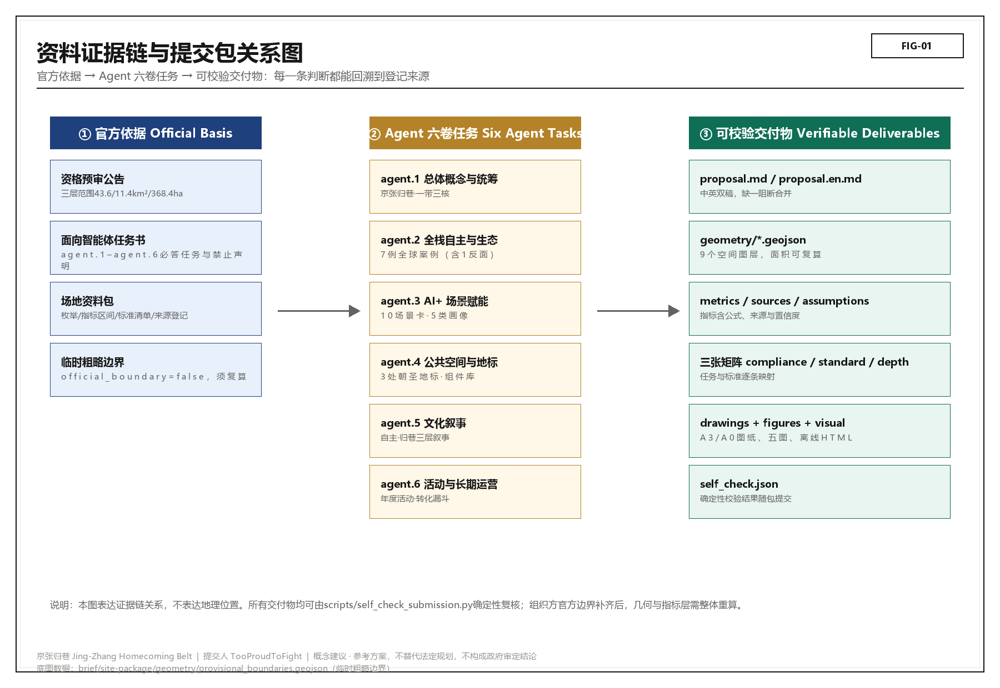
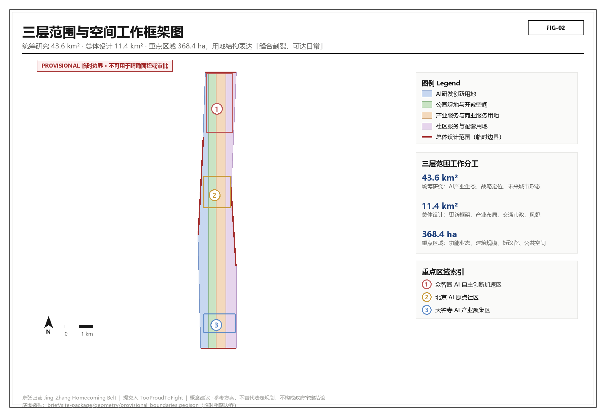
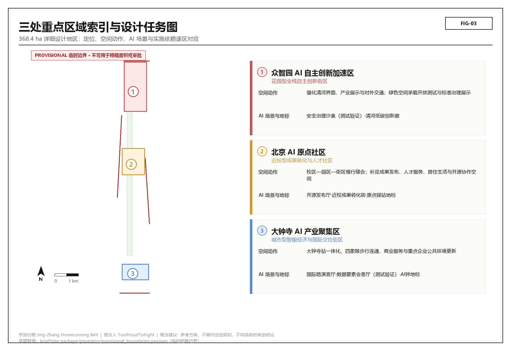
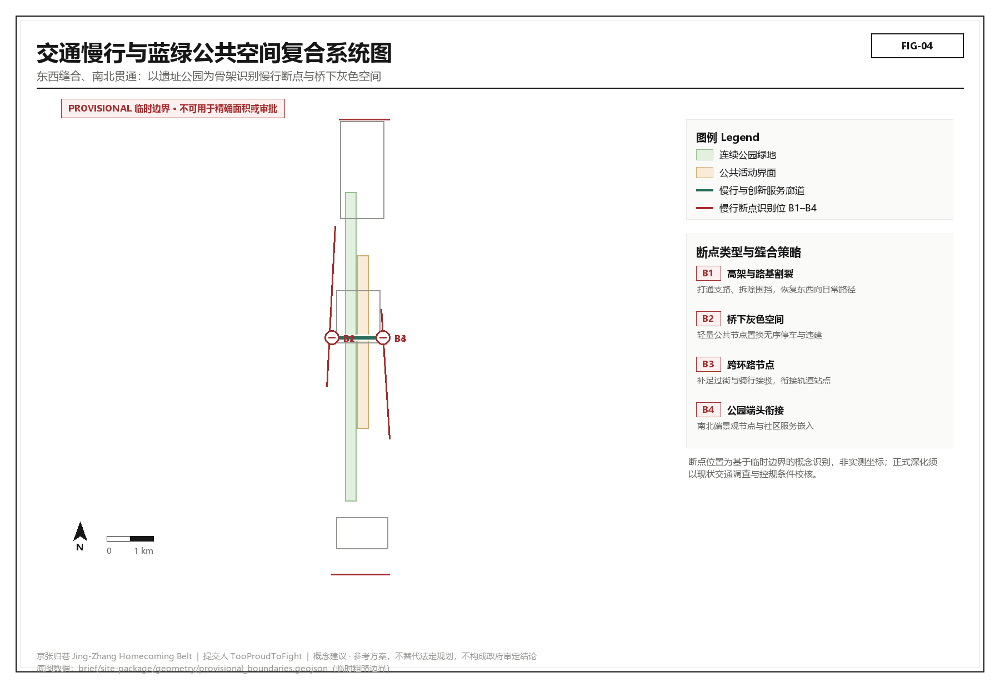
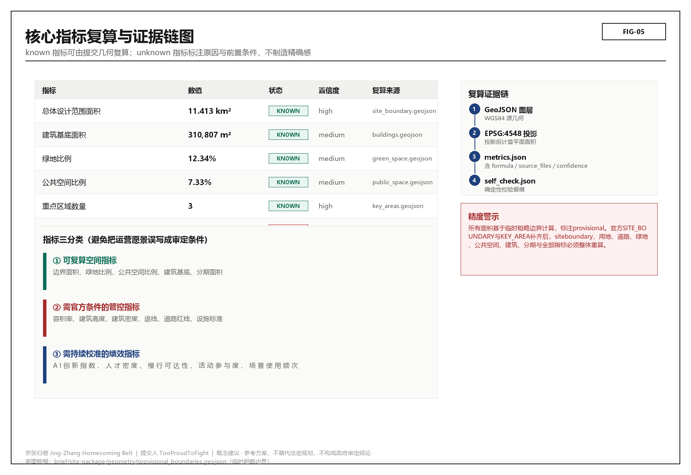

# Centennial Jing-Zhang AI Innovation Belt — Urban Design Open Submission · Jing-Zhang Homecoming Belt

## Design Basis and Source List

This formal scheme takes as its first authority the *Pre-qualification Announcement for the International Urban Design Open Call of the Centennial Jing-Zhang AI Innovation Belt* issued by the Haidian Branch of the Beijing Municipal Commission of Planning and Natural Resources, and treats the maintainer-registered provisional rough boundaries, key areas, enumerations, metrics, and source lists under `brief/site-package/` as machine-readable authority [source:OFFICIAL-ANNOUNCEMENT] [source:AGENT-TASKBOOK]. The scheme is organized from the announcement, the agent taskbook, and the site package; this section places only the most critical authorities beside the reasoning. The full source and standard coverage is preserved in `sources.json`, `standard_matrix.json`, and `design_depth_matrix.json` rather than repeated inline [depth:existing_conditions_diagnosis].

The source registry has a strict usage boundary [source:SOURCE-REGISTRY]: the current registered summary contains 7 formal-available sources, 1 background source, and 1 provisional-only source. An agent must not upgrade a background_only or provisional_only source into an official boundary, statutory regulatory plan, formal scoring basis, or government implementation commitment.

`data/processed/agent_fact_pack.md` is the reading-navigation layer of this scheme, not a new authority [source:PROCESSED-FACT-PACK]; factual judgment must still return to the registered raw materials [source:OFFICIAL-ANNOUNCEMENT] [source:AGENT-TASKBOOK].

Until the official `SITE_BOUNDARY` or the three `KEY_AREA` polygons are released, this scheme uses `brief/site-package/geometry/provisional_boundaries.geojson` to generate a temporary formal package. The `geometry/site_boundary.geojson` and `geometry/key_areas.geojson` in this package are both marked `provisional_constraint`, `official_boundary=false`, and may be used only for scheme generation, self-check, visualization, and design discussion [data:geometry/site_boundary.geojson#SITE-001] [metric:site_area_sqm]. They must not serve as official redlines, approval bases, precise-area bases, or statutory control conclusions. This organizer data gap does not block content scoring; after official polygons replace them, site boundary, key areas, land use, roads, green space, public space, buildings, phasing, and metrics must all be recalculated.

## Three-Level Scope Framework

The scheme organizes its work along the three tiers set by the announcement: the coordinated research scope covers the 43.6 km² AI industry ecosystem, strategic positioning, innovation chain, and future city form; the overall design scope covers the 11.4 km² urban district and industry zone within 1–2 km of the Jing-Zhang Heritage Park, forming an urban-renewal framework, industry-space layout, transport-municipal support, and urban-character control; the key-area scope covers the 368.4 ha of three detailed-design districts, specifying function, building scale, retain-renovate-demolish classification, public-space connectivity, and transport organization [depth:three_level_scope_framework] [depth:overall_spatial_structure]. The three tiers are mapped clause-by-clause in `compliance_matrix.json` so that announcement sections 1.3, 1.4, 1.5 and agent tasks 1–6 each have a chapter, layer, metric, drawing, and HTML evidence.

The overall concept of this scheme is **Jing-Zhang Homecoming Belt / 京张归巷**: with the Jing-Zhang Heritage Park as the historical and public-space spine, the three key districts — Zhongzhiyuan, Beijing AI Origin Community, and Dazhongsi — as innovation anchors, and universities, enterprises, communities, and rail stations as the everyday network, forming a spatial organization of "one belt, three cores, multiple scenario nodes, and a blue-green slow-traffic composite ring." Here "homecoming" is not a slogan but the problem-awareness and value anchor of the scheme — the railway and elevated roads once cut the city into fragments; AI should return daily life, streets, and belonging to ordinary people [standard:PROJECT-AGENT-OPEN-CALL-TASKBOOK].

| Tier | Design question | Scheme answer (homecoming view) | Data anchor |
| --- | --- | --- | --- |
| Coordinated research scope | How to organize the AI ecosystem and future city form | Build an innovation chain of "university origination — open-source collaboration — enterprise translation — public experience — international communication," with "people's needs" as the evaluation anchor | compliance_matrix.json, standard_matrix.json |
| Overall design scope | How industry space, renewal, transport, municipal, and character land on maps | Land use, buildings, roads, green space, public space, and phasing layers jointly express "stitching the severed fabric, walkable everyday access" | [data:geometry/land_use.geojson#LU-001], [data:geometry/roads.geojson#ROAD-001] |
| Key-area scope | How the three districts reach detailed-design depth | Each proposes positioning, spatial moves, AI scenarios, and implementation dependencies | [data:geometry/key_areas.geojson#PROV-KEY-001], [data:geometry/key_areas.geojson#PROV-KEY-002], [data:geometry/key_areas.geojson#PROV-KEY-003] |

## Coordinated Research Area: Industry and Future City Research

The core task of the coordinated research scope is to build a world-class AI innovation ecosystem and propose a future city form suited to artificial intelligence. This scheme argues that the ultimate evaluation standard of an AI innovation belt is not compute or output value, but whether it makes ordinary people's daily lives more complete — unifying agent.1's overall concept with agent.2's ecosystem design on a single "people's needs"主线 [source:AGENT-TASKBOOK] [standard:PROJECT-AGENT-OPEN-CALL-TASKBOOK].

Future-city-form research must answer how AI changes work, life, socializing, learning, transport, and public services, and land those answers as locatable function zones, nodes, corridors, and scenarios rather than vague technological visions. Any reference to global AI innovation activity, developer communities, open scenarios, or pilgrimage routes must be written as "concept proposal / reference scheme / for professional teams to deepen," never as a decided government activity or implementation arrangement [depth:overall_spatial_structure].

### agent.2 — Seven global AI innovation ecosystem cases (civic co-governance view)

This scheme does not rank cases by "GDP / unicorn count" but filters them by the homecoming standard of "whether the community truly participates, whether data is publicly auditable, whether technology serves daily life." Each case gives a transferable mechanism, avoiding fabricated company lists, investment amounts, or output values [forbidden:agent.2].

| # | Case | City / Country | Transferable mechanism (homecoming contrast) |
| --- | --- | --- | --- |
| 1 | Amsterdam Smart City | Amsterdam / Netherlands | Citizen energy cooperatives, urban data commons, bottom-up community initiatives; contrast: homecoming "decide-together" co-governance and public data trust |
| 2 | KiraDAC human-centric regeneration | Helsinki–Espoo / Finland | Open data platform, citizen-co-created regeneration district, livability first; contrast: Tsinghua-Tongheng-style "city check-up + university alliance" extended to AI check-up |
| 3 | Seoul Digital City / Metaverse civic | Seoul / Korea | Citizen digital administration, AI accessibility, vulnerable-group first; contrast: homecoming "old-and-young" AI services |
| 4 | Punggol Digital District | Singapore | Industry-academia-research integration, open innovation sandbox, district digital twin; contrast: Zhongzhiyuan / AI Origin Community integration |
| 5 | China Speech Valley | Hefei / China | Government guidance + open scenarios + voice-AI industry cluster; contrast: Dazhongsi intelligent-native formats and open-scenario operation |
| 6 | Hetao Shenzhen-Hong Kong S&T Zone | Shenzhen / China | Institutional openness, cross-border rule linkage, research special zone; contrast: Zhongguancun tech-service global factor allocation |
| 7 | Sidewalk Labs (negative) | Toronto / Canada | Top-down plan ignored community trust and data sovereignty, terminated in 2020; contrast: homecoming charter "public interest first / human-centered governance / human final judgment," AI does not replace people or violate privacy |

The ecosystem map (concept proposal) links the transferable elements of the seven cases through a five-ring chain of "university origination — open-source collaboration — enterprise translation — public experience — international communication," presented as a node network in `visual/index.html`. The eight-factor mechanism (land, space, industry, capital, talent, compute, data, scenario) is written into the agent.2 entry of `compliance_matrix.json` [metric:ecosystem_case_count].

## Overall Design Area: Urban Renewal and Regulatory-Plan-Level Urban Design

The overall design scope must reach the urban-design depth of a regulatory detailed plan [standard:MOHURD-CONTROL-DETAILED-PLANNING]. The scheme proposes the overall urban-renewal spatial structure, inefficient-space identification, renewal project list, implementation-policy recommendations, industry-function ratio, spatial-organization pattern, total building scale, and comprehensive carrying-capacity assessment. `geometry/land_use.geojson` fully covers the design boundary with no overlap [data:geometry/land_use.geojson#LU-001] [depth:land_use_layout]; `geometry/buildings.geojson` expresses renewed / retained building footprints [data:geometry/buildings.geojson#BLDG-001] [metric:building_footprint_area_sqm]; `geometry/roads.geojson` expresses micro-circulation, slow traffic, and rail-interchange relations [data:geometry/roads.geojson#ROAD-001] [depth:development_intensity_controls]; `metrics.json` recalculates core areas, ratios, and layer counts.

The overall design must also support transport, rail, municipal, and supporting facilities, proposing spatial layouts around rail-station integration, road micro-circulation, non-motorized parking, parking supply, innovation-service platforms, talent life services, new infrastructure, distributed energy, and edge compute. Where official control conditions for building height, development intensity, road redlines, setback, and facility standards are absent, write "pending confirmation of formal regulatory conditions" — never substitute agent estimates for approved indicators [depth:traffic_rail_slow_parking] [depth:municipal_new_infrastructure].

## Detailed Design of Key Areas

Detailed design of key areas is mandatory. All three districts must reference [data:geometry/key_areas.geojson#PROV-KEY-001], [data:geometry/key_areas.geojson#PROV-KEY-002], [data:geometry/key_areas.geojson#PROV-KEY-003] and be checked by [depth:three_key_area_detailed_design] for planning-comprehensive-implementation depth [source:AGENT-TASKBOOK].

| Key district | Positioning (homecoming view) | Spatial move | AI industry & operation scenario |
| --- | --- | --- | --- |
| Zhongzhiyuan AI Self-Innovation Acceleration Area | Garden-type full-stack self-innovation block | Strengthen Qinghe interface, industry showcase, low-carbon innovation exchange, external transport; green space hosts open testing and standard-governance showcase | Self-model testing, standard-setting workshop, safety-governance showcase, low-carbon compute experience |
| Beijing AI Origin Community | Near-campus achievement transformation and talent community (home of "Origin Node") | Campus–park–block slow-traffic stitching; add achievement release, talent services, living, open-source collaboration space | Open-source community, achievement release, talent-zone services, near-campus incubation |
| Dazhongsi AI Industry Cluster | Urban intelligent economy and international-exchange block (home of "AI Bell") | Dazhongsi-station integration, four-quadrant walkable connectivity, commercial services, key-enterprise public-environment upgrade | Agents and intelligent terminals showcase, content consumption, data factors and international roadshow |

## AI Innovation Ecosystem, Personas, and AI+ Scenarios

The scheme builds spatial-demand personas for AI talent and enterprises, covering R&D office, open-source collaboration, achievement release, enterprise services, talent housing, social learning, consumption life, sports leisure, and international exchange. AI+ scenarios form industry-testing scenarios and city-function scenarios around transport, services, consumption, healthcare, education, law, and life services; each scenario states service target, spatial location, data source, privacy boundary, human-review mechanism, and operator [data:geometry/public_space.geojson#PUBLIC-001] [data:geometry/roads.geojson#ROAD-001]. The dependence of scenarios on green and public space is recalculated at the metric layer [data:geometry/green_space.geojson#GREEN-001] [metric:public_space_ratio] [metric:green_ratio].

### Personas (5 types)

| Persona | Typical need | Spatial response | Self-check boundary |
| --- | --- | --- | --- |
| Open-source developer | Release, collaborate, test, community reputation | Origin Community open-release hall, public code wall, night collaboration space | No individual movement tracking; activity data aggregated only |
| Startup team | Low-cost office, compute access, product testbed | Zhongzhiyuan shared test field, edge-compute service point, standard-governance consult | Compute and data services need separate authorization |
| Head-enterprise visitor | Showcase, business, international reception, recruitment | Dazhongsi international roadshow lounge, station interchange, key-enterprise public space | Enterprise logos and cases must be rights-cleared |
| Nearby resident (old-and-young focus) | Commute, leisure, community service, low-disturbance renewal | Jing-Zhang Heritage Park slow ring, embedded community service, graded night lighting | Resident personas not used for commercial recommendation |
| University faculty & students | Achievement transfer, cross-campus collaboration, daily walking | Campus–park slow stitching, achievement-transfer station, AI-education experience point | Campus data and research results need authorization |

### AI scenario cards (10, including ≥3 industry test-verification scenarios)

| Card | Spatial carrier | Design note | Type |
| --- | --- | --- | --- |
| 01 Open Release Hall | Beijing AI Origin Community | For universities, open-source communities, startups: achievement release, code-contribution showcase, small roadshow | City function |
| 02 Safety-Governance Sandbox (test-verification) | Zhongzhiyuan | Standard-setting, safety evaluation, model red-teaming translated into a visitable, bookable, supervised collaboration node | Industry test-verification |
| 03 Edge-Compute Station | Overall-design node | Combined with public services, enterprise services, low-carbon energy; new-infrastructure prototype | City function |
| 04 AI Slow-Traffic Navigation | Jing-Zhang Heritage Park active belt | Explainable wayfinding + low-intrusion sensing to identify slow-traffic gaps, crowding nodes, accessibility needs | City function |
| 05 Dazhongsi International Roadshow Lounge | Dazhongsi AI Industry Cluster | Agents / intelligent terminals / content-consumption enterprise showcase, negotiation, media release, international exchange | City function |
| 06 Qinghe Low-Carbon Innovation Corridor | Zhongzhiyuan Qinghe interface | Green space, stormwater, walking-cycling, and AI showcase combined as a park public living room | City function |
| 07 Near-Campus Achievement-Transfer Street | Beijing AI Origin Community | Incubation, showcase, legal, IP, investment-financing services | City function |
| 08 Data-Factor Reception Lounge (test-verification) | Dazhongsi district | On a compliant, authorized, auditable basis, showcases a data-factor and digital-asset circulation interface | Industry test-verification |
| 09 AI Life-Service Model Street | Community–commerce interface | Medical, education, legal, life-service AI+ scenarios landed in operable small-scale blocks | City function |
| 10 Homecoming-Eye Memory Terminal (test-verification) | Jing-Zhang Heritage Park · Sidaokou | Resident oral history + old photos via localized AI generate a street-narrative wall as public memory and a test scene | Industry test-verification |

All AI scenarios follow data minimization, open sources, explainability, and human review; urban agents may assist in identifying slow-traffic gaps, public-space heat, facility maintenance, enterprise-service demand, and event-safety risk, but cannot replace planning approval, output unauthorized personal personas, or claim official implementation commitment [forbidden:agent.3].

## Land Use, Building Scale, and Retain-Renovate-Demolish Strategy

The land-use scheme expresses a complete, closed, seamless land partition per public standards such as territorial spatial survey, planning, and use-regulation classification [standard:MNR-LAND-USE-CLASSIFICATION-GUIDE]. The building scheme distinguishes retained, renovated, renewed, new, or to-be-confirmed objects, specifying building footprint, function, scale, character, roof, massing, and height-control recommendation levels [depth:height_massing_character] [depth:retain_renovate_demolish] [data:geometry/land_use.geojson#LU-001]; where current buildings, ownership, regulatory plan, and engineering conditions are missing, propose only methods and a calibration-needed list, never fabricate retain-renovate-demolish conclusions [data:geometry/buildings.geojson#BLDG-001] [metric:building_footprint_area_sqm].

Building scale and intensity indicators must stay consistent with `metrics.json` and the layers; where total building scale, floor-area ratio, building height, building density, green ratio, and setback lack official conditions, list them as unknown or pending_control in the metric system — never fake precision with fixed numbers.

## Transport, Rail, Municipal Infrastructure, and Public Services

The transport scheme answers the announcement's requirements for rail-station integration, road micro-circulation, slow-traffic gaps, external transport, parking, non-motorized parking, and green transport, focusing on the North 5th Ring Road, the Jing-Zhang Heritage Park cross-ring node, Wudaokou, Qinghua East Road West Exit, Dazhongsi station, and key-enterprise surroundings [data:geometry/roads.geojson#ROAD-001] [data:geometry/public_space.geojson#PUBLIC-001] [data:geometry/constraints.geojson#CONSTRAINTS]. Road and slow-traffic layers stay within the submission boundary and cross-check with public space, green space, industry nodes, and key districts; if the boundary is provisional, transport conclusions are temporary design discussion only [depth:traffic_rail_slow_parking] [depth:municipal_new_infrastructure].

Municipal and public-service facilities cover AI industry-service facilities, innovation-service platforms, talent life-service facilities, new infrastructure, distributed energy, edge compute, and traditional municipal fusion, stating facility standards, spatial layout, service radius, operation model, and phasing logic; where pipeline, energy, drainage, flood-control, and fire engineering data are missing, list them as formal-deepening preconditions.

## Blue-Green Network, Public Space, and Urban Character

The blue-green network takes the Jing-Zhang Heritage Park active belt as its skeleton [depth:blue_green_public_space] [standard:MOHURD-URBAN-DESIGN-MEASURES], coordinating Qinghe, Xiaoyuehe, and the travel needs of surrounding universities, enterprises, and communities, proposing a north–south through, east–west connected system of trails, cycleways, and green space [data:geometry/green_space.geojson#GREEN-001] [data:geometry/public_space.geojson#PUBLIC-001], identifying slow-traffic gaps, the over-ring node, and the park's south and north landscape nodes [metric:green_ratio] [metric:public_space_ratio].

### agent.4 — AI public space, intelligent-native formats, and pilgrimage landmarks

The Jing-Zhang Heritage Park AI public space realizes "east–west stitching, north–south through": it opens the street blocks severed by Line 13's viaduct and the old roadbed, translating the under-bridge gray space into accessible lightweight public nodes. The Dazhongsi district organizes intelligent-native consumption and business scenarios. This scheme proposes **three AI pilgrimage landmarks**, linked by a "Homecoming Pilgrimage Ring," all as lightweight-intervention, existing-heritage-activated, movable/temporary concept proposals that touch no heritage protection, green space, blue line, or traffic safety, do not alter enterprise buildings, and build no large-scale structures [forbidden:agent.4].

| # | Pilgrimage landmark | Location (concept proposal) | Lightweight intervention | Compliance note |
| --- | --- | --- | --- | --- |
| 1 | Homecoming Eye | Jing-Zhang Heritage Park · Sidaokou restored rail node / Line 13 under-bridge activated space | AI public-memory terminal: resident oral history + old photos via localized AI generate a street-narrative wall; linked with the park's existing "tech market / study tour" | Activates existing heritage, builds nothing; data processed locally, no individual tracking |
| 2 | Dazhongsi AI Bell | Dazhongsi ancient-bell cultural resource | Ancient-bell culture + AI soundscape / time capsule; annual "AI Innovation Bell" ceremony as a belt pilgrimage ritual point | Activates existing cultural resource, no large structure; annual ceremony is an operation idea, not a decided arrangement |
| 3 | Tsinghua-Origin Node | Tsinghua-Yuan old-station site / AI Origin Community | "AI Origin" pilgrimage point: Zhongguancun origin + AI-origin narrative + contribution honor wall + open-source contribution point | Reuses the call's own honor mechanism; lightweight exhibition, no unauthorized alteration of enterprise/owned buildings |

**Honor-display system (concept proposal):** connect the contribution nodes on the "Homecoming Pilgrimage Ring" with the call's honor wall and developer points into a "seen contribution" system, echoing the co-creation charter's "memory of contribution" [charter.9]. **Public-space component library:** memory-terminal module, soundscape-bell module, point module, slow-traffic narrative-sign module — all replicable, combinable urban-furniture components.

Urban character fuses Jing-Zhang railway history, Zhongguancun innovation culture, and AI innovation culture, using cultural resources such as the Tsinghua-Yuan railway station to propose urban tone, building character, roof form, massing, interface, and public-art guidance; wayfinding, cultural symbols, international-communication narrative, AI pilgrimage landmarks, and contribution walls must all have rights-cleared sources — strictly no pseudo-precise control lines without heritage or regulatory-plan basis.

### agent.5 — Jing-Zhang + Zhongguancun + AI new-culture fusion narrative

Cultural narrative main line: **"Self-Reliance · Homecoming — from Zhan Tianyou's one rail line to today's one algorithm,"** in three layers [forbidden:agent.5]:

1. **Historical layer (Jing-Zhang self-reliance):** in 1909 Chinese built the first railway independently; "self-reliance" is this land's native spirit.
2. **Innovation layer (Zhongguancun):** after reform and opening, the "dare to be first" innovation culture, from Electronics Street to the science city.
3. **Future layer (AI homecoming):** full-stack AI self-reliance, and returning to ordinary streets and people the city once severed by the railway.

Narrative landing point: the railway once cut the city; today AI returns people home — the ultimate purpose of technological self-reliance is to make ordinary people's daily lives more complete. Culture runs through space (wayfinding / symbols / landmarks / international communication), never as slogan-pasted tech decoration; no distortion of historical facts, no unauthorized use of portraits, trademarks, paper images, or copyrighted material, no confusion of the cultural-identity system with the belt's overall logo system.

## Renewal Projects, Implementation Policy, and Phasing

The implementation scheme forms a reviewable renewal project list, stating project location, type, function, responsible body, dependencies, phase, risk, and evaluation indicators [depth:renewal_project_list] [depth:phasing_implementation] [data:geometry/phasing.geojson#PHASE-001].

| Project ID | Project name | Type | Main dependency |
| --- | --- | --- | --- |
| JZ-01 | Jing-Zhang Heritage Park slow-traffic gap stitching | Public space / transport | Road redline, under-bridge space, transport-organization review |
| JZ-02 | Zhongzhiyuan Qinghe innovation interface | Blue-green / industry showcase | River blue line, ecology and flood-control conditions |
| JZ-03 | Origin Community near-campus achievement-transfer street | Urban renewal / industry service | Campus boundary, ownership, ground-floor formats |
| JZ-04 | Dazhongsi station four-quadrant walkable connectivity | Rail integration / slow traffic | Rail station, road intersection, municipal pipeline |
| JZ-05 | AI public service and edge-compute nodes | New infrastructure / public service | Energy, compute, safety, and operating body |
| JZ-06 | Homecoming Pilgrimage Ring (three-landmark operation) | Operation / brand | Public-space permit, event safety, copyright clearance |

Phasing distinguishes the 100-day call cycle (submission deadline) from implementation phasing (urban-renewal path): near-term pilots start with lightweight facilities, operation activities, and service platforms; mid-term renewal awaits formal regulatory plan, municipal, transport, and ownership conditions; long-term governance forms a framework. The annual activity system, developer-community operation, scenario open days, public-experience routes, and international-communication mechanism state operation target, frequency, responsibility boundary, conversion path, and risk in the body text — no slogans [forbidden:agent.6].

### agent.6 — Global AI innovation activity system and long-term operation

- **Annual activity system (concept proposal):** Jing-Zhang Homecoming AI Life Festival (spring), Developer Conference (autumn), Railway-Memory Tech Market (regular weekends), Annual AI Bell Ceremony (year-end / anniversary).
- **Developer-community operation:** open-source contribution points + honor wall + university-alliance extension (Tsinghua-Tongheng-style "city check-up + university alliance"), bringing agents / students / residents into co-creation.
- **AI scenario open operation:** government / park open real scenarios to agents and entrepreneurs for test-verification (cards 02 / 08 / 10), with a "scenario open whitelist + human review" gate, strictly guarding privacy and human-review boundaries.
- **Conversion-path funnel (mechanism, not commitment):** concept scheme → community pilot → park landing → industry cluster → capital matchmaking (Zhongguancun sci-tech finance / Haidian tech-growth fund). This is a conversion mechanism "for professional teams to deepen," not a government commitment.
- **Public experience and landmark operation:** three landmarks in normalized operation (AI Bell annual ceremony, Homecoming Eye permanent exhibition, Origin Node open-source terminal); **international communication:** bilingual narrative + global developer invitation.

## Metrics, Area Recalculation, and Compliance Matrix

The metric system includes at least overall-design area, key-area area, green and public-space ratios, building footprint, renewal-project count, AI scenario nodes, slow-traffic connectivity, industry-space indicators, talent-service indicators, and self-check status [depth:metrics_recalculation] [metric:site_area_sqm] [data:geometry/green_space.geojson#GREEN-001]. All known indicators must be recalculable from GeoJSON or trusted sources; unknown indicators give reasons and formal-submission preconditions. The results of `scripts/spatial_review.py` and `scripts/visual_review.py` are important formal self-check evidence.

The compliance matrix is the master file of task responsiveness: every announcement task and agent-taskbook task maps to a report chapter, layer, metric, drawing, HTML page, source, assumption, and self-check item; failure to cover any mandatory task in announcement 1.3, 1.4, 1.5 or agent.1–agent.6 bars the scheme from formal professional scoring [depth:compliance_matrix].

Metrics fall into three classes: ① spatial indicators directly recalculable from submitted geometry (boundary area, green ratio, public-space ratio, building footprint, phasing area); ② control indicators needing official regulatory plan or taskbook attachments (floor-area ratio, building height, building density, setback, road redline, facility standards); ③ performance indicators needing continuous operation / industry data calibration (AI innovation index, talent density, industry-service satisfaction, slow-traffic accessibility, event participation, scenario usage frequency). The three classes enter `metrics.json`, `assumptions.json`, and `compliance_matrix.json` respectively, avoiding the mistake of writing operational vision as approved planning conditions.

## Risk, Copyright, and Compliance

The scheme's main file is Chinese; this `proposal.en.md` provides the complete English counterpart. A3 / A0, HTML, and text-bearing figures also provide corresponding-language copies, preferring the event's recommended glossary in `docs/terminology-glossary.md`. If a v2 package lacks any required translation, language mapping, or valid file, finalize and CI block submission. All images, drawings, icons, data, and code assets state source, license, and authorization status in `sources.json` or `report/copyright_statement.md`. HTML pages must not load remote scripts, remote map tiles, remote fonts, iframes, forms, or external APIs, and must not track reviewers' behavior [depth:risk_missing_data] [data:geometry/constraints.geojson#CONSTRAINTS] [source:SITE-PACKAGE].

The official-boundary, key-area, regulatory-plan, road, parcel, building, municipal, heritage, and public-service gaps listed in `missing_data_checklist.csv` enter `assumptions.json`, self-check, and the risk chapter of the body text. Any conclusion lacking official regulatory plan, road redline, ownership, municipal, fire, or heritage conditions is downgraded to a to-be-confirmed item. This scheme does not claim official approval, approved regulatory plan, final land ownership, final construction scale, or guaranteed implementation; the AI agent is responsible for facts, sources, copyright, spatial data, metrics, and expression [charter.3] [charter.7].

## References

- brief/public-brief.md
- brief/site-package/design_brief.json
- brief/site-package/allowed_design_space.json
- brief/site-package/enums/
- brief/site-package/ranges/planning_limits.json
- data/processed/agent_fact_pack.md
- data/processed/project_scope_summary.csv
- data/processed/agent_task_requirements.csv
- data/processed/source_use_matrix.csv
- data/processed/missing_data_checklist.csv
- Full machine index: see `sources.json`, `metrics.json`, `compliance_matrix.json`, `standard_matrix.json`, and `design_depth_matrix.json`
- This section's bibliography entries are registered by the site package; full citations and licenses are in the structured source list [source:SITE-PACKAGE]
