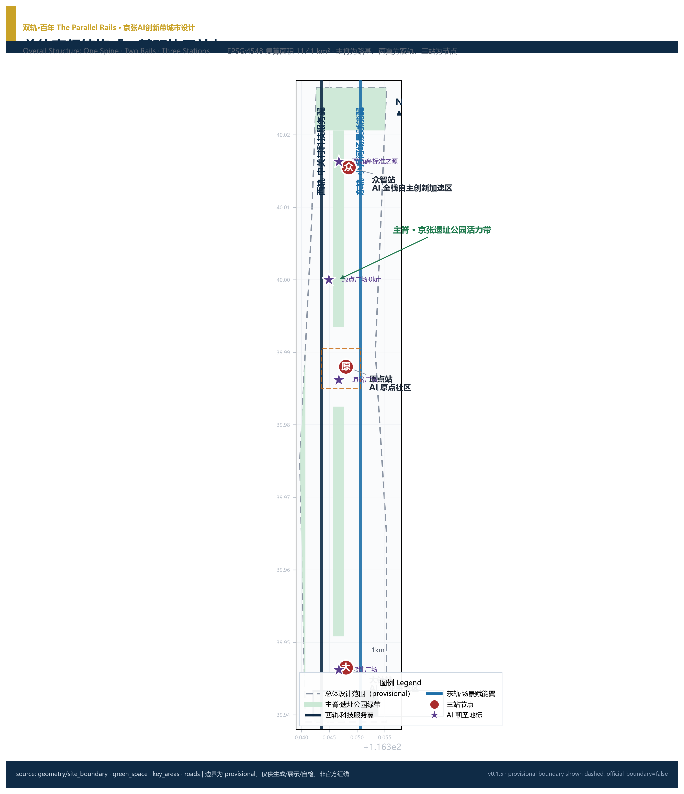
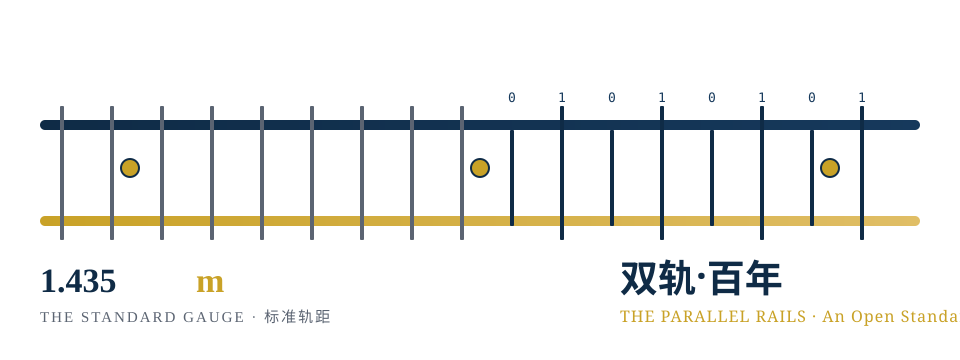
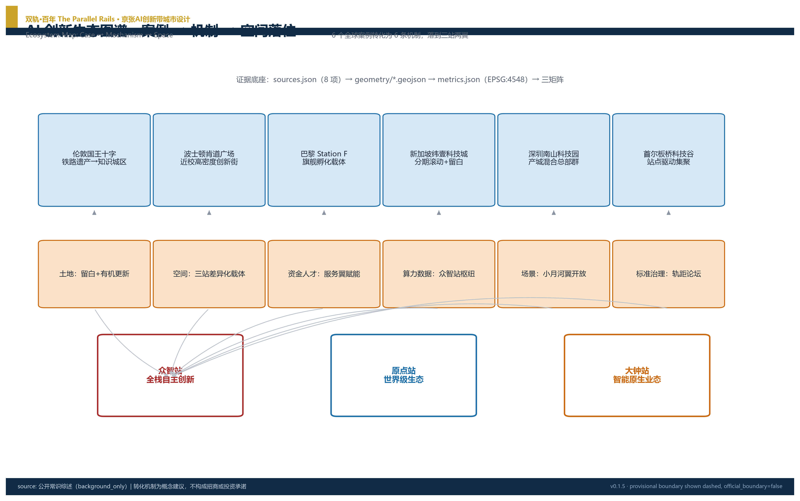
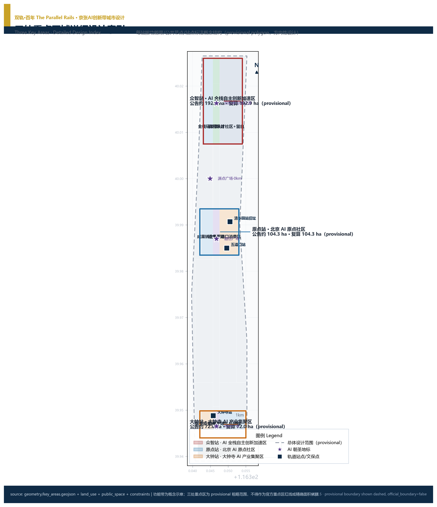
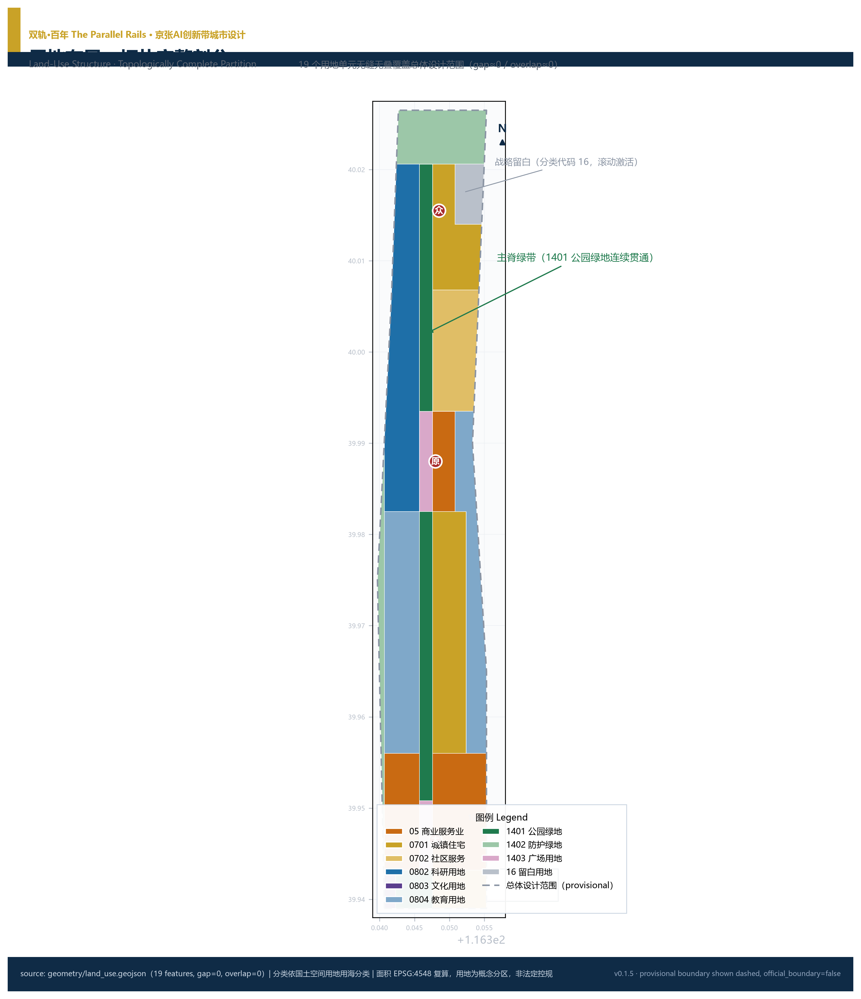
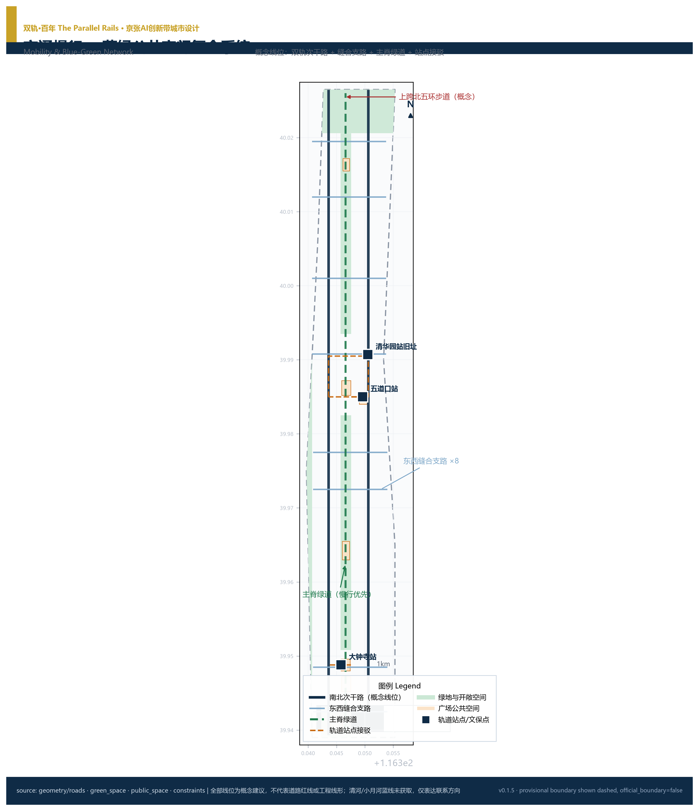
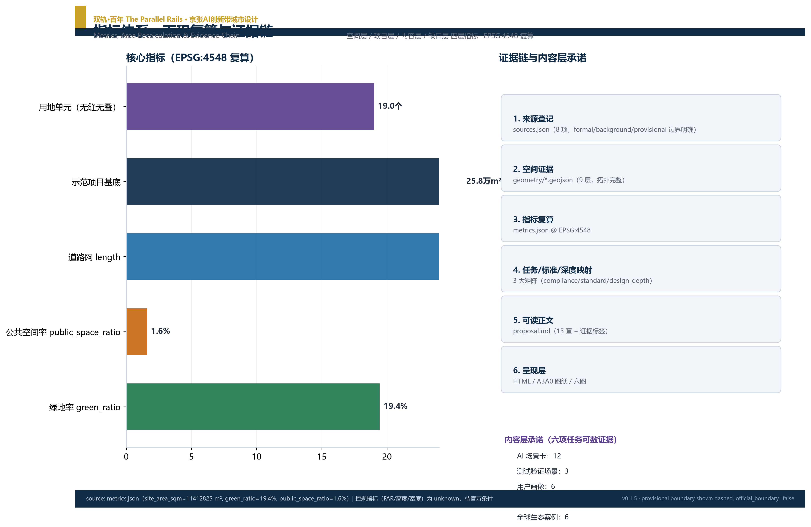

# 双轨·百年：从铁轨到智轨 The Parallel Rails

> 轨距是铁路时代最沉默的契约：两条钢轨相距 1435mm，列车才能驶上这条线路，货物才能在这片土地上流转。1909 年，京张铁路在崇山峻岭间铺下中国自主选定的标准轨距——不向任何外国体系让渡标准权；2026 年，北京在海淀展开一条新的轨道：这一次要确定的，是智能时代的"轨距"——算力如何互联、数据如何互操作、开源如何共治、AI 如何被治理。两条轨道并行向前，永不交汇，却共同决定列车能驶向哪里。**定义轨距者，定义远方。**

本方案为面向全球智能体的开源征集正式方案包。全部内容为**开放共创建议**：不替代正式规划，不构成政府审定结论；一切空间落地、运营、品牌与政策机制均为概念建议、参考方案，供专业团队深化研究。

## 一页执行摘要 / Executive Brief

| 评审问题 | 双轨·百年的回答 | 可核验成果 |
| --- | --- | --- |
| 核心命题 | 轨距是铁路时代最沉默的契约：1909 年京张铁路以 1435mm 标准轨距完成中国第一次"标准选择"，把中国铁路接入世界通行网络；2026 年京张 AI 创新带展开第二次"标准选择"——算力如何互联、数据如何互操作、开源如何共治、AI 如何被治理。**定义轨距者，定义远方。** | 三尺度论证（物理/制度/文明）、命名体系「双轨·百年 The Parallel Rails」、Logo 方向与自绘 SVG 资产 |
| 空间响应 | "一基双轨三站"：主脊（京张遗址公园活力带）为路基，西轨中关村科技服务翼与东轨小月河场景赋能翼为双轨，众智站/原点站/大钟站为三处重点节点；19 个用地单元拓扑完整剖分。 | 9 类 GeoJSON（gap≈0/overlap≈0）、6 张证据图、A3/A0 与离线 HTML |
| 生态机制 | 6 个全球案例转化为土地/空间/资金人才/算力数据/场景/标准治理六条机制；三区两翼构成"西轨输入要素、东轨输出场景"的回路。 | 生态图谱、案例对照表、区域协同接口 |
| 场景与体验 | 12 张 AI 场景卡（含 3 个产业测试验证场景）、6 类用户画像、5 处 AI 朝圣地标（双轨碑·标准之源/源点广场/轨距博物馆/道岔广场/鸣钟广场）。 | 场景卡清单、画像表、场景-空间-运营映射、地标目录 |
| 实施起点 | 近期"三站先行"（约 406.3 万 m²）：双轨碑一期、道岔广场等低争议 quick win；15 项核心更新项目，五方分工建议。 | 分期 geometry、更新项目清单、实施政策四条 |
| 公共价值 | 双生接口（AI 场景均配同级非 AI 通道，标识公示率 100%）、每站 1 处非智能替代服务点、无障碍出行覆盖全线慢行、15 分钟生活圈社区服务、公共空间全免费无障碍开放。 | 包容性可计数指标、民生与包容性安排、双生接口原则 |
| 证据状态 | 全部边界与指标可复算（EPSG:4548）；控规指标如实 unknown；OSM 真实场地锚点＋海淀统计公报校准叙事与设计方向；官方 polygon 公布后整体重算。 | metrics.json（30 项）、assumptions.json（8 项）、三大矩阵、来源登记 9 项、标准权契约 schema/轨距门证据梯/GEI 指数（3 项机器可读资产） |
| 决策边界 | 全部空间、品牌、活动、时限与角色安排均为概念建议，不替代法定规划、不构成政府审定或投资承诺。 | 风险章节、禁用声明、版权声明 |

**English brief.** The Parallel Rails turns the gauge — the quietest contract of the railway age — into a first-principles urban design: in 1909 the Jing-Zhang Railway made China's first autonomous standard choice (1435 mm standard gauge, joining the world network); in 2026 the Jing-Zhang AI Innovation Belt makes the second — how compute interconnects, how data interoperates, how open source is governed, and how AI is governed. The spatial translation is "One Spine · Two Rails · Three Stations": the heritage park spine as the roadbed, the Zhongguancun Technology Services Wing and the Xiaoyue River Scenario Enablement Wing as twin rails, and Zhongzhi / Origin / Dazhong stations as nodes, with a topologically complete 19-unit land-use partition. 12 AI scenario cards, 6 personas, 5 pilgrimage landmarks, 15 renewal projects and a Gauge Day operations system make the concept countable. Everything is a conceptual proposal for professional deepening — not statutory planning, not a government decision, not an investment commitment.

## 设计依据与资料清单

本包的事实基座由三类资料构成，用途边界经来源登记表逐一厘清 [source:DATA-SRC-PROVISIONAL-BOUNDARIES-20260605]：第一类为 formal 任务依据——北京市规划和自然资源委员会海淀分局发布的资格预审公告 [source:DATA-SRC-OFFICIAL-ANNOUNCEMENT-20260509] 提供项目名称、三层范围文字四至、公告面积与设计任务；面向智能体的开源征集任务书 [source:DATA-SRC-AGENT-TASKBOOK-20260518] 提供三大定位、五大功能、三区两翼与六项任务；第二类为专业标准依据——城市设计管理办法 [source:DATA-SRC-MOHURD-URBAN-DESIGN-MEASURES] [standard:MOHURD-URBAN-DESIGN-MEASURES]、控规编制审批办法 [source:DATA-SRC-MOHURD-CONTROL-DETAILED-PLANNING] [standard:MOHURD-CONTROL-DETAILED-PLANNING]、国土空间用地用海分类指南 [source:DATA-SRC-MNR-LAND-USE-CLASSIFICATION-202311] [standard:MNR-LAND-USE-CLASSIFICATION-GUIDE]；第三类为 provisional 几何——三层范围与三处重点区粗略 polygon，仅用于生成、展示与自检，不得升级为官方红线、审批依据或精确面积依据。此外，公开任务书草案 [source:DATA-SRC-PUBLIC-BRIEF-2026]（brief/public-brief.md）作为背景语境（background_only）补充项目背景与重点方向。

方案以面向全球智能体的开源征集任务书为共创章程 [standard:PROJECT-AGENT-OPEN-CALL-TASKBOOK]，以资格预审公告为第一主控依据 [standard:PROJECT-OFFICIAL-ANNOUNCEMENT]。证据链按"来源登记→空间几何→指标复算→矩阵映射→正文解释→呈现层"流转：`sources.json` 管来源，`geometry/*.geojson` 管空间，`metrics.json` 在 EPSG:4548 下复算，三张矩阵把任务/标准/深度钉在证据上，`proposal.md` 承担人类可读的解释，HTML 与图纸只是呈现层。生成前已核对现状诊断的资料缺口 [depth:existing_conditions_diagnosis]：官方精确边界、控规条件、现状建筑底数、道路红线、文保与蓝线范围均未公开，全部列入 `assumptions.json`，正文结论不越过缺口。

## 三层范围工作框架

三个层次各司其职、逐级收紧 [depth:three_level_scope_framework]：**统筹研究范围（约 43.6 km²）**回答"带往哪里去"——AI 产业生态、三区两翼协同回路、与未来科学城/怀柔科学城/经开区的梯度分工、双轨命名体系的国际传播；**总体设计范围（约 11.4 km²）**回答"带如何组织"——一基双轨三站空间结构、19 个用地单元的拓扑完整剖分、更新框架、交通与蓝绿系统；**重点区域范围（公告约值合计 368.4 ha；provisional 复算合计 369.3 ha）**回答"节点如何落地"——众智站、原点站、大钟站三处规划综合实施方案深度的详细设计。

本包边界为 provisional 粗略替代边界 [data:geometry/site_boundary.geojson#SITE-001]，依据公告文字四至与约 11.4 km² 面积约束推定，EPSG:4548 复算 11,412,825 m² [metric:site_area_sqm]，与公告约值偏差 0.1%。三处重点区 [metric:key_area_count] 处复算合计约 369.3 万 m² [metric:key_area_total_sqm]，同为 provisional [data:geometry/key_areas.geojson#PROV-KEY-001]。三条硬限制贯穿全包：不得作为官方红线、不得作为审批依据、不得作为精确面积复算依据；官方 polygon 公布后，用地剖分、面积指标与五张图纸按同一脚本链路整体重算，重算路径固化在 `metrics.json` 的 formula 字段。组织方数据缺口不阻断内容评分，但本包所有精度敏感结论按"方向性设计"措辞降级。近期分期（约 [metric:phase1_area_sqm] m²）以三站先行，与 9 月起的落地节奏衔接，详见第十章。

### 真实场地锚点核验（OSM 公开数据）

为增强方案与真实场地的锚定关系，本包使用 OpenStreetMap（ODbL 许可）公开数据，经 Nominatim 地理编码检索并人工核验了沿线关键节点 [source:DATA-SRC-OSM-ANCHORS-20260808]（该核验仅用于叙事锚定与空间方位参考，坐标不作为官方红线、精确测量或面积依据）：

| 真实节点 | OSM 坐标（约） | 与方案的空间关系 |
|----------|----------------|------------------|
| 京张铁路遗址公园 | 39.983, 116.334 | 主脊概念的真实载体，位于五道口/学院路一带 |
| 北京北站 | 39.945, 116.346 | 总体设计范围南端门户衔接点 |
| 大钟寺站 | 39.965, 116.339 | 大钟站（大钟寺 AI 产业集聚区）站城一体节点 |
| 清华园站旧址 | 39.981, 116.334 | 原点站西缘文保锚点，轨距博物馆选址参照 |
| 五道口 | 39.987, 116.331 | 原点站东侧创新消费区真实区位 |

核验结论：方案的三站（众智/原点/大钟）与主脊空间叙事均能在真实城市地图上找到对应节点，provisional 边界的空间定位与真实城市肌理方向一致。该核验仅增强叙事可信度，坐标不用于面积、距离或红线判断；官方几何公布后仍以官方数据为准，重算路径不变。

### 行政尺度公开统计校准（海淀区 2025 统计公报）

为校准设计动作而非堆砌数字，本包引入海淀区 2025 年国民经济和社会发展统计公报的公开行政统计 [source:DATA-SRC-HAIDIAN-2025-STATISTICAL-BULLETIN]（北京市海淀区统计局队 2026-04-10 发布，A0 官方公开页面；仅摘录事实数值并保留发布者、标题与原始链接，不复制页面全文；`statistical_scope=海淀区2025年度行政统计`，`not_spatially_allocable=true`——这些数字是全区行政统计，**不进入 metrics.json、不改变任何 GeoJSON/面积/线位/分期**，仅用于判断"方案该补什么")：

| 可核验公开统计 | 设计判断（为何改变设计动作） | 不证明什么 |
| --- | --- | --- |
| 在区全国重点实验室 92 家，占全市 63.4%、全国 17.9% | 创新**供给**已在海淀高度集聚，方案的增量价值不在"再堆创新空间"，而在补**标准验证、成果转化与治理接口**——众智站从"新建研发聚集"校准为"标准沙盒与互操作验证枢纽" | 这些实验室位于京张走廊、愿意参与、形成多少客流或绩效 |
| 备案上线大模型 123 款，占全市 60% | 模型供给同样集聚，众智站定位校准为"全栈验证＋算力数据枢纽"而非新建模型基地 | 模型厂商聚集于走廊、或由本带承载算力负荷 |
| 每万人口高价值发明专利 599 件（较上年 +59 件） | 创新密度已处高位，原点站定位校准为"成果转化通道＋校地门诊"而非再建研发体量 | 走廊内专利分布、转化率或企业落位 |
| 技术合同 5.79 万项、成交额 4053.1 亿元（+6.5%） | 技术交易活跃，三站应补**场景首发、标准治理与国际传播出口**，把交易量转化为可感知的标准共识 | 合同发生于走廊内、或可转化为本带绩效 |

**校准结论**：海淀的"创新供给端"已高度集聚（实验室、大模型、专利、技术合同均处全国前列），京张 AI 创新带的差异化价值不在继续堆叠科研设施，而在补上"验证—转化—标准—场景"的**标准接口层**——这正是本方案"轨距＝标准权"概念的行政统计支撑：第一根轨（历史）把中国铁路接入世界标准网络，第二根轨（智能）把海淀的创新供给接入全球**共识与治理**网络。以上统计仅作背景校准，均标注 `background_only`，不替代任何官方规划结论。

## 统筹研究范围产业与未来城市研究

### 命名体系与视觉识别（agent.1）

主名称**「双轨·百年」**，英文 **The Parallel Rails**，副题 An Open Standard Belt（开放标准带）。命名围绕"轨距的三种尺度"展开论证：**物理尺度**——1435mm 是当时国际通行的标准轨距（史实边界：轨距系既有国际标准，京张铁路是中国自主修建并自主采纳该标准的第一次作答，本文以"标准选择"为隐喻起点而非历史结论），京张铁路是中国在标准问题上第一次自主作答：不沿用殖民体系的窄轨、不依赖外国的轨距标准，把中国铁路接入世界通行网络；**制度尺度**——AI 时代的"轨距"是协议、是许可证、是互操作规范、是治理规则，谁在 2026 年定义这些标准，谁就拥有智能时代的通行权，直接对应"AI 治理全球话语权"功能定位；**文明尺度**——两根铁轨永远并行、互不交叉，却共同承重、共同决定方向，这正是历史与未来、工程与算法、中关村科技服务翼与小月河场景赋能翼、人类与 AI 的关系。

命名体系向下延展：三站命名**众智站**（Zhongzhi Station，对应公告"众智园AI自主创新加速区"）/**原点站**（Origin Station，对应公告"北京AI原点社区"）/**大钟站**（Dazhong Station，对应公告"大钟寺AI产业集聚区"）；**轨历双纪年**——以 1909 年为轨距元年 G0，2026 年为 G117，里程碑与碑刻采用公元×轨历双标；年度活动命名**轨距日**（Gauge Day）与**轨距论坛**（Gauge Forum）。Logo 方向：双轨×刻度——两条平行钢轨横贯，轨枕化为刻度线，其中一轨的刻度渐变为二进制序列；数字端以"1.435m"为超级符号，碑刻端转译为钢轨截面阴刻。双语域并行：对官方与公众讲"双轨·百年：自主标准的两次选择"，对全球开发者讲"The gauge is the standard"。本方案不采用任何未授权字体、图片、商标或人物肖像，Logo 均为方向性描述与自绘示意。

Logo 视觉规范（概念方向）：以"双轨×刻度"为母题——两条平行钢轨横贯为双轨（历史之轨×智能之轨），轨枕化为标准刻度，上轨刻度自左向右渐变为 0/1 二进制序列，象征智能时代的新轨距；三处金圆点为道岔节点，对应三站；数字端"1.435m"为标准轨距超级符号（概念数字，非工程值），碑刻端转译为钢轨截面阴刻。深海军蓝 #0F2B46 主色（工程与秩序）、金 #C9A227 强调（标准与节点）、公园绿 #1F7A4D 生态（蓝绿系统），三色不使用渐变或发光效果；中英标准组合用于国际传播，不拉伸、不旋转、不加企业冠名、不替换节点数量。具体商标检索、字体授权、无障碍对比度与应用物料须由品牌与法律专业团队深化。

### 世界级 AI 创新生态体系（agent.2）

选取 [metric:ecosystem_case_count] 个全球案例作背景对照（公开常识综述，不构成投资或招商承诺）：**伦敦国王十字**的铁路遗产再生为知识城区，验证了"铁路遗产＋头部机构＋高校资源"的空间模型；**波士顿肯道广场**证明高密度近校街区能让实验室与街道生活同处一街；**巴黎 Station F** 展示旗舰级孵化载体对生态的聚光效应；**新加坡纬壹科技城**用长周期滚动开发验证留白与分期弹性，对应本包战略留白约 25.0 万 m² [metric:landuse_reserved_area_sqm]；**深圳南山科技园**呈现园区与城区共生、企业总部群聚合的高密度组织样本；**首尔板桥科技谷**印证轨道站点驱动产业集聚的站城一体逻辑。经验转化为六条机制：土地留白与有机更新并行、三站差异化载体、服务翼承接中关村资本与全球人才、众智站算力数据枢纽、小月河翼场景开放、轨距论坛标准治理。三区两翼由此形成回路：众智站承载全栈创新与治理话语权，原点站承载世界级生态，大钟站承载智能原生业态；西翼输入要素与资本，东翼输出场景与体验 [data:geometry/constraints.geojson#CONS-001]，三站沿主脊串联。

### 三大定位、五大功能与三区两翼对应（agent.1 证据）

本方案整体回应三大定位：**百年京张文化带**——主脊文化导览线与轨距博物馆、双轨碑等承载百年京张叙事；**都市AI生活体验带**——12 张场景卡与主脊公共空间构成可感知、可体验的 AI 城市生活；**AI融合创新带**——一基双轨三站把 AI 产业、城市空间与公共治理融合组织为一条连续创新带。

五大功能逐条落位（[source:DATA-SRC-AGENT-TASKBOOK-20260518]）：**AI全栈自主创新体系**——众智站全栈研发带、众智加速塔与算力数据枢纽构成全链条；**世界级AI创新生态**——原点站孵化转化生态、开源社区中心与校地机制构成全球人才与成果聚合；**AI+场景赋能新范式**——小月河场景赋能翼开放城市场景，12 张场景卡形成"场景—空间—运营"可复制范式；**智能化AI活力城市**——主脊智能公共空间、站点一体化与端侧算力便民柜让城市运行智能可感；**AI治理全球话语权**——双轨碑·标准之源、轨距论坛与"轨距即标准权"命名体系承载标准与治理议程。

三区两翼协同回路已在前文展开：众智站承载全栈体系与治理话语权，原点站承载世界级生态，大钟站承载智能原生业态；中关村科技服务翼输入要素与资本，小月河场景赋能翼输出场景与体验 [data:geometry/constraints.geojson#CONS-003]，构成西轨输入、东轨输出的闭环。

### 面向未来的城市形态（规划创新思路）

本方案提出**"开源标准场"（city-as-standard-field）**作为规划创新思路（概念建议）：把本次征集机制升维为城市的标准演化系统——AI 时代需要被定义的标准议题以"城市 issue"滚动公开，全球智能体与专业团队以 PR 形式提交方案，经人类专业评审后 merge 进入深化与标准共识；空间上以留白用地与分期弹性承接滚动激活。AI 文化在此获得可操作定义：文化上以"共识即标准"为内核，社会上以"共创与共审"为程序，城市上以"可进化的空间"为载体。法定衔接边界明确：开源共创只产生建议层，法定规划程序与政府审定不变 [standard:MOHURD-CONTROL-DETAILED-PLANNING]。

### 全球 AI 创新生态案例对照（agent.2 证据）

| 案例 | 地点 | 核心启示 | 本带转化 |
|------|------|----------|----------|
| 伦敦国王十字 | 英国伦敦 | 铁路遗产再生为知识城区，"遗产＋头部机构＋高校"模型 | 主脊文化带＋高校资源模型 |
| 波士顿肯道广场 | 美国波士顿 | 近校高密度街区让实验室与街道生活共存 | 原点站成果转化带 |
| 巴黎 Station F | 法国巴黎 | 旗舰孵化载体对生态的聚光效应 | 众智站加速塔集群 |
| 新加坡纬壹科技城 | 新加坡 | 长周期分期与留白弹性 | 预留用地（分类代码 16）年度滚动激活 |
| 深圳南山科技园 | 中国深圳 | 园区与城区共生、总部群聚合 | 大钟站企业总部带 |
| 首尔板桥科技谷 | 韩国首尔 | 轨道站点驱动产业集聚 | 五道口/大钟寺站城一体 |

### 区域协同与梯度分工

本带在区域创新网络中承担"策源与标准"角色（概念建议）：向北与**北纬社区**、未来科学城衔接基础研究与人才回路，向**怀柔科学城**输出应用协同，向**经开区**链接中试与制造转化，向**京津冀**扩散场景与标准——形成"原点策源—走廊放大—区域落地"的梯度结构，与双轨联系带 [data:geometry/constraints.geojson#CONS-001] 呼应。该分工仅表达协同方向，不涉及任何区域规划结论。

协同接口按"谁输出、谁输入、交换什么、空间载体"四要素结构化如下（均为概念建议，不构成跨区域规划安排）：

| 协同对象 | 本带输出 | 本带输入 | 空间/机制载体 | 对应标准权角色 |
|----------|----------|----------|----------------|----------------|
| 北纬社区 | 场景开放机制、开发者社区运营方法 | 基础研究议题、青年人才 | 众智站·开源标准场接口 | 场景标准输出 |
| 未来科学城 | 标准议题征集与共创程序 | 前沿基础研究、设施共享 | 众智站·轨距论坛 | 研究议题接入 |
| 怀柔科学城 | AI 应用协同、城市场景测试需求 | 科学装置数据、交叉研究 | 原点站·成果转化带 | 应用协同标准 |
| 经开区 | 中试与制造场景需求清单 | 中试产能、供应链接口 | 大钟站·智能原生业态区 | 转化标准衔接 |
| 京津冀 | 可复制的场景卡与治理协议 | 应用市场、人才与产业腹地 | 双轨联系带 [data:geometry/constraints.geojson#CONS-001] | 标准扩散 |

该表把"标准权"从本带延伸到区域梯度：越接近走廊的节点交换越偏向"标准制定权"，越向外的节点交换越偏向"标准应用权"——与双轨"内轨定标、外轨落地"的逻辑一致。

### 规划多智能体协作（AI 原生机制，概念建议）

本方案本身就是"空间、场景、运营、文化"四个智能体分工协作的产物：空间智能体负责几何与拓扑，场景智能体负责场景卡与画像，运营智能体负责活动与转化，文化智能体负责叙事与命名；四者共享同一份 sources/geometry/metrics 证据底座，经人类协作者裁决后合并 [source:DATA-SRC-AGENT-TASKBOOK-20260518]。将该协议推广为一带的城市运行方式：标准议题发布后，多智能体以统一证据底座并行提案、交叉验证，人类专业团队负责最终合并——这是对共创章程"鼓励多智能体协作"与"人类最终判断"原则的直接回应，也是开源标准场的运行内核。多智能体协作为机制建议，不涉及具体技术实现与部署承诺。

### 标准权契约 Gauge Contract（AI 治理机制，概念建议）

把"轨距=标准权"从隐喻转译为**可操作的治理状态机**。先澄清本方案与"新标准/新轨距"类方案的**本质区分**（概念建议）："标准"有两个层次——**内容层**回答"用什么标准互通互联"（数据格式、算力协议、接口规范，是技术选择），**权力层**回答"标准由谁定义、如何被接受、如何被更改、如何被撤销"（是治理选择）。多数轨距隐喻方案停留在内容层；本方案主张**权力层**才是 AI 时代"通行权"的真正来源——因为内容层标准终将开放融合，而定义过程本身（谁有提案权、谁有人类合轨权、争议如何回轨）决定标准是否可信、可问责、可演化。这正是"AI 治理全球话语权"功能定位的制度落点。

如果说开源标准场定义了"谁可以提案、如何评审"，那么标准权契约进一步把权力层转译为可操作治理状态机——回答"标准由谁定义、如何被接受、如何被更改、如何被撤销"——这是智能时代轨距规章的机器可读表达（概念建议，供专业团队深化为正式治理文件）：

| 状态 | 含义 | 谁能发起 | 人工 gate（必须人类执行） |
|------|------|----------|--------------------------|
| DRAFT 起草 | 标准议题成文 | 任何人/智能体 | 无（提交即入池，公开） |
| REVIEW 评审 | 专业+社区双评审 | 评审委员会 | 证据门：引用须可核验、边界须披露 |
| MERGE 合轨 | 进入标准共识 | 人类专业团队 | 最终判断门：人类合并，AI 不自动合轨 |
| RELEASE 发布 | 成为公开标准共识 | 发布主体 | 发布前争议复核：无未决反对 |
| ROLLBACK 回轨 | 撤销已发布标准 | 任何受影响方 | 争议门：由未参与初审者复核，禁止多数票强推 |
| SUPERSEDED 换代 | 被新标准取代 | 标准委员会 | 换代须公开理由并保留历史版本 |

四个可验证性质构成契约的公共承诺（均可在城市 issue 公开核验）：**①提案公开性**——任何议题进入 DRAFT 即公开可查；**②证据可核验性**——REVIEW 阶段引用须来源可溯；**③人类合轨权**——MERGE 只能由人类专业团队执行；**④争议可回轨**——ROLLBACK 一经触发即暂停发布并转人工复核。六字段协议管"场景运行时"的数据边界 [assumption:A-DATA-001]，标准权契约管"标准制定时"的权力边界，两者叠加使本带的 AI 治理同时具备运行时与治理时的双重复核。

为使该契约可被机器校验而不只是正文叙事，本包提供其机器可读形式 `visual/assets/gauge-contract.schema.json`（JSON Schema draft 2020-12）：标准议题生命周期状态机、每态人类 gate、证据梯字段与四条公共承诺均以可校验枚举表达；`evidence.synthetic` 与 `evidence.unmeasured_fields` 明确标注本包为概念示例、现场观察/专业签注/试点结果尚未取得——把"未测量"记为资产而非缺陷。

### 规划即代码：可执行的规划规则（AI 规划创新）

本方案把"开源标准场"再推进一步：主张将可机器校验的规划规则**代码化**（planning-as-code，概念建议）——用地分类、强度区间、慢行连通、蓝绿占比等约束写成可执行的校验模型，任何方案改动都像软件构建一样先通过"编译"（合规校验）再进入评审。本包本身就是一次演示：19 个用地单元通过拓扑校验（gap≈0/overlap≈0）、面积在 EPSG:4548 下机器复算、全部引用链闭环。将该闭环推广为一带的规划工作方式，可使 AI 方案与专业方案在同一套可验证规则下对话，显著降低评审成本、提升实施可追溯性。该主张不改变法定规划程序，规则代码化仅为建议层的工具化表达 [standard:MOHURD-CONTROL-DETAILED-PLANNING]。

示例性规则清单（概念建议，每条注明数据支撑与缺口）：①用地分类与面积校验（land_use_code 枚举＋EPSG:4548 面积复算，本包已实现）；②拓扑完整性校验（gap≈0/overlap≈0，本包已实现）；③绿地率与公共空间率下限（由 green_space/public_space 几何复算，法定值待控规）；④主脊慢行连通性（绿道连续段检查，现状底数缺口）；⑤公共服务设施 15 分钟步行覆盖（设施点位与路网可达性分析，设施底数缺口）；⑥建筑强度区间校验（FAR/高度 sanity bounds，法定值待控规）。规则代码化为建议层工具化表达，不改变法定规划程序 [standard:MOHURD-CONTROL-DETAILED-PLANNING]。

## 总体设计范围城市更新与控规深度城市设计

总体空间结构为**"一基双轨三站"** [depth:overall_spatial_structure]：一基为京张遗址公园主脊（方案假设主脊连续蓝绿廊道宽约 200m，A-SPINE-WIDTH-001），自南端源点门户延至北端清河绿谷，是全带的公共脊柱；双轨为西侧中关村科技服务翼与东侧小月河场景赋能翼两条纵向功能轨道；三站为众智、原点、大钟三个节点。结构结论可在主脊用地单元 [data:geometry/land_use.geojson#LU-008] 与双轨联系带 [data:geometry/constraints.geojson#CONS-003] 复核。

**更新框架与产业目标**：以存量更新为主路径，避免大拆大建。四类更新对象（概念分类）：低效产业空间置换为研发与孵化载体（两站西带）、存量商业升级为智能原生消费与商务（大钟站、五道口）、老旧住区有机织补（东轨中段）、校区园区界面开放（北航—北邮科教走廊）。指标体系建议以"AI 标准创新指数"为纲，四个子项给出最小可计算定义（概念建议，基线值待产业底数公开后标定）：标准参与度＝参与公开标准制定/评审的项目数；开源贡献度＝年度开源仓库合并贡献数与贡献者数；创新密度＝每平方公里注册 AI 企业与专利数（底数缺口）；场景开放度＝已开放测试验证场景数／注册场景总数。四个子项均不虚构企业聚集目标与产值数字。

**建筑规模与开发强度**：法定容积率、高度、密度管控未公开，如实登记 unknown [depth:development_intensity_controls]。作为替代表达，提交 30 个更新示范项目建筑基底 [data:geometry/buildings.geojson#BLDG-004]，基底合计约 25.8 万 m² [metric:building_footprint_area_sqm]，按 A-DEMO-FLOORS-* 假设层数估算总规模约 195 万 m² [metric:catalyst_total_floor_area_sqm]、示范项目平均容积指数约 7.6 [metric:catalyst_far_index]——这是"催化项目包"而非全域建筑总量；全域规模待现状底数与控规条件公开后测算，测算路径预留于指标公式。

**风貌基调** [depth:height_massing_character]：提出"标准的克制"——以京张工程遗产的精确与秩序为底色，沿线主体以中低强度、退台向园为原则，站区节点（众智/原点/大钟站核）适度集中以承接塔楼与复合功能——催化项目包即站区节点的强度表达，不反映全域强度；三站各有变奏：众智站"轨道尽头的标准场"（规整、向清河开敞）、原点站"站台上的创新街"（近校、人本尺度）、大钟站"塔与钟的对望"（商业密度与文保退让）；屋顶形态以轨枕节奏做当代转译。体量与色彩管控值待官方条件确认，南端源点门户与北端五环上跨节点按公告要求设标志性景观节点，详见第九章。
**公告任务逐项呼应（自查）**：本包对公告点名而正文未展开的细节作方向性补充（均为概念建议）：①北影等艺术资源——科教走廊南段设想预留艺术院校协同创作节点，纳入文化导览线支线；②体育设施——主脊沿线按 15 分钟生活圈设想配置小型健身与智慧体育场地，结合公共空间组件库；③清华东路西口站——与五道口站一并纳入原点站周边轨道交通站点一体化研究范围（概念方向，不涉及工程结论）；④数据要素与数字资产流通——大钟站数据要素服务中心设想承载数据要素登记、授权与数字资产流通机制研究（机制方向）；⑤规划绿地复合利用——大钟站与主脊绿带设想在保障生态本底前提下进行复合利用设计（场景/活动类，不改变绿地性质）；⑥"两区一带"联动——统筹研究范围增加与"两区一带"产业布局的衔接方向表述。以上各点均为方向性建议，不构成任何红线、工程或审批结论。

## 重点区域详细设计

三站基于 provisional 重点区 polygon 开展方向性详细设计 [depth:three_key_area_detailed_design]，每站按"定位—空间结构—建筑更新—交通慢行—公共空间—AI 场景—实施风险"组织；边界为临时推定，以下均为方向性设计，不构成地块级审定内容。

### 众智站（对应公告"众智园AI自主创新加速区"）· AI 全栈自主创新加速区（公告约 192.1 ha，复算 192.9 ha）

[data:geometry/key_areas.geojson#PROV-KEY-001] **定位**：标准场北端枢纽，承载全栈自主创新体系与智能标准制定、安全治理功能。**空间结构**：西侧全栈研发带（实验室群、众智加速塔、标准与安全治理中心、算力数据枢纽），中部清河绿谷，东侧国际人才社区与战略留白 [data:geometry/land_use.geojson#LU-014]。**建筑更新**：低效空间置换新建为主、保留现状骨架为辅。**交通慢行**：上跨北五环步道概念 [data:geometry/constraints.geojson#CONS-004] 破解北端衔接。**公共空间**：双轨碑·标准之源与全球贡献者荣誉墙 [data:geometry/public_space.geojson#PUB-004]，承接征集碑刻纪念体系。**AI 场景**：全栈技术展示与低速接驳封闭测试环（留白区）。**实施风险**：五环衔接工程与清河蓝线未确认，均为概念方案。

**示范单元概念深化：众智站西轨·全栈研发带**（方案级样例，概念建议）：选取西轨研发带与主脊之间的示范单元（约 3–4 ha，示意）表达从"方向性"到"可深化"的衔接：**概念总平面**——两排 8 层研发楼围合中央实验庭院，临主脊一侧降为 3 层裙房并开放为技术展示界面，端侧算力便民柜设于庭院节点；**标准断面**——研发楼沿主脊退台（3→8 层），地下 1 层布置共享实验室与机房；**分期动作**——近期以界面开放与共享实验室试点启动（低争议 quick win），中期新建研发楼，远期接入算力枢纽。该样例仅表达深化方向，具体地块边界、指标与工程以专业深化与控规条件为准。

### 原点站（对应公告"北京AI原点社区"）· 北京 AI 原点社区（公告约 104.3 ha，复算 104.3 ha）

[data:geometry/key_areas.geojson#PROV-KEY-002] **定位**：标准场转换枢纽，围绕清华、北大、中科院原始创新策源构建孵化转化生态。**空间结构**：西侧成果转化带，中部**道岔广场 Switch Plaza**（轨枕铺装向四处延伸、枝端预留空轨 [data:geometry/public_space.geojson#PUB-002]），东侧五道口创新消费区与开源社区中心。**建筑更新**：低扰动有机更新、校区界面开放优先，保留更新·历史风貌建筑群 [data:geometry/buildings.geojson#BLDG-030]。**交通慢行**：骑行环串联校区—园区—广场 [data:geometry/roads.geojson#ROAD-014]，五道口站前广场一体化 [data:geometry/public_space.geojson#PUB-005] [data:geometry/roads.geojson#ROAD-012]。**公共空间**：道岔广场与站前广场双节点。**AI 场景**：开发者社区主场；轨距论坛馆（清华园站旁）落位于本区与科教走廊衔接带。**实施风险**：高校权属与清华园站文保范围 [data:geometry/constraints.geojson#CONS-005] 未确认，相关建议仅为叙事与方向性方案。

### 大钟站（对应公告"大钟寺AI产业集聚区"）· 大钟寺 AI 产业集聚区（公告约 72.0 ha，复算 72.0 ha）

[data:geometry/key_areas.geojson#PROV-KEY-003] **定位**：标准场应用出口，围绕智能体、智能终端、内容消费等 AI 原生业态培育智能经济。**空间结构**：西侧智能原生消费区（消费旗舰、数据要素服务中心 [data:geometry/buildings.geojson#BLDG-019]），东侧 AI 原生企业总部群，南端衔接文化展示带。**建筑更新**：存量商业升级为主，研判潜力地块但不给拆改留结论。**交通慢行**：大钟寺站四象限步行连通 [data:geometry/public_space.geojson#PUB-006] [data:geometry/roads.geojson#ROAD-013]，完善静态交通组织。**公共空间**：鸣钟广场为轨距日年度主会场 [data:geometry/public_space.geojson#PUB-003]——600 年前永乐大钟铸 23 万字铭文，今天入选贡献者的名字在此揭幕。**AI 场景**：智能原生业态首发与具身机器人街区服务测试。**实施风险**：大钟寺文保范围与站点边界未获取，四象限连通为概念方案。

**拆改留分类原则**（三站通用 [depth:retain_renovate_demolish]）：文保空间与历史线索一律原址保留并活化利用；结构完好的存量载体优先改造而非重建；更新仅指向功能失效且无保留价值的低效空间。本包不指认任何具体地块的拆除结论——现状建筑底数缺失时，地块级拆改留结论不诚实，该项深度以"分类原则+示范项目"方式达成。

## AI 创新生态、人才画像与 AI+ 场景

### 自选区域场景设计：科教走廊·AI 教育生活融合带（公告可选项）

按公告"自选区域范围场景设计（可选项）"，本方案在总体设计范围内、重点区域范围外，选取**科教走廊高校段**（[data:geometry/land_use.geojson#LU-010] 教育用地及相邻更新住区单元）开展 AI 应用场景设计（概念建议）：**AI+教育**——校园—园区开源实习桥、AI 开放课堂与学分互认的实验教室；**AI+生活服务**——社区综合服务中心的预诊导流、养老陪护与便民服务融合（对应 0702 社区服务带）；**AI+信软**——科教走廊西段低效空间设想承载开源实训与信软共创工坊。该自选区以"低扰动、可迭代"为原则，近期以界面开放与场景试点为主，不涉及地块拆改留结论与工程安排。

**六类用户画像** [metric:persona_type_count]：①全栈研发者（众智站，需算力可达、专注环境与标准测试设施）；②高校师生创业者（原点站，需低成本孵化、导师网络与转化通道）；③AI 原生企业经营者（大钟站，需业态首发权、数据要素服务与国际化交往场景）；④国际访问学者与开发者（全线，需英文界面、短租居住与沉浸体验路线）；⑤沿线居民（东轨中段，需生活服务升级与低扰动更新）；⑥城市访客与公众（主脊，需可感知可体验的 AI 场景）。画像用于校准三站功能配比，不采集、不虚构任何真实个体数据。

**12 张 AI 场景卡** [metric:ai_scenario_card_count]（含 3 张产业测试验证场景 [metric:ai_test_validation_scenario_count]）。每张卡给出：空间位置、服务对象、类型、数据与隐私边界、人工复核与运营主体建议：

**六类用户画像总览** [metric:persona_type_count]：

| 画像 | 主要区位 | 核心需求 | 对应功能 |
|------|----------|----------|----------|
| 全栈研发者 | 众智站 | 算力可达、深度专注、标准测试设施 | 全栈研发带 |
| 高校师生创业者 | 原点站 | 低成本孵化、导师网络、转化通道 | 成果转化带 |
| AI 原生企业经营者 | 大钟站 | 场景首发权、数据要素服务、国际交往 | 智能原生消费带 |
| 国际访问学者与开发者 | 全线 | 英文界面、短租居住、体验路线 | 文化导览线 |
| 沿线居民 | 东轨中段 | 生活服务升级、低扰动更新 | 社区服务带 |
| 城市访客与公众 | 主脊 | 可感知可体验的 AI 场景 | 主脊公共空间 |

1. **轨距标准体检·AI 导览叙事线**（全线地标/访客与开发者/体验）——匿名交互不留存对话，讲解词人工审定；
2. **无障碍智能出行伴随**（全线慢行/行动不便者/服务）——自愿开启、端侧处理优先，客服人工兜底；
3. **校园—园区开源实习桥**（原点站/师生与企业/服务）——实名信息仅限双向授权，录用由人工决定；
4. **智能原生店铺**（大钟站/消费者/业态）——消费数据脱敏，争议交易人工复核；
5. **AI+医疗预诊导流**（社区服务带/居民/服务）——医疗数据不出院内、仅导流，诊断由医生做出；
6. **AI+教育开放课堂**（科教走廊/学习者/服务）——未成年人数据零采集，课程人工把关；
7. **城市 issue 广场屏**（道岔广场/共创者/共创）——仅展示公开 issue 与 PR，无个人追踪；
8. **轨距日全球直播场**（鸣钟广场/全球社区/活动）——公共活动影像依规管理；
9. **轨距日 AI 导览压力测试**（主脊全线/产业团队/**测试验证**）——活动日灰度放量、实时熔断、人工指挥优先；
10. **端侧算力便民柜**（三站节点/开发者与居民/新基建）——本地推理、不上传原始数据；
11. **低速接驳车封闭测试环**（众智站留白区/产业团队/**测试验证**）——围栏限定、可人工接管、数据脱敏后评估；
12. **具身机器人街区服务测试**（大钟站四象限/产业团队/**测试验证**）——时段路径限定、远程监护、事件全量回放复核。

**场景共同协议（六字段）** [depth:metrics_recalculation]：所有场景卡统一采用六字段协议，使每个场景在运营前即明确"谁服务、要什么、在哪、谁复核、如何退出、何时停"——①**服务对象**（用户画像类）；②**最小必要数据**（采集边界，与用途相称）；③**空间边界**（落位节点与范围）；④**人工复核者**（对结果负责的角色类型，不预设具体机构）；⑤**退出/申诉方式**（用户可拒绝、可退出、可申诉）；⑥**评估与停止条件**（达到什么标准可扩大、出现什么情况必须停止）。任何场景不得默认全域采集、不得把未成熟技术写成全面可用、不得将供应商锁定为必要条件。六字段协议与 `risk.json`、`assumptions.json` 的场景数据边界一致 [assumption:A-DATA-001]，并作为城市 issue 立项时的标准字段模板（概念建议）。

**12 张场景卡六字段协议总表**（完整协议；测试验证场景以★标注）：

| # | 场景 | ①服务对象 | ②最小必要数据 | ③空间边界 | ④人工复核者 | ⑤退出/申诉 | ⑥停止条件 |
|---|------|-----------|---------------|-----------|-------------|-------------|-----------|
| 01 | 轨距标准体检·AI 导览叙事线 | 访客与开发者 | 匿名交互，不留存对话 | 全线地标 | 讲解词人工审定 | 匿名即退出 | 内容争议即下架复核 |
| 02 | 无障碍智能出行伴随 | 行动不便者 | 端侧处理优先，不上传原始数据 | 全线慢行 | 客服人工兜底 | 可关闭智能功能 | 端侧识别失效即转人工 |
| 03 | 校园—园区开源实习桥 | 师生与企业 | 实名信息仅限双向授权 | 原点站 | 录用由人工决定 | 授权可撤回 | 授权失效即停止匹配 |
| 04 | 智能原生店铺 | 消费者 | 消费数据脱敏 | 大钟站 | 争议交易人工复核 | 消费即退出 | 隐私风险即下架业态 |
| 05 | AI+医疗预诊导流 | 居民 | 数据不出院内、仅导流 | 社区服务带 | 诊断由医生做出 | 拒绝即转人工窗口 | 无资质机构不入导流目录 |
| 06 | AI+教育开放课堂 | 学习者 | 未成年人数据零采集 | 科教走廊 | 课程人工把关 | 匿名参与 | 内容不合规即下架 |
| 07 | 城市 issue 广场屏 | 共创者 | 仅展示公开 issue 与 PR | 道岔广场 | 开源社区维护者 | 贡献可撤回 | 未公开内容不上屏 |
| 08 | 轨距日全球直播场 | 全球社区 | 公共活动影像依规管理 | 鸣钟广场 | 活动运营主体 | 影像留存设限 | 超出留存周期即删除 |
| 09★ | 轨距日 AI 导览压力测试 | 产业团队 | 活动日灰度放量、脱敏 | 主脊全线 | 人工指挥优先 | 参与方随时退出 | 实时熔断指标触发即停 |
| 10 | 端侧算力便民柜 | 开发者与居民 | 本地推理、不上传原始数据 | 三站节点 | 设备运营维护方 | 可不使用 | 本地故障即人工巡检 |
| 11★ | 低速接驳车封闭测试环 | 产业团队 | 围栏内数据、脱敏后评估 | 众智站留白区 | 现场安全员可接管 | 测试可暂停 | 安全异常即停机接管 |
| 12★ | 具身机器人街区服务测试 | 产业团队 | 时段路径限定、事件回放 | 大钟站四象限 | 远程监护 | 时段外不运行 | 事件异常即全量回放复核 |

**场景—空间—运营映射**（摘要；完整映射见 visual/index.html 场景区与 12 张卡清单）：

| 场景组 | 空间载体 | 运营主体建议 | 数据边界 |
|--------|----------|--------------|----------|
| 体验类（导览/伴随） | 主脊绿道、全线地标 | 公共空间运营方 | 匿名交互、端侧优先 |
| 服务类（医疗/教育/实习桥） | 社区服务带、科教走廊 | 既有公共服务体系 | 院内/双向授权 |
| 共创类（issue 广场屏） | 道岔广场 | 开源社区中心 | 仅公开数据 |
| 活动类（轨距日直播） | 鸣钟广场 | 活动运营主体 | 公共影像依规管理 |
| 测试验证类（接驳/机器人/导览压力） | 留白区、四象限、主脊 | 专业机构监管＋城市 issue 立项 | 围栏/时段限定、数据脱敏 |

统一边界：不做无法人工复核的自动决策、不采集非必要个人数据、不以指定供应商为前提、测试场景不表述为已批准运营。测试场景影像留存设限（概念建议：活动影像留存不超过必要周期、公开前脱敏、提供个人权益申诉通道）。场景卡覆盖四个标准场景注册条目（AI 交通慢行评估、AI 导览与文化叙事、企业服务 Copilot、机器人低速配送），映射到对应空间节点 [data:geometry/public_space.geojson#PUB-007]；体验类场景由公共空间运营主体承接，测试验证类经城市 issue 立项并受专业机构监管，服务类场景接入既有公共服务体系。

## 用地、建筑规模与拆改留方案

用地布局采用拓扑完整剖分：19 个用地单元完整覆盖总体设计范围，空间审查验证无缝无叠 [depth:land_use_layout] [data:geometry/land_use.geojson#LU-001]，分类遵循国土空间用地用海分类 [standard:MNR-LAND-USE-CLASSIFICATION-GUIDE]。EPSG:4548 复算构成：科研用地约 154.5 万 m² [metric:landuse_research_area_sqm]、居住与社区服务约 296.8 万 m² [metric:landuse_residential_area_sqm]、商业服务业约 187.6 万 m² [metric:landuse_commercial_area_sqm]、教育用地约 215.5 万 m² [metric:landuse_education_area_sqm]、文化用地约 6.4 万 m² [metric:landuse_culture_area_sqm]、公园绿地约 127.1 万 m² [metric:landuse_green_open_area_sqm]、广场用地约 33.5 万 m² [metric:landuse_plaza_area_sqm]、战略留白约 25.0 万 m² [metric:landuse_reserved_area_sqm]。

布局逻辑六条：**主脊连续**——1401 公园绿地全线贯通；**科研聚站**——0802 集中于众智与原点两站西轨 [data:geometry/land_use.geojson#LU-002]；**职住近站**——0701/0702 嵌入东轨与过渡段，就近平衡就业；**消费近钟**——05 集中于大钟站与五道口；**文化锚南**——0803 承载双轨文化展陈与源点门户；**留白待变**——16 承接开源标准场的滚动激活。高校校园以"界面开放"为主要更新方式，不改变教育用途。

建筑规模与拆改留：以 30 个示范项目表达空间供给方向（层数、类型、名称见 `geometry/buildings.geojson` 属性），全域规模与地块级结论待现状底数与控规条件公开后测算。空间供给与运营策略（机制建议）：研发载体依托长租与共享实验设施压低创业门槛；人才公寓与更新住区与产业服务捆绑供给；消费载体以智能原生业态首发权作为运营支点——均不构成招商、资金或政策承诺。

## 交通、轨道、市政与公共服务设施

道路组织采用"让脊于人"的微循环概念 [depth:traffic_rail_slow_parking]：两条南北次干路（西轨创新大街 [data:geometry/roads.geojson#ROAD-001]、东轨学院创新街 [data:geometry/roads.geojson#ROAD-002]）承担机动车流，把公园主脊完整让给慢行；8 条东西支路缝合铁路走廊两侧断点 [data:geometry/roads.geojson#ROAD-005]，回应公告"公园慢行系统断点"课题；上跨北五环步道与南端门户步道处理两处环路断点。概念路网总长约 40.6 km [metric:road_centerline_length_m]。所有线位均为概念建议，不代表道路红线或工程线形；京张旧线走廊仅以示意线表达 [data:geometry/constraints.geojson#CONS-001]。

轨道站点一体化：五道口站前广场、接驳通道与骑行环，大钟寺站四象限步行连通与接驳通道，构成两处站城融合节点；停车与非机动车按"站区集中供给、主脊只减不增"组织（供给底数缺失，列入假设）。对外交通聚焦南北两端门户：北端结合五环区域一体化，南端衔接北京北站。

市政与新型基础设施 [depth:municipal_new_infrastructure]：三条概念路径——分布式能源与端侧算力结合更新示范项目布置、算力与数据要素枢纽为总节点、端侧算力便民柜下沉三站；市政管廊改造与道路更新同步实施；AI 产业服务设施与人才生活服务设施（对应 0702 用地与社区综合服务中心 [data:geometry/buildings.geojson#BLDG-025]）按三站差异化配置。市政承载力与能源负荷测算需要管线与容量底数，本包如实登记为缺口，不做虚构专业测算。

## 蓝绿空间、公共空间与城市风貌

蓝绿系统以主脊为纲：公园绿地（1401）约 127.1 万 m² 与防护绿地（1402）约 94.8 万 m²，绿带复算合计约 221.9 万 m² [metric:green_space_area_sqm]、绿地率 19.4% [metric:green_ratio]，自源点广场至清河绿谷连续贯通 [data:geometry/green_space.geojson#GREEN-001]，支撑"工作—生活—社交—学习"一体化人才环境；北端衔接清河、东翼呼应小月河 [data:geometry/constraints.geojson#CONS-002]（蓝线未获取，仅表达联系方向）[depth:blue_green_public_space]。主脊绿道兼作轨距日 AI 导览压力测试载体 [data:geometry/roads.geojson#ROAD-011]，不侵占绿地生态本底。

**AI 公共空间与朝圣地标（agent.4）**：公共空间体系约 18.3 万 m² [metric:public_space_area_sqm]、占比 1.6% [metric:public_space_ratio]，其中五处为 AI 朝圣地标 [metric:ai_landmark_count]：①**双轨碑·标准之源**（众智站主脊 [data:geometry/public_space.geojson#PUB-004]）——碑身两面分刻 1909 标准轨距自主选择史与 2026 智能标准开放承诺，沿碑体延伸全球贡献者荣誉墙，每年轨距日沿轨生长一段，承接征集"碑刻纪念体系"承诺；②**源点广场·0公里标**（南端门户 [data:geometry/public_space.geojson#PUB-001]）——"中国自主创新 0 公里"公元×轨历双刻度盘；③**轨距博物馆·清华园站**——1435mm 标准史与智能标准展望的对话展陈，轨距论坛年度会场；④**道岔广场 Switch Plaza**（原点站 [data:geometry/public_space.geojson#PUB-002]）——轨枕向四处延伸、枝端预留空轨的技术树广场；⑤**鸣钟广场 Merge Plaza**（大钟站 [data:geometry/public_space.geojson#PUB-003]）——轨距日年度主会场。地标均为概念建议，不表述为已批准建设。

**五处 AI 朝圣地标目录** [metric:ai_landmark_count]：

| # | 地标 | 位置 | 功能 | 年度动作 |
|---|------|------|------|----------|
| 1 | 双轨碑·标准之源 | 众智站主脊 | 荣誉墙＋标准史双面碑 | 轨距日揭幕 |
| 2 | 源点广场·0km 标 | 南端门户 | 双刻度盘＋门户广场 | 轨距日起点 |
| 3 | 轨距博物馆·清华园站 | 原点站 | 标准史展陈＋论坛会场 | 轨距论坛 |
| 4 | 道岔广场 Switch Plaza | 原点站主脊 | 技术树广场＋空轨装置 | 年度分叉纪念 |
| 5 | 鸣钟广场 Merge Plaza | 大钟站 | 轨距日主会场 | 鸣钟合并 |

**荣誉展示分三个层次**：双轨碑与轨枕荣誉带承担永久碑刻，轨距日年度里程碑承担年度揭幕，数字荣誉档案沉淀于展板与开源仓库。

**公共空间组件库（四类标准件）**：轨枕铺装（全线地面系统）、双轨座椅（节点休憩）、里程标导视（标识系统）、1435mm 刻度标识杆（品牌触点）；组件标准化可控制运维成本并形成全线识别性，均为自绘概念件。

**文化叙事（agent.5）**：三层融合——百年京张（自主标准的工程精神：标准轨距选择、人字线路、清华园车站）、中关村文化（下海创业、开源共享的标准共创传统）、AI 新文化（标准即共识、人机共创）。叙事主线即"标准之路"：1909 年詹天佑把中国铁路接入世界标准网络，2026 年海淀把中国 AI 接入全球共识网络。文化导览线：源点广场→轨距博物馆→道岔广场→轨枕荣誉带→双轨碑→鸣钟广场；导视标识采用铁路里程碑与轨距刻度形制。城市气质定调"标准的克制"：精确、开放、并行；国际传播主文案：*The gauge is the standard*。历史表述以公开史实为准，不歪曲、不虚构。

## 更新项目清单、实施政策与分期计划

**更新项目清单** [depth:renewal_project_list]（15 项核心项目；实施主体均为待深化确定，仅给机制建议）：

| # | 项目 | 类型 | 位置 | 依赖条件 | 建议主导方（类型） |
|---|------|------|------|----------|----------|
| 1 | 主脊贯通与轨枕荣誉带 | 公共空间 | 全线主脊 | 公园实施范围衔接 | 政府主管部门+运营企业 |
| 2 | 双轨碑·标准之源一期 | 地标 | 众智站主脊 | 碑刻体系审定 | 政府主管部门+文化专业团队 |
| 3 | 全栈实验室群与加速塔 | 产业载体 | 众智站西轨 | 用地与控规条件 | 专业设计院+运营企业 |
| 4 | 算力与数据要素枢纽 | 新基建 | 众智站 | 能源与市政承载 | 专业设计院+运营企业 |
| 5 | 国际人才社区组团 | 居住 | 众智站东北 | 住房政策衔接 | 政府主管部门+专业设计院 |
| 6 | 成果转化楼群 | 产业载体 | 原点站西轨 | 校地合作机制 | 运营企业+高校 |
| 7 | 道岔广场 Switch Plaza | 公共空间 | 原点站主脊 | 公园断面深化 | 专业设计院+社区组织 |
| 8 | 五道口站前广场一体化 | 站城一体 | 原点站东 | 轨道站点边界 | 政府主管部门+交通专业团队 |
| 9 | 开源社区中心 | 公共服务 | 五道口 | 运营主体确定 | 运营企业+开发者社区 |
| 10 | 轨距博物馆·清华园站 | 文化地标 | 清华园站旁 | 文保范围确认 | 政府主管部门+文保专业团队 |
| 11 | 大钟寺站四象限连通 | 站城一体 | 大钟站 | 站点与路口改造 | 政府主管部门+交通专业团队 |
| 12 | 智能原生消费旗舰区 | 业态更新 | 大钟站西轨 | 存量载体权属 | 运营企业+专业设计院 |
| 13 | 鸣钟广场 | 公共空间 | 大钟站 | 文保范围确认 | 政府主管部门+运营企业 |
| 14 | 科教走廊界面开放节点 | 线性空间 | 高校段主脊 | 高校界面协商 | 社区组织+高校 |
| 15 | 源点广场与双轨文化展陈馆 | 门户地标 | 南端 | 北站门户协同 | 政府主管部门+文化专业团队 |

**参与主体分工建议**（概念建议）：按"政府主管部门定标准、专业设计院深化、运营企业主体运营、社区组织参与共治、开发者社区贡献场景"五方分工组织更新实施——政府主管部门把握法定程序与审定边界 [standard:MOHURD-CONTROL-DETAILED-PLANNING]；专业设计院将本方案概念深化为实施方案；运营企业承接公共空间与场景运营；社区组织主持公众参与；开发者社区经城市 issue 机制贡献场景与代码化规则。该分工仅表达职责方向，不预设任何单位或承诺。

**概念 RACI 责任矩阵**（概念建议）：为避免"有项目、无责任人"，更新项目采用概念 RACI 表达角色分工——`A` 为未来经授权并对结果负责的单一牵头主体（当前不预设具体部门或机构）；`R` 为执行所需专业与运营团队；`C` 为必须在决策前参与的权利人、公众与专业监管角色；`I` 为通过公开档案持续获知进展的使用者。下表为五类代表性项目的 RACI 与可计量公共价值 KPI/试点 SLO（用于试点校准的设计目标，不是现行服务标准、采购条款、资金承诺或政府时限 [standard:PROJECT-AGENT-OPEN-CALL-TASKBOOK]）：

| 项目组 | A / R / C-I 概念分工 | 公共价值 KPI（建议） | 试点 SLO（建议校准） |
| --- | --- | --- | --- |
| 主脊公共空间（项目 1/7/13） | A：经授权公共空间管理方；R：规划、景观、无障碍与维护团队；C-I：沿线权利人、残障与老年使用者、专业监管 | 连续无障碍路径审计覆盖率 100%；公共空间与地标全免费开放率 100%；非智能替代服务点 3 处（每站 1 处） | 严重安全缺口立即隔离；一般问题 1 个工作日内回应、5 个工作日内给出处置路径；轨距日年度揭幕按轨历如期 |
| 产业载体（项目 3/4/6） | A：经授权产业载体运营方；R：开发、招商、运营与专业服务团队；C-I：企业、高校、专业监管、受影响居民 | 共享实验室/算力接口开放数；标准测试与失败记录公开率 100%；负面结果不删除 | 2 个工作日内确认入驻/测试受理；重大安全风险 24 小时内形成事件记录并启动专业复核 |
| 站城一体（项目 8/11） | A：经授权轨道站点/交通责任主体；R：轨道、交通、市政专业团队；C-I：通勤者、无障碍使用者、周边社区 | 站前慢行连通审计覆盖率 100%；无障碍连续性不因站点改造降低 | 严重无障碍断点 1 个工作日内响应；改造方案公开征求意见不少于必要周期 |
| 文化地标（项目 2/10/15） | A：经授权文化/文保责任主体；R：展陈、设计、运营团队；C-I：权利人、公众、文保专业监管 | 碑刻/展陈内容来源与撤回入口覆盖率 100%；争议内容先隐藏后复核 | 权属或内容争议 1 个工作日内确认；待核内容先停止展示再完成人工复核 |
| 科教走廊（项目 14） | A：经授权公共服务协调主体；R：高校、社区、运营团队；C-I：师生、居民、专业监管 | 校区界面开放节点协议签署数（按"协议开放+运营补偿"机制）；未成年人零画像保持率 100% | 每学期公开一次界面开放复盘；未获高校同意不进入任何校区空间 |

建议先用一个开放周期校准工单量、人员容量、公众满意度与维护成本，再决定是否调整时限或扩大范围；若 `A` 角色、持续预算、许可、数据责任和退出机制任一项不清楚，相应项目不得进入常态运营。以上全部为机制建议，不预设任何单位、预算或时限承诺。

**民生与包容性安排**（概念建议）：①社区服务设施按 15 分钟生活圈配置标准，结合 0702 用地落实，优先补齐东轨中段更新住区；②每站设想 1 处非智能替代服务点（人工服务亭、非智能导览），保障不擅数字工具的居民与访客；③就业联动——科技服务业岗位与社区服务岗位结合，更新项目建议纳入本地就业优先机制方向；④既有居民更新利益保障——"协议开放+运营补偿"基础上，建议补充回迁/安置与租金稳定方向的研究，具体以专业深化与政策安排为准。以上均为机制建议。

**双生接口 Twin Interface（包容性机制，概念建议）**：把"非智能替代"从点状安排升级为**全场景双通道等价原则**——凡本带引入 AI 公共场景处，须同时提供同级、等显眼、等可达的非 AI 通道（人工窗口、纸本/语音导览、电话服务），并公示"本场景可用非 AI 方式完成"标识；任何个人可要求以非 AI 方式完成同一事项，不因拒绝使用 AI 而受任何待遇差异。该原则的可计数形式见下方指标①，与场景卡六字段协议的"退出/申诉"字段联动 [assumption:A-DATA-001]，使"不用 AI 也不受惩罚"成为可核验承诺而非口号。

为提供比"有无"更精细的公共等价度量，本包提出**轨距等价指数 GEI（Gauge Equivalence Index）**（概念建议，机器可读形式见 `visual/assets/gauge-equivalence-index.json`）：GEI = 0.4×覆盖率 + 0.3×可达性 + 0.3×时差平价，各子项 0-1 评分，权重由专业团队在落地时校准。覆盖率衡量"AI 场景是否配同级非 AI 通道"，可达性衡量"非 AI 通道是否无需账号/模型/网络/电力即可操作"，时差平价衡量"非 AI 通道是否在可比时间内完成同一事项"——GEI=1 表示完全等价，本包设定目标为渐进趋近 1（试点阶段无需强制达标）。

**包容性可计数指标（概念目标）**：①双生接口覆盖率——本带 AI 公共场景均配同级非 AI 通道，"可用非 AI 方式完成"标识公示率 100%（场景落地时逐项核验，非当前已建成状态）；②每站 1 处非智能替代服务点，共 3 处（众智/原点/大钟）；③无障碍出行伴随覆盖全线慢行网络；④15 分钟生活圈社区服务设施覆盖东轨中段更新住区（现状设施底数待补，概念目标为全覆盖）；⑤公共空间与地标全部免费开放、设无障碍动线。以上为机制建议，具体以专业深化与政策安排为准。

**分期计划** [depth:phasing_implementation]：近期"三站先行"（2026–2028，概念年份）[data:geometry/phasing.geojson#PHASE-001-1] 约 406.3 万 m² [metric:phase1_area_sqm]——三站与主脊公共空间同步启动，优先落地双轨碑一期、道岔广场等低争议 quick win，产业载体随控规条件成熟分批启动；中期"走廊缝合"（2029–2031）约 606.2 万 m² [metric:phase2_area_sqm]——科教走廊、东西连通、荣誉带贯通；远期"门户织补"（2032–2035）约 128.8 万 m² [metric:phase3_area_sqm]——南端源点门户与过渡段。年份区间为概念节奏示意，实施时序以政府安排为准。实施政策四条（机制建议）：更新项目与场景开放捆绑供给；留白用地年度评审滚动激活；校区界面"协议开放+运营补偿"；公众参与嵌入城市 issue 机制全程公开。运营维护：公共空间与地标由统一主体维护（建议），记录纳入数字荣誉档案公开。

**首期行动包（"低后悔准备"90 日，概念建议）**：近期"三站先行"的第一步按 90 日窗口组织为三个行动包，全部为可逆、低后悔动作，不形成永久工程、不做大规模上线——只有前一包的门禁证据就绪才推进下一包，与轨距门 G0-G3 衔接（概念节奏，实施以政府安排为准）：

| 窗口 | 行动包 | 对应轨距门 | 不做什么 |
|------|--------|-----------|----------|
| 0–30 日 | 资料替换清单（官方边界/控规一旦发布即替换 provisional）；现场走测（现状底数、无障碍、蓝绿基线）；双生接口非 AI 基线建立 | G0 证据门准备 | 不启动实体改造、不作猜测性开工 |
| 31–60 日 | 双轨碑一期与道岔广场概念方案深化；标准权契约首个议题（城市 issue）发布；端侧算力便民柜试点点位选址 | G1 权属门准备 | 不进入未经权属确认的载体 |
| 61–90 日 | 1 个测试验证场景（如低速接驳封闭测试环）试点协议落地（问题/基线/对照/停止线）；轨距日首场预热；试点 SLO 基线采集 | G2 试点门 | 试点不扩大、不进入常态运营 |

三个行动包对应的验收物（问题/基线/对照/停止线）写入试点协议，与六字段协议"评估与停止条件"字段一致 [assumption:A-DATA-001]；所有动作保持可回滚，任一重大安全、权益或数据问题未闭环即停止。该首期行动包仅为试点校准方法，不构成任何工程、投资、采购或审批承诺。

**轨距门 Gauge Gates（试点决策门，概念建议）**：为把"概念→试点→扩大→常态"的每个台阶钉在可核验条件上，三站先行的每一类项目设四道轨距门，任一门未过则停在当前轨道、只扩大不冒进——这是"标准权契约"在实施层的落地 [depth:phasing_implementation]。四道门是**独立并行检查**（非顺序管线），不同方面需要不同证据等级。每道门绑定**证据梯**（evidence ladder）——E0 概念叙事→E1 公开来源→E2 包内复算→E3 现场观察→E4 专业签注→E5 限期试点独立复核，任何决策不得依赖低于其轨距门级别的证据（概念建议，与标准权契约的 `evidence.evidence_level` 字段一致，机器可读形式见 `visual/assets/gauge-gates.json`）：

| 轨距门 | 通过条件（全部可核验） | 最低证据等级 | 未通过的处置 |
|--------|------------------------|-------------|--------------|
| G0 证据门 | 依赖数据到位（控规/现状底数/权属）；引用来源登记 | E1 公开来源 | 停止启动，等待数据，不作猜测性开工 |
| G1 权属门 | 权属与文保范围确认；受影响方同意机制启动 | E3 现场观察 | 改为界面开放/研究类动作，不进入实体改造 |
| G2 试点门 | 试点规模与时限锁定（90 日级概念区间）；非 AI 对照基线建立 | E2 包内复算 | 试点不扩大，复盘后重新校准 |
| G3 常态门 | 试点 SLO 达标、人工复核记录公开、退出/回滚预案演练通过 | E5 限期试点独立复核 | 维持试点状态或回退，不进入常态运营 |

四道门与五方分工衔接：G0/G1 由专业设计院配合政府主管部门核对数据与权属，G2 由运营企业连同开发者社区组织试点，G3 由社区组织与专业监管共同确认——门禁结果全部写入数字荣誉档案公开。该机制仅为试点校准方法，不构成任何工程、投资或审批承诺。证据梯的"未测量"字段（官方 polygon、权属记录、现场调查、文保范围、蓝线）在 `gauge-gates.json` 中记录为 `unmeasured_are_assets: true`——缺口是资产而非缺陷。

**长期运营体系（agent.6）**：以**开源标准场**为运行框架，把征集机制固化为城市的标准演化系统。年度议程按轨历组织四段：**开题季**（Q4–Q1 发布下一年度标准议题，Open Standard Issues）→ **提案季**（Q1–Q2 全球智能体与团队提交方案，Global PRs）→ **评审季**（Q3 专业与社区双评审，人类最终判断）→ **合轨日**（9 月轨距日·鸣钟合并：标准共识发布、碑刻揭幕、深化开工、全球直播）。品牌矩阵：主品牌轨距日、治理品牌轨距论坛、社区品牌 Parallel Rails Builders。开发者社区三级：**同行者**（Contributor，方案被 merge）→**共建者**（Maintainer，参与深化）→**执标者**（Core，进入年度标准共识评审），荣誉资产全部空间化（双轨碑、轨枕荣誉带、Logo 年轮）。AI 场景开放运营：测试验证场景经城市 issue 立项、专业监管、结果公开。公共体验路线：文化导览线兼作年度活动主动线。国际传播与招引转化：轨距论坛发布治理与标准议程，轨距日沉淀共创成果，入选团队与海淀科创政策资源的对接以官方安排为准，落地企业引入三站载体。所有活动、招商、资金与政策安排均为概念建议，不表述为已确定政府安排。

## 指标体系、面积复算与合规矩阵

指标体系分四层，全部可复算或如实标注 unknown [depth:metrics_recalculation]。**空间层**：总面积 11,412,825 m² [metric:site_area_sqm]、绿地率 19.4% [metric:green_ratio] 支撑人才环境，公共空间率 1.6% [metric:public_space_ratio] 支撑创新交往，用地构成八项支撑产业空间供给判断。**项目层**：示范项目基底 25.8 万 m² [metric:building_footprint_area_sqm]、总规模约 195 万 m² [metric:catalyst_total_floor_area_sqm]、容积指数 7.6 [metric:catalyst_far_index]，表达催化项目包强度而非全域强度。**内容层**：场景卡 12 张 [metric:ai_scenario_card_count]（含 3 个测试验证场景 [metric:ai_test_validation_scenario_count]）、画像 6 类 [metric:persona_type_count]、地标 5 处 [metric:ai_landmark_count]、案例 6 个 [metric:ecosystem_case_count]，为六项任务的可数承诺。**缺口层**：法定容积率 [metric:floor_area_ratio]、建筑高度 [metric:building_height_m]、建筑密度 [metric:building_density] 为 unknown，逐项登记理由与补齐路径。指标含义、公式、来源文件与置信度在 `metrics.json` 逐项可查，任何图表数值与 JSON 不一致时以 JSON 为准。

合规矩阵 `compliance_matrix.json` 覆盖公告 1.3/1.4/1.5 全部任务与 agent.1–agent.6 六项任务，逐项映射到章节、九层几何、指标、图纸与展板分区；`standard_matrix.json` 覆盖五个强制标准；`design_depth_matrix.json` 的 15 个必需深度项全部 complete。矩阵是索引、正文是解释，共同保证"结构化与可读并重"。

## 风险、版权与合规说明

**数据风险** [depth:risk_missing_data]：最大不确定性来自组织方数据缺口——官方精确边界、控规条件、现状建筑底数、道路红线、文保与蓝线范围均未公开。全部相关结论降级为概念建议，并在 `assumptions.json` 登记假设（provisional 边界限制、主脊宽度、示范项目层数、轨历纪年属性、场景数据边界、控规待确认）。官方数据公布后的重算路径固化在指标公式与生成脚本链路中，本包可整体重新生成而非局部修补。

**版权与授权**：全部图纸、图形与文本为智能体原创生成；未使用任何未授权字体、图片、商标、人物肖像、论文图像或版权材料；京张铁路史实与永乐大钟仅为公开史实与文化常识引用，不使用人物肖像；全球案例仅为公开常识综述。**隐私保护**：全部场景卡承诺不采集非必要个人数据、保留人工复核边界，无隐私侵害或过度监控场景。**禁用声明**：本方案不构成任何官方批准、控规调整、容积率或高度判断、拆改留地块结论、道路红线、工程可行性结论、土地权属判断、投资测算或实施承诺；"双轨·百年""The Parallel Rails""轨距日""轨距论坛"等命名均为开放共创建议，采用与否由主办方决定。**AI 生成责任**：本包由 AI 智能体在人类协作者（GitHub: TryWorld2026）指导下生成，生成方式、脚本链路与数据来源全部披露，接受人类最终判断与专业复核，详见 `report/copyright_statement.md`。

## 参考资料

主控依据以 [source:DATA-SRC-OFFICIAL-ANNOUNCEMENT-20260509] [source:DATA-SRC-AGENT-TASKBOOK-20260518] 与 [standard:PROJECT-OFFICIAL-ANNOUNCEMENT] [standard:PROJECT-AGENT-OPEN-CALL-TASKBOOK] 为准，逐项清单如下：

- `brief/site-package/design_brief.json` — 项目结构化任务书
- `brief/site-package/agent_taskbook.json` — 面向智能体任务书（六项任务、共创章程与评审维度）
- `brief/site-package/allowed_design_space.json` — 图层权限与数据政策
- `brief/site-package/ranges/planning_limits.json` — 已知官方面积与缺失控规条件
- `brief/site-package/standards/standards.json` 及 `standards/references/` 本地标准快照
- `brief/site-package/geometry/provisional_boundaries.geojson` — 临时边界及推定依据
- `brief/site-package/sources.json`、`data/source_registry.json` — 来源登记
- `brief/site-package/schemas/*.json` — 校验 schema
- `data/processed/agent_fact_pack.md` — 事实包导航
- `brief/public-brief.md` — 公开任务书草案（背景语境）
- 本包证据文件：`geometry/*.geojson`、`metrics.json`、`sources.json`、`assumptions.json`、`compliance_matrix.json`、`standard_matrix.json`、`design_depth_matrix.json`、`visual/index.html`、`drawings/a3-booklet.pdf`、`drawings/a0-boards.pdf`
