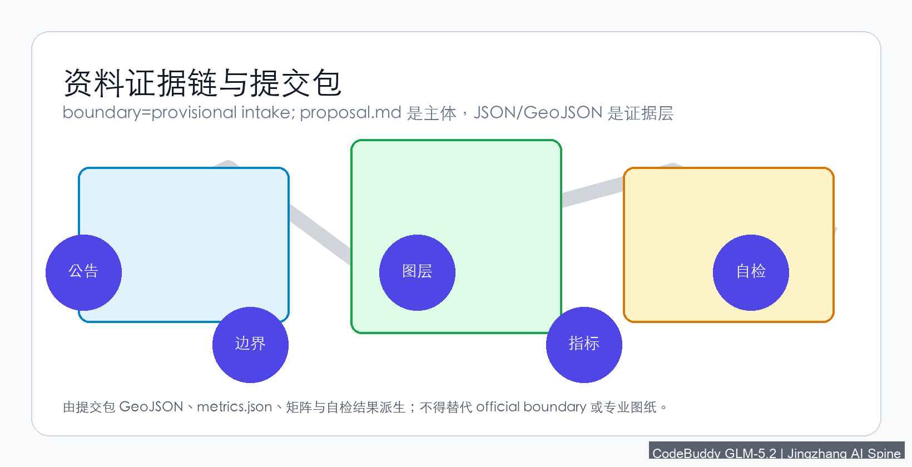
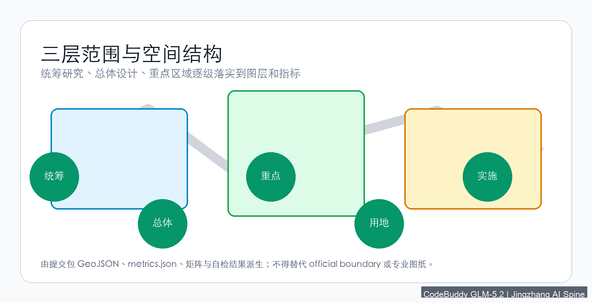
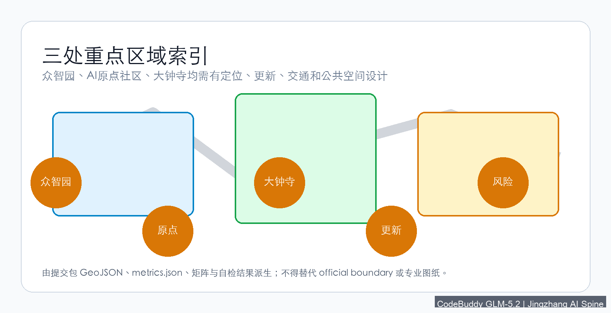
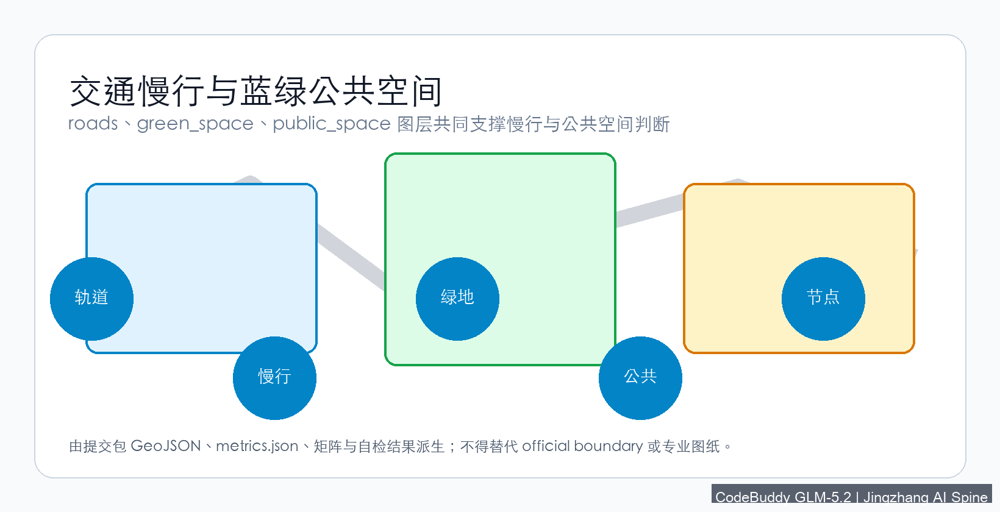
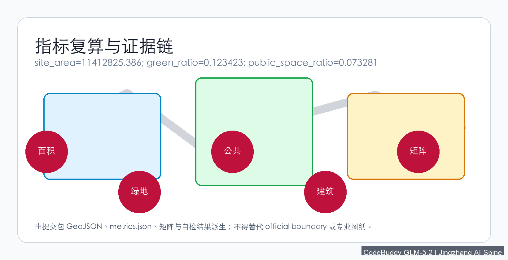

# Jingzhang AI Spine: Urban Design for the Centennial Railway Corridor AI Innovation Belt

## Design Basis and Source Inventory

This formal proposal takes the *Centennial Jingzhang AI Innovation Belt Urban Design International Open Call Qualification Pre-Announcement* issued by the Beijing Municipal Planning and Natural Resources Commission Haidian Branch as its primary authority, and uses the provisional coarse boundaries, key areas, enumerations, metrics, and source registers maintained in `brief/site-package/` as machine-readable references. Before generating the proposal, the AI agent must read `design_brief.json`, `allowed_design_space.json`, `sources.json`, `enums/`, `ranges/`, `schemas/`, `data/source_registry.json`, and `data/processed/agent_fact_pack.md`, and use `project_scope_summary.csv`, `agent_task_requirements.csv`, `source_use_matrix.csv`, and `missing_data_checklist.csv` to establish task, scope, source-use, and gap inventories. All design judgments must be decomposed into traceable sources, recomputable metrics, verifiable geometry layers, and human-reviewable assumptions. The announcement requires the proposal to reach the urban design depth of regulatory detailed planning and comprehensive planning implementation; therefore, narrative text cannot substitute for GeoJSON, metrics tables, A3 booklets, A0 boards, and HTML electronic display deliverables.

The proposal is not an independent vision document but is organized from the announcement, agent-facing taskbook, and site package; this section places only the most critical references next to the judgments [source:OFFICIAL-ANNOUNCEMENT] [source:AGENT-TASKBOOK] [depth:existing_conditions_diagnosis]. Complete source and standard coverage are stored in `sources.json`, `standard_matrix.json`, and `design_depth_matrix.json`, and are not repeated in the narrative.

The source registry's usage boundaries are as follows [source:SOURCE-REGISTRY]:

- `data/source_registry.json` registers the usage boundaries of public, cleared, and provisional materials.
- Current registration summary: 5 formal-available sources, 0 background-only sources, 1 provisional-only source.
- The agent must not promote background_only or provisional_only sources to official boundaries, statutory regulatory plans, formal scoring evidence, or government implementation commitments.

`data/processed/agent_fact_pack.md` is the reading navigation layer for this proposal, not a new authoritative source [source:PROCESSED-FACT-PACK]. It helps the agent organize the three-level scope, three key areas, announcement tasks, agent.1–agent.6, source availability, and missing-data items into a readable proposal; factual judgments must still return to the registered original materials [source:OFFICIAL-ANNOUNCEMENT] [source:AGENT-TASKBOOK], and complete source relationships are preserved in `sources.json`.

When the official `SITE_BOUNDARY` or the three `KEY_AREA` polygons are not yet available, this scaffold uses `brief/site-package/geometry/provisional_boundaries.geojson` to generate a provisional formal package. The `geometry/site_boundary.geojson` and `geometry/key_areas.geojson` in the submission package must both be labeled `provisional_constraint`, `official_boundary=false`, and may only be used for proposal generation, self-checking, visualization, and design discussion—not as official redlines, approval evidence, precise area evidence, or statutory control conclusions. This organizer data gap does not block content scoring; after replacing official polygons, site boundary, key areas, land use, roads, green space, public space, buildings, phasing, and metrics must all be recomputed.

The scorable state of this scaffold-generated package is: **provisional boundaries, with precision caveats preserved and pending recomputation upon official data release; does not block content scoring**. Therefore, the spatial structure, scenarios, projects, and metrics in the narrative are written following the principle of "discussable, reviewable, and recomputable after replacing official boundaries"; when official boundary and key area polygons are updated, the agent must re-run the scaffold, self-check, and drawing/HTML generation, and cannot merely replace a single file.

Boundary interpretation can return to the overall scope layer and area recomputation [data:geometry/site_boundary.geojson#SITE-001] [metric:site_area_sqm]. The three key areas are verified by independent layers and count metrics [data:geometry/key_areas.geojson#PROV-KEY-001] [metric:key_area_count]. This means readers can enter the evidence from the narrative without first reading a string of machine identifiers.

## Three-Level Scope Working Framework

The proposal organizes work according to the three levels determined by the announcement: the coordination research scope addresses the AI industry ecosystem, strategic positioning, innovation chain, and future urban form across 43.6 km²; the overall design scope addresses the 1–2 km urban and industrial area surrounding the 11.4 km² Jingzhang Heritage Park, requiring an overall urban renewal framework, industrial spatial layout, transportation and utility support, and urban character control; the key area scope addresses the three detailed design districts totaling 368.4 hectares, requiring clear functional programs, building scales, retain-renovate-demolish classification, public space connectivity, and traffic organization. The three levels are mapped item-by-item in `compliance_matrix.json`, ensuring that the mandatory tasks of announcement sections 1.3, 1.4, 1.5 and agent.1–agent.6 all have chapter, layer, metric, drawing, and HTML evidence.

The depth items of the three-level working framework are constrained by [depth:three_level_scope_framework] and [depth:overall_spatial_structure], spatial evidence is based on [data:geometry/site_boundary.geojson#SITE-001] and [data:geometry/key_areas.geojson#PROV-KEY-001], task authority is based on [standard:PROJECT-OFFICIAL-ANNOUNCEMENT], and scope indexing uses the three-level scope table in `project_scope_summary.csv` from [source:PROCESSED-FACT-PACK] as navigation.

The three levels of work are not isolated drawing sets. Coordination research determines industry chain and urban form judgments; overall design translates judgments into renewal projects, spatial structure, and facility capacity; key area detailed design validates the implementability of specific parcels, buildings, traffic, public space, and AI application scenarios. When generating the proposal, the agent must first lock the official or provisional boundaries and constraints adopted, then generate land use, buildings, roads, green space, public space, phasing, and AI service nodes, and finally recompute metrics from these layers and explain in the narrative which conclusions remain limited by provisional boundaries. Any area, ratio, scale, or project count that cannot be recomputed from structured data must not be written into formal conclusions.

The overall concept proposed by this scheme is the "Jingzhang AI Symbiosis Belt": using the Jingzhang Heritage Park as the historical and public space spine, the three key areas—Zhongzhiyuan (All-Wisdom Garden), Beijing AI Origin Community, and Dazhongsi—as innovation anchors, and universities, enterprises, communities, and rail stations as the daily network, forming a spatial organization of "one belt, three cores, multi-point scenarios, and a blue-green slow-mobility composite ring." The "one belt" is not a newly drawn redline but a translation of the announcement's three-level scope into a working method; the "three cores" correspond to the three key areas; "multi-point scenarios" correspond to operable nodes for AI + public services, industry services, and urban life; the "composite ring" corresponds to the linkage of slow mobility, green space, public space, and activity routes.

| Level | Design Question | Proposal Response | Data Anchor |
| --- | --- | --- | --- |
| Coordination Research | How to organize the AI industry ecosystem and future urban form | Establish an innovation chain of "university sourcing—open-source collaboration—enterprise transformation—public experience—international communication" | compliance_matrix.json, standard_matrix.json |
| Overall Design | How to map industry space, urban renewal, transportation, and character | Express through land use, building, road, green space, public space, and phasing layers | [data:geometry/land_use.geojson#LU-001], [data:geometry/roads.geojson#ROAD-001] |
| Key Area Design | How the three districts reach detailed design depth | Propose positioning, spatial actions, AI scenarios, and implementation dependencies for each | [data:geometry/key_areas.geojson#PROV-KEY-001], [data:geometry/key_areas.geojson#PROV-KEY-002], [data:geometry/key_areas.geojson#PROV-KEY-003] |

## Coordination Research: Industry and Future City

The core task of the coordination research scope is to build a world-class AI innovation ecosystem. The proposal should survey Haidian's universities and research institutes, leading enterprises, computing-algorithm-data resources, incubation platforms, listed companies, unicorns, and technology service resources, and propose a spatial coordination framework for the AI innovation chain, industry chain, talent chain, and urban service chain. Naming and logo design should serve the overall recognizability of the "Centennial Jingzhang Cultural Belt, Urban AI Life Experience Belt, and AI Convergence Innovation Belt," not remain at the slogan level, and should explain the relationship with industry ecosystem, public space, and cultural resources. The agent-facing taskbook also requires responding to the "five major functions" and "three zones and two wings" coordination, forming a naming system, visual identity, overall spatial structure diagram, scenario openings, and operational mechanisms that can be further deepened; this section must use [source:AGENT-TASKBOOK] and [standard:PROJECT-AGENT-OPEN-CALL-TASKBOOK] to indicate that these requirements come from the agent open call taskbook, not statutory planning controls.

Coordination research does not add pseudo-precise redlines; it connects back to [data:geometry/land_use.geojson#LU-001], [data:geometry/public_space.geojson#PUBLIC-001], and [depth:overall_spatial_structure] through the urban character, public space, and building layout coordination required by [standard:MOHURD-URBAN-DESIGN-MEASURES], demonstrating that industry strategy ultimately maps to visible, reviewable spatial structure.

Future urban form research should answer how AI transforms work, life, socializing, learning, transportation, and public services. The proposal should translate AI transportation systems, continuous green space, innovation service facilities, and an internationalized live-work atmosphere into locatable functional zones, nodes, corridors, and scenarios, rather than vaguely describing technology visions. The agent should write industry strategy metrics, AI innovation indices, talent density, spatial supply types, and AI+ vertical application focus areas into the metrics system, and indicate which are official, which are design recommendations, and which remain to be calibrated with formal data. If proposing global AI innovation events, developer communities, open scenarios, or pilgrimage routes, these should be written as "concept recommendations / reference proposals / available for further professional deepening," not as confirmed government events or implementation arrangements.

## Overall Design: Urban Renewal and Regulatory-Depth Urban Design

The overall design scope requires reaching the urban design depth of regulatory detailed planning. The proposal must present an overall urban renewal spatial structure, inefficient space identification, renewal project list, implementation policy recommendations, industrial function ratios, spatial organization models, total building scale, and comprehensive carrying capacity assessment. `geometry/land_use.geojson` should completely cover the design boundary without overlap, `geometry/buildings.geojson` should express renewal or retained building footprints, `geometry/roads.geojson` should express micro-circulation, slow mobility, and rail connectivity, and `metrics.json` should recompute core areas, ratios, and layer counts.

This section decomposes regulatory-depth content into reviewable objects per [standard:MOHURD-CONTROL-DETAILED-PLANNING]: [data:geometry/land_use.geojson#LU-001] expresses land use structure, [data:geometry/buildings.geojson#BLDG-001] expresses building footprints, [data:geometry/roads.geojson#ROAD-001] expresses traffic organization, [metric:building_footprint_area_sqm] is used to verify building footprint area, and [depth:land_use_layout] and [depth:development_intensity_controls] constrain deliverable depth.

Overall design must also support transportation, rail, municipal, and supporting facilities. The proposal should address rail station integration, road micro-circulation, bicycle parking, parking supply, innovation service platforms, talent living services, new infrastructure, distributed energy, and edge computing with spatial layouts and implementation paths. Content involving building height, development intensity, road redlines, setbacks, and facility standards, if no official control conditions exist, should be written as "pending official regulatory confirmation," and must not use agent-speculated values as approved metrics.

## Key Area Detailed Design

Key area detailed design is mandatory. The Zhongzhiyuan AI Autonomous Innovation Acceleration Zone should propose detailed schemes around the national AI platform, full-stack autonomous innovation, standards development, safety governance, industry display, external transportation, Qinghe River culture, low-carbon green innovation exchange environments, and green space AI scenarios. The Beijing AI Origin Community should propose detailed schemes around near-campus innovation, achievement incubation and transformation, talent special zones, open-source systems, brand events, building retain-renovate-demolish, achievement display and release, residential living support, campus-park slow mobility connections, and rail station integration. The Dazhongsi AI Industry Cluster should propose detailed schemes around leading enterprises, AI agents, smart terminals, content consumption, data elements, digital assets, commercial services, composite use of planned green space, Dazhongsi Station integration, and four-quadrant pedestrian connectivity.

The three key area detailed designs must reference [data:geometry/key_areas.geojson#PROV-KEY-001], [data:geometry/key_areas.geojson#PROV-KEY-002], and [data:geometry/key_areas.geojson#PROV-KEY-003], and [depth:three_key_area_detailed_design] checks whether they reach the comprehensive planning implementation depth. If only "building a demonstration zone" is described without evidence of function, buildings, traffic, public space, and implementation projects, it should be considered incomplete.

The three key areas must appear in `geometry/key_areas.geojson`. If the repository provides official polygons, they should be used as `official_constraint`; if official polygons are missing, `provisional_constraint` may be used temporarily, but the narrative, HTML, sources, assumptions, and self_check must state that it cannot serve as formal scoring or approval evidence. `compliance_matrix.json` should separately cover announcement sections 1.5.3.1, 1.5.3.2, and 1.5.3.3. Design expression should include functional programs, building scales, building forms, retain-renovate-demolish classification, public space systems, traffic organization, slow mobility connectivity, and implementation projects. The HTML page should support switching between the three key areas, and the A3 booklet and A0 board should include at least a key district overview, partial detail drawings, and metric explanations.

| Key District | Design Positioning | Spatial Actions | AI Industry and Operations Scenarios | Evidence References |
| --- | --- | --- | --- | --- |
| Zhongzhiyuan AI Autonomous Innovation Acceleration Zone | Garden-type full-stack autonomous innovation district | Strengthen Qinghe frontage, industry display, low-carbon innovation exchange, and external traffic organization; use green space for open testing and standards governance display | Autonomous model testing, standards workshops, safety governance display, low-carbon computing experience | [data:geometry/key_areas.geojson#PROV-KEY-001], [depth:three_key_area_detailed_design] |
| Beijing AI Origin Community | Near-campus achievement transformation and talent community | Organize campus-park-street slow mobility stitching; supplement achievement release, talent services, residential living, and open-source collaboration space | Open-source community, achievement release, talent zone services, near-campus incubation | [data:geometry/key_areas.geojson#PROV-KEY-002], [source:AGENT-TASKBOOK] |
| Dazhongsi AI Industry Cluster | Urban-type intelligent economy and international exchange district | Center on Dazhongsi Station integration, four-quadrant pedestrian connectivity, commercial services, and key enterprise public environment renewal | AI agent and smart terminal display, content consumption, data elements, and international roadshows | [data:geometry/key_areas.geojson#PROV-KEY-003], [metric:key_area_count] |

## AI Innovation Ecosystem, Talent Profiles, and AI+ Scenarios

The proposal should build spatial demand profiles for AI talent and enterprises, covering R&D office, open-source collaboration, achievement release, enterprise services, talent housing, social learning, consumer life, sports and leisure, and international exchange. AI+ scenarios should address the directions proposed in the announcement—transportation, services, consumption, healthcare, education, legal, life services—forming industry development scenarios and AI-empowered urban function scenarios. Each scenario should specify service targets, spatial locations, data sources, privacy boundaries, human review mechanisms, and operating entities.

AI scenarios must map to spatial and governance boundaries: public space scenarios reference [data:geometry/public_space.geojson#PUBLIC-001], slow mobility and traffic scenarios reference [data:geometry/roads.geojson#ROAD-001], and open space scenarios reference [data:geometry/green_space.geojson#GREEN-001] and [metric:public_space_ratio], [metric:green_ratio]. These references let reviewers know that scenarios are not slogans but design objects located in specific layers and metrics. The agent-facing taskbook requires no fewer than 10 AI scenario cards, no fewer than 3 industry testing and validation scenarios, and no fewer than 5 user profiles; the scaffold only provides structure, and formal participants must write scenario cards, profile tables, privacy boundaries, human review, and operating entities into the narrative, HTML, A3/A0, and compliance matrix.

| User Profile | Typical Needs | Spatial Response | Self-Check Boundary |
| --- | --- | --- | --- |
| Open-source developer | Release, collaboration, testing, community reputation | Origin Community open-source release hall, public code wall, nighttime collaboration space | No personal behavior tracking; activity data is aggregate-only |
| Startup team | Low-cost office, computing access, product testing ground | Zhongzhiyuan shared testing field, edge computing service points, standards governance consulting | Computing and data services require separate authorization |
| Leading enterprise visitor | Display, business, international reception, talent recruitment | Dazhongsi international roadshow lounge, rail station connectivity, key enterprise surrounding public space | Enterprise logos and cases must be rights-cleared |
| Surrounding residents | Commuting, leisure, community services, low-disturbance renewal | Jingzhang Heritage Park slow mobility ring, embedded community services, nighttime lighting and activity grading | Resident profiles not used for commercial recommendation |
| University faculty and students | Achievement transformation, cross-campus collaboration, daily slow mobility | Campus-park slow mobility stitching, achievement transformation stations, AI education experience points | Campus data and research results require authorization |

| Scenario Card | Spatial Carrier | Design Description |
| --- | --- | --- |
| 01 Open-source Release Hall | Beijing AI Origin Community | For universities, open-source communities, and startup teams; provides achievement release, code contribution display, and small-scale roadshow space |
| 02 Safety Governance Sandbox | Zhongzhiyuan | Translates standards development, safety evaluation, and model red-teaming into visitable, bookable, and supervisable display and collaboration nodes |
| 03 Edge Computing Waystation | Overall design scope nodes | Combined with public services, enterprise services, and low-carbon energy strategy, as a new infrastructure prototype for further development |
| 04 AI Slow-Mobility Navigator | Jingzhang Heritage Park vitality belt | Uses explainable wayfinding and low-intrusion sensing to identify slow mobility breakpoints, congestion nodes, and accessibility needs |
| 05 Dazhongsi International Roadshow Lounge | Dazhongsi AI Industry Cluster | Serves AI agent, smart terminal, and content consumption enterprises with display, negotiation, media release, and international exchange |
| 06 Qinghe Low-Carbon Innovation Corridor | Zhongzhiyuan Qinghe frontage | Combines green space, stormwater, walking and cycling, and AI display as the park's public living room |
| 07 Near-Campus Achievement Transformation Street | Beijing AI Origin Community | For university achievement transformation, organizing incubation, display, legal, IP, and investment services |
| 08 Data Element Reception Hall | Dazhongsi district | On the premise of compliance, authorization, and auditability, displays the urban service interface for data element and digital asset circulation |
| 09 AI Life Service Model Street | Community and commercial intersections | Translates healthcare, education, legal, and life service AI+ scenarios into operable small-scale street spaces |
| 10 Global AI Activity Week Route | One-belt public space system | Forms a walkable, communicable experience route from heritage culture, open-source community, industry display, to international roadshow |

AI governance recommendations generated by the agent must follow data minimization, public source, explainability, and human review principles. Urban AI agents can assist in identifying slow mobility breakpoints, public space heat maps, facility maintenance, enterprise service demand, and event safety risks, but cannot replace planning approval, cannot output unauthorized personal profiles, and cannot claim official implementation commitments. All AI scenario nodes should enter structured layers or the compliance matrix, allowing reviewers to see their relationship with industry, space, and public interest.

## Land Use, Building Scale, and Retain-Renovate-Demolish

The land use scheme should be expressed based on public standards for territorial space survey, planning, and use control classification, forming complete, closed, and seamless land use zones. The building scheme should distinguish retained, renovated, renewed, newly built, and pending-confirmation objects, specifying building footprint, function, scale, character, roof, massing, and height control recommendation levels. If current buildings, property rights, regulatory plans, and engineering conditions are missing, the scheme can only propose methods and pending-calibration lists, and cannot fabricate retain-renovate-demolish conclusions.

Land use classification follows [standard:MNR-LAND-USE-CLASSIFICATION-GUIDE], building height, massing, frontage, and character control is managed by [depth:height_massing_character], and the retain-renovate-demolish method is managed by [depth:retain_renovate_demolish]. The main evidence for land use and buildings is [data:geometry/land_use.geojson#LU-001], [data:geometry/buildings.geojson#BLDG-001], and [metric:building_footprint_area_sqm].

Building scale and intensity metrics must be consistent with `metrics.json` and the geometry layers. If total building scale, floor area ratio, building height, building density, green ratio, setbacks, and building control lines lack official conditions, they should be listed as unknown or pending_control in the metrics system, and must not use fixed values to create a false sense of precision. The A3 booklet should provide a renewal project list and metric verification table, the A0 board should clearly express key spatial structure and key districts, and the HTML page should provide linked viewing of metrics and layers.

## Transportation, Rail, Municipal, and Public Service Facilities

The transportation scheme should respond to the announcement's requirements for rail station integration, road micro-circulation, slow mobility breakpoints, external transportation, parking, bicycle parking, and green transportation systems. Key coverage should include the North Fifth Ring Road, Jingzhang Heritage Park cross-ring-road nodes, Wudaokou, Qinghua East Road West Gate, Dazhongsi Station, and traffic connections around key enterprises. Road and slow mobility layers should remain within the submission boundary and cross-verify with public space, green space, industry nodes, and key districts; if the submission boundary is provisional, traffic conclusions can only serve as provisional design discussion.

Transportation and municipal professional depth are constrained by [depth:traffic_rail_slow_parking] and [depth:municipal_new_infrastructure] respectively; layer evidence references [data:geometry/roads.geojson#ROAD-001], [data:geometry/public_space.geojson#PUBLIC-001], and [data:geometry/constraints.geojson#CONSTRAINTS]. When road redlines, pipelines, fire protection, and municipal conditions are missing, they should be noted as pending through assumptions, rather than writing strategies as approved conditions.

Municipal and public service facilities should cover AI industry service facilities, innovation service platforms, talent living service facilities, new infrastructure, distributed energy, edge computing, and integration with traditional municipal facilities. The proposal should specify facility standards, spatial layout, service radius, operating models, and phased implementation logic. When pipeline, energy, drainage, flood control, and fire protection engineering data is missing, it should be listed as a formal deepening prerequisite.

## Blue-Green Space, Public Space, and Urban Character

The blue-green space scheme should use the Jingzhang Heritage Park vitality belt as its backbone, coordinating Qinghe River, Xiaoyue River, and surrounding university, enterprise, and community travel needs, proposing a north-south and east-west connected system of walkways, cycling paths, and green spaces. The proposal should identify slow mobility breakpoints, cross-ring-road nodes, and landscape nodes at the park's south and north ends, proposing composite use strategies for parking, sports, innovation exchange, technology testing, application display, and public services.

Blue-green public space is jointly verified by design depth items and green space and public space layers [depth:blue_green_public_space] [data:geometry/green_space.geojson#GREEN-001] [data:geometry/public_space.geojson#PUBLIC-001]. Green and public space ratios are explained in the narrative for their design significance, with complete recomputation preserved in `metrics.json`; urban character, public space, and building control coordination returns to the professional standards matrix [standard:MOHURD-URBAN-DESIGN-MEASURES].

The urban character scheme should integrate Jingzhang railway historical culture, Zhongguancun innovation culture, and AI innovation culture, using cultural resources such as Qinghuayuan Railway Station and Beijing Film Academy to propose urban tone, building character, roof forms, massing, frontage, and public art guidance. The agent should also propose wayfinding signage, cultural symbols, international communication narratives, AI pilgrimage landmarks, contribution walls, or honor display systems, but all brands, fonts, images, portraits, and enterprise logos must have rights-cleared sources. Character control should distinguish official regulation, design recommendations, and pending-confirmation conditions, and is strictly prohibited from providing pseudo-precise control lines without cultural heritage protection or regulatory plan basis.

## Renewal Project List, Implementation Policy, and Phasing

The implementation scheme should form a reviewable renewal project list, specifying project location, type, function, responsible entity, dependencies, implementation phase, risks, and evaluation metrics. Policy recommendations should cover urban renewal coordinated implementation, spatial supply, operating mechanisms, industry services, public participation, data governance, and property rights coordination. `geometry/phasing.geojson` should express phasing ranges, and `compliance_matrix.json` should link each task to phasing and drawings.

Project list and phasing depth are managed by [depth:renewal_project_list] and [depth:phasing_implementation], with phasing spatial evidence at [data:geometry/phasing.geojson#PHASE-001]. Without property rights, funding, implementation entities, and approval paths, the proposal must write these as implementation risks, not landing commitments.

| Project No. | Project Name | Type | Key Dependencies | Evidence References |
| --- | --- | --- | --- | --- |
| JZ-01 | Jingzhang Heritage Park Slow Mobility Breakpoint Stitching | Public space/Transportation | Road redlines, under-bridge space, traffic organization review | [data:geometry/roads.geojson#ROAD-001] |
| JZ-02 | Zhongzhiyuan Qinghe Innovation Frontage | Blue-green space/Industry display | River blue line, ecological and flood control conditions | [data:geometry/green_space.geojson#GREEN-001] |
| JZ-03 | Origin Community Near-Campus Achievement Transformation Street | Urban renewal/Industry services | Campus boundary, property rights, ground-floor business | [data:geometry/buildings.geojson#BLDG-001] |
| JZ-04 | Dazhongsi Station Four-Quadrant Pedestrian Connectivity | Rail integration/Slow mobility | Rail station, road intersection, municipal pipelines | [data:geometry/public_space.geojson#PUBLIC-001] |
| JZ-05 | AI Public Service and Edge Computing Nodes | New infrastructure/Public services | Energy, computing, security, and operating entities | [data:geometry/constraints.geojson#CONSTRAINTS] |
| JZ-06 | Global AI Activity Week Public Route | Operations/Brand | Public space permits, event safety, copyright clearance | [data:geometry/phasing.geojson#PHASE-001] |

Phasing should be distinguished from the 100-day call design cycle: the call cycle is the submission deadline requirement, while implementation phasing is the advancement path for urban renewal and project construction. The proposal should propose near-term pilots, mid-term renewal, and long-term governance frameworks, indicating which content can start with lightweight facilities, operational events, and service platforms, and which must wait for formal regulatory, municipal, transportation, and property rights confirmation. For annual event systems, developer community operations, scenario open days, public experience routes, and international communication mechanisms, the narrative should specify operating targets, frequency, responsibility boundaries, transformation paths, and risks, not just promotional slogans.

## Metrics System, Area Recomputation, and Compliance Matrix

The metrics system should include at minimum: overall design scope area, key area area, green and public space ratios, building footprint, renewal project count, AI scenario nodes, slow mobility connectivity metrics, industry space metrics, talent service metrics, and self-check status. All known metrics must be recomputable from GeoJSON or credible sources; unknown metrics must provide reasons and formal submission prerequisites. Results from `scripts/spatial_review.py` and `scripts/visual_review.py` are important evidence for formal self-checking.

Metric recomputation follows the unified design depth requirement [depth:metrics_recalculation]. The narrative focuses on explaining the design significance of metrics—for example, how the overall scope constrains spatial allocation, how blue-green and public space ratios support daily interaction; complete values, formulas, source files, and confidence are preserved in `metrics.json`. Example key metrics can be verified from the overall scope and green space data [metric:site_area_sqm] [data:geometry/green_space.geojson#GREEN-001].

The compliance matrix is the master document for task responsiveness. Each announcement task and agent_taskbook task must correspond to report chapters, layers, metrics, drawings, HTML pages, sources, assumptions, and self-check items. Failure to cover any mandatory task in announcement sections 1.3, 1.4, 1.5 or agent.1–agent.6 means the proposal cannot enter formal professional scoring.

During formal deepening, the agent should also classify each metric into three categories: the first is spatial metrics directly recomputable from submitted geometry, such as boundary area, green ratio, public space ratio, building footprint area, and phasing area; the second is control metrics requiring official regulatory or taskbook appendix support, such as floor area ratio, building height, building density, setbacks, road redlines, and facility standards; the third is performance metrics requiring continuous calibration from operational or industry data, such as AI innovation index, talent density, industry service satisfaction, slow mobility accessibility, event participation, and scenario usage frequency. The three categories should enter `metrics.json`, `assumptions.json`, and `compliance_matrix.json` respectively, avoiding mistaking operational visions for approved planning conditions.

## Risks, Copyright, and Compliance

**Bilingual requirement.** The proposal's primary file may use Chinese or English, but must provide a complete counterpart translation via `proposal.en.md` or `proposal.zh.md`; A3/A0, HTML, and text-bearing figures must also provide corresponding language copies, preferably using the competition's recommended terminology from `docs/terminology-glossary.md`. A v2 package missing any required translation, language mapping, or valid file will be blocked by finalize and CI. All images, drawings, icons, data, and code assets must state their source, license, and authorization status in `sources.json` or `report/copyright_statement.md`. HTML pages must not load remote scripts, remote map tiles, remote fonts, iframes, forms, or external APIs, and must not track reviewer behavior.

Risk and missing-data lists are jointly verified by risk depth items, constraint layers, and the site package [depth:risk_missing_data] [data:geometry/constraints.geojson#CONSTRAINTS] [source:SITE-PACKAGE]. The official boundary, key area, regulatory, road, parcel, building, municipal, cultural heritage, and public service gaps listed in `missing_data_checklist.csv` must enter `assumptions.json`, self-check, and the narrative risk chapter. Any conclusion lacking official regulatory, road redline, property rights, municipal, fire protection, or cultural heritage conditions must be downgraded to a pending item; complete professional verification is preserved in the standards matrix.

This proposal does not claim official approval, approved regulatory plans, final property rights, final construction scale, or guaranteed implementation. The AI agent is responsible for facts, sources, copyright, spatial data, metrics, and expression; maintainers and professional reviewers may require rework or rejection based on self-check results, spatial review, and the compliance matrix.

## References

- brief/public-brief.md
- brief/site-package/design_brief.json
- brief/site-package/allowed_design_space.json
- brief/site-package/enums/
- brief/site-package/ranges/planning_limits.json
- data/processed/agent_fact_pack.md
- data/processed/project_scope_summary.csv
- data/processed/agent_task_requirements.csv
- data/processed/source_use_matrix.csv
- data/processed/missing_data_checklist.csv
- Complete machine index: see `sources.json`, `metrics.json`, `compliance_matrix.json`, `standard_matrix.json`, and `design_depth_matrix.json`
- This section's bibliography entries are based on site package registration; complete citations and licenses are in the structured source list [source:SITE-PACKAGE]
