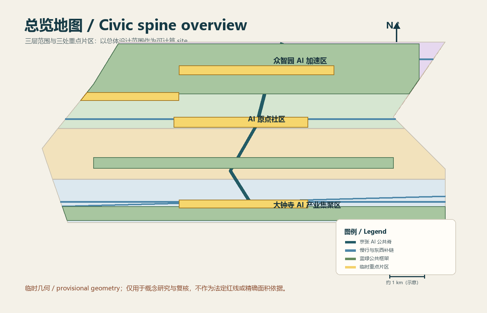
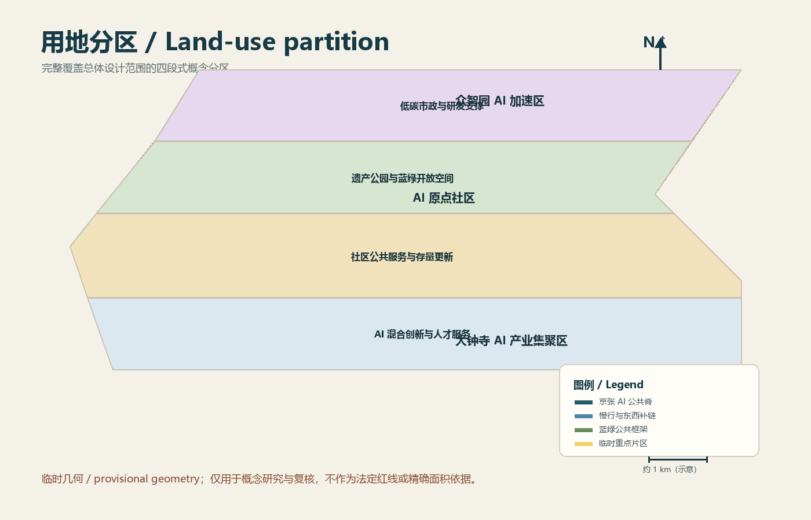
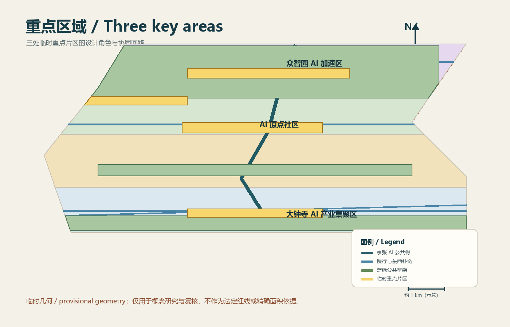
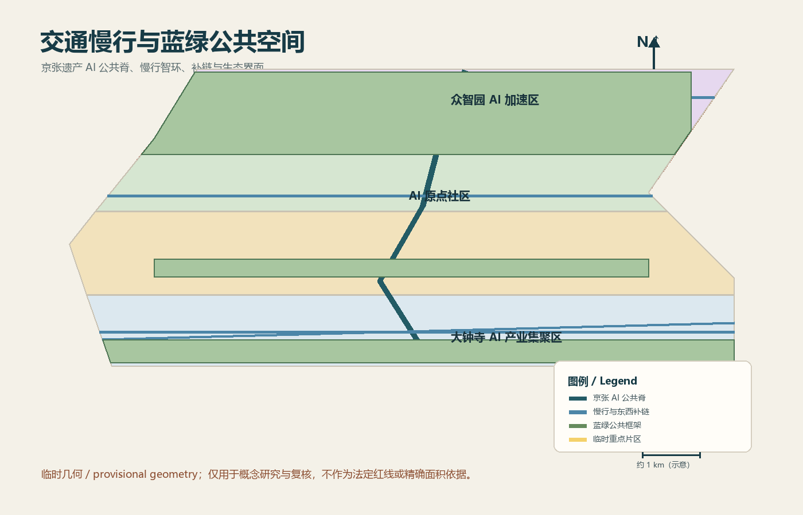
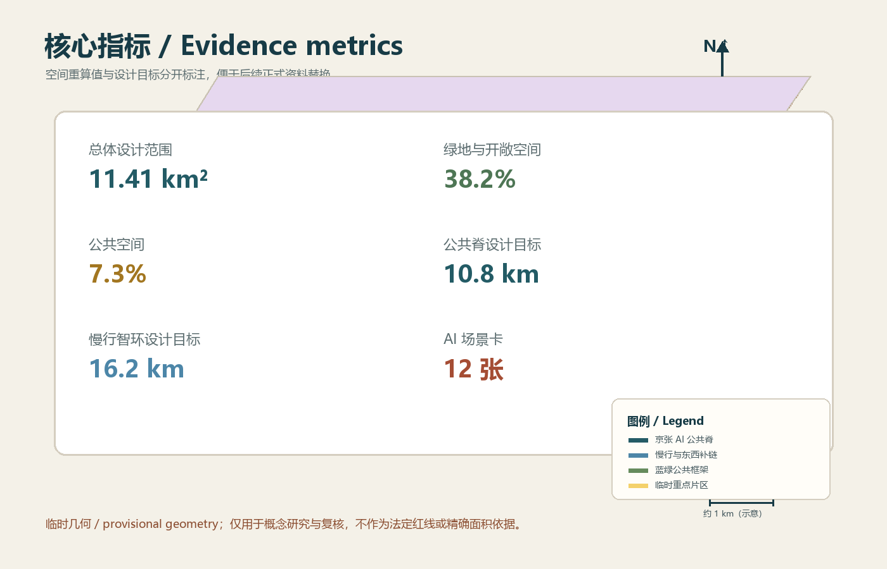

# 轨迹智环：百年京张 AI 创新公共脊

本方案把百年京张从一条线性遗产记忆，转译为可行走、可骑行、可展示、可测试、可运营的 AI 公共基础设施。方案只提供概念建议、参考方案和可供专业团队深化的研究材料，不替代正式规划，不构成政府审批结论或工程实施承诺。[source:DATA-SRC-OFFICIAL-ANNOUNCEMENT-20260509] [source:DATA-SRC-OPEN-CITY-HAIDIAN] [source:DATA-SRC-PROVISIONAL-BOUNDARIES-20260605]

## 设计依据与资料清单

依据包括公开征集公告、仓库任务书、仓库专业标准快照和 provisional boundaries。当前没有组织方正式 CAD/GIS/PDF 红线、法定控规强度和高度、产权、市政容量、现状建筑普查或无障碍人工检查记录。因此，`geometry/site_boundary.geojson` 是总体设计范围的临时可计算研究底面，`geometry/constraints.geojson` 单独保存 43.6 平方公里统筹研究范围，不把两者混为同一个统计口径。[standard:PROJECT-OFFICIAL-ANNOUNCEMENT] [standard:PROJECT-AGENT-OPEN-CALL-TASKBOOK] [data:geometry/site_boundary.geojson#PROV-SITE-001] [data:geometry/constraints.geojson#RESEARCH-SCOPE-001]

## 三层范围工作框架

第一层是 43.6 平方公里统筹研究范围，承担区域创新协同、产业和未来城市研究；第二层是 11.4 平方公里总体设计范围，承担京张遗产公园两侧连续公共界面、慢行补链和城市更新建议；第三层是 368.4 公顷重点区域，分别落到众智园 AI 自主创新加速区、北京 AI 原点社区、大钟寺 AI 产业集聚区。[metric:research_area_sqm] [metric:overall_design_area_sqm] [metric:key_area_sqm] [depth:three_level_scope_framework]

三层范围不是简单缩放，而是“研究策略 - 空间结构 - 项目包”的证据链。研究层回答谁来协作和哪些要素进入系统；设计层回答公共脊、智环、东西补链和公共客厅如何组织；实施层回答哪些低扰动项目可以先试点、哪些指标需要官方资料后再复算。[data:geometry/site_boundary.geojson#PROV-SITE-001] [data:geometry/key_areas.geojson#PROV-KEY-001]

## 统筹研究范围产业与未来城市研究

建议以“三心两翼一带”组织研究：北部众智园承担全栈模型、基础软件和标准测试；中部 AI 原点社区承担高校成果转化、人才服务和小尺度场景；南部大钟寺承担智能体经济、消费服务和国际展示；西翼对接中关村科技服务资源，东翼对接小月河场景赋能；一带即连续的京张 AI 公共脊。[depth:overall_spatial_structure]

区域协同不写成已确定的招商或政策安排，而作为接口设计：北纬社区提供日常公共服务反馈，未来科学城与怀柔科学城提供科研协同和试验议题，经开区提供应用型产业议题，京津冀协作提供成果传播与跨区域验证。参与者可以先建立公开问题清单、场景需求清单和可复算数据台账，再由专业和运营团队确定合作边界。

## 总体设计范围城市更新与控规深度城市设计

总体设计范围的空间动作是“先公共后开发、先试点后固化、先数据台账后工程投资”。`land_use.geojson` 以四个共享边界的概念分区完整覆盖临时 site：AI 混合创新与人才服务、社区公共服务与存量更新、遗产公园与蓝绿开放空间、低碳市政与研发支撑。[data:geometry/land_use.geojson#LU-01] [depth:land_use_layout]

建筑策略采用保留、修补、共享首层和适度更新四种动作。`buildings.geojson` 仅表达六组概念性建筑基底和公共首层节点，不表达拆迁、容积率、高度或产权结论。[data:geometry/buildings.geojson#BLDG-01] [depth:development_intensity_controls] [depth:height_massing_character] [depth:retain_renovate_demolish]

## 重点区域详细设计

众智园 AI 加速区建议形成“开放模型客厅 - 标准测试 - 创新广场”的公共研发界面；AI 原点社区建议形成“成果转化街 - 人才服务 - 社区共享”的近校园街区；大钟寺 AI 产业集聚区建议形成“站前公共空间 - 智能经济会客厅 - 夜间文化展示”的站城一体界面。三处片区通过公共脊和东西补链串联，形成研发、转化、应用的闭环。[data:geometry/key_areas.geojson#PROV-KEY-001] [data:geometry/key_areas.geojson#PROV-KEY-002] [data:geometry/key_areas.geojson#PROV-KEY-003] [depth:three_key_area_detailed_design]

三处 AI 朝圣地标建议为：京张记忆发布广场、众智园开放模型客厅、大钟寺智能经济会客厅。地标不追求单一造型，而采用可移动展台、可替换导视、公共数据台账墙和夜间低亮度展示组件，形成可持续更新的公共空间组件库。[depth:blue_green_public_space]

## AI 创新生态、人才画像与 AI+ 场景

可借鉴的公开案例类型包括：开放模型社区、城市数字孪生实验室、公共数据空间、产业测试床、社区能源管理、遗产数字导览。方案将它们转译为八要素接口：土地、空间、产业、资金、人才、算力、数据、场景。每个接口都应由来源登记、人工审查和退出条件支撑，不把企业名录、投资额或政策承诺写成既成事实。

十二张场景卡分为三组：开放模型发布、算法安全评测、城市更新问答、慢行导航；低碳能源调度、热回收可视化、遗产导览、无障碍辅助；人才服务、创业路演、夜间导视、公共议题共创。[metric:ai_scenario_cards_count] 三个产业测试验证场景为模型安全沙盒、城市更新知识库问答、低碳算力热管理。[metric:ai_industry_testbeds_count]

六类用户画像为基础模型研发者、成果转化团队、智能体创业者、周边居民、低数字技能与老年使用者、访客与国际交流者。[metric:user_personas_count] 场景运营必须满足最小化数据、可解释、可关闭、人工复核、线下等效服务和申诉记录六项边界，机器视觉不能替代真实无障碍检查。

## 用地、建筑规模与拆改留方案

总体设计范围内只提出概念性空间结构，不给出法定 FAR、建筑高度、建筑密度或地块拆改结论。AI 产业及服务面积 180 万平方米、人才住房 12,000 套和存量活化 68 公顷均为公开征集目标或概念设计目标，需在官方边界、控规、权属和住房政策资料到位后复核。[metric:ai_floor_area_sqm] [metric:talent_housing_units] [metric:adaptive_reuse_area_sqm]

保留优先用于遗产界面、成熟社区和有公共记忆的建筑；更新优先用于低效首层、围墙界面和可共享的研发服务空间；只有在专业安全、权属和法定程序均满足时，才由专业团队研究更替可能。方案不指定具体地块拆除或建设。

## 交通、轨道、市政与公共服务设施

交通策略是“轨道到达、慢行组织、东西补链、停车减量”。`roads.geojson` 表达一条公共脊、一条慢行智环和三条代表性东西补链，设计目标分别为 10.8 公里、16.2 公里和 12 条。[data:geometry/roads.geojson#ROAD-01] [metric:heritage_ai_spine_length_m] [metric:slow_loop_length_m] [metric:east_west_links_count] [depth:traffic_rail_slow_parking]

市政与公共服务建议包含边缘算力驿站、低温余热回收、海绵铺装、共享会议厅、人才服务站、儿童友好和适老节点。所有市政容量、能源负荷、地下空间和交通安全结论均留待正式资料与专业核验。[depth:municipal_new_infrastructure]

## 蓝绿空间、公共空间与城市风貌

蓝绿策略由遗产公园、清河生态缓冲、社区口袋花园和街道雨洪设施组成；公共空间分为遗产发布广场、AI 社区客厅、慢行驿站、站前共享界面和社区口袋花园。`green_space.geojson` 不再覆盖整个 site，而是表达三个蓝绿框架片段；`public_space.geojson` 表达四处可停留、可展示和可运营的公共客厅。[data:geometry/green_space.geojson#GREEN-01] [data:geometry/public_space.geojson#PUBLIC-01] [metric:green_ratio] [metric:public_space_ratio] [depth:blue_green_public_space]

城市风貌采用低层连续界面、可停留首层、清晰导视、可维护夜景照明和京张材料记忆。Logo 方向采用两条不闭合轨迹线，分别象征铁路记忆与开放 AI 未来；英文传播短句为“Trace the railway. Test the future. Share the city.”

## 更新项目清单、实施政策与分期计划

第一阶段 0—2 年建议先做遗产记忆发布、站前安全改善、街角公共服务和可撤装 AI 节点；第二阶段 3—5 年建议做社区补链、清河低碳算力驿站和存量更新试点；第三阶段 5—10 年建议形成连续公共脊、慢行智环和多主体运营平台。[data:geometry/phasing.geojson#PHASE-01] [depth:renewal_project_list] [depth:phasing_implementation]

建议配套公开数据台账、公共收益清单、低扰动更新协议、首层开放激励和运营绩效回看。每个项目包必须补充实施主体、产权前提、成本级别、资金边界、依赖关系、人工复核、隐私最小化、退出条件和维护责任；当前提交只提供这些字段的概念框架。

## 指标体系、面积复算与合规矩阵

空间交换坐标采用 EPSG:4326，面积复算采用 EPSG:4548。当前可计算 site 面积为 11,412,825.386 平方米，绿地与开敞空间面积为 4,356,249.660 平方米，公共空间面积为 832,204.946 平方米，对应比例为 0.381698 和 0.072918。[metric:site_area_sqm] [metric:green_space_area_sqm] [metric:public_space_area_sqm] [metric:green_ratio] [metric:public_space_ratio] [depth:metrics_recalculation]

公告目标、设计目标、临时计算值和未知官方控制在 `metrics.json` 中分开记录；`compliance_matrix.json` 覆盖公告任务和 agent.1—agent.6，`standard_matrix.json` 覆盖五项专业标准，`design_depth_matrix.json` 覆盖十五项正式设计深度。[standard:PROJECT-AGENT-OPEN-CALL-TASKBOOK] [standard:MOHURD-URBAN-DESIGN-MEASURES] [standard:MOHURD-CONTROL-DETAILED-PLANNING] [standard:MNR-LAND-USE-CLASSIFICATION-GUIDE]

## 风险、版权与合规说明

主要风险包括正式边界和法定控制缺失、空间范围错配、指标缺少基线、AI 场景的隐私和人工复核、公共空间权属与运维、字体与代码依赖许可。所有空间落地均表述为概念建议、参考方案或可供专业团队深化研究；不将它们写成已获批准的政府行动、招商安排或工程方案。[depth:risk_missing_data]

本包的文字、图纸、结构化数据和脚本由 Agent 生成；没有使用第三方图库、人物肖像、未授权商标，空间资料仅使用公开或清权来源。临时边界来自仓库公开 provisional 文件，不能作为正式红线。字体依赖系统本地字体，导出图件使用栅格化文字；代码类资产和方案内容的授权边界见 `report/copyright_statement.md`。

## 参考资料

公开征集公告、open-city-ai/haidian 仓库、任务书、专业标准快照、临时边界文件及本地 validator 输出均列于 `sources.json`。[source:DATA-SRC-OFFICIAL-ANNOUNCEMENT-20260509] [source:DATA-SRC-OPEN-CITY-HAIDIAN] [source:DATA-SRC-PROVISIONAL-BOUNDARIES-20260605]

补充机器核验引用：[depth:existing_conditions_diagnosis] [metric:ai_landmarks_count] [metric:blue_green_access_ratio] [metric:building_footprint_area_sqm] [metric:carbon_reduction_ratio] [metric:innovation_service_nodes_count]
