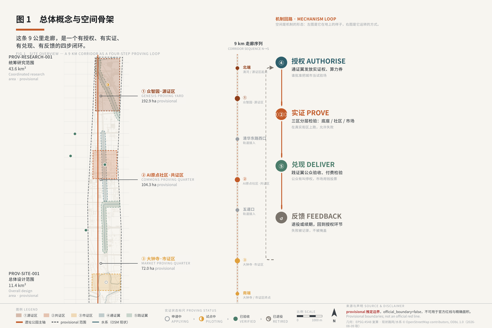
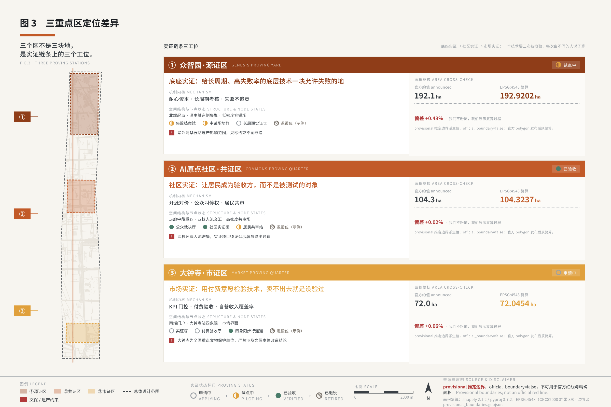
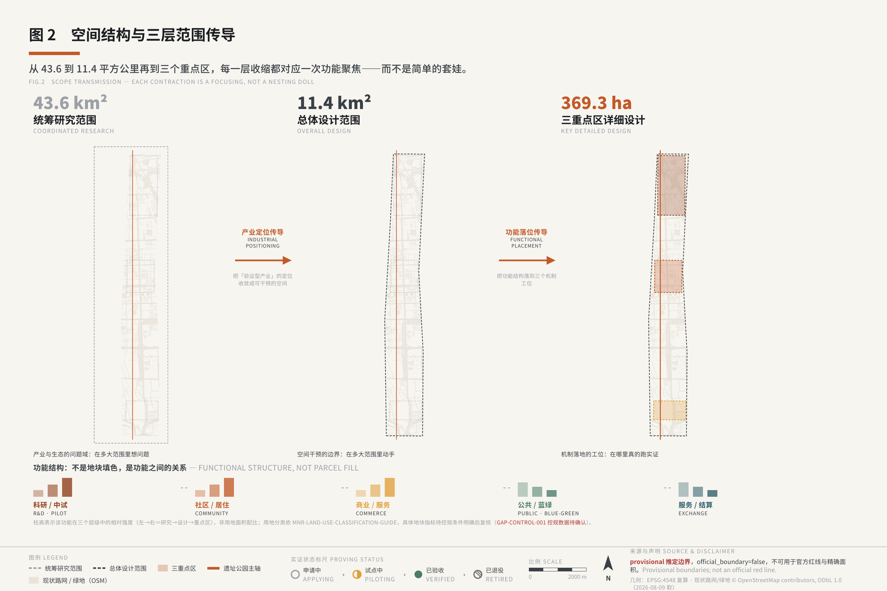
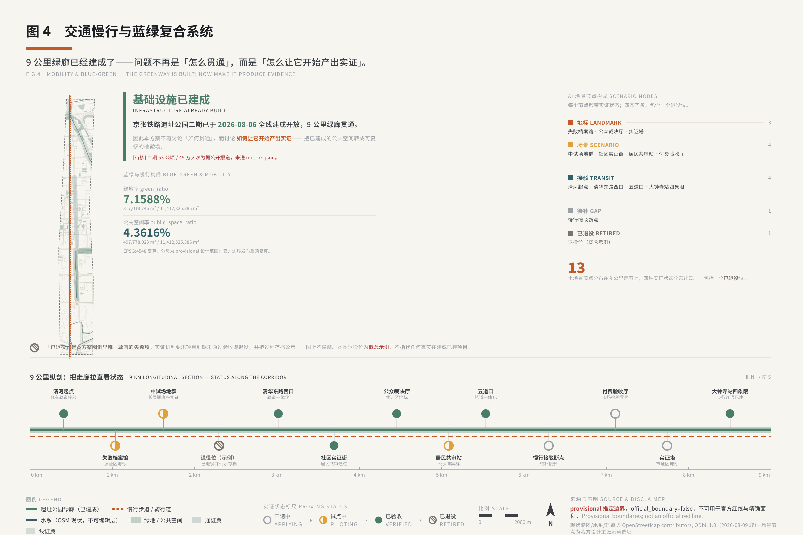
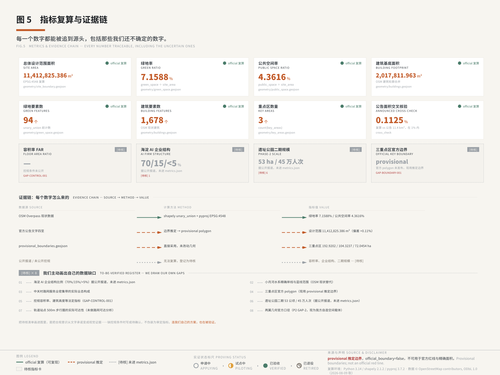

# 京张实证带 · The Jingzhang Proving Belt

> **一句话概念**：一条把城市本身变成 AI 可申请、可试错、可退出的公共实证场的创新带。
> **合规总声明**：本方案全部空间、机制、活动与叙事表述均为**概念建议**、**参考方案**，可供专业团队深化研究，不构成法定规划结论、官方审定安排、投资测算结论或政府实施承诺。全文不含容积率、建筑高度、拆改留结论、道路红线、桥隧或地下空间工程可行性结论、地块权属结论、非公开数据或个人隐私数据。凡涉及资金的表述均为「容量区间示意 + 假设前提 + 机制设想」。

---

## 设计依据与资料清单

本 formal 方案以北京市规划和自然资源委员会海淀分局发布的《百年京张AI创新带城市设计国际方案征集资格预审公告》为第一依据 [source:OFFICIAL-ANNOUNCEMENT]，并以面向智能体的开源共创任务书 [source:AGENT-TASKBOOK] 及 `brief/site-package/` 中登记的临时边界、重点区域、枚举、指标与来源清单为机器可读依据。方案生成前已读取 `design_brief.json`、`allowed_design_space.json`、`sources.json`、`enums/`、`ranges/`、`schemas/`、`data/source_registry.json` 与 `data/processed/agent_fact_pack.md`，并以 `project_scope_summary.csv`、`agent_task_requirements.csv`、`source_use_matrix.csv`、`missing_data_checklist.csv` 建立任务、范围、资料用途与缺口清单。全部设计判断均可拆解为可追溯来源、可复算指标、可校验图层与可人工复核假设 [depth:existing_conditions_diagnosis]。公告要求方案达到控制性详细规划与规划综合实施方案两个深度层级，因此正文叙述不替代 GeoJSON、指标表、A3 文册、A0 展板与 HTML 电子展示成果；完整来源与标准覆盖分别保存于 `sources.json`、`standard_matrix.json` 与 `design_depth_matrix.json`，正文不重复机器索引。

**资料登记表使用边界** [source:SOURCE-REGISTRY]：`data/source_registry.json` 登记公开、清权与临时资料的用途边界；background_only 或 provisional_only 资料不升级为官方边界、法定控规、正式评分依据或政府实施承诺。`data/processed/agent_fact_pack.md` 是阅读导航层，不是新的权威来源 [source:PROCESSED-FACT-PACK]，事实判断仍回到已登记的原始材料。

**方案的判断起点**：官方给定的三大定位、五大功能、三区两翼框架是不可改的地基（详见下节）。本方案对这一地基的核心贡献，是回答一个官方框架本身没有回答的问题——**海淀凭什么、以什么方式承接这套框架**。判断是：海淀真正稀缺、且在此组合禀赋上具有显著优势的要素不是空间，而是「实证权」——在真实城市里合法地、有边界地、可被监督地测试人工智能的权利 [source:AGENT-TASKBOOK]。全部六项智能体任务均从这一判断长出，映射关系详见各节及《六任务挂接自检》（见「参考资料」前的收尾表）。

本方案在官方 `SITE_BOUNDARY` 与三处 `KEY_AREA` 精确红线尚未公开前，使用临时推定边界生成 formal 包 [data:geometry/site_boundary.geojson#SITE-001]。`geometry/site_boundary.geojson` 与 `geometry/key_areas.geojson` 均标注 `provisional_constraint`、`official_boundary=false`，仅用于方案生成、自检、可视化与设计讨论，不作为官方红线、审批依据或法定控制结论。该组织方数据缺口本身不阻断内容评分 [standard:PROJECT-OFFICIAL-ANNOUNCEMENT]；官方边界更新后，site boundary、key areas、land use、roads、green space、public space、buildings、phasing 与 metrics 均需重算，且必须整链重跑 render→finalize→self_check→preflight，不得单文件替换。

---

## 三层范围工作框架

方案按公告确定的三层组织：**统筹研究范围**（约 43.6 km²）关注 AI 产业生态、战略定位、创新链与未来城市形态；**总体设计范围**（约 11.4 km²）关注京张遗址公园周边城市更新、产业空间布局、交通市政支撑与城市风貌控制；**重点区域范围**（约 368.4 ha，三处）要求达到功能业态、建筑规模、拆改留分类、公共空间连通与交通组织的详细设计深度 [depth:three_level_scope_framework]。三层在 `compliance_matrix.json` 中逐条映射，覆盖公告 1.3、1.4、1.5 与 agent.1-agent.6 全部必选任务。

三层不是互相割裂的图纸集合，是**机制传导**关系：统筹层定海淀在区域协同中承担什么、让渡什么；总体层定「一轴三区两翼、四步成闭环」的空间结构如何组织；重点区层定三个片区各自的机制内涵与详细设计。任何一层内容若在上一层找不到依据、或在下一层找不到落点，即视为传导断裂 [depth:overall_spatial_structure]。

**本方案的总体空间结构**为「**一轴串三区，两翼展东西，四步成闭环**」——以京张铁路遗址公园为公共空间主轴（已于 2026 年 8 月 6 日全线建成开放，全长 9 公里、约 53 公顷，据公开报道 `[待核]`，不进 metrics.json），源证区、共证区、市证区自北向南分布于轴线之上，通证翼、践证翼依托既有城市要素向东西两侧展开，四步闭环（授权→实证→兑现→反馈）串联五个空间单元。三个重点区在经度上高度重合（约 116.343–116.355），纬度自北向南分离，本带在空间上是一条南北走向、宽度约一公里量级、长度约九公里量级的线性走廊，与遗址公园的实际延展长度基本吻合 [data:geometry/site_boundary.geojson#SITE-001]。

| 层级 | 设计问题 | 方案回答 | 数据落点 |
| --- | --- | --- | --- |
| 统筹研究范围 | AI 产业生态与区域协同如何组织 | 「实证权」制度化为第八类要素；四角区域协同明确「海淀让渡什么」 | compliance_matrix.json、standard_matrix.json |
| 总体设计范围 | 一轴三区两翼的空间结构如何落图 | 主带线性走廊 + 两翼服务节点串/水系线性带 | [data:geometry/land_use.geojson#LU-00001]、[data:geometry/roads.geojson#ROAD-00001] |
| 重点区域范围 | 三处片区如何达到详细设计深度 | 源证区（底座实证）/ 共证区（社区实证）/ 市证区（市场实证） | [data:geometry/key_areas.geojson#PROV-KEY-001]、[data:geometry/key_areas.geojson#PROV-KEY-002]、[data:geometry/key_areas.geojson#PROV-KEY-003] |

---

## 统筹研究范围产业与未来城市研究

### 总体概念与命名体系（agent.1）

**核心概念**：京张实证带 / The Jingzhang Proving Belt——一条把城市本身变成 AI 可申请、可试错、可退出的公共实证场的创新带。传统创新带的逻辑是供给空间（划地、盖楼、招商、给补贴），这套逻辑在海淀边际递减：中关村软件园、西二旗、朝阳都在做同一件事。本方案判断海淀真正稀缺、且在此组合禀赋上具有显著优势的要素不是空间，而是「实证权」——在真实城市环境中合法地、有边界地、可被公众监督地测试 AI 的权利。这一判断建立在两处产业断点诊断之上：场景验证门槛高（AI 企业找不到真实城市场景完成技术验证）与耐心资本不足（基础设施型项目回报周期 7-10 年，商业资本缺乏进入动力）。与之相对，海淀持有清华、北京大学、中国科学院零距离，重点实验室 92 家，技术合同成交额 4053.1 亿元，常住人口 311.1 万的真实民生场景密度 [source:AGENT-TASKBOOK]。

「实证」区别于「实验」的精确性在于四点对照：主体关系上城市是出题方与验收方而非企业的实验室；结果处理上失败案例同样入库、同样是公共资产；终局设计上有退出机制、不达标即收回；公众位置上是知情、可查询、可申诉的相对方而非被动测试对象。概念与经济机制同构而非外挂——KPI 门控对应实证权同样门控，耐心资本对应实证场允许失败且失败案例库是公共资产，开源生态补强对应实证成果强制回流公共知识库，政府三不原则（不直接运营/不指定技术/不承诺回报）对应城市只发放实证权与设定边界。

**命名体系**遵循「不描述形态、描述行为」的统一原则，向下延展四级：母品牌**京张实证带 / The Jingzhang Proving Belt**；子片区众智园·**源证区 / Genesis Proving Yard**（底座层实证）、AI 原点社区·**共证区 / Commons Proving Quarter**（社区级实证）、大钟寺·**市证区 / Market Proving Quarter**（市场化实证）、中关村科技服务翼·**通证翼 / Exchange Wing**（要素流通与资本赋能）、小月河场景赋能翼·**践证翼 / Practice Wing**（场景落地与公众验收）；场景层「实证项目 `PG-<区码>-<序号>`」；活动层「实证周 / 开箱日 / 退役礼」。**「通证翼」的机制定义（首次出现，必读）**：本方案「通证」取「流通验证」本义——要素在此完成申请、审核、发放、结算与退出的流通过程，实证权在此获得验证与授予，**与区块链领域的 token、代币、通证经济无关**，本方案不涉及任何数字资产、代币发行或链上确权设计，英文名刻意避开 `Token` 一词。

**视觉识别与 Logo 方向**（分层声明）：本节仅提供一带整体品牌标识的构造逻辑，不出成品标识。与文化叙事章的导视标识系统严格分层——Logo 系统管「这条带作为整体品牌如何被识别」，导视系统管「人在带里如何找到路、如何知道脚下正在发生什么」。三条设计语言原则：标识表达状态不表达形态（母题取实证过程状态而非空间形态）；可变系统优于固定图形（恒定骨架 + 场景变量，覆盖母品牌到项目层）；黑白优先、尺度极端可用。建议构造母题为**铁路信号系统三态**（通过/注意/停止），对应实证项目生命周期状态——理由是它与本方案「实证权」的核心机制高度同构（可授予、可保留、可收回的运行许可），且区别于铁轨/道钉这类已被同类方案占位的形态元素。

### 三大定位、五大功能与三区两翼协同回路

本方案完整继承官方框架不作替换：**三大定位**（百年京张文化带/都市 AI 生活体验带/AI 融合创新带）、**五大功能**（AI 全栈自主创新体系/世界级 AI 创新生态/AI+场景赋能新范式/智能化 AI 活力城市/AI 治理全球话语权）、**三区两翼**（众智园 AI 自主创新加速区/北京 AI 原点社区/大钟寺 AI 产业集聚区 + 中关村科技服务翼/小月河场景赋能翼）。三大定位不是并列标签而是同一件事的三个面：文化带回答「凭什么是这里」（历史合法性），体验带回答「谁来验收」（验收端，公众是相对方），创新带回答「验证什么」（发生端）。

本方案对空间骨架的核心论点是：**主带承载「实证什么」，两翼承载「凭什么能实证」**。三区是实证的发生地，两翼是实证的授权与兑现机制的空间载体——没有两翼，实证权只是一纸文件；有了两翼，实证权才有申请窗口、结算通道与落地场所。这把两翼从「布局要素」提升为「机制器官」：

| 空间单元 | 命名 | 机制角色 | 一句话定位 |
|---|---|---|---|
| 众智园 AI 自主创新加速区 | 源证区 | 底座层实证发生层 | 在这里测底座，允许失败 |
| 北京 AI 原点社区 | 共证区 | 社区级实证发生层 | 在这里测民生，居民共审 |
| 大钟寺 AI 产业集聚区 | 市证区 | 市场化实证发生层 | 在这里接受付费意愿的检验 |
| 中关村科技服务翼 | 通证翼 | 实证授权与结算层 | 在这里拿到实证权、算力券、资本与 IP 服务 |
| 小月河场景赋能翼 | 践证翼 | 实证兑现与公众验收层 | 在这里让公众用到、看到、评价、叫停 |

**协同回路**（agent.1 必交项）是有反馈控制的四步闭环，而非单向流程图：第一步·授权（通证翼受理审核，发放实证权并配套算力券/数据沙箱/场景 API）→第二步·实证（三区分层测试，源证区允许失败、共证区居民共审、市证区付费验收）→第三步·兑现（践证翼面向公众交付，公众实际使用并评价）→第四步·反馈（公众评价与申诉回到通证翼，直接作用于实证权续期或收回）。唯有第四步具备逆向作用力——一个只有前三步的系统是发放系统，加上第四步才是治理系统。通证翼在西（依托中关村大街—学院路既有服务业密集带）、践证翼在东（依托小月河水系公共开放空间）一西一东把南北向线性主带横向撑开，回应「东西缝合」概念策略要求 [data:geometry/roads.geojson#ROAD-00001]。

### 区域创新协同关系（`regional_synergy`，agent.2）

协同的核心不是列举合作意向，而是明确海淀在区域分工中**承担什么、让渡什么**。判据：**一项协同若不能说出「海淀让渡了什么」，它就不是协同，是扩张。**

**区内协同（先答南北）**：中关村 AI 北纬社区 2025 年 7 月 10 日正式开放于海淀西北旺东路，据公开报道为海淀 AI「一南一北」生态版图之北翼，配套 10000P+ 智算平台与最高三年租金减免，承担的是企业孵化与成本降低职能；京张实证带承接北纬社区孵化成果，为其中已具备一定成熟度、需要真实城市环境验证的项目提供实证场景与信任验证通路。两者构成孵化-实证的上下游关系而非并列关系：北纬社区孵化毕业生南下申请实证权，是这条链路的主要衔接方式；实证带的场景需求清单反向作为北纬社区招引靶单，是次要的反馈通道；算力资源探索衔接而不重复建设普惠算力（该职能已由北翼承担，`[待核]` 具体衔接方式须经主管部门与运营主体协商）。

**跨区协同（四角关系）**：与未来科学城——海淀承担 AI 基础模型与开源工具链，**让渡**能源与生命科学垂直应用；与怀柔科学城——海淀承担 AI 辅助科研工具，**让渡**大科学装置建设；与北京经开区——海淀承担具身智能算法与仿真平台，**让渡**机器人整机制造（「研发在海淀、制造在经开」联合体模式）；与京津冀更大范围——海淀输出城市 AI 治理模型，雄安提供增量建设场景与海淀存量更新场景形成对照实证，天津在港口物流 AI 方向双向互补。上述协同均为概念建议，须经相关主管部门确定，不表述为已确定的政府间安排。

### 全栈自主创新体系与全球 AI 创新生态（agent.2）

**六个全球案例**（覆盖白地新城型、存量更新/铁路遗址型、跨境协同型、纯民营孵化型四种治理类型，选择标准为机制可迁移性而非知名度）：

| 案例 | 回答海淀哪个机制问题 | 可移植的一条 | 海淀为什么不同 |
|---|---|---|---|
| 新加坡 one-north | 政府该不该既当裁判又当运动员 | 规划权/土地权/招商权三权分立 | 海淀存量地权分散，不存在净地条件 |
| 美国 Kendall Square | 大学的知识资产怎么进入城市空间 | 大学以产权主体身份自主申请分区变更 | 2025Q2 空置率 26.2%，是「造楼等企业来」的直接反证 |
| 伦敦 King's Cross | 算力基建该在招商之前还是之后 | 高容量光纤与专用变电站前置于产业招商 | 磁极依赖单一巨头总部投资的偶然性；海淀靠四校科研密度做持续磁极，不赌总部 |
| 深圳河套 | 要素流动的制度阻滞怎么破 | 白名单去行政化立项方法论 | 制度势差来自「一国两制」，海淀不具备该变量，只能移植方法论 |
| 巴黎 Station F | 招商能不能外包 | 「公司孵化公司」项目制招商外包 + 曝光度替代补贴 | 纯淘汰赛漏斗，不承担基础研究职能，与海淀研究驱动型定位错位 |
| 日本柏の葉 | 政府不主导时谁来统筹 | 公民学三方协同治理组织（政府是协同方之一） | 纯农地新城，不存在存量产权与既有社区利益平衡 |

（案例硬数据来源为公开报道/官方口径，部分为第三方汇编估算，已在正文标注限定语，禁止进 metrics.json，见「风险、版权与合规说明」节。）

**逐案机制解剖**（选择标准是机制可迁移性，不是知名度；每案必须回答一个海淀正面临的具体机制问题）：

**① 新加坡 one-north｜三权分立与「白地」弹性分区**——法定机构 JTC 作为唯一地主兼开发商，采取「业务园区白地」规划工具赋予用途自由裁量权，规避单一用途分区在产业变化快于规划周期时的僵化；规划权归城市重建局（URA）、土地开发执行归 JTC、产业招商归经济发展局（EDB），三权分立但协同——政府深度介入却通过内部分权避免了单一机构既当裁判又当运动员。规模上覆盖 200 公顷，据公开报道汇聚超 1300 家初创企业与约 5 万名知识型工作者（地产中介博客转述，非官方统计，不进 metrics.json）。海淀为什么不同：one-north 是从零平地起的新城，海淀是存量更新，地权重组成本级差巨大；可移植的只有三权分立的分权制衡思路，与「用产权/租赁权而非现金补贴降低门槛」的定价手法。

**② 美国 Kendall Square｜大学参与创新区治理的功能界面与空置率反证**——历史起点是政府强制力（1949 年住房法赋予「衰败地区」认定权与征收权），但真正值得看的是第二条轨道：MIT 在肯德尔广场的自有地产上，独立于征收地块之外直接向剑桥市规划委员会提交重新分区申请，配套从共享湿实验室到深科技加速器的三级孵化链路。**Kendall Square 给本方案的启示不是产权模式——美国的私有产权与分区自治制度在中国无对应环境，不构成可移植路径——而是功能关系**：大学的知识资产需要一个紧邻校园、非校园管理体制的转化界面，共证区回应的正是这个功能需求，不主张也不涉及任何高校土地权属或用途的调整。**必须写进方案的反证**：2025 年第二季度该区写字楼空置率达 26.2%，为历史平均两倍以上，说明即便是全球最具创新力的一平方英里，商业地产周期性过剩同样会冲击创新区物理空间市场——这是对「AI 热潮=地产永远稀缺」叙事的直接反证，本方案据此拒绝「先造楼、再招商、楼满即成功」的逻辑。

**③ 伦敦 King's Cross｜铁路遗址更新与算力前置**——六案例中与京张空间基因最接近的一个，建立在国王十字车站周边的铁路货运遗址之上。机制上有两条硬经验：其一是**基础研究锚点先行**（弗朗西斯·克里克研究所率先落地，随后私营地产商合作扩张实验室供给，先有研究锚点后有资本跟随）；其二是**算力基建前置**（大规模地下光纤与专用变电站投资，使其成为伦敦少数能支撑大模型训练级负载的区域）。结果侧入驻机构超 100 家，区域经济规模约 350 亿英镑，Google 建设可容纳 7000 名员工的总部与 DeepMind 形成聚集磁极。海淀为什么不同：King's Cross 的磁极是赌来的，依赖 Google 总部投资的偶然性；海淀不需要赌，四校基础研究密度与中关村四十年产业转化经验本身就是持续磁极，算力投入应「跟着实证项目走」而非「跟着招商预期走」。

**④ 深圳河套｜制度创新的方法论**——福田保税区建立产业/机构/个人三类白名单，「一线」「二线」分线管理，白名单科研人员可通过「一号通道」便捷穿梭深港；「科汇通」试点破解外汇跨境难题；2022 年启动「揭榜挂帅」选题征集制。合作区约 3.89 平方公里，聚集世界 500 强研发中心 8-10 家、科技企业超 400 家。海淀为什么不同：河套核心红利建立在「一国两制」下深港两个独立关境的制度势差之上，海淀完全不具备该变量，能拿走的只有方法论——当物理边界无法产生势差时，能不能用规则边界造出势差？本方案的答案是实证权本身，它在功能上扮演了河套「白名单」的角色，只是划分依据从「跨境身份」换成了「实证资格」。

**⑤ 巴黎 Station F｜招商外包与曝光度替代补贴**——由个人出资改造废弃铁路货运仓库，政府零主导。两个机制发明值得直接学：其一是「公司孵化公司」项目制入驻（把招商权外包给企业与机构，管理方只提供物理空间与撮合规则）；其二是「Future 40」曝光度机制替代现金补贴（每年评选约 4% 最佳表现者给予高曝光度）。规模约 5 万平方米，据第三方汇编估算累计融资达数十亿欧元级、五年生存率约 92.4%（非官方审计，估算口径随时间变化，不引用精确数字，不进 metrics.json）。海淀为什么不同：Station F 是纯淘汰赛漏斗，不承担基础研究职能，与海淀研究驱动型定位错位；但「曝光度替代补贴」在海淀有更强版本——本方案的荣誉不是「评上四十强」，而是「你的实证项目通过了公众验收」，这是钱买不到也无法内定的信用。

**⑥ 日本柏の葉｜公民学三方协同与长周期治理**——由「柏の葉都市设计中心」（UDCK）统筹，构成方为【学】东京大学等、【公】千叶县柏市、【民】商工会议所与不动产公司，三井不动产以共同运营者而非唯一开发商身份参与，政府是协同方之一而非主导方。项目自 2005 年启动、规划期至 2030 年，获日本首个 LEED-ND 白金认证。海淀为什么不同：柏の葉是纯白地新城，不存在存量产权与既有社区利益平衡的复杂性；但其组织形式对海淀有直接价值——共证区是全带唯一「居民与开发者同场」的实证单元，需要公民学式协同治理组织，只是海淀版本必须多加一方：真正的常住居民代表，因为本方案要做的是邻里验收，不是产业协同。

**六案例的合成结论**（不是照搬，每条都有明确改写理由）：治理组织上取柏の葉的公民学协同但加入居民代表；分权设计上取 one-north 的三权分立，落到本方案是「发证权、实证权、验收权三分」；空间起点上取 King's Cross 的铁路遗址更新与基建前置，但把算力投入从「赌总部」改为「跟项目」；大学参与上取 Kendall Square 的独立轨道，并把其空置率反证写成弹性预案；制度杠杆上取河套的白名单方法论，把「跨境势差」换成「实证资格势差」；激励设计上取 Station F 的曝光度替代补贴，把「四十强」换成「通过公众验收」。

**AI 创新生态图谱**按实证链条五段结构组织（区别于按主体连线的传统画法）：发起（谁提出要测什么）→授权（通证翼受理、伦理与隐私预审、发放实证权）→实证（三区分层测试，源证区→共证区→市证区）→兑现（践证翼面向公众）→结算（回到通证翼，续期/扩大/缩减/收回/转常态运营，结果计入实证履约记录）。

**八类要素机制**（土地/空间/产业/资金/人才/算力/数据/场景，任务书明令逐类作答）：前七类要素配置的共同点是存量资源分配问题——城市有多少、怎么分给谁；**第八类要素「场景」是本方案主张海淀独有的一类**——它不是存量资源分配，而是城市主动创设的一种权利，须额外回答准入、期限、退出三个问题。以下逐类给出「怎么供给、怎么定价、政府角色边界在哪」，全部资金相关表述均为容量区间示意与机制设想，不构成投资测算结论或财政承诺：

| 要素 | 供给机制 | 定价机制 | 政府角色边界 |
|---|---|---|---|
| **土地** | 存量更新为主，不以新增建设用地为主要供给方式；三重点区合计约 368.4 公顷（provisional），本方案对土地总量依赖度低于传统园区模式 | 对实证承载功能（开放实验室/失败案例馆/公共体验路径）与常规产业功能采取差别化用地条件，前者因承担公共职能享有更宽松条件；具体用地条件、出让方式与地价安排属法定审批事项，本章不给结论性建议 | 不直接下场做土地一级开发；用地分类调整须符合国土空间规划与用地分类标准，经法定程序 |
| **空间** | 三级供给结构：孵化空间（原点孵化器，科研用地类，约 12 公顷量级，机制设想）；共享设施（开发者散步道/开放实验室/共享算力节点，免费或低成本开放）；市场化产业空间按市场机制配置 | 阶段性租金支持（初创企业前三年一定比例补贴）；人才公寓比例不低于两成、租金控制在市场价一定折扣内（机制设想，具体标准须经法定程序）；借鉴 one-north 用产权/租赁权让渡替代现金补贴——现金补贴一停即散，低成本空间的粘性来自迁移成本本身 | 提供空间载体与支持政策，运营交由专业团队（国资平台承担运营主体职能须经法定程序设立）；**弹性预案**（Kendall Square 空置率 26.2% 反证的直接应用）：空间供给跟随实证项目实际入驻节奏分批释放，入驻率不达预期时二期规模相应缩减 |
| **产业** | 不拼企业数量，拼不可替代性；三类主体建议性结构（非配额）：AI 基础设施类约三成、城市 AI 应用类约五成、开源生态类约两成——基础设施类占比是对海淀当前该层约一成半（据公开产业观察）的结构性纠偏 | 三类企业各自不可替代的吸引力：基础设施类拿四校科研零距离+算力优先调度权+开源社区常设活动主场；应用类拿真实民生场景实证场（311.1 万常住人口城市界面）+政府购买服务首单机会；开源生态类拿荣誉展示体系永久位+共票制试点资格 | 发布需求清单与开放规则，不指定技术路线或供应商，避免为特定技术路线背书 |
| **资金** | 五路资金各有触发条件与假设前提：①财政引导金（基础设施+公共服务+文保专项，分期与 KPI 挂钩）②更新片区综合收益统筹使用建议（更新后土地增值收益纳入片区综合平衡统筹使用，具体路径属法定审批事项，本章不给结论性建议）③社会资本/特许经营（PPP 新机制下以使用者付费为主的特许经营模式为主，运营绩效作为回报调节因素）④国资平台注资（须经法定程序设立）⑤耐心资本/产业基金（专注底座与开源，投资期 7-10 年，探索建立与国有资产保值增值考核相衔接的尽职免责机制） | **KPI 门控**——不按时间表放行，按成果达标才开资金闸门。一期（建议 3 年）产业/民生/财务三类条件全部达标才放行二期资金，任一类低于目标八成触发退出审查；二期（建议 4 年）自营收入覆盖率达标才进入三期；三期（建议 7 年）财政年度支持占比控制在上限内 | 不承诺回报，产业基金与特许经营项目风险自担；耐心资本是唯一例外——探索对基础设施类项目建立尽职免责机制，具体认定标准与适用边界须经法定程序另行制定，避免被理解为普遍兜底 |
| **人才** | 三条通道：存量激活（降低四校在地人才参与实证的制度成本，为高校提供一个紧邻校园、非校园管理体制的实证转化界面，不主张也不涉及任何高校土地权属或用途调整）；开发者通道（开源社区/常设活动/贡献展示体系吸引周期性在场，不只追求落户）；居住保障通道（人才公寓与租金支持） | 不以现金补贴为主要工具（Station F 经验：曝光度与信用比现金更难复制）；核心回报是「参与了什么实证项目、是否通过公众验收、记录是否公开可查」，与荣誉展示体系、转化漏斗直接咬合 | 保障公共服务与居住支持，不介入具体人才评价与筛选——实证履约记录由实证结果自然产生 |
| **算力** | 三层结构：公共算力池（保障性算力）；算力券（抵扣商业算力费用，年度总量设上限）；市场化算力（按市场价获取）；公共算力池规模需以市政容量核验为前提（`GAP-MUNICIPAL-001` 待确认，本章不给出具体规模数字） | 分级调度+券制补贴：公益科研优先，商业训练按市场价；算力券可核销、可追溯 | **与 King's Cross「算力前置于招商」的分野**：本方案算力投入「跟项目走」而非「跟预期走」，按实证项目实际需求分批扩容并绑定 KPI 门控，理由是海淀磁极（四校科研密度+中关村四十年转化经验）已经存在，不需赌总部落地；政府只提供算力券补贴，不直接运营算力中心 |
| **数据** | 三条路径闭环：公共数据空间（脱敏数据集开放）；数据沙箱（数据不出域，模型可带走原始数据不可带走）；数据回流机制（推理结果匿名后回流，形成「出去→回来→变厚→下一批受益更多」闭环） | 不以货币定价，以对价定价——企业获取公共数据的对价是回流义务与合规承诺，而非付费；对价机制比价格机制更能保证公共性 | 负责脱敏标准制定与伦理委员会审查，不参与商业数据交易——避免政府同时是规则制定者与市场参与者 |
| **场景（第八类，本方案头牌）** | 实证权由六项要件构成（缺一不成立）：限定范围（空间边界/服务对象/数据采集范围）、限定期限（按项目类型分档，统一口径见下方「实证期限分档表」）、公开可查（实证公示牌八字段）、人工复核点、对价义务（数据回流/工具链开源/伦理审查）、可收回 | 不以货币定价，按项目类型组合三项对价：底座层（源证区）必须开源+评测数据回流+标准审查；民生应用（共证区）建议开源+匿名化推理结果回流+强化审查与邻里验收；商业应用（市证区）建议开源+匿名化聚合统计回流+标准审查——占用的公共性越强，对价越重 | 只做三件事：开放场景接口、设定伦理边界、执行收回程序；不做三件事：不指定技术路线或供应商、不为实证结果背书、不承诺商业回报 |

**实证期限分档表**（全文期限口径统一以此表为准，按项目类型与所在空间单元双轴对应）：

| 项目类型 | 所在空间单元 | 建议期限 | 理由 |
|---|---|---|---|
| 底座工具链类 | 源证区（众智园） | 12-24 个月，初始授权不短于 12 个月 | 承接耐心资本长周期属性；底座层项目失败信号本身需要时间才能与噪声区分，中期评估不通过先缩减范围观察一个周期而非立即收回 |
| 社区民生类 | 共证区（AI 原点社区） | 6-12 个月 | 涉及居民日常生活，周期不宜过长，与邻里验收节奏匹配 |
| 市场消费类 | 市证区（大钟寺） | 12 个月 | 与付费意愿验收的市场周期匹配 |

到期须重新申请；无期限的试点会长期占用公共资源且无退出压力。

**实证权的法律性质（必读，全文所有「实证权」表述均以此定性为准）**：实证权不是新设行政许可。其法律性质为城市公共空间与公共数据资源的**有条件、有期限使用授权**，通过实证主体与运营机构签订的《城市实证合作协议》确立，属**民事合同关系**；涉及现行法定审批事项（占道、临时建设、数据出域、特种设备等）的，实证主体仍须依现行规定另行取得相应许可，实证权不替代、不豁免任何法定审批。所谓「收回」，是合同约定条件成就时的**协议终止**，不是行政处罚；下述 A/B/C 三段式是协议终止的约定程序，不是行政处罚程序。之所以专门作此定性：区级政府对行政许可无设定权（《行政许可法》第十五条，设区的市及以下政府无此权限），若实证权被理解为行政许可创设，机制的法律地基即不成立；定性为民事合同授权后，机制转为「城市把已有资源以合同方式有条件交出」，与本方案「政府三不原则」（不直接运营/不指定技术/不承诺回报）完全自洽，且不改变任何一项已设计的准入、期限、退出安排。

**收回机制的可操作条款**（第六项要件展开，多数方案写「建立退出机制」后不写怎么退，本方案给出触发条件、程序与后果三段式）：**A. 触发终止审查的情形**（任一即触发）——实证项目超出申请书声明的空间边界/对象范围/数据采集范围；发生未声明的数据用途或流向未声明的第三方；应设人工复核点的环节出现全自动决策；公开公示信息与实际运行状态不符；公众申诉在设定时限内未获实质回应且经复核申诉成立；中期评估未达申请书声明的验证目标（源证区探索性项目适用失败豁免条款）；对价义务未按期履行。**B. 终止程序**（三步，不可跳步，为协议约定的终止程序，非行政处罚程序）——通知与陈述（实证主体可在设定期限内提交书面陈述与整改方案）→独立复核（由伦理委员会与公众代表共同构成）→裁定与公示（续期/缩减范围/暂停/终止，结果与理由一并公开）。**C. 终止后果**（分级）——缩减范围（问题局部可控）；暂停（问题可整改）；终止（结束实证权协议，第 1-3 项严重情形或整改失败适用）；履约记录（无论何种后果均计入实证履约记录，探索性失败豁免条款除外，记录性质与使用边界见「AI 创新生态、人才画像与 AI+ 场景」节隐私边界部分说明）。

三个空间单元的生态设计：**众智园/源证区**为 AI 底座层提供长周期、高容错、可失败的实证场，配三条可操作条款——失败豁免条款（探索性项目未达标不作负面记录，前提是过程数据已回流公共知识库）、长周期锁定条款（初始有效期 12-24 个月，见上方「实证期限分档表」，中期评估不通过先缩减范围观察一个周期而非立即收回）、开源对价条款（申请时须声明工具链开源计划的时点/许可证/维护承诺）；**AI 原点社区/共证区**是全带唯一居民与开发者同场的单元，须同时通过技术验收与邻里验收，给出「共建层/共处层/旁观层」三层分层同意机制——共建层（主动报名，可授权采集约定范围数据，随时撤回撤回后 30 日内删除）、共处层（生活场景与实证空间重叠，仅限不可识别聚合统计，可申请空间退出实证范围）、旁观层（短暂出现，不采集，实证装置须有明确物理边界标识）；**大钟寺/市证区**是实证成果面向市场的最后一关，检验付费意愿而非补贴，机制内核为 KPI 门控中「自营收入覆盖率」的检验场——从政府补贴走向市场自立的转换器。

---

## 总体设计范围城市更新与控规深度城市设计

总体设计范围要求达到控制性详细规划的城市设计深度，须提出城市更新总体空间结构、更新项目清单、实施政策建议与综合承载能力评估 [standard:MOHURD-CONTROL-DETAILED-PLANNING]。`geometry/land_use.geojson` 完整覆盖设计边界且无重叠，`geometry/buildings.geojson` 表达建筑基底，`geometry/roads.geojson` 表达微循环、慢行与轨道接驳关系，`metrics.json` 复算核心面积、比例与图层数量 [depth:land_use_layout] [depth:development_intensity_controls]。

**两翼从零几何到机制载体（本方案的主攻方向）**：官方框架给出两翼名称与职能，但未给出几何范围——全场竞品普遍零几何覆盖，因为落图需要自己找空间载体。本方案的处理是：两翼不虚构为封闭地块边界，而表述为沿既有城市要素分布的节点体系。**通证翼**建议沿中关村大街—学院路方向，以 OSM 现状路网为基底，呈**带状服务节点串**（非封闭多边形——真实的服务翼是分布式的），每个节点配实证权受理点、算力券兑付点、IP 与资本服务点；**践证翼**依托小月河水系实际走向（Overpass 拉取 OSM `waterway`），呈**沿水系的线性带 + 节点**，与通证翼东西对位。两翼均走 `AI_SERVICE_ZONE`（`editable_by_agent: true`），严禁写入 `KEY_AREA` 层，`WATER_SYSTEM` 为不可编辑层，只可引用现状水系不可新造蓝线 [data:geometry/public_space.geojson#PUBLIC-0001]。

**建筑规模、用地强度与拆改留**方面，因控规条件（容积率/高度/密度/绿地率/退线）数据缺口（`GAP-CONTROL-001`），本方案不作任何强度类结论，相关指标在 `metrics.json` 中标注为 unknown 或 pending_control [depth:height_massing_character] [depth:retain_renovate_demolish]。

**交通、轨道、市政**方面，重点覆盖公告点名的三处站点一体化界面——**五道口站、清华东路西口站**（共证区）与**大钟寺站**（市证区，含路口四象限步行连通设计）[depth:traffic_rail_slow_parking]。市政与公共服务设施应覆盖 AI 产业服务设施、创新服务平台、分布式能源与端侧算力融合；缺少管线、能源、防洪、消防等工程资料时，列为正式深化前置条件，不作审定条件表述 [depth:municipal_new_infrastructure]。

**国土空间规划创新思路**（agent.1 第五项必答，四点建议，均为规划研究性建议不构成对现行制度的修改主张）：其一，在不改变用地性质的前提下，探索临时设施期限化管理路径——即在现行临时建设/临时用地管理框架内，为实证项目配套有明确期限、有退出安排的临时设施审批便利，不涉及用地性质或规划条件的调整；其二，把失败案例纳入规划评估的正式内容，将退役项目与失败案例作为正式评估内容记录在案；其三，把公众反馈接入实施评估的正式回路；其四，以「机制图层」补充传统用地图层表达，研究增加表达实证权授权关系、要素流通路径、公众反馈汇集路径的图层。

**实施前提与产权协调路径**：本方案三重点区为存量更新区域，涉及至少四类产权/使用权主体（高校科研用地、部属/军产用地、既有社区居民共有部分、市政与集体用地），不装懂——产权协调复杂度、军产等特殊管理用地的边界、居民共有部分的业主决策程序（涉及《民法典》第二百七十八条业主共同决定事项的，须履行相应表决程序），列为正式深化阶段的首要前置条件，登记为 `GAP-TENURE-001`：具体协调路径、各主体权责边界与协商机制须在深化阶段与自然资源、住建、属地街道等主管部门另行制定，本方案不作结论性判断，也不提供可直接套用的产权处置方案。分类协商框架的方向性建议：科研用地（与四校存量激活通道对接，见「人才」要素机制）、部属/特殊管理用地（严格遵循原有权属与使用限制，实证权授权范围不涉及此类用地）、居民共有部分（纳入公民学三方协同治理组织的社区方议程，履行法定表决程序后方可纳入共证区空间安排）、市政/集体用地（按现行征转用与集体建设用地入市相关规定另行办理）。

**空间产业融合思路**：将「场景」制度化为第八类可配置要素，产业与空间的关系由此从「企业租用空间」转变为「企业申请使用城市」——这也解释了为什么两翼必须是机制器官而非布局陪衬：通证翼是这一要素的配置窗口，践证翼是这一要素的验收端。

---

## 重点区域详细设计

三处重点区域详细设计为必选项，须引用 [data:geometry/key_areas.geojson#PROV-KEY-001]、[data:geometry/key_areas.geojson#PROV-KEY-002]、[data:geometry/key_areas.geojson#PROV-KEY-003]，由 [depth:three_key_area_detailed_design] 检查是否达到规划综合实施方案深度。三个重点区在经度上高度重合、纬度自北向南分离，规模、区位与机制角色三者自洽：北段众智园规模最大（约 192.9 ha，最远离城市核心区）适合长周期高容错底座实证；中段 AI 原点社区居中（约 104.3 ha，四校环绕，人口与知识密度最高）适合居民参与的社区级实证；南段大钟寺规模最小（约 72.0 ha，最靠近城市核心区，商业属性最强）适合市场化实证。**口径说明**：三处分列面积之和为约 369.2 公顷，与前文「重点区域范围（约 368.4 ha）」的公告口径存在约 0.2% 偏差——368.4 ha 为公告口径，369.2 ha 为本方案基于 EPSG:4548 自绘边界的复算合计，偏差在测绘精度容许范围内，正文以公告口径为准，自绘口径仅供交叉核验。

| 重点片区 | 设计定位 | 空间动作 | AI 产业与运营场景 | 证据引用 |
| --- | --- | --- | --- | --- |
| 众智园 AI 自主创新加速区（源证区） | 花园型全栈自主创新街区，全带唯一允许「测失败」且失败不追责的片区 | 强化清河界面、建筑绿地水系一体化设计与挖掘展示清河文化；布设开放实验室、算力调度中心、**失败案例馆** | 自主模型长周期实证、标准制定工作坊、安全治理展示、低碳算力体验 | [data:geometry/key_areas.geojson#PROV-KEY-001]、[depth:three_key_area_detailed_design] |
| 北京 AI 原点社区（共证区） | 近校型成果转化与人才社区，居民与开发者同场 | 组织校区、园区、街区慢行缝合；贡献墙、开发者散步道、**公众裁决厅**；清华园站遗产点位于影响范围（不可编辑层，只引用不新造） | 开源社区、成果发布、共票制试点（机制设想）、近校孵化 | [data:geometry/key_areas.geojson#PROV-KEY-002]、[source:AGENT-TASKBOOK] |
| 大钟寺 AI 产业聚集区（市证区） | 城市型智能经济与国际交往街区，市场付费意愿的最后一关 | 大钟寺站四象限步行连通智能原生化；规划绿地复合利用；**实证塔**；全国重点文物保护单位，不涉及文保本体改造 | 智能体与智能终端展示、代理商务空间、数据要素国际路演 | [data:geometry/key_areas.geojson#PROV-KEY-003]、[metric:key_area_count] |

**智能原生业态判据**：一个业态是不是智能原生，看它在 AI 不存在时是否还能成立——不能成立才是智能原生。据此提出三类：代理商务空间（Agent-Brokered Commerce，交易一方是代表用户的智能体，临街面双层化服务人眼与机器接口）；机器人—人共享街道（三层通行权设计——人行优先层/混行层/机器人通道层，铺装区分不设物理隔离，冲突时机器人退让）；开发者第三空间（依赖海淀极高的同行密度，临街面外向内看，展示正在做的东西）。

**AI 朝圣地标**（`landmark_catalog`，不少于 3 个，任务书最独特的必交项）遵循三条硬标准（不可替代性——这件事只能在这儿看到；持续更新性——内容每周甚至每天变化；可参与性——访客能留下痕迹，三条全过才算数，同时构成对「过度娱乐化网红化」红线的正向防御），选址回应官方「公园南端、北端以及上跨环路区域打造标志性城市景观节点」的要求：

**§5.1 失败档案馆 / The Hall of Honest Failure**（北段·源证区，锚 PROV-KEY-001）——**设计概念**：整个 AI 行业的公开信息严重偏斜，成功被反复宣传，失败被静静删除，结果是每一代研发者都在重复踩前一代踩过的坑。失败档案馆把这个偏斜在一座建筑里纠正过来，收藏终止的实证项目、未达标的验收报告、被公众叫停的场景、走不通的技术路线，以及每一份失败对应的原因分析与后续者提示；取得实证权的对价之一，就是项目终止时必须提交一份诚实的失败记录。**空间与形态方向**：建筑形态取「归档」而非「纪念」的空间原型——可扩展的层叠式收纳结构，每一份失败记录对应一个实体档案单元，建筑体量因此逐年增长，这是设计判断最重要的一处：它的形态不是设计定型的，是时间长出来的。材质方向采用耐候材质与可见结构逻辑，避免高反射高完成度表皮——这座建筑应该看起来诚实。**功能构成**：失败档案库（实体与数字双轨归档，公众可自由检索）；原因分析厅（每份失败记录配可读技术复盘）；后续者留言层（来访研发者可留下「我在这个坑上又走了一步」的记录）；年度退役礼场地（对接长期运营章年度活动）。**与实证机制的关系**：这是实证权闭环里「退出」这一环的物理终点——「失败案例同样入库、同样是公共资产」这句判断的「库」就是这座建筑。

**§5.2 公众裁决厅 / The Public Verdict Hall**（中段·共证区，锚 PROV-KEY-002）——**设计概念**：全球 AI 治理讨论中「公众参与」几乎总停留在意见征集层面，公众可以表达，但表达之后发生什么没有人负责。公众裁决厅把这件事做实：**它是公开听证与意见汇集的场所，听证结论是实证评议会作出续期/收回决定的法定必经前置**，不是意见箱，也不由公众在此直接作出最终决定——最终决定权始终在评议会，公众意见通过强制回应义务与明示权重进入决定过程。**空间与形态方向**：核心空间原型取议事厅而非展厅——环形或马蹄形座席，中心是被审议的项目，四周是听证参与者；三个关键设计判断——两侧席位等高（申请方与公众不分主次、不设讲台高度差）、对全带可见（厅体沿公园一侧大面积通透界面，路过者无需进入即可旁听）、有一个物理的状态变更动作（厅体外墙设状态显示界面，项目状态经评议会决定后即时变更并对全街可见）。材质方向以在地材料+高透界面为主，避免机构感——如果它看起来像法院或政府大厅，它就失败了。**功能构成**：听证厅（居民代表+开发者+独立观察者三方在场，形成听证意见供评议会参考）；议题预告与背景阅读室；反馈与申诉终端；旁听外廊。**与实证机制的关系**：这是协同回路第三步到第四步之间那个动作发生的物理场所——没有它，回路是一张流程图；有了它，回路有了执行机构。本机制不替代信访、行政复议、行政诉讼等法定救济渠道，公众依法享有的各项权利不因参与本机制而受任何限制。

**§5.3 实证塔 / The Proving Tower**（南段·市证区，锚 PROV-KEY-003）——**设计概念**：前两个地标各自承担一个环节，第三个承担总览——整条带上现在有多少实证项目在跑、处于哪个阶段、多少通过验收、多少被叫停、多少已退役。它的立意不是炫技媒体立面，而是「一座城市敢不敢把自己的真实运行状态挂在最显眼的地方，包括不好看的那部分」——设计意图上同时显示失败率、叫停次数与退役项目数，这些数字与失败档案馆、公众裁决厅同源；具体统计口径、更新频率与数据发生争议时的复核处理程序，须在深化阶段与运营机构一并制定并公开，以避免数字本身成为新的争议焦点。**空间与形态方向**：取垂直信息载体而非观景塔，高度服务于可读距离而非登高观景；信息表达采用低功耗、非炫目、可昼读的技术方向（机械翻牌、电子墨水阵列等原理），明确避免高亮度 LED 媒体立面——媒体立面的视觉逻辑是「让人惊叹」，实证塔的逻辑是「让人读懂」。塔身信息分层：顶层（全带实证项目总数与状态分布，实时）、中层（分区实证密度，每日）、基座层（本周新增/退役/被叫停，每周）、地面可触层（可查询的完整实证目录，实时）。**功能构成**：城市尺度状态显示（塔身）；地面查询与接待层；年度实证周主场地；面向轨道站的开放基座（与大钟寺站四象限步行连通体系衔接）。**与实证机制的关系**：实证塔是 KPI 门控的公开化——塔上的数字就是那个闸门的公开读数，当一个项目状态从「试点中」变成「已退役」，塔上数字当天就变，这让门控机制无法私下松动。

三个地标不是三件散落的作品，机制上构成一条完整的链：实证塔（南·市证区，总览现在有什么在跑）→公众裁决厅（中·共证区，听证谁应当继续跑，结论提请评议会决定）→失败档案馆（北·源证区，归档跑不下去的留下什么）。南端进入、中部审议、北端归档——一个实证项目在空间上的生命周期，正好是从南往北走完这条 9 公里；三者共享同一套数据（实证塔的数字来自公众裁决厅的听证意见与评议会决定结果、失败档案馆的归档记录），三个建筑在数据上是一个系统。

**荣誉展示体系**（`honor_display_system`）遵循「上墙资格来自通过验收的实证，不来自评审偏好」的判据，分四层：**L1 参与层**（实证登记录，提交实证申请并获批实证权即上墙，分布式载体——各实证公示牌上的「谁在测」字段，实证期结束自动转历史）；**L2 完成层**（验收荣誉墙，实证项目通过验收，集中载体——公众裁决厅外廊+实证塔基座，永久保留但标注后续状态）；**L3 贡献层**（开源回流碑，实证成果按对价条款回流公共知识库，集中载体——共证区公共空间与开发者散步道一体，永久保留）；**L4 诚实层**（诚实归档者，项目失败但提交高质量失败记录同样可上墙，载体是失败档案馆后续者留言层，永久保留——这是全体系最反直觉也最重要的一层：如果荣誉体系只奖励成功，所有人都会有动机把失败藏起来，失败档案馆就会是空的，整套「允许失败」机制就会崩塌）。三条运行规则：状态可变更、记录不删除（成果被推翻不删除记录，追加状态标注，荣誉墙记录的是当时的判断不是永恒的真理）；个人与机构并列，智能体贡献单列（如实标注自主生成/人机协作/人类主导）；物理与数字双载（物理载体承担里程碑级记录，数字载体承担全量记录，选材倾向可增补而非可覆盖）。退役档案与实证铭牌同墙、同等规格——一个项目完成验收获得铭牌，另一个项目被收回获得退役档案，两者在物理展示上具有同等地位，这不是修辞，是机制：如果失败记录被放在角落，没有人会愿意留下失败记录。

**公共空间组件库**（`component_library`，12 件，全部模块化/可拆卸/基础不破坏原地面结构/撤除后可恢复原状/不涉及权属空间改造/不涉及桥隧与地下工程/材质耐候低维护/无障碍可达）：

| 编号 | 组件 | 一行规格 |
|---|---|---|
| C-01 | 实证公示牌（标准型） | 立柱式，牌面约 0.6×0.9 m，视高 1.2–1.6 m，固定八字段版式，含无障碍语音播报与二维码深链，昼夜可读非发光材质优先，单点可独立撤除 |
| C-02 | 实证公示牌（集群型） | 多牌并置于同一基座，适用于共证区等高密度实证段，牌位可增减，基座预留扩展位 |
| C-03 | 反馈与申诉终端 | 落地式，含实体按键+触屏+语音三通道（保证不同能力人群可用），断网可离线暂存 |
| C-04 | 状态显示柱 | 高度约 2.5–3.0 m，显示所在段落实证项目的通过/注意/停止三态，取铁路信号色母题，低亮度非炫目 |
| C-05 | 实证就绪面（铺装单元） | 模块化铺装，单元约 1.5×1.5 m，内置电力与数据接口点位，日常状态即普通铺装，接口点位平齐地面加盖 |
| C-06 | 传感杆件（多功能） | 立杆高度约 4–6 m，一杆多挂（照明+环境感知+边缘算力节点+公共 Wi-Fi），杆身必须标注所挂设备清单与数据用途——挂什么必须写出来，这是隐私边界的物理表达 |
| C-07 | 机器人接驳柜 | 约 3×3 m 占地，含临时存放格、人工介入按钮、监控复核标识，布设于建筑退线与公园出入口，不进入权属空间 |
| C-08 | 可撤销实证舱 | 模块化临时构筑，单舱约 3×6 m，可组合，用于短周期实证项目现场装置，租期结束整体移除、地面不留痕 |
| C-09 | 智能座椅 | 座面高 0.42–0.45 m，含无线充电位、可选加热，默认不采集个人数据，如采集须于座椅本体明示 |
| C-10 | 讨论桌（户外） | 4–6 人围合，含可写表面与遮蔽，配就近电源，服务开发者第三空间户外外溢 |
| C-11 | 荣誉增补单元 | 标准尺寸可增补的实体记录单元，用于 L2/L3/L4 荣誉物理载体，逐年累加不覆盖 |
| C-12 | 三层通行铺装带 | 人行优先层/混行层/机器人通道层铺装标准件，材质与触感可辨、无物理隔离，含连续无障碍引导带 |

组件库不追求造型统一，追求信息规范统一——三个片区材质与色彩可不同（源证区偏工业耐候、共证区偏生活温度、市证区偏商业界面），但 C-01 实证公示牌的八字段版式、C-06 传感杆件的设备清单标注方式、C-03 反馈终端的三通道配置，这些信息层面的规范必须全带一致，因为公众需要在任何一段公园里都能用同样的方式读到同样的信息，这是可读性的底线。

---

## AI 创新生态、人才画像与 AI+ 场景

AI+场景应围绕公告提出的交通、服务、消费、医疗、教育、法律、生活服务等方向展开，形成产业发展场景与 AI 赋能城市功能场景；公共空间场景引用 [data:geometry/public_space.geojson#PUBLIC-0001]，慢行与交通场景引用 [data:geometry/roads.geojson#ROAD-00001]，开放空间场景引用 [data:geometry/green_space.geojson#GREEN-0001] 与 [metric:green_ratio]（`green_ratio` 存在三口径：OSM 实测下限 0.0716、街块口径 0.1255、并集口径 0.1527，三者统计范围与方法不同，不可互相替代或加总，完整口径说明见 `metrics.json`），让评审者知道场景不是口号，而是位于具体图层与指标中的设计对象。

### 用户画像（`persona_table`，5 类，agent.3）

| 画像 | 现状痛点 | 真实期待 | 对应场景 |
|---|---|---|---|
| P1 底座层研究者 | 成果无处证伪，园区提供工位与补贴而非负载 | 让别人在真实条件下用我的东西，并允许它崩 | S07、S09 |
| P2 应用层开发者与创业团队 | 接入成本不对称，大厂能拿场地小团队不知找谁 | 一个能回答「在哪测、要什么条件、多久有回音」的确定性入口 | S04、S07、S08 |
| P3 带内常住居民 | 被测试却不被告知 | 先知情、其次才是好用；实体公示+反馈入口+可触发叫停 | S01、S02、S03、S06、S10 |
| P4 高校学生 | 兼具最强参与意愿与最弱参与渠道 | 参与感与署名——反馈被采纳且可查是谁提的 | S02、S06、S08 |
| P5 专程访客与国际同行 | 看不到过程只看到结果 | 可核查的透明度——实证过程可参观、可查询、可带走 | S01、S05、S10 |

### 10 张 AI 场景卡（`scenario_cards`）

场景观：**场景即实证**——每一个落地的 AI 场景是一次实证权的行使，城市把一段真实的公共空间、人流与服务流程有边界地交给技术方去检验，企业拿到别处买不到的真实条件，对价是交出数据规范、开源工具链与接受监督的义务，公众是这次检验的验收方。统一九字段模板：场景名/服务对象/AI 能力/空间落点/实证指标/隐私边界/人工复核点/**退出条件**（这个场景在什么情况下必须停下来、由谁宣布停止、停止后数据与装置如何处置）/运营主体与可视化图层。前 6 张为官方场景深化（保留其 `risks`/`human_review` 原始口径并补充空间落点、实证指标与退出条件），后 4 张为自造，优先锚定两翼这一全场零几何的空白区：

**S01｜AI 导览与文化叙事**（官方深化 `ai-cultural-guide`）——服务对象：游客/学生/居民/活动参与者。AI 能力：基于人工策展文本与公开史料的可溯源导览问答，每条输出强制附来源链接与「本条为 AI 生成/本条为人工审定」标识。空间落点：主带全线，密度峰值在共证区清华园站遗产点周边与践证翼小月河沿线。实证指标：导览内容溯源率（目标 100%）、史实纠错闭环时长、月度人工抽检通过率。隐私边界：仅处理提问文本本身，不采集位置轨迹、不做人脸识别、不建立个人档案。人工复核点：导览文本上线前由文化/版权/事实核查人员复核，上线后每月抽检不低于全量输出的 5%。退出条件：连续两个月度抽检通过率低于阈值→暂停整改；出现一起未标注 AI 生成内容被当史实传播→立即下线该模块；版权来源争议 30 日内无法澄清→撤下相关内容。

**S02｜AI+交通慢行评估**（官方深化 `ai-traffic-walkability`）——服务对象：居民/学生/游客/通勤者。AI 能力：基于公开道路资料与人工调研的慢行断点识别、无障碍缺口标注。空间落点：主带全线，重点锚定官方点名的五道口站、清华东路西口站（共证区）与大钟寺站（市证区，含四象限步行连通）。实证指标：识别断点现场复核符合率、无障碍缺口清单采纳率、站点一体化界面换乘步行连续性评估覆盖率。隐私边界：不使用个体轨迹数据，人流仅用断面计数或聚合密度。人工复核点：AI 输出定性为「待复核清单」，不得作为设计结论直接进入图纸。退出条件：现场复核符合率连续两周期低于阈值→暂停重做采集方案；AI 建议被误当审定交通方案引用→立即停用发布通道并公开更正。

**S02 的问题单复核链（候选机制，不构成现实授权）**——在真实对象、资料与进入条件获得项目级确认前，本机制不启动。条件具备时，AI 仅将有来源的候选断点、绕行、盲道中断、高差或通达界面整理为「待复核问题单」，并显式保留资料来源、置信度及「未测量／证据不足」状态；它不输出安全、合规、设计或改造结论。具备相应资格的交通或无障碍专业人员复核原始观察、适用条件和未决约束；相关既有规划、交通、场地或无障碍工作流程再决定补证、移交、不采纳或关闭。任何资料、场地、方法或数据条件不能确认时，问题单停留在待核验状态；它不是行政许可、项目批准、实施承诺，也不代表三处站点已具备进入条件。

**S03｜AI+医疗健康服务导航**（官方深化 `ai-health-service-navigation`）——服务对象：园区青年/居民/游客。AI 能力：公共健康服务入口导航、活动风险提醒，定性为「找路」不是「看病」。空间落点：共证区社区界面、践证翼公共体验点、市证区商业体公共服务台，含三站一体化界面服务触点。实证指标：服务目录信息时效性、越界拦截率（目标 100%）、居民可达性改善问卷反馈。隐私边界：**红线最严的一张卡**——不采集不推断不留存任何个人健康信息，任何涉及症状描述的输入即时丢弃不入库。人工复核点：越界拦截规则由医疗专业人员维护并每季度复审。退出条件：出现一起越界诊断或用药建议→**立即全量下线，不设整改期**；服务目录过期导致公众被引导至已停诊科室→暂停至目录重建。

**S04｜企业服务 Copilot**（官方深化 `enterprise-service-copilot`）——服务对象：AI 企业/创业团队/开发者/园区运营者。AI 能力：政策/场景开放/知识产权/数据合规与活动资源的初步导航，明确定性为导航层不是意见层。空间落点：通证翼主场，共证区设分点。实证指标：政策条目时效性、转人工咨询转化完成率、企业申请实证权平均手续时长（度量「接入成本不对称」痛点是否改善的核心指标）。隐私边界：企业问询涉及未公开商业信息的部分不留存、不用于模型训练、不横向共享。人工复核点：保留人工咨询入口，人工入口不是备份是默认出口。退出条件：一起政策过度解释导致企业实际损失→暂停政策模块并公开更正；人工咨询入口失效或响应超时成常态→整体暂停。

**S05｜公共安全与活动运营复核**（官方深化 `public-safety-operations-review`）——服务对象：维护者/运营团队/公众参与团队。AI 能力：辅助生成需要人工复核的问题清单，输出是清单不是判断。空间落点：主带全线活动节点、机器人试点路段、夜间活力时段的共证区与践证翼。实证指标：清单命中率、**误报率**（必须公开，因为高误报率会训练运营者忽略提示）、人工复核响应时长。隐私边界：**本卡是全带监控倾向风险最高的一张，边界必须写死**——不做人脸识别、不做步态识别、不做个体重识别、不建立人员档案、不做跨点位轨迹拼接，任何涉及个体识别能力的技术方案不得进入本场景，无论技术上是否可行。人工复核点：AI 无任何直接处置权，不能调度不能报警不能触发自动化响应，只能生成清单交人。退出条件：AI 提示被直接当处置依据未经人工复核→立即暂停并复盘授权链条；证实存在个体识别或轨迹拼接能力→**无条件永久下线该技术方案**。

**S06｜机器人低速配送**（官方深化 `robot-delivery-low-speed`）——服务对象：园区员工/商户/居民/访客。AI 能力：低速、可监管、可撤回的配送与运维辅助，人机混行环境下的避让决策。空间落点：源证区内部路线起步→共证区社区路段扩展→践证翼滨水路径（仅在通过前两阶段验收后），严禁进入城市主干道。实证指标：人机冲突事件率、避让规则现场符合率、**公众接受度问卷得分**（与技术指标同权重，不是参考项）、噪声与占道投诉量。隐私边界：机器人不得留存可识别个人的连续影像，避障感知数据即用即弃。人工复核点：每一次路线扩展都是一次新的复核，不是既有授权的自动延伸。退出条件：发生一起人身伤害事件→立即全线停运；公众接受度问卷得分连续两期低于阈值→缩回上一阶段空间范围；退役时机器人实体撤离、编号注销、公示牌状态更新，并在失败案例库留档。

**S07｜实证权申请与算力券结算**（自造·锚定通证翼）——自造理由：这是本方案独有的场景类型，它不服务于「AI 帮市民做某事」，而服务于「城市如何把实证权发出去、算清楚、收得回」；没有这一张卡，前六张卡的「谁授权的」全部无解。服务对象：AI 企业/创业团队/开发者/科研机构。AI 能力：实证权申请材料预检与路径导航，算力券/数据沙箱/场景 API/空间补贴四类要素的申领状态查询与结算对账。空间落点：**通证翼**（中关村大街—学院路方向，沿路网的带状服务节点串，官方无几何须自造）。实证指标：申请到答复平均时长（核心指标，度量「接入成本不对称」痛点）、小团队申请占比、要素兑付到账时长、退出清算完成率。隐私边界：申请材料中未公开技术方案与商业信息严格隔离、不用于训练、不横向共享。人工复核点：AI 仅做材料完整性预检与流程导航，**授权决定权 100% 在人工评审委员会**。退出条件：AI 预检出现系统性误拒→立即回退全人工受理；预检结果被证实实际影响评审判断→该模块下线。

**S08｜公众兑现与强制回应终端**（自造·锚定践证翼）——自造理由：这是对「AI 治理全球话语权」最具体的回答，也是践证翼「公众验收层」的空间实现。服务对象：居民/学生/游客/活动参与者。AI 能力：实证项目查询（正在测什么/谁在测/数据怎么用/什么时候结束）、反馈与申诉受理与自动归类转派，AI 只做受理与分派不做决定。空间落点：**践证翼**（小月河水系线性带+节点，官方无几何须自造），主带各实证公示牌处设扫码入口。实证指标：**公众申诉的强制回应闭环率与响应时长**（核心指标，回应义务不等于采纳诉求，但不回应本身即为违约）、反馈转化为实际整改的比例、实证项目信息公示完整率（目标 100%）。隐私边界：反馈可完全匿名提交且匿名与实名同等受理，不得对反馈者做画像或标记。人工复核点：是否启动听证、是否暂停项目须由评议会或片区运营机构作出，AI 可以归类不可以驳回也不可以自行决定暂停或收回。退出条件：响应闭环率低于阈值→判定终端已成摆设，整改或退役；反馈被 AI 自动关闭未经人工过目→立即停用自动归类功能；**本卡自身也受同一套退出规则约束——监督装置不能豁免于监督**。

**S09｜底座层长周期实证与失败案例入库**（自造·锚定源证区）——自造理由：对应海淀 AI 产业最真实的结构性短板（基础设施层仅约一成半），是「实证」区别于「实验」的最硬体现。服务对象：底座层研究者/AI 企业/开源社区/科研机构。AI 能力：长周期（12-24 个月，底座工具链类分档，见「实证期限分档表」）真实负载下的模型/框架/工具链验证，失败案例的结构化归档与检索。空间落点：**源证区**（PROV-KEY-001，约 192.9 ha），建议划「长周期实证区」子面，布设开放实验室、算力调度中心、**失败案例馆**。实证指标：工具链开源回流率（开源对价是否兑现的唯一硬指标）、失败案例入库数量与被检索复用次数、基础设施层项目占实证位比例。隐私边界：实证过程数据默认公开，但参与研究者个人信息不入库。人工复核点：AI 不参与「这次算不算失败」的定性——这是价值判断不是技术判断。退出条件：**本卡是全带唯一允许「测失败」且失败不追责的场景**，因此退出条件反向设计——项目未达标不构成追责，但达到约定周期上限即自动收回实证位；开源对价未履行→收回实证权且不予续期；占用实证位但长期无实质进展且不提交失败归档→收回（拒绝记录失败，比失败本身更严重）。

**S10｜实证公示牌与状态可视**（自造·贯穿全带）——自造理由：这是本方案导视系统的核心装置，把知情权从纸面条款变成街道实物。服务对象：居民/学生/游客/访客/运营者（全覆盖）。AI 能力：在测项目状态的实时同步与多语言呈现，扫码进入详情与反馈入口，状态变更（申请中→试点中→已验收→**已退役**）的自动公示更新。空间落点：贯穿全带，每一个在测场景的物理位置必须设牌，密度峰值在践证翼与共证区，五道口/清华东路西口/大钟寺三站一体化界面为优先设牌点。实证指标：八字段公示完整率（目标 100%，缺一即视为未合规上线）、状态更新滞后时长、扫码转化为有效反馈的比例。隐私边界：公示牌只输出不采集，不装摄像头、不做人流计数。人工复核点：状态变更尤其是「已退役」由人工确认后发布，不得由系统自动判定。退出条件：本卡是**全带最后退役的装置**——任何场景退役时，其公示牌不立即撤除，而是更新为「已退役」状态并保留一个公示周期，写明退役原因与去向。

（正文 10 张场景卡为可读卡片，与 front matter `scenarios:` 字段的注册表 ID 是两个不同对象、互不干涉：`scenarios/` 目录只承载 6 个官方合法 ID（`ai-cultural-guide`/`ai-health-service-navigation`/`ai-traffic-walkability`/`enterprise-service-copilot`/`public-safety-operations-review`/`robot-delivery-low-speed`），front matter 已全部登记；S07/S08/S09 三张自造卡不在官方注册表承载范围内，只作为正文可读场景卡呈现，不写入 `scenarios:` 字段。）

### 场景-空间-运营映射矩阵（`scenario_space_operation_matrix`）

| 场景 | 空间单元 | 运营主体 | 实证权阶段 |
|---|---|---|---|
| S01 导览 | 主带全线 | 公园运营方+文化机构 | 试点中 |
| S02 慢行评估 | 主带+践证翼+三站界面 | 待项目级确认后由场地承接方与交通团队确定 | 候选／待核验 |
| S03 健康导航 | 共证区/践证翼/市证区 | 社区服务方+医疗机构监督 | 试点中 |
| S04 企业 Copilot | 通证翼+共证区 | 通证翼服务机构 | 试点中 |
| S05 安全复核 | 主带活动节点 | 公共安全与运营团队 | 试点中 |
| S06 机器人配送 | 源证区→共证区→践证翼 | 试点企业+公园运营方 | **分阶段授权** |
| S07 实证权结算 | 通证翼 | 通证翼服务机构+评审委员会 | 常设机制 |
| S08 公众叫停 | 践证翼 | 公园运营方+独立公众参与机制 | 常设机制 |
| S09 底座实证 | 源证区 | 源证区运营方+技术委员会 | **长周期（≥12 月）** |
| S10 公示牌 | 贯穿全带，三站界面优先 | 公园运营方+各场景主体 | **常设·最后退役** |

矩阵最后一列是本方案的独有维度——**实证权阶段**，把场景从「建成即永久」的功能设施变成有生命周期的授权对象；S06 的「分阶段授权」尤其关键：机器人试点不是一次性拿到全带通行权，而是每扩展一段空间就要重新过一次公众验收。

### 隐私边界与人工复核机制（`privacy_and_human_review_boundary`，任务书强制必交项）

**三条红线（全带适用无例外）**：不建立个人档案（任何涉及个体识别能力的技术方案不得进入公共安全类场景，无论技术上是否可行）；不做跨点位轨迹拼接；感知即用即弃（避障、人流密度类实时感知数据用完即丢，不回传不入库）。

**人工复核四条硬约束**：AI 无处置权（全带所有场景中 AI 输出定性为建议/清单/导航/预检，没有任何场景授予 AI 直接处置权）；价值判断不外包（这次算不算失败、这条反馈成不成立、这个申请该不该批，均由人作出）；人工出口是默认出口不是备份（人工入口失效或响应超时成常态时整体暂停）；复核有频率、有留痕、有责任人（上线前双签，上线后按场景定期抽检，责任方在公示牌上公开写明）。

### AI 产业测试验证场景（≥3 个，可执行实证协议）

三个协议统一采用「申请—准入—测试—验收—退出」五段式结构，每段写明异常情形下谁负责启动暂停审查、谁作出最终决定：**T1 低速机器人分阶段路权测试协议**（源证区→共证区→践证翼三级递进，公众接受度问卷得分与技术指标同权重）；**T2 公共服务 AI 越界拦截压力测试协议**（测的不是「AI 答得多好」，是「AI 在该闭嘴的时候闭没闭嘴」，越界拦截率目标 100% 不设阈值容忍）；**T3 实证权全流程闭环压力测试协议**（测制度本身能不能跑通，至少一个真实申请方参与全流程，必须完整走到退出这一段才算一轮完成，模拟跑通不算跑通）。

---

## 用地、建筑规模与拆改留方案

用地方案依据国土空间调查、规划、用途管制分类等公开标准表达，形成完整、闭合、无缝的用地分区 [standard:MNR-LAND-USE-CLASSIFICATION-GUIDE]。建筑方案区分保留、改造、更新、新建或待确认对象；若缺少现状建筑、权属、控规和工程条件，方案只提出方法与待校准清单，不编造拆改留结论 [depth:retain_renovate_demolish]。用地和建筑的主要证据是 [data:geometry/land_use.geojson#LU-00001]、[data:geometry/buildings.geojson#BLDG-00001] 与 [metric:building_footprint_area_sqm]。

建筑规模和强度指标须与 `metrics.json` 和图层一致。总建筑规模、容积率、建筑高度、建筑密度、绿地率、退线和建筑控制线缺少官方条件时，在指标体系中列为 unknown 或 pending_control，不用固定数值制造精确感 [depth:height_massing_character]。市证区（大钟寺）为全国重点文物保护单位，本方案不提出任何涉及文保本体的改造结论；共证区清华园站遗产点属不可编辑层，只引用不新造。

**智能原生街道界面**的三层通行权设计（人行优先层/混行层/机器人通道层）不设物理隔离——公共空间的定义就是任何人都可以走，分层靠铺装、材质、标识与规则而非硬隔离；当规则与人的直觉冲突时，机器人退让，不是人退让。配送接驳点建议布设在建筑退线空间与公园出入口，机器人不进楼、不进院，在公共空间边界完成交接。

---

## 交通、轨道、市政与公共服务设施

交通方案回应公告对轨道站点一体化、道路微循环、慢行断点、对外交通、停车与绿色交通系统的要求，重点覆盖公告点名的**五道口站、清华东路西口站**（共证区）与**大钟寺站**（含路口四象限步行连通设计，市证区）三处站点一体化界面 [depth:traffic_rail_slow_parking]。道路和慢行图层保持在提交边界内，与公共空间、绿地、产业节点和重点片区相互校核；提交边界为 provisional 时，交通结论也只作为临时设计讨论 [data:geometry/roads.geojson#ROAD-00001]。

**大钟寺站四象限步行连通的智能原生化建议**：把四个象限的步行连通同时设计为全带第一个高密度实证界面——每象限承担一类实证（代理商务/机器人配送/无障碍智能导引/静态交通智能组织），入口设实证公示牌，形成一个约 15 分钟可走完的样板环。此建议只提功能与界面方向，不给出任何桥隧或地下空间的工程结论，具体工程方式留给专业交通设计。

市政和公共服务设施应覆盖 AI 产业服务设施、创新服务平台、新型基础设施与分布式能源、端侧算力融合 [depth:municipal_new_infrastructure]。算力要素供给采取三层结构（公共算力池/算力券/市场化算力），与 King's Cross「算力前置于招商」的做法分野明确：本方案建议算力投入「跟项目走」而非「跟预期走」，按实证项目实际需求分批扩容，绑定 KPI 门控，理由是海淀的磁极（四校科研密度+中关村四十年转化经验+311.1 万人口城市界面）已经存在，不需要用基建赌一个总部落地。公共算力池规模需以市政容量核验为前提（`GAP-MUNICIPAL-001` 待确认），本方案不给出具体算力规模数字，不作能源负荷或市政容量结论。缺少管线、能源、排水、防洪、消防等工程资料时，列为正式深化前置条件。

---

## 蓝绿空间、公共空间与城市风貌

### 公共空间总体设计（`public_space_design`，agent.4）

京张遗址公园二期已于 **2026 年 8 月 6 日全线建成开放**，全长 9 公里、约 53 公顷（据公开报道，禁止进 metrics.json）。这一事实改变了本节的全部命题——「贯通」不再是待解决的问题而是已交付的事实，继续以「贯通」「缝合断点」为核心策略即方案过期。本方案对「东西缝合与南北贯通概念策略」的回答：南北贯通已完成，任务转向**让这条已建成的线开始产出实证**；东西缝合缝合的不是地面，是权利关系——通证翼（西·授权界面带）与践证翼（东·公众验收带）在东西方向上的机制对位，而非一座跨线设施 [depth:blue_green_public_space]。

**分段策略**直接从三区两翼机制角色推导：北段（约 2.6 km，锚源证区）为长周期实证段，低干扰高容错；中段（约 3.4 km，锚共证区）为共审段，全带唯一居民与开发者同场；南段（约 3.0 km，锚市证区）为市证段，公共空间与商业界面直接咬合；东翼线性带（践证翼，沿小月河水系）为公众验收带；西翼节点串（通证翼，沿中关村大街—学院路）为授权界面带。三条空间设计原则：实证优先于景观（铺装、坡度、边界按可承载临时实证装置标准配置）；可读优先于可玩（吸引力来自信息密度而非视觉刺激，直接回应任务书「不得过度娱乐化网红化」的禁令）；可撤销优先于永久（模块化、可拆卸、恢复原状成本低）。

实证公示牌系统为公共空间核心界面（八字段：正在测什么/谁在测/用什么数据/隐私边界/人工复核点/起止时间/反馈与申诉入口/当前状态），布设跟随实证项目走，实证结束牌随之更新为「已退役」并保留 90 天再归档。

### 蓝绿空间与城市风貌

蓝绿空间方案以京张遗址公园活力带为骨架，统筹清河、小月河、周边高校、企业、社区出行需求。**清河**（源证区北邻）与**小月河**（践证翼水系载体）均属官方点名的蓝绿空间资源——公告明确要求「围绕清河、小月河等蓝绿空间打造宜居宜业宜人的城市空间」，且在众智园分区要求中进一步点名「开展建筑、绿地、水系一体化设计，挖掘与展示清河文化」，这是官方对北段下达的明确任务 [depth:blue_green_public_space]。本方案的处理是把「耐心」作为清河文化与源证区实证机制（容忍 7-10 年回报周期、允许失败）的共同接口：一个七年才有结果的项目，放在一条流淌远比七年更久的河边上，不算慢。清河与小月河均属 `WATER_SYSTEM` 层（`editable_by_agent: false`），只可引用 OSM 现状水系，不可新造蓝线；蓝线为强制约束 [data:geometry/green_space.geojson#GREEN-0001] [data:geometry/public_space.geojson#PUBLIC-0001]。

城市风貌方案融合京张铁路历史文化、中关村创新文化与 AI 创新文化，利用**清华园火车站**与**北影**（北京电影制片厂大院，北太平庄街道，2009 年 5 月 15 日摄影棚停用，主楼/东楼/西楼列入《北京市优秀近现代建筑保护名录》）等艺术资源——公告同句点名，本方案据此补入「实证影像档案」建议：实证项目关键节点（申请答辩/公众听证/验收现场/退役说明）以影像方式留存，仅提联动不提占用（产权方为中影集团），空间衔接关系标 provisional 待 P4 深化。四条文化线索各认领一个动词：铁路管验证，中关村管转化，水管时间，北影管记录。

**核心叙事：可证伪的一百年**——从 1909 到今天，这条线上反复发生的是同一件事：中国人把「能不能行」这个问题从争论变成验证。第一幕｜1909：证明「中国人能不能自己修」（京张铁路是中国人自行设计施工、无外国资金人员参与的**第一条干线铁路**，「干线」二字不可省略；詹天佑 1905 年任会办兼总工程师、约 1907 年升任总办兼总工程师，职衔须写全；清华园站历经改建破坏，不得写成「原物保存完好」，本方案主动把这段不体面历史写入正文，作为「实证」的实物教材）。第二幕｜1980-1988：证明「知识能不能变成生意」（1980 年陈春先创办中关村第一个民营科技机构；1988 年 5 月 10 日国务院批准设立「**北京市新技术产业开发试验区**」——1988 年时不叫中关村科技园区，这是本方案历史合法性论证最强的一处：京张实证带不是提出新概念，是把 1988 年那个「试验」定义做完）。第三幕｜今天：证明「智能能不能被公众信任地使用」（第三次验收标准不再是火车开过去或公司赚到钱，而是**公众愿不愿意让它继续测下去**——本方案对「AI 治理全球话语权」这一官方功能定位的实质回答）。

**本章全文不出现「人」字形铁路**——它位于延庆区八达岭镇青龙桥站，与本次海淀规划范围（西直门/北京北站至北五环，约 9 公里）无地理重叠，这是竞品占位判断中确认的一处常见地理误用，本方案主动规避。

### 文化导览路线

叙事写在纸上是文本，走一遍才是文化。三条路线覆盖不同人群、不同时长、不同导览方式，设计原则：每条路线必须能被走完（不设计需交通接驳才能完成的概念路线）；每站必须有物（对应真实建成物或本方案建议新增装置，不设置只有解说词没有实体的站点）；导览方式与内容匹配（历史段人导、机制段 AI 导、公众参与段自导）。

**路线一「证据之路 / The Proving Walk」**（历史线·南段·约 3.5 公里/90 分钟，面向首次到访者/国际访客/媒体/专业考察团，人导为主+自导补充）：站 1 大钟寺区域外围公共空间（市证区，起点：市场是最后一关，全程在文保本体外部公共空间）→站 2 遗址公园二期南段（主带，第三幕现场：讲 2026-08-06 全线开放这件刚发生的事）→站 3 首处实证公示牌集群（主带/践证翼交汇，一块写着自己什么时候结束的牌子，八字段逐条读一遍）→站 4 小月河沿线体验段（践证翼，公众是验收方，全线情绪最高点）→站 5 遗址公园一期段（主带，第二幕：讲 1980 年陈春先，讲 1988 年「北京市新技术产业开发试验区」定名）→站 6 清华园车站旧址外部公共空间（共证区，终点，第一幕：讲 1909、讲职衔全称、讲「干线」二字，并且讲这座建筑被拆改过又被修回来）。**为什么反着走**：从今天倒推回 1909，而不是从 1909 顺讲到今天——顺讲会把叙事变成进步史，倒讲是溯源，终点不是掌声，是一次提问的复位。

**路线二「手续之路 / The Application Walk」**（机制线·中北段·约 4 公里/120 分钟，面向 AI 企业/开发者/投资人/招引对象/专业评审，AI 导为主）：站 1 实证权受理点（通证翼节点，在这里拿到实证权，访客现场领一张模拟实证项目卡全程跟着走）→站 2 算力券兑付点（通证翼，实证的对价是开源）→站 3 长周期实证区（源证区，全带唯一允许失败的地方，讲耐心资本与尽职免责机制探索）→站 3.5 清河沿岸段（源证区北邻清河，比铁路更早的那条线，在一条比铁路古老得多的水边上讲七年回报周期，官方点名「挖掘与展示清河文化」的直接兑现）→站 4 失败案例馆（源证区，失败案例是公共资产，全线最反直觉的一站）→站 5 贡献墙+开发者散步道（共证区，谁验证了什么被记住）→站 6 社区实证公示牌集群（共证区，邻里验收）→站 7 退役牌位（共证区/主带，终点，体面地结束——一块「已退役」状态的公示牌，牌子不撤，状态改成已退役）。这条路线的功能是招引转化漏斗的空间形态——走完的企业访客已完整知道申请流程、对价条件、失败后果与退出方式，导览本身就是一次预审前置说明会。

**路线三「三分钟之路 / The Three-Minute Loop」**（日常线·分布式微环·每处 300-500 米/5-10 分钟，面向本地居民/上班族/学生/带孩子的家长，完全自导，无解说员无预约无起点终点）：不是一条线路，是散布在主带与两翼的若干微环，每个微环由 3-4 块相邻的实证公示牌构成。三个固定动作：看（这块牌子上的项目在测什么、用了什么数据、边界在哪）、查（扫码看当前状态与历史记录含已退役项目）、说（一键反馈，可匿名，反馈计入实证权续期评估）。第三个动作是本方案与「智慧城市展示牌」的根本分野——一块只能看的牌子是宣传，一块能说话的牌子才是治理。**三条路线的时长梯度是治理结构的投影**：一次性访客获得叙事，周期性申请者获得流程，日常性居民获得最直接的知情与反馈入口——日常接触最频繁的一类人，拥有最短的反馈路径，其意见通过公众裁决厅的强制回应机制进入评议会决定过程。

### 导视符号系统与国际传播文案

导视层（agent.5）与 Logo 层（agent.1）严格分层：导视层继承品牌标识层的色彩字体规范但不重复使用品牌标识图形，一带 Logo 不出现在导视牌主体位置，只作为落款出现在边界类标识底部。符号母题同取铁路信号系统（三态信号→实证四态：申请中/试点中/已验收/已退役），符号家族四类共 19 件：

| 类别 | 编号 | 名称 | 应用位置 | 特征 |
|---|---|---|---|---|
| 方向类 WAY | WAY-01 | 带级方向标 | 主带出入口、地铁接驳点 | 标示南北方位与到三区距离；唯一允许出现全带地图的标识类型 |
| | WAY-02 | 片区门标 | 五个片区边界处 | 标示进入哪个证区，附该区一句话定位 |
| | WAY-03 | 路线起点标 | 三条导览路线起点 | 三条路线各一色，与状态色系严格区分 |
| | WAY-04 | 微环指引标 | 三分钟之路各微环 | 最小尺寸构件，仅标方向与「3 分钟」字样 |
| | WAY-05 | 两翼转向标 | 主带向东西两翼的转出节点 | 解决两翼是机制器官但访客不会自然走过去的问题，需在主带上明确导出 |
| 信息类 INFO | **INFO-01** | **实证公示牌（标准型）** | 每个实证项目的空间区段 | **本系统核心装置**，八字段固定：正在测什么/谁在测/用什么数据/隐私边界/人工复核点/起止时间/反馈与申诉入口/当前状态，与场景卡八字段同构 |
| | INFO-02 | 实证公示牌（简版） | 空间受限处、微环内 | 保留四字段（测什么/谁在测/起止时间/状态）+扫码看全文 |
| | INFO-03 | 区段边界标 | 实证项目空间边界 | 明示「本项目影响范围到此为止」——边界可见是隐私边界可信的前提 |
| | INFO-04 | 数据说明牌 | 有数据采集装置处 | 单独说明采集了什么、留存多久、谁能访问 |
| | INFO-05 | 反馈终端 | 践证翼沿线、微环节点 | 实体终端非仅二维码，保证不使用智能手机的人也能反馈 |
| | INFO-06 | 历史记录牌 | 已退役项目原址 | 项目结束后**替换而非撤除**，写清测了什么、结果如何、为什么退役 |
| 荣誉类 HONOR | HONOR-01 | 贡献墙单元 | 共证区贡献墙 | 模块化可增补，记录开源贡献者、实证参与方 |
| | HONOR-02 | 验收铭牌 | 通过验收的项目原址 | 小型嵌地或附墙铭牌，标注验收时间与验收方 |
| | HONOR-03 | 失败案例铭牌 | 源证区失败案例馆 | **与 HONOR-02 同等规格、同等材质、同等尺寸**——如果失败铭牌小一号暗一档，就用视觉语言承认了失败是次一等的 |
| | HONOR-04 | 公众参与铭牌 | 践证翼、微环节点 | 记录参与反馈的公众规模，不记录个人身份 |
| 边界类 BOUND | **BOUND-01** | **无采集区标识** | 明确不部署感知设备的区域 | **本系统最重要的一块牌子**，一座城市如果每一处都可能被测试，公众知情权就是形式的，设置无采集区是对公众知情权与选择权的制度性回应——公众在城市部分空间里享有不被采集的明确保障 |
| | BOUND-02 | 文保边界标识 | 清华园站、大钟寺周边 | 仅作提示与引导，不涉及文保本体任何改造表述 |
| | BOUND-03 | 蓝线绿线提示标 | 小月河水系、公园绿地边界 | 蓝线为强制约束，本标识仅作公众提示，不构成边界认定 |
| | BOUND-04 | 权责落款条 | 所有 INFO 类标识底部 | 承载运营主体、监督方、投诉渠道；**agent.1 品牌标识仅出现在此处** |

**三条 tagline**：政策场合「A city that lets AI prove itself in public — and lets the public call time.」；产业招引场合「Where the city is the test, not the tenant.」；公众文化场合「A hundred years on this line, one question: does it actually work?」。国际传播文案结尾「Beijing named this district a trial zone in 1988. We are finishing the sentence.」双关地对应 1988 年「试验区」定义句与「尚未说完的话」，用谦抑动词（finishing）避开绝对化断言表述。全部中英文案未出现 first / only / unprecedented / world-leading / pioneering 等绝对化断言。

---

## 更新项目清单、实施政策与分期计划

实施方案形成可审查的更新项目清单，说明项目位置、类型、功能、责任主体、依赖条件、实施阶段与风险 [depth:renewal_project_list]。`geometry/phasing.geojson` 表达分期范围，`compliance_matrix.json` 把每个任务与分期和图纸挂接 [depth:phasing_implementation]。

| 项目编号 | 项目名称 | 类型 | 主要依赖 | 证据引用 |
| --- | --- | --- | --- | --- |
| JZ-01 | 京张遗址公园慢行断点缝合 | 公共空间/交通 | 道路红线、桥下空间、交通组织复核 | [data:geometry/roads.geojson#ROAD-00001] |
| JZ-02 | 众智园清河创新界面 | 蓝绿空间/产业展示 | 河道蓝线、生态和防洪条件 | [data:geometry/green_space.geojson#GREEN-0001] |
| JZ-03 | 原点社区近校成果转化街 | 城市更新/产业服务 | 校区边界、权属、首层业态 | [data:geometry/buildings.geojson#BLDG-00001] |
| JZ-04 | 大钟寺站四象限步行连通 | 轨道一体化/慢行 | 轨道站点、道路交叉口、市政管线 | [data:geometry/public_space.geojson#PUBLIC-0001] |
| JZ-05 | AI 公共服务与端侧算力节点 | 新基建/公共服务 | 能源、算力、安全和运营主体 | [data:geometry/constraints.geojson#NODE-LANDMARK-01] |
| JZ-06 | 全球 AI 活动周公共路线 | 运营/品牌 | 公共空间许可、活动安全、版权清权 | [data:geometry/phasing.geojson#PHASE-PHASE_1] |

**§10.1 长期运营设计（agent.6）——实证权运营循环即本带运营**：申请→授权→实证→验收→续期或收回，五个环节构成一个完整的权利生命周期，每个环节明确回答四个问题——谁操作、多长周期、什么判据、异常怎么处理：

| 环节 | 谁操作 | 周期 | 核心判据 | 异常出口 |
|---|---|---|---|---|
| ① 申请 | 践证翼受理+通证翼窗口，两者为同一流程的两个界面 | 常年开放受理，不单设申请窗口期——AI 项目成熟的时间点因项目而异，常年受理让申请方不必迁就统一时点，评议环节仍按季度批次集中进行以保证评议质量 | 四项形式判据：场景卡八字段填写完整；明确标注所需城市要素类型；明确标注**退出方案**（终止时数据如何处置、设施如何拆除）；明确标注公众可见字段 | 形式判据不齐→退回补正，不计入评议批次，补正无次数限制、无时效损失；涉及文保/蓝线绿线/公共安全敏感场景→转专项前置评估 |
| ② 授权 | 实证评议会评议、通证翼实证权办事窗口发放；评议会建议构成四方：技术方（高校科研代表）/公共方（区级职能部门代表）/社区方（项目所在片区居民代表）/伦理方（独立伦理审查代表） | **季度批次**，每年四批——常年受理保证申请方不必等待，季度批次保证评议质量与横向可比性 | 五项实质判据：公共价值（服务对象是否包含非付费公众）；**不可替代性**（该验证是否必须在真实城市环境中完成，可在实验室完成的不占用实证权）；风险可控（人工复核点+紧急中止开关）；开源对价（回流是取得实证权的对价，不是自愿善举）；空间适配（底座类→源证区/社区民生类→共证区/市场类→市证区） | 任一判据不达标→**不授权并向申请方书面说明理由**，理由要点纳入公开的先例集合供后续申请方参考；争议项目→转公开听证；多项目撞位→转比选，落选方下一批次重新申请不降优先级 |
| ③ 实证 | 实施方为获权企业或团队；监督方为片区运营机构；**公众为常态相对方**——通过实证公示牌获得知情权、通过反馈终端行使评价权与申诉权 | 6-24 个月按项目类型分档：社区民生类建议 6-12 个月；市场消费类建议 12 个月；底座工具链类建议 12-24 个月（承接耐心资本的长周期属性） | 过程判据（非结果判据）：公示牌在岗且状态字段与实际一致；月度状态更新公开可查；人工复核点为真实可触达的人工响应；申诉须在约定时限内给出实质回复（建议 5 个工作日） | 出现公共安全事件或伦理争议→**立即暂停**，不需等待批次会议，由片区运营机构现场决定并在 24 小时内公示（**暂停权前置于评议权**）；公示牌缺失或复核点失效→限期整改，逾期未整改直接转入验收环节按不达标处理 |
| ④ 验收 | **双轨验收**——技术验收由通证翼组织专业评审；公众验收由践证翼组织公开评价，两轨结果并列呈报，**不合并为单一评分**（合并会稀释公众意见） | 固定验收窗口，与实证周同期，单个项目验收流程建议不超过 30 日 | 技术轨：声明的验证目标是否达成或**是否被证伪**（证伪同样是达成，这是「实证」而非「实验」的核心区别）；开源对价是否实际回流；数据使用是否在申报隐私边界内。公众轨：公众知情度、公众评价倾向、申诉处理满意度 | **技术轨达标但公众轨严重不认可→不得直接续期**，须转公开听证（技术上成立而公众不接受，正是全球 AI 治理最典型的失败模式）；未达成技术目标但过程规范记录完整→判定为**有效失败**，入库不降低后续申请优先级；未达成目标且过程记录缺失→判定为**无效实证**，计入实证履约记录 |
| ⑤ 续期/收回 | 通证翼实证权办事窗口依据双轨验收结果作出决定；重大争议项目提请实证评议会，评议会决定前须召开听证 | 验收结束后 30 日内出具决定，决定结果**全部公开** | 三种去向：**续期**（双轨均达标，授予下一周期实证权）；**转正式运营·毕业**（双轨达标+具备自营收入能力，退出实证权序列，不再占用公共实证资源）；**收回**（任一轨不达标或出现无效实证，按退出方案清退，公示牌状态更新为「已退役」） | 实施方对决定有异议→申诉期 30 日，由未参与原评议的成员复核；收回后拒不执行退出方案→按协议约定的违约处理条款处理并计入实证履约记录；项目已形成公众依赖的公共服务→**不得直接断供**，须设过渡期并公示替代方案 |

「有效失败」与「无效实证」的区分是整套机制里最重要的一次分野——它向市场发出的信号是「这里惩罚的不是失败，是不记录」；「转正式运营」这一去向常被忽略但是机制可持续的关键，如果成功项目永久占用实证权，实证资源会被存量占满，**实证权必须是会毕业的，不是终身的**。

**年度活动体系**（`annual_event_system`）作为循环的公共节律，本方案不设计孤立节庆——下表每个活动都标注其挂载的循环环节与承担的机制职能，如果一个活动不能说明自己在循环里承担什么职能，它就不该存在：

| 时序 | 活动 | 挂载环节 | 承担的机制职能 |
|---|---|---|---|
| 每季度 | 开箱日 Opening Day | ①申请/②授权 | 公开本季度申请意向与授权结果；不授权项目在此公开理由；争议项目在此公开听证 |
| 春季 | 实证周·启动场 Proving Week (Spring) | ③实证 | 当年新授权项目集中公开开箱、公示牌集中揭牌 |
| 夏季 | 共证营 Commons Camp | ③实证 | 开发者与居民同场的中期共创；社区实证项目的居民参与集中期 |
| 秋季 | 实证周·验收场 Proving Week (Autumn) | ④验收 | 双轨验收集中公开进行；技术评审与公众评价同期同场 |
| 秋季（紧随验收） | 退役礼 Retirement Rite | ⑤续期/收回 | 为当年退役项目举行公开结项；失败案例正式入库；退役档案公开 |
| 冬季 | 年度实证公报发布 Annual Proving Report | 全循环 | 全年实证数据、验收结果、退役清单、开源回流清单集中出版；次年申请指南同步发布 |
| 常年 | 开源城市设计年会 Open City Design Assembly | 全循环（元层） | 把本次开源征集机制本身常设化，分三条轨道：开放选题赛道（每年发布真实待解城市议题，入选提案可直接进入实证权申请形式审查绿色通道）、智能体共创赛道（保留 Agent 通过版本控制平台提交经自动校验后进入人工评审的参与形式）、公共知识库（历年提案、评审意见、实证结果统一入库，开放许可全球复用） |

日历设计两条纪律：其一，活动密度服从循环密度不服从传播需求——如果哪一年实证项目数量下降，活动规模自然收缩，这不是运营失败而是机制在如实反映真实产出；其二，每个活动都必须产出可存档的公共物，活动结束后什么都不剩等于活动没发生。**退役礼**是本方案在活动体系中最具辨识度的一项设计：每年秋季验收结束后，为当年被收回实证权的项目举行公开结项仪式，项目团队公开陈述「我们试图验证什么、结果是什么、我们学到了什么」，退役档案正式入库并获得永久编号——它降低参与的心理成本（结束有了公开体面的出口，进入门槛就降低）、产出稀缺信息（持续多年公开真实失败案例的城市档案库价值高于同期成功案例集）、是叙事与机制的接缝（把「敢记录失败」的方法遗产变成年度运营的具体动作）。

**开发者社区运营**（`developer_community_operation`）分三层（贡献者 L1/维护者 L2/理事 L3），晋升判据为「被复用」而非「提交量」，L3 有任期不可长期连任。**场景开放运营机制**（`scenario_open_operation`）维护三级状态目录（开放中/实证中/已关闭），目录状态更新时限 5 个工作日内，目录失真比目录简陋更有害。**招引转化机制**（`conversion_pathway`）为六级漏斗（T1 知晓者→T2 体验者→T3 贡献者→T4 申请者→T5 实证方→T6 运营方/注册主体，转正式运营对应 P2 §A3 自营收入覆盖率门控判据），明确声明不设定任何招引数量目标，理由是设定数量目标会诱导运营方追求数量而放松实质判据，损害实证资源的稀缺性。

**§10.2 十年演进**分三期与资金机制门控同拍：一期 2027-2029 机制建立期（产业/民生/财务三项 KPI 全部达标才放行二期资金，机制建立期优先从共证区启动试点——该区居民与开发者同场、体量适中、协同治理组织搭建成本相对最低，适合作为制度先跑通的起点）；二期 2030-2033 规模运行期（自营收入覆盖率达标才进入三期，向源证区、市证区扩展）；三期 2034-2040 市场化主导期（政府退到规则与监督位置）。运营门控与资金门控共用同一次评审，两者判据来源相同、评审时点相同、结论互为条件。**实施启动顺序（制度逻辑：共证区先行）与「AI 朝圣地标」游览叙事方向（体验逻辑：南段实证塔→中段公众裁决厅→北段失败档案馆）分属两套不同维度，不互相绑定**：前者回答「机制应该从哪里开始跑通」，后者回答「一个访客应该如何理解一个已经运行中的实证项目的完整生命周期」——地标叙事描述的是单个项目从「查看现状」到「参与审议」到「归档退出」的认知路径，与全带十年分期启动的物理先后顺序是两个独立的设计问题，不构成矛盾。

分期与 100 天征集设计周期形成区分：征集周期是提交成果的时间要求，实施分期是城市更新和项目建设的推进路径。近期试点、中期更新、长期治理框架分别标明哪些内容可先以轻量设施与服务平台启动，哪些须等待正式控规、市政、交通与权属条件确认。

---

## 指标体系、面积复算与合规矩阵

指标体系至少包含总体设计范围面积、重点区域面积、绿地与公共空间比例、建筑基底、更新项目数量、AI 场景节点、慢行连通指标、产业空间指标、人才服务指标与自检状态。所有 known 指标须能从 GeoJSON 或可信来源复算；unknown 指标须给出原因和正式提交前置条件 [depth:metrics_recalculation]。`scripts/spatial_review.py` 与 `scripts/visual_review.py` 的结果是 formal 自检的重要证据。

指标复算遵循统一设计深度要求。正文重点解释指标的设计含义，完整数值、公式、来源文件和置信度保存在 `metrics.json`；示例关键指标可由总体范围和绿地数据复核 [metric:site_area_sqm] [data:geometry/green_space.geojson#GREEN-0001]。

合规矩阵是任务响应性的主控文件。每条公告任务和 agent_taskbook 任务对应到报告章节、图层、指标、图纸、HTML 页面、来源、假设和自检项，未能覆盖公告 1.3、1.4、1.5 或 agent.1-agent.6 任一必选任务，方案不得进入 formal professional scoring。正式深化时，指标分三类分别进入不同文件：第一类可由提交几何直接复算的空间指标（边界面积、绿地比例、公共空间比例等）进 `metrics.json`；第二类需要官方控规支撑的管控指标（容积率、建筑高度等）进 `assumptions.json`；第三类需要运营或产业数据持续校准的绩效指标（AI 创新指数、活动参与度、场景使用频次等）进 `compliance_matrix.json`，避免把运营愿景误写成审定规划条件。

**六任务挂接完整性自检**：六项智能体任务全部从「京张实证带」概念龙骨直接长出，无一需要外接概念——agent.1 提供总体概念与三区两翼协同回路，agent.2 提供第八类要素（实证权）的完整配置机制，agent.3 提供场景卡即实证项目申请书的操作化，agent.4 提供地标即实证装置与荣誉体系的空间落地，agent.5 提供「可证伪的一百年」叙事与实证公示牌八字段的导视系统，agent.6 提供实证权运营循环即长期运营机制本身。

---

## 风险、版权与合规说明

**要求双语言。** 方案主文件可使用中文或英文，但必须通过 `proposal.en.md` 或 `proposal.zh.md` 提供完整对照译文；A3/A0、HTML 和含文字图件也须提供对应语言副本，优先使用 `docs/terminology-glossary.md` 的赛事推荐译法。所有图片、图纸、图标、数据和代码资产在 `sources.json` 或 `report/copyright_statement.md` 中说明来源、许可和授权状态。HTML 页面不加载远程脚本、远程地图瓦片、远程字体、iframe、表单或外部 API，不跟踪评审者行为。

**风险与缺资料清单**由风险深度项、约束图层和场地包共同校核 [depth:risk_missing_data] [data:geometry/constraints.geojson#WATER-0001] [source:SITE-PACKAGE]。`missing_data_checklist.csv` 中列出的官方红线、重点区 polygon、控规条件、道路红线、地块权属、现状建筑、文保范围、市政管线与公共服务设施缺口，已进入 `assumptions.json`、自检和正文风险表述。

**二手来源降级清单**（引用时均已加限定语，禁止进 `metrics.json`）：Station F 累计融资/岗位数/生存率数据（第三方汇编估算，非官方审计）；Kendall Square 实验室空间面积（单位存疑，本方案改用定性表述不引用具体数值）；one-north 初创企业数与从业人数（地产中介博客转述）；海淀 AI 企业结构比例（应用层约七成/基础设施层约一成半/开源生态不足半成，据公开产业观察，未标注一手来源）；遗址公园二期「9 公里/53 公顷/服务约 45 万人」（媒体报道口径）；中关村 AI 北纬社区各项数据（据公开报道，2025-03-29 中关村论坛年会发布口径）；北影相关六项事实（据公开报道多源交叉：北京市政府门户网站/北京日报/百科条目）。所有外部数字进入 `metrics.json` 前须能精确复算（1e-6 相对容差），二手数据一律只进正文并带限定语。

**待核清单**（须专业团队在正式数据发布后核实）：官方精确边界与三重点区法定 polygon；控规条件（容积率/高度/密度/绿地率/退线，`GAP-CONTROL-001`）；小月河与清河现状岸线的公共可达性与解说段可布设位置（P4 阶段以 Overpass 拉取 OSM 实测）；中关村大街—学院路沿线科技服务业空间现状分布（同上，只做现状不推边界）；大钟寺文保范围与建设控制地带精确空间范围（`HERITAGE_PROTECTION` 不可编辑层，查无则定性表述不落图）；市政与算力容量（`GAP-MUNICIPAL-001`）；北影厂区与遗址公园廊道的精确空间衔接关系（现表述为「沿线街镇内，衔接待深化设计」，不宣称贴线）；`proving` 命名与竞品同类词根的雷同判定（若判过近，候选切换为「京张验城带 / The Jingzhang Verified City Belt」，切换成本约 20 处）。

**合规红线守卫**（全文自检结论）：全文未出现容积率、建筑高度、拆改留、道路红线、桥隧工程、地下空间可行性、投资测算结论；全文未编造企业名单、投资额、产值或财政承诺；全部资金表述为容量区间示意+假设前提+机制设想；全部几何表述标注 provisional、`official_boundary=false`，未宣称官方边界；空间建议统一表述为「概念建议」「供专业团队深化研究」；未使用「人」字形铁路意象（与本次规划范围无地理重叠）；清华园站破坏史如实写入，未做选择性叙事；agent.5 导视系统与 agent.1 Logo 已显式分层；文保约束（清华园站、大钟寺）与蓝线约束（清河、小月河）均只引用不新造、不给改造结论；未使用未授权商标、字体、肖像或论文图像；未出现「首个/唯一/全球第一/前所未有/独家/史无前例」类对外部世界的绝对化断言（方案内部限定域比较如「全带唯一允许失败的片区」不在此列，限定域清晰不构成 RED-04 风险）；本方案不声称官方批准、审定控规、最终土地权属、最终建设规模或保证实施。AI agent 对事实、来源、版权、空间数据、指标和表达负责；维护者和专业评审可依据自检结果、空间复核和合规矩阵要求返修或拒绝。

**协作过程的表述边界**：本方案由一个多智能体组织协作完成，过程留有运行记录（run log）可供核查；史实类断言经独立核查角色验证后写入正文，核查发现的错误已在定稿前修正。此过程仅作为运营机制设计可行性来源的佐证性事实陈述（见「更新项目清单、实施政策与分期计划」节），本方案不就此宣称任何形式的领先性、独创性或行业地位，也不将协作过程本身作为方案价值的评判依据。

---

## 参考资料

- brief/public-brief.md
- brief/site-package/design_brief.json
- brief/site-package/allowed_design_space.json
- brief/site-package/enums/
- brief/site-package/ranges/planning_limits.json
- data/processed/agent_fact_pack.md
- data/processed/project_scope_summary.csv
- data/processed/agent_task_requirements.csv
- data/processed/source_use_matrix.csv
- data/processed/missing_data_checklist.csv
- 完整机器索引：见 `sources.json`、`metrics.json`、`compliance_matrix.json`、`standard_matrix.json` 与 `design_depth_matrix.json`
- 本节书目入口依据场地包登记，完整出处和许可见结构化来源清单 [source:SITE-PACKAGE]
