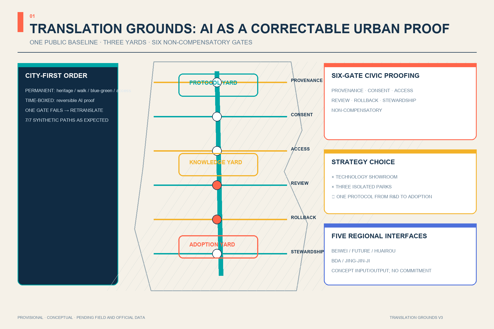
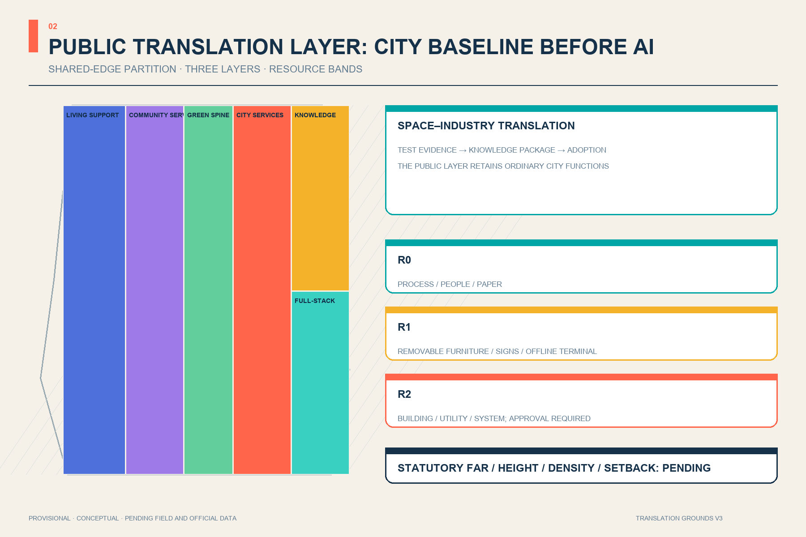
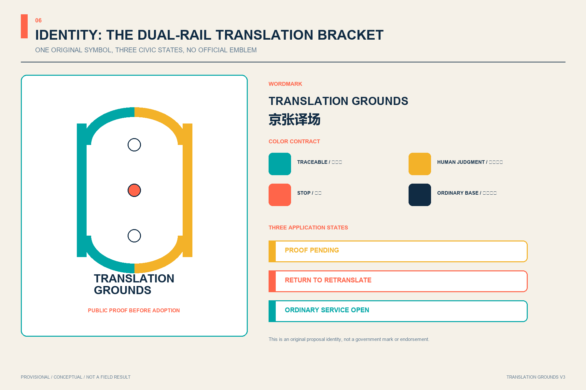
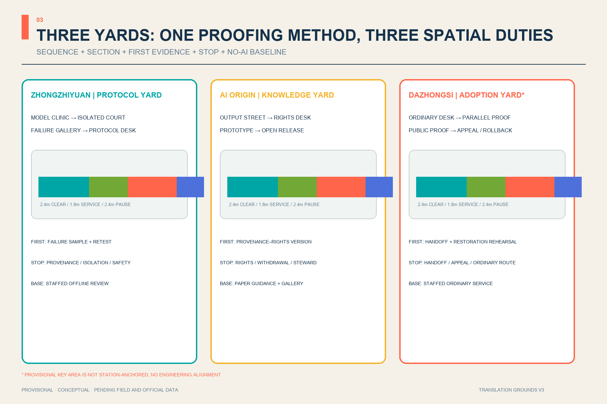
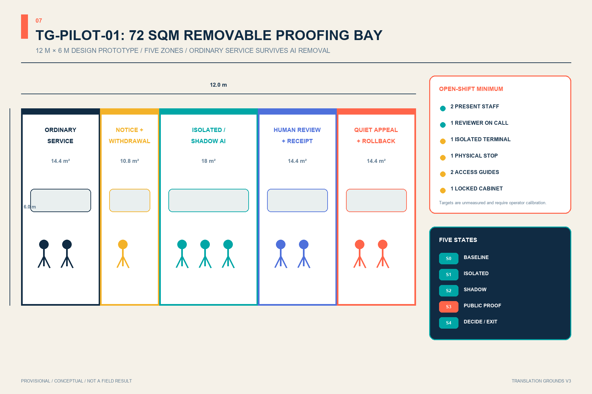
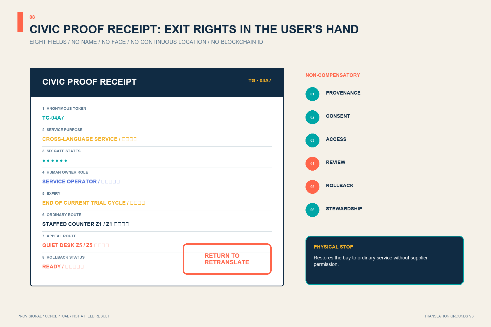
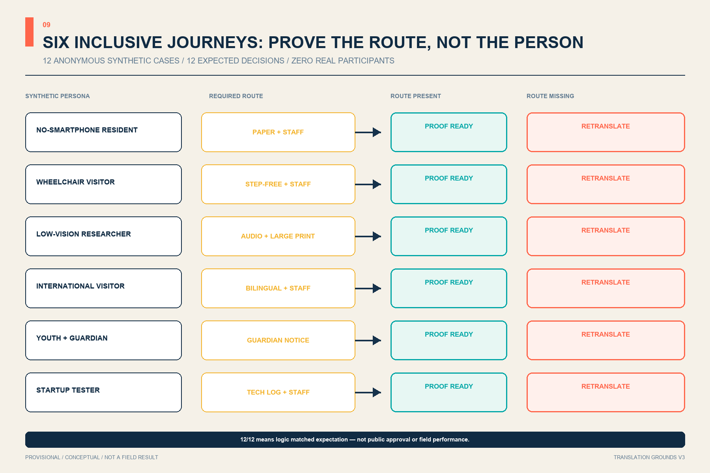
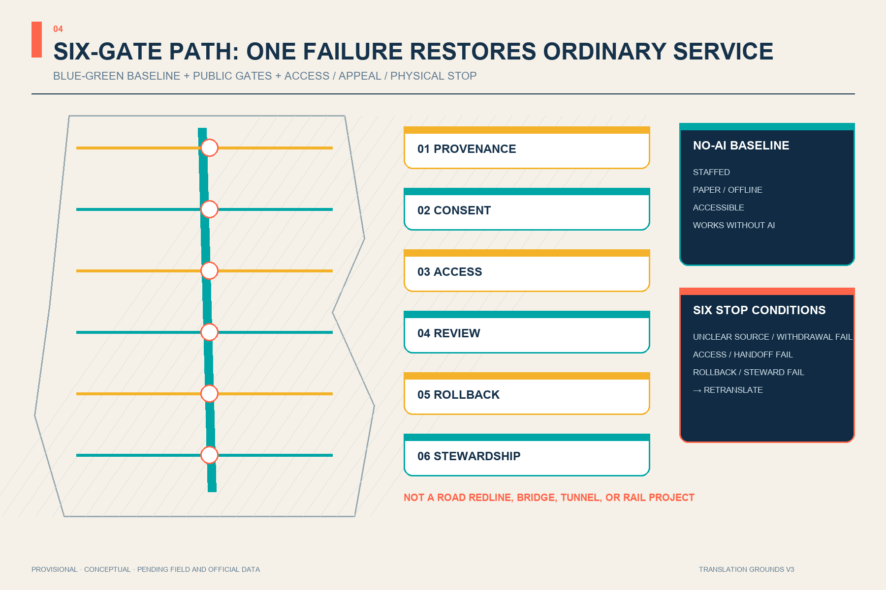

# JING-ZHANG TRANSLATION GROUNDS

> Translating frontier intelligence into verifiable public value. Every spatial move is a Conceptual Recommendation and reference scheme for professional teams to deepen. Nothing here replaces formal planning or constitutes a government approval.

## Jury One-Page Conclusion: Make Every AI Service a Correctable Urban Proof

Translation Grounds V2 does not add another AI showroom. It introduces the original Six-Gate Civic Proofing method: before an AI service enters public space, it must explain **provenance, consent, access, review, rollback, and stewardship**. The gates are non-compensatory. If one is missing, the service returns for retranslation while ordinary staffed service continues. Three yards validate protocols, translate knowledge, and decide public adoption; six gates turn abstract governance into visible, askable, stoppable urban interfaces [standard:PROJECT-AGENT-OPEN-CALL-TASKBOOK] [depth:overall_spatial_structure] [data:geometry/public_space.geojson#PUBLIC-001].

SCN-05, the Cross-Language City Service Desk, is the minimum reproducible example. A local zero-network test runs one complete path and six single-gate failure paths. All 7/7 synthetic paths reached the expected result. This verifies only reproducible rule logic—not field safety, resident consent, operating performance, or deployment approval [metric:proofing_gate_count] [metric:synthetic_proof_case_count] [metric:synthetic_proof_pass_count].

V3 compresses the protocol into a minimum urban unit that can be inspected and removed. TG-PILOT-01 uses 72 sqm, five spatial zones, and five operating states. Each service creates a non-identifying Civic Proof Receipt showing human ownership, expiry, ordinary service, appeal, and rollback. All 12/12 anonymous synthetic inclusion journeys reached their expected decision; this remains zero-network rule evidence, not a field result [metric:pilot_module_area_sqm] [metric:pilot_operating_state_count] [metric:synthetic_inclusion_journey_pass_count].

### Strategy Comparison

| Option | Main benefit | Main risk | Decision |
| --- | --- | --- | --- |
| Technology showroom belt | Immediate communication | AI becomes decoration; failure and exit stay invisible | Not selected |
| Three independent industry parks | Clear investment narrative | Three sites fragment; public value does not travel | Not selected |
| Translation Grounds plus Six-Gate Civic Proofing | One public protocol connects R&D, translation, and adoption while preserving retranslation and exit | Operator and field baseline remain unresolved | Selected as a Conceptual Recommendation |

### Five Regional Interfaces

Beiwei Community contributes everyday service questions; Future Science City contributes basic-research questions; Huairou Science City contributes scientific-facility and research-scenario needs; the Economic-Technological Development Area contributes manufacturing and supply-chain problems; Jing-Jin-Ji nodes contribute cross-regional service and transfer questions. Translation Grounds accepts only public or cleared problem cards, minimum test needs, and withdrawable feedback, and returns urban proofs with provenance, responsibility, limits, and exit conditions. It claims no existing partnership, data sharing, procurement, or mutual recognition [source:AGENT-TASKBOOK] [depth:three_level_scope_framework].

| Concept interface | Accepts only | Returns only | Expiry / exit |
| --- | --- | --- | --- |
| Beiwei Community | De-identified community problem cards | Difference receipt for ordinary and AI service | Close after one trial cycle |
| Future Science City | Public research question and reproduction conditions | Model proof with scope limits | Retranslate on failed reproduction |
| Huairou Science City | Public facility need and safety prerequisites | Scenario constraint list | Stop if safety ownership is unclear |
| BDA | Cleared manufacturing-validation problem | Withdrawable test record | Exit on unclear supply-chain rights |
| Jing-Jin-Ji | Public cross-regional service question | Bilingual ordinary-service and proof interface | No mutual recognition of approval or procurement |

## Design Basis and Source List

The official announcement controls the three scope levels, three key areas, objectives, and tasks; the Agent Taskbook supplies the Three Positionings, Five Functions, and six open-call tasks [source:OFFICIAL-ANNOUNCEMENT] [source:AGENT-TASKBOOK]. The Source Registry limits each source to approved uses, while the processed fact pack is navigation rather than new authority [source:SOURCE-REGISTRY] [source:PROCESSED-FACT-PACK].

Both the Overall Design Area and Key-Area polygons are repository provisional constraints used only for generation, visualization, and intake checking [source:BOUNDARY-SOURCE] [source:KEY-AREA-SOURCE]. Existing buildings, road redlines, heritage controls, utilities, and ownership remain pending, so reversible, stoppable, test-first decisions are more credible than invented precision [depth:existing_conditions_diagnosis].

## Three-Level Scope Framework

Translation Grounds does not invent a new boundary. It connects the 43.6 km² Coordinated Research Area, approximately 11.4 km² Overall Design Area, and 368.4 ha Key-Area Detailed Design Area through one translation chain: strategy coordinates resources, overall design arranges public space and renewal prototypes, and three key-area yards test scenarios. The 11.4 km² value is the announced approximation; the submitted-geometry calculation is only for internal consistency [standard:PROJECT-OFFICIAL-ANNOUNCEMENT] [data:geometry/site_boundary.geojson#SITE-001] [depth:three_level_scope_framework].

The structure is “one spine, three translation yards, six gates, twelve scenarios, and a two-wing feedback loop.” The green heritage spine supports north-south walking and cultural continuity. Zhongzhiyuan translates technology into protocols; Beijing AI Origin translates knowledge into products; Dazhongsi translates products into everyday adoption. The Zhongguancun Technology Services Wing and Xiaoyue River Scenario Enablement Wing return IP, capital, talent, and user feedback [depth:overall_spatial_structure] [data:geometry/roads.geojson#ROAD-001].

## Coordinated Research Area: Industry and Future City Research

Six cases contribute mechanisms, not transferable controls. Kendall Square suggests moving from an innovation park toward an innovation community [source:CASE-KENDALL]. Singapore's one-north combines modular startup space with a work-live-play-learn environment [source:CASE-ONENORTH]. Seoul AI Hub provides staged education, incubation, and validation services [source:CASE-SEOUL]. Paris-Saclay's Urba(IA) uses a user committee to compare and evaluate urban AI scenarios [source:CASE-PARIS-SACLAY]. London's Knowledge Quarter shows cross-sector collaboration among culture, research, business, and communities [source:CASE-KQ-LONDON]. Toronto's Vector Institute illustrates sustained convening across research, industry, and public-interest domains [source:CASE-VECTOR].

Six public gates localize these lessons: Provenance checks data and rights; Consent explains participation and exit; Access protects accessibility and low-digital routes; Review names accountable people; Rollback preserves pause and downgrade controls; Stewardship publishes maintenance responsibility. The gates are both east-west public spaces and a release protocol for AI services [standard:PROJECT-AGENT-OPEN-CALL-TASKBOOK] [data:geometry/public_space.geojson#PUBLIC-001].

The original “dual-rail translation bracket” identity turns two Jing-Zhang lines into an open bracket: cyan marks a traceable public route and warm yellow marks human judgment. It uses no corporate mark; “Translation Grounds” means both a place and a continuing civic practice.

## Overall Design Area: Urban Renewal and Regulatory-Plan-Level Urban Design

A complete land-use partition forms the machine-review base. The west hosts living and community-service prototypes, the centre is the continuous green spine, and the east shifts from urban services in the south to knowledge translation and full-stack validation in the north. Shared cuts cover the provisional boundary without gaps, but categories remain design proposals rather than approved planning [standard:MNR-LAND-USE-CLASSIFICATION-GUIDE] [data:geometry/land_use.geojson#LU-03] [depth:land_use_layout].

Renewal follows “retain first, adapt second, add last.” Twelve footprints describe translation-yard prototypes rather than demolition or ownership decisions. FAR, height, coverage, and setbacks remain pending. Massing guidance is limited to open ground floors, flexible partitions, low-impact rooftop equipment, and interfaces set back from the green spine [depth:development_intensity_controls] [depth:height_massing_character] [data:geometry/buildings.geojson#BLDG-001].

## Detailed Design of Key Areas

Three translation yards form one loop [depth:three_key_area_detailed_design]:

| Key area | Role | Spatial moves | First validation |
| --- | --- | --- | --- |
| Zhongzhiyuan | Protocol Yard: technology → standards | Green test court, protocol forum, failure gallery, river-edge public room | Open-model clinic and edge-compute rehearsal [data:geometry/key_areas.geojson#PROV-KEY-001] |
| Beijing AI Origin | Knowledge Yard: research → products | Near-campus transfer street, shared prototyping, talent services, open-source steps | Accessibility lab and youth maker yard [data:geometry/key_areas.geojson#PROV-KEY-002] |
| Dazhongsi | Adoption Yard: products → daily life | International translation hall, repair loop, service desk, public evaluation court | Service translation, device adoption, and feedback [data:geometry/key_areas.geojson#PROV-KEY-003] |

The Dazhongsi placeholder is not station-anchored. Issue #1029 records an approximately 2.26 km station-relation discrepancy. This proposal does not move upstream geometry or portray four-quadrant connectivity as an approved project; the announced task remains textual until official polygons trigger full recalculation [source:ISSUE-1029] [metric:key_area_count].

The yards share one proofing protocol but cannot exchange duties. Zhongzhiyuan sequences Model Clinic—Isolated Test Court—Failure Gallery—Protocol Desk to produce failure-visible technical evidence. AI Origin sequences Output Street—Rights Desk—Shared Prototyping—Open Release Steps to package maintainable knowledge. Dazhongsi sequences Ordinary Service Desk—Parallel Translation Desk—Public Proof Court—Appeal and Rollback Arcade to adopt, retranslate, or retire a service. Concept sections reserve a 2.4 m clear path, 1.8 m service/equipment band, and 2.4 m pause band; these are checking starts for accessibility and operations, not construction dimensions [depth:three_key_area_detailed_design] [standard:MOHURD-URBAN-DESIGN-MEASURES].

| Yard | First verifiable evidence | Sole accountable role | No-go / stop condition | No-AI baseline |
| --- | --- | --- | --- | --- |
| Protocol Yard | Failure sample, interface note, retest condition | Test lead, unassigned | Unclear provenance, isolation, or safety responsibility | Staffed registration and offline technical review |
| Knowledge Yard | Provenance—credit—license—withdrawal version chain | Knowledge steward, unassigned | Unclear rights, failed withdrawal, or missing maintenance | Paper guidance and ordinary public gallery |
| Adoption Yard | Human takeover and service-restoration rehearsal | Service operator, unassigned | Failed handoff, inaccessible appeal, or blocked ordinary route | Staffed ordinary service desk |

## AI Innovation Ecosystem, Personas, and AI+ Scenarios

Seven personas govern the scenarios: researchers need reproducibility; startups need affordable validation; mature firms need adoption feedback; residents need visible human service; older and low-digital users need non-mandatory digital routes; disabled users need multimodal access; international visitors need cross-language interpretation. No scenario requires persistent individual identification.

V3 turns the persona list into six positive and six failure journeys that test whether paper, staffed, accessible, bilingual, guardian, and technical-log routes remain real. Synthetic residents without smartphones, wheelchair visitors, low-vision researchers, international visitors, youth with guardians, and startup testers each have one accessible path and one fault path. A missing required channel, handoff beyond the 120-second concept target, incomplete receipt, or closed ordinary service returns the case for retranslation [metric:synthetic_inclusion_journey_count] [metric:pilot_handoff_target_seconds] [metric:proof_receipt_required_field_count].

| Synthetic journey | Required route | Unacceptable substitute | Ordinary-service baseline |
| --- | --- | --- | --- |
| Resident without smartphone | Paper + staff | Screen or QR only | Staffed counter and paper guide |
| Wheelchair visitor | Step-free + staff | Stairs or detour | Continuous accessible entry |
| Low-vision researcher | Audio + large print + staff | Small screen text only | Staffed read-aloud explanation |
| International visitor | Bilingual + staff | Machine translation only | Bilingual human review |
| Youth with guardian | Guardian notice + staff | Default consent | Withdrawable offline activity |
| Startup tester | Technical log + staff | Black-box result | Offline technical review |

All twelve cards are registered through `scenario_ids` on the six public-gate spaces; the first three are industry Testing and Validation Scenarios [metric:scenario_node_count] [metric:test_validation_scenario_count] [data:geometry/public_space.geojson#PUBLIC-001]:

1. Open-model clinic with data cards, failure samples, and human sign-off.
2. Edge-compute load rehearsal within explicit energy and safety limits.
3. Multimodal accessibility lab co-tested by disabled users.
4. Walking-and-cycling co-pilot without persistent personal tracking.
5. Cross-language city service desk with escalation to people.
6. Public algorithm label showing purpose, data, owner, expiry, and stop control.
7. Jing-Zhang oral-history booth with consent and withdrawal.
8. Youth AI maker yard with attribution and safeguarding.
9. Legal first-contact desk limited to triage and professional review.
10. Community health guide limited to navigation with clinical fallback.
11. Smart-device repair and reuse station without vendor lock-in.
12. Global demo-to-neighbourhood forum requiring a public change log.

Three pilgrimage landmarks avoid high-energy spectacle: the Protocol Beacon displays standards and failures; the First-Kilometre Archive Gate pairs railway mileage with public memory and contributor credit; the Civic Translation Hall shows how products are adopted, challenged, repaired, and retired [metric:landmark_count].

### SCN-05 Six-Gate Proofing Record: a 12-Week Exit-Ready Trial

Weeks 1–2 record the ordinary staffed-service baseline; weeks 3–5 translate synthetic questions offline; weeks 6–8 run parallel service while the staffed route remains primary; weeks 9–11 rehearse public proofing, appeal, and rollback; week 12 allows only adopt, retranslate for a fixed period, or retire. Untraceable provenance, failed notice/withdrawal, interrupted accessible or non-digital routes, failed human takeover, failed rollback, or absent stewardship restores ordinary service [metric:proofing_pilot_duration_weeks] [metric:proofing_stop_condition_count].

The original T/R/C/W roles are Translator, professional and rights Reviewer, Community witness for access/appeal/exit, and Steward for versions, maintenance, and retirement. No real institution has accepted these roles. Resources use bands instead of invented prices: R0 covers process, people, and paper; R1 covers removable furniture, signs, and offline terminals; R2 touches buildings, utilities, or system interfaces and must wait for professional deepening and approval [depth:phasing_implementation] [source:AGENT-TASKBOOK].

### TG-PILOT-01: a 72 sqm Removable Proofing Bay

The 12 m by 6 m prototype is not tied to a building or parcel: 14.4 sqm for ordinary service and waiting, 10.8 sqm for notice and withdrawal, 18 sqm for isolated/shadow proofing, 14.4 sqm for human review and receipt, and 14.4 sqm for quiet appeal and rollback. Only the central proofing zone depends on AI; the other four work after AI shuts down. A real site requires new ownership, fire, accessibility, structural, utility, and staffing review [metric:pilot_module_area_sqm] [depth:three_key_area_detailed_design].

The concept minimum for every open shift is two present people—an ordinary-service operator and a proofing translator with separated duties—plus one professional reviewer on call. The kit includes one isolated workstation, one physical stop control, two tactile/large-print guidance sets, and one locked evidence cabinet. A supplier may submit evidence but never approve its own gates; the ordinary-service operator may restore service without supplier permission. These are calibratable resources, not institutional rosters or fiscal promises [metric:pilot_minimum_open_shift_staff_count] [depth:phasing_implementation].

### Civic Proof Receipt: Return Exit Rights to the User

Every public proof creates only eight fields: anonymous token, service purpose, six gate states, human owner role, expiry, ordinary-service route, appeal route, and rollback status. It uses no name, face, continuous location, or “blockchain identity.” A receipt never renews automatically; one failed gate stamps RETURN FOR RETRANSLATION, and the physical stop control restores the space from public proofing to ordinary service [metric:proof_receipt_required_field_count] [metric:proofing_gate_count].

Five states constrain service and space together. S0 runs ordinary service only; S1 proofs public or synthetic questions in isolation; S2 exposes output only to human review; S3 shows a receipted public proof only after all six gates pass; S4 permits only limited adoption, retranslation, or removal of the AI layer and baseline restoration. Two-minute human handoff and withdrawal acknowledgement within one open shift remain unmeasured concept targets for professional calibration [metric:pilot_operating_state_count] [metric:pilot_handoff_target_seconds].

## Land Use, Building Scale, and Retain-Renovate-Demolish Strategy

Six shared-edge polygons provide a recalculable partition: a public translation layer in the middle, knowledge production to the east, and everyday support to the west. Codes use repository enums, while the local MNR snapshot contains only the notice page; professional deepening must return to the official attachment before statutory use [standard:MNR-LAND-USE-CLASSIFICATION-GUIDE] [depth:land_use_layout].

The building strategy is a post-survey decision tree, not a parcel verdict. Retain safe and useful fabric; adapt buildings that can improve through open ground floors, services, and shared space; consider removal or addition only after ownership, structure, heritage, carbon, and public-interest review. Prototype footprint metrics exist only for package consistency [metric:building_footprint_area_sqm] [metric:building_coverage_ratio_design_prototype] [depth:retain_renovate_demolish].

## Transport, Rail, Municipal Infrastructure, and Public Services

One north-south walking and cycling spine plus six east-west Translation Gates express connection and interchange, not road redlines, bridges, or tunnels. Conceptual centreline length verifies that the network changes when geometry changes [metric:road_centerline_length_m] [depth:traffic_rail_slow_parking] [data:geometry/roads.geojson#ROAD-002].

Municipal and new infrastructure follow “small edge nodes, centralized audit, human takeover.” Yards may host scheduled computing, model evaluation, data authorization, and repair interfaces, while energy, utilities, fire safety, drainage, and cybersecurity remain specialist dependencies. Every public service keeps a staffed desk, non-smart route, and offline explanation [depth:municipal_new_infrastructure] [standard:MOHURD-CONTROL-DETAILED-PLANNING].

## Blue-Green Network, Public Space, and Urban Character

The translation green spine combines heritage narrative, walking, cycling, accessible companionship, and low-intrusion AI experience. Six gates provide east-west pause, explanation, and interchange. Geometry-derived green figures are not statutory green-ratio controls or commitments [metric:green_space_area_sqm] [metric:green_ratio] [data:geometry/green_space.geojson#GREEN-001].

Six components make public value visible: staffed desks, rewritable protocol walls, reusable exhibit frames, low-luminance status lights, tactile/audio wayfinding, and demo tables with physical stop controls. Their area and ratio measure the proposal's public-space commitment only [metric:public_space_area_sqm] [metric:public_space_ratio] [depth:blue_green_public_space].

Durable metal, reclaimed brick, timber touch surfaces, and replaceable information layers combine railway engineering discipline, Zhongguancun experimentation, and explainable AI. Heritage, river, and existing-park interventions stay reversible and subject to professional review [standard:MOHURD-URBAN-DESIGN-MEASURES].

## Renewal Projects, Implementation Policy, and Phasing

| Project | Content | Dependency and exit condition |
| --- | --- | --- |
| T-01 Green-spine sample | Wayfinding, staffed desk, public labels, accessible route | Heritage/park/traffic permission; fully removable |
| T-02 Protocol Yard | Standards forum, model clinic, failure gallery | Building safety and operator confirmation |
| T-03 Knowledge Yard | Shared prototyping, open-source launch, talent services | Campus edges, ownership, and use rights |
| T-04 Adoption Yard | Service desk, device loop, international translation | Official key-area and station anchoring |
| T-05 Six Public Gates | Provenance, Consent, Access, Review, Rollback, Stewardship | Road-redline and accessibility review |
| T-06 Twelve-scenario rotation | 90-day test, public review, renew or stop | Data rights, accountable person, complaint path |
| T-07 TG-PILOT-01 proofing bay | Five zones, two present staff, isolated terminal, physical stop, receipt, and removal | Real site, operator, fire, and accessibility confirmation |

Before advancing, each project submits a six-part proof package: problem, space, data/rights, human responsibility, stop/restoration, and maintenance/retirement. T-01 and T-05 are R1 reversible components; T-06 starts as an R0 service process; T-02 through T-04 may move from R1 to R2 only after building, ownership, fire, utility, and operator confirmation. Professional teams may later establish cost bands; this proposal invents no investment or fiscal commitment.

T-07 separates responsibility further. The venue approves space and the ordinary baseline; the service operator controls human takeover; the AI supplier provides model and data evidence; the professional reviewer checks safety, rights, and access; the Community witness observes accessibility and appeal without seeing case content; and the Steward owns versions, expiry, and removal records. No real institution holds these roles. If any critical owner is absent, S3 public proofing cannot begin.

Phase one uses reversible labels and service processes; phase two adapts the three yards after surveys; phase three waits for official geometry and specialist conditions before systemic construction. Phase-one area encodes dependency order, not an approved work boundary [metric:phase_1_area_sqm] [depth:renewal_project_list] [depth:phasing_implementation].

An annual loop is proposed: spring public problem call, summer scenario rehearsal, autumn Global Translation Grounds Week, and winter maintenance/retirement audit. Developer credit derives from open issues, test evidence, and maintenance promises; firms progress from demo to limited validation and then resident/professional review. Events, recruitment, policy, and finance remain proposals, not commitments.

## Metrics, Area Recalculation, and Compliance Matrix

The provisional Overall Design Area is recalculated in EPSG:4548 for package topology and ratio consistency only [metric:site_area_sqm] [depth:metrics_recalculation]. Green, public-space, prototype-building, walking-centreline, and phasing metrics derive from GeoJSON; statutory FAR, height, road-area ratio, and existing-building retention remain pending official data.

The compliance matrix covers announcement sections 1.3, 1.4, and 1.5 plus agent.1–agent.6. The standards matrix records five mandatory sources and one unavailable official-file gap. The design-depth matrix maps fifteen items to narrative, geometry, metrics, drawings, and checks. “Complete” means reviewable evidence under current provisional inputs, not completion of statutory planning.

## Risk, Copyright, and Compliance

The main risk is not missing numbers but provisional numbers being detached and misread as official. Official boundaries, controls, roads, buildings, heritage, utilities, and facilities must trigger full regeneration of geometry, metrics, figures, PDFs, HTML, manifest, and self-check [depth:risk_missing_data]. The repository lacks an official file for the architectural design-depth reference; it remains a data gap and is not claimed as a completed architectural standard [standard:MOHURD-ARCH-DESIGN-DEPTH-2016].

All figures are programmatically drawn from package GeoJSON and metrics. The cover and PDFs are original local renderings with no commercial map tiles, external photographs, corporate marks, portraits, or remote fonts. HTML contains no CDN, remote script, tracking, form, or network request. Every AI scenario requires a public purpose, minimum data, human review, complaint/exit path, and stop control.

## References

Complete publishers, links, access dates, permitted uses, and limitations are in `sources.json`; this section explains how evidence shapes the design without converting case experience into statutory control. The official announcement and taskbook establish the three scope levels, three key areas, and open tasks that become the one-spine, three-yard, six-gate, twelve-scenario structure [source:OFFICIAL-ANNOUNCEMENT] [source:AGENT-TASKBOOK]. Local standards constrain evidence authority, public procedure, and the conceptual status of the proposal. The six international cases contribute operating mechanisms only, not transferable metrics, permissions, or commitments [standard:MOHURD-URBAN-DESIGN-MEASURES] [source:CASE-KENDALL].

The spatial base is repository-provided provisional geometry, so area, green-space, and public-space values support only package topology and internal design consistency [data:geometry/site_boundary.geojson#SITE-001] [metric:site_area_sqm]. Issue #1029 shows that PROV-KEY-003 is not yet anchored to Dazhongsi Station; the submission does not relocate the upstream polygon or claim that station integration is resolved [source:ISSUE-1029]. Official boundaries, controls, roads, buildings, heritage, utilities, ownership, and facility data must trigger full geometry-and-metric recalculation and a new four-gate self-check. This remains an open co-creation submission—not selection, approval, or implementation.
