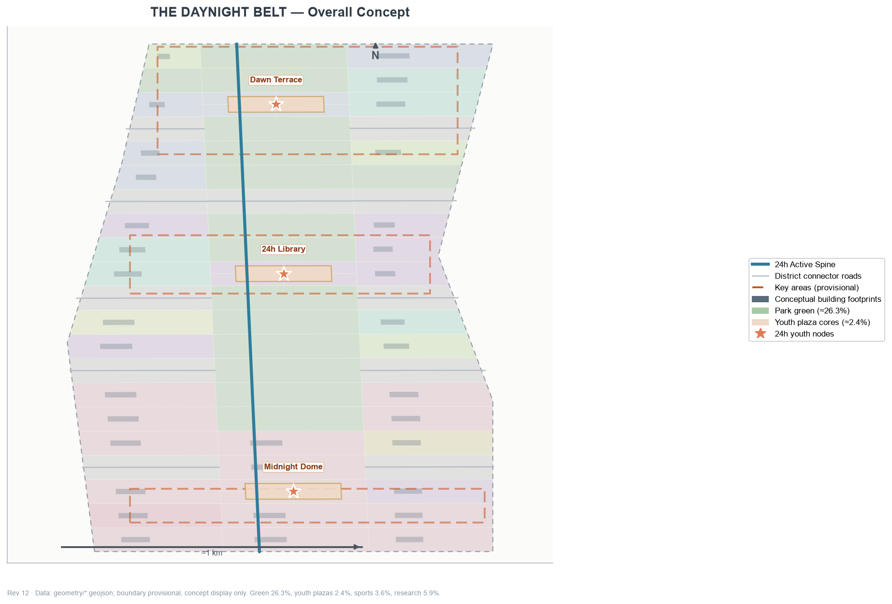
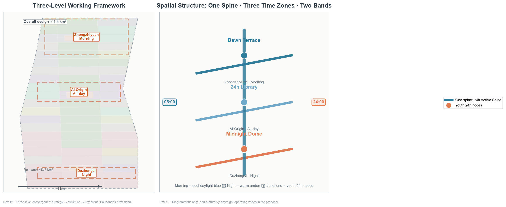
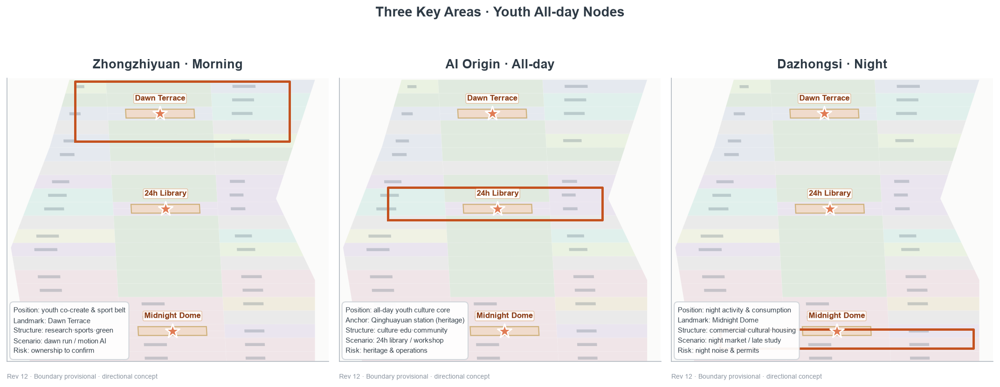
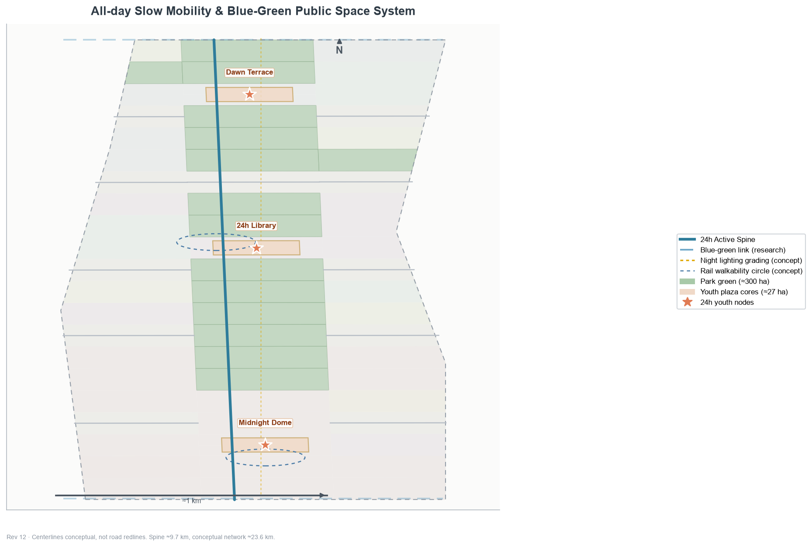
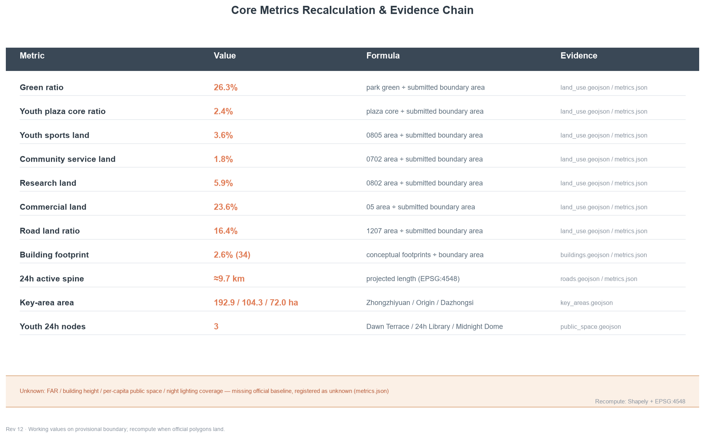

# THE DAYNIGHT BELT of Jing-Zhang: A Time Contract with the City

> **One-sentence thesis**: In 1909 the Jing-Zhang Railway climbed the Badaling mountains with one steam locomotive and one "zigzag" line; today an AI city must climb "the time of a day" — from dawn to late night, the Jing-Zhang belt should always have public space where young people can stay, co-create, exercise and socialize. This proposal uses the terminator as a temporal motif, organizing the heritage park belt into a 24-hour youth-friendly public space belt [data:geometry/site_boundary.geojson#SITE-001] [metric:site_area_sqm].

## Design Basis and Source List

**Independent second-concept statement**: This proposal is the author's second independent concept (independent submission qualification; submitting multiple distinct concepts is an established precedent). The two proposals share the same solicited site boundary and the 3×21 grid-partition method, and the spine, road and phasing skeletons together with part of the parcel geometry are directly carried over from the same site (faithfully recorded in the geometry layers); however the **concept motif, functional mix, scenario cards, personas, landmarks and operating brand are independent** — this proposal organizes by time (the terminator), and through 16 reclassified parcels plus new green/sports/plaza land the functional mix is clearly distinct (green 26.3% vs 22.3%, youth plaza cores 2.4% vs 1.6%, sports 3.6% vs none, research 5.9% vs 13.7%); scenarios, personas and landmarks are all youth-friendly bespoke designs. The two proposals are submitted side by side as complements, not as revisions of each other.

This formal proposal takes the Announcement for the Centennial Jing-Zhang AI Innovation Belt International Urban Design Solicitation as its first basis, and the maintainer-registered provisional boundaries, key areas, enums, indicators and source list under `brief/site-package/` as its machine-readable basis. The AI agent reads `design_brief.json`, `allowed_design_space.json`, `sources.json`, `enums/`, `ranges/`, `schemas/`, `data/source_registry.json` and `data/processed/agent_fact_pack.md`, and builds task, scope, source-use and gap inventories from `project_scope_summary.csv`, `agent_task_requirements.csv`, `source_use_matrix.csv` and `missing_data_checklist.csv`. The announcement requires regulatory-plan-depth urban design for the overall design area and comprehensive implementation depth for key areas, so narrative text cannot substitute for GeoJSON, metric tables, A3 booklet, A0 boards and HTML deliverables [source:OFFICIAL-ANNOUNCEMENT] [source:AGENT-TASKBOOK] [depth:existing_conditions_diagnosis].

The usage boundary of the source registry follows [source:SOURCE-REGISTRY]: `data/source_registry.json` records the permitted uses of public, cleared and provisional materials; agents must not upgrade background-only or provisional-only materials into official boundaries, statutory controls, official scoring bases or government implementation commitments. `data/processed/agent_fact_pack.md` is a navigation layer, not a new authority [source:PROCESSED-FACT-PACK]; factual judgments return to the registered original materials, and the full source relations are stored in `sources.json`.

Where official `SITE_BOUNDARY` or the three `KEY_AREA` polygons are not yet available, the scaffold generates a temporary formal package from `brief/site-package/geometry/provisional_boundaries.geojson`. `geometry/site_boundary.geojson` and `geometry/key_areas.geojson` are both marked `provisional_constraint`, `official_boundary=false`, usable only for design generation, self-check, visualization and discussion — not as official redlines, approval bases, precise area bases or statutory control conclusions. This organizer-side data gap does not block content scoring; after official polygons replace the provisional ones, site boundary, key areas, land use, roads, green space, public space, buildings, phasing and metrics must all be recomputed [data:geometry/site_boundary.geojson#SITE-001] [metric:key_area_count]. All spatial structures, scenarios, projects and indicators are therefore written as "discussable, verifiable, and recomputable after official boundaries replace the provisional ones".

## Three-Level Scope Framework

The proposal organizes work in the three levels set by the announcement: the coordination research scope focuses on 43.6 km² of AI industry ecosystem, young innovation population, strategic positioning and future urban form; the overall design scope focuses on the urban area around the 11.4 km² Jing-Zhang Heritage Park, requiring an urban renewal framework, youth-friendly public space layout, transport and municipal support and urban character control; the key-area scope focuses on three detailed-design areas (announced text areas sum to about 368.4 ha; geometric recomputation about 369.3 ha), requiring functional mix, building scale, retain-renovate-demolish classification, public space connectivity and transport organization. Each requirement maps one-to-one in `compliance_matrix.json`, ensuring the mandatory tasks 1.3, 1.4, 1.5 and agent.1–agent.6 all have chapter, layer, metric, drawing and HTML evidence [depth:three_level_scope_framework] [depth:overall_spatial_structure]; the task basis per [standard:PROJECT-OFFICIAL-ANNOUNCEMENT] and the scope navigation per [source:PROCESSED-FACT-PACK].

The three levels are not isolated drawing sets. The coordination research decides the youth-friendly city and time-contract judgment; the overall design carries it into the 24h active spine, three time-zone nodes and facility capacity; the key areas verify feasibility at the parcel, building, transport, public space and AI scenario level. The agent must first lock the provisional boundary and constraints adopted in this submission, then generate land use, buildings, roads, green space, public space, phasing and AI service nodes, and finally recompute metrics from these layers, explaining in the prose which conclusions remain limited by the provisional boundary [data:geometry/land_use.geojson#LU-001] [data:geometry/roads.geojson#ROAD-001].

| Level | Design question | Proposal answer | Data anchor |
| --- | --- | --- | --- |
| Coordination scope | How to organize youth-friendly urban form and the time contract | An "awaken—all-day—night" all-time life chain and youth innovation ecosystem | compliance_matrix.json, standard_matrix.json |
| Overall scope | How to map 24h public space and urban renewal | Land use, buildings, roads, green, public space and phasing layers together | [data:geometry/land_use.geojson#LU-001], [data:geometry/roads.geojson#ROAD-001] |
| Key areas | How to reach detailed design depth in three areas | Morning/all-day/night positioning, spatial moves, AI scenarios, implementation dependencies | [data:geometry/key_areas.geojson#PROV-KEY-001], [data:geometry/key_areas.geojson#PROV-KEY-002], [data:geometry/key_areas.geojson#PROV-KEY-003] |

## Coordinated Research Area: Industry and Future City Research

### Naming System and Logo Direction (agent.1)

Primary name: THE DAYNIGHT BELT of Jing-Zhang (京张晨昏带), subtitle "A Time Contract with the City". The logo direction is one terminator-gradient two-band stripe — cool daylight blue (#2E7C9B) meeting warm amber (#E07B54) — with the junction dissolving into a circle, extending into the Chenhun (Daynight) Festival annual identity [depth:brand_identity_and_logo_direction]. The naming system does not conflict with any registered mark; the logo is a textual direction, not a trademark registration. The style echoes a "industrial memory + youth life" dual voice, keeping a consistent day/night two-color vocabulary across public-space signage, event posters and digital interfaces [source:AGENT-TASKBOOK] [standard:PROJECT-AGENT-OPEN-CALL-TASKBOOK].

### Three Positionings, Five Functions and the Three-Time-Zone Loop (agent.1)

Above the naming system, this proposal completes the three positionings, five functions and the synergy loop required by the taskbook:

- **Three positionings**: a Centennial Jing-Zhang culture belt (the heritage park and railway temporality carrying urban memory); an urban AI life-experience belt (AI scenarios entering young people's everyday life rather than remaining slogans); a youth-friendly integration and innovation belt (innovation and life fused at the scale of young people).
- **Five functions**: innovation seeding (Zhongzhiyuan morning-zone co-create workshops and open-source stations), youth development (Origin 24h library, education and community service), night vitality (Dazhongsi Midnight Dome, night market and lighting grading), cultural experience (the Jing-Zhang temporality narrative and pilgrimage landmarks), and public services (community service nodes, accessible slow mobility and safety fallback).
- **Three-time-zone synergy loop**: morning (Zhongzhiyuan) — all-day (Origin) — night (Dazhongsi) linked along the 24h spine, superimposed with the Zhongguancun technology-services wing (innovation factors, capital and IP supply) and the Xiaoyuehe scenario-empowerment wing (scenario testing and public experience paths), forming a "supply—participate—transform—feedback" operating loop [depth:regional_synergy_circuit] [source:AGENT-TASKBOOK].

### Youth-Friendly Positioning and the "Time Contract with the City"

The brief explicitly requires "shaping the Jing-Zhang Heritage Park vitality belt and promoting east-west stitching, north-south connectivity, public space activation and youth friendliness" [source:OFFICIAL-ANNOUNCEMENT]. This proposal translates "youth friendliness" from a slogan into designable, verifiable spatial objects: first, **time friendliness** — public space and facilities operate in morning/all-day/night shifts, with night lighting grading, safety fallback and night-time vitality formats; second, **facility friendliness** — sports, community service, youth plazas and the 24h library form a walkable facility belt [metric:sport_land_ratio] [metric:land_use_community_service_area_sqm]; third, **participation friendliness** — the youth co-creation fund, the Chenhun Festival and the scenario-open mechanism make young people co-builders of space rather than mere users [depth:regional_synergy_circuit].

### AI Innovation Ecosystem and Youth-Friendly City Cases (agent.2, 6 cases)

- Silicon Valley and the San Francisco Bay Area: a full-stack innovation ecosystem of universities, capital and enterprises with free-flowing young talent; transferable lesson — the Zhongzhiyuan full-stack acceleration system and youth talent services [metric:case_study_count].
- Shenzhen Nanshan: a hardware-startup ecosystem with youth start-up density, where low-cost public innovation carriers lower the trial threshold; transferable lesson — the Zhongzhiyuan co-create workshop and open-source stations.
- Hangzhou Binjiang: a platform ecosystem with scenario openness, where digital-economy leaders drive SME collaboration; transferable lesson — the scenario-open five-step mechanism and the youth co-creation fund.
- Chengdu: a night-time economy with street vitality, where AI+ life services are validated in real streets; transferable lesson — the Dazhongsi AI life-experience belt [metric:land_use_commercial_area_sqm].
- Shibuya, Tokyo: station-city integration with all-time vitality, where rail nodes carry youth innovation communities; transferable lesson — the AI Origin 24h library and rail connection [data:geometry/public_space.geojson#PS-11-01].
- Berlin: shared public space and open data, where low-threshold public facilities activate self-organized innovation; transferable lesson — the youth plaza component kit and booking system [metric:land_use_community_service_area_sqm].

These cases are methodological borrowing at the level of public literature, not planning bases; this proposal does not claim to replicate any city's specific institution or facility [source:AGENT-TASKBOOK] [standard:PROJECT-AGENT-OPEN-CALL-TASKBOOK].

**AI innovation ecosystem map and factor mechanisms (agent.2)**: an innovation chain of "university incubation—open-source collaboration—enterprise conversion—public experience—international dissemination", organized around eight factor types (land, space, industry, capital, talent, compute, data and scenario): Zhongzhiyuan carries full-stack autonomous innovation acceleration (compute, piloting, standards), the Origin community carries near-campus result conversion and the open-source ecosystem, Dazhongsi carries AI-native new business formats and content-consumption conversion, the Zhongguancun technology-services wing supplies capital, IP and global factors, and the Xiaoyuehe scenario-empowerment wing provides scenario testing and public experience paths [depth:regional_synergy_circuit] [source:AGENT-TASKBOOK]. Research land of 5.9% focuses on compute, piloting and standards; the remaining R&D functions are carried by mixed carriers within cultural/commercial/education land to avoid inflated research land.

### Future AI City Form: The All-Time Life Belt

A key judgment on future AI city form is that the city no longer runs on "office hours" but on **life rhythms** — young people's work, study, exercise and social life interleave across the day, so public space must support time-shared reuse. This proposal organizes the Jing-Zhang belt as an "all-time life belt": the spine is the 24h active axis, three time-zone nodes carry morning, all-day and night functions, and AI scenarios (booking, recognition, lighting, wayfinding) act as an enabling layer for time management. This judgment is a design suggestion, not a deterministic prediction; operational indicators (night lighting coverage, per-capita public space) stay unknown until official data arrives [metric:night_lighting_coverage_ratio] [standard:GENERATIVE-AI-INTERIM-MEASURES].

## Overall Design Area: Urban Renewal and Regulatory-Plan-Level Urban Design

### Overall Spatial Structure: One Spine · Three Time Zones · Two Color Bands

The overall structure is "**one spine · three time zones · two color bands**": one spine is the Jing-Zhang Heritage Park 24h active spine (green belt + slow mobility + lighting grading) linking the three youth all-day node plazas [data:geometry/roads.geojson#ROAD-005] [metric:spine_length_m]; three time zones are the Zhongzhiyuan morning zone (north, morning—noon), the AI Origin all-day zone (center, all day) and the Dazhongsi night zone (south, noon—night) [data:geometry/key_areas.geojson#PROV-KEY-001] [data:geometry/key_areas.geojson#PROV-KEY-002] [data:geometry/key_areas.geojson#PROV-KEY-003]; two color bands are the cool daylight blue and warm amber vocabulary graded along the terminator, with junctions dissolving into node circles. The structure differs fundamentally from the spatial-geometric organization (one axis, three zigzags, two wings) of the first proposal: this proposal organizes by **time**, with space as the carrier of temporal rhythm [depth:overall_spatial_structure].

### Land Use Layout and Functional Mix

The land-use scheme is oriented toward youth-friendly public life, clearly distinct from industry-led schemes: park green 26.3% (299.8 ha) [metric:green_ratio], youth plaza cores 2.4% (27.0 ha) [metric:public_space_ratio], sports land 3.6% [metric:sport_land_ratio], community service land 1.8% [metric:land_use_community_service_area_sqm], research land 5.9% [metric:land_use_research_area_sqm]. The remaining ratios (commercial 23.6%, cultural 9.2%, education 7.7%, residential 1.6%, medical 1.7%, road 16.4%) and all recalculation formulas are fully stored in `metrics.json`. Green, plaza, sports and community service together total about 34% — the core floor of a "public-life belt"; the three 300m youth plaza cores sit inside the three key areas [data:geometry/public_space.geojson#PS-18-01] [data:geometry/public_space.geojson#PS-11-01] [data:geometry/public_space.geojson#PS-02-01].

### Building Scale and Renewal Logic

Building footprints are expressed at "discussable, verifiable" concept level: 34 conceptual footprints total about 2.6% building footprint ratio [metric:building_footprint_ratio] [metric:building_count], covering youth talent housing, community youth service facilities, AI R&D accelerator buildings, 24h youth cultural libraries, youth sports facilities and youth-friendly commercial complexes [data:geometry/buildings.geojson#BLD-001] [depth:retain_renovate_demolish]. The renewal logic prioritizes "stock retrofit + light operation": Zhongzhiyuan stock buildings are retrofitted into youth co-create carriers, and the Dazhongsi streets are renewed as youth-friendly commercial frontages, without assuming large-scale demolition; intensity indicators (FAR, height) stay unknown until regulatory conditions arrive [metric:floor_area_ratio] [standard:MOHURD-CONTROL-DETAILED-PLANNING].

## Detailed Design of Key Areas

The three key areas must cite [data:geometry/key_areas.geojson#PROV-KEY-001], [data:geometry/key_areas.geojson#PROV-KEY-002] and [data:geometry/key_areas.geojson#PROV-KEY-003], and [depth:three_key_area_detailed_design] checks whether they reach comprehensive implementation depth. Each key area is centered on one youth all-day node plaza, differentiated by morning/all-day/night function, scenario and operation [metric:key_area_count].

### Zhongzhiyuan · Morning Zone (youth co-create/sport/open-source)

Positioned as a youth co-create and sport belt (morning—noon), centered on the **Dawn Terrace** youth plaza [data:geometry/public_space.geojson#PS-18-01] [data:geometry/public_space.geojson#YOUTH-003] [metric:zhongzhiyuan_area_sqm]. The spatial move is a research, sports and green complex organizing a morning-exercise plaza, sports fields and open-source morning desks around Dawn Terrace; scenarios cover the dawn-run companion (S01), morning motion health recognition (S02) and youth co-create workshop (S08); renewal is stock retrofit first. Risk: complex ownership to be confirmed parcel by parcel [data:geometry/key_areas.geojson#PROV-KEY-001].

### AI Origin Community · All-day Zone (culture/study/share)

Positioned as an all-day youth culture core, centered on the **24h Library** youth plaza [data:geometry/public_space.geojson#PS-11-01] [data:geometry/public_space.geojson#YOUTH-002] [metric:beijing_ai_origin_area_sqm]. The Qinghuayuan station site is the cultural anchor — the Jing-Zhang Railway opened fully in 1909, and Qinghuayuan station was added for Tsinghua School in 1910, built under Zhan Tianyou's supervision with the station name inscribed by him; its protection scope is subject to the heritage authority, and this proposal only proposes cultural narrative and slow-mobility stitching outside the heritage boundary, without assuming any demolition [standard:PROJECT-OFFICIAL-ANNOUNCEMENT] [depth:three_key_area_detailed_design]. The structure is culture, education and community service around the 24h Library plaza; scenarios cover the 24h library (S04), late-night study pods (S06) and developer late-night salon (S12). Risk: heritage and university ownership are highly sensitive [data:geometry/key_areas.geojson#PROV-KEY-002].

### Dazhongsi · Night Zone (youth consumption/night vitality/social)

Positioned as a night vitality and consumption belt (noon—night), centered on the **Midnight Dome** youth plaza [data:geometry/public_space.geojson#PS-02-01] [data:geometry/public_space.geojson#YOUTH-001] [metric:dazhongsi_area_sqm]. The spatial move is a youth-friendly commercial street renewal with night lighting grading, organizing the night-life market (S07), adaptive night lighting (S05) and late-night study pods (S06) around Midnight Dome; the structure is commercial, cultural and limited residential, introducing **AI-native new business formats** (AI-guided retail, unmanned retail, smart-terminal and content-consumption display, conceptual, no demolition assumed) [source:AGENT-TASKBOOK] [metric:land_use_commercial_area_sqm]. Risk: night noise and operating permits need market and planning double confirmation, listed as an implementation precondition rather than an approved arrangement [data:geometry/key_areas.geojson#PROV-KEY-003] [depth:risk_missing_data].

## AI Innovation Ecosystem, Personas, and AI+ Scenarios

### Six Youth Personas (agent.3)

The proposal organizes spatial and service responses around six youth personas, each mapped to clear spatial nodes and AI scenarios [metric:user_persona_count].

| Persona | Typical group | Core needs | Corresponding space |
| --- | --- | --- | --- |
| P1 Students | University students, commuters | Study, low-cost consumption, slow commuting | Origin 24h Library, spine slow lanes |
| P2 Startups | Young founding teams | Low-cost desks, pitch, community | Zhongzhiyuan workshop, Dawn Terrace |
| P3 Developers | Open-source & AI practitioners | 24h collaboration, late-night food, community honor | Developer salon, star registry |
| P4 Night owls | Night-active youth | Night vitality, safe lighting, social | Dazhongsi Midnight Dome, night market |
| P5 Young parents | Young families | Parent-child morning activity, safe space | Parent-child dawn station, skate plaza |
| P6 Silver-age visitors | Morning-active seniors | Morning stroll, accessible lanes, human service | Silver-age dawn trail, spine stations |

Beyond the six youth personas, the scheme also serves existing residents and vulnerable groups: community service land nodes (1.8%) host daytime care for seniors and childcare, accessible slow lanes and human-guided tours cover disability and elderly needs, and night lighting grading with safety duty supports night-time commuting safety [standard:BARRIER-FREE-ENVIRONMENT-LAW] [metric:land_use_community_service_area_sqm] [metric:land_use_residential_area_sqm].

### Twelve Youth Scenario Cards (incl. 3 test/validation, agent.3)

All scenario cards are only conceptual design suggestions — currently none are deployed, authorized or operational; each has a manual equivalent path and a human shut-down condition, each scenario maps to a registered public scenario type and spatial node [source:AGENT-TASKBOOK] [standard:PROJECT-AGENT-OPEN-CALL-TASKBOOK] [metric:scenario_card_count].

**Test/validation scenarios (3, incl. an industry road test and life-algorithm validation)**:

| Card | Scenario | Spatial node | Registered type | Privacy / human boundary |
| --- | --- | --- | --- | --- |
| S01 | Dawn-run companion | Zhongzhiyuan spine segment | ai-traffic-walkability | Aggregated conditions, no personal trajectory |
| S02 | Morning motion health recognition | Dawn Terrace sports field | ai-health-service-navigation | Aggregated stats only, human fallback |
| S03 | Low-speed delivery linkage test | Dazhongsi–Origin spine | robot-delivery-low-speed | Restricted route & hours, human takeover |

**Everyday life scenarios (9)**:

| Card | Scenario | Spatial node | Registered type | Privacy / human boundary |
| --- | --- | --- | --- | --- |
| S04 | 24h library | Origin 24h Library plaza | ai-cultural-guide | Public resources, no personal profile |
| S05 | Adaptive night lighting | All public space | ai-traffic-walkability | Aggregated sensing, human duty fallback |
| S06 | Late-night study pod | Origin · Dazhongsi | ai-cultural-guide | Booking-based, aggregated monitoring |
| S07 | Night-life market | Midnight Dome plaza | ai-cultural-guide | Public vendor info, no tracking |
| S08 | Youth co-create workshop | Zhongzhiyuan Dawn Terrace | ai-cultural-guide | Content decided by co-creators |
| S09 | Parent-child dawn station | Spine parent-child node | ai-health-service-navigation | No child data collected |
| S10 | Skate plaza | Zhongzhiyuan sports land | ai-traffic-walkability | Aggregated facility usage |
| S11 | Silver-age dawn trail | Spine morning green | ai-health-service-navigation | Human-guided equivalent path |
| S12 | Developer late-night salon | Origin night node | enterprise-service-copilot | Minimal event registration |

### Scenario–Space–Operation Mapping (agent.3)

Each scenario lands on a concrete spatial layer and operation boundary: public space scenarios cite [data:geometry/public_space.geojson#PS-11-01], slow-mobility and transport scenarios cite [data:geometry/roads.geojson#ROAD-005], and open-space scenarios cite the green layers and the public-space ratio indicators in `metrics.json`. The operating body is uniformly "public operating platform + professional companies + community co-governance"; test/validation scenarios carry a "high — permit required" risk level, and every scenario has a clear human review point [metric:public_space_ratio] [depth:scenario_space_operation_matrix].

## Land Use, Building Scale, and Retain-Renovate-Demolish Strategy

The land-use scheme follows [standard:MNR-LAND-USE-CLASSIFICATION-GUIDE] as a complete, closed, seamless land partition — 75 conceptual parcels cover the submitted boundary without overlap [metric:land_use_polygon_count]. The land structure prioritizes youth-friendly public life: green 26.3%, youth plaza cores 2.4%, sports 3.6% and community service 1.8% form about 34% of the public/activity floor, while research and commercial drop to 5.9% and 23.6%, forming a functional mix distinct from industry-led schemes [data:geometry/land_use.geojson#LU-001] [metric:land_use_green_area_sqm] [metric:land_use_plaza_area_sqm].

Building height, massing, interface and character control are managed by [depth:height_massing_character], and retain-renovate-demolish methods by [depth:retain_renovate_demolish]; the main building evidence is [data:geometry/buildings.geojson#BLD-001] and [metric:building_footprint_area_sqm]. Given the absence of existing buildings, ownership, regulatory and engineering conditions, the proposal offers methods and a to-be-calibrated list rather than fabricating retain-renovate-demolish conclusions [metric:total_floor_area_sqm]; FAR, building height and density all stay `status=unknown` pending official regulatory data [metric:floor_area_ratio] [metric:building_height_control_m].

## Transport, Rail, Municipal Infrastructure, and Public Services

### All-time Slow Mobility and Night Lighting (youth-friendly)

The transport scheme is built on the "24h active spine" [data:geometry/roads.geojson#ROAD-005] [metric:spine_length_m], responding to the brief's requirements on rail station integration, road micro-circulation, slow-mobility gaps and green transport systems, covering the North 5th Ring, the heritage park cross-ring-node, Wudaokou, the west end of Qinghua East Road, Dazhongsi station and surrounding major enterprises. The key support for 24h spine operation is **night lighting grading**: high-brightness spine, soft nodes and safe edge fallback; the lighting strategy is a conceptual principle only, and the actual coverage indicator (night_lighting_coverage_ratio) stays unknown due to the lack of municipal lighting inventory and brightness standards [metric:night_lighting_coverage_ratio] [depth:traffic_rail_slow_parking]. Road centerlines are conceptual design lines, not road redlines [data:geometry/roads.geojson#ROAD-001] [metric:road_ratio].

### Rail Connection, Municipal and New Infrastructure

Walkability circles around Dazhongsi station and the west end of Qinghua East Road (concept) [data:geometry/public_space.geojson#PS-02-01] [depth:traffic_rail_slow_parking]; municipal and new infrastructure is deployed along the belt with "smart light poles + edge compute" serving night lighting, scenario recognition and public services [depth:municipal_new_infrastructure] [data:geometry/constraints.geojson#CON-001]. Where pipeline, energy, drainage, flood and fire engineering data are missing, they are listed as formal deepening preconditions rather than engineering conclusions [data:geometry/constraints.geojson#CON-PROV-RESEARCH-001].

## Blue-Green Network, Public Space, and Urban Character

### Blue-Green Network and the 24h Public Space System

Taking the Jing-Zhang Heritage Park vitality belt as the spine, the scheme coordinates the Qinghe and Xiaoyuehe rivers with north-south and east-west connected pedestrian, cycling and green space systems — 15 green cells totaling 26.3% (299.8 ha) [data:geometry/green_space.geojson#GS-05-01] [metric:green_ratio] [metric:green_space_feature_count]. Green and plaza spaces are time-shared across groups: mornings serve exercise and silver-age strolls, days serve study and meetings, nights serve the vitality market and safe slow mobility [depth:blue_green_public_space] [data:geometry/public_space.geojson#PS-18-01]. **East-west stitching**: taking Wudaokou, the west end of Qinghua East Road and the North 5th Ring cross-ring nodes as stitch points, six east-west slow-mobility links (cross-park underpasses, under-bridge spaces and green-belt cross trails) stitch the campuses, parks and communities on both sides, easing the north-south urban split left by the Jing-Zhang rail heritage [depth:traffic_rail_slow_parking] [data:geometry/roads.geojson#ROAD-001] [data:geometry/constraints.geojson#CON-001].

### Urban Character and Youth Pilgrimage Landmarks (agent.4, three)

The character keynote is an "industrial memory + youth life" dual voice: Jing-Zhang rail heritage elements are presented through info boards and narrative lines, without touching heritage fabric. Three youth pilgrimage landmarks / honor display nodes (conceptual) [depth:ai_landmark_catalog] [metric:youth_landmark_count]:

1. **Dawn Terrace** (Zhongzhiyuan Youth Plaza, north): morning exercise, morning market and a "first light" viewing deck, with a youth co-creation honor wall [data:geometry/public_space.geojson#YOUTH-003];
2. **24h Library** (Origin Youth Plaza, center): all-day study/reading/sharing, with a Daynight co-creation honor board (co-create—credit—re-co-create) [data:geometry/public_space.geojson#YOUTH-002];
3. **Midnight Dome** (Dazhongsi Youth Plaza, south): the night-life main stage, with an echo installation between technology and life [data:geometry/public_space.geojson#YOUTH-001].

None of the three landmarks presupposes building form, height or investment; they are conceptual intentions only and do not constitute any approved construction matter; accessibility and age-friendly design follow [standard:BARRIER-FREE-ENVIRONMENT-LAW] and [standard:ELDERLY-SMART-TECH-PLAN-2020-45], subject to the competent authority.

### Public Space Component Kit (agent.4)

A reusable youth public space component kit: 24h seating (with power and Wi-Fi), bookable shared tables, day/night two-band signage, night lighting grading fixtures, parent-child safety barriers and accessible lanes. Components deploy as standard parts supporting time-shared reuse and module replacement [depth:signage_system_direction] [data:geometry/public_space.geojson#PS-11-01] [metric:public_space_feature_count].

### Scenario Card Extended Table (S01–S12, agent.4)

| Card | Scenario | Spatial node | Personas | Operator (concept) | Risk | Human review point |
| --- | --- | --- | --- | --- | --- | --- |
| S01 | Dawn-run companion | Zhongzhiyuan spine | P1, P3 | Public platform + professional co. | High—permit | Test permit & safety review |
| S02 | Motion health recognition | Dawn Terrace field | P1, P2 | Public platform + professional co. | High—permit | Health data aggregation review |
| S03 | Low-speed delivery linkage test | Dazhongsi–Origin spine | P1, P3 | Public platform + professional co. | High—permit | Test permit & safety review |
| S04 | 24h library | Origin plaza | P1, P4 | Public platform + cultural body | Low | Opening & duty review |
| S05 | Adaptive night lighting | All public space | P4, P6 | Municipal + public platform | Low | Lighting & energy review |
| S06 | Late-night study pod | Origin · Dazhongsi | P1, P4 | Public platform + community | Medium | Booking & duty review |
| S07 | Night-life market | Midnight Dome plaza | P4, P2 | Public platform + vendors | Medium—permit | Market permit & safety review |
| S08 | Co-create workshop | Dawn Terrace | P2, P3 | Public platform + community | Low | Content boundary review |
| S09 | Parent-child dawn station | Spine node | P5 | Public platform + community | Low | Child safety & duty review |
| S10 | Skate plaza | Zhongzhiyuan sports | P1, P4 | Public platform + sports community | Medium | Facility inspection review |
| S11 | Silver-age dawn trail | Spine morning green | P6 | Public platform + volunteers | Low | Accessibility & guide review |
| S12 | Developer salon | Origin night node | P3 | Public platform + dev community | Low | Event & content review |

## The Temporality of Jing-Zhang, Zhongguancun and the AI New Culture Narrative (agent.5)

The Jing-Zhang Railway opened fully in 1909 as the first trunk line designed and built by Chinese engineers; the Qinglongqiao zigzag (built 1905–1909) was Zhan Tianyou's switchback solution to the Badaling grade (historical facts per public railway archives; cited as background only, not as a planning basis) — its significance is not only an engineering marvel but a compression of "time over the mountains", turning a full day between Zhangjiakou and Beijing into a few hours [source:AGENT-TASKBOOK]. Qinghuayuan station, added for Tsinghua School in 1910 after the 1909 opening and named by Zhan Tianyou, marks when the railway entered campus life. Zhongguancun is China's innovation-time imprint — from the "electronics street" of the 1980s to today's AI cradle, it writes "daring to be first" into the city's genes and anchors the "innovation time" of this proposal [source:AGENT-TASKBOOK].

The narrative thread is: **railways compressed "time over the mountains"; AI cities redistribute "time of the day"**. In 1909 the zigzag let trains climb the grade in a switchback; in 2026 the Jing-Zhang belt should let young people's lives travel between dawn and dusk — running on the Dawn Terrace in the morning, studying in the 24h Library at noon, socializing under the Midnight Dome at night. This is a "time contract between youth and the city": the city commits to public space that is always open and safe; youth commit to co-building and guarding it [depth:brand_identity_and_logo_direction]. All historical statements are verifiable urban memory points; protection scopes follow the heritage authority [standard:PROJECT-OFFICIAL-ANNOUNCEMENT].

## Renewal Projects, Implementation Policy, and Phasing

### Conceptual Renewal Project List

| ID | Project | Type | Key dependency | Evidence |
| --- | --- | --- | --- | --- |
| DN-01 | Spine 24h slow connection & lighting grading | Public space/transport | Road redlines, underpass space, lighting baseline | [data:geometry/roads.geojson#ROAD-005] |
| DN-02 | Dawn Terrace Youth Plaza (Zhongzhiyuan) | Youth public space | Stock ownership, regulatory conditions | [data:geometry/public_space.geojson#PS-18-01] |
| DN-03 | 24h Library Plaza (AI Origin) | Youth public space | Heritage boundary, university ownership | [data:geometry/public_space.geojson#PS-11-01] |
| DN-04 | Midnight Dome & night block (Dazhongsi) | Renewal/operation | Night permits, commercial ownership | [data:geometry/public_space.geojson#PS-02-01] |
| DN-05 | Youth sports & skate facilities | Sports facility | Sports land conditions, operator | [data:geometry/land_use.geojson#LU-001] |
| DN-06 | Community youth service node | Community service | Community ownership, service operator | [data:geometry/buildings.geojson#BLD-001] |

Each project's implementation phase and lead body correspond to the P1-P3 phasing and operation chapters; funding and approval paths are to be completed in formal deepening. Project and phasing depth are managed by [depth:renewal_project_list] and [depth:phasing_implementation], with phasing spatial evidence at [data:geometry/phasing.geojson#PH-P1] [data:geometry/phasing.geojson#PH-P2] [data:geometry/phasing.geojson#PH-P3]. Without ownership, funding, implementing body or approval path, the proposal records them as implementation risks, not commitments [metric:phase_p1_area_sqm] [metric:phase_p2_area_sqm] [metric:phase_p3_area_sqm].

### The Chenhun (Daynight) Festival and Long-term Operation (agent.6)

Long-term operation proposes the "Chenhun Festival" all-time activity system (conceptual): dawn-run month (Mar–Apr), 24h reading week (Jul) and night-vitality season (Sep–Oct peak), supported by a **youth co-creation fund** (concept) funding shared facilities, night-time formats and community co-creation proposals through "propose—review—pilot—evaluate—expand or withdraw", with every scenario carrying a human overall shut-down condition. **Developer community operations**: open data interfaces and maintain an open-source map, with developer contributions presented on the "Daynight co-creation honor board" (co-create—credit—re-co-create); **international dissemination**: multilingual guides, international developer salons and overseas Chenhun Festival outreach, with all material cleared; **attraction and conversion**: the youth co-creation fund as the attraction lever, converting ideas into on-the-ground formats and operating bodies along a "propose—pilot—evaluate—land" path. Operating objects, frequency, responsibility boundaries and conversion paths are developed in the A3 booklet and HTML; all content is conceptual and does not constitute an approved government activity or implementation arrangement [depth:phasing_implementation] [depth:risk_copyright_compliance].

## Metrics, Area Recalculation, and Compliance Matrix

The indicator system covers at least the overall design area, key-area areas, green and public space ratios, sports and community service ratios, building footprint, 24h spine length, youth node count and self-check status. All known indicators are recomputable from GeoJSON; unknown indicators (FAR, building height, per-capita public space, night lighting coverage) give reasons and formal prerequisites. Recalculation follows [depth:metrics_recalculation]; key values at [metric:site_area_sqm] [metric:public_space_ratio] [metric:sport_land_ratio].

The compliance matrix is the master control of task responsiveness. Every announcement task and agent_taskbook task maps to report chapters, layers, metrics, drawings, HTML pages, sources, assumptions and self-check items; missing any mandatory task in 1.3, 1.4, 1.5 or agent.1–agent.6 disqualifies the proposal from formal professional scoring. Indicators are registered in three classes: spatial indicators directly recomputed from submitted geometry (green ratio, public space ratio, phasing areas); regulatory indicators requiring official controls (FAR, height, setback); performance indicators requiring operation or industry data calibration (activity participation, scenario usage). The three classes enter `metrics.json`, `assumptions.json` and `compliance_matrix.json` respectively, avoiding operational visions being mistaken for statutory planning conditions [data:geometry/green_space.geojson#GS-05-01].

## Risk, Copyright, and Compliance

**Bilingual requirement.** The proposal provides a full counterpart translation via this English file `proposal.en.md` (the Chinese original is `proposal.md`); the A3/A0, HTML and text-bearing figures all provide counterpart language versions. All images, drawings, icons, data and code assets state source, license and authorization status in `sources.json` or `report/copyright_statement.md`; HTML pages are fully offline, loading no remote scripts, remote map tiles, remote fonts, iframes, forms or external APIs, and do not track reviewers [depth:risk_copyright_compliance] [source:SITE-PACKAGE].

Risk and data-gap inventory is cross-checked by [depth:risk_missing_data] [data:geometry/constraints.geojson#CON-001] [source:SITE-PACKAGE]: the official boundary, key-area, regulatory, road, parcel, building, municipal, heritage and public-service gaps listed in `missing_data_checklist.csv` enter `assumptions.json`, self-check and the risk chapter. Any conclusion lacking official regulatory plans, road redlines, ownership, municipal, fire or heritage conditions is downgraded to a pending item. This proposal does not claim official approval, approved regulatory plans, final land ownership, final construction scale or guaranteed implementation; the AI agent is responsible for facts, sources, copyright, spatial data, metrics and expression, and maintainers and professional reviewers may request changes or reject based on self-check results, spatial review and the compliance matrix [standard:PROJECT-AGENT-OPEN-CALL-TASKBOOK].

## References

- brief/public-brief.md
- brief/site-package/design_brief.json
- brief/site-package/allowed_design_space.json
- brief/site-package/enums/
- brief/site-package/ranges/planning_limits.json
- data/processed/agent_fact_pack.md
- data/processed/project_scope_summary.csv
- data/processed/agent_task_requirements.csv
- data/processed/source_use_matrix.csv
- data/processed/missing_data_checklist.csv
- Full machine index: see `sources.json`, `metrics.json`, `compliance_matrix.json`, `standard_matrix.json` and `design_depth_matrix.json`
- The bibliography entry is based on the site-package registry; full attribution and licenses are in the structured source list [source:SITE-PACKAGE]

<!-- build-rev-12 -->
