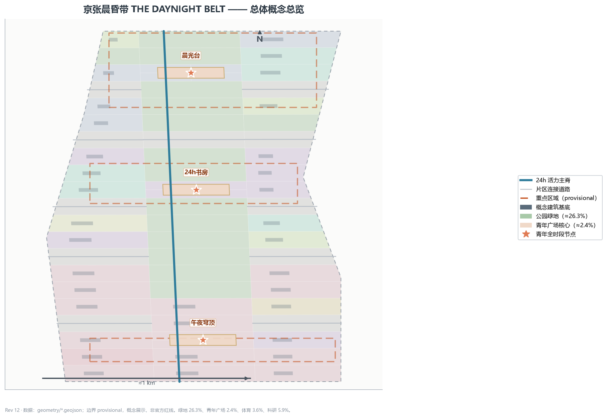
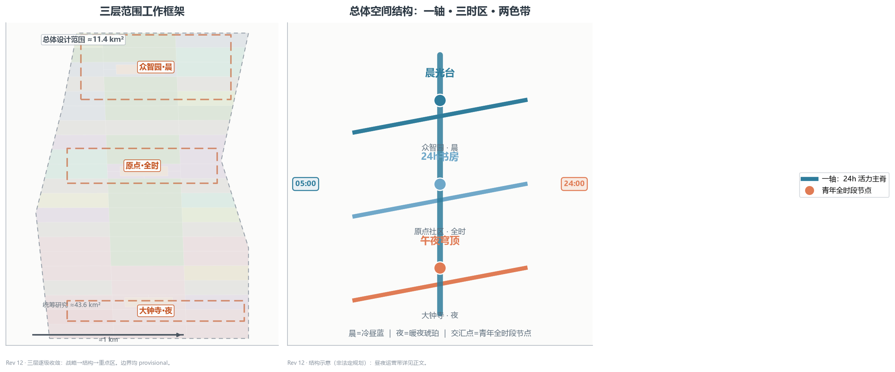
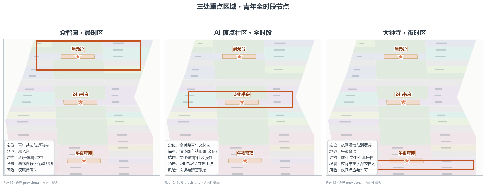
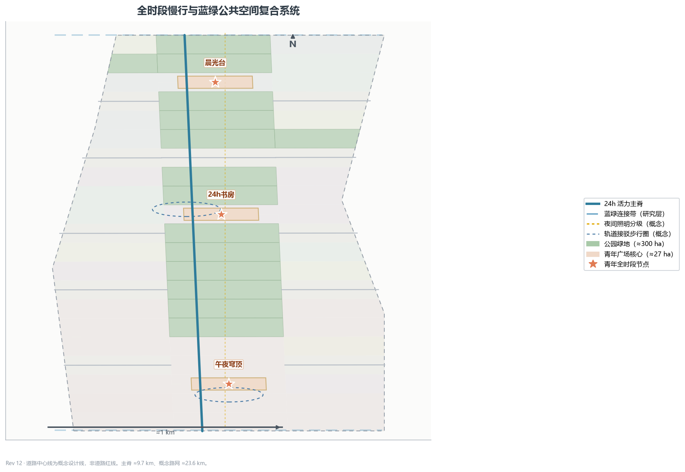
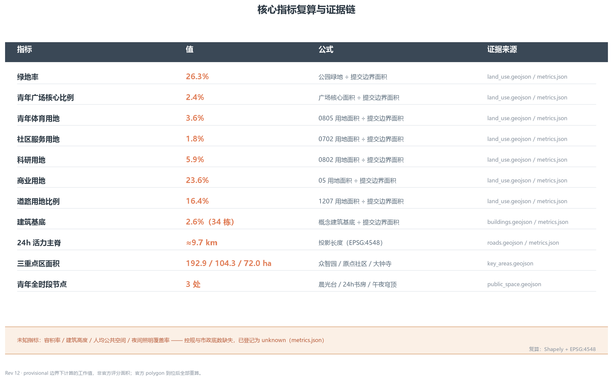

# 京张晨昏带 · THE DAYNIGHT BELT：与城市的时间契约

> **一句话判断**：1909 年京张铁路用一台蒸汽机车和一个"人字线"翻越了八达岭的山，今天的人工智能城市要翻越的是"一天的时间"——清晨到深夜，京张带都应该有可停留、可共创、可运动、可社交的青年公共空间。本方案以晨昏线为时间母题，把遗址公园带组织为 24 小时青年友好公共空间带 [data:geometry/site_boundary.geojson#SITE-001] [metric:site_area_sqm]。

## 设计依据与资料清单

**独立第二概念声明**：本方案为同一作者的第二个独立概念（独立提交资格，多概念并投为先例所允许）。两案共享同一征集场地边界与 3×21 网格划分方法，主脊、道路与分期骨架及部分地块几何因同一场地而直接沿用（几何图层已如实标注）；但**概念母题、功能配比、场景卡、画像、地标与运营品牌独立**——本方案以时间（晨昏线）为组织原则，通过 16 个地块重分类并新增绿地/体育/广场用地，使功能配比显著不同（绿地 26.3% vs 22.3%、青年广场核心 2.4% vs 1.6%、体育 3.6% vs 无、科研 5.9% vs 13.7%），场景、画像与地标全部为青年友好专属设计；两案并列送审，互为补充而非改版。

本 formal 方案以《百年京张AI创新带城市设计国际方案征集资格预审公告》为第一依据，并以 `brief/site-package/` 中经维护者登记的临时粗略边界、重点区域、枚举、指标和来源清单为机器可读依据。AI agent 在生成方案前读取 `design_brief.json`、`allowed_design_space.json`、`sources.json`、`enums/`、`ranges/`、`schemas/`、`data/source_registry.json` 与 `data/processed/agent_fact_pack.md`，并用 `project_scope_summary.csv`、`agent_task_requirements.csv`、`source_use_matrix.csv`、`missing_data_checklist.csv` 建立任务、范围、资料用途和缺口清单。公告要求方案达到控制性详细规划的城市设计深度和规划综合实施方案的城市设计深度，因此文本叙述不能替代 GeoJSON、指标表、A3 文册、A0 展板和 HTML 电子展示成果 [source:OFFICIAL-ANNOUNCEMENT] [source:AGENT-TASKBOOK] [depth:existing_conditions_diagnosis]。

资料登记表的使用边界如下 [source:SOURCE-REGISTRY]：`data/source_registry.json` 登记公开、清权与临时资料的用途边界；agent 不得把 background_only 或 provisional_only 资料升级为 official boundary、法定控规、正式评分依据或政府实施承诺。`data/processed/agent_fact_pack.md` 是本方案的阅读导航层，不是新的权威来源 [source:PROCESSED-FACT-PACK]。事实判断回到已登记的原始材料，完整来源关系由 `sources.json` 保存。

本脚手架在官方 `SITE_BOUNDARY` 或三处 `KEY_AREA` 尚未取得时，使用 `brief/site-package/geometry/provisional_boundaries.geojson` 生成临时 formal 包。提交包中的 `geometry/site_boundary.geojson` 与 `geometry/key_areas.geojson` 均标注为 `provisional_constraint`、`official_boundary=false`，只能用于方案生成、自检、可视化和设计讨论，不能作为 official redline、审批依据、精确面积依据或法定控制结论。该组织方数据缺口不阻断内容评分；替换 official polygons 后，site boundary、key areas、land use、roads、green space、public space、buildings、phasing 和 metrics 均需重算 [data:geometry/site_boundary.geojson#SITE-001] [metric:key_area_count]。因此正文中的空间结构、场景、项目和指标均按"可讨论、可复核、可替换官方边界后重算"的原则写入。

## 三层范围工作框架

方案按公告确定的三个层次组织工作：统筹研究范围关注 43.6 平方公里的 AI 产业生态、青年创新人口、战略定位和未来城市形态；总体设计范围关注 11.4 平方公里京张遗址公园周边城市地区，要求形成城市更新总体框架、青年友好公共空间布局、交通市政支撑和城市风貌控制；重点区域范围关注三处详细设计地区（公告文本面积合计约 368.4 ha，几何复算约 369.3 ha），要求明确功能业态、建筑规模、拆改留分类、公共空间连通和交通组织。三层范围在 `compliance_matrix.json` 中逐条映射，保证公告 1.3、1.4、1.5 与 agent.1-agent.6 的必选任务都有章节、图层、指标、图纸和 HTML 证据 [depth:three_level_scope_framework] [depth:overall_spatial_structure]，任务依据见 [standard:PROJECT-OFFICIAL-ANNOUNCEMENT]，范围导航见 [source:PROCESSED-FACT-PACK]。

三层工作不是互相割裂的图纸集合。统筹研究决定青年友好城市与时间契约的判断，总体设计把判断落实到 24 小时活力主脊、三时区节点和设施承载，重点区域详细设计验证具体地块、建筑、交通、公共空间和 AI 应用场景的可实施性。agent 生成方案时必须先锁定当前提交采用的 provisional 边界和约束，再生成用地、建筑、道路、绿地、公共空间、分期和 AI 服务节点，最后从这些图层复算指标并在正文解释哪些结论仍受 provisional boundary 限制 [data:geometry/land_use.geojson#LU-001] [data:geometry/roads.geojson#ROAD-001]。

| 层级 | 设计问题 | 方案回答 | 数据落点 |
| --- | --- | --- | --- |
| 统筹研究范围 | 青年友好城市形态与时间契约如何组织 | 建立"晨醒—全时—夜活"的全时段生活链与青年创新生态 | compliance_matrix.json、standard_matrix.json |
| 总体设计范围 | 24h 公共空间与城市更新如何落图 | 用地、建筑、道路、绿地、公共空间和分期图层共同表达 | [data:geometry/land_use.geojson#LU-001]、[data:geometry/roads.geojson#ROAD-001] |
| 重点区域范围 | 三处片区如何达到详细设计深度 | 分别提出晨/全时/夜定位、空间动作、AI 场景和实施依赖 | [data:geometry/key_areas.geojson#PROV-KEY-001]、[data:geometry/key_areas.geojson#PROV-KEY-002]、[data:geometry/key_areas.geojson#PROV-KEY-003] |

## 统筹研究范围产业与未来城市研究

### 命名体系与 Logo 方向（agent.1）

主名称"京张晨昏带 / THE DAYNIGHT BELT"，副题"与城市的时间契约"。Logo 方向为一条晨昏线渐变双色带：冷昼蓝（#2E7C9B）与暖夜琥珀（#E07B54）相接，交汇点化为圆，延展为"晨昏节"年度活动标识 [depth:brand_identity_and_logo_direction]。命名体系不与任何注册标识冲突，Logo 仅为文字方向说明，非商标注册；风格呼应"工业记忆 + 青年生活"双声部，在公共空间导视、活动海报与数字界面中保持一致的昼夜双色语汇 [source:AGENT-TASKBOOK] [standard:PROJECT-AGENT-OPEN-CALL-TASKBOOK]。

### 三大定位、五大功能与三时区运营回路（agent.1）

命名体系之上，本方案按任务书补齐三大定位、五大功能与协同回路：

- **三大定位**：百年京张文化带——以遗址公园与铁路"时间性"承载城市记忆；都市 AI 生活体验带——让 AI 场景进入青年日常而非停留在口号；青年友好融合创新带——以青年为尺度的创新与生活融合。
- **五大功能**：创新策源（众智园晨时区共创工坊与开源工作站）、青年培育（原点社区 24h 书房、教育与社区服务）、夜间活力（大钟寺午夜穹顶、夜间市集与照明分级）、文化体验（京张时间性叙事线与朝圣地标）、公共服务（社区服务节点、无障碍慢行与安全兜底）。
- **三时区协同回路**：晨（众智园）—全时（原点）—夜（大钟寺）沿 24h 主脊串联，叠加中关村科技服务翼（创新要素、资本与 IP 供给）与小月河场景赋能翼（场景测试与公共体验路径），形成"供给—参与—转化—反馈"的运营回路 [depth:regional_synergy_circuit] [source:AGENT-TASKBOOK]。

### 青年友好定位与"与城市的时间契约"

征集公告明确要求"塑造京张遗址公园活力带，促进东西缝合、南北连通、公共空间活化和青年友好"[source:OFFICIAL-ANNOUNCEMENT]。本方案把"青年友好"从口号转译为可设计、可复核的空间对象：一是**时间友好**——公共空间与设施按晨/全时/夜三时段运营，夜间有照明分级、安全兜底与活力业态；二是**设施友好**——体育、社区服务、青年广场与 24h 书房形成可步行到达的设施带 [metric:sport_land_ratio] [metric:land_use_community_service_area_sqm]；三是**参与友好**——青年共创基金、晨昏节与场景开放机制让青年成为空间运营的共建者而非仅使用者 [depth:regional_synergy_circuit]。

### AI 创新生态与青年友好城市案例（agent.2，6 例）

- 硅谷与旧金山湾区：高校—资本—企业协同的全栈创新生态，青年人才自由流动；可转化经验——众智园全栈自主加速体系与青年人才服务 [metric:case_study_count]。
- 深圳南山：硬件创业生态与青年双创密度，低成本公共创新载体降低试错门槛；可转化经验——众智园共创工坊与开源工作站。
- 杭州滨江：平台生态与场景开放，数字经济龙头带动中小企业协同；可转化经验——场景开放五步机制与青年共创基金。
- 成都：夜间经济与街头活力，AI+ 生活服务在真实街巷验证；可转化经验——大钟寺夜时区 AI 生活体验带 [metric:land_use_commercial_area_sqm]。
- 东京涩谷：站城一体与全时段活力，轨交节点承载青年创新社群；可转化经验——原点社区 24h 书房与轨道接驳 [data:geometry/public_space.geojson#PS-11-01]。
- 柏林：共享公共空间与开放数据，低门槛公共设施激活自组织创新；可转化经验——青年广场组件库与预约制使用 [metric:land_use_community_service_area_sqm]。

以上案例均为公开文献层面的方法借鉴，不作为规划依据；本方案不声称复制任何城市的具体制度或设施 [source:AGENT-TASKBOOK] [standard:PROJECT-AGENT-OPEN-CALL-TASKBOOK]。

**AI 创新生态图谱与要素机制（agent.2）**：以"高校策源—开源协作—企业转化—公共体验—国际传播"为创新链，围绕土地、空间、产业、资金、人才、算力、数据、场景八类要素组织：众智园承担全栈自主创新加速（算力、中试、标准），原点社区承担近校成果转化与开源生态，大钟寺承担智能原生新业态与内容消费转化，中关村科技服务翼供给资本、IP 与全球要素，小月河场景赋能翼提供场景测试与公共体验路径 [depth:regional_synergy_circuit] [source:AGENT-TASKBOOK]。科研用地 5.9% 聚焦算力、中试与标准等关键环节，其余研发功能以混合载体在文化/商业/教育用地中承载，避免科研用地虚高。

### 未来 AI 城市形态判断：全时段生活带

AI 城市形态的一个关键判断是：城市不再按"办公时段"运转，而是按**生活节律**运转——青年群体的工作、学习、运动、社交在一天中交错分布，公共空间必须支持这种时序复用。本方案把京张带组织为"全时段生活带"：主脊是 24h 活力主轴，三时区节点分别承担晨、全时、夜的生活功能，AI 场景（预约、识别、照明、导视）作为时序管理的使能层。这一判断是设计建议而非对未来的确定性预测，相关运营指标（夜间照明覆盖率、人均公共空间等）在官方数据补齐前保持 unknown [metric:night_lighting_coverage_ratio] [standard:GENERATIVE-AI-INTERIM-MEASURES]。

## 总体设计范围城市更新与控规深度城市设计

### 总体空间结构：一轴三时区两色带

总体空间结构为"**一轴 · 三时区 · 两色带**"：一轴是京张遗址公园 24h 活力主脊（绿带 + 慢行 + 照明分级），串联三座青年全时段节点广场 [data:geometry/roads.geojson#ROAD-005] [metric:spine_length_m]；三时区是众智园晨时区（北，晨—午）、原点社区全时段（中，全时段）、大钟寺夜时区（南，午—夜）[data:geometry/key_areas.geojson#PROV-KEY-001] [data:geometry/key_areas.geojson#PROV-KEY-002] [data:geometry/key_areas.geojson#PROV-KEY-003]；两色带是冷昼蓝与暖夜琥珀的昼夜双色语汇，随晨昏线渐变，交汇点化为节点圆。结构与"人字带"的空间几何组织（一轴三字两翼）在组织原则上完全不同：本方案以**时间**为组织维度，空间只是时间节律的载体 [depth:overall_spatial_structure]。

### 用地布局与功能比例

用地方案以青年友好公共生活为导向，与产业导向方案明显区分：公园绿地 26.3%（299.8 ha）[metric:green_ratio]、青年广场核心 2.4%（27.0 ha）[metric:public_space_ratio]、体育用地 3.6% [metric:sport_land_ratio]、社区服务用地 1.8% [metric:land_use_community_service_area_sqm]、科研用地 5.9% [metric:land_use_research_area_sqm]。商业 23.6%、文化 9.2%、教育 7.7%、居住 1.6%、医疗 1.7%、道路 16.4% 等其余比例及复算公式完整保存在 `metrics.json`。绿地、广场、体育与社区服务合计约 34%，是"公共生活带"的核心底盘；三座 300m 青年广场核心分置于三处重点区 [data:geometry/public_space.geojson#PS-18-01] [data:geometry/public_space.geojson#PS-11-01] [data:geometry/public_space.geojson#PS-02-01]。

### 建筑规模与更新逻辑

建筑基底按"可讨论、可复核"的概念级表达：34 栋概念建筑基底合计约 2.6% 建筑基底率 [metric:building_footprint_ratio] [metric:building_count]，角色覆盖青年人才住区、社区青年服务设施、AI 研发加速楼宇、24h 青年文化书房、青年体育设施与青年友好商业综合体 [data:geometry/buildings.geojson#BLD-001] [depth:retain_renovate_demolish]。更新逻辑以"存量改造 + 轻量运营"为先：众智园存量楼宇改造为青年共创载体，大钟寺街区更新为青年友好商业界面，均不预设大规模拆建；建筑高度、容积率等强度指标在控规条件缺失前保持 unknown [metric:floor_area_ratio] [standard:MOHURD-CONTROL-DETAILED-PLANNING]。

## 重点区域详细设计

三处重点区域详细设计必须引用 [data:geometry/key_areas.geojson#PROV-KEY-001]、[data:geometry/key_areas.geojson#PROV-KEY-002]、[data:geometry/key_areas.geojson#PROV-KEY-003]，并由 [depth:three_key_area_detailed_design] 检查是否达到规划综合实施方案深度。三处重点区均以一座青年全时段节点广场为核心，按晨/全时/夜差异化组织功能、场景与运营 [metric:key_area_count]。

### 众智园 · 晨时区（青年共创/运动/开源工作站）

定位为青年共创与运动带（晨—午时段），核心是**晨光台**青年广场 [data:geometry/public_space.geojson#PS-18-01] [data:geometry/public_space.geojson#YOUTH-003] [metric:zhongzhiyuan_area_sqm]。空间动作为科研、体育与绿带复合，围绕晨光台组织晨练广场、运动场与开源晨会工位；场景覆盖晨跑伴行（S01）、晨间运动健康识别（S02）与青年共创工坊（S08）；更新以存量楼宇改造为主。风险为存量权属复杂，需逐地块确认 [data:geometry/key_areas.geojson#PROV-KEY-001]。

### AI 原点社区 · 全时段（文化/自习/分享）

定位为全时段青年文化芯，核心是**24小时书房**青年广场 [data:geometry/public_space.geojson#PS-11-01] [data:geometry/public_space.geojson#YOUTH-002] [metric:beijing_ai_origin_area_sqm]。清华园车站旧址为文化锚点——京张铁路 1909 年全线通车后，清华园车站于 1910 年为清华学校增建，詹天佑督建并题写站名；其保护范围一律以文物部门公布为准，本方案仅在文保边界外提出文化叙事与慢行缝合，不预设任何拆改 [standard:PROJECT-OFFICIAL-ANNOUNCEMENT] [depth:three_key_area_detailed_design]。结构为文化、教育与社区服务围绕 24h 书房广场；场景覆盖 24h 书房（S04）、深夜自习舱（S06）与开发者夜宵沙龙（S12）。风险为文保与高校权属高度敏感，需专业逐项确认 [data:geometry/key_areas.geojson#PROV-KEY-002]。

### 大钟寺 · 夜时区（青年消费/夜间活力/社交）

定位为夜间活力与消费带（午—夜时段），核心是**午夜穹顶**青年广场 [data:geometry/public_space.geojson#PS-02-01] [data:geometry/public_space.geojson#YOUTH-001] [metric:dazhongsi_area_sqm]。空间动作为青年友好商业街区更新与夜间照明分级，围绕午夜穹顶组织夜间活力市集（S07）、夜间照明自适应（S05）与深夜自习舱（S06）；结构为商业、文化与少量居住复合，并引入**智能原生新业态**（AI 导购、无人零售、智能终端与内容消费展示，概念级，不预设拆建）[source:AGENT-TASKBOOK] [metric:land_use_commercial_area_sqm]。风险为夜间噪音与运营许可需市场与规划双确认，本方案将其列为实施前提而非已批准安排 [data:geometry/key_areas.geojson#PROV-KEY-003] [depth:risk_missing_data]。

## AI 创新生态、人才画像与 AI+ 场景

### 六类青年画像（agent.3）

方案以六类青年画像组织空间与服务响应，每类画像对应明确的空间节点与 AI 场景 [metric:user_persona_count]。

| 画像 | 典型人群 | 核心需求 | 对应空间 |
| --- | --- | --- | --- |
| P1 学生 | 高校在读、通勤青年 | 自习、低价消费、慢行通学 | 原点 24h 书房、主脊慢行 |
| P2 创业者 | 青年初创团队 | 低成本工位、路演、社群 | 众智园共创工坊、晨光台 |
| P3 开发者 | 开源与 AI 从业者 | 24h 协作、夜宵、社区荣誉 | 开发者夜宵沙龙、晨昏共创榜 |
| P4 夜猫族 | 夜间活跃青年 | 夜间活力、安全照明、社交 | 大钟寺午夜穹顶、夜间市集 |
| P5 带娃青年 | 年轻家庭 | 亲子晨间活动、安全公共空间 | 亲子晨光站、滑板广场 |
| P6 银发游客 | 晨间活动长者 | 晨游、无障碍慢行、人工服务 | 银发晨游带、主脊驿站 |

除六类青年画像外，方案同时服务既有居民与弱势群体：社区服务用地节点（1.8%）承载老人日间照料与儿童看护，无障碍慢行带与人工导览覆盖残障与长者需求，夜间照明分级与安全值守兼顾夜间通勤安全 [standard:BARRIER-FREE-ENVIRONMENT-LAW] [metric:land_use_community_service_area_sqm] [metric:land_use_residential_area_sqm]。

### 十二张青年场景卡（含 3 张测试验证，agent.3）

所有场景卡全部场景仅为概念性设计建议，当前均未部署、未授权、未运行；均有手工等价路径与人工整体关停条件，每个场景均对应到已注册的公开场景类型与空间节点 [source:AGENT-TASKBOOK] [standard:PROJECT-AGENT-OPEN-CALL-TASKBOOK] [metric:scenario_card_count]。

**测试验证场景（3，含产业级路测与生活算法验证）**：

| 卡号 | 场景 | 空间节点 | 注册类型 | 隐私/人工边界 |
| --- | --- | --- | --- | --- |
| S01 | 晨跑伴行 | 众智园主脊段 | ai-traffic-walkability | 聚合路况，无个人轨迹画像 |
| S02 | 晨间运动健康识别 | 晨光台运动场 | ai-health-service-navigation | 仅聚合运动统计，人工兜底 |
| S03 | 低速无人配送与共享设施联动测试 | 大钟寺—原点主脊段 | robot-delivery-low-speed | 限定路段时段，人工接管兜底 |

**城市生活场景（9）**：

| 卡号 | 场景 | 空间节点 | 注册类型 | 隐私/人工边界 |
| --- | --- | --- | --- | --- |
| S04 | 24 小时书房 | 原点 24h 书房广场 | ai-cultural-guide | 公开资源聚合，无个人画像 |
| S05 | 夜间照明自适应 | 全带公共空间 | ai-traffic-walkability | 传感仅聚合，人工值守兜底 |
| S06 | 深夜自习舱 | 原点社区·大钟寺 | ai-cultural-guide | 预约制，监控仅聚合 |
| S07 | 夜间活力市集 | 午夜穹顶广场 | ai-cultural-guide | 摊位公开信息，无追踪 |
| S08 | 青年共创工坊 | 众智园晨光台 | ai-cultural-guide | 内容由共创者自决 |
| S09 | 亲子晨光站 | 主脊亲子节点 | ai-health-service-navigation | 儿童数据不采集 |
| S10 | 滑板广场 | 众智园体育用地 | ai-traffic-walkability | 设施使用聚合统计 |
| S11 | 银发晨游带 | 主脊晨间绿带 | ai-health-service-navigation | 人工导览等价路径 |
| S12 | 开发者夜宵沙龙 | 原点社区夜间节点 | enterprise-service-copilot | 活动报名最小信息 |

### 场景—空间—运营映射（agent.3）

每个场景均落到具体空间图层与运营边界：公共空间场景引用 [data:geometry/public_space.geojson#PS-11-01]，慢行与交通场景引用 [data:geometry/roads.geojson#ROAD-005]，开放空间场景引用绿地图层与 `metrics.json` 中的公共空间比例指标。运营主体统一为"公共运营平台 + 专业公司 + 社区共治"，测试验证类场景风险等级为"高—需许可"，全部场景有清晰的人工复核点 [metric:public_space_ratio] [depth:scenario_space_operation_matrix]。

## 用地、建筑规模与拆改留方案

用地方案依据 [standard:MNR-LAND-USE-CLASSIFICATION-GUIDE] 表达为完整、闭合、无缝的用地分区，75 个概念地块覆盖提交边界且无重叠 [metric:land_use_polygon_count]。用地结构以青年友好公共生活为第一优先级：绿地 26.3%、青年广场核心 2.4%、体育 3.6%、社区服务 1.8% 构成约 34% 的公共/活动底盘，科研与商业占比相应下调至 5.9% 与 23.6%，形成与产业导向方案不同的功能配比 [data:geometry/land_use.geojson#LU-001] [metric:land_use_green_area_sqm] [metric:land_use_plaza_area_sqm]。

建筑高度、体量、界面和风貌控制由 [depth:height_massing_character] 管理，拆改留方法由 [depth:retain_renovate_demolish] 管理；建筑基底的主要证据是 [data:geometry/buildings.geojson#BLD-001] 与 [metric:building_footprint_area_sqm]。由于缺少现状建筑、权属、控规和工程条件，方案只提出方法与待校准清单，不编造拆改留结论 [metric:total_floor_area_sqm]；容积率、建筑高度、建筑密度等均保持 `status=unknown`，待正式控规数据到位后复算 [metric:floor_area_ratio] [metric:building_height_control_m]。

## 交通、轨道、市政与公共服务设施

### 全时段慢行与夜间照明（青年友好）

交通方案以"24h 活力主脊"为骨架 [data:geometry/roads.geojson#ROAD-005] [metric:spine_length_m]，回应公告对轨道站点一体化、道路微循环、慢行断点和绿色交通系统的要求，覆盖北五环、京张遗址公园跨环路节点、五道口、清华东路西口、大钟寺站及重点企业周边交通联系。主脊 24h 运营的关键配套是**夜间照明分级**：主脊高亮、节点柔和、边缘安全兜底，照明策略仅为概念原则，实际覆盖率指标（night_lighting_coverage_ratio）因缺市政照明底数与亮度标准保持 unknown [metric:night_lighting_coverage_ratio] [depth:traffic_rail_slow_parking]。道路中心线为概念设计线，非道路红线 [data:geometry/roads.geojson#ROAD-001] [metric:road_ratio]。

### 轨道接驳、市政与新型基础设施

大钟寺站与清华东路西口周边组织轨道接驳步行圈（概念）[data:geometry/public_space.geojson#PS-02-01] [depth:traffic_rail_slow_parking]；市政与新型基础设施以"智慧灯杆 + 端侧算力"为载体沿带布设，服务夜间照明、场景识别与公共服务 [depth:municipal_new_infrastructure] [data:geometry/constraints.geojson#CON-001]。缺少管线、能源、排水、防洪、消防等工程资料时，均列为正式深化前置条件，不写成工程结论 [data:geometry/constraints.geojson#CON-PROV-RESEARCH-001]。

## 蓝绿空间、公共空间与城市风貌

### 蓝绿空间与 24h 公共空间系统

以京张遗址公园活力带为骨架统筹清河、小月河与南北贯通、东西连通的步道、骑行道和绿色空间体系，15 处绿地单元合计 26.3%（299.8 ha）[data:geometry/green_space.geojson#GS-05-01] [metric:green_ratio] [metric:green_space_feature_count]。绿地与广场在"时间"维度复用于不同人群：晨间服务晨练与银发晨游，日间服务自习与会议，夜间服务活力市集与安全慢行 [depth:blue_green_public_space] [data:geometry/public_space.geojson#PS-18-01]。**东西缝合**：以五道口、清华东路西口、北五环跨环路节点为缝合点，通过 6 条东西向慢行联络线（跨遗址公园过街通道、桥下空间与绿带横贯步道）缝合两侧校区、园区与社区，缓解京张铁路遗址形成的南北向城市割裂 [depth:traffic_rail_slow_parking] [data:geometry/roads.geojson#ROAD-001] [data:geometry/constraints.geojson#CON-001]。

### 城市风貌与青年朝圣地标（agent.4，3 座）

风貌基调为"工业记忆 + 青年生活"双声部：京张铁路历史要素以信息牌与叙事线呈现，不干预文保本体。三座青年朝圣地标/荣誉展示节点（概念级）[depth:ai_landmark_catalog] [metric:youth_landmark_count]：

1. **晨光台**（众智园青年广场，北）：晨练、晨市与"第一缕光"观景平台，设青年共创荣誉墙 [data:geometry/public_space.geojson#YOUTH-003]；
2. **24 小时书房**（原点青年广场，中）：全时段自习/阅读/分享，设晨昏共创榜（共创—署名—再共创）[data:geometry/public_space.geojson#YOUTH-002]；
3. **午夜穹顶**（大钟寺青年广场，南）：夜间活力主舞台，设昼夜生活的共鸣装置 [data:geometry/public_space.geojson#YOUTH-001]。

三座地标均不预设建筑形态、高度或投资，属概念级意向，不构成任何已批准的建设事项；无障碍与适老化按 [standard:BARRIER-FREE-ENVIRONMENT-LAW] 与 [standard:ELDERLY-SMART-TECH-PLAN-2020-45] 的要求执行，具体以主管部门规定为准。

### 公共空间组件库（agent.4）

提出可复用的青年公共空间组件：24h 座椅（含电源与 Wi-Fi）、可预约共享台、晨昏线双色导视、夜间照明分级灯具、亲子安全护栏与无障碍通行带。组件以标准件方式部署，支持分时复用与模块替换 [depth:signage_system_direction] [data:geometry/public_space.geojson#PS-11-01] [metric:public_space_feature_count]。

### 场景卡扩展表（S01—S12，agent.4）

| 卡号 | 场景 | 空间节点 | 服务画像 | 运营主体（概念） | 风险等级 | 人工复核点 |
| --- | --- | --- | --- | --- | --- | --- |
| S01 | 晨跑伴行 | 众智园主脊段 | P1、P3 | 公共运营平台＋专业公司 | 高—需许可 | 晨跑路线安全与照明分级复核 |
| S02 | 运动健康识别 | 晨光台运动场 | P1、P2 | 公共运营平台＋专业公司 | 高—需许可 | 健康数据聚合与脱敏复核 |
| S03 | 低速无人配送联动测试 | 大钟寺—原点主脊段 | P1、P3 | 公共运营平台＋专业公司 | 高—需许可 | 路测许可与安全评估复核 |
| S04 | 24 小时书房 | 原点 24h 书房广场 | P1、P4 | 公共运营平台＋文化机构 | 低 | 开放时间与安全值守复核 |
| S05 | 夜间照明自适应 | 全带公共空间 | P4、P6 | 市政＋公共运营平台 | 低 | 照明分级与能耗复核 |
| S06 | 深夜自习舱 | 原点·大钟寺 | P1、P4 | 公共运营平台＋社区共治 | 中 | 预约与值守人工复核 |
| S07 | 夜间活力市集 | 午夜穹顶广场 | P4、P2 | 公共运营平台＋商户 | 中—需许可 | 市集许可与安全复核 |
| S08 | 青年共创工坊 | 众智园晨光台 | P2、P3 | 公共运营平台＋共创社群 | 低 | 内容边界人工复核 |
| S09 | 亲子晨光站 | 主脊亲子节点 | P5 | 公共运营平台＋社区 | 低 | 儿童安全与人工值守复核 |
| S10 | 滑板广场 | 众智园体育用地 | P1、P4 | 公共运营平台＋运动社群 | 中 | 设施安全巡检复核 |
| S11 | 银发晨游带 | 主脊晨间绿带 | P6 | 公共运营平台＋志愿者 | 低 | 无障碍与人工导览复核 |
| S12 | 开发者夜宵沙龙 | 原点夜间节点 | P3 | 公共运营平台＋开发者社区 | 低 | 活动报名与内容复核 |

## 百年京张的时间性、中关村与 AI 新文化融合叙事（agent.5）

京张铁路 1909 年全线通车，是中国人自行设计建造的第一条干线铁路；青龙桥人字线（1905—1909 修建）是詹天佑为解决八达岭坡道难题设计的折返线（历史依据为公开铁路史料，本方案仅作背景引用，不作为规划依据），其意义不仅是工程奇迹，更是一次对"翻山时间"的压缩——它让张家口与北京之间的一天变成几个小时 [source:AGENT-TASKBOOK]。清华园车站于 1909 年通车后、1910 年为清华学校增建，站名由詹天佑督建并题写；其站名与建筑是"铁路进入学院生活"的时间印记。

中关村则是中国创新创业的时间印记——从 1980 年代的"电子一条街"到今天的 AI 策源地，它把"敢为人先"写进城市基因，成为本方案"创新时间"的注脚 [source:AGENT-TASKBOOK]。本方案的叙事主线是：**铁路压缩了"翻山的时间"，AI 城市重新分配"一天的时间"**。1909 年人字线让火车在坡道上折返上行，2026 年的京张带应让青年的生活在晨昏之间折返穿行——清晨在晨光台跑步，日间在 24h 书房自习，夜间在午夜穹顶社交。这是一份"青年与城市的时间契约"：城市承诺全时段可停留、可安全的公共空间，青年承诺成为空间的共建者与守护者 [depth:brand_identity_and_logo_direction]。全部历史表述均为真实可考的城市记忆点，保护范围以文物部门公布为准 [standard:PROJECT-OFFICIAL-ANNOUNCEMENT]。

## 更新项目清单、实施政策与分期计划

### 概念更新项目清单

| 项目编号 | 项目名称 | 类型 | 主要依赖 | 证据引用 |
| --- | --- | --- | --- | --- |
| DN-01 | 主脊 24h 慢行贯通与照明分级 | 公共空间/交通 | 道路红线、桥下空间、照明底数 | [data:geometry/roads.geojson#ROAD-005] |
| DN-02 | 晨光台青年广场（众智园） | 青年公共空间 | 存量权属、控规条件 | [data:geometry/public_space.geojson#PS-18-01] |
| DN-03 | 24h 书房广场（原点社区） | 青年公共空间 | 文保边界、高校权属 | [data:geometry/public_space.geojson#PS-11-01] |
| DN-04 | 午夜穹顶与夜间活力街区（大钟寺） | 更新/运营 | 夜间许可、商业权属 | [data:geometry/public_space.geojson#PS-02-01] |
| DN-05 | 青年体育与滑板设施带 | 体育设施 | 体育用地条件、运营主体 | [data:geometry/land_use.geojson#LU-001] |
| DN-06 | 社区青年服务节点 | 社区服务 | 社区权属、服务运营商 | [data:geometry/buildings.geojson#BLD-001] |

各项目实施阶段与牵头主体对应 P1-P3 分期与运营章节；资金与审批路径待正式深化时补足。项目清单与分期深度由 [depth:renewal_project_list] 与 [depth:phasing_implementation] 管理，分期空间证据为 [data:geometry/phasing.geojson#PH-P1] [data:geometry/phasing.geojson#PH-P2] [data:geometry/phasing.geojson#PH-P3]。如果没有权属、资金、实施主体和审批路径，方案把它写成实施风险，而不是承诺落地 [metric:phase_p1_area_sqm] [metric:phase_p2_area_sqm] [metric:phase_p3_area_sqm]。

### 晨昏节运营与长期运营（agent.6）

长期运营提出"晨昏节"全时段活动体系（概念建议）：晨跑月（3—4 月）、24h 读书周（7 月）、夜活力季（9—10 月高峰），并配套**青年共创基金**（概念），资助沿带共享设施、夜间业态与社区共创提案，机制为"提案—评审—试点—评估—扩大/收回"，每个场景都具备人工整体关停条件。**开发者社区运营**：开放数据接口并维护开源地图，开发者贡献以"晨昏共创榜"呈现（共创—署名—再共创）；**国际传播**：多语言导览、国际开发者沙龙与晨昏节海外传播，传播素材均经清权；**招引转化**：青年共创基金作为招引抓手，沿"提案—试点—评估—落地"路径把创意转化为在地业态与运营主体。运营对象、频率、责任边界与转化路径在 A3 文册与 HTML 中展开，全部内容均为概念建议，不构成已批准的政府活动或实施安排 [depth:phasing_implementation] [depth:risk_copyright_compliance]。

## 指标体系、面积复算与合规矩阵

指标体系至少覆盖总体设计范围面积、重点区域面积、绿地与公共空间比例、体育与社区服务比例、建筑基底、24h 主脊长度、青年节点数量与自检状态。所有 known 指标均可从 GeoJSON 复算；unknown 指标（容积率、建筑高度、人均公共空间、夜间照明覆盖率）给出原因与正式提交前置条件。复算遵循 [depth:metrics_recalculation]，关键值见 [metric:site_area_sqm] [metric:public_space_ratio] [metric:sport_land_ratio]。

合规矩阵是任务响应性的主控文件。每条公告任务和 agent_taskbook 任务对应到报告章节、图层、指标、图纸、HTML 页面、来源、假设和自检项；未能覆盖公告 1.3、1.4、1.5 或 agent.1-agent.6 的任一必选任务，方案不得进入 formal professional scoring。指标分三类登记：可由提交几何直接复算的空间指标（如绿地比例、公共空间比例、分期面积）；需要官方控规支撑的管控指标（容积率、高度、退线）；需要运营数据校准的绩效指标（活动参与度、场景使用频次）。三类指标分别进入 `metrics.json`、`assumptions.json` 与 `compliance_matrix.json`，避免把运营愿景误写成审定规划条件 [data:geometry/green_space.geojson#GS-05-01]。

## 风险、版权与合规说明

**要求双语言。** 方案通过 `proposal.en.md` 提供完整对照译文；A3/A0、HTML 和含文字图件均提供对应语言副本。所有图片、图纸、图标、数据和代码资产在 `sources.json` 或 `report/copyright_statement.md` 中说明来源、许可和授权状态；HTML 页面完全离线，不加载远程脚本、远程地图瓦片、远程字体、iframe、表单或外部 API，不跟踪评审者行为 [depth:risk_copyright_compliance] [source:SITE-PACKAGE]。

风险与缺资料清单由 [depth:risk_missing_data] [data:geometry/constraints.geojson#CON-001] [source:SITE-PACKAGE] 共同校核：official boundary、key area、控规、道路、地块、建筑、市政、文保与公共服务缺口进入 `assumptions.json`、自检和正文风险章节。任何缺少官方控规、道路红线、权属、市政、消防或文保条件的结论，都降级为待确认事项。本方案不声称官方批准、审定控规、最终土地权属、最终建设规模或保证实施；AI agent 对事实、来源、版权、空间数据、指标和表达负责，维护者和专业评审可依据自检结果、空间复核和合规矩阵要求返修或拒绝 [standard:PROJECT-AGENT-OPEN-CALL-TASKBOOK]。

## 参考资料

- brief/public-brief.md
- brief/site-package/design_brief.json
- brief/site-package/allowed_design_space.json
- brief/site-package/enums/
- brief/site-package/ranges/planning_limits.json
- data/processed/agent_fact_pack.md
- data/processed/project_scope_summary.csv
- data/processed/agent_task_requirements.csv
- data/processed/source_use_matrix.csv
- data/processed/missing_data_checklist.csv
- 完整机器索引：见 `sources.json`、`metrics.json`、`compliance_matrix.json`、`standard_matrix.json` 与 `design_depth_matrix.json`
- 本节书目入口依据场地包登记，完整出处和许可见结构化来源清单 [source:SITE-PACKAGE]

<!-- build-rev-12 -->
