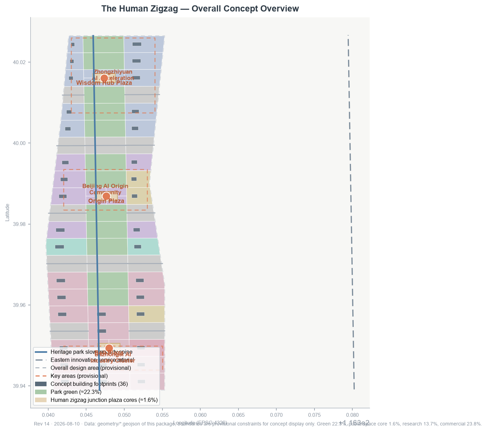
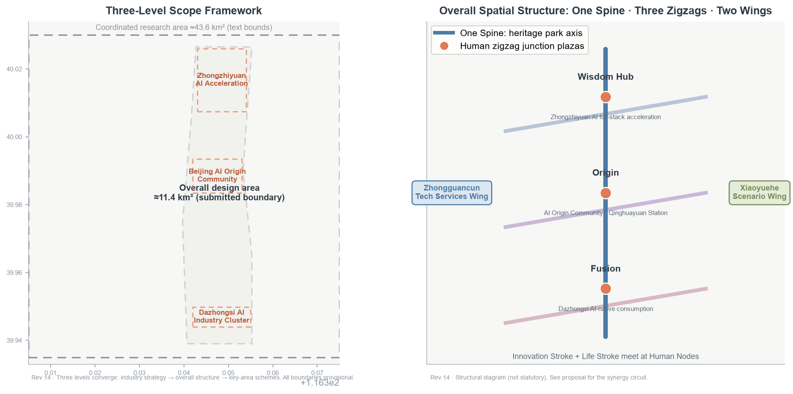
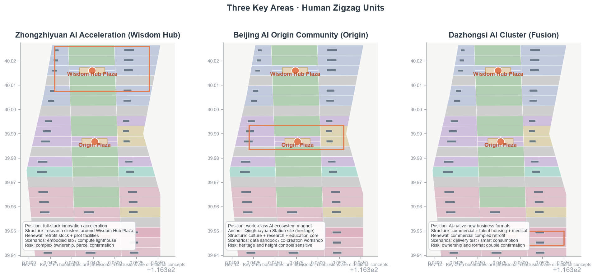
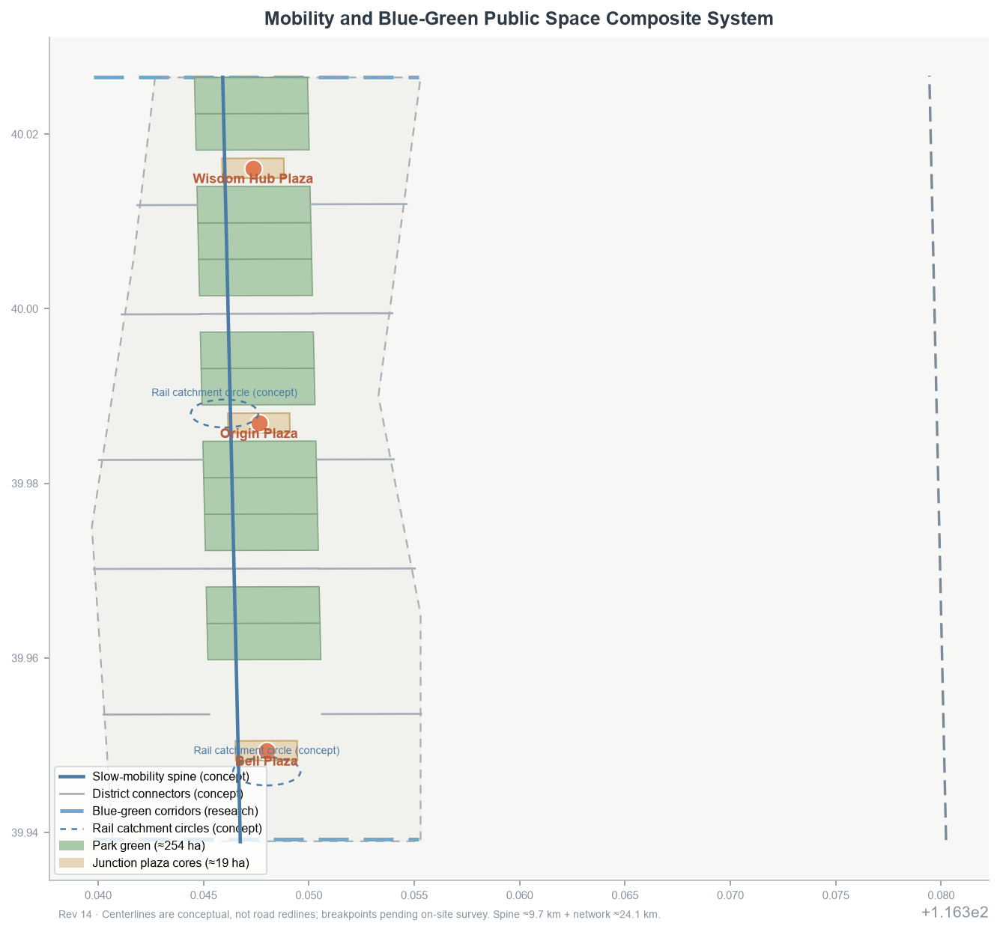
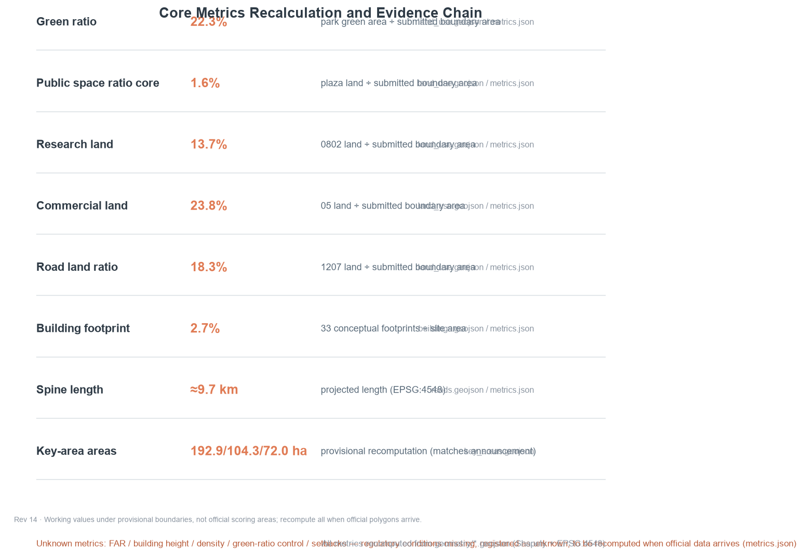

# The Human Zigzag: From the Switchback Rails to a City-Scale Zigzag

> **One-sentence judgment**: In 1909, Zhan Tianyou used a switchback ("ren-zi") line at Qinglongqiao to carry trains over Badaling; in 2026 the Jing-Zhang Belt should organize the city with the same ingenuity — one stroke for AI-driven industrial innovation, one for urban everyday life, and every intersection returning to people. This proposal elevates the switchback from rails to a city-scale structural motif: a readable, walkable, testable and reversible "Human Zigzag" [data:geometry/key_areas.geojson#PROV-KEY-001] [data:geometry/land_use.geojson#LU-001].

## Design Basis and Source Inventory

The proposal takes the Qualification Pre-Announcement for the Centennial Jing-Zhang AI Innovation Belt International Urban Design Open Call by the Haidian Branch of the Beijing Municipal Commission of Planning and Natural Resources as its primary basis [source:OFFICIAL-ANNOUNCEMENT], and the agent-facing open-call taskbook as its task basis [source:AGENT-TASKBOOK]. All materials are classified strictly per `data/source_registry.json` into formal-ready, background-only, and provisional-only categories [source:SOURCE-REGISTRY].

The official announcement text does not attach precise boundary polygons. This package uses the maintainer-provided provisional rough boundary and key-area polygons (`geometry_role=provisional_constraint`, `official_boundary=false`) solely for concept generation, visualization, and local self-check — not as an official redline, approval basis, or precise area basis [source:BOUNDARY-SOURCE] [source:KEY-AREA-SOURCE]. The organizer data gap does not block content scoring, but all precision-sensitive conclusions must be recomputed once official boundaries and regulatory conditions arrive [standard:PROJECT-OFFICIAL-ANNOUNCEMENT].

All spatial proposals are conceptual suggestions, reference schemes, or material for professional teams to deepen; they do not replace statutory planning or constitute government approval [source:AGENT-TASKBOOK]. The complete machine index (sources, metrics, standards, design depth, task coverage) lives in `sources.json`, `metrics.json`, `standard_matrix.json`, `design_depth_matrix.json` and `compliance_matrix.json`.

## Three-Level Scope Framework

Design depth is delivered progressively along the three levels defined by the announcement [source:OFFICIAL-ANNOUNCEMENT]:

1. **Coordinated Research Area (≈43.6 km²)**: bounded by the North Fifth Ring Road, Jingzang Expressway, Xizhimenwai Avenue and Wanquanhe Road. The work is industrial strategy and regional synergy: defining the Belt's role in Haidian and the Beijing-Tianjin-Hebei landscape, and outputting the three-areas-two-wings synergy circuit and regional innovation relations, without architectural detail [data:geometry/constraints.geojson#CON-PROV-RESEARCH-001].
2. **Overall Design Area (≈11.4 km²)**: the urban and industrial districts within 1–2 km around the Jing-Zhang Heritage Park. The work reaches regulatory-plan-level urban design: spatial structure, land use, renewal projects, transport, municipal systems, urban character and indicators. The submitted boundary is this level [data:geometry/site_boundary.geojson#SITE-001] [metric:site_area_sqm].
3. **Key Detailed Design Area (≈368.4 ha)**: from north to south, the Zhongzhiyuan AI Autonomous Innovation Acceleration Area, the Beijing AI Origin Community and the Dazhongsi AI Industry Cluster, at integrated-planning-scheme urban design depth [data:geometry/key_areas.geojson#PROV-KEY-001] [data:geometry/key_areas.geojson#PROV-KEY-002] [data:geometry/key_areas.geojson#PROV-KEY-003].

The three levels converge: industrial strategy decides the overall structure, the overall structure decides the key-area schemes, and the key-area schemes validate the structure in return. All three boundary levels are currently provisional rough polygons; after official polygons are supplied, all area-type metrics (`site_area_sqm`, key-area areas, land-use ratios) must be recomputed [depth:three_level_scope_framework].

## Coordinated Research Area: Industry and Future-City Study

### Naming System and Logo Direction (agent.1)

Primary name **“京张人字带 / The Human Zigzag”**, subtitle “From the Switchback Rails to a City-Scale Zigzag”. The naming system is “one stroke, one stroke, one person”:

- **Innovation Stroke (智线)**: the AI full-stack autonomous innovation system, anchored in Zhongzhiyuan and the Zhongguancun Technology Services Wing;
- **Life Stroke (悦线)**: urban everyday services and scenario experiences, anchored in Dazhongsi and the Xiaoyuehe Scenario Empowerment Wing;
- **Human Node (人字节点)**: the public space where each zigzag unit meets — the three Human Zigzag Junction Plazas [data:geometry/public_space.geojson#PS-11-01] [data:geometry/public_space.geojson#PS-18-01] [data:geometry/public_space.geojson#PS-02-01].

Logo direction (conceptual, not a registered trademark): two equal-width strokes meeting in a "ren" (人) shape — one steel-rail blue-grey, one city green — with a warm origin point at the junction, signifying the meeting of rail and people, industry and life, history and future. The origin point extends into the annual "Renzi Festival" identity. The visual identity system includes the Zigzag Grid signage module, junction landmark symbols, and the "one stroke, one stroke, one person" narrative [depth:brand_identity_and_logo_direction].

### Three Positionings, Five Functions and the Three-Areas-Two-Wings Circuit

The three positionings — Centennial Jing-Zhang Cultural Belt, Metropolitan AI Life Experience Belt, and AI-Integrated Innovation Belt — receive spatial expression in the zigzag structure: the cultural belt is the park spine, the experience belt is the Life Stroke, and the innovation belt is the Innovation Stroke. The experience belt is carried by commercial ≈23.8%, residential ≈3.8% and park-green ≈22.3% (≈49.9% together), the spatial base of AI life scenarios. The five functions (AI full-stack autonomous innovation system; world-class AI innovation ecosystem; AI+ scenario empowerment paradigm; intelligent AI living city; global AI governance discourse) anchor respectively in Zhongzhiyuan, the Origin Community, the Xiaoyuehe wing, Dazhongsi and the governance experiment nodes [source:AGENT-TASKBOOK] [standard:PROJECT-AGENT-OPEN-CALL-TASKBOOK].

Three-areas-two-wings circuit: the Zhongguancun Technology Services Wing supplies capital, IP and global factors (supply); Zhongzhiyuan delivers full-stack R&D and autonomous innovation (R&D); the Origin Community forms an ecosystem and culture magnet (interaction); Dazhongsi receives AI-native new business formats (conversion); the Xiaoyuehe wing opens scenario testing and urban experiments (validation) — validation feeds back to supply, closing the loop [depth:regional_synergy_circuit]. Regionally, the proposal opens research-level interfaces northward to Future Science City and Huairou Science City for original innovation, and eastward to the Economic-Technological Development Area for manufacturing conversion.

### Global AI Ecosystem Case Studies (agent.2, 6 cases)

All cases below are public-source summaries used to extract transferable spatial and institutional experience; they imply no commitment about any city or company [source:SOURCE-REGISTRY]:

| Case | Key mechanism | Transferable lesson |
| --- | --- | --- |
| Silicon Valley (US) | short university-capital-startup loop | co-creation clusters and pitch spaces within a 15-minute walk of universities in the Origin Community |
| Shenzhen Nanshan | hardware prototype-manufacturing loop | hardware pilot and rapid-prototype nodes in Zhongzhiyuan |
| Singapore | digital twin and city-level AI governance | explainable urban AI data sandbox along the spine |
| Tokyo-Tsukuba | science city to industry corridor | strengthen institute-to-industry conversion along the North Qing Road corridor |
| Tel Aviv (Israel) | dual-use technology conversion | compliant conversion discussion mechanism |
| Bengaluru (India) | talent pool and global delivery | global developer internship and co-creation program anchored in Haidian universities |

### AI Innovation Ecosystem Map and Industry–Space Mapping (agent.2)

This section sketches the three-layer "elements–actors–mechanisms" map of the AI innovation ecosystem and maps the six ecosystem links onto the three areas, two wings and the spine synergy circuit. Everything is a conceptual suggestion and spatial intention; no companies, investments, output or policy commitments are presupposed, and concrete placement awaits investment, market and regulatory-plan confirmation.

**AI innovation ecosystem map (three-layer structure)**

| Layer | Composition | Typical actors | Carrying mechanism |
| --- | --- | --- | --- |
| Elements | compute, data, algorithms, talent, capital, scenarios | compute/data providers, universities, venture capital, scenario owners | element supply and cross-district circulation |
| Actors | universities, large enterprises, startups, open-source communities, public services | institutions around Qinghuayuan, corporate research labs, AI startups, global open-source developers, public operation platforms | actor agglomeration and exchange |
| Mechanisms | incubation, piloting, evaluation, scenario opening, governance | accelerators, pilot workshops, evaluation bodies, scenario open platforms, governance roundtables | mechanism linkage and loop closure |

**Industry–space mapping (six ecosystem links × three areas and two wings)**

| Ecosystem link | Primary placement (concept) | Synergistic placement |
| --- | --- | --- |
| Full-stack R&D | Zhongzhiyuan (AI full-stack autonomous innovation acceleration area) | Origin Community university synergy |
| Piloting and evaluation | Zhongzhiyuan (hardware pilot, rapid-prototype nodes) | Origin Community evaluation collaboration |
| Data elements and governance | Beijing AI Origin Community (explainable data sandbox, ecosystem magnet, Qinghuayuan Station cultural anchor) | governance experiment nodes along the spine |
| AI-native business formats | Dazhongsi (AI-native consumption and business conversion) | Xiaoyuehe wing experience feedback |
| Element supply | Zhongguancun Technology Services Wing (capital, IP, global factors) | Origin Community pitch and co-creation clusters |
| Scenario validation | Xiaoyuehe Scenario Empowerment Wing (testing and urban experiments) | Dazhongsi delivery demo segment |

The mapping logic matches the "three areas, two wings" synergy circuit: the Zhongguancun wing supplies elements, Zhongzhiyuan delivers full-stack R&D and piloting, the Origin Community forms the ecosystem magnet and data-governance interaction, Dazhongsi receives AI-native business conversion, and the Xiaoyuehe wing opens scenario validation that feeds back to supply. Spatially the belt is organized across 75 conceptual parcels and ≈24.1 km of conceptual road network, with a ≈9.7 km slow-mobility spine linking the three junction plazas; the three key areas have announced areas of 192.1/104.3/72.0 ha [metric:land_use_polygon_count] [metric:road_centerline_length_m].

Eight mechanisms, as conceptual suggestions:

- **Land**: reserve flexibility through conceptual zones for research (≈13.7%), commercial (≈23.8%), cultural (≈9.9%) and green (≈22.3%) land, supporting mixed functions and phased release;
- **Space**: organize "industry stroke + life stroke" mixed blocks along the spine, with road land ≈18.3% and plaza cores ≈1.6%, centered on the spine and junction plazas;
- **Industry**: build the industrial skeleton on three chains — full-stack R&D, AI-native commerce and culture — with buildings at ≈2.7% (36 conceptual footprints) and no parcel-level retain/renovate/demolish conclusions;
- **Capital**: a public operation platform as the hub exploring a "scenario opening + revenue feedback" light-investment path, with no investment commitments;
- **Talent**: university 15-minute co-creation clusters and developer workshops building a "participate–credit–re-participate" talent and contribution loop;
- **Compute**: public compute interfaces and the transparent Compute Lighthouse as concepts; large-scale compute awaits dedicated assessment;
- **Data**: an explainable urban AI data sandbox in the Origin Community with anonymization, minimization and human review;
- **Scenarios**: a five-step "propose–review–pilot–evaluate–expand or withdraw" opening, with any scenario shut-down-able as a whole [depth:regional_synergy_circuit].

### Future AI City Form

From rails to compute tracks, from platforms to nodes, from right-of-way to data rights: the proposal adopts "reversible AI-native" as the form principle — every AI facility has a manual equivalent path and a shut-down condition, a self-declared design principle echoing the human-supervision and human-review emphasis widely discussed in generative-AI governance [standard:GENERATIVE-AI-INTERIM-MEASURES]. AI+ transport, the continuous green-space system, and AI cultural-social scenarios anchor in the slow-mobility spine, the blue-green network and the human zigzag nodes (detailed in later chapters).

## Overall Design Area: Urban Renewal at Regulatory-Plan Urban Design Depth

### Overall Spatial Structure: One Spine, Three Zigzags, Two Wings

- **One Spine**: the Jing-Zhang Heritage Park main axis (green belt plus slow-mobility spine) linking the three Human Zigzag Junction Plazas — the cultural and public-life backbone of the Belt [data:geometry/green_space.geojson#GS-20-01] [metric:spine_length_m];
- **Three Zigzag Units**: from north to south — Wisdom Hub (Zhongzhiyuan), Origin (Beijing AI Origin Community), and Fusion (Dazhongsi); each unit organizes an "industry stroke + life stroke + plaza junction" [data:geometry/key_areas.geojson#PROV-KEY-001] [data:geometry/key_areas.geojson#PROV-KEY-002] [data:geometry/key_areas.geojson#PROV-KEY-003];
- **Two Wings**: the western Zhongguancun Technology Services Wing (factors and capital) and the eastern Xiaoyuehe Scenario Empowerment Wing (testing and experience).

### Land Use and Functional Mix

The land-use partition is a conceptual "spine green belt + cluster districts + connecting roads" grid (conceptual only, not regulatory indicators) [data:geometry/land_use.geojson#LU-001] [depth:land_use_layout]: research land ≈13.7%, road land ≈18.3%, commercial ≈23.8%, park-green land ≈22.3%, residential ≈3.8%, cultural ≈9.9%, plaza core ≈1.6%, education ≈3.3% and medical ≈3.3% [metric:land_use_research_area_sqm] [metric:land_use_residential_area_sqm] [metric:land_use_commercial_area_sqm]. Culture plus plaza together ≈11.5%, supporting the "centennial cultural belt" positioning; research plus commercial together ≈37.5%, supporting the "AI-integrated innovation belt" positioning.

### Building Scale and Renewal Logic

36 conceptual building footprints totaling ≈2.7% of the site (not a statutory coverage ratio), organized as three conceptual actions: "retain-and-repair heritage memory points; retrofit and upgrade industrial and residential buildings; add public and supporting buildings" [metric:building_footprint_ratio] [metric:building_count] [depth:retain_renovate_demolish]. Parcel-level retain/renovate/demolish conclusions, FAR, building heights and development intensity are all pending regulatory conditions and an existing-building survey, to be confirmed by professional teams [standard:MOHURD-CONTROL-DETAILED-PLANNING].

### Urban Renewal Project List (conceptual)

Phase 1 leads with the "Origin Cultural Core" (cultural repair and public space around the Qinghuayuan Station site); Phase 2 advances the "Zhongzhiyuan R&D Core" (retrofitting existing buildings into full-stack AI acceleration facilities); Phase 3 delivers the "Dazhongsi Consumption Core" (AI-native commercial district renewal). All projects follow a "pilot–evaluate–expand" logic [data:geometry/phasing.geojson#PH-P1] [data:geometry/phasing.geojson#PH-P2] [data:geometry/phasing.geojson#PH-P3].

## Key Area Detailed Design

The three key areas below reach integrated-planning-scheme urban design depth; boundaries are provisional rough polygons and all conclusions are directional concepts [standard:PROJECT-OFFICIAL-ANNOUNCEMENT].

### Zhongzhiyuan AI Autonomous Innovation Acceleration Area (Wisdom Hub Zigzag Unit)

- **Positioning**: AI full-stack autonomous innovation acceleration area; the northern R&D engine of the Innovation Stroke, responding to the full-stack innovation and global AI governance functions [data:geometry/key_areas.geojson#PROV-KEY-001].
- **Spatial structure**: research clusters organized around the Wisdom Hub Plaza (key-area internal land structure pending deepening), the northern junction node [data:geometry/public_space.geojson#PS-18-01] [metric:zhongzhiyuan_area_sqm].
- **Building renewal**: retrofit existing research buildings as the primary action, supplemented by new pilot facilities; footprints are conceptual.
- **Transport and slow mobility**: walking and cycling spine along the northern axis with feeder connection to the Fifth Ring auxiliary road (conceptual, not a road redline).
- **Public space**: the Wisdom Hub Plaza hosts AI markets and open-source carnivals.
- **AI scenarios**: embodied-intelligence urban laboratory, Compute Lighthouse, hardware rapid-prototype node (see scenario cards).
- **Implementation risks**: complex existing ownership; parcel-by-parcel confirmation required; ownership and regulatory data pending [depth:three_key_area_detailed_design].

### Beijing AI Origin Community (Origin Zigzag Unit)

- **Positioning**: the magnet of a world-class AI innovation ecosystem and the origin of centennial Jing-Zhang culture; the Qinghuayuan Station site is the cultural anchor (a real heritage-protected point; protection scope and construction-control zones follow cultural-relic authorities) [data:geometry/key_areas.geojson#PROV-KEY-002] [metric:beijing_ai_origin_area_sqm].
- **Spatial structure**: cultural, research and education land organized around the Origin Plaza (key-area internal land structure pending deepening), forming a "cultural memory + co-creation + university synergy" composite core [data:geometry/public_space.geojson#PS-11-01] [metric:land_use_culture_area_sqm].
- **Building renewal**: repair of cultural halls and adaptive reuse of historic buildings are conceptual directions; heritage bodies are not touched; construction control follows cultural-relic regulations.
- **Transport and slow mobility**: conceptual walking catchment circles from the Origin Plaza to metro stations.
- **Public space**: the Origin Plaza hosts the Spark Terrace and the Jing-Zhang narrative trail (see landmarks).
- **AI scenarios**: AI urban data sandbox, developer co-creation workshop, multilingual AI guide (see scenario cards).
- **Implementation risks**: heritage protection, university ownership and height controls are sensitive; item-by-item professional and administrative confirmation required [depth:three_key_area_detailed_design].

### Dazhongsi AI Industry Cluster (Fusion Zigzag Unit)

- **Positioning**: AI-native new business formats cluster; the southern life-conversion scenarios of the Life Stroke, responding to the intelligent AI living city function [data:geometry/key_areas.geojson#PROV-KEY-003] [metric:dazhongsi_area_sqm].
- **Spatial structure**: commercial service land with talent housing and medical facilities around the Bell Plaza (key-area internal land structure pending deepening), forming the southern zigzag junction of "smart consumption + life services" [data:geometry/public_space.geojson#PS-02-01] [metric:land_use_commercial_area_sqm].
- **Building renewal**: retrofitting AI-native commercial complexes is a conceptual direction; no demolition/construction conclusions are presupposed.
- **Transport and slow mobility**: conceptual slow-mobility path linking Dazhongsi Station and the south entrance of the heritage park.
- **Public space**: the Bell Plaza hosts the Echo Bell Tower and a low-speed delivery test segment (see scenario cards and landmarks).
- **AI scenarios**: low-speed delivery road test, AI-native consumption, AI health-service navigation (see scenario cards).
- **Implementation risks**: commercial renewal involves ownership and business-format adjustment; requires both market and planning confirmation [depth:three_key_area_detailed_design].

## AI Innovation Ecosystem, User Personas and AI+ Scenarios

### Six User Personas (agent.3)

Six personas cover startups, researchers, developers, residents, seniors/accessibility users and international visitors [metric:user_persona_count]:

| Persona | Typical users | Core needs | Corresponding space |
| --- | --- | --- | --- |
| P1 Startups | AI founding teams | accelerators, pitches, pilots | Zhongzhiyuan research clusters |
| P2 Researchers | university and institute scholars | academic exchange, data sandbox | Origin Community education/research land |
| P3 Developers | global open-source developers | co-creation workshops, open data | Origin Community plus online |
| P4 Residents | neighboring families | daily convenience, child-friendliness | Dazhongsi and residential clusters |
| P5 Seniors and accessibility users | elderly and disabled persons | barrier-free mobility, manual equivalent services | Belt-wide public space |
| P6 International visitors | AI pilgrims and academic visitors | cultural narrative, multilingual services | Origin Community and the spine |

### Twelve AI Scenario Cards (including 3 industry test/validation scenarios; agent.3)

All cards map to registered scenario types and spatial nodes; all are conceptual, not deployed, not authorized, not operational [source:AGENT-TASKBOOK] [standard:PROJECT-AGENT-OPEN-CALL-TASKBOOK].

**Test and validation scenarios (3)**:

| No. | Scenario | Spatial node | Registered type | Privacy/human boundary |
| --- | --- | --- | --- | --- |
| S01 | Low-speed delivery road-test segment | Dazhongsi–Xueyuan Road corridor | robot-delivery-low-speed | restricted road/period, manual takeover fallback, no identity data |
| S02 | Embodied-intelligence urban laboratory | around the Zhongzhiyuan Wisdom Hub Plaza | public-safety-operations-review | enclosed/controlled tests, full human supervision, aggregate metrics only |
| S03 | AI urban data sandbox | Origin Community | enterprise-service-copilot | anonymized data, differential privacy, human review of outputs |

**City-life scenarios (9)**:

| No. | Scenario | Spatial node | Registered type | Privacy/human boundary |
| --- | --- | --- | --- | --- |
| S04 | Renzi multimodal information stops | spine slow-mobility nodes | ai-cultural-guide | public information aggregation, no personal profiles |
| S05 | Wisdom Hub Plaza AI market | Wisdom Hub Plaza | enterprise-service-copilot | merchant admission review, localized transaction data |
| S06 | Jing-Zhang AR narrative line | heritage park spine | ai-cultural-guide | manual fact and copyright review |
| S07 | Xiaoyuehe scenario corridor | Xiaoyuehe wing | ai-traffic-walkability | slow-mobility monitoring uses aggregate data only |
| S08 | AI health-service navigation station | around Dazhongsi medical cluster | ai-health-service-navigation | public-service navigation only, no diagnosis advice |
| S09 | Elder companionship stations | residential clusters | ai-health-service-navigation | human staff first, AI assists only |
| S10 | Developer co-creation workshop | Origin Community | enterprise-service-copilot | open-source license review |
| S11 | AI-native bookshop and consumption | Dazhongsi commercial district | enterprise-service-copilot | consumption data minimization |
| S12 | Renzi public guide agent | belt-wide information interfaces | ai-cultural-guide | explainable, opt-out, traceable sources |

### Scenario–Space–Operation Mapping (agent.3)

Each scenario card carries: spatial node (above), serving personas (P1–P6), operating data (public/authorized), privacy boundary (no identity collection, minimization, human review), operating entity (conceptual: public operation platform + professional firms + community co-governance), visualization layer (SCENARIO_NODE concept layer) and risk level. Test/validation scenarios follow a "closed test, then pilot, then public" ladder; shutting down any scenario never depends on the automation itself (humans can shut down everything) [depth:scenario_space_operation_matrix].

## Land Use, Building Scale and Retain/Renovate/Demolish/New Logic

Land-use and building conclusions (conceptual only, not regulatory or statutory) [data:geometry/land_use.geojson#LU-001] [metric:site_area_sqm]:

- Land-use partition: 75 conceptual parcels exactly cover the submitted boundary, with no gaps or overlaps (topology verified); the slow-mobility spine is ≈9.7 km and the full conceptual road network ≈24.1 km [metric:land_use_polygon_count] [metric:road_centerline_length_m];
- Green and open space: park green ≈254 ha (22.3%), junction plaza cores ≈19 ha (1.6%, supplemented by plaza-land buffers) [metric:green_ratio] [metric:public_space_ratio];
- Buildings: 36 conceptual footprints at ≈2.7%, all as the three conceptual actions above, without parcel-level retain/renovate/demolish conclusions [metric:building_footprint_ratio] [depth:retain_renovate_demolish];
- Pending: FAR, building height, building density, green ratio, setbacks and road redlines are all missing and registered as unknown metrics, to be recomputed when official data arrives [metric:floor_area_ratio] [metric:building_height_control_m].

## Transport, Rail, Municipal Systems and Public Services

The following are directional concepts; cross-sections, alignments and capacities await official rail planning, road redlines and municipal inventories [data:geometry/roads.geojson#ROAD-001] [standard:MOHURD-URBAN-DESIGN-MEASURES].

### Slow mobility: spine continuity and three breakpoint strategies

The conceptual slow-mobility spine runs ≈9.7 km north–south, and the conceptual road network ≈24.1 km with road land ≈18.3% stitches east–west (conceptual, not road redlines) [metric:spine_length_m] [metric:road_ratio]. Three conceptual strategies address spine-crossing breakpoints:

| Breakpoint type | Strategy | Conceptual principle |
| --- | --- | --- |
| wide arterial crossing | along-the-line footbridge | bridge extends along the park alignment, continuing greening and paving to keep spine visual continuity |
| ordinary road junction | at-grade crossing | raised paving, signal priority, barrier-free ramps, pedestrian/cycle priority |
| station–complex boundary | multi-level connection | reserve elevated or underground passages with station-city integration for all-weather continuous passage |

All three strategies follow "spine continuity, separation of people and vehicles, barrier-free access"; specific forms are set by on-site walking surveys and traffic assessment.

### Rail integration: three-station station-city concepts

Existing rail stations anchor walking catchment circles [standard:MOHURD-URBAN-DESIGN-MEASURES] walking catchment circles; station areas and alignments follow official plans:

| Anchor station | Relation to key areas | Directional concept |
| --- | --- | --- |
| Qinghua East Road West Entrance station | near the Origin Community | conceptual portal organizing a "station–Origin Plaza–Qinghuayuan Station site (heritage)" barrier-free walking axis |
| Dazhongsi station | near Dazhongsi | conceptual four-quadrant walking connectivity linking commercial blocks and the Bell Plaza via underground or at-grade passages to avoid detours |
| Wudaokou | near the north edge of the Origin Community | conceptual plaza-ization of the station front, with human-zigzag signage organizing station–spine transfer as an open north portal |

### Municipal and new infrastructure

Edge compute, smart poles and distributed energy are scenario-level concepts [standard:GENERATIVE-AI-INTERIM-MEASURES] and distributed energy are scenario-level concepts without capacity calculations: edge compute nodes along the spine and three plazas process data locally; smart poles act as "multi-function-per-pole" carriers integrating lighting, information and sensing; distributed energy reserves PV/storage interfaces in new and renovated buildings. Smart facilities follow the "reversible" principle, retaining manual and conventional municipal equivalents.

### Public service facility principles

Configured by persona tier P1–P6: P1/P3 receive pitch, pilot and open-data interfaces (Zhongzhiyuan, Origin); P2 academic exchange and data sandbox (education ≈3.3%); P4 community services and child-friendly facilities (residential ≈3.8%); P5 full-belt barrier-free mobility and manual equivalent services (medical ≈3.3%); P6 multilingual guides and cultural narrative (Origin, spine). Facilities are tiered "belt–district–cluster"; locations and scales deepen once the facility inventory is completed [metric:land_use_education_area_sqm] [metric:land_use_medical_area_sqm].

## Blue-Green Space, Public Space and Urban Character

### Blue-Green and Public Space System

The "one spine, three plazas" blue-green structure: the heritage park spine green belt (≈254 ha conceptual) links the Wisdom Hub, Origin and Bell Plaza cores (≈6.25 ha each) [data:geometry/green_space.geojson#GS-20-01] [metric:green_ratio]; Qinghe and Xiaoyuehe blue-green corridors are proposed at research level (existing water bodies pending official GIS). Walking and cycling routes run the full spine; public activity spaces are tiered: belt-level (spine), district-level (three plazas), cluster-level (neighborhood greens) [depth:blue_green_public_space].

### Urban Character and AI Pilgrimage Landmarks (agent.4)

The proposed character is a "industrial memory + minimalist tech" duet: rails, switches and platforms are retained as memory collage; new and renovated buildings favor low-saturation materials, open ground floors and public roofs (all conceptual). The signage system uses the Zigzag Grid module and is kept distinct from the Belt-level logo system (cultural signage ≠ brand identity) [depth:signage_system_direction].

**Four AI pilgrimage landmarks / honor-display nodes (conceptual)**:

1. **Origin Spark Terrace** (Beijing AI Origin Community, near the Qinghuayuan Station site): honors the 1909 opening with a "Centennial Origin" honor wall and a developer star registry displaying open-source and co-creation contributors (echoing the "memorable contribution" co-creation principle) [data:geometry/public_space.geojson#PS-11-01];
2. **Human Zigzag Monument** (Wisdom Hub Plaza): a "ren"-shaped steel structure echoing the Qinglongqiao switchback, inscribing the "from switchback to zigzag" narrative and hosting the annual Renzi Festival stage [data:geometry/public_space.geojson#PS-18-01];
3. **Compute Lighthouse** (Zhongzhiyuan): a public-facing real-time overview of compute and energy (aggregate metrics only), serving as a transparency interface for AI governance;
4. **Echo Bell Tower** (Dazhongsi): bell imagery expressing "the echo between technology and life," with AI-native consumption experiences and silent sensing installations.

None of the four landmarks presupposes building form, height or investment, and none constitutes approved construction; heritage, green-line, blue-line and safety constraints follow competent authorities [depth:ai_landmark_catalog] [standard:BARRIER-FREE-ENVIRONMENT-LAW].

### Public Space Component Library (agent.4)

The component library proposes conceptual components for the heritage park spine (≈9.7 km) and the Wisdom Hub, Origin and Bell plaza cores (≈6.25 ha each), following three principles: "installable, demountable, power-off reversible". Every component rests on a passive, independently usable municipal or landscape base; AI capability is only an add-on layer, and after power loss, disconnection or removal of the smart layer the full manual equivalent path remains. Selection covers personas P1–P6, prioritizing seniors, disabled users and children, who most depend on reversibility [data:geometry/public_space.geojson#PS-18-01] [data:geometry/public_space.geojson#PS-11-01] [data:geometry/public_space.geojson#PS-02-01].

| Component | Location | Users | Manual equivalent | Reversibility |
| --- | --- | --- | --- | --- |
| Renzi Pavilion | junction points of the three plazas | P1–P3, P6 | shade seating and ordinary pavilion | fully demountable; site restored to open plaza |
| Data Bench | spine slow-mobility nodes | P4, P5 | passive ordinary landscape bench | power-off restores bench function |
| Explainable Info Screen | belt-wide interfaces and plaza corners | P2, P5, P6 | static guide boards and human inquiry | content human-reviewed; one-tap static mode |
| Barrier-free Guide Path | main walking routes of spine and plazas | P5 | volunteer accompaniment and human guidance | paving passive; AI hints are a closable layer |
| Temporary Market Module | Wisdom Hub and Bell Plazas | P1, P4 | traditional booths and tent rental | modular assembly; site restored after events |
| Light Landmark | Origin Spark Terrace, Human Zigzag Monument | P6, P2, P4 | conventional landscape lighting | smart linkage fully closable; base lighting retained |

### Scenario Card Extension Table (S01–S12, agent.4)

The extension table maps the twelve scenario cards with personas, conceptual operators, risk levels and human review points, fully consistent with the existing cards' spatial nodes, registered types and privacy/human boundaries; the spatial nodes are registered in the scenario card extension table (concept layer to be added once aligned with official data) [metric:scenario_card_count] [depth:scenario_space_operation_matrix]. S01–S03 are industry test/validation scenarios following the "closed test, then pilot, then public" ladder, with risk marked "high — permit required": they do not run before road-test, enclosure and data-governance permits and safety assessments, and any automation failure never blocks manual whole-system shutdown. Other life scenarios are graded by data sensitivity; S08 is marked "high" for health-related information. All operators are the conceptual "public operation platform + professional firms + community co-governance"; any scenario can be shut down as a whole by humans, independent of automation [standard:GENERATIVE-AI-INTERIM-MEASURES].

| No. | Scenario | Spatial node | Personas | Operator (concept) | Risk | Human review point |
| --- | --- | --- | --- | --- | --- | --- |
| S01 | Low-speed delivery road test | Dazhongsi–Xueyuan Road corridor | P1, P4 | platform + firms + community | high — permit | test permit and safety assessment; takeover log review |
| S02 | Embodied-intelligence urban lab | around Wisdom Hub Plaza | P1–P3 | platform + firms + community | high — permit | enclosure confirmation; full human supervision and log review |
| S03 | AI urban data sandbox | Origin Community | P2, P3 | platform + firms + community | high — permit | differential-privacy parameter audit; human output review |
| S04 | Renzi info stops | spine slow-mobility nodes | P4–P6 | platform + firms + community | low | public-source and content review |
| S05 | Wisdom Hub AI market | Wisdom Hub Plaza | P1, P4 | platform + firms + community | medium | merchant admission review; localized data check |
| S06 | Jing-Zhang AR narrative | heritage park spine | P4, P6 | platform + firms + community | medium | manual fact and copyright review |
| S07 | Xiaoyuehe corridor | Xiaoyuehe wing | P4, P5 | platform + firms + community | low | slow-mobility aggregate desensitization check |
| S08 | AI health navigation | near Dazhongsi medical cluster | P4, P5 | platform + firms + community | high | no-diagnosis compliance review; navigation scope check |
| S09 | Elder companionship | residential clusters | P5 | platform + firms + community | medium | human staff first; handover log review |
| S10 | Developer co-creation workshop | Origin Community | P3 | platform + firms + community | low | open-source license review |
| S11 | AI-native bookshop and consumption | Dazhongsi commercial district | P4, P6 | platform + firms + community | medium | consumption-data minimization check |
| S12 | Renzi public guide agent | belt-wide interfaces | P2, P5, P6 | platform + firms + community | medium | explainability, opt-out and source traceability review |

Note: operators above are conceptual; all scenarios are not deployed, not authorized, not operational, and no spatial statement implies approval or confirmed arrangement.

## Centennial Jing-Zhang, Zhongguancun and the AI New Culture Narrative (agent.5)

Culture is not decoration on this belt — it is the structure itself. What the Jing-Zhang Railway left behind is not only a stretch of rails but a method: solving the hardest problem with the least cost, dissolving the "mountain versus track" conflict into a single "ren" (person) character. The 1909 engineering feat, Zhongguancun's innovation culture, and the emerging AI new culture converge in this proposal on one word: people. Cultural land ≈9.9% and plaza cores ≈1.6% together ≈11.5% reserve the spatial base for this centennial narrative.

### Jing-Zhang Railway heritage and cultural resource system

The resources below are all verifiable historical and urban-memory points; this proposal cites them only as conceptual tribute and narrative. All protection scopes and construction-control zones follow the cultural-relic and relevant authorities [standard:PROJECT-OFFICIAL-ANNOUNCEMENT].

| Name | Location | Period and facts | Conceptual use and protection |
| --- | --- | --- | --- |
| Jing-Zhang Heritage Park (Haidian section) | along the Haidian rail-corridor remains, the blue-green carrier of the proposal's spine | opened throughout in 1909; the Haidian rail-corridor area is now urban public space and the carrier of the slow-mobility spine | conceptual spine and green space; protection scope per cultural-relic and landscape authorities |
| Qinghuayuan Station site | Qinghuayuan, Haidian, within the AI Origin Community [data:geometry/key_areas.geojson#PROV-KEY-002] | station added for Tsinghua School after the 1909 opening (1910), supervised by Zhan Tianyou who inscribed the name; the old station house belongs to the Jing-Zhang station system | real heritage-protected point and cultural anchor of the Origin Community; the concept does not touch the heritage body; protection scope per cultural-relic authorities |
| Qinglongqiao switchback | Yanqing (Badaling area), steepest section of the Jing-Zhang line | built 1905–1909; Zhan Tianyou used the "ren"-shaped switchback to overcome the grade; line opened in 1909 | cited as the naming motif and tribute; no local implementation in Yanqing |
| Xizhimen Station (Jing-Zhang Beijing gateway / first-class station) | south of the Haidian section, now the Beijing North Station area | first-class Beijing-end station at the 1909 opening; the line's actual origin was Fengtai Liucun, though Xizhimen is commonly called the origin | "origin" imagery in signage and narrative; current use per railway authorities |
| Wudaokou level-crossing memory | mid-north Haidian section, former rail–road crossing | famous level crossing; the crossing function ended with the Jing-Zhang high-speed undergrounding around 2016, becoming a shared urban memory | commemorated through signage, imagery and narrative; no new physical works |

### From switchback to zigzag: the merged three-line narrative

In 1909, Zhan Tianyou used a "ren" at Badaling to carry trains across a thousand-year natural barrier — a proof of method: the least engineering for the greatest possibility. A century later, Zhongguancun grew on the same ground, from "Electronics Street" to a global innovation network; its core is not towers but human imagination and collaboration. Today, as AI enters urban daily life at scale, we must answer an old question anew: what cannot be replaced by "people".

The three lines ask the same question in different eras — how to translate human goals into the language of things. The 1909 switchback translated "the mountain's will"; Zhongguancun translates "the market's signal"; AI new culture must translate "the meaning of life". They converge in the "ren" structure: one stroke is innovation (Innovation Stroke), one is life (Life Stroke), and every junction returns to the people in public space [data:geometry/public_space.geojson#PS-18-01] [data:geometry/public_space.geojson#PS-11-01] [data:geometry/public_space.geojson#PS-02-01]. The Human Zigzag does not paste culture onto technology; it lets technology learn from history — the method of solving the hardest problem with the least cost.

### Spatial storyline: narrative node sequence along the spine

Along the ≈9.7 km slow-mobility axis [metric:spine_length_m], a south-to-north narrative sequence runs "from origin to future":

| No. | Node | Location / segment | Narrative theme |
| --- | --- | --- | --- |
| 1 | Origin · Xizhimen Station (Beijing North) | outside the south boundary | "everything departs from here" — the imagery of the Jing-Zhang origin |
| 2 | Bell Plaza · Echo Bell Tower | Dazhongsi (south) [data:geometry/public_space.geojson#PS-02-01] | AI-native life and urban vitality, "the echo of technology and life" |
| 3 | Origin Plaza · Origin Spark Terrace | AI Origin Community, beside the Qinghuayuan Station site (middle) [data:geometry/public_space.geojson#PS-11-01] | 1909 opening commemoration and developer honors, "centennial origin" |
| 4 | Wudaokou level-crossing memory | mid-north | collective anchor of generations of commuting memory |
| 5 | Wisdom Hub Plaza · Human Zigzag Monument | Zhongzhiyuan (north) [data:geometry/public_space.geojson#PS-18-01] | inscribing "from switchback to zigzag"; annual Renzi Festival stage |
| 6 | Compute Lighthouse | north of Zhongzhiyuan | AI governance transparency interface, the visibility of "the future" |
| 7 | Motif · Qinglongqiao switchback | Yanqing (narrative extension, not implemented here) | northward motif, rails imagined back to the 1909 switchback |

### International communication copy (Chinese drafts for English scenarios)

The three passages below, continuing the cultural narrative and brand-identity requirements [source:AGENT-TASKBOOK] [depth:ai_landmark_catalog] are communication drafts for global AI-city narrative, usable in English scenarios; all keep a conceptual tone and imply no approval or completion.

1. In 1909, the Chinese engineer Zhan Tianyou built a "ren"-shaped railway at Badaling, carrying trains across a thousand-year natural barrier. Today, where that railway passed — Haidian, Beijing — we propose moving this "ren" from the rails into the city: one stroke is AI full-stack innovation, one stroke is urban life, and every junction returns to people.

2. "The Human Zigzag" is a proposal, not a completed answer: make AI city infrastructure as readable, walkable and reversible as a railway. We believe the strongest intelligence should not replace life but preserve it. In Zhongguancun, innovation has never left people — it only keeps re-translating "human goals" in new ways.

3. We invite global developers, researchers and city builders to walk the ≈9.7 km slow-mobility spine: from the 1909 origin station, through memory, life and innovation, to a future supported by open source, co-governance and public knowledge. All spaces in the proposal are conceptual; the real city is decided by people — that is the full meaning of "ren".

## Renewal Project List, Implementation Policy and Phasing

### Conceptual Renewal Project List

| Project | Type | Phase | Dependencies | Conceptual operator |
| --- | --- | --- | --- | --- |
| Origin Cultural Core | cultural repair + public space | P1 near-term | heritage approval, site survey | government + cultural institutions |
| Spine mid-section slow-mobility connection | municipal slow mobility | P1 near-term | road redline confirmation | government + transport agencies |
| Zhongzhiyuan R&D Core | building retrofit | P2 mid-term | ownership confirmation, regulatory conditions | platform company + operators |
| Wisdom Hub Plaza and Compute Lighthouse | public space + facility | P2 mid-term | data interfaces and energy standards | public operation platform |
| Dazhongsi Consumption Core | district renewal | P3 long-term | market conditions, format assessment | operators + market players |
| Southern slow-mobility and delivery demo | slow mobility + testing | P3 long-term | test permits, safety assessment | public operation + professional firms |

Phasing logic: P1 builds consensus through low-cost, high public-value cultural and slow-mobility projects; P2 releases innovation space through industrial building retrofits; P3 closes with market-led consumption renewal. Each phase has an evaluation gate; failure blocks the next phase [data:geometry/phasing.geojson#PH-P1] [data:geometry/phasing.geojson#PH-P2] [data:geometry/phasing.geojson#PH-P3]. All three phase areas are recomputed from the phasing layer [metric:phase_p1_area_sqm] [metric:phase_p2_area_sqm] [metric:phase_p3_area_sqm].

### Global AI Innovation Activity System and Long-Term Operations (agent.6; all conceptual)

- **Annual activity system**: a "Renzi Festival" each September–October (commemorating the September–October 1909 opening), with an open-source carnival, scenario open week, developer marathon and pilgrimage trail check-in; supported by quarterly "Renzi Roundtable" governance discussions and monthly scenario experience days;
- **Event branding**: sub-brands derived from the zigzag identity — "Renzi Festival", "Renzi Roundtable", "Renzi Slow-Mobility Season" — with all visual assets published under open licenses (CC family) as public assets;
- **Developer community operations**: open data interfaces and an open-source map, a contributor registry and honor displays (echoing the Origin Spark Terrace), forming a "participate–credit–re-participate" loop [standard:PROJECT-AGENT-OPEN-CALL-TASKBOOK];
- **Scenario open-operation mechanism**: scenarios open through a five-step "propose–review–pilot–evaluate–expand or withdraw" process; any scenario can be shut down as a whole;
- **Public experience and landmark operations**: the pilgrimage trail links the four landmarks with multilingual guides and barrier-free services (manual equivalent services retained for the elderly and disabled) [standard:ELDERLY-SMART-TECH-PLAN-2020-45];
- **International communication and conversion**: leverage the global developer community and AI city alliance networks to present the Human Zigzag as a replicable urban AI public-infrastructure case; no investment, funding or policy commitments are made.

**Annual activity calendar (conceptual)**

| Month | Activity | Target groups | Conceptual operator |
| --- | --- | --- | --- |
| March | "Renzi Slow-Mobility Season" opening and pilgrimage-trail launch | residents, visitors, P4–P6 | public platform + community |
| May | Scenario Open Week (closed test to pilot) | enterprises, developers P1–P3 | platform + professional firms |
| July | Global developer marathon | global developers P3 | open-source community + platform |
| Sep–Oct | "Renzi Festival": open-source carnival, scenario open days, developer marathon, trail check-in | all | platform + multiple parties |
| Dec | "Renzi Roundtable" annual governance discussion and results release | academia, governance P2 | platform + universities |

**"Participate–credit–pilot–locate–co-build" conversion pathway (conceptual)**

| Stage | Action | Carrier |
| --- | --- | --- |
| Participate | open-source contribution, scenario experience, crowdsourced proposals | open online interfaces + on-site spine nodes |
| Credit | contributor registry, Origin Spark Terrace honor display | Origin Community Spark Terrace |
| Pilot | scenario testing (permit required, closed test first) | the three test/validation scenarios |
| Locate | incubation, acceleration, co-creation workshops | Zhongzhiyuan, Origin Community |
| Co-build | joint operations, long-term cooperation | public operation platform + enterprises |

**Evaluation and exit mechanism (conceptual)**: each activity type is measured by de-duplicated participation, scenario adoption, developer-credit conversion and pilot-to-permanent rate; projects below target go into review, pause or withdrawal rather than auto-renewal. All activities, recruitment, funding and policy arrangements are conceptual and imply no confirmed government arrangement.

## Indicators, Area Recalculation and Compliance Matrix

Core indicators, their design meaning and recomputation sources [depth:metrics_recalculation]:

- **Park-green share 22.3%** (conceptual, not statutory green ratio): underpins quality of life for talent and residents — the spatial base of the Life Stroke and the green-city integration of the heritage park spine; formula = park green area / submitted boundary area, recomputed from land_use.geojson [metric:green_ratio];

- **Public space ratio 1.6%**: the three junction plaza cores (≈6.25 ha each) support innovation exchange and public activity — the spatial carrier of the human nodes [metric:public_space_ratio];
- **Research land ≈13.7% + commercial ≈23.8%**: the industrial space supply structure supporting Innovation Stroke R&D and Life Stroke conversion [metric:land_use_research_area_sqm] [metric:land_use_commercial_area_sqm];

- **Road ratio 18.3%**: supports district connections and the slow-mobility network; redlines and cross-sections pending official data [metric:road_ratio];
- **Slow-mobility spine ≈9.7 km**: the skeleton length for north-south continuity and east-west stitching [metric:spine_length_m];
- **Key-area areas**: Zhongzhiyuan ≈192.9 ha, Origin Community ≈104.3 ha, Dazhongsi ≈72.0 ha (recomputed from provisional polygons, consistent with announced values) [metric:zhongzhiyuan_area_sqm] [metric:beijing_ai_origin_area_sqm] [metric:dazhongsi_area_sqm].

Task coverage: all announcement sections 1.3/1.4/1.5 tasks and all agent taskbook tasks agent.1–agent.6 are covered in `compliance_matrix.json` [depth:compliance_matrix]; all mandatory professional standards in `standard_matrix.json` [standard:PROJECT-OFFICIAL-ANNOUNCEMENT]; all required design-depth items marked complete in `design_depth_matrix.json` [depth:design_depth_matrix]; this package sets `package_type=professional_design_package`, `package_state=ready_for_review`.

## Risks, Copyright and Compliance

- **Material legality**: only official public announcements, the user-cleared taskbook, public policies and maintainer-registered provisional geometry are used; no non-public maps, tables or corporate data [source:SOURCE-REGISTRY].
- **Copyright**: all text, graphics and data in this package are generated by this proposal and marked COMMUNITY-DISPLAY-ONLY; all cited public policies and standards are registered; no unauthorized trademarks, fonts, portraits or copyrighted images are used. The logo is a textual direction, not a trademark registration [source:AGENT-TASKBOOK].
- **AI generation responsibility**: this package is generated by an AI agent; `agent.json` discloses the method; all spatial proposals are conceptual and subject to final human and professional judgment [standard:PROJECT-AGENT-OPEN-CALL-TASKBOOK].
- **Boundary statement**: provisional geometry serves concept generation and display only; area-type metrics must be recomputed after official polygons are supplied; no official approval, implementation commitment or engineering feasibility is claimed.
- **Pending materials**: official boundary, regulatory conditions, existing buildings and ownership, transport and municipal inventories, heritage GIS layers (see `assumptions.json` and `missing-data.md`).
- The full copyright and usage statement is in `report/copyright_statement.md` [depth:risk_copyright_compliance].

## References

The main materials of this proposal are listed below; the complete machine index is in `sources.json` [source:SOURCE-REGISTRY]:

1. Haidian Branch, Beijing Municipal Commission of Planning and Natural Resources, *Qualification Pre-Announcement for the Centennial Jing-Zhang AI Innovation Belt International Urban Design Open Call*, 2026-05-09, public announcement [source:OFFICIAL-ANNOUNCEMENT].
2. Excerpt of the agent-facing open call taskbook "Centennial Jing-Zhang AI Innovation Belt Open Urban Design Call" (user-provided cleared material), 2026-05-18.
3. Beijing Municipal Science and Technology Commission / Zhongguancun Administrative Committee, "Building a World-Class AI Cluster with Three Areas and Two Wings", 2026-04-03.
4. Haidian District People's Government, "1+X+1" Modern Industrial System Layout, 2026-03-02.
5. Ministry of Housing and Urban-Rural Development (MOHURD), *Measures for the Administration of Urban Design*, 2017.
6. MOHURD, *Measures for the Compilation and Approval of Regulatory Detailed Plans of Cities and Towns*.
7. Ministry of Natural Resources, *Guidelines for Land and Sea Use Classification for Territorial Spatial Survey, Planning, and Use Control*, 2023-11-22.
8. Cyberspace Administration of China et al., *Interim Measures for the Management of Generative AI Services*, 2023-07-13.
9. Standing Committee of the National People's Congress, *Law of the PRC on the Construction of Barrier-Free Environments*, 2023-06-28.
10. General Office of the State Council, *Implementation Plan on Practically Solving Difficulties of the Elderly in Using Smart Technologies* (Guobanfa [2020] No. 45).
11. open-city-ai/haidian repository maintainers, *Provisional Rough Boundaries and Key-Area Polygons for the Centennial Jing-Zhang AI Innovation Belt*, 2026-06-05 (provisional).
12. OpenStreetMap Foundation, OSM copyright and license (ODbL).

(The complete machine index is in `sources.json`, `metrics.json`, `assumptions.json` and the three matrix files.)

<!-- build-rev-14 -->

<!-- build-rev-14 -->
