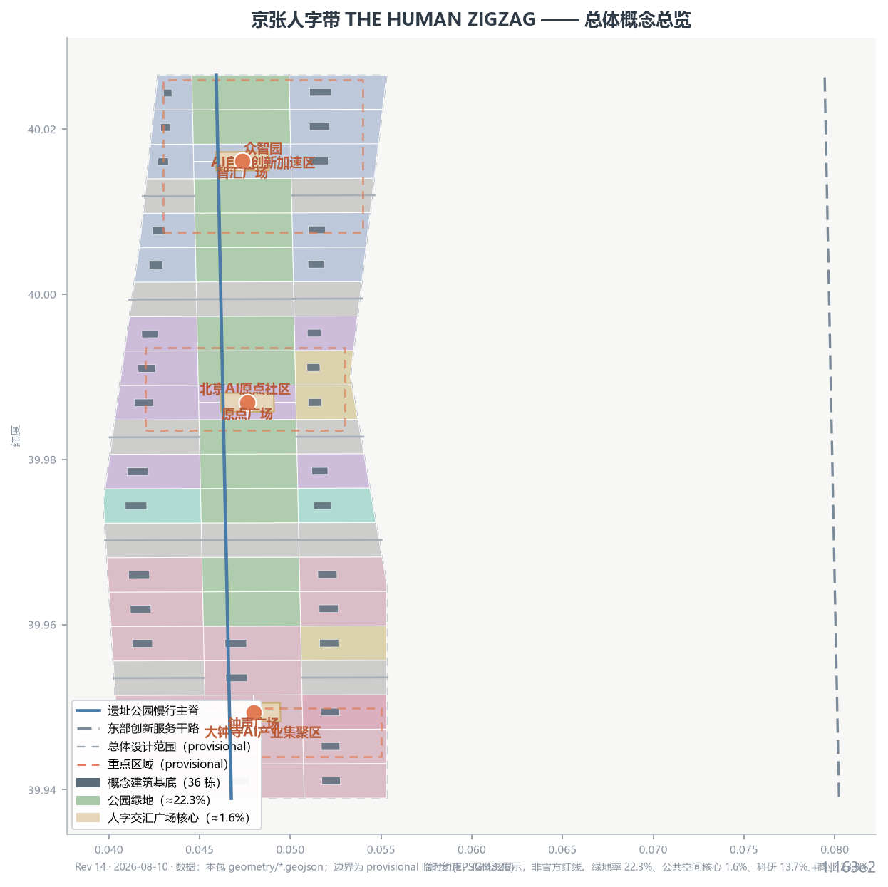
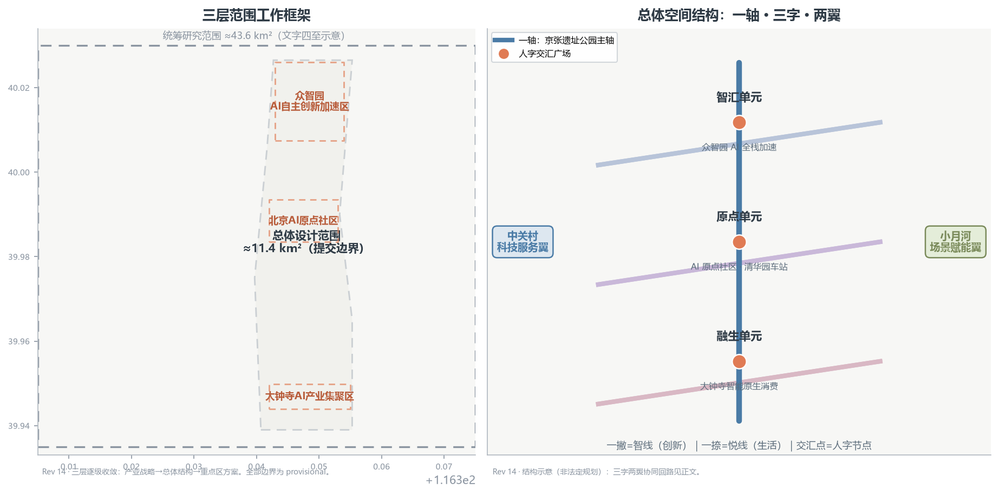
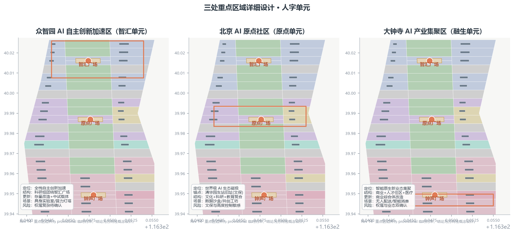
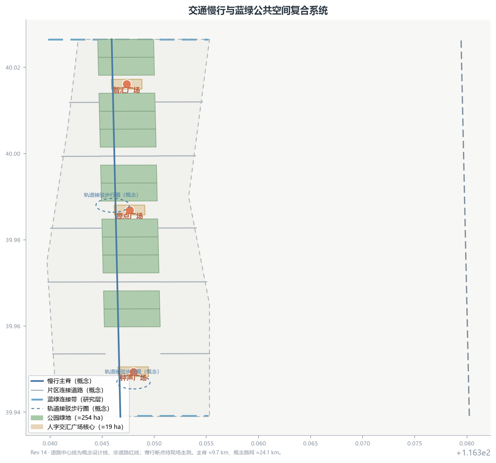
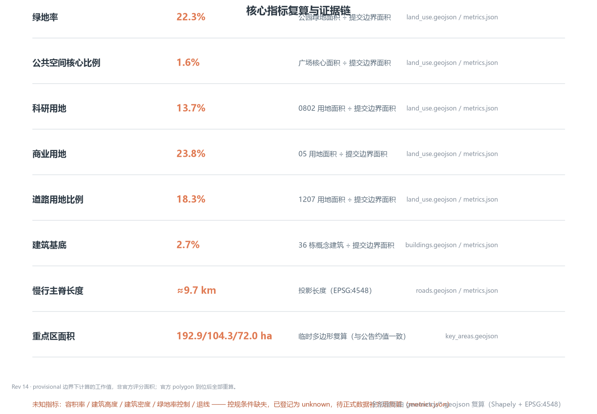

# 京张人字带 · THE HUMAN ZIGZAG：从铁轨人字线到城市人字带

> **一句话判断**：1909 年詹天佑在青龙桥用“人字线”让火车翻越八达岭，2026 年的京张带应该用同样的智慧组织城市——一撇承载 AI 产业创新，一捺承载城市生活服务，每一次交汇都回到“人”。本方案把铁轨上的人字线升华为城市结构母题，形成可读、可走、可测、可回退的“城市人字带” [data:geometry/key_areas.geojson#PROV-KEY-001] [data:geometry/land_use.geojson#LU-001]。

## 设计依据与资料清单

本方案以北京市规划和自然资源委员会海淀分局发布的《百年京张AI创新带城市设计国际方案征集资格预审公告》为第一依据 [source:OFFICIAL-ANNOUNCEMENT]，以面向智能体的开源征集任务书为任务依据 [source:AGENT-TASKBOOK]，并严格按 `data/source_registry.json` 区分正式可用、仅背景、临时推测三类资料 [source:SOURCE-REGISTRY]。

现状官方公告正文未附精确边界多边形，本包使用维护者提供的临时粗略边界与三处重点区多边形（`geometry_role=provisional_constraint`、`official_boundary=false`），仅用于概念生成、可视化与本地自检，不作为官方红线、审批依据或精确面积复算依据 [source:BOUNDARY-SOURCE] [source:KEY-AREA-SOURCE]。组织方数据缺口不阻断内容评分，但所有精度敏感结论将在正式边界与控规条件到位后重算 [standard:PROJECT-OFFICIAL-ANNOUNCEMENT]。

所有空间落地建议均为概念建议、参考方案或可供专业团队深化研究的内容，不替代正式规划，不构成政府审定结论 [source:AGENT-TASKBOOK]。完整机器索引（来源、指标、标准、设计深度、任务覆盖）见 `sources.json`、`metrics.json`、`standard_matrix.json`、`design_depth_matrix.json` 与 `compliance_matrix.json`。

## 三层范围工作框架

按公告的三层空间体系逐级落实设计深度 [source:OFFICIAL-ANNOUNCEMENT]：

1. **统筹研究范围（约 43.6 平方公里）**：北至北五环路、东至京藏高速、南至西直门外大街、西至万泉河路。工作目标是产业战略与区域协同研究，回答“AI 创新带在海淀乃至京津冀格局中的角色”，输出三区两翼协同回路与区域创新关系，不落建筑尺度 [data:geometry/constraints.geojson#CON-PROV-RESEARCH-001]。
2. **总体设计范围（约 11.4 平方公里）**：以京张遗址公园周边 1—2 公里城市地区和产业区为规划设计范围。工作目标为控制性详细规划深度的城市设计：空间结构、用地布局、更新项目、交通市政、风貌控制与指标体系。本包提交边界即此层 [data:geometry/site_boundary.geojson#SITE-001] [metric:site_area_sqm]。
3. **重点区域范围（约 368.4 公顷）**：自北向南包括众智园 AI 自主创新加速区、北京 AI 原点社区、大钟寺 AI 产业集聚区，达到规划综合实施方案的城市设计深度 [data:geometry/key_areas.geojson#PROV-KEY-001] [data:geometry/key_areas.geojson#PROV-KEY-002] [data:geometry/key_areas.geojson#PROV-KEY-003]。

三层逐级收敛：产业战略决定总体结构，总体结构决定重点区方案，重点区方案反向验证总体结构。三层边界目前均为临时粗略多边形，替换官方 polygon 后，面积类指标（`site_area_sqm`、各重点区面积、各类用地比例）须全部重算 [depth:three_level_scope_framework]。

## 统筹研究范围产业与未来城市研究

### 命名体系与 Logo 方向（agent.1）

主名称**“京张人字带”**，英文 **“THE HUMAN ZIGZAG”**，副题“从铁轨人字线到城市人字带”。命名体系为“一撇一捺一人”：

- **一撇 = 智线（Innovation Stroke）**：AI 全栈自主创新体系，落位众智园与中关村科技服务翼；
- **一捺 = 悦线（Life Stroke）**：城市生活服务与场景体验，落位大钟寺与小月河场景赋能翼；
- **交汇点 = 人字节点（Human Node）**：每个“人”字单元的公共空间，即人字交汇广场 [data:geometry/public_space.geojson#PS-11-01] [data:geometry/public_space.geojson#PS-18-01] [data:geometry/public_space.geojson#PS-02-01]。

Logo 方向（概念建议，非注册商标）：两条等宽线段呈“人”字相交，一条钢轨蓝灰、一条城市青绿，交点为暖色原点，喻示“铁轨与人、产业与生活、历史与未来”的汇合；原点可延展为“人字节”年度活动标识。视觉识别体系包括人字网格（Zigzag Grid）导视模数、交汇点地标符号和“一撇一捺一人”的叙事话术 [depth:brand_identity_and_logo_direction]。

### 三大定位、五大功能与三区两翼协同回路

三大定位——百年京张文化带、都市 AI 生活体验带、AI 融合创新带——在人字结构中获得空间表达：文化带即公园主轴，体验带即“悦线”，创新带即“智线”。体验带由商业 23.8%、居住 3.8% 与公园绿地 22.3% 合计约 49.9% 的用地承载，是 AI 生活场景的空间基础。五大功能（AI 全栈自主创新体系、世界级 AI 创新生态、AI+ 场景赋能新范式、智能化 AI 活力城市、AI 治理全球话语权）分别锚定众智园、原点社区、小月河翼、大钟寺与治理实验节点 [source:AGENT-TASKBOOK] [standard:PROJECT-AGENT-OPEN-CALL-TASKBOOK]。

三区两翼协同回路：中关村科技服务翼提供资本、IP 与全球要素（供给），众智园完成全栈研发与自主创新（研发），原点社区形成生态与文化磁极（交互），大钟寺承接智能原生新业态（转化），小月河翼开放场景测试与城市实验（验证）——验证反馈回供给端，形成闭环 [depth:regional_synergy_circuit]。区域协同上，向北与未来科学城、怀柔科学城的原始创新呼应，向东与经开区智造转化联动，均作为研究层面的开放接口提出。

### 全球 AI 创新生态案例（agent.2，6 例）

以下案例均为公开资料概述，用于提炼可转化的空间与机制经验，不构成对任何城市或企业的现状承诺 [source:SOURCE-REGISTRY]：

| 案例 | 关键机制 | 可转化经验 |
| --- | --- | --- |
| 硅谷（美国） | 大学—资本—创业的短链路 | 在原点社区设置“高校步行 15 分钟”的共创楼群与路演空间 |
| 深圳南山 | 硬件原型—制造闭环 | 众智园设硬件中试与快速原型节点 |
| 新加坡 | 数字孪生与城市级 AI 治理 | 沿主轴建设可解释的城市 AI 数据沙盒 |
| 东京—筑波 | 科研城—产业转化走廊 | 强化京张带与北清路沿线的院所转化通道 |
| 特拉维夫（以色列） | 军民两用技术转化 | 构建合规转化讨论机制 |
| 班加罗尔（印度） | 人才池—全球交付 | 依托海淀高校建立全球开发者实习与共创计划 |

### AI 创新生态图谱与产业空间映射（agent.2）

本节约略 AI 创新生态的“要素—主体—机制”三层图谱，并将六大生态环节映射到三区两翼与主轴的协同回路中。全部为概念建议与空间意向，不预设企业、投资、产值或政策承诺；具体落位待招商、市场与控规条件确认后深化。

**AI 创新生态图谱（要素—主体—机制三层结构）**

| 层级 | 组成 | 典型主体 | 承载机制 |
| --- | --- | --- | --- |
| 要素层 | 算力、数据、算法、人才、资本、场景 | 算力与数据提供方、高校院所、创投资本、场景业主 | 要素供给与跨区流通 |
| 主体层 | 高校院所、大企业、初创团队、开源社区、公共服务 | 清华园周边院校、龙头企业实验室、AI 初创、全球开源开发者、公共运营平台 | 主体集聚与交往 |
| 机制层 | 孵化、中试、评测、场景开放、治理 | 加速器、中试车间、评测机构、场景开放平台、治理圆桌 | 机制衔接与回路闭环 |

**产业空间映射（六大生态环节 × 三区两翼）**

| 生态环节 | 主导落位（概念） | 协同落位 |
| --- | --- | --- |
| 全栈研发 | 众智园（AI 全栈自主创新加速区） | 原点社区高校协同 |
| 中试与评测 | 众智园（硬件中试、快速原型节点） | 原点社区评测协作 |
| 数据要素与治理 | AI 原点社区（可解释数据沙盒、生态磁极、清华园车站文化锚点） | 主轴沿线治理实验节点 |
| 智能原生业态 | 大钟寺（智能原生消费与商务转化） | 小月河翼体验反哺 |
| 要素供给 | 中关村科技服务翼（资本、IP、全球要素） | 原点社区路演与共创楼群 |
| 场景验证 | 小月河场景赋能翼（测试与城市实验） | 大钟寺无人配送示范段 |

映射逻辑与“三区两翼”协同回路一致：中关村翼供给要素，众智园完成全栈研发与中试，原点社区形成生态磁极与数据治理交互，大钟寺承接智能原生业态转化，小月河翼开放场景验证并反馈回供给端，构成闭环。空间上依托 75 个概念地块与约 24.1 公里概念路网组织，慢行主脊约 9.7 公里串联三座人字交汇广场；三处重点区公告面积为 192.1/104.3/72.0 公顷 [metric:land_use_polygon_count] [metric:road_centerline_length_m]。

八类机制的概念建议：

- **土地机制**：以概念分区预留科研（约 13.7%）、商业（约 23.8%）、文化（约 9.9%）与绿地（约 22.3%）的弹性，支持功能混合与分期投放；
- **空间机制**：沿主轴组织“产业撇 + 生活捺”混合街区，道路约 18.3%、广场核心约 1.6%，以主脊与人字广场为核心交往节点；
- **产业机制**：以全栈研发、智能原生商业与文化三链条构成产业骨架，建筑约 2.7%（36 栋概念建筑），不预设具体拆改留结论；
- **资金机制**：以公共运营平台为枢纽，探索“场景开放 + 收益反哺”的轻投入路径，不涉及投资承诺；
- **人才机制**：依托高校步行 15 分钟共创楼群与开发者工坊，建立“参与—署名—再参与”的人才与贡献循环；
- **算力机制**：以公共算力接口与算力灯塔透明展示为概念方向，规模化算力建设待专项评估；
- **数据机制**：在原点社区设可解释的城市 AI 数据沙盒，匿名化、最小化采集并人工复核；
- **场景机制**：按“提案—评审—试运行—评估—扩大/收回”五步开放，任一场景可整体关停 [depth:regional_synergy_circuit]。

### 未来 AI 城市形态判断

从铁轨到算轨、从站台到节点、从通行权到数据权：本带建议以“可回退的智能原生”为形态原则——每一处 AI 设施均有手工等价路径与关停条件（“可回退”为本方案自身设计原则，与生成式人工智能服务治理中普遍强调的人工监督、人工复核要求相呼应）[standard:GENERATIVE-AI-INTERIM-MEASURES]。AI+交通、连续绿色空间体系、AI 文化社会场景分别落位到慢行主轴、蓝绿网络与人字节点（详见后文各章）。

## 总体设计范围城市更新与控规深度城市设计

### 总体空间结构：一轴三字两翼

- **一轴**：京张遗址公园主轴（绿带 + 慢行主脊），串联三座人字交汇广场，是全带文化与公共生活的脊梁 [data:geometry/green_space.geojson#GS-20-01] [metric:spine_length_m]；
- **三字**：自北向南三个“人字单元”——智汇（众智园）、原点（AI 原点社区）、融生（大钟寺），每单元以“产业撇 + 生活捺 + 广场交汇”组织 [data:geometry/key_areas.geojson#PROV-KEY-001] [data:geometry/key_areas.geojson#PROV-KEY-002] [data:geometry/key_areas.geojson#PROV-KEY-003]；
- **两翼**：西翼中关村科技服务翼（要素与资本）、东翼小月河场景赋能翼（测试与体验）。

### 用地布局与功能比例

用地分区采用“主轴绿带 + 组团片区 + 连接路网”的概念分区（全部为概念层，非控规指标）[data:geometry/land_use.geojson#LU-001] [depth:land_use_layout]：科研用地约 13.7%、道路用地约 18.3%、商业约 23.8%、公园绿地约 22.3%、居住约 3.8%、文化约 9.9%、广场核心约 1.6%、教育约 3.3%、医疗约 3.3% [metric:land_use_research_area_sqm] [metric:land_use_residential_area_sqm] [metric:land_use_commercial_area_sqm]。文化+广场合计约 11.5%，支撑“百年文化带”定位；科研+商业合计约 37.5%，支撑“AI 融合创新带”定位。

### 建筑规模与更新逻辑

概念建筑基底 36 栋、合计约 2.7% 的建筑密度（非法定建筑覆盖率），以“保留修缮历史记忆点、改造提质产业与生活楼宇、更新补充公共与配套建筑”三类动作组织 [metric:building_footprint_ratio] [metric:building_count] [depth:retain_renovate_demolish]。具体地块级拆改留结论、容积率、建筑高度与开发强度均待控规条件与现状建筑普查数据补齐后由专业团队确定 [standard:MOHURD-CONTROL-DETAILED-PLANNING]。

### 城市更新项目清单（概念级）

近期先行“原点文化芯”（清华园车站旧址周边文化修缮与公共空间），中期推进“众智研发芯”（存量楼宇改造为 AI 全栈加速载体），远期实施“大钟寺消费芯”（智能原生商业街区更新）；三类项目均以“试点—评估—扩展”的渐进逻辑实施 [data:geometry/phasing.geojson#PH-P1] [data:geometry/phasing.geojson#PH-P2] [data:geometry/phasing.geojson#PH-P3]。

## 重点区域详细设计

以下三个重点区按规划综合实施方案的城市设计深度开展概念设计；边界为临时粗略多边形，所有结论均为方向性概念设计，具体拆改留与开发建设规模待控规条件补齐后由专业团队确定 [standard:PROJECT-OFFICIAL-ANNOUNCEMENT]。

### 众智园 AI 自主创新加速区（智汇人字单元）

- **定位**：AI 全栈自主创新加速区，承担“智线”北端研发引擎，呼应五大功能中的全栈自主创新体系与 AI 治理全球话语权 [data:geometry/key_areas.geojson#PROV-KEY-001]。
- **空间结构**：科研组团围绕智汇广场组织（重点区内细分用地结构待深化），广场为“人字交汇”北端节点 [data:geometry/public_space.geojson#PS-18-01] [metric:zhongzhiyuan_area_sqm]。
- **建筑更新**：以改造存量科研楼宇为主、新增中试载体为辅，建筑基底均为概念示意。
- **交通慢行**：沿主轴北段设置步行与骑行主脊，接五环辅路换乘接驳（概念级，非道路红线）。
- **公共空间**：智汇广场承载 AI 市集、开源嘉年华等轻量活动。
- **AI 场景**：具身智能城市实验室、算力灯塔、硬件中试快速原型节点（详见场景卡）。
- **实施风险**：存量权属复杂，改造需逐个地块确认；权属与控规数据待补 [depth:three_key_area_detailed_design]。

### 北京 AI 原点社区（原点人字单元）

- **定位**：世界级 AI 创新生态的磁极与百年京张文化的原点，清华园车站旧址是本单元的文化锚点（真实文保点位，保护范围与建控地带以文物部门公布为准）[data:geometry/key_areas.geojson#PROV-KEY-002] [metric:beijing_ai_origin_area_sqm]。
- **空间结构**：文化、科研与教育用地围绕原点广场组织（重点区内细分用地结构待深化），形成“文化记忆 + 共创交往 + 高校协同”的复合核心 [data:geometry/public_space.geojson#PS-11-01] [metric:land_use_culture_area_sqm]。
- **建筑更新**：文化馆舍修缮与历史建筑活化利用为概念方向，不触碰文保本体，具体建设控制以文物部门规定为准。
- **交通慢行**：原点广场与地铁接驳步行圈（概念级）。
- **公共空间**：原点广场设“星火台”与京张叙事步道（见朝圣地标）。
- **AI 场景**：AI 城市数据沙盒、开发者共创工坊、多语言 AI 导览（详见场景卡）。
- **实施风险**：文保、高校权属与控规高度控制敏感，需专业与管理部门逐项确认 [depth:three_key_area_detailed_design]。

### 大钟寺 AI 产业集聚区（融生人字单元）

- **定位**：智能原生新业态集聚区，承担“悦线”南端的生活转化场景，呼应五大功能中的智能化 AI 活力城市 [data:geometry/key_areas.geojson#PROV-KEY-003] [metric:dazhongsi_area_sqm]。
- **空间结构**：商业服务业用地与人才住区、医疗设施围绕钟声广场组织（重点区内细分用地结构待深化），形成“智能消费 + 生活服务”的南端人字交汇 [data:geometry/public_space.geojson#PS-02-01] [metric:land_use_commercial_area_sqm]。
- **建筑更新**：智能原生商业综合体改造更新为概念方向，不预设拆建结论。
- **交通慢行**：连接大钟寺站与遗址公园南入口的慢行路径（概念级）。
- **公共空间**：钟声广场设“回声钟楼”与无人配送测试示范段（见场景卡与朝圣地标）。
- **AI 场景**：无人配送路测场、智能原生消费、AI 健康服务导航（详见场景卡）。
- **实施风险**：商业更新涉及权属与业态调整，需市场与规划条件双确认 [depth:three_key_area_detailed_design]。

## AI 创新生态、人才画像与 AI+ 场景

### 六类用户画像（agent.3）

六类画像覆盖创业者、研究者、开发者、居民、长者与无障碍需求者、国际访客六类人群 [metric:user_persona_count]：

| 画像 | 典型人群 | 核心需求 | 对应空间 |
| --- | --- | --- | --- |
| P1 创业者 | AI 初创团队 | 加速器、路演、中试 | 众智园科研组团 |
| P2 研究者 | 高校院所学者 | 学术交往、数据沙盒 | 原点社区教育科研用地 |
| P3 开发者 | 全球开源开发者 | 共创工坊、开放数据 | 原点社区 + 线上 |
| P4 居民 | 周边住区家庭 | 日常便利、儿童友好 | 大钟寺与居住组团 |
| P5 长者与无障碍需求者 | 老年人与残障人士 | 无障碍慢行、人工等价服务 | 全带公共空间 |
| P6 国际访客 | AI 朝圣与学术访客 | 文化叙事、多语言服务 | 原点社区与主轴 |

### 十二张 AI 场景卡（含 3 张产业测试验证场景，agent.3）

场景卡全部映射到注册场景类型与空间节点，均为概念建议，未部署、未授权、未运行 [source:AGENT-TASKBOOK] [standard:PROJECT-AGENT-OPEN-CALL-TASKBOOK]。

**测试验证场景（3）**：

| 卡号 | 场景 | 空间节点 | 注册类型 | 隐私/人工边界 |
| --- | --- | --- | --- | --- |
| S01 | 无人配送低速路测示范段 | 大钟寺—学院路走廊 | robot-delivery-low-speed | 限定路段时段，人工接管兜底，不采集身份信息 |
| S02 | 具身智能城市实验室 | 众智园智汇广场周边 | public-safety-operations-review | 封闭/围合试验，全程人工监督，仅聚合指标 |
| S03 | AI 城市数据沙盒 | 原点社区 | enterprise-service-copilot | 匿名化数据、差分隐私、输出人工复核 |

**城市生活场景（9）**：

| 卡号 | 场景 | 空间节点 | 注册类型 | 隐私/人工边界 |
| --- | --- | --- | --- | --- |
| S04 | 人字站牌多模态信息站 | 主轴慢行节点 | ai-cultural-guide | 公开信息聚合，无个人画像 |
| S05 | 智汇广场 AI 市集 | 智汇广场 | enterprise-service-copilot | 商户入驻审核，交易数据本地化 |
| S06 | 京张 AR 叙事线 | 遗址公园主轴 | ai-cultural-guide | 史实与版权人工核查 |
| S07 | 小月河场景走廊 | 小月河翼 | ai-traffic-walkability | 慢行监测仅用聚合数据 |
| S08 | AI 健康服务导航站 | 大钟寺医疗组团周边 | ai-health-service-navigation | 仅公共服务导航，禁止诊疗建议 |
| S09 | 长者陪伴驿站 | 居住组团 | ai-health-service-navigation | 人工值守优先，AI 仅辅助 |
| S10 | 开发者共创工坊 | 原点社区 | enterprise-service-copilot | 开源许可审核 |
| S11 | 智能原生书店与消费 | 大钟寺商业街区 | enterprise-service-copilot | 消费数据最小化 |
| S12 | 人字向导公共智能体 | 全带信息界面 | ai-cultural-guide | 可解释、可退出、来源可溯 |

### 场景—空间—运营映射（agent.3）

每张场景卡均具备：空间节点（上述列）、服务对象（P1—P6 画像）、运行数据（公开/授权）、隐私边界（不采集身份、最小化、人工复核）、运营主体（概念建议：公共运营平台 + 专业公司 + 社区共治）、可视化图层（SCENARIO_NODE 概念层）与风险等级。测试验证场景遵循“先封测、再试运行、后公开”的阶梯，任何场景的关闭不依赖自动化系统（人工可整体关停）[depth:scenario_space_operation_matrix]。

## 用地、建筑规模与拆改留方案

用地与建筑结论汇总如下（全部为概念层，非控规或法定指标）[data:geometry/land_use.geojson#LU-001] [metric:site_area_sqm]：

- 用地分区：75 个概念地块完整覆盖提交边界，无缝隙、无重叠（拓扑已校验）；慢行主脊约 9.7 公里、概念路网总长约 24.1 公里 [metric:land_use_polygon_count] [metric:road_centerline_length_m]；
- 绿地与开敞空间：公园绿地约 254 公顷（22.3%）、人字交汇广场核心约 19 公顷（1.6%，另以广场用地缓冲带补充）[metric:green_ratio] [metric:public_space_ratio]；
- 建筑：36 栋概念建筑基底约 2.7%，均为“保留修缮—改造提质—更新补充”三类概念动作，不预设具体地块拆改留结论 [metric:building_footprint_ratio] [depth:retain_renovate_demolish]；
- 待确认：容积率、建筑高度、建筑密度、绿地率、退线与道路红线等控规条件均缺失，已登记为未知指标，待正式数据补齐后复算 [metric:floor_area_ratio] [metric:building_height_control_m]。

## 交通、轨道、市政与公共服务设施

以下均为方向性概念方案，断面、线位与容量待官方轨道规划、道路红线与市政底数补齐后深化 [data:geometry/roads.geojson#ROAD-001] [standard:MOHURD-URBAN-DESIGN-MEASURES]。

### 慢行：主脊贯通与三类断点策略

概念慢行主脊约 9.7 公里南北贯通，概念路网约 24.1 公里、道路用地约 18.3% 承担东西缝合（概念层，非道路红线）[metric:spine_length_m] [metric:road_ratio]。针对主脊交会断点，提出三类解决策略的概念原则：

| 断点类型 | 解决策略 | 概念原则 |
| --- | --- | --- |
| 宽主干路横切 | 贴线天桥 | 桥面沿公园线位延伸，延续绿化铺装，保持主脊视觉连续 |
| 一般道路交会 | 地面过街 | 抬高铺装、信号优先、无障碍坡化，行人骑行优先 |
| 轨道站与综合体交界 | 立体联通 | 结合站城一体化预留架空或地下通道，风雨无阻连续通行 |

三类策略均以“主脊连续、人车分离、无障碍可达”为原则，具体形式经现场走测与交通评估确定。

### 轨道接驳：三站站城一体化概念

以既有轨道站点为锚点组织步行接驳圈 [standard:MOHURD-URBAN-DESIGN-MEASURES]，站域范围与线位以官方规划为准：

| 锚点站点 | 与重点区关系 | 方向性概念建议 |
| --- | --- | --- |
| 清华东路西口站 | 近原点社区 | 概念作原点社区门户，组织“站—原点广场—清华园车站旧址（真实文保点位）”无障碍步行主轴 |
| 大钟寺站 | 近大钟寺 | 概念推进四象限步行连通，以地下或地面通道串联商业街区与钟声广场，避免客流绕行 |
| 五道口 | 近原点社区北缘 | 概念将站前空间广场化，结合人字导视组织站—主脊接驳，形成北缘开敞门户 |

### 市政与新型基础设施

端侧算力、智慧灯杆与分布式能源均为场景化概念 [standard:GENERATIVE-AI-INTERIM-MEASURES]，不做容量测算：端侧算力沿主脊与三广场布设边缘节点，数据本地化处理；智慧灯杆作“杆位多合一”载体整合照明、信息与传感，避免重复立杆；分布式能源结合新建改造建筑预留光伏储能接口。智能设施均遵循“可回退”原则，保留人工与常规市政等价路径。

### 公共服务设施配套原则

按 P1—P6 画像分级配置：P1/P3 配路演、中试与开放数据接口（众智园、原点）；P2 配学术交往与数据沙盒（教育约 3.3%）；P4 配社区服务与儿童友好设施（居住约 3.8%）；P5 享全带无障碍慢行与人工等价服务（医疗约 3.3%）；P6 配多语言导览与文化叙事（原点、主轴）。设施按“带级—区级—组团级”分级布局，点位与规模待设施底数补齐后深化 [metric:land_use_education_area_sqm] [metric:land_use_medical_area_sqm]。

## 蓝绿空间、公共空间与城市风貌

### 蓝绿空间与公共空间系统

“一轴三广场”蓝绿结构：遗址公园主轴绿带（约 254 公顷概念绿地）串联智汇、原点、钟声三座人字交汇广场核心（各约 6.25 公顷）[data:geometry/green_space.geojson#GS-20-01] [metric:green_ratio]；清河与小月河蓝绿空间作为研究层连接带提出（现状水系范围待官方 GIS 确认）。步道骑行道贯通主轴，公共活动空间分级：带级（主轴）、区级（三广场）、组团级（各片区绿地）[depth:blue_green_public_space]。

### 城市风貌与 AI 朝圣地标（agent.4）

风貌基调建议为“工业记忆 + 极简科技”双声部：保留铁轨、道岔、站台等工业要素作为记忆拼贴，新建与改造建筑以低饱和材料、通透底层与屋顶公共化为方向（均为概念建议）。导视系统沿用人字网格模数，与一带 Logo 系统区分层级（文化导视 ≠ 品牌标识）[depth:signage_system_direction]。

**四座 AI 朝圣地标/荣誉展示节点（概念级）**：

1. **原点星火台**（AI 原点社区·清华园车站旧址周边）：致敬 1909 年通车，设“百年原点”荣誉墙与开发者星光名录，展示开源贡献者与方案共创者（呼应“贡献可记忆”共创原则）[data:geometry/public_space.geojson#PS-11-01]；
2. **人字交汇纪念碑**（智汇广场）：以“人”字钢结构呼应青龙桥人字线，铭刻“从人字线到人字带”叙事，设年度“人字节”主舞台 [data:geometry/public_space.geojson#PS-18-01]；
3. **算力灯塔**（众智园）：面向公众展示算力与能耗的实时概览（仅聚合指标），作为 AI 治理透明度的公共界面；
4. **回声钟楼**（大钟寺）：以钟声意象表达“科技与生活的回声”，设智能原生消费体验与无声共感装置。

四座地标均不预设建筑形态、高度或投资，不构成已批准建设事项；文物、绿线、蓝线与安全约束一律以主管部门规定为准 [depth:ai_landmark_catalog] [standard:BARRIER-FREE-ENVIRONMENT-LAW]。

### 公共空间组件库（agent.4）

公共空间组件库面向京张遗址公园主轴（慢行主脊约 9.7 公里）与智汇、原点、钟声三座人字交汇广场（核心各约 6.25 公顷）提出概念组件清单，遵循“能装、能拆、能断电回退”三原则：每件组件均以无源、可独立使用的市政或景观基座为底，AI 能力仅作可叠加层，断电、断网或撤除智能层后仍保留完整的人工等价路径。组件选型覆盖全带画像 P1—P6，并优先照顾长者、残障与儿童等对可回退性需求最高的群体 [data:geometry/public_space.geojson#PS-18-01] [data:geometry/public_space.geojson#PS-11-01] [data:geometry/public_space.geojson#PS-02-01]。

| 组件 | 所在空间 | 服务对象 | 人工等价路径 | 可回退性 |
| --- | --- | --- | --- | --- |
| 人字凉亭 | 三座人字交汇广场交汇点 | P1—P3、P6 | 遮荫休憩座椅与普通凉亭 | 整体可拆装，拆除后还原开敞广场 |
| 数据长椅 | 遗址公园主轴慢行节点 | P4、P5 | 无源普通景观长椅 | 断电即恢复普通座椅功能 |
| 可解释信息屏 | 全带信息界面与广场角点 | P2、P5、P6 | 静态导览牌与人工问询服务 | 内容人工审核，可一键切换静态模式 |
| 无障碍导盲路径 | 主轴与三广场步行主路径 | P5（长者与无障碍需求者） | 志愿者陪护与人工引导 | 铺装无源，AI 提示为可关闭叠加层 |
| 临时市集模块 | 智汇广场、钟声广场 | P1、P4 | 传统展位与帐篷租赁 | 模块化拆装，活动后场地复原 |
| 灯光地标 | 原点星火台、人字交汇纪念碑 | P6、P2、P4 | 常规景观照明 | 智能联动可整体关闭，保留基础照明 |

### 场景卡扩展表（S01—S12，agent.4）

场景卡扩展表把十二张场景卡扩展为完整映射，统一补全服务画像、概念运营主体、风险等级与人工复核点，与既有场景卡的空间节点、注册类型及隐私/人工边界完全一致；空间节点以场景卡扩展表登记（概念图层待与官方数据对齐后补充）[metric:scenario_card_count] [depth:scenario_space_operation_matrix]。S01—S03 为产业测试验证场景，遵循“先封测、再试运行、后公开”阶梯，风险等级均标为“高—需许可”：未取得道路测试、试验围合与数据治理许可并通过安全评估前不运行，任何自动化失效均不阻断人工整体关停。其余生活场景按数据处理敏感度定级，其中 S08 因涉及健康类信息标为“高”。所有场景的运营主体均为“公共运营平台 + 专业公司 + 社区共治”的概念建议，任一场景可被人工整体关停，其关闭不依赖自动化系统 [standard:GENERATIVE-AI-INTERIM-MEASURES]。

| 卡号 | 场景 | 空间节点 | 服务画像 | 运营主体（概念） | 风险等级 | 人工复核点 |
| --- | --- | --- | --- | --- | --- | --- |
| S01 | 无人配送低速路测示范段 | 大钟寺—学院路走廊 | P1、P4 | 公共运营平台＋专业公司＋社区共治 | 高—需许可 | 路测许可与安全评估；人工接管兜底记录复核 |
| S02 | 具身智能城市实验室 | 众智园智汇广场周边 | P1—P3 | 公共运营平台＋专业公司＋社区共治 | 高—需许可 | 封闭围合确认；全程人工监督与运行日志复核 |
| S03 | AI 城市数据沙盒 | 原点社区 | P2、P3 | 公共运营平台＋专业公司＋社区共治 | 高—需许可 | 差分隐私参数审核；输出人工复核 |
| S04 | 人字站牌多模态信息站 | 主轴慢行节点 | P4—P6 | 公共运营平台＋专业公司＋社区共治 | 低 | 公开信息源与内容审核 |
| S05 | 智汇广场 AI 市集 | 智汇广场 | P1、P4 | 公共运营平台＋专业公司＋社区共治 | 中 | 商户入驻审核；交易数据本地化核查 |
| S06 | 京张 AR 叙事线 | 遗址公园主轴 | P4、P6 | 公共运营平台＋专业公司＋社区共治 | 中 | 史实与版权人工核查 |
| S07 | 小月河场景走廊 | 小月河翼 | P4、P5 | 公共运营平台＋专业公司＋社区共治 | 低 | 慢行聚合数据脱敏核查 |
| S08 | AI 健康服务导航站 | 大钟寺医疗组团周边 | P4、P5 | 公共运营平台＋专业公司＋社区共治 | 高 | 禁诊疗建议合规复核；导航范围校验 |
| S09 | 长者陪伴驿站 | 居住组团 | P5 | 公共运营平台＋专业公司＋社区共治 | 中 | 人工值守优先；交接记录复核 |
| S10 | 开发者共创工坊 | 原点社区 | P3 | 公共运营平台＋专业公司＋社区共治 | 低 | 开源许可审核 |
| S11 | 智能原生书店与消费 | 大钟寺商业街区 | P4、P6 | 公共运营平台＋专业公司＋社区共治 | 中 | 消费数据最小化核查 |
| S12 | 人字向导公共智能体 | 全带信息界面 | P2、P5、P6 | 公共运营平台＋专业公司＋社区共治 | 中 | 可解释、可退出、来源可溯复核 |

注：上表运营主体均为概念建议，场景均未部署、未授权、未运行，任何空间落地表述不构成已批准或已确定安排。

## 百年京张、中关村与 AI 新文化融合叙事（agent.5）

文化在这条带里不是装饰，而是结构本身。京张铁路留下的不止一段铁轨，更是一种方法——用最小代价解决最难的问题，把“山与轨道”的矛盾化解为一道“人”字。1909 年的工程创举、中关村的创新文化、正在生成的 AI 新文化，三条线索在本方案中汇于同一个字：人。全带文化用地约 9.9%、广场核心约 1.6%，合计约 11.5%，是为这段百年叙事预留的空间基础。

### 京张铁路历史文化资源系统

以下资源均为真实可考的历史与城市记忆点，本方案仅作概念性致敬与叙事引用；所有保护范围与建控地带一律以文物及相关部门公布为准 [standard:PROJECT-OFFICIAL-ANNOUNCEMENT]。

| 名称 | 位置 | 时代与史实 | 概念使用与保护要求 |
| --- | --- | --- | --- |
| 京张铁路遗址公园（海淀段） | 海淀段铁路遗址沿线，本方案主轴的蓝绿载体 | 1909 年全线通车；海淀段铁路遗址所在区域现为城市公共空间，也是本方案慢行主脊的载体 | 概念层作为主脊与绿地使用；保护范围以文物、园林部门公布为准 |
| 清华园车站旧址 | 海淀段清华园，AI 原点社区范围内 [data:geometry/key_areas.geojson#PROV-KEY-002] | 1909 年京张铁路通车后为清华学校增建（1910 年），詹天佑督建并题写站名“清华园车站”，老站房属京张铁路沿线站房体系 | 真实文保点位，为原点社区文化锚点；概念方案不触碰文保本体，具体保护范围与建控地带以文物部门公布为准 |
| 青龙桥人字形线路 | 延庆（八达岭一带），京张铁路全线坡度最陡区段 | 1905—1909 年修建，詹天佑以“人”字形折返展线克服陡坡，1909 年全线通车 | 作为命名母题与致敬对象引用，不涉及延庆本地实施 |
| 西直门站（京张铁路北京门户/头等站） | 海淀段南端外，今北京北站区域 | 1909 年全线通车时为京张铁路北京端头等站；线路实际起点为丰台柳村，民间常称西直门为起点 | 作为“起点”意象在导视与叙事中呼应，现状利用以铁路部门为准 |
| 五道口平交道口记忆 | 海淀段中北部，原京张铁路与城市道路交汇处 | 京张铁路沿线著名平交道口，2016 年前后随京张高铁地下化改造，原道口功能退出，成为几代人的城市记忆 | 作为集体记忆锚点，以导视、影像与叙事方式纪念，不新增实体改造 |

### 从人字线到人字带：三条线的融合叙事

1909 年，詹天佑在八达岭用一道“人”字，让火车翻过千年天险。那是一次关于方法的证明：用最少的工程，实现最大的可能。一百多年后，同一片土地上生长出中关村——从“电子一条街”到全球创新网络，它的核心不是楼宇，而是人的想象力与协作方式。今天，AI 第一次大规模进入城市日常，我们被迫重新回答一个古老的问题：什么是“人”不可替代的。

三条线在不同时代问着同一个问题——如何把人的目标，翻译成物的语言。1909 年人字线翻译的是“山的意志”，中关村翻译的是“市场的信号”，AI 新文化要翻译的是“生活的意义”。它们汇于“人”字结构：一撇是创新（智线），一捺是生活（悦线），每一次交汇都回到公共空间里的“人” [data:geometry/public_space.geojson#PS-18-01] [data:geometry/public_space.geojson#PS-11-01] [data:geometry/public_space.geojson#PS-02-01]。人字带不是把文化贴在科技上，而是让科技向历史学习——学习“用最小代价解决最大难题”的方法本身。

### 空间故事线：沿主轴的叙事节点序列

沿主脊约 9.7 公里的慢行轴线 [metric:spine_length_m]，自南向北组织“从起点到未来”的叙事序列：

| 序 | 节点 | 位置与区段 | 叙事主题 |
| --- | --- | --- | --- |
| 1 | 起点·西直门站（北京北站） | 南端边界外 | “一切从这里出发”——京张铁路历史起点的意象入口 |
| 2 | 钟声广场·回声钟楼 | 大钟寺（南端）[data:geometry/public_space.geojson#PS-02-01] | AI 原生生活与城市烟火，“科技与生活的回声” |
| 3 | 原点广场·原点星火台 | AI 原点社区·清华园车站旧址旁（中段）[data:geometry/public_space.geojson#PS-11-01] | 1909 通车纪念与开发者荣誉，“百年原点” |
| 4 | 五道口平交道口记忆 | 中北段 | 几代人通勤记忆的集体锚点 |
| 5 | 智汇广场·人字交汇纪念碑 | 众智园（北端）[data:geometry/public_space.geojson#PS-18-01] | 铭刻“从人字线到人字带”，年度“人字节”主舞台 |
| 6 | 算力灯塔 | 众智园北端 | AI 治理透明界面，“未来”的可见性 |
| 7 | 母题·青龙桥人字线 | 延庆（叙事延伸，非本带实施） | 北望母题，铁轨在想象中接回 1909 年的人字线 |

### 国际传播文案（英文场景下的中文底稿）

以下三段为面向全球 AI 城市叙事的传播底稿，承接文化叙事与品牌识别要求 [source:AGENT-TASKBOOK] [depth:ai_landmark_catalog]，可译入英文场景；均保持概念建议语气，不构成任何已批准或已建成表述。

1. 1909 年，中国工程师詹天佑在八达岭修了一条“人”字形的铁路，让火车翻过千年天险。今天，在当年铁路穿过的地方——北京海淀，我们建议把这道“人”字从铁轨搬到城市里：一撇是 AI 全栈创新，一捺是城市生活，每一次交汇都回到人。

2. “人字带”是一种提议，而不是一个已建成的答案：让 AI 城市基础设施像一条铁路一样可读、可走、可回退。我们相信，最强的智能不该用来替代生活，而该用来保全生活。在中关村，创新从未离开过人——它只是不断换一种方式，重新翻译“人的目标”。

3. 我们邀请全球开发者、研究者与城市共建者，沿着这条约 9.7 公里的慢行主脊走一遍：从 1909 年的起点站出发，经过记忆、生活与创新，抵达一个由开源、共治与公共知识支撑的未来。方案里所有空间均为概念建议，真正的城市由人决定——这正是“人”字的全部含义。

## 更新项目清单、实施政策与分期计划

### 概念更新项目清单

| 项目 | 类型 | 分期 | 依赖条件 | 概念实施主体 |
| --- | --- | --- | --- | --- |
| 原点文化芯 | 文化修缮+公共空间 | P1 近期 | 文保审批、现场勘察 | 政府+文化机构 |
| 主轴中段慢行贯通 | 市政慢行 | P1 近期 | 道路红线确认 | 政府+交通部门 |
| 众智研发芯 | 楼宇改造 | P2 中期 | 权属确认、控规条件 | 平台公司+运营商 |
| 智汇广场与算力灯塔 | 公共空间+设施 | P2 中期 | 数据接口与能耗标准 | 公共运营平台 |
| 大钟寺消费芯 | 街区更新 | P3 远期 | 市场条件、业态评估 | 运营商+市场主体 |
| 南段慢行与无人配送示范 | 慢行+测试 | P3 远期 | 测试许可、安全评估 | 公共运营+专业公司 |

分期逻辑：P1 以低成本、高公共价值的文化慢行项目先行凝聚共识；P2 以产业载体改造释放创新空间；P3 以市场化程度高的消费更新收官，每期设置评估闸门，未达标不进入下一期 [data:geometry/phasing.geojson#PH-P1] [data:geometry/phasing.geojson#PH-P2] [data:geometry/phasing.geojson#PH-P3]。三期面积均从 phasing 图层复算 [metric:phase_p1_area_sqm] [metric:phase_p2_area_sqm] [metric:phase_p3_area_sqm]。

### 全球 AI 创新活动体系与长期运营（agent.6，全部为概念建议）

- **年度活动体系**：每年 9—10 月“人字节”（呼应京张铁路 1909 年 9—10 月通车纪念），含开源嘉年华、场景开放周、开发者马拉松与朝圣路线打卡；辅以季度“人字圆桌”治理讨论与月度场景体验日；
- **活动品牌**：以人字标识延展“人字节”“人字圆桌”“人字慢行季”等子品牌，全部视觉资产开源授权（CC 系）沉淀为公共资产；
- **开发者社区运营**：开放数据接口与开源地图，设立贡献者名录与荣誉展示（呼应原点星火台），形成“参与—署名—再参与”循环 [standard:PROJECT-AGENT-OPEN-CALL-TASKBOOK]；
- **场景开放运营机制**：场景以“提案—评审—试运行—评估—扩大/收回”五步开放，任一场景可整体关停；
- **公共体验与地标运营**：朝圣路线贯穿四座地标，配套多语言导览与无障碍服务（老年人与残障人士保留人工等价服务）[standard:ELDERLY-SMART-TECH-PLAN-2020-45]；
- **国际传播与招引转化**：依托全球开发者社区与 AI 城市联盟网络，将“人字带”作为可复制的城市 AI 公共基础设施案例输出；招商、资金与政策均不作任何承诺表述。

**年度活动日历（概念建议）**

| 月份 | 活动 | 目标人群 | 概念承办方 |
| --- | --- | --- | --- |
| 3 月 | “人字慢行季”开幕与朝圣路线首发 | 居民、访客、P4—P6 | 公共运营平台＋社区 |
| 5 月 | 场景开放周（封测—试运行） | 企业、开发者 P1—P3 | 平台＋专业公司 |
| 7 月 | 全球开发者马拉松 | 全球开发者 P3 | 开源社区＋平台 |
| 9—10 月 | “人字节”：开源嘉年华、场景开放日、开发者马拉松、朝圣路线打卡 | 全人群 | 平台＋多方 |
| 12 月 | “人字圆桌”年度治理讨论与成果发布 | 学界、治理机构 P2 | 平台＋高校 |

**“参与—署名—试用—入驻—共建”转化路径（概念建议）**

| 环节 | 动作 | 承接载体 |
| --- | --- | --- |
| 参与 | 开源贡献、场景体验、众包提案 | 线上开放接口＋主轴线下节点 |
| 署名 | 贡献者名录、原点星火台荣誉展示 | 原点社区星火台 |
| 试用 | 场景测试（需许可，先封测） | 三处测试验证场景 |
| 入驻 | 中试、加速载体、共创工坊 | 众智园、原点社区 |
| 共建 | 联合运营、长期合作 | 公共运营平台＋企业 |

**评估与退出机制（概念建议）**：每类活动设置去重参与数、场景采纳数、开发者署名转化率、试点转常设数四项指标；未达标的项目进入复盘、暂停或收回，不自动延续。全部活动、招商、资金与政策安排均为概念建议，不构成已确定政府安排。

## 指标体系、面积复算与合规矩阵

核心指标的设计含义与复算来源如下 [depth:metrics_recalculation]：

- **公园绿地占比 22.3%**（概念层，非法定绿地率）：支撑人才与居民的生活品质，是“悦线”的空间基础，也体现京张遗址公园主轴的绿城融合取向；公式 = 公园绿地面积 / 提交边界面积，由 land_use.geojson 复算 [metric:green_ratio]；

- **公共空间比例 1.6%**：三座人字交汇广场核心（各约 6.25 公顷）支撑创新交往与公共活动，是“人字节点”的空间载体 [metric:public_space_ratio]；
- **科研用地 13.7% + 商业 23.8%**：产业空间供给结构，支撑“智线”研发与“悦线”转化 [metric:land_use_research_area_sqm] [metric:land_use_commercial_area_sqm]；

- **道路比例 18.3%**：支撑片区连接与慢行网络，道路红线与断面待官方数据 [metric:road_ratio]；
- **慢行主脊 9.7 公里**：南北贯通与东西缝合的骨架长度 [metric:spine_length_m]；
- **重点区面积**：公告值 192.1/104.3/72.0 公顷；临时多边形复算值 192.9/104.3/72.0 公顷（偏差约 +0.4%，源于 provisional 粗略边界）[metric:zhongzhiyuan_area_sqm] [metric:beijing_ai_origin_area_sqm] [metric:dazhongsi_area_sqm]。

任务覆盖：公告 1.3/1.4/1.5 全部任务与智能体任务书 agent.1—agent.6 全部任务已在 `compliance_matrix.json` 覆盖 [depth:compliance_matrix]；全部强制性专业标准在 `standard_matrix.json` 覆盖 [standard:PROJECT-OFFICIAL-ANNOUNCEMENT]；全部要求设计深度项在 `design_depth_matrix.json` 标记为 complete [depth:design_depth_matrix]；本包 `package_type=professional_design_package`、`package_state=ready_for_review`。

## 风险、版权与合规说明

- **资料合法性**：仅使用官方公开公告、用户清权任务书、公开政策与维护者登记的 provisional 几何；未使用任何非公开地图、表格或企业内部数据 [source:SOURCE-REGISTRY]。
- **版权授权**：本包所有文字、图形与数据由本方案生成并标记 COMMUNITY-DISPLAY-ONLY；引用公开政策与标准均已登记来源；未使用未授权商标、字体、人物肖像或版权图片。Logo 为文字化方向说明，不构成商标注册 [source:AGENT-TASKBOOK]。
- **AI 生成责任**：本包由 AI 智能体生成，`agent.json` 披露生成方式；所有空间建议为概念方案，由人类与专业团队作最终判断 [standard:PROJECT-AGENT-OPEN-CALL-TASKBOOK]。
- **边界声明**：provisional 几何仅用于概念生成与展示，替换官方 polygon 后须重算面积类指标；官方批准、实施承诺、工程可行性均不主张。
- **待补资料**：官方边界、控规条件、现状建筑与权属、交通市政底数、文保 GIS 图层（见 `assumptions.json` 与 `missing-data.md`）。
- 完整版权与使用声明见 `report/copyright_statement.md` [depth:risk_copyright_compliance]。

## 参考资料

本方案主要材料清单如下，完整机器索引以 `sources.json` 为准 [source:SOURCE-REGISTRY]：

1. 北京市规划和自然资源委员会海淀分局，《百年京张AI创新带城市设计国际方案征集资格预审公告》，2026-05-09，公开公告 [source:OFFICIAL-ANNOUNCEMENT]。
2. 面向全球智能体开展“百年京张AI创新带城市设计开源征集”任务书摘录（用户提供清权资料），2026-05-18。
3. 北京市科学技术委员会、中关村科技园区管理委员会，“三区两翼”打造世界级 AI 集聚地，2026-04-03。
4. 北京市海淀区人民政府，“1+X+1”现代化产业体系建设布局，2026-03-02。
5. 住房和城乡建设部，《城市设计管理办法》，2017。
6. 住房和城乡建设部，《城市、镇控制性详细规划编制审批办法》。
7. 自然资源部，《国土空间调查、规划、用途管制用地用海分类指南》，2023-11-22。
8. 国家互联网信息办公室等七部门，《生成式人工智能服务管理暂行办法》，2023-07-13。
9. 全国人民代表大会常务委员会，《中华人民共和国无障碍环境建设法》，2023-06-28。
10. 国务院办公厅，《关于切实解决老年人运用智能技术困难实施方案》（国办发〔2020〕45号）。
11. open-city-ai/haidian 仓库维护者，《百年京张AI创新带临时粗略边界与重点区多边形》，2026-06-05（provisional）。
12. OpenStreetMap Foundation，OSM 版权与许可（ODbL）说明。

（完整机器索引见 `sources.json`、`metrics.json`、`assumptions.json` 与三个矩阵文件。）

<!-- build-rev-14 -->

<!-- build-rev-14 -->
