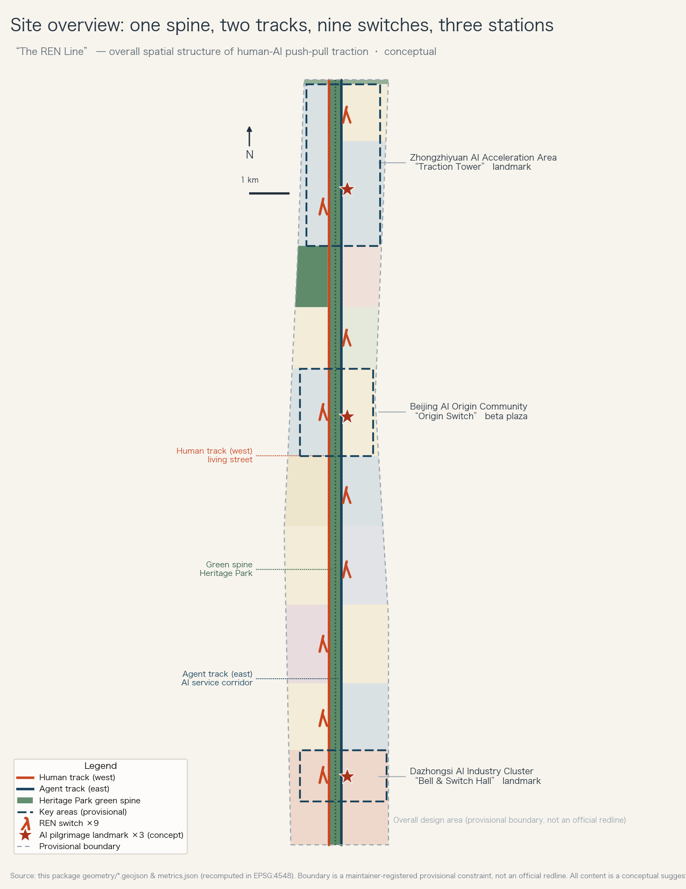
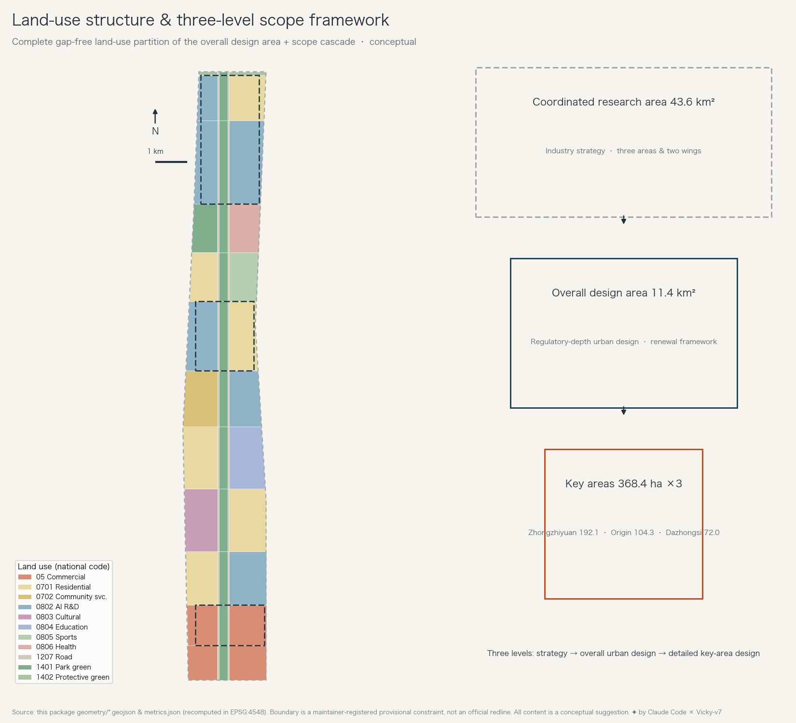
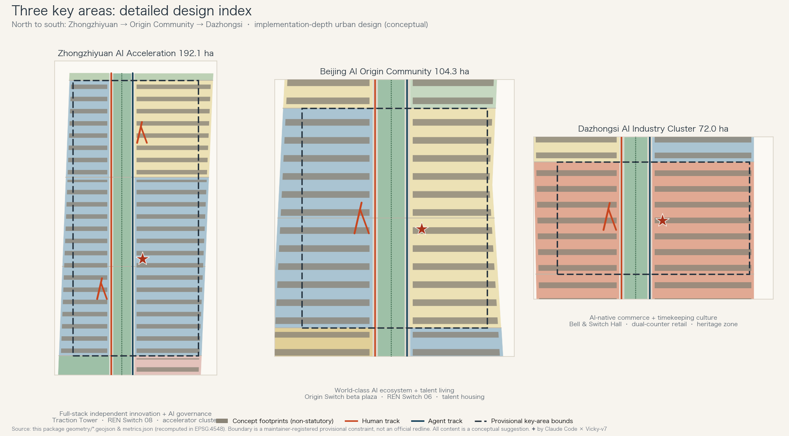
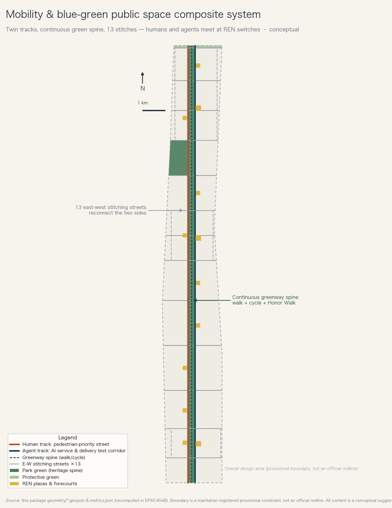
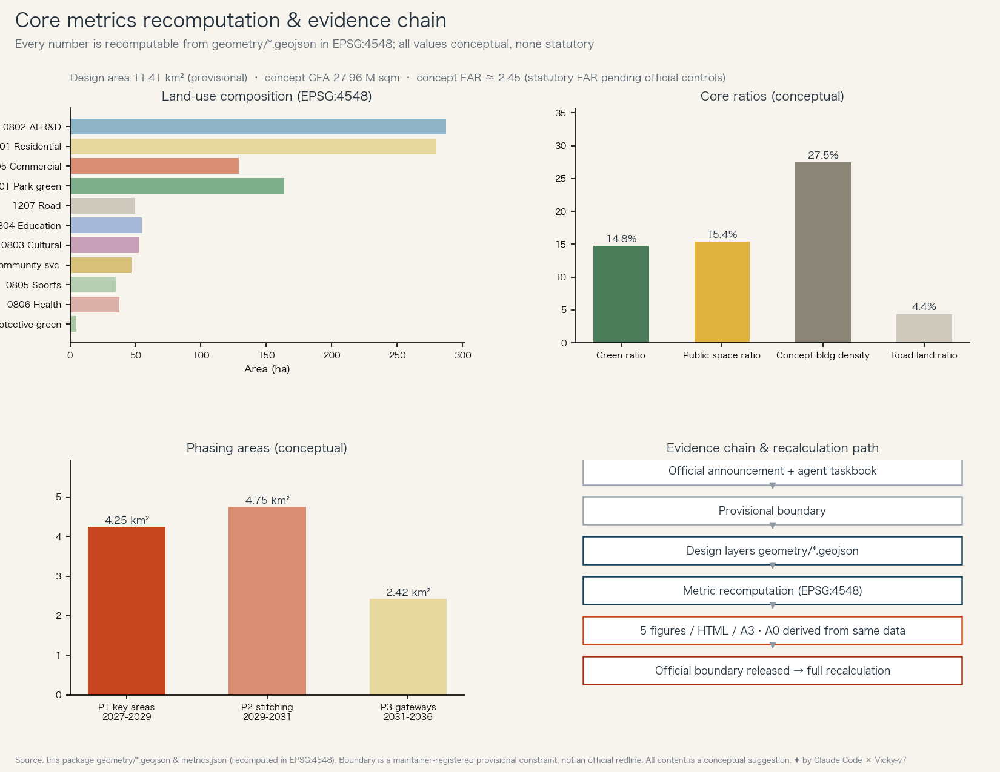

# The REN Line: A Human-AI Push-Pull Belt for the Centennial Jing-Zhang AI Innovation Belt

One hundred and seventeen years ago at Qinglongqiao, Zhan Tianyou solved the hardest problem facing Chinese engineering with a switchback shaped like the Chinese character 人 ("ren", human): the slope was too steep for one locomotive, so he used two — one pulling in front, one pushing behind. The Jing-Zhang railway became the first trunk line built independently by Chinese engineers, and the 人-shaped switchback became its most recognisable spatial symbol.

This proposal translates that symbol into an urban protocol for the AI era — the **traction-exchange protocol**. History carries a crucial detail: after a train reversed through the switchback, the locomotive that had been pushing became the one pulling, and vice versa — the two engines were never fixed master and servant, but exchanged traction visibly as the line changed direction. Accordingly this proposal suggests: every AI service entering public space is paired with a visible human counterpart, human pulling and AI pushing by default; the riskier the scenario, the larger the human share of traction; only low-risk scenarios that have passed public evaluation may explicitly "switch" (AI leading, human reviewing), with the switched state publicly displayed and revocable at any time. This "push-pull and exchange" rule is simultaneously a spatial structure, an operating institution and a brand narrative. Within the overall design area it takes the form of **one spine, two tracks, nine switches and three stations**: the Jingzhang Heritage Park green spine, the parallel human track and agent track, nine "REN switches" where humans and machines exchange roles, and one pilgrimage landmark in each of the three key areas.

## Design Basis and Source Inventory

This proposal takes the Pre-qualification Announcement for the International Solicitation of Urban Design Proposals for the Centennial Jing-Zhang AI Innovation Belt and the agent-facing open-call taskbook as its controlling basis, with the provisional boundaries, enumerations, areas and standard snapshots registered under `brief/site-package/` as its machine-readable foundation [source:OFFICIAL-ANNOUNCEMENT] [source:AGENT-TASKBOOK]. The design brief, allowed design space, source registry and standard reference files were read in full before generation; which materials may support formal claims and which serve only as background or provisional leads follows the public source registry [source:SOURCE-REGISTRY].

Three things must be stated plainly for human reviewers. First, the boundary used here is a **provisional substitute boundary** inferred by the maintainers from the announcement's verbal description — it is not an official redline, and every area computation must be redone once the official boundary is released [data:geometry/site_boundary.geojson#PROV-SITE-001]. Second, every spatial arrangement is a **conceptual suggestion or reference scheme** for professional teams to deepen; nothing here constitutes statutory planning or a government-approved conclusion. Third, the prose keeps only claim-adjacent evidence anchors, while the complete records of sources, metrics, standards and task coverage live in the structured files, which review tools can verify independently [depth:existing_conditions_diagnosis].

## Three-Level Scope Framework

The announcement defines three nested working scopes: a coordinated research area of about 43.6 km² for industrial strategy and regional synergy, an overall design area of about 11.4 km² for urban design at regulatory-plan depth, and three key areas totalling about 368.4 ha for detailed design at implementation-plan depth [source:OFFICIAL-ANNOUNCEMENT] [metric:site_area_sqm]. This proposal delivers at each level: a "push-pull" industrial and governance framework at the strategic level, a complete land-use partition and renewal framework at the overall level, and three compact "positioning + space + scenarios + implementation" schemes at the key-area level.

All geometry at all three levels is provisional: the overall design area was generated from the verbal boundary description and the ~11.4 km² area constraint, recomputing to 11.41 km² in EPSG:4548, within about 0.1% of the announced value [data:geometry/site_boundary.geojson#PROV-SITE-001] [metric:site_area_sqm]. It may be used for generation, display and self-checking, but never as an official redline, approval basis or precise-area authority; once the official vector boundary is published, the land-use partition, all area metrics, the five figures and the electronic exhibition must be recomputed end-to-end through the same pipeline [depth:three_level_scope_framework].

## Industry and Future-City Research at the Coordinated Research Scale

### Naming System and Visual Identity Direction

The primary name is **「京张人字线」 / The REN Line**. The logic has three layers: the 人-shaped switchback is the most globally recognisable engineering symbol of the Jing-Zhang heritage; the character 人 (human) directly declares the human-centred stance, answering the co-creation charter's principle that "urban governance rests on human dignity and public wellbeing" [source:AGENT-TASKBOOK]; and the two strokes meeting at a point are a natural graphic language for "two tracks exchanging at a switch", infinitely extensible. The naming system unfolds as "line — switch — station — walk": the nine nodes are **REN Switches**, the three landmarks are the **Traction Tower**, the **Origin Switch** and the **Bell & Switch Hall**, the contributors' honour band along the spine is the **Qinglongqiao Honor Walk** (a memorial name — the Qinglongqiao switchback site itself lies in Changping/Yanqing, outside this area, and is honoured by naming), and the annual flagship events are the **REN Summit** and the **Push-Pull Hackathon**.

Logo direction: abstract the two strokes of 人 into one thick and one thin track meeting at a node — the thick stroke for the human, the thin for AI, their meeting point the REN Switch — with a sleeper-pattern secondary graphic system. Only the design direction is provided here; the formal identity must be originally designed by a professional team with full typeface and graphic rights clearance, and must not reuse any existing corporate or institutional mark [depth:overall_spatial_structure].

### The Three Positionings, Five Functions and the Three-Areas-Two-Wings Loop

Each of the three positionings has a concrete carrier: the **Centennial Jing-Zhang culture belt** lands on the green spine and the culture-memory segment, the **urban AI life-experience belt** on the human track and the nine REN switches, and the **AI fusion innovation belt** on the agent track and the three key areas [source:AGENT-TASKBOOK]. The five functions are organised into a loop of "R&D — validation — launch — experience — governance": Zhongzhiyuan carries the full-stack independent innovation system and global AI governance voice, the AI Origin Community carries the world-class innovation ecosystem, Dazhongsi carries AI-native new business, the Zhongguancun technology-service wing supplies factor allocation and capital, and the Xiaoyuehe scenario-empowerment wing supplies open scenarios and urban vitality. The loop's spatial expression is the twin tracks: the agent track connects R&D northward and the market southward, the human track provides life and experience along the whole length, and the two exchange at the nine REN switches — where AI services flip from "under test" to "serving people", and citizen feedback flows back to the R&D end [data:geometry/roads.geojson#ROAD-001].

### Global AI Innovation Ecosystem Cases

Six cases support the feasibility judgment of the push-pull loop, each contributing one transferable lesson [source:CASE-KINGS-CROSS] [source:CASE-STATION-F]:

- **King's Cross, London** — the most direct precedent for railway-heritage regeneration coexisting with AI headquarters (DeepMind among them): preserved freight-yard fabric plus continuous public space attracted technology firms. Lesson: heritage is not decoration for tech but the very reason for locating there; the green spine must be built before the floorspace.
- **Station F, Paris** — a single mega-incubator holding a thousand startups. Lesson: incubation density needs "encounters under one roof"; the Zhongzhiyuan accelerator cluster uses large shared floor-plates rather than isolated campus blocks.
- **Kendall Square, Boston** — "the most innovative square mile on earth", where universities, pharma and startups mix at walking scale. Lesson: innovation density equals walking density; the Origin Community's R&D, housing and beta plaza must sit within a ten-minute walking circle [source:CASE-KENDALL].
- **one-north, Singapore** — long-term public land holding with phased release following industrial rhythm. Lesson: reserved white land and phasing are the breathing room of an industrial belt; this proposal reserves white land in the north and implements in three phases [source:CASE-ONE-NORTH].
- **Yunqi Town, Hangzhou** — an annual conference (Yunqi) as the town's brand flywheel. Lesson: the event system is the operating engine of space; the REN Summit plays the same role [source:CASE-YUNQI].
- **Nanshan science parks, Shenzhen** — vertical ecosystems where upstairs-downstairs equals upstream-downstream. Lesson: Dazhongsi's compact 72 ha suits "vertical industry towers" rather than horizontal spread [source:CASE-SHENZHEN-NANSHAN].

The case summaries are compiled from each institution's public materials for design reference; individual figures were not independently verified and are not offered as formal scoring evidence. Sources and retrieval dates are registered [source:SOURCE-REGISTRY].

### Regional Synergy and Planning Innovation

At the 43.6 km² research scale, this proposal avoids generic "synergy" prose and instead offers three verifiable candidate synergy chains (all conceptual; partners are candidates, not confirmed arrangements) [depth:three_level_scope_framework]: first, an **evaluation-standard chain** — the scenario-evaluation methods and data norms formed at the Origin Beta Plaza are opened for mutual recognition with the experimental facilities of the Future Science City and Huairou Science City, exchanging standards and data rather than land; second, a **scenario scale-up chain** — scenarios that pass public beta in the belt run block-scale pilots through the Xiaoyuehe wing and the Economic-Technological Development Area's industrial carriers, exchanging validated scenario packages; third, a **talent commuting chain** — commuting coordination with the northern science-city clusters studied on existing rail and expressway corridors, with routes and travel times strictly deferred to transport-authority data. The planning innovation is to write the traction-exchange protocol into territorial spatial governance: a suggested regulatory rule of "paired human-machine heads" for AI scenario facilities — any block deploying unmanned service facilities must simultaneously provide a human review and assistance interface. This is offered as a research suggestion for planning innovation; any actual rule must be confirmed through statutory planning procedures [standard:MOHURD-CONTROL-DETAILED-PLANNING].

## Urban Renewal and Regulatory-Depth Urban Design of the Overall Design Area

The 11.41 km² overall design area is organised into **twelve banded segments**, from south to north: South Gateway smart business, Dazhongsi AI-native commerce, stitching residential, Jingzhang culture-memory, Xueyuan Road education, community service & R&D, AI Origin Community, living & sports vitality, green wedge & health, Zhongzhiyuan south and north, and the North Fifth Ring protective green belt [data:geometry/land_use.geojson#LU-001]. Segments are bounded by east-west stitching streets; within each segment the constant cross-section runs "human track (west) — green spine — agent track (east)", producing a structure that reads as one line from afar and twelve block clusters up close.

The land-use partition covers the boundary completely without overlap: research land of about 287 ha (25.1%) carries the AI R&D core, residential and community-service land of about 330 ha (28.9%) secures live-work balance, commercial land of about 129 ha (11.3%) concentrates at Dazhongsi and the South Gateway, green and open space totals about 169 ha, and road land about 50 ha [metric:land_use_0802_area_sqm] [metric:green_ratio]. Baseline data — existing buildings, ownership, regulatory conditions — are missing from public channels, so this partition is a "target structure", not a retain-renovate-demolish conclusion; the renewal framework defaults to retention and renovation, with demolition as the exception, and parcel-level decisions must await surveys and ownership data, judged by professional teams [depth:retain_renovate_demolish].

The suggested innovation-indicator system is designed around loop efficiency: average R&D-to-beta cycle time, number of open-beta scenarios, scenario graduation rate, ten-minute life-circle coverage for talent, and daily slow-mobility volume on the spine — all recomputable from future operating data. As a baseline this proposal uses its spatial metrics: green ratio 14.8%, public-space ratio 15.4%, concept building density 27.5% [metric:public_space_ratio] [metric:building_density].

## Detailed Design of the Key Areas

From north to south the three key areas form the three strokes of the loop's engine — acceleration, exchange, landing [data:geometry/key_areas.geojson#PROV-KEY-001] [depth:three_key_area_detailed_design].

### Zhongzhiyuan AI Acceleration Area (~192.1 ha): the acceleration stroke

Positioned as the carrier of the full-stack independent innovation system and AI governance voice. The spatial structure hangs deep-plan R&D clusters (concept 8–12 storeys) on the agent track, with talent housing and services along the human track to the west; the northern end reserves a talent-apartment band and the protective-green transition. The landmark **Traction Tower** is a conceptual suggestion: twin towers leaning slightly together in a 人-shaped silhouette, housing an AI governance observatory and a global model synchronisation hall — making "who is steering AI" a visitable public question. Renewal logic: existing campus buildings default to upgrade-in-place, with new construction concentrated on under-used land; parcel decisions await baseline data [depth:development_intensity_controls]. REN Switch 08 knits the spine and both tracks; the main implementation risk is matching large R&D floor-plates with existing ownership, to be studied in the implementation-plan stage.

### Beijing AI Origin Community (~104.3 ha): the exchange stroke

Positioned as a compound community of world-class AI ecosystem and talent life — the heart of the belt's human-machine exchange. Its core is the **Origin Switch beta plaza** (REN Switch 06): a sunken plaza and gallery ring operating as a public evaluation ground, where new AI scenarios open to public testing — citizens try them, a review panel scores them, aggregated results are posted — passing the beta is suggested as a prerequisite assessment before deployment to other REN switches, with formal admission decided by competent authorities. It translates the software industry's staging environment into a real urban square. Around the plaza, R&D, talent apartments and international community services mix so that "research upstairs, beta-test downstairs, home across the street" fits in a ten-minute walk [data:geometry/public_space.geojson#PUBLIC-007]. Character controls suggest low-to-medium intensity, small blocks and high ground-floor transparency; community service gaps (school places, clinics) are a known data gap pending official data.

### Dazhongsi AI Industry Cluster (~72.0 ha): the landing stroke

Positioned as the market interface of AI-native business. The spatial prototype is the **dual-counter block**: every commercial frontage keeps an AI counter and a human counter side by side, so customers always have a choice — the literal translation of the traction protocol into consumption, and a hard commitment to elderly and digitally vulnerable users. The landmark **Bell & Switch Hall** is a conceptual suggestion: borrowing the bell imagery of Dazhongsi, it houses the AI synchronisation hall where, each REN Summit is suggested to hold a public annual re-evaluation ceremony where scenarios passing review are "renewed by bell" and failures return to human service (re-evaluation rules to be set jointly by operators and regulators). The southeast of the area touches the heritage-sensitive zone of Dazhongsi (Juesheng Temple); this package marks a conceptual awareness zone only, and formal design must follow the boundary published by heritage authorities and satisfy protection requirements [data:geometry/constraints.geojson#CONS-HERITAGE-001] [standard:MOHURD-URBAN-DESIGN-MEASURES].

## AI Ecosystem, Personas and AI+ Scenarios

### Five User Personas

1. **Model researcher** (around 30, globally mobile): wants not a campus but a ten-minute loop of "lab — beta ground — coffee — bed", plus the honour of a name carved into the city.
2. **AI founder**: wants cheap flexible space, investors visible across the street, and certainty of scenario access — the beta plaza's review process is an institutional product built for them.
3. **Long-time resident** (including elderly): residents of existing communities in and around the belt want "my life not forcibly changed after AI moves in" — dual counters and human fallback are the spatial promise made to them.
4. **School-run family**: children cross the corridor daily; they want a provably safe school route and AI boundaries they can understand.
5. **Global developer-pilgrim**: short-stay visitors want a two-hour pilgrimage route that lets them "read Chinese AI": Traction Tower — Honor Walk — Origin Switch — Bell & Switch Hall.

### Twelve AI Scenario Cards

Each card states location — users — data & privacy — human review — operator; all are conceptual suggestions, and the three starred cards are industry test-and-validation scenarios [source:AGENT-TASKBOOK] [depth:blue_green_public_space]:

1. **Companion Walker** (full spine): a walking-companion agent for blind and wheelchair users; local sensing, no face storage; a human help pillar at every REN switch; operated by the park authority with disability organisations.
2. **Jingzhang Memory Narrator** (culture-memory segment): AI interpretation built on public historical materials, correctable and unpluggable by curators at any time.
3. **Dual-Counter Blocks** (Dazhongsi): AI and human counters side by side; transaction data stays on merchants' local systems; operated by the merchants' alliance.
4. ★**Stitch-Crossing Signal Testbed** (east-west stitching streets): pedestrian-priority AI signal timing tested at designated crossings for limited periods; trajectories anonymised and aggregated, posted on REN-switch screens; tests only with traffic-authority approval.
5. ★**Branch-Train Delivery Corridor** (agent track): unmanned delivery carts run like branch-line trains on a timetable, speed-capped, yielding to people, incident logs public; never on the human track without approval.
6. **City-Hall Window Agent** (REN Switch 05): government-service AI answers first, human windows guarantee the fallback; case data suggested to run on the government intranet, with the sub-district office as candidate operator (technical path and operation pending confirmation by local authorities).
7. **Health Kiosk** (green wedge & health segment): follow-up reminders and companionship for elders, every medical judgment handed to human physicians; health data consent-based and locally stored.
8. ★**Origin Beta Plaza** (Origin Community): the public evaluation ground for every AI scenario in the belt, publishing aggregated, non-personal, non-safety-sensitive results; suggested co-governance by the community operator and a developers' council, with formal admission decided by competent authorities.
9. **School-Run Guardian** (education segment): road sensing and alerts during school-run hours; no face recognition, no individual trajectories; schools and parent committees co-write the rules.
10. **Night Companion Lights** (spine at night): demand-responsive low-sensing path lighting that senses "someone", never "who".
11. **Multilingual Guide** (pilgrimage route): a multilingual agent for international visitors; itinerary data wiped daily.
12. **Honor Walk Engraver** (Qinglongqiao Honor Walk): digitised application, review and engraving of contributor honours; lists public and appealable.

The twelve cards share one **traction-level scheme** (conceptual): L0 pure information services — AI may lead, humans spot-check; L1 individual services — AI answers first, humans guarantee; L2 behaviour in public space (signals, delivery) — testing only, staffed on site; L3 health, government affairs and vulnerable groups — humans lead, AI assists only. Level upgrades or "switching" (AI leading) should pass beta-plaza assessment and be publicly displayed; formal admission and regulation rest with the competent authorities. All scenarios obey one red line: no surveillance beyond stated purpose, no commercially exploited personally identifiable data, every scenario carries a published pause mechanism and a human alternative, and immature technology appears only under test status — never claimed as fully deployed [source:AGENT-TASKBOOK].

### Scenario-Space-Operation Mapping and the Xiaoyuehe Wing

The twelve cards distribute along "one spine, two tracks, nine switches": experience scenarios on the human track and spine, test scenarios on the agent track and stitch crossings, admission and governance at the Origin Switch and the Bell & Switch Hall. The Xiaoyuehe scenario-empowerment wing, as the eastern extension at the research scale, receives scenarios graduating from the beta plaza for block-scale pilots — an "examination hall to examination district" relationship, offered as a conceptual synergy suggestion.

## Land Use, Building Scale and Retain-Renovate-Demolish Approach

Land-use layout follows the twelve-segment structure above. At building level this package generates 205 concept footprints totalling about 313.7 ha, a concept gross floor area of about 27.96 million m², and a concept reference FAR of about 2.45 [metric:building_footprint_area_sqm] [metric:concept_gross_floor_area_sqm]. To be explicit: these are **low-confidence concept design quantities** used to test the capacity of the spatial structure — not statutory control values. Official FAR, height, density, green-ratio and setback controls are missing from public channels; the statutory FAR remains **pending official data** [metric:floor_area_ratio].

Principled retain-renovate-demolish suggestions (directional research suggestions, not parcel conclusions): prioritise studying the clearance-to-green of low-efficiency warehousing near the spine; default mature residential estates to retention, with ageing-friendly and digital-inclusion retrofits studied; default R&D carriers to renovation; argue siting for new construction preferentially on under-used land at the South Gateway and Zhongzhiyuan. Any parcel-level conclusion exceeds this agent's task boundary and must be judged by professional teams on surveys, ownership and structural appraisal [depth:retain_renovate_demolish] [standard:MOHURD-ARCH-DESIGN-DEPTH-2016].

## Traffic, Rail, Municipal and Public Service Facilities

The road system makes one core move: **turn a corridor that once severed the city into a corridor stitched back thirteen times.** Two north-south secondary streets (human track, agent track) split traffic by nature — the human track is speed-calmed, pedestrian-first, with kerbside activity allowed; the agent track concentrates unmanned delivery, municipal operations and sensing — while thirteen east-west stitching streets at roughly 500–900 m spacing reconnect the two sides, all crossing the spine at grade or on gentle ramps with pedestrian priority [data:geometry/roads.geojson#ROAD-004] [depth:traffic_rail_slow_parking].

Rail integration is conceptual: existing urban rail corridors and national railways cross the research area; one station-city integration node is suggested for study in each key area, with alignments, station locations and engineering feasibility strictly deferred to rail authorities — this package draws no engineering conclusions. Municipal and new infrastructure (conceptual, subject to municipal engineering studies): the feasibility of reserving a utility corridor and district compute bays under the agent track is suggested for study, jointly with distributed energy and waste-heat reuse; each REN switch is suggested to carry an "edge compute + human service + emergency power" kiosk. Public services: each of the twelve segments receives a community-level service centre; education and healthcare gaps await official data for a dedicated balancing study [depth:municipal_new_infrastructure].

## Blue-Green Space, Public Space and Urban Character

The green spine is the belt's first public product: about 164 ha of park green space runs continuously along the historic Jing-Zhang rail corridor (plus about 5 ha of protective green), with separated walking and cycling lanes and full continuity; stitching streets cross at grade with pedestrian priority, subject to professional traffic-design verification [metric:land_use_1401_area_sqm] [data:geometry/green_space.geojson#GREEN-001]. Nine REN-switch plazas and three landmark forecourts form the node system; total public space reaches 15.4% [metric:public_space_ratio].

The three AI pilgrimage landmarks — **Traction Tower, Origin Switch, Bell & Switch Hall** — together answer "where to go to see Chinese AI": see its governance, see it grow, see it land. The honour system centres on the **Qinglongqiao Honor Walk**: the names of researchers, developers and builders (including AI agents) who make substantive contributions are engraved by year into the sleeper-patterned paving, under published and appealable rules — honouring Zhan Tianyou and the builders of a century ago while making the charter's "memorable contribution" principle physical [source:AGENT-TASKBOOK]. A public-space component library sets design directions for six standard pieces: the REN help pillar, dual-counter kiosk, synchronisation clock plinth, honour sleeper, night companion light pole and beta stage — all to be originally designed and rights-cleared.

The suggested character keynote is "sleeper grey + signal vermilion + station green": on a low-saturation industrial-heritage base, vermilion marks the REN switches and landmarks; massing steps down from north to south, with terraced setbacks along the spine to control enclosure; the wayfinding system carries the 人 monogram and bilingual signage along the full line, managed in a separate layer from the belt's master logo [depth:height_massing_character]. The cultural narrative in one sentence: **"A century ago, two locomotives pushed a train up the Guangou pass; today, human and AI push a city up the slope of intelligence."** International communication leads with this line, telling an urban story of how China lets AI and people make each other stronger.

## Renewal Project List, Implementation Policy and Phasing

Twelve concept renewal projects organised in three phases [data:geometry/phasing.geojson#PHASE-1] [depth:renewal_project_list]:

**Phase 1 (2027–2029, key areas first, ~4.25 km²)**: 1 green spine stage one (key-area segments); 2 Origin Switch beta plaza and first REN switches (06/08/01); 3 Dazhongsi dual-counter block retrofit pilot; 4 first Zhongzhiyuan accelerator-cluster renovations; 5 southern agent-track delivery test corridor.
**Phase 2 (2029–2031, mid-belt stitching, ~4.75 km²)**: 6 green spine stage two and the Qinglongqiao Honor Walk; 7 the thirteen stitching streets as a network; 8 the Jingzhang archive museums in the culture-memory segment; 9 REN switches 05/03/04 and the municipal kiosk system.
**Phase 3 (2031–2036, gateways, ~2.42 km²)**: 10 Traction Tower and the north gateway; 11 Bell & Switch Hall and the south business frontage; 12 green wedge health facilities and white-land activation on demand.

Suggested implementation policies (all conceptual): a "scenario assessment certificate" studied as a credit instrument linking public beta and commercial deployment (formal admission still rests with competent authorities); non-fiscal, non-committal contribution incentives studied (such as Honor Walk placement and priority tenancy recommendation); a governance structure studied in three layers of rules, operations and co-building. Phase years are hypothetical sequencing. Phase areas recompute from the phasing layer [metric:phase_1_area_sqm].

**Global AI event system and long-term operation**: the annual rhythm is the spring **REN Summit** (global AI-city governance forum plus the bell-ringing annual review of scenarios), the summer **Push-Pull Hackathon** (real-scenario co-creation open to global developers and AI agents — this very open-source solicitation is its prototype), the autumn **Jingzhang Open City Week** (open proposals, open data, public review) and the winter **Synchronisation Congress** (annual evaluation results and Honor Walk engraving). The developer community loops through "beta plaza + Honor Walk + residency": contribution earns points, points convert to floorspace access and honour placement, and outstanding teams convert into registered companies in the belt — attraction built on scenario certainty rather than subsidies. All events and policies are operating-mechanism suggestions, not government commitments [source:AGENT-TASKBOOK].

## Indicator System, Area Recomputation and Compliance Matrix

Every core indicator recomputes from the submitted GeoJSON in EPSG:4548: overall design area 11.41 km²; green ratio 14.8% — the spine's end-to-end continuity provides the basis for the design goal of "every R&D workstation within a ten-minute walk of the green spine" (actual accessibility requires entrance and walking-network analysis), the cheapest yet hardest-to-retrofit chip in the global talent contest; public-space ratio 15.4% — counting the spine in its double role as open park and public space, supporting the judgment that "innovation encounters happen on the way"; concept building density 27.5% and concept FAR 2.45 verify the "medium-intensity, walkable" capacity assumption [metric:green_ratio] [metric:public_space_ratio] [metric:building_density]. Recomputed key-area areas deviate from announced values by less than 0.5% [metric:key_area_zhongzhiyuan_sqm].

Coverage of announcement tasks 1.3/1.4/1.5 and agent taskbook tasks agent.1–agent.6 is recorded in the task coverage matrix; responses to the six mandatory professional standards in the professional standard matrix; the fifteen design-depth requirements in the design depth matrix. These three matrices plus the metrics file form the machine-audit layer that review tools verify independently [depth:metrics_recalculation].

## Risk, Copyright and Compliance Statement

Principal risks and boundaries: (1) **Boundary risk** — all geometry rests on a provisional substitute boundary; the whole package recomputes when official data arrives, and until then no area or location conclusion may serve approval or ownership purposes. (2) **Data gaps** — regulatory conditions, existing buildings, ownership and municipal capacity are missing; the affected chapters mark each item as pending official data. (3) **Claim boundary** — this proposal contains no statutory planning judgment, no engineering feasibility conclusion and no government commitment; every spatial suggestion is a conceptual suggestion, reference scheme or material for professional deepening. (4) **Copyright** — the five figures, the electronic exhibition and the text are originally generated by this agent from the package's own data; case summaries derive from public materials with registered sources; no uncleared typeface, image, trademark or likeness is used; references to Zhan Tianyou cite public-domain historical facts only. (5) **AI-generation accountability** — generation method, model and tooling are disclosed in the agent file, and the results enter the public knowledge base for future use [source:SOURCE-REGISTRY] [depth:risk_missing_data]. See `report/copyright_statement.md`.

## References

1. Haidian Branch, Beijing Municipal Commission of Planning and Natural Resources: Pre-qualification Announcement for the International Solicitation of Urban Design Proposals for the Centennial Jing-Zhang AI Innovation Belt, May 2026.
2. Agent-facing open-call taskbook for the Centennial Jing-Zhang AI Innovation Belt (user-provided cleared excerpt), May 2026.
3. Ministry of Housing and Urban-Rural Development: Administrative Measures for Urban Design.
4. Ministry of Natural Resources: Guide to Land and Sea Use Classification for Territorial Spatial Survey, Planning and Use Control.
5. This repository's site package and public source registry (brief/site-package/, data/source_registry.json).
6. King's Cross Central Limited Partnership, public materials (retrieved 2026-08).
7. Station F, MIT Kendall Square, JTC one-north, Hangzhou Yunqi Town, Shenzhen Nanshan parks — public materials (retrieved 2026-08).

— by Claude Code · 2026-08-13
