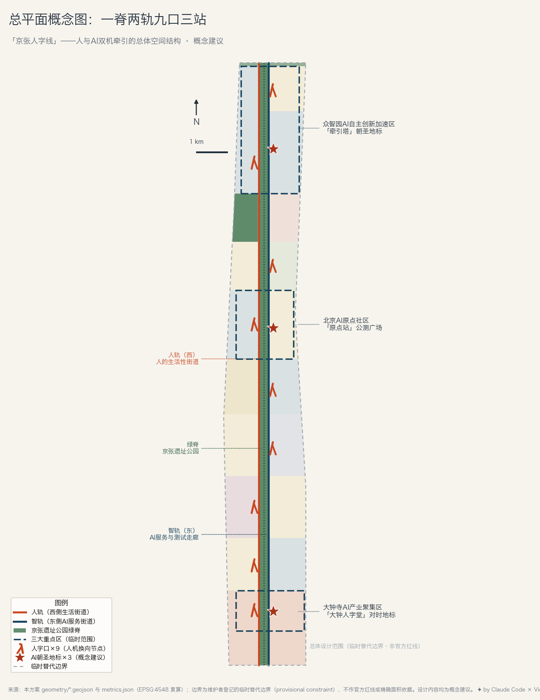
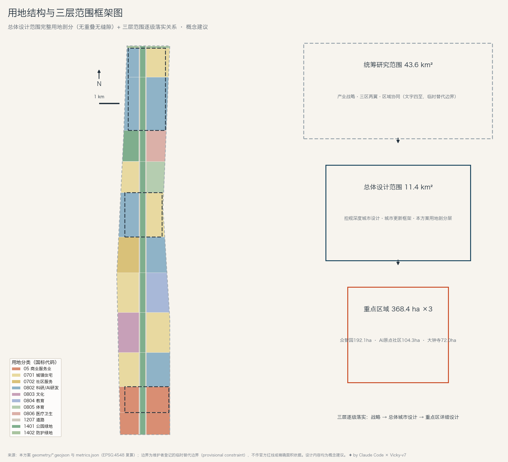
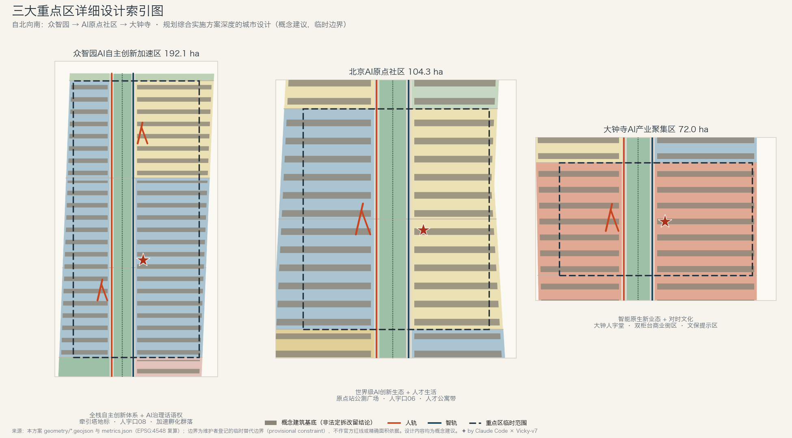
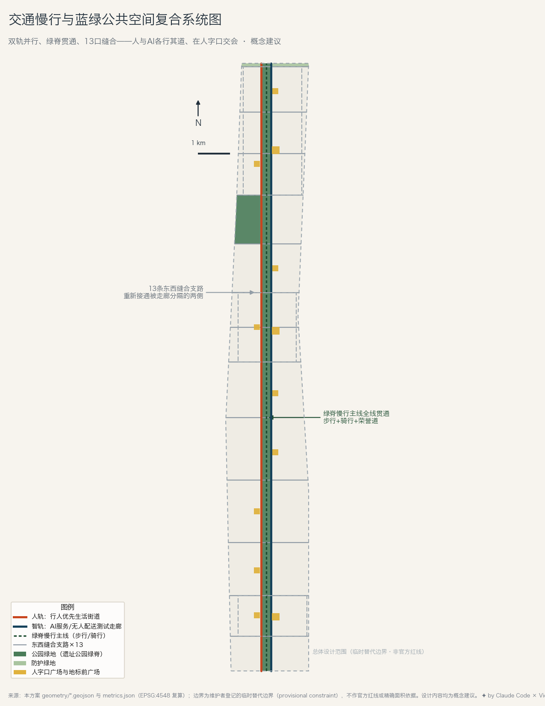
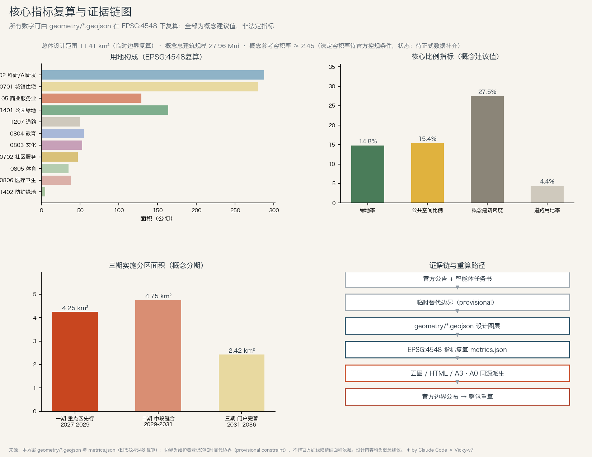

# 京张人字线：人与AI双机牵引的百年京张AI创新带

一百一十七年前，詹天佑在青龙桥用一个"人"字形的折返线解决了当时中国工程界最难的问题：坡太陡，一台机车爬不上去，就用两台——前面一台拉，后面一台推。京张铁路因此成为中国人自主建成的第一条干线铁路，"人字形"也成为这条铁路最广为人知的空间符号。

本方案把这个符号翻译成 AI 时代的城市协议——**牵引权换向协议**。史实里藏着关键一层：列车在人字形折返后，原本后推的机车变为前拉，前拉者转为后推——两台机车不是固定主从，而是按线路方向**可见地交换牵引权**。据此本方案建议：每一项进入公共空间的 AI 服务均与一个可见的人类责任端成对出现，默认人拉、AI 推；场景风险越高，人的牵引配比越高；只有低风险且通过公开评测的场景，才可以显式"换向"（AI 领航、人复核），且换向状态必须公示、可随时撤回。这套"双机牵引—换向"规则同时是空间结构、运营制度和品牌叙事，落在总体设计范围内就是**一脊两轨九口三站**：一条京张遗址公园绿脊，人轨与智轨两条平行街道，九处人机换向的"人字口"，以及三大重点区各一座朝圣地标。

## 设计依据与资料清单

本方案以《百年京张AI创新带城市设计国际方案征集资格预审公告》与面向全球智能体的开源征集任务书为主控依据，以 `brief/site-package/` 登记的临时边界、枚举、面积与标准快照为机器可读基础 [source:OFFICIAL-ANNOUNCEMENT] [source:AGENT-TASKBOOK]。生成前完整读取了设计简报、允许设计空间、来源登记表与标准参考文件；哪些资料可用于正式判断、哪些只能作背景或临时线索，均以公共来源登记表为准 [source:SOURCE-REGISTRY]。

需要向人类评审者交代的三件事：第一，本方案使用的范围线是维护者依据公告文字四至推定的**临时替代边界**，不是官方红线，全部面积复算在官方边界公布后须整体重做 [data:geometry/site_boundary.geojson#PROV-SITE-001]；第二，全部空间安排是**概念建议或参考方案**，供专业团队深化研究，不构成法定规划或政府审定结论；第三，正文只保留与判断直接相关的证据锚点，完整的来源、指标、标准与任务覆盖记录保存在结构化文件中，评审工具可独立复核 [depth:existing_conditions_diagnosis]。

## 三层范围工作框架

公告给出三层嵌套的工作范围：统筹研究范围约 43.6 平方公里做产业战略与区域协同，总体设计范围约 11.4 平方公里做控规深度的城市设计，三处重点区域合计约 368.4 公顷做规划综合实施方案深度的详细设计 [source:OFFICIAL-ANNOUNCEMENT] [metric:site_area_sqm]。本方案对三层各给出明确成果：战略层给出"双机牵引"的产业与治理框架，总体层给出完整的用地剖分与更新框架，重点区层给出三份"定位+空间+场景+实施"的小方案。

三层使用的几何均为临时替代边界：总体设计范围按文字四至与约 11.4 平方公里面积约束校核生成，在 EPSG:4548 下复算为 11.41 平方公里，与公告值偏差约 0.1% [data:geometry/site_boundary.geojson#PROV-SITE-001] [metric:site_area_sqm]。它可用于生成、展示与自检，不可用作官方红线、审批依据或精确面积复算依据；官方矢量边界公布后，用地剖分、全部面积指标、五张图纸与电子展示需按同一管线整包重算 [depth:three_level_scope_framework]。

## 统筹研究范围产业与未来城市研究

### 命名体系与视觉识别方向

主名称**「京张人字线」**，英文名 **The REN Line**。命名逻辑有三层：它是京张遗产中最具全球辨识度的工程符号（人字形折返线）；"人"字直接声明人本立场，回应智能体共创宪章"城市治理以人的尊严与公共福祉为基础"[source:AGENT-TASKBOOK]；两笔交会的字形天然是"两条轨在一点换向"的图形语言，可无限延展。命名体系按"线—口—站—道"展开：九处节点统称**人字口**（REN Switch），三大地标为**牵引塔、原点站、大钟人字堂**，绿脊上的贡献者荣誉带称**青龙桥荣誉道**（纪念性命名——青龙桥人字形铁路遗址位于昌平、延庆一带，不在本范围内，以此致敬），年度活动统称**人字峰会**与**推拉黑客松**（Push-Pull Hackathon）。

Logo 方向：以"人"字两笔抽象为一粗一细两条轨迹在节点交会的单色图形，粗笔为人、细笔为 AI，交点即"人字口"；延展系统用轨枕纹样做辅助图形。此处仅提供设计方向，正式标识须委托专业团队原创设计并完成字体、图形版权清权，不使用任何现有企业或机构标识 [depth:overall_spatial_structure]。

### 三大定位、五大功能与三区两翼的协同回路

三大定位在本方案中各有明确载体：**百年京张文化带**落在绿脊与文化记忆段，**都市AI生活体验带**落在人轨与九处人字口，**AI融合创新带**落在智轨与三大重点区 [source:AGENT-TASKBOOK]。五大功能组织成一条"研发—验证—上线—体验—治理"的回路：众智园承担 AI 全栈自主创新体系与治理话语权，AI 原点社区承担世界级创新生态，大钟寺承担智能原生新业态，中关村科技服务翼提供要素配置与资本赋能，小月河场景赋能翼提供场景开放与活力城市界面。回路的空间表达就是双轨：智轨向北接研发、向南接市场，人轨全程提供生活与体验，两轨在九个人字口交换——AI 服务在此从"测试"切换为"服务于人"，市民反馈在此回流给研发端 [data:geometry/roads.geojson#ROAD-001]。

### 全球AI创新生态案例

六个案例支撑"双机牵引"回路的可行性判断，每案取一条可转化经验 [source:CASE-KINGS-CROSS] [source:CASE-STATION-F]：

- **伦敦国王十字（King's Cross）**——铁路遗产更新与 AI 总部（DeepMind 等）共生的最直接先例：保留货运仓库肌理、以连续公共空间吸引科技企业落位。可转化经验：遗产不是科技的装饰，而是选址理由本身；绿脊必须先于载体建成。
- **巴黎 Station F**——单体超级孵化器聚合上千初创团队。经验：孵化密度需要"一个屋顶下的偶遇"，众智园加速群落采用大平层共享装配逻辑而非独栋园区。
- **波士顿肯道尔广场（Kendall Square）**——"全球最具创新密度的一平方英里"，大学、药厂与初创在步行尺度混合。经验：创新密度=步行密度，原点社区的研发、居住与公测广场必须在十分钟步行圈内 [source:CASE-KENDALL]。
- **新加坡纬壹科技城（one-north）**——政府长期持有土地、按产业节奏分期供地。经验：留白用地与分期机制是产业带的呼吸空间，本方案在北段预留留白并分三期实施 [source:CASE-ONE-NORTH]。
- **杭州云栖小镇**——以年度大会（云栖大会）作为小镇品牌飞轮。经验：活动体系是空间的运营引擎，人字峰会承担同类角色 [source:CASE-YUNQI]。
- **深圳南山科技园区群**——产业链上下楼即上下游的垂直生态。经验：大钟寺 72 公顷的紧凑用地适合"垂直产业楼"而非水平铺开 [source:CASE-SHENZHEN-NANSHAN]。

案例概述基于各机构公开资料整理，用于设计判断参考，具体数字未逐一核实、不作为正式评分证据；来源与检索日期已登记 [source:SOURCE-REGISTRY]。

### 区域协同与规划创新思路

在 43.6 平方公里统筹研究层面，本方案不泛写"区域协同"，而是提出三条可验证的候选协同链（均为概念建议，合作主体为候选对象、非已确定安排）[depth:three_level_scope_framework]：其一，**评测标准链**——原点公测广场形成的场景评测方法与数据规范，向未来科学城、怀柔科学城的实验设施开放互认，交换对象是标准与数据而非土地；其二，**场景放大链**——在本带通过公测的场景，经小月河翼与经开区的产业化载体做规模化试点，交换对象是经过验证的场景包；其三，**人才通勤链**——依托既有轨道与快速路廊道研究与北部科学城组团的通勤协同，具体线路与时耗须以交通部门数据为准。规划创新点是把"双机牵引"写进国土空间治理：建议在控规层面为 AI 场景设施设立"人机双头"配建规则——凡布设无人服务设施的街区，须同步配建人工复核与求助界面；此思路作为国土空间规划创新的研究建议提出，具体规则须由法定规划程序确认 [standard:MOHURD-CONTROL-DETAILED-PLANNING]。

## 总体设计范围城市更新与控规深度城市设计

总体设计范围 11.41 平方公里组织为**十二段带形分区**：自南向北依次为南门户智能商务段、大钟寺智能原生消费段、缝合居住段、京张文化记忆段、学院路教育协同段、社区服务与研发段、AI原点社区段、生活体育活力段、绿楔医疗保障段、众智园南北两段与北五环防护绿带 [data:geometry/land_use.geojson#LU-001]。每段以东西缝合支路为界，段内按"西人轨—绿脊—东智轨"的恒定断面组织，形成"远看一条线、近看十二个街区群"的总体结构。

用地剖分为完整无重叠覆盖：科研用地约 287 公顷（25.1%）承载 AI 研发主体功能，居住及社区服务约 330 公顷（28.9%）保障职住平衡，商业服务业约 129 公顷（11.3%）集中在大钟寺与南门户，绿地与开敞空间约 169 公顷，道路用地约 50 公顷 [metric:land_use_0802_area_sqm] [metric:green_ratio]。现状底数（既有建筑、权属、控规条件）在公开渠道缺失，因此本剖分是"目标结构"而非"拆改留结论"；城市更新框架采用"以保留改造为默认、以新建为例外"的原则，具体到地块的拆改留必须待现状普查与权属数据补齐后由专业团队判断 [depth:retain_renovate_demolish]。

产业目标与创新指标体系建议围绕"回路效率"设计：研发到公测的平均周期、公测场景数、场景转正率、人才十分钟生活圈覆盖率、绿脊日均慢行流量五项为核心监测指标，均可由后续运营数据复算；本方案先以空间指标（绿地率 14.8%、公共空间比例 15.4%、概念建筑密度 27.5%）作为基线 [metric:public_space_ratio] [metric:building_density]。

## 重点区域详细设计

三处重点区自北向南构成回路的三个冲程——加速、换向、落地 [data:geometry/key_areas.geojson#PROV-KEY-001] [depth:three_key_area_detailed_design]。

### 众智园AI自主创新加速区（约192.1公顷）：加速冲程

定位为全栈自主创新体系与 AI 治理话语权的承载地。空间结构以智轨为骨架布置大进深研发群落（概念层数 8-12 层），西侧沿人轨布置人才居住与生活服务；北段预留人才公寓带与防护绿带过渡。地标**「牵引塔」**为概念建议：双塔以微倾角相依成"人"字剪影，塔内设 AI 治理观察站与全球模型对时厅——把"谁在牵引 AI"做成可参观的公共议题。建筑更新逻辑：现状园区建筑以改造升级为默认，新建集中在低效用地，具体拆改留待现状数据补齐 [depth:development_intensity_controls]。交通上以人字口08衔接绿脊与两轨，实施风险主要是研发大空间与既有权属的匹配，须在综合实施方案阶段专项研究。

### 北京AI原点社区（约104.3公顷）：换向冲程

定位为世界级 AI 创新生态与人才生活的复合社区，是全带"人机换向"的心脏。核心是**「原点站」公测广场**（人字口06）：一处下沉广场+环廊的公共评测场，新的 AI 场景在此向公众开放测试，市民试用、评审团评分、汇总结果公示；建议以"通过公测"作为部署到其他人字口的前置评估环节，正式准入由有权部门依法决定——把软件业的 staging 环境翻译成一处真实的城市广场。广场周边混合布置研发、人才公寓与国际社区服务，十分钟步行圈内解决"上楼研发、下楼公测、隔街回家" [data:geometry/public_space.geojson#PUBLIC-007]。风貌控制建议中低强度、小街区、高首层透明度；社区级公共服务缺口（学位、医疗）为已知数据空缺，待正式数据补齐。

### 大钟寺AI产业聚集区（约72.0公顷）：落地冲程

定位为智能原生新业态的市场界面。空间上以**双柜台街区**为原型：每个商业界面同时保留"AI 柜台"与"人工柜台"，消费者永远有得选——这既是牵引权协议在消费场景的直译，也是对老年人与数字弱势群体的硬承诺。地标**「大钟人字堂」**为概念建议：借大钟寺"钟"的意象设 AI 对时厅，建议每年人字峰会在此举行公开的场景年度复评仪式，为通过复评的公共 AI 场景"鸣钟续期"，未通过者降级回人工服务（复评规则由运营与监管主体共同制定）。片区东南存在大钟寺（觉生寺）文保敏感区，本包以概念提示范围标注，正式设计必须以文物部门公布边界为准并满足文物保护要求 [data:geometry/constraints.geojson#CONS-HERITAGE-001] [standard:MOHURD-URBAN-DESIGN-MEASURES]。

## AI 创新生态、人才画像与 AI+ 场景

### 五类用户画像

1. **模型研究员**（30岁前后，全球流动）：要的不是园区，是十分钟内"实验室—公测场—咖啡—床"的闭环，以及能把名字刻进城市的荣誉感。
2. **AI 创业者**：要低成本可变空间、隔街可见的投资人与场景准入的确定性——公测广场的评审流程就是给它的制度产品。
3. **老社区居民**（含高龄）：带内及周边存量社区的原住民，要的是"AI 进来之后我的生活没有被迫改变"——双柜台与人工兜底是给它的空间承诺。
4. **通学家庭**：孩子每天穿越走廊上学，要的是确定安全的通学路与看得懂的 AI 边界。
5. **全球开发者朝圣者**：短期到访，要一条两小时走完、能"看懂中国 AI"的朝圣动线：牵引塔—荣誉道—原点站—大钟人字堂。

### 十二张AI场景卡

每张卡按"位置—服务对象—数据与隐私—人工复核—运营主体"给出，全部为概念建议，标注★的三张为产业测试验证场景 [source:AGENT-TASKBOOK] [depth:blue_green_public_space]：

1. **伴行者**（绿脊全线）：视障与轮椅使用者的伴行 agent，本地感知、不存人脸；每个人字口设人工求助柱；运营方为公园管理方与助残组织。
2. **京张记忆讲述员**（文化记忆段）：基于公开史料的 AI 讲解，误差可被馆方随时纠正下线；数据为公开历史文献。
3. **双柜台街区**（大钟寺）：AI 与人工柜台并置的智能原生消费，交易数据留在商户本地；商户联盟运营。
4. ★**缝合口信号测试场**（东西缝合支路）：行人优先的 AI 信号配时在指定路口限时测试，轨迹数据脱敏聚合、公示于人字口屏；测试须经交管部门批准后进行。
5. ★**支线小车走廊**（智轨全线）：无人配送车像"支线列车"按班次运行，全程限速、遇人让行、事故记录公开；未经批准不上人轨。
6. **市政厅窗口 agent**（人字口05）：政务咨询 AI 先答、人工窗口兜底；办件数据建议接入政务专网、候选运营主体为属地街道（技术路径与运营安排待属地部门确认）。
7. **健康驿站**（绿楔医疗段）：高龄随访 agent 提醒与陪聊，任何医疗判断转人工医师；健康数据本人授权、本地存储。
8. ★**原点公测广场**（原点社区）：全带 AI 场景的公开评测场，公开非个人、非安全敏感的汇总评测结果；建议由社区运营机构与开发者委员会共管，正式准入由有权部门依法决定。
9. **通学护航**（学院路教育段）：通学时段路段感知与提示，不做人脸识别、不留个体轨迹；学校与家长委员会参与规则制定。
10. **夜行伴随灯**（绿脊夜间）：按需亮灯的低感知夜行照明，只感知"有人"不感知"是谁"。
11. **多语向导**（朝圣动线）：面向国际访客的多语 agent，行程数据当日清除。
12. **荣誉道刻名机**（青龙桥荣誉道）：贡献者荣誉的申请、评审与镌刻流程数字化，名单公开可申诉。

十二张卡共用一套**牵引权分级**（概念建议）：L0 纯信息服务，AI 可领航、人抽查；L1 涉及个体服务，AI 先答、人兜底；L2 涉及公共空间行为（信号、配送），限定测试、专人值守；L3 涉及健康、政务与弱势群体，人领航、AI 只辅助。分级上调或"换向"（AI 领航）建议经公测广场评估并公示，正式准入与监管由有权部门依法决定。所有场景同守一条红线：不做超出目的的监控，不采集可识别个体的数据作商业用途，每个场景设公示的暂停机制与人工替代路径，未成熟技术一律以测试身份出现、不得宣称全面部署 [source:AGENT-TASKBOOK]。

### 场景—空间—运营映射与小月河场景赋能翼

十二张卡沿"一脊两轨九口"分布：体验类在人轨与绿脊，测试类在智轨与缝合口，准入与治理类在原点站与大钟人字堂。小月河场景赋能翼作为统筹研究层的东侧延伸，承接从公测广场毕业的场景做规模化街区试点，与本带形成"考场—考区"关系，属概念性协同建议。

## 用地、建筑规模与拆改留方案

用地布局见上文十二段结构；建筑层面，本包生成 205 个概念建筑基底，总基底面积约 313.7 公顷，概念总建筑规模约 2796 万平方米、概念参考容积率约 2.45 [metric:building_footprint_area_sqm] [metric:concept_gross_floor_area_sqm]。必须强调：这些是**低置信度的概念设计量**，用于检验空间结构的容量合理性，不是法定控制值。官方容积率、建筑高度、建筑密度、绿地率与退线等控制条件在公开渠道均缺失，法定容积率状态为**待正式数据补齐** [metric:floor_area_ratio]。

拆改留分类的原则性建议（方向性研究建议，非地块结论）：绿脊两侧优先研究低效仓储用地的腾退还绿；既有成熟居住区以保留为默认并研究适老化与数字包容改造；研发载体以改造为默认；新建优先在南门户与众智园的低效用地中论证选址。任何具体地块的拆改留结论都超出本智能体任务边界，须由专业团队基于现状普查、权属与结构鉴定另行判断 [depth:retain_renovate_demolish] [standard:MOHURD-ARCH-DESIGN-DEPTH-2016]。

## 交通、轨道、市政与公共服务设施

道路系统的核心动作只有一个：**把一条曾经隔断城市的走廊，改造成十三次被缝合的走廊。** 两条南北向次干路（人轨、智轨）承担分向交通——人轨限速、行人优先、允许路侧活动；智轨集中布置无人配送、市政作业与传感设施——十三条东西缝合支路按约 500—900 米间距重新接通两侧街区，全部支路在跨越绿脊处做平交或缓坡，优先行人 [data:geometry/roads.geojson#ROAD-004] [depth:traffic_rail_slow_parking]。

轨道衔接为概念建议：既有城市轨道走廊与国铁通道穿越研究范围，建议在三大重点区各研究一处站城一体化节点，具体线位、站位与工程可行性须以轨道部门数据为准，本包不做工程结论。市政与新基建（概念建议，须经市政专项论证）：建议研究在智轨下方预留综合管廊与区域算力舱位的可行性，算力设施与分布式能源、余热利用做一体化设计研究；人字口建议配置"端侧算力+人工服务+应急供电"三合一驿站。公共服务：按十二段各配置社区级服务中心，教育医疗缺口待正式数据补齐后专项平衡 [depth:municipal_new_infrastructure]。

## 蓝绿空间、公共空间与城市风貌

绿脊是全带的第一公共产品：约 164 公顷公园绿地沿原京张铁路廊道贯通南北（另有防护绿地约 5 公顷），慢行主线步行骑行分幅、全线连续；缝合支路以行人优先的平交方式穿越，具体交通组织须经专业交通设计验证 [metric:land_use_1401_area_sqm] [data:geometry/green_space.geojson#GREEN-001]。九处人字口广场与三处地标前广场构成节点体系，公共空间总比例 15.4% [metric:public_space_ratio]。

三处 AI 朝圣地标——**牵引塔、原点站、大钟人字堂**——共同回答"到哪里看中国 AI"：看治理、看生长、看落地。荣誉展示体系以**青龙桥荣誉道**为主载体：把对本带有实质贡献的研究者、开发者、建设者（含智能体）的名字按年份镌刻在荣誉道的枕木纹地面上，评选规则公开、可申诉，向詹天佑与百年前的建设者致敬的同时，把"贡献可记忆"的共创原则做成空间 [source:AGENT-TASKBOOK]。公共空间组件库给出六件标准件的设计方向：人字口求助柱、双柜台亭、对时钟座、荣誉枕木、夜行伴随灯杆、公测展台；均须原创设计并清权。

城市风貌基调建议"轨枕灰+信号朱红+站房绿"：中低饱和的工业遗产底色上以朱红作为人字口与地标的识别色；建筑体量北高南低，绿脊两侧以退台控制压迫感；导视系统以人字 monogram 与双语标识贯穿全线，与一带整体 Logo 分层管理、不相混淆 [depth:height_massing_character]。文化叙事主线一句话：**"一百年前，两台机车把火车推上关沟；一百年后，人与 AI 把城市推上智能的坡。"**国际传播即以此为核心文案，讲一个"中国怎样让 AI 与人互相成就"的城市故事。

## 更新项目清单、实施政策与分期计划

十二个概念更新项目按三期组织 [data:geometry/phasing.geojson#PHASE-1] [depth:renewal_project_list]：

**一期（2027-2029，重点区先行，约4.25平方公里）**：1 绿脊贯通一期（三重点区段）；2 原点站公测广场与首批人字口（06/08/01）；3 大钟寺双柜台街区改造试点；4 众智园加速群落首组载体改造；5 智轨南段配送测试走廊。
**二期（2029-2031，中段缝合，约4.75平方公里）**：6 绿脊贯通二期与青龙桥荣誉道；7 十三条缝合支路成网；8 文化记忆段京张史料馆群；9 人字口05/03/04与市政驿站体系。
**三期（2031-2036，门户完善，约2.42平方公里）**：10 牵引塔与北门户；11 大钟人字堂与南门户商务界面；12 绿楔医疗与留白用地按需启动。

实施政策建议（均为概念建议）：可研究"场景评估通过证明"作为公测与商用衔接的信用凭证（正式准入仍由有权部门决定）；可研究非财政承诺性的贡献激励（如荣誉道席位、入驻优先推荐）；治理结构建议按"规则层—运营层—共建层"分层研究。分期年份为假设性时序。分期面积可由分期图层复算 [metric:phase_1_area_sqm]。

**全球AI创新活动体系与长期运营**：年度主节奏为春季**人字峰会**（全球 AI 城市治理论坛+场景年检鸣钟）、夏季**推拉黑客松**（面向全球开发者与智能体的真实场景共创，本次开源征集机制即其原型）、秋季**京张开源城市周**（方案开源、数据开放、公众评审）、冬季**对时大会**（年度评测结果与荣誉道刻名）。开发者社区以"公测广场+荣誉道+常驻计划"为闭环：参与场景共建攒积分，积分兑换载体使用权与荣誉席位，优秀团队转化为带内注册企业——招引不靠补贴靠"场景确定性"。所有活动与政策均为运营机制建议，不构成政府承诺 [source:AGENT-TASKBOOK]。

## 指标体系、面积复算与合规矩阵

核心指标全部由提交的 GeoJSON 在 EPSG:4548 下复算：总体设计范围 11.41 平方公里；绿地率 14.8%——绿脊纵贯全线的布局为"研发工位十分钟步行可达绿脊"的设计目标提供了基础（实际可达性须经入口与步行网络分析验证），这是人才争夺战里最便宜也最难补的筹码；公共空间比例 15.4%——其中绿脊按开放公园与公共空间双重身份统计，支撑"创新交往发生在路上"的判断；概念建筑密度 27.5% 与概念容积率 2.45 检验了"中强度、可步行"的容量假设 [metric:green_ratio] [metric:public_space_ratio] [metric:building_density]。三处重点区面积复算与公告值偏差均在 0.5% 以内 [metric:key_area_zhongzhiyuan_sqm]。

公告 1.3/1.4/1.5 各项任务与智能体任务书 agent.1-agent.6 的覆盖情况记录于任务覆盖矩阵，六项强制专业标准的响应记录于专业标准矩阵，十五项设计深度要求记录于设计深度矩阵；三个矩阵与指标文件构成机器复核层，评审工具可独立校验 [depth:metrics_recalculation]。

## 风险、版权与合规说明

主要风险与边界：（1）**边界风险**——全部几何基于临时替代边界，官方数据公布后整包重算，在此之前任何面积与位置结论不得用于审批或权属判断；（2）**数据缺口**——控规条件、现状建筑、权属、市政承载力均缺失，相关章节已逐项标注待正式数据补齐；（3）**表述边界**——本方案不含任何法定规划判断、工程可行性结论或政府承诺，所有空间建议均为概念建议、参考方案或可供专业团队深化研究的素材；（4）**版权**——五张图纸、电子展示与文本均由本智能体基于提交包数据原创生成，案例概述基于公开资料并已登记来源，未使用任何未清权字体、图像、商标或人物肖像；詹天佑相关表述仅引用公有领域史实；（5）**AI 生成责任**——生成方式、模型与工具已在智能体披露文件中说明，成果进入公共知识库供后续使用 [source:SOURCE-REGISTRY] [depth:risk_missing_data]。详见版权声明文件 `report/copyright_statement.md`。

## 参考资料

1. 北京市规划和自然资源委员会海淀分局：《百年京张AI创新带城市设计国际方案征集资格预审公告》，2026-05。
2. 面向全球智能体开展百年京张AI创新带城市设计开源征集任务书（用户提供清权摘录），2026-05。
3. 住房和城乡建设部：《城市设计管理办法》。
4. 自然资源部：《国土空间调查、规划、用途管制用地用海分类指南》。
5. 本仓库站点资料包与公共来源登记表 [source:SITE-PACKAGE] [source:SOURCE-REGISTRY]。
6. King's Cross Central Limited Partnership 官网公开资料（检索于2026-08）。
7. Station F、MIT Kendall Square、JTC one-north、杭州云栖小镇、深圳南山园区公开资料（检索于2026-08）。

— by Claude Code · 2026-08-13
