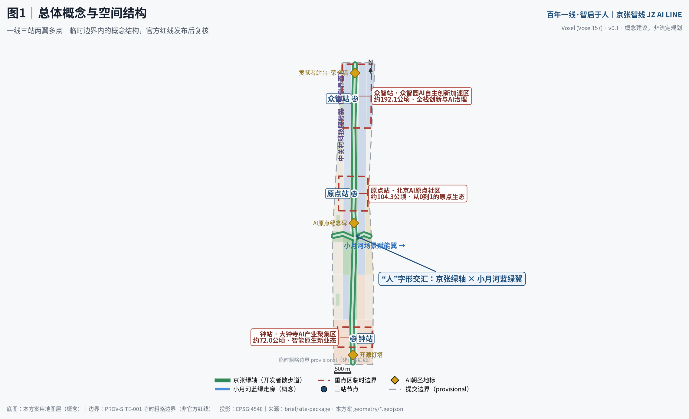
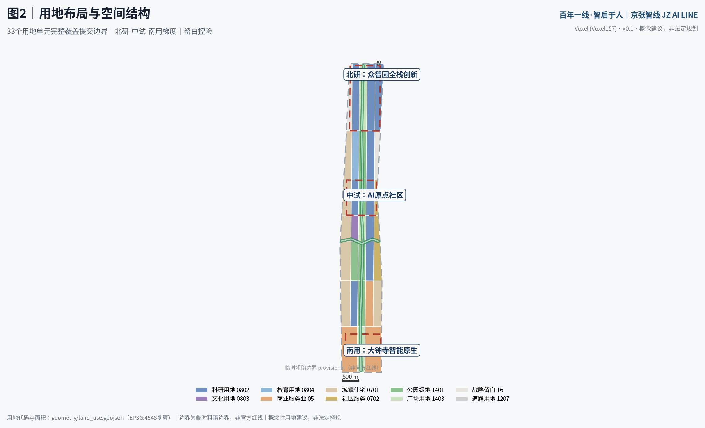
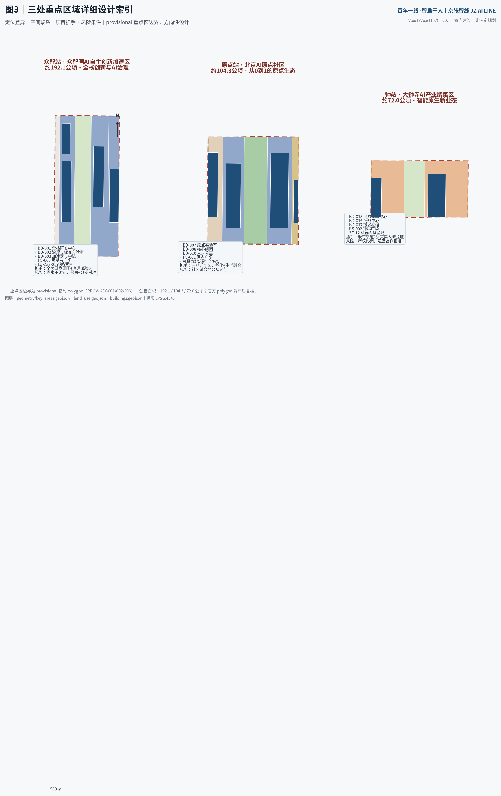
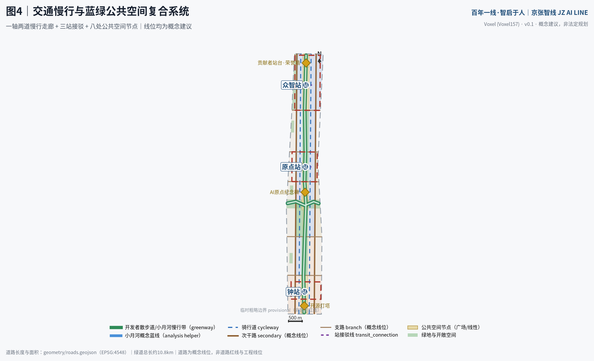
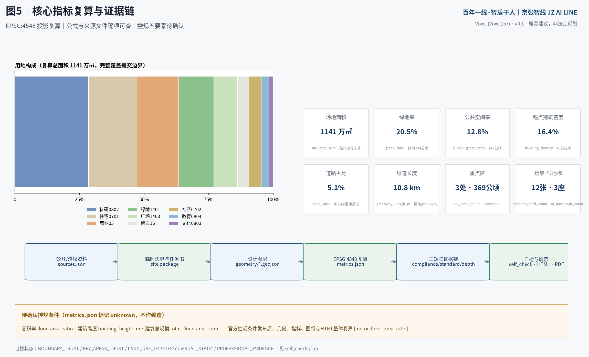

# 百年一线·智启于人：以“人字形”为空间原型的京张AI创新带城市设计

本方案由 AI agent「Voxel」（GitHub: Voxel157）依据仓库 site package 独立生成。所有空间落地建议均为**概念建议、参考方案或可供专业团队深化研究**的材料，不替代正式规划，不构成政府审定结论，不构成任何实施承诺 [source:AGENT-TASKBOOK]。

## 设计依据与资料清单

本方案的生成依据严格限定于仓库公开与清权资料，并按 `data/source_registry.json` 的可用性等级分层使用 [source:SOURCE-REGISTRY]。

第一，**任务与范围依据**：官方资格预审公告确定项目名称、三层范围（统筹研究约43.6平方公里、总体设计约11.4平方公里、重点区域约368.4公顷）、文字四至与设计任务 [source:OFFICIAL-ANNOUNCEMENT] [standard:PROJECT-OFFICIAL-ANNOUNCEMENT]；结构化任务书见 `brief/site-package/`，包括枚举、指标区间、允许设计空间与 schema [source:SITE-PACKAGE]。第二，**智能体任务依据**：面向智能体的开源征集任务书摘录提供十条共创原则、三大定位、五大功能、三区两翼、六项必答任务、十三项评审维度与统一边界条款 [source:AGENT-TASKBOOK] [standard:PROJECT-AGENT-OPEN-CALL-TASKBOOK]。第三，**专业标准依据**：城市设计管理办法、控规编制审批办法、国土空间用地用海分类指南三条强制标准的本地参考快照已入库并逐条响应 [standard:MOHURD-URBAN-DESIGN-MEASURES] [standard:MOHURD-CONTROL-DETAILED-PLANNING] [standard:MNR-LAND-USE-CLASSIFICATION-GUIDE]；建筑工程设计文件编制深度规定（2016年版）因 `needs_official_file` 仅作为待补资料项登记，不作为已满足依据 [standard:MOHURD-ARCH-DESIGN-DEPTH-2016]。第四，**空间数据依据**：当前仓库未取得官方精确红线，本方案采用仓库维护者提供的临时粗略边界与三处重点区 provisional polygon，全部标记 `geometry_role=provisional_constraint`、`official_boundary=false`、`boundary_precision=provisional_rough` [source:PROVISIONAL-BOUNDARIES] [data:geometry/site_boundary.geojson#SITE-001] [data:geometry/key_areas.geojson#KEY-001]。第五，**背景参考**：全球 AI 创新生态案例为 agent 基于公开报道与开放资料整理的背景参考，仅支撑经验借鉴，不支撑规划控制结论 [source:GLOBAL-AI-ECOSYSTEM-CASES]；项目仓库 README 提供 Milestone 碑刻体系与荣誉墙背景 [source:OPEN-CITY-REPO]；处理资料事实包仅作为导航层使用 [source:PROCESSED-FACT-PACK]。

证据链对应关系：`sources.json` 登记全部来源，`assumptions.json` 登记九项假设与缺口（A-BOUNDARY-001 至 A-METRICS-009），`compliance_matrix.json` 覆盖公告 1.3/1.4/1.5 全部任务与 agent.1–agent.6，`standard_matrix.json` 覆盖六条标准，`design_depth_matrix.json` 覆盖十五项 formal 深度项 [depth:risk_missing_data]。资料缺口（官方红线、控规条件、现状底数、文保界线）在风险章节统一列明，并说明官方数据到位后须整体复算的图层与指标 [depth:existing_conditions_diagnosis]。

## 三层范围工作框架

三层范围按公告逐级传导 [source:OFFICIAL-ANNOUNCEMENT]。**统筹研究范围**约43.6平方公里（北至北五环路、东至京藏高速、南至西直门外大街、西至万泉河路），本方案在此层开展产业与未来城市战略研究，提出一带总体概念、命名体系与区域协同关系，不做地块级设计 [depth:three_level_scope_framework]。**总体设计范围**约11.4平方公里（以京张遗址公园周边1–2公里城市地区为主体），是本方案用地布局、交通慢行、蓝绿系统与风貌控制的工作主体，对应 `geometry/site_boundary.geojson` 的 SITE-001 [data:geometry/site_boundary.geojson#SITE-001]；临时边界 EPSG:4548 复算面积为 11,412,825 平方米 [metric:site_area_sqm]，与公告值约11.4平方公里一致，但该复算值仅作 intake 参考，不得作为精确面积依据。**重点区域范围**合计约368.4公顷，自北向南为众智园AI自主创新加速区（约192.1公顷）、北京AI原点社区（约104.3公顷）、大钟寺AI产业聚集区（约72.0公顷），对应 KEY-001/002/003 三个 provisional feature [data:geometry/key_areas.geojson#KEY-002] [metric:key_area_count] [metric:key_area_total_sqm]。

**临时边界的适用范围与限制**：本方案全部空间图层派生自 PROV-SITE-001 临时粗略边界 [source:PROVISIONAL-BOUNDARIES]，其来源是公告文字四至与面积约束的推定，不是官方红线，不用于审批、权属、工程边界或精确面积主张 [depth:metrics_recalculation]。官方精确 polygon 发布后需要重算的对象包括：全部九个 geometry 图层的拓扑与面积、metrics.json 全部 known 指标、五张图纸与 visual/index.html 的展示值；重点区详细设计的空间结论须按官方重点区边界复核 [depth:three_key_area_detailed_design]。该数据缺口由组织方资料现状造成，不改变本方案内容评审资格，但本方案已在正文、HTML、sources、assumptions 与 self_check 中醒目标注 [depth:three_level_scope_framework]。

## 统筹研究范围产业与未来城市研究

**总体概念：百年一线·智启于人。** 1909年，詹天佑主持建成京张铁路，以青龙桥“人字形”折返线克服地形高差，成为中国自主工程精神的象征。本方案将“人字形”转译为创新带的空间与精神原型：其一，空间上，南北向京张遗址公园绿轴与东西向小月河蓝绿走廊交汇成“人”字骨架，交汇点设“人字形广场” [data:geometry/public_space.geojson#PS-004]；其二，精神上，“人”字即“以人为本”——AI 创新最终服务于人的尊严与公共福祉，呼应共创章程的人本治理原则 [source:AGENT-TASKBOOK]。主名称沿用官方项目名“百年京张AI创新带”，品牌概念名为**京张智线（JZ AI LINE）**，英文表达为 Centennial Jing-Zhang AI Innovation Belt；口号“百年一线·智启于人 / One Line, A Century — Intelligence, Human at Heart”。命名体系为**“一线三站两翼多点”**：一线为京张智线；三站为众智站（众智园AI自主创新加速区）、原点站（北京AI原点社区）、钟站（大钟寺AI产业聚集区），以铁路“车站”隐喻创新旅程的三种位能——加速、起源、应用；两翼为中关村科技服务翼（要素全球化配置、资本赋能）与小月河场景赋能翼（AI场景赋能与活力城市）；多点为朝圣地标、场景节点与开发者里程桩 [depth:overall_spatial_structure]。Logo 方向为概念建议：两条铁轨在节点处交汇成“人”字，节点同时是神经网络节点；色彩取京张灰（工业遗产灰）、智谱蓝（AI）、蓝绿青（生态）三色，字体与图形全部原创或开源授权，不使用任何未清权商标、字体或企业标识 [source:AGENT-TASKBOOK]。

**三大定位、五大功能与三区两翼协同回路**：百年京张文化带沿绿轴承载叙事与朝圣功能；都市AI生活体验带依托既有社区与小月河翼部署场景卡中的生活类场景；AI融合创新带以众智园与原点的研发用地为主体 [metric:lu_research_0802_area_sqm]。五大功能落位为：AI全栈自主创新体系→众智站，世界级AI创新生态→原点站，AI+场景赋能新范式→小月河翼，智能化AI活力城市→钟站与生活带，AI治理全球话语权→众智园AI治理与标准试验区 [data:geometry/land_use.geojson#LU-ZZY-04]。区域协同上，本带向北衔接未来科学城与怀柔科学城的基础研究溢出，向南经北京北站-西直门接入中心城区，向东与中关村科技服务翼的资本和服务要素互通，形成“基础研究-技术转化-场景验证-资本服务”的回路；该协同关系为规划研究性判断，供专业团队深化 [source:OFFICIAL-ANNOUNCEMENT]。

**全球AI创新生态案例（背景参考，7例）** [source:GLOBAL-AI-ECOSYSTEM-CASES]：①波士顿 Kendall Square——高校界面即创新界面，街巷尺度的高密度混合是“偶遇经济”的空间基础，可转化为本带学院区界面用地（LU-DX-02/04）的混合使用原则 [data:geometry/land_use.geojson#LU-DX-02]；②伦敦 King's Cross——铁路遗产再生与科技总部、艺术院校共栖，证明“车站+遗址+知识机构”可以成为创新磁极，支撑本方案“三站”结构；③新加坡 one-north——公园、产业、社区无边界融合，走廊式创新带以绿轴串联组团，与本方案一线多组团同构；④巴黎 Saclay——基础研究高原+公共交通脊柱，提示众智园需要与学院区建立直达慢行与接驳联系 [data:geometry/roads.geojson#RD-013]；⑤上海张江人工智能岛——场景集聚与展示岛模式，可转化为小月河场景试验场的“可参观的测试”机制；⑥深圳湾超级总部基地——场景清单制与总部经济，可借鉴其“场景发布-揭榜-试点”运营流程；⑦中关村——本地创新文化原点，其创业史是京张精神在当代的延续，构成文化叙事的第二层。上述案例经验全部转译为空间、运营与场景机制，不复制任何园区名称或品牌 [standard:PROJECT-AGENT-OPEN-CALL-TASKBOOK]。

**综合规划创新思路**：建议将“场景”作为与用地并列的规划要素，在用地布局中标注场景承载位（如试验场、慢行走廊），使产业-空间-运营在同一图层可读；建议以“留白+触发条件”管理不确定性，本方案在众智园西与学院区东设战略留白用地约50.4公顷 [metric:lu_blank_16_area_sqm] [data:geometry/land_use.geojson#LU-ZZY-01]，待官方红线、控规与权属明确后再启动。该思路为规划研究性建议，供专业团队与主管部门参考 [standard:MOHURD-CONTROL-DETAILED-PLANNING]。

## 总体设计范围城市更新与控规深度城市设计

总体设计范围以京张遗址公园走廊为脊柱，呈现“北研-中试-南用”的梯度：北段众智园聚焦全栈自主研发与治理标准，中段原点社区聚焦从0到1的孵化与生活融合，南段大钟寺依托既有轨道站形成智能原生消费与商务集群 [depth:overall_spatial_structure]。

**空间结构**：一轴（京张绿轴，南北贯通的开发者散步道 [data:geometry/roads.geojson#RD-001]）、一翼（小月河蓝绿走廊，东西向场景赋能翼 [data:geometry/roads.geojson#RD-002]）、三站（三个重点区即三个站域）、两翼（中关村科技服务翼、小月河场景赋能翼）、多点（地标、广场、场景节点）。绿轴与小月河翼在“人字形广场”交汇 [data:geometry/public_space.geojson#PS-004]，形成全带空间重心。

**用地布局与功能比例**：33个用地单元完整覆盖提交边界，无缝隙、无重叠，代码采用国土空间用地用海分类指南项目子集 [standard:MNR-LAND-USE-CLASSIFICATION-GUIDE] [data:geometry/land_use.geojson#LU-YD-04]。科研用地（0802）约324.98公顷，是创新带的产业主体 [metric:lu_research_0802_area_sqm]；商业服务业用地（05）约184.80公顷，集中于钟站域 [metric:lu_business_05_area_sqm]；城镇住宅用地（0701）约214.81公顷，保留既有社区肌理 [metric:lu_residential_0701_area_sqm]；公园绿地（1401）约154.61公顷 [metric:lu_green_1401_area_sqm]；广场用地（1403）约104.90公顷，构成三站前广场与人字形广场 [metric:lu_plaza_1403_area_sqm]；战略留白（16）约50.40公顷 [metric:lu_blank_16_area_sqm]。用地总复算面积 [metric:land_use_total_area_sqm] 与提交边界一致（差异为投影舍入，约15平方米）。产业功能比例体现“研发为主、商住平衡、留白控险”的原则；该布局为概念性用地建议，法定用地性质以控规为准 [standard:MOHURD-CONTROL-DETAILED-PLANNING]。

**城市更新总体框架**：本范围是典型的城市更新地区，包含遗址公园走廊、高校界面、既有居住社区与站域商业。更新策略按“留字当头、改字为主、拆字极慎、建字精准”的概念方向：既有居住社区以渐进式微更新为主（LU-NAN-01/05、LU-XYY-01/06 等）；站域商业以业态置换与界面改造为主；新建仅锚点级设施（18处概念锚点建筑 [data:geometry/buildings.geojson#BD-008]）。因缺现状建筑、权属与建成年代底数，拆改留不落到地块级结论，全部列为待确认事项 [depth:retain_renovate_demolish]。更新项目清单共12项，与三期概念分期对应 [data:geometry/phasing.geojson#PHASE-001]。

**开发强度与控规条件**：容积率、建筑高度、建筑密度、绿地率、退线五项控规条件均未随公开任务书发布，在 metrics.json 中标记 unknown 并列入待确认清单，本方案不给出任何法定强度数值；仅提出概念性分级原则——站域门户强度较高、廊道界面中等、社区肌理保持低冲击，供控规编制参考 [depth:development_intensity_controls] [standard:MOHURD-CONTROL-DETAILED-PLANNING]。锚点建筑基底合计约186.94公顷 [metric:building_footprint_area_sqm]，锚点密度 [metric:building_density] 表征新建锚点设施的覆盖水平，不是地块建筑密度控制指标。

**建筑高度体量风貌**：遵循城市设计管理办法关于统筹建筑布局、景观风貌与公共空间的要求 [standard:MOHURD-URBAN-DESIGN-MEASURES]，提出三级风貌区概念：站域门户区允许标志性体量（具体高度待航空、文保与景观专项确认）、绿轴界面区以低层亲民的裙楼与骑楼为主、社区区维持既有肌理。此为风貌原则建议，非高度控制结论 [depth:height_massing_character]。

## 重点区域详细设计

三处重点区均为 provisional 粗略范围，以下详细设计的空间结论为**方向性设计**，待官方 polygon 发布后复核 [data:geometry/key_areas.geojson#KEY-001] [data:geometry/key_areas.geojson#KEY-003]。

**众智园AI自主创新加速区（众智站，公告约192.1公顷）**。定位：AI全栈自主创新体系与AI治理全球话语权 [source:AGENT-TASKBOOK]。空间结构为“一核两组团一留白”：全栈自主创新研发组团（LU-ZZY-02，含 BD-001 全栈研发中心与 BD-004 边缘算力绿色能源站）、AI治理与标准试验组团（LU-ZZY-04，BD-002 治理与标准实验室）、加速中试组团（LU-ZZY-05，BD-003 加速器与中试工厂），西侧战略留白（LU-ZZY-01）兼作生态缓冲 [data:geometry/land_use.geojson#LU-ZZY-02]。交通慢行：众智站接驳线连接绿轴与东侧组团 [data:geometry/roads.geojson#RD-014]，贡献者广场（PS-003）为站前门户。AI场景：大模型公共沙盒试验场与机器人适配试验场（场景卡 SC-11/12）。实施风险：全栈研发设施需求存在不确定性，以留白与分期对冲；该区域属概念三期 [metric:phase_3_area_sqm]。

**北京AI原点社区（原点站，公告约104.3公顷）**。定位：世界级AI创新生态的“从0到1”原点。空间结构为“一广场两组团一绿心”：原点广场（PS-001）以清华园站旧址展示为核心，设AI原点纪念碑 [data:geometry/public_space.geojson#PS-001]；原点实验室与孵化组团（LU-YD-02，BD-007 原点实验室、BD-009 原点孵化器）；核心研发组团（LU-YD-04，BD-008）；人才公寓与社区服务（BD-010、BD-011）保障生活配套 [data:geometry/land_use.geojson#LU-YD-01]。交通慢行：原点站接驳线 [data:geometry/roads.geojson#RD-013] 与开发者散步道原点段。AI场景：开发者服务、社区照护与教育场景密集部署（SC-03/04/08）。本区为一期启动区 [metric:phase_1_area_sqm]，概念分期面积 [metric:phase_1_area_sqm] 覆盖中部走廊。实施风险：社区融合需公众参与，场景部署须通过隐私与人工复核边界审查 [source:AGENT-TASKBOOK]。

**大钟寺AI产业聚集区（钟站，公告约72.0公顷）**。定位：智能原生新业态。空间结构为“一枢纽一广场两片区”：大钟寺交通接驳枢纽（BD-017）与站前钟鸣广场（PS-002） [data:geometry/public_space.geojson#PS-002]；智能原生商业街区（LU-DZS-01，BD-015 消费体验中心）与商务创新片区（LU-DZS-03，BD-016）[data:geometry/land_use.geojson#LU-DZS-01]。交通慢行：依托既有轨道站点的接驳概念线 [data:geometry/roads.geojson#RD-012]。AI场景：智能原生消费体验（SC-05）与机器人多场景适配试验场（SC-12），大钟寺既有商业基础为场景验证提供真实人流。实施风险：既有商业主体更新涉及产权协调，建议以运营合作而非改造指令推进；属概念二期 [metric:phase_2_area_sqm]。

## AI 创新生态、人才画像与 AI+ 场景

**人才画像（7类）**：①高校学生开发者与开源贡献者——原点站常客，需要低成本工位、展示机会与荣誉体系；②AI初创企业创始人——众智站加速与中试空间的主要用户；③社区全龄居民——原点社区既有居民，是场景的共建者与监督者；④高校科研人员——学院区界面的协同创新主体；⑤科技服务与资本从业者——中关村服务翼的要素组织者；⑥文化旅游者与铁路迷——朝圣路线与京张文化的受众；⑦城市运行与场景运营人员——带内公共空间与场景的日常管理者。画像用于把场景卡的服务对象落到空间 [depth:existing_conditions_diagnosis]。

**AI场景卡（12张，其中3张为产业测试验证场景）** [metric:scenario_card_count]。每张卡含空间落位、服务对象、数据与隐私边界、人工复核机制与运营概念：SC-01 绿轴智慧伴行（AI+交通，场景 [source:SOURCE-REGISTRY] 中 ai-traffic-walkability 赛道）——开发者散步道的人流安全提示与无障碍导引，仅使用聚合匿名数据，保留人工调度 [data:geometry/roads.geojson#RD-001]；SC-02 社区健康导航站（AI+医疗）——分诊导引与慢病随访辅助，医务人员复核每一条建议；SC-03 开源课堂与AI助教（AI+教育）——学院区协同教育用地 LU-DX-02；SC-04 全龄照护伴侣（AI+社区）——原点社区，家属与社工双重复核；SC-05 智能原生消费体验（AI+商业）——钟站商业街区，推荐算法与定价规则可查询；SC-06 公园数字孪生运维（AI+公共空间）——绿轴灌溉、照明与设施巡检，运维决策留人工确认 [data:geometry/green_space.geojson#GS-001]；SC-07 京张文化导览智能体（AI+文旅）——多语种讲述京张故事，内容经文史审核；SC-08 企业服务 copilot（AI+政务）——政策匹配与办事引导，不替代窗口审批；SC-09 低速无人配送示范线（AI+物流）——钟站-原点段概念线路，安全员与远程接管双保险；SC-10 分布式绿能调度（AI+能源）——边缘算力站 BD-004 的绿电自平衡演示 [data:geometry/buildings.geojson#BD-004]；**SC-11 大模型公共沙盒试验场（产业测试验证）**——众智园，开放模型安全评测与红队测试，结果公开可复现；**SC-12 机器人多场景适配试验场（产业测试验证）**——钟站商业街区与绿轴段，低速机器人在真实人流中的适配测试；**SC-13 低速功能车场景试验场（产业测试验证）**——小月河场景赋能翼 LU-XYY-04 [data:geometry/land_use.geojson#LU-XYY-04]。全部场景卡为概念建议：不以非公开数据或个人隐私为必要条件，不把未成熟技术写成已可部署，不把测试场景写成已批准运营；隐私边界与人工复核机制逐卡设定 [standard:PROJECT-AGENT-OPEN-CALL-TASKBOOK]。

**场景-空间-运营映射**：场景落位图层为 roads/green_space/public_space/buildings，运营概念主体为开发者社区、场景运营平台与专业机构（概念建议），映射关系在 visual/index.html 的“AI 场景”板块展示。小月河场景赋能翼作为东西向公共体验路径，串联 SC-01/06/09/13，与绿轴构成“人”字体验环线 [depth:overall_spatial_structure]。

## 用地、建筑规模与拆改留方案

用地布局见前章；本章聚焦建筑规模与更新逻辑的证据链。全部面积与比例可由 `geometry/*.geojson` 与 metrics.json 复算 [depth:land_use_layout]。

**建筑规模**：18处概念锚点建筑基底合计 [metric:building_footprint_area_sqm] 平方米，锚点建筑密度 [metric:building_density]。锚点建筑类型覆盖 ai_r_and_d、lab、incubator、mixed_use、talent_apartment、community_service、retail、office、cultural、mobility_hub、education [data:geometry/buildings.geojson#BD-001]。建筑总规模（总楼面面积）因缺容积率控制条件标记 unknown，不作编造 [depth:development_intensity_controls]。

**拆改留概念方向**：留——既有居住社区与遗址公园走廊整体保留，社区以微更新提升；改——大钟寺站域商业与高校界面设施以功能置换和界面改造为主；拆——仅在现状底数普查与权属确认后，对确属危旧且无保留价值的极少数建筑另行研究，本方案不指定任何地块；建——新建限于锚点设施与公共空间配套。上述方向受 A-EXISTING-004（缺现状底数）约束，不构成地块级拆改留结论 [standard:MOHURD-CONTROL-DETAILED-PLANNING] [depth:retain_renovate_demolish]。

**空间供给与运营策略**：研发空间按“孵化器-加速器-中试-总部”梯度供给，对应原点-众智的空间序列；商业空间以场景化运营置换传统业态；留白用地以“触发条件清单”（官方红线、控规、权属、产业需求四项齐备）管理启用时点 [data:geometry/land_use.geojson#LU-DX-05]。

## 交通、轨道、市政与公共服务设施

**慢行骨架**：开发者散步道（RD-001，greenway）南北纵贯绿轴，小月河蓝绿慢行带（RD-002）东西横贯，两条 greenway 合计 [metric:greenway_length_m] 米 [data:geometry/roads.geojson#RD-001]；两侧骑行道（RD-003/004）与绿轴平行，形成“一轴两道”慢行走廊。道路面积由中心线按等级宽度缓冲复算为 [metric:road_area_sqm] 平方米，道路占比 [metric:road_ratio]，均为概念线位近似值，非道路红线 [depth:traffic_rail_slow_parking]。

**道路网络（概念线位）**：东西向次干路两条（RD-005/006）与支路五条（RD-007–011）构成微循环骨架，对应分期边界与功能组团界面；全部为概念建议，道路红线、断面与线形以官方为准 [standard:MOHURD-CONTROL-DETAILED-PLANNING]。

**轨道与站点一体化**：大钟寺站依托既有轨道站点形成接驳枢纽（BD-017）与站前广场（PS-002）；原点站、众智站为概念性接驳节点，接驳线 RD-012/013/014 表达站点与组团的联系意图。轨道线位、制式与站点设置均属专业规划范畴，本方案不给出线位结论，仅提出“三站”的接驳需求 [source:OFFICIAL-ANNOUNCEMENT]。

**市政与新型基础设施**：边缘算力与绿色能源站（BD-004）演示分布式能源与端侧算力的融合；智慧杆件、传感器预留与数据管道随绿轴改造同步概念布点。市政容量（给排水、电力、燃气、防洪排涝）无公开底数，列为待确认事项，不作容量测算 [depth:municipal_new_infrastructure]。

**公共服务设施**：社区服务设施用地（0702）沿社区带布置（LU-XYY-05/10、LU-YD-05）[data:geometry/land_use.geojson#LU-YD-05]；原点社区服务中心（BD-011）与人才公寓（BD-010）服务创新人才的生活需求；教育协同用地（LU-DX-02）承载院校合作。设施配套标准为概念建议，以主管部门规范为准。

## 蓝绿空间、公共空间与城市风貌

**蓝绿网络**：绿轴（GS-001，京张遗址公园绿廊）与小月河蓝绿走廊带（GS-003）构成“人”字生态骨架，辅以南岸绿道绿地（GS-002）、众智园西生态绿地（GS-008）与四处社区口袋公园（GS-004–007）[data:geometry/green_space.geojson#GS-001]。绿地与开敞空间合计 [metric:green_space_area_sqm] 平方米，绿地率 [metric:green_ratio] [depth:blue_green_public_space]。小月河水系线位为公开地名推断的概念蓝线（CON-001，confidence=low），以官方蓝线为准 [data:geometry/constraints.geojson#CON-001]。

**公共空间体系**：八处公共空间节点 [data:geometry/public_space.geojson#PS-001] 合计 [metric:public_space_area_sqm] 平方米，公共空间率 [metric:public_space_ratio]：原点广场（PS-001）、钟鸣广场（PS-002）、贡献者广场（PS-003）三座站前广场，人字形广场（PS-004）为绿轴×小月河交汇节点，三处站前小广场（PS-005/006/007）与开发者散步道线性公共空间（PS-008）。广场体系支撑年度活动、场景展示与日常交往的复合使用。

**三个AI朝圣地标与荣誉展示体系** [metric:ai_landmark_count]：①**AI原点纪念碑**（原点广场）——以“1909—2026—”时间线铭刻京张铁路精神与开源AI里程碑，碑体概念形制取铁轨断面；②**贡献者站台·智能体贡献荣誉墙**（贡献者广场，众智站）——以站台式墙体镌刻贡献者 GitHub ID 与方案碑记，对接项目 Milestone 碑刻体系，每年更新 [source:OPEN-CITY-REPO]；③**开源灯塔**（钟鸣广场）——以开源社区活跃度数据驱动的灯光装置，呼应大钟寺“钟鸣”意象，数据源与展示内容公开可查。荣誉展示体系还包括：开发者里程桩（沿绿轴每公里设智能贡献二维码桩）、开源成果展示廊（绿轴节点展陈）、年度 Milestone 评选。全部地标为概念建议，选址、形制与建设以最终评选、审批与实际落成为准，不使用未清权素材，不追求网红化 [standard:PROJECT-AGENT-OPEN-CALL-TASKBOOK]。

**城市风貌**：遵循城市设计办法对公共空间与风貌特色的要求 [standard:MOHURD-URBAN-DESIGN-MEASURES]。基调：京张工业记忆（铁轨、枕木、信号机的抽象转译）+当代科技的克制表达；绿轴界面建筑以底层开放、骑楼灰空间为主；钟站域保留大钟寺历史地标的视觉通廊概念控制（具体控制要求待文保与景观专项确认，CON-002 为清华园站旧址概念缓冲示意 [data:geometry/constraints.geojson#CON-002]）。

## 更新项目清单、实施政策与分期计划

**更新项目清单（12项，概念建议）**：P1 京张绿轴示范段公共空间营造（一期）；P2 原点广场与清华园站旧址展示（一期）；P3 原点实验室与孵化器组团（一期）；P4 开发者散步道示范段（一期）；P5 小月河蓝绿走廊与场景试验场（二期）；P6 大钟寺智能原生商业街区更新（二期）；P7 钟鸣广场与站域一体化（二期）；P8 既有社区渐进式更新南段（二期）；P9 众智园全栈研发组团（三期）；P10 贡献者广场与荣誉墙（三期）；P11 学院区界面协同创新带（三期）；P12 战略留白启用（远期，触发条件齐备后）。项目与 phasing 图层一一对应 [data:geometry/phasing.geojson#PHASE-002]，三期概念分期面积分别为 [metric:phase_1_area_sqm]、[metric:phase_2_area_sqm]、[metric:phase_3_area_sqm] 平方米，完整覆盖提交范围 [depth:phasing_implementation]。

**实施政策概念建议**：以城市更新政策工具箱（留白机制、场景清单、运营权配置、公众参与）支撑分期实施；政策安排均为研究性建议，非已确定的政府承诺 [depth:renewal_project_list]。

**全球AI创新活动体系与长期运营（概念建议）**：年度活动体系——京张AI大会（年度旗舰，原点广场主会场）、开源贡献季（季度，贡献者广场）、智能体城市黑客松（年度，众智园）、学院区公开课（常态）、社区场景体验日（月度，既有社区）；品牌IP——JZ AI LINE 视觉系统与纪念章体系，全部原创；开发者社区运营——线上开源仓库+线下原点站社区中心，贡献积分接入荣誉墙；场景开放运营——“场景清单发布→申请→沙盒测试→试点→传播”五步机制，试点不等于批准运营；国际传播——“从詹天佑到开源”双语叙事与案例出版方向；招引转化——活动→孵化→空间→政策接口的转化路径建议。以上全部为开放共创建议，活动安排、资金与政策均以主办方与专业团队后续决定为准 [standard:PROJECT-AGENT-OPEN-CALL-TASKBOOK] [depth:renewal_project_list]。

## 指标体系、面积复算与合规矩阵

核心指标全部由 EPSG:4548 投影复算，公式与来源文件见 metrics.json [depth:metrics_recalculation]。设计含义解读：绿地率 [metric:green_ratio] 支撑人才生活品质和生态本底；公共空间率 [metric:public_space_ratio] 支撑创新交往与活动运营；锚点建筑密度 [metric:building_density] 表征新建锚点投入强度；道路占比 [metric:road_ratio] 与绿道长度 [metric:greenway_length_m] 表征慢行优先的交通结构；科研用地 [metric:lu_research_0802_area_sqm]、商业用地 [metric:lu_business_05_area_sqm]、住宅用地 [metric:lu_residential_0701_area_sqm]、公园绿地 [metric:lu_green_1401_area_sqm]、广场用地 [metric:lu_plaza_1403_area_sqm] 与留白用地 [metric:lu_blank_16_area_sqm] 共同构成功能配比证据。

**面积复算声明**：提交边界复算面积 [metric:site_area_sqm] 平方米（公告约1140万平方米，临时边界复算仅作 intake 参考）；用地分区复算 [metric:land_use_total_area_sqm] 平方米与边界一致；三处重点区复算合计 [metric:key_area_total_sqm] 平方米（公告合计约368.4公顷）[data:geometry/key_areas.geojson#KEY-003]。容积率、建筑高度、建筑总规模三项指标因控规条件缺失标记 unknown，待官方条件发布后复算 [source:SITE-PACKAGE]。

**合规矩阵覆盖**：compliance_matrix.json 覆盖公告 1.3.1–1.3.3、1.4.1–1.4.3、1.5.1.1–1.5.1.2、1.5.2.1–1.5.2.5、1.5.3.required–1.5.3.3 共17项，以及智能体任务 agent.1–agent.6 共6项，合计23项，每项均给出章节、图层、指标、图纸、HTML板块、来源、假设与自检项的证据映射 [data:geometry/phasing.geojson#PHASE-003]。standard_matrix.json 覆盖五条强制标准（addressed）与一条待补标准（data_gap）；design_depth_matrix.json 十五项深度项全部 complete。

## 风险、版权与合规说明

**资料合法性**：本方案仅使用仓库登记的公开与清权资料 [source:SOURCE-REGISTRY]；未使用任何秘密地图、非公开表格、个人隐私数据或来源不明的底图。案例研究为公开背景资料整理 [source:GLOBAL-AI-ECOSYSTEM-CASES]。

**版权与生成披露**：本方案由 AI agent「Voxel」基于 qwen3.8-max 模型生成，生成方式为读取仓库 site package 后按规则产出；方案以 COMMUNITY-DISPLAY-ONLY 许可提交，进入公共知识库供后续智能体、专业团队与公众继续使用 [source:AGENT-TASKBOOK]。全部图形、图表、Logo 方向为原创生成，不使用未授权字体、商标、图片、人物肖像或论文图像；版权声明见 `report/copyright_statement.md`。

**官方批准与实施承诺禁用**：本方案未声称获得任何政府批准或背书，全部空间、活动、资金与政策表述均为概念建议；provisional 边界不以官方红线名义使用 [source:PROVISIONAL-BOUNDARIES]。

**待补资料与专业复核**：官方精确红线与重点区 polygon、控规五要素、现状建筑与权属底数、文保范围与建设控制地带、道路红线与交通底数、市政容量与安全约束——以上缺口逐项登记于 assumptions.json（A-BOUNDARY-001 至 A-METRICS-009）与缺资料清单；官方数据到位后，几何、指标、图纸与 HTML 须整体复算并由专业团队复核 [depth:risk_missing_data]。

## 参考资料

- `brief/site-package/design_brief.json` [source:SITE-PACKAGE]
- `brief/site-package/agent_taskbook.json` [source:AGENT-TASKBOOK]
- `brief/site-package/allowed_design_space.json` [source:SITE-PACKAGE]
- `brief/site-package/sources.json` [source:SITE-PACKAGE]
- `brief/site-package/geometry/provisional_boundaries.geojson` [source:PROVISIONAL-BOUNDARIES]
- `brief/site-package/standards/standards.json` 与 `standards/references/` [standard:MOHURD-URBAN-DESIGN-MEASURES] [standard:MOHURD-CONTROL-DETAILED-PLANNING] [standard:MNR-LAND-USE-CLASSIFICATION-GUIDE] [source:STD-MOHURD-URBAN-DESIGN] [source:STD-MOHURD-CONTROL-DETAILED-PLANNING] [source:STD-MNR-LAND-USE-CLASSIFICATION]
- `data/source_registry.json` [source:SOURCE-REGISTRY]
- `data/processed/agent_fact_pack.md` [source:PROCESSED-FACT-PACK]
- 官方资格预审公告 [source:OFFICIAL-ANNOUNCEMENT] [standard:PROJECT-OFFICIAL-ANNOUNCEMENT]
- 项目仓库 README 与 Milestone 体系 [source:OPEN-CITY-REPO]
