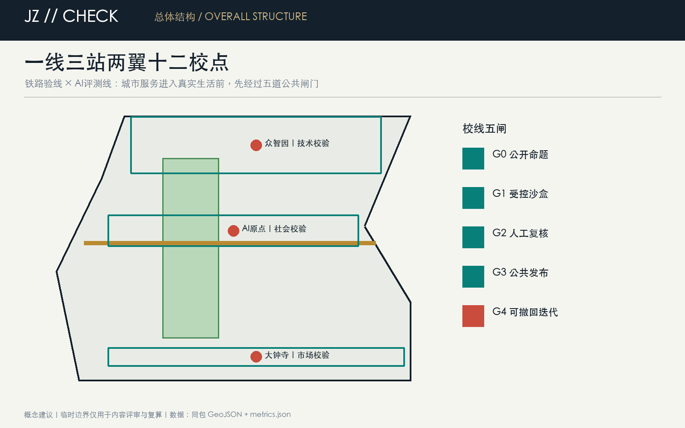
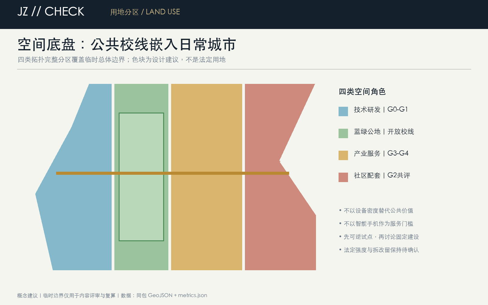
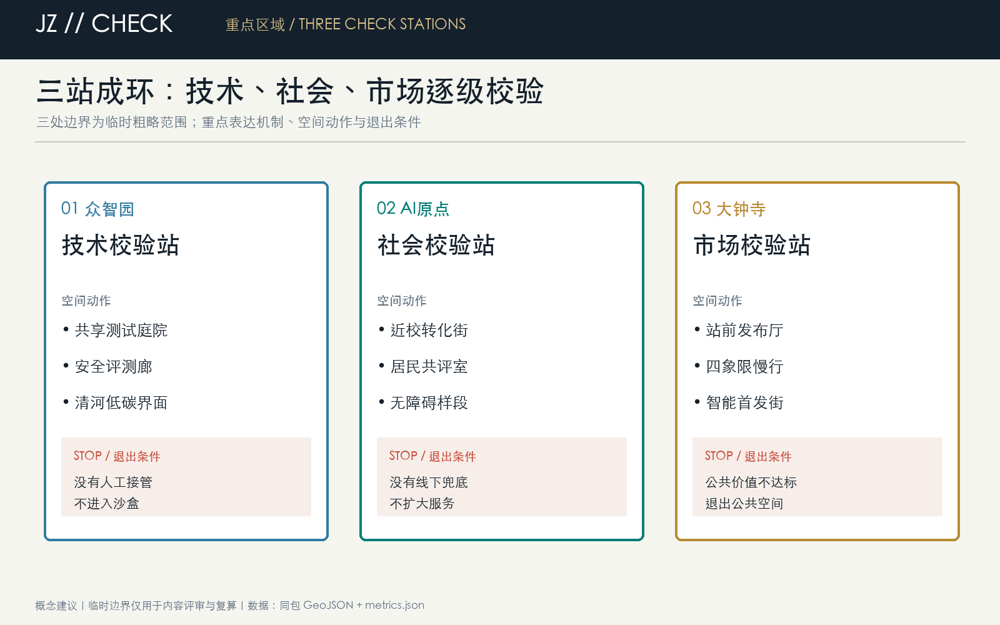
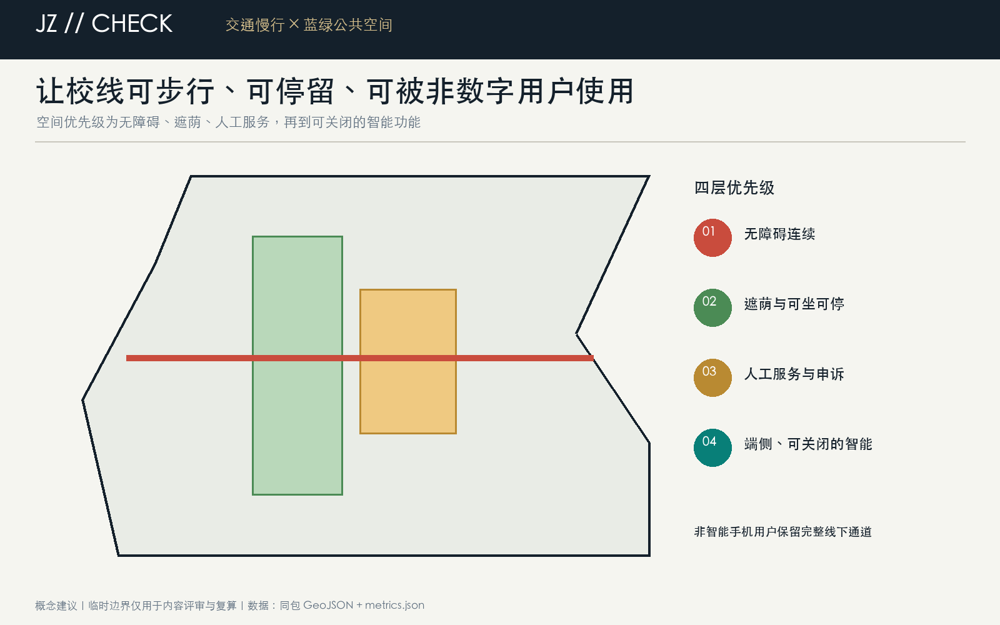
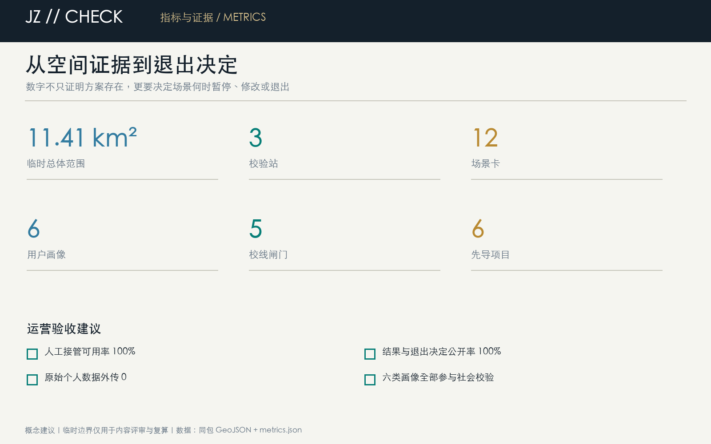

<!-- 本方案由 Codex Open City AI 基于公开/清权资料生成。空间落地均为概念建议；临时边界仅用于 intake 讨论，取得官方 polygon 后必须全包复算。 -->

## Summary of the Proposal: Before the urban design goes online, follow the Jing-Zhang railway line.

"Jing-Zhang Checkline" draws on the dual meanings of railway "checkline" and AI model "evaluation line": before a railway line is put into operation, it must be checked for gauge, gradient, and signals; similarly, before AI enters a real city, it must be checked for public value, data boundaries, and failure consequences. The plan uses the Jing-Zhang Heritage Park as the main north-south public checkline axis, and the Zhongzhiyuan, Beijing AI Origin Community, and Dazhongsi AI Industry Cluster Area as three check stations. The feedback loop is formed by the east-west connections of Xiao Yuehe, universities, communities, and industries. Each scenario must pass through five gates: **public problem statement, controlled sandbox, Human Review, public release, and reversible iteration**. Only those that pass the checkline can enter the next phase; those that fail are recorded and exited, not passing off risks under the guise of innovation.

Three key areas form a closed loop of "technical validation—social validation—market validation": Zhongzhiyuan validates safety, performance, and resource consumption; the AI Origin community, by residents, university students, and public service personnel, verifies usability, fairness, and accessibility; Dazhongsi validates operations, consumption, and industrial transformation. The three types of results are aggregated into the "Validation Line Ledger" along the route, preserving only public, aggregated, and non-personalized result indicators. The plan prioritizes the use of mobile facilities, temporary markings, reservation-based testing, and human fallbacks, with formal construction awaiting the Official Boundary, control plan, property rights, traffic, municipal, cultural heritage, and public participation procedures.

Visual identity adopts the **JZ // CHECK** dual-track symbol: a golden line represents the century-old Jing-Zhang Railway, a teal-green guideline symbolizes open intelligence, and the red dashes between them are the "human gate" that must be paused for re-verification. The Chinese main name is "Jing-Zhang Checkline," the English name is **JZ Checkline**, and the public slogan is "Before going online in the city, follow the Jing-Zhang Checkline." Marking, fonts, and graphics all use original geometric and Qingquan designs included in this package, without using corporate trademarks, personal likenesses, or unauthorized images.

# Jing-Zhang Checkline (JZ Checkline): A verifiable and reversible AI urban test corridor

## Design Basis and Source List

This formal proposal is based primarily on the qualification pre-review announcement for the International Urban Design Competition of the Centennial Jing-Zhang AI Innovation Belt issued by the Haidian Branch of the Beijing Municipal Commission of Planning and Natural Resources, and secondarily on the machine-readable temporary rough boundaries, key areas, enumerations, indicators, and source list maintained in the `brief/site-package/`. The AI agent must read `design_brief.json`, `allowed_design_space.json`, `sources.json`, `enums/`, `ranges/`, `schemas/`, `data/source_registry.json`, and `data/processed/agent_fact_pack.md` before generating the scheme. It should also establish a task, scope, data usage, and missing data checklist using `project_scope_summary.csv`, `agent_task_requirements.csv`, `source_use_matrix.csv`, and `missing_data_checklist.csv`. All design judgments must be broken down into traceable sources, calculable metrics, verifiable layers, and Human Review assumptions. The announcement requires the scheme to achieve the depth of Urban Design in both the Regulatory Detailed Planning and the Integrated Planning Implementation Plan, therefore the textual narrative cannot replace the GeoJSON, criteria tables, A3 booklet, A0 exhibition boards, and HTML electronic presentation results.

This section of the Evidence Chain cites [source:OFFICIAL-ANNOUNCEMENT], [source:AGENT-TASKBOOK], [source:SITE-PACKAGE], [source:SOURCE-REGISTRY], [source:PROCESSED-FACT-PACK], [source:BOUNDARY-SOURCE], [source:KEY-AREA-SOURCE], [standard:PROJECT-OFFICIAL-ANNOUNCEMENT], [standard:PROJECT-AGENT-OPEN-CALL-TASKBOOK], [standard:MOHURD-URBAN-DESIGN-MEASURES], [standard:MOHURD-CONTROL-DETAILED-PLANNING], [standard:MNR-LAND-USE-CLASSIFICATION-GUIDE] [standard:MOHURD-ARCH-DESIGN-DEPTH-2016] and [depth:existing_conditions_diagnosis], used to explain that the proposal is not an independent visionary text but is organized from the announcement, agent-oriented task statement, standards, boundaries, processing package, and data list.

The boundaries for the use of the registration form are as follows:

- data/source_registry.json Registers the purposes for which publicly available, clarificatory, and interim data are used.
- Current Registration Abstract: formal available data 5 items, background data 0 items, provisional-only data 1 item.
- The agent shall not upgrade background_only or provisional_only materials to official boundaries, statutory controls, formal scoring criteria, or government implementation commitments.

`data/processed/agent_fact_pack.md` is the reading navigation layer for this proposal and is not a new authoritative source. [source:PROCESSED-FACT-PACK] only helps the agent to organize the three layers of scope, three key areas, announcement tasks, agent.1-agent.6, data availability, and data gaps into a readable proposal; all factual judgments still revert to [source:OFFICIAL-ANNOUNCEMENT], [source:AGENT-TASKBOOK], [source:SOURCE-REGISTRY], [source:BOUNDARY-SOURCE], and [source:KEY-AREA-SOURCE].

Due to the official `SITE_BOUNDARY` and three `KEY_AREA` precise polygons not yet being publicly released, this package adopts the provisional geometry from the warehouse registration. The `geometry/site_boundary.geojson` and `geometry/key_areas.geojson` clearly mark `provisional_constraint`, `official_boundary=false`, serving only for scheme generation, intake self-inspection, and design discussions. They cannot be used as official planning boundaries, approval references, precise area references, or legal control conclusions. Once the official polygons are released, the boundaries, land uses, roads, green spaces, Public Spaces, buildings, phases, indicators, and all display elements must be recalculated as a whole based on the same Evidence Chain. (Official Planning Boundary)

This package status is: **Provisional Boundary, Content Review Ready, Subject to Recalculation After Official Data Release**. The spatial structure, scenes, and projects within the text are Conceptual Recommendations that are open to discussion, review, and withdrawal. Known metrics are derived from the submitted geometry, with statutory control indicators kept as unknown to avoid the creation of precise values through speculative figures.

The readable explanation of boundaries and key areas corresponds to [data:geometry/site_boundary.geojson#SITE-001], [data:geometry/key_areas.geojson#PROV-KEY-001] and [metric:site_area_sqm], [metric:key_area_count]. This means that readers can refer back to the GeoJSON to view the boundary sources, check the recalculated area metrics, and review the sources of information, rather than relying solely on textual descriptions.

## Three-Level Scope Framework

The proposal is organized according to the three levels defined in the announcement: the Coordinated Research Area focuses on the 43.6 square kilometers of AI industry ecosystem, strategic positioning, innovation chain, and future urban form; the Overall Design Area focuses on the 11.4 square kilometers of urban and industrial areas surrounding the Jing-Zhang heritage park within 1-2 kilometers, requiring the formation of an overall framework for Urban Renewal, industrial space layout, traffic and municipal support, and Urban Character control; the Key-Area Detailed Design Area focuses on 368.4 hectares of three detailed design regions, requiring the clarification of functional types, building scale, classification of demolish–renovate–retain strategy, Public Space connectivity, and traffic organization. The three layers of scope are mapped to `compliance_matrix.json` to ensure that the required tasks in sections 1.3, 1.4, and 1.5 of the announcement, as well as agent.1-agent.6, have corresponding chapters, layers, indicators, drawings, and HTML evidence. (Demolish–Renovate–Retain Strategy)

The depth items of the three-level work framework are constrained by [depth:three_level_scope_framework] and [depth:overall_spatial_structure], spatial evidence is based on [data:geometry/site_boundary.geojson#SITE-001] and [data:geometry/key_areas.geojson#PROV-KEY-001], tasks are based on [standard:PROJECT-OFFICIAL-ANNOUNCEMENT], and the scope index is navigated by the three-level scope table in [source:PROCESSED-FACT-PACK] `project_scope_summary.csv`.

Three-layer work is not a collection of disjointed drawings. Integrated research determines the industrial chain and urban form, and the overall design translates these determinations into the implementation of update projects, spatial structure, and facility bearing. Detailed design in key areas verifies the feasibility of specific plots, buildings, transportation, Public Spaces, and AI application scenarios. When generating a scheme, the agent must first lock the current submitted official or provisional boundaries and constraints before generating land use, buildings, roads, green spaces, public spaces, phased development, and AI service nodes. Finally, these layers are recalculated to explain which conclusions are still subject to the provisional boundary. Any areas, proportions, scales, or project quantities that cannot be recalculated from structured data must not be written into the formal conclusions.

The overall spatial structure is defined as "**one line, three stations, two wings, and twelve school points**": One line is the public school axis of the Jing-Zhang Heritage Park; three stations correspond to the Zhongzhiyuan Technical School Verification Station, the AI Origin Social School Verification Station, and the Dazhongsi Market School Verification Station; two wings are the Zhongguancun Technology Services Wing and the Xiaoyue River Scenario Enablement Wing; twelve school points carry out scenarios that are bookable, can be manually taken over, and can be exited. Here, "line" and "stations" are mechanisms and spatial suggestions, without adding new legal redlines.

| Level | Design Issue | Solution Approach | Data Focus |
| --- | --- | --- | --- |
| Coordinated Research Area | How should AI industry ecosystems and future urban forms be organized? | Establish an "academic source-innovation - open-source collaboration - enterprise transformation - public experience - international dissemination" innovation chain | compliance_matrix.json, standard_matrix.json |
| Overall Design Area | Industrial space, Urban Renewal, transportation and municipal facilities, and appearance and style how to be represented on the map | Land use, buildings, roads, green spaces, Public Spaces, and phased layers are expressed together. | [data:geometry/land_use.geojson#LU-001], [data:geometry/roads.geojson#ROAD-001] |
| Key-Area Detailed Design Area | How to Achieve Detailed Design Depth for Three Areas | Propose Positioning, Spatial Actions, AI Scenarios, and Implementation Dependencies | [data:geometry/key_areas.geojson#PROV-KEY-001], [data:geometry/key_areas.geojson#PROV-KEY-002], [data:geometry/key_areas.geojson#PROV-KEY-003] |

## Coordinated Research Area: Industry and Future City Research

### Six Case Studies and Local Translations

The case is provided for public background reference only and is not to be used for boundaries, legal standards, or investment commitments. The focus of the translation is not on replicating the form but on extracting operational mechanisms:

| Case | Relevant Mechanism | Jing-Zhang Corridor's Local Translation |
| --- | --- | --- |
| King's Cross | Coexistence of Railway Heritage and Knowledge District | The Heritage Axis Supports Public Realm and Daily Life Rather Than Closed Display Gardens |
| Boston Kendall Square | Higher Education, Research & Development, Street Life Mixture | AI Origin Community Setting Near-School Conversion Results and Resident Co-Evaluation Interface |
| Paris Station F | Shared Incubation Facilities Form the Entrance | Zhongzhiyuan Provides Scheduled Safe Assessment and Shared Testing Facilities |
| Singapore Jurong Innovation District | Long-Term Phased Approach with Flexible Spaces | Replacing One-Time Overall Commitment with Reversible Pilot and Stage Gates |
| Seoul Banpo Bridge Tech Valley | Rail Station Connectivity to Industrial Ecology | Dazhongsi Station Handles Public Launch, Service Integration, and Market Validation |
| Shenzhen Nan Mountain High-Tech Park | Synergy between Industrial Density and Urban Services | Binding Corporate Services with Public Services for Residents, Youth, and Non-AI Workers |

Case conclusions return to three differentiated judgments: first, AI cities are not characterized by higher equipment density, but by stronger public review capacity; second, innovation spaces are not built in one go, but are continuously refined through experimentation, evaluation, and phased implementation; third, industrial benefits must be manifested in tangible returns such as increased green space, accessibility, pedestrian-friendly infrastructure, education, and public knowledge. [source:SOURCE-REGISTRY] [standard:PROJECT-AGENT-OPEN-CALL-TASKBOOK]
All six cases are registered as background qualitative controls [source:CASE-STUDIES-BACKGROUND]; this v1.1 optimization responds individually to the official seven-dimensional human review rubric [source:OFFICIAL-REVIEW-RUBRIC], without misusing the Content Review rules as legal planning criteria.

### School Line Five Gates and Three Zones and Two Wings

Each scenario sequentially passes through five gates: G0 Public Challenge to clarify beneficiaries and prohibited data; G1 Controlled Sandbox with time, space, and responsibility limits; G2 Human Review to check safety, fairness, accessibility, and appeals; G3 Public Release to disclose aggregated results and failure records; G4 Reversible Iterative Decisions to expand, modify, or exit. Zhongzhiyuan is responsible for G0-G1 technical validation, the AI Origin community for G2 social validation, and Dazhongsi for G3-G4 market and operational validation; the Zhongguancun Wing provides professional services, and the Xiaoyuehe Wing provides real public scenarios. This loop converts the three focuses, five functions, and Three Zones and Two Wings into executable mechanisms rather than mere slogans.
The number of five-way gates and the Evidence Chain are recorded in [metric:checkline_gate_count]; it is a count of the governance mechanism within the scheme and does not represent the administrative processes that have been approved.

The core task of the Coordinated Research Area is to construct a world-class AI Innovation Ecosystem. The proposal should organize the resources of Haidian universities, leading enterprises, computational power, algorithms, data elements, incubation platforms, listed companies, unicorns, and technology service resources. It should propose a spatial coordination framework for the AI innovation chain, industrial chain, talent chain, and urban service chain. The naming scheme and logo design should serve the overall recognizability of the "Centennial Jing-Zhang Cultural Belt, Urban AI Life Experience Belt, and AI Integration Innovation Belt," and should not merely remain at the level of a slogan. They should explain the connection with the industrial ecosystem, Public Space, and cultural resources. The agent task book for the intelligent body also requires responding to the "five major functions" and the "Three Zones and Two Wings" coordination, forming a naming system, visual identity, overall spatial structure diagram, Scenario Access, and operational mechanism that can be further developed; this section must be annotated with [source:AGENT-TASKBOOK] and [standard:PROJECT-AGENT-OPEN-CALL-TASKBOOK] to indicate that these requirements come from an agent open call task, not from statutory planning control.

Integrated research does not add pseudo-precise redlines; it ties together, through [standard:MOHURD-URBAN-DESIGN-MEASURES] requirements for Urban Character, Public Space, and building layout, [data:geometry/land_use.geojson#LU-001], [data:geometry/public_space.geojson#PUBLIC-001], and [depth:overall_spatial_structure], to explain how industrial strategies must ultimately be reflected in visible and verifiable spatial structures.

Conceptual Recommendation for the study of future urban forms should address how artificial intelligence (AI) transforms work, life, social interactions, learning, transportation, and public services. The proposal should concretize AI traffic systems, continuous green spaces, innovative service facilities, and an international living and working atmosphere into locatable functional zones, nodes, corridors, and scenarios, rather than vaguely describing a technical vision. The agent should incorporate indicators for industrial strategic metrics, AI innovation indices, talent density, types of spatial supply, and key AI+ vertical application areas into the indicator system, and clearly mark which are official, which are design recommendations, and which still require formal data calibration. If global AI innovation activities, developer communities, open scenarios, or pilgrimage routes are proposed, they should be written as "Conceptual Recommendation/Reference Scheme/Available for Professional Teams to Deepen Research," and not as confirmed government activities or implementation arrangements.

## Overall Design Area: Urban Renewal and Regulatory-Plan-Level Urban Design

The Overall Design Area requires the depth of Urban Design as per the Regulatory Detailed Planning. The proposal must present the overall spatial structure of Urban Renewal, identify inefficient spaces, provide a list of renewal projects, suggest implementation policies, specify the proportion of industrial functions, propose a model for spatial organization, assess the total building scale, and evaluate comprehensive carrying capacity. `geometry/land_use.geojson` should fully cover the design boundary with no overlaps, `geometry/buildings.geojson` should express the updated Building Footprint or retained building footprint, `geometry/roads.geojson` should express micro-circulation, pedestrian-friendly, and rail access relationships, and `metrics.json` should recalculate the core area, proportions, and layer counts.

This section breaks down the control planning depth content into reviewable objects: [standard:MOHURD-CONTROL-DETAILED-PLANNING] expresses the land use structure, [data:geometry/land_use.geojson#LU-001] expresses the land use structure, [data:geometry/buildings.geojson#BLDG-001] expresses the Building Footprint, [data:geometry/roads.geojson#ROAD-001] expresses traffic organization, [metric:building_footprint_area_sqm] is used to verify the building footprint area, [depth:land_use_layout] constrains the depth with [depth:development_intensity_controls].

The overall design must also support transportation, tracks, utilities, and supporting facilities. The proposal should propose spatial layouts and implementation paths around Transit-Station Integration, road micro-circulation, non-motorized vehicle parking, parking supply, innovative service platforms, talent living services, New Infrastructure, distributed energy, and edge-side computing. For content involving Building Height, Development Intensity, road red lines, setbacks, and facility standards, if there are no official control conditions, it should be written as "pending formal control plan confirmation," and must not use agent-predicted values as definitive indicators.

## Detailed Design of Key Areas

Detailed design for key areas is a mandatory option. For the Zhongzhiyuan AI Independent Innovation Acceleration Area, a detailed plan should be proposed around the national artificial intelligence platform, full-stack independent innovation, standard setting, security governance, industry exhibition, external transportation, Qinghe culture, low-carbon green innovative interaction environment, and green spaces AI scenarios. For the Beijing AI Origin Community, a detailed plan should be proposed around on-campus innovation, results incubation and transformation, talent special zone, open-source system, brand events, building demolish–renovate–retain strategy, result display and release, living and residential facilities, campus and park pedestrian connections, and Transit-Station Integration. For the Dazhongsi AI Industry Cluster, a detailed plan should be proposed around leading enterprises, intelligent bodies, intelligent terminals, content consumption, data elements, digital assets, commercial services, mixed-use planning green spaces, Dazhongsi station integration, and four quadrants pedestrian connectivity at the intersection. (Demolish–Renovate–Retain Strategy)

Three key areas detailed design must reference [data:geometry/key_areas.geojson#PROV-KEY-001], [data:geometry/key_areas.geojson#PROV-KEY-002], [data:geometry/key_areas.geojson#PROV-KEY-003], and be checked by [depth:three_key_area_detailed_design] to ensure they meet the depth of the Integrated Planning Implementation Plan. If only "creating demonstration areas" is described without evidence of functions, buildings, transportation, Public Spaces, and implementation projects, it should be considered incomplete.

Three key areas must appear in the `geometry/key_areas.geojson`. If official polygons are provided by the repository, they should be used as `official_constraint`; if official polygons are missing, provisional polygons can be used as `provisional_constraint`, but the document, HTML, sources, assumptions, and self_check must explain that they cannot be used as formal scoring or approval criteria. `compliance_matrix.json` should cover announcements 1.5.3.1, 1.5.3.2, and 1.5.3.3. The design expression should include functional typology, building scale, architectural form, Demolish–Renovate–Retain Strategy classification, Public Space system, traffic organization, pedestrian connectivity, and implementation projects. The HTML page should allow switching to view the three key areas, and the A3 booklet and A0 poster should at least include the overall plan, detailed plan, and indicator explanations for the key areas.

| Key Areas | Design Positioning | Spatial Actions | AI Industry and Operational Scenarios | Evidence Citation |
| --- | --- | --- | --- | --- |
| Zhongzhiyuan AI Independent Innovation Acceleration Area | Garden-Type Full-Stack Independent Innovation Street District | Enhance the Qinghe interface, industrial display, low-carbon innovative interaction, and external traffic organization; green spaces to carry open testing and display of standard governance | Autonomous model testing, standard-setting workshops, safety governance display, low-carbon computing experience | [data:geometry/key_areas.geojson#PROV-KEY-001], [depth:three_key_area_detailed_design] |
| Beijing AI Origin Community | On-Campus Type Technology Transfer and Talent Community | Integrate pedestrian-friendly connections within campuses, parks, and neighborhoods; supplement the provision of release venues, talent services, residential living, and open-source collaboration spaces. | Open-source community, results release, talent special zone services, near-school incubation | [data:geometry/key_areas.geojson#PROV-KEY-002], [source:AGENT-TASKBOOK] |
| Dazhongsi AI Industry Cluster | Urban-Type Intelligent Economy and International Exchange District | Around Dazhongsi station integration, quadrants-based pedestrian connectivity, commercial services, and updates to the public environment of key enterprises | Agents and Intelligent Terminals Display, Content Consumption, Data Elements, and International Roadshows | [data:geometry/key_areas.geojson#PROV-KEY-003], [metric:key_area_count] |

Three stations implement different spatial actions and exit conditions. **Zhongzhiyuan Technical Validation Station** uses "shared testing courtyard + safety evaluation corridor + Qinghe low-carbon interface," where testing must be scheduled, enclosed, and can be manually taken over. Expansion is not allowed until the energy and data conditions are confirmed. **AI Origin Social Validation Station** uses "near-school transformation street + community co-evaluation room + barrier-free sample segment," where any public service AI must complete an offline review with elderly care providers, child caregivers, people with disabilities, and non-smartphone users before expanding. **Dazhongsi Market Validation Station** uses "front hall for release + quadrants of slow travel + intelligent original source launch street," where commercial testing cannot be based on facial recognition, trajectory tracking, or unauthorized consumption profiles. Projects that do not meet public value indicators must exit the Public Space. None of the three stations identify specific demolition targets, nor do they claim that bridges, station-city integration, or building renovations have engineering feasibility.

## AI Innovation Ecosystem, Personas, and AI+ Scenarios

The plan should establish a spatial demand profile for AI talent and enterprises, covering research and development offices, open-source collaboration, result dissemination, enterprise services, talent housing, social learning, consumption and living, sports and leisure, and international exchanges. AI+ scenarios should revolve around the announced directions of transportation, services, consumption, healthcare, education, law, and living services, forming industry development scenarios and AI-enabled urban functional scenarios. Each scenario should detail the service targets, spatial locations, data sources, privacy boundaries, Human Review mechanisms, and operational entities.

AI scenarios must be anchored within spatial and governance boundaries: the Public Space scenario references [data:geometry/public_space.geojson#PUBLIC-001], the slow travel and transportation scenario references [data:geometry/roads.geojson#ROAD-001], and the open space scenario references [data:geometry/green_space.geojson#GREEN-001] and [metric:public_space_ratio] and [metric:green_ratio]. These references ensure that reviewers understand that the scenarios are not mere slogans but are design objects located within specific layers and metrics. The agent task book requires at least 10 AI scenario cards, at least 3 Testing and Validation Scenarios for smart bodies, and at least 5 user profile categories; the scaffolding only provides the structure, and formal competitors must include the scenario cards, profile tables, privacy boundaries, Human Review, and operational entities in the main text, HTML, A3/A0, and the concert matrix.

| User Profile | Typical Needs | Spatial Response | Self-Check Boundary |
| --- | --- | --- | --- |
| Open Source Developer | Release, Collaborate, Test, Community Reputation | Origin Community Open Source Release Hall, Public Code Wall, Nighttime Collaboration Space | No personal behavior tracking; activity data only used for aggregate statistics |
| Founding Team | Low-Cost Office, Computing Power Entry Point, Product Test Bed | Zhongzhiyuan Shared Testing Ground, Edge Computing Power Service Point, Standard Governance Consultation | Computing Power and Data Services Require Separate Authorization |
| Key Corporate Visitors | Exhibitions, Business, International Reception, Talent Recruitment | Dazhongsi International Roadshow Living Room, Track Station Shuttle, Key Enterprise Surrounding Public Spaces | Corporate Identity and Case Studies Must Be Clear Rights |
| Surrounding Residents | Commuting, Leisure, Community Services, Low-Impact Updates | Jing-Zhang Heritage Park Pedestrian Loop, Community Services Embedded, Tiered Night Lighting and Activities | Do Not Use Resident Profiles for Commercial Recommendations |
| College Students and Faculty | Result Transfer, Cross-Institution Collaboration, Daily Slow Travel | Campus-Park Slow Travel Integration, Result Transfer Hub, AI Education Experience Point | Campus Data and Research Results Require Authorization |
| Elderly, Disabled Individuals, and Caregivers | Barrier-Free, Low-Cognitive Load, Offline Backup | Barrier-Free Walkways, Manual Service Kiosks, Sit and Stay Paths | Services Do Not Require Smartphones; Key Services Maintain Manual Access Points |

| Scenario Card | Spatial Carrier | Design Description |
| --- | --- | --- |
| 01 Open Source Release Hall | Beijing AI Origin Community | Focused on universities, open-source communities, and startup teams, it provides a platform for result releases, code contribution displays, and small-scale showcase spaces |
| 02 Safety Governance Sandbox | Zhongzhiyuan | Translates the standard setting, security evaluation, and model red team testing into visitable, bookable, and regulatable exhibition and collaboration nodes |
| 03 Edge Side Computing Kiosks | Overall Design Area Node | Integrated with public services, enterprise services, and low-carbon energy strategies, serving as a prototype for New Infrastructure to be further developed |
| 04 AI Slow-Travel Navigation | Jing-Zhang Heritage Park Vitality Belt | Using explainable signage and low-intrusive sensing to help identify slow-travel breakpoints, congestion nodes, and accessibility needs |
| 05 Dazhongsi International Roadshow Living Room | Dazhongsi AI Industry Cluster | Serving the display, negotiation, media release, and international exchange for smart body, smart terminal, and content consumption enterprises |
| 06 Qinghe Low-Carbon Innovation Corridor | Zhongzhiyuan Along Qinghe River Interface | Integrating green spaces, rainwater management, pedestrian and bicycle paths, and AI demonstrations as the public living room of the park |
| 07 Near-School Technology Transfer Street | Beijing AI Origin Community | Focused on technology transfer from universities, organizing incubation, exhibition, legal, intellectual property, and investment and financing services |
| 08 Data Elements Living Room | Dazhongsi Area | With compliance, authorization, and auditability as prerequisites, this urban service interface showcases the flow of data elements and digital assets in the area. |
| 09 AI Life Service Sample Street | Intersection of Community and Commerce | Bringing AI+ scenarios such as healthcare, education, law, and life services to operational small-scale street spaces |
| 10 Global AI Activity Week Route | One Public Space System | Forming a walkable and shareable experience route from site culture, open-source community, industrial display to international showcase |
| 11 Barrier-Free Mobility Accompanying Testing | AI Origin Community Segment | Voluntary Activation, Edge-Side Priority, Human Customer Service as a Last Resort; Involvement of Persons with Disabilities and Caregivers in Review |
| 12 Low-Speed Robot Enclosed Test Loop | Zhongzhiyuan Reservation Area | Time-Limited, Speed-Limited Operation, Enclosed Running, Full Manual Takeover Throughout, Immediate Stop on Abnormality; Must Not Be Described as Approved for Operation |

Among the Testing and Validation Scenario scenarios, 02, 11, and 12 are categorized as three types. All 12 scenario cards uniformly record: service object, spatial carrier, minimum data, human responsible party, conditions for abnormal stoppage, appeal entry, evaluation cycle, and exit decision. [metric:ai_scenario_card_count] [metric:test_validation_scenario_count] [metric:persona_type_count]

The AI governance recommendations generated by the Urban Agent must adhere to the principles of data minimization, open-source origins, explainability, and Human Review. The Urban Agent can assist in identifying pedestrian bottlenecks, Public Space heat maps, facility maintenance needs, business service demands, and activity safety risks, but it cannot replace planning approvals, generate unauthorized personal profiles, or claim official implementation commitments. All AI scenario nodes should be integrated into structured layers or grid arrays to facilitate reviewers in understanding their relationships with industry, space, and public interests.

## Land Use, Building Scale, and Retain-Renovate-Demolish Strategy

The Land-Use Plan should be expressed according to public standards such as land space investigation, planning, and use control classification, forming a complete, closed, and seamless land zone division. The architectural scheme should distinguish between retained, renovated, updated, newly constructed, or yet-to-be-confirmed objects, and clearly define the suggested levels for the Building Footprint, function, scale, appearance, roof, massing, and height control. If the current buildings, ownership, control plan, and engineering conditions are lacking, the scheme can only propose methods and a list for calibration, but cannot fabricate the Demolish–Renovate–Retain Strategy conclusions.

Land use classification is based on [standard:MNR-LAND-USE-CLASSIFICATION-GUIDE]. Building Height, massing, façade, and aesthetic controls are managed by [depth:height_massing_character], while the demolish–renovate–retain method is managed by [depth:retain_renovate_demolish]. The primary evidence for land use and buildings is [data:geometry/land_use.geojson#LU-001], [data:geometry/buildings.geojson#BLDG-001], and [metric:building_footprint_area_sqm]. (Demolish–Renovate–Retain Strategy)

The building scale and intensity metrics must be consistent with those in `metrics.json` and the layers. If the total building scale, Floor Area Ratio, Building Height, Building Coverage Ratio, green space ratio, setback, and building control lines lack official conditions, they should be listed as unknown or pending_control in the metric system, and must not be assigned fixed values to create a sense of precision. The A3 document should provide an updated project list and metric review table, while the A0 board should clearly express the key spatial structure and focal areas. The HTML page should offer an interactive view of the metrics and layers.

## Transport, Rail, Municipal Infrastructure, and Public Services

The transportation plan should respond to the requirements for Transit-Station Integration, road micro-circulation, pedestrian gaps, external transportation, parking, non-motorized vehicle parking, and the green transportation system. The focus should cover the areas around the North Fifth Ring Road, the Jing-Zhang Heritage Park ring-road node, Wudaokou, the west end of Qinghua East Road, Dazhongsi station, and the surrounding areas of key enterprises. The road and pedestrian layers should remain within the submission boundary and be cross-checked with Public Space, green spaces, industrial nodes, and key districts; if the submission boundary is provisional, the transportation conclusions can only serve as temporary design discussions.

The depth of the transportation and utilities specialty is constrained by [depth:traffic_rail_slow_parking] and [depth:municipal_new_infrastructure]; layer evidence references [data:geometry/roads.geojson#ROAD-001], [data:geometry/public_space.geojson#PUBLIC-001], and [data:geometry/constraints.geojson#CONSTRAINTS]. When road right-of-way, utility lines, fire, and municipal conditions are missing, they should be indicated as assumptions to be addressed, rather than writing the strategy as a conditional approval.

Municipal and public service facilities should cover AI industry service facilities, innovation service platforms, talent living service facilities, New Infrastructure, distributed energy, edge-side computing power, and the integration with traditional municipal facilities. The plan should detail the facility standards, spatial layout, service radius, operational model, and Phased Implementation logic. When pipeline, energy, drainage, flood control, fire protection, and other engineering data are missing, they should be listed as formal deepening prerequisite conditions.

## Blue-Green Network, Public Space, and Urban Character

The Blue-Green Space plan should be based on the Jing-Zhang Heritage Park Vitality Belt, integrating the travel needs of Qinghe, Xiaoyuehe, surrounding universities, enterprises, and communities, proposing a network of pedestrian paths, cycling paths, and green spaces that are north-south connected and east-west linked. The plan should identify pedestrian and cycling discontinuities, overpass nodes on the ring road, and landscape nodes at the southern and northern ends of the park, proposing a composite utilization strategy for parking, sports, innovative interactions, technology testing, application demonstrations, and public services.

Blue-green Public Spaces are reviewed by [depth:blue_green_public_space], with core evidence including [data:geometry/green_space.geojson#GREEN-001] and [data:geometry/public_space.geojson#PUBLIC-001], as well as [metric:green_ratio] and [metric:public_space_ratio]. The Urban Design Management Measures require a holistic approach to landscape appearance, public spaces, and building control, thus this section also references [standard:MOHURD-URBAN-DESIGN-MEASURES].

The urban design scheme should integrate the historical and cultural elements of the Jing-Zhang Railway, the innovation culture of Zhongguancun, and the AI innovation culture, utilizing cultural resources such as the Tsinghua Garden Railway Station and the Beijing Film Academy. It should propose the Urban Character, architectural style, roof forms, massing, facades, and guidelines for public art. The agent should also propose sign systems, cultural symbols, international communication narratives, AI pilgrimage landmarks, contribution walls, or honor display systems, but all brands, fonts, images, likenesses, and corporate logos must have clear rights sources. The control of the urban character should distinguish between official controls, design recommendations, and conditions to be confirmed, and no pseudo-precise control lines should be provided without cultural heritage or control plan justification.

Four "evaluation landmarks" convert the evaluation process into publicly readable urban culture: 1. The "human gate" at Zhongzhiyuan marks each pause point that must be decided by a person with red dashes; 2. The "co-review platform" at AI Origin provides a resident review interface with subtitles, sign language, Braille, and offline forms; 3. The "results clock" at Dazhongsi only publishes aggregated metrics, failure records, and exit decisions, without displaying individual or unverified data; 4. "evaluation mileposts" along the main axis of the site record public challenges, review opinions, and revised versions. Honor displays use contributors' GitHub names and public submission records, with specific inscriptions, locations, and conservation relationships to be refined by the organizing team and professional groups. [metric:pilgrimage_landmark_count] [source:AGENT-TASKBOOK]

## Renewal Projects, Implementation Policy, and Phasing

The implementation plan should form a reviewable list of renewal projects, detailing the project location, type, function, responsible party, prerequisite conditions, implementation phases, risks, and evaluation indicators. Policy recommendations should cover Urban Renewal integrated implementation, spatial supply, operational mechanisms, industrial services, public participation, data governance, and property rights coordination. `geometry/phasing.geojson` should express the phased scope, and `compliance_matrix.json` should link each task to the phases and drawings.

The project list and phased depth are managed by [depth:renewal_project_list] and [depth:phasing_implementation], respectively. The phased spatial evidence is [data:geometry/phasing.geojson#PHASE-001]. If there are no ownership, funding, implementation entity, and approval pathway issues, the plan must document these as implementation risks rather than commitments to be realized.

| Project Number | Project Name | Lead Entity Suggested | Stage Gates and Major Dependencies | Outcome Metrics |
| --- | --- | --- | --- | --- |
| JZ-01 | Pedestrian Slow-Down Segment | Traffic, landscaping departments, and streets collaborate | G0-G2; right-of-way, bridge underpass space, accessibility review | Human Review Completion Rate for Gap Fixes, Human Review Coverage Rate |
| JZ-02 | Zhongzhiyuan Safety Assessment Courtyard | Area Operator and Independent Assessment Agency | G0-G1; Energy, Fire Safety, Data, and Responsibility Subject Confirmation | Test of 100% Manual Takeover Rate, 0 Major Privacy Incidents |
| JZ-03 | Original Point Community Evaluation Room | Streets, Universities, Community Organizations | G0-G3; Offline Recruitment, Accessibility, and Complaint Mechanisms | Coverage of Six Types of Portraits, Timely Response Rate for Complaints |
| JZ-04 | Dazhongsi Public Announcement Hall | Station Area and Commercial Operator | G2-G4; station boundaries, passenger flow, Public Space permit | public disclosure rate for results, public disclosure rate for exit decisions |
| JZ-05 | End-Side Computational Power and Human Service Desk | Public Service Institutions and Technical Team | G1-G3; Energy, Safety, Operations, and Human Backup | Original Personal Data External Transmission 0, Human Channel Availability Rate |
| JZ-06 | Annual Campus Lines Week and Honor Archive | Maintainers, Professional Team, and Community Representatives | G3-G4; Activity Safety, Copyright, and Review Rules | Number of Public Topics, Review Participation Diversity |

Implement in three phases with phase-specific termination conditions. **0-12 months: Light Touch Calibration Lines**, only for public issues, mobile service stations, temporary markings, accessibility walkthroughs, and appointment sandboxes; if the responsible party, human fallback, or appeal mechanism is missing, it will not be initiated. **1-3 years: Three Stations in a Loop**, after confirming the official boundaries, ownership, traffic, municipal, and cultural heritage conditions, deepen the three stations' Public Spaces and service facilities; scenes that fail to meet the public value indicators for two consecutive rounds will be exited. **3 years and beyond: Institutionalized Operations**, forming an annual school line week, public result ledger, independent review, and contributor honor system; annual reviews may suspend or reduce any scene. The phased spaces are conceptualized within [data:geometry/phasing.geojson#PHASE-001], not equivalent to construction plans. (Official Boundary)

## Metrics, Area Recalculation, and Compliance Matrix

Metrics are divided into three layers: spatial baseline, solution commitment, and operational performance. The spatial baseline is recalculated using GeoJSON under EPSG:4548; the solution commitment includes 12 scenario cards, 3 Testing and Validation Scenarios, 6 types of personas, 4 reference checkpoints, and 6 pilot projects; operational performance establishes a baseline after the pilot launch, with targets including 100% availability of manual takeovers, 100% public result rates, zero external transmission of original personal data, and full participation of six types of personas in reviews, with public response time limits for appeals. These targets are for the acceptance of the concept solution, not for achieved performance. [metric:ai_scenario_card_count] [metric:test_validation_scenario_count] [metric:persona_type_count] [metric:pilot_project_count]

The depth of metric recalculation is managed by [depth:metrics_recalculation]. This proposal explicitly references [metric:site_area_sqm], [metric:key_area_count], [metric:building_footprint_area_sqm], [metric:green_ratio], and [metric:public_space_ratio], and explains that these values come from [data:geometry/site_boundary.geojson#SITE-001], [data:geometry/key_areas.geojson#PROV-KEY-001], [data:geometry/buildings.geojson#BLDG-001], [data:geometry/green_space.geojson#GREEN-001], and [data:geometry/public_space.geojson#PUBLIC-001].

The Code Array is the main control file for task responsiveness. Each announcement task and agent_taskbook task must correspond to a report chapter, layer, metric, drawing, HTML page, source, assumptions, and check items. Failure to cover any of the optional tasks for announcements 1.3, 1.4, 1.5, or agent.1-agent.6 will result in the proposal not entering formal professional scoring.

During formal deepening, the agent should categorize each indicator into three classes: the first class consists of spatial metrics that can be recalculated directly from the submitted geometry, such as boundary area, green space ratio, Public Space ratio, Building Footprint area, and phased area; the second class consists of regulatory metrics that require support from official master plans or task book attachments, such as Floor Area Ratio, Building Height, Building Coverage Ratio, setback, road red line, and facility standards; the third class consists of performance metrics that require ongoing calibration with operational or industrial data, such as AI innovation index, talent density, industrial service satisfaction, walkability, participation in activities, and frequency of scene usage. These three classes of indicators should be entered into `metrics.json`, `assumptions.json`, and `compliance_matrix.json`, respectively, to avoid mistakenly writing operational vision as approved planning conditions.

## Risk, Copyright, and Compliance

The main proposal document can be submitted in Chinese or English, and a complete bilingual translation should be provided through `proposal.en.md` or `proposal.zh.md`; the absence of a translation will only generate a non-blocking warning and will not block submission, merging, or content review. A3/A0, HTML and text graphics should also provide corresponding language versions, and should prioritize the event-recommended translations in `docs/terminology-glossary.md`. All images, drawings, icons, data, and code assets must be documented in `sources.json` or `report/copyright_statement.md` regarding their source, license, and authorization status. HTML The page must not load remote scripts, remote map tiles, remote fonts, iframes, forms, or external API Do not track the reviewers' behavior.

Risks and data gaps are managed in the [depth:risk_missing_data] and cross-referenced with [data:geometry/constraints.geojson#CONSTRAINTS], [source:SITE-PACKAGE], [source:PROCESSED-FACT-PACK], and [standard:MOHURD-CONTROL-DETAILED-PLANNING]. The official boundary, key areas, control plans, roads, parcels, buildings, utilities, cultural heritage, and public service gaps listed in `missing_data_checklist.csv` must be included in the `assumptions.json`, self-check, and risk chapter. Any conclusions lacking official control plans, road boundaries, ownership, utilities, fire safety, or cultural heritage conditions must be downgraded to pending confirmation items.

This plan does not claim official approval, final zoning, ultimate land ownership, final construction scale, or guarantee of implementation. The AI agent is responsible for the facts, sources, copyright, spatial data, metrics, and expressions; maintainers and professional reviewers may reject or require revisions based on self-inspection results, spatial verification, and grid requirements.

## References

- brief/public-brief.md
- brief/README.md

This package reads `brief/site-package/design_brief.json`, `agent_taskbook.json`, `allowed_design_space.json`, `ranges/planning_limits.json`, standard local snapshots, and `data/source_registry.json` with processed fact pack. The machine-readable main index is [source:OFFICIAL-ANNOUNCEMENT], [source:AGENT-TASKBOOK], [source:SITE-PACKAGE], [source:SOURCE-REGISTRY], and [source:PROCESSED-FACT-PACK]. Space and metrics evidence are illustrated with [data:geometry/site_boundary.geojson#SITE-001] and [metric:site_area_sqm], with a complete list available in `sources.json`, `standard_matrix.json`, and `design_depth_matrix.json`.
