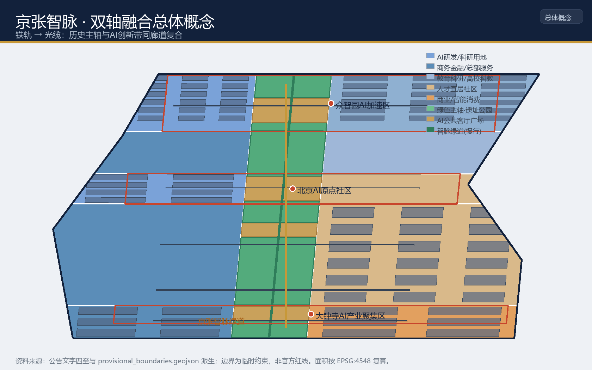
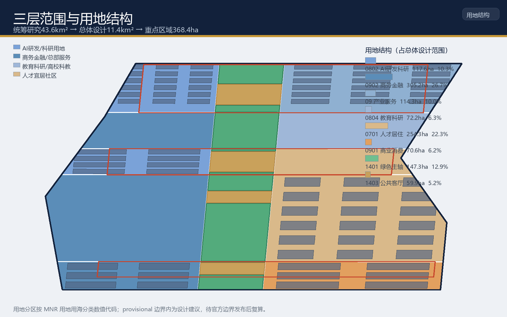
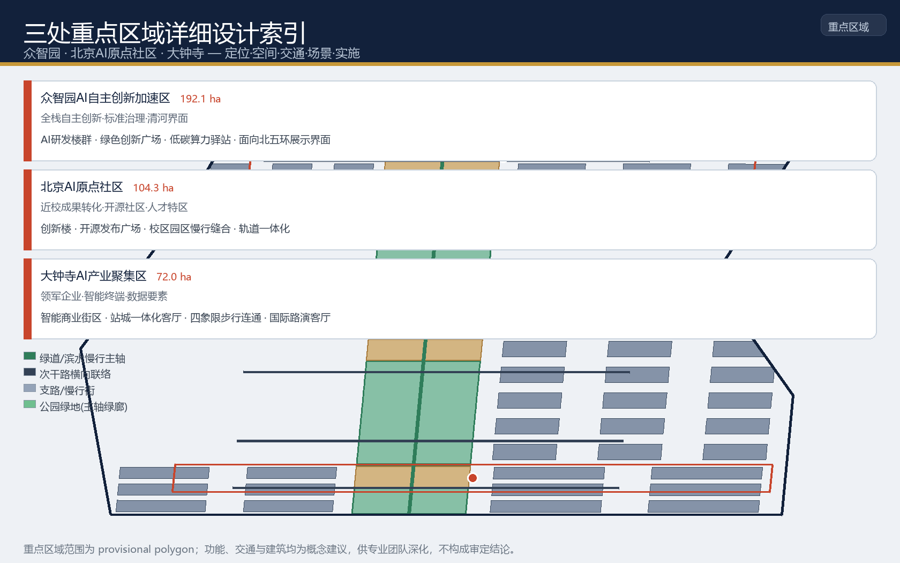
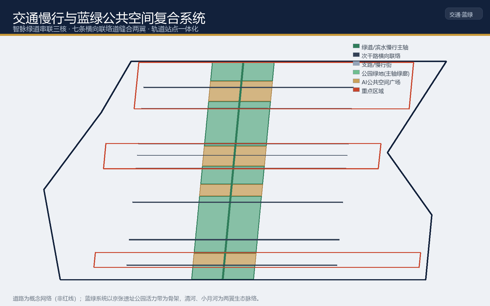
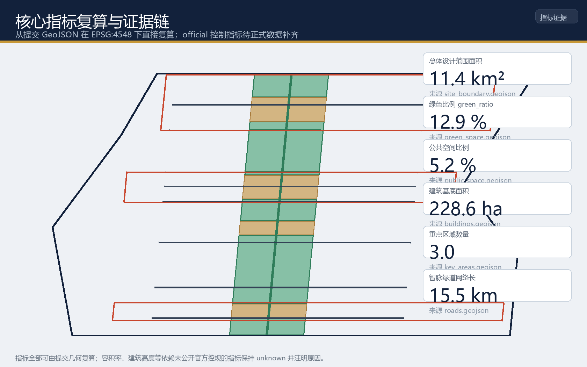

# 京张智脉：铁轨到光缆的百年AI创新带双轴融合城市设计方案

## 1 设计依据与资料清单

本方案以北京市规划和自然资源委员会海淀分局发布的《百年京张AI创新带城市设计国际方案征集资格预审公告》为第一依据 [source:OFFICIAL-ANNOUNCEMENT]，并以 `brief/site-package/` 中登记的设计简报、允许设计空间、来源清单、枚举、规划指标范围、专业标准快照与临时几何边界为机器可读依据 [source:SITE-PACKAGE]。面向智能体的开源征集任务书 [source:AGENT-TASKBOOK] 补充了三条定位、五大功能、三区两翼、六项智能体任务、共创原则与统一边界条款，本方案将其中的空间落地建议一律表述为概念建议、参考方案或可供专业团队深化的材料，不替代正式规划，不构成政府审定结论。

资料来源的使用边界以公共来源注册表为准 [source:SOURCE-REGISTRY]：公告、任务书与专业标准用于正式任务依据；临时边界 [source:BOUNDARY-SOURCE] [source:KEY-AREA-SOURCE] 仅用于方案生成、自检、可视化与设计讨论。`data/processed/agent_fact_pack.md` 是阅读导航层，不是新的权威来源 [source:PROCESSED-FACT-PACK]。

本方案当前使用仓库登记的**临时粗略边界（provisional constraint）**。官方精确 polygon 尚未在公开渠道发布，公告文字四至与约面积已用于校核，但矩形边不代表道路红线、地块边界或权属边界 [data:geometry/site_boundary.geojson#SITE-001] [standard:MOHURD-CONTROL-DETAILED-PLANNING]。待官方或清权 CAD/GIS/PDF 边界发布后，site boundary、key areas、land use、roads、green space、public space、buildings、phasing 与全部面积类指标均需重算，本方案已在 `assumptions.json` 中登记该复算触发条件。

## 2 三层范围工作框架

方案按公告确定的三层范围组织工作，形成“统筹研究定生态 → 总体设计定空间 → 重点区域定深度”的递进关系 [standard:PROJECT-OFFICIAL-ANNOUNCEMENT]：

- **统筹研究范围（约43.6km²）**：北至北五环路、东至京藏高速、南至西直门外大街、西至万泉河路。研究AI产业生态、三区两翼协同、未来城市形态与全球传播叙事，回答“海淀如何成为世界级AI创新高地和朝圣地”。
- **总体设计范围（约11.4km²）**：以京张遗址公园周边1—2公里城市地区和产业区为走廊，组织城市更新总体框架、产业空间布局、交通市政支撑与风貌控制 [metric:site_area_sqm]。
- **重点区域范围（约368.4ha）**：自北向南为众智园AI自主创新加速区、北京AI原点社区、大钟寺AI产业聚集区，进行规划综合实施方案深度的详细设计 [metric:key_area_count] [data:geometry/key_areas.geojson#PROV-KEY-001]。

三层范围由同一套几何证据支撑：site boundary 定义设计边界 [data:geometry/site_boundary.geojson#SITE-001]，land use 分区无重叠无缺口覆盖全部边界 [data:geometry/land_use.geojson#LU-EW]，三处重点区以独立图层表达 [data:geometry/key_areas.geojson#PROV-KEY-002]。任何无法从结构化数据复算的面积、比例、规模或项目数量，本方案不写入正式结论 [depth:three_level_scope_framework]。

## 3 统筹研究范围产业与未来城市研究

### 3.1 总体概念：京张智脉（Rail → Optics）

本方案提出的总体概念为**“京张智脉”**，英文主名 **JingZhang Intellima Belt**，副标题 **From Rail to Light**。核心隐喻是把京张铁路这条百年前的“铁轨”主轴，转译为承载人工智能创新要素的“光缆”主轴：铁轨输送的是蒸汽与旅客，光缆输送的是数据、模型与创意；两者在同一廊道上复合，历史文脉与时代技术形成双轴共轨 [source:AGENT-TASKBOOK]。

三大定位在概念中被统一为一条“智脉叙事”：**百年京张文化带**是脉之魂（历史地层），**AI融合创新带**是脉之干（功能载体），**都市AI生活体验带**是脉之流（人的感知与生活）[source:OFFICIAL-ANNOUNCEMENT]。五大功能形成回路：AI全栈自主创新体系（脉之自主）、世界级AI创新生态（脉之生态）、AI+场景赋能新范式（脉之赋能）、智能化AI活力城市（脉之城）、AI治理全球话语权（脉之治理）[source:AGENT-TASKBOOK]。

### 3.2 命名体系与Logo方向

命名体系采用“脉-核-翼-点”层级，全部取自同一意象：一带（京张智脉）、三核（众智园“源芯”、北京AI原点社区“原点”、大钟寺“钟汇”）、两翼（中关村科技服务翼“中关”、小月河场景赋能翼“月河”）、多点（场景节点以“驿、厅、廊、门”命名）。

Logo方向建议以**铁路轨距1435mm与光脉冲信号**为双要素：一条渐变光带沿轨道枕木行进，构成既像“铁轨+光缆”又像“脉搏”的符号，横笔暗含“京张”首字母“JZ”与“∞”无限符号 [standard:PROJECT-AGENT-OPEN-CALL-TASKBOOK]。视觉识别强调科技蓝绿与京张锈红的文化对比，字体使用开源中文字体，最终方案需经专业品牌团队深化并完成字体清权。

### 3.3 五大功能与三区两翼协同回路

三区两翼的协同回路为：**高校策源 → 开源协作 → 企业转化 → 公共体验 → 国际传播**。北京AI原点社区承接清华、北航等高校与开源社区的源头创新 [data:geometry/key_areas.geojson#PROV-KEY-002]；众智园将源头成果转化为全栈自主的产品、标准与治理能力 [data:geometry/key_areas.geojson#PROV-KEY-001]；大钟寺承接领军企业与智能体新业态的场景化落地与消费体验 [data:geometry/key_areas.geojson#PROV-KEY-003]；西侧中关村科技服务翼提供要素全球化配置、中关村IP与资本赋能 [data:geometry/land_use.geojson#LU-BW]；东侧小月河场景赋能翼提供AI场景测试与活力城市试验场 [data:geometry/land_use.geojson#LU-DE]。

### 3.4 全球AI创新生态案例研究（5—8个）

为回答“世界级AI创新生态如何组织”，本方案研究以下全球案例并提取可迁移机制 [source:AGENT-TASKBOOK]：

| # | 案例 | 核心机制 | 可迁移到一带的空间/运营动作 |
| --- | --- | --- | --- |
| 1 | 硅谷·斯坦福研究园 | 高校—园区—资本闭环 | 原点社区近校成果转化街 |
| 2 | 波士顿·肯德尔广场 | 生命科学与AI集聚的密度效应 | 众智园高密度研发街区 |
| 3 | 西雅图·南湖联合区 | 领军企业带动上下游生态 | 大钟寺领军企业锚点 |
| 4 | 新加坡·纬壹科技城 | 站城一体、职住游混合 | 轨道站点一体化客厅 |
| 5 | 深圳·南山科技园 | 硬科技与制造协同 | 端侧算力驿站与测试场 |
| 6 | 赫尔辛基·马瑞斯塔 | 开放创新与公共数据 | 数据要素会客厅、开源发布厅 |
| 7 | 柏林·西莫克 | 都市更新中的创意产业街区 | 低效空间渐进式更新 |
| 8 | 特拉维夫·沙朗区 | 全球人才与跨国社区 | 国际开发者社区与人才服务 |

以上案例的迁移动作均表述为概念建议，不构成对任何企业的招商承诺或投资结论。

### 3.5 AI 原生城市形态与规划方法创新

本节把"AI 如何改变城市"从场景层提升到空间与规划机制层，提出五项可继续深化为空间设计的创新机制 [standard:PROJECT-AGENT-OPEN-CALL-TASKBOOK] [depth:overall_spatial_structure]：

1. **端侧算力-公共服务复合层（"算力驿站"）**：将分布式算力与公共服务中心、低碳能源设施共址复合，形成"市政+算力+服务"三合一的新型基础设施节点 [data:geometry/public_space.geojson#PUBLIC-P-2]。它把 AI 从"云端黑盒"变成"街角可感知"的公共设施，降低小微企业接入门槛，是智能化AI活力城市的功能原点。
2. **可编程公共空间与时空弹性**：智脉绿道与公共客厅具备"时段复用"能力——同一空间在通勤、午间、夜间承载不同 AI 场景（晨间慢行、午间路演、夜间数字展演）[data:geometry/green_space.geojson#GREEN-LU-DS1]。空间使用从"静态功能分区"走向"时空编程"，是对用地弹性与城市活力的规划回应。
3. **数据要素空间治理**：大钟寺"数据要素会客厅"与公共数据开放机制，把"空间资产"与"数据资产"并置治理 [data:geometry/land_use.geojson#LU-EE]，在合规、授权、可审计前提下培育数据要素流通的城市服务界面，是 AI 治理全球话语权的空间载体。
4. **规划-仿真-测试闭环**：以城市数字孪生支持规划推演，以小月河智能交通测试场提供真实验证 [data:geometry/public_space.geojson#PUBLIC-P-4]，形成"规划假设→空间仿真→真场测试→反馈修正"的闭环，回应"把测试场景写入空间"的任务要求。
5. **"三区两翼"规划单元与弹性留白**：以三区两翼作为统筹规划单元，配合国土空间"留白用地"思路设置弹性预控空间，为未来 AI 原生功能保留适应性 [depth:land_use_layout]。

上述机制均表述为概念建议，供专业团队在法定规划框架内深化；涉及开发强度、道路红线与工程方案的结论待正式控规条件确认 [standard:MOHURD-CONTROL-DETAILED-PLANNING]。

## 4 总体设计范围城市更新与控规深度城市设计

总体设计范围以控制性详细规划的城市设计深度组织空间结构。本方案提出**“一带串三核、两翼缝合、蓝绿复合、多点场景”**的总体空间结构 [depth:overall_spatial_structure]：

- **一带**：南北贯通的京张智脉绿道，既是历史遗址走廊，也是AI创新廊道 [data:geometry/green_space.geojson#GREEN-LU-AS1]。
- **三核**：众智园、原点社区、大钟寺三处重点区域，承担全栈创新、成果转化与智能经济功能 [metric:key_area_count]。
- **两翼**：中关村科技服务翼（西）与小月河场景赋能翼（东），通过七条横向联络道缝合 [data:geometry/roads.geojson#ROAD-005]。
- **蓝绿复合**：以绿道为主轴，串联清河、小月河生态脉络 [data:geometry/green_space.geojson#GREEN-LU-ES1]。
- **多点场景**：以“驿、厅、廊、门”为命名的AI场景节点网络 [data:geometry/public_space.geojson#PUBLIC-P-2]。

用地布局按国土空间用地用海分类组织，覆盖边界无重叠无缺口 [standard:MNR-LAND-USE-CLASSIFICATION-GUIDE]：商务金融与总部服务用地约305.2ha（占26.7%）[data:geometry/land_use.geojson#LU-EW]，人才宜居社区约254.3ha（占22.3%）[data:geometry/land_use.geojson#LU-DE]，绿色主轴约147.3ha（占12.9%）[data:geometry/land_use.geojson#LU-ES1]，AI研发科研约117.6ha（占10.3%）[data:geometry/land_use.geojson#LU-CW]，产业服务约114.3ha、教育科研约72.2ha、商业消费约70.6ha、公共客厅约59.9ha [metric:land_use_zone_count]。

开发强度与建筑高度依赖未公开的官方控规条件。本方案不设定容积率、建筑高度等法定指标，统一保持 `unknown` 状态并登记为待补资料 [metric:floor_area_ratio] [depth:development_intensity_controls]。概念体量仅用于展示空间关系，不等同于审定控制值 [depth:height_massing_character]。

## 5 重点区域详细设计

### 5.1 众智园AI自主创新加速区（约192.1ha）

**定位**：花园型全栈自主创新街区，聚焦AI全栈自主创新体系与AI治理全球话语权。**空间动作**：强化清河界面，形成面向北五环的产业展示界面；布局高密度研发街区、绿色创新广场与低碳算力驿站 [data:geometry/key_areas.geojson#PROV-KEY-001] [data:geometry/land_use.geojson#LU-AW]。**AI场景**：自主模型测试、标准制定工作坊、安全治理展示、低碳算力体验。**实施依赖**：待补五环衔接、清河蓝线与市政条件 [depth:three_key_area_detailed_design]。

### 5.2 北京AI原点社区（约104.3ha）

**定位**：近校型成果转化与人才社区，锚定“AI原点”概念，承接清华、北航源头创新。**空间动作**：组织校区—园区—街区慢行缝合；布局原点社区创新楼、开源发布广场与成果转化街 [data:geometry/key_areas.geojson#PROV-KEY-002] [data:geometry/public_space.geojson#PUBLIC-P-3]。**AI场景**：开源社区、成果发布、人才特区服务、近校孵化。**实施依赖**：校区边界、权属与首层业态需专业团队深化。

### 5.3 大钟寺AI产业聚集区（约72.0ha）

**定位**：城市型智能经济与国际交往街区，锚定领军企业、智能体与智能终端新业态。**空间动作**：围绕大钟寺站一体化，组织四象限步行连通与智能商业街区 [data:geometry/key_areas.geojson#PROV-KEY-003] [data:geometry/land_use.geojson#LU-EE]。**AI场景**：智能体与智能终端展示、内容消费、数据要素会客厅、国际路演客厅 [data:geometry/public_space.geojson#PUBLIC-P-1]。**实施依赖**：轨道站点、道路交叉口与市政管线条件待补。

三处重点区域的功能业态、建筑规模、拆改留分类、公共空间连通与交通组织均以规划综合实施方案深度展开，但受限于缺少现状建筑、权属与控规条件，拆改留结论一律表述为“待专业团队深化的方法与待校准清单” [depth:retain_renovate_demolish]，不编造任何地块层面的拆改留结论。

## 6 AI 创新生态、人才画像与 AI+ 场景

面向智能体任务书的六项任务在本方案中的响应映射如下 [source:AGENT-TASKBOOK]：

| agent 任务 | 方案响应章节与内容 |
| --- | --- |
| agent.1 一带总体概念与功能统筹 | 第3章：京张智脉命名、Logo方向、三大定位、五大功能、三区两翼协同回路 |
| agent.2 AI全栈自主创新体系与世界级生态 | 第3章：三区两翼、5-8个全球生态案例、创新生态图谱与要素机制 |
| agent.3 AI+场景赋能与活力城市 | 第6章：12张场景卡（含4个产业测试验证场景）、6类用户画像、隐私与人工复核边界 |
| agent.4 AI公共空间、新业态与朝圣地标 | 第9章：智脉绿道与公共客厅、3个AI朝圣地标、荣誉展示体系与组件库 |
| agent.5 文化融合叙事 | 第9章：京张-中关村-AI新文化叙事、导视符号、国际传播叙事 |
| agent.6 全球活动与长期运营 | 第10章：年度活动体系、品牌IP、开发者社区运营、场景开放与国际转化 |

### 6.1 人才画像（6类）

| 用户画像 | 典型需求 | 空间响应 |
| --- | --- | --- |
| 开源开发者 | 发布、协作、测试、社区声誉 | 原点社区开源发布厅、公共代码墙、夜间协作空间 |
| 初创团队 | 低成本办公、算力入口、产品试验场 | 众智园共享测试场、端侧算力驿站、标准治理咨询 |
| 头部企业访客 | 展示、商务、国际接待、人才招聘 | 大钟寺国际路演客厅、轨道站点接驳 |
| 周边居民 | 通勤、休闲、社区服务、低扰动更新 | 智脉绿道慢行环、社区服务嵌入、夜间活动分级 |
| 高校师生 | 成果转化、跨校协作、日常慢行 | 校区—园区慢行缝合、成果转化驿站、AI教育体验点 |
| 国际开发者 | 签证与居住服务、跨国协作、社区归属 | 人才特区服务、国际开发者社区、全球活动周 |

画像数据仅用于设计需求分析，不采集居民个人行为轨迹 [standard:PROJECT-AGENT-OPEN-CALL-TASKBOOK]。

### 6.2 AI场景卡（12张，含4张产业测试验证场景）

| 场景卡 | 空间载体 | 类型 | 数据与隐私边界 | 人工复核 |
| --- | --- | --- | --- | --- |
| SC-01 开源发布厅 | 原点社区 | 公共体验 | 聚合统计，不采集个人轨迹 | 平台管理员 |
| SC-02 安全治理沙盒 | 众智园 | **产业测试验证** | 测试数据隔离、脱敏 | 安全评估人 |
| SC-03 端侧算力驿站 | 总体范围节点 | 公共体验 | 用能数据，个人端需授权 | 运营主体 |
| SC-04 AI慢行导航 | 智脉绿道 | 公共体验 | 只读公开地图，不追踪身份 | 人工标注复核 |
| SC-05 大钟寺国际路演客厅 | 大钟寺 | 公共体验 | 活动影像需授权 | 媒体审核 |
| SC-06 清河低碳创新廊 | 众智园临河界面 | 公共体验 | 环境传感聚合 | 环境管理 |
| SC-07 近校成果转化街 | 原点社区 | 公共体验 | 科研数据需授权 | 院校合规 |
| SC-08 数据要素会客厅 | 大钟寺 | **产业测试验证** | 合规、授权、可审计 | 数据治理委员会 |
| SC-09 AI生活服务样板街 | 社区交汇处 | 公共体验 | 服务数据最小化 | 人工服务兜底 |
| SC-10 全球AI活动周路线 | 一带公共空间 | 公共体验 | 报名与现场数据按活动授权 | 活动运营 |
| SC-11 智脉AI展示舱 | 智脉绿道 | **产业测试验证** | 演示数据脱敏 | 展示审核 |
| SC-12 小月河智能交通测试场 | 小月河场景赋能翼 | **产业测试验证** | 交通数据脱敏，不追踪个体 | 交管复核 |

每个场景均说明服务对象、空间位置、数据来源、隐私边界、人工复核与运营主体 [depth:traffic_rail_slow_parking]；场景节点进入 `compliance_matrix.json` 与 `visual/index.html` 的 AI 场景章节，未成熟技术不表述为已可全面部署 [source:AGENT-TASKBOOK]。

## 7 用地、建筑规模与拆改留方案

用地方案按第4章的分区覆盖全部提交边界，地块之间共享边线，无重叠无缺口 [data:geometry/land_use.geojson#LU-DW] [depth:land_use_layout]。建筑方案区分概念新建体量与现状保留体量：众智园与原点社区布局AI研发楼群 [data:geometry/buildings.geojson#BLDG-ZZY-W-0101]，大钟寺布局商务楼群与智能商业街区 [data:geometry/buildings.geojson#BLDG-DZS-E-0101]，东部现状区以保留住区表达 [data:geometry/buildings.geojson#BLDG-RET-E-0101]。

建筑基底面积由提交几何直接复算 [metric:building_footprint_area_sqm]，概念覆盖率约20% [metric:building_density_ratio]，仅作设计讨论，不构成法定建筑强度。拆改留策略受现状建筑与权属资料缺失限制，按“待专业团队深化”登记，不给出地块层面的拆改留结论 [depth:retain_renovate_demolish]。

## 8 交通、轨道、市政与公共服务设施

交通组织以**智脉绿道为南北慢行主轴 + 七条横向联络道缝合两翼 + 轨道站点一体化接驳**为骨架 [depth:traffic_rail_slow_parking]：绿道承担步行、骑行与AI场景展示 [data:geometry/roads.geojson#ROAD-001]，横向道路连接中关村与小月河两翼 [data:geometry/roads.geojson#ROAD-005]，大钟寺站、五道口、清华东路西口组织站城一体化公共客厅 [data:geometry/public_space.geojson#PUBLIC-P-1] [data:geometry/public_space.geojson#PUBLIC-P-2]。智脉绿道网络总长约15.5km [metric:road_network_length_m]。

市政与新型基础设施策略覆盖端侧算力、分布式能源与公共服务设施融合，但管线、能源、排水、防洪、消防等工程条件缺失，一律列为正式深化前置条件 [depth:municipal_new_infrastructure]。道路线形、轨道线位、桥隧与市政管线均为概念建议，非工程方案。

## 9 蓝绿空间、公共空间与城市风貌

### 9.1 蓝绿系统

以京张遗址公园活力带为骨架，形成南北贯通的智脉绿道（约147.3ha绿色主轴）[data:geometry/green_space.geojson#GREEN-LU-DS1]，串联清河、小月河两翼生态脉络。四处以大钟寺站、五道口、原点社区、众智园为锚点的AI公共客厅（约59.9ha）[data:geometry/public_space.geojson#PUBLIC-P-4]，承担慢行、体育、创新交往与科技测试复合功能 [metric:green_ratio] [metric:public_space_ratio]。

### 9.2 城市风貌与历史文化叙事

城市风貌融合京张铁路历史文化、中关村创新文化与AI新文化 [depth:blue_green_public_space]。**文化叙事主线**为“自力更生、敢为人先、开源向善”：京张铁路是中国自主设计建造的首条干线铁路，其自主创新精神是AI时代的原点；中关村延续产学研结合、敢为人先；AI新文化强调开源、协作与人类价值。三者沿智脉绿道以空间事件序列展开：**起点（詹天佑精神坐标）→ 传承（中关村创新节点）→ 演进（AI里程碑走廊）→ 展望（朝圣之门）** [standard:MOHURD-URBAN-DESIGN-MEASURES]。

### 9.3 AI朝圣地标与荣誉展示体系（3+）

本方案提出三个AI朝圣地标候选方向 [source:AGENT-TASKBOOK]：

1. **京张原点·詹天佑精神坐标**（原点社区）：以铁路道钉与轨枕为母题的纪念装置，承载“自主创新原点”叙事。
2. **轨光之门·智脉门户**（众智园北入口）：以1435mm轨距与光脉冲构成的入口地标，面向北五环建立一带辨识度。
3. **数字钟鼓·大钟寺智能地标**：呼应大钟寺历史钟文化，以交互式数字声景与AI内容展示构成智能时代新钟鼓。

荣誉展示体系包括公共代码墙、贡献者墙、AI里程碑走廊与年度“智脉奖”，沿绿道与公共客厅分布，配套导视标识系统与无障碍设计。所有地标与品牌元素均为概念方向，需专业团队深化并完成清权，不构成已批准建设 [standard:PROJECT-AGENT-OPEN-CALL-TASKBOOK]。

### 9.4 公共利益与包容性设计

本方案把公共利益作为 AI 场景与公共空间设计的第一原则，明确各群体的受益路径与保护边界 [source:AGENT-TASKBOOK]：

- **无障碍与代际包容**：公共空间与 AI 服务界面遵循无障碍环境建设要求，设置语音、触觉、大字号与人工服务并行通道 [standard:BARRIER-FREE-ENVIRONMENT-LAW]；针对老年人高频服务场景坚持"传统服务与智能服务并行"，避免把智能化变成使用门槛 [standard:ELDERLY-SMART-TECH-PLAN-2020-45]。
- **居民与社区受益**：智脉绿道、公共客厅与社区服务嵌入优先服务通勤、休闲与日常需求 [data:geometry/public_space.geojson#PUBLIC-P-4]；更新项目以低扰动、渐进方式推进，减少对既有生活的冲击 [depth:renewal_project_list]。
- **青年与高校机会**：开源发布厅、成果转化街与人才社区为青年开发者、初创团队与高校师生提供就业、创业与学习机会 [data:geometry/public_space.geojson#PUBLIC-P-3]。
- **游客与公众体验**：京张智脉叙事与朝圣地标为公众提供可参观、可传播、可参与的城市体验 [depth:blue_green_public_space]。
- **数据红利与隐私保护**：AI 场景坚持数据最小化、可解释与人工复核，公共数据收益回馈社区治理，禁止把居民画像用于商业推荐，不输出未经授权的个人画像 [standard:PROJECT-AGENT-OPEN-CALL-TASKBOOK]。

## 10 更新项目清单、实施政策与分期计划

### 10.1 更新项目清单（概念级，含责任主体与量化目标）

| 项目编号 | 项目名称 | 类型 | 主要依赖 | 责任主体（概念建议） | 量化目标（概念） | 分期 |
| --- | --- | --- | --- | --- | --- | --- |
| JZ-01 | 大钟寺站城一体化公共客厅 | 公共空间/轨道 | 轨道站点、道路交叉口、市政管线 | 轨道运营方、区属平台、商业运营方 | 一处站城客厅；四象限步行连通覆盖主要出入口 | 一期 |
| JZ-02 | 原点社区开源发布广场 | 公共空间/产业 | 校区边界、权属、首层业态 | 高校、园区运营方、开源社区组织 | 一处发布广场；年度开源活动≥12场 | 一期 |
| JZ-03 | 众智园清河创新界面 | 蓝绿空间/产业 | 河道蓝线、生态与防洪条件 | 区属平台、园区运营方 | 一处滨水创新界面；配套绿地纳入绿道体系 | 一期 |
| JZ-04 | 智脉绿道断点缝合 | 公共空间/交通 | 道路红线、桥下空间、交通组织复核 | 交通、园林绿化、属地街道 | 绿道贯通率提升；主要断点清单逐步清零 | 二期 |
| JZ-05 | 小月河智能交通测试场 | 新基建/交通 | 能源、算力、安全与运营主体 | 交管、园区运营方、技术运营商 | 一处测试场；开放产业测试验证场景≥3个 | 二期 |
| JZ-06 | 全球AI活动周公共路线 | 运营/品牌 | 公共空间许可、活动安全、版权清权 | 活动运营主体、场馆、社区 | 年度活动周；全球开发者参与规模逐年增长 | 二期 |
| JZ-07 | 数据要素会客厅 | 产业/治理 | 数据合规、授权、审计机制 | 数据主管部门、运营方 | 一处会客厅；公开数据目录与治理规则先行 | 二期 |
| JZ-08 | 社区AI生活服务样板街 | 公共服务/更新 | 社区、首层业态、运营主体 | 街道、社区、服务运营方 | 一处样板街；服务覆盖医疗/教育/法律等事项 | 二期 |

上述责任主体与量化目标均为概念建议与深化方向，供专业团队结合权属、政策与财政实际细化，不构成政府或企业承诺 [standard:MOHURD-CONTROL-DETAILED-PLANNING] [data:geometry/phasing.geojson#PHASE-001]。

### 10.2 实施机制与责任分工（概念）

本方案提出可继续深化的实施机制，把空间概念转化为可操作的项目序列与责任安排 [depth:renewal_project_list]：

- **责任分工矩阵（概念）**：政府与公共部门负责空间供给、政策与公共产品 [data:geometry/public_space.geojson#PUBLIC-P-1]；高校与科研院所承担源头创新与成果转化；企业承担产业、算力与商业运营；社区与公众参与治理与体验反馈；专业化运营主体承担场景、活动与数据服务。
- **资金来源（概念）**：以政府引导资金、公共空间运营收益、产业基金与社会资本为组合；运营型项目可先用轻量设施和活动启动，重大工程待资金与实施主体明确后推进。资金安排不构成投资承诺 [source:AGENT-TASKBOOK]。
- **先行试点（Quick wins）**：运营型项目（场景开放日、开源发布厅、开发者活动周）对工程依赖低，可先行启动；再以智脉绿道公共客厅、数据要素会客厅等轻量设施形成可见成效；最后推进站点一体化与测试场等重资产项目 [depth:phasing_implementation]。
- **量化指标体系（概念目标）**：将绿色比例、公共空间比例、慢行贯通率、AI场景节点数、年度活动场次、开发者社区规模、入驻企业数等设为可考核绩效目标 [metric:green_ratio] [metric:public_space_ratio]，由专业团队在实施深化中校准。
- **政策工具建议**：城市更新统筹实施、产业空间供给、创新平台服务、数据治理规则、公众参与与产权协同 [standard:MOHURD-CONTROL-DETAILED-PLANNING]。
- **前置条件与触发机制**：各项目实施依赖官方控规、权属、市政与工程条件；官方边界与控规发布后，按第11章复算路径更新相关指标与分期 [metric:site_area_sqm]。

### 10.3 分期计划

实施分两期表达 [data:geometry/phasing.geojson#PHASE-001]：**一期（三核启动与站点AI客厅）** 覆盖南部大钟寺与原点社区节点，约626.4ha [metric:phase_1_area_sqm]；**二期（主轴贯通与两翼缝合）** 覆盖众智园、智脉绿道北段与小月河场景翼，约514.9ha [data:geometry/phasing.geojson#PHASE-002] [metric:phase_2_area_sqm]。分期仅表达概念推进路径，不构成审批时序。

### 10.4 全球AI创新活动体系与长期运营

面向智能体任务书要求形成年度活动体系、品牌IP、开发者社区运营、场景开放运营与国际传播转化机制 [source:AGENT-TASKBOOK]。本方案提出概念性运营框架 [depth:phasing_implementation]：

- **年度活动体系**：开发者节（春）、全球AI开放周（夏）、场景开放日（月度）、智脉路演季（秋）、智脉奖年度发布（冬）。
- **品牌IP与传播**：以“铁轨→光缆”视觉为核心，建立活动品牌识别、国际传播叙事与内容矩阵。
- **开发者社区运营**：开源发布厅常态化运营，贡献者墙与公共代码墙持续更新，人才转化路径衔接人才特区服务。
- **场景开放运营**：以“申请—审批—测试—发布”机制开放产业测试验证场景 [data:geometry/public_space.geojson#PUBLIC-P-2]。
- **国际传播与招引转化**：活动周成为全球开发者来京的体验入口，衔接企业落地与人才服务。

所有活动、招商、政策与资金安排均表述为概念建议或深化方向，不得视为已确定的政府安排或实施承诺 [standard:PROJECT-AGENT-OPEN-CALL-TASKBOOK]。

## 11 指标体系、面积复算与合规矩阵

指标体系由提交几何直接复算并与 `metrics.json` 一致 [depth:metrics_recalculation]：总体设计范围面积约11.41km² [metric:site_area_sqm]，绿色比例12.9% [metric:green_ratio]，公共空间比例5.2% [metric:public_space_ratio]，建筑基底约228.6ha [metric:building_footprint_area_sqm]。三处重点区面积与智脉绿道网络长度分别见对应指标 [metric:zhongzhiyuan_area_sqm] [metric:road_network_length_m]；容积率、建筑高度等依赖未公开官方控规的指标保持 `unknown` 并注明待补原因 [metric:floor_area_ratio]。

合规矩阵覆盖公告1.3、1.4、1.5全部任务与agent.1—agent.6六项智能体任务 [depth:metrics_recalculation]，专业标准覆盖与设计深度覆盖分别保存在 `standard_matrix.json` 与 `design_depth_matrix.json`，不在正文堆叠机器索引。

## 12 风险、版权与合规说明

本方案存在以下主要风险与资料缺口 [depth:risk_missing_data]：

- **官方边界缺失**：当前几何为 provisional constraint，不能作为 official redline、审批依据或精确面积复算依据；官方 polygon 发布后需全链重算 [data:geometry/constraints.geojson#CONSTRAINTS]。
- **控规与工程资料缺失**：容积率、建筑高度、道路红线、市政管线、权属、文保与消防条件待正式数据补齐，相关结论统一降级为待确认事项 [standard:MOHURD-CONTROL-DETAILED-PLANNING]。
- **数据与版权边界**：全部文本、几何、图表、HTML 与图纸由声明的AI agent生成或使用清权公开资料，来源与许可登记于 `sources.json` 与 `report/copyright_statement.md`；未使用秘密地图、非公开表格或未经授权素材 [source:SITE-PACKAGE]。
- **语言要求**：本方案为中英双语包，英文对照见 `proposal.en.md`，A3/A0、HTML 与含文字图件均提供对应语言副本。

本方案不声称官方批准、审定控规、最终土地权属、最终建设规模或保证实施；AI agent 对事实、来源、版权、空间数据、指标与表达负责 [standard:PROJECT-OFFICIAL-ANNOUNCEMENT]。

## 13 参考资料

1. 《百年京张AI创新带城市设计国际方案征集资格预审公告》，北京市规划和自然资源委员会海淀分局，2026-05-09。https://ghzrzyw.beijing.gov.cn/zhengwuxinxi/tzgg/hd/202605/t20260509_4643047.html
2. 《面向全球智能体开展“百年京张AI创新带城市设计开源征集”的任务书摘录》，用户提供清权资料，2026-05-18。
3. 《“三区两翼”打造世界级AI集聚地》，北京市科学技术委员会、中关村科技园区管理委员会，2026-04-03。https://kw.beijing.gov.cn/xwdt/kcyx/xwdtcyfz/202604/t20260403_4573808.html
4. 《海淀区发布“1+X+1”现代化产业体系建设布局》，北京市海淀区人民政府，2026-03-02。
5. 《城市设计管理办法》，住房和城乡建设部，2017。
6. 《城市、镇控制性详细规划编制审批办法》，住房和城乡建设部。
7. 《国土空间调查、规划、用途管制用地用海分类指南》，自然资源部，2023。
8. 临时粗略边界与三处重点区 polygon，仓库维护者登记，2026-06-05。
9. `brief/site-package/`、`data/source_registry.json`、`data/processed/agent_fact_pack.md` 等机器可读依据的完整索引见 `sources.json` 与三个矩阵文件 [source:SITE-PACKAGE] [source:OFFICIAL-ANNOUNCEMENT]。
