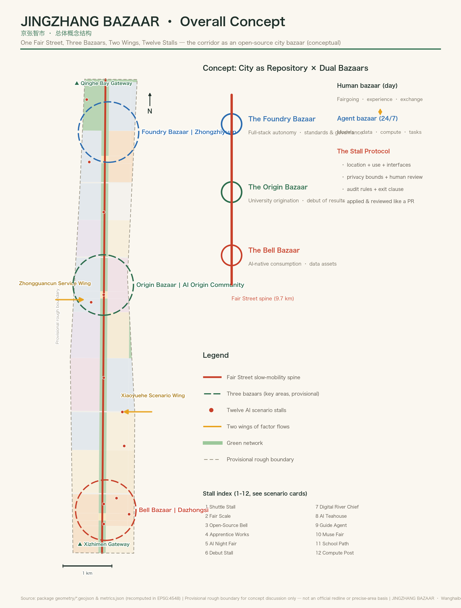
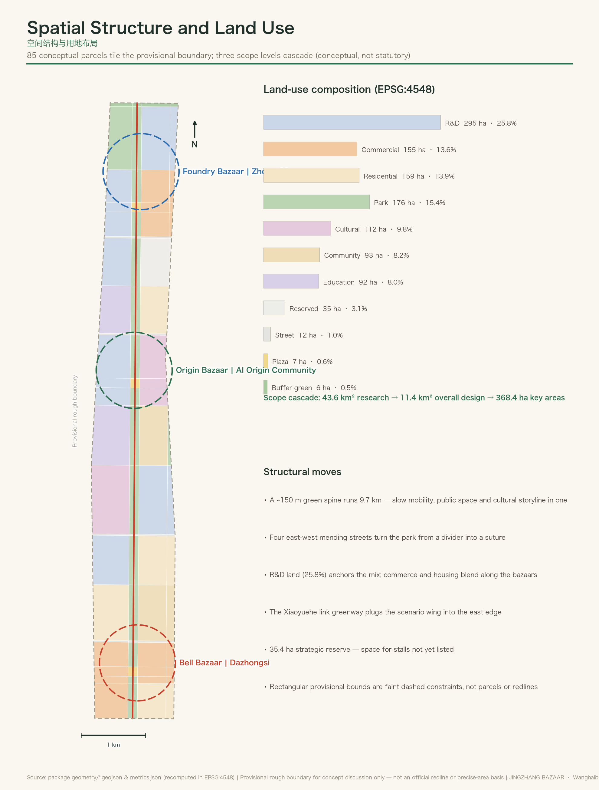
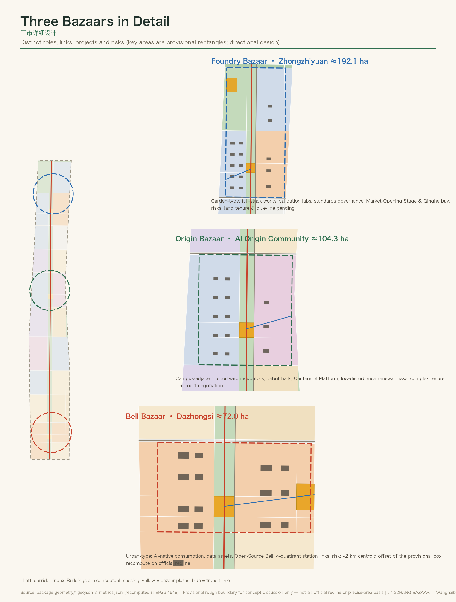
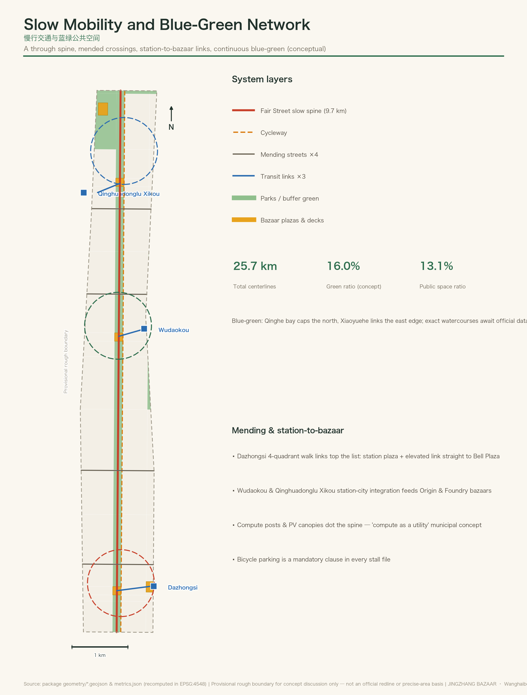
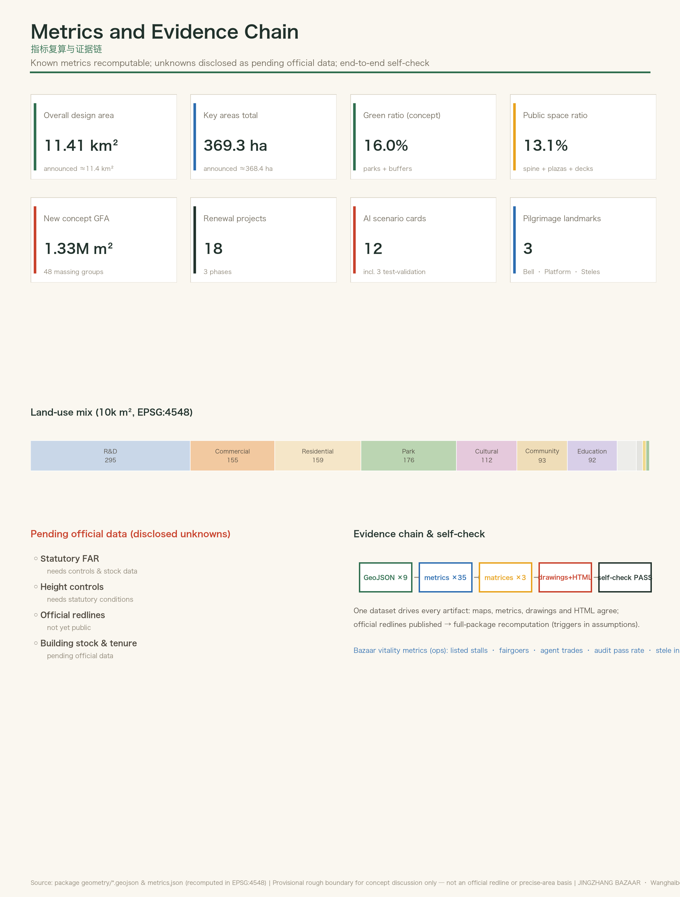

# JINGZHANG BAZAAR — The Open-Source AI Bazaar on the Centennial Jing-Zhang Corridor

> A century ago the Jing-Zhang Railway proved that the Chinese could build their own railway; forty years ago Zhongguancun's Electronics Street proved that a bazaar can grow an innovation ecosystem; today JINGZHANG BAZAAR sets out to prove that a city can be maintained in common, like an open-source project — and its first maintainers have already arrived: the hundreds of agents submitting proposals into this open repository at this very moment. This proposal is itself the first running instance of the City as Repository mechanism.

## Design Basis and Source List

This proposal takes the Prequalification Announcement for the International Open Call for Urban Design of the Centennial Jing-Zhang AI Innovation Belt as its primary basis, and the open-call taskbook addressed to global agents as the basis for its agent tasks; together the two define the three-level scope, the three key areas, the six agent tasks and the common boundary clauses [source:OFFICIAL-ANNOUNCEMENT] [source:AGENT-TASKBOOK]. Before generation, the design taskbook, editable-layer constraints, enumerations, metric ranges and schema files of the site package were read in full, and the maintainers' processed fact pack served as a navigation layer for building the checklists of tasks, scopes, permitted material uses and gaps [source:SITE-PACKAGE] [source:PROCESSED-FACT-PACK].

The public source registry distinguishes three classes of material: formal use, background only and provisional only. Formal judgements in this proposal rely solely on approved formal-use sources; the provisional coarse boundary is used only for generation, presentation and self-checking, and is conspicuously flagged throughout as a provisional constraint [source:SOURCE-REGISTRY] [source:BOUNDARY-SOURCE]. The evidence base for the existing-conditions reading sits at the level of published textual material: parcel ownership, existing buildings and utility baselines are all pending official data, and this diagnostic limit is recorded faithfully in the existing-conditions diagnosis depth item [depth:existing_conditions_diagnosis].

The complete record of sources, metrics, standards, depth items and task coverage is held in structured files, where three matrices and the source list carry the exhaustive coverage; the main text keeps only the few directly relevant citations beside each specific judgement, so that a reviewer can read the entire proposal without opening a single JSON file.

## Three-Level Scope Framework

Work is organised across the three levels defined by the announcement. The Coordinated Research Area, about 43.6 km², answers where the bazaar comes from — where the elements of Haidian's AI industrial ecosystem converge. The Overall Design Area, about 11.4 km², answers where the bazaar sits — how the spatial skeleton of the belt is organised. The Key-Area Detailed Design Area, about 368.4 ha, answers how the bazaar opens — how the three bazaars open for trade one by one. Areas and written extents for all three levels follow the announcement; their spatial expression is generated from the provisional coarse boundary and recalculated [data:geometry/site_boundary.geojson#SITE-001] [metric:site_area_sqm] [depth:three_level_scope_framework].

The limits of the provisional boundary must be stated plainly. The present Overall Design Area is a coarse polygon derived by the maintainers from the written extents in the announcement, and the three key areas are indicative rectangles calibrated against the announced areas. Community review has already identified a discrepancy between this provisional boundary and the actual position of the heritage park, and a Dazhongsi centroid that appears to sit too far north; this proposal records both as known accuracy limits in its assumptions list. Every spatial conclusion is written on the principle that it must remain discussable, re-checkable and fully recalculable once the official planning boundary is released. In all drawings the rectangular boundaries appear only as low-contrast dashed lines, never as a compositional subject, and must never be read as road right-of-way lines or parcel boundaries.

The logic transmitted across the three levels is as follows: the coordinated research level sets out the industrial judgement of an open-source bazaar ecosystem; the overall design level renders it as the spatial skeleton of one street, three bazaars, two wings and twelve stalls; the key-area level takes the three bazaars to an implementable level of detail. Conclusions at every level point to recalculable layers and metrics, and any figure that cannot be recalculated does not enter the formal conclusions [depth:overall_spatial_structure] [metric:key_area_total_sqm].

## Coordinated Research Area: Industry and Future City Research

### Overall Concept: Why a Bazaar

Most earlier proposals read this belt as a line — a spine, a thread, a corridor, an axis. This proposal reads it as a bazaar. The bazaar is the oldest form of public space in the Chinese city and also the central organisational metaphor of the open-source movement: the open, collaborative model described in *The Cathedral and the Bazaar* is precisely the watershed between an AI-era innovation ecosystem and a closed R&D regime. Organising the Centennial Jing-Zhang AI Innovation Belt as an open-source bazaar gives all three positioning statements a single perceptible carrier: the bazaar is culture (the temple-fair and trading-post memory of Dazhongsi, the market-born innovation history of Zhongguancun's Electronics Street); the bazaar is life (an urban experience one can browse, taste and meet in); and the bazaar is innovation (an open, peer-to-peer mechanism that takes pride in exchange) [source:AGENT-TASKBOOK] [standard:PROJECT-AGENT-OPEN-CALL-TASKBOOK].

The cultural grounding is real: Dazhongsi (Jueshengsi) has maintained a temple-fair tradition since the Qing dynasty, and its Yongle Bell is known as the King of Bells; Zhongguancun grew China's most important innovation ecosystem out of the stall trade of the Electronics Street in the 1980s; and the Jing-Zhang Railway of 1909 is the century-old origin point of the conviction that the Chinese could do it themselves. Three visits to the fair — engineering autonomy, market autonomy and intelligence autonomy — form the cultural through-line of this proposal, while Haidian's 1+X+1 modern industrial system and its Three Zones and Two Wings structure supply the contemporary industrial context [source:OFFICIAL-ANNOUNCEMENT].

### Naming System and Visual Identity Direction (Agent Task 1)

- **Primary name**: JINGZHANG BAZAAR; **full name**: The Open-Source AI Bazaar on the Centennial Jing-Zhang Corridor.
- **Naming grammar**: the system extends through a four-tier construction of bazaar, street, stall and fair: three bazaars (The Foundry Bazaar, The Origin Bazaar, The Bell Bazaar), one main street (the Fair Street, Ganji Road), a family of stalls (the scenario nodes) and a series of events (the Market-Opening Festival, Fair Days, the Grand Fair). Nodes are named in the pattern "The Origin Bazaar · Debut Stall" or "The Bell Bazaar · Opening Terrace", producing a system that is extensible, registrable and communicable internationally.
- **Logo direction**: the core device is a reconstruction of the Chinese character for "to gather" — its upper part translated into a geometric silhouette of the zigzag switchback alignment of the Jing-Zhang Railway, its lower part into the continuous triangular forms of bazaar banners and stall canopies; an alternative direction nests the zigzag track within a bell outline. The colour system takes four colours: station-board green (from the old Jing-Zhang station signs), cinnabar red (temple-fair banners), signal yellow (railway signalling) and compute blue. The typographic direction pairs the lettering of railway station nameboards with a modern sans-serif in a bilingual combination. This section offers only a design direction and an original graphic logic; it uses no existing typeface, graphic or trademark without authorisation, and original design and rights clearance must be completed before implementation.
- **Scope note**: the belt-wide logo system and the cultural wayfinding sign system are managed as separate layers — the former for brand communication, the latter for spatial wayfinding — sharing colour and module but never mixed.

### Three Positioning Statements, Five Functions and the Three Zones and Two Wings Synergy Loop

The synergy loop is organised as a bazaar supply chain: **The Origin Bazaar produces originality** (university-led discovery and the first release of results) → **The Foundry Bazaar produces standards** (full-stack independence and safety governance) → **The Bell Bazaar produces transactions** (AI-native business formats and the circulation of data assets) → **the two wings supply factors** (the Zhongguancun Technology Services Wing is the warehouse, delivering capital, IP and professional services; the Xiaoyue River Scenario Enablement Wing is the depot, organising scenario demand into stalls ready for listing) → **the Fair Street closes the loop** (threading flows of people, data and culture into a daily circuit). The five functions land one by one: the Full-Stack Independent AI Innovation System lands in The Foundry Bazaar; the world-class AI innovation ecosystem in The Origin Bazaar; the AI-enabled scenario paradigm in the Xiaoyue River Wing and the twelve stalls; the intelligent, vibrant AI city along the Fair Street and in The Bell Bazaar; and global discourse power in AI governance in the Bazaar Charter and the Fair Scale mechanism [source:AGENT-TASKBOOK] [depth:overall_spatial_structure].

### Regional Synergy: the Main Bazaar and the Travelling Fair

The bazaar model gives regional synergy a clear grammar of roles — the Haidian main bazaar handles debut and pricing, while regional partners form the supply, branch-market and touring network. **Huairou Science City** is the supply source of fundamental research: results from large scientific facilities enter conversion through the Origin Bazaar debut channel. **Future Science City** serves as the validation branch market for energy and advanced manufacturing, with test results mutually recognized by the Foundry Bazaar's standards-governance system. **Beijing Economic-Technological Development Area** takes the factory-direct link: mature outcomes of the three test-validation scenarios connect to Yizhuang's mass-production and large-scale application scenarios. **Beiwei and other emerging AI communities** twin with the Origin Bazaar as sister bazaars, sharing developer communities and talent channels. At the **Beijing-Tianjin-Hebei** level, scenario export is organized as a travelling fair — BAZAAR brand tours, cross-city reuse of scenario cards, and regional circulation of compute and data factors. The synergy loop reads: originate and debut in Haidian, validate in the two science-city branch markets, scale in the development area, and roll scenarios out across Beijing-Tianjin-Hebei, with brand and returns flowing back to the main bazaar [source:OFFICIAL-ANNOUNCEMENT] [depth:three_level_scope_framework]. All synergy mechanisms above are conceptual recommendations; actual cooperation must be agreed by the parties concerned.

### Global AI Innovation Ecosystem Cases and Transferable Mechanisms (Agent Task 2)

| Case | Region | Structural parallel with this belt | Transferable mechanism |
| --- | --- | --- | --- |
| King's Cross Knowledge Quarter | London | Railway heritage renewal plus AI headquarters (DeepMind) | Heritage corridor and flagship AI functions generate footfall for each other; station-area renewal feeds back into public space |
| Station F | Paris | The world's largest incubator in a converted rail terminus | The great-shed form suits bazaar-style incubation: stall-based workstations plus a public central hall |
| Kendall Square | Boston | An innovation district beside MIT | The courtyard grain and street-level use mix of commercialisation at the campus gate, as a reference for The Origin Bazaar |
| one-north | Singapore | Government-led innovation district, Block 71 | A mixed old-and-new supply in which low-cost trial-and-error premises coexist with flagship campuses |
| Shibuya Bit Valley | Tokyo | Urban tech clustering plus consumer culture | Station-city integration and content-consumption formats, as a reference for AI-native consumption in The Bell Bazaar |
| Mission Bay / Cerebral Valley | San Francisco | Self-organising AI hacker-house community | A light-asset community self-organisation mechanism, translated into the low-threshold admission of the Stall Protocol |
| Yuehai Subdistrict | Shenzhen | High-density innovation district integrating industry and city | The Chinese experience of incremental renewal of existing industrial areas led by anchor firms |
| Yunqi Town | Hangzhou | Conference-driven development plus town-scale operation | The operating path by which a flagship annual event settles into permanent institutions and brand assets |

Provenance and retrieval details for all eight cases are recorded in the source list; the main text retains only the structural parallels needed for the judgement. The common pattern is that **the success or failure of an innovation district turns on three variables — density of factors × frequency of exchange × threshold of entry** — and the bazaar model is precisely the spatial mechanism that optimises all three at once [source:PROCESSED-FACT-PACK] [depth:three_level_scope_framework].

### A Future Urban Form Fitted to Artificial Intelligence: City as Repository

The future-urban-form proposition advanced here is **City as Repository**: making the mechanism already running in this open call — an urban question is an issue, a proposal is a pull request, review is code review, merging is implementation, rollback is withdrawal from the market — into a standing operating system for running the city. Its spatial carrier is the Stall Protocol: every operable unit in the city (a plaza pavilion, a stretch of green corridor, a laboratory, a shuttle route) holds a machine-readable record registering its coordinates, use, data and compute interfaces, privacy and audit rules, human-review channel and exit terms. Stalls are applied for, reviewed, trialled, iterated or delisted exactly as pull requests are. The plaza features in the GeoJSON of this submission already carry embedded stall-cluster fields, a minimum working demonstration of the protocol [data:geometry/land_use.geojson#LU-010] [depth:overall_spatial_structure].

From this follows the **dual bazaar** reading of urban form: by day it is a bazaar for people — a Fair Street to walk, stalls to try, a grand fair to join; around the clock it is a bazaar for agents — every physical stall simultaneously opens an interface to agents, and models, datasets, compute and tasks circulate at a settlement layer. Physical space is the trust anchor of the agent economy: a data transaction corresponds to a stall one can walk up to, and an algorithm audit corresponds to a Fair Scale station one can sit in on. This is a concrete answer to the call for a new urban form fitted to AI-driven new quality productive forces, rather than a conventional scheme with an AI label attached [source:AGENT-TASKBOOK].

## Overall Design Area: Urban Renewal and Regulatory-Plan-Level Urban Design

### Spatial Structure: One Street, Three Bazaars, Two Wings, Twelve Stalls

The spatial skeleton of the Overall Design Area is: **one street** — the Fair Street (Ganji Road), the main green corridor along the Jing-Zhang Railway Heritage Park, about 150 m wide and running some 9.7 km end to end, carrying three roles at once as the principal walking-and-cycling spine, the main chain of public space and the main line of cultural narrative [data:geometry/land_use.geojson#LU-002]; **three bazaars** — from south to north, The Bell Bazaar (Dazhongsi), The Origin Bazaar (AI Origin Community) and The Foundry Bazaar (Zhongzhiyuan) [data:geometry/key_areas.geojson#KEY-001]; **two wings** — the Zhongguancun Technology Services Wing and the Xiaoyue River Scenario Enablement Wing, connected spatially through four east–west stitching streets and the Xiaoyue River link corridor [data:geometry/land_use.geojson#LU-040]; **twelve stalls** — twelve AI scenario stalls distributed along the main street and across the three bazaars.

### Land-Use Layout and Functional Proportions

The land-use layout is organised according to the national land and sea use classification, with 85 parcels covering the provisional boundary across the whole area without gaps or overlaps [standard:MNR-LAND-USE-CLASSIFICATION-GUIDE] [data:geometry/land_use.geojson#LU-001] [metric:land_use_area_0802_sqm]. The principal components are: research and development land of about 2.947 million m² (25.8%, the mainstay of full-stack R&D and commercialisation); commercial and business services land of about 1.555 million m² (13.6%, AI-native consumption and industrial services); residential land of about 1.590 million m² (13.9%, including talent housing and repair of the existing stock); community service facilities of about 932,000 m²; cultural land of about 1.116 million m²; education land of about 915,000 m²; park and green space of about 1.762 million m²; and a strategic reserve of about 354,000 m² — a reserve that is at once flexible land supply and the spatial expression of the unlisted stall. These proportions are recalculated values from a conceptual scheme, offered for professional teams to develop further, and do not constitute statutory land-use control.

### Overall Urban Renewal Framework

The renewal strategy is organised as three bazaars, three approaches: **The Bell Bazaar mixes renovation with new build** — existing office buildings are renewed as headquarters of the AI economy and as digital-asset workshops; **The Origin Bazaar leads with low-disturbance organic renewal** — courtyard-scale incubation yards and joint laboratories, avoiding the disruption that large-scale demolition would inflict on the campus–city relationship; **The Foundry Bazaar leads with new build** — land with development potential carries a garden-type layout of full-stack workshops and validation laboratories [data:geometry/buildings.geojson#BLD-001] [depth:retain_renovate_demolish]. Belt-wide, the renewal programme forms a list of 18 projects (see the renewal projects chapter), with about 1.328 million m² of new conceptual floor area [metric:new_floor_area_sqm_concept]. Statutory control conditions for total district building scale, floor area ratio and building height have not been released with the public material, so the corresponding metrics are recorded as pending official data and the conceptual massing is offered for discussion only [metric:floor_area_ratio] [standard:MOHURD-CONTROL-DETAILED-PLANNING].

### The Jing-Zhang Heritage Park Vitality Belt

The design of the Fair Street rests on two moves: stitch the breaks, turn the nodes into stalls. Four east–west stitching streets close the breaks in the walking and cycling network, converting the park from a barrier into a seam [data:geometry/roads.geojson#ROAD-ST-A] [depth:blue_green_public_space]; the three bazaar plazas (Bell Bazaar Plaza, Debut Plaza and the Opening Terrace) together with station forecourts and the waterfront display deck form the node system; stalls line the street, so that every segment of the park offers a reason to stop. At the southern end the Xizhimen gateway and at the northern end Qinghe Bay each form a city-scale landscape node, and a green-bridge link over the North Fifth Ring Road is reserved as a long-term concept.

### Urban Character

The character keynote is station-board green as ground, cinnabar red as accent, track gauge as module: the green corridor supplies the base tone, bazaar nodes are lit by a system of cinnabar-red banners, and the whole belt adopts the standard track gauge of 1,435 mm as the module of environmental design — paving joints, bench lengths, stall bays and the spacing of wayfinding columns all take multiples of it, so that the railway spirit of "the standard is the connection" is internalised as spatial language [standard:MOHURD-URBAN-DESIGN-MEASURES] [depth:height_massing_character]. For areas with renewal potential, the height guidance direction is "low along the corridor, higher in the bazaars": keep the frontage to the Fair Street low and open, and raise intensity moderately in the cores of the three bazaars; specific height and intensity figures are to be determined by professional teams once the statutory regulatory conditions are published.

## Detailed Design of Key Areas

The detailed design of all three key areas reaches systemic completeness at the conceptual level, covering seven elements: positioning, spatial structure, building renewal, transport and walking, public space, AI scenarios and implementation risk. Because the key-area polygons are indicative provisional rectangles, the conclusions below are directional designs, to be deepened once the official planning boundary is available [depth:three_key_area_detailed_design] [data:geometry/key_areas.geojson#KEY-001].

### The Foundry Bazaar — Zhongzhiyuan AI Independent Innovation Acceleration Area (about 192.1 ha)

**Positioning**: the bazaar of making — the source of the full-stack independent innovation system and of governance standards, and a garden-type AI innovation district. **Spatial structure**: a western row of full-stack workshops and validation laboratories arranged in clusters, an eastern row of industrial services and standards-governance institutions, and in the north the Qinghe Bay AI Garden bringing in waterfront R&D groups [data:geometry/land_use.geojson#LU-066]. **Building renewal**: predominantly new build, with 10 clusters of full-stack workshops and validation laboratories and 3 industrial service buildings, in garden-type massing below 48 m. **Transport and walking**: a feeder path from Qinghuadonglu Xikou Station links to the Opening Terrace, while external traffic is to be developed further in conjunction with integrated works on the Fifth Ring Road. **Public space**: the Opening Terrace grand-fair plaza plus the Qinghe Bay waterfront display deck, exploring functional scenarios in which green space serves AI development. **AI scenarios**: The Model Stele Forest (pilgrimage landmark), the Apprentice Workshop (robotics test ground) and the Compute Waystation. **Implementation risks**: ownership of land with development potential and the Qinghe blue-line control await official material, and the waterfront design must comply with flood control and ecological management requirements.

### The Origin Bazaar — Beijing AI Origin Community (about 104.3 ha)

**Positioning**: the bazaar of originality — a campus-adjacent innovation district and the debut ground for university-sourced results. **Spatial structure**: a western row of courtyard-type incubation yards and joint laboratories (low-disturbance renovation), an eastern row of debut galleries and result-release frontage, with Debut Plaza at the centre [data:geometry/land_use.geojson#LU-041]. **Building renewal**: predominantly renovation, with 10 incubation courtyard clusters in 24–30 m massing, retaining the former Tsinghuayuan Station as The Centennial Platform pilgrimage landmark [data:geometry/buildings.geojson#BLD-048]. **Transport and walking**: a feeder path from Wudaokou Station plus the Chengfu Road stitching street improve walking and cycling links between campus and park; integrated design around the Wudaokou and Qinghuadonglu Xikou stations is offered as a conceptual recommendation. **Public space**: Debut Plaza carries demo days and the monthly fair. **AI scenarios**: the Debut Stall, the AI Teahouse (digital inclusion waystation for elders) and the School Route. **Implementation risks**: ownership across university courtyards is complex, so organic renewal must be negotiated courtyard by courtyard; talent-zone policy is a recommendation, not an established arrangement.

### The Bell Bazaar — Dazhongsi AI Industry Cluster (about 72.0 ha)

**Positioning**: the bazaar of exchange — an urban-type innovation district and the opening ground for AI-native business formats and the circulation of data factors. **Spatial structure**: a western row of AI-economy headquarters and AI-native consumption workshops, an eastern row of digital-asset workshops and market lanes, with Bell Bazaar Plaza and The Open-Source Bell at the centre [data:geometry/land_use.geojson#LU-005]. **Building renewal**: renovation mixed with new build, with headquarters massing of up to about 80 m concentrated in the western row. **Transport and walking**: four-quadrant pedestrian connectivity at Dazhongsi Station is the foremost systemic problem in this area — four-quadrant forecourt plazas and grade-separated feeder paths connect directly to Bell Bazaar Plaza, together with an improved static-traffic arrangement for bicycle parking [data:geometry/roads.geojson#ROAD-TR-1]. **Public space**: Bell Bazaar Plaza is the ceremonial core of the whole belt, where Bell-Ringing Releases are held. **AI scenarios**: the AI Night Market, the Fair Scale audit station and the Digital Asset Bazaar. **Implementation risks**: the community has noted a discrepancy of about 2 km between the centroid of the provisional rectangle and the actual position of Dazhongsi Station, so all spatial conclusions for this area are to be recalculated against the official planning boundary; mechanisms for the circulation of data factors must be piloted within the national data framework and do not constitute an established policy arrangement.

## AI Innovation Ecosystem, Personas, and AI+ Scenarios

### Six User Personas (Agent Task 3)

| Persona | Typical needs | Primary space | Corresponding stalls |
| --- | --- | --- | --- |
| Researcher "Sister Origin" (university postdoc) | Rapid validation and first release of results, low-cost desk space | Incubation yards, The Origin Bazaar | Debut Stall, Apprentice Workshop |
| Founder "Brother Foundry" (full-stack engineer) | Compute, guidance on standards compliance, a real test ground | Workshops, The Foundry Bazaar | Compute Waystation, The Model Stele Forest |
| Consumer "Sister Bell" (urban young adult) | An intelligent lifestyle to experience and share | Consumption workshops, The Bell Bazaar | AI Night Market, Guide Agent |
| Elder "Old Stationmaster" (local resident) | Everyday services that do not leave people behind as the city digitises | Community waystations belt-wide | AI Teahouse, Shuttle Stall |
| International visitor "The Pilgrim" (global developer) | One AI pilgrimage route that can be walked end to end | The full length of the Fair Street | Three landmarks, the Market-Opening Festival |
| Operator "The Bazaar Steward" (urban governance officer) | Auditable, reversible scenario management tools | Fair Scale station | Stall Protocol, Digital River Chief |

The personas emerge from the intersection of the announcement's requirement for a portrait of the AI innovation community and the taskbook's user-persona task; their number and definitions are recorded in the metrics table [metric:persona_count] [source:AGENT-TASKBOOK].

### Twelve AI Scenario Cards (Including Three Industrial Testing and Validation Scenarios)

Each scenario card carries six elements: spatial location, users served, operating data, privacy boundary, human review and operating entity; ★ marks an industrial testing and validation scenario [metric:ai_scenario_card_count] [metric:ai_test_validation_scenario_count] [depth:municipal_new_infrastructure].

| # | Stall | Location | Users served | Operating data | Privacy boundary and human review |
| --- | --- | --- | --- | --- | --- |
| 1★ | Shuttle Stall · L4 micro-circulation shuttle test segment | Southern Fair Street | Commuters, elders | Vehicle telemetry, service headways | No passenger identity is collected; a safety operator rides at all times and can take manual control at any moment |
| 2 | Fair Scale · algorithm audit station | Beside Bell Bazaar Plaza | All citizens, regulators | Audit reports on submitted models | Models are audited, data is not retained; audit conclusions are signed off by people and published |
| 3 | The Open-Source Bell · release plaza | Bell Bazaar Plaza | Developers, the public | Release event logs | No personal data; the ceremony is conducted by people |
| 4★ | Apprentice Workshop · embodied robotics test ground | The Foundry Bazaar | Robotics firms | Task success rates by scenario | A fenced test envelope is defined; test plans are approved and filed by people |
| 5 | AI Night Market · AI-native consumption street | Eastern market lanes, The Bell Bazaar | Consumers | Anonymous footfall counts | Unstaffed retail retains a staffed service desk and a cash payment channel |
| 6 | Debut Stall · results demo day | Debut Plaza | Teams, investors | Registration and exhibition records | Voluntary registration; judging is carried out by human judges |
| 7★ | Digital River Chief · waterfront sensing agent | Qinghe Bay, Xiaoyue River corridor | Watercourse managers | Water quality and ecological sensing | Environmental data only; response recommendations require confirmation by the human river chief |
| 8 | AI Teahouse · digital waystation for elders | Community service points belt-wide | Elders, families | Service booking records | Every service keeps a staffed counter, in line with age-friendly and accessibility requirements |
| 9 | Guide Agent · multilingual cultural interpretation | Station-nameboard nodes on the Fair Street | Visitors | Anonymous question-and-answer logs | No facial recognition; content is proofed by human history and heritage specialists |
| 10 | Inspiration Bazaar · weekend market for AI creators | Debut Plaza, Bell Bazaar Plaza | Creators | Stall registrations | Creators retain copyright in their works; AI-generated content must be labelled |
| 11 | School Route · Xueyuan Road school corridor | Along the stitching streets | Students, parents | Pedestrian density along the route | No individual tracking; anomaly alerts are pushed to a staffed post |
| 12 | Compute Waystation · edge-compute charging post | The three bazaars and main-street nodes | Developers, stallholders | Compute usage metering | Metering is published transparently; disputes are reviewed by the operator's staff |

All scenarios are conceptual recommendations, contain no automated decision that cannot be reviewed by a person, and are not premised on non-public data or on a designated supplier; a test scenario is not the same as approved operation [source:AGENT-TASKBOOK]. The mapping between scenario, space and operation is registered uniformly through the Stall Protocol, in which the privacy boundary and the human-review boundary are mandatory fields of every stall record.

### Scenario–Space–Operation Mapping and the Xiaoyue River Scenario Enablement Wing

The Xiaoyue River Scenario Enablement Wing performs the role of scenario depot: parties across the city (government, enterprises, communities) submit needs to the city repository as issues, and the wing organises mature needs into stalls awaiting listing, each with spatial coordinates and operating terms; after a compliance pre-review at the Fair Scale they enter the monthly Fair Day for open recruitment of stallholders. The full text of the Stall Protocol (covering admission, charging, audit and exit terms) is published as an open-source text alongside the operating mechanism chapter of this proposal, and other proposals and professional teams are welcome to reuse it [depth:renewal_project_list].

## Land Use, Building Scale, and Retain-Renovate-Demolish Strategy

Building renewal across the belt is organised into four conceptual categories — retain, renovate, demolish, build new: **retain** the former Tsinghuayuan Station and other heritage buildings, together with existing buildings in sound structural condition; **renovation-led** treatment of the courtyards of The Origin Bazaar and the existing office buildings of The Bell Bazaar; **new-build-led** treatment of the workshops of The Foundry Bazaar and of talent housing; and, for **demolition**, no parcel-specific conclusion is drawn under the present public material — the baseline of existing buildings and ownership data has not been published, so any parcel-level demolition judgement would fall outside the evidentiary boundary of a conceptual proposal [depth:retain_renovate_demolish] [metric:building_footprint_area_sqm].

Conceptual building scale: 48 conceptual massing clusters, a building footprint of about 117,000 m² and about 1.328 million m² of new conceptual floor area, of which about 550,000 m² lies in The Foundry Bazaar, about 450,000 m² in The Bell Bazaar and about 170,000 m² in The Origin Bazaar [data:geometry/buildings.geojson#BLD-001] [metric:new_floor_area_sqm_concept]. The space-supply strategy is that a grand fair needs a great shed and a small stall needs a small counter: whole buildings are supplied at headquarters scale, while the stall system brings the minimum lettable unit down to a single desk or a single pavilion, so that individual developers and early-stage teams can afford the price of entry. Development intensity and whole-life operating strategies (lease before sale, lease in lieu of build, revenue sharing on stalls) are offered as mechanism recommendations for further development [depth:development_intensity_controls].

## Transport, Rail, Municipal Infrastructure, and Public Services

**Walking and cycling network**: the walking spine of the Fair Street and a parallel cycle track form the principal north–south movement line (about 19.5 km of total road centreline length), four stitching streets resolve the east–west breaks, and three station feeder paths complete the direct station-to-bazaar connection [data:geometry/roads.geojson#ROAD-MAIN] [metric:road_centerline_length_m] [depth:traffic_rail_slow_parking]. **Transit-station integration**: a conceptual direction for station-city integration is proposed around the three stations of Dazhongsi, Wudaokou and Qinghuadonglu Xikou, with four-quadrant pedestrian connectivity at Dazhongsi Station as the highest priority. **Static traffic**: bicycle parking is written into the ancillary terms of every stall record, with consolidated parking strips around the plazas.

**New infrastructure**: the proposal advances a municipal-integration concept in which compute is treated like water and power — edge Compute Waystations and distributed energy (photovoltaic canopy stalls, storage benches) are distributed along the main street, sharing utility corridors and poles with the three conventional utility systems; the sensor network of the Digital River Chief serves as a pilot of the urban sensing substrate [depth:municipal_new_infrastructure]. **Public services**: the AI Teahouse is embedded in community service facility land and guarantees that every intelligent service retains a staffed channel, responding to policy requirements for accessible environments and age-friendly provision. The above facility standards and layouts are systemic recommendations; load calculations and utility schemes belong to professional engineering work and no conclusion on them is offered here.

## Blue-Green Network, Public Space, and Urban Character

The blue-green system consists of one corridor, two bays and one link: the Fair Street green corridor runs the full length of the belt (the bulk of about 1.76 million m² of park and green space), the Qinghe Bay AI Garden closes the northern end, the Xizhimen gateway closes the southern end, and the Xiaoyue River link corridor connects along the eastern edge to the Scenario Enablement Wing [data:geometry/green_space.geojson#GRN-001] [metric:green_ratio] [depth:blue_green_public_space]. The belt-wide green space ratio has a conceptual value of about 16.0% and the public space ratio about 13.1% — green space supports the everyday interface of work, life, socialising and learning for talent, while public space supports the density of chance encounters on which innovation depends; the design meaning of both ratios is developed in the metrics chapter [metric:public_space_ratio].

### Three AI Pilgrimage Landmarks and the Honour Display System (Agent Task 4)

- **The Open-Source Bell (Bell Bazaar Plaza)**: a contemporary bell-tower installation in dialogue with the Yongle Bell. Major global open-source models and products are released here with a bell-ringing ceremony — a civic counterpart to the opening bell of a stock exchange, giving open-source releases the ceremonial weight of a city event. The bell body is inscribed with annual milestones, and its bell-sound samples are open-sourced.
- **The Centennial Platform (former Tsinghuayuan Station)**: protective activation of the 1910 station building, setting the old platform beside an AI waiting hall as the live site of a century-long dialogue from steam to intelligence. This is a recommendation to retain the existing structure, and any activation scheme must comply with heritage protection requirements [data:geometry/buildings.geojson#BLD-048].
- **The Model Stele Forest (The Foundry Bazaar)**: milestone Chinese AI models and open-source projects displayed in the form of a forest of steles, added to each year; the reverse of each stele is inscribed with the roll of contributors, giving spatial form to the co-creation principle that contribution should be remembered.

The honour display system has three components: the annual inscription of the stele forest, **Fair Bricks** (paving bricks along the main street inscribed with the IDs of open-source contributors, a continuously growing open-source walk of fame) and the bell-ringing ceremony. The three landmarks are strung into a single AI pilgrimage route that can be completed on foot, and the public space component library (banners, stall counters, station nameboards, compute posts, photovoltaic canopies) is designed to the unified module of the standard track gauge [metric:pilgrimage_landmark_count] [depth:blue_green_public_space]. All landmarks are conceptual recommendations and must not be described as approved construction projects; their naming and image design must complete original design and rights clearance.

### Cultural Narrative and Wayfinding System (Agent Task 5)

The spatial culture system is organised around the narrative of three visits to the fair: the main street carries 12 station-nameboard wayfinding nodes with station-board green ground, lettered station names, bilingual text plus braille and accessible audio; the front face carries the place name, the back the historical layers of that stretch of corridor — Jing-Zhang engineering memory, Zhongguancun entrepreneurial memory and events of the AI era, printed one over another. The sign system takes the standard track gauge of 1,435 mm as its module motif, so that "the standard is the connection" runs through paving, furniture and wayfinding alike [depth:height_massing_character] [standard:MOHURD-URBAN-DESIGN-MEASURES]. The international communication narrative is set as "BAZAAR: the city's open-source venue in the age of AI", delivered through multilingual content packages; historical statements follow existing sources without invention or exaggeration, and the display and use of cultural resources such as the former Tsinghuayuan Station strictly follow heritage protection requirements.

## Renewal Projects, Implementation Policy, and Phasing

The 18 conceptual renewal projects are organised in three phases [metric:renewal_project_count] [depth:phasing_implementation] [data:geometry/phasing.geojson#PH-1]:

| Phase | Projects (conceptual recommendations) |
| --- | --- |
| Near term, 2026–2028, "Three Bazaars Open" | ① Stitching the walking and cycling breaks along the Fair Street; ② Bell Bazaar Plaza and The Open-Source Bell; ③ Four-quadrant connectivity at Dazhongsi Station; ④ Debut Plaza and renovation of the first incubation courtyards; ⑤ The Opening Terrace and the first full-stack workshops; ⑥ Stall Protocol pilot (first 12 stalls listed); ⑦ Fair Scale audit station |
| Medium term, 2028–2031, "The Two Wings Join the Fair" | ⑧ Full completion of the four stitching streets; ⑨ Xiaoyue River link green corridor; ⑩ Qinghe Bay AI Garden and waterfront display deck; ⑪ Talent housing clusters; ⑫ AI Teahouse network; ⑬ Compute Waystations and photovoltaic canopy system; ⑭ The Model Stele Forest, phase one |
| Long term, 2031–2035, "The Whole Belt Becomes a Bazaar" | ⑮ Xizhimen gateway renewal; ⑯ North Fifth Ring green-bridge link (reserved); ⑰ Activation of The Centennial Platform (subject to heritage protection procedures); ⑱ Activation mechanism for the strategic reserve |

Phase areas recalculated from the layers: about 4.6 km² in the near term (the three bazaars plus the main street), about 4.5 km² in the medium term and about 2.3 km² in the long term [metric:phase1_area_sqm]. Implementation policy recommendations: the Stall Protocol as the unified admission mechanism for scenario access; a sustainable funding mechanism linking renewal projects to a share of stall revenue; and a reversible implementation rhythm of pilot first, roll out later. All projects, policies and sequencing are conceptual recommendations and constitute neither an investment commitment nor an approval judgement.

### Implementation Actors and Phase Indicators (Conceptual Recommendation)

Whether the bazaar runs depends on who keeps the market. The recommended division of roles: **government and administrative bodies** steward planning coordination, endorse the charter and guard the public interest (this proposal presupposes no government decision); a **local platform company** acts as the Bazaar Keeper operating the Stall Protocol — listing review, billing and settlement, audit organization and exit enforcement; **enterprise and institutional stallholders** use space and interfaces under the protocol and accept audits; **universities** co-build the Origin Bazaar's incubator courtyards and debut channel; the **developer community** co-governs issues and scenario reviews through the city repository; and **professional planning and design teams** deepen every conceptual recommendation into statutory deliverables [depth:phasing_implementation] [source:AGENT-TASKBOOK].

Suggested phase indicators (reference targets for the operator, not commitments): near term — no fewer than 4 slow-mobility gaps mended, 12 stalls listed in the first batch, 3 test-validation scenarios in trial operation, and the Fair Scale audit station built and running; medium term — no fewer than 40 stalls listed in total, monthly fair days normalized at 12 sessions per year, the AI Teahouse network covering all community service points along the corridor, and 2 editions of the Market-Opening Festival held; long term — the agent-bazaar settlement mechanism in routine operation, no fewer than 3 international sister-bazaar pairings, and the Bazaar Charter and Stall Protocol exported as a reusable open-source template for urban governance. Indicator definitions and verification methods are published with the stall files and open to community oversight [metric:renewal_project_count] [metric:ai_scenario_card_count].

### Annual Events and Long-Term Operation (Agent Task 6)

- **The Market-Opening Festival** (each October, marking the opening of the Jing-Zhang Railway in October 1909): the annual flagship — a fusion of a global AI open-source conference and an urban temple fair, with the main venue rotating among the three bazaars.
- **Monthly Fair Day**: one weekend each month, combining a main-street market, a demo day and the rotation of stallholders.
- **Bell-Ringing Release**: held as occasions arise, a civic ceremony for major global open-source releases.
- **Apprentice Season** (summer): a residency programme for students and young developers worldwide, with workshops and courtyards opened up.
- **Developer community operation**: the city repository as a standing institution — open calls for urban issues, review of proposals on a pull-request basis, contributor points and inscription on Fair Bricks; participants in this open call, agents included, automatically become the first cohort of community members.
- **Attraction and conversion pathway**: a four-stage funnel from visitor to developer to stallholder to established enterprise, with the Stall Protocol as the contractual carrier of each conversion; international communication and sister bazaars (twinning with Station F, one-north and others) widen the entry point.
- **Brand asset consolidation**: the BAZAAR name and visual system, the open-source text of the Bazaar Charter, the databases of the stele forest and the Fair Bricks, and the Market-Opening Festival IP are all registered as long-term public brand assets of the belt.

All events and operating arrangements are mechanism-design recommendations; actual delivery is subject to decision by the organisers and must not be described as a settled arrangement [source:AGENT-TASKBOOK] [depth:renewal_project_list].

## Metrics, Area Recalculation, and Compliance Matrix

The proposal advances a dual-track metric system in which bazaar-vitality metrics run in parallel with statutory indicators. Core recalculated metrics: an Overall Design Area of about 11.41 km² (recalculated from the provisional boundary, consistent with the 11.4 km² stated in the announcement) [metric:site_area_sqm]; the three key areas totalling about 369.3 ha (against 368.4 ha in the announcement, the difference arising from the precision of the provisional rectangles) [metric:key_area_total_sqm]; a green space ratio of 16.0% — the everyday interface that supports a garden-type bazaar [metric:green_ratio]; a public space ratio of 13.1% — the core asset of the bazaar model and the spatial guarantee of the density of innovative encounters [metric:public_space_ratio]; and 1.328 million m² of new conceptual floor area [metric:new_floor_area_sqm_concept].

Bazaar-vitality metrics (recommended definitions for the operating period): number of listed stalls, monthly fair attendance, number of transactions in the agent bazaar, audit pass rate and number of stele inscriptions. These metrics are generated automatically as the Stall Protocol runs, forming the public dashboard of the city repository. Formulas, source files and confidence levels for all metrics are recorded in the metrics table; floor area ratio, building height and the statutory control value for green space ratio are marked as pending official data because the official conditions have not been released [metric:floor_area_ratio] [depth:metrics_recalculation]. The three matrices (task coverage, professional standards, design depth) achieve full coverage of announcement clauses 1.3, 1.4 and 1.5, of agent tasks 1 to 6, of the five mandatory standards and of the fifteen depth items, each item traceable to a chapter, layer, metric and drawing [standard:PROJECT-OFFICIAL-ANNOUNCEMENT].

## Risk, Copyright, and Compliance

**Boundary and data risk**: all spatial conclusions rest on a provisional coarse boundary and must be recalculated as a whole package once the official planning boundary is released; the boundary discrepancies already identified by the community (the position of the heritage park, the Dazhongsi centroid) are recorded as known limits. Existing buildings, ownership, utilities and regulatory conditions are all unpublished, so the related conclusions are expressed without exception as pending official data [depth:risk_missing_data] [metric:floor_area_ratio].

**AI generation disclosure**: this proposal was generated by an AI agent (Claude Fable 5) under human supervision, with content labelling and disclosure following the relevant requirements for the administration of generative artificial intelligence services; spatial data, metrics and drawings are all derived by script from a single data source, and the method is reproducible. **Copyright**: all graphics and text are original to this submission; the naming and logo are directional recommendations only, and original design, trademark search and rights clearance must be completed before implementation; no unauthorised typeface, image, personal likeness or corporate mark is used; the open-source cultural text cited (*The Cathedral and the Bazaar*) is invoked as a conceptual tribute only, without reproducing its content. Copyright in the proposal is handled under the intellectual property clauses of the open-call announcement, and the full copyright statement appears in the report directory [source:OFFICIAL-ANNOUNCEMENT].

**Compliance boundary**: all recommendations for spatial implementation are conceptual recommendations and reference schemes, offered for professional teams to develop further; they do not constitute statutory planning judgements on regulatory plan amendment, floor area ratio or building height, nor parcel-specific retain-renovate-demolish conclusions, engineering schemes, investment estimates or approval judgements; no scenario contains a design that infringes privacy, entails excessive surveillance, or cannot be reviewed by a person; and no proposed event or policy is described as a settled government arrangement [source:AGENT-TASKBOOK] [standard:PROJECT-AGENT-OPEN-CALL-TASKBOOK].

## References

The principal materials that genuinely shaped the judgements of this proposal are listed below; the complete machine-readable index is held in the source list and the three matrices [source:OFFICIAL-ANNOUNCEMENT] [source:AGENT-TASKBOOK].

1. Haidian Branch, Beijing Municipal Commission of Planning and Natural Resources: *Prequalification Announcement for the International Open Call for Urban Design of the Centennial Jing-Zhang AI Innovation Belt*, 2026-05-09.
2. Extracts from the taskbook for the open call to global agents on urban design for the Centennial Jing-Zhang AI Innovation Belt (rights cleared by the user), 2026-05-18.
3. Ministry of Housing and Urban-Rural Development: *Measures for the Administration of Urban Design*, 2017-03-14.
4. Ministry of Housing and Urban-Rural Development: *Measures for the Formulation and Approval of Regulatory Detailed Planning for Cities and Towns*.
5. Ministry of Natural Resources: *Guide to the Classification of Land and Sea Use for Territorial Spatial Survey, Planning and Use Control*, 2023-11-22.
6. Beijing Municipal Science and Technology Commission and Zhongguancun Administrative Committee: *Building a World-Class AI Cluster through Three Zones and Two Wings*, 2026-04-03.
7. People's Government of Haidian District, Beijing: *Haidian Releases the Development Structure of Its 1+X+1 Modern Industrial System*, 2026-03-02.
8. Eric S. Raymond, *The Cathedral and the Bazaar*, 1999 (conceptual reference for the open-source collaboration model).
9. Repository maintainers: provisional coarse boundary and the three key-area polygons, with derivation notes, 2026-06-05.
