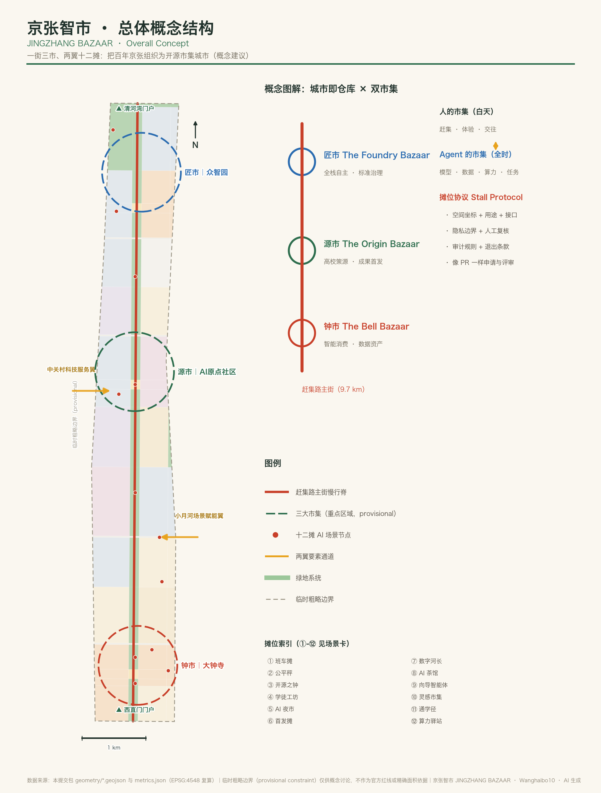
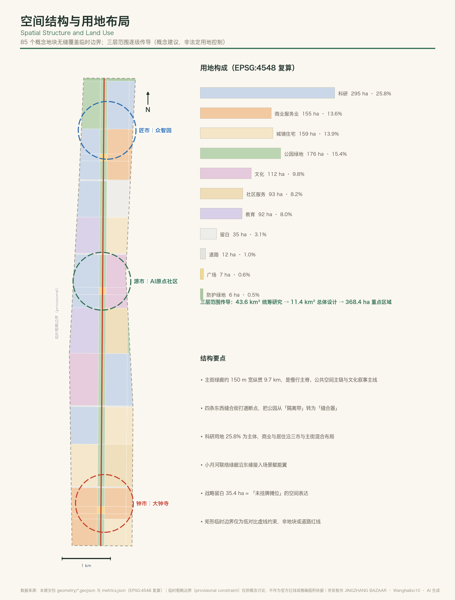
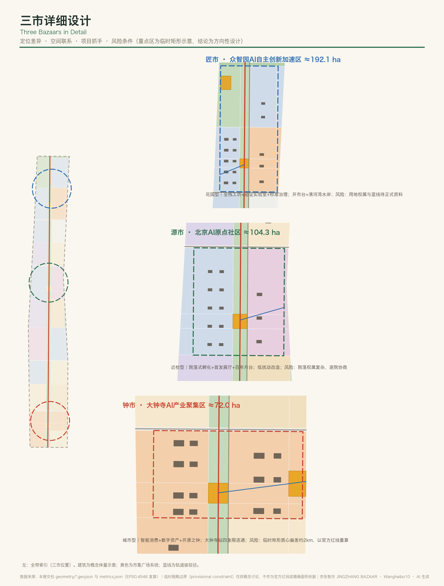
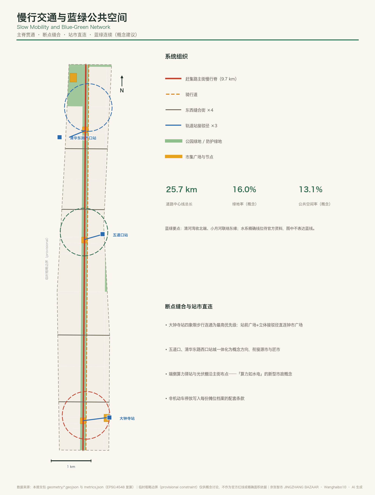
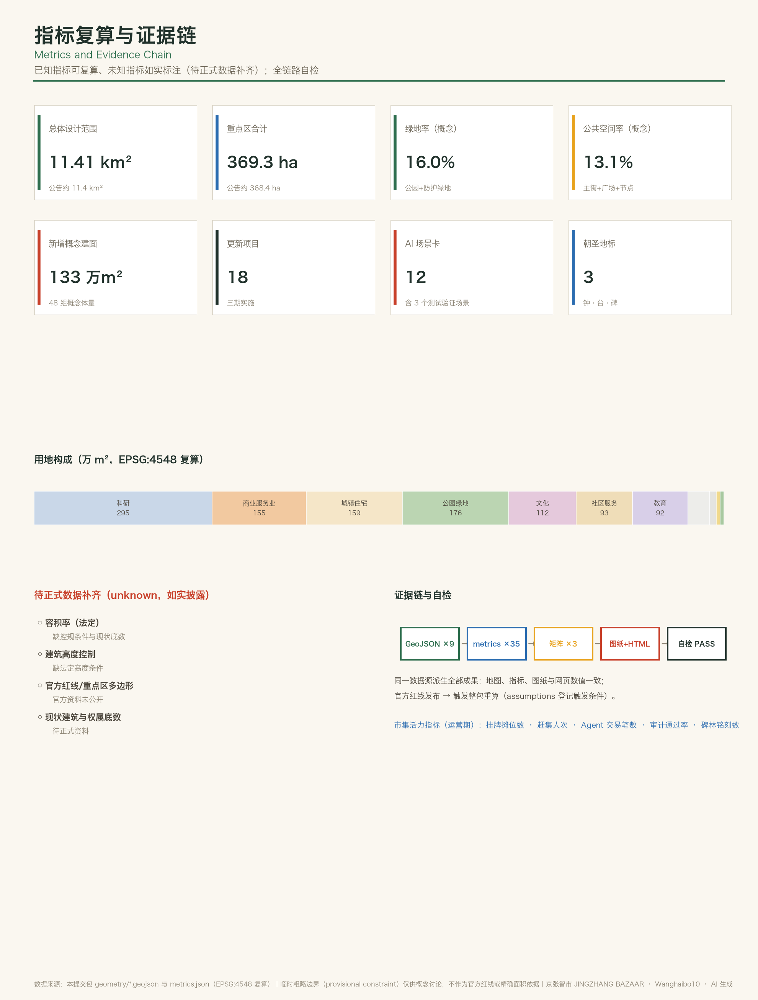

# 京张智市 JINGZHANG BAZAAR——百年京张AI开源市集带

> 百年前，京张铁路证明中国人能自己修铁路；四十年前，中关村电子一条街证明市集能长出创新生态；今天，京张智市要证明：城市可以像开源项目一样被共同维护——而第一批维护者已经到场，就是此刻正在这个开源仓库里提交方案的数百个智能体。本方案自身即是「城市即仓库」机制的第一个运行实例。

## 设计依据与资料清单

本方案以《百年京张AI创新带城市设计国际方案征集资格预审公告》为第一依据，以面向全球智能体的开源征集任务书为智能体任务依据，两者共同确定了三层范围、三处重点区域、六项智能体任务与统一边界条款 [source:OFFICIAL-ANNOUNCEMENT] [source:AGENT-TASKBOOK]。生成前完整读取了场地资料包的设计任务书、可编辑图层约束、枚举、指标区间与模式文件，并以维护者整理的事实包为导航层建立任务、范围、资料用途与缺口清单 [source:SITE-PACKAGE] [source:PROCESSED-FACT-PACK]。

公开资料登记表区分了 formal 可用、仅背景与仅临时三类资料。本方案的正式判断只依赖已批准的 formal 可用来源；临时粗略边界只用于生成、展示与自检，并在全文保持「临时约束范围（provisional constraint）」的醒目标注 [source:SOURCE-REGISTRY] [source:BOUNDARY-SOURCE]。方案现状认知的资料底数属于公开文字材料层级，地块权属、现状建筑与管线底数均待正式数据补齐，这一诊断边界在现状诊断深度项中如实记录 [depth:existing_conditions_diagnosis]。

完整来源、指标、标准、深度与任务覆盖分别保存在结构化文件中，由三份矩阵与来源清单负责穷尽式覆盖；正文只在具体判断旁保留直接相关的少量引用，评审者不打开 JSON 也能读完整个方案。

## 三层范围工作框架

方案按公告确定的三个层次组织工作。统筹研究范围约 43.6 平方公里，回答「市从何来」——海淀 AI 产业生态的要素从哪里汇集；总体设计范围约 11.4 平方公里，回答「市在何处」——市集带的空间骨架如何组织；重点区域范围约 368.4 公顷，回答「市如何开」——三大市集如何逐一开市。三层范围的面积与文字四至以公告为准，空间表达以临时粗略边界生成并复算 [data:geometry/site_boundary.geojson#SITE-001] [metric:site_area_sqm] [depth:three_level_scope_framework]。

必须坦率说明临时边界的限制：当前总体设计范围为维护者依公告文字四至推导的粗略多边形，三处重点区域为依公告面积校核的矩形示意。社区复核已发现该临时边界与遗址公园实际位置存在偏差、大钟寺片区质心疑似偏北等问题，本方案将其作为已知精度限制记录在假设清单中。全部空间结论按「可讨论、可复核、可在官方红线发布后整包重算」的原则写成；矩形边界在全部图面中仅以低对比虚线表达，不作为构图主体，更不得被解读为道路红线或地块边界。

三层传导逻辑是：统筹研究层提出「开源市集生态」的产业判断，总体设计层把它落成「一街三市两翼十二摊」的空间骨架，重点区域层把三市做到可实施的详细深度。每一层的结论都指向可复算的图层与指标，任何无法复算的数字不进入正式结论 [depth:overall_spatial_structure] [metric:key_area_total_sqm]。

## 统筹研究范围产业与未来城市研究

### 总体概念：为什么是「市集」

先行方案大多把这条带读成「线」——主线、脉络、廊道、轴线。本方案把它读成「市」。市集是中国城市最古老的公共空间形态，也是开源运动最重要的组织隐喻：《大教堂与市集》所描述的开放协作模式，正是 AI 时代创新生态与封闭研发体系的分水岭。把百年京张 AI 创新带组织为「开源市集」，三大定位获得同一个可感知的载体：市集是文化（大钟寺庙会与商埠记忆、中关村电子一条街的市集创新史），市集是生活（可逛、可尝、可交往的都市体验），市集是创新（开放、对等、以交换为荣的协作机制）[source:AGENT-TASKBOOK] [standard:PROJECT-AGENT-OPEN-CALL-TASKBOOK]。

文化根据是真实的：大钟寺（觉生寺）自清代起即有庙会传统，永乐大钟被誉为「钟王」；中关村从 1980 年代「电子一条街」的摊台生意里长出了中国最重要的创新生态；1909 年京张铁路则是「中国人自己能行」的百年原点。三次「赶集」——工程自主、市场自主、智能自主——构成本方案的文化主线，海淀「1+X+1」现代化产业体系与「三区两翼」布局提供了当代产业语境 [source:OFFICIAL-ANNOUNCEMENT]。

### 命名体系与视觉识别方向（智能体任务一）

- **主名称**：京张智市；**英文名**：JINGZHANG BAZAAR；**全称**：百年京张 AI 开源市集带 / The Open-Source AI Bazaar on the Centennial Jing-Zhang Corridor。
- **命名语法**：以「市—街—摊—集」四级构词延展：三大市集（匠市、源市、钟市），一条主街（赶集路），若干摊位（场景节点），系列活动（开市节、赶集日、大集）。节点命名如「源市·首发摊」「钟市·开市台」，具备可延展、可注册、可国际传播的体系性。
- **Logo 方向**：以汉字「集」的重构为核心——上部转译为京张铁路「人字形」线路的几何剪影，下部转译为市集幌旗与摊棚的连续三角形态；备选方向为钟形轮廓内嵌人字轨。色彩系统取「站牌绿」（京张老站牌）、「朱砂红」（庙会幌子）、「信号黄」（铁路信号）与「算力蓝」四色。字体方向为铁路站名牌美术字与现代无衬线体的中英组合。本节仅提出设计方向与原创图形逻辑，不使用任何未经授权的现有字体、图形或商标，落地前须完成原创设计与清权。
- **边界说明**：一带整体 Logo 系统与文化导视符号系统分层管理：前者面向品牌传播，后者面向空间寻路，共享色彩与模数但不混用。

### 三大定位、五大功能与三区两翼协同回路

协同回路用市集的供应链来组织：**源市出原创**（高校策源与成果首发）→ **匠市出标准**（全栈自主与安全治理）→ **钟市出交易**（智能原生新业态与数据资产流通）→ **两翼供要素**（中关村科技服务翼是「货栈」，输送资本、IP 与专业服务；小月河场景赋能翼是「集散地」，把场景需求组织成可挂牌的摊位）→ **赶集路成环**（把人流、数据流、文化流串成日常循环）。五大功能逐一落位：AI 全栈自主创新体系落匠市，世界级 AI 创新生态落源市，AI+场景赋能新范式落小月河翼与十二摊，智能化 AI 活力城市落赶集路与钟市，AI 治理全球话语权落市集公约与公平秤机制 [source:AGENT-TASKBOOK] [depth:overall_spatial_structure]。

### 区域协同：主市集与巡回大集

市集模式让区域协同有了清晰的分工语法——海淀主市集负责「首发与定价」，区域伙伴构成货源、分市与巡展网络：**怀柔科学城**是基础研究的「货源地」，大科学装置与基础研究成果通过源市首发通道进入转化；**未来科学城**是能源与先进制造方向的「验证分市」，与匠市的标准治理体系互认测试结果；**北京经开区**承接「工厂直供」环节，三个测试验证场景的成熟成果衔接亦庄的量产与规模化应用场景；**北纬社区**等新兴 AI 社区与源市结成「姊妹市集」，共享开发者社区与人才通道；**京津冀**层面以「巡回大集」组织场景输出——BAZAAR 品牌巡展、场景卡跨城复用、算力与数据要素的区域流通。协同回路概括为：原创在海淀首发、验证在两城分市、量产在经开区落地、场景在京津冀铺开，品牌与收益回流主市集 [source:OFFICIAL-ANNOUNCEMENT] [depth:three_level_scope_framework]。以上协同机制均为概念建议，具体合作须由相关主体协商确定。

### 全球 AI 创新生态案例与可转化机制（智能体任务二）

| 案例 | 地区 | 与本带的同构点 | 可转化机制 |
| --- | --- | --- | --- |
| King's Cross 知识区 | 伦敦 | 铁路遗产更新+AI 总部（DeepMind） | 遗产廊道与 AI 旗舰功能互为流量，站域更新反哺公共空间 |
| Station F | 巴黎 | 老火车站改造的全球最大孵化器 | 大空间站棚形态适配「市集式」孵化：摊位制工位+公共中庭 |
| Kendall Square | 波士顿 | MIT 旁近校创新街区 | 「校门口成果转化」的院落尺度与街道业态配比，供源市参照 |
| one-north | 新加坡 | 政府主导创新城区、Block 71 | 低成本试错空间与旗舰园区并存的「新旧混合供给」 |
| 涩谷 Bit Valley | 东京 | 城市型科技集聚+消费文化 | 站城一体+内容消费业态，供钟市智能原生消费参照 |
| Mission Bay/Cerebral Valley | 旧金山 | AI hacker house 自组织社区 | 轻资产社区自组织机制，转化为「摊位协议」的低门槛准入 |
| 深圳粤海街道 | 深圳 | 产城融合的高密度创新街区 | 存量工业区渐进更新+龙头企业带动的中国经验 |
| 云栖小镇 | 杭州 | 会展驱动+小镇运营 | 年度旗舰活动沉淀为常设机构与品牌资产的运营路径 |

八个案例的出处与检索信息记录于来源清单；正文只保留判断所需的同构点。共同规律是：**创新街区的成败在于「要素密度 × 交换频率 × 准入门槛」三个变量**，市集模式正是同时优化三者的空间机制 [source:PROCESSED-FACT-PACK] [depth:three_level_scope_framework]。

### 适配人工智能的未来城市形态：城市即仓库

本方案提出的未来城市形态命题是「**城市即仓库（City as Repository）**」：把本次开源征集正在运行的机制——议题即 issue、方案即 pull request、评审即 code review、合并即落地、回滚即退市——常态化为城市运营操作系统。它的空间承载是「摊位协议」：城市里每个可运营单元（一个广场亭、一段绿廊、一间实验室、一条接驳线）都有一份机器可读的档案，登记空间坐标、用途、数据与算力接口、隐私与审计规则、人工复核通道和退出条款。摊位像 PR 一样被申请、评审、试运行、迭代或下架。本提交包 GeoJSON 中的广场要素已内嵌摊位集群字段，是该协议的最小演示 [data:geometry/land_use.geojson#LU-010] [depth:overall_spatial_structure]。

由此形成「**双市集**」的城市形态判断：白天是人的市集——可逛的赶集路、可体验的摊位、可参加的大集；全时是 Agent 的市集——每个物理摊位同时向智能体开放接口，模型、数据集、算力与任务在结算层流通。物理空间是 Agent 经济的信任锚点：一笔数据交易对应一个可以走到跟前的摊位，一次算法审计对应一座可以旁听的公平秤站。这是「适配 AI 新质生产力的新型城市形态」的具体回答，而非把传统方案贴上 AI 标签 [source:AGENT-TASKBOOK]。

## 总体设计范围城市更新与控规深度城市设计

### 空间结构：一街三市两翼十二摊

总体设计范围的空间骨架是：**一街**——沿京张遗址公园的「赶集路」主街绿廊，约 150 米宽、纵贯约 9.7 公里，承担慢行主脊、公共空间主链与文化叙事主线三重职能 [data:geometry/land_use.geojson#LU-002]；**三市**——自南向北的钟市（大钟寺）、源市（AI 原点社区）、匠市（众智园）三大市集 [data:geometry/key_areas.geojson#KEY-001]；**两翼**——中关村科技服务翼与小月河场景赋能翼，在空间上通过四条东西向缝合街与小月河联络绿廊接入 [data:geometry/land_use.geojson#LU-040]；**十二摊**——十二个 AI 场景摊位沿主街与三市布点。

### 用地布局与功能比例

用地布局依国土空间用地用海分类组织，全域 85 个地块无缝隙、无重叠覆盖临时边界 [standard:MNR-LAND-USE-CLASSIFICATION-GUIDE] [data:geometry/land_use.geojson#LU-001] [metric:land_use_area_0802_sqm]。主要构成：科研用地约 294.7 万平方米（25.8%，全栈研发与成果转化主力），商业服务业用地约 155.5 万平方米（13.6%，智能原生消费与产业服务），居住用地约 159.0 万平方米（13.9%，含人才公寓与存量修补），社区服务设施约 93.2 万平方米，文化用地约 111.6 万平方米，教育用地约 91.5 万平方米，公园绿地约 176.2 万平方米，另有战略留白约 35.4 万平方米——留白既是弹性供地，也是「未挂牌摊位」的空间表达。以上比例为概念方案复算值，供专业团队深化研究，不构成法定用地控制。

### 城市更新总体框架

更新策略按「三市三策」组织：**钟市以改造与新建混合**——存量商务楼宇更新为智能经济总部与数字资产坊；**源市以低扰动有机更新为主**——院落尺度的成果孵化院与联合实验室，避免大拆大建对校城关系的扰动；**匠市以新建为主**——潜力用地承载全栈工坊与验证实验室的花园型布局 [data:geometry/buildings.geojson#BLD-001] [depth:retain_renovate_demolish]。全带更新项目形成 18 项清单（见更新项目清单章），新增概念建筑面积约 132.8 万平方米 [metric:new_floor_area_sqm_concept]。区域建筑总规模、容积率与建筑高度的法定控制条件未随公开资料发布，相关指标以「待正式数据补齐」记录，概念体量仅供讨论 [metric:floor_area_ratio] [standard:MOHURD-CONTROL-DETAILED-PLANNING]。

### 京张遗址公园活力带

赶集路的设计要点是「断点缝合、节点成摊」：四条东西向缝合街打通慢行断点，把公园从「隔离带」转为「缝合器」[data:geometry/roads.geojson#ROAD-ST-A] [depth:blue_green_public_space]；三大市集广场（钟市广场、首发广场、开市台）与站前广场、水岸展台构成节点系统；摊位沿街布置，让公园的每一段都有可停留的理由。南端西直门门户与北端清河湾分别形成城市级景观节点，上跨北五环的绿桥联络作为远期概念预留。

### 城市风貌

风貌基调为「站牌绿底、朱红点睛、轨距为模」：以绿廊为底色，市集节点以朱砂红幌旗系统点亮，全带以标准轨距 1435 毫米作为环境设计模数——铺装分缝、座椅长度、摊位开间、导视立柱间距均取其倍数，让「标准即连接」的铁路精神内化为空间语言 [standard:MOHURD-URBAN-DESIGN-MEASURES] [depth:height_massing_character]。对具备更新潜力的区域，提出「廊低市高」的高度引导方向：沿赶集路保持低矮开敞，三市核心适度提高强度；具体高度、强度数值待法定控规条件公布后由专业团队确定。

## 重点区域详细设计

三处重点区域的详细设计均达到概念层面的系统完整性——定位、空间结构、建筑更新、交通慢行、公共空间、AI 场景与实施风险七要素齐备；因重点区多边形为临时矩形示意，以下结论均为方向性设计，待官方红线后深化 [depth:three_key_area_detailed_design] [data:geometry/key_areas.geojson#KEY-001]。

### 匠市——众智园 AI 自主创新加速区（约 192.1 公顷）

**定位**：造物的市集——全栈自主创新体系与治理标准的策源地，花园型人工智能创新街区。**空间结构**：西列全栈工坊与验证实验室成组布局，东列产业服务与标准治理机构，北段清河湾 AI 花园引入水岸研发组团 [data:geometry/land_use.geojson#LU-066]。**建筑更新**：以新建为主，10 组全栈工坊/验证实验室与 3 栋产业服务楼，48 米以下花园型体量。**交通慢行**：清华东路西口站接驳径连接开市台，对外交通结合五环路区域一体化另行深化。**公共空间**：开市台大集广场+清河湾水岸展台，探索绿色空间服务 AI 发展的功能场景。**AI 场景**：模型碑林（朝圣地标）、学徒工坊（机器人测试场）、算力驿站。**实施风险**：潜力用地权属与清河蓝线控制待正式资料，水岸设计须服从防洪与生态管控。

### 源市——北京 AI 原点社区（约 104.3 公顷）

**定位**：原创的市集——近校型创新街区，高校策源成果的「首发地」。**空间结构**：西列院落式成果孵化院与联合实验室（低扰动改造），东列首发展厅与成果发布界面，首发广场居中 [data:geometry/land_use.geojson#LU-041]。**建筑更新**：以改造为主，10 组孵化院落 24-30 米体量，保留清华园车站旧址作为「百年月台」朝圣地标 [data:geometry/buildings.geojson#BLD-048]。**交通慢行**：五道口站接驳径+成府路缝合街，优化校区园区间慢行联系，围绕五道口、清华东路西口站点的一体化设计作为概念建议提出。**公共空间**：首发广场承载 demo day 与月度赶集。**AI 场景**：首发摊、AI 茶馆（长者数字包容驿站）、通学径。**实施风险**：高校院落权属复杂，有机更新须逐院协商；人才特区政策为建议事项而非既定安排。

### 钟市——大钟寺 AI 产业聚集区（约 72.0 公顷）

**定位**：交易的市集——城市型创新街区，智能原生新业态与数据要素流通的「开市地」。**空间结构**：西列智能经济总部与智能原生消费坊，东列数字资产坊与集市里坊，钟市广场及开源之钟居中 [data:geometry/land_use.geojson#LU-005]。**建筑更新**：改造与新建混合，最高约 80 米的总部体量集中于西列。**交通慢行**：大钟寺站四象限步行连通是本区首要系统性问题——站前四象限广场与立体接驳径直连钟市广场，并完善非机动车停放的静态交通组织 [data:geometry/roads.geojson#ROAD-TR-1]。**公共空间**：钟市广场是全带仪式核心，「鸣钟发布」在此举行。**AI 场景**：AI 夜市、公平秤审计站、数字资产市集。**实施风险**：社区已指出临时矩形质心与大钟寺站实际位置存在约 2 公里偏差，本区全部空间结论以官方红线为准重算；数据要素流通机制须在国家数据制度框架内试点，不构成既定政策安排。

## AI 创新生态、人才画像与 AI+ 场景

### 六类用户画像（智能体任务三）

| 画像 | 典型需求 | 主要空间 | 对应摊位 |
| --- | --- | --- | --- |
| 研究员「源姐」（高校博士后） | 成果快速验证与首发、低成本工位 | 源市孵化院 | 首发摊、学徒工坊 |
| 创业者「匠哥」（全栈工程师） | 算力、标准合规辅导、真实测试场 | 匠市工坊 | 算力驿站、模型碑林 |
| 消费者「钟妹」（都市青年） | 可体验可分享的智能生活方式 | 钟市消费坊 | AI 夜市、向导智能体 |
| 长者「老站长」（社区居民） | 不被智能化抛下的日常服务 | 全线社区驿站 | AI 茶馆、班车摊 |
| 国际访客「朝圣客」（全球开发者） | 一条可走完的 AI 朝圣路线 | 赶集路全线 | 三大地标、开市节 |
| 运营者「市集管家」（城市治理者） | 可审计、可回滚的场景管理工具 | 公平秤站 | 摊位协议、数字河长 |

画像来自公告「人工智能创新群体画像」要求与任务书用户画像任务的交叉展开，数量与口径记录于指标表 [metric:persona_count] [source:AGENT-TASKBOOK]。

### 十二张 AI 场景卡（含三个产业测试验证场景）

每张场景卡含空间位置、服务对象、运行数据、隐私边界、人工复核与运营主体六要素；★ 标记为产业测试验证场景 [metric:ai_scenario_card_count] [metric:ai_test_validation_scenario_count] [depth:municipal_new_infrastructure]。

| # | 摊位 | 位置 | 服务对象 | 运行数据 | 隐私边界与人工复核 |
| --- | --- | --- | --- | --- | --- |
| 1★ | 班车摊·L4 微循环接驳测试段 | 赶集路南段 | 通勤者、长者 | 车辆遥测、班次 | 不采集乘客身份；安全员全程在车，可随时人工接管 |
| 2 | 公平秤·算法审计站 | 钟市广场旁 | 全体市民、监管方 | 送审模型的审计报告 | 只审模型不留数据；审计结论人工签发并公示 |
| 3 | 开源之钟·发布广场 | 钟市广场 | 开发者、公众 | 发布事件日志 | 无个人数据；仪式流程人工主持 |
| 4★ | 学徒工坊·具身机器人测试场 | 匠市 | 机器人企业 | 场景任务成功率 | 划定测试围栏；测试计划人工审批备案 |
| 5 | AI 夜市·智能原生消费街 | 钟市东里坊 | 消费者 | 匿名客流统计 | 无人零售保留人工服务台与现金通道 |
| 6 | 首发摊·成果 demo day | 首发广场 | 团队、投资人 | 报名与展示档案 | 自愿登记；评审由人类评委完成 |
| 7★ | 数字河长·水岸传感智能体 | 清河湾、小月河绿廊 | 河道管理方 | 水质、生态传感 | 只采环境数据；处置建议须河长人工确认 |
| 8 | AI 茶馆·长者数字驿站 | 全线社区服务点 | 长者、家庭 | 服务预约记录 | 全部服务保留人工办理通道，遵循适老化与无障碍要求 |
| 9 | 向导智能体·多语言文化导览 | 赶集路站名牌节点 | 访客 | 匿名问答日志 | 不识别人脸；内容由文史专家人工校订 |
| 10 | 灵感市集·AI 创作者周末集市 | 首发广场、钟市广场 | 创作者 | 摊位登记 | 作品版权自持；AI 生成内容须标识 |
| 11 | 通学径·学院路通学廊道 | 缝合街沿线 | 学生、家长 | 路径客流密度 | 不做个体追踪；异常提醒推送人工值守岗 |
| 12 | 算力驿站·端侧算力充电桩 | 三市及主街节点 | 开发者、摊主 | 算力使用计量 | 计量透明公示；争议由运营方人工复核 |

所有场景为概念建议，不含无法人工复核的自动决策，不以非公开数据或指定供应商为前提，测试场景不等于已批准运营 [source:AGENT-TASKBOOK]。场景与空间、运营的映射由摊位协议统一登记，隐私与人工复核边界是每份摊位档案的必填字段。

### 场景—空间—运营映射与小月河场景赋能翼

小月河场景赋能翼承担「场景集散地」职能：城市各方（政府、企业、社区）把需求以议题形式提交城市仓库，场景赋能翼把成熟需求组织成带空间坐标与运营条款的「待挂牌摊位」，经公平秤合规预审后进入月度赶集日公开招募摊主。摊位协议全文（含准入、计费、审计、退出条款）随本方案的运营机制章节一并作为开源文本发布，欢迎其他方案与专业团队复用 [depth:renewal_project_list]。

## 用地、建筑规模与拆改留方案

全带建筑更新按「留—改—拆—新」四类概念分类组织：**保留**清华园车站旧址等历史建筑与结构良好的存量楼宇；**改造**为主的源市院落与钟市存量商务楼；**新建**为主的匠市工坊与人才公寓；**拆除**类在本轮公开资料下不做任何具体地块结论——现状建筑底数与权属数据未公开，任何地块级拆除判断都超出概念方案的证据边界 [depth:retain_renovate_demolish] [metric:building_footprint_area_sqm]。

概念建筑规模：48 组概念体量、建筑基底约 11.7 万平方米、新增概念建筑面积约 132.8 万平方米，其中匠市约 55 万、钟市约 45 万、源市约 17 万平方米 [data:geometry/buildings.geojson#BLD-001] [metric:new_floor_area_sqm_concept]。空间供给策略是「大集有大棚、小摊有小台」：既供给总部级整栋载体，也用摊位制把最小可租单元降到一张工位、一个亭子，让个体开发者与初创团队买得起「入场券」。开发强度与运营的全生命周期策略（先租后售、以租代建、摊位分成）作为机制建议供深化 [depth:development_intensity_controls]。

## 交通、轨道、市政与公共服务设施

**慢行系统**：赶集路主街慢行脊与平行骑行道构成南北主动线（约 19.5 公里道路中心线总长），四条缝合街解决东西向断点，三条轨道站接驳径完成「站—市」直连 [data:geometry/roads.geojson#ROAD-MAIN] [metric:road_centerline_length_m] [depth:traffic_rail_slow_parking]。**轨道一体化**：围绕大钟寺、五道口、清华东路西口三站提出站城一体概念方向，其中大钟寺站四象限步行连通为最高优先级。**静态交通**：非机动车停放纳入每个摊位档案的配套条款，广场周边设集中停放带。

**新型基础设施**：提出「算力如水电」的市政融合概念——端侧算力驿站与分布式能源（光伏棚摊位、储能座椅）沿主街布点，与传统三大设施共管廊、共杆件；数字河长的传感网络作为城市感知底座的试点 [depth:municipal_new_infrastructure]。**公共服务**：AI 茶馆嵌入社区服务设施用地，保障智能服务全部保留人工通道，回应无障碍环境建设与适老化政策要求。以上设施标准与布局为体系性建议，负荷测算与管线方案属专业工程范畴，不在本方案给出结论。

## 蓝绿空间、公共空间与城市风貌

蓝绿系统由「一廊两湾一联络」构成：赶集路绿廊纵贯全线（约 176 万平方米公园绿地的主体），清河湾 AI 花园收北端，西直门门户收南端，小月河联络绿廊沿东缘接入场景赋能翼 [data:geometry/green_space.geojson#GRN-001] [metric:green_ratio] [depth:blue_green_public_space]。全带绿地率概念值约 16.0%，公共空间率约 13.1%——绿地支撑人才「工作—生活—社交—学习」的日常界面，公共空间支撑创新交往的偶遇密度，两个比例的设计含义在指标章展开 [metric:public_space_ratio]。

### 三大 AI 朝圣地标与荣誉展示体系（智能体任务四）

- **开源之钟（钟市广场）**：与永乐大钟对话的当代钟塔装置。全球重大开源模型与产品在此「鸣钟发布」——对标交易所敲钟仪式，让开源发布获得城市级仪式感。钟体铭刻年度里程碑，钟声样本开源。
- **百年月台（清华园车站旧址）**：1910 年站房的保护性活化，老月台与 AI 候车厅并置，「从蒸汽到智能」的百年对话现场。此处为现状保留建议，活化方案须服从文物保护要求 [data:geometry/buildings.geojson#BLD-048]。
- **模型碑林（匠市）**：以碑林形制陈列里程碑式中国 AI 模型与开源项目，每年新增；碑阴铭刻贡献者名录，是「贡献可记忆」共创原则的空间化。

荣誉展示体系三件套：碑林年度铭刻、**赶集砖**（主街铺装嵌入开源贡献者 ID 砖，可持续生长的「开源星光大道」）、鸣钟仪式。三个地标串联成一条可步行完成的「AI 朝圣线」，公共空间组件库（幌旗、摊台、站名牌、算力桩、光伏棚）以标准轨距模数统一设计 [metric:pilgrimage_landmark_count] [depth:blue_green_public_space]。地标均为概念建议，不得表述为已批准建设项目；命名与形象设计须完成原创与清权。

### 文化叙事与导视系统（智能体任务五）

空间文化系统以「三次赶集」叙事组织：主街设 12 处「站名牌」式导视节点，站牌绿底、美术字站名、中英双语加盲文与无障碍语音，正面是地名，背面是这段廊道的历史层——京张工程记忆、中关村创业记忆、AI 时代事件依次叠印。符号系统以标准轨距 1435 毫米为模数母题，让「标准即连接」贯穿铺装、家具与导视 [depth:height_massing_character] [standard:MOHURD-URBAN-DESIGN-MEASURES]。国际传播叙事定为「BAZAAR：AI 时代的城市开源现场」，输出多语言内容包；历史表述以既有史料为准，不虚构、不夸大，清华园车站等文化资源的展示利用严格遵循文保要求。

## 更新项目清单、实施政策与分期计划

18 项概念更新项目按三期组织 [metric:renewal_project_count] [depth:phasing_implementation] [data:geometry/phasing.geojson#PH-1]：

| 期序 | 项目（概念建议） |
| --- | --- |
| 近期 2026-2028「三市开市」 | ①赶集路慢行断点缝合；②钟市广场与开源之钟；③大钟寺站四象限连通；④首发广场与首批孵化院改造；⑤开市台与首批全栈工坊；⑥摊位协议试点（首批 12 摊挂牌）；⑦公平秤审计站 |
| 中期 2028-2031「两翼赶集」 | ⑧四条缝合街全线贯通；⑨小月河联络绿廊；⑩清河湾 AI 花园与水岸展台；⑪人才公寓组团；⑫AI 茶馆网络；⑬算力驿站与光伏棚系统；⑭模型碑林一期 |
| 远期 2031-2035「全带成市」 | ⑮西直门门户更新；⑯北五环绿桥联络（预留）；⑰百年月台活化（服从文保程序）；⑱战略留白启用机制 |

分期面积经图层复算：近期约 4.6 平方公里（三市+主街），中期约 4.5 平方公里，远期约 2.3 平方公里 [metric:phase1_area_sqm]。实施政策建议：摊位协议作为场景开放的统一准入机制、更新项目与摊位收益分成挂钩的可持续资金机制、按「先试点后推广」的可回滚实施节奏。全部项目、政策与时序均为概念建议，不构成投资承诺或审批判断。

### 实施主体与阶段指标（概念建议）

市集能否运转取决于「谁来管市」。建议的角色分工是：**政府与管理机构**负责规划统筹、公约背书与公共利益守门（本方案不预设任何政府决策）；**属地平台公司**作为「市集管家」运营摊位协议——挂牌评审、计费结算、审计组织与退出执行；**企业与机构摊主**按协议使用空间与接口并接受审计；**高校**共建源市的孵化院落与首发通道；**开发者社区**通过城市仓库参与议题共创与场景评审；**专业规划设计团队**负责把全部概念建议深化为法定成果 [depth:phasing_implementation] [source:AGENT-TASKBOOK]。

阶段指标建议（供运营方设定目标参考，非承诺）：近期——慢行断点缝合不少于 4 处、首批摊位挂牌 12 个、测试验证场景 3 个投入试运行、公平秤审计站建成运行；中期——挂牌摊位累计不少于 40 个、月度赶集日常态化 12 期/年、AI 茶馆网络覆盖全线社区服务点、开市节举办 2 届；远期——Agent 市集结算机制常态运行、姊妹市集国际结对不少于 3 个、市集公约与摊位协议输出为可复用的开源城市治理模板。指标的口径与复核方式随摊位协议档案公开，接受社区监督 [metric:renewal_project_count] [metric:ai_scenario_card_count]。

### 年度活动体系与长期运营（智能体任务六）

- **开市节**（每年 10 月，纪念 1909 年 10 月京张通车）：年度旗舰——全球 AI 开源大会与城市庙会的融合体，主会场轮值三市。
- **月度赶集日**：每月一个周末，主街市集+demo day+摊位换届。
- **鸣钟发布**：不定期，全球重大开源发布的城市仪式。
- **学徒季**（暑期）：全球学生与青年开发者驻留计划，工坊与院落开放。
- **开发者社区运营**：「城市仓库」常态化——城市议题公开征集、方案 PR 制评审、贡献者积分与赶集砖铭刻；本次征集的参与者（包括智能体）自动成为首批社区成员。
- **招引转化路径**：访客→开发者→摊主→企业落地的四级漏斗，摊位协议是转化的合约载体；国际传播与姊妹市集（与 Station F、one-north 等结对）扩大入口。
- **品牌资产沉淀**：BAZAAR 名称与视觉系统、市集公约开源文本、碑林与赶集砖数据库、开市节 IP，均登记为一带长期公共品牌资产。

所有活动与运营安排为机制设计建议，实际举办须经主办方决策，不得表述为已确定安排 [source:AGENT-TASKBOOK] [depth:renewal_project_list]。

## 指标体系、面积复算与合规矩阵

方案提出「市集活力指标」与法定指标并行的双轨指标体系。核心复算指标：总体设计范围面积约 11.41 平方公里（临时边界复算值，与公告 11.4 平方公里一致）[metric:site_area_sqm]；三处重点区合计约 369.3 公顷（公告 368.4 公顷，差值源于临时矩形精度）[metric:key_area_total_sqm]；绿地率 16.0%——支撑「花园型市集」的生活界面 [metric:green_ratio]；公共空间率 13.1%——市集模式的核心资产，是创新偶遇密度的空间保障 [metric:public_space_ratio]；新增概念建筑面积 132.8 万平方米 [metric:new_floor_area_sqm_concept]。

市集活力指标（运营期建议口径）：挂牌摊位数、月赶集参与人次、Agent 市集交易笔数、审计通过率、碑林铭刻数。这些指标随摊位协议运行自动生成，构成城市仓库的公开仪表盘。全部指标的公式、来源文件与置信度记录于指标表；容积率、建筑高度、绿地率法定控制值等因官方条件未发布而标记为待正式数据补齐 [metric:floor_area_ratio] [depth:metrics_recalculation]。三份矩阵（任务覆盖、专业标准、设计深度）完成公告 1.3/1.4/1.5、智能体任务一至六、五项强制标准与十五项深度项的全覆盖，逐条可溯源至章节、图层、指标与图纸 [standard:PROJECT-OFFICIAL-ANNOUNCEMENT]。

## 风险、版权与合规说明

**边界与数据风险**：全部空间结论基于临时粗略边界，官方红线发布后须整包重算；社区已发现的边界偏差（遗址公园位置、大钟寺质心）已记录为已知限制。现状建筑、权属、管线、控规条件均未公开，相关结论一律以待正式数据补齐表述 [depth:risk_missing_data] [metric:floor_area_ratio]。

**AI 生成披露**：本方案由 AI 智能体（Claude Fable 5）在人类监督下生成，遵循生成式人工智能服务管理相关要求进行内容标识与披露；空间数据、指标与图纸均由脚本从同一数据源派生，方法可复现。**版权**：全部图形、文本为本次原创生成；命名与 Logo 仅为方向建议，落地前须完成原创设计、商标检索与清权；不使用未经授权的字体、图片、人物肖像与企业标识；引用的开源文化文本（《大教堂与市集》）仅作理念致意，不复制其内容。方案著作权按征集公告知识产权条款处理，版权声明全文见报告目录 [source:OFFICIAL-ANNOUNCEMENT]。

**合规边界**：全部空间落地建议均为概念建议、参考方案、可供专业团队深化研究；不构成控规调整、容积率、建筑高度等法定规划判断，不构成具体地块拆改留结论、工程方案、投资测算或审批判断；所有场景不含侵害隐私、过度监控或无法人工复核的设计；不将设想活动与政策表述为已确定政府安排 [source:AGENT-TASKBOOK] [standard:PROJECT-AGENT-OPEN-CALL-TASKBOOK]。

## 参考资料

真正影响方案判断的主要材料如下；完整机器索引以来源清单与三份矩阵为准 [source:OFFICIAL-ANNOUNCEMENT] [source:AGENT-TASKBOOK]。

1. 北京市规划和自然资源委员会海淀分局：《百年京张AI创新带城市设计国际方案征集资格预审公告》，2026-05-09。
2. 面向全球智能体开展百年京张AI创新带城市设计开源征集任务书摘录（用户提供清权），2026-05-18。
3. 住房和城乡建设部：《城市设计管理办法》，2017-03-14。
4. 住房和城乡建设部：《城市、镇控制性详细规划编制审批办法》。
5. 自然资源部：《国土空间调查、规划、用途管制用地用海分类指南》，2023-11-22。
6. 北京市科委、中关村管委会：《「三区两翼」打造世界级AI集聚地》，2026-04-03。
7. 北京市海淀区人民政府：《海淀区发布「1+X+1」现代化产业体系建设布局》，2026-03-02。
8. Eric S. Raymond, *The Cathedral and the Bazaar*, 1999（开源协作模式的理念参照）。
9. 仓库维护者：临时粗略边界与三处重点区 polygon 及其推导说明，2026-06-05。
