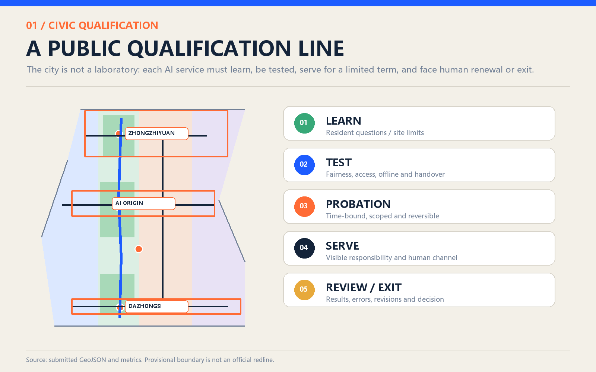
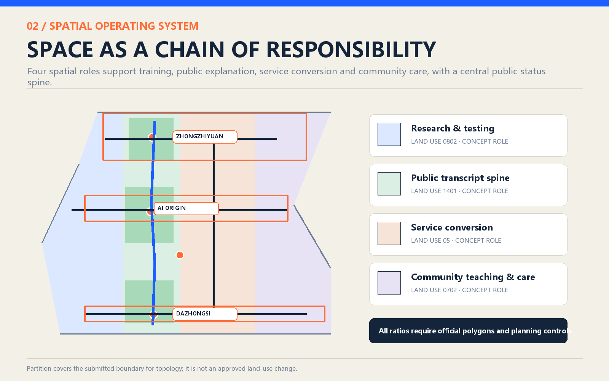
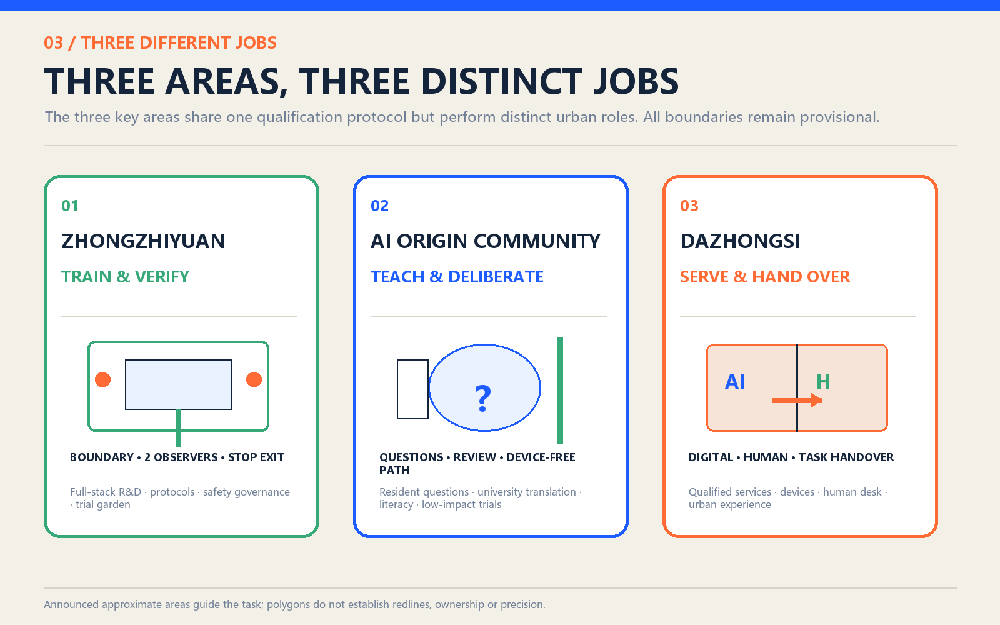
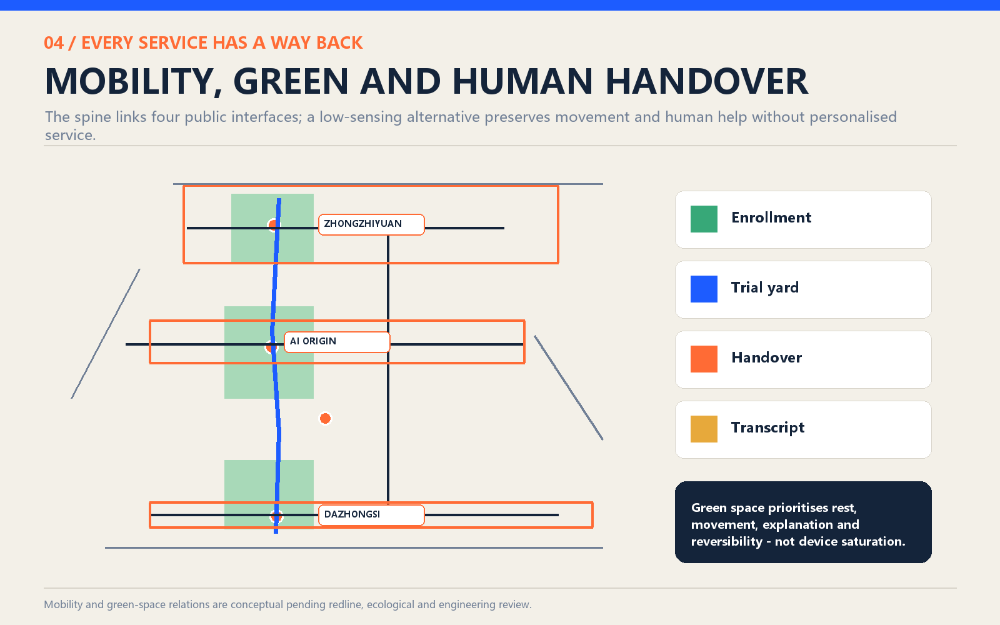
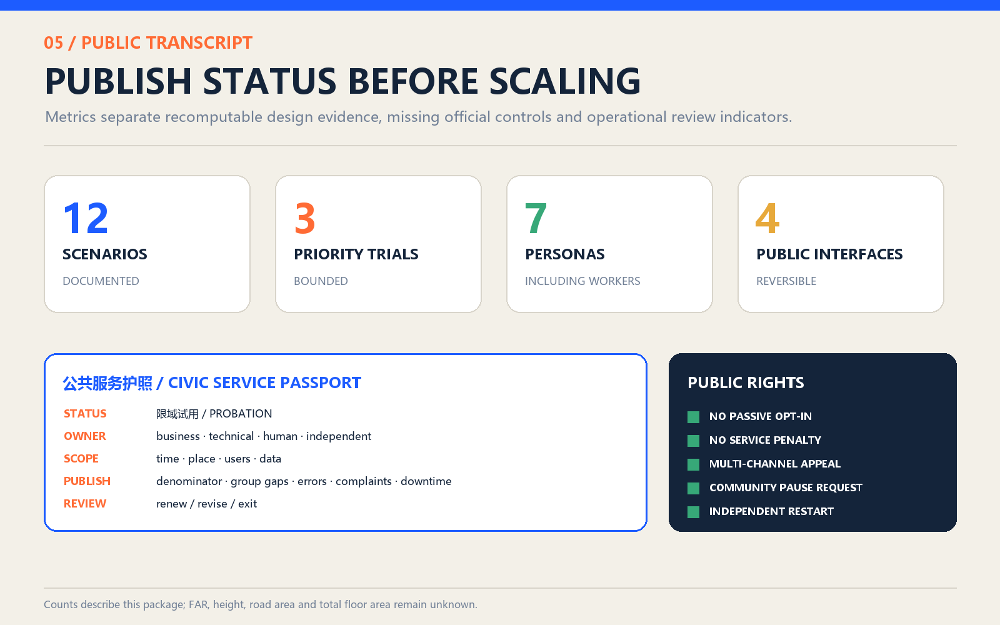

# The Civic Apprentice Line: AI on Urban Probation

> The city is not AI's test subject. The city is its teacher. Let intelligence learn responsibility before it serves.

This proposal is not an AI school or curriculum. It is an executable public-service qualification system. Any AI entering streets, parks, neighbourhoods or public-service interfaces must first learn the limits of the site and its people, then pass tests for fairness, accessibility, offline operation and human handover. Passing permits only a time- and place-bounded probation. Responsibility, errors, appeals and exit status remain public. The Jingzhang railway once connected the city to modernity; in its next century, it can connect technical capacity to public responsibility.

### Core Ethos: Learn Before Serving

The Civic Apprentice Line is not a technology showcase; it is a line of public responsibility. “Apprentice” does not diminish technical capability. It establishes the order of civic permission: learn before taking a post; be tested before serving; disclose before expanding; always allow handover and exit. Technical sophistication alone is not proof of fitness. A service earns its place by accepting civic instruction, public challenge and human takeover.

The “line” is both spatial and institutional. It connects Zhongzhiyuan, AI Origin and Dazhongsi along the Jingzhang Heritage Park, while recording every service's passage through learning, testing, bounded probation, qualified service and review or retirement. Four public interfaces—Civic Enrollment Station, Public Trial Yard, Human Handover Point and Civic Transcript Wall—turn governance into places that people can see, use, question and decline.

## Design Basis and Source Inventory

The official call and the cleared agent taskbook define the assignment. [source:OFFICIAL-ANNOUNCEMENT] [standard:PROJECT-OFFICIAL-ANNOUNCEMENT]

The call establishes approximate study areas of 43.6 km², 11.4 km² and 368.4 ha. The taskbook defines agent.1-agent.6, three positions, five functions, three zones and two wings, AI scenarios, public space, cultural identity and long-term operation. [source:AGENT-TASKBOOK] [standard:PROJECT-AGENT-OPEN-CALL-TASKBOOK]

Official polygons, statutory controls, road redlines, building surveys, ownership, utilities and heritage controls are unavailable. [source:SITE-PACKAGE] [source:SOURCE-REGISTRY]

Submitted boundaries are provisional geometry for concept generation, topology checks and display only. They are not redlines, approvals, ownership evidence or precision-sensitive area evidence. [source:BOUNDARY-SOURCE] [source:KEY-AREA-SOURCE] [depth:existing_conditions_diagnosis]

The evidence order is GeoJSON and `metrics.json`, then matrices and assumptions, then narrative and drawings, then the offline HTML. When official data arrives, geometry, metrics, figures and pages must be regenerated together. [data:geometry/site_boundary.geojson#SITE-001] [metric:site_area_sqm]

## Three-Level Scope Framework

The three scopes form a chain from regional capacity to street-level responsibility. [depth:three_level_scope_framework]

| Scope | Question | Response | Evidence limit |
| --- | --- | --- | --- |
| Coordinated study | How can Haidian form a world-class AI ecosystem? | Link research, enterprise, community and government through mentors, trials, services and international exchange | Strategy only; no invented polygon |
| Overall design | How does innovation enter urban renewal? | A Public Transcript Spine connects three zones, two wings, slow mobility, green-blue space and services | 11.4 km² is approximate; the submitted polygon is provisional |
| Key areas | What duty does each area carry? | Zhongzhiyuan trains and verifies; AI Origin teaches and deliberates; Dazhongsi converts services and hands them to people | All three polygons await official replacement |

The submitted polygon computes to about 11.413 km², close to but not a precision confirmation of the announced 11.4 km². [metric:site_area_sqm] [metric:announced_overall_design_area_sqm] [metric:key_area_count]

## Coordinated Industry and Future-City Study

The regional objective is not simply to gather more AI companies, but to create a supply chain for civic services that can earn trust. Universities provide methods and talent; companies provide products and operations; communities define problems; government defines prohibited uses; independent reviewers and the public examine performance. The exportable products are problem briefs, trial protocols, human-handover standards and public-transcript templates. [depth:overall_spatial_structure]

Global precedents inform mechanisms, not imagery. Helsinki informs public system status and feedback; Singapore AI Verify informs standardised governance testing; the FCA sandbox informs agreed test plans, safeguards and restricted permission. [source:CASE-HELSINKI-AI-REGISTER] [source:CASE-SINGAPORE-AI-VERIFY] [source:CASE-FCA-SANDBOX]

Boston informs problem-led civic prototyping and rejects the city-as-laboratory frame. [source:CASE-BOSTON-MONUM] [source:CASE-BOSTON-BETA-BLOCKS]

Mila, Vector and ELLIS inform research, talent, responsible adoption and multi-centre networks. [source:CASE-MILA] [source:CASE-VECTOR] [source:CASE-ELLIS]

The identity “CIVIC APPRENTICE” uses the visual language of calibration archives: blue means eligible to serve, orange means review required, green means human or ecological path, and amber means probation. The promise is not omnipotence; it is that every service has an owner, evidence and a return path.

## Overall Urban Renewal and Regulatory-Depth Design

The structure is one spine, three zones, two wings and four interfaces. The Public Transcript Spine follows the Jingzhang Heritage Park. Zhongguancun supplies mentors, compliance and enterprise services; Xiaoyue River hosts bounded, low-impact field trials. The four interfaces are Civic Enrollment Station, Public Trial Yard, Human Handover Point and Civic Transcript Wall. [data:geometry/land_use.geojson#LU-001] [data:geometry/public_space.geojson#PUBLIC-001] [depth:land_use_layout]

The Civic Apprentice Line therefore keeps one ethos across space: Zhongzhiyuan teaches and tests; AI Origin lets residents set questions and witness the examination; Dazhongsi allows bounded work with visible human handover. The districts are not competing technology parks. They are three non-interchangeable signatures on one civic credential.

The four land-use partitions express governance duties rather than statutory land-use change. Six footprints are reversible carrier prototypes, not surveyed or proposed development volume. Five mobility lines express connections, not road redlines. FAR, density, total floor area, building height and road-area ratio remain unknown pending official controls and surveys. [data:geometry/buildings.geojson#BLDG-001] [data:geometry/roads.geojson#ROAD-001] [metric:land_use_partition_count] [metric:floor_area_ratio] [metric:building_density] [metric:total_floor_area_sqm] [metric:building_height_m] [metric:road_area_ratio] [depth:development_intensity_controls]

## Detailed Design for Three Key Areas

**Zhongzhiyuan - train and verify.** A Public Trial Yard and professional verification workshops document data, failure modes, boundary conditions, handover, accessibility and offline operation before a service meets the public. Waterfront and garden spaces host only booked, low-impact, reversible prototypes. [data:geometry/key_areas.geojson#PROV-KEY-001] [data:geometry/public_space.geojson#PUBLIC-002]

**AI Origin Community - teach and deliberate.** At the Civic Enrollment Station, residents, students, developers and frontline workers define real problems, prohibited uses and evaluation criteria. The public ground floor provides plain-language explanation, non-digital participation, family AI literacy and appeals. [data:geometry/key_areas.geojson#PROV-KEY-002] [data:geometry/public_space.geojson#PUBLIC-001]

**Dazhongsi - convert and hand over.** The Human Handover Point displays only bounded-tested services. Every digital entrance has a visible staffed alternative. Failure, disconnection, refusal of sensing or inability to use a device must return the task to a person or fixed facility. [data:geometry/key_areas.geojson#PROV-KEY-003] [data:geometry/public_space.geojson#PUBLIC-003]

The Civic Transcript Wall connects all three and publishes status, accountable owner, scope, error summaries, appeals, next review and reasons for retirement. Negative outcomes remain visible. [data:geometry/public_space.geojson#PUBLIC-004] [metric:public_interface_count] [depth:three_key_area_detailed_design]

## AI Ecosystem, Personas and AI+ Scenarios

The qualification chain has five gates: learn; test safety, fairness, access, offline use and handover; serve on bounded probation; operate with a visible human channel and no-AI choice; then renew, revise or exit after public review. A failed gate returns the service to an earlier stage.

Seven personas anchor evaluation: older residents; children and families; people with mobility or sensory disabilities; night-shift and delivery workers; students and developers; small businesses; and visitors. Evaluation asks who is excluded, who bears recovery costs, whether refusal is possible and who takes over when the system fails. [metric:persona_count]

### Public Rights and Control Protocol

| Right or control | Final rule | Execution and evidence |
| --- | --- | --- |
| No passive opt-in | Passing through a trial area is not consent; non-public data requires active use and explicit authorisation | Dual entrance signs and a take-away data notice; identity is not recorded by default |
| No service penalty | Refusing sensing or AI, or lacking a smart device, never reduces eligibility, order or quality | Ordinary/no-sensing routes, staffed desk, phone and paper stay open |
| Community pause request | Three co-decision seats or twenty affected users may request a pause; serious safety events need no signatures | Candidate pilot joint office acknowledges within one working day; safety officer can stop immediately |
| Multi-channel appeal | On-site, phone, paper, accessible proxy and online appeals are equally valid | Serious event public notice in 2 hours, initial finding in 1 working day, continue/revise/pause decision in 5 working days; extensions publish a reason |
| Restart control | An operator cannot restart a service paused for safety, fairness or failed handover | Technical correction, public-seat verification and independent reviewer approval |
| Participation and compensation | Older, disability, child-safeguarding and frontline-worker representatives hold design, acceptance and renewal seats | Reasonable compensation; conflicts declared and recused; children require guardian consent and their own assent |

These times and signature counts are **concept trial controls**, not administrative procedure, and require legal, data, safety, accessibility and community calibration.

| Scenario | Minimum data and place | Main risk | Human path and exit |
| --- | --- | --- | --- |
| S01 Accessible walking and interchange | Public network, volunteered input | Misrouting, location overreach | Staffed help and fixed signs; repeated errors stop service |
| S02 Older-person health/service navigation | Public service directory | Stale information, medical harm | Hotline/window; no diagnosis or prescription |
| S03 Family AI literacy | Rights-cleared teaching material | Anthropomorphism, unsafe content | Teacher-led, parental consent |
| S04 Jingzhang multilingual guide | Official public cultural sources | Historical error, copyright | Human guide and fixed labels |
| S05 Low-speed robot handover | Trial task and observation | Collision, obstruction, worker surveillance | Staff takeover; boundary or connection failure stops trial |
| S06 Park maintenance/ecology aid | Public environmental data and inspection | False alerts, equipment intrusion | Maintenance staff decide |
| S07 Event crowd assistance | Aggregated counts and observation | Misjudgement, surveillance expansion | On-site staff direct; no identification |
| S08 SME service and compliance copilot | Public policy and guides | Stale or incorrect advice | Professional review; clearly non-binding |
| S09 Night-worker service navigation | Public opening and transport data | Safety error, service bias | Staff and fixed lighting/signs |
| S10 Legal and government information | Public legal/government material | Legal harm, personal-data entry | Refer to staff; no legal decision |
| S11 Youth collaboration booking | Public slots and voluntary booking | Digital exclusion | Walk-in registration and fair quota |
| S12 Civic issue intake | Voluntary reports and status | Privacy, gaming, no response | Human triage, appeal and closure reason |

The six registered scenario IDs are expanded into twelve executable cards. [metric:scenario_card_count]

Three priority trials use explicit entry gates. The robot trial stops on collision, restricted-area entry, failed emergency stop/handover or worker-performance use. The fairness trial requires the staffed path to absorb a 30-minute total AI outage, acknowledge handover within two minutes and keep a proposed success-rate gap within five percentage points. The offline trial requires 100% completion of core tasks with at least two alternatives available. These are calibratable trial thresholds, not universal law; a failed zero-tolerance item cannot be averaged away. [metric:priority_trial_count]

## Land Use, Building Scale and Retain-Renovate-Remove

Four concept partitions and six carrier prototypes express how public duties can occupy space. The final prototypes are small pavilions or ground-floor retrofit bays, totalling about 11,685 m², or 0.10% of the provisional polygon. This remains a low-confidence design count, not development capacity. [metric:building_footprint_area_sqm] [metric:design_building_coverage_ratio]

The method is to identify value before assigning action: preserve heritage carriers and mature community interfaces; lightly retrofit inefficient ground floors; use demountable components for trials; defer demolition and new construction until building, ownership, structural, heritage and control data exist. [depth:retain_renovate_demolish] [depth:height_massing_character] [standard:MNR-LAND-USE-CLASSIFICATION-GUIDE]

## Mobility, Rail, Utilities and Public Services

Five conceptual mobility lines total about 19.97 km. They express the heritage spine, cross-links, key-area access and a low-speed trial loop; they are not engineering alignments. Walking and accessibility come first, then cycling, public transport and necessary service vehicles. Robots receive no default right of way. [metric:concept_mobility_length_m] [depth:traffic_rail_slow_parking]

Digital and fixed navigation, multimodal information, and trial and ordinary routes are always paired. Dazhongsi station quadrants, North Fifth Ring crossings, Wudaokou and Qinghuadongluxikou require later professional review. Infrastructure follows “few devices, disconnectable, maintainable”: preserve offline modes, avoid fire and accessible routes, require separate data authorisation, and review energy, drainage, flood, communication, fire and lifecycle costs. [data:geometry/constraints.geojson#CONSTRAINT-001] [depth:municipal_new_infrastructure]

## Blue-Green Space, Public Space and Character

Three green prototypes total about 1,318,172 m² (11.55%); four minimum public-interface prototypes total about 10,049 m² (0.09%). These are concept coverages inside a provisional polygon, not statutory ratios or ownership findings. Rest, movement, cooling, water, ecology and everyday gathering take precedence over technology. [metric:green_ratio] [metric:public_space_ratio] [depth:blue_green_public_space]

The character avoids glowing screens and generic cyberpunk imagery. Railway scales, maintenance tags, station signs and archive numbers produce a restrained, legible and maintainable civic engineering language. Three landmarks make responsibility memorable: the Enrollment Bell gathers problems without tracking passers-by; the Handover Signal Tower mechanically displays AI/human/paused state; the Centennial Transcript Gallery preserves both success and exit cases. [standard:MOHURD-URBAN-DESIGN-MEASURES]

## Project List, Policy and Phasing

Six projects form the delivery set: a qualification protocol template, a lightweight Enrollment Station, a Public Trial Yard, a Human Handover Point, a Civic Transcript Wall and the Public Transcript Spine. Candidate leads are a pilot joint office, local public-space owners and service departments; asset owners, budgets and approvals remain pending. Independent safety, accessibility, legal and public seats sit at decision gates. The first phase (0-12 months) creates protocols, one Enrollment Station and a passport sample; the second (12-30 months) runs bounded trials and handover; the third scales only services that pass two consecutive reviews. Phasing geometry now marks project-package anchors rather than slicing the whole area. [data:geometry/phasing.geojson#PHASE-001] [metric:phase_count] [depth:renewal_project_list] [depth:phasing_implementation]

Every service has a business owner, technical owner, on-site human owner and independent reviewer. Its transcript publishes version, denominator, results by the seven public seats, success and handover rates, handover time, unresolved complaints, failed takeovers, downtime, error summary, appeal time, reviewer signature and next review. Renewal follows public outcome and recovery capacity, not traffic or publicity.

The agent.6 operating calendar is a monthly public problem list, quarterly public review, annual Open Trial Week and annual international mechanism dialogue. International exchange covers protocol interoperability, transparency formats and review methods, never implied government endorsement.

Data lifecycle minima are explicit: public-source versions retain a source/date/hash; optional contact details for issues are deleted 30 days after closure; robot perception is processed on-device and not retained by default, with restricted serious-incident clips kept no more than 30 days; booking data is deleted seven days after an event except legal records; public transcripts preserve aggregated version history without raw cases. Supplier exit requires a data dictionary, version log, open appeals, human manual and removal list.

## Metrics, Recalculation and Compliance

Known metrics carry formulas, units, source files, confidence and assumptions. Unknown metrics remain null with reasons. The provisional site computes to 11,412,825.386 m²; concept green space to 1,318,172.299 m²; minimum public interfaces to 10,049.417 m²; and mobility lines to 19,974.45 m. These are design evidence, not approvals. [metric:site_area_sqm] [metric:green_space_area_sqm] [metric:public_space_area_sqm] [metric:concept_mobility_length_m] [depth:metrics_recalculation]

The compliance matrix covers official requirements 1.3-1.5 and agent.1-agent.6; the standards matrix covers six standards; the depth matrix covers fifteen professional topics. Narrative, A3, A0, five figures, HTML, GeoJSON and metrics use one evidence model. [standard:MOHURD-CONTROL-DETAILED-PLANNING] [standard:MOHURD-ARCH-DESIGN-DEPTH-2016]

## Risk, Copyright and Compliance

The greatest risks are treating probation as approval, turning feedback into surveillance, and mistaking concept lines for engineering design. Eight risk dimensions are controlled through minimum data, no-sensing alternatives, bounded scope, human handover, public errors, appeals and exit. [depth:risk_missing_data]

The service must not conduct facial recognition, unauthorised individual tracking, automated enforcement, medical diagnosis, legal decisions or public-resource eligibility decisions by profile. Human review must carry actual authority. All spatial relations remain concepts subject to planning, traffic, utilities, fire, heritage, accessibility and ecology review.

The narrative, structured data, figures, offline HTML and PDFs were generated in this Codex workflow. Case studies use official institutional pages without copying their visual assets. The display loads no remote fonts, tiles, scripts, APIs, forms or tracking. See `report/copyright_statement.md`.

## References

- [source:OFFICIAL-ANNOUNCEMENT], [source:AGENT-TASKBOOK], [source:SITE-PACKAGE], [source:SOURCE-REGISTRY].
- [source:CASE-HELSINKI-AI-REGISTER], [source:CASE-SINGAPORE-AI-VERIFY], [source:CASE-FCA-SANDBOX].
- [source:CASE-BOSTON-MONUM], [source:CASE-BOSTON-BETA-BLOCKS].
- [source:CASE-MILA], [source:CASE-VECTOR], [source:CASE-ELLIS].

Geometry, metrics, sources, matrices, A3/A0 documents and `visual/index.en.html` provide cross-checkable counterparts to this narrative.
