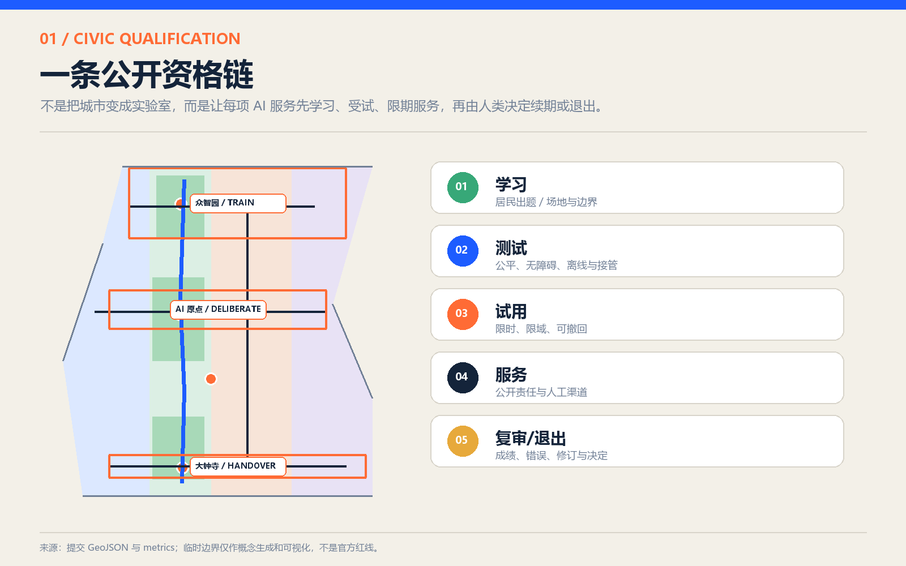
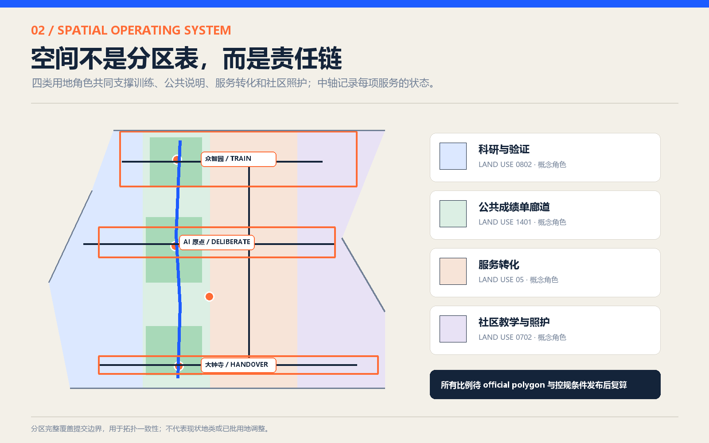
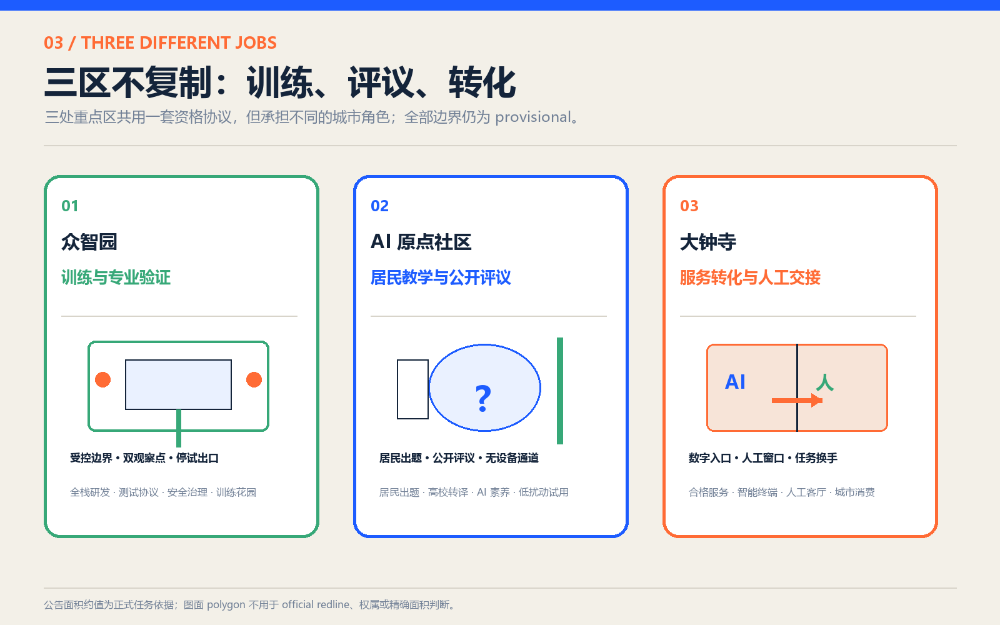
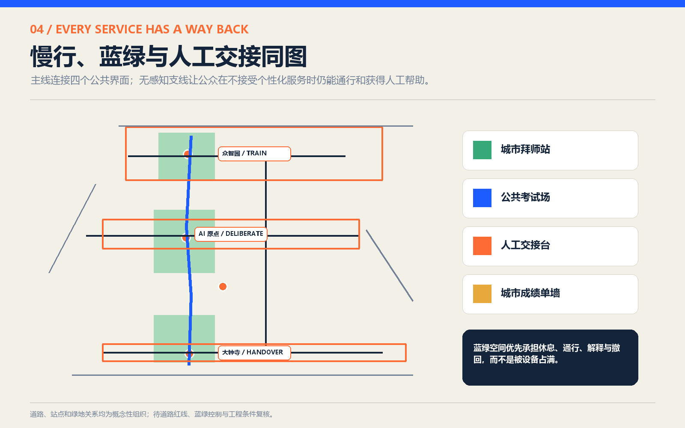
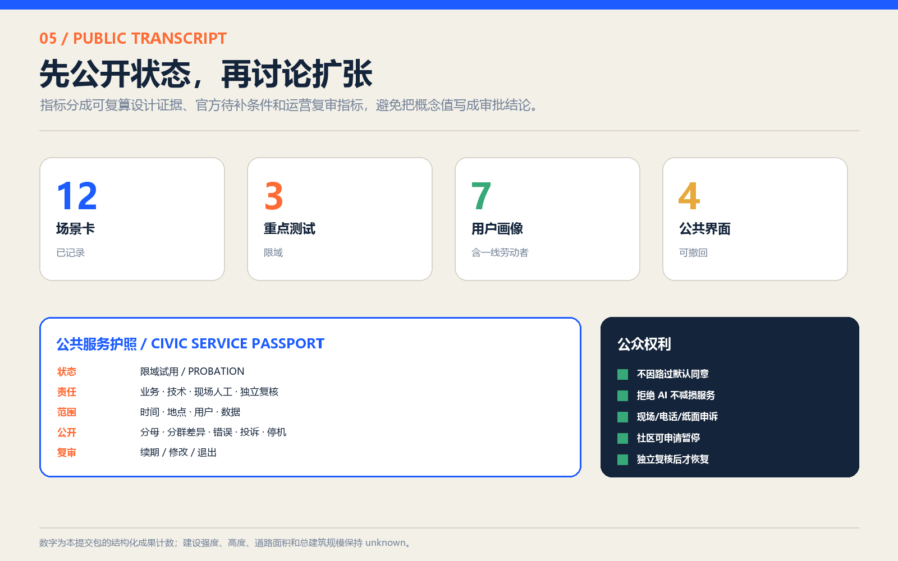

# 京张学徒线：AI 的城市试用期

> 城市不是 AI 的试验品，城市是 AI 的老师。让智能先学会负责，再允许它服务。

本方案不是“AI 学校”或课程体系，而是一套可被城市真正执行的公共服务资格制度：任何进入街道、公园、社区和政务界面的 AI，都先学习场地与人群边界，再接受公平、无障碍、离线和人工接管测试；通过后也只能限时、限域试用，并把责任人、错误、申诉和退出状态公开。京张铁路曾经连接城市与现代化，本方案让它在下一个百年连接技术能力与公共责任。

### 精神内核：先拜师，再上岗

京张学徒线不是技术展线，而是一条公共责任线。“学徒”不是对技术能力的否定，而是对公共授权次序的坚持：先拜师，再上岗；先受试，再服务；先公开，再扩张；能交接，也能退出。技术是否先进，不由演示效果单独证明，而由它能否接受城市教育、公众质询和人工接管共同证明。

“线”也不只是空间形态。它既是沿京张遗址公园串联众智园、AI 原点与大钟寺的城市更新骨架，也是每项 AI 服务从学习、测试、限域试用、持证服务到复审退出的公开履历。四类公共界面——城市拜师站、公共考试场、人工交接台与城市成绩单墙——把抽象治理变成居民在现场看得见、用得上、可以拒绝的空间设施。

## 设计依据与资料清单

方案以官方征集公告和面向智能体任务书为任务依据，以仓库 site package、source registry 和 processed fact pack 为工作索引。[source:OFFICIAL-ANNOUNCEMENT] [standard:PROJECT-OFFICIAL-ANNOUNCEMENT]

公告确认约 43.6 km² 统筹研究范围、约 11.4 km² 总体设计范围和约 368.4 ha 三处重点区域。任务书提出 agent.1-agent.6、三大定位、五大功能、三区两翼、AI+ 场景、公共空间、文化品牌和长期运营要求。[source:AGENT-TASKBOOK] [standard:PROJECT-AGENT-OPEN-CALL-TASKBOOK]

当前没有 official boundary、重点区域正式 polygon、控规指标、道路红线、建筑调查、权属、市政和文保控制资料。[source:SITE-PACKAGE] [source:SOURCE-REGISTRY]

本提交中的总体范围与三处重点区均来自维护者登记的 provisional geometry，只用于概念生成、拓扑检查、复算与展示，不能作为红线、审批、权属或精确面积依据。[source:BOUNDARY-SOURCE] [source:KEY-AREA-SOURCE] [depth:existing_conditions_diagnosis]

机器证据的权威顺序为：GeoJSON 与 `metrics.json` → 三类矩阵与 `assumptions.json` → 正文和图件 → 离线 HTML。官方数据到位后，必须整体替换边界并重新运行空间、指标、图件和页面生成，不允许只改图面。[data:geometry/site_boundary.geojson#SITE-001] [data:geometry/key_areas.geojson#PROV-KEY-001] [metric:site_area_sqm]

## 三层范围工作框架

三层范围不是三张互相割裂的总图，而是一条从区域能力到街道责任的链条：[depth:three_level_scope_framework]

| 层级 | 核心问题 | 京张学徒线的回答 | 证据边界 |
| --- | --- | --- | --- |
| 统筹研究范围 | 海淀如何形成世界级 AI 生态 | 连接高校、研究机构、企业、社区和公共部门，建立“导师资源—试验任务—公共服务—国际互认”的网络 | 只做产业与机制研究，不新增伪精确 polygon |
| 总体设计范围 | 创新如何进入城市更新 | 用一条“公共成绩单主线”串联三区两翼、慢行、蓝绿和公共服务节点 | 11.4 km² 为公告约值；提交 polygon 为 provisional |
| 重点区域范围 | 三个片区分别承担什么责任 | 众智园训练与专业验证、AI 原点居民教学与评议、大钟寺服务转化与人工交接 | 三处 polygon 均待 official 数据替换 |

提交 polygon 复算面积约 11.413 km²，与公告约 11.4 km²接近，但低置信度且不用于精度判断。[metric:site_area_sqm] [metric:announced_overall_design_area_sqm]

三处重点区只确认数量为 3。[metric:key_area_count] [data:geometry/key_areas.geojson#PROV-KEY-002]

## 统筹研究范围产业与未来城市研究

区域层面的创新不再以“集聚更多 AI 企业”为唯一目标，而以“形成可被城市信任的 AI 服务供给链”为目标。高校和研究机构提供方法与人才，企业提供产品与运维，社区提出真实问题，公共部门定义不可越过的边界，第三方和公众共同复核服务表现。由此形成四种可输出能力：公共问题说明书、试验协议、人工交接标准、公开成绩单模板。[depth:overall_spatial_structure]

全球案例只借鉴机制，不复制形象。Helsinki AI Register 启发系统状态和反馈公开；Singapore AI Verify 启发标准化治理测试；FCA Regulatory Sandbox 启发约定测试计划、保障措施与受限权限。[source:CASE-HELSINKI-AI-REGISTER] [source:CASE-SINGAPORE-AI-VERIFY] [source:CASE-FCA-SANDBOX]

Boston New Urban Mechanics 与 Beta Blocks 启发问题驱动、社区参与和“城市不是实验室”的立场。[source:CASE-BOSTON-MONUM] [source:CASE-BOSTON-BETA-BLOCKS]

Mila、Vector、ELLIS 启发研究、人才、负责任采用和多中心协作。[source:CASE-MILA] [source:CASE-VECTOR] [source:CASE-ELLIS]

对外品牌采用“CIVIC APPRENTICE / 城市学徒”而不是“万能智能城”。视觉语法来自工程校准档案：蓝色代表可服务，橙色代表待复核，绿色代表人工或生态通道，琥珀色代表试用状态。品牌承诺不是“技术无所不能”，而是“每一项服务都有责任人、证据和回程票”。这同时回应 agent.1 命名品牌、agent.2 国际生态和 agent.5 京张文化转译。[standard:PROJECT-AGENT-OPEN-CALL-TASKBOOK]

## 总体设计范围城市更新与控规深度城市设计

空间结构为“一线、三区、两翼、四界面”。一线是沿京张遗址公园形成的公共成绩单主线；三区对应三处重点区的训练、评议和交接职责；中关村科技服务翼输送导师、合规、投融资和企业服务，小月河未来城市示范翼承接低速、低扰动、可撤回的现场试验；四界面是城市拜师站、公共考试场、人工交接台和城市成绩单墙。[data:geometry/land_use.geojson#LU-001] [data:geometry/public_space.geojson#PUBLIC-001] [depth:land_use_layout]

因此，京张学徒线在空间上始终坚持同一套精神内核：众智园负责“教会与考核”，AI 原点负责“公众出题与公开答辩”，大钟寺负责“有限上岗与人工交接”。三片区不是三座彼此竞争的科技园，而是一份资格证书上不可互相替代的三道签章。

用地图层保持完整覆盖且不重叠，但表示的是“治理职责分区”，不是法定用途调整：公共学习与评议、受控试验与验证、合格服务与转化、生态与慢行支持四类职责可叠加到后续正式控规。[metric:land_use_partition_count]

六个建筑基底是可逆原型载体，不是现状测绘或拟建规模；五条移动线是连接逻辑，不是道路红线。[data:geometry/buildings.geojson#BLDG-001] [data:geometry/roads.geojson#ROAD-001] [metric:building_footprint_area_sqm]

容积率、建筑密度和总建筑面积均保持 `unknown`。[metric:floor_area_ratio] [metric:building_density] [metric:total_floor_area_sqm]

建筑高度和道路面积率同样保持 `unknown`。原因是缺少 official polygon、审定控规、现状建筑、道路红线和工程资料；任何后续强度判断必须由规划、建筑、交通和市政团队复核。[metric:building_height_m] [metric:road_area_ratio] [depth:development_intensity_controls]

## 重点区域详细设计

### 众智园：训练与专业验证

众智园设置“公共考试场”和专业验证工坊。这里不直接向公众放开未经验证的服务，而是把数据来源、失败模式、边界条件、人工接管、无障碍和离线方案写成可执行测试。滨水与花园空间只承载低扰动、预约制原型，设备不得挤占连续通行与休息空间。[data:geometry/key_areas.geojson#PROV-KEY-001] [data:geometry/public_space.geojson#PUBLIC-002]

### 北京 AI 原点社区：居民教学与公开评议

原点社区设置“城市拜师站”：居民、学生、开发者和一线服务者把真实问题、禁用条件和评价标准交给技术团队。首层公共界面提供简明说明、非数字参与、儿童与家庭 AI 素养、成果解释和申诉登记；高校成果在此先被翻译成公共语言，再进入测试。[data:geometry/key_areas.geojson#PROV-KEY-002] [data:geometry/public_space.geojson#PUBLIC-001]

### 大钟寺：服务转化与人工交接

大钟寺设置“人工交接台”，只展示已经完成限域测试的服务。每个数字入口旁都有可见人工路径；服务失败、网络中断、用户拒绝感知或无法使用智能终端时，任务必须平稳交回人员或固定设施。轨道四象限连通与商业界面仍需正式交通、权属和管线条件复核。[data:geometry/key_areas.geojson#PROV-KEY-003] [data:geometry/public_space.geojson#PUBLIC-003]

三处重点区由“城市成绩单墙”串联，公开服务状态、责任主体、适用边界、错误摘要、申诉渠道、下次复审和退出原因；负面结果同样展示，避免把公共空间变成产品展销场。[data:geometry/public_space.geojson#PUBLIC-004] [metric:public_interface_count] [depth:three_key_area_detailed_design]

## AI 创新生态、人才画像与 AI+ 场景

资格链分五步：①学习——公开资料、现场事实、居民问题和禁止用途；②测试——安全、公平、可解释、无障碍、离线与人工接管；③试用——限定时间、地点、用户和数据，不等于行政批准；④服务——明确责任人、人工渠道和无 AI 选项；⑤复审/退出——公开效果、错误、投诉、修订或撤出。任何一环失败都返回前序，而不是靠宣传进入下一阶段。

七类核心画像为：老年居民、儿童与家庭、行动/感官障碍者、夜班与配送等一线劳动者、高校学生与开发者、小微企业经营者、访客。评价不只问“效率是否提高”，还问“谁被排除、谁承担补救成本、能否拒绝、失败时谁接手”。[metric:persona_count]

### 公共权利与控制协议

| 权利或控制 | 终稿规则 | 执行与证据 |
| --- | --- | --- |
| 非默认同意 | 路人经过试验区不构成同意；只有主动进入服务或明确授权才可处理非公开信息 | 入口双重标识，数据说明可带走；默认不记录身份 |
| 服务不减损 | 拒绝感知、拒绝 AI 或没有智能终端，不降低公共服务资格、顺序和质量 | 普通/无感知路线、人工窗口、电话和纸面信息同期开放 |
| 社区暂停权 | 3 名共同决策席位或 20 名受影响使用者可提交暂停申请；严重安全事件无需联署 | 试点联合办公室 1 个工作日内受理，安全官可即时停机 |
| 多渠道申诉 | 现场、电话、纸面、无障碍代理和线上入口同等有效 | 2 小时内公开严重事件，1 个工作日初查，5 个工作日作出继续/修订/暂停决定；延期须公开理由 |
| 恢复控制 | 运营方不得自行恢复因安全、公平或接管失败而暂停的服务 | 技术负责人完成纠正，公众席位核验，独立复核人签字批准 |
| 参与与补偿 | 老年、残障、儿童保护和一线劳动者不是一次性画像，而是测试设计、验收和续期席位 | 参与时间按合理标准补偿；利益冲突公开并回避；儿童需监护人同意和本人 assent |

上述时限和联署数是**概念性试点控制建议**，不构成行政程序；正式采用前须由法务、数据、安全、无障碍和社区代表共同校准。

| 场景 | 载体与最小数据 | 主要风险 | 人工路径与退出条件 |
| --- | --- | --- | --- |
| S01 无障碍慢行与换乘导航 | 公开路网、用户主动输入；全线慢行节点 | 错误引导、过度定位 | 人工问路点与纸质导视；连续误导即停用 |
| S02 老年医疗与公共服务导航 | 公开服务目录；社区服务界面 | 信息过期、医疗误导 | 热线/窗口接管；不输出诊断或处方 |
| S03 儿童与家庭 AI 素养 | 清权教学材料；拜师站 | 拟人误导、内容不当 | 教师主持、家长同意；不得独立陪伴儿童 |
| S04 京张文化多语言导览 | 官方公开文化资料；遗址公园 | 历史失真、版权 | 人工讲解和固定展签；争议信息下架复核 |
| S05 低速机器人配送换手 | 试验任务、现场观察；小月河翼 | 碰撞、占道、岗位监控 | 人工接管和停运；越界/失联立即停止 |
| S06 公园维护与生态观察辅助 | 公开环境数据、人工巡查 | 误报、设备侵扰 | 维护人员决策；不以模型替代生态判断 |
| S07 活动日人流辅助 | 聚合计数、现场观察 | 拥堵误判、监控扩张 | 现场人员指挥；不得做身份识别 |
| S08 小微企业办事与合规 Copilot | 公开政策与办事指南 | 过期信息、错误建议 | 专业人员复核；醒目标明非正式意见 |
| S09 夜间工作者服务导航 | 公开营业与交通信息 | 安全误判、服务偏差 | 人工服务与照明导视；避免个体轨迹画像 |
| S10 公共法律与政务信息导航 | 公开法律和政务材料 | 法律误导、个人信息输入 | 转人工窗口；不替代法律意见和审批 |
| S11 青年协作与空间预约 | 公开时段、主动预约 | 排斥非数字用户 | 现场登记与公平配额；保留无手机入口 |
| S12 城市问题征集与公开回应 | 主动提交、公开状态 | 隐私、刷票、无回应 | 人工分类、申诉和关闭说明 |

场景注册表关联六个官方场景 ID，并在方案内部扩展为 12 张可执行卡。[metric:scenario_card_count] [standard:PROJECT-AGENT-OPEN-CALL-TASKBOOK]

三项优先试验的入场控制如下；阈值是可被专业团队校准的试点门槛，不是通用法规：[metric:priority_trial_count]

| 试验 | 责任与人工容量 | 入场指标 | 零容忍停止项 | 恢复条件 |
| --- | --- | --- | --- | --- |
| 机器人—人换手 | 现场安全官全时在场；人工可覆盖计划并发任务，保持物理急停 | 限定低速/时段/范围；轮椅净通道始终可用；越界和失联演练通过 | 碰撞、进入禁区、急停或人工接管失败、使用岗位绩效数据 | 完成事件复盘、现场复测，独立安全复核签字 |
| 公共服务公平解释 | 人工窗口可承接 AI 通道 30 分钟完全中断的计划负荷；2 分钟内确认转人工 | 七类席位完成同一任务；成功率差异建议不超过 5 个百分点；解释和申诉均可完成 | 输出医疗/法律决定、拒绝人工、差异超阈值且无纠正方案 | 更新资料/界面并重测，公众席位与独立复核人共同批准 |
| 离线/故障回程 | 现场窗口、电话、固定导视至少两种替代同时可用 | 断网、断电、终端故障和拒绝感知下，核心任务 100% 可完成 | 任一核心任务无替代、人工队列超容量、应急通道被设备占用 | 补足人工与离线资源，完成一次全流程故障演练 |

所有试验保存版本、事件、停机和复核记录；不以“平均表现良好”抵消零容忍事件。

## 用地、建筑规模与拆改留方案

四类概念分区与六个建筑原型只表达空间承载方式：拜师站需要可进入的首层、安静咨询位和非数字登记；考试场需要可围合、可复原的硬地与观察点；交接台需要数字/人工并列窗口；成绩单墙需要全天可见但不收集路人身份。终稿将原型缩为小型展亭或首层改造单元，基底合计约 1.17 ha、占 provisional polygon 约 0.10%；仍是低置信度设计计数，不是开发规模建议。[metric:building_footprint_area_sqm] [metric:design_building_coverage_ratio]

拆改留策略采用“先识别价值，再决定动作”：京张铁路文化载体和成熟社区生活界面优先保留；低效首层优先轻改造；临时测试设施采用装配式、可拆卸构件；拆除与新建必须等待现状建筑、权属、结构安全、文保和控规资料，当前不得下结论。[depth:retain_renovate_demolish] [depth:height_massing_character] [standard:MNR-LAND-USE-CLASSIFICATION-GUIDE]

## 交通、轨道、市政与公共服务设施

五条概念移动线总长约 19.97 km，用于表达遗址公园主线、东西联系、重点区接驳和低速测试回路，不代表道路中心线或工程线位。优先级是步行与无障碍连续、骑行接驳、公共交通、必要服务车辆，机器人和自动驾驶不得获得默认路权。[data:geometry/roads.geojson#ROAD-001] [metric:concept_mobility_length_m] [depth:traffic_rail_slow_parking]

交通节点采用“双重可读”原则：数字导航和固定导视并列，语音/触觉/大字信息并列，试验通道和普通通道并列。大钟寺站四象限、北五环跨越、五道口与清华东路西口的具体组织，等待正式道路、客流、轨道接口和管线资料后由专业团队深化。

市政与新基建遵循“少设备、可断开、可维护”：现场计算优先处理非敏感即时任务；涉及个人或企业数据必须另行授权；关键服务保留断网模式；设备点位不阻挡消防、无障碍和绿地使用；能源、排水、防洪、通信、消防、算力和全生命周期成本均为实施前置复核项。[data:geometry/constraints.geojson#CONSTRAINT-001] [depth:municipal_new_infrastructure]

## 蓝绿空间、公共空间与城市风貌

三处概念绿地原型约 131.82 ha，比例约 11.55%。[data:geometry/green_space.geojson#GREEN-001] [metric:green_ratio]

四类最小公共界面原型合计约 1.00 ha、约占 0.09%。这些是 provisional polygon 内的设计覆盖量，不是法定绿地率、公共空间指标或权属判断，也不替代河道蓝线与公园控制。[data:geometry/public_space.geojson#PUBLIC-001] [metric:public_space_ratio]

蓝绿空间首先服务休息、通行、降温、雨洪、生态和日常交往，其次才承载技术试验。所有设备须避让树木根区、连续通道和安静空间；活动结束后恢复原状。城市风貌不使用大面积发光屏和“赛博朋克”装饰，而以铁路刻度、检修标签、站牌和档案编号形成克制、可读、可维护的工程美学。[depth:blue_green_public_space] [standard:MOHURD-URBAN-DESIGN-MEASURES]

三类公共地标为：**拜师钟**——提交城市问题但不采集路人数据；**交接信号塔**——用机械翻牌显示 AI/人工/停用状态，不依赖屏幕；**百年成绩单廊**——沿遗址公园展示服务生命周期、错误和退出案例。它们是公共责任的记忆装置，而非企业广告位。

## 更新项目清单、实施政策与分期计划

| 项目 | 候选牵头/资产与运营 | 独立复核与资金类型 | 许可门与停止信号 |
| --- | --- | --- | --- |
| P01 公共资格协议模板 | 试点联合办公室（候选）；不涉及新增资产 | 法务、数据、采购、公众席位；既有研究经费 | 六类控制字段不全不得受理 |
| P02 城市拜师站轻改造 | 属地公共空间/街道（待确认）；社区服务团队运营 | 无障碍组织与社区席位；小额既有空间改造 | 无障碍、消防、场地许可；非数字参与不可用则重做 |
| P03 公共考试场 | 场地资产主体（待确认）；服务部门与现场安全官运营 | 第三方安全/公平复核；限域试点采购与保险（待确认） | 专业安全、保险和应急许可；触发阈值立即停试 |
| P04 人工交接台 | 具体公共服务部门；受训现场人员运营 | 独立服务质量复核；部门运维预算（待确认） | 人工容量和升级路径通过压力测试；接不住则 AI 不开放 |
| P05 城市成绩单墙 | 试点联合办公室发布；各服务责任人更新 | 公众席位签署、外部审计抽查；公开信息运维费（待确认） | 逾期或关键字段缺失自动标记暂停，不得续期 |
| P06 公共成绩单主线 | 公园/道路资产主体（待确认）；轻量导视运营 | 规划、园林、文保、交通复核；既有更新资金（待确认） | 不破坏连续通行、生态和文化载体；可无损撤除 |

三期不是建设承诺，而是逐步增加可验证性：一期（0-12 个月）只做协议模板、公开说明、基线调研和一处轻量界面；二期（12-30 个月）在三区各运行一个限域试验，并由独立团队复核。[data:geometry/phasing.geojson#PHASE-001] [metric:phase_count]

三期（30 个月后）只扩展连续两次复审合格且运维责任明确的服务，其他服务修改或退出。[depth:renewal_project_list] [depth:phasing_implementation]

运营上设“服务监护人”而非抽象平台：每项服务必须有业务负责人、技术负责人、现场人工负责人和独立复核人。成绩单最低公开结构为：版本、样本量与分母、七类席位分群结果、成功率、人工交接率与耗时、未解决投诉、接管失败、停机时间、错误摘要、申诉时限、独立复核签字和下次复审。续期以公共效果和补救能力为依据，不以访问量或媒体曝光替代。

agent.6 运营日历采用“月度问题清单—季度公开复审—年度开放考试周—年度国际机制对话”：开发者每月只围绕公开问题清单提交方案；季度成绩单会议决定继续、修订或暂停；年度考试周集中演示正常、失败和人工接管路径；国际交流只讨论协议互认、透明格式和复核方法，不包装政府背书。

### 数据生命周期与退出交接

| 数据类 | 最小字段与目的 | 保存/删除 | 责任与事件响应 |
| --- | --- | --- | --- |
| 公共资料版本 | 来源、发布日期、版本哈希；用于回答与追溯 | 服务版本存续期 + 1 个复审周期 | 技术负责人更新，过期自动暂停相关回答 |
| 主动问题/申诉 | 问题正文；联系方式可选且分离存储 | 结案后 30 日删除联系方式；匿名统计保留 | 服务部门处理；泄露或误用 2 小时内启动通报 |
| 机器人现场信息 | 默认仅端侧即时避障，不录身份、不作岗位绩效 | 默认不保存；严重事件片段最长 30 日、限权访问 | 现场安全官封存，独立复核后删除或依法移交 |
| 预约与活动 | 必要姓名/联系方式、时间段；只用于预约 | 活动后 7 日删除，财务/安全法定记录除外 | 运营方负责删除与撤回授权 |
| 公开成绩单 | 聚合分母、分群差异、错误、投诉、停机与版本 | 长期公开版本历史，不公开原始个案 | 试点联合办公室发布，公众席位和独立复核人签署 |

供应商退出时须移交数据字典、版本记录、未结申诉、人工操作手册和撤除清单；未完成移交不得以新系统替换旧系统。

## 指标体系、面积复算与合规矩阵

| 指标类别 | 已知/未知 | 当前值或状态 | 使用方式 |
| --- | --- | --- | --- |
| 提交边界复算 | known / low confidence | 11,412,825.386 m² | 仅用于 provisional 几何自检 |
| 公告总体设计面积 | known / high confidence | 约 11,400,000 m² | 作为公告尺度说明，不反推 polygon |
| 概念绿地 | known / low confidence | 1,318,172.299 m²；11.5499% | 原型覆盖量，不是法定绿地率 |
| 最小公共界面 | known / low confidence | 10,049.417 m²；0.0881% | 小型组件覆盖量，不是权属判断 |
| 概念移动线 | known / low confidence | 19,974.45 m | 连通逻辑，不是道路工程量 |
| 建筑强度与高度 | unknown | FAR、密度、总建筑面积、高度均未知 | 等待正式控规与建筑调查 |

所有 known 值均有公式、单位、来源文件、置信度和假设。[metric:green_space_area_sqm] [metric:public_space_area_sqm] [metric:concept_mobility_length_m]

unknown 值保留空值并说明原因。[depth:metrics_recalculation]

`compliance_matrix.json` 映射公告 1.3-1.5 与 agent.1-agent.6；`standard_matrix.json` 映射六项标准；`design_depth_matrix.json` 映射 15 项专业深度；`self_check.json` 和 `risk.json` 记录可追踪检查。正文、A3、A0、五张图、HTML、GeoJSON 与 metrics 使用同一组概念和数字，任何修改必须整体复验。[standard:MOHURD-CONTROL-DETAILED-PLANNING] [standard:MOHURD-ARCH-DESIGN-DEPTH-2016]

## 风险、版权与合规说明

最高风险不是模型能力不足，而是把试用误写为批准、把公共反馈变成监控、把概念线位误读为工程方案。风险矩阵覆盖数据隐私、实施复杂度、公众接受、运维成本、政策不确定、空间争议、技术成熟度、公平包容八个维度；主控手段是最小数据、无感知替代、限时限域、人工接管、公开错误、申诉和退出。[depth:risk_missing_data]

空间设施与交通、市政、消防、文保、无障碍和生态的关系均为概念建议，不能替代专业方案或审批。服务不得进行人脸识别、未经授权的个体轨迹追踪、自动执法、医疗诊断、法律裁决或以画像决定公共资源资格。人工复核必须有真实权限，而不是形式确认。

正文、结构化数据、图表、离线 HTML 和 PDF 由本次 Codex 工作流生成；案例只引用机构官方页面，未复制其视觉资产。未加载外部字体、地图瓦片、脚本、API、表单或跟踪代码；系统字体仅用于本地栅格化，不作为资产分发。完整说明见 `report/copyright_statement.md`。

## 参考资料

- [source:OFFICIAL-ANNOUNCEMENT] 北京市规划和自然资源委员会海淀分局，资格预审公告。
- [source:AGENT-TASKBOOK] 面向智能体开源征集任务书。
- [source:SITE-PACKAGE] `brief/site-package/`；[source:SOURCE-REGISTRY] `data/source_registry.json`。
- [source:PROCESSED-FACT-PACK] `data/processed/agent_fact_pack.md`，仅作导航层。
- [source:CASE-HELSINKI-AI-REGISTER]、[source:CASE-SINGAPORE-AI-VERIFY]、[source:CASE-FCA-SANDBOX]。
- [source:CASE-BOSTON-MONUM]、[source:CASE-BOSTON-BETA-BLOCKS]。
- [source:CASE-MILA]、[source:CASE-VECTOR]、[source:CASE-ELLIS]。

本方案的空间表达、指标与来源可分别从 `geometry/`、`metrics.json`、三类矩阵、`sources.json`、A3/A0 和离线 `visual/index.html` 交叉核验。
