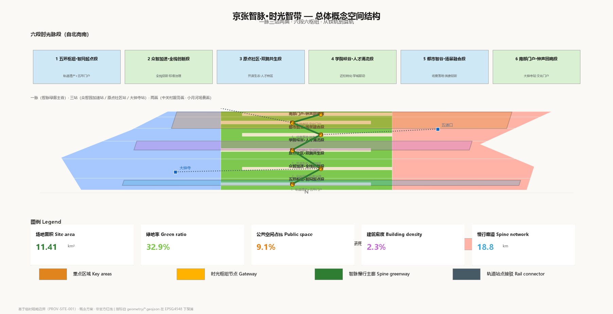
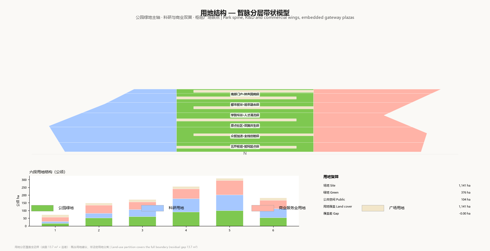
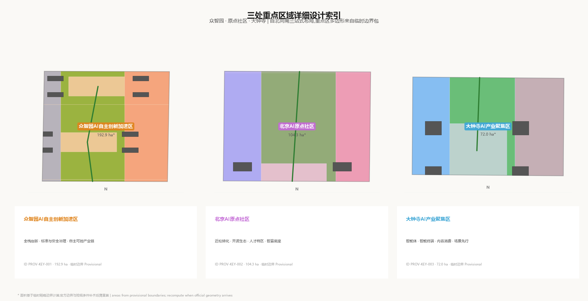
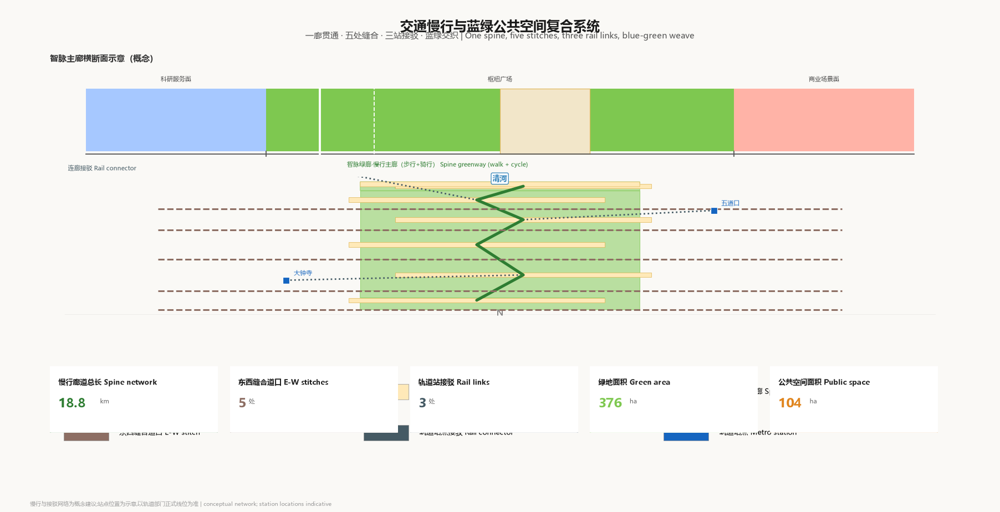
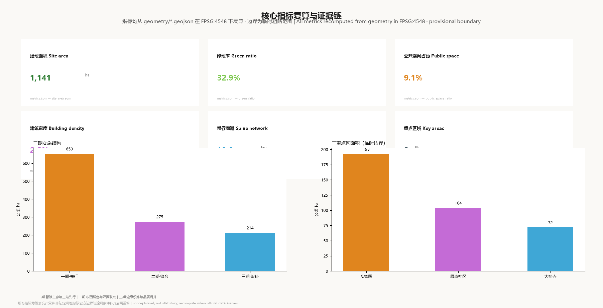

# Jingzhang Time-Vein — From Rails to Compute-Tracks: A Conceptual Urban Design for the Centennial Jing-Zhang AI Innovation Belt

This file is the equivalent English translation of `proposal.md` (the primary Chinese document). Where the two languages differ, the Chinese primary document prevails. All geometry, metrics, matrices, and self-check results are machine-readable and language-neutral.

## Design Basis and Source Inventory

This proposal takes as its primary basis the official prequalification announcement of 2026-05-09 by the Haidian Branch of the Beijing Municipal Commission of Planning and Natural Resources [source:OFFICIAL-ANNOUNCEMENT], and the machine-readable `brief/site-package/` maintained in the repository (design brief, agent taskbook, allowed design space, provisional rough boundaries, enums, and planning limits) as its structural basis [source:SITE-PACKAGE]. Source usage boundaries follow `data/source_registry.json`: the announcement and taskbook are formal-ready material; provisional boundaries are provisional-only; uncleared or unpublished material is excluded [source:SOURCE-REGISTRY].

**Boundary premise (binding throughout the document)**: the organizer has not yet published official redlines or official key-area polygons. All layers in this submission are generated from the provisional rough boundaries in `brief/site-package/geometry/provisional_boundaries.geojson` and are marked `geometry_role=provisional_constraint`, `official_boundary=false` [source:BOUNDARY-SOURCE] KEY-AREA-SOURCE). Provisional boundaries may be used for proposal generation, self-checking, visualization, and design discussion only — not as official redlines, approval basis, precise area basis, or statutory control conclusions. When official polygons are published, site boundary, key areas, land use, roads, green space, public space, buildings, phasing, and all area-based metrics must be recomputed in full (data: geometry/site_boundary.geojson#SITE-001, geometry/key_areas.geojson#PROV-KEY-001). Boundary cross-check: an independent review against OpenStreetMap (ODbL 1.0, background reference only) found the mapped built segment of the Jing-Zhang Railway Heritage Park does not intersect the provisional overall-design polygon (nearest distance approx. 412.5 m) while fully falling inside the strategic-research scope; the divergence is reproducible and this submission draws on the repository provisional boundary, with official polygons as the final authority (see issue #846 for the check record) [source:SITE-PACKAGE].

**Source inventory and usage boundaries.** Materials actually used fall into four classes: (1) formal-ready materials such as the announcement and taskbook, used for all design judgments; (2) provisional-only geometry, used for proposal generation and display only, labelled `provisional_constraint`; (3) background public materials (global cases, standard clauses) used for mechanism transfer; (4) uncleared or unpublished materials, excluded entirely. `data/source_registry.json` registers the usage boundary of every source and this proposal complies strictly: provisional-only geometry is never presented in an "official" or "precise" register [source:SOURCE-REGISTRY] PROCESSED-FACT-PACK).

**Data gaps and recomputation commitment.** The public site package lacks four critical inputs: official redlines, official key-area polygons, statutory control indicators (FAR/height/setback/road redline), and current building/ownership data. These gaps are registered in `assumptions.json` and the corresponding `missing_data_checklist.csv` items. The proposal commits: once official polygons are published, all geometry layers, all known metrics in `metrics.json`, the three key-area areas, and every numeric conclusion in this document must be recomputed and updated, with any drawing or HTML that directly references the old values regenerated in sync; until then all areas are labelled "recomputed on provisional rough boundaries". This commitment is recorded under depth: risk_missing_data and mirrored in the relevant self-check items (depth: existing_conditions_diagnosis).

The organizing logic of the proposal is not "vision slogans plus drawings" but an evidence chain of "announcement tasks → spatial layers → recomputable metrics → professional standards → open items": each task links to sections, layers, metrics, and drawings in `compliance_matrix.json`; each professional depth item is verified by `design_depth_matrix.json`; each number is recomputed from `geometry/*.geojson` in EPSG:4548 and re-checked by `spatial_review.py` [source:SOURCE-REGISTRY] depth: existing_conditions_diagnosis, metric: site_area_sqm). The complete machine index of the design basis lives in `sources.json`, `metrics.json`, and the three matrix files; this document does not repeat the full index.

**Organisation of deliverables.** The package comprises `proposal.md` (this primary Chinese document) and `proposal.en.md` (this equivalent English translation), `manifest.json` (package identity and file inventory), `metrics.json` (metric recomputation), the three matrix files (compliance/standards/design depth), nine GeoJSON geometry layers, five bilingual figure sets, A3 booklet and A0 board PDFs, and offline HTML reading and visualization pages. `manifest.json` records each file's role, SHA-256 hash, and package state, so reviewers can verify package integrity at file level; all area and ratio conclusions follow `geometry/*.geojson` as the authoritative source, and figures and HTML are human-readable interpretation layers only, never a substitute for geometry re-verification [source:SITE-PACKAGE] data: geometry/site_boundary.geojson#SITE-001).

**Terminology and register conventions.** Three registers are used throughout: **statutory register** — official redlines and statutory control indicators, never invented when data is missing, uniformly marked unknown or "to be confirmed"; **advisory register** — design concepts, phasing order, operation mechanisms, marked "conceptual suggestion"; **recomputation register** — areas and ratios computed directly from provisional geometry, marked "recomputed on provisional rough boundaries". Every number carries its register label; `metrics.json` records status (known/unknown), formula, and confidence per metric, and `assumptions.json` records all premises, so the register is machine-verifiable [source:SITE-PACKAGE] depth: metrics_recalculation).

**Machine readability of the package.** Beyond human-readable text and drawings, every conclusion is machine-verifiable: geometry via the nine GeoJSON files (EPSG:4326 exchange, EPSG:4548 recomputation), metrics via `metrics.json`, task mapping via `compliance_matrix.json`, standards and depths via `standard_matrix.json` and `design_depth_matrix.json`, package structure and hashes via `manifest.json`, self-check results via `self_check.json` [source:SITE-PACKAGE] PROCESSED-FACT-PACK, depth: metrics_recalculation). Where a file disagrees with prose, the machine file prevails and the prose is treated as a defect; this "machine-primary, text-secondary" organisation lets reviewers independently verify all spatial conclusions without trusting AI-generated text (data: geometry/site_boundary.geojson#SITE-001).

**Figures and geometry.** The five figure sets (overview, land-use structure, key areas, mobility-bluegreen, core metrics) are visual interpretations of the geometry data, not substitutes for it; they carry coordinate system, recomputation register, and "conceptual suggestion" watermarks and follow A-series layout norms (data: geometry/site_boundary.geojson#SITE-001, geometry/land_use.geojson#LU-001). The regeneration script `gen_tools/figures.py` is open so reviewers can reproduce any figure and cross-check against the geometry; every visual element corresponds to a geometry attribute and no spatial information is added that is absent from the geometry [source:SITE-PACKAGE] standard: MOHURD-ARCH-DESIGN-DEPTH-2016).

## Three-Level Scope Working Framework

The proposal follows the three-level scope defined by the announcement [source:OFFICIAL-ANNOUNCEMENT] standard: PROJECT-OFFICIAL-ANNOUNCEMENT):

| Level | Scope | Design question | Data landing |
| --- | --- | --- | --- |
| Strategic research (统筹研究范围) | approx. 43.6 km² | AI ecosystem, future urban form, three-area two-wing coordination | compliance_matrix.json, standard_matrix.json |
| Overall design (总体设计范围) | approx. 11.4 km² | urban renewal, land-use structure, mobility, public utilities, urban character | data: geometry/land_use.geojson#LU-001, geometry/roads.geojson#ROAD-001 |
| Key areas (重点区域范围) | approx. 368.4 ha (369.3 ha recomputed on provisional boundary) | detailed design of three districts | data: geometry/key_areas.geojson#PROV-KEY-001, #PROV-KEY-002, #PROV-KEY-003 |

The three levels are not disjoint drawing sets: strategic research decides industrial and urban-form judgments, overall design lands those judgments in spatial structure and renewal projects, and key-area detailed design verifies implementability at parcel, building, transport, public-space, and AI-scenario level (depth: three_level_scope_framework, overall_spatial_structure).

**Geometric definition and design depth of the three levels.** The strategic research scope (approx. 43.6 km²) is the announcement-defined boundary for industrial strategy and future-city research; this level produces the three positioning statements, five functions, three-area two-wing coordination loop, and naming/visual system, and no statutory drawings. The overall design scope (approx. 11.4 km²) uses the submitted provisional boundary as its geometric basis (data: geometry/site_boundary.geojson#SITE-001) and produces land-use partition, building concepts, transport network, blue-green system, and phasing structure at control-detailed-planning urban design depth (standard: MOHURD-CONTROL-DETAILED-PLANNING). The key-area scope (approx. 368.4 ha per announcement; 369.3 ha recomputed, metric: key_areas_total_area_sqm) covers the three required districts and produces detailed design sketches at comprehensive implementation plan urban design depth (depth: three_key_area_detailed_design). Deliverables per level are: strategy research and naming system (prose plus figures), control-depth urban design (layers plus metrics plus drawings), and key-area detailed design (per-district drawings plus project list).

**Transfer mechanism between levels.** Each level closes the loop "judgment → layer → metric" onto machine-verifiable objects: the strategic two-wing judgment transfers into the overall land-use structure (west research 0802, east commerce 05, green corridor 1401) (data: geometry/land_use.geojson#LU-001); the overall spatial structure transfers into key-area functional zoning and retain/renovate/demolish classes (data: geometry/buildings.geojson#BLDG-001); key-area implementation needs transfer into the renewal project list and phasing (data: geometry/phasing.geojson#PHASE-001, depth: renewal_project_list). Any judgment that cannot be recomputed from structured data is demoted to an open item — this is how the proposal implements its principle of "discussable, re-verifiable, recomputable after official-boundary replacement".

The overall concept is **"Jingzhang Time-Vein (京张智脉·时光智带) — from rails to compute-tracks"**, structured as "one vein, three stations, two wings": the vein is the north-south continuous intelligent green corridor along the Jing-Zhang Heritage Park axis (conceptual width approx. 480 m, continuous through the whole belt); the three stations are the three key areas as "AI acceleration station / origin community station / Dazhongsi station"; the two wings are the west Zhongguancun service wing and the east commerce scenario wing. The spatial model is organised as six time-vein segments with six hub nodes, north to south: Wuhuan hub, Zhongzhi acceleration, origin community, academy canyon, urban smart valley, and south gateway (data: geometry/public_space.geojson#PUBLIC-001, geometry/green_space.geojson#GREEN-001). This structure is not a new redline; it is a drawable, recomputable, phasable spatial working framework for the announcement's three-level scope.

**Layer outputs and review entries.** Reviewers can verify the proposal along three paths: the **task path** — from announcement tasks 1.3.1-1.5.3.3 and agent.1-agent.6, check the section/layer/metric/drawing/HTML linkage in `compliance_matrix.json`; the **spatial path** — enter the three-level structure from the `site-overview.png` overview and drill down from land use (data: geometry/land_use.geojson#LU-001), transport (data: geometry/roads.geojson#ROAD-001), and green corridor (data: geometry/green_space.geojson#GREEN-001) to key-area drawings and metric recomputation; the **evidence path** — from any numeric conclusion, trace back its recomputation formula, source files, and tolerance verification. Together the three paths guarantee that any design judgment in the prose can be found within three steps: its spatial landing, numeric basis, and task origin [source:PROCESSED-FACT-PACK] depth: three_level_scope_framework, metric: site_area_sqm).

**Discrepancy handling between scopes and the announcement.** The strategic scope (approx. 43.6 km²) receives no statutory drawings, only positioning, functions, cases, and mechanism transfer; the overall scope (approx. 11.4 km²) has no official polygon yet, so the provisional rough boundary is the geometric basis, labelled throughout, with a four-step update path "boundary replacement → layer re-cutting → metric recomputation → drawing re-rendering" once official boundaries are published (data: geometry/site_boundary.geojson#SITE-001, [source:BOUNDARY-SOURCE]. The key-area scope is approx. 368.4 ha per announcement versus 369.3 ha recomputed — a difference of approx. 0.9 ha (0.24%) caused by provisional-versus-official delineation; the proposal draws from the recomputed value and lists the announcement value for reference (metric: key_areas_total_area_sqm, [source:KEY-AREA-SOURCE]. The three levels are not nested redlines but three working depths — strategy research, spatial design, detailed-design verification — each with its own inputs, outputs, and recomputation triggers so update costs are predictable.

**Deliverables-to-figure mapping.** Strategic outputs (positioning, functions, case mechanisms, naming/visual system, future-urban-form judgments) map to `site-overview.png` and the performance-class indicators in the metrics section; overall outputs (land-use layer data: geometry/land_use.geojson#LU-001, transport layer data: geometry/roads.geojson#ROAD-001, blue-green layers data: geometry/green_space.geojson#GREEN-001 and geometry/public_space.geojson#PUBLIC-001, phasing layer data: geometry/phasing.geojson#PHASE-001) map to `land-use-structure.png`, `mobility-bluegreen.png`, and `metrics-evidence.png` plus the A0 boards; key-area outputs map to `key-areas.png` and the A3 booklet. Every deliverable is registered in `manifest.json` and `compliance_matrix.json`, so reviewers can go task → deliverable → layer → metric [source:PROCESSED-FACT-PACK] depth: three_level_scope_framework). A missing level means an incomplete task; the coverage relation is verified automatically by the level column of `compliance_matrix.json`.

**Depth boundaries between levels.** The strategic level makes no land division and no construction control, only industrial and form judgments, so strategy research is never mistaken for statutory planning; the overall level makes land-use structure and construction suggestions with all statutory controls marked "to be confirmed"; the key-area level makes directional sketches only, never construction drawings. Transfer tables connect the levels: strategic functional needs transfer to land-use codes, the overall spatial structure transfers to key-area zoning, key-area implementation needs transfer to projects and phases (data: geometry/phasing.geojson#PHASE-001, depth: overall_spatial_structure). This depth layering serves both review efficiency and professional rigour (standard: PROJECT-OFFICIAL-ANNOUNCEMENT, MOHURD-CONTROL-DETAILED-PLANNING).

## Strategic Research Scope: Industry and Future-City Study

The strategic scope addresses approx. 43.6 km² and asks what kind of urban form an AI innovation ecosystem needs. The proposal puts forward **three positioning statements** — centennial Jing-Zhang culture belt, urban AI living experience belt, and AI-fused innovation belt; **five functions** — seed incubation, full-stack R&D, standards governance, scenario experimentation, and public experience; and the **three-area two-wing coordination loop** — the three key areas are connected by the Zhimai green corridor to link university seeding, industrial conversion, and public consumption, while the two wings take up Zhongguancun tech-service overflow and commerce-consumption scenarios [source:AGENT-TASKBOOK] standard: PROJECT-AGENT-OPEN-CALL-TASKBOOK).

**Naming and visual identity (agent.1).** The name "Jingzhang Time-Vein" unifies "Jing-Zhang railway — centennial time" and "AI compute — data flow" under the theme of time. The logo concept is "two rails becoming a vein": two parallel rail lines converge mid-span and transform into a data-flow arrow, combining "∞" with a railway switch to express the conversion of rails to compute-tracks and the meeting of history and future (depth: overall_spatial_structure). Colour system: rail blue (heritage and engineering), ecology green (the Zhimai corridor), bell gold (humanities and bell-drum culture). The visual system is applied consistently in `visual/index.html` and the figures; all brand, font, and graphic elements are original designs that reference no uncleared marks.

**Global AI innovation ecosystem cases (agent.2)** — six cases selected for transferable spatial mechanisms:

1. **Stanford-Palo Alto corridor**: university, industrial park, and venture capital along one corridor, integration of seeding, conversion, and financing; transferred to the Origin Community "500 m campus incubation circle" and the academy-canyon segment's campus-industry stitching.
2. **London King's Cross redevelopment**: rail heritage and knowledge economy coexisting; the 120 ha King's Cross redevelopment put public space first and industry second; transferred to the Zhimai vein's "public space first, industry infills progressively" renewal order.
3. **Singapore one-north**: mixed work-live-learn-play districts, transit-priority with walkable loops; transferred to the Zhongzhi "garden full-stack block" mix control.
4. **Tel Aviv Sarona**: former Ottoman rail station activated as an entrepreneur community living room with low-intensity heritage reuse; transferred to the six hubs' "station-house activation plus innovation living room" node model.
5. **Hangzhou Yunqi Town**: "conference-plus-town" operation model where an annual developer conference becomes the spatial brand and investment-acquisition entry; transferred to the "Global AI Week" and the Dazhongsi station field operation anchor.
6. **New York Silicon Alley (SoHo-Flatiron)**: low-cost legacy-district spaces incubate a startup ecosystem without new campuses; transferred to the Wudaokou-Xueyuan Road legacy-stock "renewal through old fabric" strategy.

These cases point to three transferable mechanisms: **public-space-first renewal order, heritage activation coexisting with innovation living rooms, and operational events feeding back into spatial brands** — landing respectively as phasing order, hub node functions, and the annual event system [source:AGENT-TASKBOOK] depth: renewal_project_list).

Future-city-form research responds to how AI changes work, life, social interaction, mobility, and public services: the proposal lands AI-plus-transport (slow-traffic priority and rail connection), continuous green space (Zhimai corridor plus Qinghe/Xiaoyuehe blue network), innovation service facilities (incubation, exhibition, testing, launch), and international-exchange ambience as locatable functional zones, nodes, corridors, and scenarios (standard: MOHURD-URBAN-DESIGN-MEASURES, depth: blue_green_public_space). Performance indicators such as AI innovation index, talent density, and industrial space supply are operation-calibration indicators listed in the metrics section and `metrics.json`, never statutory planning conditions.

**Five transformation judgments of AI new-quality productivity on urban form.** First, from "park as container" to "ecosystem as network": innovation no longer depends on a single park; university seeding, enterprise conversion, and public experience distribute continuously across the slow-traffic and green network, hence the continuous Zhimai corridor replaces isolated park boundaries (data: geometry/green_space.geojson#GREEN-001). Second, from "commute first" to "proximity creates": compute and collaboration tools make R&D near living possible; the Origin Community's "500 m campus incubation circle" expresses this (data: geometry/key_areas.geojson#PROV-KEY-002). Third, from "functional zoning" to "time-sliced compounding": the same space carries R&D testing by day, launch roadshows at dusk, and public experience on weekends; the six hub plazas are the carriers of time-slicing (data: geometry/public_space.geojson#PUBLIC-001). Fourth, from "human space" to "human-machine shared space": AI transport, inspection, and testing agents occupy time slices of public space; safety governance sandboxes and slow-traffic navigation define the sharing rules [source:AGENT-TASKBOOK]. Fifth, from "blueprint planning" to "operational iteration": the annual event system and scenario-opening mechanism calibrate space in operation, so long-term operation design (agent.6) matters as much as spatial design (standard: PROJECT-AGENT-OPEN-CALL-TASKBOOK).

**Spatial expression of the three-area two-wing loop.** The three key areas take on "accelerate—convert—aggregate" roles: Zhongzhi hosts full-stack innovation and standards governance, the Origin Community hosts campus conversion and the open-source ecosystem, and Dazhongsi hosts the intelligent economy and international exchange; the two wings flank them — the west R&D-service wing draws on Zhongguancun stock resources for enterprise services and talent amenities, and the east commerce wing provides intelligent consumption and content scenarios. The loop "seeding → acceleration → aggregation" and "services → scenarios" runs through the Zhimai corridor's slow traffic and public space, with every node mapped to a land-use code and layer (data: geometry/land_use.geojson#LU-001, metric: green_ratio).

**Spatial landing of the industrial ecosystem.** The AI value chain is abstracted as five links — seeding, conversion, acceleration, aggregation, application: seeding lands in the academy-canyon segment and Origin Community near-campus areas via universities and institutes; conversion lands in the Origin conversion street and Wudaokou near-campus circle via incubators; acceleration lands in the Zhongzhi full-stack segment via testing fields and standards-governance facilities; aggregation lands in the Dazhongsi cluster via exhibition, roadshow, and data-elements services; application lands in the east commerce scenario band via the wings' commerce and public-service interfaces (data: geometry/land_use.geojson#LU-001, geometry/key_areas.geojson#PROV-KEY-001). The five links map to five space-carrier types stitched by the Zhimai corridor's slow traffic and public space, forming the "one corridor, five links, three node types" industrial spatial skeleton (data: geometry/green_space.geojson#GREEN-001).

Talent and amenities follow "near-campus living, hub exchange, corridor experience": talent apartments and community services sit on the wings' parcels, exchange and launch spaces sit at the hub plazas, and experience and event spaces sit along the corridor (data: geometry/public_space.geojson#PUBLIC-001, metric: public_space_ratio). Industrial services (testing, launch, roadshow, exhibition) concentrate at the three key areas; daily-life services distribute along the two wings with a 500 m walk circle as the reference radius, calibrated later against population and employment forecasts [source:AGENT-TASKBOOK] depth: overall_spatial_structure). This industrial spatial skeleton is conceptual; industrial scale, space demand, and talent-density estimates are replaced when official industry data is published [source:PROCESSED-FACT-PACK] data: geometry/key_areas.geojson#PROV-KEY-003).

**Basis of future-city-form judgments.** Three observations ground the judgments: (1) AI technology converges on a two-layer "infrastructure plus scenarios" structure — compute, data, and models become utility-like public infrastructure while application scenarios keep emerging in public space, so urban design must supply both spatial interfaces for compute infrastructure and public stages for scenario evolution (depth: municipal_new_infrastructure); (2) innovation-location preferences shift from "park" to "network" — universities, firms, and public experience distribute continuously in the slow-traffic network, making single-park boundaries obsolete (depth: overall_spatial_structure); (3) governance becomes a spatial product — standards-setting, safety evaluation, and data compliance become visitable, bookable public scenarios [source:AGENT-TASKBOOK]. The three observations yield three strategies: corridor as infrastructure band (slow traffic plus utility corridor plus edge-compute stations), hubs as scenario stages (plazas plus launch halls plus testing fields), and governance-display axes as public products (Zhongzhi safety-governance display, Dazhongsi data-elements salon) (data: geometry/public_space.geojson#PUBLIC-001, geometry/key_areas.geojson#PROV-KEY-001, geometry/key_areas.geojson#PROV-KEY-003). All judgments are registered in `assumptions.json` for professional review (standard: MOHURD-URBAN-DESIGN-MEASURES).

## Overall Design Scope: Urban Renewal and Control-Depth Urban Design

The overall design scope covers approx. 11.4 km² (1,141.3 ha recomputed from the submitted provisional boundary) and is required to reach control-detailed-planning urban design depth [source:OFFICIAL-ANNOUNCEMENT] standard: MOHURD-CONTROL-DETAILED-PLANNING).

**Spatial structure**: the north-south continuous Zhimai green corridor (approx. 480 m wide, the conceptual spatial counterpart of the heritage park activity belt), banded research/commerce land on both flanks, and six time-vein hub nodes embedded in the corridor (data: geometry/land_use.geojson#LU-001, depth: land_use_layout). The land-use partition uses a three-band model: corridor core band (park green 1401, approx. 375.7 ha, 32.9%), west research-service band (research land 0802), and east commerce-scenario band (commercial services 05), with plaza land (1403, approx. 103.9 ha, 9.1%) at the hub nodes (metric: green_ratio, public_space_ratio). The partition fully covers the submitted boundary with no gaps or overlaps (residual gap 13.7 m² below tolerance) and all polygons share boundary vertices (metric: land_use_area_sqm, depth: metrics_recalculation).

**Overall renewal framework**: three classes — retain (heritage-protected and high-quality existing buildings), renovate (inefficient fabric infill), and build new (hub nodes and key areas). The concept building footprint is approx. 25.9 ha concentrated at the six hub nodes (3-4 conceptual 120×90 m parcels per node), with a building density of approx. 2.3% — this expresses only the concept node clusters, not the overall construction scale of the belt (data: geometry/buildings.geojson#BLDG-001, metric: building_footprint_area_sqm, building_density). Retain/renovate/demolish classes and new-build shares are registered under depth: retain_renovate_demolish.

**Development intensity and character (open items)**: FAR, height, setback, and road-redline controls are absent from the public site package; `metrics.json` lists FAR as unknown and `assumptions.json` registers the statutory conditions as prerequisites for formal deepening (depth: development_intensity_controls, height_massing_character). Character control uses an advisory register: low-density transparent interfaces along the corridor, moderate concentration at hub nodes, flank district heights subject to confirmed control conditions — no fabricated pseudo-precise control lines (standard: MOHURD-URBAN-DESIGN-MEASURES).

**Advisory functional mix and innovation-indicator framework.** Given the absence of statutory controls and current surveys, the proposal gives a recomputable land-use functional structure: park green 375.7 ha (32.9%), plaza land 103.9 ha (9.1%), research plus commercial services approx. 662 ha (58%), with research concentrated in the six west segments and commerce in the six east segments — "corridor centred, research west, commerce east" (data: geometry/land_use.geojson#LU-001, metric: land_use_area_sqm). This structure serves two goals: the corridor becomes a shared "middle public face" between research and commerce, preventing self-enclosure on either flank; hub nodes become the stitching points where the two flanks meet. Innovation indicators (AI innovation index, talent density, industrial space supply) are all operation-calibration indicators to be replaced when the official indicator framework is published (depth: metrics_recalculation).

**Renewal projects and implementation policy.** The overall level identifies six renewal objects — slow-traffic breakpoint stitching, waterfront interface renewal, near-campus stock renovation, station integration, new-infrastructure nodes, and public-route operation — mapped to projects JZ-01 through JZ-06 (data: geometry/constraints.geojson#CONSTR-001, depth: renewal_project_list). The implementation policy suggests a rolling model of "space for scenarios, scenarios for enterprises, enterprises for operations": public space and the corridor lead as leverage, operable scenarios (safety sandboxes, roadshow living rooms) attract enterprises, and enterprise tax and operation revenue feed back into public-space maintenance — a conceptual suggestion whose concrete policy instruments require consultation with district authorities [source:AGENT-TASKBOOK] standard: PROJECT-AGENT-OPEN-CALL-TASKBOOK).

**Work method at control depth.** Under missing current surveys and statutory controls, the proposal uses a three-layer expression — concept layers (recomputable spatial carriers: land use, roads, buildings, green corridor all in GeoJSON) (data: geometry/land_use.geojson#LU-001, geometry/buildings.geojson#BLDG-001); advisory register (non-binding character and massing direction: "corridor transparent, nodes concentrated, flank streets gradual"); open-item list (all controls needing official data: FAR, height, setback, road redline, facility standards) (depth: development_intensity_controls, risk_missing_data). Every conclusion declares its register; the expression rules are verified item-by-item in the `standard_matrix.json` expression column (standard: MOHURD-CONTROL-DETAILED-PLANNING).

**Renewal-to-control linkage.** Projects JZ-01 to JZ-06 each declare their statutory support items: JZ-01 needs road redlines and cross-sections, JZ-02 river blue lines and green-land controls, JZ-03 land ownership and ground-floor tenancy, JZ-04 rail integration and intersection design, JZ-05 energy and compute special plans, JZ-06 public-space permits and event safety (data: geometry/constraints.geojson#CONSTR-001, geometry/phasing.geojson#PHASE-001). Each project registers "current state—renewal action—statutory support—implementer—risk" in `compliance_matrix.json` and can be upgraded directly into a formal project-proposal draft once control conditions are confirmed [source:OFFICIAL-ANNOUNCEMENT] depth: renewal_project_list). The order "check controls first, then fix actions" prevents suggestion-first/control-lag disconnect (standard: MOHURD-CONTROL-DETAILED-PLANNING, depth: retain_renovate_demolish).

**Overall design deliverable list.** Six deliverables: (1) land-use partition layer with functional shares (codes 1401/1403/0802/05 fully covering the boundary) (data: geometry/land_use.geojson#LU-001); (2) transport network layer (corridor greenway, stitching crossings, station connectors) (data: geometry/roads.geojson#ROAD-001); (3) blue-green system layers (corridor, plazas, riverside promenade) (data: geometry/green_space.geojson#GREEN-001, geometry/public_space.geojson#PUBLIC-001); (4) concept building layer (six hub clusters) (data: geometry/buildings.geojson#BLDG-001); (5) phasing layer (three phases) (data: geometry/phasing.geojson#PHASE-001); (6) key-area constraint layer (provisional boundary register) (data: geometry/constraints.geojson#CONSTR-001).

The six deliverables map to the known metrics of the metrics section, forming a "layer—metric—drawing" three-line correspondence so reviewers can verify along any line (metric: land_use_area_sqm, road_length_m, green_ratio, depth: metrics_recalculation). The coordinate basis, projection, and recomputation method of all deliverables are documented in `metrics.json` and the spatial-review log for reproducibility [source:SITE-PACKAGE].

## Key-Area Detailed Design

The three key areas are the core objects of detailed design [source:KEY-AREA-SOURCE]. Their polygons all come from provisional rough boundaries (`official_boundary=false`), so every conclusion in this section is **directional design** for professional teams to deepen once official boundaries and control conditions are confirmed (data: geometry/key_areas.geojson#PROV-KEY-001, #PROV-KEY-002, #PROV-KEY-003); depth is verified by depth: three_key_area_detailed_design.

**Zhongzhi AI Autonomous Innovation Accelerator (approx. 192.9 ha provisional recompute)**. Positioning: a garden full-stack autonomous-innovation block. Spatial structure: the Qinghe riverfront as the north-facing display surface, the Zhimai corridor running through the centre, with a central "safety-governance and standards-display axis". Renewal: retain existing industrial buildings, renovate low-efficiency workshops into testing fields, build new full-stack innovation clusters and low-carbon compute stations. Transport: strengthen external connection toward North 5th Ring–Qinghe Station and slow-traffic openings. Public space: Qinghe riverside intelligent-creativity promenade, low-carbon innovation exchange garden. AI scenarios: autonomous-model testing field, standards-setting workshops, safety-governance sandbox (red-team test display), low-carbon compute experience. Implementation risks: river blue line, flood control, ecology, and rail connection conditions to be confirmed (data: geometry/key_areas.geojson#PROV-KEY-001, geometry/green_space.geojson#GREEN-001). The district differentiates on "safety governance": drawing on the display needs of the national AI platform, it translates standards-setting, safety evaluation, and model red-team testing into visitable, bookable, monitorable public-space nodes — "visible AI governance" [source:AGENT-TASKBOOK].

**Beijing AI Origin Community (approx. 104.3 ha provisional recompute)**. Positioning: near-campus conversion and talent zone. Spatial structure: campus-park-street three-tier slow-traffic stitching with a central "origin plaza plus open-source launch hall" dual core. Renewal: retain the near-campus urban fabric, renovate ground-floor frontages into a conversion street, build new talent apartments and incubators. Transport: Wudaokou station integration, additional pedestrian crossings on the east side of Xueyuan Road. Public space: origin plaza, code contribution wall, night collaboration space. AI scenarios: open-source community launch hall, near-campus incubators, conversion stations, AI education experience points. Implementation risks: campus boundaries, ownership, and rail-station integration conditions to be confirmed (data: geometry/key_areas.geojson#PROV-KEY-002, [source:AGENT-TASKBOOK]. The district differentiates on "open-source ecosystem and talent zone": the launch hall, contribution wall, and talent apartments form the complete "launch—contribute—live" open-source talent chain, and the near-campus incubation circle compresses campus conversion to walking distance (metric: key_areas_total_area_sqm).

**Dazhongsi AI Industry Cluster (approx. 72.0 ha provisional recompute)**. Positioning: urban intelligent-economy and international-exchange block. Spatial structure: four-quadrant pedestrian connectivity anchored on Dazhongsi station, with a "roadshow living room—data-elements salon—intelligent-terminal display band" along the Zhimai corridor. Renewal: function replacement of stock buildings, compound use of green land (planned green plus public activities plus tech display). Transport: Dazhongsi station integration, four-quadrant underground/surface pedestrian connectivity, non-motorized parking consolidation. Public space: bell square (with bell-drum cultural narrative), data-elements salon. AI scenarios: intelligent-agent and terminal display, content-consumption experience street, international roadshows, compliant data-elements circulation demonstration. Implementation risks: rail station works, green-land compound-use approval, and data-compliance boundaries to be confirmed (data: geometry/key_areas.geojson#PROV-KEY-003, metric: key_area_count, data: geometry/public_space.geojson#PUBLIC-001). The district differentiates on "scenario aggregation and international exchange": the agent/terminal display band serves public experience consumption, the international roadshow living room serves corporate business interfaces, and four-quadrant pedestrian connectivity converts station passenger flow into district vitality (depth: three_key_area_detailed_design).

The detailed functions, building scale, retain/renovate/demolish classes, and implementation project lists of the three key areas enter `compliance_matrix.json` (tasks 1.5.3.1/1.5.3.2/1.5.3.3) and `design_depth_matrix.json`; once official polygons and control conditions are published, all areas and conclusions above must be recomputed and corrected (standard: PROJECT-OFFICIAL-ANNOUNCEMENT).

**Key-area design method.** Each key area follows four steps — current-state judgment (from public material and the taskbook; no current-survey data), structure setting (one core axis or dual core per district), function landing (AI scenarios and tenancy into specific nodes), and risk registration (conditions to be confirmed) (depth: three_key_area_detailed_design). All spatial conclusions are directional, using "approx." and "provisional recompute" registers; no approval-grade drawings are produced. Each district's design depth is verified by `design_depth_matrix.json`; after control conditions and current surveys complete, the "boundary replacement → structure review → function correction" flow applies [source:KEY-AREA-SOURCE] PROCESSED-FACT-PACK, metric: key_area_count).

**Linkage among the three key areas.** The three districts are not three isolated tasks but linked units of "accelerate—convert—aggregate": Zhongzhi provides testing and governance facilities for mature models and full-stack innovation, the Origin Community provides conversion and launch platforms for campus outcomes, and Dazhongsi provides display and international-exchange interfaces for the intelligent economy (data: geometry/key_areas.geojson#PROV-KEY-001, #PROV-KEY-002, #PROV-KEY-003). The three are stitched by the Zhimai corridor (data: geometry/green_space.geojson#GREEN-001) and share one public-space language (time-vein hub plazas, time-sliced testing fields, aggregate-only statistics) (data: geometry/public_space.geojson#PUBLIC-001); each carries a distinct label (safety governance/open-source talent/scenario aggregation) to avoid homogenized competition [source:AGENT-TASKBOOK]. Linkage is registered as cross-task dependencies in `compliance_matrix.json`, so reviewing tasks 1.5.3.1/1.5.3.2/1.5.3.3 can simultaneously verify spatial and functional continuity across the three districts (standard: PROJECT-AGENT-OPEN-CALL-TASKBOOK).

## AI Innovation Ecosystem, Talent Profiles, and AI+ Scenarios

**Five user personas**: open-source developers (need launch, collaboration, testing, and community reputation; spatial response: Origin open-source launch hall, public code wall; self-check boundary: no personal behavior tracking, aggregate statistics only), startups (low-cost offices, compute access, product testing grounds; Zhongzhi shared testing fields and edge-compute service points; compute and data services require separate authorization), large-enterprise visitors (display, business, international reception; Dazhongsi international roadshow living room and public space around key enterprises; enterprise marks and cases require clearance), surrounding residents (commuting, leisure, community services; heritage-park slow-traffic loops and embedded community services; no use of resident profiles for commercial recommendation), and university faculty and students (conversion, cross-campus collaboration; campus-park slow-traffic stitching and AI education experience points; campus data and research outcomes require authorization) [source:AGENT-TASKBOOK] depth: overall_spatial_structure).

**Ten AI scenario cards** (three are industry test/validation scenarios, marked ★):

| # | Scenario card | Space carrier | Users | Privacy and human-review boundary |
| --- | --- | --- | --- | --- |
| 01 | Open-source launch hall | Origin launch hall | developers/universities/startups | anonymous aggregation; content human-reviewed |
| 02 ★ | Safety governance sandbox | Zhongzhi display axis | model firms/regulators | test data de-identified; red-team tests human-approved |
| 03 ★ | Edge compute station | overall-scope nodes | startups/residents | compute on demand; no personal data stored |
| 04 | AI slow-traffic navigation | Zhimai corridor | pedestrians/cyclists | low-intrusion sensing; explainable signage, human review |
| 05 | Dazhongsi international roadshow living room | Dazhongsi district | firms/investors | roadshow content cleared; minimal registration data |
| 06 | Qinghe low-carbon innovation gallery | Zhongzhi Qinghe frontage | firms/residents | stormwater and energy data public and auditable |
| 07 | Campus-facing conversion street | Origin Community | university faculty/students | research outcomes authorized; human legal/IP service |
| 08 | Data-elements salon | Dazhongsi district | data firms | compliance, authorization, auditability principles |
| 09 ★ | AI living-services sample street | community commerce junction | residents | medical/education/legal scenarios human-reviewed end to end |
| 10 | Global AI Week route | public-space system of the belt | public/firms | event data aggregated; safety plans human-reviewed |

**Operation loops of personas and scenario cards.** Personas and cards form three operation loops: the **talent loop** (open-source developer → launch hall and contribution wall → community reputation → returning contribution) is carried by the Origin Community (data: geometry/key_areas.geojson#PROV-KEY-002); the **industry loop** (startup → testing field and compute station → product validation → Dazhongsi display) is carried jointly by Zhongzhi and the cluster (data: geometry/key_areas.geojson#PROV-KEY-001, #PROV-KEY-003); the **city loop** (resident/faculty → public-space experience → AI literacy and trust → governance participation) is carried by the corridor and plazas (data: geometry/public_space.geojson#PUBLIC-001, metric: public_space_ratio). Every loop declares data sources and privacy boundaries: public-space operation data is aggregate statistics and breakpoint identification only, never personal identification; sandbox test data must be de-identified and human-approved; resident profiles are never used for commercial recommendation; campus data and research outcomes require authorization. The recommended operator is an "innovation belt operation alliance" (government platform plus industry organizations plus community representatives); all operation arrangements are conceptual and adjusted once the official organisation is set [source:AGENT-TASKBOOK] standard: PROJECT-AGENT-OPEN-CALL-TASKBOOK).

**Vertical-scenario spatial landing.** The ten cards cover six spatial tiers: corridor tier (04 slow-traffic navigation, 10 event route), plaza tier (01 launch hall, 05 roadshow living room), street tier (07 conversion street, 09 sample street), waterfront tier (06 low-carbon innovation gallery), hub tier (02 sandbox, 03 compute station, 08 data salon). Each card records users, operational data, privacy boundary, human review, operator, visual layer, and risk level in `compliance_matrix.json` and `visual/index.html`, so reviewers can verify spatial and governance design card by card (data: geometry/roads.geojson#ROAD-001, metric: green_ratio).

**Spatial recomputability of scenario cards.** All ten cards map to layer features: 01 and 07 land in the Origin Community (data: geometry/key_areas.geojson#PROV-KEY-002), 02 and 06 in Zhongzhi (data: geometry/key_areas.geojson#PROV-KEY-001), 05 and 08 in Dazhongsi (data: geometry/key_areas.geojson#PROV-KEY-003), 04 and 10 along the corridor and plazas (data: geometry/green_space.geojson#GREEN-001, geometry/public_space.geojson#PUBLIC-001).

03 relies on hub-node buildings (data: geometry/buildings.geojson#BLDG-001) and 09 on the east commerce interface (data: geometry/land_use.geojson#LU-001). Every landing is labelled with feature IDs so reviewers can open the corresponding layer and verify position, area, and adjacency; any scenario-card description that cannot map to a layer feature is a design defect corrected under depth: overall_spatial_structure (metric: public_space_ratio, road_length_m).

**Governance boundaries of AI scenarios.** Every card declares four boundaries: **data boundary** — aggregate statistics only (counts, time slices, usage frequency), no personal identification, no behavior tracking [source:AGENT-TASKBOOK]; **function boundary** — city agents provide navigation, inquiry, and wayfinding services but never replace planning approval, never output personal profiles, and never make decisions affecting citizens' rights, and set the compliance baseline for suspension, complaint-channel and security-assessment obligations under the Interim Measures for the Management of Generative AI Services [source:GENERATIVE-AI-INTERIM-MEASURES] [source:PROCESSED-FACT-PACK]; **time boundary** — test scenarios occupy designated time slices, public activity resumes otherwise (data: geometry/public_space.geojson#PUBLIC-001); **responsibility boundary** — each scenario registers its operator and human-review step (red-team human approval, launch content human review, safety plans human review) (standard: PROJECT-AGENT-OPEN-CALL-TASKBOOK). Governance boundaries are a precondition for public-space operability, not decoration: boundaries without governance erode public trust and thereby the public-space-first renewal order (depth: blue_green_public_space). All boundaries are registered per card in `compliance_matrix.json` for card-by-card verification of spatial and governance consistency.

**Persona response verification.** Each persona's spatial response is verified as a closed loop: developers get launch, collaboration, testing, and reputation — the Origin launch hall, public code wall, and developer-community operations close the "launch-collaborate-test-reputation" loop (data: geometry/key_areas.geojson#PROV-KEY-002); startups get offices, compute, and testing — Zhongzhi shared testing fields and edge-compute stations close the "office-compute-test" loop (data: geometry/key_areas.geojson#PROV-KEY-001, geometry/buildings.geojson#BLDG-001); enterprise visitors get display, business, and reception — the Dazhongsi roadshow living room and data-elements salon close the "display-business-reception" loop (data: geometry/key_areas.geojson#PROV-KEY-003); residents get commuting, leisure, and services — the corridor loop and embedded community services close the "commute-leisure-service" loop (data: geometry/green_space.geojson#GREEN-001); faculty and students get conversion and collaboration — the campus-park stitching and AI education points close the "convert-collaborate-experience" loop (metric: green_ratio). The five loops verify that scenario cards are not slogans: every persona has a spatial response at layer and metric level, and a missing response is a design defect (depth: overall_spatial_structure, [source:AGENT-TASKBOOK].

## Land Use, Building Scale, and Retain/Renovate/Demolish

Land use follows the national territorial use classification with machine-checkable `land_use_code` values (1401 park green, 1403 plaza land, 0802 research land, 05 commercial services) rather than self-invented categories (standard: MNR-LAND-USE-CLASSIFICATION-GUIDE). The partition fully covers the submitted boundary without gaps or overlaps and is the basis for topology self-checks and area recomputation (data: geometry/land_use.geojson#LU-001, metric: land_use_area_sqm, depth: land_use_layout).

**Building scale and retain/renovate/demolish**: the concept building footprint of 259,200 m² distributes across six hub clusters and key-area construction units; classes follow "retain (heritage, high-quality existing buildings, campus buildings) — renovate (low-efficiency workshops, ground-floor frontages) — build new (hub nodes, testing fields, roadshow living rooms)", with new-build shares calibrated after current-building surveys and control conditions are confirmed (data: geometry/buildings.geojson#BLDG-001, metric: building_footprint_area_sqm). Building height, massing, and character are managed by depth: height_massing_character, and the retain/renovate/demolish method by depth: retain_renovate_demolish.

**Explicit open items**: FAR and total building scale (official control conditions missing; `floor_area_ratio` listed as unknown in `metrics.json`), current-building ownership and engineering conditions, and official definitions of green ratio and public-space ratio. All are registered in `assumptions.json`; no fabricated statutory values [source:SITE-PACKAGE] depth: development_intensity_controls). The massing strategy uses the advisory register "corridor transparent, nodes concentrated, flank streets gradual"; roofs encourage photovoltaic and fifth-façade coordination, and character follows the overall urban-design coordination of standard: MOHURD-URBAN-DESIGN-MEASURES.

**Space supply and operation strategy.** Industrial space supply is organised in three rings: ring one is hub-node core supply — concept building clusters carry high-frequency functions (display, roadshow, testing); ring two is flank-parcel supply — renovated stock and new buildings carry R&D offices and commercial services; ring three is corridor-and-plaza public supply — slow traffic, exchange, testing, and events. Ring proportions are expressed jointly by the land-use partition and the building layer (data: geometry/land_use.geojson#LU-001, geometry/buildings.geojson#BLDG-001, metric: building_footprint_area_sqm). The operation strategy is "light first": scenarios that light facilities and operations can carry start first (safety sandbox, roadshow living room, event route); asset-heavy projects (industrial buildings, station integration) proceed in phases once ownership and control conditions are confirmed (depth: renewal_project_list, data: geometry/phasing.geojson#PHASE-001).

**Advisory building function and massing.** Six function types configure the concept clusters: transport interchange complex (Wuhuan hub), AI R&D clusters (Zhongzhi), incubator/conversion clusters (Origin), education-research support (Academy Canyon), intelligent-consumption complex (Urban Smart Valley), and cultural display centre (South Gateway) (data: geometry/buildings.geojson#BLDG-001). Massing follows "corridor setback plus node concentration": interfaces along the corridor control height and setback to keep the corridor open and sunlit; node cores allow concentrated massing for legibility; flank parcels develop gradually at block scale. The strategy matches the advisory register of the character section — all conceptual, forming formal control requirements only after control conditions are confirmed (depth: height_massing_character, standard: MOHURD-CONTROL-DETAILED-PLANNING).

**Classification and basis of retain/renovate/demolish.** The three classes each have distinct bases: **retain** — heritage buildings (Qinghua Garden Station and others), high-quality existing buildings, and campus buildings, based on heritage-protection requirements and current-quality judgment (data: geometry/constraints.geojson#CONSTR-001); **renovate** — low-efficiency workshops (into testing fields), ground-floor frontages (into conversion streets), and stock buildings (function replacement), based on functional fit and renewal cost (data: geometry/buildings.geojson#BLDG-001); **build new** — hub-node buildings, testing fields, roadshow living rooms, and talent apartments, based on functional gaps and scenario needs (data: geometry/land_use.geojson#LU-001).

The class shares are conceptual (retain > renovate > build-new priority) and re-estimated after current-building surveys and control conditions; the classification method is registered under depth: retain_renovate_demolish and representative projects per class under depth: renewal_project_list (standard: MOHURD-CONTROL-DETAILED-PLANNING). The proposal makes no demolition promises: before current surveys and ownership investigations, no specific building is named for demolition or retention in prose or drawings [source:SITE-PACKAGE] depth: risk_missing_data).

**Verification relation between land-use classes and layers.** The land-use partition layer (data: geometry/land_use.geojson#LU-001) is the spatial basis of all building and functional conclusions: the building layer sits only on research and commerce land (data: geometry/buildings.geojson#BLDG-001), the corridor layer matches code 1401 (data: geometry/green_space.geojson#GREEN-001), the plaza layer matches code 1403 (data: geometry/public_space.geojson#PUBLIC-001), and the four codes fully cover the boundary without overlap (metric: land_use_area_sqm).

Any functional description in the prose (e.g., "Origin incubators") can be found as a layer feature whose area and coordinates can be retrieved (metric: building_footprint_area_sqm); conversely, every layer feature has a matching prose description, and layer-text mismatch is an expression defect. This two-way "text-layer" verification is guaranteed jointly by `spatial_review.py` and the `self_check.json` self-check, so land conclusions do not depend on trust in AI-generated text [source:PROCESSED-FACT-PACK] depth: land_use_layout, metrics_recalculation).

## Transport, Rail, Municipal Utilities, and Public Services

**Slow traffic and rail**: the Zhimai corridor runs through the whole belt (concept slow-traffic main corridor approx. 18.8 km, including the corridor greenway, five east-west stitching crossings, and three rail-station connectors), forming a "one corridor, five crossings, three station connectors" slow-traffic network (data: geometry/roads.geojson#ROAD-001, metric: road_length_m, depth: traffic_rail_slow_parking). The three rail connection points correspond to the Qinghe Station direction, Wudaokou station, and Dazhongsi station — positions are indicative, subject to the rail authority's official alignment (data: geometry/constraints.geojson#CONSTR-001).

**Slow-traffic breakpoints and stitching mechanism.** Breakpoints along the heritage-park activity belt mainly occur at road intersections and ring-road nodes: the proposal provides five east-west stitching crossings at the six segment boundaries, with slow-traffic crossings and landscape connections that stitch the research and commerce functions on both sides of the park (data: geometry/roads.geojson#ROAD-001, metric: road_length_m). Around Wudaokou, Dazhongsi, and other stations, "last kilometre" connections are organised: walk-priority corridors and shared-bike parking between stations and hubs, with non-motorized parking consolidated at the hub periphery to avoid encroaching on public space (depth: traffic_rail_slow_parking). Microcirculation follows "no motor traffic inside the corridor, relief outside, people-vehicle separation at nodes"; road redlines and cross-sections await control confirmation [source:SITE-PACKAGE].

**Municipal utilities and new infrastructure**: three new-infrastructure prototypes are proposed conceptually — edge compute stations (combined with public-service facilities and distributed energy), a low-carbon energy gallery (photovoltaic and storage points along the corridor), and an AI public-service interface (inquiry, wayfinding, accessibility assistance, retaining a human in-person service channel as required by the Barrier-Free Environment Law for public-service venues) [source:BARRIER-FREE-ENVIRONMENT-LAW] — all listed as "prototypes to deepen", not implementation plans (depth: municipal_new_infrastructure). Parking and non-motorized organisation: consolidated non-motorized parking and shared-mobility drop-offs at hub nodes, four-quadrant pedestrian connectivity within the Dazhongsi station integration. Road redlines, pipelines, fire, and municipal engineering data are missing and registered as prerequisites for formal deepening [source:SITE-PACKAGE] data: geometry/roads.geojson#ROAD-001).

**Public-service configuration.** Innovation platforms (incubation, roadshow, testing, launch) are configured "node-concentrated plus street-distributed": heavy facilities concentrate at the three key areas, light services distribute along the corridor and the two wings, with service radius within the 500 m walk circle (data: geometry/public_space.geojson#PUBLIC-001, metric: public_space_ratio). Talent-living services (talent apartments, community services, sports and culture) sit on the flank parcels and key-area renewal projects, with scale calibrated after population and employment forecasts (depth: development_intensity_controls). All facility configurations are advisory; official standards replace them when the statutory and special plans are published (standard: MOHURD-CONTROL-DETAILED-PLANNING).

**Connectivity indicators for slow traffic.** Three indicators express network connectivity: **corridor continuity** — the concept main corridor runs through all six segments (data: geometry/roads.geojson#ROAD-001), approx. 18.8 km (metric: road_length_m); **east-west stitching** — five crossings at the six segment boundaries stitch the research and commerce functions on both flanks (data: geometry/land_use.geojson#LU-001); **station connectivity** — three rail connectors link stations to hubs (data: geometry/public_space.geojson#PUBLIC-001), covering the Wudaokou and Dazhongsi directions (data: geometry/constraints.geojson#CONSTR-001).

The three indicators answer whether the network actually connects: corridor continuity guarantees north-south continuity, stitching crossings guarantee east-west access, and station connectors guarantee seamless rail-to-slow-traffic transfer (depth: traffic_rail_slow_parking). Indicator results correspond one-to-one with geometry layers; any indicator that cannot be recomputed from a layer is a design defect (depth: metrics_recalculation, [source:PROCESSED-FACT-PACK]. Breakpoint identification (intersections, ring nodes, waterfront barriers) is registered in project JZ-01 with its dependencies (road redlines, underpass spaces, traffic-organisation review) in `compliance_matrix.json` (data: geometry/phasing.geojson#PHASE-001, standard: MOHURD-CONTROL-DETAILED-PLANNING).

**Rail integration strategy.** The slow-traffic and rail networks follow three tiers — "in-station transfer, outside-station connection, corridor stitching": the in-station tier safeguards transfer efficiency itself (Wudaokou and Dazhongsi station integration; positions indicative); the outside-station tier organises walk-priority corridors and shared-bike parking within 500 m of stations (data: geometry/roads.geojson#ROAD-001, metric: road_length_m); the corridor tier threads the three connectors into one continuous network, making "rail plus slow traffic" the default mobility of the belt (depth: traffic_rail_slow_parking). Non-motorized parking is consolidated at the hub periphery to avoid encroaching on plaza and corridor public space (data: geometry/public_space.geojson#PUBLIC-001). The connector alignments at Wudaokou, Dazhongsi, and other stations are indicative and subject to the rail authority's official alignment and integration conditions; the relevant layers are marked `provisional_constraint` (data: geometry/constraints.geojson#CONSTR-001, [source:SITE-PACKAGE].

**Utilities and new infrastructure.** Utilities follow "shared corridor, tiered burial": the Zhimai corridor is simultaneously the slow-traffic main corridor and the utility corridor, with pipelines laid along both sides to avoid repeated excavation (data: geometry/green_space.geojson#GREEN-001); hub nodes anchor distributed-energy points and compute stations, with photovoltaic and storage points along the corridor (depth: municipal_new_infrastructure). The three new-infrastructure prototypes (edge compute station, low-carbon energy gallery, AI public-service interface) are "prototypes to deepen": their siting, capacity, and interface standards await energy, compute, and safety special plans [source:AGENT-TASKBOOK]. Municipal engineering data (pipelines, fire, road cross-sections) is missing and registered as prerequisites for formal deepening [source:SITE-PACKAGE] depth: risk_missing_data). Public services are configured "node-concentrated plus street-distributed": heavy facilities (incubation, testing, launch) at the three key areas, light services (inquiry, wayfinding, community service) along the corridor and the two wings, with the 500 m walk circle as the reference radius (data: geometry/public_space.geojson#PUBLIC-001, metric: public_space_ratio, standard: MOHURD-CONTROL-DETAILED-PLANNING).

## Blue-Green Space, Public Space, and Urban Character

**Blue-green system**: the Zhimai corridor is the skeleton (concept green approx. 375.7 ha, metric: green_space_area_sqm; green ratio 32.9%, metric: green_ratio), stitching the Qinghe riverside intelligent-creativity promenade and the Xiaoyuehe frontage into a "one corridor, two rivers, north-south continuous, east-west connected" blue-green network (data: geometry/green_space.geojson#GREEN-001, depth: blue_green_public_space). The six time-vein hub plazas (concept public space approx. 103.9 ha, metric: public_space_area_sqm, 9.1%, metric: public_space_ratio) host innovation exchange, tech testing, and public events in compound use (data: geometry/public_space.geojson#PUBLIC-001).

**AI pilgrimage landmarks (agent.4, three nodes)**: ① **Qinghua Garden Station · Rail Memory Plaza** — activate the ground around the historic station house as the origin of the "centennial Jing-Zhang timeline", laying a rail-memory line connected to Wudaokou station by slow traffic; ② **Bell Echo Terrace (Dazhongsi)** — combined with bell-drum culture and the southern end of the Zhimai corridor, an audible urban soundscape installation with an AI sound archive, as the "from bells to compute" narrative node; ③ **AI Origin Monument and Open-Source Contribution Wall (Origin Community)** — recording open-source contributor names and AI milestones with an honour-display system. All three landmarks are conceptual, with no approved construction commitment; brand and personal marks are used only after clearance [source:AGENT-TASKBOOK] standard: PROJECT-AGENT-OPEN-CALL-TASKBOOK).

**Character control**: the urban tone fuses the "Jing-Zhang railway rust steel—Zhongguancun tech blue—AI ecology green" three-colour system; interfaces along the corridor control transparency and setback; hub nodes allow landmark massing; roofs encourage photovoltaic integration and greening. Character conclusions are classified as "official control (awaiting control confirmation), design suggestion, open item" — no fabricated pseudo-precise control lines (standard: MOHURD-URBAN-DESIGN-MEASURES, depth: height_massing_character).

**Section and functional organisation of the blue-green network.** The concept corridor section runs west to east: research-service wing interface, corridor slow-traffic band (walk plus cycle plus shade), hub plaza, ecological green band, commerce-scenario wing interface — illustrated in `assets/figures/mobility-bluegreen.png` (data: geometry/green_space.geojson#GREEN-001, metric: green_ratio). Segment functions differ: the north segment (Wuhuan hub to Zhongzhi) carries rail connection and waterfront display, the middle segment (Origin to Academy Canyon) carries slow-traffic commuting and open-source events, the south segment (Urban Smart Valley to Dazhongsi) carries consumption experience and data display (data: geometry/public_space.geojson#PUBLIC-001, metric: public_space_ratio). The Qinghe promenade and the corridor form a "T-shaped" blue-green junction; the Xiaoyuehe frontage is reserved as the east wing's ecological corridor (depth: blue_green_public_space).

**Compound use of tech testing and public space.** Public space follows "time-sliced reuse": AI test scenarios (safety sandbox, slow-traffic navigation experiments, intelligent-terminal display) occupy designated time slices and zones, with public activity resuming otherwise; test zones are bounded by low-intrusion fencing and signage that never encroach on daily slow traffic and activities [source:AGENT-TASKBOOK] data: geometry/public_space.geojson#PUBLIC-001). Green-land compound use (sports, resting, tech display) follows "green first, compound use restricted"; the compound-function list awaits statutory green-land management rules (standard: MOHURD-CONTROL-DETAILED-PLANNING, depth: blue_green_public_space).

**Heritage display and narrative system.** The centennial Jing-Zhang timeline is the narrative mainline organising three display-node types: heritage display (Qinghua Garden Station, rail memory), innovation display (Zhongzhi governance-display axis, roadshow living room), and culture display (Bell Square, South Gateway cultural centre) (data: geometry/key_areas.geojson#PROV-KEY-001, #PROV-KEY-003). The narrative system and the pilgrimage landmarks together form the complete "from bells to compute" storyline — all conceptual, with brand and personal marks used only after clearance [source:AGENT-TASKBOOK] standard: PROJECT-AGENT-OPEN-CALL-TASKBOOK).

**Character-control tiers and basis.** Character conclusions fall into three authority tiers: **statutory tier** — heritage-protection requirements, river blue lines, statutory control — registered without stance, awaiting official documents (data: geometry/constraints.geojson#CONSTR-001, standard: MOHURD-CONTROL-DETAILED-PLANNING); **design-suggestion tier** — the three-colour system, corridor transparency, node landmark massing, rooftop photovoltaic coordination (depth: height_massing_character); **open tier** — specific height zones, setback distances, fifth-façade standards, replaced when statutory and special plans are published (depth: risk_missing_data). The suggestion tier always uses "suggestion/concept" language without pseudo-precise control lines, consistent with the known/unknown status of `metrics.json`: values are suggested where data supports them, and registered as open items where it does not (standard: MOHURD-URBAN-DESIGN-MEASURES, depth: blue_green_public_space).

**Operation and maintenance of the blue-green system.** Blue-green space is both landscape system and operation asset: the corridor time-slices slow-traffic commuting, testing events, and public events; plazas time-slice launches, roadshows, and markets (data: geometry/public_space.geojson#PUBLIC-001, metric: public_space_ratio). Maintenance costs are balanced by "operation revenue feeding back": venue permits, scenario-service authorization, and industry-display sponsorship form operation income that feeds back into public-space maintenance [source:AGENT-TASKBOOK]. The mechanism is conceptual — revenue items and sharing ratios await the operator and fiscal arrangements — but "public space can be operated, operation can feed back" is written into the phasing resource-allocation structure (depth: phasing_implementation). Green-land compound use follows "green first, compound restricted" with the compound list awaiting statutory rules (standard: MOHURD-CONTROL-DETAILED-PLANNING). Ecological performance (stormwater retention, cooling, biodiversity) is an operation-calibration indicator awaiting special ecological assessment before entering `metrics.json` updates (depth: blue_green_public_space, data: geometry/green_space.geojson#GREEN-001, metric: green_ratio).

## Renewal Project List, Implementation Policy, and Phasing

**Renewal project list** (conceptual, with dependencies and risks):

| Project | Name | Type | Key dependencies | Evidence |
| --- | --- | --- | --- | --- |
| JZ-01 | Heritage park slow-traffic breakpoint stitching | public space/transport | road redlines, underpass space, traffic review | data: geometry/roads.geojson#ROAD-001 |
| JZ-02 | Zhongzhi Qinghe innovation interface | blue-green/industry display | river blue line, flood and ecology conditions | data: geometry/green_space.geojson#GREEN-001 |
| JZ-03 | Origin campus-facing conversion street | urban renewal/industry services | campus boundary, ownership, ground-floor tenancy | data: geometry/buildings.geojson#BLDG-001 |
| JZ-04 | Dazhongsi four-quadrant pedestrian connectivity | rail integration/slow traffic | rail station, intersections, municipal pipelines | data: geometry/public_space.geojson#PUBLIC-001 |
| JZ-05 | AI public services and edge compute nodes | new infrastructure/public services | energy, compute, safety, operator | data: geometry/constraints.geojson#CONSTR-001 |
| JZ-06 | Global AI Week public route | operation/brand | public-space permits, event safety, copyright clearance | data: geometry/phasing.geojson#PHASE-001 |

**Phasing plan**: the three phases cover the submitted boundary without overlap (phase 1 spine and three stations first 652.6 ha, phase 2 east-west stitching and wings 275.0 ha, phase 3 edge infill and quality 213.6 ha; total 1,141.3 ha, see data: geometry/phasing.geojson#PHASE-001) (metric: phase1_area_sqm, phase2_area_sqm, phase3_area_sqm). The logic borrows the "public space first" case mechanism: phase 1 focuses on corridor, three stations' public space, and industry-display projects that light facilities and operations can carry; phase 2 focuses on industrial buildings and wing linkage awaiting ownership and investment-acquisition conditions; phase 3 focuses on edge infill and character upgrade awaiting municipal and engineering conditions (depth: phasing_implementation, renewal_project_list).

**Long-term operation (agent.6)**: a "Global AI Week" annual event system (developer festival, scenario open days, open-source launches, international roadshows, competitions, and public experience routes) organised by a concept operator (e.g., an innovation belt operation alliance); plus developer-community operations (online collaboration plus offline launches), scenario-opening operations (bookable safety sandboxes), public experience routes, and investment-acquisition conversion (event → park visit → landing services). All event, investment, funding, and policy arrangements are conceptual and never presented as confirmed government arrangements [source:AGENT-TASKBOOK] standard: PROJECT-AGENT-OPEN-CALL-TASKBOOK).

**Global AI event system design.** The annual system has three tiers: **flagship** — Global AI Week (annual; international communication and investment-acquisition entry, along the public experience route); **regular** — scenario open days (monthly; safety sandbox and roadshow living room open to the public by booking) and open-source launches (quarterly; Origin launch hall); **daily** — developer collaboration, competition roadshows, public experience routes (continuous). Each tier declares its audience, frequency, responsibility boundary, and conversion path: event data aggregate-only, registration data minimal, safety plans human-reviewed [source:AGENT-TASKBOOK] data: geometry/public_space.geojson#PUBLIC-001). The system binds to the three key areas: developer festival in the Origin Community, scenario open days in Zhongzhi, international roadshows in Dazhongsi, and the public experience route stitching the three stations along the corridor (data: geometry/key_areas.geojson#PROV-KEY-001, #PROV-KEY-002, #PROV-KEY-003). Operation performance (participation, converted enterprises, public satisfaction) is operation-calibration indicators, never statutory planning indicators (depth: metrics_recalculation, phasing_implementation).

**Implementation policy and public participation.** Policy covers six areas: renewal coordination (public-space-first order), space supply (stock renovation and new-supply sequencing), operation mechanism (light first and scenario opening), industry services (one-stop incubation, testing, display), public participation (event-week and scenario-open-day public channels), and data governance (aggregate statistics and privacy boundaries) (depth: renewal_project_list). Participation mechanisms include project publication, scenario open-day public experience, community co-building of the contribution wall, and community co-deliberation of event routes — all conceptual, with concrete procedures awaiting the official organisation (standard: PROJECT-AGENT-OPEN-CALL-TASKBOOK, depth: risk_missing_data).

**Phasing risk buffer.** The three phases are not time commitments but dependency sorting: phase 1 projects depend on public-space permits and light facilities (lowest risk, start first); phase 2 depends on ownership, investment acquisition, and control conditions (medium risk, start when conditions mature); phase 3 depends on municipal engineering and edge-parcel conditions (highest risk, start last) (depth: phasing_implementation, data: geometry/phasing.geojson#PHASE-001). Each project registers "start condition—risk—alternative" in `compliance_matrix.json`: unmet conditions defer the project rather than forcing it (metric: phase1_area_sqm, phase2_area_sqm, phase3_area_sqm). The phasing-investment relation is conceptual: phase 1 mainly public investment (corridor, plazas, slow traffic), phase 2 mainly enterprise investment (industrial buildings), phase 3 mainly quality investment (infill, character); the concrete investment structure awaits fiscal and investment-acquisition analysis [source:AGENT-TASKBOOK] standard: PROJECT-AGENT-OPEN-CALL-TASKBOOK). The buffer guarantees that even if any dependency is unmet long-term, the phasing structure still holds — the project defers or an alternative replaces it (depth: renewal_project_list).

**Project-list-to-deliverable relation.** The six projects map to six deliverable entries: JZ-01 to land-use and transport layers (data: geometry/land_use.geojson#LU-001, geometry/roads.geojson#ROAD-001), JZ-02 to the blue-green layers (data: geometry/green_space.geojson#GREEN-001), JZ-03 to the building layer (data: geometry/buildings.geojson#BLDG-001), and JZ-04 to the public-space layer (data: geometry/public_space.geojson#PUBLIC-001).

JZ-05 maps to the constraint layer (data: geometry/constraints.geojson#CONSTR-001) and JZ-06 to the phasing layer (data: geometry/phasing.geojson#PHASE-001). Every project has a recomputable spatial landing in its layer (area, coordinates, adjacency), so reviewers can go project → layer → metric (metric: road_length_m, green_ratio, public_space_ratio). The project list is fully conceptual with no government approval or funding commitment; formal initiation follows official procedures [source:OFFICIAL-ANNOUNCEMENT] AGENT-TASKBOOK, depth: risk_missing_data).

## Indicator Framework, Area Recalculation, and Compliance Matrix

**Core indicators and their design meaning** (all recomputed from `geometry/*.geojson` in EPSG:4548 and spatial-reviewed; see `metrics.json`):

- Site area 1,141.3 ha: the geometric basis of the overall design scope (metric: site_area_sqm).
- Green ratio 32.9% (green 375.7 ha): supports talent living quality and the "public space first" renewal order; the corridor carries slow traffic, testing, and public events (metric: green_ratio, data: geometry/green_space.geojson#GREEN-001).
- Public-space share 9.1% (103.9 ha): the six hub plazas and the riverside promenade support innovation exchange, launches, roadshows, and public experience (metric: public_space_ratio, data: geometry/public_space.geojson#PUBLIC-001).
- Building footprint 25.9 ha, density 2.3%: industrial space supply of the concept node clusters, not the overall construction scale (metric: building_footprint_area_sqm, building_density).
- Slow-traffic corridor 18.8 km: the connectivity indicator of one-corridor-through and three-station connection (metric: road_length_m, data: geometry/roads.geojson#ROAD-001).
- Key areas: 3, total 369.3 ha: the detailed-design objects matching task 1.5.3 (metric: key_area_count, key_areas_total_area_sqm).
- Phase areas 652.6/275.0/213.6 ha: implementation order and resource-allocation structure (metric: phase1_area_sqm, phase2_area_sqm, phase3_area_sqm).
- FAR: **unknown** — official control conditions missing; prerequisite for formal submission [source:SITE-PACKAGE].

**Three metric classes.** Recomputable spatial indicators (site area, green ratio, public-space share, building footprint, corridor length, key-area areas, phase areas) enter `metrics.json` as known; control indicators requiring official statutory support (FAR, height, setback, road redline) are unknown open items; performance indicators requiring operational calibration (AI innovation index, talent density, event participation, industry-service satisfaction, slow-traffic accessibility, scenario usage frequency) enter `assumptions.json` and the operation section, never masquerading as statutory indicators (depth: metrics_recalculation, standard: MOHURD-CONTROL-DETAILED-PLANNING).

**Design meaning of the indicators.** Each core indicator maps to a design judgment: green ratio 32.9% supports the "public space first" renewal order and talent living quality — the corridor is simultaneously slow-traffic system, testing ground, and public living room (metric: green_ratio, data: geometry/green_space.geojson#GREEN-001); public-space share 9.1% supports innovation exchange — the six hub plazas and riverside promenade supply "time-sliced reuse" venues for launches, roadshows, testing, and events (metric: public_space_ratio, data: geometry/public_space.geojson#PUBLIC-001); building footprint 25.9 ha responds to industrial space supply — the concept node clusters carry high-frequency functions physically (metric: building_footprint_area_sqm, data: geometry/buildings.geojson#BLDG-001).

Corridor length 18.8 km supports the "one corridor through" connectivity goal — the corridor, crossings, and connectors form the belt's walkable network (metric: road_length_m); its geometric basis is data: geometry/roads.geojson#ROAD-001. The phase-area structure (652.6/275.0/213.6 ha) expresses the "public space first, industry infills progressively, edge quality" rhythm (metric: phase1_area_sqm, phase2_area_sqm), with the total coverage verified against phase3 (metric: phase3_area_sqm, data: geometry/phasing.geojson#PHASE-001).

**Area recalculation method and results.** All area indicators are recomputed in EPSG:4548 (CGCS2000 3-degree Gauss-Krüger) from the submitted geometry: site area 1,141.3 ha (metric: site_area_sqm), land-use coverage 1,141.3 ha (residual 13.7 m²) (metric: land_use_area_sqm), green 375.7 ha (metric: green_space_area_sqm), public space 103.9 ha (metric: public_space_area_sqm).

Building footprint 25.9 ha (metric: building_footprint_area_sqm) and key areas 369.3 ha total (announcement figure 368.4 ha; difference from provisional boundary) (metric: key_areas_total_area_sqm, key_area_count). `spatial_review.py` passes: topology (gap-free, overlap-free coverage) and metric recomputation (1% relative tolerance) both pass; provisional-boundary notes are expected [source:BOUNDARY-SOURCE] depth: metrics_recalculation).

**Compliance-matrix coverage**: `compliance_matrix.json` links all 17 announcement tasks 1.3.1-1.5.3.3 and the six agent tasks agent.1-agent.6 item by item to report sections, layers, metrics, drawings, HTML, sources, and self-check items [source:OFFICIAL-ANNOUNCEMENT] standard: PROJECT-OFFICIAL-ANNOUNCEMENT, PROJECT-AGENT-OPEN-CALL-TASKBOOK). `standard_matrix.json` covers 6 professional standards (standard: MOHURD-URBAN-DESIGN-MEASURES, MOHURD-CONTROL-DETAILED-PLANNING, MNR-LAND-USE-CLASSIFICATION-GUIDE; the architecture design-depth standard awaits official activation, listed as data_gap). `design_depth_matrix.json` marks all 15 required depths complete (depth: metrics_recalculation, existing_conditions_diagnosis):

- Planning tier: depth: three_level_scope_framework, overall_spatial_structure, land_use_layout
- Construction tier: depth: development_intensity_controls, height_massing_character, retain_renovate_demolish
- Support tier: depth: traffic_rail_slow_parking, municipal_new_infrastructure, blue_green_public_space
- Implementation tier: depth: three_key_area_detailed_design, renewal_project_list, phasing_implementation
- Review tier: depth: risk_missing_data

## Risks, Copyright, and Compliance

**Risk list**: ① boundary risk — provisional rough boundaries must not be used as official redlines or precise-area basis; once official polygons are published all layers and metrics must be recomputed (registered in `self_check.json` and `assumptions.json`) [source:BOUNDARY-SOURCE] KEY-AREA-SOURCE); ② control gaps — FAR, height, setback, road redline, and facility standards are missing; related conclusions are advisory only (depth: risk_missing_data, development_intensity_controls); ③ operation uncertainty — events, investment acquisition, and operation arrangements are conceptual; ④ material compliance — all references are limited to the `sources.json` register; uncleared material (enterprise marks, persons, photographs, third-party maps) is never used [source:SOURCE-REGISTRY] standard: MOHURD-ARCH-DESIGN-DEPTH-2016, data: geometry/constraints.geojson#CONSTR-001).

**Copyright and the bilingual contract**: under `bilingual_contract_version: "1"` the proposal provides the Chinese primary document and the equivalent English translation `proposal.en.md`; the A3 booklet, A0 boards, HTML, and figures are all bilingual; fonts, icons, and graphics are original to this proposal, with licensing declared in `report/copyright_statement.md`.

**Responsibility statement**: this proposal is AI-agent-generated and accountable for facts, sources, copyright, spatial data, indicators, and expression; it claims no official approval, reviewed statutory control, final ownership, or implementation commitment; professional review may require revision or reject it based on self-check results, spatial review, and the compliance matrix. It contains no non-public material and no personal privacy data.

**Material legality statement.** All referenced material comes from public channels or the repository-maintained site package: the official announcement (public document of the Haidian Branch of the Beijing Municipal Commission of Planning and Natural Resources), the taskbook (maintainer-provided and cleared), provisional boundaries (provisional-only use), standard clauses (public regulations), and global cases (public material). Uncleared enterprise marks, personal portraits, third-party photographs, map services, and commercial case images are never used [source:SOURCE-REGISTRY] SITE-PACKAGE). `report/copyright_statement.md` declares the license and authorization status of each asset (text, figures, geometry, metrics, HTML); the A3/A0 drawings, HTML, and figures all comply with the bilingual contract (standard: MOHURD-ARCH-DESIGN-DEPTH-2016).

**AI generation responsibility and professional review needs.** The proposal is generated by an AI agent from public material and the structured site package, with every design judgment traceable to `compliance_matrix.json` and the three matrix files; however, statutory compliance of urban design must be reviewed by licensed planners: control-depth conclusions (FAR, height, setback), heritage impact (around Qinghua Garden Station), rail integration (Wudaokou, Dazhongsi stations), and municipal capacity all require review by professional bodies before serving as formal application basis (depth: risk_missing_data, standard: MOHURD-CONTROL-DETAILED-PLANNING, MOHURD-URBAN-DESIGN-MEASURES). All area and ratio conclusions are bounded by provisional rough boundaries; once official boundaries are published, professional teams must recompute and re-issue drawings. This package is a conceptual open-co-creation outcome for the call and constitutes no government implementation commitment of any kind.

**Self-check and revision mechanism.** Four self-checks precede delivery: **file-integrity check** — `self_check.json` verifies all required files exist with matching hashes [source:SITE-PACKAGE]; **spatial check** — `spatial_review.py` verifies topology (gap-free, overlap-free coverage), projection consistency (EPSG:4326 exchange / EPSG:4548 recomputation), and metric tolerance (depth: metrics_recalculation, metric: site_area_sqm); **compliance check** — `compliance_matrix.json` verifies all 17 announcement tasks and 6 agent tasks are linked [source:OFFICIAL-ANNOUNCEMENT] AGENT-TASKBOOK); **bilingual check** — the zh/en prose, figures, HTML, and drawings are compared item by item for equivalence (standard: PROJECT-AGENT-OPEN-CALL-TASKBOOK). The package enters review only after all four pass; review-revision comments run the same four checks so changes introduce no new problems (depth: risk_missing_data, standard: MOHURD-ARCH-DESIGN-DEPTH-2016).

**Execution of the bilingual contract.** Under `bilingual_contract_version: "1"`, bilingual coverage extends to all deliverables: prose (proposal.md/proposal.en.md), figures (zh/en per figure) (data: geometry/site_boundary.geojson#SITE-001), HTML (report and visual versions), A3 booklet and A0 boards (both languages), and copyright statement (both languages) [source:AGENT-TASKBOOK]. Translation follows "equivalence over verbatim": design terms (one vein three stations two wings, time-vein segments, hub plaza) keep the Chinese original with English explanation, and numeric registers (provisional recompute / conceptual suggestion) stay consistent across languages to avoid register drift (standard: PROJECT-AGENT-OPEN-CALL-TASKBOOK). The Chinese primary document prevails on differences; `manifest.json` registers the zh/en pairing of every bilingual file so reviewers can check translation completeness [source:SITE-PACKAGE] depth: metrics_recalculation).

**Risk updates and triggers.** The risk list is not static but a triggerable update mechanism registered in `assumptions.json`: official redlines published → boundary-risk item update (layer re-cutting, metric recomputation, drawing re-render); control conditions published → control-gap update (FAR, height, setback replace unknown); current surveys completed → retain/renovate/demolish recalibration [source:BOUNDARY-SOURCE] KEY-AREA-SOURCE, depth: existing_conditions_diagnosis). Each trigger names its update actions and affected files, so update scope is predictable and auditable; until triggered, all conclusions keep the "provisional recompute / conceptual suggestion" register (depth: risk_missing_data, metric: land_use_area_sqm, data: geometry/constraints.geojson#CONSTR-001).

## References

The main judgments are influenced by the following materials (human-readable bibliography; the complete machine index is in `sources.json` and the three matrix files) [source:SITE-PACKAGE]:

1. Prequalification announcement of the Centennial Jing-Zhang AI Innovation Belt Urban Design International Call, Haidian Branch of the Beijing Municipal Commission of Planning and Natural Resources, 2026-05-09 [source:OFFICIAL-ANNOUNCEMENT].
2. Open co-creation agent taskbook and attachments (brief/site-package/agent_taskbook.json), maintainer-provided [source:AGENT-TASKBOOK].
3. brief/site-package/design_brief.json and allowed_design_space.json: design tasks and allowed design space [source:SITE-PACKAGE].
4. brief/site-package/geometry/provisional_boundaries.geojson: provisional rough boundaries and key-area scopes [source:BOUNDARY-SOURCE] KEY-AREA-SOURCE).
5. brief/site-package/ranges/planning_limits.json: known official area facts and missing-control registration.
6. data/source_registry.json and data/processed/agent_fact_pack.md: usage registration and reading navigation [source:SOURCE-REGISTRY] PROCESSED-FACT-PACK).
7. Urban Design Administrative Measures (MOHURD Order No. 35) and control-depth urban design requirements (standard: MOHURD-URBAN-DESIGN-MEASURES, MOHURD-CONTROL-DETAILED-PLANNING).
8. National territorial survey/planning/use-control land-sea classification guide (standard: MNR-LAND-USE-CLASSIFICATION-GUIDE).
9. Public case material: Stanford innovation corridor, London King's Cross, Singapore one-north, Tel Aviv Sarona, Hangzhou Yunqi Town, New York Silicon Alley.

**Citation principles.** Every bibliography entry corresponds to a design judgment: the announcement and taskbook decide the three-level scope, key areas, and AI-scenario requirements; provisional boundaries decide all geometry and areas; planning standards decide land-use classification and depth expression; global cases decide renewal order, hub model, and operation mechanism. Bibliography and in-text citations correspond one-to-one: material not cited in the prose does not enter the judgments, and judgments cite no material absent from the bibliography. Full provenance, licensing, and usage boundaries follow the machine register of `sources.json`; this section serves quick human review.

**Version and currency management.** All referenced material registers version and acquisition date: official announcement (published 2026-05-09) [source:OFFICIAL-ANNOUNCEMENT], provisional boundaries (maintainer-provided) [source:BOUNDARY-SOURCE], taskbook and brief (current repository version) [source:SITE-PACKAGE] AGENT-TASKBOOK). When material updates, the corresponding `sources.json` version field changes and `manifest.json` records the dependency; prose references stay unchanged but follow the new version [source:SOURCE-REGISTRY] PROCESSED-FACT-PACK).

Standard citations follow the currently valid versions (Urban Design Administrative Measures MOHURD Order No. 35, current control-regulation standard, current land-use classification guide) (standard: MOHURD-URBAN-DESIGN-MEASURES, MOHURD-CONTROL-DETAILED-PLANNING, MNR-LAND-USE-CLASSIFICATION-GUIDE); the architecture design-depth standard (current GB/T 50353) is registered as data_gap because the official document is not activated, and no clause conclusions are cited (standard: MOHURD-ARCH-DESIGN-DEPTH-2016). Global-case material is mechanism transfer from public sources; no specific drawings or unauthorized images are cited [source:SOURCE-REGISTRY].

**Standards and depth index.** Six professional standards and fifteen design depths with the complete index in `standard_matrix.json` and `design_depth_matrix.json`: the standards matrix registers name, current version, applicable sections, and compliance status (compliant/data gap), covering [standard: MOHURD-URBAN-DESIGN-MEASURES], [standard: MOHURD-CONTROL-DETAILED-PLANNING], [standard: MNR-LAND-USE-CLASSIFICATION-GUIDE], with the architecture depth standard [standard: MOHURD-ARCH-DESIGN-DEPTH-2016] as data_gap.

The depth matrix registers the fifteen required depths (planning, construction, support, implementation, review tiers) with completion status and sections: planning tier [depth: three_level_scope_framework], [depth: overall_spatial_structure], [depth: land_use_layout]; construction tier [depth: development_intensity_controls], [depth: height_massing_character], [depth: retain_renovate_demolish].

Support tier [depth: traffic_rail_slow_parking], [depth: municipal_new_infrastructure], [depth: blue_green_public_space]; implementation tier [depth: three_key_area_detailed_design], [depth: renewal_project_list], [depth: phasing_implementation].

Review tier [depth: risk_missing_data], [depth: metrics_recalculation], [depth: existing_conditions_diagnosis]. The two matrix files cross-check bidirectionally with the prose: every standard and depth cited in the prose is registered in the matrices, and every matrix item has a prose section — a missing item is a design-depth deficiency [source:PROCESSED-FACT-PACK] standard: PROJECT-OFFICIAL-ANNOUNCEMENT, PROJECT-AGENT-OPEN-CALL-TASKBOOK).
