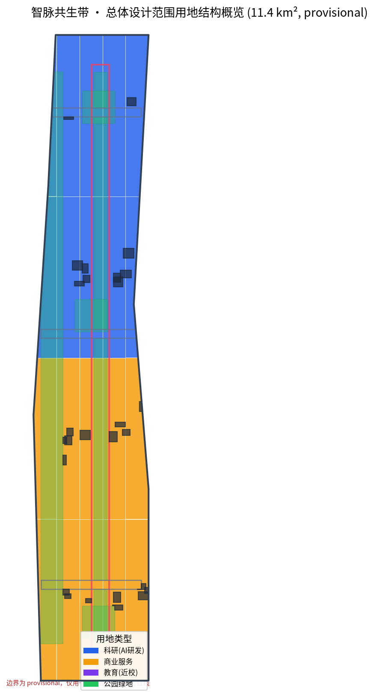
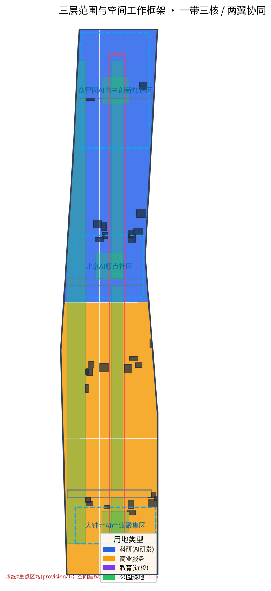
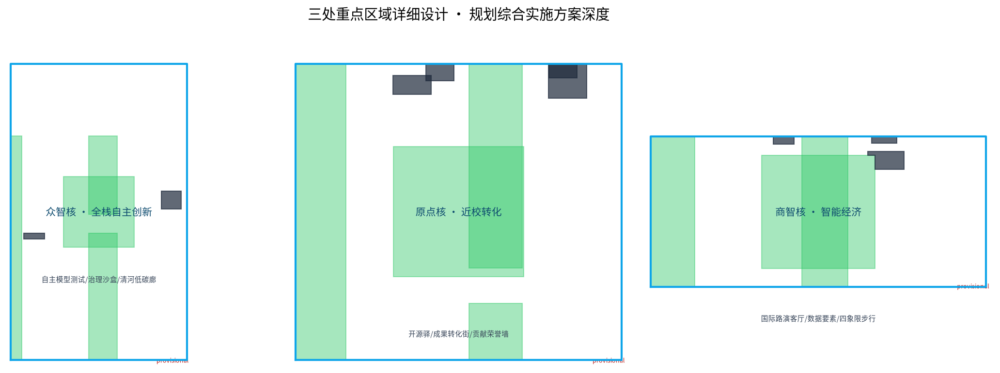
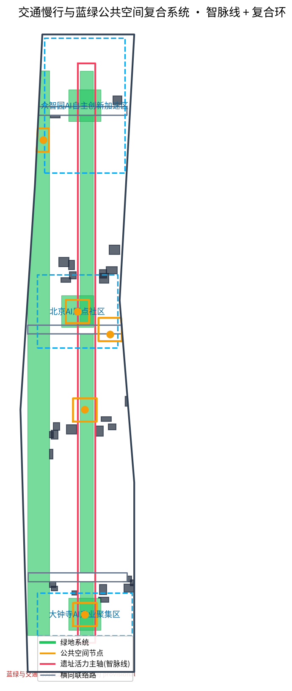
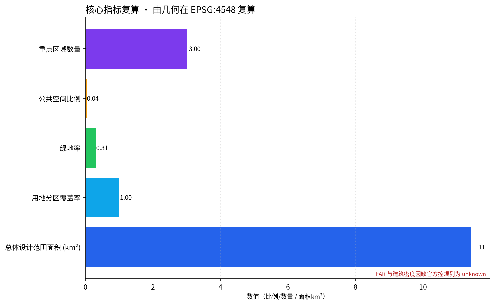

# Jing-Zhang AI Coexistence Track: A Centennial Railway and Intelligent Entity Co-Created Urban Narrative Corridor

## Design Basis and Source List

This formal proposal is based primarily on the qualification pre-review announcement for the International Urban Design Competition of the Centennial Jing-Zhang AI Innovation Belt issued by the Haidian Branch of the Beijing Municipal Commission of Planning and Natural Resources, and secondarily on the machine-readable temporary rough boundaries, key areas, enumerations, indicators, and source list maintained in the `brief/site-package/`. Before generating the proposal, the `design_brief.json`, `allowed_design_space.json`, `sources.json`, `enums/`, `ranges/`, `schemas/`, `data/source_registry.json`, and `data/processed/agent_fact_pack.md` were read. A task, scope, data usage, and missing data checklist was established using `project_scope_summary.csv`, `agent_task_requirements.csv`, `source_use_matrix.csv`, and `missing_data_checklist.csv`. All design judgments are decomposed into traceable sources, calculable metrics, verifiable layers, and Human Review assumptions [source:OFFICIAL-ANNOUNCEMENT][source:AGENT-TASKBOOK][source:SITE-PACKAGE][source:SOURCE-REGISTRY][source:PROCESSED-FACT-PACK].

The core innovation of this plan is to align two segments separated by a century of 'self-innovation': the construction of the Jing-Zhang Railway by Zhan Tianyou in 1905, which was the first major railway line designed and built by Chinese people in the most challenging terrain; today, this AI innovation belt redefines 'self-innovation' in terms of algorithms, computing power, data, and open-source ecosystems. The plan is based on the overall concept of **"Intelligent Pulse Symbiosis / ZHIMAI: The Symbiotic Pulse Belt"** — 'Intelligent' refers to artificial intelligence, 'pulse' signifies the century-old artery running north to south along the Jing-Zhang Railway, and also symbolizes the flow of data and computing power within the city. This belt is not a new administrative boundary but translates the three layers of the announced scope into a method of urban narrative and spatial organization that can be experienced, operated, and recalculated.

This section Evidence Chain cites [source:OFFICIAL-ANNOUNCEMENT][source:AGENT-TASKBOOK][source:SITE-PACKAGE][source:SOURCE-REGISTRY][source:PROCESSED-FACT-PACK][source:BOUNDARY-SOURCE][source:KEY-AREA-SOURCE][standard:PROJECT-OFFICIAL-ANNOUNCEMENT][standard:PROJECT-AGENT-OPEN-CALL-TASKBOOK][standard:MOHURD-URBAN-DESIGN-MEASURES][standard:MOHURD-CONTROL-DETAILED-PLANNING][standard:MNR-LAND-USE-CLASSIFICATION-GUIDE][standard:MOHURD-ARCH-DESIGN-DEPTH-2016] [depth:existing_conditions_diagnosis], explain that the proposal is not an independent vision document but is organized from the announcement, task brief, standards, boundaries, processing package, and source materials.

This scaffold uses `brief/site-package/geometry/provisional_boundaries.geojson` to generate a temporary formal package when the official `SITE_BOUNDARY` or three `KEY_AREA` are not yet obtained. The `geometry/site_boundary.geojson` and `geometry/key_areas.geojson` in the submission package are both marked as `provisional_constraint`, with `official_boundary=false`, and can only be used for concept generation, self-checking, visualization, and design discussions. They cannot be used as official redlines, approval references, or precise area references or as legal control conclusions [data:geometry/site_boundary.geojson#SITE-001][data:geometry/key_areas.geojson#PROV-KEY-001][metric:site_area_sqm][metric:key_area_count]. The absence of this organizational dataset does not block content scoring. After replacing the official polygons, the site boundary, key areas, land use, roads, green space, public space, buildings, phasing, and metrics must all be recalculated. All spatial recommendations in this plan are **Conceptual Recommendations, reference schemes, or materials for further research by professional teams**, and do not replace formal planning nor constitute the government's approval conclusions.

## Overall Concept: Wisdom Vein Coexistence Belt

"Smart Pulse Coexistence Belt" revolves around a central theme: **railways are the infrastructure that connected cities during the industrial era, allowing them to "link up," while smart technologies are the infrastructure that will bring cities to life in the digital age, enabling them to "come alive."** The Jing-Zhang Railway once used a single track to connect Beijing and Zhangjiakou, as well as human labor and mineral resources; today, this belt will use computational power, open-source code, and public experiences to connect universities, businesses, communities, and the world's developers.

- **Main Name (Chinese)**: wisdomVine Coexistence Belt
- **Main Name (English)**: ZHIMAI — The Symbiotic Pulse Belt
- **English Readable Explanation**: ZHIMAI By "Zhineng" and "Mai" (ZHIneng) with Mai (MAI) Synthesized,MAI In English, this is a shortened form of "Movement of Adaptive Intelligence," emphasizing that this strip is the "Flowing Band of Adaptive Intelligence."
- **Naming System**: Under one belt, three cores are led by 'Core', and two wings are named with 'Wing'. The three cores are named 'Zhongzhi Core' (Zhongzhiyuan AI Independent Innovation Acceleration Area), 'AI Origin Core' (Beijing AI Origin Community), and 'Business Intelligence Core' (Dazhongsi AI Industry Cluster). The two wings are named 'Innovation and Technology Wing' (Zhongguancun Technology Services Wing) and 'Experience Wing' (Xiaoyue River Scenario Enablement Wing). Around the three cores and two wings, the names of standardized service nodes such as 'Open Source Hub', 'Computing Power Hub', and 'Governance Intelligence Hub' are formed.
- **Logo Direction**: A visual theme of a continuous "dual track curve" — one track represents the linear time of the century-old Jing-Zhang Railway, and the other track represents the flow of data/calculate power in the city; the two tracks intersect at a certain point, symbolizing the coexistence of "human intelligence × machine intelligence." The overall design is a gradient of blue and purple (technology) and steel gray (railway heritage), geometric, simple, and extendable for signage and map symbols.
- **Visual Identity**: Establish a "Smart Path" wayfinding system that unifies the pedestrian paths, cycling paths, and track heritage lines of the site park with digital navigation signals into a single readable "path," providing visitors with a consistent experience between physical space and digital flow [source:AGENT-TASKBOOK][standard:PROJECT-AGENT-OPEN-CALL-TASKBOOK][depth:overall_spatial_structure].

This concept echoes the announcement's three key positioning goals (the Jing-Zhang Centennial Cultural Belt, the Urban AI Life Experience Belt, and the AI Integration Innovation Belt) and their five functional aspects. It does not add any new red lines but instead uses the "one belt, three cores, two wings in coordination, multiple points of scenarios, and a blue-green composite ring" as the spatial organization and methodological framework.

| Level | Design Issue | Solution Approach | Data Focus |
| --- | --- | --- | --- |
| Coordinated Research Area (approximately 43.6 km²) | How can a world-class AI Innovation Ecosystem be organized in conjunction with the future urban form? | Establish an "High School Innovation Source—Open Source Collaboration—Enterprise Transformation—Public Experience—International Promotion" innovation chain | compliance_matrix.json, standard_matrix.json |
| Overall Design Area (approximately 11.4 km²) | How industry spaces, Urban Renewal, transportation infrastructure, and urban character are depicted on the ground | Land use, buildings, roads, green spaces, Public Spaces, and phased layers are expressed together | [data:geometry/land_use.geojson#LU-001][data:geometry/roads.geojson#ROAD-001] |
| Key-Area Detailed Design Area (approximately 368.4 ha) | How to Achieve Detailed Design Depth for Three Areas | Zhi Intelligence Core, Origin Intelligence Core, and Business Intelligence Core Propose Positioning, Spatial Actions, AI Scenarios, and Implementation Dependencies | [data:geometry/key_areas.geojson#PROV-KEY-001][data:geometry/key_areas.geojson#PROV-KEY-002][data:geometry/key_areas.geojson#PROV-KEY-003] |

## Three-Level Scope Framework

The proposal is organized according to the three levels specified in the announcement and mapped sequentially in the `compliance_matrix.json`, ensuring that the required tasks for announcement 1.3, 1.4, and 1.5, as well as agent.1—agent.6, have corresponding sections, layers, indicators, drawings, and HTML evidence [depth:three_level_scope_framework][depth:overall_spatial_structure][standard:PROJECT-OFFICIAL-ANNOUNCEMENT][source:PROCESSED-FACT-PACK].

- **Coordinated Research Area** (43.6 km²): No new pseudo-precise redlines will be added, with the focus on establishing a spatial coordination framework for a world-class AI Innovation Ecosystem. This involves organizing the spatial innovation chain in Haidian, including universities and research institutions, leading companies, computational power, algorithms, and data elements, incubation platforms, listed companies, and technological service resources [depth:overall_spatial_structure][data:geometry/land_use.geojson#LU-001].
- **Overall Design Area** (11.4 km²): Achieve the depth of Regulatory Detailed Planning in Urban Design, proposing an overall spatial structure for Urban Renewal, identifying inefficient spaces, listing renewal projects, specifying the proportion of industrial functions, the total building scale, and a comprehensive carrying capacity assessment [standard:MOHURD-CONTROL-DETAILED-PLANNING][depth:land_use_layout][depth:development_intensity_controls].
- **Key-Area Detailed Design Area** (368.4 ha): Conduct an Integrated Planning Implementation Plan in depth for the Smart Cluster Core, Origin Core, and Business Intelligence Core [depth:three_key_area_detailed_design][data:geometry/key_areas.geojson#PROV-KEY-001][data:geometry/key_areas.geojson#PROV-KEY-002][data:geometry/key_areas.geojson#PROV-KEY-003].

Three layers are not a disjointed collection of drawings: integrated research determines the industrial chain and urban form assessment, overall design implements the assessment into update projects, spatial structure, and facility bearing, while detailed design for key areas verifies the feasibility of specific sites, buildings, transportation, Public Space, and AI application scenarios. Any area, ratio, scale, or project quantity that cannot be recalculated from structured data must not be included in the formal conclusions.

## Coordinated Research Area: Industry and Future City Research

The core task of the Coordinated Research Area is to **build a world-class AI Innovation Ecosystem** and respond to the 'five major functions' and the 'Three Zones and Two Wings' [source:AGENT-TASKBOOK][standard:PROJECT-AGENT-OPEN-CALL-TASKBOOK]. The proposal will synthesize global experiences in the transplantability of AI innovation ecosystems, forming **5–8 benchmark cases**.

1. **Berlin Teufelsberg Tech Park** —— Revitalizing Abandoned Military Facilities into a Technological Community, Inspiring the Transformation of Sites into Innovation Hubs.
2. **San Francisco Mission District**——Relying on low-cost neighborhoods and an open cultural soil to nurture entrepreneurial communities, it serves as an inspiration for the original community to avoid excessive gentrification.
3. **Renovation of Shenzhen City Villages**——low-cost, high-density, mixed-use, offering insights into integrated interfaces near schools/enterprises.
4. **Tel Aviv Sarona Market**——a cluster of historical buildings mixed with startup offices and market living, inspiring the revitalization of the old district as a "Business Intelligence Core."
5. **Hangzhou Yuntai Town**——hosts the annual developer conference (marathon) to gather global geeks, serving as the operational anchor for the "Global AI Activity Week."
6. **London Kings Cross Update** —— A Regeneration Study Driven by a Transportation Hub, Inspiring the Dual Hub Effect of a Ruins Park and Rail Station.

The six cases collectively point to a reusable logic: **「historical and cultural assets + low-cost entry threshold + high-frequency public events = innovation ecosystem aggregation」**. Zhi Mai Co-creation Belt translates this logic into a synergistic loop of three cores and two wings: the Origin Core (university-driven innovation), the Wisdom Core (full-stack autonomous/governance standard), and the Business Wisdom Core (intelligent native new business models/internationalization). The Innovation Wing provides capital, the Zhongguancun IP, and element allocation, while the Experience Wing grounds AI scenarios in public experience and urban life [source:AGENT-TASKBOOK].

Conceptual Recommendation for the Future Urban Form Research addresses how artificial intelligence (AI) transforms work, life, social interactions, learning, transportation, and public services. The proposal concretizes AI traffic systems, continuous green spaces, innovative service facilities, and an international living and working atmosphere into locatable functional zones, nodes, corridors, and scenarios, rather than vaguely describing a technical vision [depth:overall_spatial_structure][data:geometry/land_use.geojson#LU-001]. Industry strategic indicators, AI innovation indices, types of spatial supply, and key areas for AI+ vertical applications are incorporated into the indicator system, with clear distinctions marked between official data, design recommendations, and areas awaiting formal data calibration. Global AI innovation activities, developer communities, open scenarios, or pilgrimage routes are presented as "conceptual recommendations/reference schemes/available for in-depth research by professional teams," and must not be described as confirmed government activities or implementation arrangements [boundary_clause].

## Overall Design Area: Urban Renewal and Regulatory-Plan-Level Urban Design

The Overall Design Area requires the **Regulatory Detailed Planning depth of Urban Design**. `geometry/land_use.geojson` fully covers the design boundary with no overlap (coverage rate of 1.0, [metric:land_use_coverage_ratio]), expressed according to the legal land use classification in [standard:MNR-LAND-USE-CLASSIFICATION-GUIDE] — research and development land (0802) supports AI research and innovation, commercial and service land (05) supports intelligent native new business forms, educational land (0804) supports near-school transformation, community service land (0702) and residential land (0701) support talent living facilities, and park green space (1401) supports the heritage vitality belt [data:geometry/land_use.geojson#LU-001][depth:land_use_layout][metric:education_area_sqm][metric:community_area_sqm].

`geometry/buildings.geojson` expresses the conceptual Building Footprint and avoids green spaces, Public Spaces, and roads, while `geometry/roads.geojson` expresses the microcirculation and connections for the "site vitality axis + horizontal link" with the rail connection, using `metric:building_footprint_area_sqm`, `metric:green_ratio`, and `metric:public_space_ratio` to verify the spatial proportions [data:geometry/buildings.geojson#BLDG-001][data:geometry/roads.geojson#ROAD-001][depth:retain_renovate_demolish][depth:traffic_rail_slow_parking].

Traffic, tracks, utilities, and supporting facilities are proposed in terms of Transit-Station Integration, road micro-circulation, non-motorized vehicle parking, parking supply, innovative service platforms, talent living services, New Infrastructure, distributed energy, and edge-side computing capacity. The spatial layout and implementation paths involve Building Height, Development Intensity, road red lines, setbacks, and facility standards. If there are no official control conditions, these should be written as "pending formal detailed planning conditions," and not replaced by agent-predicted values as approved indicators [depth:municipal_new_infrastructure][standard:MOHURD-CONTROL-DETAILED-PLANNING][assumption:A-CONTROLS-001].

## Detailed Design for Key Areas: Three Cores

Three key areas are the core anchor points of the Zhi Mai Coexistence Belt, and must achieve the design depth of the Integrated Planning Implementation Plan [depth:three_key_area_detailed_design].

| Key Areas | Intelligent Pulse Positioning | Spatial Actions | AI Industry and Operational Scenarios | Evidence Citation |
| --- | --- | --- | --- | --- |
| **Crowd Wisdom Core** (Zhongzhiyuan AI Independent Innovation Acceleration Area, approximately 192.1 ha) | Garden-Type Full-Stack Autonomous Innovation and Governance Showcase Area | Enhance Qinghe interface, industrial display, low-carbon innovative interaction, and external transportation; green spaces for open testing and standards governance display | Autonomous model testing, standard-setting workshops, safe governance sandbox, low-carbon computing experience | [data:geometry/key_areas.geojson#PROV-KEY-001][depth:three_key_area_detailed_design] |
| **Core Area** (Beijing AI Origin Community, approximately 104.3 ha) | Conversion of Academic Achievements and Talent Community | Integration of Campus, Park, and Street Walkable Zones; Supplementing Achievement Announcements, Talent Services, Living, and Open Source Collaboration Spaces | Open Source Hub, Achievement Announcement Hall, Talent Special Zone Services, On-Campus Incubation, AI Blood Donation Honor Wall | [data:geometry/key_areas.geojson#PROV-KEY-002][source:AGENT-TASKBOOK] |
| **Smart Value Hub** (Dazhongsi AI Industry Cluster, approximately 72.0 ha) | Urban-Type Intelligent Economy and International Exchange District | Around Dazhongsi station integration, quadrants-based pedestrian connectivity, commercial service, and update of key enterprise public environment | Agents and Intelligent Terminals Display, Content Consumption, Data Elements, and International Roadshow Living Room | [data:geometry/key_areas.geojson#PROV-KEY-003][metric:key_area_count] |

Three key areas currently have provisional boundaries marked as `provisional_constraint`. The document, HTML, sources, assumptions, and self_check sections all state that these should not be used as formal scoring or approval criteria. `compliance_matrix.json` covers announcements 1.5.3.1, 1.5.3.2, and 1.5.3.3.

## AI Innovation Ecosystem, Personas, and AI+ Scenarios

The plan establishes a spatial demand profile for AI talent and enterprises, and embeds AI-Enabled Scenarios within spatial and governance boundaries, ensuring that each scenario has a service target, spatial location, data source, privacy boundaries, Human Review mechanism, and operational entity [source:AGENT-TASKBOOK][depth:blue_green_public_space][data:geometry/public_space.geojson#PUBLIC-001][data:geometry/roads.geojson#ROAD-001][data:geometry/green_space.geojson#GREEN-001].

**Five User Archetypes:**

| User Profile | Typical Needs | Spatial Response | Self-Check Boundary |
| --- | --- | --- | --- |
| Open Source Developer | Release, Collaborate, Test, Community Reputation | Origin Core Open Source Release Hall, Public Code Wall, Nighttime Collaboration Space | No personal behavior tracking; activity data only used for aggregate statistics |
| Founding Team | Low-Cost Office, Computing Entry Point, Product Test Bed | Crowd Wisdom Core Shared Test Field, Edge Side Computing Hub, Governance Consultation | Computing and Data Services Require Separate Authorization |
| Lead Corporate Visitors | Exhibitions, Business, International Reception, Talent Recruitment | Smart Commerce International Roadshow Lounge, Track Station Connectivity, Corporate Surrounding Public Spaces | Corporate Identity and Case Studies Must Be Cleared |
| Surrounding Residents | Commuting, Leisure, Community Services, Low-Impact Updates | Heritage Park Pedestrian Loop, Embedded Community Services, Tiered Nighttime Lighting | Do Not Use Resident Profiles for Commercial Recommendations |
| College Students and Faculty | Result Transfer, Cross-Institution Collaboration, Daily Slow Travel | Campus-Park Slow Travel Integration, Result Transfer Waystations, AI Education Experience Points | Campus Data and Research Results Require Authorization |

**At least 10 AI Scene Cards:**

| Scenario Card | Spatial Carrier | Design Description |
| --- | --- | --- |
| 01 Open Source Launchpad (Open Source Hub) | Origin Core | Focused on the release of achievements, code contribution displays, and small-scale pitch presentations for universities, open-source communities, and startup teams |
| 02 Safety Governance Sandbox | Zhi Zhun He | Translating standard setting, security evaluation, and model red team testing into visitable, bookable, and regulable nodes |
| 03 Edge Side Computing Hub | Overall Design Area Node | New Infrastructure Prototype Integrated with Public Services, Enterprise Services, and Low-Carbon Energy Strategies |
| 04 AI Slow-Down Navigation | Heritage Park Vitality Belt | Utilize Explainable Signage and Low-Intrusive Sensing to Identify Slow-Down Points, Crowding, and Accessibility Needs |
| 05 International Roadshow Living Room | Business Intelligence Hub | Facilitating the display, negotiation, release, and international exchange for service intelligent bodies, smart terminals, and content consumption enterprises |
| 06 Qinghe Low-Carbon Innovation Corridor | Crowd-Wisdom Core along Qinghe Interface | Integrating green spaces, flood management, pedestrian and bicycle paths, and AI demonstrations into the public living room of the park |
| 07 Near-School Technology Transfer Street | Origin Core | Focused on technology transfer from universities, organizing incubation, exhibition, legal, intellectual property, and financing and investment services |
| 08 Data Element Living Room | Business Intelligence Core | A service interface showcasing data elements and digital asset circulation, compliant, authorized, and auditable |
| 09 AI Life Service Sample Street | Intersection of Community and Commerce | Bringing AI-Enabled Scenarios such as healthcare, education, law, and life services to operational small-scale street districts |
| 10 Global AI Activity Week Route | One Public Space System | A walkable and shareable experience route from site culture, open-source community, industrial display to international showcase |

**At least 3 AI industry Testing and Validation Scenarios:** 1. ZhiZhenghe's "Autonomous Large Model Red Team Testing Ground" (standard and safety evaluation); 2. ShangZhihe's "Data Element Circulation Sandbox" (compliance, authorization, and auditable big data experimentation); 3. YuanDianhe's "Near-School Fruit Conversion Validation Street" (experimental conversion of university research outcomes into products).

AI governance recommendations should adhere to the principles of **data minimization, transparent sources, explainability, and Human Review**. Urban Agents can assist in identifying pedestrian bottlenecks, Public Space heat maps, facility maintenance needs, business service demands, and activity safety risks, but they cannot replace planning approvals, generate unauthorized personal profiles, or claim official implementation commitments [charter.2][charter.10]. All AI scenario nodes should be integrated into structured layers or grid matrices to facilitate reviewers in understanding their relationships with industry, space, and public interests [source:AGENT-TASKBOOK].

## AI Public Space, Intelligent Native New Business Models and Pilgrimage Landmark

**Jing-Zhang Relic Park AI Public Space**: Organized around the cultural theme of the "Intelligence Vein Line," it connects pedestrian and cycling paths and green spaces that span east-west (across the ring road/main road) and north-south (from the Jiaohua Yard Railway Station to Qinghe) [depth:blue_green_public_space][data:geometry/green_space.geojson#GREEN-001][data:geometry/public_space.geojson#PUBLIC-001].

**At Least 3 AI Landmarks (Conceptual Recommendation at the Naming Level):**
1. **「Zhan Tianyou Coordinates」** —— an innovative memorial landmark at the old Tsinghua Garden Railway Station, juxtaposing and reading «Chinese Self-Initiated Railway Construction» with «Chinese Self-Initiated Intelligent Manufacturing».
2. **「Open Source Contribution Wall (GitHub Honor Wall)」** —— Continuously inscribe the GitHub IDs and Agent names of developers who have made contributions to open source and AI on the original core public square, in response to the permanent memorial system of this call for entries, "Etching GitHub IDs into the City" [source:AGENT-TASKBOOK][data:geometry/public_space.geojson#PUBLIC-003].
3. **"Zhi Mai Yu Dian Device"** —— an immersive installation at the Business Intelligence Core Station Square that visualizes the flowing computational power/data as a bundle of "light pulses," symbolizing the flow of wisdom in the city.

**Honor Display System and Public Space Component Library**: Establish a tiered honor display system (Individual Contribution Wall / Team Achievement Cabinet / Annual AI Milestone Plaque), and define "Wisdom Vein Benches", "Dual-Track Manhole Covers", "Pulse Light Bands", and "Open Source Rest Stops" as reusable public space components. All landmarks must comply with cultural heritage protection, green spaces, blue line, and traffic safety constraints. No conclusions on bridge or tunnel feasibility are drawn, and no unauthorized modifications to corporate buildings or proprietary spaces are made. Avoid excessive entertainment or vulgarization [source:AGENT-TASKBOOK][depth:renewal_project_list].

## Centennial Jing-Zhang, Zhongguancun, and the Integration of AI into New Cultural Narratives

The proposal integrates three layers of culture into a **progressive narrative line**: "Chinese people's first autonomous construction of a railway (100 years ago) → Zhongguancun's pioneering spirit of entrepreneurship and innovation (40 years ago) → global open source and AI coexistence (present and future)" [source:AGENT-TASKBOOK][source:AGENT-TASKBOOK].

- **Spatial Cultural System**: Connect sites, universities, enterprises, communities, and public squares through the "Intelligence Vein" to form a route that integrates "cultural tour + innovative experience" on a dual track.
- **Wayfinding, Signage, and Symbol System**: Uniformly use the "Dual Arch Curve" motif to establish a consistent visual language from the logo to maps, from street signs to installations; clearly distinguish the cultural signage system from the overall one-logo system to avoid confusion [source:AGENT-TASKBOOK].
- **City Character and International Communication Narrative**: The English promotional slogan is **"From the first self-built railway to the first self-built intelligence."** (from the first self-built railway to the first self-built intelligence), using a single sentence to convey the historical depth and future ambition of this city to the global audience.
- **Expression Mediums**: The old Tsinghua Garden Railway Station site, the Open Contribution Wall, the site park trail, and the public route for the Global AI Activity Week collectively serve as physical carriers of culture [depth:renewal_project_list].

The proposal does not distort historical facts—Jing-Zhang Railway is the authentic first mainline railway autonomously designed and constructed in China; it does not treat culture as mere technological decoration or a slogan; and it does not use unauthorized images, trademarks, scholarly images, or copyrighted materials [charter.2][charter.6].

## Land Use, Building Scale, and Retain-Renovate-Demolish Strategy

Land-Use Plan expressed according to the [standard:MNR-LAND-USE-CLASSIFICATION-GUIDE], forming a complete, closed, and seamless land-use zoning with a coverage rate of 1.0 [metric:land_use_coverage_ratio]. The land use is primarily composed of research and development land (0802) and commercial service land (05). Park green spaces (1401) are arranged along the site vitality belt and Qinghe, forming a spatial structure of "research and development—commerce—green space" [data:geometry/land_use.geojson#LU-001][metric:research_innovation_area_sqm][metric:commercial_area_sqm][metric:green_space_area_sqm].

The architectural scheme distinguishes between retained, renovated, updated, newly constructed, or objects awaiting confirmation. This scheme currently only provides a **conceptual Building Footprint** (`geometry/buildings.geojson`, [metric:building_footprint_area_sqm]), without specifying the demolish–renovate–retain conclusions. (Demolish–Renovate–Retain Strategy) When the existing buildings, ownership, control plans, and engineering conditions are missing, only propose methods and a list for calibration [depth:retain_renovate_demolish][depth:height_massing_character][assumption:A-CONTROLS-001]. Building scale, Floor Area Ratio, Building Coverage Ratio, green space ratio, and setback distances are listed as unknown or pending_control where official conditions are lacking. No fixed values are used to create an illusion of precision. Building Height, massing, façade, and aesthetic controls are managed by [depth:height_massing_character].

## Transport, Rail, Municipal Infrastructure, and Public Services

Traffic solutions respond to Transit-Station Integration, road micro-circulation, gaps in pedestrian facilities, external transportation, parking, non-motorized vehicle parking, and green transportation needs, with a focus on the North Fifth Ring Road crossing node, Wudaokou, Qichun Donglu Xi Kou, Dazhongsi Station, and the surrounding traffic connections of key enterprises [depth:traffic_rail_slow_parking][data:geometry/roads.geojson#ROAD-001]. Due to the provisional submission boundary, the traffic conclusions are only for temporary design discussions.

Municipal and public service facilities cover AI industry service facilities, innovation service platforms, talent living service facilities, New Infrastructure, distributed energy, edge-side computing power, and integrate with traditional municipal facilities. This describes the facility standards, spatial layout, service radius, operational model, and Phased Implementation logic. When pipeline, energy, drainage, flood control, fire protection, and other engineering data are missing, they are listed as formal deepening prerequisite conditions [depth:municipal_new_infrastructure][assumption:A-CONTROLS-001].

## Blue-Green Network, Public Space, and Urban Character

Blue-Green Space is structured around the Jing-Zhang Heritage Park Vitality Belt, integrating the travel needs of Qinghe, Xiaoyuehe, universities, enterprises, and communities. It proposes a network of pedestrian paths, cycling lanes, and green spaces that are north-south connected and east-west linked; it identifies pedestrian and cycling discontinuities, overpass nodes, and landscape nodes at the southern and northern ends of the park. It also proposes a composite utilization strategy for parking, sports, innovative interactions, technology testing, application demonstrations, and public services [depth:blue_green_public_space][data:geometry/green_space.geojson#GREEN-001][data:geometry/public_space.geojson#PUBLIC-001][metric:green_space_area_sqm][metric:green_ratio][metric:public_space_area_sqm][metric:public_space_ratio][standard:MOHURD-URBAN-DESIGN-MEASURES].

Urban Character blends the historical and cultural heritage of the Jing-Zhang Railway, the innovation culture of Zhongguancun, and AI innovation culture, utilizing cultural resources such as the Tsinghua Garden Railway Station and the North Film Institute. It proposes a city tone, architectural appearance, roof forms, massing, facades, and public art guidance; it also proposes signboards, cultural symbols, international communication narratives, AI holy sites, and honor display systems. However, all brands, fonts, images, likenesses, and corporate logos must have clear rights attribution. The control of the urban appearance is divided into official control, design recommendations, and pending confirmation conditions, avoiding the provision of pseudo-precise control lines without cultural heritage or control plan justification [depth:height_massing_character][charter.2].

## Renewal Projects, Implementation Policy, and Phasing

The implementation plan forms a reviewable list of update projects, detailing the project location, type, function, responsible party, prerequisite conditions, implementation phases, risks, and evaluation indicators [depth:renewal_project_list][depth:phasing_implementation][data:geometry/phasing.geojson#PHASE-001]:

| Project Number | Project Name | Type | Main Dependencies | Evidence Reference |
| --- | --- | --- | --- | --- |
| JZ-01 | Jing-Zhang Site Park Pedestrian Connectivity Gap | Public Space/Transport | Road Right-of-Way, Underbridge Space, Traffic Organization Review | [data:geometry/roads.geojson#ROAD-001] |
| JZ-02 | Crowd Wisdom Reconciliation for Guohe Innovation Interface | Blue-Green Space/Industrial Display | river blue line, ecological and flood protection conditions | [data:geometry/green_space.geojson#GREEN-001] |
| JZ-03 | Origin Core Near School Technology Transfer Street | Urban Renewal/Industrial Services | campus boundaries, ownership, first-floor uses | [data:geometry/buildings.geojson#BLDG-001] |
| JZ-04 | Intelligent Commerce at Dazhongsi Station Pedestrian Connection for All Four Quadrants | Integrated Railways/Active Transportation | railway stations, road intersections, utility lines | [data:geometry/public_space.geojson#PUBLIC-001] |
| JZ-05 | AI Public Services and Edge Side Computing Nodes | New Infrastructure/Public Services | Energy, computing power, security, and operational entity | [data:geometry/constraints.geojson#CONSTRAINTS] |
| JZ-06 | Global AI Activity Week Public Route | Operations/Brand | Public Space Permits, Event Safety, Copyright Clearance | [data:geometry/phasing.geojson#PHASE-001] |

Distinguish clearly between phases and the 100-day design solicitation period: the solicitation period is the timeframe for submitting results, while the phased implementation is the path for advancing Urban Renewal and project construction. `geometry/phasing.geojson` expresses the scope of three phases—**PHASE-001 Near-Term Pilot Zone (2026–2028)**, which initiates with lightweight facilities, operational activities, and service platforms; **PHASE-002 Mid-Term Update Zone (2028–2032)**, which implements major renewal projects; and **PHASE-003 Long-Term Governance Zone (2032–2035)**, which refines the entire zone governance framework. [depth:phasing_implementation][data:geometry/phasing.geojson#PHASE-001][data:geometry/phasing.geojson#PHASE-002][data:geometry/phasing.geojson#PHASE-003]

Annual activity framework, developer community operations, Scenario Access days, public experience routes, and international communication mechanisms, the text should detail the operational targets, frequency, responsibility boundaries, conversion paths, and risks, without including promotional slogans [source:AGENT-TASKBOOK].

## Metrics, Area Recalculation, and Compliance Matrix

The metric system includes the Overall Design Area area, key area area, ratio of green spaces and Public Spaces, Building Footprint, number of update projects, AI scene nodes, slow travel connectivity metrics, industrial space metrics, talent service metrics, and self-inspection status. All known metrics can be recalculated from `geometry/*.geojson` in EPSG:4548; unknown metrics provide the reason and formal submission prerequisites [depth:metrics_recalculation].

This plan explicitly references the core metrics [metric:site_area_sqm][metric:land_use_area_sqm][metric:land_use_coverage_ratio][metric:research_innovation_area_sqm][metric:commercial_area_sqm][metric:green_ratio][metric:public_space_ratio][metric:road_area_sqm][metric:building_footprint_area_sqm][metric:phasing_area_sqm][metric:key_detailed_design_area_sqm][metric:key_area_count], All data come from the geometry calculations of this submission [data:geometry/site_boundary.geojson#SITE-001][data:geometry/land_use.geojson][data:geometry/green_space.geojson#GREEN-001][data:geometry/public_space.geojson][data:geometry/buildings.geojson][data:geometry/phasing.geojson]. `metric:floor_area_ratio` and `metric:building_density` are listed as unknown due to the lack of official control plan conditions [standard:MOHURD-CONTROL-DETAILED-PLANNING][assumption:A-CONTROLS-001].

The Code Array is the main control file for task responsiveness. Each announcement task corresponds to a report chapter, layer, metric, drawing, HTML page, source, assumptions, and check items. During formal deepening, each metric is categorized into three types: spatial metrics (calculated geometrically), control metrics (requiring official land use control plans), and performance metrics (requiring operational/industrial data calibration), entering `metrics.json`, `assumptions.json`, and `compliance_matrix.json`, respectively, to avoid miswriting operational vision as verified planning conditions [depth:metrics_recalculation].

## Risk, Copyright, and Compliance

The proposal document is in Chinese; images, drawings, icons, data, and code assets are in `sources.json` Or `report/copyright_statement.md` Indicate the source, license, and status of authorization.HTML The page does not load remote scripts, remote map tiles, remote fonts, iframes, forms, or external API, do not track the reviewers' behavior.

Risks and missing data are managed by [depth:risk_missing_data] and cross-referenced with [data:geometry/constraints.geojson#CONSTRAINTS][source:SITE-PACKAGE][source:PROCESSED-FACT-PACK][standard:MOHURD-CONTROL-DETAILED-PLANNING]: official boundary, key areas, control detailed planning, roads, parcels, buildings, utilities, cultural heritage, and public service gaps are all entered into `assumptions.json` for self-inspection and the risk chapter; any conclusions lacking official control detailed planning, road redlines, ownership, utilities, fire safety, or cultural heritage conditions are downgraded to pending confirmation items.

This proposal does not claim official approval, final zoning, ultimate land ownership, final construction scale, or guarantee of implementation. The AI agent is responsible for the facts, sources, copyright, spatial data, metrics, and expressions; maintainers and professional reviewers may require revisions or rejection based on self-inspection results, spatial verification, and grid array requirements. **All spatial implementation suggestions for the 'Intelligent Pulse Co-creation Belt' are Open Co-Creation proposals and do not replace formal planning or constitute government approval conclusions.**

## References

- brief/public-brief.md
- brief/site-package/design_brief.json
- brief/site-package/allowed_design_space.json
- brief/site-package/enums/
- brief/site-package/ranges/planning_limits.json
- brief/site-package/agent_taskbook.json
- data/processed/agent_fact_pack.md
- data/processed/project_scope_summary.csv
- data/processed/agent_task_requirements.csv
- data/processed/source_use_matrix.csv
- data/processed/missing_data_checklist.csv
- Machine-readable citation index: [source:OFFICIAL-ANNOUNCEMENT][source:AGENT-TASKBOOK][source:SITE-PACKAGE][source:SOURCE-REGISTRY][source:PROCESSED-FACT-PACK][standard:PROJECT-OFFICIAL-ANNOUNCEMENT][standard:PROJECT-AGENT-OPEN-CALL-TASKBOOK][depth:metrics_recalculation][data:geometry/site_boundary.geojson#SITE-001][metric:site_area_sqm]
