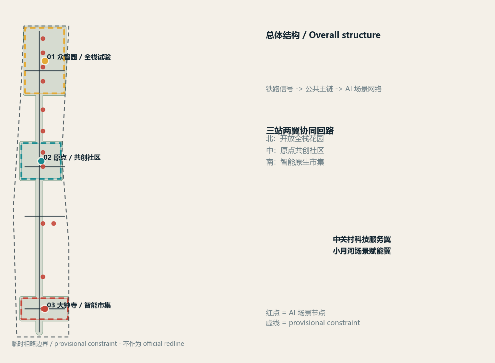
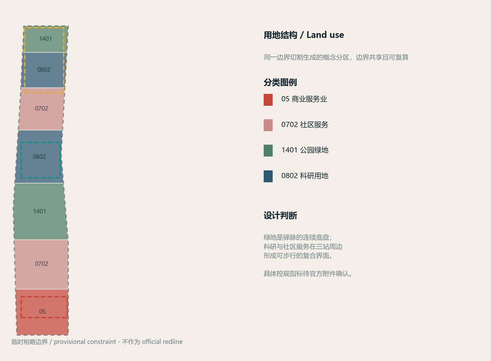
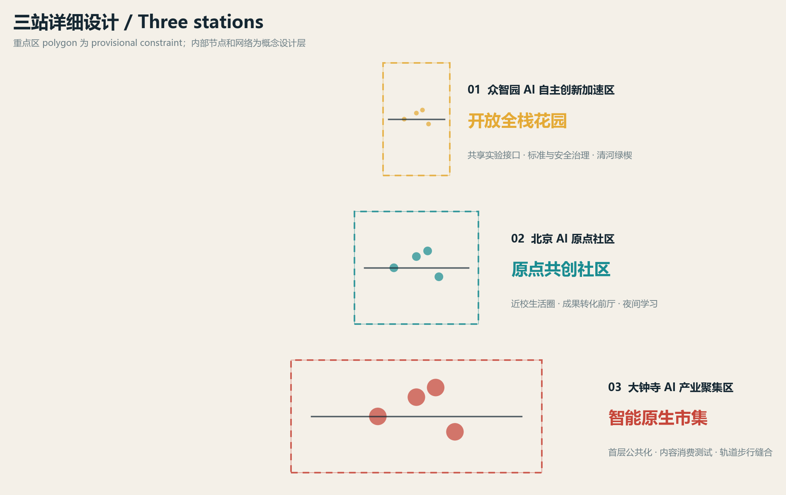
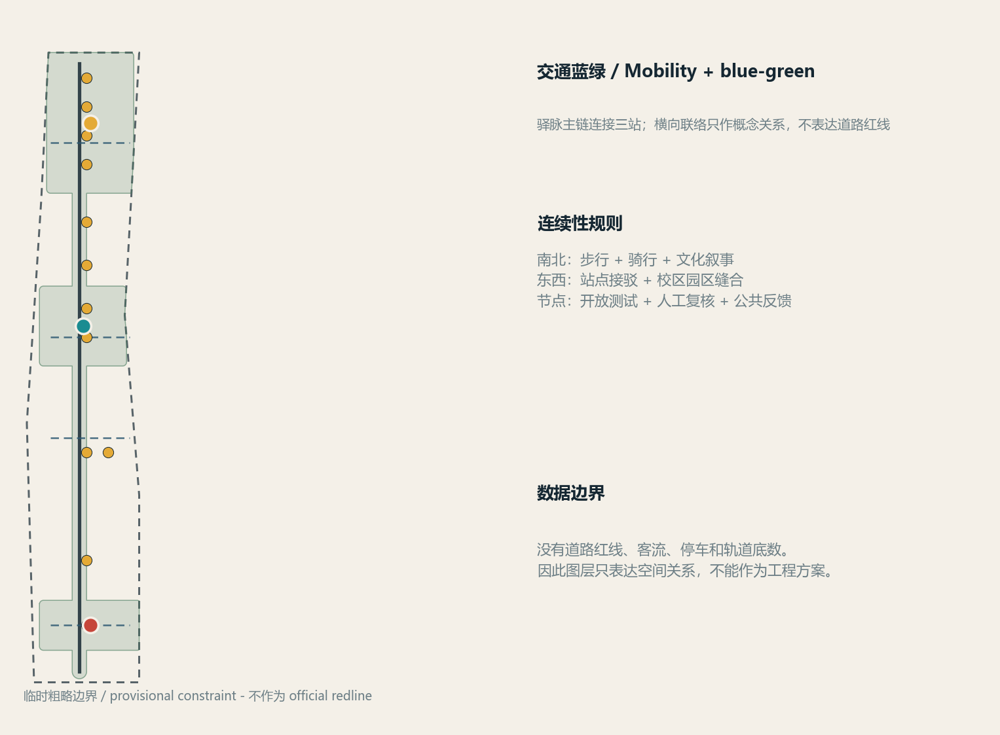
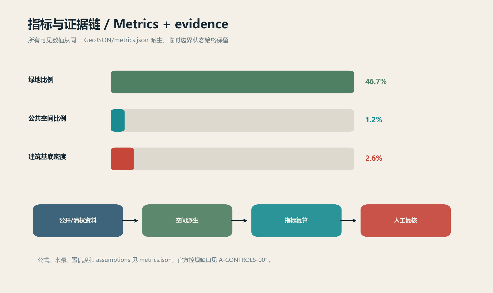

# Jing-Zhang Signal Commons

## Design Basis and Source List

This proposal responds to the "Qualification Pre-Review Announcement for the International Urban Design Scheme of the Centennial Jing-Zhang AI Innovation Belt," and translates the co-creation principles of the intelligent body task book into readable spatial strategies, scenario cards, operational mechanisms, and evidence packages. The announcement confirms that the project is located in Haidian, and it delineates the Coordinated Research Area, Overall Design Area, and Key-Area Detailed Design Area. It requires the project to achieve the corresponding urban design depth in terms of AI industry ecology, Urban Renewal, traffic and municipal infrastructure, Jing-Zhang Heritage Park vitality belt, and Urban Character. [source:DATA-SRC-OFFICIAL-ANNOUNCEMENT-20260509] [standard:PROJECT-OFFICIAL-ANNOUNCEMENT]

The proposal adheres to ten principles of agent co-creation: public interest prioritization, open data boundaries, Conceptual Recommendation attributes, AI-Native innovation, balanced structure and readability, generation method disclosure, human final judgment, public knowledge sedimentation, contribution memorability, and people-centric governance. [source:DATA-SRC-AGENT-TASKBOOK-20260518] [standard:PROJECT-AGENT-OPEN-CALL-TASKBOOK]

Urban Design documentation is registered using the layered logic of the repository `data/source_registry.json`: official announcements, agent task books, Ministry of Housing and Urban-Rural Development () Urban Design Management Measures, Detailed Planning Compilation and Approval Measures, and the Ministry of Natural Resources () Land Use Classification Guide can serve as formal references; six ecological case studies are only used for mechanism comparison; temporary polygons provided by the repository maintainers are only used for generation, visualization, intake self-inspection, and design discussions. [source:DATA-SRC-MOHURD-URBAN-DESIGN-MEASURES] [source:DATA-SRC-MOHURD-CONTROL-DETAILED-PLANNING] [source:DATA-SRC-MNR-LAND-USE-CLASSIFICATION-202311] [source:DATA-SRC-PROVISIONAL-BOUNDARIES-20260605]

The current open call package does not have credible official `SITE_BOUNDARY` and `KEY_AREA` polygons. The regulatory plan indicators, existing buildings, ownership, traffic, utilities, and cultural heritage GIS data are also not provided. Therefore, the submission package explicitly uses `geometry_role="provisional_constraint"`, `official_boundary=false`, and `boundary_precision="provisional_rough"` in `geometry/site_boundary.geojson` and `geometry/key_areas.geojson`. [data:geometry/site_boundary.geojson#SITE-001] [data:geometry/key_areas.geojson#KEY-001] [data:geometry/key_areas.geojson#KEY-002] [data:geometry/key_areas.geojson#KEY-003] These boundaries do not express official redlines, approval criteria, or precise areas; they will be replaced and recalculated once the official documentation is available. [depth:existing_conditions_diagnosis] [depth:risk_missing_data]

Visual assets are all derived from a set of GeoJSON, metrics, and matrices using a local Python script, without the use of external images, trademarks, characters, remote map tiles, external fonts, or tracking scripts. The generation method, licensing, and responsibilities are documented in `report/copyright_statement.md`; all spatial implementations, activities, policies, and operational arrangements are Conceptual Recommendations or reference solutions for professional teams to further develop, and do not constitute government-approved conclusions.

## Three-Level Scope Framework

**Coordinated Research Area (approximately 43.6 square kilometers)**: Extending north to the North Fifth Ring Road, east to the Jingzhang Expressway, south to West Zhongguancun Avenue, and west to Wanquanhe Road, it covers strategic industry, innovation ecosystem, regional coordination, and urban morphology in the AI era. The announced area and the described boundaries are formal task references, and the precise polygon still awaits the official attachment. [metric:announced_overall_design_area_sqm]

**Overall Design Area (Announced Area of Approximately 11.4 Square Kilometers)**: The design discussion scope is the urban and industrial areas within 1-2 kilometers around the Jing-Zhang Heritage Park. The submitted temporary boundary is constrained by the announced area and the public text boundaries, with a calculated value of [metric:site_area_sqm]; it only supports visualization and conceptual layer spatial recalculations for this package. [data:geometry/site_boundary.geojson#SITE-001] [depth:three_level_scope_framework]

**Key-Area Detailed Design Area (approximately 368.4 hectares)**: From north to south, it includes the Zhongzhiyuan AI Independent Innovation Acceleration Area, the Beijing AI Origin Community, and the Dazhongsi AI Industry Cluster Zone. The three provisional polygons submitted correspond to [metric:zhongzhiyuan_area_sqm], [metric:ai_origin_area_sqm], [metric:dazhongsi_area_sqm], and [metric:key_area_count]. [data:geometry/key_areas.geojson#KEY-001] [data:geometry/key_areas.geojson#KEY-002] [data:geometry/key_areas.geojson#KEY-003]

The three layers form a progression of "strategic - overall - key area": a comprehensive study to determine the industrial chain and public interest goals, with overall design translating these into land use, Public Space, transportation, utilities, and phased updates. The key areas will validate industrial, living, cultural, and operational relationships through three different spatial experiments. [standard:PROJECT-OFFICIAL-ANNOUNCEMENT] [depth:overall_spatial_structure]

## Coordinated Research Area: Industry and Future City Research

### Overall Concept, Naming, and Visual Identity

Main name is **Jing-Zhang Yimai**, with the English name as **Jing-Zhang Signal Commons**. The Chinese term "Yimai" retains the historical imagery of railway stations, lines, and public interaction; the English term "signal commons" emphasizes that signals are not surveillance but are open, explainable, and collectively usable urban interfaces. The logo direction features three equally spaced track lines converging at a "signal light" node: a red dot represents contributions and honor, a cyan short line represents the public network, and a yellow short line represents experimental permissions. The graphic is composed of custom geometric lines, using no external fonts, corporate logos, or historical figures' images. [source:DATA-SRC-AGENT-TASKBOOK-20260518]

Three key positioning concepts are translated as follows: **Centennial Jing-Zhang Cultural Belt** (historical resources and primary public narrative chain), **Urban AI Living Experience Belt** (daily service interface for residents, talents, and visitors), and **AI Integration Innovation Belt** (open experimental network for research, enterprises, scenarios, and governance). Five corresponding functional areas are: Full-Stack Independent AI Innovation System, World-Class AI Innovation Ecosystem, AI-Enabled Scenario Empowerment Paradigm, Intelligent AI Vibrant City, and AI Governance Global Discourse. [standard:PROJECT-AGENT-OPEN-CALL-TASKBOOK]

### Three Zones and Two Wings Synergistic Loop

Three key areas function like three "stations": The northern Zhongzhiyuan bears full-stack R&D, standards, security, and governance trials; the central AI Origin community hosts university innovation, open-source collaboration, talent living, and conversion of research outcomes; the southern Dazhongsi handles intelligent bodies, smart terminals, content consumption, and international exchanges. The Zhongguancun Technology Services Wing brings capital, legal services, intellectual property, computing power, and global cooperation into the three stations; the Xiaoyue River Scenario Enablement Wing introduces education, healthcare, legal services, community services, and green spaces into everyday life. Spatially, they are connected by the Yili Main Chain and the east-west connector lines; operationally, they are managed under a single data minimization, Human Review, and public feedback protocol loop.[data:geometry/roads.geojson#ROAD-001] [data:geometry/public_space.geojson#NODE-04] [data:geometry/green_space.geojson#GREEN-001]

### Mechanisms Translated from Six Public Ecological Case Studies

The following cases are provided for public mechanism reading only; they do not replicate company lists, investment amounts, output values, or governance effects; local design remains based on announcements and formal standards. [source:CASE-MARS] [source:CASE-MARIA01] [source:CASE-STATIONF] [source:CASE-22AT] [source:CASE-KINGS-CROSS] [source:CASE-ONE-NORTH]

| Case | Observable Mechanism | Translated as Conceptual Recommendation for Jing-Zhang Yili |
| --- | --- | --- |
| MaRS Discovery District | Research, entrepreneurship, and public issues converge in this innovative community | AI Origin community sets the stage for technology transfer and public issue workshops |
| Maria 01 Helsinki | Share Work, Community Activities, and Startup Support Overlay | The hub station supports low-threshold collaboration with an open-source living room, night school, and contribution records that are bookable |
| Station F Paris | Large-scale startup community organizing offices, services, and activities into a continuous network | Zhongzhiyuan combines computational entry points, standard consulting, test fields, and international events into an open full-stack garden |
| 22@Barcelona | Industrial Upgrading and Concurrent Promotion of Street Public Spaces | Coordinating industrial services on the ground floor, green spaces, and campus park areas with the Eixample Main Axis, without pre-setting statutory density |
| King's Cross | railway heritage, Public Space, and long-term operation collectively form the area's identity | Jing-Zhang Heritage Park forms a route with cultural narrative, a pedestrian and bicycle main chain, and public nodes that are "memories walkable, contributions visible" |
| one-north Singapore | Research, business, living, and Public Space mixed-use organization | Three stations and two wings form an integrated service for work-life-study-social activities, rather than a single campus |

### AI-Native Urban Form

Future cities are not about affixing AI labels to traditional facilities, but about integrating "public data - sandbox testing - Human Review - public feedback" into the spaces and operations. Public Space nodes provide visible service descriptions and exit mechanisms; scenarios only use publicly available, cleared, or consented-to anonymous data; any results that impact individual rights must be reviewed by a human. Edge-side computational power, green energy, data sandboxes, and smart transportation are all presented as facility interfaces for professional teams to deepen, rather than as approved municipal capacities or engineering feasibility studies. [standard:MOHURD-URBAN-DESIGN-MEASURES] [depth:municipal_new_infrastructure]

Innovative index, talent density, industrial space, and participation in activities can serve as subsequent operational metrics, but this package only lists metrics that can be recalculated from geometry and public announcements as known; metrics missing in the official control plan and current baseline data remain unknown. [metric:building_density] [metric:floor_area_ratio] [metric:building_height_m]

## Overall Design Area: Urban Renewal and Regulatory-Plan-Level Urban Design

### Spatial Framework and Land Use

Submit the `geometry/land_use.geojson` which is divided by a shared horizontal line through the same provisional site polygon, covering the boundary without overlap. [data:geometry/land_use.geojson#LU-001] The land use codes adopt the classification guide of the Ministry of Natural Resources, including 05, 0702, 0802, and 1401, forming a continuous interface of southern smart market - central community services - central park and green space - northern research and testing. [standard:MNR-LAND-USE-CLASSIFICATION-GUIDE] [depth:land_use_layout]

### Approach to Architecture and Renovation

`geometry/buildings.geojson` is a reference for conceptual massing and update actions: the categories of existing retention, adaptive reuse, and new build reference do not represent actual building attributes or indicate any determined conclusions for demolition or modification. [data:geometry/buildings.geojson#BLDG-001] The Building Footprint area and density are respectively [metric:building_footprint_area_sqm] and [metric:building_density]. FAR, formal height, setback, and building control line do not have publicly disclosed values and remain in [metric:floor_area_ratio], [metric:building_height_m], and unknown status. [standard:MOHURD-CONTROL-DETAILED-PLANNING] [depth:development_intensity_controls] [depth:height_massing_character] [depth:retain_renovate_demolish]

Building façade recommendations are expressed in the language of "railway structure + contemporary low-carbon interface + variable ground floor": On the public main chain side, prioritize a transparent, accessible, and readable ground floor; retain a secure boundary and scheduled entry for research and testing spaces; emphasize quietness, shading, and accessibility for residential and community service areas. The final massing, height, color, roof treatment, and line of sight control must be refined in conjunction with official controls, conservation lines, and a survey of existing buildings, without taking the concept footprint of this package as the approval plan.

## Detailed Design of Key Areas

### 01 Zhongzhiyuan AI Independent Innovation Acceleration Area: Open Full-Stack Garden

The spatial positioning is the "R&D - Standard - Safety - Green Interaction" garden-type AI street district. Conceptually, three layers of interfaces are proposed: the first layer includes shared experimental interfaces and industry exhibitions that can be booked; the second layer consists of R&D, standardization, and safety governance work units; the external layer is the Qinghe cultural green wedge and the Yili main chain. Node [data:geometry/key_areas.geojson#KEY-001]'s provisional polygon only expresses the discussion scope and cannot be used to derive actual land or building scales. [metric:zhongzhiyuan_area_sqm] [depth:three_key_area_detailed_design]

AI testing scenarios include open computing power reservation, data sandbox corridor, security audit clinic, and green space digital twin demonstration. Each scenario requires minimal data, authorized access, Human Review, and public feedback; standard setting, model security, and industry demonstration are only intended as operational mechanisms for professional teams to deepen, without claiming national platform, corporate, or funding commitments.

### 02 Beijing AI Origin Community: AI Origin Co-Creation Community

The spatial positioning is for a low-disturbance innovation community characterized by "near-school innovation source - open-source collaboration - talent living." It is suggested to set up a pre-hall for technology transfer, an open-source release hall, a developer night school, community multilingual tour guides, and talent service nodes between the campus, park, and community. The decision to retain, adaptively update, and publicize the ground floor spaces will be made after confirming the current building conditions, ownership, and campus boundaries. [data:geometry/key_areas.geojson#KEY-002] [metric:ai_origin_area_sqm]

The Origin Community compresses "work - live - socialize - learn" into a walkable daily radius. Space design prioritizes accessibility, permanence, and the ability to exit; AI services do not require residents to be continuously identified. Results display and brand events are Open Co-Creation initiatives that must have copyright, event safety, and public engagement plans. [depth:three_key_area_detailed_design]

### 03 Dazhongsi AI Industry Cluster: Intelligent Native Market

The spatial positioning is for an urban-type industrial block of "agents - terminals - content consumption - international exchange." It is suggested to organize the first floor as a publicized space, including variable exhibition areas, an international showcase living room, smart terminal experience zones, and a friendly interface for non-motorized vehicles around the quadrants of the rail station and key enterprises. The specific relationships between the roads, stations, and parcels can only be refined after the traffic baseline and official controls are established. [data:geometry/key_areas.geojson#KEY-003] [metric:dazhongsi_area_sqm] (Public Space)

The new smart native business forms in Dazhongsi are not immersive advertisements or over-entertained landmarks, but rather spaces where product testing, business interactions, resident consumption, and public feedback coexist in auditable small-scale environments. Data elements and digital asset circulation are only discussed as compliance research topics and cannot be written as approved trading platforms or company lists. [depth:three_key_area_detailed_design]

## AI Innovation Ecosystem, Personas, and AI+ Scenarios

### Six User Persona Categories

1. **Global Entrepreneurs**: Need low-threshold experimentation, multilingual services, public events, and a trustworthy gateway to city life.
2. **Research and Engineering Talent:** Requires quiet research spaces, computational power scheduling, nighttime learning, exercise, and green resting areas.
3. **Entrepreneurship and Industry Transformation Team**: Requires a combined space for result display, intellectual property, legal affairs, testing, and small-scale roadshows.
4. **Neighboring Residents and Families:** Need safe commuting, community services, child-friendly, accessible, and not overly surveilled daily Public Spaces.
5. **International Visitors and Developers**: Require a comprehensible railway cultural narrative, open signage, short-term collaboration, and international event routes.
6. **Public Services and Governance Staff**: Require interpretable testing environments, Human Review workstations, public feedback mechanisms, and risk tracking. [metric:persona_count]

### Twelve AI Scene Cards

The following table lists conceptual scenario cards; "testing" indicates a suggested industrial test validation, not approval for operation. Each card requires public/clear rights data, minimal anonymized data, and Human Review as prerequisites. [source:DATA-SRC-AGENT-TASKBOOK-20260518] [metric:ai_scenario_count] [metric:industry_test_scenario_count]

| Number | Scene Card | Spatial Location | Test/Service | Data and Human Boundary |
| --- | --- | --- | --- | --- |
| 01 | Open Computing Power Reservation | Zhongzhiyuan Open Full-stack Garden | Test | Only processes authorized reservations and resource status; anomalies are confirmed by human intervention |
| 02 | Data Sandbox Portico | Zhongzhiyuan Standard Governance Interface | Test | Data Set Stratification, Desensitization, and Traceability, No Import of Personal Raw Data |
| 03 | AI Safety Audit Clinic | Zhongzhiyuan Testing Walkway | Testing | Model Evaluation Results Summarized and Made Public by Professional Reviewers |
| 04 | Digital Twin Demonstration of Green Spaces | Qinghe/Xiaoyuehe Green Wedge | Test | Based solely on public environmental data, not for engineering load conclusions |
| 05 | Open Source Release Hall | Origin Community | Services | Contributors Voluntarily Sign, Copyright and Retraction Path Clear |
| 06 | Developer Night School | Origin Community | Services | Enrollment, sign-in, and feedback data will be aggregated anonymously |
| 07 | Neighborhood for Near-School Technology Transfer | Origin Community | Services | Intellectual property, legal, and outcome information are authorized by the rights holder |
| 08 | Community Multilingual Guided Tour | Waypoint Public Main Chain | Service | Visitors actively choose their language, no individual trajectory records established |
| 09 | AI Slow Travel Navigation | Park and Station Shuttle Lines | Service | Only alerts for accessibility and congestion risks, with manual maintenance of signage |
| 10 | AI+ Medical Service Navigation | Xiaoyue River Scenario Enablement Wing | Test | Only for institutional/service search, not for diagnosis or individual recommendations |
| 11 | AI+ Education Lab | Original Point Community Near-School Interface | Test | Minors Require Guardian Consent, Final Judgment Reserved by Teachers |
| 12 | Smart Native Market | Dazhongsi Industrial Block | Services | Experience Feedback is Voluntary, Consumer Profiles are Not Used for Forced Marketing |

Scene spaces and operational layers are located at [data:geometry/public_space.geojson#NODE-01], [data:geometry/public_space.geojson#NODE-04], [data:geometry/roads.geojson#ROAD-001], [data:geometry/green_space.geojson#GREEN-001], and [data:geometry/phasing.geojson#PHASE-1]; test scenarios only enter the sandbox, public disclosure, Human Review, and phased evaluation processes. [depth:overall_spatial_structure] [depth:municipal_new_infrastructure]

## Land Use, Building Scale, and Retain-Renovate-Demolish Strategy

Land classification uses 05 Commercial Services, 0702 Community Services, 0802 Research and Development Land, and 1401 Park Green Space, fully covering the provisional site polygon; the area of each code is listed in `metrics.json` under `land_use_area_by_code_sqm`. [data:geometry/land_use.geojson#LU-001] [standard:MNR-LAND-USE-CLASSIFICATION-GUIDE] [depth:land_use_layout]

The building footprint is only used to express the volumetric relationships and types of update actions in the Urban Design, and cannot replace the current building survey. It is recommended that a professional team subsequently establish a building-by-building list according to the "retain - adaptive update - new reference - to be confirmed" approach, and consider property rights, cultural heritage, fire safety, solar access, and municipal conditions as pre-verification criteria. The submitted layer [metric:building_footprint_area_sqm], [metric:building_density] only reflects the concept footprint of this iteration; the FAR and height remain [metric:floor_area_ratio], [metric:building_height_m] unknown. [depth:development_intensity_controls] [depth:retain_renovate_demolish] [depth:height_massing_character]

## Transport, Rail, Municipal Infrastructure, and Public Services

`geometry/roads.geojson` is expressed using five conceptual lines for the main chain, north-south continuity, east-west stitching, and three-station connections: [data:geometry/roads.geojson#ROAD-001]. They are not road boundaries or track positions. The suggested traffic priority is: continuous pedestrian and cycling paths, three-station connections, accessibility and non-motorized vehicle parking, and block-level micro-circulation. This will be further verified by a professional traffic team using traffic flow, section, parking, and safety data. [metric:road_length_m] [metric:greenway_length_m] [depth:traffic_rail_slow_parking]

New Infrastructure adopts the concept of "interface first": computational power at the edge, data sandboxes, distributed energy, and traditional municipal services are connected as replaceable modules at nodes. Any energy load, pipeline capacity, flood prevention and drainage, fire lanes, and underground works are subject to official or clear rights confirmation. [data:geometry/constraints.geojson#CONSTRAINT-001] [depth:municipal_new_infrastructure]

Public services are arranged according to four categories of needs: community service nodes provide education, healthcare, legal services, and navigation for daily living services; industrial nodes provide computing power, legal services, intellectual property, and promotion events; park nodes provide sports, cultural tours, and rest areas. All services prioritize the use of publicly verifiable information, while retaining physical windows and offline alternative paths.

## Blue-Green Network, Public Space, and Urban Character

Jing-Zhang Heritage Park is a public main chain, not just a commemorative backdrop for viewing. `geometry/green_space.geojson` forms the blue-green base with the main chain of the postal route and three green wedges, with [metric:green_space_area_sqm] and [metric:green_ratio] indicating its calculable area; `geometry/public_space.geojson` carries twelve open nodes that host scenarios, rest areas, and public feedback, with [metric:public_space_area_sqm] and [metric:public_space_ratio] indicating the spatial share of the node network. [data:geometry/green_space.geojson#GREEN-001] [data:geometry/public_space.geojson#NODE-01] [standard:MOHURD-URBAN-DESIGN-MEASURES] [depth:blue_green_public_space]

Cultural narratives are presented on a three-layer timeline: the Jing-Zhang Railway tells of "engineering, connection, and public memory"; Zhongguancun culture speaks of "openness, trial and error, and knowledge sharing"; and the new AI culture emphasizes "explainability, verifiability, and collaborative contribution." Signage is composed of station numbers, line color bands, and brief phrases, without the use of unauthorized historical photos, fonts, corporate logos, or portraits. Three conceptual AI landmarks are as follows: [metric:ai_landmark_count] [depth:overall_spatial_structure]

1. **Jing-Zhang Signal Tower**: A contribution and honor display node in the northern segment of Zhongzhiyuan, recording public contributions, standard discussions, and annual safety issues; the materials are based on principles of reversibility, low disturbance, and barrier-free access.
2. **AI Origin Open Gate**: AI Origin Community's annual release and public interface node, connecting academic origination, developer communities, and the pre-hall for technology transfer.
3. **Yi Mai Viewpoint**: A north-south narrative and public experience node that connects railway memory, Blue-Green Space, and international communication routes.

Three landmarks are Conceptual Recommendations, reference schemes, or spatial components for further in-depth study by professional teams, and do not constitute approved construction or conservation conclusions. The honor displays around the landmarks adopt a contributor-voluntary attribution, copyright clearance, revocable, and publicly auditable mechanism to avoid over-commercialization or becoming overly touristy.

## Renewal Projects, Implementation Policy, and Phasing

The project list is divided into three phases: "first make the public main chain walkable - then make three stations trialable - finally make the network sustainable."`geometry/phasing.geojson` Express the implementation logic through the phased polygon representation using the concept of three shared boundaries.[metric:phasing_area_sqm] For phased coverage area. [data:geometry/phasing.geojson#PHASE-1] [data:geometry/phasing.geojson#PHASE-2] [data:geometry/phasing.geojson#PHASE-3] [depth:renewal_project_list] [depth:phasing_implementation]

| Number | Concept Project | Priority Phase | Dependencies and Verification | Public Value |
| --- | --- | --- | --- | --- |
| JZ-01 | Main Chain of the Postal Network Slow-Travel Discontinuity Seaming | Recently | Review of Road Right-of-Way, Accessibility, and Safety | Improve Accessibility and Public Experience First |
| JZ-02 | Zhongzhiyuan Open Full-Stack Garden Experimental Corridor | Mid-term | Industrial Space, Computing Power, Data Authorization and Security Team | Turn the testing mechanism into visible public knowledge |
| JZ-03 | Original Point Community Open Source Release Hall and Night School | Recently | Campus boundaries, site ownership, activity safety, and copyright | Connecting universities, developers, and residents |
| JZ-04 | Dazhongsi Smart Native Market | Mid-term | Site Transportation, Corporate Negotiation, First Floor Ownership and Fire Safety | Facilitating the Entry of Smart Native New Business Models into Everyday Streets |
| JZ-05 | Green Wedge and Xiaoyue River Scenario Enablement Wing | Near-Mid Term | River Corridor Blue Line, Ecology, Flood Protection, and Maintenance Mechanisms | Integrate AI+Education/Healthcare/Life Services into Public Space |
| JZ-06 | Global AI Activity Week and Contribution Memory System | Long-term | Public Space Permits, International Cooperation, Operating Entity | Accumulate Long-term Brand Assets and Developer Network |

Policy recommendations for implementation include: establishing a cross-neighborhood public main chain coordination mechanism; managing scenarios with open protocols and revocable authorization; testing Public Spaces with small-scale, reversible, and low-disruption updates; incorporating public participation, developer contributions, and Human Review results into annual assessments; and establishing a versioned update process for official polygon, land use planning, transportation, municipal, cultural heritage, and ownership documentation. All of the above are Conceptual Recommendations and cannot replace statutory approval, investment estimation, land sale, or government activity scheduling.

Annual operations follow a "Spring Open Source Release - Summer Scenario Testing - Autumn Global AI Activity Week - Winter Public Review" rhythm; the developer community is structured around contributor voluntary registration, public issues, offline night schools, auditable test results, and annual honor displays; scenario open operations are conducted in the smallest unit of reservation, sandbox, Human Review, public feedback, and exit mechanisms. International communication does not promise recruitment results, and the conversion path only describes potential collaboration interfaces: academic achievements -> open source community -> industrial testing -> enterprise services -> public applications -> professional team deepening. [source:DATA-SRC-AGENT-TASKBOOK-20260518] (Scenario Access)

## Metrics, Area Recalculation, and Compliance Matrix

Metrics are divided into three categories. The first category consists of spatial metrics directly calculated from the geometry in this package: overall boundary, land use, buildings, roads, green spaces, Public Space, and phases. The second category includes known areas as specified in announcements or standards, along with task requirements. The third category comprises unknown/pending metrics that require formal zoning plans, current surveys, or operational data. All known metrics are documented in `metrics.json` with `status`, `value`, `unit`, `source_files`, `formula`, `confidence`, and `assumptions`, and are explicitly referenced in this section.

| Indicator | Design Implication | Evidence |
| --- | --- | --- |
| Total Provisional Area | provisional design discussion benchmark | [metric:site_area_sqm] / [metric:announced_overall_design_area_sqm] |
| Building Footprint and Density | Only expresses conceptual volume supply, not current or zoning plan conclusions | [metric:building_footprint_area_sqm] / [metric:building_density] |
| Green Space Area and Ratio | Continuity of the Main Chain and the Spatial Foundation for Talent Quality of Life | [metric:green_space_area_sqm] / [metric:green_ratio] |
| Public Space Area and Proportion | Share for AI Scenarios, Interaction, Rest, and Public Feedback | [metric:public_space_area_sqm] / [metric:public_space_ratio] |
| Length of Roads and Greenways | Relationship between the Concepts of Slow Travel Continuity and Station Connectivity | [metric:road_length_m] / [metric:greenway_length_m] |
| Areas and Quantities of Three Key Zones | Differentiated Design for Three Stations and Closed Loop of Three Zones and Two Wings | [metric:zhongzhiyuan_area_sqm] / [metric:ai_origin_area_sqm] / [metric:dazhongsi_area_sqm] / [metric:key_area_count] |
| Phasing Coverage Area | Inspection of the scope for near-term public main chain, mid-term three stations trial, and long-term network operation | [metric:phasing_area_sqm] |
| Scenario, Test, Persona, Landmark Count | agent.3-agent.6 readable task coverage | [metric:ai_scenario_count] / [metric:industry_test_scenario_count] / [metric:persona_count] / [metric:ai_landmark_count] |

Area calculations are performed in EPSG:4548, while GeoJSON exchange coordinates use EPSG:4326; the provisional boundary values are not at the Official Planning Boundary accuracy. `compliance_matrix.json` covers announcements 1.3, 1.4, 1.5, and agent.1-agent.6; `standard_matrix.json` links standards, sections, layers, indicators, drawings, and assumptions sequentially; the core items of `design_depth_matrix.json` are all complete, but each item retains pending documentation and self-check evidence. [depth:metrics_recalculation] [depth:three_level_scope_framework]

Self-inspection matrix clearly covers: [depth:existing_conditions_diagnosis], [depth:three_level_scope_framework], [depth:overall_spatial_structure], [depth:land_use_layout], [depth:development_intensity_controls], [depth:height_massing_character], [depth:retain_renovate_demolish], [depth:traffic_rail_slow_parking], [depth:municipal_new_infrastructure], [depth:blue_green_public_space], [depth:three_key_area_detailed_design], [depth:renewal_project_list] [depth:phasing_implementation], [depth:metrics_recalculation], [depth:risk_missing_data].  These references allow the reader to trace the formal Evidence Chain back to the main text, rather than just seeing the matrix checkmarks.

## Risk, Copyright, and Compliance

Main risks include: area and location errors due to provisional boundaries; gaps in control plans, road red lines, building conditions, ownership, traffic, utilities, and cultural heritage data; privacy, bias, technical maturity, and operational costs associated with AI scenarios; safety, accessibility, and copyright issues related to Public Space activities; and authorization and international misinterpretation of brand and case study content. All risks are documented in `assumptions.json`, and traceable records are maintained in `self_check.json` and during professional reviews. [data:geometry/constraints.geojson#CONSTRAINT-001] [standard:MOHURD-CONTROL-DETAILED-PLANNING] [depth:risk_missing_data] (Provisional Boundary)

This package does not claim official approval, statutory zoning, final land ownership, final building scale, engineering feasibility, investment estimation, activity scheduling, or government commitment. The data and scenarios are bounded by their sources, minimized use, Human Review, and reversibility; AI-generated text, graphics, and code are the responsibility of the submitters, with the final judgment completed by humans and professional teams. The professional standard, "Architectural Engineering Design Document Preparation Depth Regulations (2016 Edition)," is registered in the repository as a non-mandatory reference with no official source, thus only recorded as a [standard:MOHURD-ARCH-DESIGN-DEPTH-2016] data gap and not claiming formal authority. [source:DATA-SRC-MOHURD-CONTROL-DETAILED-PLANNING]

Copyright notice is found in `report/copyright_statement.md`. This package does not use external images, fonts, map tiles, logos, or portraits; the six ecological cases only reference their public homepages and are limited to mechanism comparisons, not treating the case data as local facts in Haidian. [source:CASE-MARS] [source:CASE-MARIA01] [source:CASE-STATIONF] [source:CASE-22AT] [source:CASE-KINGS-CROSS] [source:CASE-ONE-NORTH]

## References

- [source:DATA-SRC-OFFICIAL-ANNOUNCEMENT-20260509] Official pre-qualification announcement and snapshot of local standards.
- [source:DATA-SRC-AGENT-TASKBOOK-20260518] Excerpt from Agent Task Book.
- [source:DATA-SRC-MOHURD-URBAN-DESIGN-MEASURES] Urban Design Management Measures.
- [source:DATA-SRC-MOHURD-CONTROL-DETAILED-PLANNING] Regulations for the Preparation and Approval of Control Detailed Planning for Cities and Towns. (Regulatory Detailed Planning)
- [source:DATA-SRC-MNR-LAND-USE-CLASSIFICATION-202311] Guide to Land and Sea Use Classification for Spatial Planning and Control.
- [source:DATA-SRC-PROVISIONAL-BOUNDARIES-20260605] Preserve the Provisional Boundary for the warehouse maintainers and the three key area polygons.
- [source:CASE-MARS], [source:CASE-MARIA01], [source:CASE-STATIONF], [source:CASE-22AT], [source:CASE-KINGS-CROSS], [source:CASE-ONE-NORTH] Public pages for open ecological mechanism case studies.
- `brief/site-package/design_brief.json`, `allowed_design_space.json`, `agent_taskbook.json`, `ranges/planning_limits.json`, `schemas/`, `data/source_registry.json` and `data/processed/agent_fact_pack.md`.

The complete structured evidence for this proposal is located in `manifest.json`, `agent.json`, `metrics.json`, `assumptions.json`, `sources.json`, `self_check.json`, `compliance_matrix.json`, `standard_matrix.json`, `design_depth_matrix.json`, `geometry/*.geojson`, `assets/figures/*.png`, `report/proposal.html`, `drawings/*.pdf`, and `visual/index.html`.
