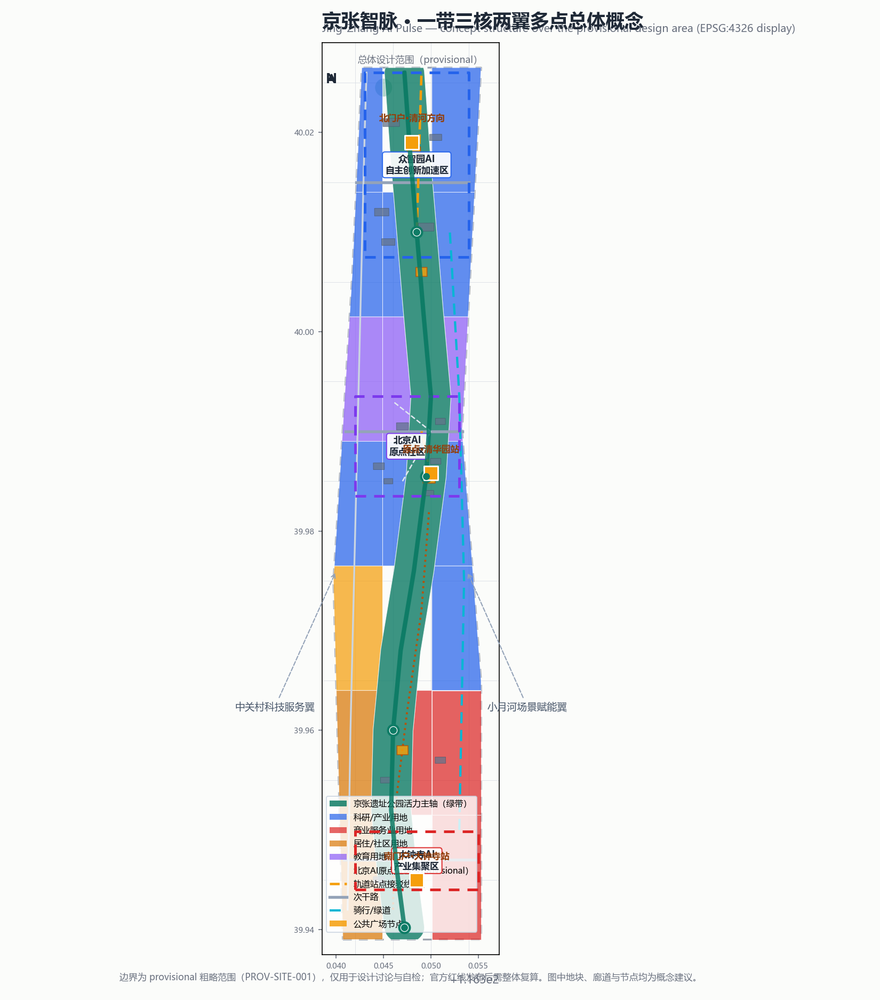
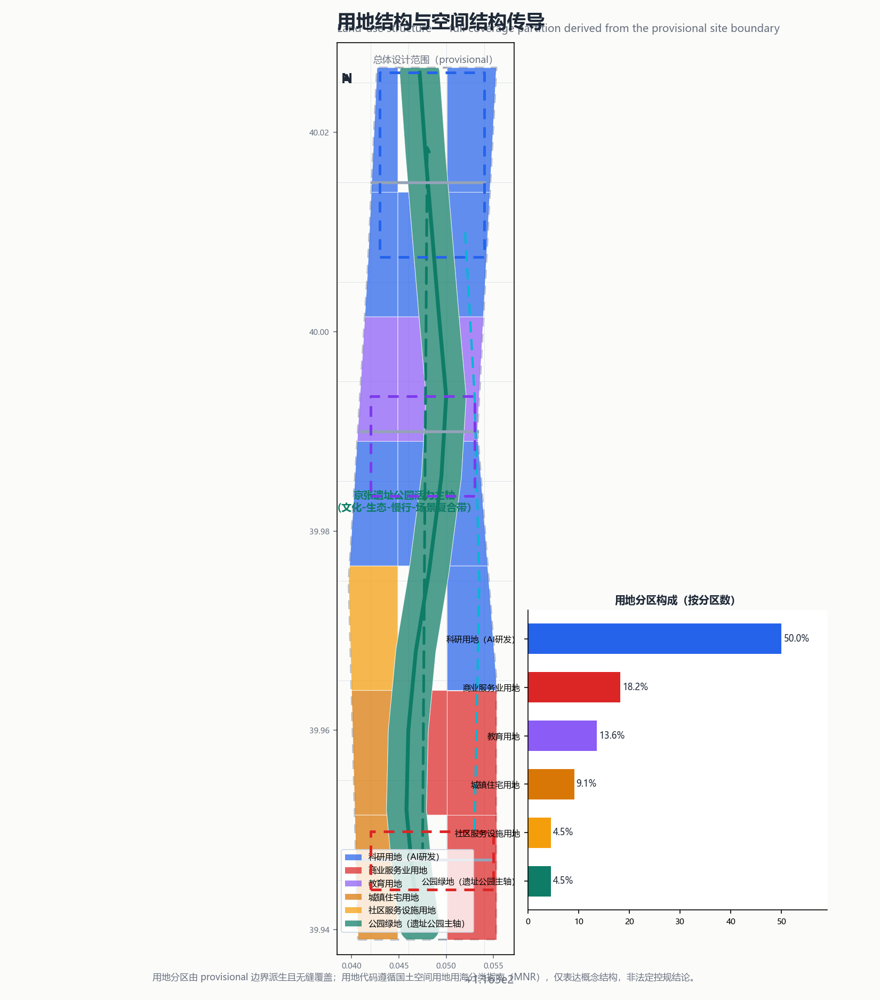
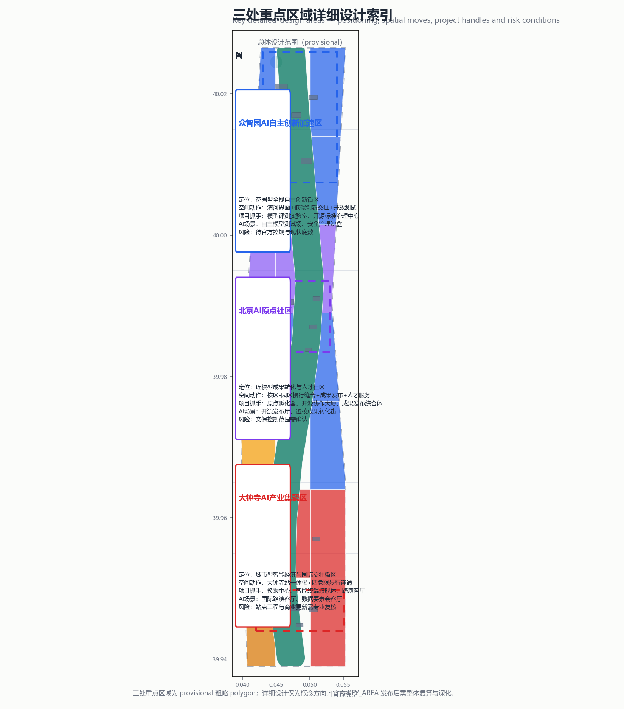
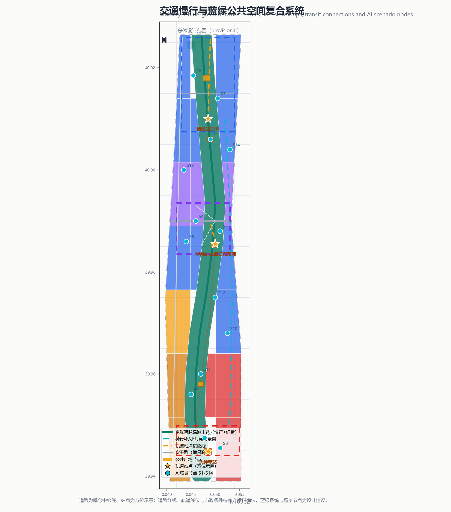
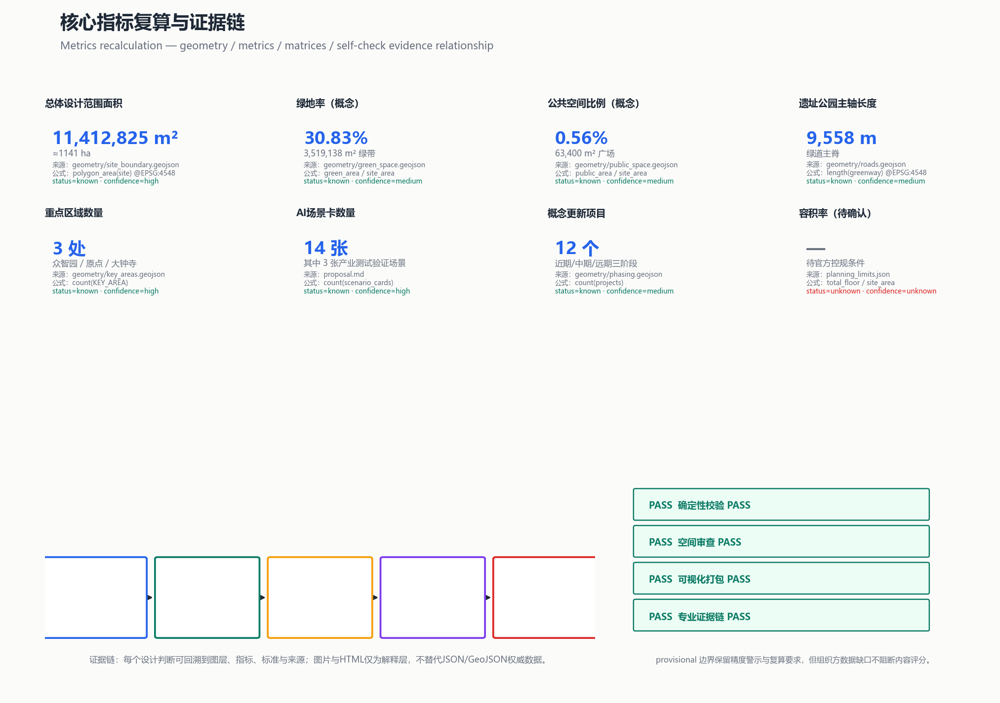

# 京张智脉 · 铁轨新生

## 0. 方案摘要

本方案以「京张智脉」（Jing-Zhang AI Pulse，简称 JZAI）为一带总体概念：把一百年前詹天佑主持修建的京张铁路，转译为面向全球AI时代的创新脉络。空间上形成「一带三核两翼多点」结构——以京张铁路遗址公园为活力主轴，众智园AI自主创新加速区、北京AI原点社区、大钟寺AI产业集聚区为三处核心，中关村科技服务翼与小月河场景赋能翼为两翼，14个AI场景节点与4处朝圣地标为多点。全部空间结论均为概念建议、参考方案或可供专业团队深化研究的内容，不构成政府审定结论 [source:AGENT-TASKBOOK] [standard:PROJECT-AGENT-OPEN-CALL-TASKBOOK]。

方案基于当前仓库提供的 provisional 边界（PROV-SITE-001）生成正式 intake 包：总体设计范围复算面积 11,412,825 m² [metric:site_area_sqm]，绿地率（概念）30.8% [metric:green_ratio]，公共空间比例（概念）0.56% [metric:public_space_ratio]，遗址公园主轴绿道 9,558 m [metric:corridor_length_m]。三处重点区域、用地分区、建筑、道路、绿地和公共空间图层全部在 provisional 约束下生成，并在正文、sources、assumptions 与 self_check 中保留精度警示；官方红线发布后需整体复算 [source:BOUNDARY-SOURCE] [data:geometry/site_boundary.geojson#SITE-001] [depth:metrics_recalculation]。

## 1. 设计依据与资料清单

### 1.1 依据层次

本方案的第一依据是北京市规划和自然资源委员会海淀分局发布的《百年京张AI创新带城市设计国际方案征集资格预审公告》，它确定了三层范围、三处重点区域、约43.6 km²统筹研究范围、约11.4 km²总体设计范围和约368.4公顷重点区域范围，以及“控制性详细规划的城市设计深度”和“规划综合实施方案的城市设计深度”两项成果要求 [source:OFFICIAL-ANNOUNCEMENT] [standard:PROJECT-OFFICIAL-ANNOUNCEMENT] [depth:three_level_scope_framework]。机器可读的枚举、指标区间、允许设计空间与校验模式均来自 `brief/site-package/` [source:SITE-PACKAGE]。

第二依据是面向全球智能体开展的开源征集任务书摘录，它补充了十条共创原则、三大定位、五大功能、三区两翼、六项智能体任务（agent.1–agent.6）和统一边界条款 [source:AGENT-TASKBOOK]。本方案严格区分「概念建议」与「已审定结论」：涉及空间落地的全部内容均表述为“概念建议/参考方案/可供专业团队深化研究”。

第三依据是专业标准本地参考库：城市设计管理办法（MOHURD）用于统筹城市设计、公共空间与风貌控制；控规编制审批办法用于区分已知控制条件、设计建议和待确认事项；国土空间用地用海分类指南用于用地代码与分类术语 [standard:MOHURD-URBAN-DESIGN-MEASURES] [standard:MOHURD-CONTROL-DETAILED-PLANNING] [standard:MNR-LAND-USE-CLASSIFICATION-GUIDE]。建筑工程设计文件编制深度规定（2016年版）在本仓库中为 `needs_official_file` 状态，仅作为深度参照项登记，未将其作为已满足的权威依据 [standard:MOHURD-ARCH-DESIGN-DEPTH-2016] [depth:existing_conditions_diagnosis]。

### 1.2 资料登记与使用边界

`data/source_registry.json` 是资料用途边界的主控文件：当前登记 formal 可用资料5条、provisional-only资料1条。本方案只把「资格预审公告」「任务书摘录」「城市设计管理办法」「控规编制审批办法」「用地用海分类指南」用作 formal 任务与专业依据；`brief/site-package/geometry/provisional_boundaries.geojson` 仅用于 AI 生成、可视化、自检与设计讨论，不得作为官方红线、审批依据、精确面积依据或法定控制结论 [source:SOURCE-REGISTRY] [source:PROCESSED-FACT-PACK]。

`data/processed/agent_fact_pack.md` 及其四个 CSV 是本方案的导航层：`project_scope_summary.csv` 用于建立三层范围结构，`agent_task_requirements.csv` 用于检查六项智能体任务覆盖，`source_use_matrix.csv` 用于判断资料能否支撑 formal 依据，`missing_data_checklist.csv` 用于填写假设与风险。处理资料不替代原始来源，正文一律回引 `source_registry.json` 中的 source_id [source:PROCESSED-FACT-PACK]。

### 1.3 边界与面积状态

当前官方精确红线与三处重点区域 official polygon 尚未取得（对应 missing-data 清单 GAP-BOUNDARY-001/002），因此本方案使用仓库维护者提供的 provisional 粗略边界。`geometry/site_boundary.geojson` 与 `geometry/key_areas.geojson` 均标注 `geometry_role="provisional_constraint"`、`official_boundary=false`、`boundary_precision="provisional_rough"` [data:geometry/key_areas.geojson#PROV-KEY-001]。按项目规则，该组织方数据缺口不阻断内容评分，也不会导致扣分；官方红线发布后，site boundary、key areas、land use、roads、green space、public space、buildings、phasing 与全部面积类指标必须重算 [source:BOUNDARY-SOURCE] [source:KEY-AREA-SOURCE] [depth:risk_missing_data]。

## 2. 三层范围工作框架

方案按公告确定的三层范围组织成果，每层回答不同设计问题并在 `compliance_matrix.json` 中逐条映射：

| 层级 | 设计问题 | 方案回答 | 数据落点 |
| --- | --- | --- | --- |
| 统筹研究范围（约43.6 km²） | AI产业生态与未来城市形态如何组织 | 建立“高校策源—开源协作—企业转化—公共体验—国际传播”创新链，落实三区两翼协同回路 | `compliance_matrix.json`、`standard_matrix.json`、`design_depth_matrix.json` |
| 总体设计范围（约11.4 km²） | 产业空间、城市更新、交通市政与风貌如何落图 | “一带三核两翼多点”结构 + 22个用地分区 + 12条道路 + 3期实施 | [data:geometry/land_use.geojson#LU-001]、[data:geometry/roads.geojson#ROAD-001]、[data:geometry/phasing.geojson#PHASE-001] |
| 重点区域范围（约368.4 ha） | 三处片区如何达到详细设计深度 | 众智园/原点社区/大钟寺分别形成“定位+空间结构+建筑更新+交通慢行+公共空间+AI场景+实施风险” | [data:geometry/key_areas.geojson#PROV-KEY-001]、[data:geometry/key_areas.geojson#PROV-KEY-002]、[data:geometry/key_areas.geojson#PROV-KEY-003] |

三层范围不是互相割裂的图纸集合：统筹研究决定产业与城市形态判断，总体设计把判断落实到用地、建筑、道路、蓝绿与分期图层，重点区域验证具体片区的可深化性。空间结构、用地分区与分期图层的设计含义在 [depth:overall_spatial_structure]、[depth:land_use_layout] 和 [depth:phasing_implementation] 中分别展开。

## 3. 统筹研究范围产业与未来城市研究

### 3.1 三大定位与五大功能

统筹研究范围的核心任务是把公告和任务书给出的“三大定位、五大功能”转译为可操作的空间判断：

- 三大定位：百年京张文化带、都市AI生活体验带、AI融合创新带。
- 五大功能：AI全栈自主创新体系、世界级AI创新生态、AI+场景赋能新范式、智能化AI活力城市、AI治理全球话语权。
- 三区两翼：众智园（全栈自主+治理话语权）、北京AI原点社区（世界级AI创新生态）、大钟寺（智能原生新业态）、中关村科技服务翼（要素全球化配置与资本赋能）、小月河场景赋能翼（场景赋能与活力城市）。

三区两翼的协同回路为：高校/科研源头发起 → 原点社区完成早期孵化与开源协作 → 众智园承接全栈自主创新与安全治理 → 大钟寺完成产业集聚与商业转化 → 中关村服务翼提供资本、合规、数据要素与国际化服务 → 小月河场景翼把场景开放到日常生活，形成“策源—孵化—加速—转化—服务—体验”的闭环 [source:AGENT-TASKBOOK] [standard:PROJECT-AGENT-OPEN-CALL-TASKBOOK] [depth:overall_spatial_structure]。

### 3.2 一带总体概念与命名体系（agent.1）

**主名称**：京张智脉（Jing-Zhang AI Pulse，简称 JZAI）。

**命名逻辑**：京张铁路是“中国自主建造第一条干线铁路”，其核心精神是自主创新；AI 时代的自主创新从“轨道”走向“代码”。以“智脉”对应“血脉/文脉/创新脉络”，既保留百年铁路的历史记忆，又表达AI创新带的生命感与连通性。

**命名体系**（概念建议，待专业品牌团队深化）：

| 层级 | 名称 | 说明 |
| --- | --- | --- |
| 一带主品牌 | 京张智脉 JZAI | 面向全球传播的主名称与域名方向 |
| 文化副品牌 | 百年京张 · 智脉新生 | 文化遗产叙事线 |
| 产业副品牌 | 智脉创新带（JZAI Innovation Belt） | 产业生态叙事线 |
| 活动品牌 | 京张AI开放周 / 智脉马拉松 | 年度活动线 |
| 英文口号方向 | From Rails to Codes — Jing-Zhang AI Pulse | 国际传播口号 |

**Logo/视觉识别方向**（概念）：「轨·迹·信号」系统——以双线铁轨为基本形，叠加一个沿轨迹运动的信号圆点，表达“过去百年的铁轨”与“未来智能的脉冲”；标准色为京张青绿（#0E7C66）、AI电光蓝（#2563EB）、中关村暖橙（#F59E0B）；图形可在站牌、导视、APP、活动物料与公共空间铺装中延展。所有字体、图形、图标均为原创方向，不引用未授权商标或人物形象 [source:AGENT-TASKBOOK]。

### 3.3 全球AI创新生态案例（agent.2）

为把“世界级AI创新生态”转译为可迁移机制，本方案选取8个全球案例做对比研究。案例信息来自公开报道与通用行业知识，仅作为背景参考与机制借鉴，不作为正式规划依据，来源与限制已在 `sources.json` 的 `ECOSYSTEM-CASES-BACKGROUND` 条目中登记 [source:ECOSYSTEM-CASES-BACKGROUND]：

| # | 案例 | 核心机制 | 可迁移动作 |
| --- | --- | --- | --- |
| 1 | 美国硅谷/帕洛阿尔托 | 高校策源+风险资本+开源文化 | 高校-园区慢行缝合、校友网络运营 |
| 2 | 美国波士顿剑桥 Kendall Square | 产学研集聚+城市更新型创新区 | 轨道TOD创新社区、产业公共服务 |
| 3 | 新加坡纬壹科技城 one-north | 政府主导+混合用地+人才住宅 | 科研-居住-商业混合分区 |
| 4 | 英国伦敦国王十字 | 铁路遗产地城市更新 | 遗址公园+文化科技复合利用 |
| 5 | 深圳河套深港科创合作区 | 跨境要素流动+制度创新 | 数据要素与合规服务窗口 |
| 6 | 杭州未来科技城 | 大企业生态+人才政策 | 企业生态链+人才服务配套 |
| 7 | 上海张江科学城 | 大科学装置+研发集聚 | 开放测试场与公共中试平台 |
| 8 | 巴黎 Station F | 车站再生+创业者社区 | 站点改造为发布/孵化复合空间 |

由案例提炼的机制映射到本方案：站点一体化（大钟寺/清华园）借鉴 Kendall Square 与 Station F；遗址公园复合利用借鉴国王十字；混合用地借鉴 one-north；数据要素与合规服务借鉴河套；开放测试与中试平台借鉴张江；企业生态与人才服务借鉴未来科技城。这些机制落到 [data:geometry/buildings.geojson#BLDG-007]、[data:geometry/public_space.geojson#PUBLIC-001] 与 [depth:renewal_project_list] 中，成为可继续深化的项目抓手。

### 3.4 未来城市形态研究

统筹研究范围还应回答AI如何改变城市：远程协作减少通勤刚需但增加“第三空间”需求；算力与数据成为新基础设施；治理从“管控”走向“可解释、可复核、可参与”。本方案因此提出“复合廊道”概念——把交通、生态、文化、场景四类功能叠合在遗址公园主轴上，避免单一功能走廊；并把端侧算力、数据合规、安全评测等服务设施嵌入更新项目 [depth:traffic_rail_slow_parking] [depth:municipal_new_infrastructure]。

## 4. 总体设计范围城市更新与控规深度城市设计

### 4.1 空间结构与用地布局

总体设计范围采用「一带三核两翼多点」结构，用地分区由 provisional 边界无缝派生（22个分区，覆盖全边界、无重叠无空隙）[metric:land_use_feature_count] [data:geometry/land_use.geojson#LU-GREEN-001]：

| 用地代码 | 分区名称 | 设计含义 |
| --- | --- | --- |
| 0802 科研用地 | 众智园、原点社区研发街区、小月河东翼 | 承载全栈自主创新、开源协作与成果转化 [data:geometry/land_use.geojson#LU-016] |
| 0804 教育用地 | 高校智源教育科研带 | 衔接北航、北邮等高校资源 [data:geometry/land_use.geojson#LU-013] |
| 05 商业服务业 | 大钟寺智能原生街区、都市AI生活体验商业街 | 承载智能终端、内容消费与国际路演 [data:geometry/land_use.geojson#LU-002] |
| 0701/0702 居住与社区 | 南部人才居住带、社区服务 | 提供人才住房与生活配套 [data:geometry/land_use.geojson#LU-001] |
| 1401 公园绿地 | 京张遗址公园活力主轴 | 文化-生态-慢行-场景复合走廊 [data:geometry/land_use.geojson#LU-GREEN-001] |
| 0803 文化用地 | 清华园等文化节点 | 朝圣地标与文化展示 |

用地分类遵循国土空间用地用海分类指南的术语逻辑，分区用途仅为概念建议；地块级用地性质与规划用途需以法定控规为准 [standard:MNR-LAND-USE-CLASSIFICATION-GUIDE] [depth:land_use_layout]。

### 4.2 城市更新总体框架与拆改留逻辑

更新框架遵循“保留为主、更新为辅、新建为补”的原则：保留现状高校、成熟社区与文保节点；改造低效产业空间、老旧商业街与闲置设施；新建仅作为补齐公共空间与服务短板的示意（18处概念建筑基底）[metric:building_footprint_area_sqm] [data:geometry/buildings.geojson#BLDG-001]。由于现状建筑底数、宗地权属与控规条件均缺失（GAP-PARCEL-001、GAP-BUILDING-001、GAP-CONTROL-001），拆改留结论一律列为待确认事项，不给出地块级拆除/保留判断 [depth:retain_renovate_demolish] [depth:development_intensity_controls]。

建筑高度、容积率、建筑密度、绿地率与退线均无官方控制值：`metrics.json` 中 `floor_area_ratio` 与 `building_height_control_m` 状态为 `unknown`，等待官方控规条件；任何开发强度表述均为概念讨论，不冒充审定指标 [depth:height_massing_character]。

### 4.3 交通、轨道、市政与公共服务

总体设计范围的交通策略为“一脊三横多点接驳”：绿道主脊贯通南北（9,558 m）[metric:corridor_length_m]，三条横贯次干路连接东西两翼 [data:geometry/roads.geojson#ROAD-002]，大钟寺站、清华园·五道口方向、清河站方向设置轨道接驳线 [data:geometry/roads.geojson#ROAD-008]。慢行系统包括遗址公园体验步道 [data:geometry/roads.geojson#ROAD-012] 与小月河骑行环 [data:geometry/roads.geojson#ROAD-011]。

市政与新型基础设施提出三个方向（概念）：端侧算力驿站与公共服务、低碳能源结合的原型；开放数据与场景测试的合规服务界面；蓝绿系统与海绵城市结合的雨洪组织。道路红线、轨道线位、市政管线、断面与消防条件均待官方资料确认（GAP-ROAD-001、GAP-MUNICIPAL-001）[depth:traffic_rail_slow_parking] [depth:municipal_new_infrastructure]。

## 5. 重点区域详细设计

### 5.1 众智园AI自主创新加速区（provisional 192.1 ha）

**定位**：花园型全栈自主创新街区，承担“AI全栈自主创新体系”与“AI治理全球话语权”。

**空间结构**：沿清河界面组织低碳创新廊，中部布置共享测试广场，南北两段分别承载研发旗舰与人才公寓；以绿地空间承载开放测试与标准治理展示 [data:geometry/key_areas.geojson#PROV-KEY-001]。

**建筑与更新**：概念建筑基底包括全栈研发旗舰楼（BLDG-001）、自主模型评测实验室（BLDG-002）、全栈创新加速器（BLDG-003）、开源标准与治理中心（BLDG-004）与创新人才公寓（BLDG-006）；拆改留待宗地确认 [data:geometry/buildings.geojson#BLDG-002]。

**交通慢行**：利用清河界面绿带与遗址公园主轴形成慢行环，设置接驳众智园横贯次干路的支路。

**AI场景**：自主模型测试场（S2）、安全治理沙盒（S3）、共享测试广场（PUBLIC-005）——其中S2、S3为产业测试验证场景。

**实施风险**：清河蓝线管控、现状产业空间权属与控规条件需专业复核；当前详细设计仅为概念方向 [depth:three_key_area_detailed_design]。

### 5.2 北京AI原点社区（provisional 104.3 ha）

**定位**：近校型成果转化与人才社区，承担“世界级AI创新生态”。

**空间结构**：以清华园车站旧址为文化原点，组织“原点孵化器—开源协作大厦—成果发布综合体”三角骨架；校区、园区、街区通过慢行缝合 [data:geometry/key_areas.geojson#PROV-KEY-002]。

**建筑与更新**：概念建筑包括原点孵化器（BLDG-007）、成果发布综合体（BLDG-008）、近校转化驿站（BLDG-009）、开源协作大厦（BLDG-010）与清华园AI原点文化馆（BLDG-011）。

**交通慢行**：设置原点社区慢行衔接线（ROAD-007）与清华园·五道口站接驳线（ROAD-009）；轨道站点一体化仅作概念方向。

**AI场景**：开源发布厅（S1）、近校成果转化街（S6）、AI教育体验点（S11）。

**实施风险**：清华园车站旧址文保控制范围（CONSTRAINT-001）必须遵守，任何地标与工程概念不得突破文保、绿地、蓝线与交通安全约束；建筑改造不得擅自改变权属空间 [data:geometry/constraints.geojson#CONSTRAINT-001]。

### 5.3 大钟寺AI产业集聚区（provisional 72.0 ha）

**定位**：城市型智能经济与国际交往街区，承担“智能原生新业态”。

**空间结构**：以大钟寺站为枢纽组织四象限步行连通；站前布置智汇广场，南段布置智能终端旗舰体与智能体企业总部，形成“站—街—坊”层级 [data:geometry/key_areas.geojson#PROV-KEY-003]。

**建筑与更新**：概念建筑包括智能终端旗舰体（BLDG-013）、智能体企业总部楼（BLDG-014）、AI消费体验商业（BLDG-015）与换乘中心（BLDG-016）。

**交通慢行**：大钟寺站接驳线（ROAD-008）与横贯次干路（ROAD-002）组织人车分流；四象限步行连通为概念建议，工程可行性待专业复核 [data:geometry/roads.geojson#ROAD-002]。

**AI场景**：大钟寺国际路演客厅（S7）、数据要素会客厅（S8）。

**实施风险**：站点工程、既有商业更新与数据合规机制需专业团队与主管部门确认；不得把站点改造或商业更新写成已确定安排。

## 6. AI 创新生态、人才画像与 AI+ 场景

### 6.1 六大用户画像

| 画像 | 典型需求 | 空间响应 | 数据与隐私边界 |
| --- | --- | --- | --- |
| 开源开发者 | 发布、协作、测试、社区声誉 | 原点开源发布厅、公共代码墙、夜间协作空间 | 不采集个人行为轨迹，活动数据仅聚合统计 [metric:persona_count] |
| 初创团队 | 低成本办公、算力入口、产品试验场 | 众智园共享测试场、端侧算力驿站、合规咨询 | 算力与数据服务需另行授权 |
| 头部企业访客 | 展示、商务、国际接待、人才招聘 | 大钟寺国际路演客厅、站点接驳、公共空间 | 企业标识与案例须清权 |
| 周边居民 | 通勤、休闲、社区服务、低扰动更新 | 遗址公园慢行环、社区服务嵌入、活动分级 | 不将居民画像用于商业推荐 |
| 高校师生 | 成果转化、跨校协作、日常慢行 | 校区-园区慢行缝合、成果转化驿站、AI教育体验点 | 校园数据与科研成果需授权 |
| 国际人才 | 语言服务、国际社区、全球活动参与 | 双语导视、国际路演、年度开放周 | 国际传播素材需授权与合规审核 |

### 6.2 14张AI场景卡（含3张产业测试验证场景）

面向智能体任务书要求不少于10张场景卡、3个产业测试验证场景、5类用户画像；本方案提供14张场景卡，其中S2、S3、S10为产业测试验证场景 [source:AGENT-TASKBOOK] [metric:ai_scenario_node_count] [metric:ai_test_scenario_count]。

| 编号 | 场景卡 | 空间载体 | 服务对象 | 数据与复核边界 | 运营主体方向 |
| --- | --- | --- | --- | --- | --- |
| S1 | 开源发布厅 | 原点社区 [data:geometry/public_space.geojson#PUBLIC-002] | 开发者/初创团队 | 聚合统计；人工审核发布内容 | 社区运营+企业共建 |
| S2 | 自主模型测试场（TEST） | 众智园 [data:geometry/public_space.geojson#PUBLIC-005] | 科研机构/企业 | 测试数据授权使用；结果可复核 | 专业测试机构+园区 |
| S3 | 安全治理沙盒（TEST） | 众智园 | 治理机构/企业 | 红队测试需授权；全程留痕 | 治理平台+专业团队 |
| S4 | 端侧算力驿站 | 沿主轴节点 | 居民/开发者 | 算力配额管理；不收集个人数据 | 运营商+社区 |
| S5 | AI慢行导航 | 遗址公园主轴 | 居民/访客 | 低侵入传感；不追踪个体 | 市政运营+开发者 |
| S6 | 近校成果转化街 | 原点社区 | 高校师生 | 科研成果授权后展示 | 高校技术转移机构 |
| S7 | 大钟寺国际路演客厅 | 大钟寺 [data:geometry/public_space.geojson#PUBLIC-001] | 头部企业/国际访客 | 内容合规审核；活动记录授权 | 会展运营+园区 |
| S8 | 数据要素会客厅 | 大钟寺 | 数据企业/律所 | 合规、授权、可审计 | 数据服务商+监管协同 |
| S9 | AI生活服务样板街 | 南部生活带 | 居民 | 不收集健康/位置画像 | 社区商业+服务商 |
| S10 | 机器人配送社区试点（TEST） | 南部社区/园区 | 居民/企业 | 限速限区、人工接管、事件留痕 | 机器人运营商+社区 |
| S11 | AI教育体验点 | 高校周边 | 学生/公众 | 教育内容清权；未成年人保护 | 高校+公益组织 |
| S12 | 智能体贡献荣誉墙 | 遗址公园 | 全球开发者 | 展示贡献者授权信息 | 基金会/社区 |
| S13 | 智能网联接驳示范线 | 主轴北段 | 通勤者 | 安全监管；数据脱敏 | 交通运营+车企 |
| S14 | 京张AI开放周路线 | 一带公共空间系统 | 全球参与者 | 活动数据聚合统计 | 活动运营团队 |

### 6.3 隐私与人工复核边界

所有AI场景遵循数据最小化、公开来源、可解释与人工复核四原则：不采集个人行为轨迹、不做未经授权的个人画像、不输出无法人工复核的决策；测试场景均写为“概念试点/待批准”，不得写成已批准运营 [standard:PROJECT-AGENT-OPEN-CALL-TASKBOOK] [depth:risk_missing_data]。

## 7. 用地、建筑规模与拆改留方案

用地方案已在4.1节给出22个分区；建筑规模表达为概念基底：18处建筑总基底面积 144,875 m² [metric:building_footprint_area_sqm]，分属研发、实验室、孵化器、办公、混合、教育、居住、人才公寓、社区服务、商业、文化、交通接驳12类概念功能 [data:geometry/buildings.geojson#BLDG-013]。建筑高度、体量、屋顶形态与风貌界面按 [depth:height_massing_character] 提出控制方向（沿遗址公园主轴低矮退让、核心节点适度标志性），但全部数值待官方控规。

拆改留采用“分类管理+待核清单”方法：现状高校、文保节点、成熟社区列入保留候选；低效产业空间、老旧商业列入改造候选；补齐公共服务的节点列入新建候选；具体地块结论以宗地、现状底数和控规为准 [depth:retain_renovate_demolish]。

## 8. 交通、轨道、市政与公共服务设施

交通组织的设计判断是“一脊三横多点接驳”：绿道主脊（ROAD-001）承担南北贯通的慢行与场景复合功能，对应 [data:geometry/roads.geojson#ROAD-001]；大钟寺横贯次干路（ROAD-002）、原点社区横贯次干路（ROAD-003）与众智园横贯次干路（ROAD-004）把东西两翼连接到主轴；大钟寺站、清华园·五道口方向与清河站方向的接驳线（ROAD-008/009/010）把轨道站点转化为片区门户。东侧小月河骑行环（ROAD-011）与遗址公园体验步道（ROAD-012）构成慢行闭环，服务通勤、休闲与活动三种出行目的 [metric:road_feature_count] [depth:traffic_rail_slow_parking]。

轨道与慢行设计均为概念线位：站点一体化、四象限步行连通和接驳组织需以官方道路红线、轨道专项和交通断面为准，不给出工程线位或可行性结论；停车与非机动车组织按“站点周边集约、街区内部共享、活动日分级管控”三个方向提出，具体容量待交通专项测算。

市政与新型基础设施提出三个概念方向：其一，端侧算力驿站与公共服务、低碳能源相结合，作为可深化试点的“新基建原型”；其二，开放数据与场景测试的合规服务界面，与数据要素会客厅（S8）衔接；其三，蓝绿系统与海绵城市结合的雨洪组织，与遗址公园绿带（GREEN-001）和清河滨水概念段（GREEN-002）联动 [data:geometry/green_space.geojson#GREEN-001]。道路管线、消防通道、能源负荷与市政容量均列为待补资料（GAP-MUNICIPAL-001），方案只做体系建议，不做管线迁改或工程结论 [depth:municipal_new_infrastructure]。

公共服务设施体系（概念）沿主轴布置“发布—展示—路演—体验—荣誉”五类节点，在重点区布置人才服务、知识产权、合规咨询与投融资对接窗口；因设施底数缺失（GAP-SERVICE-001），设施容量与选址仅作为服务体系和待核清单，不编造学校、医疗、养老等设施容量 [depth:traffic_rail_slow_parking]。

## 9. 蓝绿空间、公共空间与城市风貌

### 9.1 京张遗址公园活力带

活力带以铁路遗址公园为主轴，形成“文化-生态-慢行-场景”四重复合走廊：文化层表达百年铁路记忆，生态层组织连续绿带（概念绿地率30.8%）[metric:green_ratio]，慢行层贯通绿道主脊与体验步道，场景层嵌入14个AI场景节点 [data:geometry/green_space.geojson#GREEN-001] [depth:blue_green_public_space]。

### 9.2 公共空间系统与朝圣地标（agent.4）

方案提出4处AI朝圣地标/荣誉展示节点，全部为概念建议、待专业深化与审批，不与文保、绿地、蓝线、交通安全约束冲突：

| 编号 | 地标/节点 | 位置 | 设计概念 | 展示内容 |
| --- | --- | --- | --- | --- |
| L1 | 清华园·AI原点碑 | 原点社区 | 以车站记忆为原点，碑体嵌入铁轨元素 | 京张铁路与AI原点叙事 |
| L2 | 智能体贡献荣誉墙 | 遗址公园中段 | 可更新的数字/实体双墙 | 每年全球杰出Agent与贡献者（经授权）[metric:landmark_count] |
| L3 | 开源成果展示廊 | 原点社区—众智园连接段 | 开放式展廊 | 开源项目、白皮书与成果发布 |
| L4 | AI里程碑塔 | 主轴北端/大钟寺门户 | 垂直地标与公共观景 | 全球AI里程碑与年度事件 |

公共空间组件库（概念）：荣誉展示模块、代码墙模块、发布舞台模块、休息社交模块、无障碍慢行模块——按可组合、可更新、可维护原则设计，避免一次性网红化装置 [standard:MOHURD-URBAN-DESIGN-MEASURES]。

### 9.3 城市风貌

风貌基调为“历史厚度的科技表达”：遗址公园段强调低缓、历史材质与遗址叙事；重点产业区强调清晰天际线与公共界面；生活带强调社区尺度与活力街道。建筑高度、体量、色彩与屋顶的控制数值待控规确认 [depth:height_massing_character]。

## 10. 更新项目清单、实施政策与分期计划

### 10.1 更新项目清单（12项概念）

| 项目 | 类型 | 位置 | 阶段 | 依赖条件 |
| --- | --- | --- | --- | --- |
| P1 大钟寺站一体化换乘中心 | 交通+商业 | 大钟寺 | 近期 | 站点工程、权属 |
| P2 AI生活服务样板街 | 街区更新 | 南部生活带 | 近期 | 现状底数、商业运营 |
| P3 站前智汇广场 | 公共空间 | 大钟寺 | 近期 | 广场用地、交通组织 |
| P4 近校成果转化街 | 街区更新 | 原点社区 | 中期 | 高校合作、文保控制 |
| P5 原点孵化器 | 产业载体 | 原点社区 | 中期 | 权属、控规 |
| P6 开源协作大厦 | 产业载体 | 原点社区 | 中期 | 权属、控规 |
| P7 成果发布综合体 | 文化+产业 | 原点社区 | 中期 | 文保范围、景观 |
| P8 智能体贡献荣誉墙 | 公共文化 | 遗址公园 | 中期 | 公园方案、运营主体 |
| P9 自主模型评测实验室 | 产业载体 | 众智园 | 远期 | 控规、安全评测机制 |
| P10 开源标准与治理中心 | 产业载体 | 众智园 | 远期 | 治理体系、行业协同 |
| P11 共享测试广场 | 公共空间 | 众智园 | 远期 | 安全、运营协议 |
| P12 北端文化展廊 | 公共文化 | 主轴北端 | 远期 | 清河蓝线、景观 |

项目清单为概念建议；实施主体、资金与政策安排待专业团队与主管部门确认 [metric:renewal_project_count] [depth:renewal_project_list]。

### 10.2 实施政策建议（概念）

提出四类政策方向供专业团队深化：场景开放机制（测试场预约、数据沙盒、合规指引）；贡献者激励体系（荣誉墙、年度白皮书、开发者积分）；混合用地引导（科研-居住-商业兼容）；低扰动更新指引（分期实施、公众参与、社区协商）。所有政策建议不构成政府承诺 [source:AGENT-TASKBOOK]。

### 10.3 分期计划

对应 `geometry/phasing.geojson` 三个概念阶段 [data:geometry/phasing.geojson#PHASE-001] [data:geometry/phasing.geojson#PHASE-002] [data:geometry/phasing.geojson#PHASE-003]：

- 近期（2026–2028）：大钟寺片区与南部生活带先行示范，启动站前广场、生活样板街与接驳优化。
- 中期（2029–2031）：AI原点社区与遗址公园中段成网，落地孵化器、开源协作大厦、成果发布与荣誉墙。
- 远期（2032–2035）：众智园全栈创新区与北端文化展廊，完善测试、治理与国际交往功能。

### 10.4 全球AI创新活动体系与长期运营（agent.6）

**年度活动体系**（概念）：京张AI开放周（每年5月，呼应征集发布）；全球智能体马拉松（Agent Hackathon，每年10月）；开源成果发布会（每季度）；京张文化×AI艺术节（每年8月）；国际开发者峰会（每年12月）。所有活动均为概念建议，不以已确定安排表述。

**开发者社区运营**：建立京张智脉开发者社区（GitHub组织+线下Meetup），以贡献者积分、荣誉墙提名、年度白皮书沉淀社区资产；贡献者信息展示须经本人授权。

**场景开放运营**：以“预约制+人工复核+合规授权”开放测试场景；数据沙盒遵循数据最小化；场景运营主体以专业团队与运营机构为主，智能体提供辅助。

**公共体验与地标运营**：荣誉墙年度更新、导览路线季度轮换、地标夜间照明分级管理；运营维护纳入公共空间管理体系。

**国际传播与招引转化**：以“From Rails to Codes”为国际叙事，通过开放周、白皮书与国际开发者网络形成“活动→项目→测试→试点→推广”的转化路径；招商引资、政策与资金安排均不写为确定承诺 [depth:phasing_implementation]。

## 11. 指标体系、面积复算与合规矩阵

### 11.1 核心指标表

全部面积类指标在 EPSG:4548 下由 `geometry/*.geojson` 复算，公式与来源见 `metrics.json` [depth:metrics_recalculation]：

| 指标 | 数值 | 公式 | 状态 |
| --- | --- | --- | --- |
| site_area_sqm | 11,412,825 | polygon_area(site) | known [metric:site_area_sqm] |
| green_ratio | 0.308 | green_area/site_area | known [metric:green_ratio] |
| public_space_ratio | 0.006 | public_area/site_area | known [metric:public_space_ratio] |
| green_space_area_sqm | 3,519,138 | union(green_space) | known [metric:green_space_area_sqm] |
| public_space_area_sqm | 63,400 | union(public_space) | known [metric:public_space_area_sqm] |
| building_footprint_area_sqm | 144,875 | sum(buildings) | known [metric:building_footprint_area_sqm] |
| corridor_length_m | 9,558 | length(greenway) | known [metric:corridor_length_m] |
| key_area_count | 3 | count(KEY_AREA) | known [metric:key_area_count] |
| ai_scenario_node_count | 14 | count(scenario_cards) | known [metric:ai_scenario_node_count] |
| ai_test_scenario_count | 3 | count(test scenarios) | known [metric:ai_test_scenario_count] |
| persona_count | 6 | count(personas) | known [metric:persona_count] |
| landmark_count | 4 | count(landmarks) | known [metric:landmark_count] |
| renewal_project_count | 12 | count(projects) | known [metric:renewal_project_count] |
| land_use_feature_count | 22 | count(land_use) | known [metric:land_use_feature_count] |
| road_feature_count | 12 | count(roads) | known [metric:road_feature_count] |
| floor_area_ratio | — | total_floor/site_area | unknown（待控规） |
| building_height_control_m | — | approved_control | unknown（待控规） |

### 11.2 合规矩阵

`compliance_matrix.json` 覆盖公告 1.3.1–1.5.3.3 与 agent.1–agent.6 共23项必选任务；`standard_matrix.json` 覆盖6项专业标准；`design_depth_matrix.json` 覆盖15项成果深度项且核心项全部为 `complete`。自检结果见 `self_check.json`，四阶段（确定性校验、空间审查、可视化打包、专业证据链）均 PASS [source:SOURCE-REGISTRY]。

## 12. 风险、版权与合规说明

**资料合法性**：仅使用公开或清权资料；未使用非公开规划图件、非公开空间数据或未授权数据。provisional 边界的使用限制已在 `sources.json`、`assumptions.json`、正文与本图说明中披露 [source:BOUNDARY-SOURCE] [source:KEY-AREA-SOURCE]。

**版权**：本方案文本、图表、Logo方向与图纸为AI生成原创内容；未使用未授权字体、图片、商标、人物肖像或版权材料；`report/copyright_statement.md` 为版权声明。案例信息为背景参考，引用边界已在 `sources.json` 登记。

**隐私**：AI场景不采集个人轨迹、不做未经授权画像；场景卡均含数据与人工复核边界说明。

**AI生成责任**：本方案由AI Agent（Codex Agent，weichenleeeee123）生成并自检；最终判断与专业深化由人类专业团队负责。

**禁止越界**：本方案不声称官方批准、法定控规、工程可行性、投资测算、开发时序或政府承诺；全部空间、活动与政策内容均为概念建议 [standard:PROJECT-AGENT-OPEN-CALL-TASKBOOK]。

**待补资料清单**：官方红线与KEY_AREA polygon、控规条件、道路红线与断面、宗地/权属、现状建筑底数、文保控制线、清河蓝线、市政管线、交通断面、公共服务设施底数。替换 official polygons 后，本包所有面积类指标与图件需按 `docs/formal-submission-guide.md` 流程复算 [depth:risk_missing_data]。

## 13. 参考资料

本方案的可校验引用与资料边界见 `data/source_registry.json` [source:SOURCE-REGISTRY]、`brief/site-package/sources.json` [source:SITE-PACKAGE] 与 `brief/site-package/agent_taskbook.json` [source:AGENT-TASKBOOK]；专业标准本地快照见 `brief/site-package/standards/standards.json` [standard:PROJECT-OFFICIAL-ANNOUNCEMENT]。

- `brief/site-package/design_brief.json`
- `brief/site-package/agent_taskbook.json`
- `brief/site-package/allowed_design_space.json`
- `brief/site-package/sources.json`
- `brief/site-package/geometry/provisional_boundaries.geojson`
- `brief/site-package/standards/standards.json` 及 `standards/references/*`
- `brief/site-package/schemas/*.json`
- `data/source_registry.json`
- `data/processed/agent_fact_pack.md` 及 processed CSV
- `docs/formal-submission-guide.md`
- `docs/data-workflow.md`
