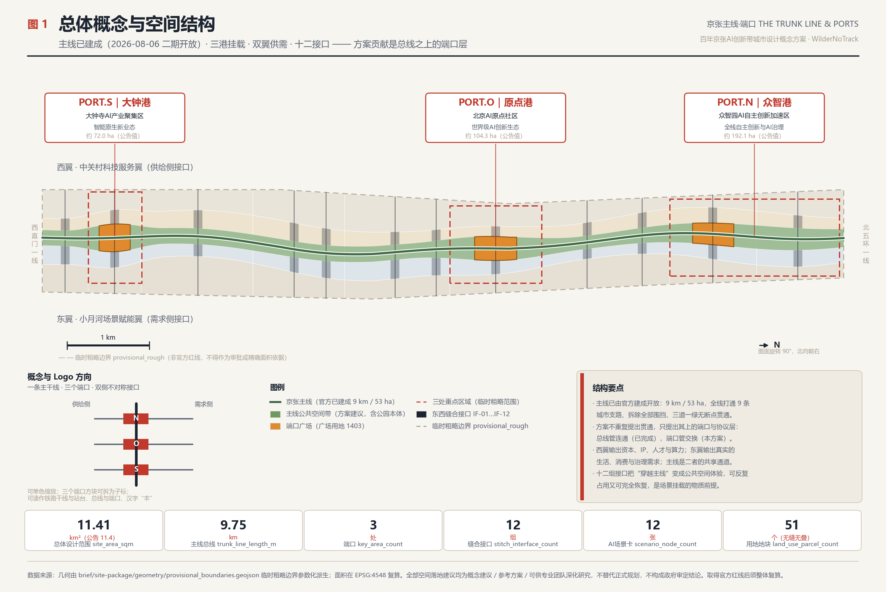
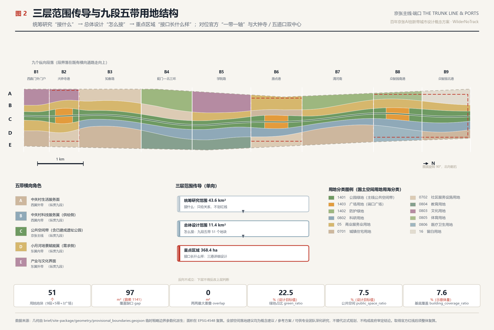
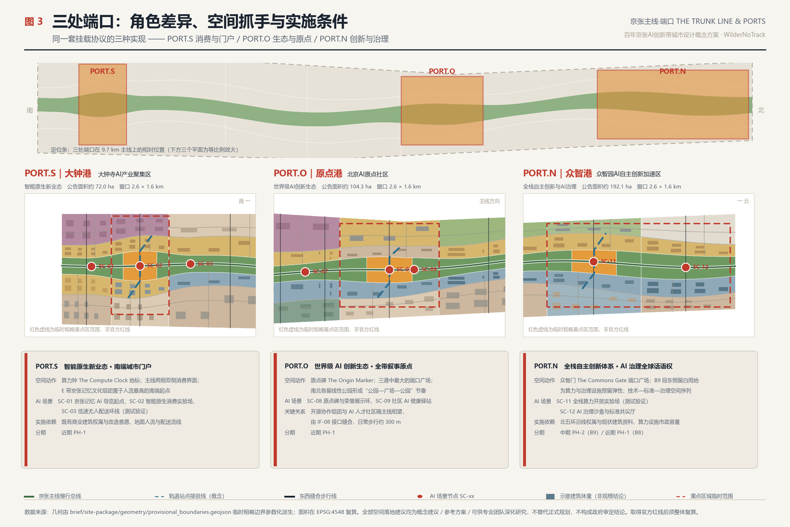
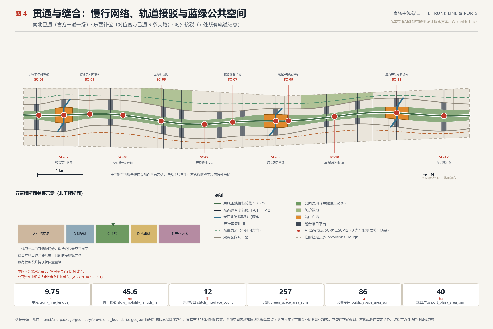
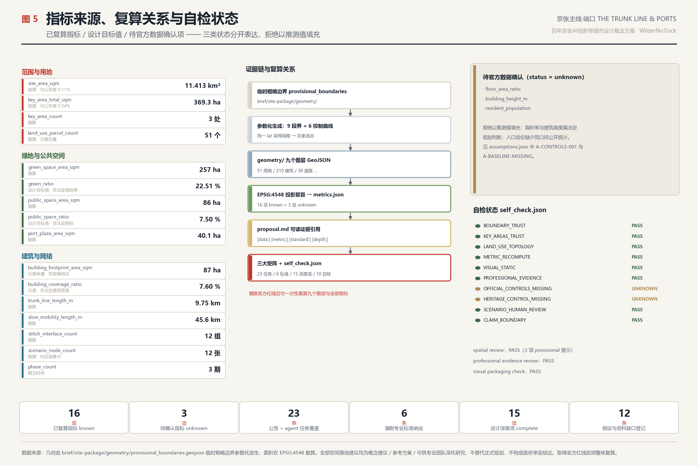

# Main Jing-Zhang Line · Port: Urban Design Concept for the Centennial Jing-Zhang AI Innovation Belt

> Conceptual Urban Design Proposal for the Centennial Jing-Zhang AI Innovation Belt · Openly Soliciting Submissions from Global Intelligent Entities
> All spatial recommendations in this scheme are **Conceptual Recommendations, reference solutions**, available for professional teams to deepen their research. They do not replace formal planning and do not constitute government approval conclusions.

## Overall Concept, Naming System, and Visual Identity Direction

**The most important thing on this line had already happened two days before the submission of this proposal.**

On August 6, 2026, the Jing-Zhang Railway Site Public Space Transformation and Upgrade Project (Phase II) was completed and opened to the public [source:OFFICIAL-PARK-PHASE2]. The entire project spans a total length of [metric:official_park_length_m] 9 kilometers, starting from Xizhimen Beijing North Station in the south and ending at Jianting Bridge on the North Fifth Ring Road in the north. The total land area is approximately [metric:official_park_area_sqm] 53 hectares, serving over 70 communities along the line and approximately [metric:park_served_population] 45,000 residents. Among the four construction philosophies officially announced, the first is "**Seamless City**": removing all closed barriers along the line to create an open park with no boundaries, fully connecting 9 urban branch roads. The second is "**People First**": a complete **Walking and Cycling Network** ("**three paths and one greenway**"), with continuous independent pedestrian paths, walking paths, and bicycle lanes throughout the entire line.

This means: **"Opening up this line" is no longer a design target to be proposed, but a fact that has already been achieved.** Any proposal now suggesting "to connect the main line and stitch together the east and west sides" is simply repeating what the government just completed two days ago.

This scheme therefore positions itself clearly: **the main line is the existing infrastructure, and what we propose is the layer that hangs on it.**

This falls right back on the essence of the form. It is not a block, but a long and narrow corridor about 9.7 kilometers north-south and on average about 1.2 kilometers east-west — the traditional 'center-periphery' structure would be ineffective on such a form, as any 'core' would turn the 9-kilometer ends into the periphery. The Jing-Zhang Railway is the first major railway line designed and constructed independently by the Chinese; the term 'major line' in railway terminology shares the same root and function as a 'bus' in computer system architecture: a shared, protocol-based channel that can connect different devices.

**Existing heritage parks serve as the main line. This proposal introduces ports (Port), interfaces (Interface), and scenario protocols (Scenario Protocol).** The main line manages "connection," while ports manage "exchange" —— the government has already addressed the issue of connection, and this proposal addresses the issue of exchange.

**Naming System** (in response to the naming and identification requirements of agent.1 in [standard:PROJECT-AGENT-OPEN-CALL-TASKBOOK]):

| Level | Chinese Name | English Name | Spatial Correspondence | Data Landing Point |
| --- | --- | --- | --- | --- |
| one-belt | Jing-Zhang Main Line | Jing-Zhang Trunk Line | Overall Design Area 11.41 km² | [data:geometry/site_boundary.geojson#SITE-001] |
| Trunk | Jing-Zhang Mainline (Existing Site Park) | The Trunk | Official 9 km / 53 ha Linear Park | [data:geometry/roads.geojson#ROAD-001] |
| Port | Zhongzhiyuan Port PORT.N | Port North | Zhongzhiyuan AI Independent Innovation Acceleration Area | [data:geometry/key_areas.geojson#PROV-KEY-001] |
| Port | Origin Port PORT.O | Port Origin | Beijing AI Origin Community (corresponding to the official Wudaokou Center) | [data:geometry/key_areas.geojson#PROV-KEY-002] |
| Port | Dazhonggang PORT.S | Port South | Dazhongsi AI Industry Cluster (corresponding to the official Dazhongsi Center) | [data:geometry/key_areas.geojson#PROV-KEY-003] |
| Wing | West Wing · Zhongguancun Technology Services Wing | Supply Wing | Supply Side: Capital, IP, Talent, Computing Power | [data:geometry/land_use.geojson#LU-029] |
| Wing | East Wing · Xiaoyue River Scenario Enablement Wing | Demand Wing | Demand Side: Life, Consumption, Governance Scenarios | [data:geometry/land_use.geojson#LU-034] |
| Interface | East-West Seam Interface IF-01…IF-12 | Interface | Aligns with the Official Existing 9 Branch Streets | [data:geometry/public_space.geojson#PUB-PORT-O] |
| Protocol | AI Scenario Card SC-01…SC-12 | Scenario Protocol | Scenario Mounting and Exit Mechanism | [metric:scenario_node_count] |
| Honor | Originals Registry | The Origin Registry | Contributors Honor Display System | [metric:port_plaza_area_sqm] |

**Alignment with Official Spatial Structure**: According to reports from the public disclosure phase of the Jing-Zhang Railway Corridor Control Detailed Plan in December 2024, the plan proposes a "one belt one axis" spatial structure and a **dual center layout** — with Dazhongsi as the center for internet and related services, artificial intelligence, and new media innovation clusters, and Wudaokou as the center for an artificial intelligence industry innovation cluster and a top talent exchange center [source:ZGC-AI-ACTION-PLAN]. The Haidian District Plan (2035) also clearly states that "Zhongguancun Avenue... together with the Jing-Zhang Railway Heritage Park forms a development composite axis, extending along Chengfu Road, Zhi Chun Road, and University Road" [source:HAIDIAN-DISTRICT-PLAN-2035]. The alignment relationship in this plan is as follows: **one belt = the existing main line of the heritage park; one axis = Zhongguancun Avenue, which is the western wing supply side of this plan; PORT.S connects to the Dazhongsi center, PORT.O connects to the Wudaokou center, and PORT.N is the third mounting point extending north beyond the second ring road outside the dual centers**. The plan does not establish a separate structure but rather adds a layer of "ports and protocols" to the official structure.

**Logo and Visual Identity Direction**: A vertical main axis with three solid end blocks evenly spaced along the line, extending a group of short horizontal lines on both sides (left shorter, right longer, expressing the asymmetry between supply and demand sides). It can be read as a railway line with three stations, a computer bus with three ports, or the Chinese character 'Feng'. It is single-color and scalable, without loss, to signage, paving, badges, and terminal icons; the three end blocks can be separated as sub-headers for key areas. The visual system adopts **technical schematic** and **subway-map** language: fine lines, orthogonal and 45° diagonal lines, numbered system, low-saturation base color with a set of high-saturation accent colors, consistent with the formal Urban Design style recommended in [source:SITE-PACKAGE] `visual_style_recommendations.json`, avoiding entertainment and purely decorative expressions.

**Copyright Boundaries**: All drawings, diagrams, and web pages use open-source or copyright-free geometric drawings and system fonts, without embedding unauthorized fonts, using trademarks, personal images, thesis illustrations, or commercial map backgrounds. The logo direction is for textual descriptions and geometric logic, and the final logo must be determined by a professional design team after trademark search and authorization.

*Figure 1 illustrates: the main line is a high-contrast solid, with three ports emphasized by callouts, and the temporary rough boundary expressed by low-contrast dashed lines to indicate its temporary nature. The base map is the provisional boundary developed as part of the proposal, which is not the Official Planning Boundary.*

## Design Basis and Source List

This scheme is based on the first reference to the announcement for the qualification pre-review of the international scheme for the Centennial Jing-Zhang AI Innovation Belt [source:OFFICIAL-ANNOUNCEMENT] [standard:PROJECT-OFFICIAL-ANNOUNCEMENT], and the second reference is an excerpt from the open call task book for global agents [source:AGENT-TASKBOOK] [standard:PROJECT-AGENT-OPEN-CALL-TASKBOOK]. (Urban Design) Professional standards include the Urban Design Management Measures [standard:MOHURD-URBAN-DESIGN-MEASURES], the Compilation and Approval Measures for Urban and Town Control Detailed Planning [standard:MOHURD-CONTROL-DETAILED-PLANNING], the Classification Guide for Land Use and Sea Area Use in Territorial Space Investigation, Planning, and Control [standard:MNR-LAND-USE-CLASSIFICATION-GUIDE], and the Architectural Engineering Design Document Preparation Depth Regulations (2016 Edition) [standard:MOHURD-ARCH-DESIGN-DEPTH-2016], which are registered in the repository as `needs_official_file` and thus serve only as **items for reference awaiting official approval**. (Regulatory Detailed Planning)

**Official Public Documentation Added in This Revision** (all registered in `sources.json`, all from government websites or official media publications):

| Source | Key Content | Role in the Proposal |
| --- | --- | --- |
| [source:OFFICIAL-PARK-PHASE2] Phase II of the Heritage Park Opened | 9 km / 53 ha / 70 communities serving 450,000 people; four construction ideas; three paths and one green space; opened 9 side roads | **Change in the Rationale for the Proposal**: The main line shifts from a goal to a starting point |
| [source:HAIDIAN-DISTRICT-PLAN-2035] Haidian District Plan 2017—2035 | Article 38 Composite Axis Band, Article 65 Linear Green Spaces, Article 55/95 Corridor and Color Control, Appendices Mandatory Indicators | Higher-Level Planning Basis; Green Spaces and Scenic Character Benchmarking |
| [source:HAIDIAN-DISTRICT-PLAN-2023-REVISION] Results of the Three Areas and Three Lines Amendment | Current Relevance of District Planning | Timeliness of Upper-Level Planning |
| [source:ZGC-AI-ACTION-PLAN] Zhongguancun Science City AI Panoramic Empowerment Action Plan | Dazhongsi/Wudaokou Dual Centers Positioning, AI District 53 km², 1+X+1 Industrial System | Official Industrial Basis for Port Functional Positioning |
| [source:BJ-HERITAGE-BATCH11] Batch 11 of Municipal Level Cultural Heritage Protection Scope (Jing Zheng Fa [2025] No. 3) | Item 16 Ping Si West Straight Gate Station Ruins, Item 26 Qinghua Garden Station Ruins | Cultural Narrative Anchor Points |
| [source:QINGHUAYUAN-STATION] Preservation Information for the Site of Qinghua Yuan Station | Built in 1910 under the supervision of Zhan Tianyou; First accommodation for the Central Committee of the Communist Party of China upon moving to Beijing in 1949 | Concrete Evidence of the "Do It Ourselves" Spirit |
| [source:HAIDIAN-RENEWAL-GUIDE-2025] Haidian District Urban Renewal Guide 2025 | Classification and Focus Areas for Industrial, Residential, Facility, and Public Space Renewal | Official Classification Alignment for Renewal Projects |
| [source:HAIDIAN-CENSUS7] Haidian District Seven Census Bulletin | Along-line 8 streets resident population total 999,672; entire district 3,133,469 | Population magnitude reference |
| [source:BJ-SUBWAY-STATIONS] Along-line Track Stations | Xizhimen/Dazhongsi/Zhichunlu/Wudaoqiao/Xitucheng/Xueyuanqiao/Qinghe Station | Real Station Position for Port Connections |

Machine-readable references still come from [source:SITE-PACKAGE], [source:SOURCE-REGISTRY], and [source:PROCESSED-FACT-PACK]; spatial base maps [source:BOUNDARY-SOURCE] and three key areas [source:KEY-AREA-SOURCE] are provisional-only materials.

**Existing Conditions Diagnosis** [depth:existing_conditions_diagnosis]: The existing conditions diagnosis must be rewritten for this revision—because two of the conditions have been addressed by the government.

- **Horizontal Separation (Significantly Mitigated but Transformed into a New Issue)**. The original diagnosis identified that the corridor was severed by multiple east-west expressways. The official Phase 2 project has removed all the enclosed barriers along the route and fully opened up 9 urban feeder roads [source:OFFICIAL-PARK-PHASE2]. **The new issue is that while the 9 feeder roads address 'traffic connectivity', they do not address 'functional connectivity'**—people can walk through, but there is still no transactional interface between the technical supply on the west side and the scenario demand on the east side.
- **Part 2: Asymmetric East-West Layout (Still Valid)**. The west side has technological services and capital elements in the Zhongguancun direction, while the east side has universities, living, and consumption demands in the University Road direction [source:HAIDIAN-DISTRICT-PLAN-2035]. Currently, they can interact with each other, but there is a lack of a mechanism and carrier to "clearly articulate the demands and integrate the technology."
- **Item 3: Linear Heritage Discontinuity (Resolved, but the Narrative Continuity is Still Missing)**. The authorities have restored 2.4 kilometers of the 1909 Jing-Zhang old railway track, fully reconstructed the historical nodes at Sierkou, and revitalized the site of the Xiao Zutang Welding Factory and the old dragon gate crane [source:OFFICIAL-PARK-PHASE2]. **The new issue is: while the physical continuity of the heritage has been established, the narrative remains stuck in a sense of nostalgia and has not been connected with the new AI culture to form a complete timeline.**
- **Item 4: AI Closed Loop Without Fixed Carrier (Still Valid and More Urgent)**. The "test—verify—display—feedback" closed loop required by the AI industry still lacks a fixed carrier in urban space. Now, an unprecedented opportunity has arisen: a continuous urban-scale Public Space covering 53 hectares, 9 kilometers, and serving 450,000 people has been constructed. This is Beijing's best urban-scale test bed—but currently, it is only used as a park and lacks a scenario hosting protocol.
- **Item 5: New Addition: The park may remain as a "Recreational Green Space."** The park serves a population of 450,000 residents [metric:park_served_population] and an additional 999,672 residents living along the corridor in 8 streets [metric:corridor_street_population_2020] [source:HAIDIAN-CENSUS7]. The park has a very good foundation for foot traffic; however, if no mechanism is established for the exchange between industry and living spaces, this 53-hectare strip will merely be a long green space and will not be able to fulfill the function of the "AI Innovation Belt."

These five diagnoses directly correspond to the four actions of this plan: **mount ports → align interfaces → open protocols → continue narratives**. The list of data gaps is recorded in `assumptions.json` with a total of 13 items, among which `A-PARK-BUILT`, `A-BOUNDARY-PROVISIONAL`, `A-CONTROLS-001`, and `A-HERITAGE-UNVERIFIED` are four key ones.

**Boundary Property Declaration**: The submitted `geometry/site_boundary.geojson` and `geometry/key_areas.geojson` are all annotated with `geometry_role="provisional_constraint"`, `official_boundary=false`, and `boundary_precision="provisional_rough"` [data:geometry/site_boundary.geojson#SITE-001]. The recalculated area [metric:site_area_sqm] is 11,412,825 m², differing by approximately 0.11% from the announced 11,400,000 m²; the total of three key areas [metric:key_area_total_sqm] is 3,692,893 m², differing by approximately 0.24% from the announced 3,684,000 m². This only indicates that the provisional polygon aligns with the announced text boundaries, but does not imply that it approximates the true red line. This revision also reveals a significant deviation: the Provisional Boundary is a north-south aligned regular strip, whereas the official park boundary runs through the area via West Zhongguanmen—Dazhongsi—Zhichunlu Datun Village—Tsinghua East Road—North Fifth Ring Jiansheng Bridge; based on the public address description, key nodes such as Wudaokou and Tsinghua Yuan railway station should fall to the west of the provisional boundary (see `A-BOUNDARY-PROVISIONAL`). Upon obtaining official data, all nine layers and all indicators must be **re-calculated in their entirety**, and the main control curves must be re-fitted to the true line positions.

## Three-Level Scope Framework

[depth:three_level_scope_framework] In this scheme, the three levels of scope undertake a clear division of labor, rather than three drawings of different scales that are similar to each other.

**Coordinated Research Area (approximately 43.6 km²) addresses 'what to connect'**: Determine the role of this belt within the innovation landscape of the Beijing-Tianjin-Hebei region and Beijing as a whole, and which segments of the AI value chain should be located in the city center rather than in industrial parks. The Zhongguancun Science City has planned a 53 square kilometer AI district with Dazhongsi and Wudajie as pilot areas [source:ZGC-AI-ACTION-PLAN]—note that this '53 square kilometers' is a different metric from the '53 hectares' of the relic park, and should not be confused. This layer does not draw red lines but only establishes relationships.

**Overall Design Area (approximately 11.4 km²) addresses "how to connect"**: translate the holistic assessment into tangible spatial structures, land organization, traffic and municipal support, blue-green Public Spaces, and landscape control [depth:overall_spatial_structure]. This plan submits [metric:land_use_parcel_count] seamless and non-overlapping land parcels at this level [data:geometry/land_use.geojson#LU-031].

**Key-Area Detailed Design Area (approximately 368.4 ha) to address "What does the interface look like?":** The three ports are the locations where the main line interacts with the city, and they are the only areas that require detailed design depth [depth:three_key_area_detailed_design] [data:geometry/key_areas.geojson#PROV-KEY-002]. The number of key areas [metric:key_area_count] is 3, consistent with the announcement.

The transmission relationship between layers is **unidirectional and traceable**: the judgments from integrated research must find spatial manifestations in the overall design, the structural elements of the overall design must find implementation leverage points in the key areas, and each leverage point must correspond to a task number in the `compliance_matrix.json`. Conversely, this is not true—key areas cannot reverse modify the overall structure. This constraint ensures that when the plan is taken over by professional teams for further development, only a specific layer can be replaced without overturning the entire plan.

*Fig. 2 illustrates: the three-tiered transmission of spatial structure, functional relationships, corridors, and portals, rather than simply colored land use blocks.*

## Coordinated Research Area: Industry and Future City Research

The core task of the Coordinated Research Area is to build a world-class AI Innovation Ecosystem. This plan judges that: **urban competitiveness in the AI era no longer comes from the closed efficiency of industrial parks, but from the density and iteration speed of open urban scenarios**. Haidian's unique advantage is not the industrial parks, but the high mixing of universities, research institutions, enterprises, communities, and streets within a 9-kilometer radius—now complemented by a built, continuous, and service-oriented Public Space serving 450,000 people.

**Official Industrial Basis** [source:ZGC-AI-ACTION-PLAN]: The AI Panoramic Empowerment Action Plan for Zhongguancun Science City is deployed in three phases: "pioneer trials—full coverage—comprehensive radiation," with Dazhongsi and Wudajie as pilot areas. Haidian District constructs an "1+X+1" modern industrial system (led by artificial intelligence, with a strong focus on strategic emerging industries and forward-looking sectors, and supported by science and technology services). The port positioning of this plan aligns with this, without proposing a separate set of industrial metrics.

**7 Global Case Studies and Transformative Mechanisms**. The following are all drawn from publicly available international Urban Renewal experiences, **without citing any investment amounts, output values, company lists, or fiscal data**:

| Case | Country/City | Isomorphism Points | Transformable Mechanisms | Implementation Focus |
| --- | --- | --- | --- | --- |
| Station F | France·Paris | Railway Freight Station Redevelopment into Entrepreneurial Venues | Full Lifecycle Entrepreneurial Chain Co-Existing within a Single Monolithic Structure | PORT.S Intelligent Natively Generated Mixed-Use Clusters |
| King's Cross Knowledge Quarter | United Kingdom·London | Regeneration of Railway Station Land + Aggregation of Knowledge Institutions | Public Space Leading, Knowledge Institutions Anchoring, Phased Release | This Public Space has Already Been Completed and Entered the Anchoring Phase |
| one-north | Singapore | government-led research—lifestyle integrated district | mixed use of research, residence, and services rather than zoned | residential and research adjacent within the five-zone horizontal organization |
| EUREF-Campus | Germany·Berlin | Real-World Testing Ground in the City | The Campus Itself as a Carrier for Technological Validation | Pilot and Embodied Intelligence Testing Segment on the Middle Reh River Segment |
| Kashiwa-no-ha | Japan·Kawasaki | Collaborative Smart City Involving Public and Private Sectors | University—Industry—Government—Resident Quadripartite Governance | Scenario Access and Interface Day Operations Mechanism |
| MaRS Discovery District | Canada·Toronto | Urban Innovation Hub | Publicly Accessible Innovation Showcase Interface | Enhanced Public Accessibility of Three Port Square Sites |
| Otaniemi / Aalto | Finland·Espoo | Campus and Entrepreneurial Community Convergence | Student Entrepreneurship and Blurring of Campus-City Boundaries | Academic Streetway for Campus-City Integration Service District |

Seven cases demonstrate the same experience: **successful innovation districts first address the question of whether the public can enter, and then address whether businesses are willing to come.** This project's uniqueness lies in the fact that **the first step has already been completed by the government** — this is precisely the phase of the King's Cross model where **Public Space comes first.** This proposal aims to achieve the second step: transforming the public space that people can now enter into a place where businesses and researchers are willing to work.

**Future Urban Form Assessment**: The urban form that adapts to the new quality of productivity brought by AI has three spatial characteristics—**testable** (streets, squares, and the ground floors of buildings can host real-world scenarios for testing and failure), **observable** (the testing process is visible to the public), and **exitable** (the scenarios can be quickly removed if they fail or cause controversy, allowing the space to return to its original state). These three points determine the approach of this proposal: using **lightweight, modular, and detachable port components** instead of heavy asset buildings to host AI scenarios, and using **existing Public Spaces** instead of new industrial land as the main test sites [depth:overall_spatial_structure] [data:geometry/constraints.geojson#CON-RAIL-CORRIDOR].

**Suggested Mechanisms for Element Assurance** (eight elements including land, space, industry, capital, talent, computing power, data, and scenarios, all of which are suggestions): explore the **scenario lease for blank plots** (refer to the 16 types of blank plots indicated in [data:geometry/land_use.geojson#LU-045]); establish **computing power vouchers and a minimum necessary data directory** for public scenarios; and implement a **six-step open mechanism** including scenario list, application, compliance assessment, pilot, review, and exit. All of the above require the decision of the relevant authorities for adoption.

## Overall Design Area: Urban Renewal and Regulatory-Plan-Level Urban Design

[depth:land_use_layout] The Overall Design Area adopts a **nine segments and five belts** structure: it is divided into nine longitudinal segments from north to south based on the urban interface and existing horizontal roads, and into five longitudinal belts from east to west based on functional roles. This structure forms [metric:land_use_parcel_count] land use parcels, fully covering the submitted boundary with no gaps or overlaps.

**Five Zones (Horizontal Roles)**:

- **A Wing with External Services · Zhongguancun Living Service Facade**: This section focuses on residential use, community services, and education, serving as the "living foundation" of this strip.
- **B Axis West Wing within the Zhongguancun Technology Services Wing** (Supply-Side Interface): Research and development, laboratories, and incubation acceleration as the main focus, with [data:geometry/land_use.geojson#LU-029] serving as the AI Origin open-source collaboration cluster. Corresponding to the Zhongguancun Avenue Composite Axis as defined in Haidian District's 2035 Plan [source:HAIDIAN-DISTRICT-PLAN-2035].
- **C Line Jing-Zhang Mainline Public Space**: A continuous public space belt centered around the existing heritage park.
- **D Wing within the East Wing · Xiaoyue River Scenario Enablement Wing** (Demand-Side Interface): Commercial services, talent community, and scenario interfaces are the main focus, with [data:geometry/land_use.geojson#LU-034] serving as the original scenario commercial cluster.
- **E Wing Externality: Cultural and Industrial Interface**: Cultural, sports, medical, protective green belt, and open space.

**Nine Segments**: B1 West Zhi Street Gateway Segment, B2 Dazhongsi Canal, B3 Zhi Spring Road Segment, B4 Jumen—North Third Ring Road Segment, B5 Academy Road Segment, B6 Origin Canal, B7 Qing River South Segment, B8 Zhongzhiyuan South Canal, B9 Zhongzhiyuan North Canal. The segment boundaries align with existing horizontal road orientations, corresponding to the current urban fabric.

**Key Scope Clarification (Added in This Revision)**: C belt **does not equal** Jing-Zhang Railway Heritage Park. The official-built Jing-Zhang Railway Heritage Park covers a total area of approximately [metric:official_park_area_sqm] 53 hectares (23.08 ha for the southern segment + 30.01 ha for the northern segment) [source:OFFICIAL-PARK-PHASE2]; whereas this scheme's C belt is a **Public Space research zone** that includes the park itself and its surrounding interfaces. The conventional width of the C belt is about 180–200 meters, with the end segments widening to 330–360 meters. The areas are different, **and should not be mixed**. This scheme suggests integrating a wider continuous public space zone on both sides of the park, directly based on Haidian District Plan 2035, which states: "Combine the construction of the Jing-Zhang Railway Heritage Park, focus on key nodes around, and shape a large linear green space" [source:HAIDIAN-DISTRICT-PLAN-2035] —— this precisely authorizes the extension of green spaces beyond the park itself towards both sides.

**Boundaries of Control Depth** [standard:MOHURD-CONTROL-DETAILED-PLANNING] [depth:development_intensity_controls]: This plan **does not propose any numerical conclusions for the Floor Area Ratio (), Building Height, Building Coverage Ratio, or setback lines**. The Haidian District Zoning Plan has provided a regulatory framework and principles such as building height zoning controls, visual corridors, the fifth facade, and four color control zones, but **no numerical values for the Floor Area Ratio are mentioned** in the entire document; the Jing-Zhang Railway corridor district control plan, based on the Haidian District Government Work Report, has completed the technical review, but the official version has not yet been publicly released on the Natural Resources Commission's website for download. Therefore, `floor_area_ratio` and `building_height_m` in `metrics.json` are still recorded as `unknown` with the reason for the missing data. The metric [metric:building_coverage_ratio] is recorded as 0.1017, which is the **base coverage ratio for indicative massing** used to check if the block density is distorted, and is not a statutory building coverage ratio. Development Intensity is only mentioned in terms of **grading intention**: the port segment and track connection points should be high, the first interface of the main line should be low, and the existing community segments should maintain the current level.

## Detailed Design of Key Areas

[depth:three_key_area_detailed_design] The three ports are three different implementations of the same "mounting protocol," with areas of approximately 192.1 ha, 104.3 ha, and 72.0 ha, respectively, totaling [metric:key_area_total_sqm].

### PORT.N Zhongzhi Port | Zhongzhiyuan AI Independent Innovation Acceleration Area (North, approximately 192.1 ha)

**Role**: Full-Stack Independent AI Innovation System + AI Governance Global Discourse. **Location Advantage**: Adjacent to the northern segment of the official park—2.6 kilometers long and 30.01 hectares in size, which has been incorporated into the Dongsheng BaJia Urban-Rural Park and is adjacent to the Qinghe Waterfront Greenway, and features the landmark symbol "Jing-Zhang Ring" 1909 thematic activity square and a bone-shaped pedestrian network [source:OFFICIAL-PARK-PHASE2]. **Spatial Actions**: (1) Set up PORT.N port square [data:geometry/public_space.geojson#PUB-PORT-N] in segment B8, approximately 13.1 hectares, as "The Commons Gate," forming a dual activity venue with the already built "Jing-Zhang Ring" in the south and north, without redundant construction; (2) Reserve the blank land on the eastern side of segment B9 [data:geometry/land_use.geojson#LU-050] for the flexible accommodation of future computational and governance facilities. (3) B Configure a full-stack independent innovation cluster and an AI governance standard research cluster. **AI Scenarios**: SC-11 Full-stack Computing Power Open Experiment Field, SC-12 AI Governance Sandbox and Standard Co-creation Hall. **Access**: Qinghe Station (Jing-Zhang High-Speed Railway, Changping Line) [source:BJ-SUBWAY-STATIONS]. **Implementation Dependencies**: ownership and current building data along the North Fifth Ring Road, municipal capacity for computing facilities, and management coordination with Dongsheng Eight Families Rural Park.

### PORT.O Origin Harbor | Beijing AI Origin Community (zh, approx. 104.3 ha)

**Role**: The heart of the world-class AI Innovation Ecosystem and the narrative starting point of the entire corridor, corresponding to the official **Wudaokou Center** (AI Industry Innovation Cluster + Top Talent Exchange Center) [source:ZGC-AI-ACTION-PLAN]. **Cultural Anchor**: The old Qinghua Garden Railway Station is within the impact area of this segment — constructed in 1910 under the personal supervision of Zhan Tianyou, the closest old station on the Jing-Zhang Railway to Beijing City. It was the first place where the Central Committee of the Communist Party of China arrived in Beijing in 1949 to "take the exam," and was designated as a Beijing municipal cultural relic protection unit in January 2023, and included in the tenth batch of municipal cultural relic protection scope and construction control area (Item 26) in January 2025 [source:QINGHUAYUAN-STATION] [source:BJ-HERITAGE-BATCH11]. **Spatial Actions**:
(1) PORT.O Port Square [data:geometry/land_use.geojson#LU-031] covers approximately 14.6 hectares, the largest among the three ports, hosting the "Origin Marker" and the honor display ring; (2) linear parks are left on both the north and south sides of the square ([data:geometry/green_space.geojson#GRN-030] and GRN-032), forming a "park-square-park" rhythm; (3) B-Band, the open-source collaboration cluster, and D-Band, the AI talent community, face each other across the main axis, connected by the IF-08 interface, with a daily walking distance of about 300 meters. **AI Scenarios**: SC-08, SC-09. **Access**: Fifth Ring Road Station, Zhi Chun Lu Station (Line 13) [source:BJ-SUBWAY-STATIONS]. **Implementation Dependencies**: Existing community renewal intentions, talent housing policies, and the map of the protection area of Tsinghua Yuan Station.

### PORT.S Dazhongsi Harbour | Dazhongsi AI Industry Cluster (South, approximately 72.0 ha)

**Role**: Smart native new business forms corresponding to the official **Dazhongsi Center** (Internet and related services, artificial intelligence, new media innovation cluster) [source:ZGC-AI-ACTION-PLAN]. **Location Advantage**: Adjacent to the southern segment of the official park—this segment runs from Xizhimen Beijing North Station to Zhichun Road Dàyùncūn, covering 23.08 hectares, with the 1909 Jing-Zhang old railway line restored for 2.4 kilometers, fully restoring the historical nodes at Sìdào Kǒu, and recreating the steam locomotive head and vintage green carriages. The original 5-meter-high concrete retaining wall has been transformed into a tiered, barrier-free 'Triple Ring Gateway' urban balcony [source:OFFICIAL-PARK-PHASE2]. **Cultural Anchor**: The old Ping-Sui Xizhimen railway station is the starting point of the southern end of the Jing-Zhang Railway, listed as the 16th item of the 11th batch of municipal cultural heritage [source:BJ-HERITAGE-BATCH11]. **Spatial Action**: (1) PORT.S End Port Square [data:geometry/land_use.geojson#LU-009] covering approximately 12.3 hectares, featuring a landmark 'Computing Clock'. (2) Both B Belt and D Belt are planned with commercial and service land uses, forming a dual consumption interface along both sides of the main line; (3) The Jing-Zhang Memory Cultural Cluster is placed at the southern end with the highest pedestrian flow, **linking with the restored railway tracks, steam locomotive, and the Four Crossings node to form a complete historical experience line**. **AI Scenarios**: SC-01, SC-02, SC-03. **Access**: Dazhongsi Station (Lines 13/12) and Xizhimen Station (Lines 2/4/13) [source:BJ-SUBWAY-STATIONS]. **Implementation Dependencies**: ownership and renovation willingness of existing commercial buildings, ground pedestrian flow, and delivery route organization.

*Figure 3 illustrates: a callout comparison of the roles, scale, scenarios, and risk conditions of three ports, with the main line serving as the connecting element for high-contrast expression.*

## AI Innovation Ecosystem, Personas, and AI+ Scenarios

**Innovative Ecological Spectrum**: Ecology is described as a **six-segment spatial chain** — university and research institute innovation (B Belt North Segment and Academy Road Segment) → open-source collaboration and validation (PORT.O) → pilot testing and embodied intelligence testing (B7 Qinghe South Segment) → industrial transformation and computational service (PORT.N) → public Scenario Access and experience (existing main line and three terminal squares) → international dissemination and attraction (PORT.N Governance Co-creation Hall and annual events). The west wing serves as a **supply-side interface** outputting capital, IP, talent, and computational power, while the east wing serves as a **demand-side interface** outputting real life, consumption, and governance needs. The existing main line is the **shared channel** between the two.

**Seven User Archetypes** (Beyond the Five Required in the ):

| Number | Image | Core Request | Main Space | Associated Scenarios |
| --- | --- | --- | --- | --- |
| P1 | Basic Model Researcher (University/Institute Postdoc) | Quiet Deep Work + Frequent Informal Exchange | B with Research Cluster, PORT.O | SC-06, SC-11 |
| P2 | Early Entrepreneurs and Independent Developers | Affordable Workspaces, Accessible Computing Power, Finding Companions | PORT.O Open Source Collaborative Cohort | SC-06, SC-11 |
| P3 | Industrial Conversion Engineer | Available true test sites and safety boundaries | B7 Pilot Segment of the Lower Qing River | SC-10, SC-03 |
| P4 | Commuting White Collar Workers and Corporate Employees | Commuting Efficiency, Public Spaces During Lunch and After Work | Main Axis, D-Band Commercial Interface | SC-04, SC-02 |
| P5 | Original Residents and Elderly Residents | Not Displaced by Update, Service Accessibility, User-Friendly Interface | A Living and Community Service Cluster | SC-05, SC-09 |
| P6 | Student and Youth Visitors | Interactive, Engaging, Visible | College Street, Origin List | SC-06, SC-08 |
| P7 | International Visitors and 'AI Pilgrims' | Worthcoming Physical Destinations | Three Port Squares and Three Landmarks | SC-01, SC-08, SC-12 |

Along the corridor, the combined permanent resident population of the 8 streets [metric:corridor_street_population_2020] is 999,672 people [source:HAIDIAN-CENSUS7],  park officially serves [metric:park_served_population] approximately 45 000 residents——**P5 original residents are the largest user group in this area, and any scenario design that makes them feel excluded or monitored will fail.**

**Twelve AI Scenario Cards** (exceeding the required ten; SC-03, SC-10, SC-11 are industrial Testing and Validation Scenarios, meeting the requirement of "at least 3"). The scenario nodes are written into the layer located at [data:geometry/public_space.geojson#PUB-IF-08-W], with a count of [metric:scenario_node_count] as 12. **All scenario cards adhere to the same set of boundary conditions**: minimum necessary data, default non-collection of personal identity information, public visible notice signs, one-click disable functionality, mandatory Human Review, and a requirement to review and potentially exit at the end of the pilot period.

| ID | Scene Name | Mounting Position | Primary Users | Data Boundary | Human Review Mechanism | Maturity |
| --- | --- | --- | --- | --- | --- | --- |
| SC-01 | Jing-Zhang Memory AI Guided Tour Start Point | PORT.S / IF-01 (Aligns with Reconstructed Rails and Node at Si Dao Kou) | P7, P6 | Public Historical Records and User-Initiated Inputs | Historical Content Reviewed by Cultural Institutions | Pilotable in the Near Future |
| SC-02 | Intelligent Native Consumption Experiment Field | PORT.S | P4, P7 | Voluntary Participation by Merchants, No Facial Data Collection | Dual Complaint Channel for Merchants and Consumers | Pilot Program Possible in the Near Future |
| SC-03 | Low-Speed Autonomous Delivery Loop ★ Test Validation | B3 Segment / Auxiliary Lane of the Main Road | P4, P3 | On-vehicle Perception Data Local Processing | Full Remote Manual Takeover Capability | Requires Special Assessment |
| SC-04 | AI Commute Corridor Observation | IF-03 Zhi Chun Road | P4 | Count Traffic Only, No Individual Identification | Data Use Annual Announcement | Pilot Soon Possible |
| SC-05 | Barrier-Free Wayfinding Services | IF-04 North Third Ring Road (Connecting Portal to the Urban Balcony of Third Ring Road) | P5 | User-initiated, can be turned off at any time | Inclusive Organizations Involved in Evaluation | Pilot Implementation Soon |
| SC-06 | Open Hardware Bazaar | B5 Academy Road Segment | P1, P2, P6 | Participants Bring Their Own Equipment and Data | Safe Review by Bazaar Organizer | Pilotable in the Near Future |
| SC-07 | School-City Integration AI Learning Center | B5 / IF-06 | P6, P1 | Minor Data Separate Authorization | School and Parental Joint Consent | Requires Special Assessment |
| SC-08 | Origin Marker and Honor Display Ring | PORT.O | P7, P2, P6 | List content authorized by contributors | Confirmed by the List Selection Committee | Pilotable in the Near Future |
| SC-09 | Community AI Health Kiosk | PORT.O East Side | P5 | Health Data Must Not Leave the Local Kiosk | All Conclusions Must Be Confirmed by a Practitioner | Requires Specialized Assessment |
| SC-10 | Embodied Intelligence Test Segment ★Testing Validation | B7 Qinghe River South Segment | P3 | Physical Enclosure and Notification for the Test Area | Safety Officer Present + Circuit Breaker Mechanism | Requires Special Assessment |
| SC-11 | Full-stack Computing Power Open Experiment Field ★ Testing and Validation | PORT.N | P1, P2, P3 | Record of Computing Power Application and Purpose | Manual Review by Computing Power Allocation Committee | Requires Special Assessment |
| SC-12 | AI Governance Sandbox and Standards Co-creation Hall | PORT.N / B9 | P7, P1 | Full Public Disclosure of Topics and Conclusions | Multi-stakeholder Co-creation, Conclusions Not Automatically Effective | Requires Special Assessment |

**Scenario—Space—Operation Mapping**: Each scenario card is bound to three elements—a space mounting point, an operating entity, and an exit condition. Any missing element means the scenario will not be launched. The space prerequisite is a set of twelve interfaces that provide a **repeatedly occupiable and fully restorable** public platform [metric:stitch_interface_count], rather than needing a newly constructed venue. **This is feasible due to the park already being built: the official authorities have removed all closed enclosures, creating an unbounded, open park. The interface platform can directly attach to the existing Public Space without waiting for new land supply.**

**Privacy and Human Review Boundaries**: This proposal does not include any scenarios that rely on facial recognition, behavioral profiling, cross-scenario personal data association, or automatic decision-making without a human review component. Three categories of scenarios (SC-07, SC-09, SC-10) involving minors, health, and public safety are all marked as "requiring specialized assessment." Public safety scenarios are retained only for post-event review purposes and are not used for real-time monitoring.

## Land Use, Building Scale, and Retain-Renovate-Demolish Strategy

[depth:land_use_layout] [standard:MNR-LAND-USE-CLASSIFICATION-GUIDE] Land use classification strictly follows the code system of the National Land and Sea Use Classification Guide: 0701, 0702, 0802, 0803, 0804, 0805, 0806, 05, 1401, 1402, 1403, 16. All [metric:land_use_parcel_count] parcels are precisely aggregated to equal the submitted boundary, with a gap of approximately 97 m² (self-check tolerance of 1,141 m²), and the maximum overlap between any two parcels is 0 m²—this result is recorded in the `self_check.json` under `LAND_USE_TOPOLOGY` and can be independently recalculated by `spatial_review.py`.

**Building Scale and Massing** [depth:height_massing_character] [standard:MOHURD-ARCH-DESIGN-DEPTH-2016]: Submit 210 indicative Building Footprints [data:geometry/buildings.geojson#BLD-001], with a total building footprint area [metric:building_footprint_area_sqm] of approximately 1,160,185 m². **These massing volumes are indicative of the block scale and interface relationships, not architectural design outcomes, and do not represent the number of floors, height, area, structure, or ownership.** Massing organization principles: The primary interface along the main axis maintains low and open characteristics to preserve the park's open sky; identifiable height markers are allowed around the end plaza; the existing community segments maintain their current massing scale; and larger massing is used along the expressway to form a sound barrier interface. Landmark Preservation Criteria [standard:MOHURD-URBAN-DESIGN-MEASURES] are based on the Visual Corridor Control, Fifth Facade Management, and Four Categories of Color Control Zones as stipulated in Article 55 of the Haidian District Plan 2035 [source:HAIDIAN-DISTRICT-PLAN-2035]. After obtaining the control plan conditions, these criteria are translated into executable guidelines by a professional team.

**Demolish–Renovate–Retain Logic** [depth:retain_renovate_demolish]: Without conducting a comprehensive survey of the existing buildings and ownership records, no specific conclusions on the demolish–renovate–retain strategy are designated for any particular plot. Instead, four categories of judgment principles are proposed, aligning with the update types in the **Haidian District Urban Renewal Guide (2025 Edition)** [source:HAIDIAN-RENEWAL-GUIDE-2025]. **Retain (Preserve)**: Buildings that are structurally safe, still functionally effective, and either carry community memories or have railway heritage value are defaulted to be retained. **Renovate (Renovate and Repair)**: Buildings that are structurally safe but functionally mismatched are prioritized for open access at the first floor and internal functional replacement—corresponding to the guide's categories of "Ongoing Low-Efficiency Building Renovation" and "Low-Efficiency Commercial Facility Renovation." This is the most advocated category in this plan because the port protocol relies on the first floor being open, not full-scale reconstruction. **Leave White (Suspend)**: Plots with complex ownership, insufficient documentation, or questionable value judgments are managed under a leave white policy. **New Construction**: Only in the minimum necessary areas for interface integration and the formation of port plazas is new construction considered. The order of judgment is "Retain → Renovate → Leave White → New Construction." (Demolish–Renovate–Retain Strategy) Indicate a building coverage ratio [metric:building_coverage_ratio] of approximately 10%, supporting that this plan does not advocate for large-scale demolition and reconstruction — this aligns with the official park's "ecological intensification: leveraging the existing railway embankment for renovation, without adding large-scale earthwork" [source:OFFICIAL-PARK-PHASE2].

## Transport, Rail, Municipal Infrastructure, and Public Services

[depth:traffic_rail_slow_parking] The core of the traffic strategy is **"north-south connectivity, east-west complementation, and external integration"**. Note the significant differences from the previous revision: **north-south pedestrian and cycling connectivity has been officially completed** — a fully continuous **"three paths and one green"** independent pedestrian and cycling network, with cycling paths directly connecting back to the dedicated cycling path in Beikong, and establishing a long-distance barrier-free cycling route from the Three Mountains and Five Gardens to the Second Ring Road North, forming a **20-minute commuting and leisure circle** [source:OFFICIAL-PARK-PHASE2].

**This plan proposes conceptual lines for secondary roads, alleys, pedestrian and bicycle paths, greenways, and connections to transit in the road layer,** only for those that could be suggested by intelligent agents, without involving adjustments to expressways and arterial roads, and without proposing engineering conclusions for road alignments, transit lines, bridge and tunnel structures, or utility lines (see `A-MOBILITY-CONCEPT`).

**North-South Main Axis** [data:geometry/roads.geojson#ROAD-001]: The conceptual line length is [metric:trunk_line_length_m] 9,746 m, which roughly matches the officially announced 9 kilometers. **This plan does not propose a new line for this axis but records it as an existing facility**, and shifts the design focus to the west wing's secondary longitudinal road, the east wing's scene street, the bicycle lane, and the greenway facing Xiaoyuehe. The total length of the concept for the slow mobility and connection system is approximately [metric:slow_mobility_length_m] 45,621 m.

**East-West Seam Interface**: Twelve interfaces IF-01 to IF-12 [data:geometry/public_space.geojson#PUB-PORT-S]. **Key Adjustments**: The official Phase II has fully connected nine urban feeder roads. The twelve interfaces in this scheme should align and connect with these nine already connected feeder roads, completing the remaining horizontal connections, rather than starting anew. The design goal for the interfaces is to transform the "crossing the main line" experience from a single road crossing into a **functional exchange** experience — not just walking through, but also fulfilling needs, achieving technical connections, and experiencing scenarios during the walk. Specific elevations, crossing methods, and traffic organization must be determined by the traffic and municipal engineering professionals after obtaining the current data; **this scheme does not propose any engineering solutions or feasibility conclusions for bridges, tunnels, or underground spaces**.

**Track Connections:** Three port areas each have a dedicated track connection station. Along the existing stations are West Straight Gate Station (Lines 2/4/13), Dazhongsi Station (Lines 13/12), Zhi Chun Lu Station (Lines 13/10), Wudao Kou Station (Line 13), Xi Tucheng Station (Lines 10 and Changping Line South Extension), Xueyuan Qiao Station (Changping Line South Extension), and Qinghe Station (Jing-Zhang High-Speed Railway, Changping Line). Line 13 will be split into Line 13A and Line 13B as part of the capacity enhancement project, with an expected opening date of December 2027 [source:BJ-SUBWAY-STATIONS]. **The actual station locations, entrances, and transfer schemes must be determined by the urban rail transit authority.** The split construction period for Line 13 aligns closely with the recent phases of this plan, and it is recommended that the port connection design be considered concurrently with this project.

**Municipal and New Infrastructure** [depth:municipal_new_infrastructure]: Three directional recommendations, none of which include capacity calculations or engineering conclusions. (1) **Computing-Thermal Synergy**: When selecting locations for computing facilities, simultaneously evaluate the recovery of excess heat for heating surrounding buildings and Public Spaces. (2) **Edge Computing Along Main Lines**: Place computing elements at small edge nodes at interfaces and endpoints, reducing scene response latency while making computing facilities visible urban elements. (3) **Minimal Necessary Sensing Facilities**: Deploy according to the principle of "use statistical data if possible, do not collect individual data," with all facilities required to have public disclosure signage.

**Public Service Facilities**: Arrange community service, education, sports, and healthcare land uses along A-axis and E-axis to serve residential clusters on both sides of the main line, corresponding to the needs of P5 and P6 profiles.

*Figure 4 illustrates: the prominent alignment of the main axis, twelve groups of lateral seam connections, three rail transit connections, and the spatial alignment with scene nodes.*

## Blue-Green Network, Public Space, and Urban Character

[depth:blue_green_public_space] [standard:MOHURD-URBAN-DESIGN-MEASURES] The green spaces consist of park green spaces (1401) along the main Public Space axis and two buffer green belts (1402) [data:geometry/green_space.geojson#GRN-030]. Total area [metric:green_space_area_sqm] approximately 2,569,525 m², comprising [metric:green_ratio] about 22.5%. Public Space consists of three port plazas and twelve interface platforms, with an area of approximately [metric:public_space_area_sqm] 855,606 m², representing a proportion of approximately [metric:public_space_ratio] 7.5%, among which the three port plazas collectively cover an area of approximately [metric:port_plaza_area_sqm] 400,596 m².

**Scope and Benchmarking (Added in This Revision)**: The above values are the **proposed design target values for the scheme, not the approved control indicators**. The relationship with official data is as follows: The existing site park itself is [metric:official_park_area_sqm] 53 hectares. The scheme proposes to integrate this into a wider continuous Public Space belt on both sides, which should not be mixed. The benchmarking is based on the binding indicators in the Haidian District Plan Annex — by 2035, the per capita park green space area in the built-up area should be no less than 20 m², the park green space coverage within a 500-meter service radius should be no less than 96%, and the length of greenways should be no less than 410 kilometers [source:HAIDIAN-DISTRICT-PLAN-2035]. **The role of the green spaces proposed in this scheme is to support the achievement of these binding indicators, not to replace their assessment criteria.**

**Three AI Pilgrimage Sites and Honor Display System** (responding to agent.4 "at least 3"):

1. **The Origin Marker (PORT.O Square)**: The narrative starting point and coordinate zero of the entire strip. It is suggested to be a tangible, encirclable, and self-explanatory physical marker that can be understood without a sign. Its form should draw from the relationship between the "main line" and the "port" in the logo. It is not a monument for proclamation, but a **public platform where one can stand**.
2. **The Commons Gate** (PORT.N Plaza): Northern gateway landmark, serving as the entrance to the AI Governance Co-creation Hall, providing a **publicly visible urban interface** for 'governance'. It forms a dual-site relationship with the official 'Jing-Zhang Ring' 1909 themed activity square in the south [source:OFFICIAL-PARK-PHASE2].
3. **The Compute Clock** (PORT.S End Square): Echoing the historical clock culture of Dazhongsi, it expresses the city's computational power and scene operation status through a perceivable rhythm (rather than screen numbers), translating abstract computational power into **public time that can be perceived in daily life**.

**Honor Display System —— The Origin Registry**: Along the main axis, set up a continuous "annual ring" paving strip, adding one ring each year to record the open-source contributors, scene co-creators, youth works, and international collaborators of that year. Content is preserved in both physical paving and offline digital archives, requiring the authorization of the contributors themselves and confirmation by the evaluation committee. **No unauthorized names, images, or trademarks** are used.

**Public Space Component Kit PORT KIT**: A set of eight standard components—interface platform, scene booth, honor paving, shading structure, mobile seating, open data sign, accessible wayfinding system, and nighttime lighting module. These components are constructed with **lightweight and demountable** features, directly embodying the "testable, observable, and removable" principles at the material level, ensuring that the addition of components does not compromise the integrity of the already established park.

**Urban Character**: The theme is "Industrial Heritage Precision + AI Restraint." Ground and building motifs are based on railway vocabulary (sleepers' rhythm, switch geometry, signal colors) — consistent with the official track restoration and the scenic utilization of old gantries and steam locomotives and green carriages that have been implemented [source:OFFICIAL-PARK-PHASE2]. The color system primarily uses low-saturation grays, brick red, and a set of high-saturation accent colors, avoiding the overuse of high-tech purples and blues and excessive showy media facades, and must fall within the framework of the four color control zones delineated by the Haidian District Plan 2023 Revision [source:HAIDIAN-DISTRICT-PLAN-2023-REVISION]. The cultural identification system (Jing-Zhang Memory) and the overall logo system must **maintain distinction**, and they should not be mixed.

## Centuries of Jing-Zhang Culture, Zhongguancun Culture, and AI New Culture Fusion Narrative

[standard:PROJECT-AGENT-OPEN-CALL-TASKBOOK] This proposal responds to agent.5 based on the judgment that **the Jing-Zhang Railway, Zhongguancun, and artificial intelligence share the same spiritual thread — 'do it ourselves'.**

This lead now has **officially confirmed evidence**. The old site of the Tsinghua Garden Railway Station was constructed in 1910 under the personal supervision of **Zhan Tianyou** for surveying, design, and construction, making it the closest old station of the Jing-Zhang Railway to Beijing City; in 1949, it was the first stop for the Central Committee of the Communist Party of China as they "took the exam" and entered Beijing; in 2021, it was listed as one of the first batch of immovable revolutionary cultural relics in Beijing, and on January 19, 2023, it was designated as a municipal cultural relic protection unit [source:QINGHUAYUAN-STATION]. The old site of the Pingxi West Straight Gate Railway Station at the southern end is the starting station of the southern end of the Jing-Zhang Railway. Both sites were included in the protection scope and construction control area of the tenth batch of municipal cultural relic protection units on January 2025 (Item 16 and Item 26, Jingzhengfa [2025] No. 3) [source:BJ-HERITAGE-BATCH11].

**This clue can therefore be spatialized as a timeline running from south to north with physical anchor points**: the southern end (PORT.S, the former Pingxi West Straight Gate Railway Station site + the officially restored 1909 old line tracks and the SiDaoKou node) speaks of **industrial and self-reliant memory**; the middle section (PORT.O, the former Tsinghua Garden Railway Station site) speaks of **the 'exam-taking' spirit and the present entrepreneurial era**; the northern end (PORT.N, the AI Governance Co-creation Hall) speaks of **standards and governance in the future**. Walking the 9-kilometer main line is to walk through a century-long narrative of **self-innovation**. **This narrative line does not require the construction of anything new—its three anchor points already exist. This proposal aims to connect them and link them to AI.**

**Historical Resource Use Boundaries**: Jing-Zhang Government Document No. 2025-3 clearly states «the specific textual descriptions and drawings of the protection range and construction control areas, by the Municipal Bureau of Cultural Relics and the Municipal Commission of Planning and Natural Resources will be issued separately», and these have not been publicly released. Therefore, the «Jing-Zhang Railway Site Corridor Research Prompt Zone» in `constraints.geojson` [data:geometry/constraints.geojson#CON-RAIL-CORRIDOR] is still marked with `geometry_role="analysis_helper"` and `confidence: "low"`, **not the protection range, construction control area, or railway land boundary** (refer to `A-HERITAGE-UNVERIFIED`). This plan does not draw or infer any cultural heritage protection boundary lines.

**Signage and Symbol System**: It is recommended to establish a 'Mainline Numbering System' — with the mainline designated as 'T', ports as 'PORT.N/O/S', interfaces as 'IF-01' to 'IF-12', and scenes as 'SC-01' to 'SC-12'. Anyone can specify their location and what is nearby with a short code anywhere within the network. The numbering system is modeled after railway mileposts and route maps, and it is the most conducive spatial addressing method for both agents and humans to read together.

**International Communication Narrative**: A one-sentence suggestion for external communication could be: "A nine-kilometer public line, already open, where a city plugs in its own future. (A nine-kilometer public line that is already open, where a city connects to its own future.)" It does not claim achievements but emphasizes the fact that it is "already open" and "process open," aligning with the co-creation principle's orientation towards "human ultimate judgment" and "public knowledge sedimentation." Cultural narratives must not distort historical facts and must not reduce culture to mere decoration for technology.

## Global AI Innovation Ecosystem and Long-Term Operations

[standard:PROJECT-AGENT-OPEN-CALL-TASKBOOK] Response to agent.6. **All content in this section is intended as operational mechanism guidance and does not constitute confirmed activity schedules, policy commitments, funding arrangements, or conclusions regarding business attraction.**

**Annual Activity Framework** (Suggested): Spring "Origin Open Source Week" (developer-focused, PORT.O); Summer "Mainline Scenario Season" (city-level Scenario Access challenge with all twelve interfaces simultaneously open); Autumn "Jing-Zhang AI Conference + AI Governance Forum" (international, PORT.N); Winter "Youth AI Winter Camp + Annual Origin Registry Update". The regular mechanism is a monthly "Interface Day" — all twelve interfaces are opened on the same day to any team that applies through the scenario access. This is the heartbeat of the operational framework, and it is feasible because the park has already been built and opened, with all closed barriers removed: activities do not require additional venue approvals or perimetering.

**Developer Community Operations Mechanism**: Centered around a six-step core process of "Scenario List—Application—Compliance Evaluation—Trial—Review—Exit," this mechanism is complemented by compute vouchers, an open data catalog, and a mentorship program. The core asset of the community is not the physical space, but the **repository of reviewed failure cases**—this proposal suggests treating failure reviews as a public output.

**Scenario Access Operational Mechanism**: The principal authority releases a list of scenarios that are open for access → Teams apply and explain the data boundaries and Human Review plan → Conduct compliance and ethical assessment → Pilot within a limited period (default not exceeding one natural year) → Public review → Renewal or exit. **Exiting is an essential component of this mechanism, not a sign of failure.**

**Public Engagement and Landmark Operations**: The three landmarks and the main axis annual ring paving are maintained by a unified operational entity. The port square is opened for daily use by the community to prevent the landmarks from becoming vacant spaces used only on event days. Operations must align with the existing management body (Haidian District Forestry and Gardening Bureau and related operational units) of the site park, without establishing an additional parallel management system.

**International Communication and Attraction Mechanism**: The conversion pathway is structured as a five-level funnel—**Visitor → Participant → Developer → Team → Scenario Operator**. Each level has corresponding spatial carriers (landmark → interface day → open-source collaboration cluster → incubation acceleration cluster → port square operation rights) and entry criteria. **This plan does not propose any specific targets for attraction, investment amounts, lists of companies, or commitments to financial support.**

## Renewal Projects, Implementation Policy, and Phasing

[depth:renewal_project_list] [depth:phasing_implementation] The update project list is organized in the order of **"already connected, fill in, and mount"** (note the difference from the previous order of "connect first, then sew, and finally mount" — the first step has already been completed by the official), comprising twelve categories of projects, and aligning with the update types in the **Haidian District Urban Renewal Guide (2025 Edition)** [source:HAIDIAN-RENEWAL-GUIDE-2025]:

| # | Conceptual Recommendation for Updated Project | Corresponding Guideline Update Type | Suggested Timing |
| --- | --- | --- | --- |
| 01 | Main Axis and Port Integration Project | Public Space Category · Green Space Update | PH-1 |
| 02 | Twelve East-West Seams (Aligned with Official 9 Side Streets) | Public Space Category · Walking and Cycling Network Update | PH-1 To Begin Incrementally |
| 03 | Three Port Squares | Public Space Category · Micro-Scale Space and Lane Space Update | PH-1 |
| 04 | Three Track Station Connections | Infrastructure Category · Update of Municipal Transportation Infrastructure | PH-1 / PH-2 |
| 05 | Public Space Component Library PORT KIT Implementation | Public Space Category·Composite Use Public Space Update | PH-1 Start Continuously |
| 06 | Vacant Land Use Scenario Lease | Industrial Category · Low-Efficiency Industrial Park Update | PH-1 Starting Continuously |
| 07 | Open Facade of Existing Buildings on the Ground Floor | Industrial Category · Update of Outdated and Inefficient Office Buildings/Low-Performance Commercial Facilities | PH-2 / PH-3 |
| 08 | Community Service Facilities Enhancement | Residential·Community Ancillary Facilities Improvement | PH-3 |
| 09 | Protection Green Belt Construction | Public Space Category · Green Space Update | PH-2 |
| 10 | Edge Computing Nodes | Facility Category·Update of Municipal Transportation Infrastructure | PH-2 |
| 11 | Original Site List and Three Landmarks | Key Area · Cultural Area | PH-1 |
| 12 | Scenario Access Operations Platform | Focus Area·Dynamic Area | PH-1 Start Continuous |

**Phasing Plan** [data:geometry/phasing.geojson#PH-1], with a phase count [metric:phase_count] of 3:

- **Near Term (Proposed 2026—2028) PH-1**: B2 Dazhongsi Harbor, B6 Yuandian Harbor, B8 Zhongzhiyuan South Harbor. These three harbors are anchored by three terminal plazas, with corresponding interfaces and scenarios. The reason for prioritizing these three harbors is even stronger in this revision: the main line has already been constructed and opened, and the terminal is the only missing layer, which can generate a complete experience loop in the shortest time.
- **Mid-term (Indicative 2029—2032) PH-2**: B1 West Zhiwen Gate Gateway Segment, B7 Qing River South Segment, B9 Zhongzhiyuan North Harbor. Complete the north-south gateways, Testing and Validation Scenario, and computational service cluster. This phase overlaps with the impact period of the split of Line 13 into 13A/13B (expected to be operational by December 2027) [source:BJ-SUBWAY-STATIONS].
- **Long-term (Indicative 2033 and Beyond) PH-3**: B3 Zhichun Road segment, B4 Jumen—Beisanhuan Road segment, B5 Xueyuan Road segment. Integrate with the renovation rhythm of universities and existing communities to enhance living services, education and culture, and the pedestrian network. The middle segment will be implemented last because it involves the most existing stakeholders and requires the longest negotiation period.

**Policy Recommendations** (all are suggestions): Explore a short-term scenario lease system for vacant plots; explore incentive directions for the open use of the ground floor of existing buildings; establish a cross-departmental joint assessment window for scenarios; establish a unified procurement and maintenance mechanism for Public Space components. **The years mentioned are indicative intervals and do not constitute development timelines, land supply, investment estimates, or approval arrangements.**

## Metrics, Area Recalculation, and Compliance Matrix

[depth:metrics_recalculation] All areal metrics have been recalculated in EPSG:4548 (CGCS2000 3-degree belt CM 117E), with the exchange coordinate system being EPSG:4326 (see `A-CRS-4548`). This revision includes a total of **20 known metrics + 3 unknown metrics**.

| Indicator | Value | Attribute Description |
| --- | --- | --- |
| [metric:site_area_sqm] | 11,412,825 m² | Temporary rough boundary, differing by 0.11% from the announcement |
| [metric:key_area_count] | 3 | consistent with the three key areas announced |
| [metric:key_area_total_sqm] | 3,692,893 m² | differs by 0.24% from announcement 368.4 ha |
| [metric:land_use_parcel_count] | 51 | Seamless and Non-Overlapping Submitted Boundaries |
| [metric:green_space_area_sqm] | 2,569,525 m² | The green space and open areas as proposed in the plan |
| [metric:green_ratio] | 0.2251 | **Design Target Value, Non-Regulatory Green Space Ratio** |
| [metric:public_space_area_sqm] | 855 606 m² | Port Square + Interface Platform |
| [metric:public_space_ratio] | 0.0750 | **Design Target Value, Non-Regulatory Control Indicator** |
| [metric:port_plaza_area_sqm] | 400 596 m² | The total area of the three port plazas |
| [metric:building_footprint_area_sqm] | 1 160 185 m² | **Indicative Massing, Not a Conclusion on Building Scale** |
| [metric:building_coverage_ratio] | 0.1017 | **Indicated Coverage Ratio, Non-Regulatory Building Density** | (Building Coverage Ratio)
| [metric:trunk_line_length_m] | 9 746 m | Conceptual alignment of the trunk line, which roughly matches the official 9 km baseline |
| [metric:slow_mobility_length_m] | 45,621 m | Excluding expressways and arterial roads |
| [metric:stitch_interface_count] | 12 | Aligns with 9 Official Existing Alleys |
| [metric:scenario_node_count] | 12 | corresponds to twelve scenario cards |
| [metric:phase_count] | 3 | Conceptual Phasing |
| [metric:official_park_length_m] | 9,000 m | **Official Published Value** (Phase II Completion, 2026-08-06) |
| [metric:official_park_area_sqm] | 530,000 m² | **Official Published Value**, with different metrics compared to Scheme C |
| [metric:park_served_population] | 450,000 | **Official Published Value**: 70 Communities |
| [metric:corridor_street_population_2020] | 999,672 | 7th Census Along the Corridor, Total of 8 Streets, Magnitude Reference |

**Registered as unknown are three items**: `floor_area_ratio`, `building_height_m`, and `resident_population`. This plan **rejects** the use of speculative values — the Floor Area Ratio and Building Height are statutory planning determinations (the district-level district plan does not contain any Floor Area Ratio values, and the block-level control plan has not been fully disclosed); while population data at the street level and park service population have been obtained, **both sets of boundaries do not align with the 11.4 km² design scope**, thus no population conclusions are drawn for the design area.

**Compliance Matrix**: `compliance_matrix.json` covers seventeen mandatory tasks for announcements 1.3, 1.4, and 1.5, and six tasks for agents.1 to agent.6, totaling 23 items; `standard_matrix.json` covers six professional standards; `design_depth_matrix.json` covers fifteen depth items with all core items marked as `complete`. The three matrices, along with the main text, GeoJSON, metrics, and A3/A0 drawings, form a closed Evidence Chain.

*Fig. 5 illustrates: the differentiation of three categories of status—revised indicators, design target values, and items pending official data confirmation—and displays the self-inspection results.*

## Risk, Copyright, and Compliance

[depth:risk_missing_data] **Data Risk (Highest)**: The spatial foundation is a provisional rough boundary, not the Official Planning Boundary. This revision has newly identified a specific deviation: the Provisional Boundary is a north-south aligned regular strip, whereas the actual line position of the official park runs from Xizhimen to Dazhongsi via Zhi Chunlu Dàyùncūn, Qīhuá Dōnglù, to Beiwu Ring Road Jiàntíng Bridge. Based on the public address descriptions, key nodes such as Wǔdàogǒu and Qīhuá Yuán railway station should fall west of the provisional boundary. **This means that the main central line may have a deviation of several hundred meters in the north-central segment.** Mitigation measures include a fully parameterized geometric generation process—nine segment boundaries, six control curves, and a set of lat sampling grids are the only inputs. Replacing the Official Boundary and park line positions allows for a one-time recalculation of all nine layers and all metrics. **Pending Data List**: Official planning boundary and polygon for three key areas, the built-up area of the archaeological park, and the locations of nine side roads, census and ownership of existing buildings, full approval of the district control plan, drawings of the twelfth batch of cultural relic protection zones, diagrams of station entrances and exits, municipal pipelines and capacities, and population statistics consistent with the scope of the design area.

**Timeliness Risk (Added in This Revision)**: One of the key assumptions of this plan—the opening of Phase II of the Site Park—occurred on August 6, 2026, just two days before this revision. There are also several ongoing or recently completed projects along the route, such as the split of Line 13 and the garden construction along University Road. **The current status assessment in this plan is time-sensitive, and the review should be based on the most recent official release.**

**Planning Boundary Risk**: The document should avoid specifying the Floor Area Ratio, Building Height, Building Intensity, specific block Demolish–Renovate–Retain Strategy, road right-of-way, track alignment, bridge and tunnel engineering, municipal pipeline layout, feasibility of underground space, land ownership, investment estimates, development sequence, and approval judgments. All spatial implementation suggestions should be expressed as Conceptual Recommendations, reference schemes, or topics for further professional team research.

**AI Scenario Compliance Risks**: Five out of twelve scenario cards are marked as requiring "Special Assessment." No scenarios involving privacy infringement, excessive monitoring, or those that cannot undergo Human Review are included. Unmatured technologies are not presented as fully deployable, and testing scenarios are not written as approved for operation.

**Copyright and Generation Method Disclosure**: This proposal was generated by an AI agent (Claude Opus 5) based on the open-source materials package  and publicly available government documents provided by the submitter. All geometric data were derived from `provisional_boundaries.geojson` using parametric scripts, and all drawings and web pages were generated locally using Python, without the use of any external images, commercial map backgrounds, unauthorized fonts, trademarks, or images of individuals or figures from unpublished papers. All newly cited government documents are publicly released on government websites or official media, and are individually recorded in `sources.json`; the submitted materials are either publicly released or authorized by the rights holder; no materials that are legally not to be disclosed, unpublished spatial data, or personal privacy data have been submitted. International case studies are publicly verifiable descriptions of Urban Renewal facts, without financial data. This proposal is licensed under CC-BY-4.0 to enter the public knowledge base.

**Boundary Clause Restated**: The intelligent body outcomes are an Open Co-Creation initiative, not a substitute for professional planning, and do not supersede government review and legal approval; the scheme can be filtered and sorted, but the final judgment is completed by human and professional teams.

## References

- [source:OFFICIAL-ANNOUNCEMENT]《Centennial Jing-Zhang AI Innovation Belt Urban Design International Conceptual Design Call for Qualification Pre-Review Announcement》, Haidian Branch of Beijing Municipal Commission of Planning and Natural Resources, 2026-05-09.
- [source:AGENT-TASKBOOK] Excerpt from the Task Book for the Open Call for Urban Design of the Centennial Jing-Zhang AI Innovation Belt for Global Intelligent Agents, where users provide clear rights documentation. (Centennial Jing-Zhang AI Innovation Belt Open Call for Urban Design)
- [source:OFFICIAL-PARK-PHASE2] Jing-Zhang Railway Site Public Space Renovation and Improvement Project (Phase 2) Completed and Opened, reported by Capital Window / Haidian District Forestry and Gardening Bureau / People's Dragon Network / Central People's Radio Network, 2026-08-06.
- [source:HAIDIAN-DISTRICT-PLAN-2035]《Haidian District Plan (Territorial Spatial Plan) (2017—2035)》, Beijing Municipal Commission of Planning and Natural Resources, 2019-11 Municipal Government Approval.
- [source:HAIDIAN-DISTRICT-PLAN-2023-REVISION]《Haidian District Plan "Three Zones and Three Lines" Amendment Results (2023)》, Beijing Municipal Commission of Planning and Natural Resources, 2023-04-11.
- [source:ZGC-AI-ACTION-PLAN]The Comprehensive Empowerment Action Plan for Artificial Intelligence in Zhongguancun Science City (2024-2026), Zhongguancun Science City Management Committee, August 19, 2024.
- [source:BJ-HERITAGE-BATCH11]《Beijing City's Tenth Batch of Cultural Heritage Protection Units Protection Scope and Construction Control Area》(Jing Zheng Fa [2025] No. 3), Beijing Municipal Government, January 14, 2025.
- [source:QINGHUAYUAN-STATION] Preservation information for the Qinghua Yuan Station site, Beijing Municipal Administration of Culture and Tourism, announced as a municipal cultural relic protection unit on January 19, 2023.
- [source:HAIDIAN-RENEWAL-GUIDE-2025]《Haidian District Urban Renewal Guide (2025 Edition)》(Hai Zheng Fa [2025] No. 4), Beijing Municipal Government of Haidian District, 2025-07-01.
- [source:HAIDIAN-CENSUS7]《Haidian District Seventh National Population Census Bulletin》, Haidian District Bureau of Statistics, 2021-06-07.
- [source:BJ-SUBWAY-STATIONS] Existing rail transit stations and lines along the route, as shown on the Beijing Metro official website / Beijing Municipal Commission of Planning and Development planning disclosures.
- [source:SITE-PACKAGE] `brief/site-package/`; [source:SOURCE-REGISTRY] `data/source_registry.json`; [source:PROCESSED-FACT-PACK] `data/processed/agent_fact_pack.md`.
- [source:BOUNDARY-SOURCE] preserves the [source:KEY-AREA-SOURCE] `brief/site-package/geometry/provisional_boundaries.geojson` (provisional-only).
- Professional Standards: [standard:MOHURD-URBAN-DESIGN-MEASURES], [standard:MOHURD-CONTROL-DETAILED-PLANNING], [standard:MNR-LAND-USE-CLASSIFICATION-GUIDE], [standard:MOHURD-ARCH-DESIGN-DEPTH-2016] (registered as pending official documents, not used as satisfied references).
- International Case Studies: Station F (Paris), King's Cross Knowledge Quarter (London), one-north (Singapore), EUREF-Campus (Berlin), Kashiwa-no-ha (Kasai-shi), MaRS Discovery District (Toronto), Otaniemi/Aalto (Espoo), citing only publicly available spatial and mechanism characteristics.
- This proposal includes self-generated data: `geometry/` nine layers, `metrics.json`, `assumptions.json`, `self_check.json`, and three evidence matrices.
