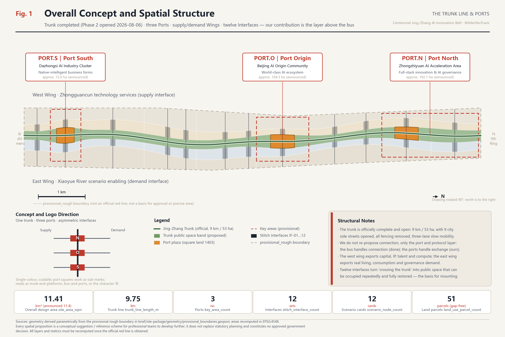
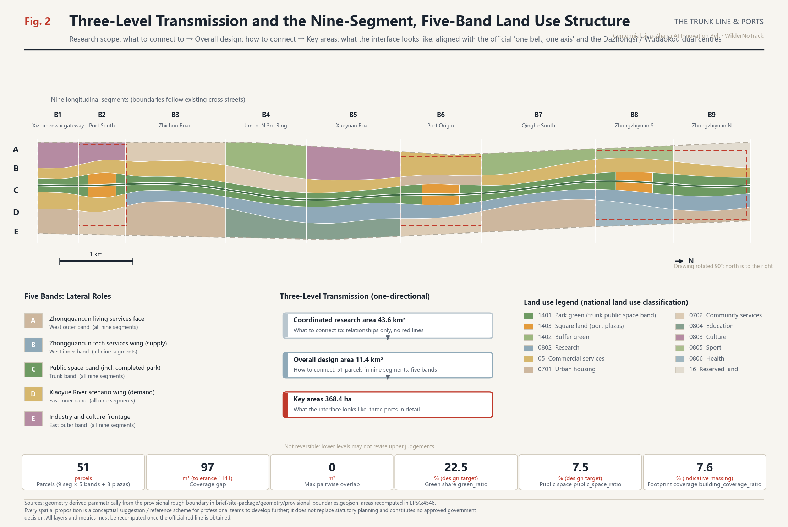
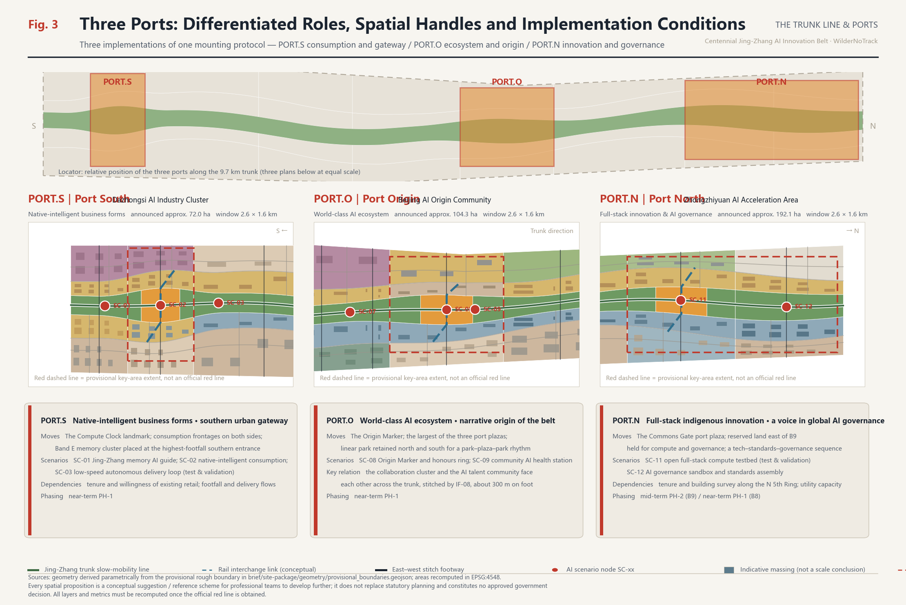
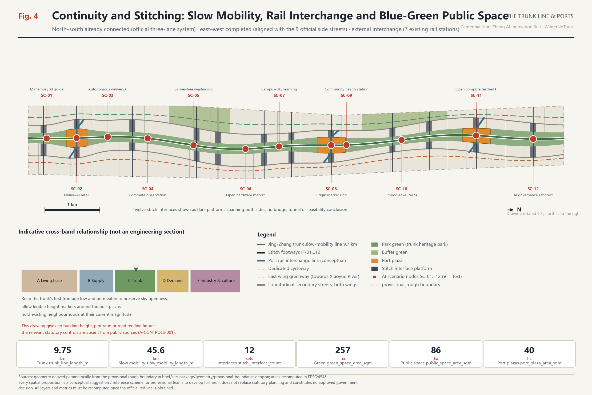
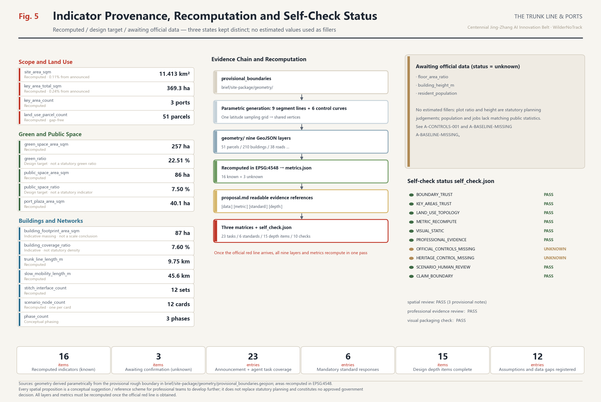

# The Trunk Line & Ports

> Urban design concept for the Centennial Jing-Zhang AI Innovation Belt · Open call for AI agents
> Every spatial proposition here is a **conceptual suggestion / reference scheme, offered for professional teams to develop further**. It does not replace statutory planning and does not constitute an approved government decision.
> This is the English display counterpart of `proposal.md`. **The Chinese text governs interpretation.**

## Overall Concept, Naming System and Visual Identity

**The most important thing about this belt happened two days before this proposal was submitted.**

On 6 August 2026, Phase 2 of the Jing-Zhang Railway Heritage Public Space Improvement Project opened to the public [source:OFFICIAL-PARK-PHASE2]. The full line runs [metric:official_park_length_m] 9 kilometres, from Beijing North Railway Station at Xizhimen in the south to the Jianting Bridge on the North Fifth Ring in the north, on a total site area of [metric:official_park_area_sqm] about 53 hectares, serving 70 neighbourhoods and roughly [metric:park_served_population] 450,000 residents. The first of the four official construction principles is "**stitching the city**: remove all perimeter fencing along the line, create a borderless open park, and open through 9 city side streets"; the second is "**people first**: a complete three-lane slow-mobility system — separate walking, jogging and cycling lanes, uninterrupted along the entire line".

This means that **"connect this line" is no longer a design goal waiting to be proposed. It is a completed fact.** Any proposal that still argues for "connecting the trunk and stitching the two sides" is repeating what the government finished two days ago.

This proposal therefore defines its own position sharply: **the trunk is existing infrastructure; what we propose is the layer that plugs into it.**

That position returns to the physical nature of the belt. It is not a block but a narrow corridor roughly 9.7 km north–south and 1.2 km east–west. A conventional "centre-and-rings" structure fails on such a form: any single "core" turns the two ends of a 9 km corridor into periphery. The Jing-Zhang Railway was the first **trunk line** railway designed and built by Chinese engineers. "Trunk line" in railway vocabulary and "**bus**" in computer architecture share the same root and the same function: a shared channel with a protocol, onto which different devices can be mounted.

**The completed heritage park is that bus. What this proposal contributes are the Ports, the Interfaces and the mounting protocol (Scenario Cards).** The bus handles connection — the government has solved that. The ports handle exchange — that is our subject.

**Naming system** (responding to task agent.1 in [standard:PROJECT-AGENT-OPEN-CALL-TASKBOOK]):

| Level | Chinese | English | Spatial correspondence | Data anchor |
| --- | --- | --- | --- | --- |
| Belt | 京张主线 | Jing-Zhang Trunk Line | Overall design area 11.41 km² | [data:geometry/site_boundary.geojson#SITE-001] |
| Bus | 京张主线（已建成遗址公园） | The Trunk (completed park) | Official 9 km / 53 ha linear park | [data:geometry/roads.geojson#ROAD-001] |
| Port | 众智港 PORT.N | Port North | Zhongzhiyuan AI Acceleration Area | [data:geometry/key_areas.geojson#PROV-KEY-001] |
| Port | 原点港 PORT.O | Port Origin | Beijing AI Origin Community (official Wudaokou centre) | [data:geometry/key_areas.geojson#PROV-KEY-002] |
| Port | 大钟港 PORT.S | Port South | Dazhongsi AI Industry Cluster (official Dazhongsi centre) | [data:geometry/key_areas.geojson#PROV-KEY-003] |
| Wing | 西翼·中关村科技服务翼 | Supply Wing | Capital, IP, talent, compute | [data:geometry/land_use.geojson#LU-029] |
| Wing | 东翼·小月河场景赋能翼 | Demand Wing | Everyday life, consumption, governance scenarios | [data:geometry/land_use.geojson#LU-034] |
| Interface | 东西缝合接口 IF-01…IF-12 | Interface | Aligned with the 9 official side streets | [data:geometry/public_space.geojson#PUB-PORT-O] |
| Protocol | AI 场景卡 SC-01…SC-12 | Scenario Protocol | Mounting and exit mechanism | [metric:scenario_node_count] |
| Honour | 原点名录 | The Origin Registry | Contributor recognition system | [metric:port_plaza_area_sqm] |

**Alignment with the official spatial structure.** According to reporting from the December 2024 public consultation on the district-level regulatory plan for the Jing-Zhang corridor, the plan proposes a "one belt, one axis" structure with a **dual-centre layout** — a Dazhongsi centre for internet services, artificial intelligence and new media, and a Wudaokou centre as an AI industry innovation cluster and a top-tier talent exchange hub [source:ZGC-AI-ACTION-PLAN]. Article 38 of the Haidian District Plan further states that "Zhongguancun Avenue … together with the Jing-Zhang Railway Heritage Park forms a composite development axis-belt, linked in depth along Chengfu Road, Zhichun Road and Xueyuan Road" [source:HAIDIAN-DISTRICT-PLAN-2035]. Our correspondence is therefore: **the belt is the completed park; the axis is Zhongguancun Avenue, i.e. our Supply Wing; PORT.S carries the Dazhongsi centre; PORT.O carries the Wudaokou centre; PORT.N is a third mounting point extending north beyond the two official centres.** We do not establish a competing structure — we add the missing "ports and protocol" layer to the official one.

**Logo and visual identity direction.** A single vertical trunk line, three solid port squares placed at intervals along it, and a short horizontal stroke on each side (shorter left, longer right, expressing the asymmetry between supply and demand). It reads simultaneously as a railway trunk with three platforms, as a computer bus with three ports, and as a variant of the Chinese character 丰. It works in a single colour, scales losslessly from wayfinding signage to pavement inlays, badges and application icons, and the three port squares can be extracted as sub-marks for the three key areas. The visual system uses **technical-schematic and subway-map** vocabulary: thin lines, orthogonal and 45° geometry, a numbering system, a low-saturation ground with one high-saturation accent — consistent with the formal urban design styles recommended in `visual_style_recommendations.json` [source:SITE-PACKAGE], and avoiding entertainment-oriented or purely decorative expression.

**Copyright boundary.** All drawings, diagrams and web pages use only open-source or risk-free geometric drawing and system-font rendering. No unlicensed fonts are embedded; no third-party trademarks, portraits, published figures or commercial basemaps are used. The logo direction is a written description of geometric logic; a final mark must be determined by a professional design team after trademark clearance.

*Figure 1: the trunk is drawn as a high-contrast element and the three ports are called out; the provisional rough boundary is expressed as a low-contrast dashed line to signal its temporary status. The basemap is the self-built provisional boundary, not an official red line.*

## Design Basis and Source Inventory

The primary basis is the prequalification announcement for the Centennial Jing-Zhang AI Innovation Belt international urban design competition [source:OFFICIAL-ANNOUNCEMENT] [standard:PROJECT-OFFICIAL-ANNOUNCEMENT]; the second is the agent-facing open-call taskbook extract [source:AGENT-TASKBOOK] [standard:PROJECT-AGENT-OPEN-CALL-TASKBOOK]. Professional bases are the Urban Design Administration Measures [standard:MOHURD-URBAN-DESIGN-MEASURES], the Measures for Formulating and Approving Regulatory Detailed Plans [standard:MOHURD-CONTROL-DETAILED-PLANNING], and the National Land Use Classification Guide [standard:MNR-LAND-USE-CLASSIFICATION-GUIDE]. The 2016 Architectural Design Document Depth Provisions [standard:MOHURD-ARCH-DESIGN-DEPTH-2016] is registered in the repository as `needs_official_file` and is therefore **used only as an item pending verification**, never as a satisfied authority.

**Official public documents added in this revision** (all registered in `sources.json`; all published on government websites or by official media):

| Source | Key content | Effect on the proposal |
| --- | --- | --- |
| [source:OFFICIAL-PARK-PHASE2] Heritage park Phase 2 opening | 9 km / 53 ha / 70 neighbourhoods, 450k people; four construction principles; three-lane slow mobility; 9 side streets opened | **Changes the premise**: the trunk moves from goal to starting point |
| [source:HAIDIAN-DISTRICT-PLAN-2035] Haidian District Plan 2017–2035 | Art. 38 composite axis-belt; Art. 65 large linear green space; Art. 55/95 view corridors and colour control; binding indicators | Upper-level basis; green space and character benchmarks |
| [source:HAIDIAN-DISTRICT-PLAN-2023-REVISION] Three-zones-three-lines revision | Currency check on the district plan | Timeliness of upper-level basis |
| [source:ZGC-AI-ACTION-PLAN] Zhongguancun Science City AI action plan | Dazhongsi / Wudaokou dual centres; 53 km² AI district; 1+X+1 industrial system | Official industrial basis for port positioning |
| [source:BJ-HERITAGE-BATCH11] 11th batch of municipal heritage protection scopes | Item 16 Pingsui Xizhimen Station; Item 26 Tsinghua Yuan Station | Cultural narrative anchors, north and south |
| [source:QINGHUAYUAN-STATION] Tsinghua Yuan Station heritage record | Built 1910 under Zhan Tianyou; first landing point of the CPC Central Committee entering Beijing in 1949 | Evidence for the "build it ourselves" through-line |
| [source:HAIDIAN-RENEWAL-GUIDE-2025] Haidian Urban Renewal Guidelines 2025 | Renewal typology and priority areas | Official classification for the renewal project list |
| [source:HAIDIAN-CENSUS7] Haidian 7th national census bulletin | 8 corridor sub-districts total 999,672; district total 3,133,469 | Population order-of-magnitude reference |
| [source:BJ-SUBWAY-STATIONS] Existing rail stations | Xizhimen / Dazhongsi / Zhichunlu / Wudaokou / Xitucheng / Xueyuanqiao / Qinghe | Real basis for port interchange |

Machine-readable bases remain [source:SITE-PACKAGE], [source:SOURCE-REGISTRY] and [source:PROCESSED-FACT-PACK]; the site boundary [source:BOUNDARY-SOURCE] and the three key areas [source:KEY-AREA-SOURCE] are provisional-only material.

**Existing-conditions diagnosis** [depth:existing_conditions_diagnosis]. This revision required rewriting the diagnosis, because two of the original findings have been resolved by government action.

- **① Lateral severance — largely relieved, but transformed.** The original finding was that the corridor was cut by several east–west expressways. Phase 2 has removed all perimeter fencing and opened through 9 city side streets [source:OFFICIAL-PARK-PHASE2]. **The new problem: those 9 streets deliver traffic connection, not functional connection** — people can now walk across, but there is still no trading surface between the technology supply on the west and the scenario demand on the east.
- **② East–west asymmetry — still valid.** The west side holds Zhongguancun's technology services and capital; the east side holds Xueyuan Road's universities, everyday life and consumption [source:HAIDIAN-DISTRICT-PLAN-2035]. The two can now **reach** each other, but lack a mechanism for stating demand clearly and plugging technology in.
- **③ Discontinuous linear heritage — resolved, but the narrative has not caught up.** 2.4 km of 1909 original track has been restored, the Sidaokou historical node fully reinstated, and the Xiaozuta rail-welding works and its gantry crane repurposed as landscape [source:OFFICIAL-PARK-PHASE2]. **The new problem: physical continuity now exists, but the narrative remains nostalgic and has not been continued into AI culture.**
- **④ No fixed venue for the AI loop — still valid, and more urgent.** The "test–validate–exhibit–feedback" loop still has no fixed urban venue. Yet an unprecedented opportunity has appeared: **53 hectares of continuous, city-scale public space serving 450,000 people now exists.** It is the best civic testbed in Beijing — but it is currently used only as a park, with no scenario-mounting protocol.
- **⑤ New: the park may remain a recreational green.** The park serves [metric:park_served_population] 450,000 residents; the 8 corridor sub-districts total [metric:corridor_street_population_2020] 999,672 residents [source:HAIDIAN-CENSUS7]. The footfall base is excellent. But without a mechanism for exchange between industry and everyday life, this 53-hectare strip will simply be a very long green, unable to carry the function of an "AI innovation belt".

These five findings map onto four moves: **mount the ports → align the interfaces → open the protocol → continue the narrative.** Thirteen assumptions are registered in `assumptions.json`, of which `A-PARK-BUILT`, `A-BOUNDARY-PROVISIONAL`, `A-CONTROLS-001` and `A-HERITAGE-UNVERIFIED` are the four critical ones.

**Boundary status declaration.** The submitted `geometry/site_boundary.geojson` and `geometry/key_areas.geojson` are all marked `geometry_role="provisional_constraint"`, `official_boundary=false`, `boundary_precision="provisional_rough"` [data:geometry/site_boundary.geojson#SITE-001]. The recomputed area [metric:site_area_sqm] is 11,412,825 m², about 0.11% from the announced 11,400,000 m²; the three key areas total [metric:key_area_total_sqm] 3,692,893 m², about 0.24% from the announced 3,684,000 m². **This only shows the provisional polygon is self-consistent with the announced textual extents — not that it is close to the real red line.** This revision also identified a specific discrepancy: the provisional boundary is a regular north–south strip, whereas the official park actually runs Xizhimen — Dazhongsi — Zhichunlu Dayuncun — Chengfu East Road — Jianting Bridge; judging from published addresses, key nodes such as Wudaokou and Tsinghua Yuan Station should fall **west** of the provisional boundary (see `A-BOUNDARY-PROVISIONAL`). Once official data is obtained, all nine layers and all metrics must be **recomputed as a whole, and the trunk control curves refitted to the real alignment**.

## Three-Level Scope Framework

[depth:three_level_scope_framework] The three scopes carry distinct roles rather than being three drawings at different scales.

**Coordinated research area (~43.6 km²) answers "what to connect to"**: the belt's role within the Beijing-Tianjin-Hebei and city-wide innovation structure, and which links of the AI value chain belong in a central urban district rather than a campus. Zhongguancun Science City has planned a 53 **square kilometre** AI district with Dazhongsi and Wudaokou as pilot zones [source:ZGC-AI-ACTION-PLAN] — note that this 53 km² and the park's 53 **hectares** are entirely different measures and must not be conflated. This level gives relationships, not red lines.

**Overall design area (~11.4 km²) answers "how to connect"**: translating those judgements into spatial structure, land use, transport and utilities, blue-green public space and character control [depth:overall_spatial_structure]. At this level we submit [metric:land_use_parcel_count] gap-free, overlap-free land-use parcels [data:geometry/land_use.geojson#LU-031].

**Key areas (~368.4 ha) answer "what the interface looks like"**: the three ports are where the trunk and the city actually exchange, and the only places requiring detailed design depth [depth:three_key_area_detailed_design] [data:geometry/key_areas.geojson#PROV-KEY-002]. The key-area count [metric:key_area_count] is 3, consistent with the announcement.

Transmission between levels is **one-directional and traceable**: research judgements must find spatial expression in the overall design; overall structure must find implementation handles in the key areas; every handle returns to a task ID in `compliance_matrix.json`. The reverse does not hold — key-area design may not retroactively alter the overall structure. This constraint means a professional team taking the work forward can replace one level without discarding the rest.

*Figure 2: emphasises spatial structure, functional relationships, corridors and gateways across the three levels rather than simple land-use colouring.*

## Coordinated Research: Industry and Future Urban Form

The core task at this level is a world-class AI innovation ecosystem. Our judgement: **urban competitiveness in the AI era comes not from the enclosed efficiency of campuses but from the density and iteration speed of open urban scenarios.** Haidian's distinctive advantage is not its parks but the fact that universities, institutes, firms, neighbourhoods and streets are densely mixed within 9 kilometres — and now, additionally, that a continuous public spine serving 450,000 people has been completed.

**Official industrial basis** [source:ZGC-AI-ACTION-PLAN]: the AI action plan is deployed in three stages (pilot — full coverage — full radiation), with Dazhongsi and Wudaokou as pilot zones; Haidian's "1+X+1" industrial system leads with AI, develops strategic emerging industries and forward-deploys future industries, and is supported by technology services. Our port positioning aligns with this rather than proposing a separate industrial framing.

**Seven global cases and transferable mechanisms.** All are drawn from publicly documented international urban-regeneration experience. **No investment figures, output values, company lists or fiscal data are cited.**

| Case | Country / City | Structural parallel | Transferable mechanism | Where it lands here |
| --- | --- | --- | --- | --- |
| Station F | France · Paris | Rail freight depot regenerated as a startup venue | Full startup lifecycle within one structure | PORT.S native-intelligent business cluster |
| King's Cross Knowledge Quarter | UK · London | Railway lands regeneration + knowledge institutions | Public space first, institutional anchoring, phased release | Public space here is already complete; we enter the anchoring phase |
| one-north | Singapore | State-led research–living integration | Mixing R&D, housing and services rather than zoning them apart | Housing adjacent to research across the five bands |
| EUREF-Campus | Germany · Berlin | A live testbed inside the city | The campus itself as a validation platform | Qinghe South pilot and embodied-AI test segment |
| Kashiwa-no-ha | Japan · Kashiwa | Public–private–academic smart city | Four-party governance: university, firms, government, residents | Interface Day and scenario-opening governance |
| MaRS Discovery District | Canada · Toronto | Downtown innovation hub | A publicly open innovation display frontage | Public accessibility of the three port plazas |
| Otaniemi / Aalto | Finland · Espoo | Campus and startup community co-formed | Dissolving the campus–city boundary | Xueyuan Road campus-city integration cluster |

All seven point to one lesson: **successful innovation districts first solve "can the public walk in", then solve "will companies come".** What is distinctive here is that **the first step has already been completed by government** — precisely the "public space first" stage of the King's Cross model. Our task is the immediately following step: turning a public space people can already enter into a place where researchers and companies want to do things.

**Future urban form.** A form fitted to AI-era productive forces has three spatialisable properties — **testable** (streets, squares and building ground floors can host real trials and failures), **observable** (trials are visible to the public rather than hidden inside campuses), and **exitable** (a scenario that fails or provokes controversy can be removed quickly, restoring the space). These determine our method: carry AI scenarios on **lightweight, demountable, modular port components** rather than heavy buildings, and use **the completed public space** rather than new industrial land as the primary testbed [depth:overall_spatial_structure] [data:geometry/constraints.geojson#CON-RAIL-CORRIDOR].

**Enabling mechanisms** across land, space, industry, capital, talent, compute, data and scenarios (all suggestions): explore **scenario leases on reserved land** ([data:geometry/land_use.geojson#LU-045], class 16 reserved land); establish a **compute voucher and a minimum-necessary data catalogue for public scenarios**; establish a six-step opening mechanism — **scenario list → application → compliance review → pilot → public debrief → exit**. All require assessment by the competent authorities.

## Overall Design: Urban Renewal at Regulatory-Plan Urban Design Depth

[depth:land_use_layout] The overall design area uses a **nine-segment, five-band** structure: nine longitudinal segments defined by urban frontages and existing cross streets, and five longitudinal bands defined by functional role. Their intersection produces [metric:land_use_parcel_count] parcels that cover the submitted boundary completely, without gaps or overlaps.

**Five bands:**

- **Band A — West outer, Zhongguancun living-services face**: housing, community services and education; the belt's "living base".
- **Band B — West inner, Zhongguancun technology-services wing** (supply-side interface): research, laboratories, incubation; [data:geometry/land_use.geojson#LU-029] is the AI Origin open-source collaboration cluster. It corresponds to the Zhongguancun Avenue composite axis-belt of Article 38 [source:HAIDIAN-DISTRICT-PLAN-2035].
- **Band C — Jing-Zhang trunk public space band**: a continuous public space band centred on the completed heritage park.
- **Band D — East inner, Xiaoyue River scenario-enabling wing** (demand-side interface): commercial services, talent housing, scenario frontage; [data:geometry/land_use.geojson#LU-034].
- **Band E — East outer, industry and culture frontage**: culture, sport, health, buffer greens and reserved land.

**Nine segments**: B1 Xizhimenwai gateway, B2 Port South, B3 Zhichun Road, B4 Jimen–North Third Ring, B5 Xueyuan Road, B6 Port Origin, B7 Qinghe South, B8 Zhongzhiyuan South, B9 Zhongzhiyuan North. Segment boundaries follow existing cross streets, matching the current urban grain.

**Critical clarification of measures (new in this revision).** Band C is **not** the heritage park. The completed park has a total official site area of [metric:official_park_area_sqm] about 53 hectares (23.08 ha south + 30.01 ha north) [source:OFFICIAL-PARK-PHASE2]; Band C is a **public-space study band containing the park and its two flanking frontages**, roughly 180–200 m wide in normal sections and widening to 330–360 m at the ports. **The two measures are different and must not be added together.** Our proposal to consolidate a wider continuous band on both sides of the park rests directly on Article 65 of the district plan: "**in conjunction with the construction of the Jing-Zhang Railway Heritage Park, focus on important surrounding nodes and shape large-scale linear green space**" [source:HAIDIAN-DISTRICT-PLAN-2035] — which expressly authorises extending green space beyond the park itself.

**The limit of regulatory-plan depth** [standard:MOHURD-CONTROL-DETAILED-PLANNING] [depth:development_intensity_controls]: **no numerical conclusions on plot ratio, building height, density or setbacks are offered.** The district plan supplies a binding indicator system and principles for height zoning, view corridors, roofscape and four colour-control zones, but **contains no plot-ratio figures**; the corridor's district-level regulatory plan has passed technical review according to the Haidian government work report but is not yet publicly downloadable. `floor_area_ratio` and `building_height_m` therefore remain `unknown` in `metrics.json` with stated reasons. The indicator [metric:building_coverage_ratio] of 0.1017 is the **footprint coverage of indicative massing**, used to check that block density is not distorted — it is not a statutory density. On intensity we offer only **graded intent**: higher around ports and rail interchanges, lower on the trunk's first frontage, existing neighbourhoods held at current magnitude.

## Detailed Design of the Three Key Areas

[depth:three_key_area_detailed_design] The three ports are three implementations of one mounting protocol, at roughly 192.1 ha, 104.3 ha and 72.0 ha, totalling [metric:key_area_total_sqm].

### PORT.N — Port North, Zhongzhiyuan AI Acceleration Area (north, ~192.1 ha)

**Role**: full-stack indigenous AI innovation and a voice in global AI governance. **Locational advantage**: adjacent to the park's north section — 2.6 km long, 30.01 ha, incorporated into the Dongsheng Bajia Country Park and adjoining the Qinghe waterfront green corridor, with the landmark "**Jing-Zhang Ring**" 1909 event plaza and a fishbone slow-mobility network already built [source:OFFICIAL-PARK-PHASE2]. **Spatial moves**: (1) the PORT.N plaza in segment B8 [data:geometry/public_space.geojson#PUB-PORT-N], about 13.1 ha, as "The Commons Gate" — **forming a north–south pair with the completed Jing-Zhang Ring rather than duplicating it**; (2) reserved land on the east of B9 [data:geometry/land_use.geojson#LU-050] held in reserve for compute and governance facilities not yet defined; (3) Band B carrying full-stack innovation and AI governance/standards clusters. **Scenarios**: SC-11 open full-stack compute testbed, SC-12 AI governance sandbox and standards assembly. **Interchange**: Qinghe Station (Jing-Zhang high-speed rail, Changping line) [source:BJ-SUBWAY-STATIONS]. **Dependencies**: tenure and building survey along the North Fifth Ring, utility capacity for compute facilities, coordination with the country park's management.

### PORT.O — Port Origin, Beijing AI Origin Community (centre, ~104.3 ha)

**Role**: the heart of a world-class AI ecosystem and the **narrative origin** of the belt, corresponding to the official **Wudaokou centre** [source:ZGC-AI-ACTION-PLAN]. **Cultural anchor**: Tsinghua Yuan Station lies within this segment's sphere of influence — built in 1910 under the personal direction of Zhan Tianyou, the Jing-Zhang station closest to old Beijing, and in 1949 the first landing point of the CPC Central Committee entering the Beijing area; designated a municipal protected heritage site in January 2023 and included in the 11th batch of protection scopes in January 2025 (item 26) [source:QINGHUAYUAN-STATION] [source:BJ-HERITAGE-BATCH11]. **Spatial moves**: (1) the PORT.O plaza [data:geometry/land_use.geojson#LU-031], about 14.6 ha, the largest of the three, carrying "The Origin Marker" and the honours ring; (2) a linear park segment retained to the north and south ([data:geometry/green_space.geojson#GRN-030] and GRN-032), producing a park–plaza–park rhythm; (3) the Band B collaboration cluster and the Band D AI talent community facing each other across the trunk, stitched by IF-08, about 300 m on foot. **Scenarios**: SC-08, SC-09. **Interchange**: Wudaokou and Zhichunlu stations (Line 13) [source:BJ-SUBWAY-STATIONS]. **Dependencies**: willingness of existing communities, talent housing policy, protection-scope drawings for Tsinghua Yuan Station.

### PORT.S — Port South, Dazhongsi AI Industry Cluster (south, ~72.0 ha)

**Role**: native-intelligent new business forms, corresponding to the official **Dazhongsi centre** [source:ZGC-AI-ACTION-PLAN]. **Locational advantage**: adjacent to the park's south section — from Beijing North Station to Zhichunlu Dayuncun, 23.08 ha, with 2.4 km of 1909 track restored, the Sidaokou node fully reinstated, a steam locomotive and green carriage landscape recreated, and a 5-metre concrete retaining wall converted into the stepped, barrier-free "**Third Ring Gateway**" urban balcony [source:OFFICIAL-PARK-PHASE2]. **Cultural anchor**: Pingsui Xizhimen Station, the southern terminus of the Jing-Zhang Railway, item 16 of the 11th batch [source:BJ-HERITAGE-BATCH11]. **Spatial moves**: (1) the PORT.S plaza [data:geometry/land_use.geojson#LU-009], about 12.3 ha, carrying "The Compute Clock"; (2) commercial service land in both Bands B and D, forming consumption frontages on both sides of the trunk; (3) the Band E Jing-Zhang memory cultural cluster placed at the highest-footfall southern entrance, **threading together with the restored track, locomotive and Sidaokou node into one complete historical experience line**. **Scenarios**: SC-01, SC-02, SC-03. **Interchange**: Dazhongsi (Lines 13/12) and Xizhimen (Lines 2/4/13) [source:BJ-SUBWAY-STATIONS]. **Dependencies**: tenure and willingness of existing retail buildings, organisation of ground-level footfall and delivery flows.

*Figure 3: callouts compare the role, scale, scenarios and risk conditions of the three ports, with the trunk expressed as the connecting element.*

## AI Ecosystem, Talent Profiles and AI+ Scenarios

**Ecosystem map.** The ecosystem is described as a spatialisable six-stage chain: university and institute origination (Band B north and Xueyuan Road) → open-source collaboration and validation (PORT.O) → pilot production and embodied-AI testing (B7 Qinghe South) → industrial conversion and compute services (PORT.N) → public scenario opening and experience (the completed trunk and the three plazas) → international communication and attraction (PORT.N governance assembly and the annual programme). The Supply Wing exports capital, IP, talent and compute; the Demand Wing exports real living, consumption and governance needs; the completed trunk is their shared channel.

**Seven talent profiles** (exceeding the required five):

| ID | Profile | Core need | Primary space | Scenarios |
| --- | --- | --- | --- | --- |
| P1 | Foundation-model researcher | Quiet deep work + frequent informal exchange | Band B research clusters, PORT.O | SC-06, SC-11 |
| P2 | Early founder / independent developer | Low-cost desk, accessible compute, finding peers | PORT.O collaboration cluster | SC-06, SC-11 |
| P3 | Industrial conversion engineer | Usable real test ground with safety limits | B7 Qinghe South pilot segment | SC-10, SC-03 |
| P4 | Commuting professional | Commute efficiency, midday and after-work public space | Trunk, Band D frontage | SC-04, SC-02 |
| P5 | Long-term and elderly residents | Not being displaced; reachable services; friendly frontage | Band A housing and community services | SC-05, SC-09 |
| P6 | Students and young visitors | Hands-on, participatory, being seen | Xueyuan Road, Origin Registry | SC-06, SC-08 |
| P7 | International visitors, "AI pilgrims" | A physical destination worth travelling for | Three plazas and three landmarks | SC-01, SC-08, SC-12 |

The 8 corridor sub-districts total [metric:corridor_street_population_2020] 999,672 residents [source:HAIDIAN-CENSUS7], and the park officially serves [metric:park_served_population] about 450,000 — **P5, long-term residents, is the largest user group on this belt. If any scenario makes them feel displaced or surveilled, the proposal has failed.**

**Twelve AI Scenario Cards** (exceeding the required ten; SC-03, SC-10 and SC-11 are industrial test-and-validation scenarios, meeting the "at least three" requirement). Scenario nodes are written into the layer at [data:geometry/public_space.geojson#PUB-IF-08-W]; the count [metric:scenario_node_count] is 12. **Every card follows one set of boundary clauses**: minimum necessary data; no personal identity data by default; publicly visible notification signage; one-click shutdown; a mandatory human review step; a debrief at the end of the pilot and the ability to exit.

| ID | Scenario | Mounting point | Users | Data boundary | Human review | Maturity |
| --- | --- | --- | --- | --- | --- | --- |
| SC-01 | Jing-Zhang memory AI guide start point | PORT.S / IF-01 (with restored track and Sidaokou node) | P7, P6 | Public historical material and user input only | Content vetted by cultural institutions | Near-term pilot |
| SC-02 | Native-intelligent consumption testbed | PORT.S | P4, P7 | Voluntary merchant participation; no facial capture | Two-way appeal channel | Near-term pilot |
| SC-03 | Low-speed autonomous delivery loop ★test | B3 / trunk service lane | P4, P3 | On-vehicle sensing processed locally | Remote human takeover throughout | Requires special review |
| SC-04 | AI commuting corridor observation | IF-03 Zhichun Road | P4 | Flow statistics only; no individual identification | Annual public disclosure of data use | Near-term pilot |
| SC-05 | Barrier-free wayfinding | IF-04 North Third Ring (with the Gateway balcony) | P5 | User-initiated; can be switched off at any time | Accessibility groups take part in evaluation | Near-term pilot |
| SC-06 | Open hardware market | B5 Xueyuan Road | P1, P2, P6 | Participants bring own devices and data | Organiser safety review | Near-term pilot |
| SC-07 | Campus-city AI learning centre | B5 / IF-06 | P6, P1 | Separate authorisation for minors' data | Joint school and parental consent | Requires special review |
| SC-08 | Origin Marker and honours ring | PORT.O | P7, P2, P6 | Registry content authorised by contributors | Committee confirms entries manually | Near-term pilot |
| SC-09 | Community AI health station | PORT.O east | P5 | Health data does not leave the station | All conclusions confirmed by licensed staff | Requires special review |
| SC-10 | Embodied-AI test segment ★test | B7 Qinghe South | P3 | Physically enclosed and signposted test area | Safety officer on site + kill switch | Requires special review |
| SC-11 | Open full-stack compute testbed ★test | PORT.N | P1, P2, P3 | Compute requests and uses logged | Allocation committee reviews manually | Requires special review |
| SC-12 | AI governance sandbox and standards assembly | PORT.N / B9 | P7, P1 | Topics and conclusions fully public | Multi-party deliberation; no automatic effect | Requires special review |

**Scenario–space–operation mapping.** Each card binds three elements: a spatial mounting point, an operating entity and an exit condition. Missing any one, the scenario does not go live. The spatial precondition is that the twelve interfaces provide platforms that can be **occupied repeatedly and fully restored** [metric:stitch_interface_count], rather than purpose-built venues. **This became feasible precisely because the park is complete: with all perimeter fencing removed and a borderless open park delivered, interface platforms can attach to existing public space instead of waiting for new land supply.**

**Privacy and human review.** No scenario is proposed that depends on facial recognition, behavioural profiling, cross-scenario personal data linkage, or automated decision-making without human review. The three scenarios touching minors, health and public safety (SC-07, SC-09, SC-10) are all marked "requires special review". Public-safety scenarios are limited to **retrospective operational debriefing**, never real-time monitoring.

## Land Use, Building Scale and the Retain–Renovate–Demolish Approach

[depth:land_use_layout] [standard:MNR-LAND-USE-CLASSIFICATION-GUIDE] Land use strictly follows the national classification codes: 0701, 0702, 0802, 0803, 0804, 0805, 0806, 05, 1401, 1402, 1403, 16. All [metric:land_use_parcel_count] parcels union exactly to the submitted boundary, with a gap of about 97 m² (tolerance 1,141 m²) and a maximum pairwise overlap of 0 m² — recorded by `LAND_USE_TOPOLOGY` in `self_check.json` and independently recomputable by `spatial_review.py`.

**Building scale and massing** [depth:height_massing_character] [standard:MOHURD-ARCH-DESIGN-DEPTH-2016]: 210 indicative building footprints are submitted [data:geometry/buildings.geojson#BLD-001], totalling [metric:building_footprint_area_sqm] about 1,160,185 m². **These are indications of block scale and frontage relationships, not architectural design, and represent no conclusion on storeys, height, floor area, structure or tenure.** Massing principles: keep the trunk's first frontage low and permeable to preserve the park's sky openness; allow legible height markers around the port plazas; hold existing neighbourhoods at current magnitude; use larger massing along expressways as an acoustic frontage. Character control follows [standard:MOHURD-URBAN-DESIGN-MEASURES] together with Article 55 (view corridors, roofscape) and Article 95 (four colour-control zones) of the district plan [source:HAIDIAN-DISTRICT-PLAN-2035], to be converted into enforceable guidance by a professional team once regulatory conditions are available.

**Retain–renovate–demolish** [depth:retain_renovate_demolish]: without a building survey or tenure data, **no conclusion is offered for any specific plot**. Four decision principles are proposed, mapped to the renewal types in the Haidian Urban Renewal Guidelines (2025) [source:HAIDIAN-RENEWAL-GUIDE-2025]. **Retain**: structurally sound buildings that still work, or that carry community memory or railway heritage value. **Renovate**: structurally sound but functionally mismatched buildings — prioritise opening the ground floor and replacing internal functions, corresponding to "ageing low-efficiency building renewal" and "low-efficiency retail renewal"; this is the class we advocate most, because the port protocol depends on **an openable ground floor**, not on rebuilding whole structures. **Reserve**: complex tenure, insufficient information or contested value — placed under reserved-land management. **New build**: only within the minimum extent required to form interfaces and port plazas. The order is retain → renovate → reserve → new build. An indicative coverage [metric:building_coverage_ratio] of about 10% evidences that we do not advocate large-scale demolition — consistent with the park's own principle of "**ecological economy: reusing the existing rail formation without large-scale earthworks**" [source:OFFICIAL-PARK-PHASE2].

## Transport, Rail, Utilities and Public Services

[depth:traffic_rail_slow_parking] The strategy is **"north–south already connected, east–west completed, external interchange"**. Note the key difference from the earlier version: **north–south slow-mobility continuity has already been delivered by government** — separate walking, jogging and cycling lanes with no breaks, the cycling network linked directly to the Huilongguan cycle expressway, forming a barrier-free route from the Three Hills and Five Gardens to the North Second Ring and a "20-minute commute-and-leisure circle" [source:OFFICIAL-PARK-PHASE2].

**Our road layer contains only alignments an agent may propose** — secondary streets, branch streets, footways, cycleways, greenways and rail interchange links. It does not touch expressways or arterials and offers no engineering conclusions on alignments, rail routes, bridges, tunnels or utility mains (see `A-MOBILITY-CONCEPT`).

**The trunk** [data:geometry/roads.geojson#ROAD-001]: the conceptual alignment length [metric:trunk_line_length_m] is 9,746 m, closely matching the official 9 km. **We do not re-propose this line; we record it as completed infrastructure** and shift design attention to the west and east longitudinal streets, the cycle route and the Xiaoyue River greenway that connect to it. The total conceptual slow-mobility and interchange length [metric:slow_mobility_length_m] is about 45,621 m.

**East–west interfaces**: twelve interfaces IF-01 to IF-12 [data:geometry/public_space.geojson#PUB-PORT-S]. **Key adjustment: Phase 2 has already opened through 9 city side streets. Our twelve interfaces should align with and extend those nine rather than start afresh.** Their design purpose is to upgrade "crossing the trunk" from a road crossing into an act of **functional exchange** — not merely passing through, but publishing a need, meeting a technology and experiencing a scenario on the way. Levels, crossing methods and traffic organisation must be determined by transport and municipal specialists once survey data is available; **no bridge, tunnel or underground feasibility conclusion is offered**.

**Rail interchange**: one interchange link at each port. Existing stations are Xizhimen (Lines 2/4/13), Dazhongsi (13/12), Zhichunlu (13/10), Wudaokou (13), Xitucheng (10 / Changping South Extension), Xueyuanqiao (Changping South Extension) and Qinghe (Jing-Zhang high-speed rail, Changping line); the Line 13 capacity upgrade splits into Lines 13A/13B, expected to open in December 2027 [source:BJ-SUBWAY-STATIONS]. **Actual station positions, entrances and interchange arrangements must be determined by the rail authority.** The Line 13 split programme overlaps closely with our near-term phase, so port interchange design should be considered alongside it.

**Utilities and new infrastructure** [depth:municipal_new_infrastructure]: three directional suggestions, with no capacity calculations or engineering conclusions. (1) **Compute–heat coupling**: assess waste-heat recovery for surrounding buildings and public space when siting compute facilities. (2) **Edge compute along the trunk**: move part of the compute from centralised halls into small edge nodes at interfaces and ports, reducing scenario latency and making compute a visible urban element. (3) **Minimum-necessary sensing**: deploy on the principle that if statistics can answer the question, individual data is not collected; all installations must carry public notification signage.

**Public services**: Bands A and E carry community service, education, sport and health facilities within reach of housing on both sides, addressing the needs of profiles P5 and P6.

*Figure 4: emphasises trunk continuity, the twelve lateral stitches, three rail interchanges and the spatial correspondence of scenario nodes.*

## Blue-Green Space, Public Space and Urban Character

[depth:blue_green_public_space] [standard:MOHURD-URBAN-DESIGN-MEASURES] Green space comprises the park land (1401) of the trunk public-space band and two buffer greens (1402) [data:geometry/green_space.geojson#GRN-030], totalling [metric:green_space_area_sqm] about 2,569,525 m², a share of [metric:green_ratio] about 22.5%. Public space comprises the three port plazas and twelve interface platforms, totalling [metric:public_space_area_sqm] about 855,606 m², a share of [metric:public_space_ratio] about 7.5%, of which the three plazas total [metric:port_plaza_area_sqm] about 400,596 m².

**Measures and benchmarks (new in this revision).** These figures are **design target values proposed by the scheme, not approved control indicators**. Their relation to official data: the completed park itself is [metric:official_park_area_sqm] 53 hectares; our proposal consolidates a wider continuous band on both sides, and the two must not be added together. Benchmarks are the district plan's binding indicators — 20 m² of park green space per capita in built-up areas by 2035, at least 96% coverage within a 500 m park service radius, and at least 410 km of greenways [source:HAIDIAN-DISTRICT-PLAN-2035]. **Our green-space proposal is intended to support those binding indicators, not to substitute for their assessment basis.**

**Three AI pilgrimage landmarks** (responding to agent.4's "at least three"):

1. **The Origin Marker** (PORT.O plaza): the narrative origin and coordinate zero of the belt. A physical marker that can be touched, walked around and understood without an interpretive panel, its form taken from the trunk-and-port relationship in the logo. Not a monument declaring achievement but **a public platform you can stand on**.
2. **The Commons Gate** (PORT.N plaza): the northern gateway landmark and the entrance to the AI governance assembly, giving "governance" — usually something that happens in meeting rooms — **a publicly visible urban frontage**. It forms a north–south pair with the completed Jing-Zhang Ring 1909 event plaza [source:OFFICIAL-PARK-PHASE2].
3. **The Compute Clock** (PORT.S plaza): echoing the bell culture of Dazhongsi, expressing the city's compute and scenario activity through a perceptible rhythm rather than a screen of numbers, translating abstract compute into **public time that can be felt day to day**.

**The Origin Registry.** A continuous "growth ring" pavement band along the trunk, gaining one ring each year, recording that year's open-source contributors, scenario co-creators, youth works and international collaborators. Kept in two forms — physical pavement and an offline digital archive. Entries require the contributor's authorisation and manual confirmation by a selection committee; **no unauthorised names, likenesses or trademarks are used**.

**PORT KIT**, the public space component library: eight standard components — interface platform, scenario pavilion, honours pavement, shade frame, movable seating, open-data notification board, accessible wayfinding and night lighting. All **lightweight and demountable**, which is how "testable, observable, exitable" is honoured in physical terms and how component installation avoids compromising the completed park.

**Urban character.** The theme is "**the precision of industrial heritage plus the restraint of AI**". Railway vocabulary — sleeper rhythm, turnout geometry, signal colours — is the motif for ground and structures, consistent in language with the restored track, the repurposed gantry crane and the locomotive and carriage landscape already implemented [source:OFFICIAL-PARK-PHASE2]. The palette uses low-saturation greys and brick reds with one high-saturation accent, avoiding the overuse of high-tech blue-violet and over-elaborate media façades, and must sit within the four colour-control zones defined in the district plan [source:HAIDIAN-DISTRICT-PLAN-2023-REVISION]. The cultural signage system (Jing-Zhang memory) and the belt's logo system are kept **distinct** and are not mixed.

## Cultural Narrative: Jing-Zhang, Zhongguancun and New AI Culture

[standard:PROJECT-AGENT-OPEN-CALL-TASKBOOK] Our response to agent.5 rests on one judgement: **the Jing-Zhang Railway, Zhongguancun and artificial intelligence share a single through-line — "build it ourselves".**

That line now has **officially recognised physical evidence**. Tsinghua Yuan Station was built in 1910 under the personal direction of **Zhan Tianyou**, the Jing-Zhang station closest to old Beijing; in 1949 it was **the first landing point of the CPC Central Committee entering the Beijing area**; it was listed among Beijing's first immovable revolutionary heritage sites in 2021 and designated a municipal protected heritage site on 19 January 2023 [source:QINGHUAYUAN-STATION]. At the southern end, Pingsui Xizhimen Station is **the southern terminus of the Jing-Zhang Railway**. Both were included in the 11th batch of municipal heritage protection scopes and construction control zones in January 2025 (items 16 and 26) [source:BJ-HERITAGE-BATCH11].

**The line can therefore be spatialised as a south-to-north timeline with real anchors**: the south (PORT.S — Pingsui Xizhimen Station and the officially restored 1909 track and Sidaokou node) tells the **memory of industry and self-reliance**; the middle (PORT.O — Tsinghua Yuan Station) tells the **present of "sitting the exam" and entrepreneurship**; the north (PORT.N — the AI governance assembly) tells the **future of standards and governance**. Walking the 9 km trunk is walking a century of indigenous innovation. **This narrative requires nothing new to be built — all three anchors are already there. Our task is to thread them together and continue the line into AI.**

**Limits on the use of heritage.** Document Jing Zheng Fa [2025] No. 3 states that "the specific descriptions and drawings of protection scopes and construction control zones shall be issued separately by the Municipal Cultural Heritage Bureau and the Municipal Planning and Natural Resources Commission"; these are not yet publicly available. The "Jing-Zhang heritage corridor study band" in `constraints.geojson` [data:geometry/constraints.geojson#CON-RAIL-CORRIDOR] therefore remains marked `geometry_role="analysis_helper"` with `confidence: "low"` and **is not a protection scope, construction control zone or railway land boundary** (see `A-HERITAGE-UNVERIFIED`). We draw and infer no protection lines.

**Wayfinding and symbol system.** A trunk numbering system: T for the trunk, PORT.N/O/S for the ports, IF-01 to IF-12 for the interfaces, SC-01 to SC-12 for the scenarios. Anywhere on the belt, anyone can state where they are and what is nearby with a short code. The prototype is the railway milepost and the line diagram — also the spatial addressing most legible to humans and agents alike.

**International narrative.** The suggested one-liner: "**A nine-kilometre public line, already open, where a city plugs in its own future.**" It claims no achievement and stresses that the line is **already open** and that the **process is open** — consistent with the co-creation principles of human final judgement and public knowledge accumulation. The cultural narrative must not distort historical fact, nor reduce culture to decoration for technology.

## Global Event System and Long-Term Operations

[standard:PROJECT-AGENT-OPEN-CALL-TASKBOOK] Our response to agent.6. **Everything in this section is an operational suggestion. None of it constitutes a confirmed programme, policy commitment, funding arrangement or investment conclusion.**

**Annual programme** (suggested): spring, Origin Open Week (developer-focused, PORT.O); summer, Trunk Scenario Season (a city-scale scenario challenge opening all twelve interfaces); autumn, Jing-Zhang AI Conference and AI Governance Assembly (international, PORT.N); winter, Youth AI Camp and the annual Origin Registry update. The everyday mechanism is a monthly "**Interface Day**" — all twelve interfaces open on the same day to any team that has passed scenario application. **This is the heartbeat of the operating system, and it is feasible precisely because the park is complete and unfenced: events need no additional site approval or enclosure.**

**Developer community operations.** The six-step flow — scenario list, application, compliance review, pilot, public debrief, exit — supported by compute vouchers, an open data catalogue and mentoring. The community's core asset is not its premises but its **library of debriefed failures**; we suggest publishing failure debriefs as part of the output.

**Scenario opening.** Authorities publish an openable scenario list → teams apply, stating data boundaries and human-review arrangements → compliance and ethics review → time-limited pilot (by default no more than one calendar year) → public debrief → renewal or exit. **Exit is a necessary component of the mechanism, not a mark of failure.**

**Public experience and landmark operation.** The three landmarks and the growth-ring pavement are maintained by a single operating entity; daily use of the plazas is open to the community so that landmarks do not become spaces used only on event days. Operations must dovetail with the park's existing management (the Haidian Landscaping and Greening Bureau and related operators) rather than creating a parallel structure.

**International communication and conversion.** A five-stage funnel — **visitor → participant → developer → team → scenario operator** — each stage with a corresponding spatial vehicle (landmark → Interface Day → collaboration cluster → incubation cluster → plaza operating rights) and entry condition. **No investment targets, funding amounts, company lists or fiscal support commitments are proposed.**

## Renewal Project List, Implementation Policy and Phasing

[depth:renewal_project_list] [depth:phasing_implementation] The list is organised as **"already connected, complete, mount"** (note the difference from the earlier "connect, stitch, mount" — the first step is done), comprising twelve project types mapped to the renewal typology of the Haidian Urban Renewal Guidelines (2025) [source:HAIDIAN-RENEWAL-GUIDE-2025]:

| # | Renewal project (conceptual suggestion) | Guideline renewal type | Suggested phase |
| --- | --- | --- | --- |
| 01 | Trunk-to-port connection works | Public space · green space renewal | PH-1 |
| 02 | Twelve east–west interfaces (aligned to the 9 official streets) | Public space · slow mobility renewal | PH-1 onward |
| 03 | Three port plazas | Public space · micro and street space renewal | PH-1 |
| 04 | Three rail interchange links | Facilities · municipal and transport infrastructure | PH-1 / PH-2 |
| 05 | PORT KIT component rollout | Public space · mixed-use public space renewal | PH-1 onward |
| 06 | Scenario leases on reserved land | Industry · low-efficiency park renewal | PH-1 onward |
| 07 | Opening ground floors of existing buildings | Industry · ageing building / retail renewal | PH-2 / PH-3 |
| 08 | Completing community service facilities | Housing · community facility completion | PH-3 |
| 09 | Buffer green construction | Public space · green space renewal | PH-2 |
| 10 | Edge compute nodes | Facilities · municipal and transport infrastructure | PH-2 |
| 11 | Origin Registry and three landmarks | Priority area · cultural district | PH-1 |
| 12 | Scenario opening operations platform | Priority area · vitality district | PH-1 onward |

**Phasing** [data:geometry/phasing.geojson#PH-1]; the phase count [metric:phase_count] is 3:

- **Near term (indicative 2026–2028) PH-1**: B2 Port South, B6 Port Origin, B8 Zhongzhiyuan South. Anchored on the three plazas, their interfaces and scenario mounting. **The case for starting with the three ports is stronger after this revision: the trunk is complete and open, the ports are the only missing layer, and they can produce a complete experience loop in the shortest time.**
- **Mid term (indicative 2029–2032) PH-2**: B1 Xizhimenwai gateway, B7 Qinghe South, B9 Zhongzhiyuan North. Completing the north and south gateways, test-and-validation scenarios and compute service clusters. This phase overlaps with the Line 13A/13B split expected to open in December 2027 [source:BJ-SUBWAY-STATIONS].
- **Long term (indicative 2033 onward) PH-3**: B3 Zhichun Road, B4 Jimen–North Third Ring, B5 Xueyuan Road. Completing everyday services, education, culture and the slow-mobility network in step with universities and existing communities. The middle section comes last because it involves the most existing stakeholders and the longest negotiation.

**Implementation policy suggestions** (all suggestions): explore short-term scenario leases on reserved land; explore incentives for opening ground floors; establish a cross-departmental joint scenario review window; establish unified procurement and maintenance for public space components. **Years are indicative ranges and constitute no development programme, land supply, investment estimate or approval arrangement.**

## Indicators, Area Recomputation and the Compliance Matrix

[depth:metrics_recalculation] All areal indicators are recomputed in EPSG:4548 (CGCS2000 3-degree Gauss-Kruger, CM 117E), with EPSG:4326 as the exchange CRS (see `A-CRS-4548`). After this revision there are **20 known indicators and 3 unknown**.

| Indicator | Value | Status |
| --- | --- | --- |
| [metric:site_area_sqm] | 11,412,825 m² | Provisional boundary; 0.11% from announced |
| [metric:key_area_count] | 3 | Consistent with the announcement |
| [metric:key_area_total_sqm] | 3,692,893 m² | 0.24% from announced 368.4 ha |
| [metric:land_use_parcel_count] | 51 | Gap-free, overlap-free coverage |
| [metric:green_space_area_sqm] | 2,569,525 m² | Proposed green and open space |
| [metric:green_ratio] | 0.2251 | **Design target, not a statutory green ratio** |
| [metric:public_space_area_sqm] | 855,606 m² | Plazas plus interface platforms |
| [metric:public_space_ratio] | 0.0750 | **Design target, not a statutory indicator** |
| [metric:port_plaza_area_sqm] | 400,596 m² | Three plazas combined |
| [metric:building_footprint_area_sqm] | 1,160,185 m² | **Indicative massing, not a scale conclusion** |
| [metric:building_coverage_ratio] | 0.1017 | **Indicative coverage, not statutory density** |
| [metric:trunk_line_length_m] | 9,746 m | Conceptual alignment; matches the official 9 km |
| [metric:slow_mobility_length_m] | 45,621 m | Excludes expressways and arterials |
| [metric:stitch_interface_count] | 12 | Aligned with the 9 official side streets |
| [metric:scenario_node_count] | 12 | One per scenario card |
| [metric:phase_count] | 3 | Conceptual phasing |
| [metric:official_park_length_m] | 9,000 m | **Official published value** (Phase 2, 2026-08-06) |
| [metric:official_park_area_sqm] | 530,000 m² | **Official published value**; different measure from Band C |
| [metric:park_served_population] | 450,000 | **Official published value**: 70 neighbourhoods |
| [metric:corridor_street_population_2020] | 999,672 | Census 2020, 8 sub-districts; order-of-magnitude reference |

**The three unknowns**: `floor_area_ratio`, `building_height_m` and `resident_population`. We **refuse** to fill these with estimates — plot ratio and height are statutory planning judgements (the district plan contains no plot-ratio figures and the district-level regulatory plan is not public), and although census sub-district data and the park's service population are now available, **both use boundaries inconsistent with the 11.4 km² design area**, so no population conclusion is drawn for the design area.

**Compliance matrix.** `compliance_matrix.json` covers the seventeen mandatory tasks under announcement sections 1.3, 1.4 and 1.5 plus agent.1 to agent.6 — 23 entries in total; `standard_matrix.json` covers six professional standards; `design_depth_matrix.json` covers fifteen depth items with all core items `complete`. Together with the text, GeoJSON, metrics and the A3/A0 drawings they form a closed evidence chain.

*Figure 5: separates recomputed indicators, design target values and items awaiting official data, and shows self-check results.*

## Risk, Copyright and Compliance

[depth:risk_missing_data] **Data risk (highest).** The spatial basis is a provisional rough boundary, not an official red line. This revision identified a specific discrepancy: the provisional boundary is a regular north–south strip, whereas the official park runs Xizhimen — Dazhongsi — Zhichunlu Dayuncun — Chengfu East Road — Jianting Bridge; judging from published addresses, key nodes such as Wudaokou and Tsinghua Yuan Station should fall **west** of it. **The trunk centreline may therefore be off by hundreds of metres in the middle-north section.** Mitigation: the geometry pipeline is fully parametric — nine segment boundaries, six control curves and one latitude sampling grid are the only inputs, so all nine layers and all metrics can be recomputed in one pass once official data arrives. **Outstanding material**: official red line and key-area polygons; the park's as-built extent and the positions of the 9 side streets; building survey and tenure; the approved district-level regulatory plan; the 11th-batch heritage protection drawings; rail station entrance drawings; utility mains and capacity; population statistics matching the design area.

**Timeliness risk (new).** One of this proposal's key premises — the opening of Phase 2 — occurred on 6 August 2026, two days before this revision. Several further projects along the corridor are under way or recently completed (the Line 13 split, the Xueyuan Road garden programme). **The existing-conditions judgement here is explicitly time-sensitive and should be assessed against the latest official releases.**

**Planning-overreach risk.** The text avoids any conclusion on plot ratio, building height, intensity, plot-level retain/renovate/demolish decisions, road red lines, rail alignments, bridges and tunnels, utility mains, underground feasibility, land tenure, investment estimates, development programming or approvals. All spatial propositions are expressed as **conceptual suggestions, reference schemes, or material for professional teams to develop further**.

**AI scenario compliance risk.** Five of the twelve cards are marked "requires special review". No scenario involving privacy intrusion, excessive monitoring or the absence of human review is proposed; no immature technology is presented as deployable at scale; no pilot is presented as approved operation.

**Copyright and provenance.** This proposal was generated by an AI agent (Claude Opus 5) on the basis of the open material package in open-city-ai/haidian and public government documents supplied by the submitter. All geometry is derived parametrically from `provisional_boundaries.geojson`; all drawings and web pages are produced by local Python rendering. No external images, commercial basemaps, unlicensed fonts, third-party trademarks, portraits or published figures are used. All newly cited government documents are published on government websites or by official media and are itemised with provenance in `sources.json`. All submitted material is publicly released or authorised; nothing legally withheld from publication, no unpublished spatial data and no personal privacy data has been submitted. International cases describe publicly documented urban-regeneration facts and contain no financial data. The proposal is released under CC-BY-4.0 into the public knowledge base.

**Boundary clause restated.** Agent outputs are open co-creation suggestions. They do not replace professional planning and do not cross statutory review and approval. Proposals may be screened and ranked, but the final judgement rests with humans and professional teams.

## References

- [source:OFFICIAL-ANNOUNCEMENT] Prequalification announcement, Beijing Municipal Commission of Planning and Natural Resources, Haidian Branch, 2026-05-09.
- [source:AGENT-TASKBOOK] Agent-facing open-call taskbook extract (cleared material supplied by the user).
- [source:OFFICIAL-PARK-PHASE2] Reporting on the opening of Phase 2 of the Jing-Zhang Railway Heritage Public Space Improvement Project — Beijing Municipal Government portal, Haidian Landscaping and Greening Bureau, Qianlong, CNR, 2026-08-06.
- [source:HAIDIAN-DISTRICT-PLAN-2035] Haidian District Plan (Territorial Spatial Plan) 2017–2035, approved November 2019.
- [source:HAIDIAN-DISTRICT-PLAN-2023-REVISION] Three-zones-three-lines revision, 2023-04-11.
- [source:ZGC-AI-ACTION-PLAN] Zhongguancun Science City AI Panoramic Empowerment Action Plan 2024–2026, 2024-08-19.
- [source:BJ-HERITAGE-BATCH11] 11th batch of municipal heritage protection scopes and construction control zones (Jing Zheng Fa [2025] No. 3), 2025-01-14.
- [source:QINGHUAYUAN-STATION] Tsinghua Yuan Station heritage record, Beijing Municipal Cultural Heritage Bureau, designated 2023-01-19.
- [source:HAIDIAN-RENEWAL-GUIDE-2025] Haidian Urban Renewal Guidelines (2025), Hai Zheng Fa [2025] No. 4, 2025-07-01.
- [source:HAIDIAN-CENSUS7] Haidian District 7th National Population Census Bulletin, 2021-06-07.
- [source:BJ-SUBWAY-STATIONS] Existing rail stations and lines, Beijing Subway / Municipal Transport Commission.
- [source:SITE-PACKAGE] `brief/site-package/`; [source:SOURCE-REGISTRY] `data/source_registry.json`; [source:PROCESSED-FACT-PACK] `data/processed/agent_fact_pack.md`.
- [source:BOUNDARY-SOURCE] and [source:KEY-AREA-SOURCE] `brief/site-package/geometry/provisional_boundaries.geojson` (provisional-only).
- Standards: [standard:MOHURD-URBAN-DESIGN-MEASURES], [standard:MOHURD-CONTROL-DETAILED-PLANNING], [standard:MNR-LAND-USE-CLASSIFICATION-GUIDE], [standard:MOHURD-ARCH-DESIGN-DEPTH-2016] (registered as pending official file; not used as a satisfied authority).
- International cases: Station F (Paris), King's Cross Knowledge Quarter (London), one-north (Singapore), EUREF-Campus (Berlin), Kashiwa-no-ha (Kashiwa), MaRS Discovery District (Toronto), Otaniemi/Aalto (Espoo) — public spatial and mechanism characteristics only.
- Self-built data: nine `geometry/` layers, `metrics.json`, `assumptions.json`, `self_check.json` and the three evidence matrices.
