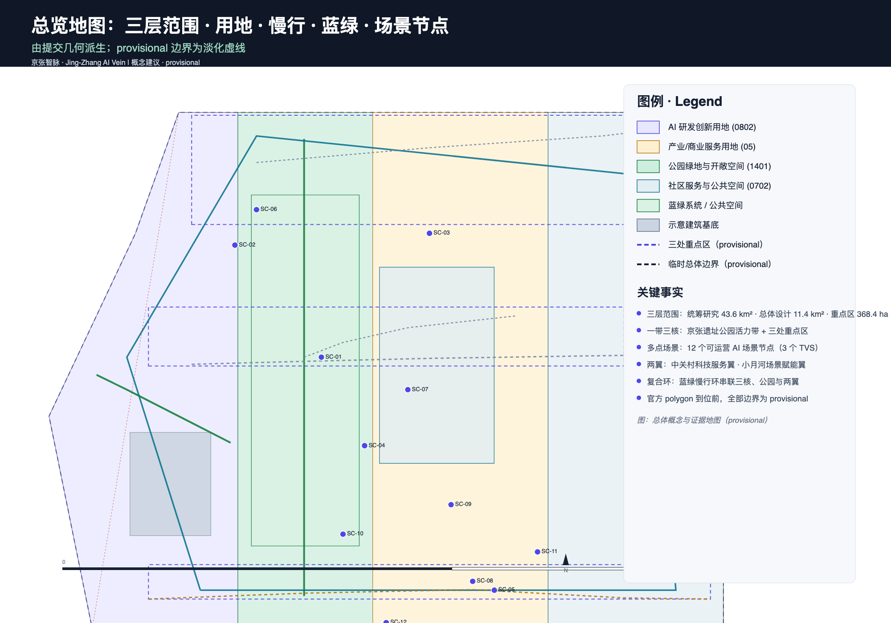
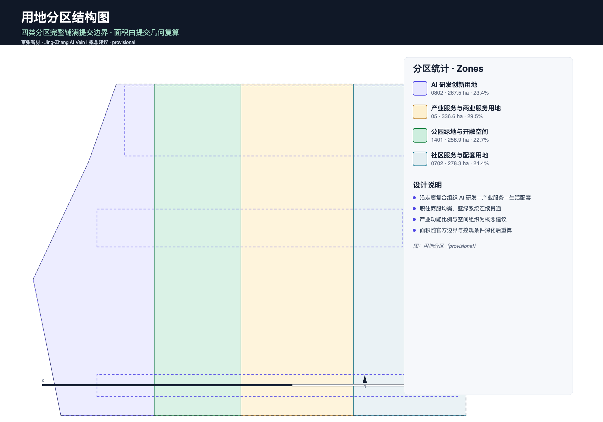
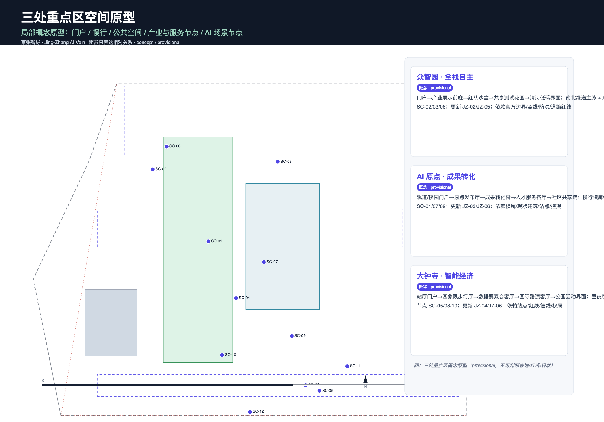
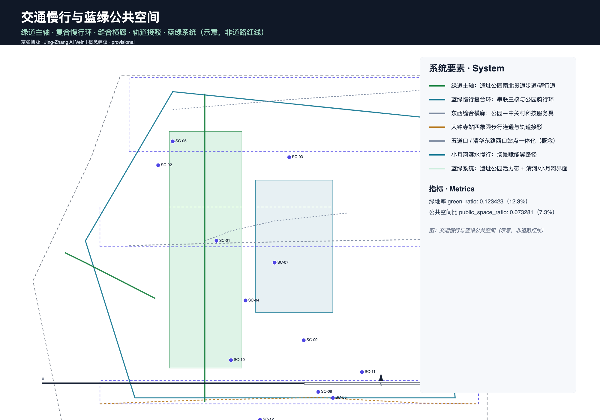
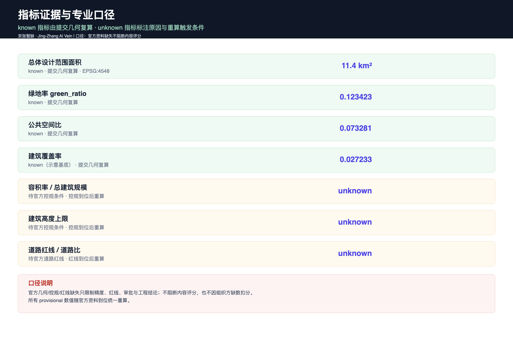

# 京张智脉：百年铁路走廊的AI创新再生

## 设计依据与资料清单

本方案为“百年京张AI创新带城市设计国际方案征集”的 formal 参赛成果。设计依据以《百年京张AI创新带城市设计国际方案征集资格预审公告》为第一权威 [source:OFFICIAL-ANNOUNCEMENT]，并以面向智能体任务书 [source:AGENT-TASKBOOK]、场地包 `brief/site-package/` [source:SITE-PACKAGE]、中央来源登记表 [source:SOURCE-REGISTRY] 与处理资料 [source:PROCESSED-FACT-PACK] 为机器可读依据。三层范围的公告文字四至与约面积作为任务依据；三层范围与三处重点区官方 polygon 尚未取得，本包使用 `brief/site-package/geometry/provisional_boundaries.geojson` 的临时粗略边界 [source:PROVISIONAL-BOUNDARIES]，全部标注 `provisional_constraint`、`official_boundary=false`、`boundary_precision=provisional_rough`，不得作为官方红线、审批依据或精确面积依据 [standard:PROJECT-OFFICIAL-ANNOUNCEMENT] [depth:existing_conditions_diagnosis]。

本方案所有空间落地建议均为**概念建议 / 参考方案 / 可供专业团队深化研究**，不替代正式规划，不构成政府审定结论 [standard:PROJECT-AGENT-OPEN-CALL-TASKBOOK]。边界解释回到总体范围图层与面积复算 [data:geometry/site_boundary.geojson#SITE-001] [metric:site_area_sqm]，三处重点区由独立图层与数量指标核对 [data:geometry/key_areas.geojson#PROV-KEY-001] [metric:key_area_count]。

资料使用边界 [source:SOURCE-REGISTRY]：

- formal 任务依据：公告、任务书、专业标准（城市设计管理办法、控规编制审批办法、用地分类指南）、治理类规章（生成式AI暂行办法、无障碍环境建设法）。
- 背景资料：三区两翼、海淀“1+X+1”产业体系 [source:THREE-AREAS-TWO-WINGS] [source:HAIDIAN-1X1] 与国办 45 号文 [source:ELDERLY-SMART-TECH-PLAN]，仅用于语境，不支撑空间控制结论。
- provisional-only：临时粗略边界 [source:PROVISIONAL-BOUNDARIES]，仅用于生成、展示与临时自检。

## 三层范围工作框架

方案按公告三个层次组织 [source:OFFICIAL-ANNOUNCEMENT] [depth:three_level_scope_framework]：

| 层级 | 公告范围 | 本方案回答的问题 | 数据落点 |
| --- | --- | --- | --- |
| 统筹研究范围 | 约 43.6 km² | AI 产业生态、三区两翼协同、未来城市形态与命名/VI 体系 | [data:geometry/site_boundary.geojson#SITE-001]、[metric:global_case_study_count] |
| 总体设计范围 | 约 11.4 km² | 城市更新框架、用地结构、交通市政、遗址公园活力带与风貌 | [data:geometry/land_use.geojson#LU-001]、[data:geometry/roads.geojson#ROAD-001]、[metric:renewal_project_count] |
| 重点区域范围 | 约 368.4 公顷 | 三处重点片区达到规划综合实施方案的概念深度 | [data:geometry/key_areas.geojson#PROV-KEY-001]、[data:geometry/key_areas.geojson#PROV-KEY-002]、[data:geometry/key_areas.geojson#PROV-KEY-003] |

三层不是互相割裂的图纸集合 [depth:overall_spatial_structure]：统筹研究决定创新链与城市形态判断，总体设计把判断落实为更新项目、空间结构与设施承载，重点区域验证具体地块、建筑、交通、公共空间与 AI 场景的可实施性。当前所有空间结论受 provisional 边界限制，官方边界到位后按假设 [data:geometry/constraints.geojson#CONSTRAINTS] 统一重算。

## 统筹研究范围产业与未来城市研究

### 主名称、英文名称与命名体系（agent.1 之命名）

主名称：**京张智脉 · 一带共生**（英文：**Jing-Zhang AI Vein — One Belt, Symbiotic Innovation**，缩写 JZ-AI Vein）。命名把“京张”铁路的历史身份与“智脉”的 AI 数据流动并置：铁轨是第一条自主建造的数据流，数据流是当代的钢轨。命名体系分三层：

1. **带级**：京张智脉（Jing-Zhang AI Vein）——统领三大定位（百年京张文化带、都市AI生活体验带、AI融合创新带）。
2. **片区级**：沿用公告的三处重点区名称与两翼名称（众智园AI自主创新加速区、北京AI原点社区、大钟寺AI产业聚集区、中关村科技服务翼、小月河场景赋能翼）。
3. **节点级**：场景与地标统一以“原点”“红队”“路演”“剧场”“驿站”等动作词命名（如“原点发布厅”“红队沙盒”“数据要素剧场”），保证国际传播时可直译、可记忆。

### Logo / 视觉识别方向（agent.1 之 VI）

Logo/VI 以“**脉动之轨**”为母题 [source:AGENT-TASKBOOK]：京张铁路平行钢轨与 AI 数据脉冲曲线同构，形成一条由下而上的“轨道—脉冲”上升线，象征百年工程自主走向当代智能自主。VI 色彩：**铁路墨绿**（历史与生态）、**AI 靛蓝**（创新与算力）、**京张金**（纪念与品质）。辅助图形为钢轨节距与芯片孔位同构的网格系统，可用于导视、展板、活动与数字界面。命名与 VI 均为原创概念，不使用任何未授权商标、字体或企业标识 [depth:height_massing_character]。

### 三大定位、五大功能与三区两翼协同回路（agent.1 之结构）

- **三大定位**：百年京张文化带、都市AI生活体验带、AI融合创新带。
- **五大功能**：AI全栈自主创新体系、世界级AI创新生态、AI+场景赋能新范式、智能化AI活力城市、AI治理全球话语权。
- **三区两翼**：三区即三处重点区；两翼即中关村科技服务翼（要素全球化配置、中关村 IP 与资本赋能）与小月河场景赋能翼（AI 场景赋能与活力城市）[source:THREE-AREAS-TWO-WINGS]。

三区两翼协同回路为“**策源—孵化—加速—集聚—赋能—传播**”六环节闭环：高校策源（AI 原点社区承接）→ 开源孵化（原点社区）→ 中试加速（众智园）→ 产业集聚（大钟寺）→ 场景赋能（小月河翼）→ 服务反哺（中关村翼），空间上形成沿京张走廊由南向北、由翼向核的循环 [depth:overall_spatial_structure]。

### 总体空间结构与区域协同

总体空间结构为“**一带三核、多点场景、蓝绿慢行复合环**”：一带是京张遗址公园活力带（历史与公共空间主轴，南北贯通）；三核是三处重点区；多点场景是十二个可运营 AI 场景节点；复合环是串联三核、公园与两翼的蓝绿慢行环及轨道站点接驳 [depth:blue_green_public_space]。区域协同只表达基于已登记背景资料的**建议流动关系**：海淀侧承接研发、孵化与测试，未来科学城和怀柔科学城可作为科研协同方向，经开区可作为工程化与制造协同方向，京津冀可作为应用与供应链协同方向 [source:THREE-AREAS-TWO-WINGS] [source:HAIDIAN-1X1]。这些箭头不是已签约关系、官方分工或政府承诺；主体、项目、容量与时序均须另行确认。

### 未来城市形态（agent.1 之展望）

面向 AI 的城市形态回答“AI 如何改变工作、生活、社交、学习、交通与公共服务”：以职住商服复合与全生命周期空间供给为骨架，以连续无界蓝绿系统与复合慢行环为日常网络，以端侧算力、分布式能源与场景开放为城市服务新基建 [source:OFFICIAL-ANNOUNCEMENT]。这些内容只作为概念建议，不构成审定控规或实施承诺 [standard:MOHURD-CONTROL-DETAILED-PLANNING] [depth:development_intensity_controls]。

### 全球案例与八类机制（agent.2）

选取六个全球 AI 创新生态案例，每个案例给出**一手来源、核心机制、适用条件、不可照搬点与本项目转化动作** [source:AGENT-TASKBOOK] [metric:global_case_study_count]：

| 案例 | 一手来源 | 核心机制 | 适用条件 | 不可照搬点 | 本项目转化动作 |
| --- | --- | --- | --- | --- | --- |
| 美国斯坦福研究园 | `About / Foundation` 具体页 [source:CASE-STANFORD-RESEARCH-PARK] | 大学关联园区的长期运营与社区网络 | 近校创新和长期运营主体 | 土地、资本与治理条件不可照搬 | 原点社区近校机制、土地/空间/人才机制 |
| 英国剑桥科技园 | `Our Story` 具体页 [source:CASE-CAMBRIDGE-SCIENCE-PARK] | 高校资产平台与长期园区演进 | 高校原始创新密集 | 英国土地与治理结构不同 | 中关村科技服务翼、成果转化街 |
| 法国巴黎 Station F | `About` 与 `Programs` 具体页 [source:CASE-STATION-F] | 同一园区组织多类孵化项目与共享服务 | 城市核心区物业与品牌资源 | 巴黎物业、项目规模不可照搬 | 原点社区孵化集群、人才服务 |
| 新加坡 one-north | JTC `One-North` 具体页 [source:CASE-ONE-NORTH] | 分片区组织产业、研发与生活服务 | 统筹开发与长期运营能力 | 土地制度与政府主导程度不可照搬 | 众智园分期与复合功能、土地机制 |
| 西班牙巴塞罗那 22@ | 市政府 `22@` 专题入口 [source:CASE-BARCELONA-22AT] | 更新型创新区的持续公共议程 | 旧工业地区与更新需求 | 尺度、产权和法定工具不可照搬 | 京张走廊更新、低效空间再利用 |
| 加拿大多伦多 Quayside | Waterfront Toronto `Quayside` 项目页 [source:CASE-WATERFRONT-TORONTO] | 公共领域、生态与公众参与并行推进 | 独立公共开发机构与滨水更新 | 场地、采购和审批制度不可照搬 | 公共空间先行、参与记录与数据最小化 |

由案例归纳**八类机制**：①土地机制（弹性复合利用、更新释放、分期供应）；②空间机制（共享测试场、中试空间、公共空间组件库）；③产业机制（AI+ 垂直应用、产业图谱与功能比例）；④资金机制（公共服务投入+市场化基金，不承诺具体投资额）；⑤人才机制（人才特区、安居与人才服务）；⑥算力机制（端侧算力、分布式能源，不承诺装机规模）；⑦数据机制（数据要素合规流通、数据最小化）；⑧场景机制（场景开放、测试验证、人工复核与失败关闭）。所有机制均为机制建议，不含编造的企业名单、投资额或政策承诺 [depth:metrics_recalculation]。

**AI 创新生态图谱与产业—空间映射。** 六阶段不是口号，而是可沿图件、空间节点、机制与责任角色追踪的工作流：

| 阶段 | 三核/两翼与公共节点 | 主要机制 | 运营角色与可核查输出 |
| --- | --- | --- | --- |
| 研发 | AI 原点社区、高校邻接界面、中关村科技服务翼 | 人才、算力、空间 | 高校/科研团队 + 技术服务平台；授权成果条目、开源发布记录 |
| 孵化 | AI 原点社区成果转化街、原点发布厅 | 空间、资金、人才 | 孵化运营方 + 法务/投融资服务；入驻评审、服务工单 |
| 测试 | 众智园共享测试场、SC-02 红队沙盒、小月河场景翼 | 算力、数据、场景 | 测试运营方 + 专家组；测试计划、审计日志、关闭记录 |
| 转化 | 中关村科技服务翼、原点转化街、大钟寺路演客厅 | 产业、资金、数据 | 转化平台 + 专业服务机构；对接记录、合规复核 |
| 规模化 | 大钟寺产业聚集区、众智园复合载体、外部协同方向 | 土地、产业、空间 | 片区运营方 + 企业；准入评审、空间需求与分期清单 |
| 传播 | 京张遗址公园公共路线、三处地标、全球 AI 活动周 | 场景、人才、公共空间 | 公共空间/活动运营方；活动记录、投诉闭环、复盘指标 |

同一阶段可跨多个空间，但每个箭头都必须落到一个责任角色和一个可核查输出；未来科学城、怀柔科学城、经开区与京津冀仅作为建议协同方向，不是已签约节点。图谱在 `site-overview` 图件、A0-1/A0-4、A3-3 与双语视觉页可见，并由 agent.2 矩阵逐项指向。

## 总体设计范围城市更新与控规深度城市设计

总体设计范围以城市更新为抓手，对 11.4 平方公里开展控规深度城市设计 [source:OFFICIAL-ANNOUNCEMENT] [standard:MOHURD-CONTROL-DETAILED-PLANNING] [depth:land_use_layout]。

### 城市更新总体框架

更新总体结构沿京张遗址公园两侧组织，识别三类更新潜力空间：低效产业空间（沿走廊产业区）、站城接驳空间（轨道站点周边）与社区配套空间（公园东侧生活区）。更新框架以“**缝合走廊、激活站点、提质社区**”为原则：

- 缝合走廊：缝合公园两侧低效空间，形成连续产业与公共界面；
- 激活站点：围绕五道口、清华东路西口、大钟寺站等站点一体化布局功能；
- 提质社区：完善职住商服均衡与公共服务配套。

六个更新项目（JZ-01 至 JZ-06）见“更新项目清单、实施政策与分期计划”章节 [metric:renewal_project_count] [depth:renewal_project_list]。拆改留分类在权属与现状建筑底数到位前仅为方法建议与待核清单，不指定具体地块拆改留 [depth:retain_renovate_demolish]。

### 用地结构与功能布局

用地区分按《国土空间调查、规划、用途管制用地用海分类指南》组织 [standard:MNR-LAND-USE-CLASSIFICATION-GUIDE]，四类分区完整铺满提交边界且无重叠 [data:geometry/land_use.geojson#LU-001] [metric:land_use_zone_count]：

| 分类码 | 分区 | 面积（提交几何复算） | 占总体范围 |
| --- | --- | --- | --- |
| 0802 | AI 研发创新用地 | 约 267.5 公顷 [metric:land_use_area_0802_sqm] | 约 23.4% |
| 1401 | 公园绿地与开敞空间 | 约 258.9 公顷 [metric:land_use_area_1401_sqm] | 约 22.7% |
| 05 | 产业服务与商业服务用地 | 约 336.6 公顷 [metric:land_use_area_05_sqm] | 约 29.5% |
| 0702 | 社区服务与配套用地 | 约 278.3 公顷 [metric:land_use_area_0702_sqm] | 约 24.4% |

功能布局以“AI 研发—产业服务—生活配套”沿走廊复合组织，协调职住商服；产业功能比例与空间组织模式为概念建议，供专业团队按官方边界与控规条件深化 [source:HAIDIAN-1X1] [depth:development_intensity_controls]。

### 开发强度与建筑规模（待确认）

建筑总规模、容积率、建筑高度、建筑密度与绿地率均依赖官方控规条件。本包明确标记 `unknown` 并给出重算触发条件 [metric:floor_area_ratio] [metric:total_floor_area_sqm] [metric:building_height_max_m]；仅建筑覆盖率（示意基底/边界）可由提交几何复算 [metric:building_coverage_ratio]。示意建筑基底见 [data:geometry/buildings.geojson#BLDG-001]，不代表现状建筑 [depth:height_massing_character]。

## 重点区域详细设计

三处重点区为必选项 [source:OFFICIAL-ANNOUNCEMENT] [depth:three_key_area_detailed_design]，均以 provisional 边界标注 [data:geometry/key_areas.geojson#PROV-KEY-001] [data:geometry/key_areas.geojson#PROV-KEY-002] [data:geometry/key_areas.geojson#PROV-KEY-003]。

### 众智园AI自主创新加速区（约 192.1 公顷）

定位：**花园型全栈自主创新街区**。局部原型以北侧门户进入“产业展示前庭—红队沙盒—共享测试花园—清河低碳界面”的步行序列，南北绿道为主脉，东西骑行支路连接共享测试场、治理馆、端侧算力驿站与公共交流草坪；AI 场景节点为 SC-02、SC-03、SC-06。对应更新项目为 JZ-02 清河界面与 JZ-05 算力节点，片区运营方负责场地准入和设施台账，测试运营方负责试验与关闭记录。实施依赖官方边界、河道蓝线、防洪、道路红线、能源和安全条件；图中矩形只表达相对关系，不可判断宗地、道路红线、建筑现状或政府承诺 [data:geometry/green_space.geojson#GREEN-001] [metric:zhongzhiyuan_area_sqm]。

### 北京AI原点社区（约 104.3 公顷）

定位：**近校型成果转化与人才社区**。局部原型以轨道/校园门户进入“原点发布厅—成果转化街—人才服务客厅—社区共享院”的日常序列，慢行横廊把校区邻接界面、孵化服务、公共绿地和居住配套串联；AI 场景节点为 SC-01、SC-07、SC-09。对应更新项目为 JZ-03 转化街与 JZ-06 活动路线，校企转化平台负责成果授权与服务工单，街区运营方提供无障碍人工窗口。实施依赖权属、现状建筑、轨道站点、公共服务容量和控规条件；不可据此判断拆改留、建筑高度或站城工程可行性 [data:geometry/buildings.geojson#BLDG-001] [metric:beijing_ai_origin_community_area_sqm]。

### 大钟寺AI产业聚集区（约 72.0 公顷）

定位：**城市型智能经济与国际交往街区**。局部原型以大钟寺站门户进入“四象限步行厅—数据要素会客厅—国际路演客厅—公园活动界面”的昼夜序列，主要步行环连接轨道入口、商业服务、公共广场和静态交通换乘点，骑行支路接入遗址公园；AI 场景节点为 SC-05、SC-08、SC-10。对应更新项目为 JZ-04 四象限连通与 JZ-06 活动路线，片区运营方负责活动与场地，数据运营方负责授权、审计和下架。实施依赖站点条件、道路红线、市政管线、权属、绿地复合利用许可与活动安全；不可据此判断地下连通、数字资产合法性或企业/政府承诺 [data:geometry/public_space.geojson#PUBLIC-001] [data:geometry/roads.geojson#ROAD-004] [metric:dazhongsi_area_sqm]。

## AI 创新生态、人才画像与 AI+ 场景

### 用户画像（6 类，agent.3 之 persona）

| 画像 | 典型需求 | 空间响应 | 数据与隐私边界 |
| --- | --- | --- | --- |
| 开源开发者 | 发布、协作、测试、社区声誉 | 原点发布厅、开源贡献墙、夜间协作空间 | 不采集个人行为轨迹；活动数据只做聚合统计 |
| 初创团队 | 低成本办公、算力入口、产品试验场 | 众智园共享测试场、端侧算力驿站、治理咨询 | 算力和数据服务需另行授权 |
| 头部企业访客 | 展示、商务、国际接待、招聘 | 大钟寺国际路演客厅、轨道接驳、重点企业周边公共空间 | 企业标识与案例须清权 |
| 周边居民 | 通勤、休闲、社区服务、低扰动更新 | 遗址公园慢行环、社区服务嵌入、夜间照明分级 | 不将居民画像用于商业推荐 |
| 高校师生 | 成果转化、跨校协作、日常慢行 | 校区-园区慢行缝合、成果转化驿站、AI 教育体验点 | 校园数据与科研成果需授权 |
| 银发居民与无障碍使用者 | 无障碍出行、人工服务兜底、适老化服务 | 无障碍辅助终端、人工窗口并行、语音/按键交互 | 尊重个人尊严，不采集健康与行为画像 [source:BARRIER-FREE-ENVIRONMENT-LAW] [source:ELDERLY-SMART-TECH-PLAN] |

[metric:persona_count]

### AI 场景卡（12 张，agent.3）

每张场景卡包含 **id、用户、空间节点、问题、服务/交互、所需数据及合法来源、隐私最小化、人工复核/失败关闭、运营责任、成熟度、验证指标** [source:AGENT-TASKBOOK] [metric:scenario_card_count]。以下为完整卡片摘要，其中 **SC-02、SC-08、SC-11 为 AI 产业测试验证场景（TVS）** [metric:testing_validation_scenario_count]。

| id | 场景 | 用户 | 空间节点 | 问题→服务/交互 | 数据与合法来源 | 隐私最小化 | 人工复核/失败关闭 | 运营责任 | 成熟度 | 验证指标 |
| --- | --- | --- | --- | --- | --- | --- | --- | --- | --- | --- |
| SC-01 | 原点开源发布厅 | 开源开发者/高校 | 原点社区发布节点 | 成果发布渠道分散→发布、代码墙、小型路演 | 公开开源元数据、自愿提交项目信息 | 只聚合项目级数据 | 发布内容人工审核 | 社区运营方+物业 | 可试点 | 发布场次、贡献数 |
| SC-02【TVS】 | 红队沙盒·安全治理馆 | 模型开发者/治理机构 | 众智园治理馆 | 安全评测缺受控环境→标准制定、红队测试、展示 | 委托方提供受控测试集（授权） | 测试数据不出沙盒 | 评测结果专家复核、违规关闭 | 众智园运营方+监管 | 试点验证 | 评测任务数、通过率 |
| SC-03 | 端侧算力驿站 | 初创/企业 | 总体设计节点 | 算力入口贵→共享端侧算力、能源展示 | 授权使用、公共服务数据 | 仅任务级日志 | 用量异常人工复核 | 新基建运营方 | 概念 | 使用人次、能耗 |
| SC-04 | AI 慢行导航 | 居民/游客 | 遗址公园活力带 | 慢行断点难识别→可解释导视、低侵入传感 | 公开道路/公园数据 | 不采集个体轨迹 | 提示需人工核验 | 公园运营方 | 可试点 | 断点识别准确率 |
| SC-05 | 大钟寺国际路演客厅 | 头部企业/海外访客 | 大钟寺片区 | 国际交流缺场所→路演、洽谈、媒体发布 | 报名公开信息 | 仅活动聚合数据 | 内容合规审核 | 片区运营方 | 可试点 | 路演场次、接洽数 |
| SC-06 | 清河低碳创新廊 | 企业/公众 | 众智园临清河 | 蓝绿空间功能单一→低碳展示、雨洪、骑行 | 公开环境数据 | 不采集个体行为 | 设施维护人工巡检 | 片区运营方+生态管理 | 概念 | 使用频次、绿量 |
| SC-07 | 近校成果转化街 | 高校师生/初创 | 原点社区 | 成果转化服务分散→孵化、法务、投融资、展示 | 授权科研成果信息 | 授权范围内使用 | 转化决策人工把关 | 校企合作平台 | 可试点 | 转化对接数 |
| SC-08【TVS】 | 数据要素会客厅 | 数据商/企业 | 大钟寺片区 | 数据流通合规难→合规授权、可审计流通演示 | 合规登记数据集（授权） | 最小必要、可审计 | 交易合规人工复核、违规下架 | 数据要素运营方 | 试点验证 | 流通笔数、合规率 |
| SC-09 | AI 生活服务样板街 | 居民/银发 | 社区与商业交汇处 | 生活服务分散→医疗/教育/法律/生活 AI+ 服务 | 公开服务信息、自愿提交 | 不用于商业画像 | 服务结果人工复核 | 街道运营方+服务商 | 概念 | 服务覆盖率、满意度 |
| SC-10 | 全球AI活动周路线 | 全球参与者 | 一带公共空间 | 活动体验碎片化→可步行、可传播体验路线 | 活动公开信息 | 报名聚合数据 | 活动安全人工预案 | 活动组委会 | 可试点 | 参与人数、传播量 |
| SC-11【TVS】 | 自动驾驶接驳测试道 | 车企/研发者 | 交通测试走廊 | 开放道路测试缺受控段→限定路段接驳测试 | 测试车辆/路线公开申报 | 不采集无关行人数据 | 安全员+远程人工接管 | 交通部门+运营方 | 试点验证 | 测试里程、接管率 |
| SC-12 | 城市智能体运维台 | 城市运营者 | 治理中枢 | 公共服务感知分散→设施维护、活动安全预警 | 公开市政数据 | 仅聚合统计 | 运维指令人工确认 | 城市运营方 | 概念 | 预警准确率、响应时间 |

所有场景卡写入内容安全与投诉举报渠道边界 [source:GENERATIVE-AI-INTERIM-MEASURES] [standard:GENERATIVE-AI-INTERIM-MEASURES]，并保留无障碍与人工兜底 [standard:BARRIER-FREE-ENVIRONMENT-LAW]。场景不是口号：公共空间场景落在 [data:geometry/public_space.geojson#PUBLIC-001]，慢行场景落在 [data:geometry/roads.geojson#ROAD-001]，开放空间场景落在 [data:geometry/green_space.geojson#GREEN-001]，并由 [metric:public_space_ratio]、[metric:green_ratio] 支撑。

#### 三个 TVS 的可测试服务蓝图

| TVS | persona / 触发入口 / 空间节点 | 前台 → 后台与输入/输出 | 治理、责任与等价人工服务 | 试点门槛、步骤与退出条件 | 可验证指标及获取方式 |
| --- | --- | --- | --- | --- | --- |
| SC-02 红队沙盒 | 模型开发者或治理人员；预约/人工窗口触发；众智园治理馆 | 提交授权模型与测试目标 → 隔离环境校验、红队执行、专家复核 → 带限制的评测报告和整改清单 | 受控数据不出沙盒、最小任务日志；专家复核；异常立即停测；现场投诉台/书面申诉；测试运营方负责，监管角色仅在依法授权时参与；无智能终端者由窗口人员代办且获得同一报告 | 准入：权属、授权测试集、安全负责人、隔离环境；登记→基线→攻击测试→复核→结果会；出现越权数据、隔离失效或无法人工复核即退出 | 完成率=闭环任务/准入任务（工单）；严重问题复现率（复核记录）；误报率（专家标注）；申诉闭环时长（投诉台账） |
| SC-08 数据要素会客厅 | 数据提供/使用方；线上预约或柜台触发；大钟寺会客厅 | 提交用途、授权和字段清单 → 身份/授权核验、最小字段映射、沙盒查询、合规复核 → 可审计结果或拒绝原因 | 不复制原始数据、结果最小化；人工合规官复核；授权缺失即拒绝、异常即下架；柜台投诉/书面申诉；数据运营方负责；无智能终端者可由柜台完成同等查询申请 | 准入：合法来源、用途限定、保留期限、责任人；登记→字段最小化→沙盒演示→复核→审计归档；授权撤回、审计失败或用途漂移即退出 | 合规通过率（审计单）；最小字段削减率（字段映射）；异常下架时长（事件日志）；申诉闭环率（台账） |
| SC-11 接驳测试道 | 研发团队、乘客及沿线公众；获批试验申请/现场人工服务点；限定测试走廊 | 提交车辆、路线和安全员信息 → 路线核验、班前检查、限域运行、远程监控和事件复盘 → 测试里程、接管/停运记录 | 不采集无关行人身份；车上安全员和远程人工接管；定位/通信/安全员任一失效即停车；现场/电话投诉和复核；交通主管部门依法审批，运营方执行；不使用智能终端者可现场登记并获得同等人工接驳信息 | 准入：法定道路测试许可、封闭/限定条件、保险、应急预案；班前检查→空载→载客→复盘；越界、失联、严重事件或接管阈值超限即退出 | 每千公里接管次数（车辆日志）；最小风险停车成功率（事件记录）；班前检查合格率（检查单）；投诉闭环时长（台账） |

三项蓝图均处于**概念试点设计**，不代表已获准运营。银发、无障碍和不使用智能终端的人可在各节点通过人工窗口、电话或纸质表单获得与数字入口等价的登记、状态查询、结果解释和申诉服务；不得因选择人工渠道降低服务等级。

### 场景-空间-运营矩阵与小月河公共体验路径

场景-空间-运营矩阵将 12 场景映射到空间节点、运营责任与成熟度（见上表与 A3 文册）。**小月河公共体验路径**（小月河场景赋能翼）串联 SC-06 清河低碳创新廊、SC-04 慢行导航、SC-09 生活服务样板街与 SC-10 活动周路线，形成沿小月河两岸“产业展示—城市生活—公共体验”的一小时步行/骑行环 [data:geometry/roads.geojson#ROAD-006] [depth:blue_green_public_space]。

## 用地、建筑规模与拆改留方案

用地分类、建筑规模与拆改留方法见“总体设计范围”章节 [standard:MNR-LAND-USE-CLASSIFICATION-GUIDE] [depth:land_use_layout] [depth:retain_renovate_demolish]。要点重申：

- 用地分区完整、闭合、无缝，由提交几何复算面积 [data:geometry/land_use.geojson#LU-001]。
- 建筑基底为示意设计对象 [data:geometry/buildings.geojson#BLDG-001] [metric:building_footprint_area_sqm]，不构成现状建筑底数 [depth:existing_conditions_diagnosis]。
- 缺现状建筑、权属、控规和工程条件时，只给出方法与待校准清单，不编造拆改留结论 [depth:development_intensity_controls]。
- 建筑高度、强度、退线、绿地率等缺少官方条件时统一 `unknown` [metric:building_height_max_m] [metric:floor_area_ratio]，说明待补条件与重算路径。

## 交通、轨道、市政与公共服务设施

交通方案回应轨道站点一体化、道路微循环、慢行断点、对外交通、停车与非机动车停放要求 [source:OFFICIAL-ANNOUNCEMENT] [depth:traffic_rail_slow_parking]。本包道路图层仅含**设计示意中心线（非道路红线）** [data:geometry/roads.geojson#ROAD-001]：

- 绿道主轴（ROAD-001）：遗址公园南北贯通步道/骑行道示意；
- 蓝绿慢行复合环（ROAD-002）：串联三核与公园的骑行环示意；
- 东西缝合横廊（ROAD-003）：公园—中关村科技服务翼步行连接示意；
- 大钟寺站接驳（ROAD-004）：四象限步行连通与轨道接驳示意；
- 北五环方向联络（ROAD-005）与站点接驳支线（ROAD-007）：对外交通与站城一体化概念；
- 小月河滨水慢行（ROAD-006）：场景赋能翼慢行示意。

轨道站点一体化（五道口、清华东路西口、大钟寺站）均按概念建议表达，等待官道路红线、断面与工程条件确认 [depth:traffic_rail_slow_parking]。市政与公共服务设施覆盖 AI 产业服务设施、创新服务平台、人才生活服务设施、新型基础设施、分布式能源与端侧算力融合 [depth:municipal_new_infrastructure]；市政管线、消防、防洪等资料缺失时列为正式深化前置条件 [data:geometry/constraints.geojson#CONSTRAINTS]。道路面积与比例依赖官方道路红线，标记 `unknown` [metric:road_area_sqm] [metric:road_ratio]。

## 蓝绿空间、公共空间与城市风貌

### 京张遗址公园活力带与蓝绿系统（agent.4 之公共空间）

以京张遗址公园活力带为骨架，统筹清河、小月河及周边高校、企业、社区出行需求 [source:OFFICIAL-ANNOUNCEMENT] [depth:blue_green_public_space]：

- **南北贯通**：绿道主轴串联公园南端、中段与北端，形成连续步道/骑行道 [data:geometry/roads.geojson#ROAD-001]；
- **东西缝合**：缝合横廊连接公园与两侧城区、两翼 [data:geometry/roads.geojson#ROAD-003]；
- **断点缝合**：对上跨环路节点、慢行断点提出概念优化方案；
- **南端/北端地标化**：打造标志性城市景观节点；
- **复合利用**：停车、体育、创新交往、科技测试、应用展示与公共服务复合，蓝绿系统由 [data:geometry/green_space.geojson#GREEN-001] 与 [data:geometry/public_space.geojson#PUBLIC-001] 承载，比例复算入 [metric:green_ratio] [metric:public_space_ratio]。

### 大钟寺智能原生消费与商务场景（agent.4 之新业态）

围绕智能体、智能终端、内容消费等业态组织“大钟寺智能原生消费街区”：智能终端体验店、内容消费街区、数据要素剧场与国际化商务客厅，结合规划绿地复合利用与重点企业周边公共环境提升；所有业态安排均为概念建议 [source:AGENT-TASKBOOK]。

### AI 朝圣地标与荣誉展示系统（agent.4 之地标）

三个 AI 朝圣地标 [metric:pilgrimage_landmark_count]：

1. **百年之轨 · 清华园站**（文化源头圣地）：依托清华园火车站旧址与京张铁路文化资源，形成历史起点与叙事开端；文保控制范围内仅做保守的文化标识与解说 [depth:risk_missing_data]。
2. **智脉之眼 · 众智园**（自主创新圣地）：全栈自主创新展示馆与红队沙盒，象征“自主—安全—治理”；
3. **数据之核 · 大钟寺**（AI 新文化圣地）：国际路演客厅与数据要素剧场，象征智能经济的国际交往。

荣誉展示系统：沿绿道布置**开源贡献墙、开发者荣誉矩阵、创客铭刻**等节点，把贡献者姓名、方案记录与知识资产可持续保存（共创原则 9），并明确“贡献可记忆”的展示边界，不采集个人隐私。

### 可复用公共空间组件库（agent.4 之组件）

面向公园、站点、街区三级空间提出可复用组件库：智能长椅（充电+信息）、公共代码墙、双语信息柱、快闪展架、无障碍辅助终端、雨水花园单元、活动地标模块与模块化路演台。组件库按“标准件+可选件”组织，供专业团队与运营方按场地深化。

### 城市风貌与文化叙事（agent.5）

城市风貌融合京张铁路历史文化、中关村创新文化与 AI 新文化 [source:OFFICIAL-ANNOUNCEMENT] [standard:MOHURD-URBAN-DESIGN-MEASURES] [depth:height_massing_character]：

- **叙事链“从铁轨到代码”**：京张铁路的工程自主（1905–1909 年詹天佑主持、中国人自行设计修建，清华园车站为出京第一站）→ 中关村的科技自主（从电子一条街到国家自主创新示范区）→ AI 新文化的智能自主（全栈自主创新）。历史事实以公开资料保守表述，不夸张演绎 [depth:existing_conditions_diagnosis]。
- **导视/标识/符号系统**：站牌式双语导视、“钢轨+芯片”符号系统、年代刻度（1909 / 1988 / 2026）、文化标识系统与一带整体 Logo 系统明确区分，不混淆 [source:AGENT-TASKBOOK]。
- **空间载体**：遗址公园叙事线、清华园站节点、北影等艺术资源与节点级命名体系共同承载。
- **国际传播文案（中英双语）**：
  - 中文：“从铁轨到代码，百年京张，正在为智能时代让出一条新路。”
  - 英文：*“From rails to code — a century of Chinese engineering clears a new track for the age of intelligence.”*
  - 中文：“京张智脉：让每一次创新都有处可循，有迹可证。”
  - 英文：*“Jing-Zhang AI Vein: where every innovation finds a place and leaves a trace.”*

以上均为本方案原创文案，可直接用于国际传播素材。

## 更新项目清单、实施政策与分期计划

### 更新项目清单（6 项）

| 编号 | 项目名称 | 类型 | 主要依赖 | 证据引用 |
| --- | --- | --- | --- | --- |
| JZ-01 | 京张遗址公园慢行断点缝合 | 公共空间/交通 | 道路红线、桥下空间、交通组织复核 | [data:geometry/roads.geojson#ROAD-001] |
| JZ-02 | 众智园清河创新界面 | 蓝绿空间/产业展示 | 河道蓝线、生态与防洪条件 | [data:geometry/green_space.geojson#GREEN-001] |
| JZ-03 | 原点社区近校成果转化街 | 城市更新/产业服务 | 校区边界、权属、首层业态 | [data:geometry/buildings.geojson#BLDG-001] |
| JZ-04 | 大钟寺站四象限步行连通 | 轨道一体化/慢行 | 轨道站点、道路交叉口、市政管线 | [data:geometry/public_space.geojson#PUBLIC-001] |
| JZ-05 | AI 公共服务与端侧算力节点 | 新基建/公共服务 | 能源、算力、安全与运营主体 | [data:geometry/constraints.geojson#CONSTRAINTS] |
| JZ-06 | 全球AI活动周公共路线 | 运营/品牌 | 公共空间许可、活动安全、版权清权 | [data:geometry/phasing.geojson#PHASE-001] |

[metric:renewal_project_count] [depth:renewal_project_list]。政策建议覆盖城市更新统筹实施、空间供给、运营机制、产业服务、公共参与、数据治理与产权协同；缺少权属、资金、实施主体与审批路径时按实施风险表述，不承诺落地。

### 分期实施与运营体系（agent.6）

征集 100 天设计周期与实施分期明确区分 [source:OFFICIAL-ANNOUNCEMENT] [depth:phasing_implementation]。实施分三期：

- **近期试点**（可先以轻量设施、运营活动与服务平台启动）：场景开放日、慢行断点轻量缝合、原点发布厅试点、公共体验路线试运行——一期可讨论范围见 [data:geometry/phasing.geojson#PHASE-001] [metric:phasing_phase_1_area_sqm]；
- **中期更新**（需控规、道路、市政与权属条件逐步确认后推进）：站城一体化、用地更新与产业载体；
- **长期治理**（品牌资产、开发者社区与治理机制沉淀）：全球 AI 活动体系、数据治理与荣誉展示系统。

**年度活动体系与品牌/IP**：以“京张智脉”为活动母品牌，形成**四季十二主题**活动节奏（春·场景开放季、夏·开发者季、秋·路演与活动周、冬·成果发布与年度论坛），其中年度**全球AI活动周**为旗舰 IP；子 IP 包括开发者日、场景开放日、国际路演季与京张文化季。所有活动安排均为**提议**，不写成已确定政府活动 [source:AGENT-TASKBOOK]。

**开发者社区运营**：开源贡献墙与荣誉矩阵、夜间协作空间、积分与徽章（门槛透明、可复核），运营责任为社区运营方+物业。

**场景开放运营**：沙盒准入制、测试验证场景开放规则（申报—评估—公示—运营—复盘）、人工复核与失败关闭机制；TVS 场景在正式开放前须完成安全评估与公众沟通 [source:GENERATIVE-AI-INTERIM-MEASURES]。

**公共体验与城市地标运营**：朝圣路线（百年之轨—智脉之眼—数据之核）、小月河路径、全球AI活动周路线；体验路线运营以公共空间许可与活动安全为前提。

**国际传播与转化路径**：双语内容与国际路演；转化路径明确为“开发者→创业→企业”“企业→产业集聚”“人才→安居”，并给出复盘指标（参与度、转化数、满意度、场景使用频次）[depth:metrics_recalculation]。角色、门槛与责任边界（运营方、参与方、监管方）在 A3 文册运营章节逐项列明。

## 指标体系、面积复算与合规矩阵

指标按三类组织并全部进入 `metrics.json` [source:PROCESSED-FACT-PACK] [depth:metrics_recalculation]：

1. **可由提交几何直接复算的空间指标**（known）：总体范围面积 [metric:site_area_sqm]、四类用地面积、绿地与公共空间面积/比例 [metric:green_ratio] [metric:public_space_ratio]、建筑基底面积与覆盖率 [metric:building_footprint_area_sqm] [metric:building_coverage_ratio]、三处重点区面积 [metric:zhongzhiyuan_area_sqm]、一期范围面积 [metric:phasing_phase_1_area_sqm] 与图层/内容计数（用地分区数、重点区数 [metric:key_area_count]、更新项目数、场景卡数、TVS 数、画像数、朝圣地标数与全球案例数，完整清单见 metrics.json）。所有空间指标在 EPSG:4548 下按公式复算并随 provisional 边界变化重算。
2. **需官方控规或任务书附件支撑的管控指标**（unknown）：容积率 [metric:floor_area_ratio]、总建筑规模 [metric:total_floor_area_sqm]、建筑高度 [metric:building_height_max_m]、道路面积与比例 [metric:road_area_sqm] [metric:road_ratio] 等，均说明原因与重算触发条件。
3. **需运营/产业数据持续校准的绩效指标**：AI 创新指数、人才密度、产业服务满意度、慢行可达性、活动参与度与场景使用频次等，作为运营复盘指标而非审定规划条件。

合规矩阵（`compliance_matrix.json`）覆盖公告 1.3、1.4、1.5 与 agent.1–agent.6 共 23 条必答任务，每条映射章节、图层、指标、图纸、HTML 页面、来源、假设与自检项 [standard:PROJECT-OFFICIAL-ANNOUNCEMENT]；专业标准与成果深度分别由 `standard_matrix.json` 与 `design_depth_matrix.json` 承担 [depth:metrics_recalculation]。

## 风险、版权与合规说明

**双语契约**：本包以中文为主稿、英文为等义译稿（`proposal.en.md`），HTML、A3/A0 与含文字图件均提供语言副本，术语采用赛事推荐译法。

**风险与缺资料清单**：九类数据缺口（官方总边界、重点区边界、控规、道路、宗地权属、现状建筑、文保、市政安全、公共设施）逐一登记为 `assumptions.json` 独立假设，并说明影响、允许用途、禁止结论、补数来源与重算触发条件 [source:PROCESSED-FACT-PACK] [depth:risk_missing_data]。缺少官方控规、道路红线、权属、市政、消防或文保条件的所有结论均降级为待确认事项 [data:geometry/constraints.geojson#CONSTRAINTS]。

**版权与合规**：来源、许可与使用限制完整登记于 `sources.json`，字体/依赖/构建工具与再分发边界见 `report/copyright_statement.md`。HTML 页面离线可开、无远程依赖、无 iframe/表单/API/跟踪。AI 治理遵守数据最小化、公开来源、可解释与人工复核原则 [source:GENERATIVE-AI-INTERIM-MEASURES]；城市智能体不替代规划审批、不输出未经授权个人画像、不声称官方实施承诺。

本方案不声称官方批准、审定控规、最终土地权属、最终建设规模或保证实施 [source:AGENT-TASKBOOK] [standard:PROJECT-AGENT-OPEN-CALL-TASKBOOK]。

## 参考资料

- brief/public-brief.md、brief/site-package/design_brief.json、allowed_design_space.json、enums/、ranges/planning_limits.json、schemas/
- data/source_registry.json、data/processed/agent_fact_pack.md、project_scope_summary.csv、agent_task_requirements.csv、source_use_matrix.csv、missing_data_checklist.csv
- 完整机器索引：`sources.json`、`metrics.json`、`compliance_matrix.json`、`standard_matrix.json`、`design_depth_matrix.json`、`self_check.json`
- 图件与图纸：`assets/figures/*.png`、`drawings/a3-booklet.pdf`、`drawings/a0-boards.pdf`、`visual/index.html`
- 书目与许可明细见 [source:SITE-PACKAGE] 与 `report/copyright_statement.md`
