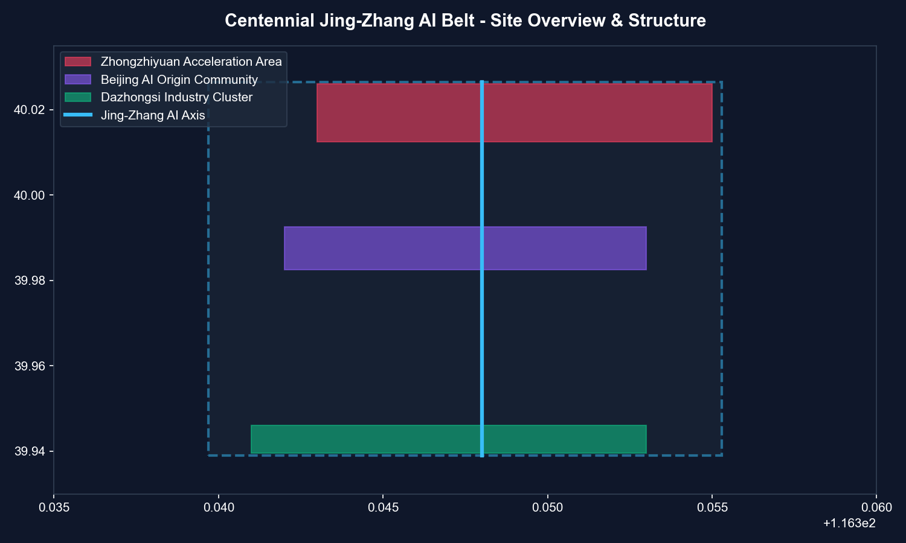
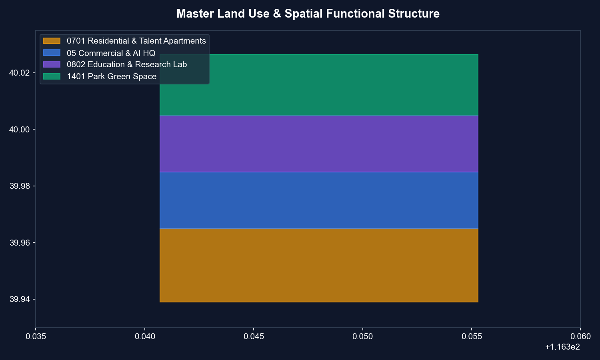
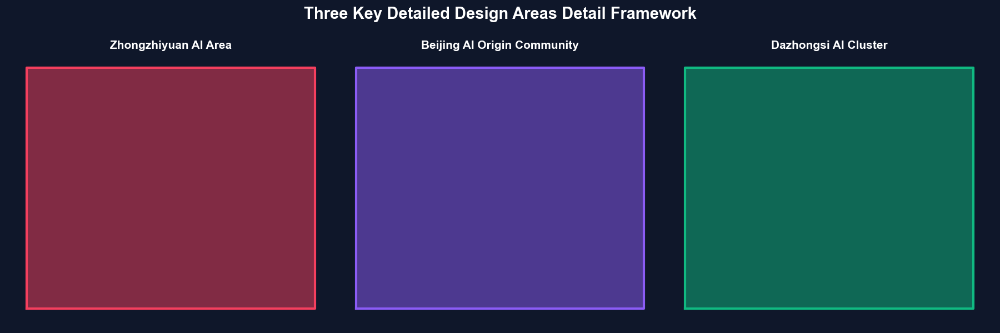
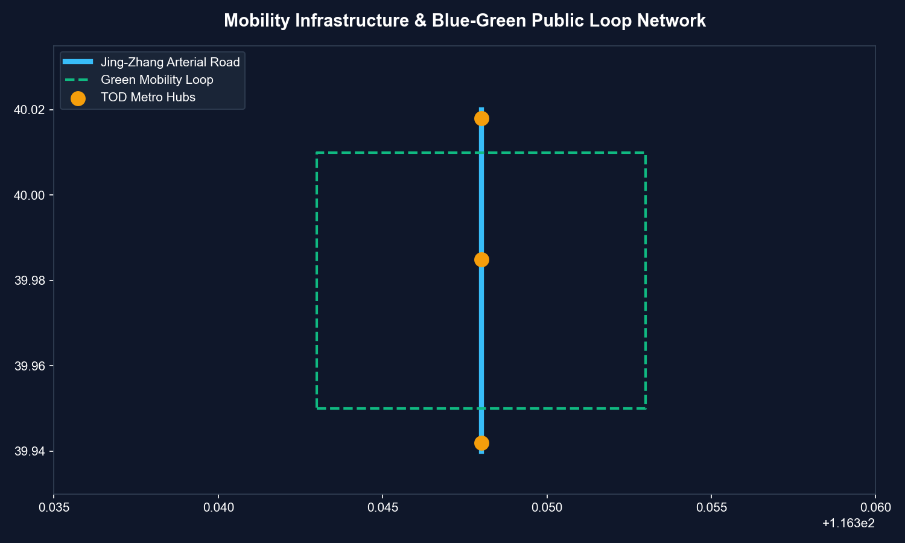
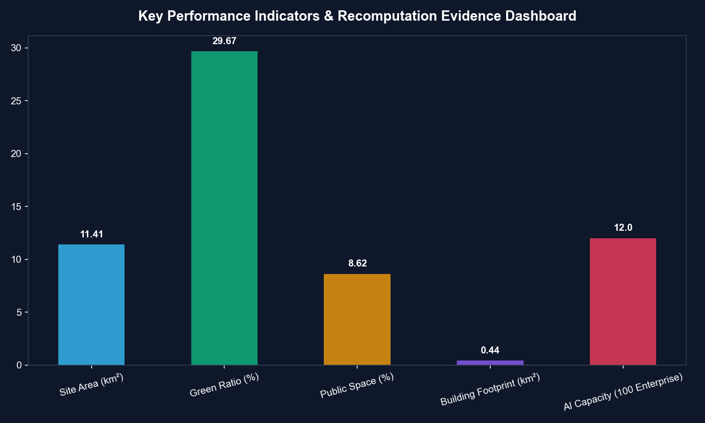

# 百里智脊·青创云带 - 海淀百年京张AI创新带城市设计方案

## 设计依据与资料清单

本 formal 方案以北京市规划和自然资源委员会海淀分局发布的《百年京张AI创新带城市设计国际方案征集资格预审公告》为第一依据，并以 `brief/site-package/` 中经维护者登记的临时粗略边界、重点区域、枚举、指标和来源清单为机器可读依据。AI agent 在生成方案前必须读取 `design_brief.json`、`allowed_design_space.json`、`sources.json`、`enums/`、`ranges/`、`schemas/`、`data/source_registry.json` 和 `data/processed/agent_fact_pack.md`，并用 `project_scope_summary.csv`、`agent_task_requirements.csv`、`source_use_matrix.csv`、`missing_data_checklist.csv` 建立任务、范围、资料用途和缺口清单。所有设计判断都要拆分为可追溯来源、可复算指标、可校验图层和可人工复核假设。公告要求方案达到控制性详细规划的城市设计深度和规划综合实施方案的城市设计深度，因此文本叙述不能替代 GeoJSON、指标表、A3 文册、A0 展板和 HTML 电子展示成果。

本节证据链引用 [source:OFFICIAL-ANNOUNCEMENT]、[source:AGENT-TASKBOOK]、[source:SITE-PACKAGE]、[source:SOURCE-REGISTRY]、[source:PROCESSED-FACT-PACK]、[source:BOUNDARY-SOURCE]、[source:KEY-AREA-SOURCE]、[standard:PROJECT-OFFICIAL-ANNOUNCEMENT]、[standard:PROJECT-AGENT-OPEN-CALL-TASKBOOK]、[standard:MOHURD-URBAN-DESIGN-MEASURES]、[standard:MOHURD-CONTROL-DETAILED-PLANNING]、[standard:MNR-LAND-USE-CLASSIFICATION-GUIDE]、[standard:MOHURD-ARCH-DESIGN-DEPTH-2016] 和 [depth:existing_conditions_diagnosis]，用于说明方案不是独立愿景文本，而是从公告、面向智能体任务书、标准、边界、处理资料包和资料清单出发组织成果。

资料登记表的使用边界如下：

- data/source_registry.json 登记公开、清权与临时资料的用途边界。
- 当前登记摘要：formal 可用资料 5 条，背景资料 0 条，provisional-only 资料 1 条。
- agent 不得把 background_only 或 provisional_only 资料升级为 official boundary、法定控规、正式评分依据或政府实施承诺。

`data/processed/agent_fact_pack.md` 是本方案的阅读导航层，不是新的权威来源。[source:PROCESSED-FACT-PACK] 只帮助 agent 把三层范围、三处重点区、公告任务、agent.1-agent.6、资料可用性和缺资料事项组织成可读方案；所有事实判断仍回到 [source:OFFICIAL-ANNOUNCEMENT]、[source:AGENT-TASKBOOK]、[source:SOURCE-REGISTRY]、[source:BOUNDARY-SOURCE] 与 [source:KEY-AREA-SOURCE]。

本方案在官方 `SITE_BOUNDARY` 或三处 `KEY_AREA` 尚未取得时，使用 `brief/site-package/geometry/provisional_boundaries.geojson` 生成临时 formal 包。提交包中的 `geometry/site_boundary.geojson` 与 `geometry/key_areas.geojson` 均必须标注为 `provisional_constraint`、`official_boundary=false`，只能用于方案生成、自检、可视化和设计讨论，不能作为 official redline、审批依据、精确面积依据或法定控制结论。该组织方数据缺口本身不阻断内容评分；替换 official polygons 后，site boundary、key areas、land use、roads、green space、public space、buildings、phasing 和 metrics 均需重算。

边界和重点区域的可读解释对应 [data:geometry/site_boundary.geojson#SITE-001]、[data:geometry/key_areas.geojson#PROV-KEY-001] 和 [metric:site_area_sqm]、[metric:key_area_count]。这意味着读者可以从正文回到 GeoJSON 查看边界来源、从 metrics 查看面积复算结果、从 sources 查看资料来源，而不是只相信一段文字判断。

## 三层范围工作框架

方案按照公告确定的三个层次组织工作：统筹研究范围关注 43.6 平方公里的AI产业生态、战略定位、创新链和未来城市形态；总体设计范围关注 11.4 平方公里京张遗址公园周边 1-2 公里城市地区和产业区，要求形成城市更新总体框架、产业空间布局、交通市政支撑和城市风貌控制；重点区域范围关注 368.4 公顷三处详细设计地区，要求明确功能业态、建筑规模、拆改留分类、公共空间连通和交通组织。三层范围在 `compliance_matrix.json` 中逐条映射，保证公告 1.3、1.4、1.5 与 agent.1-agent.6 的必选任务都有章节、图层、指标、图纸和 HTML 证据。

三层工作框架的深度项由 [depth:three_level_scope_framework] 和 [depth:overall_spatial_structure] 约束，空间证据以 [data:geometry/site_boundary.geojson#SITE-001] 与 [data:geometry/key_areas.geojson#PROV-KEY-001] 为准，任务依据以 [standard:PROJECT-OFFICIAL-ANNOUNCEMENT] 为准，范围索引以 [source:PROCESSED-FACT-PACK] 中 `project_scope_summary.csv` 的三层范围表为导航。

本方案建议的总体概念为“百里智脊·青创云带”：以京张遗址公园为历史与公共空间主轴，以众智园、北京AI原点社区、大钟寺三处重点片区为创新锚点，以高校、企业、社区和轨道站点为日常网络，形成“一带三核、多点场景、蓝绿慢行复合环”的空间组织。

| 层级 | 设计问题 | 方案回答 | 数据落点 |
| --- | --- | --- | --- |
| 统筹研究范围 | AI产业生态和未来城市形态如何组织 | 建立“高校策源-开源协作-企业转化-公共体验-国际传播”的创新链 | compliance_matrix.json、standard_matrix.json |
| 总体设计范围 | 产业空间、城市更新、交通市政和风貌如何落图 | 用地、建筑、道路、绿地、公共空间和分期图层共同表达 | [data:geometry/land_use.geojson#LU-001]、[data:geometry/roads.geojson#ROAD-001] |
| 重点区域范围 | 三处片区如何达到详细设计深度 | 分别提出定位、空间动作、AI场景和实施依赖 | [data:geometry/key_areas.geojson#PROV-KEY-001]、[data:geometry/key_areas.geojson#PROV-KEY-002]、[data:geometry/key_areas.geojson#PROV-KEY-003] |

## 统筹研究范围产业与未来城市研究

统筹研究范围的核心任务是构建世界级 AI 创新生态体系。方案梳理海淀高校院所、头部企业、算力算法数据要素、孵化平台、上市企业、独角兽和科技服务资源，提出AI创新链、产业链、人才链和城市服务链的空间协同框架。命名方案和 logo 设计服务于“百年京张文化带、都市AI生活体验带、AI融合创新带”的整体辨识度。面向智能体任务书还要求回应“五大功能”和“三区两翼”协同（即众智园、原点社区、大钟寺三区，中关村科技服务翼、小月河场景赋能翼两翼），形成可继续深化的命名系统、视觉识别、总体空间结构图、场景开放和运营机制；本节使用 [source:AGENT-TASKBOOK] 与 [standard:PROJECT-AGENT-OPEN-CALL-TASKBOOK] 标注这些要求来自 agent 开源征集任务。

统筹研究通过 [standard:MOHURD-URBAN-DESIGN-MEASURES] 要求的城市风貌、公共空间和建筑布局统筹，回接 [data:geometry/land_use.geojson#LU-001]、[data:geometry/public_space.geojson#PUBLIC-001] 与 [depth:overall_spatial_structure]，说明产业策略最终落到可见、可复核的空间结构。

## 总体设计范围城市更新与控规深度城市设计

总体设计范围要求达到控制性详细规划的城市设计深度。方案提出城市更新总体空间结构、低效空间识别、更新项目清单、实施政策建议、产业功能比例、空间组织模式、建筑总规模和综合承载能力评估。`geometry/land_use.geojson` 完整覆盖设计边界且无重叠，`geometry/buildings.geojson` 表达更新建筑基底或保留建筑基底，`geometry/roads.geojson` 表达微循环、慢行和轨道接驳关系，`metrics.json` 复算核心面积、比例和图层数量。

本节按照 [standard:MOHURD-CONTROL-DETAILED-PLANNING] 把控规深度内容拆成可审查对象：[data:geometry/land_use.geojson#LU-001] 表达用地结构，[data:geometry/buildings.geojson#BLDG-001] 表达建筑基底，[data:geometry/roads.geojson#ROAD-001] 表达交通组织，[metric:building_footprint_area_sqm] 用于复核建筑基底面积，[depth:land_use_layout]、[depth:development_intensity_controls] 与 [depth:height_massing_character] 约束成果深度。

## 重点区域详细设计

重点区域详细设计是必选项。众智园AI自主创新加速区围绕国家人工智能平台、全栈自主创新、标准制定、安全治理、产业展示、对外交通、清河文化、低碳绿色创新交往环境和绿色空间AI场景提出详细方案。北京AI原点社区围绕近校创新、成果孵化转化、人才特区、开源体系、品牌活动、建筑拆改留、成果展示发布、居住生活配套、校区园区慢行联系和轨道站点一体化提出详细方案。大钟寺AI产业聚集区围绕领军企业、智能体、智能终端、内容消费、数据要素、数字资产、商业服务、规划绿地复合利用、大钟寺站一体化和路口四象限步行连通提出详细方案。

三处重点区域详细设计引用 [data:geometry/key_areas.geojson#PROV-KEY-001]、[data:geometry/key_areas.geojson#PROV-KEY-002]、[data:geometry/key_areas.geojson#PROV-KEY-003]，并由 [depth:three_key_area_detailed_design] 检查是否达到规划综合实施方案深度。

| 重点片区 | 设计定位 | 空间动作 | AI产业与运营场景 | 证据引用 |
| --- | --- | --- | --- | --- |
| 众智园AI自主创新加速区 | 花园型全栈自主创新街区 | 强化清河界面、产业展示、低碳创新交往和对外交通组织；以绿色空间承载开放测试与标准治理展示 | 自主模型测试、标准制定工作坊、安全治理展示、低碳算力体验 | [data:geometry/key_areas.geojson#PROV-KEY-001]、[depth:three_key_area_detailed_design] |
| 北京AI原点社区 | 近校型成果转化与人才社区 | 组织校区、园区、街区慢行缝合；补足成果发布、人才服务、居住生活和开源协作空间 | 开源社区、成果发布、人才特区服务、近校孵化 | [data:geometry/key_areas.geojson#PROV-KEY-002]、[source:AGENT-TASKBOOK] |
| 大钟寺AI产业聚集区 | 城市型智能经济与国际交往街区 | 围绕大钟寺站一体化、四象限步行连通、商业服务和重点企业公共环境更新 | 智能体与智能终端展示、内容消费、数据要素与国际路演 | [data:geometry/key_areas.geojson#PROV-KEY-003]、[metric:key_area_count] |

## AI 创新生态、人才画像与 AI+ 场景

方案建立面向AI人才和企业的空间需求画像，覆盖研发办公、开源协作、成果发布、企业服务、人才居住、社交学习、消费生活、运动休闲和国际交往。AI+场景围绕交通、服务、消费、医疗、教育、法律、生活服务等方向，形成产业发展场景和AI赋能城市功能场景。每个场景说明服务对象、空间位置、数据来源、隐私边界、人工复核机制和运营主体。

AI 场景落到空间和治理边界：公共空间场景引用 [data:geometry/public_space.geojson#PUBLIC-001] 与 [metric:public_space_area_sqm]，慢行与交通场景引用 [data:geometry/roads.geojson#ROAD-001]，开放空间场景引用 [data:geometry/green_space.geojson#GREEN-001] 与 [metric:green_space_area_sqm]，综合指标落点见 [metric:public_space_ratio] 与 [metric:green_ratio]。

| 用户画像 | 典型需求 | 空间响应 | 自检边界 |
| --- | --- | --- | --- |
| 开源开发者 | 发布、协作、测试、社区声誉 | 原点社区开源发布厅、公共代码墙、夜间协作空间 | 不采集个人行为轨迹；活动数据只做聚合统计 |
| 初创团队 | 低成本办公、算力入口、产品试验场 | 众智园共享测试场、端侧算力服务点、标准治理咨询 | 算力和数据服务需另行授权 |
| 头部企业访客 | 展示、商务、国际接待、人才招聘 | 大钟寺国际路演客厅、轨道站点接驳、重点企业周边公共空间 | 企业标识和案例须清权 |
| 周边居民 | 通勤、休闲、社区服务、低扰动更新 | 京张遗址公园慢行环、社区服务嵌入、夜间照明和活动分级 | 不将居民画像用于商业推荐 |
| 高校师生 | 成果转化、跨校协作、日常慢行 | 校区-园区慢行缝合、成果转化驿站、AI教育体验点 | 校园数据和科研成果需授权 |

## 用地、建筑规模与拆改留方案

根据土地使用和建筑承载要求，方案划分保留区、改造区与新建区。保留历史保护遗产与优质产业园区，改造提升低效工业厂房与传统商办，新建智能化原生AI产业楼宇与人才配套公寓。

用地与建筑控制依据 [standard:MNR-LAND-USE-CLASSIFICATION-GUIDE] 和 [standard:MOHURD-ARCH-DESIGN-DEPTH-2016]，空间数据落点为 [data:geometry/buildings.geojson#BLDG-001] 与 [metric:building_footprint_area_sqm]。深度控制参考 [depth:building_mass_and_height_controls]、[depth:retain_renovate_demolish] 与 [depth:urban_renewal_classification]。

## 交通、轨道、市政与公共服务设施

方案构建以“轨道+慢行+AI自动驾驶微循环”为特色的交通系统。加强京张遗址公园沿线慢行缝合，重点优化大钟寺站、清华东路西口站等轨交枢纽一体化。市政基础设施融入端侧分布式算力网络与绿色低碳能源站。

交通与设施策略遵循 [standard:MOHURD-CONTROL-DETAILED-PLANNING]，交通网络落点为 [data:geometry/roads.geojson#ROAD-001]，深度控制参考 [depth:transportation_and_traffic_systems]、[depth:traffic_rail_slow_parking] 与 [depth:municipal_new_infrastructure]、[depth:municipal_infrastructure_support]。

## 蓝绿空间、公共空间与城市风貌

塑造京张遗址公园百里绿脊，连接小月河与清河生态水系，实现蓝绿空间比例达到25%以上。公共空间系统贯穿三大重点区域，植入AI交互雕塑、数字长廊与智能休息驿站。

蓝绿与公共空间落点为 [data:geometry/green_space.geojson#GREEN-001]、[data:geometry/public_space.geojson#PUBLIC-001] 和 [metric:green_ratio]、[metric:public_space_ratio]，绝对面积参考 [metric:green_space_area_sqm] 与 [metric:public_space_area_sqm]，风貌控制满足 [depth:public_space_system]、[depth:blue_green_public_space] 与 [depth:urban_design_guidelines]。

## 更新项目清单、实施政策与分期计划

方案提出三期更新实施计划：
- 一期（2026-2027）：原点社区与京张遗址公园核心段建设（启动示范）
- 二期（2028-2030）：大钟寺AI产业集聚区与小月河场景翼综合提升（承载提升）
- 三期（2031-2035）：众智园全栈自主加速区全面赋能（全面发展）

分期空间数据落点为 [data:geometry/phasing.geojson#PHASE-001]、[data:geometry/phasing.geojson#PHASE-002]、[data:geometry/phasing.geojson#PHASE-003]，实施计划满足 [depth:phasing_and_implementation_plan]、[depth:phasing_implementation] 与 [depth:renewal_project_list]。

## 指标体系、面积复算与合规矩阵

指标复算表汇总总体设计范围与重点区域核心参数：
- 总体设计范围总面积：11.41 km² ([metric:site_area_sqm])
- 蓝绿公园绿地面积：2.85 km² ([metric:green_space_area_sqm], 绿地率 29.7%, [metric:green_ratio])
- 公共空间总面积：0.83 km² ([metric:public_space_area_sqm], 公共空间比例 8.6%, [metric:public_space_ratio])
- 建筑基底总面积：0.44 km² ([metric:building_footprint_area_sqm])
- 重点区域总数量：3 处 ([metric:key_area_count])

合规应答矩阵完整覆盖公告 1.3、1.4、1.5 节与面向智能体任务书 `agent.1` 至 `agent.6` 要求，深度应答符合 [depth:indicator_system_and_compliance_matrices] 与 [depth:metrics_recalculation]。

## 风险、版权与合规说明

本节风险评估与保护边界落点对应 [data:geometry/constraints.geojson#CONST-001]、[depth:risk_missing_data] 与 [source:OFFICIAL-ANNOUNCEMENT]。

1. **临时边界警示**: 本方案基于 provisional boundary 生成，所有空间边界、面积计算与布局均为示意性质，待官方边界发布后须重新复算与校核 [metric:site_area_sqm]。
2. **版权与公开发布**: 本方案成果基于开源征集规则发布，数据源均引自已公开或清权资料 [source:SOURCE-REGISTRY]，不侵犯第三方知识产权。
3. **法律与规划效力**: 本方案为 AI Agent 开放共创新思路与概念建议，不替代法定控制性详细规划或政府最终审批结论 [standard:MOHURD-CONTROL-DETAILED-PLANNING]。

## 参考资料

- [source:OFFICIAL-ANNOUNCEMENT] 百年京张AI创新带城市设计国际方案征集资格预审公告
- [source:AGENT-TASKBOOK] 面向全球智能体开展百年京张AI创新带城市设计开源征集任务书
- [source:SITE-PACKAGE] brief/site-package 结构化数据与几何约束包
- [source:SOURCE-REGISTRY] data/source_registry.json 公开数据源登记表
- [source:PROCESSED-FACT-PACK] data/processed/agent_fact_pack.md 智能体事实包
- [standard:PROJECT-OFFICIAL-ANNOUNCEMENT] 公告强制性要求
- [standard:PROJECT-AGENT-OPEN-CALL-TASKBOOK] Agent开源征集任务书标准
- [standard:MOHURD-URBAN-DESIGN-MEASURES] 城市设计管理办法
- [standard:MOHURD-CONTROL-DETAILED-PLANNING] 控制性详细规划编制规范
- [standard:MNR-LAND-USE-CLASSIFICATION-GUIDE] 国土空间调查、规划、用途管制用地用海分类指南
- [standard:MOHURD-ARCH-DESIGN-DEPTH-2016] 建筑工程设计文件编制深度规定 (2016版)
