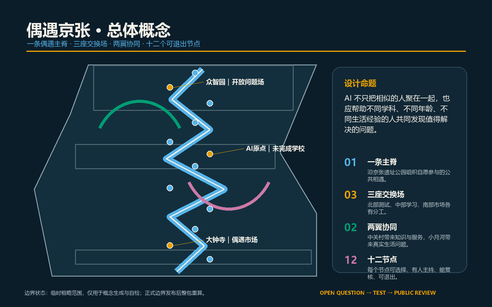
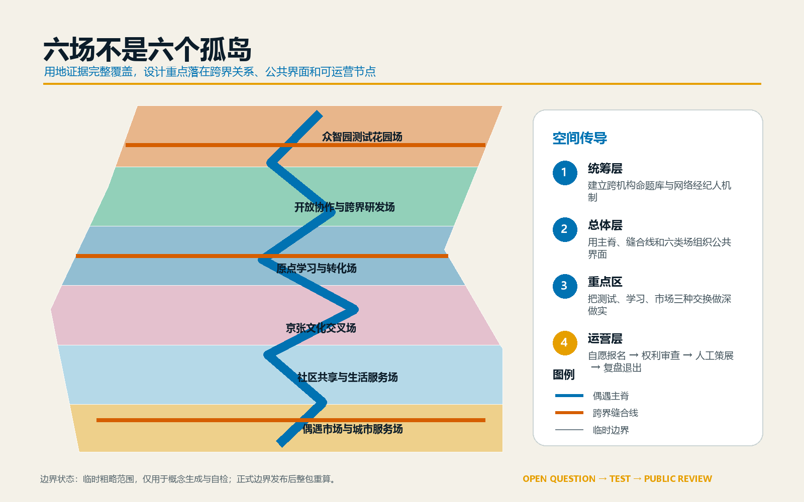
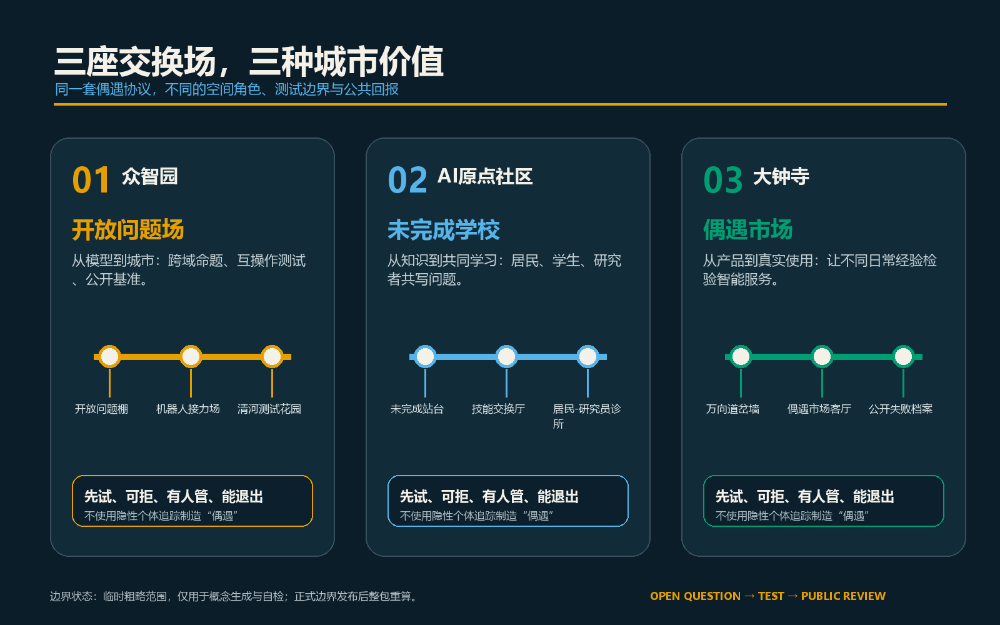
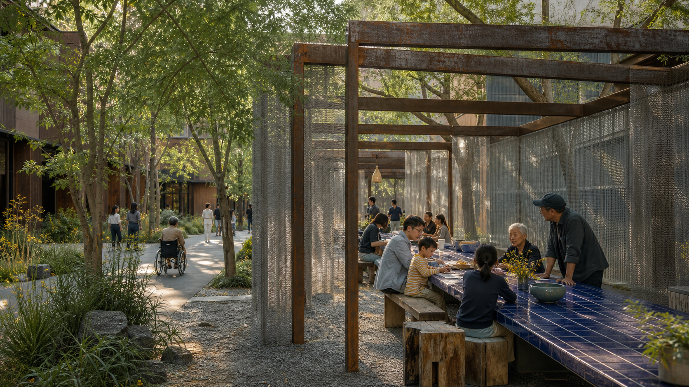
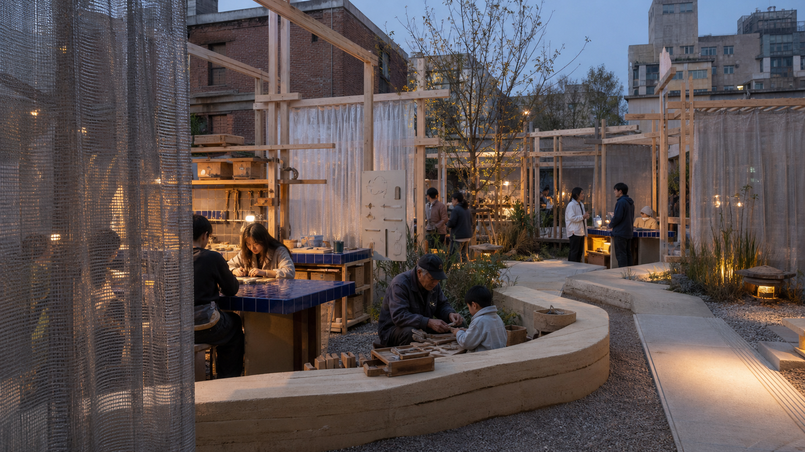
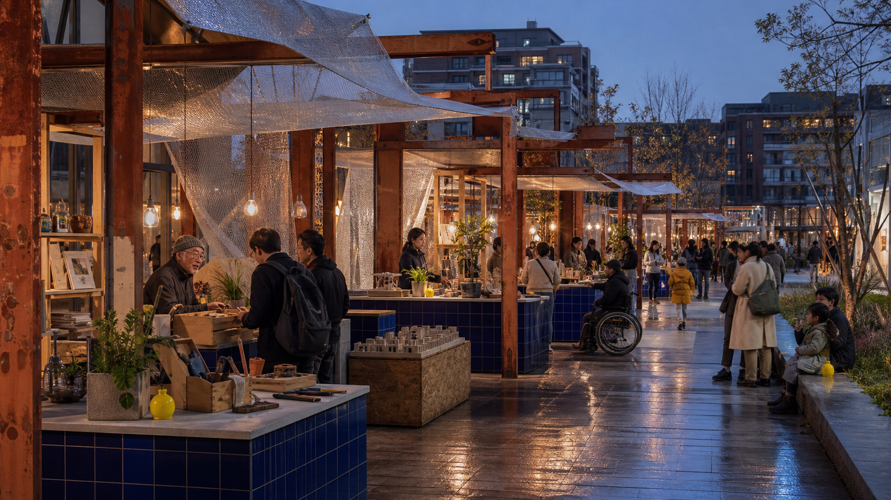
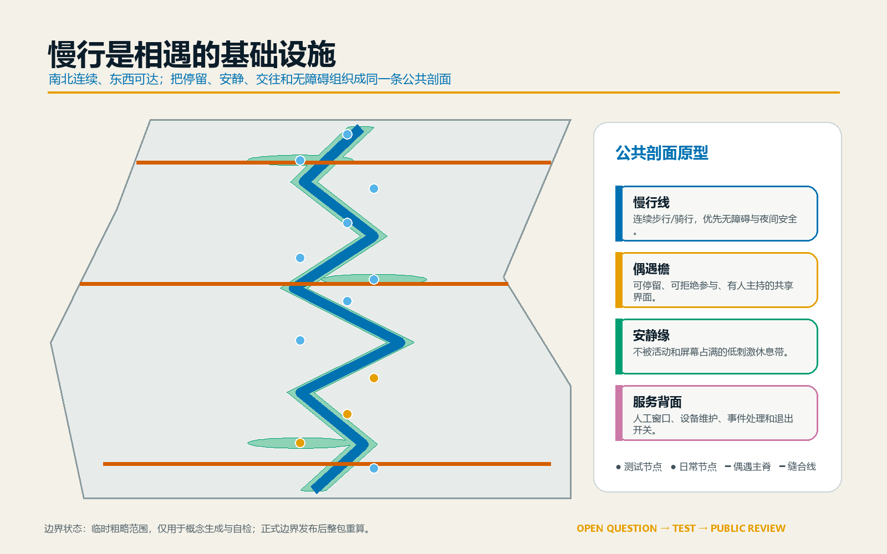
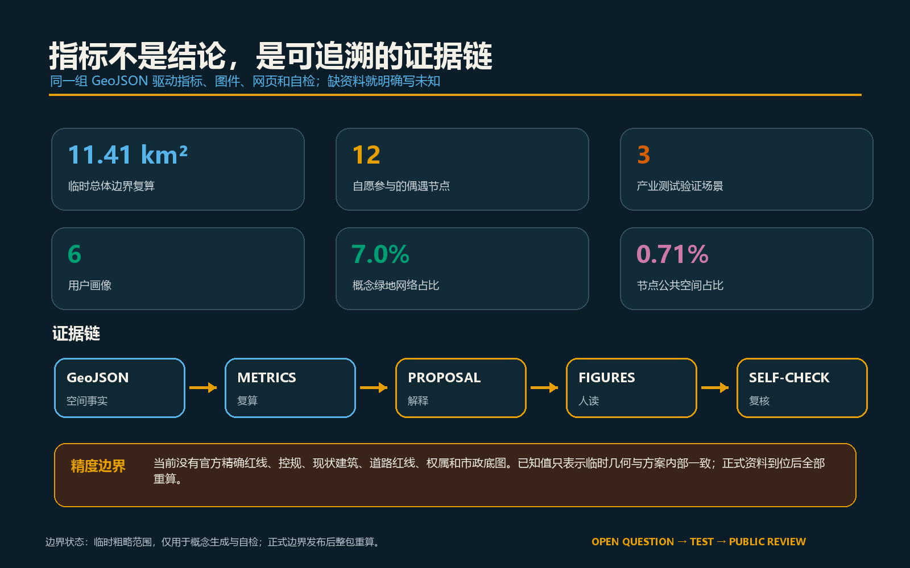

# :  UNRECOMMENDED LINE:      THE  (Jing-Zhang)

AI excels at matching similar people more accurately and at turning each journey into the shortest path; yet, the hardest value for cities to replace is often hidden in the un-recommended seats, the detour of a longer tree-lined path, and the unexpected adjacent stalls. This proposal does not create a closed "AI district," but instead envisions the Jing-Zhang Heritage Park and its surrounding areas as a useful detour: researchers encounter real-life problems, residents can rewrite technical propositions, businesses validate their products in an open and controlled environment, and cultural institutions allow technology to re-understand local memories.

The spatial structure is "a non-recommended line, three off-course fields, two wings collaborating, and twelve reversible nodes." Non-recommended is not random, but initiated by people raising questions, invited by the host to introduce differences, and decided by participants whether to enter; there is no individual tracking, and residents are not treated as unconsented test subjects. All scenarios adhere to voluntary participation, human moderation, minimal data collection, explainability, opt-out options, and public debriefing. The current boundary is the temporary rough polygon provided by the warehouse, all areas and spatial judgments are for conceptual comparison only and are not the Official Planning Boundary or approval conclusion.

## Design Basis and Source List

The proposal first follows the Call for Entries and the Agent's Task Book, navigating with the repository package, Source Registry, and Fact Pack: [source:OFFICIAL-ANNOUNCEMENT], [source:AGENT-TASKBOOK], [source:SITE-PACKAGE], [source:SOURCE-REGISTRY], [source:PROCESSED-FACT-PACK]. The overall scope and three key areas come from the Provisional Boundary documentation [source:BOUNDARY-SOURCE], [source:KEY-AREA-SOURCE]; corresponding layers are clearly marked with `official_boundary=false` and `provisional_constraint`.

This proposal is organized according to six standards: [standard:PROJECT-OFFICIAL-ANNOUNCEMENT], [standard:PROJECT-AGENT-OPEN-CALL-TASKBOOK], [standard:MOHURD-URBAN-DESIGN-MEASURES], [standard:MOHURD-CONTROL-DETAILED-PLANNING], [standard:MNR-LAND-USE-CLASSIFICATION-GUIDE], and [standard:MOHURD-ARCH-DESIGN-DEPTH-2016]. These standards are used to determine the scope and depth of the task, and do not represent that this proposal has obtained any approval.

The gap in documentation is also a design reference. Formal boundaries, statutory control plans, road red lines, rail control, ownership, current buildings, cultural heritage, municipal services, flood control, fire safety, and public service baselines are still incomplete. Therefore, this plan only proposes spatial prototypes, pilot rules, and deepening methods; the Building Height, total built-up area, statutory Floor Area Ratio, road sections, and conclusions of the demolish–renovate–retain strategy remain undetermined. The current conditions and gaps are diagnosed in [depth:existing_conditions_diagnosis] and [data:geometry/constraints.geojson#CONSTRAINTS]. (Demolish–Renovate–Retain Strategy)

## Three-Level Scope Framework

Three layers share the same issue: how to align AI innovation with everyday urban life, rather than keeping them in separate silos.

| Level | Task | Unrecommended Jing-Zhang Response |
| --- | --- | --- |
| Coordinated Research Area, approximately 43.6 square kilometers | Study industrial ecology, future urban form, and global collaboration | Establish a cycle of "problem posting—cross-disciplinary teaming—small-scale experimentation—public debriefing—spatial updating" |
| Overall Design Area, temporarily recalculated at approximately 11.41 square kilometers | Form Urban Renewal, industrial space, traffic and municipal infrastructure, and scenic framework | Organize space using non-recommended lines, six functional belts, three east-west offshoots, and a blue-green pedestrian network |
| Three key areas, with a task book area of approximately 368.4 hectares | Achieve detailed design expression for the key areas | Zhongzhiyuan "Mismatch Experiment Field," AI Origin "Incomplete Garden," and Dazhongsi "Heterogeneous Market" to work in collaboration |

Coordinate the layer to define an inter-institutional mechanism, the overall layer to integrate the mechanism into a continuous space, and the key areas to validate it with real scenarios. The three layers correspond to [depth:three_level_scope_framework], [depth:overall_spatial_structure]. The spatial index is found in [data:geometry/site_boundary.geojson#SITE-001] and three temporary key areas at [data:geometry/key_areas.geojson#PROV-KEY-001], [data:geometry/key_areas.geojson#PROV-KEY-002], and [data:geometry/key_areas.geojson#PROV-KEY-003].

## Coordinated Research Area: Industry and Future City Research

"Not Recommended Jing-Zhang" is not against technology, but against cities reduced to a single ranking system. Higher education institutions, enterprises, communities, cultural organizations, and public sectors do not end with an organizational registry but form short-term teams based on "who owns the problem, who can provide different knowledge, who bears the consequences." Each public challenge is subject to rights and data reviews, piloted in a small scope, and even failures are documented in the public archive.

Seven international cases provide methodological inspiration, but are not to be mechanically replicated: The Singapore Punggol Digital District illustrates how physical space and open digital platforms can serve academic-industrial collaboration [source:CASE-PUNGGOL]; the Barcelona City Innovation Lab illustrates that city pilots need a single entry point and public value judgments [source:CASE-BARCELONA]; Helsinki Kalasatama illustrates that agile experiments in small-scale, short-cycle, real-life environments can reduce risk [source:CASE-KALASATAMA]; Paris Saclay illustrates that research, industry, transportation, nature, and quality of life must be built simultaneously [source:CASE-PARIS-SACLAY]; the London Knowledge Quarter illustrates that "network brokers" spanning universities, businesses, and cultural institutions are an important service in themselves [source:CASE-KNOWLEDGE-QUARTER]; CitCom.ai illustrates that complex technologies should be validated in scenarios approaching real urban conditions [source:CASE-CITCOM-AI]. The NIST AI Risk Management Framework reminds all pilots to continuously govern, measure, and verify [source:CASE-NIST-AI-RMF].

Thus forming five loops: each season, an Open Call for urban issues; human curators form "misfit long-table groups" with participants from diverse backgrounds; twelve nodes provide testing, co-learning, and showcasing; evaluations record both outcomes and burdens, misfires, and exits; mature proposals enter the update project, while failed cases enter the next season for learning. It is suggested to set up a "Jing-Zhang Network Broker" group, which does not replace administrative approval but is responsible for connecting, hosting, publicly recording, and referring.

Name "THE UNRECOMMENDED LINE" directly responds to the algorithmic age: it is not an unauthorized new line, but a method of Public Space that brings different knowledge together. The Chinese " nicht empfohlene Jing-Zhang" retains a touch of counter-intuitiveness and invitation. The logo consists of two originally parallel lines that are slightly misaligned, with an unexpected dot; the visual system uses paper off-white, porcelain blue, oxidized steel red, silver gray, and a very small amount of fluorescent yellow-green. The spatial materials draw on the curatorial method of Superkilen, which transforms public engagement into spatial objects [source:CASE-SUPERKILEN], and also draw on The Bentway's understanding of digital publicness as the relationship between people and places and rules [source:CASE-BENTWAY-DIGITAL-PUBLIC]. The wings still serve as the "Knowledge Transformation Wing" and the "Daily Validation Wing," not as new administrative zones.

## Overall Design Area: Urban Renewal and Regulatory-Plan-Level Urban Design

A north-south "Non-Recommended Line" connects three off-field airports, with three east-west side branches linking universities, parks, communities, and rail stations. It does not aim for a straight-line view, but instead creates optional pauses through the use of long tables, misaligned porches, silver net curtains, quiet gardens, and heterogeneous stalls; it is not a road or rail red line, but a concept of walking, cycling, public activities, and signage [data:geometry/roads.geojson#ROAD-ENCOUNTER-SPINE]. Six continuous functional bands cover the Provisional Boundary: heterogeneous markets, daily life, cultural intersections, origin learning, open exchanges, and test gardens; the corresponding areas are recalculated by six non-overlapping polygons such as [data:geometry/land_use.geojson#LU-MARKET-SOUTH].

Update not from large-scale demolition and construction, but from four actions: to complete continuous pedestrian and barrier-free connections; to convert corners, first floors, and inefficient open spaces into reversible nodes; to support six conceptual building carriers for problem issuance, testing, co-learning, and market validation; and to verify through public activities whether the space is truly useful. A unified construction vocabulary includes dismantlable oxidized steel frames, ceramic blue tables, recycled wood, silver mesh curtains, permeable ground surfaces, and low-level warm lighting; they establish recognizability with real materials without relying on screens or "futuristic" shapes. Land use completeness is shown in [depth:land_use_layout], intensity control rules are pending in [depth:development_intensity_controls], height and massing methods are described in [depth:height_massing_character], and the prerequisites for the demolish-renovate-retain strategy are detailed in [depth:retain_renovate_demolish]. (Demolish–Renovate–Retain Strategy)

Six building outlines are functional prototype shells, including the Open Question Pavilion, Bench Lab, Incomplete Platform, Skill Exchange Hub, Urban Transfer Station, and Accidental Market [data:geometry/buildings.geojson#BLDG-OPEN-QUESTION]. They do not correspond to existing buildings; formal surveying, ownership, cultural heritage, and structural documentation will be completed first, followed by embedding in the preserved buildings, light renovation, and finally, if necessary, considering the construction of removable new structures.

## Detailed Design of Key Areas

### Zhongzhiyuan: Misfit Experiment Field

Positioned as a site for industrial testing and mismatch with public issues. On the Qinghe side, a continuous open interface is formed, with an entrance designated as the "Wrong Entrance." The central area features a ceramic-blue long table and misaligned steel portico, comprising a reservable test institute, with public benchmark walls set along non-recommended lines. Core projects include cross-domain problem statement exchanges, robotic interoperable relays, and a Qinghe low-carbon observation. Before testing, the purpose, duration, data, and exit procedures are announced; during testing, there is an on-site safety officer; and after testing, the results of success, failure, and disturbances are made public. The temporary scope is defined in [data:geometry/key_areas.geojson#PROV-KEY-001].

Atmosphere diagrams are sourced and used within the boundaries as indicated [source:RENDER-V3-QUESTION-YARD].

### Beijing AI Origin Community: Uncompleted Garden

Positioned as a site for near-school co-learning and the transformation of outcomes. The space does not showcase a "completed future," but rather uses reclaimed wooden frames, rammed earth seating, silver net curtains, and tool racks to create a garden that can be further modified by residents, students, and entrepreneurs. An unfinished platform accommodates the release of outcomes, with a skills exchange hub connecting legal, design, engineering, and community experiences. A quiet edge provides an alternative path for those not engaging with AI. The campus—park—community slow mobility connections must be re-evaluated within formal boundaries and traffic conditions. Temporary boundaries are defined in [data:geometry/key_areas.geojson#PROV-KEY-002].

Atmosphere diagrams are sourced and used within the boundaries as indicated [source:RENDER-V3-UNFINISHED-GARDEN].

### Dazhongsi: Heterogeneous Market

Positioned as a venue for genuine use and international exchange. Organize heterogeneous markets, urban transfer stations, and faulty light corridors around the rail station and quadrants of pedestrian demand: repair, books, plants, food prototypes, and product models are not zoned by industry but by "what different abilities are needed for a single life issue." Oxidized steel frames, silver net sheds, ceramic blue counters, and post-rain low warm lighting form a city living room available day and night. An accessible route review is re-measured as a long-term public task, with the results entering the update list. The rail, road, commercial, and cultural heritage conditions are pending official documentation. The temporary scope is available at [data:geometry/key_areas.geojson#PROV-KEY-003].

Atmosphere diagrams are sourced and used within the boundaries as indicated [source:RENDER-V3-STRANGE-MARKET].

All three detailed designs cover functions, building envelopes, transportation, Public Space, operations, and exit conditions, to be uniformly reviewed by [depth:three_key_area_detailed_design].

## AI Innovation Ecosystem, Personas, and AI+ Scenarios

Six categories of users are not those automatically profiled by the system, but rather roles that the design team uses to check for any overlooked needs: Researchers require authentic problems and verifiable results; startup teams need low-cost testing and rule descriptions; industrial engineers need cross-system interfaces and failure records; nearby residents need unintrusive, opt-out options with daily benefits; university students need cross-disciplinary collaboration and export of outcomes; and international visitors and cultural practitioners need understandable place narratives and multilingual collaboration. A total of [metric:persona_count] six categories.

The twelve nodes are expressed from [data:geometry/public_space.geojson#ENCOUNTER-01] to [data:geometry/public_space.geojson#ENCOUNTER-12], totaling [metric:scenario_count]. The first three are industry Testing and Validation Scenarios, totaling [metric:industry_test_scenario_count]; the rest are public and cultural scenarios.

| # | Scenario | Type | Service Object and Spatial Actions | Rights Boundary |
| --- | --- | --- | --- | --- |
| 01 | Cross-Domain Mismatched Challenges | Industrial Testing | After anonymizing research, enterprises, and community issues, they are curated by a human curator within the Zhongzhiyuan short-term residency program | Only handle voluntarily submitted issues, without establishing individual referral records |
| 02 | Robotic Interoperable Relay | Industry Testing | Different vendors' equipment collaborating on a defined route, public failure and human take-over | Closed Period, Human Safety Officer, Anonymized Equipment Logs |
| 03 | Barrier-Free Route Recertification | Industrial Testing | Walkthrough by Inaccessible Individuals with Navigation Team to Identify Gaps | Participants Control the Recording Content, Option for Pure Manual Route |
| 04 | Misplaced Long Table | Public Scene | The ceramic-blue long table invites individuals from different backgrounds to gather around a common issue at the same table | No recording, participants can leave at any time |
| 05 | Skill Exchange Night School | Learning Scenario | Residents teach life skills, engineers teach tools, students responsible for translation | Not ranked by skill level, no mandatory use of AI |
| 06 | Failure Archive | Cultural Scenario | To showcase why pilot projects failed, who was affected, and how to exit | Conduct rights reviews first, allowing individuals and enterprises to request corrections |
| 07 | Jing-Zhang Memory Revisited | Cultural Scene | Oral History and Railway Space Metaphors Form a Correctable Guided Tour | Cultural and Historical Content Reviewed by Sources and Cultural Heritage Verification |
| 08 | One-Hour Diverse Clinic | Corporate Services | Legal, design, accessibility, and safety experts collectively address a product challenge | Book an appointment, business secrets do not enter public records |
| 09 | Children's Reverse Review | Educational Scenario | Children Use Drawings to Explain Where Intelligent Services Are Hard to Understand | Parental Consent, No Collection of Facial Data or Behavioral Trajectories |
| 10 | Nighttime Slow-Speed Care | Living Scenarios | Manual Patrol and Anonymous Facility Reporting to Improve Lighting, Signage, and Rest Points | No Identity Recognition or Crime Prediction |
| 11 | Climate Shared Table | Public Scene | Connecting Residents and Researchers through Thermal Comfort, Rainwater, and Food Issues | Environmental Data for Regional Statistics Only |
| 12 | Global Detour Relay | International Scenario | Different cities exchange an unresolved issue to respond to with a 100-hour short-term collaboration | Publicly source, license, and take responsibility, no promise of direct implementation |

Three "AI Pilgrimage Landmarks" are the Misplaced Portico, the Incomplete Garden, and the Failed Lamp Corridor, totaling [metric:landmark_count]. They individually emphasize difference, continuous modification, and public failure, without shaping technological worship. Public Space and scenario governance are constrained by [depth:blue_green_public_space] and [depth:risk_missing_data].

## Land Use, Building Scale, and Retain-Renovate-Demolish Strategy

The Provisional Boundary area is [metric:site_area_sqm]. Six functional parcels follow the existing land use classification codes but only express conceptual functions, not statutory rezoning: commercial service land use approximately [metric:land_use_05_sqm], agency and group land use approximately [metric:land_use_0702_sqm], research and development land use approximately [metric:land_use_0802_sqm], education land use approximately [metric:land_use_0803_sqm], and park green space approximately [metric:land_use_1401_sqm]. The combined areas of the six categories are consistent with the provisional boundary, and the parcels do not overlap.

The Building Footprint area for the six concept carriers is [metric:building_footprint_area_sqm], which constitutes a proportion of [metric:concept_building_coverage_ratio] of the temporary scope. These two metrics only indicate that the prototype occupies a light footprint, and are not indicative of the Building Coverage Ratio. The total gross floor area and Floor Area Ratio remain unknown [metric:floor_area_ratio]; no conclusions regarding height, density, or total quantity will be set until the formal control plan, current surveying, and ownership are complete.

The Demolish–Renovate–Retain Strategy ("Preserve") adopts the sequence of "first identify value, then assess safety, and finally choose action": retain those with clear historical and public value; renovate those structurally viable and functionally adaptable; use dismantlable facilities in scenarios where construction is unnecessary; and only consider demolition when a professional assessment confirms it is unretainable and there is indeed a public interest. Currently, the six building outlines cannot be used to specify any real-world building for the Demolish–Renovate–Retain strategy.

## Transport, Rail, Municipal Infrastructure, and Public Services

The transportation strategy is composed of four conceptual threads: a north-south non-recommended alignment and three east-west detour spurs, totaling approximately [metric:road_length_m]. They express pedestrian, cycling, accessibility, and activity connections, not road centerlines, redlines, or rail alignments. Three key areas prioritize rail station entrances and exits, quadrants at intersections, and crossing points at the Jing-Zhang Heritage Park, as well as the last 500 meters between parks and communities. Transportation, rail, slow travel, and parking refinements are detailed in [depth:traffic_rail_slow_parking].

Public services are delivered through "small nodes, shared backend, and in-person presence." Each off-course field is equipped with issue reception, rights and data review, accessibility alternatives, human facilitation, emergency and exit instructions; edge-side computational power, energy storage, charging, drainage, and communication are only listed as services to be argued for, with no commitment to construction in the absence of capacity data. Municipal and new infrastructure deepens are detailed in [depth:municipal_new_infrastructure].

## Blue-Green Network, Public Space, and Urban Character

Conceptual green space network covers an area of approximately [metric:green_space_area_sqm], representing about [metric:green_ratio] of the temporary study area; twelve reversible circular nodes cover a combined area of approximately [metric:public_space_area_sqm], representing about [metric:public_space_ratio]. The green network is derived from a buffer indication around the non-recommended lines for east-west connections and does not represent existing green spaces, blue lines for waterways, or planned green lines; the node radii are for scheme recalculation purposes and are not construction dimensions.

Public Space adopts a four-layer profile: continuous pedestrian paths are responsible for arrival; silver offset eaves provide shade, pause, and visibility of activities; quiet edges allow for the rejection of interaction and low-stimulation rest; service back areas accommodate equipment, logistics, and human presence. Ceramic blue is used only for shared work surfaces, oxidized steel is used only for reversible frames, and fluorescent yellow-green is used only to mark areas that require collective answers. All nodes can be reduced, moved, or removed after trial operation. The green network is found at [data:geometry/green_space.geojson#GREEN-ENCOUNTER-COMMONS], and the Public Space is found at [data:geometry/public_space.geojson#ENCOUNTER-01].

The aesthetic does not aim for a uniform "tech blue." Materials are suggested to include recyclable metals, wood structures, and durable pavements. Blue and green lines run through the signage, with orange used only for marking common issues and safety tips. Railway switches, platforms, and transfers are used only as design metaphors; they are not written as specific historical facts unless confirmed by reliable historical sources.

## Renewal Projects, Implementation Policy, and Phasing

| Number | Update Project | What to Do First | Conditions to Enter the Next Phase |
| --- | --- | --- | --- |
| JZ-01 | Non-Recommended Line Discontinuity Check | Manual Walk, Bike Ride, and Re-measurement for Accessibility | Confirmation of Formal Roads and Traffic Conditions |
| JZ-02 | Open Question Hub | Temporary Problem Submission Booth and Manual Curating | Operational Subject, Rights, and Data Review in Place |
| JZ-03 | Robot Interoperable Relay Field | Time-Limited Closed Trial | Safety Assessment and Emergency Takeover Approved |
| JZ-04 | Qinghe Testing Garden | Environmental Observation and Removable Facilities | River Course, Flood Control, Ecological Conditions Confirmation |
| JZ-05 | Uncompleted Platform | Small Scale Presentation and Reverse Review | Ownership, Fire Safety, and Pedestrian Flow Assessment Approved |
| JZ-06 | Skills Exchange Hub | Monthly Facilitated Night School | Barrier-Free and Long-Term Scheduling Implementation |
| JZ-07 | Failed Archive | Online and Offline Public Review | Mechanisms for Correcting, Reverting, and Copyright Protection |
| JZ-08 | Dazhongsi Diverse Market | Weekend Diverse Theme Stalls | Commercial, Transportation, Noise, and Fire Safety Permits Confirmation |
| JZ-09 | Quadrant-by-Quadrant Barrier-Free Retest | Participatory Route Inspection | Confirmation of Track Station and Intersection Engineering Conditions |
| JZ-10 | Public Space Signage for Three Locations | Temporary Blue and Green Dual-Line Signage | Confirmation of Cultural Heritage, Road, and Public Space Permits |
| JZ-11 | Jing-Zhang Network Broker | A small team piloted for a quarter | Public assessment showed public benefits outweighed costs |
| JZ-12 | Global Challenge Relay | A 100-Hour Pilot with a City | Full Source, License, Responsibility, and Exit Agreement |

Recent phases cover the northern interim zone, with an area of [metric:phase_1_area_sqm], and will initially implement regular, human-led, and modular pilot projects; the mid-phase area is [metric:phase_2_area_sqm], stitching three offset fields with pedestrian connections; the long-term phase area is [metric:phase_3_area_sqm], expanding global collaboration after the effectiveness of the first two phases is proven. The boundaries for the three phases are defined in [data:geometry/phasing.geojson#PHASE-01], [data:geometry/phasing.geojson#PHASE-02], and [data:geometry/phasing.geojson#PHASE-03], to be reviewed by [depth:renewal_project_list] and [depth:phasing_implementation].

Long-term operation includes four fixed rhythms: a "Open Question Season" every quarter, a "Mixed Bench Week" every month, a "Global Problem Relay for 100 Hours" annually, and an "Open Failure Archive" throughout the year. Any scenario that fails to generate public benefits for two consecutive rounds, where complaints cannot be resolved, or where operational conditions are inadequate, will be reduced or exited.

## Metrics, Area Recalculation, and Compliance Matrix

All known metrics are generated by a set of spatial layers or explicit counts: temporary overall extent [metric:site_area_sqm]; land use areas for five categories [metric:land_use_05_sqm], [metric:land_use_0702_sqm], [metric:land_use_0802_sqm], [metric:land_use_0803_sqm], [metric:land_use_1401_sqm]; conceptual Building Footprint and ratio [metric:building_footprint_area_sqm], [metric:concept_building_coverage_ratio]; green space network area and ratio [metric:green_space_area_sqm], [metric:green_ratio]; Public Space area and ratio [metric:public_space_area_sqm], [metric:public_space_ratio]. Conceptual Link Length [metric:road_length_m]; Phase Areas [metric:phase_1_area_sqm], [metric:phase_2_area_sqm], [metric:phase_3_area_sqm]; Key Areas, Scenarios, Tests, Portraits, and Landmark Counts [metric:key_area_count], [metric:scenario_count], [metric:industry_test_scenario_count], [metric:persona_count], [metric:landmark_count].

The recalculation of the indicators is managed by [depth:metrics_recalculation]. Known values are valid only within the current Provisional Boundary; a full recalculation is required after the formal boundary is replaced. The total floor area, statutory Floor Area Ratio, formal Building Coverage Ratio, and road area ratio remain unknown to avoid approving based on conceptual drawings.

All fifteen design depths have traceable evidence: [depth:existing_conditions_diagnosis], [depth:three_level_scope_framework], [depth:overall_spatial_structure], [depth:land_use_layout], [depth:development_intensity_controls], [depth:height_massing_character], [depth:retain_renovate_demolish], [depth:traffic_rail_slow_parking], [depth:municipal_new_infrastructure], [depth:blue_green_public_space], [depth:three_key_area_detailed_design], [depth:renewal_project_list], [depth:phasing_implementation], [depth:metrics_recalculation], [depth:risk_missing_data]. Announcements 1.3, 1.4, 1.5 and agent tasks agent.1 to agent.6 are mapped one-to-one in `compliance_matrix.json`.

## Risk, Copyright, and Compliance

The greatest risk is not a lack of design imagination, but the pseudo-precision brought by provisional boundaries [source:BOUNDARY-SOURCE] [depth:risk_missing_data]. Once formal boundaries or any professional baseline maps are updated, recalculations are needed for land use, green spaces, Public Spaces, buildings, roads, phases, indicators, graphics, and drawings. Simply replacing the baseline map is insufficient. Secondly, cross-boundary encounters may become mandatory social interactions, implicit recommendations, or unpaid labor; thus, it is essential to maintain voluntary participation, human facilitation, minimal data requirements, no AI alternatives, and exit compensation. Thirdly, activities and landmarks may oversimplify the historical context of the railways; all historical and cultural texts must be verified by reliable sources and professionals before implementation. (Provisional Boundary)

This scheme does not claim official approval, statutory land use controls, land ownership, construction scale, financial arrangements, or implementation commitments. The six buildings, four connections, and twelve nodes are Conceptual Recommendations for professional teams to further develop. All drawings, symbols, web pages, and layout designs are original to this scheme; external cases are only referenced for their method information, and no images, symbols, or layouts are reused. For detailed information, see `report/copyright_statement.md`.

The offline display page does not load remote maps, fonts, scripts, forms, or tracking services. All public activities must still undergo copyright, data, accessibility, security, and operational reviews before going live.

## References

- Beijing Municipal Commission of Planning and Natural Resources Haidian Branch, Qualification Pre-Review Announcement for International Urban Design Proposals for the Centennial Jing-Zhang AI Innovation Belt [source:OFFICIAL-ANNOUNCEMENT]
- Open Call Task Book and Repository Materials for AI Agents [source:AGENT-TASKBOOK] [source:SITE-PACKAGE]
- Repository Source Registration and Processed Fact Package [source:SOURCE-REGISTRY] [source:PROCESSED-FACT-PACK]
- Provisional Boundary and focus area source [source:BOUNDARY-SOURCE] [source:KEY-AREA-SOURCE]
- Punggol Digital District [source:CASE-PUNGGOL]
- Barcelona Innova Lab [source:CASE-BARCELONA]
- Smart Kalasatama Agile Piloting [source:CASE-KALASATAMA]
- Paris-Saclay Innovation [source:CASE-PARIS-SACLAY]
- Knowledge Quarter Innovation District [source:CASE-KNOWLEDGE-QUARTER]
- CitCom.ai Testing and Experimentation Facilities [source:CASE-CITCOM-AI]
- NIST AI Risk Management Framework [source:CASE-NIST-AI-RMF]
