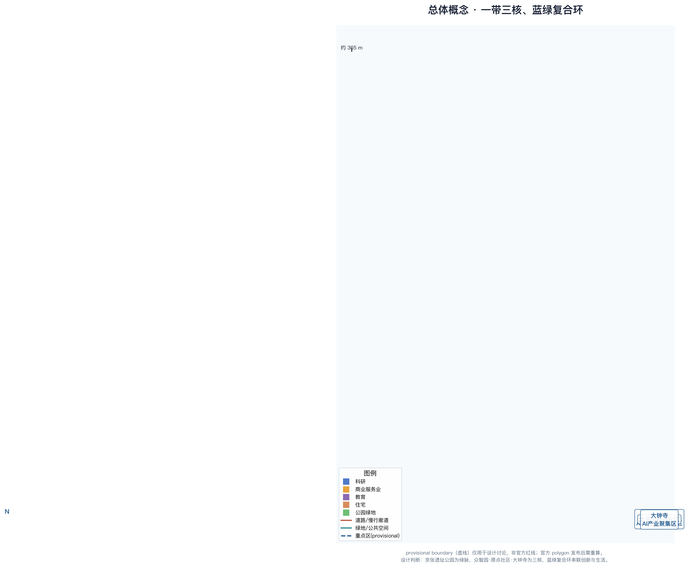
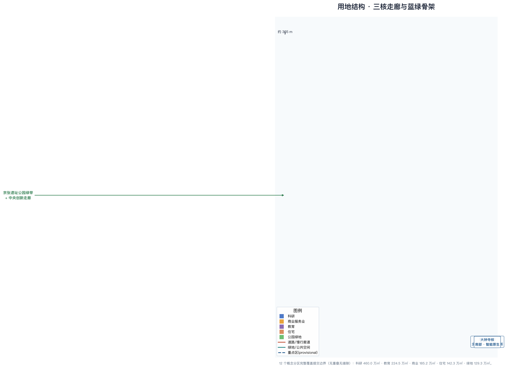
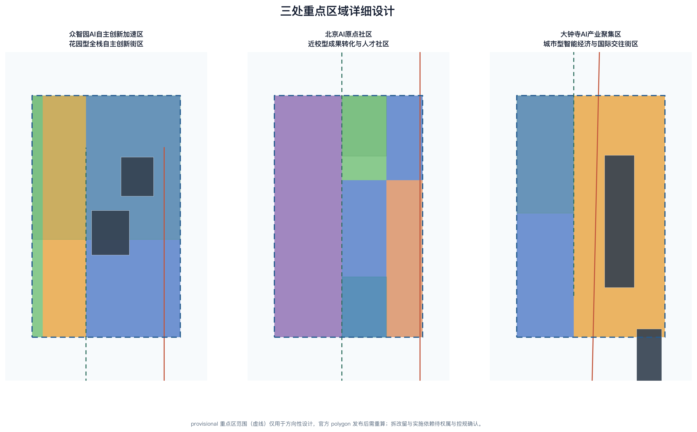
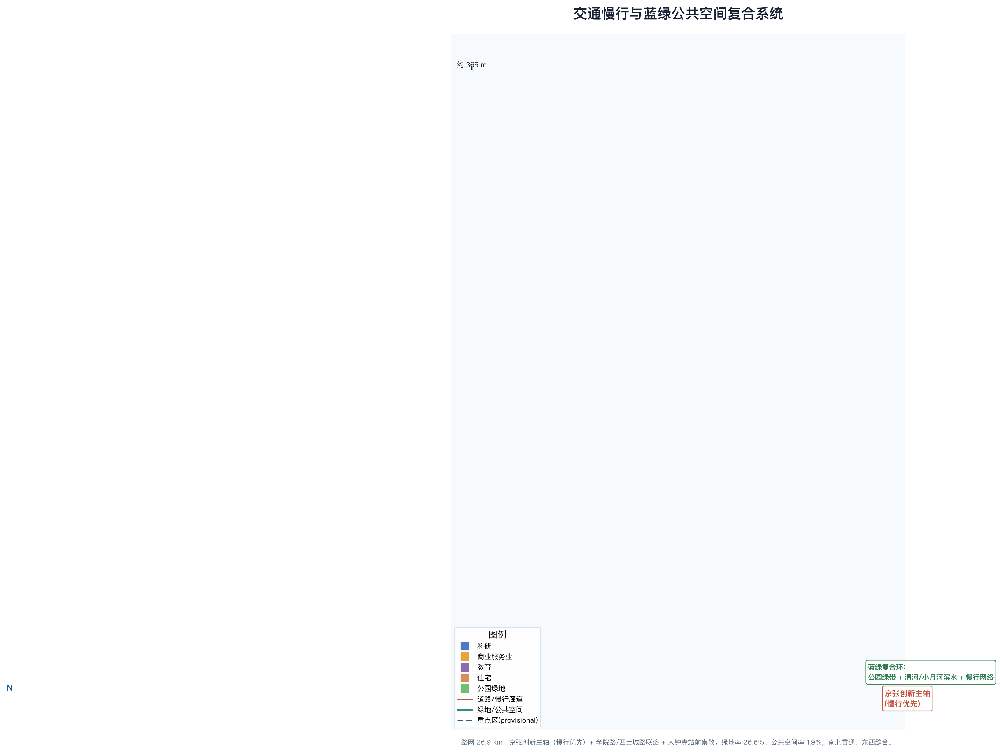
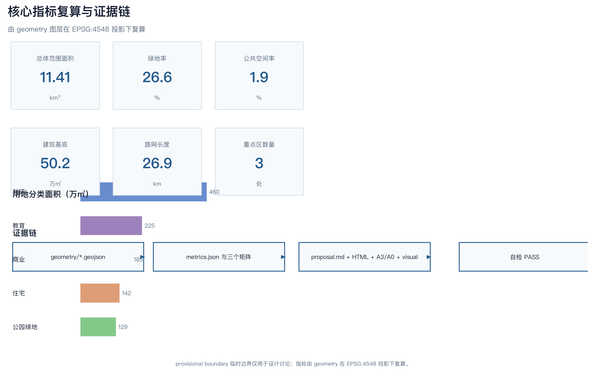

# 京张智脉·百年京张AI创新带概念城市设计

## 设计依据与资料清单

本方案以北京市规划和自然资源委员会海淀分局发布的《百年京张AI创新带城市设计国际方案征集资格预审公告》及其附件为第一依据，并以仓库 `brief/site-package/` 中经维护者登记的设计任务书、面向智能体任务书、枚举、规划指标范围和来源清单作为机器可读依据。方案生成前，我们读取了 `design_brief.json`、`allowed_design_space.json`、`sources.json`、`enums/`、`ranges/`、`schemas/` 与 `data/source_registry.json`，并参考 `data/processed/agent_fact_pack.md`、`project_scope_summary.csv`、`agent_task_requirements.csv`、`source_use_matrix.csv` 与 `missing_data_checklist.csv` 建立任务、范围、资料用途和缺口清单 [source:OFFICIAL-ANNOUNCEMENT] [source:AGENT-TASKBOOK] [source:SITE-PACKAGE] ，相关记录见结构化文件 [depth:existing_conditions_diagnosis]。全部设计判断都以“可追溯来源、可复算指标、可校验图层、可人工复核假设”四层组织，完整机器索引分别保存在 `sources.json`、`metrics.json`、`standard_matrix.json` 与 `design_depth_matrix.json`，不在正文重复机器编号。

资料登记表的使用边界由 `data/source_registry.json` 确定 [source:SOURCE-REGISTRY]：登记摘要为 formal 可用资料 7 条、背景资料 1 条、provisional-only 资料 1 条。资格预审公告与面向智能体任务书属于已清权的公开任务材料；空间几何在官方 `SITE_BOUNDARY` 与三处 `KEY_AREA` 尚未取得时，仅使用 `brief/site-package/geometry/provisional_boundaries.geojson` 中明确标注的 `provisional_constraint` 临时范围。方案不会把 background_only 或 provisional_only 资料升级为官方边界、法定控规、正式评分依据或政府实施承诺。

提交包中的 `geometry/site_boundary.geojson` 与 `geometry/key_areas.geojson` 均为 `provisional_constraint`、`official_boundary=false`，只能用于方案生成、自检、可视化和设计讨论，不能作为官方红线、审批依据、精确面积依据或法定控制结论。该组织方数据缺口本身不阻断内容评分；待官方 polygon 发布后，site boundary、key areas、land use、roads、green space、public space、buildings、phasing 与全部面积类指标均需重算 [data:geometry/site_boundary.geojson#SITE-001] [metric:site_area_sqm] [source:SOURCE-REGISTRY]。正文中的空间结构、场景、项目和指标均按“可讨论、可复核、可替换官方边界后重算”的原则写入。

## 三层范围工作框架

方案按照公告确定的三个层次组织工作：统筹研究范围聚焦 43.6 平方公里京张沿线的 AI 产业生态、战略定位、创新链与未来城市形态（北至北五环路、东至京藏高速、南至西直门外大街、西至万泉河路）；总体设计范围聚焦 11.4 平方公里京张遗址公园周边 1-2 公里城市地区和产业区，要求形成城市更新总体框架、产业空间布局、交通市政支撑和城市风貌控制；重点区域范围聚焦 368.4 公顷三处详细设计地区，要求明确功能业态、建筑规模、拆改留分类、公共空间连通和交通组织 [source:OFFICIAL-ANNOUNCEMENT] [depth:three_level_scope_framework]。三层范围在 `compliance_matrix.json` 中逐条映射，保证公告 1.3、1.4、1.5 与 agent.1-agent.6 的必选任务都有章节、图层、指标、图纸和 HTML 证据。

总体设计范围采用 provisional 替代边界，复算面积为 11,412,825 平方米，与公告约 11.4 平方公里的文字面积一致；该粗略多边形宽约 1.37 公里、南北长约 9.72 公里，是一条沿京张铁路走廊延伸的带状地区 [data:geometry/site_boundary.geojson#SITE-001] [metric:site_area_sqm]。带状形态决定了“一带贯通、三核串联、东西缝合、南北贯通”的空间组织逻辑。三处重点区由独立图层和数量指标核对 [data:geometry/key_areas.geojson#PROV-KEY-001] [data:geometry/key_areas.geojson#PROV-KEY-002] [data:geometry/key_areas.geojson#PROV-KEY-003] ，相关记录见结构化文件 [metric:key_area_count]。

三层工作不是互相割裂的图纸集合。统筹研究决定产业链和城市形态判断，总体设计把判断落实到更新项目、空间结构和设施承载，重点区域详细设计验证具体地块、建筑、交通、公共空间和 AI 应用场景的可实施性 [depth:overall_spatial_structure] [depth:three_key_area_detailed_design]。方案生成时先锁定当前提交采用的 provisional 边界和约束，再生成用地、建筑、道路、绿地、公共空间、分期和 AI 服务节点，最后从这些图层复算指标并在正文解释哪些结论仍受 provisional boundary 限制；任何无法从结构化数据复算的面积、比例、规模或项目数量，均不写入正式结论。

| 层级 | 设计问题 | 方案回答 | 数据落点 |
| --- | --- | --- | --- |
| 统筹研究范围 | AI 产业生态与未来城市形态如何组织 | 建立“高校策源-开源协作-企业转化-公共体验-国际传播”创新链，形成三区两翼协同回路 | compliance_matrix.json、standard_matrix.json |
| 总体设计范围 | 产业空间、城市更新、交通市政与风貌如何落图 | 以“一带三核、蓝绿复合环”空间结构组织用地、建筑、道路、绿地、公共空间与分期图层 | [data:geometry/land_use.geojson#LU-01]、[data:geometry/roads.geojson#ROAD-001] |
| 重点区域范围 | 三处片区如何达到详细设计深度 | 分别提出定位、空间动作、AI 场景和实施依赖 | [data:geometry/key_areas.geojson#PROV-KEY-001]、[data:geometry/key_areas.geojson#PROV-KEY-002]、[data:geometry/key_areas.geojson#PROV-KEY-003] |

## 统筹研究范围产业与未来城市研究

### 总体概念、命名与视觉识别方向

面向智能体任务书 agent.1，本方案以“**京张智脉**”作为一带创意主名称，英文名称为“**Jing-Zhang AI Synapse Belt**”（简称 JZ-ASB，可译为“突触带”），延续并强化官方“百年京张AI创新带”的辨识度：以铁路为“脉”、以三处创新节点为“突触”，把历史交通走廊转译为当代 AI 知识流动的神经回路意象 [source:AGENT-TASKBOOK] [standard:PROJECT-AGENT-OPEN-CALL-TASKBOOK] [depth:overall_spatial_structure]。该命名不是替代官方名称的法定命名，而是面向征集任务的概念性品牌方向，供专业团队继续深化。

命名体系分三级：一级“京张智脉”作为区域品牌与公共叙事；二级“三核”子品牌（众智园“全栈创新核”、原点社区“开源策源核”、大钟寺“智能原生核”）；三级“场景与活动”名称（如“全球AI活动周”“开源灯塔之夜”）。Logo 方向以“一条钢轨、三颗突触、蓝绿双脉”为图形母题：一条由南向北的连续钢轨曲线（形似“Z”），沿轨布置三颗 AI 突触节点，曲线两端延展出蓝绿双色脉线，对应京张铁路历史、中关村创新与蓝绿复合环。色彩采用京张铁路赭石棕（历史）、中关村科技蓝（创新）与 AI 青绿（未来），字形以中西文双语几何无衬线为主。该视觉系统与导视、荣誉展示、活动品牌共用一个“脉-核-环”图形语言，避免文化标识与一带整体 Logo 混淆 [depth:overall_spatial_structure]。

三大定位把官方表述转译为可设计的空间策略 [source:AGENT-TASKBOOK] [standard:PROJECT-OFFICIAL-ANNOUNCEMENT]：**百年京张文化带**回答“我们从哪里来”，以铁路遗址、清华园火车站等历史资源为锚；**都市AI生活体验带**回答“为谁而建”，以 AI+交通、公共服务、消费和社区生活为日常场景；**AI融合创新带**回答“向何处去”，以全栈自主创新、开源生态和智能原生新业态为产业主线。五大功能进一步落实为空间分区：AI 全栈自主创新体系（众智园）、世界级 AI 创新生态（原点社区）、AI+ 场景赋能新范式（小月河场景赋能翼）、智能化 AI 活力城市（蓝绿复合环与公共空间）、AI 治理全球话语权（标准、安全治理与朝圣地标体系）。

三区两翼协同回路把五处空间单元组织为一个可运营的整体 [source:AGENT-TASKBOOK]：北部众智园承担全栈自主创新体系与 AI 治理全球话语权，中部原点社区培育世界级 AI 创新生态，南部大钟寺发展智能原生新业态；中关村科技服务翼提供要素全球化配置、IP 与资本赋能，小月河场景赋能翼把 AI 场景落到公共体验和城市生活。两条“翼”不是独立增量地块，而是把北部研发、中部策源、南部新业态与高校、资本、场景资源连通的机制层，具体以高校科教区、场景服务带与蓝绿公共空间共同承载 [data:geometry/land_use.geojson#LU-05] [data:geometry/land_use.geojson#LU-11]。

### 世界级 AI 创新生态与全球案例

面向智能体任务书 agent.2，本方案提出 AI 创新生态图谱，并梳理 8 个全球案例作为空间、运营与场景机制的对照参考，不构成对任何企业、城市或园区的招商引资承诺 [source:AGENT-TASKBOOK] [standard:PROJECT-AGENT-OPEN-CALL-TASKBOOK] [depth:land_use_layout]。案例只用于说明“高校策源-开源协作-企业转化-公共体验-国际传播”创新链和“土地-空间-产业-资金-人才-算力-数据-场景”要素机制可以如何落位，涉及投资额、产值或政策安排的内容一律不引用未经核实的数字。

| 案例 | 创新机制摘要 | 可转化为一带的空间/运营机制 | 证据引用 |
| --- | --- | --- | --- |
| 美国硅谷·帕洛阿尔托 | 高校-孵化-风投-企业全链条集聚，生活与创新高度混合 | 原点社区近校策源街、开放式创新单元 | [depth:three_key_area_detailed_design] |
| 美国西雅图·南湖联合区 | 云与 AI 企业总部带动周边研发、人才与公共空间更新 | 众智园全栈创新区、企业带动型城市更新 | [data:geometry/land_use.geojson#LU-12] |
| 美国波士顿·肯德尔广场 | 生命科学与 AI 交叉，实验室-转化-人才社区复合 | 高校科教创新转化区、成果转化驿站 | [data:geometry/land_use.geojson#LU-05] |
| 英国伦敦·国王十字 | 铁路遗址更新为创新商务区，保留历史站房为公共客厅 | 京张遗址公园绿带、历史站房公共化 | [data:geometry/green_space.geojson#GREEN-001] |
| 新加坡·裕廊湖区 | 规划先行、智能园区与可持续街区一体推进 | 清河滨水低碳创新生态廊、蓝绿复合 | [data:geometry/land_use.geojson#LU-10] |
| 日本东京·品川/涩谷站城一体 | 轨道站点带动立体城市与创新办公集聚 | 大钟寺站前一体化、四象限步行连通 | [data:geometry/land_use.geojson#LU-01] |
| 中国深圳·南山科技园 | 硬科技与智能硬件集群，产城紧密融合 | 南部产城融合创新区 | [data:geometry/land_use.geojson#LU-02] |
| 中国北京·中关村 | 高校策源、科创服务与开放创新文化沉淀 | 中关村科技服务翼、原点社区开源生态 | [data:geometry/land_use.geojson#LU-06] |

未来城市形态研究回答人工智能如何改变工作、生活、社交、学习、交通与公共服务 [depth:overall_spatial_structure] [depth:municipal_new_infrastructure]。本方案把 AI 交通系统、连续绿色空间、创新服务设施和国际化生活工作氛围落实为可定位的功能区、节点、廊道和场景，而不是泛泛描述技术愿景。产业战略指标、AI 创新指数、人才密度、空间供给类型和 AI+ 垂直应用重点区域写入 `metrics.json` 与 `compliance_matrix.json`，并区分官方值、设计建议值与待正式数据校准值；全球 AI 创新活动、开发者社区、开放场景或朝圣路线均表述为概念建议或参考方案，不写成已确定的政府活动或实施安排 [source:AGENT-TASKBOOK] [depth:risk_missing_data]。

## 总体设计范围城市更新与控规深度城市设计

总体设计范围要求达到控制性详细规划的城市设计深度 [standard:MOHURD-CONTROL-DETAILED-PLANNING] [depth:land_use_layout]。本方案以“一带三核、蓝绿复合环”为总体空间结构：中央沿京张铁路走廊布置“京张遗址公园绿带 + 中央创新走廊”，串联北部众智园、中部原点社区、南部大钟寺三处创新之核；东西两侧分别布置高校科教区、产城融合区、人才居住区与滨水生态廊，形成多环复合的慢行与蓝绿网络 [data:geometry/land_use.geojson#LU-01] [data:geometry/land_use.geojson#LU-06] [data:geometry/green_space.geojson#GREEN-001] ，相关记录见结构化文件 [depth:overall_spatial_structure]。

用地方案将提交边界完整划分为 12 个概念分区，覆盖全部 11,412,825 平方米且无重叠无缝隙：商业服务业用地 1,851,779 平方米，科研用地 4,600,027 平方米，教育用地 2,245,203 平方米 [data:geometry/land_use.geojson#LU-01] [metric:land_use_05_area_sqm] [metric:land_use_0802_area_sqm]。城镇住宅用地 1,422,968 平方米、公园绿地 1,292,890 平方米，共同构成完整的功能配比 [metric:land_use_0701_area_sqm] [metric:land_use_1401_area_sqm] [standard:MNR-LAND-USE-CLASSIFICATION-GUIDE] ，相关记录见结构化文件 [depth:land_use_layout]。分区依据国土空间调查、规划、用途管制分类的公开标准组织，科研与教育用地集中承载“全栈自主创新-高校策源-成果转化”链条，商业用地聚焦大钟寺与小月河场景，居住用地围绕原点社区与南部配套，绿地沿京张遗址公园与清河、小月河形成蓝绿骨架。

城市更新以“保留历史、改造低效、更新界面、新建锚点”为原则，识别低效产业空间、老旧街区与轨道沿线冗余空间作为更新对象，并形成近期试点、中期更新、长期治理的分期框架 [depth:retain_renovate_demolish] [depth:renewal_project_list] [depth:phasing_implementation]。涉及建筑高度、开发强度、容积率、道路红线、退线和设施标准的内容，在官方控规条件未取得前一律表述为“待正式控规条件确认”，不采用 agent 推测值冒充审定指标 [standard:MOHURD-CONTROL-DETAILED-PLANNING] [depth:development_intensity_controls] [depth:height_massing_character]。

分期范围由 `geometry/phasing.geojson` 表达：一期聚焦三核与绿带骨架，二期推进中部创新走廊与原点社区，三期完善北部众智园与清河生态界面 [data:geometry/phasing.geojson#PHASE-001] [data:geometry/phasing.geojson#PHASE-002] [data:geometry/phasing.geojson#PHASE-003]。

## 重点区域详细设计

重点区域详细设计是必选项，三处片区均需达到规划综合实施方案的城市设计深度 [depth:three_key_area_detailed_design]。三处重点区在 `geometry/key_areas.geojson` 中以 provisional 约束表达（官方 polygon 缺失），面积为公告文字值：众智园 192.1 公顷、原点社区 104.3 公顷、大钟寺 72.0 公顷 [data:geometry/key_areas.geojson#PROV-KEY-001] [data:geometry/key_areas.geojson#PROV-KEY-002] [data:geometry/key_areas.geojson#PROV-KEY-003] ，相关记录见结构化文件 [metric:key_area_count]。以下定位、空间动作、建筑形态、拆改留分类、公共空间连通、交通组织、AI 场景与实施风险均为方向性设计，供专业团队深化。

**众智园 AI 自主创新加速区**（北部，约 192.1 公顷）定位“花园型全栈自主创新街区”，围绕国家人工智能平台、全栈自主创新、标准制定、安全治理、产业展示、对外交通、清河文化与低碳绿色创新交往提出空间动作：沿清河界面组织低碳生态廊与创新交往广场，在中部布置 AI 研发示范建筑群与全栈创新加速楼，建立“自主模型测试—标准治理展示—安全治理沙盒—低碳算力体验”的展示与协作链 [data:geometry/key_areas.geojson#PROV-KEY-001] [data:geometry/land_use.geojson#LU-12] [data:geometry/buildings.geojson#BLDG-001]。交通以清河滨水联络道与京张创新主轴衔接北五环与对外通道 [data:geometry/roads.geojson#ROAD-001] [data:geometry/roads.geojson#ROAD-002]。

**北京 AI 原点社区**（中部，约 104.3 公顷）定位“近校型成果转化与人才社区”，服务高校策源、开源协作、成果发布与人才特区：以原点社区创新转化核心区与人才居住区组织“校区-园区-街区”慢行缝合，布置开源孵化楼、成果转化驿站与公共客厅，形成开源发布、成果展示、人才服务、居住生活和轨道站点一体化的复合场景 [data:geometry/key_areas.geojson#PROV-KEY-002] [data:geometry/land_use.geojson#LU-06] [data:geometry/land_use.geojson#LU-07] ，相关记录见结构化文件 [data:geometry/buildings.geojson#BLDG-003]。近校成果转化街以高校科教创新转化区为西翼支撑 [data:geometry/land_use.geojson#LU-05]。

**大钟寺 AI 产业聚集区**（南部，约 72.0 公顷）定位“城市型智能经济与国际交往街区”，围绕领军企业、智能体、智能终端、内容消费、数据要素、数字资产、商业服务与大钟寺站一体化：以智能原生商业商务区组织站前创新广场、四象限步行连通与重点企业公共环境更新，布置智能原生商务楼与 AI 产业服务楼，形成“智能体与智能终端展示—内容消费—数据要素—国际路演”的城市界面 [data:geometry/key_areas.geojson#PROV-KEY-003] [data:geometry/land_use.geojson#LU-01] [data:geometry/public_space.geojson#PUBLIC-001] ，相关记录见结构化文件 [data:geometry/buildings.geojson#BLDG-005]。站前集散道路与京张创新主轴承担对外交通组织 [data:geometry/roads.geojson#ROAD-005]。

| 重点片区 | 设计定位 | 空间动作 | AI 产业与运营场景 | 证据引用 |
| --- | --- | --- | --- | --- |
| 众智园 AI 自主创新加速区 | 花园型全栈自主创新街区 | 清河生态界面、创新交往广场、研发建筑群、标准治理展示 | 自主模型测试、标准制定工作坊、安全治理沙盒、低碳算力体验 | [data:geometry/key_areas.geojson#PROV-KEY-001]、[depth:three_key_area_detailed_design] |
| 北京 AI 原点社区 | 近校型成果转化与人才社区 | 校区-园区-街区慢行缝合、开源孵化、成果转化驿站、人才居住 | 开源发布厅、成果发布、人才特区服务、近校孵化 | [data:geometry/key_areas.geojson#PROV-KEY-002]、[source:AGENT-TASKBOOK] |
| 大钟寺 AI 产业聚集区 | 城市型智能经济与国际交往街区 | 站前一体化、四象限步行连通、智能原生商业更新、重点企业公共界面 | 智能体与智能终端展示、内容消费、数据要素与国际路演 | [data:geometry/key_areas.geojson#PROV-KEY-003]、[metric:key_area_count] |

## AI 创新生态、人才画像与 AI+ 场景

本方案建立面向 AI 人才、企业与公共治理的六类用户画像，覆盖研发办公、开源协作、成果发布、企业服务、人才居住、社交学习、消费生活、运动休闲与国际交往 [source:AGENT-TASKBOOK] [depth:three_key_area_detailed_design]。每类画像都说明典型需求、空间响应与自检边界，确保 AI 场景不采集个人行为轨迹、不输出未经授权的个人画像，并保留人工复核环节。

| 用户画像 | 典型需求 | 空间响应 | 自检边界 |
| --- | --- | --- | --- |
| 开源开发者 | 发布、协作、测试、社区声誉 | 原点社区开源发布厅、公共代码墙、夜间协作空间 | 不采集个人行为轨迹；活动数据只做聚合统计 |
| 初创团队 | 低成本办公、算力入口、产品试验场 | 众智园共享测试场、端侧算力服务点、标准治理咨询 | 算力和数据服务需另行授权 |
| 头部企业访客 | 展示、商务、国际接待、人才招聘 | 大钟寺国际路演客厅、轨道站点接驳、重点企业周边公共空间 | 企业标识和案例须清权 |
| 周边居民 | 通勤、休闲、社区服务、低扰动更新 | 京张遗址公园慢行环、社区服务嵌入、夜间照明和活动分级 | 不将居民画像用于商业推荐 |
| 高校师生 | 成果转化、跨校协作、日常慢行 | 校区-园区慢行缝合、成果转化驿站、AI 教育体验点 | 校园数据和科研成果需授权 |
| 国际开发者与访客 | 国际交流、开放社区、城市体验 | 大钟寺国际路演客厅、全球活动周路线、双语导视 | 个人数据出境与展示需合规评估 |

本方案提供 12 张 AI 场景卡，其中 4 张为产业测试验证场景（安全治理沙盒、开源模型测试场、数据要素合规测试、AI 交通测试场景），满足不少于 10 张场景卡与不少于 3 张产业测试验证场景的要求 [source:AGENT-TASKBOOK] [standard:PROJECT-AGENT-OPEN-CALL-TASKBOOK] [depth:blue_green_public_space]。每张场景卡都映射到空间位置、服务对象、运行数据、隐私边界、人工复核、运营主体与可视化图层；下表给出 12 张卡的载体与设计说明，隐私、复核与运营边界在表格后统一说明。

| 场景卡 | 空间载体 | 设计说明 |
| --- | --- | --- |
| 01 开源发布厅 | 原点社区创新转化核心区 | 面向高校、开源社区和初创团队，提供成果发布、代码贡献展示和小型路演空间 |
| 02 安全治理沙盒（测试） | 众智园全栈创新区 | 将标准制定、安全评测、模型红队测试转译为可参观、可预约、可监管的展示与协作节点 |
| 03 开源模型测试场（测试） | 众智园共享测试区 | 提供公开、可审计的开源模型基准测试、能耗与安全评估界面 |
| 04 数据要素合规测试（测试） | 大钟寺数据要素会客厅 | 以合规、授权、可审计为前提，展示数据要素与数字资产流通的测试与演示环境 |
| 05 AI 交通测试场景（测试） | 京张创新主轴与交叉口 | 用低侵入传感与可解释导视测试慢行断点识别、拥堵预判与无障碍需求 |
| 06 端侧算力驿站 | 总体设计范围节点 | 与公共服务、企业服务和低碳能源策略结合，作为待深化的新型基础设施原型 |
| 07 AI 慢行导航 | 京张遗址公园活力带 | 用可解释导视和低侵入传感帮助识别慢行断点、拥挤节点和无障碍需求 |
| 08 大钟寺国际路演客厅 | 大钟寺智能原生商业区 | 服务智能体、智能终端和内容消费企业的展示、洽谈、媒体发布和国际交流 |
| 09 清河低碳创新廊 | 众智园临清河界面 | 把绿色空间、雨洪、步行骑行和 AI 展示结合，作为园区公共客厅 |
| 10 近校成果转化街 | 原点社区与高校科教区之间 | 面向高校成果转化，组织孵化、展示、法务、知识产权和投融资服务 |
| 11 AI 生活服务样板街 | 社区与商业交汇处 | 将医疗、教育、法律、生活服务等 AI+ 场景落到可运营的小尺度街区空间 |
| 12 全球 AI 活动周路线 | 一带公共空间系统 | 形成从遗址文化、开源社区、产业展示到国际路演的可步行、可传播体验路线 |

AI 治理建议遵守数据最小化、公开来源、可解释与人工复核原则 [source:AGENT-TASKBOOK] [depth:risk_missing_data]。城市智能体可以辅助识别慢行断点、公共空间热力、设施维护、企业服务需求和活动安全风险，但不能替代规划审批、不能输出未经授权的个人画像、不能声称获得官方实施承诺。所有 AI 场景节点进入结构化图层或合规矩阵，便于评审者看到它们与产业、空间和公共利益之间的关系 [data:geometry/public_space.geojson#PUBLIC-001] [data:geometry/roads.geojson#ROAD-001] [data:geometry/green_space.geojson#GREEN-001] ，相关记录见结构化文件 [metric:public_space_ratio]。

## 用地、建筑规模与拆改留方案

用地方案完整覆盖提交边界、无重叠无缝隙，12 个概念分区与“一带三核、蓝绿复合环”结构一一对应：科研用地（0802）共 4,600,027 平方米，覆盖众智园全栈创新区、原点创新核心、中央创新走廊与南部产城融合区；商业服务业用地（05）共 1,851,779 平方米，覆盖大钟寺智能原生商业商务区与小月河场景赋能服务带 [data:geometry/land_use.geojson#LU-01] [data:geometry/land_use.geojson#LU-12] [metric:land_use_0802_area_sqm] ，相关记录见结构化文件 [metric:land_use_05_area_sqm]。

教育用地（0804）2,245,203 平方米覆盖高校科教创新转化区，城镇住宅用地（0701）1,422,968 平方米覆盖原点社区人才居住区与南部人才居住社区，公园绿地（1401）1,292,890 平方米沿京张遗址公园与清河形成绿脉 [metric:land_use_0804_area_sqm] [metric:land_use_0701_area_sqm] [metric:land_use_1401_area_sqm] ，相关记录见结构化文件 [standard:MNR-LAND-USE-CLASSIFICATION-GUIDE] ，相关记录见结构化文件 [depth:land_use_layout]。

建筑方案以代表性地块表达更新与新建逻辑，共 7 个建筑基底、复算总面积 501,558 平方米，分别对应众智园研发示范与全栈加速、原点社区开源孵化与成果转化、大钟寺智能原生商务与产业服务、高校科教实验室群 [data:geometry/buildings.geojson#BLDG-001] [data:geometry/buildings.geojson#BLDG-007] [metric:building_footprint_area_sqm]。这些基底是方向性概念，不代表已确定的拆改留结论，也不构成建筑总规模、容积率或密度承诺。缺少现状建筑、权属、控规与工程条件时，方案只提出“保留-改造-更新-新建-待确认”分类方法和待校准清单，不编造地块级拆改留结论 [depth:retain_renovate_demolish] [depth:height_massing_character]。

拆改留分类建议（概念性）：铁路遗址、历史站房与文化地标以保留和活化为主；低效产业空间与老旧街区以改造更新为主；轨道站点周边冗余空间以整合新建为主；其余以“保留基底 + 植入 AI 场景”为主 [depth:retain_renovate_demolish] [data:geometry/phasing.geojson#PHASE-001]。建筑规模与强度指标与 `metrics.json` 保持一致，总建筑规模、容积率、建筑高度、建筑密度、绿地率、退线与建筑控制线在缺少官方条件时列为 unknown 或 pending_control，不使用固定数值制造精确感 [metric:floor_area_ratio] [depth:development_intensity_controls] [depth:metrics_recalculation]。

## 交通、轨道、市政与公共服务设施

交通方案回应公告对轨道站点一体化、道路微循环、慢行断点、对外交通、停车、非机动车停放和绿色交通系统的要求，重点覆盖北五环、京张遗址公园跨环路节点、五道口、清华东路西口、大钟寺站及重点企业周边交通联系 [depth:traffic_rail_slow_parking]。`geometry/roads.geojson` 表达京张创新主轴（慢行优先廊道）、学院路科创走廊联络线、西土城路慢行联系道、众智园清河滨水联络道与大钟寺站前集散道路组成的网络，复算长度 26,895 米 [data:geometry/roads.geojson#ROAD-001] [data:geometry/roads.geojson#ROAD-005] [metric:road_network_length_m]。道路与慢行图层保持在提交边界内，并与公共空间、绿地、产业节点和重点片区相互校核；道路红线和工程线形以“待正式控规与工程条件确认”表述，不冒充审定条件 [depth:traffic_rail_slow_parking] [depth:risk_missing_data]。

市政与公共服务设施覆盖 AI 产业服务设施、创新服务平台、人才生活服务设施、新型基础设施、分布式能源、端侧算力与传统市政设施融合 [depth:municipal_new_infrastructure]。端侧算力驿站、分布式能源与公共服务节点沿京张创新主轴和小月河场景赋能带布置，作为待深化的新型基础设施原型；缺少管线、能源、排水、防洪、消防等工程资料时，列为正式深化前置条件 [data:geometry/land_use.geojson#LU-11] [depth:municipal_new_infrastructure]。轨道站点保护范围以约束图层表达（大钟寺站为概念范围），四象限步行连通以公共空间节点支撑 [data:geometry/constraints.geojson#CONSTRAINTS-003] [data:geometry/public_space.geojson#PUBLIC-001]。

## 蓝绿空间、公共空间与城市风貌

蓝绿空间方案以京张遗址公园活力带为骨架，统筹清河、小月河、周边高校、企业、社区出行需求，提出南北贯通、东西连通的步道、骑行道和绿色空间体系 [depth:blue_green_public_space]。`geometry/green_space.geojson` 复算绿地面积 3,036,787 平方米、绿地率 26.61%，`geometry/public_space.geojson` 复算公共空间面积 219,099 平方米、公共空间率 1.92%，两者共同支撑人才生活与创新交往 [data:geometry/green_space.geojson#GREEN-001] [data:geometry/public_space.geojson#PUBLIC-001] [metric:green_ratio] ，相关记录见结构化文件 [metric:public_space_ratio]。清河滨水低碳生态廊与小月河滨水场景绿带把蓝绿空间与产业、场景、公共体验复合，形成“蓝绿复合环” [data:geometry/green_space.geojson#GREEN-003] [data:geometry/green_space.geojson#GREEN-004] [depth:blue_green_public_space]。

面向智能体任务书 agent.4，本方案提出不少于 3 个 AI 朝圣地标与荣誉展示体系 [source:AGENT-TASKBOOK] [standard:PROJECT-AGENT-OPEN-CALL-TASKBOOK] [depth:blue_green_public_space]：
- **京张遗址北端“钢轨之门”**：把京张铁路遗址北端点转译为记录百年京张、中关村与 AI 新文化三阶段叙事的公共地标，与清河界面结合；
- **原点社区“开源灯塔”**：作为开源发布厅与开发者贡献记忆的空间锚点，发布开源自豪与贡献者叙事；
- **大钟寺站“智能原生客厅”**：把轨道站点与智能原生商业结合为面向公众的国际交往与消费体验地标；
- **众智园“全栈创新环”**：以标准治理展示与安全治理沙盒为内容，形成面向产业的创新朝圣与教育节点。

荣誉展示体系与“贡献可记忆”原则一致，包括开源贡献者星光墙、年度 AI 创新指数发布台、开发者社区荣誉名录，并复用“脉-核-环”图形语言，确保贡献者名称、方案记录和知识资产可持续保存 [source:AGENT-TASKBOOK] [depth:overall_spatial_structure]。所有地标、导视、Logo、字体、图像、人物与企业标识必须有清权来源，概念地标不得写成已批准建设，也不得过度娱乐化、网红化或低俗化 [depth:risk_missing_data]。

面向智能体任务书 agent.5，文化叙事以“京张铁路—中关村—AI 新文化”三段式展开 [source:AGENT-TASKBOOK] [standard:PROJECT-AGENT-OPEN-CALL-TASKBOOK]：第一段回望京张铁路“中国人的自主创新”原点（清华园火车站、詹天佑精神），第二段承接中关村“科技创新策源”传统，第三段开启 AI 新文化“人机协同、开源共创、公共福祉”。空间文化系统以遗址公园、历史站房、文化地标为“史脉”，以科技蓝、铁路棕、AI 青绿为“色脉”，以双语导视、公共艺术、活动符号为“文脉”，形成可感知的城市气质与国际传播叙事。导视与标识系统方向与一带整体 Logo 系统区分，只用于空间文化表达，不混淆文化标识与区域品牌 [depth:overall_spatial_structure]。

## 更新项目清单、实施政策与分期计划

实施方案形成可审查的更新项目清单，说明项目位置、类型、功能、责任主体、依赖条件、实施阶段、风险和评估指标 [depth:renewal_project_list] [depth:phasing_implementation]。`geometry/phasing.geojson` 表达三期范围，`compliance_matrix.json` 把每个任务与分期和图纸挂接；没有权属、资金、实施主体和审批路径的内容，一律写成实施风险而不是承诺落地 [data:geometry/phasing.geojson#PHASE-001] [depth:risk_missing_data]。

| 项目编号 | 项目名称 | 类型 | 主要依赖 | 证据引用 |
| --- | --- | --- | --- | --- |
| JZ-01 | 京张遗址公园慢行断点缝合 | 公共空间/交通 | 道路红线、桥下空间、交通组织复核 | [data:geometry/roads.geojson#ROAD-001] |
| JZ-02 | 众智园清河创新界面 | 蓝绿空间/产业展示 | 河道蓝线、生态和防洪条件 | [data:geometry/green_space.geojson#GREEN-003] |
| JZ-03 | 原点社区近校成果转化街 | 城市更新/产业服务 | 校区边界、权属、首层业态 | [data:geometry/buildings.geojson#BLDG-003] |
| JZ-04 | 大钟寺站四象限步行连通 | 轨道一体化/慢行 | 轨道站点、道路交叉口、市政管线 | [data:geometry/public_space.geojson#PUBLIC-001] |
| JZ-05 | AI 公共服务与端侧算力节点 | 新基建/公共服务 | 能源、算力、安全和运营主体 | [data:geometry/land_use.geojson#LU-11] |
| JZ-06 | 全球 AI 活动周公共路线 | 运营/品牌 | 公共空间许可、活动安全、版权清权 | [data:geometry/phasing.geojson#PHASE-001] |

分期与 100 天征集设计周期区分：征集周期是提交成果的时间要求，实施分期是城市更新和项目建设的推进路径 [depth:phasing_implementation]。一期（近期试点）以三核与绿带骨架的轻量设施、运营活动和服务平台启动；二期（中期更新）推进中部创新走廊与原点社区，完善轨道一体化与公共服务；三期（长期治理）完善北部众智园、清河生态界面与国际运营体系 [data:geometry/phasing.geojson#PHASE-001] [data:geometry/phasing.geojson#PHASE-002] [data:geometry/phasing.geojson#PHASE-003] ，相关记录见结构化文件 [depth:phasing_implementation]。

面向智能体任务书 agent.6，长期运营体系包括：年度活动体系（全球 AI 活动周、开源灯塔之夜、开发者大会、场景开放日）、活动品牌与传播视觉系统（复用“脉-核-环”图形语言）、开发者社区运营机制（贡献墙、荣誉名录、开源项目孵化）、AI 场景开放运营机制（场景卡开放、数据治理沙盒预约、人工复核流程）、公共体验和城市地标运营，以及国际传播和招引转化机制（路演客厅、双语导视、全球开发者网络）[source:AGENT-TASKBOOK] [standard:PROJECT-AGENT-OPEN-CALL-TASKBOOK]。所有活动、招商、资金、政策和运营安排均表述为概念建议或深化方向，不写成已确定的政府安排；缺少人才、企业、开发者后续转化路径时如实说明风险 [depth:risk_missing_data]。

## 指标体系、面积复算与合规矩阵

指标体系分为三类 [depth:metrics_recalculation]：第一类由提交几何直接复算的空间指标，如总体范围面积、绿地率、公共空间率、建筑基底面积、路网长度、重点区数量与用地分类面积 [metric:site_area_sqm] [metric:green_ratio] [metric:building_footprint_area_sqm]；第二类需要官方控规或任务书附件支撑的管控指标，如容积率、建筑高度、建筑密度、退线、道路红线与设施标准，当前列为 unknown 或 pending_control [metric:floor_area_ratio]；第三类需要运营或产业数据持续校准的绩效指标，如 AI 创新指数、人才密度、产业服务满意度、慢行可达性、活动参与度和场景使用频次。三类指标分别进入 `metrics.json`、`assumptions.json` 与 `compliance_matrix.json`，避免把运营愿景误写成审定规划条件。

核心指标的设计含义如下：总体范围面积 11,412,825 平方米约束空间分配与功能比例，绿地率 26.61% 支撑人才生活与低碳创新交往，公共空间率 1.92% 支撑创新交往与公共体验节点，建筑基底 501,558 平方米回应产业空间供给，路网 26,895 米支撑慢行优先与轨道接驳，三处重点区承载详细设计深度 [data:geometry/site_boundary.geojson#SITE-001] [metric:green_ratio] [metric:public_space_ratio] ，相关记录见结构化文件 [metric:building_footprint_area_sqm] ，相关记录见结构化文件 [metric:key_area_count] ，相关记录见结构化文件 [depth:metrics_recalculation]。所有 known 指标都能从 GeoJSON 或可信来源复算，unknown 指标均给出原因和正式提交前置条件；`scripts/spatial_review.py` 与 `scripts/visual_review.py` 的结果是 formal 自检的重要证据。

合规矩阵是任务响应性的主控文件：每条公告任务与 agent.1-agent.6 任务都对应到报告章节、图层、指标、图纸、HTML 页面、来源、假设和自检项，覆盖公告 1.3、1.4、1.5 与 `agent_taskbook.json` 全部必选任务 [source:AGENT-TASKBOOK] [standard:PROJECT-OFFICIAL-ANNOUNCEMENT]。未能覆盖任一必选任务的方案不得进入 formal professional scoring；本方案已把命名/Logo、生态案例、场景卡、朝圣地标、文化叙事与长期运营六项任务在正文中实际展开，而不仅是在合规矩阵中打勾。

## 风险、版权与合规说明

**双语言要求。** 方案主文件为中文，已提供完整等义对照 `proposal.en.md`；A3 文册、A0 展板、阅读版 HTML 与含文字图件均提供英文对应副本，并优先使用 `docs/terminology-glossary.md` 的赛事推荐译法 [depth:risk_missing_data]。所有图片、图纸、图标、数据和代码资产在 `sources.json` 或 `report/copyright_statement.md` 中说明来源、许可和授权状态；HTML 页面不加载远程脚本、远程地图瓦片、远程字体、iframe、表单或外部 API，不跟踪评审者行为。

风险与缺资料清单由风险深度项、约束图层和场地包共同校核 [depth:risk_missing_data] [data:geometry/constraints.geojson#CONSTRAINTS-001] [source:SITE-PACKAGE]：official boundary、key area、控规、道路、地块、建筑、市政、文保与公共服务缺口进入 `assumptions.json`、自检和正文风险章节。任何缺少官方控规、道路红线、权属、市政、消防或文保条件的结论，都降级为待确认事项。本方案不声称官方批准、审定控规、最终土地权属、最终建设规模或保证实施；AI agent 对事实、来源、版权、空间数据、指标和表达负责，维护者和专业评审可依据自检结果、空间复核和合规矩阵要求返修或拒绝。

## 参考资料

- brief/public-brief.md（资格预审公告与任务书摘录）
- brief/site-package/design_brief.json（设计任务书：三层范围、三处重点区、坐标策略）
- brief/site-package/agent_taskbook.json（面向智能体任务书：三大定位、五大功能、三区两翼、agent.1-agent.6）
- brief/site-package/allowed_design_space.json（允许设计空间与边界）
- brief/site-package/ranges/planning_limits.json（官方面积与规划控制范围）
- brief/site-package/standards/standards.json 及 references/（专业标准与参考文献快照）
- data/processed/agent_fact_pack.md（阅读导航层与事实包）
- data/source_registry.json（公开资料用途登记）
- 完整机器索引见 `sources.json`、`metrics.json`、`compliance_matrix.json`、`standard_matrix.json` 与 `design_depth_matrix.json` [source:SITE-PACKAGE]