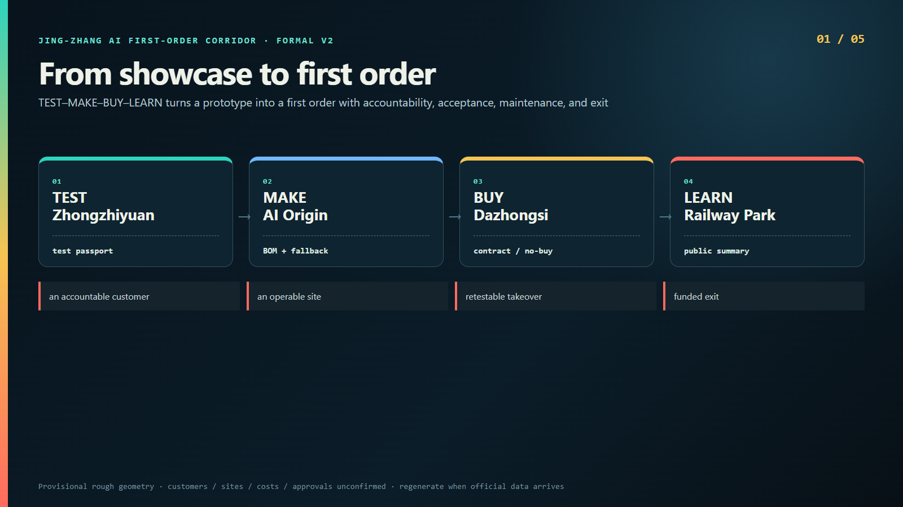
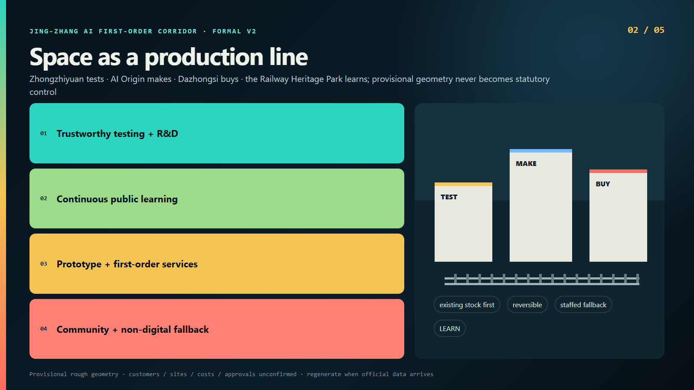
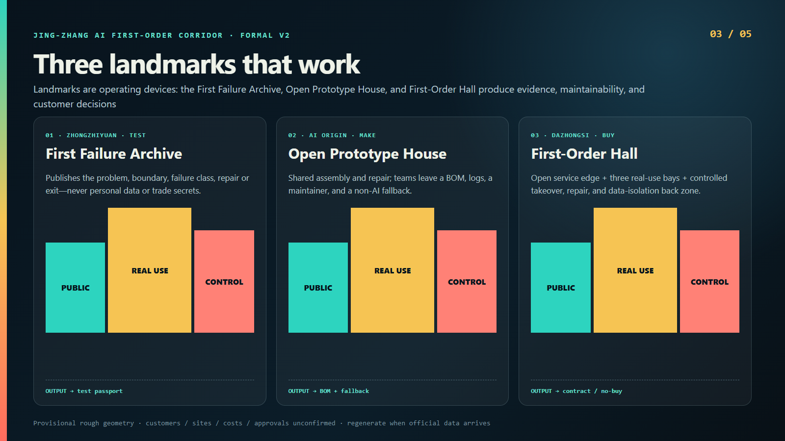
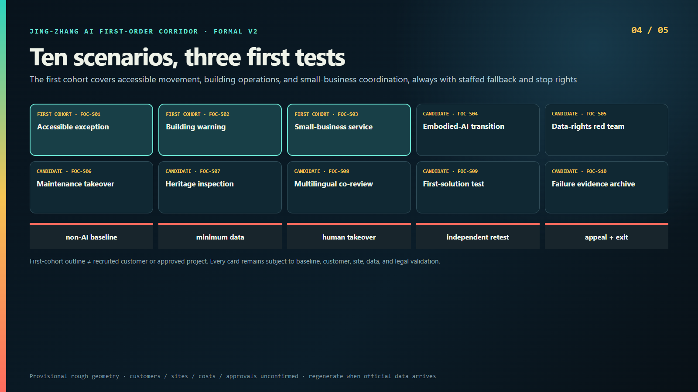
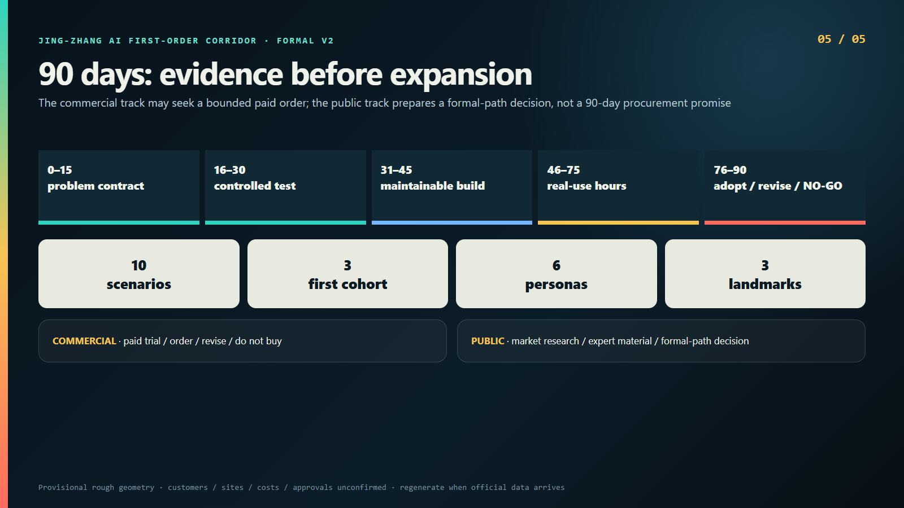

# Jing-Zhang AI First-Order Corridor: An Urban Production Line from Test to First Customer

## Design Basis and Source List

This entry responds to the Centennial Jing-Zhang AI Innovation Belt Open Call for Urban Design. Its task basis is the official announcement, the agent taskbook, and the repository site package; the source register separates official facts, processed repository material, provisional geometry, and design assumptions. [source:OFFICIAL-ANNOUNCEMENT] [source:AGENT-TASKBOOK] Policy pages, historical material, and inferred geometry are never promoted into statutory controls, and no private, classified, or uncleared material is used. Full provenance and use limits are recorded in `sources.json`, while unresolved facts are recorded in `assumptions.json`.

The Overall Design Area and three Key Areas currently use rough substitute geometry inferred from public repository material. [source:BOUNDARY-SOURCE] [data:geometry/site_boundary.geojson#SITE-001] It supports relative location, concept generation, recalculation, and open discussion only; it cannot establish parcel ownership, road redlines, permits, or precise quantities. When official polygons arrive, all geometry, figures, metrics, and narratives must be regenerated together.

The central proposition is deliberately testable: the missing link may be the path from a working AI prototype to a first accountable user, contract, maintenance duty, and exit decision. This is a design hypothesis rather than a statistical claim about local firms. It must be confirmed or rejected through customer recruitment, site audits, and non-AI baselines. [source:SOURCE-REGISTRY] [depth:existing_conditions_diagnosis]

## Three-Level Scope Framework

The Coordinated Research Area addresses industry and future-city mechanisms; the Overall Design Area addresses spatial networks and renewal interfaces; the three Key Areas address building, scenario, and operating prototypes. A TEST–MAKE–BUY–LEARN production sequence connects the levels: Zhongzhiyuan tests, AI Origin makes maintainable products, Dazhongsi hosts first customers, and the Railway Heritage Park provides a visible learning interface. It is an operating sequence, not a new statutory axis. [standard:PROJECT-OFFICIAL-ANNOUNCEMENT] [data:geometry/key_areas.geojson#PROV-KEY-001]

The shared hand-off is a test passport carrying the problem, boundary, baseline, risk, human takeover, acceptance, maintenance, and exit record. No team advances from a pitch alone, and no visitor is misrepresented as an accountable customer. If interviews show that cross-district movement costs more than shared facilities save, the sequence may collapse into one candidate building while retaining shared evidence standards.

The data layer mirrors this distinction: boundaries and Key Areas are `provisional_constraint`; land use, buildings, routes, public space, and phasing are `design_proposal`. Reviewers can therefore see both the proposed action and the limit of its authority. [depth:three_level_scope_framework] [metric:key_area_count]

## Coordinated Research Area: Industry and Future City Research

The corridor is not another generic AI platform. It targets a break in the innovation chain: the transition from a demonstrable prototype to a first order with an accountable user, acceptance criteria, maintenance, consideration or a formal adoption decision, and a traceable exit. A scan-to-try experience, memorandum, or launch event is not a first order. Valid outcomes include paid continuation, revise and retest, or an evidence-based decision not to buy.

Six actor groups form the operating ecosystem: AI start-ups; first customers or procurement owners; property and frontline operators; small merchants; residents and disabled users; and independent evaluators or open-source maintainers. The corridor convener assembles problems and sites but does not certify suppliers. Evaluators do not earn a share of sales. Frontline workers and affected users hold stop, appeal, and co-acceptance rights. [source:AGENT-TASKBOOK] [depth:industry_ecosystem_strategy]

Global participation takes the form of four-to-twelve-week residencies, not festival traffic. Each resident must leave a maintainable product, an open asset or explicit licence, a bill of materials, exportable logs, a fallback, and a first-customer decision. A quarterly First-Order Week runs only when verifiable cases exist. [source:EXT-HAIDIAN-SCENARIO-2025] [metric:persona_count]

## Overall Design Area: Urban Renewal and Regulatory-Plan-Level Urban Design

The spatial strategy is existing-stock first, lateral connection, reversible testing, and continuous non-digital service. Instead of a new AI headquarters or icon tower, the proposal inserts test bays, a prototype house, a first-order hall, staffed service points, and maintenance back-of-house into existing buildings and public interfaces. Four conceptual links connect the Key Areas to the Railway Heritage Park; none is a road redline, and every point remains subject to ownership, heritage, landscape, fire, accessibility, and utility review. [data:geometry/roads.geojson#ROAD-001] [standard:MOHURD-CONTROL-DETAILED-PLANNING]

The land-use layer is a design partition rather than a statutory rezoning. It distinguishes trustworthy testing and R&D translation, a continuous public learning interface, prototype-making and first-order services, and community services with non-digital fallback. [data:geometry/land_use.geojson#LU-001] The building footprint is a reversible retrofit concept, not a survey. Floor-area ratio remains unknown because official parcels, approved intensity, and surveyed floor area are absent. [metric:floor_area_ratio]

Regulatory-plan depth is expressed as auditable questions and structured layers, not invented controls. Road lines, height, setbacks, fire safety, capacity, and ownership remain professional confirmation items. Advancement requires official data, two property screens, real customers, four market quote categories, and public/commercial legal advice. [depth:overall_spatial_structure] [source:SITE-PACKAGE]

## Detailed Design of Key Areas

Zhongzhiyuan becomes a trustworthy test courtyard in existing stock: four combinable test bays, a compliance and data desk, a visible observation gallery, and an isolated repair store. Its working landmark, the First Failure Archive, publishes only the problem, boundary, failure class, repair or exit, and retest state. Personal data, trade secrets, and security details stay controlled. Release requires a named operator, human takeover, and an exit budget. [data:geometry/key_areas.geojson#PROV-KEY-001]

The AI Origin Community hosts an Open Prototype House: shared assembly, repair, materials, and public review at ground level; four-to-twelve-week team studios above; and clinics for law, procurement, accessibility, and maintenance. A departing team leaves a bill of materials, operating manual, fault tree, log export, non-AI fallback, and price—not only a demo video. [data:geometry/key_areas.geojson#PROV-KEY-002]

Dazhongsi hosts the First-Order Hall in a candidate 800–1,500-square-metre street-level space, with an open service edge, three rotating real-use bays, and a controlled repair and data-isolation back zone. The figure is a programme requirement, not a verified property. Ownership, lease, loading, fire, and accessibility must pass Gate A before any commitment. [data:geometry/key_areas.geojson#PROV-KEY-003] [metric:landmark_count]

## AI Innovation Ecosystem, Personas, and AI+ Scenarios

Ten scenarios are specified, with only three admitted to the first cohort: FOC-S01 accessible-route exception coordination, FOC-S02 existing-building equipment exception warning, and FOC-S03 small-business service and stock coordination. Later candidates cover embodied-AI transition testing, data-rights red-teaming, maintenance takeover, railway heritage inspection support, multilingual story co-review, real-business first-solution testing, and first-order evidence and failure archives. [metric:scenario_count] [metric:first_cohort_scenario_count]

The three industrial tests are FOC-S02, FOC-S04, and FOC-S05. Every scenario card names the affected users, customer type, non-AI baseline, spatial interface, allowed and prohibited data, takeover, acceptance, stop, maintenance, and exit. Hard stops include wrong accessibility guidance, connection to production control, automated differential pricing, absent appeals, takeover failure, or interruption of basic services. [source:AGENT-TASKBOOK] [data:geometry/public_space.geojson#PUBLIC-001]

The six personas are recruitment frames, not fabricated interviews. Real participants must co-define baselines, total cost, error impact, and appeal. Without a named problem contract that can be safely redacted, a scenario cannot be presented as implemented. Every AI path sits beside an ordinary service route, with minimised collection, edge processing, short retention, and visible human stop. [depth:ai_scenario_system] [source:EXT-HAIDIAN-SCENARIO-2025]

## Land Use, Building Scale, and Retain-Renovate-Demolish Strategy

The retain–renovate–demolish rule has three steps. Retain existing structures that can support independent operation and uninterrupted basic service. Renovate through reversible partitions, isolated power, network separation, repair access, and reinstatement. Discuss demolition only when structural, fire, or accessibility review fails. The proposal does not label buildings inefficient in order to justify removal and does not assume vacancy or lease availability. [data:geometry/buildings.geojson#BLDG-001] [depth:retain_renovate_demolish_strategy]

The test bay uses an indicative six-by-six-metre module with observable edges and a staffed stop. The Prototype House prioritises one existing building, while the First-Order Hall uses a three-band ground floor. Dimensions and the concept footprint explain operating relationships only; they are not surveys, existing-building facts, or investment commitments. [metric:building_footprint_area_sqm]

Statutory development intensity remains unknown. The next step is a Gate A screen covering survey, egress, loading, waste, night management, accessible routes, mechanical systems, and isolated networks. If two candidate properties fail, the building prototype stops and the project reverts to a lightweight appointment-based testing network. [source:BOUNDARY-SOURCE] [metric:floor_area_ratio]

## Transport, Rail, Municipal Infrastructure, and Public Services

The mobility proposition is legible evidence transfer rather than repeated product transport. A main walking corridor follows the public interface, and three conceptual links serve TEST, MAKE, and BUY. Actual alignments, transit integration, crossings, and accessible routes require field audits; the current lines do not substitute for road, rail, or accessibility engineering. [data:geometry/roads.geojson#ROAD-002]

Each field point displays the ordinary service route, AI-enhanced route, accountable operator, and stop method. Devices and events may not block accessible movement. Embodied systems operate only within physical boundaries and staffed observation. The Dazhongsi hall must resolve loading, courier waiting, cycles, waste, repair, and night management—not merely its public-facing experience. [standard:MOHURD-URBAN-DESIGN-MEASURES] [depth:mobility_and_access]

Infrastructure is intentionally minimal: isolated shutdown, separated networks, read-only interfaces, exportable logs, a human control seat, and reinstatement. No continuous-camera smart corridor is assumed; production control networks are out of scope; AI services never replace essential public services. Power, network, fire, drainage, waste, and edge-compute capacity remain to be verified. [source:SITE-PACKAGE] [data:geometry/constraints.geojson#CONSTRAINT-001]

## Blue-Green Network, Public Space, and Urban Character

The Railway Heritage Park is a public learning and accountability interface, not a free sensor corridor. Only reversible elements that do not touch heritage fabric are proposed: staffed desks, observation points, temporary signs, and removable devices. Every location remains subject to heritage, landscape, utility, fire, accessibility, and ownership permission. [source:EXT-BEIJING-JINGZHANG-PARK-2023] [data:geometry/green_space.geojson#GREEN-001]

Public space organises observation, appeal, human takeover, and continuous non-digital service. De-identified test status may be visible, but internal data, security detail, personal information, and trade secrets remain controlled. The design green and public-space ratios are calculated from concept geometry against a provisional boundary; they compare design structure and are not statutory ratios. [metric:green_ratio] [metric:public_space_ratio]

Urban character uses a “railway ticket × purchase receipt” language, sequential identifiers, and TEST–MAKE–BUY status colours without copying official marks, station signs, or uncleared photographs. The landmarks work rather than pose: the First Failure Archive, Open Prototype House, and First-Order Hall become recognisable through visible testing, repair, and contract states. [depth:blue_green_public_space] [source:AGENT-TASKBOOK]

## Renewal Projects, Implementation Policy, and Phasing

Phase one contains only four minimum actions: test bays and the First Failure Archive at Zhongzhiyuan, the Open Prototype House at AI Origin, the First-Order Hall at Dazhongsi, and a reversible public interface in the park. Days 0–15 recruit three problems, customers, and teams and measure non-AI baselines; days 16–30 run controlled tests; days 31–45 produce maintainable prototypes; days 46–75 run real-time trials; days 76–90 independently retest and decide adopt, revise, or do not buy. [metric:readiness_sprint_days] [data:geometry/phasing.geojson#PHASE-001]

The commercial track may seek a bounded paid order within ninety days. The public track succeeds by producing market research, needs, measures, expert-review material, and a decision on whether to enter a formal programme. Ninety days is not a public-procurement promise. Cooperative innovation procurement is considered only after eligibility, substantive innovation, budget, approval, and competition are professionally confirmed. [source:EXT-MOF-COINNOVATION-2024]

Three gates limit expansion: Gate A verifies site, fire, permission, and reinstatement; Gate B requires three accountable customers; Gate C permits replication only after a valid commercial order or a formal public-path decision with no unresolved severe event. Policy income defaults to zero, and four categories of market quotes must calibrate cost. [source:EXT-BEIJING-ADVANCED-INDUSTRY-2026] [depth:phasing_and_implementation]

## Metrics, Area Recalculation, and Compliance Matrix

Spatial measures are recomputed from GeoJSON: the provisional Overall Design Area is about 11.41 million square metres; the concept building footprint is about 0.31 million square metres; the design green ratio is about 12.34 per cent; the design public-space ratio is about 7.33 per cent; and the Key Area count is three. [metric:site_area_sqm] [metric:building_footprint_area_sqm] Confidence follows provenance, while statutory floor-area ratio remains explicitly unknown.

Operating measures define methods rather than success targets: products entering controlled use, valid first-order conversion, continuation after ninety days, median application-to-order time, successful human takeover, severe safety or rights events, total cost to small customers, and reinstatement after removal. Targets are set only after baselines, sample sizes, accountable data owners, and independent retesting exist. [metric:first_cohort_scenario_count]

`compliance_matrix.json` covers official tasks and agent.1–agent.6; `standard_matrix.json` records professional standards; `design_depth_matrix.json` maps depth to narrative, geometry, metrics, drawings, and checks. The bilingual A3, A0, offline HTML, and ten figures share one data state, while the manifest records final hashes. [standard:PROJECT-AGENT-OPEN-CALL-TASKBOOK] [depth:metrics_and_compliance]

## Risk, Copyright, and Compliance

Reality risks take priority over graphic polish. “First order” may remain a slogan; the three-area sequence may be artificial; candidate property may fail; a public pilot may drift around procurement; subsidy may support empty space; or the scenarios may fit any innovation district. Each has a falsification rule and fallback. No three customers means no cohort; no two viable properties means a lightweight network; no confirmed procurement path means needs and evidence only. [source:EXT-MOF-COINNOVATION-2024] [depth:risk_and_compliance]

Scenario safeguards are data minimisation, purpose limitation, short retention, visible takeover, uninterrupted non-digital service, affected-user appeal, and recoverable exit. The proposal does not claim government support, available property, recruited customers, fixed costs, approved procurement, or inevitable construction. Design layers are concepts; provisional constraints state their source and confidence. [data:geometry/constraints.geojson#CONSTRAINT-001]

Original narrative and graphics use the `COMMUNITY-DISPLAY-ONLY` licence for this call. External official material is cited for facts; restricted images, marks, and photographs are not copied. Before publication, a person must verify bilingual equivalence, copyright, links, privacy, customer redaction, and final manifest hashes. [source:SOURCE-REGISTRY] [metric:scenario_count]

## References

The primary task sources are the official open-call announcement, repository agent taskbook, and site package. [source:OFFICIAL-ANNOUNCEMENT] [source:AGENT-TASKBOOK] Policy interfaces include the Zhongguancun Science City scenario guide, the Ministry of Finance cooperative innovation procurement rules, and Beijing advanced-industry guidance. They establish possible instruments only; they do not indicate application, approval, or funding for this proposal. [source:EXT-HAIDIAN-SCENARIO-2025] [source:EXT-BEIJING-ADVANCED-INDUSTRY-2026]

Culture and place facts refer to the Beijing landscaping authority’s phase-one Railway Heritage Park material and the National Railway Administration’s Jing-Zhang history. [source:EXT-BEIJING-JINGZHANG-PARK-2023] [source:EXT-NRA-JINGZHANG-HISTORY-2022] “From self-directed construction to self-directed validation; from the first railway to the first accountable order” is this proposal’s contemporary narrative, not a historical quotation or official endorsement.

Full publishers, URLs, use limits, and prohibited extrapolations are stored in `sources.json`; the three structured matrices carry complete task and professional evidence. The processed fact pack remains a navigation aid and does not create new authority. [source:PROCESSED-FACT-PACK] [standard:MOHURD-URBAN-DESIGN-MEASURES]
