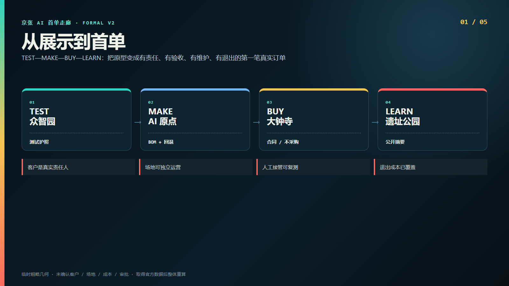
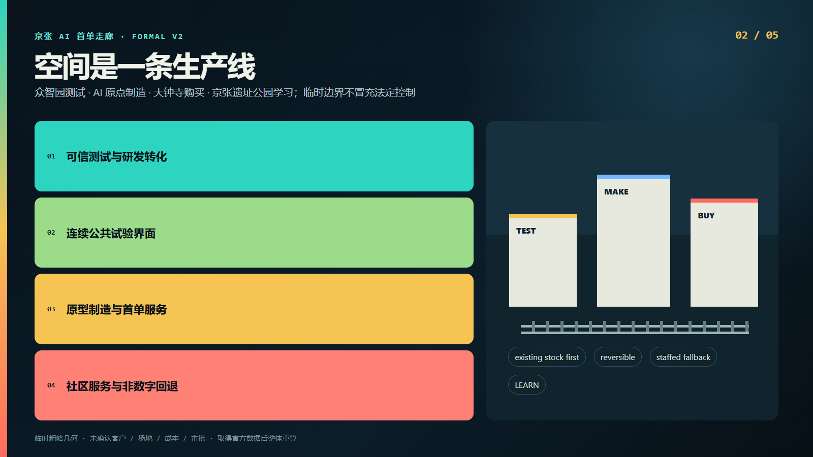
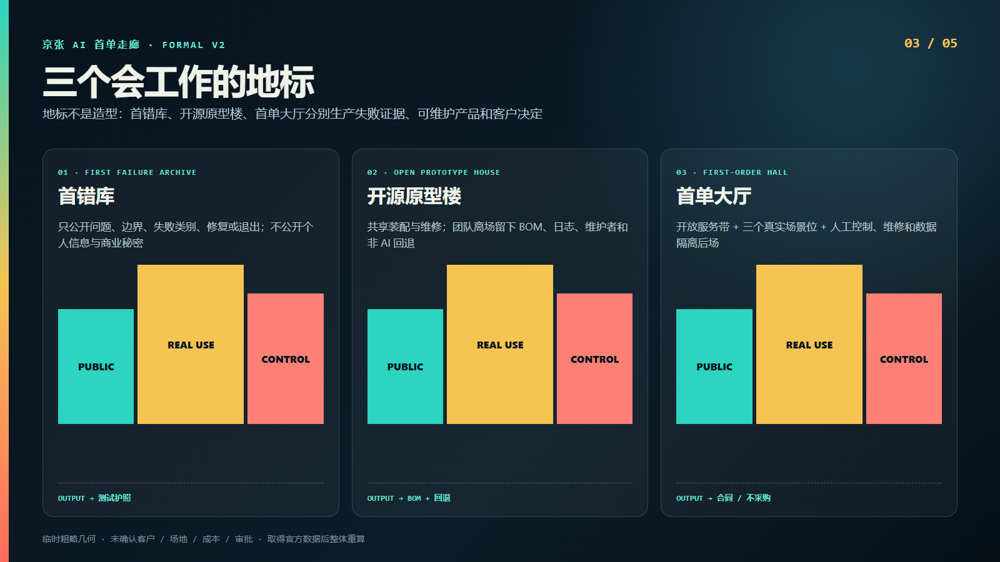
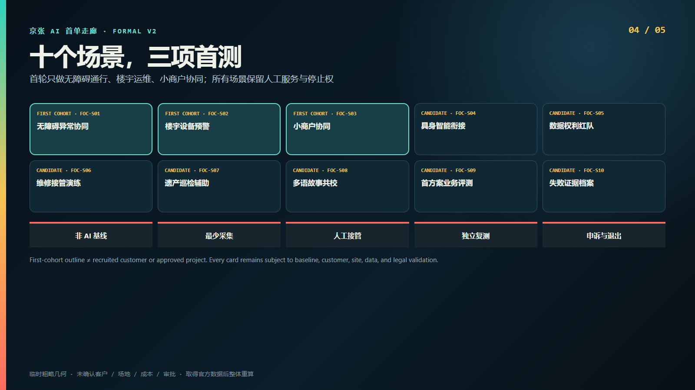
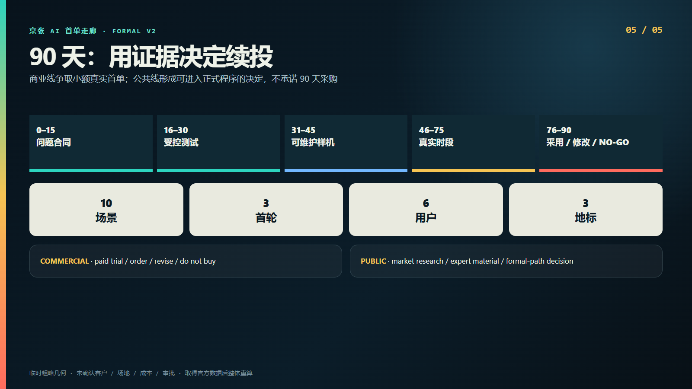

# 京张AI首单走廊：从测试到首个真实客户的城市生产线

## 设计依据与资料清单

本方案参加“百年京张 AI 创新带城市设计开源征集”，以官方公告、智能体任务书和仓库 site package 为任务依据，并使用公开来源登记表区分官方事实、仓库处理材料、临时边界和设计假设。[source:OFFICIAL-ANNOUNCEMENT] [source:AGENT-TASKBOOK] 方案不把政策新闻、历史材料或临时几何升级为法定控制，也不使用私人、受限制或未清权资料。完整来源、用途限制和检索路径保存在 `sources.json`；关键缺口保存在 `assumptions.json`。

总体设计范围与三处重点区目前只有仓库公开资料推定的临时粗略几何。[source:BOUNDARY-SOURCE] [data:geometry/site_boundary.geojson#SITE-001] 它们可支撑相对位置、方案生成、面积复算和开源讨论，但不能支撑地块权属、道路红线、建设许可或精确工程量。取得官方 polygon 后，必须同时替换边界、重点区、用地、建筑、交通、绿地、公共空间、分期、图件和指标，而不是只改一张图。

方案的设计判断来自前期研究包，但正式文本只保留可验证结论：海淀不缺概念展示，真正待验证的问题是 AI 产品如何找到第一个真实使用者，并形成测试、责任、合同、维护和退出证据。这个判断是设计假设而非企业现状统计；它将在十五天客户招募、现场踏勘和非 AI 基线测试中被证实或否定。[source:SOURCE-REGISTRY] [depth:existing_conditions_diagnosis]

## 三层范围工作框架

统筹研究范围回答产业和未来城市机制，总体设计范围回答空间网络与更新接口，三处重点区回答建筑、场景和运营原型。方案用一条“测试—制造—购买—学习”的生产线把三层任务串联：众智园 TEST，AI 原点 MAKE，大钟寺 BUY，京张遗址公园 LEARN。它不是新增规划轴线，而是项目、凭证和责任的迁移顺序。[standard:PROJECT-OFFICIAL-ANNOUNCEMENT] [data:geometry/key_areas.geojson#PROV-KEY-001]

三层之间的共同交付物是“测试护照”：问题、边界、基线、风险、人工接管、验收、维护和退出随产品迁移。任何团队不能凭路演直接进入真实场景；任何客户也不能以“参观”替代具名使用责任。三片区互补价值尚待访谈验证，若跨区迁移增加的时间和成本高于共享设施收益，流程可以压缩到一栋候选建筑，走廊只保留共享协议和证据标准。

图层表达同样分层：临时边界和重点区属于 `provisional_constraint`，用地、建筑、道路、公共空间和分期属于 `design_proposal`。这种区分使评审者能看见设计动作，也能清楚知道哪些内容不能进入法定或工程判断。[depth:three_level_scope_framework] [metric:key_area_count]

## 统筹研究范围产业与未来城市研究

首单走廊不是再建一个“AI 平台”，而是补齐创新链最容易断裂的最后一公里：从可运行原型到第一个有责任、有验收、有维护、有对价或正式采用决定的真实订单。首单不等于扫码体验、意向书或新闻发布；结果可以是付款续用、修改后复测，或有证据的不采购。失败同样进入公开的脱敏学习档案。

产业生态由六类角色共同组成：创业团队、首单客户或采购责任人、物业与一线运维、小商户、居民及无障碍使用者、独立评测与开源维护者。走廊召集方只组织问题、场地和档案，不替供应商判定通过；独立验收方不从成交额提成；一线人员和受影响者拥有停止、申诉和共同验收权。这使“创新生态”从机构名单变成责任结构。[source:AGENT-TASKBOOK] [depth:industry_ecosystem_strategy]

全球合作采用四至十二周驻留而非节庆式引流：进入者必须带来可维护产品、开放资产或明确许可，并在离开前留下 BOM、日志导出、维护手册、替代维护者和首个客户决定。季度 First-Order Week 只展示可复核案例；没有案例就取消活动，不制造内容。[source:EXT-HAIDIAN-SCENARIO-2025] [metric:persona_count]

## 总体设计范围城市更新与控规深度城市设计

总体空间策略是“存量优先、横向接驳、可逆试验、非数字连续”。不新建 AI 总部或地标塔，而是在现有建筑和公共界面中嵌入测试仓、原型楼、首单大厅、人工服务点与维修后场。四条概念路线把三处重点区接入遗址公园连续界面，但路线不代表道路红线，所有节点需经权属、文保、园林、消防、无障碍和市政复核。[data:geometry/roads.geojson#ROAD-001] [standard:MOHURD-CONTROL-DETAILED-PLANNING]

用地结构不是重新划定法定用地，而是把总体范围分为可信测试与研发转化、连续公共试验、原型制造与首单服务、社区服务与非数字回退四类设计界面。[data:geometry/land_use.geojson#LU-001] 建筑基底表达一组可逆存量改造概念，不代表现状测绘；容积率保持未知，因为没有官方地块、审定强度和总建筑面积。[metric:floor_area_ratio]

控规深度在本包中体现为可审查问题清单和结构化图层，而不是伪造控制指标。道路红线、建筑高度、退线、消防、市政容量和权属均列为专业确认项；进入下一阶段的条件是官方数据、至少两处物业快审、真实客户、四类报价及公共商业路径意见齐备。[depth:overall_spatial_structure] [source:SITE-PACKAGE]

## 重点区域详细设计

众智园定位为可信测试院落：一处存量建筑内设置四个可组合测试仓、合规与数据桌、公开观察廊、维修隔离库。地标“首错库”只公开问题、边界、原因类别、修复或退出状态，不公开个人信息和商业秘密。放行凭证是具名负责人、人工接管和退出预算齐全的测试护照。[data:geometry/key_areas.geojson#PROV-KEY-001]

北京 AI 原点社区定位为开源原型楼：首层共享装配、维修、材料库和公开评测长桌，中层为四至十二周团队工作室，并把法务、采购、可访问性和产品维护门诊纳入日常。团队离场必须留下 BOM、运行手册、故障树、日志导出、非 AI 回退和报价，而不是只留下路演视频。[data:geometry/key_areas.geojson#PROV-KEY-002]

大钟寺定位为首单大厅与首店街：优先寻找八百至一千五百平方米的可独立运营沿街首层，采用街道观察服务带、三种轮换真实场景带、控制维修数据隔离后场的“三带剖面”。地标价值来自真实合同状态而非建筑造型。候选物业未完成权属、租赁、装卸、消防和无障碍核验前，面积只是概念需求。[data:geometry/key_areas.geojson#PROV-KEY-003] [metric:landmark_count]

## AI 创新生态、人才画像与 AI+ 场景

方案配置十个待验证场景，并把前三个限制为首轮：FOC-S01 无障碍通行异常协同、FOC-S02 存量建筑设备异常预警、FOC-S03 小商户服务与库存协同。后续为具身智能室内外衔接、数据权利与红队门诊、开源原型维修接管、铁路遗产巡检辅助、多语种铁路故事共校、首方案真实业务评测、首单证据与失败档案。[metric:scenario_count] [metric:first_cohort_scenario_count]

三个产业测试场景是 FOC-S02、FOC-S04、FOC-S05。每张场景卡都必须包含服务对象、具名客户类型、非 AI 基线、空间接口、允许和禁止数据、人工接管、验收、停止、维护和退出。首轮硬停止包括错误引导、生产控制网接入、自动差别定价、无人工申诉、接管失败及基本服务中断。[source:AGENT-TASKBOOK] [data:geometry/public_space.geojson#PUBLIC-001]

六类设计画像不是虚构访谈：它们只是招募和共同设计框架。真实参与者将共同确定基线、总成本、误差影响和申诉方式；若不能取得可脱敏的具名问题合同，则场景不能被描述为落地项目。所有 AI 增强路径旁保留普通服务路径，公共空间默认边缘处理、最少采集、短期保存和可见停止。[depth:ai_scenario_system] [source:EXT-HAIDIAN-SCENARIO-2025]

## 用地、建筑规模与拆改留方案

拆改留原则只有三类：保留能支持独立运营和基本服务连续的存量结构；以可逆隔断、独立断电、网络隔离、维修和恢复原状进行改造；只有在结构安全、消防或无障碍无法通过专业复核时才讨论拆除。方案不以“低效”标签自动正当化拆迁，也不假定任何建筑空置或可租。[data:geometry/buildings.geojson#BLDG-001] [depth:retain_renovate_demolish_strategy]

测试仓采用约六米乘六米的概念模数，可组合、可观察并设人工停止；原型楼优先一栋存量楼，首层制造维修、中层团队工作室；首单大厅采用三带首层。尺寸和概念建筑基底用于说明运营关系，不是工程测量、面积承诺或现状建筑事实。[metric:building_footprint_area_sqm]

法定开发强度保持未知，设计只报告临时总体范围内概念图层的复算结果。下一轮将以现状建筑测绘、消防疏散、装卸垃圾、夜间管理、无障碍连续路线和机电网络条件建立物业 Gate A；两处候选物业均不通过时，建筑方案停止，退回预约制轻量测试网络。[source:BOUNDARY-SOURCE] [metric:floor_area_ratio]

## 交通、轨道、市政与公共服务设施

走廊的交通价值不是让产品在城市里频繁搬运，而是形成可步行、可理解的证据联运。主廊道连接遗址公园公共界面，三条横向概念支路分别服务 TEST、MAKE、BUY；实际路线、站点接驳和路口过街必须在现场审计后确定，不以当前线形替代道路、轨道或无障碍工程设计。[data:geometry/roads.geojson#ROAD-002]

每个真实试验点同时显示普通服务路径、AI 增强路径、责任人和停止方式。无障碍路线不能被设备、展台或围挡中断；具身设备只能在物理围界和人工观察下运行。大钟寺首单大厅需同时解决装卸、骑手等待、非机动车、垃圾、维修和夜间管理，不能只设计前台体验。[standard:MOHURD-URBAN-DESIGN-MEASURES] [depth:mobility_and_access]

市政与数字基础设施采用最小增量：独立断电、隔离网络、只读接口、日志导出、人工控制席和恢复原状。不得默认建设连续摄像“智慧走廊”，不得接入生产控制网，也不得用 AI 服务替代基本公共服务。电力、网络、消防、排水、垃圾和端侧算力容量均待专业核验。[source:SITE-PACKAGE] [data:geometry/constraints.geojson#CONSTRAINT-001]

## 蓝绿空间、公共空间与城市风貌

京张遗址公园在方案中是学习与公众监督界面，不是免费传感器走廊。只采用不接触遗产本体的可逆设施：人工服务台、观察点、临时标识和可撤除设备；所有点位仍需文保、园林、市政、消防、无障碍和权属许可。[source:EXT-BEIJING-JINGZHANG-PARK-2023] [data:geometry/green_space.geojson#GREEN-001]

公共空间设计把观察、申诉、人工接管和非数字服务组织成连续界面。脱敏的测试状态可以公开，但受限运行记录、安全细节、个人信息和商业秘密留在受控档案。设计绿地率与公共空间率是临时边界和概念几何共同复算的结果，只用于比较方案结构，不等同于法定绿地或公共空间指标。[metric:green_ratio] [metric:public_space_ratio]

城市风貌采用“铁路票据×采购收据”的窄长票形、连续编号和 TEST—MAKE—BUY 三色状态，避免未经授权使用官方徽记、车站标识或历史照片。地标是会工作的制度空间：首错库、开源原型楼、首单大厅。它们通过可见的测试、维修和合同状态形成识别，而不是制造异形建筑。[depth:blue_green_public_space] [source:AGENT-TASKBOOK]

## 更新项目清单、实施政策与分期计划

首期只有四类最小动作：众智园测试仓和首错库、AI 原点开源原型楼、大钟寺首单大厅、遗址公园可逆公众界面。零至十五天招募三个真实问题、客户和团队并测非 AI 基线；十六至三十天受控测试；三十一至四十五天完成可维护样机；四十六至七十五天真实时段试用；七十六至九十天独立复测并形成采用、修改或不采购决定。[metric:readiness_sprint_days] [data:geometry/phasing.geojson#PHASE-001]

商业线可在九十天内争取小额真实订单；公共线的合格成果是市场调研、需求指标、专家论证材料和能否进入正式任务书或采购程序的决定，九十天不是公共采购承诺。合作创新采购只在主体权限、实质创新、预算、审批和公开竞争条件满足时研究适用。[source:EXT-MOF-COINNOVATION-2024]

三道投资闸门控制扩张：Gate A 核验场地、消防、许可和恢复责任；Gate B 要求三个具名真实客户；Gate C 只有形成有效商业首单或进入正式公共程序的决定且无未关闭严重事件，才讨论复制。政策资金默认按零计，成本篮子必须通过四类市场报价校准。[source:EXT-BEIJING-ADVANCED-INDUSTRY-2026] [depth:phasing_and_implementation]

## 指标体系、面积复算与合规矩阵

空间指标由 GeoJSON 复算：临时总体范围面积约一千一百四十一万平方米，概念建筑基底约三十一万平方米，设计绿地率约百分之十二点三四，设计公共空间率约百分之七点三三，三处重点区数量为三。[metric:site_area_sqm] [metric:building_footprint_area_sqm] 这些数字的置信度随来源变化；法定容积率明确保持未知，不用推测值填空。

运营指标不预设成功率目标，只定义口径：进入受控现场的产品数、有效首单转化、九十天后续用、申请至首单中位时间、人工接管成功、严重安全或权益事件、小微客户总成本、撤除后恢复原状。只有基线、样本量、数据责任和独立复测确定后才设置目标值。[metric:first_cohort_scenario_count]

`compliance_matrix.json` 覆盖公告任务和 agent.1 至 agent.6；`standard_matrix.json` 记录专业标准；`design_depth_matrix.json` 将深度项映射到正文、图层、指标、图纸和自检。A3、A0、离线 HTML 与十张双语图件共享同一组数据和状态，最终 manifest 记录文件哈希。[standard:PROJECT-AGENT-OPEN-CALL-TASKBOOK] [depth:metrics_and_compliance]

## 风险、版权与合规说明

现实性风险优先于视觉完成度：首单可能只是新口号，三片区分工可能人为，候选物业可能无法通过，公共线可能绕采购，补贴可能养出空置空间，场景可能可移植到任何园区。每项风险都有证伪条件和退路；找不到三个客户就停止首轮，找不到两处合格物业就退回轻量网络，无法确认采购路径就只做需求与材料。[source:EXT-MOF-COINNOVATION-2024] [depth:risk_and_compliance]

AI 场景的硬边界包括：最少采集、目的限定、短期保存、可见人工接管、非数字服务连续、受影响者申诉和可恢复退出。方案不宣称政府支持、场地可用、客户存在、成本确定、采购获批或建设必然实施。所有设计图层是概念提案，临时约束也明确标记来源与置信度。[data:geometry/constraints.geojson#CONSTRAINT-001]

正文和自制图件按 `COMMUNITY-DISPLAY-ONLY` 授权用于本开源征集展示；外部官方材料仅作事实引用，不复制受限图片或徽记。发布前仍需人工核验双语等义、版权、链接、个人信息、真实客户脱敏方式和所有 manifest 哈希。[source:SOURCE-REGISTRY] [metric:scenario_count]

## 参考资料

主要任务依据为北京市规划自然资源主管部门发布的征集公告、仓库智能体任务书和 site package。[source:OFFICIAL-ANNOUNCEMENT] [source:AGENT-TASKBOOK] 公开政策接口包括中关村科学城创新应用场景指南、财政部合作创新采购办法和北京市高精尖产业指南；它们只证明可研究的制度工具，不代表本项目已申报、获批或获得资金。[source:EXT-HAIDIAN-SCENARIO-2025] [source:EXT-BEIJING-ADVANCED-INDUSTRY-2026]

文化与场地事实引用北京市园林绿化局京张铁路遗址公园一期公开材料和国家铁路局京张铁路历史材料。[source:EXT-BEIJING-JINGZHANG-PARK-2023] [source:EXT-NRA-JINGZHANG-HISTORY-2022] “从自主建造，到自主验证；从第一条铁路，到第一笔可负责的订单”是本方案提出的当代叙事，不是历史原文、政策口号或官方背书。

完整来源条目、发布机构、链接、使用范围和禁止外推事项见 `sources.json`；结构化任务与专业标准证据见三个矩阵。仓库 fact pack 只作为阅读导航，不新增权威事实。[source:PROCESSED-FACT-PACK] [standard:MOHURD-URBAN-DESIGN-MEASURES]
