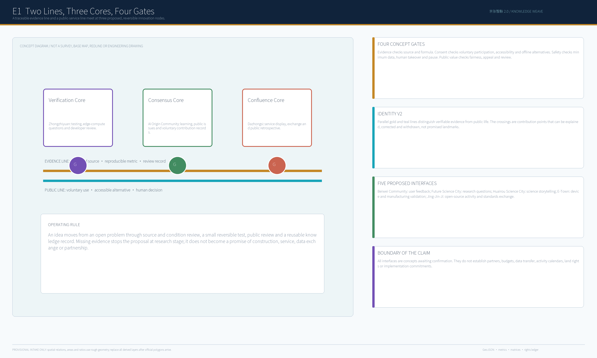
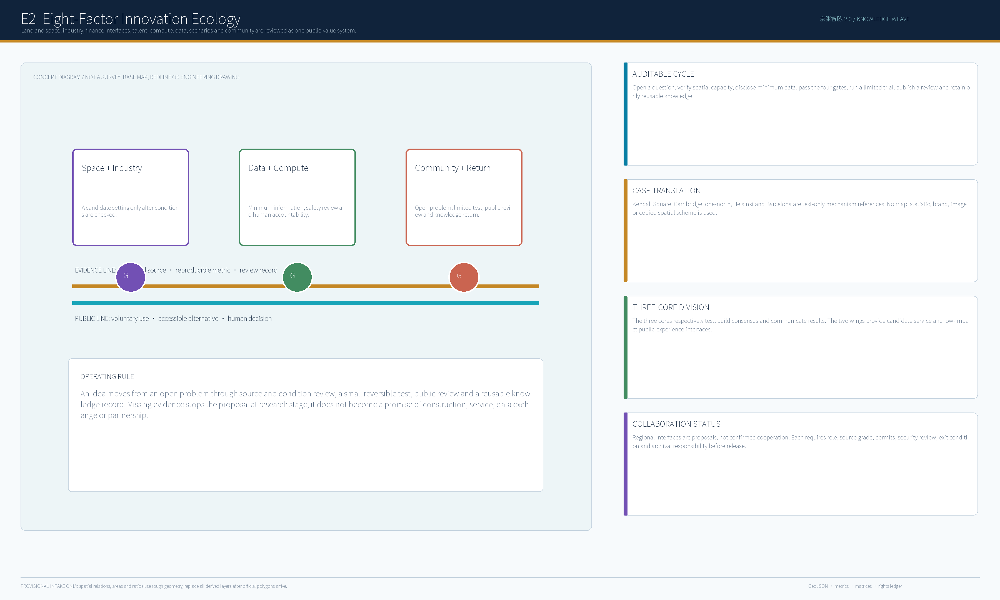
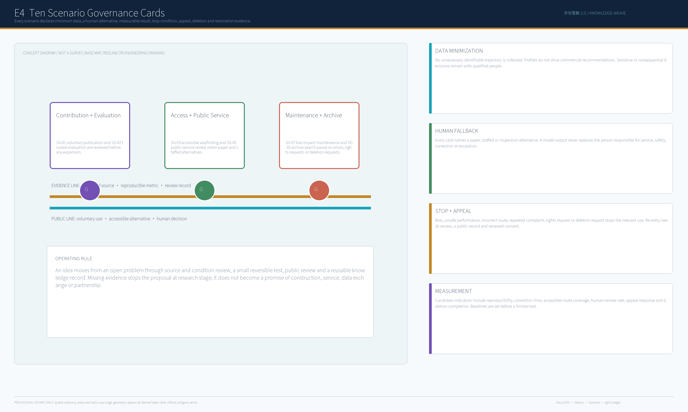
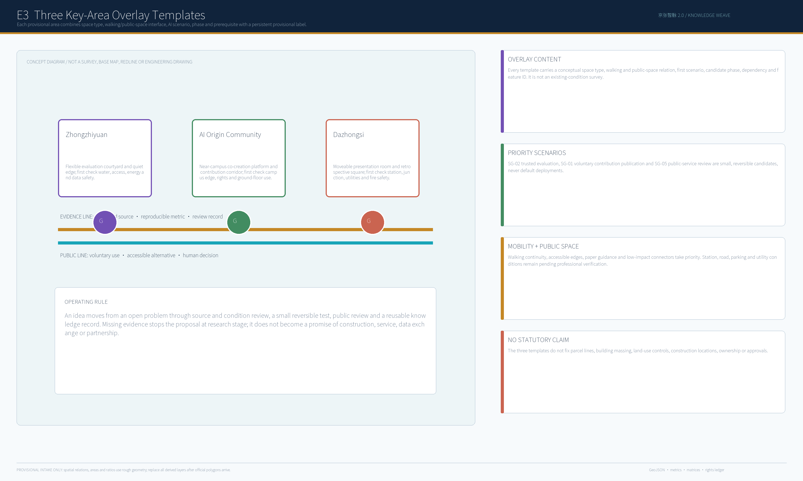
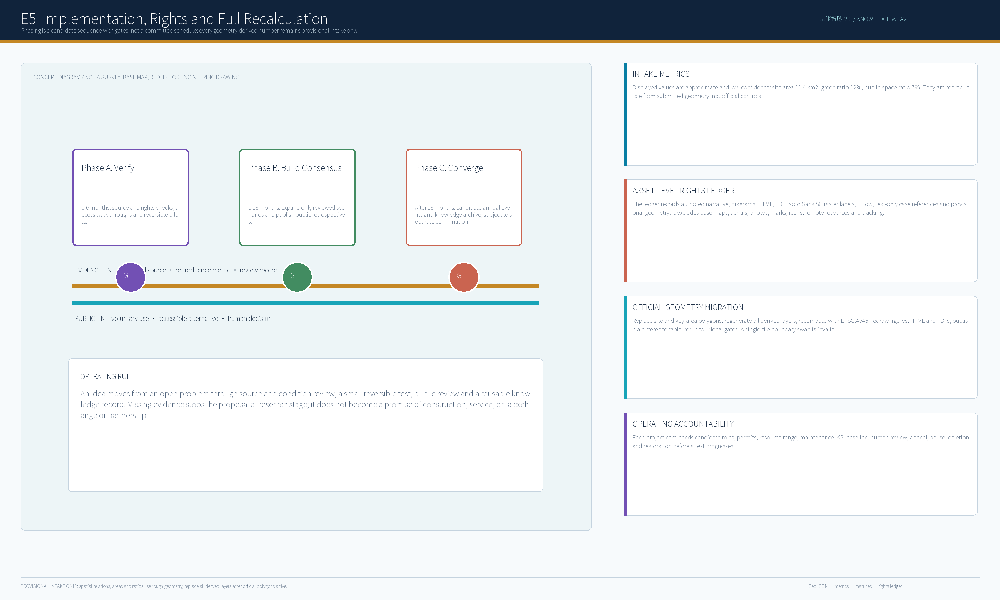

## Executive Summary

Knowledge Weave does not layer AI services onto a railway-memory setting as a default deployment. It translates the linear memory of the Centennial Jing-Zhang Railway into two parallel urban capacities. The **evidence line** asks what can be supported by registered sources, reproducible calculation and professional review. The **public line** asks what has voluntary participation, an accessible non-digital alternative, human final judgement, appeal and exit. Their three proposed crossings are Zhongzhiyuan, the Beijing AI Origin Community and Dazhongsi; the Zhongguancun technology-service wing and Xiaoyue River public-experience wing are conceptual interfaces. None is a redline, statutory control, approval, investment, ownership or construction commitment. [source:OFFICIAL-ANNOUNCEMENT] [source:AGENT-TASKBOOK] [depth:overall_spatial_structure]

## Basis, Scope and Geometry Boundary

This companion follows the Chinese primary proposal, the call, agent taskbook, source registry, submitted geometry, metrics and matrices. `SITE-001` and `PROV-KEY-001` through `003` are `provisional_constraint` records. They are usable for offline display, design discussion and intake checks, but they are not official boundaries, field survey, land-rights records, engineering conditions or precise-area evidence. Each spatial statement must point back to a source, version, use boundary and recomputation method; absent information appears only as an assumption or prerequisite. [source:SOURCE-REGISTRY] [source:BOUNDARY-SOURCE] [data:geometry/site_boundary.geojson#SITE-001] [data:geometry/constraints.geojson#CONSTRAINTS]

The 43.6 km2 coordinating research scope is used only to discuss industrial, talent and regional interfaces. The overall design scope organizes conceptual public space, walking, renewal projects and facilities. The three key areas test space type, public edge, scenario, phase and dependency. When official or cleared polygons arrive, the package must replace site and key-area geometry together, regenerate land use, buildings, roads, green space, public space and phasing, recompute metrics, redraw all figures/PDFs/HTML, publish a difference table and rerun all gates. [metric:site_area_sqm] [metric:key_area_count] [depth:three_level_scope_framework] [depth:metrics_recalculation]

## Spatial Structure and Regional Interfaces

The proposed structure is one weave, three cores, two wings and many candidate scenarios. Zhongzhiyuan is the verification core for model evaluation, edge-compute questions and developer review. The AI Origin Community is the consensus core for near-campus learning, public issues and voluntary contribution records. Dazhongsi is the confluence core for display, service exchange and public retrospective. The Zhongguancun wing offers candidate interfaces for talent, IP, capital and professional service; the Xiaoyue River wing supports low-impact public experience, walking and blue-green edges.

Five external interfaces are deliberately framed as proposals rather than commitments: Beiwei Community for use feedback, Future Science City for research questions, Huairou Science City for science-device and result storytelling, Beijing E-Town for device/manufacturing validation, and Jing-Jin-Ji for open-source activities and standards exchange. Each follows the same loop: problem statement, open call, professional review, limited trial and knowledge return. A role, legal basis, data boundary, safety review, exit condition and archival responsibility must be confirmed before any cooperation is described as active. [source:AGENT-TASKBOOK] [depth:overall_spatial_structure]

## Four Gates and Ten AI Scenario Cards

The four gates are a concept-governance model. The evidence gate checks source grade, spatial condition, formula and version. The consent gate checks voluntary participation, accessibility, offline alternatives and the prohibition of commercial recommendation from resident profiles. The safety gate checks minimum data, human takeover, event response and pause. The public-value gate checks fairness, explainability, appeal, public review and knowledge return. A proposal failing any gate remains research or a sandbox.

Ten scenario cards connect AI to tangible public-service and innovation settings. Every card declares spatial relation, minimum data, candidate responsibility role, non-AI baseline, human alternative, measurable result, stop condition, appeal route, deletion rule and restoration evidence. SG-01 voluntary open-source contribution publication, SG-02 trusted evaluation station and SG-03 accessible wayfinding are the first candidate tests. The other seven cards remain conditional: walking comfort notice, public-service retrospective, cultural explanation, low-impact maintenance, developer demand matching, event-capacity notice and result-archive search. No card authorizes automatic consequential decisions or unnecessary identifiable trajectory collection. [metric:green_ratio] [metric:public_space_ratio] [depth:blue_green_public_space]

## Key-Area Overlay Templates

Each key-area board overlays a conceptual space type, walking and public-space relation, initial scenario, candidate phase, dependency and feature ID. Zhongzhiyuan proposes a flexible evaluation courtyard and quiet edge, subject to water, access, energy and data-safety checks. The AI Origin Community proposes a near-campus co-creation platform and contribution corridor, subject to campus-edge, rights and ground-floor-use checks. Dazhongsi proposes a moveable presentation room and retrospective square, subject to station, junction, utility and fire-safety checks. These are discussion templates, not surveys, parcel boundaries, architectural designs or engineering siting. [data:geometry/key_areas.geojson#PROV-KEY-001] [data:geometry/key_areas.geojson#PROV-KEY-002] [data:geometry/key_areas.geojson#PROV-KEY-003] [data:geometry/phasing.geojson#PHASE-001]

## Public Space, Mobility and Identity

Walking continuity, accessible edges, low-impact transfer and paper/staffed alternatives take priority over a device-first experience. Station conditions, road redlines, parking, utilities, energy, drainage, flood control and fire safety remain prerequisites for professional review. Five removable public-space components are proposed: quiet wayfinding posts, dwell-and-contribute tables, accessible activity edges, scenario explanation signs and moveable display racks. They can be removed after an event and must present their service boundary and offline mode.

The identity uses a navy field with gold and teal parallel lines: gold denotes evidence that can be checked, teal denotes public life. The three crossings are not promised landmarks. They are voluntary contribution points that can be explained, recorded, corrected and withdrawn. The brand does not use government emblems, company marks, portraits or third-party icons. [source:ASSET-NOTO-001] [source:ASSET-CODEX-001] [depth:blue_green_public_space]

## Land, Buildings, Metrics and Risk

The submitted land-use and building-footprint layers are recomputable intake layers only. Floor-area ratio, height, density, setback, retain/renovate/demolish status, rights and heritage conclusions remain `unknown` or `pending_control` until official planning, surveys and professional verification are supplied. `site_area_sqm`, `building_footprint_area_sqm`, `green_ratio` and `public_space_ratio` are all `provisional_intake_only` with low confidence. `known` means reproducible from the package formula, not officially verified. Display uses rounded values rather than a precision claim. [data:geometry/land_use.geojson#LU-001] [data:geometry/buildings.geojson#BLDG-001] [metric:building_footprint_area_sqm] [depth:metrics_recalculation]

## Implementation, Operations and Rights

Six candidate project cards create a staged operation: JZ-01 source and rights verification; JZ-02 accessibility and user walk-through; JZ-03 trusted-evaluation sandbox; JZ-04 public-scene opening; JZ-05 developer/public retrospective; JZ-06 annual archive and international communication. Phase A (0-6 months) verifies materials and rights; Phase B (6-18 months) builds consensus around reviewed scenarios; Phase C (after 18 months) considers annual events and archive. The sequence is not a confirmed schedule. Before a test advances, a card needs candidate lead and collaborators, permits, resource range, maintenance responsibility, KPI baseline, human review, appeal, pause, deletion and restoration conditions.

The rights ledger records authored Chinese and English narratives, original programmatic figures, PDFs, static HTML, Noto Sans SC raster labels, Pillow, text-only case comparisons and provisional geometry. It excludes third-party base maps, aerials, photographs, portraits, marks, icon libraries, remote resources, tracking and materials whose rights cannot be evidenced. The five international cases are text-only mechanism comparisons with source, publisher, access date and use boundary recorded in `sources.json`; no image, map, brand, statistic or implementation scheme is copied. [source:ASSET-PILLOW-001] [source:ASSET-NOTO-001] [source:CASE-KENDALL-001] [source:CASE-CAMBRIDGE-001] [source:CASE-ONENORTH-001] [source:CASE-HELSINKI-001] [source:CASE-BARCELONA-001]

## Conclusion

Knowledge Weave keeps refusal as a civic capacity: without evidence, a proposal does not become a fact; without voluntary participation, a service does not become default; without safety control, it pauses; without demonstrated public value, it does not expand. Official geometry and statutory materials trigger full recomputation before any further design discussion. Human and professional reviewers retain final judgment. [source:AGENT-TASKBOOK] [standard:PROJECT-AGENT-OPEN-CALL-TASKBOOK] [depth:risk_missing_data]
