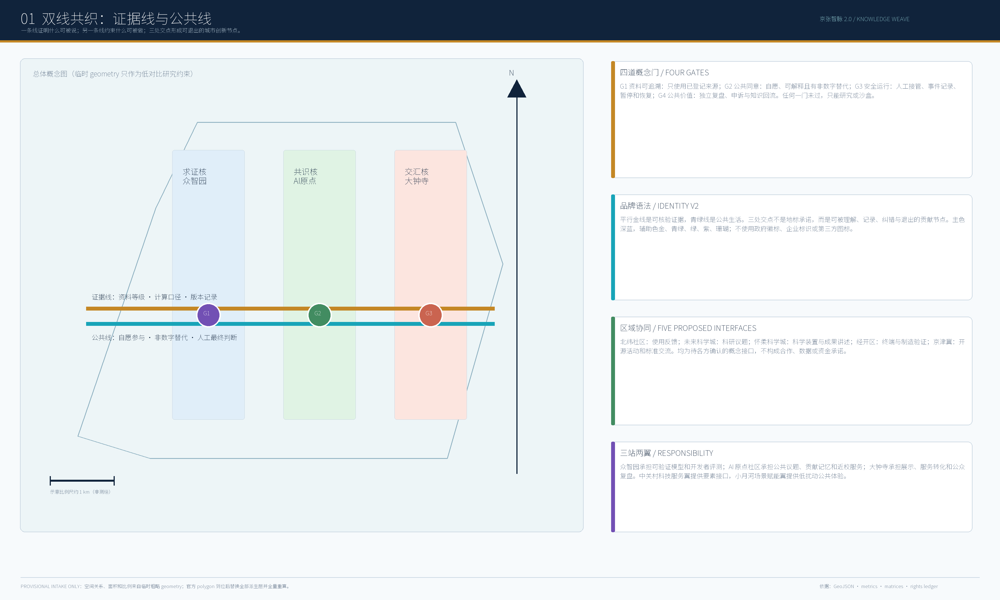
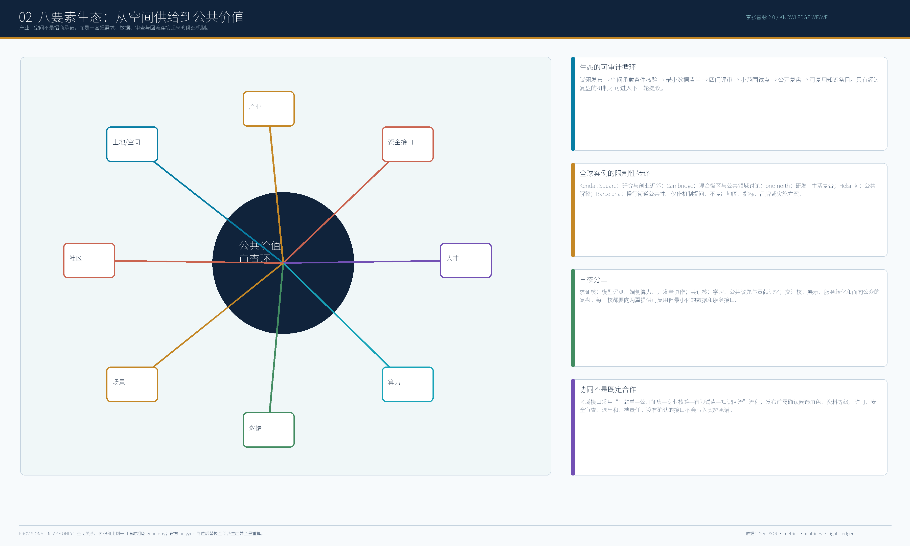
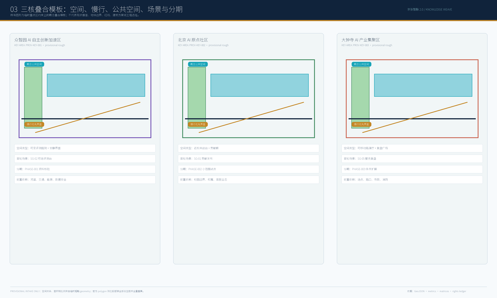
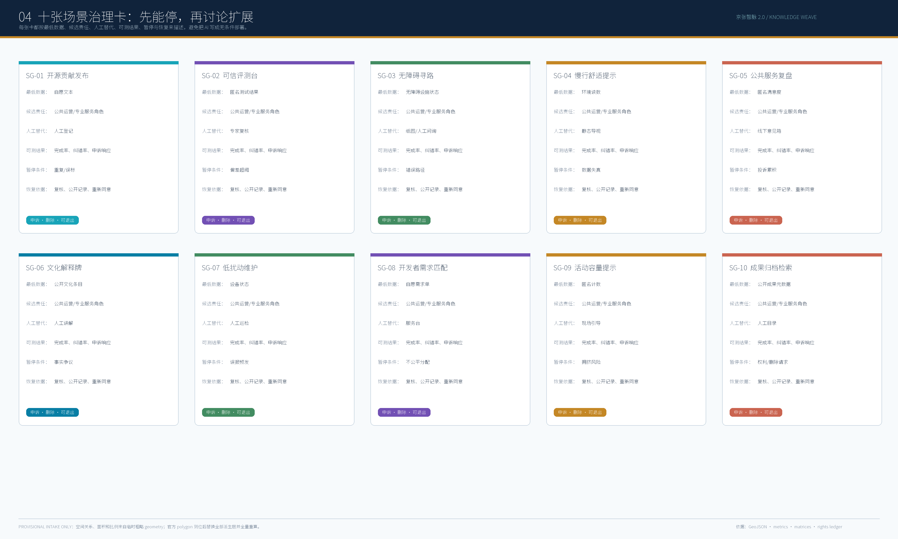
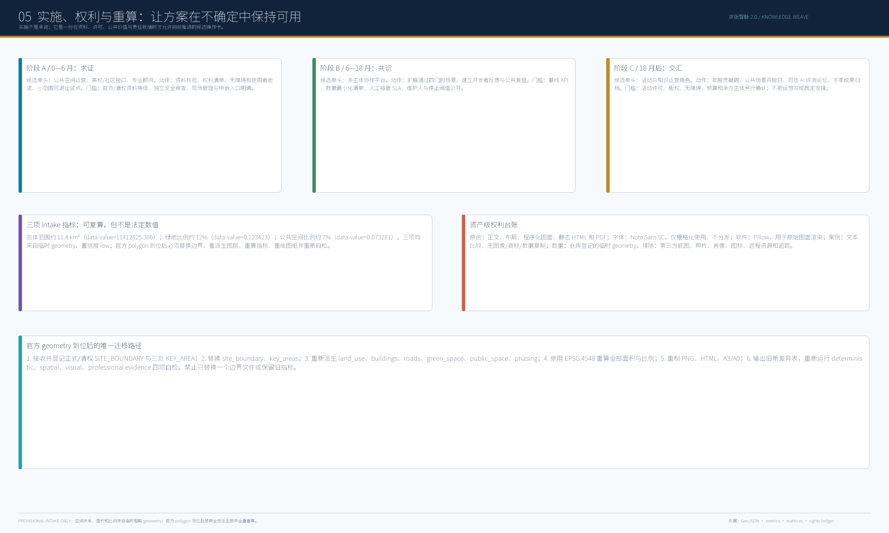

## 设计依据与资料清单

本稿以公告、智能体任务书、标准矩阵、来源注册表和提交的 geometry/metrics 为唯一设计依据。`SITE-001`、三处 `PROV-KEY-*`、用地、建筑、道路、绿地、公共空间、分期及约束图层均是可复核的提交材料；没有一项被表述为官方红线、现状测绘、权属、控规或工程结论。资料门要求每一项空间判断能回到来源、版本、适用边界和复算方法；缺失资料只进入假设与前置调查清单。[source:OFFICIAL-ANNOUNCEMENT] [source:AGENT-TASKBOOK] [source:SOURCE-REGISTRY] [source:BOUNDARY-SOURCE] [data:geometry/site_boundary.geojson#SITE-001] [data:geometry/constraints.geojson#CONSTRAINTS] [standard:PROJECT-OFFICIAL-ANNOUNCEMENT] [standard:PROJECT-AGENT-OPEN-CALL-TASKBOOK] [depth:existing_conditions_diagnosis]

## 三层范围工作框架

43.6 km² 统筹研究范围只用于讨论产业、人才与区域接口；总体设计范围用于公共空间、慢行、更新项目与设施承载的概念组织；三处重点区用于验证空间类型、公共界面、场景、分期与依赖。`provisional_constraint` 是讨论边界而不是设计许可：官方 polygon 进入后，必须同时替换总体边界和重点区，重派生所有图层、重算面积比例、重制图纸和 HTML，并公开差异表。[data:geometry/key_areas.geojson#PROV-KEY-001] [data:geometry/key_areas.geojson#PROV-KEY-002] [data:geometry/key_areas.geojson#PROV-KEY-003] [metric:site_area_sqm] [metric:key_area_count] [depth:three_level_scope_framework] [depth:metrics_recalculation]

## 统筹研究范围产业与未来城市研究

统筹研究以“一脉三核、两翼、多点场景”形成候选服务接口：众智园验证模型与端侧算力，AI 原点社区组织近校学习、开源贡献与公共议题，大钟寺连接展示、服务转化与公众复盘；中关村科技服务翼承接人才、IP、资本和专业服务，小月河场景赋能翼验证低扰动公共体验。北纬社区、未来科学城、怀柔科学城、经开区及京津冀采用统一的“问题单—公开征集—专业核验—有限试点—知识回流”机制，全部为待各方确认的概念接口，不预设合作、数据、资金、项目或排期。[source:AGENT-TASKBOOK] [data:geometry/roads.geojson#ROAD-002] [data:geometry/public_space.geojson#PUBLIC-001] [depth:overall_spatial_structure]

## 总体设计范围城市更新与控规深度城市设计

总体范围以双线组织公共空间：证据线将资料核验、评测与公开复盘串联；公共线将慢行、可达、纸面导视和非数字服务串联。四道概念门依序确认来源与计算口径、自愿与无障碍、安全与人工接管、公平与公共价值。未通过任何一门的方案只能停留于研究或沙盒，不能进入试点或常态运行。用地、建筑、道路、绿地、公共空间和分期图层只用于概念叠合与依赖识别。[data:geometry/land_use.geojson#LU-001] [data:geometry/buildings.geojson#BLDG-001] [data:geometry/roads.geojson#ROAD-001] [data:geometry/green_space.geojson#GREEN-001] [data:geometry/public_space.geojson#PUBLIC-001] [depth:land_use_layout] [depth:development_intensity_controls] [depth:height_massing_character] [depth:retain_renovate_demolish]

## 重点区域详细设计

众智园（`PROV-KEY-001`）采用“可变评测庭院+安静界面”，先核验河道、交通、能源与数据安全；AI 原点社区（`PROV-KEY-002`）采用“近校共创台+贡献廊”，先核验校园边界、权属与首层业态；大钟寺（`PROV-KEY-003`）采用“可移动路演厅+复盘广场”，先核验站点、路口、市政与消防。每个模板叠合概念空间类型、慢行/公共空间、AI 场景、候选分期、依赖条件与 feature ID，明确不替代现状调查、工程选址或审批图纸。[data:geometry/key_areas.geojson#PROV-KEY-001] [data:geometry/key_areas.geojson#PROV-KEY-002] [data:geometry/key_areas.geojson#PROV-KEY-003] [data:geometry/phasing.geojson#PHASE-001] [depth:three_key_area_detailed_design]

## AI 创新生态、人才画像与 AI+ 场景

生态图谱将土地/空间、产业、资金接口、人才、算力、数据、场景和社区放入同一公共价值审查环。服务对象包括开源开发者、初创团队、企业访客、周边居民与高校师生；任何画像都不得用于个人轨迹采集或商业推荐。十张场景卡均写明空间关系、最小数据、候选责任角色、无 AI 基线、人工替代、可测结果、停止条件、申诉入口、删除规则与恢复证据。SG-01 开源贡献发布、SG-02 可信评测台、SG-03 无障碍寻路为优先验证项，其余场景逐项通过四门后再讨论。[data:geometry/public_space.geojson#PUBLIC-001] [data:geometry/roads.geojson#ROAD-001] [metric:green_ratio] [metric:public_space_ratio] [depth:blue_green_public_space]

## 用地、建筑规模与拆改留方案

当前几何中的用地与建筑基底只作为可复算 intake 图层。建筑规模、容积率、高度、密度、退线、拆改留、权属与文保结论均保持 `unknown` 或 `pending_control`，只有正式控规、现状调查与专业核验到位后才可进入控制图。`building_footprint_area_sqm` 是临时 geometry 的低置信度复算值，不是批准规模。[data:geometry/land_use.geojson#LU-001] [data:geometry/buildings.geojson#BLDG-001] [metric:building_footprint_area_sqm] [standard:MNR-LAND-USE-CLASSIFICATION-GUIDE] [depth:land_use_layout] [depth:development_intensity_controls] [depth:height_massing_character] [depth:retain_renovate_demolish]

## 交通、轨道、市政与公共服务设施

交通策略以慢行连续、无障碍、低扰动接驳和纸面/人工替代为优先。轨道站点条件、道路红线、停车、市政管线、能源、排水、防洪与消防均被列为项目试点前置条件。端侧算力与公共服务设施只提出候选承载和责任界面，不提出容量、管线、投资或工程承诺。[data:geometry/roads.geojson#ROAD-001] [data:geometry/public_space.geojson#PUBLIC-001] [data:geometry/constraints.geojson#CONSTRAINTS] [depth:traffic_rail_slow_parking] [depth:municipal_new_infrastructure]

## 蓝绿空间、公共空间与城市风貌

蓝绿系统以京张遗址公园活力带和小月河场景赋能翼为候选公共体验骨架，采用静默导视柱、可停留贡献台、无障碍活动缘、场景说明牌和可移动展陈架五类可撤除组件。时序门、开源贡献廊、共智瞭望台只是文化叙事节点，须在权属、文保、绿地、消防与交通安全资料完备后深化。所有组件提供非数字替代、明确服务边界和停用状态。[data:geometry/green_space.geojson#GREEN-001] [data:geometry/public_space.geojson#PUBLIC-001] [metric:green_ratio] [metric:public_space_ratio] [depth:blue_green_public_space]

## 更新项目清单、实施政策与分期计划

JZ-01 至 JZ-06 分别覆盖资料与权利核验、无障碍走读、可信评测、公共场景开放、开发者与公共复盘、年度归档与国际传播。每张实施卡必须补齐候选责任角色、协作机制、前置许可、资源量级、维护责任、KPI 基线、人工复核、申诉、暂停、删除和恢复。阶段 A（0—6 月）求证、阶段 B（6—18 月）共识、阶段 C（18 月后）交汇仅是概念顺序；活动、招引、预算、承办和国际合作均待另行确认。[data:geometry/phasing.geojson#PHASE-001] [depth:renewal_project_list] [depth:phasing_implementation]

## 指标体系、面积复算与合规矩阵

`site_area_sqm`、`building_footprint_area_sqm`、`green_ratio`、`public_space_ratio` 的状态均为 `provisional_intake_only`、置信度 low；展示用约值而非精确承诺。`known` 仅表示提交文件内的公式可复核，不表示官方边界已存在。合规矩阵把公告 1.3、1.4、1.5 和 agent.1—agent.6 映射到本稿、图层、指标、图纸、HTML、来源、假设与自检；正式 geometry 到位后必须全量重算而非单点替换。[metric:site_area_sqm] [metric:building_footprint_area_sqm] [metric:green_ratio] [metric:public_space_ratio] [data:geometry/site_boundary.geojson#SITE-001] [depth:metrics_recalculation]

## 风险、版权与合规说明

台账逐项记录原创文字、PNG、PDF、HTML、Noto Sans SC 栅格文字、Pillow、文本案例、临时 geometry、代码与生成方式；不含第三方底图、照片、肖像、商标、图标、远程资源或追踪。案例只作文本机制比较，不复制其地图、统计、品牌或项目安排。场景治理遵守数据最小化、人工最终判断、同意/撤回/纠错、申诉、暂停、删除与重新进入条件。详细证据在 `report/copyright_statement.md`、`sources.json`、`assumptions.json` 与 `report/narrative.md` 中闭环。[source:ASSET-PILLOW-001] [source:ASSET-NOTO-001] [source:ASSET-CODEX-001] [source:CASE-KENDALL-001] [source:CASE-CAMBRIDGE-001] [source:CASE-ONENORTH-001] [source:CASE-HELSINKI-001] [source:CASE-BARCELONA-001] [depth:risk_missing_data]

## 参考资料

本方案的材料清单与访问/许可边界由 `sources.json` 注册；任务对齐由 `standard_matrix.json`、`design_depth_matrix.json` 与 `compliance_matrix.json` 复核。公告和智能体任务书提供总体目标、三层范围和交付深度的判断依据；城市设计管理、控规、用地分类和建筑设计深度标准只用于识别需要后续专业核验的事项，而不替代其法定适用。`site_boundary.geojson`、`key_areas.geojson`、`constraints.geojson`、用地、道路、建筑、绿地、公共空间与分期文件均来自仓库登记的临时资料，允许离线展示与 intake 自检，却不支撑正式红线、权属、工程条件或精确面积结论。指标因此统一标注 `provisional_intake_only` 和 low confidence；任何官方或清权 polygon 的到位，都触发边界、派生图层、metrics、五张证据图、A3/A0、HTML、manifest 与 gate 结果的全量重算。Kendall Square、Cambridge、one-north、Helsinki、Barcelona 只提供文本级机制比较，包含机构/发布信息/访问日期/使用边界的登记，并不复制图像、地图、品牌、统计或实施安排。权利台账记录原创文字、程序化图、PDF、HTML、字体与工具，未能证明权利的材料不被纳入投稿包。[source:OFFICIAL-ANNOUNCEMENT] [source:AGENT-TASKBOOK] [source:SOURCE-REGISTRY] [source:BOUNDARY-SOURCE] [source:KEY-AREA-SOURCE] [source:CASE-KENDALL-001] [source:CASE-CAMBRIDGE-001] [source:CASE-ONENORTH-001] [source:CASE-HELSINKI-001] [source:CASE-BARCELONA-001] [data:geometry/site_boundary.geojson#SITE-001] [data:geometry/constraints.geojson#CONSTRAINTS] [metric:site_area_sqm] [metric:green_ratio] [metric:public_space_ratio] [standard:PROJECT-OFFICIAL-ANNOUNCEMENT] [standard:PROJECT-AGENT-OPEN-CALL-TASKBOOK] [depth:metrics_recalculation] [depth:risk_missing_data]

> **证据线与公共线：让每一个 AI 场景既说得清，也停得下。**

## 执行摘要

“京张智脉”不是把 AI 服务堆叠在铁路遗址附近，而是把百年京张的线性记忆转译为两条并行的城市能力线：**证据线**回答什么能够被资料、计算和复核证明；**公共线**回答什么获得了自愿参与、非数字替代、人工判断和申诉退出的条件。两线在众智园、北京 AI 原点社区和大钟寺形成“求证核—共识核—交汇核”，向中关村科技服务翼和小月河场景赋能翼延展。所有空间动作均为开放共创建议，不构成红线、控规、工程、投资、权属或审批结论。[source:OFFICIAL-ANNOUNCEMENT] [source:AGENT-TASKBOOK] [standard:PROJECT-OFFICIAL-ANNOUNCEMENT] [standard:PROJECT-AGENT-OPEN-CALL-TASKBOOK] [depth:overall_spatial_structure]

## 1. 资料基础、三层范围与不确定性

本方案使用仓库登记的任务书、标准、数据注册表和临时 geometry。`SITE-001` 与 `PROV-KEY-001`—`003` 为 `provisional_constraint`，不等同于官方红线；当前约 11.4 km² 的 `site_area_sqm` 仅是提交 geometry 的可复算 intake 结果，置信度为 low。任何正式 polygon 到位后，必须整体替换边界、九类派生图层、指标、图纸和 HTML，再输出差异表。[source:SITE-PACKAGE] [source:SOURCE-REGISTRY] [source:PROCESSED-FACT-PACK] [source:BOUNDARY-SOURCE] [source:KEY-AREA-SOURCE] [data:geometry/site_boundary.geojson#SITE-001] [metric:site_area_sqm] [metric:key_area_count] [depth:existing_conditions_diagnosis] [depth:three_level_scope_framework] [depth:metrics_recalculation]

三层范围对应三种不同的工作尺度：43.6 km² 统筹研究范围用于产业、人才和区域接口议题；总体设计范围用于公共空间、慢行、更新项目和设施承载的概念组织；三处重点区用于验证空间类型、公共界面、场景、分期和依赖。用地、建筑基底、道路、绿地、公共空间和分期均可在当前提交图层复核，但它们不是现状测绘、法定用地或批准工程数据。[standard:MOHURD-URBAN-DESIGN-MEASURES] [standard:MOHURD-CONTROL-DETAILED-PLANNING] [standard:MNR-LAND-USE-CLASSIFICATION-GUIDE] [standard:MOHURD-ARCH-DESIGN-DEPTH-2016] [data:geometry/land_use.geojson#LU-001] [data:geometry/buildings.geojson#BLDG-001] [data:geometry/roads.geojson#ROAD-001] [depth:land_use_layout] [depth:development_intensity_controls] [depth:height_massing_character] [depth:retain_renovate_demolish]

## 2. 总体结构：一脉三核、两翼、四门

总体结构以三核承担不同而互补的责任。众智园是“求证核”，面向模型评测、端侧算力、开发者协作和安全复核；AI 原点社区是“共识核”，面向近校学习、社区议题、贡献记忆和公众解释；大钟寺是“交汇核”，面向服务展示、智能原生新业态和公众复盘。中关村科技服务翼提供人才、知识产权、资本和专业服务接口；小月河场景赋能翼提供低扰动公共体验、慢行和蓝绿界面。五个区域协同接口分别面向北纬社区、未来科学城、怀柔科学城、经开区和京津冀，均采用“问题单—公开征集—专业核验—有限试点—知识回流”流程，不预设合作方、数据流、资金或日程。[source:AGENT-TASKBOOK] [data:geometry/roads.geojson#ROAD-002] [data:geometry/green_space.geojson#GREEN-001] [data:geometry/public_space.geojson#PUBLIC-001] [depth:traffic_rail_slow_parking] [depth:municipal_new_infrastructure] [depth:blue_green_public_space]

四门决定场景和项目是否能进入下一阶段：**资料门**核验来源、空间条件与计算口径；**同意门**确认自愿性、无障碍、非数字替代和不以居民画像为商业推荐；**安全门**确认最小数据、人工接管、事件响应与暂停；**公共价值门**核验公平、可理解、申诉、复盘和知识回流。未通过任一门的提议只能停留在研究或沙盒，不能被包装成常态化部署。

## 3. AI 创新生态与区域协同

八要素生态把土地/空间、产业、资金接口、人才、算力、数据、场景和社区放在同一公共价值审查环中。空间不是招商承诺，数据不是无限采集，场景也不是无条件试用；每项机制要先说明候选空间承载、最小数据、责任类型与退出条件。国际案例只提供受限的机制比较：Kendall Square 的研究—创业近邻、Cambridge 的混合街区讨论、one-north 的研发—生活复合、Helsinki 的公共解释和 Barcelona 的街道公共性；不复制其图纸、统计、商标或项目安排。[source:CASE-KENDALL-001] [source:CASE-CAMBRIDGE-001] [source:CASE-ONENORTH-001] [source:CASE-HELSINKI-001] [source:CASE-BARCELONA-001] [depth:overall_spatial_structure]

## 4. 三处重点区：概念叠合模板

**众智园 AI 自主创新加速区（PROV-KEY-001）。** 建议形成可变评测庭院与安静界面：以低扰动的公共边界承载可信评测台，先验证河道、交通、能源和数据安全条件，再讨论小范围试点。建筑、道路、公共空间均以当前临时图层作为讨论提示，不作为现状或工程判断。

**北京 AI 原点社区（PROV-KEY-002）。** 建议形成近校共创台与贡献廊：以首层公共界面、步行可达和纸面/人工解释为优先，将开源贡献发布限制为自愿、可撤回、可纠错的公共条目。校园边界、权属和业态需由后续专业调查确认。

**大钟寺 AI 产业集聚区（PROV-KEY-003）。** 建议形成可移动路演厅与复盘广场：以可撤除展示、服务复盘和无障碍体验替代永久工程结论。站点、路口、市政和消防资料不齐前，任何场景都不进入常态运行。[data:geometry/key_areas.geojson#PROV-KEY-001] [data:geometry/key_areas.geojson#PROV-KEY-002] [data:geometry/key_areas.geojson#PROV-KEY-003] [data:geometry/phasing.geojson#PHASE-001] [depth:three_key_area_detailed_design]

## 5. 十张场景卡：以可退出为默认

下列十张卡的共同底线是：不采集不必要的可识别个人轨迹，不把健康、教育、法律或公共安全建议作为自动决定，不以无法人工复核的模型输出取代服务人员。SG-01 开源贡献发布、SG-02 可信评测台、SG-03 无障碍寻路为三项优先验证场景；其余七项仅在前置门通过后逐一评估。每张卡具有最低数据、候选责任类型、人工替代、可测结果、暂停条件、申诉入口、删除规则和恢复证据。[source:AGENT-TASKBOOK] [metric:green_ratio] [metric:public_space_ratio] [depth:blue_green_public_space]

| 场景 | 空间关系 | 最低数据与人工替代 | 停止/恢复 | 公共价值指标 |
| --- | --- | --- | --- | --- |
| SG-01 开源贡献发布 | AI 原点社区公共界面 | 自愿文本；人工登记 | 纠错或撤回请求即暂停；完成修订后恢复 | 纠错响应与撤回完成率 |
| SG-02 可信评测台 | 众智园可变庭院 | 匿名测试结果；专家复核 | 偏差或安全事件超阈暂停 | 可复现评测与人工复核比例 |
| SG-03 无障碍寻路 | 慢行与公共空间 | 设施状态；纸图/人工问询 | 错误路径即下线 | 可达路线覆盖与纠错时效 |
| SG-04 慢行舒适提示 | 蓝绿界面 | 环境读数；静态导视 | 数据失真暂停 | 解释牌理解度 |
| SG-05 公共服务复盘 | 大钟寺复盘广场 | 匿名意见；线下意见箱 | 投诉累积复审 | 申诉响应与公开复盘率 |
| SG-06 文化解释牌 | 朝圣地标候选点 | 公开文化条目；人工讲解 | 事实争议下架 | 勘误闭环率 |
| SG-07 低扰动维护 | 公共空间组件 | 设备状态；人工巡检 | 误报频发暂停 | 人工确认率 |
| SG-08 开发者需求匹配 | 科技服务翼接口 | 自愿需求单；服务台 | 不公平分配复审 | 反馈满意度 |
| SG-09 活动容量提示 | 公共路线 | 匿名计数；现场引导 | 拥挤风险暂停 | 安全事件为零并非自动目标，需人工确认 |
| SG-10 成果归档检索 | 知识贡献廊 | 公开元数据；人工目录 | 权利/删除请求暂停 | 删除完成与复用记录 |

## 6. 公共空间、文化叙事与标识系统

公共空间组件包含静默导视柱、可停留贡献台、无障碍活动缘、场景说明牌和可移动展陈架。每个组件都提供不依赖手机的替代信息，说明服务边界和停用状态，并可在活动结束后撤除。三处文化节点“时序门、开源贡献廊、共智瞭望台”仅作为候选叙事载体，需在权属、文保、绿地、消防和交通安全条件明确后才可进入专业设计。文化线索以“历史—知识—公共利益”的双语叙事连接铁路记忆、中关村创新文化和 AI 新文化；不将历史作为科技装饰，也不使用未授权历史图像或商标。[source:ASSET-NOTO-001] [source:ASSET-CODEX-001] [depth:blue_green_public_space]

## 7. 六张实施与长期运营卡

JZ-01 资料与权利核验、JZ-02 无障碍和使用者走读、JZ-03 可信评测沙盒、JZ-04 公共场景开放、JZ-05 开发者与公共复盘、JZ-06 年度归档与国际传播构成六张候选实施卡。每张卡须由候选责任角色、前置许可、资源量级、维护责任、KPI 基线、人工接管、申诉、暂停和恢复组成；没有经确认的权属、预算、审批、现场容量和专业安全条件时，卡片不得从概念进入实施。阶段 A（0—6 月）求证，阶段 B（6—18 月）共识，阶段 C（18 月后）交汇；这只是概念顺序，不是已确定工期。[metric:building_footprint_area_sqm] [data:geometry/phasing.geojson#PHASE-001] [depth:renewal_project_list] [depth:phasing_implementation]

年度运营采用四个候选模块：春季“贡献周”、夏季“公共场景开放日”、秋季“可信 AI 评测论坛”、冬季“成果归档与公众复盘”。活动是否举办、频率、承办主体、预算、招引和国际合作均需另行确认。转化路径不是招商承诺，而是“公开问题—开发者响应—小范围验证—独立复盘—知识归档—下一轮提议”。

## 8. 指标、权利与风险边界

`site_area_sqm`、`building_footprint_area_sqm`、`green_ratio`、`public_space_ratio` 保留为当前临时 geometry 的可复算值：`status=known` 只表示文件内公式可复核，不代表官方面积、法定指标或最终设计数量。所有展示使用约值并标注 low confidence。FAR、建筑高度、红线、权属、市政容量、消防、防洪、文保和轨道条件维持 unknown 或待专业确认，绝不由本方案补造。[metric:site_area_sqm] [metric:building_footprint_area_sqm] [metric:green_ratio] [metric:public_space_ratio] [depth:development_intensity_controls] [depth:height_massing_character] [depth:risk_missing_data]

权利台账逐项覆盖原创文字、PNG、PDF、HTML、字体、渲染工具、案例文本和临时 geometry；不嵌入第三方底图、照片、肖像、商标、图标、远程字体、脚本、iframe、API 或追踪。Noto Sans SC 仅用于栅格化中文文字，不随包分发；Pillow 仅用于从已提交 geometry、指标和原创文字生成图面。案例仅作文本机制比较；不能证明权利的材料不进入成果包。[source:ASSET-PILLOW-001] [source:ASSET-NOTO-001] [source:ASSET-CODEX-001]

## 9. 结语：城市智能必须保留拒绝的能力

本方案的成果不是一组被自动执行的项目，而是一套可让专业团队、社区和开发者共同检验的工作方法：证据不足就不把推测写成事实；公众不愿意就不把服务写成默认；安全不可控就暂停；公共价值未被证明就不扩展。官方 geometry 与法定资料到位后，系统必须先重算、再讨论推进。人类与专业团队始终保留最终判断权。[source:AGENT-TASKBOOK] [standard:PROJECT-AGENT-OPEN-CALL-TASKBOOK] [depth:risk_missing_data]
