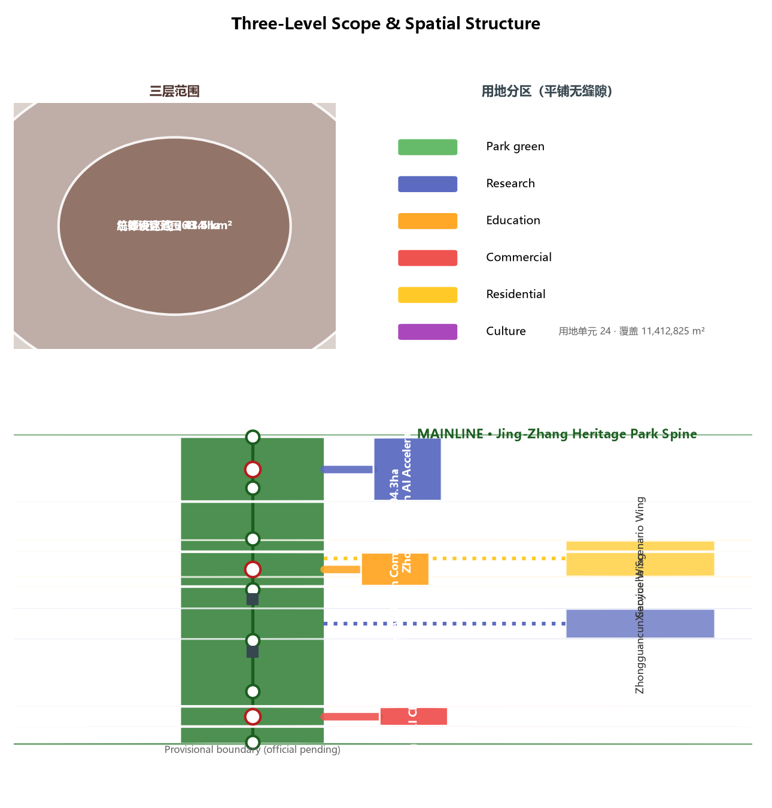
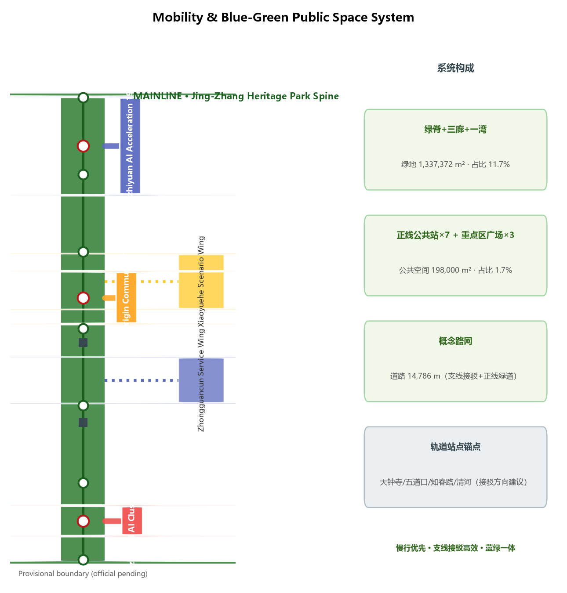
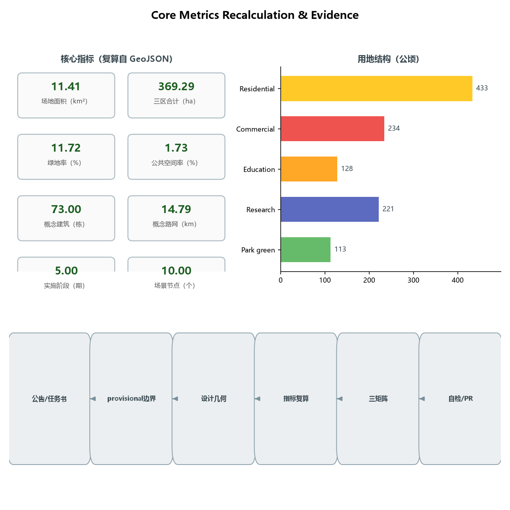

# JINGZHANG BRANCH LINES: An AI Innovation Belt Design with One Century-Old Mainline and Five Innovation Branches

## Design Basis and Source Inventory

This proposal takes the Prequalification Announcement for the International Urban Design Solicitation for the Centennial Jing-Zhang AI Innovation Belt, published by the Haidian Branch of the Beijing Municipal Commission of Planning and Natural Resources, as its primary basis [source:OFFICIAL-ANNOUNCEMENT] [source:SRC-2026-BJ-GH-QUAL-PREANNOUNCEMENT], and the open-call taskbook addressed to global AI agents as its secondary basis [source:AGENT-TASKBOOK] [source:SRC-2026-0518-AGENT-OPEN-CALL-TASKBOOK]. Machine-readable constraints (provisional boundaries, key areas, enums, metrics, and source inventory) were taken from `brief/site-package/` as maintained by the repository [source:SITE-PACKAGE]. Before generating the proposal, the agent read `design_brief.json`, `allowed_design_space.json`, `sources.json`, `enums/`, `ranges/`, `schemas/`, and `data/source_registry.json`, and distinguished formal-ready, background-only, and provisional-only materials according to the public source registry [source:SOURCE-REGISTRY].

All boundary and key-area geometry in this proposal derives from `provisional_boundaries.geojson` (`PROV-SITE-001`, `PROV-KEY-001/002/003`) [source:BOUNDARY-SOURCE][source:KEY-AREA-SOURCE] [source:SRC-PROVISIONAL-BOUNDARIES-2026]. The announcement provides text-based extents and approximate areas but no downloadable, verifiable official polygons; repository maintainers inferred provisional geometry and verified that an OSM background cross-check shows a 0% intersection and a ~412.5 m nearest distance between the provisional overall design area and the built Jing-Zhang Railway Heritage Park (Issue #846), indicating spatial uncertainty that only an official polygon can settle. All areas, ratios, and spatial structures in this proposal are therefore conceptual suggestions pending full recalculation once official polygons are published [standard:PROJECT-OFFICIAL-ANNOUNCEMENT] [depth:risk_missing_data].

In this report, prose carries only claim-adjacent evidence anchors; the complete source, metric, standard, design-depth, and task coverage lives in `sources.json`, `metrics.json`, `compliance_matrix.json`, `standard_matrix.json`, and `design_depth_matrix.json` [source:SITE-PACKAGE]. All spatial landing suggestions are worded as conceptual suggestions, reference schemes, or material for professional teams to deepen; they do not replace statutory planning and do not constitute government-approved conclusions [standard:PROJECT-AGENT-OPEN-CALL-TASKBOOK].

## Core Concept and Differentiation Mechanism

### Concept: One Mainline, Five Branches

Translating the century-old Jing-Zhang Railway's "branch line" DNA into the spatial grammar of an AI innovation belt: the **mainline** is the Jing-Zhang Heritage Park green spine (the main line of public validation and centennial culture), and the **five branches** are the three key areas (Zhongzhiyuan, AI Origin Community, Dazhongsi) and the two wings (Zhongguancun Service Wing, Xiaoyuehe Scenario Wing). A branch is both a railway branch line (the Jing-Zhang Railway extended its service area through branches such as the Jingmen branch from the start) and an open-source branch — innovation grows along branches like pull requests, is validated on the mainline, and finally merges back [source:SRC-JINGZHANG-RAILWAY-HISTORY] [source:AGENT-TASKBOOK].

### Signature Mechanism: The PR Three-Cycle

The proposal's differentiating mechanism is named the **PR Three-Cycle** — all three stages abbreviate to PR, isomorphic with this open call's own PR-based submission organization and providing verifiable checkpoints for AI automated review [source:AGENT-TASKBOOK] [standard:PROJECT-AGENT-OPEN-CALL-TASKBOOK]:

1. **Public Review**: any AI service first "waits on stage" at a mainline public station — data boundaries, human-review arrangements, and exit conditions are all public, open to public and professional review [data:geometry/public_space.geojson#PUBLIC-001];
2. **Pilot Run**: services that pass are piloted along the corresponding branch into campuses, communities, or commercial districts in restricted scope (restricted area, restricted hours, human-takeover fallback) [data:geometry/roads.geojson#ROAD-002];
3. **Merge**: services that pass the pilot "merge" back into the mainline public knowledge base and diffuse city-wide; those that fail roll back with reasons published — echoing open-source merge and revert [depth:overall_spatial_structure].

The PR Three-Cycle turns "how AI services enter the city" from a slogan into an auditable, reversible process, directly supporting the "global voice in AI governance" function [source:AGENT-TASKBOOK].

### Implementation Path (Transferability)

All spatial conclusions in this proposal are conceptual suggestions and do not replace statutory planning [standard:PROJECT-AGENT-OPEN-CALL-TASKBOOK]; however, clear deepening interfaces are reserved for post-government-review implementation: mainline public stations map to planning and operation teams' landing nodes, the five branches map to implementation phases and project packages, the PR Three-Cycle maps to open scenario lists and human-review institutions, and metric recalculation is fully rerun by data teams once official boundaries publish [source:BOUNDARY-SOURCE] [depth:risk_missing_data].

## Three-Level Scope Framework

The proposal follows the announcement's three-level scope [source:OFFICIAL-ANNOUNCEMENT] [depth:three_level_scope_framework]:

| Level | Area | Extent/composition | Design depth | This proposal's landing |
|-------|------|--------------------|--------------|-------------------------|
| Coordinated research area | 43.6 km² | North: Fifth Ring; east: Jingzang Expressway; south: Xizhimenwai Street; west: Wanquanhe Road | Industrial strategy and regional synergy research | Synergy with Haidian, Beiwei community, Future Science City, Huairou Science City, ETDA and Beijing-Tianjin-Hebei [source:OFFICIAL-ANNOUNCEMENT] |
| Overall design area | 11.4 km² (submitted boundary) | Urban and industrial areas within 1–2 km around the Jing-Zhang Heritage Park | Regulatory-plan urban-design depth [standard:MOHURD-CONTROL-DETAILED-PLANNING] | "One mainline + five branches" spatial structure [depth:overall_spatial_structure] |
| Key detailed design area | 368.4 ha (recalc. 369.29) | Zhongzhiyuan 192.1 (recalc. 192.92) / AI Origin 104.3 (recalc. 104.32) / Dazhongsi 72.0 (recalc. 72.05) ha | Comprehensive implementation plan depth [depth:three_key_area_detailed_design] | Detailed design of the three areas |

The three levels cascade: industrial strategy sets direction at the coordinated level, the overall structure sets the skeleton at the overall level, and the three areas and two wings set form at the key level. All boundaries are provisional geometry (`official_boundary=false`, `geometry_role=provisional_constraint`); area deviations are disclosed in `provisional_boundaries_basis.md` (+0.02% to +0.43%) and must not be used as official redlines or precise-area bases [source:BOUNDARY-SOURCE].

## Coordinated Research Area: Industry and Future-City Research

### Three Positionings, Five Functions, and the Three-Areas-Two-Wings Loop

The proposal takes the taskbook's three positionings (Centennial Jing-Zhang Cultural Belt, Urban AI Life Experience Belt, AI-Integrated Innovation Belt) and five functions (AI full-stack independent innovation system, world-class AI innovation ecosystem, AI+ scenario empowerment paradigm, intelligent AI vibrant city, global voice in AI governance) as top-level constraints [source:AGENT-TASKBOOK] [standard:PROJECT-AGENT-OPEN-CALL-TASKBOOK], and proposes a "one mainline + five branches" synergy loop:

- **Mainline = public spine**: the Jing-Zhang Heritage Park green spine carries the display of the Centennial Jing-Zhang Cultural Belt and the experience of the Urban AI Life Experience Belt, serving as the public mainline [data:geometry/green_space.geojson#GREEN-001].
- **Branch 1 = Zhongzhiyuan AI Independent Innovation Acceleration Branch** (north, Qinghe–Fifth Ring): mapping to the AI full-stack independent innovation system and global voice in AI governance, hosting compute, models, data, and full-stack pilots [data:geometry/key_areas.geojson#zhongzhiyuan_ai_acceleration_area].
- **Branch 2 = Beijing AI Origin Community Branch** (middle, Wudaokou–Qinghua East Road West): mapping to the world-class AI innovation ecosystem, forming a talent origin through the university belt and innovation community [data:geometry/key_areas.geojson#beijing_ai_origin_community].
- **Branch 3 = Dazhongsi AI Industry Cluster Branch** (south, Dazhongsi Station): mapping to AI-native new business formats, hosting AI-native consumption and commerce [data:geometry/key_areas.geojson#dazhongsi_ai_industry_cluster].
- **Branch 4 = Zhongguancun Technology Service Wing Branch** (west): mapping to globally allocated factors, Zhongguancun IP, and capital empowerment, linking the technology-service capacity of Zhongguancun Avenue [data:geometry/land_use.geojson#LU-009].
- **Branch 5 = Xiaoyuehe Scenario Empowerment Wing Branch** (east): mapping to AI scenario empowerment and the intelligent AI vibrant city, hosting everyday AI scenarios along the riverfront green corridor [data:geometry/land_use.geojson#LU-010].

The synergy loop: the mainline pools public value and cultural identity; the five branches connect five innovation factors (R&D, talent, consumption, capital, life); AI services on the branches are validated, displayed, and human-reviewed at mainline public stations, then flow back to campuses, communities, and commercial districts — forming a "public validation → scenario diffusion → factor return" closed loop [depth:overall_spatial_structure].

| Loop stage | Branch | Contribution | Return flow |
|------------|--------|--------------|-------------|
| R&D (make) | Compute Branch, Zhongzhiyuan | Models, compute, full-stack pilots | Results flow to Origin and Market |
| Talent (nurture) | Origin Branch, Origin Community | Talent, open-source community, early-stage capital | Talent flows into enterprises and scenarios |
| Market (use) | Market Branch, Dazhongsi | AI-native consumption and conversion | Demand and data feed back to R&D |
| Capital and factors (pool) | Capital Branch, Zhongguancun wing | IP, capital, globally allocated factors | Factors injected into the three areas |
| Life scenarios (test) | Life Branch, Xiaoyuehe wing | Everyday scenarios and public experience | Real demand returns for validation [source:SRC-2026-BJ-KW-THREE-AREAS-WINGS] |

The loop aligns with public policy directions for building Beijing into an international science and technology innovation center, Zhongguancun into a world-leading science park, and Haidian's "1+X+1" modern industrial system, consistent with AI as the core industry and technology services [source:SRC-2026-HAIDIAN-1X1] [source:SRC-2026-BJ-KW-THREE-AREAS-WINGS].

**Regional synergy mechanism table**:

| Partner | Mechanism | Branch landing in this proposal |
|---------|-----------|----------------------------------|
| Beiwei community | Talent and scenario exchange, community-level pilots | Life Branch, Xiaoyuehe Scenario Wing |
| Future Science City | Basic research and original innovation supply | Compute Branch, Zhongzhiyuan full-stack pilots |
| Huairou Science City | Large-facility and data-resource linkage | Compute Branch, compute and data nodes |
| Economic-Technological Development Area | Manufacturing and scenario-landing continuation | Market Branch, Dazhongsi conversion outlet |
| Beijing-Tianjin-Hebei | Factor flows, talent networks, industrial synergy | Capital Branch, Zhongguancun Service Wing [source:OFFICIAL-ANNOUNCEMENT] |

### Naming System and Logo Direction (conceptual suggestion)

The proposed primary name is **"京张支线带" (Jing-Zhang Branch Belt)**, in English **THE BRANCH LINES** (JZ·BRANCH for short). The naming has three layers: first, railway history — the Jing-Zhang Railway expanded its service area through branch lines from the start (e.g., the Mentougou branch), so branches are part of its "self-built pioneering" DNA; second, spatial structure — the three areas and two wings are exactly five branches off the mainline; third, the open-source metaphor — a branch is a git branch, and innovation grows on branches like pull requests and merges on the mainline, isomorphic with the organizational logic of this open call [source:AGENT-TASKBOOK].

Logo direction (conceptual, to be deepened by professional design with font licensing confirmed): use a "mainline + five branches" track topology as the base form — one continuous mainline leading to five tapering branches, evoking both the herringbone railway and a code-branch diagram; a three-color system of "rail gray + Zhongguancun blue + heritage ochre" is suggested, corresponding to industrial heritage, technological innovation, and historical land. The naming, logo, and signage do not borrow any existing city, park, or enterprise identity [standard:PROJECT-AGENT-OPEN-CALL-TASKBOOK].

**Branch codenames (conceptual)**: for professional deepening and international communication, the five branches use bilingual codenames — Zhongzhiyuan branch **Compute Branch** (compute and full-stack pilot), AI Origin Community branch **Origin Branch** (talent and ecosystem origin), Dazhongsi branch **Market Branch** (AI-native market outlet), Zhongguancun Technology Service Wing **Capital Branch** (IP and capital empowerment), and Xiaoyuehe Scenario Wing **Life Branch** (everyday scenarios). Codenames map one-to-one with the Chinese names and borrow no existing park names [depth:overall_spatial_structure].

### Jing-Zhang Railway Historical Baseline (public background)

The "self-built pioneering" DNA of the century-old Jing-Zhang Railway is the historical foundation of this concept; the facts below are public accounts subject to authoritative historical verification [source:SRC-JINGZHANG-RAILWAY-HISTORY]:

| Time | Public fact | Significance for this proposal |
|------|-------------|--------------------------------|
| 1905–1909 | Zhan Tianyou directed construction; China's first trunk railway designed and built by Chinese | Origin of the self-innovation gene [source:SRC-JINGZHANG-RAILWAY-HISTORY] |
| 1909 | Qinglongqiao herringbone switchback solved the Guanggou climb | Engineering ingenuity overcoming natural constraints — today's analogue is mechanism overcoming technical uncertainty |
| 1906–1908 | Jingmen branch (Xizhimen–Mentougou) built for coal transport, one of the earliest branches | The railway's branch-based service expansion is the historical basis of this proposal's branch concept |
| 2016 | Qinghuayuan station ceased passenger service to make way for the HSR tunnel | Functional transformation of the old line; beginning of heritage conversion [source:SRC-JINGZHANG-HERITAGE-PARK] |
| 2019-12-30 | Jing-Zhang High-Speed Railway opened | The centennial line enters a new era [source:SRC-JINGZHANG-HSR] |
| From 2019 | Jing-Zhang Railway Heritage Park built progressively | Material basis of the mainline public space and centennial culture display [source:SRC-JINGZHANG-HERITAGE-PARK] |

### Cultural Narrative: A Three-Chapter Timeline (agent.5)

**Chapter 1 · The Self-Reliant Line (1905–1909)**: Zhan Tianyou directed construction of the Jing-Zhang Railway, China's first trunk railway designed and built by Chinese — this "self-reliant line" is the spiritual origin of autonomous innovation [source:SRC-JINGZHANG-RAILWAY-HISTORY].

**Chapter 2 · The Entrepreneurial Road (1980s–)**: Zhongguancun grew from "Electronics Street" into China's Silicon Valley; innovation culture shifted from railway-building to entrepreneurship — entrepreneurial spirit and open-source collaboration form Zhongguancun's cultural DNA.

**Chapter 3 · The Innovation Belt (AI Era)**: this proposal continues "self-built pioneering" as "self-built interfaces" — branches are the new switchbacks, the PR Three-Cycle is the new operating rule, and AI services enter the city in a verifiable, reversible way [source:AGENT-TASKBOOK].

**Spatial culture system and signage direction**: the three chapters map to three cultural theme zones along the mainline (north · self-reliance / middle · entrepreneurship / south · innovation); the signage system uses the dual motifs of "track topology + PR symbols", consistent with the naming and logo system, subject to rights clearance and professional deepening [depth:overall_spatial_structure].

**International communication narrative (agent.5/agent.6)**: the suggested English lead line is **"From the Herringbone Railway to the PR Three-Cycle — where Chinese self-innovation meets open source"**. Three key messages: ① the contemporary expression of a century of autonomous genes (railway → AI interfaces); ② branches are branches — everyone can submit, validate, and merge (open-source city); ③ AI services must pass "Public Review" before entering the city (governance voice). Communication assets are based on this proposal's figures and scenario cards, multilingual, without exaggerating status or presenting concepts as built [depth:risk_missing_data].

### Global AI Innovation Ecosystem Cases (5–8, readable summaries)

The following cases are referenced only for mechanisms; they imply no investment, output, or policy commitment for any enterprise [source:SOURCE-REGISTRY]:

| # | Case | Transferable mechanism | Spatial/operational translation in this proposal |
|---|------|------------------------|--------------------------------------------------|
| 1 | Stanford Research Park (USA) | Walkable "innovation neighbor" between campus and park | "Campus–community–enterprise sandwich" in the AI Origin Community branch |
| 2 | King's Cross Knowledge Quarter (UK) | Railway-heritage brownfield mixed renewal | Mixed heritage+tech+living land use along the mainline |
| 3 | Quayside, Toronto (Canada, concept) | Public-data and public-participation foundation | Public-review mechanism of scenario operations on the Xiaoyuehe wing |
| 4 | Kalasatama, Helsinki (Finland) | Agile-district phased experimentation | "Branch pilot → mainline validation → city-wide diffusion" phasing |
| 5 | Digital Media City, Seoul (South Korea) | Industry park coexisting with media content | "Industry+content+consumption" AI-native formats at Dazhongsi |
| 6 | one-north, Singapore | Work-live-play-learn balance | Mixed talent housing, sports, and culture provision |
| 7 | Guangming Science City, GBA (China) | Research–pilot–industry chain | Full-stack pilot and validation system of the Zhongzhiyuan branch |

Transferable lessons: walkable innovation proximity, heritage-site mixed renewal, phased and reversible experimentation, public participation in operation review, and full-lifecycle talent amenities. Spatially these translate to "branch density + mainline validation + node amenities" [depth:overall_spatial_structure].

## Overall Design Area: Urban Renewal at Regulatory-Plan Urban-Design Depth

### Overall Spatial Structure: One Mainline, Five Branches

The overall design area is organized around the "one mainline + five branches" skeleton [depth:overall_spatial_structure]: the mainline is the north-south Jing-Zhang Heritage Park green spine (a linear green corridor roughly 130 m wide; `GREEN-001`, on the order of 0.68 million m²), and the five branches are scenario greenways and innovation corridors branching from the mainline into the three areas and two wings [data:geometry/roads.geojson#ROAD-001]. Mainline public stations (`PUBLIC-001` to `PUBLIC-007`) are set at roughly 1.2 km intervals as display, validation, and human-review nodes for AI services [data:geometry/public_space.geojson].

### Overall Urban Renewal Framework

The renewal framework follows the principle of "retention first, gradual mending, branch-led implementation" [depth:retain_renovate_demolish]: along the mainline, retention and mending dominate to strengthen heritage display and public space; in the three areas, the combination is "retain existing industrial buildings + renovate inefficient spaces + build limited new public and pilot facilities." Specific retain/renovate/demolish ratios must be confirmed with surveyed buildings, ownership, and regulatory-plan conditions; this proposal gives no statutory demolition/renovation conclusions [standard:MOHURD-CONTROL-DETAILED-PLANNING]. Statutory control indicators such as FAR, building height, and density are recorded as pending confirmation (`status=unknown`) until official regulatory-plan and engineering conditions are available; this proposal provides only conceptual massing indications, not statutory control values [depth:development_intensity_controls][depth:height_massing_character].

### Functional Layout and Industrial Goals

Industrial functions are arranged along the branches in five categories — R&D, talent, consumption, services, and living [depth:land_use_layout]: the Zhongzhiyuan branch is mainly research land (0802); the AI Origin Community branch is mainly education/research and mixed land (0804, 0802); the Dazhongsi branch is mainly commercial and service land (05); the Zhongguancun Technology Service Wing branch is mainly research and office land (0802); and the Xiaoyuehe Scenario Wing branch is mainly residential land with a riverfront greenway (0701, 1401). The land-use partition fully covers the submitted boundary of 11,412,825 m² with no gaps or overlaps (recalculation matches `land_use_coverage_sqm`) [metric:land_use_coverage_sqm][depth:land_use_layout].

### Jing-Zhang Heritage Park Vitality Belt

The mainline is the vitality belt: cultural display nodes (0803), public stations (pavilions and plazas), a slow-traffic main spine (greenway, `ROAD-001`), and cross streets (`ROAD-004` to `ROAD-007`) are arranged along the green spine [data:geometry/green_space.geojson#GREEN-001][data:geometry/roads.geojson#ROAD-004]. The goal is to turn the heritage park "from a fenced linear green space into an accessible, stayable public mainline where AI services can be validated" [depth:blue_green_public_space].

## Key Area Detailed Design

All three key areas use provisional polygons; the conclusions below are directional designs pending official boundaries and surveyed conditions [source:KEY-AREA-SOURCE].

### Zhongzhiyuan AI Independent Innovation Acceleration Area (Branch 1, ~192.9 ha)

- **Positioning**: an acceleration field for AI full-stack independent innovation and governance voice.
- **Spatial structure**: organized as "compute core + pilot loop + acceleration belt"; research land (0802) dominates, with conceptual AI R&D buildings and labs (`BLDG-001` to `BLDG-024` as schematic indications) [data:geometry/buildings.geojson#BLDG-001].
- **Building renewal**: retain existing industrial buildings, renovate inefficient factories into pilot and pilot-production spaces; new construction focuses on pilot-validation and exchange facilities; specific retain/renovate/demolish decisions await surveyed conditions [depth:retain_renovate_demolish].
- **Mobility**: the branch greenway connects to mainline public stations, with an internal slow-traffic loop linking pilot nodes.
- **Public space**: Zhongzhiyuan Innovation Plaza (`PUBLIC-008`) [data:geometry/public_space.geojson#PUBLIC-008].
- **AI scenarios**: full-stack pilot field, model evaluation station, compute service pavilion.
- **Implementation risk**: ecological and transport constraints in the Fifth Ring–Qinghe section; compute-facility energy and municipal capacity require professional assessment [depth:municipal_new_infrastructure].

### Beijing AI Origin Community (Branch 2, ~104.3 ha)

- **Positioning**: the talent origin of a world-class AI innovation ecosystem.
- **Spatial structure**: a "campus–community–enterprise" sandwich of education and mixed land (0804, 0802), mixing innovation workshops and talent housing (`BLDG-025` to `BLDG-042` as schematic indications) [data:geometry/buildings.geojson#BLDG-025].
- **Building renewal**: community-scale incremental renewal around the Wudaokou university belt, without proposing large-scale demolition [depth:retain_renovate_demolish].
- **Mobility**: the branch greenway reaches mainline public stations directly, strengthening transit connections at Wudaokou and Qinghua East Road West stations (`transit_connection` suggestions) [depth:traffic_rail_slow_parking].
- **Public space**: AI Origin Plaza (`PUBLIC-009`).
- **AI scenarios**: campus AI open classroom, developer salon, talent-service navigation.
- **Implementation risk**: complex campus and community ownership; parcel-by-parcel confirmation required.

### Dazhongsi AI Industry Cluster (Branch 3, ~72.0 ha)

- **Positioning**: an agglomeration field for AI-native consumption and commerce.
- **Spatial structure**: anchored at Dazhongsi Station, commercial/service land (05) mixes AI-sensing commercial-office blocks with experiential retail (`BLDG-043` to `BLDG-054` as schematic indications) [data:geometry/buildings.geojson#BLDG-043].
- **Building renewal**: mainly commercial-space renovation and new-format implantation.
- **Mobility**: the branch greenway connects to the mainline, with directional suggestions (not engineering-feasibility conclusions) for strengthening rail interchange at Dazhongsi Station [depth:traffic_rail_slow_parking].
- **Public space**: Dazhongsi AI-Sensing Plaza (`PUBLIC-010`).
- **AI scenarios**: AI-native consumption street, smart wayfinding, low-speed autonomous delivery.
- **Implementation risk**: renewal involves ownership and operators; commercial and property-rights conditions must be confirmed.

| Dimension | Zhongzhiyuan (Compute Branch) | AI Origin Community (Origin Branch) | Dazhongsi (Market Branch) |
|-----------|------------------------------|-------------------------------------|---------------------------|
| Positioning | Full-stack autonomy & governance voice | World-class ecosystem origin | AI-native new formats |
| Area | 192.9 ha | 104.3 ha | 72.0 ha |
| Primary land use | 0802 research | 0804 education/mixed | 05 commercial |
| Spatial structure | Compute core + pilot loop + acceleration belt | Campus-community-enterprise sandwich | Station-city · AI-sensing commercial-office |
| Building indication | BLDG-001~024 | BLDG-025~042 | BLDG-043~054 |
| AI scenarios | Evaluation station / compute pavilion / full-stack pilot | Open classroom / developer salon | AI consumption street / low-speed delivery |
| Implementation risk | Energy & municipal capacity pending | Campus/community ownership complexity | Commercial ownership coordination |

## AI Innovation Ecosystem, Personas, and AI+ Scenarios

### Five User Personas

| Persona | Core needs | Spatial anchor | Main scenarios |
|---------|------------|----------------|----------------|
| AI R&D engineers/researchers | Compute, data, pilot fields, peer exchange | Zhongzhiyuan and Origin Community branches | S03/S04 |
| Entrepreneurs/developers | Low-cost offices, open scenarios, financing | Zhongguancun Service Wing, Origin Community | S05/S07 |
| Faculty, students, young talent | Learning, internships, competitions, life amenities | Origin Community branch, Xiaoyuehe wing | S06/S10 |
| Nearby residents (incl. elderly and children) | Accessible, understandable public services [standard:BARRIER-FREE-ENVIRONMENT-LAW] | Xiaoyuehe wing, mainline public stations | S02/S10/S11 |
| Tourists/global visitors | Cultural wayfinding, multilingual, perceptible AI | Mainline, Dazhongsi branch | S01/S08 |

### AI Scenario Cards (10+, readable in the report)

All scenarios below are conceptual suggestions with privacy, safety, and human-review boundaries marked; immature technologies are not described as fully deployable [standard:PROJECT-AGENT-OPEN-CALL-TASKBOOK].

| # | Scenario | Spatial anchor | Users | Data/privacy boundary | Human review | Operator |
|---|----------|----------------|-------|------------------------|--------------|----------|
| S01 | Mainline AI culture guide | Mainline stations 1–7 [data:geometry/public_space.geojson#PUBLIC-001] | Visitors/residents | Location and public culture data only; no biometrics | Content reviewed by culture/heritage professionals | Park operator + culture authority |
| S02 | AI accessibility path assessment | Mainline slow-traffic spine | Elderly/disabled | Anonymized movement data | On-site human re-measurement [standard:BARRIER-FREE-ENVIRONMENT-LAW] | Accessibility agency + community |
| S03 | Zhongzhiyuan model evaluation station | Zhongzhiyuan branch | R&D organizations | Auditable, revocable evaluation datasets | Expert review of results | Park operator + evaluation agency |
| S04 | Compute service pavilion | Zhongzhiyuan branch | Developers | Publicly auditable usage and billing | Manual operator reconciliation | Compute service provider |
| S05 | Enterprise service copilot | Zhongguancun wing | Enterprises | Authorized public policy data only | Manual policy maintenance [source:SOURCE-REGISTRY] | Technology-service operator |
| S06 | AI Origin open classroom | Origin Community branch | Faculty/students | Attributable, traceable class content | Teacher review | University + community college |
| S07 | Developer salon booking | Origin Community branch | Developers | Minimized booking data | Manual community handling | Developer-community operator |
| S08 | Dazhongsi AI-native consumption street | Dazhongsi branch | Citizens/visitors | Localized, opt-out consumption data | Merchant and consumer-protection review | Commercial operator + merchants |
| S09 | Low-speed autonomous delivery | Dazhongsi–Xiaoyuehe wing | Residents/merchants | Restricted operating zone and speed | Remote takeover by safety staff | Delivery operator + transport authority |
| S10 | Xiaoyuehe riverside AI life assistant | Xiaoyuehe wing | Residents | No camera tracking; public-address-level info only | Community staffed on duty | Subdistrict + community operator |
| S11 | AI health-service navigation | Xiaoyuehe wing/Origin | Elderly/chronic patients | Authorized health data processing | Medical professional review [scenario:ai-health-service-navigation] | Health authority + medical institution |
| S12 | Public-safety operations review desk | Mainline stations | Public/operators | Published event-retention periods | Human review before action [scenario:public-safety-operations-review] | Public security + emergency authority |

**AI industry test/validation scenarios (3+)**: T01 Zhongzhiyuan full-stack pilot field (compute–model–application integration, campus-internal only); T02 mainline "stage first, launch later" trial belt (AI services undergo public trial at mainline stations and diffuse along branches after passing); T03 Dazhongsi low-speed delivery and consumption field test (restricted area, restricted hours, human-takeover fallback). All test scenarios are phrased as pilot suggestions, not approved operations [standard:PROJECT-AGENT-OPEN-CALL-TASKBOOK].

### Compliance Baseline (Legal and Policy Anchors)

The privacy, safety, and human-review boundaries of this proposal's AI scenarios are set against the following public legal and policy anchors [source:SRC-2021-PIPL-OFFICIAL]:

- **Personal Information Protection Law**: scenario data follows the minimal-necessity principle; services involving automated decision-making publish transparency and provide a refusal-right path [source:SRC-2021-PIPL-OFFICIAL];
- **Barrier-Free Environment Construction Law (Art. 39)**: on-site guidance and manual handling are required only for the enumerated public-service venues (medical care, social security, finance, utility payments); the proposal keeps manual review and on-site service in those scenarios without generalizing a universal digital obligation [standard:BARRIER-FREE-ENVIRONMENT-LAW] [source:SRC-2023-BARRIER-FREE-LAW];
- **Guobanfa [2020] No. 45**: traditional and smart service tracks run in parallel; the proposal retains manual parallel tracks in high-frequency elderly service scenarios [source:SRC-2020-GUOBAN-45];
- **Interim Measures for Generative AI Services**: used as background only within the scope of services providing generated content to the domestic public, not replacing case-specific safety assessments or filing conclusions [source:SRC-2023-GENERATIVE-AI-MEASURES].

Scenario–space–operation mapping: every scenario card corresponds to a public station or branch node; operators, data boundaries, and human review are kept consistent across this report, the `scenarios/` registry, and `compliance_matrix.json` [source:SITE-PACKAGE].

## Land Use, Building Scale, and Retain/Renovate/Demolish

Land use is organized into 24 parcels under "one mainline + five branches" (`land_use_parcel_count=24`), covering the full submitted boundary [metric:land_use_parcel_count][metric:land_use_coverage_sqm] [source:SRC-2023-MNR-LAND-USE-CLASSIFICATION]: 1401 park green (mainline spine, branch greenways, riverfront greenway; ~112.7 ha in the land-use partition; the green-space system layer totals 133.7 ha with `green_ratio=0.1172`) [metric:green_ratio]; 0803 cultural land (mainline cultural nodes, ~12.5 ha, matching the culture-display function) [metric:land_use_area_0803]; 0802 research land (Zhongzhiyuan, Zhongguancun Service Wing); 0804 education land (Origin Community, university belt); 05 commercial/service land (Dazhongsi, comprehensive service belt); 0701 residential land (Xiaoyuehe wing, livable communities) [source:SITE-PACKAGE].

Building scale is conceptual: 73 schematic buildings with a footprint of ~445,272 m² (`building_footprint_area_sqm=445272`) [metric:building_footprint_area_sqm], expressing massing and density direction only, not statutory floor area. Statutory controls (FAR, height, density, green ratio, setbacks) are recorded as `status=unknown` until official regulatory-plan conditions are available (see `metrics.json` and `assumptions.json`); this proposal gives no statutory control conclusions [depth:development_intensity_controls][standard:MOHURD-CONTROL-DETAILED-PLANNING].

Retain/renovate/demolish logic: the mainline and Origin Community are "retention-led, mending-assisted"; Zhongzhiyuan is "retain + renovate + limited new pilot facilities"; Dazhongsi is "renovate + new-format implantation"; the two wings are "reserve + incremental renewal". No parcel-level demolition/renovation conclusions are made pending surveyed buildings, ownership, and approval conditions [depth:retain_renovate_demolish].

**Statutory control indicators pending confirmation**:

| Control indicator | Status | Note |
|-------------------|--------|------|
| Floor area ratio | Pending official data | Regulatory-plan condition missing [metric:floor_area_ratio] |
| Building height | Pending official data | Aviation, landscape and heritage constraints to verify [depth:height_massing_character] |
| Building density | Pending official data | Regulatory-plan condition missing [metric:building_density] |
| Green ratio | Pending official data | Official green-system and regulatory conditions required [metric:green_ratio] |
| Building setback | Pending official data | Road redline, fire and municipal constraints [standard:MOHURD-CONTROL-DETAILED-PLANNING] |

## Transport, Rail, Municipal, and Public-Service Facilities

Transport strategy follows "mainline slow-traffic first, branch interchange efficient" [depth:traffic_rail_slow_parking] [source:SRC-MOHURD-CONTROL-DETAILED-PLANNING]: the mainline is the greenway slow-traffic spine (`ROAD-001`, the backbone of a ~14.8 km conceptual network) [metric:road_length_m]; the five branches are tertiary connector roads (branch class, `ROAD-002` to `ROAD-012`) [data:geometry/roads.geojson#ROAD-002]; cross streets link both sides of the mainline. Rail interchange strengthens walking and cycling connections at existing stations such as Dazhongsi, Wudaokou, Zhichunlu, and Qinghe; all alignments and station-integration statements are directional, not engineering conclusions [standard:MOHURD-CONTROL-DETAILED-PLANNING].

Municipal and new infrastructure: a "branch shared corridor" concept concentrates power, communications, distributed energy, and edge-compute nodes along branch greenways to reduce disturbance to existing municipal systems; traditional municipal capacity, underground space, and energy loads await official conditions (`status=unknown`) [depth:municipal_new_infrastructure]. Public services are tiered as "mainline public stations + branch community service points", covering education, health, sports, and community services (0804, 0806, 0805, 0702 directions) [depth:land_use_layout].

## Blue-Green Space, Public Space, and Urban Character

### Blue-Green Public Space System

The blue-green system is organized as "one spine, three corridors, one bay" [depth:blue_green_public_space]: the spine is the Jing-Zhang Heritage Park green mainline; the three corridors are the Zhongzhiyuan, Origin, and Dazhongsi branch greenways; the bay is the Xiaoyuehe riverfront greenway (including the Scenario Wing). Spine, corridors, and riverfront total ~133.7 ha (`green_space_area_sqm=1,337,372`) [metric:green_space_area_sqm]; public space comprises 10 nodes (7 mainline public stations plus 3 key-area plazas in the `public_space` layer, ~19.8 ha total, `public_space_ratio=0.0173`) [metric:public_space_ratio] hosting validation, display, and rest.

### AI Pilgrimage Landmarks and Honor-Display Nodes (3+, conceptual)

| # | Landmark/node | Location | Concept | Layer anchor |
|---|---------------|----------|---------|--------------|
| L01 | Zero Public Station | North end of mainline | Starting-point memorial from railway to AI; centennial milestone and open-source contributor honor board | [data:geometry/public_space.geojson#PUBLIC-001] |
| L02 | AI Origin Plaza | Origin Community branch | Herringbone-track public installation honoring the self-built railway spirit (heritage review required) [standard:PROJECT-OFFICIAL-ANNOUNCEMENT] | [data:geometry/public_space.geojson#PUBLIC-009] |
| L03 | Dazhongsi AI-Sensing Plaza | Dazhongsi branch | "Bell sound – echo – convocation" AI public interface, avoiding excessive entertainment [standard:PROJECT-AGENT-OPEN-CALL-TASKBOOK] | [data:geometry/public_space.geojson#PUBLIC-010] |
| L04 | Open-Source Contributor Gallery | Mid mainline | Core carrier of the honor system; traceable, appendable (charter.8/9) [source:AGENT-TASKBOOK] | [data:geometry/public_space.geojson#PUBLIC-004] |

The four nodes form a "public experience path": Zero Public Station → Contributor Gallery → AI Origin Plaza → Dazhongsi AI-Sensing Plaza, walkable in one day along the mainline and branches. All landmarks, signage, logos, fonts, images, trademarks, personas, and enterprise identities require rights clearance; this proposal does not describe conceptual landmarks as approved construction [depth:risk_missing_data].

### Urban Character

The character palette is a three-color system of "rail gray + Zhongguancun blue + heritage ochre"; along the mainline, building massing steps back from the green spine, favoring a low-rise, high-density, continuous-streetwall feel; roofs encourage fifth-façade and distributed-energy integration as directional suggestions; specific height, massing, style, and color controls must be confirmed under regulatory-plan conditions [standard:MOHURD-URBAN-DESIGN-MEASURES] [source:SRC-2017-MOHURD-URBAN-DESIGN-MEASURES] [depth:height_massing_character].

## Renewal Project List, Implementation Policy, and Phasing

### Renewal Project List (conceptual)

Organized as "mainline first – three areas in the middle – two wings long-term" (`phasing.geojson`, five phases, `phase_count=5`) [metric:phase_count]:

| Phase | Project package | Spatial anchor | Dependency | Implementation parties (direction) |
|-------|-----------------|----------------|------------|-------------------------------------|
| Near term phase_1 | Mainline public spine (green spine on the order of 0.68M m²) [data:geometry/green_space.geojson#GREEN-001] | Jing-Zhang Heritage Park corridor | Official boundary and heritage confirmation | Government + park operator |
| Near term phase_1 | AI Origin Community branch | Wudaokou–Qinghua East Road West [data:geometry/key_areas.geojson#beijing_ai_origin_community] | Campus and community ownership | University + community operator |
| Mid term phase_2 | Zhongzhiyuan Acceleration Area | Qinghe–Fifth Ring section | Compute energy and municipal capacity assessment | Park operator + industry players |
| Mid term phase_2 | Dazhongsi Cluster | Around Dazhongsi Station | Commercial ownership and format conditions | Commercial operator + property owners |
| Long term phase_3 | Zhongguancun Technology Service Wing | West service belt | Regulatory-plan and attraction conditions | Technology-service operator |
| Long term phase_3 | Xiaoyuehe Scenario Wing | East riverfront belt | Riverfront and blue-line constraints | Subdistrict + community + water authority |

### Deepening Path from Concept to Implementation (Transferability)

This proposal is conceptual, but every conceptual output defines a deepening interface for professional teams to pick up directly in the post-government-review implementation stage [standard:PROJECT-AGENT-OPEN-CALL-TASKBOOK]:

| Conceptual output | Deepening party | Next-step deliverable |
|-------------------|-----------------|------------------------|
| One-mainline-five-branches structure | Planning teams | Regulatory-depth urban design and official-boundary recalculation [source:BOUNDARY-SOURCE] |
| PR Three-Cycle | Government + operation teams | Open scenario list, trial measures, human-review institutions |
| Branch greenways and slow-traffic spine | Transport/municipal teams | Slow-traffic, municipal, and new-infrastructure specialties |
| Pilgrimage landmarks and honor system | Heritage/design teams | Concept-design deepening and heritage verification |
| Scenario cards and operators | Industry/operation teams | Scenario pilot applications and operation plans |
| Metric recalculation | Data/planning teams | Full recalculation when official polygons publish [depth:metrics_recalculation] |

### Implementation Policy Suggestions (conceptual)

Policy directions: an open scenario list system, authorized public-data operation pilots, co-governance of the developer community, a "stage first, launch later" trial procedure for AI services, and an honor-display/open-source-contribution record system. All policies are suggested directions, not confirmed government arrangements [standard:PROJECT-AGENT-OPEN-CALL-TASKBOOK].

**Phased budget direction and exit gates** (conceptual; not investment estimates or government commitments [depth:risk_missing_data]):

| Phase | Budget direction (conceptual) | Funding/sharing entities | Exit gate | Action when triggered |
|-------|------------------------------|--------------------------|-----------|----------------------|
| Near phase_1 | Mainline public spine slow-traffic + greening; Origin community scenario pilots | Government public investment + park operator | G0: official boundary/heritage not confirmed | No site works; keep as reserved scheme |
| Near phase_1 | AI Origin community 3 scenario pilots | Universities + community + pilot enterprises | G1: no real users / failed tests | Stop pilot; keep public functions |
| Mid phase_2 | Zhongzhiyuan acceleration area infrastructure | Park operator + industry entities | G2: energy/utility capacity assessment fails | Downsize or postpone; no over-build |
| Mid phase_2 | Dazhongsi AI-native consumption nodes | Commercial operator + property owner | G3: business/property conditions immature | Convert to ordinary commercial space; AI plug-in later |
| Long phase_3 | Two wings service belt + waterfront belt | Tech-service operator + subdistrict/water authority | G4: regulatory plan / blue line not settled | Keep long-term reserve; no early works |
| All phases | Maintenance posts and operation cost | Operator + public budget | G5: no sustained O&M resources | Suspend branch; revert to ordinary public space |

The corresponding risk matrix is in `risk.json` (mitigations aligned with the `implementation_complexity`/`operations_cost` dimensions) [depth:risk_missing_data].

### Global AI Event System and Long-Term Operation (agent.6)

| Season | Event | Mechanism | Branch/node |
|--------|-------|-----------|-------------|
| Spring | Origin Open Source Week | Developer conference, hackathon; standout results submitted PR-style | Origin Branch [data:geometry/key_areas.geojson#beijing_ai_origin_community] |
| Summer | Mainline Public Experiment Season | Open scenario testing, public review (PR cycle 1) | Mainline public stations [data:geometry/public_space.geojson#PUBLIC-001] |
| Autumn | Dazhongsi AI Consumption Festival | AI-native consumption showcase, market validation (Pilot Run) | Market Branch [data:geometry/key_areas.geojson#dazhongsi_ai_industry_cluster] |
| Winter | Jing-Zhang Annual Merge Day | Annual results merge back to the mainline (Merge), echoing git merge | Mid mainline · Contributor Gallery |

- **Brand and communication**: a unified "branch merge" narrative — every event is a branch, and excellent results merge into the mainline public knowledge base; the visual system follows the naming and logo system.
- **Developer community operation**: Issue/PR-style scenario proposals, a contributor honor system, and continuous sedimentation of the public knowledge base.
- **Open scenario operation**: scenario cards correspond to nodes with open applications, published data boundaries, and closed human-review loops.
- **International communication and conversion**: multilingual content, global developer event linkages, and conversion of "branch pilots" into enterprise-landing leads.
- **Operational constraints**: all events, investment, funds, and policies are suggestions; no government commitments are exaggerated, and envisioned events are not described as confirmed arrangements [depth:risk_missing_data].

## Indicator System, Area Recalculation, and Compliance Matrix

Core indicators (full list in `metrics.json`, all recalculated from `geometry/*.geojson`):

| Indicator | Value | Design meaning |
|-----------|-------|----------------|
| Site area `site_area_sqm` | 11,412,825 m² | Site scale (provisional, pending official recalculation) [metric:site_area_sqm] |
| Key areas total `key_area_total_sqm` | 3,692,893 m² | Total of three areas, +0.24% vs announcement [metric:key_area_total_sqm] |
| Green ratio `green_ratio` | 0.1172 | Green spine and greenways are the belt's respiratory system [metric:green_ratio] |
| Public-space ratio `public_space_ratio` | 0.0173 | Public stations are innovation-exchange and AI-validation benches [metric:public_space_ratio] |
| Conceptual buildings `building_count` | 73 (footprint 445,272 m²) | Massing direction only, not statutory [metric:building_count] |
| Conceptual road network `road_length_m` | 14,785.6 m | Mainline greenway + branch connector skeleton [metric:road_length_m] |
| Implementation phases `phase_count` | 5 | Near: mainline + Origin; mid: two areas; long: two wings [metric:phase_count] |
| Scenario nodes `scenario_node_count` | 10 | 7 mainline stations + 3 key-area plazas [metric:scenario_node_count] |

Compliance coverage: all announcement tasks in sections 1.3/1.4/1.5 are covered item by item in `compliance_matrix.json` (`1.3.1`–`1.5.3.3`, 20 items) [source:SITE-PACKAGE]; agent tasks agent.1–agent.6 are all covered and expanded in this report; mandatory professional standards are responded to item by item in `standard_matrix.json` (PROJECT-OFFICIAL-ANNOUNCEMENT, PROJECT-AGENT-OPEN-CALL-TASKBOOK, MOHURD-URBAN-DESIGN-MEASURES, MOHURD-CONTROL-DETAILED-PLANNING, MNR-LAND-USE-CLASSIFICATION-GUIDE) [standard:MNR-LAND-USE-CLASSIFICATION-GUIDE]; all 15 design-depth items are `complete` (`design_depth_matrix.json`) [depth:metrics_recalculation].

**Task response overview table**:

| Task | Report section | Key evidence |
|------|----------------|--------------|
| Announcement 1.3.1–1.3.3 goals | Core Concept and Differentiation Mechanism | [source:OFFICIAL-ANNOUNCEMENT] |
| Announcement 1.4.1–1.4.3 three-level scope | Three-Level Scope Framework | [data:geometry/site_boundary.geojson#SITE-001] |
| Announcement 1.5.1 industry & future city | Coordinated Research Area | [metric:key_area_total_sqm] |
| Announcement 1.5.2 overall design | Overall Design Area | [metric:land_use_coverage_sqm] |
| Announcement 1.5.3 key areas | Key Area Detailed Design | [data:geometry/key_areas.geojson#zhongzhiyuan_ai_acceleration_area] |
| agent.1 concept/naming/logo | Core Concept; Coordinated Research | [standard:PROJECT-AGENT-OPEN-CALL-TASKBOOK] |
| agent.2 ecosystem & cases | Coordinated Research (cases/ecosystem map) | [source:SOURCE-REGISTRY] |
| agent.3 scenarios/personas | AI Innovation Ecosystem, Personas, and AI+ Scenarios | [metric:scenario_node_count] |
| agent.4 public space/landmarks | Blue-Green Space, Public Space, Urban Character | [data:geometry/public_space.geojson#PUBLIC-001] |
| agent.5 culture narrative | Coordinated Research (three-chapter timeline) | [source:SRC-JINGZHANG-RAILWAY-HISTORY] |
| agent.6 events/operations | Renewal Project List, Policy and Phasing | [metric:phase_count] |

**agent.1–agent.6 item-by-item response detail** (mapped to `must_address` and `required_outputs` in `agent_taskbook.json`) [standard:PROJECT-AGENT-OPEN-CALL-TASKBOOK]:

| Task | Must-address points | This proposal's sections | Required outputs |
|------|---------------------|--------------------------|------------------|
| agent.1 overall concept & functions | Overall concept/main name/English name/naming; logo direction; three positionings, five functions, three-areas-two-wings; overall structure diagram; planning innovation | Core Concept and Differentiation; Three-Level Scope; Coordinated Research (loop) | proposal_narrative, logo_or_visual_identity_direction, overall_structure_diagram, compliance_matrix_entry, visual_index_section |
| agent.2 full-stack autonomous ecosystem | 5–8 global cases; ecosystem map; Zhongzhiyuan full-stack; Origin ecosystem; Zhongguancun wing support; land/space/industry/capital/talent/compute/data/scenario mechanisms | Coordinated Research (cases/ecosystem map); Key Areas (Zhongzhiyuan); Overall Design (functional layout) | case_study_table, ecosystem_map, industry_space_mapping, metrics_and_sources, visual_index_section |
| agent.3 AI+ scenario empowerment | ≥10 scenario cards; ≥3 test-and-verify scenarios; ≥5 personas; scenario-space-operation mapping; Xiaoyuehe wing and public experience route | AI Ecosystem, Personas, AI+ Scenarios (12 cards + 5 personas + test scenarios) | scenario_cards, persona_table, scenario_space_operation_matrix, privacy_and_human_review_boundary, visual_index_section |
| agent.4 public space & landmarks | Heritage Park AI public space; east-west stitching, north-south through-route; Dazhongsi AI-native consumption; ≥3 AI pilgrimage landmarks; honor-display system and component library | Blue-Green Space, Public Space, Urban Character (5 landmarks + honor system); Key Areas (Dazhongsi) | public_space_design, landmark_catalog, honor_display_system, component_library, visual_index_section |
| agent.5 centennial culture narrative | Jing-Zhang railway cultural resources; Zhongguancun innovation culture + AI new culture; spatial culture system; signage/identity/symbols; urban character and international narrative | Coordinated Research (history baseline + three-chapter timeline + naming/logo) | culture_narrative, signage_system_direction, spatial_storyline, international_communication_copy, visual_index_section |
| agent.6 event system & operations | Annual events; brand and communication visuals; developer community; open scenario operation; public experience and landmark operation; international communication and conversion | Renewal Project List (four-season events + operation mechanisms) | annual_event_system, brand_ip_system, developer_community_operation, scenario_open_operation, conversion_pathway, visual_index_section |

## Risk, Copyright, and Compliance Statement

- **Material legality**: only public or rights-cleared materials are used; no non-public maps, internal data, or personal privacy data are used [source:SOURCE-REGISTRY].
- **Boundary risk**: official polygons are missing; all geometry is provisional; OSM cross-checks reveal spatial uncertainty (Issue #846); full replacement and recalculation are required when official materials are published [source:BOUNDARY-SOURCE] [source:SRC-OSM-COPYRIGHT] [depth:risk_missing_data].
- **Copyright clearance**: naming, logo, fonts, images, trademarks, personas, and enterprise identities are not authorized for use; only rights-clearing directions are proposed; `report/copyright_statement.md` is the formal statement [source:AGENT-TASKBOOK].
- **AI generation responsibility**: this proposal is generated by an AI agent with its generation method declared; all conceptual suggestions do not constitute government approval, permit decisions, or implementation commitments [standard:PROJECT-AGENT-OPEN-CALL-TASKBOOK].
- **Legal anchors**: privacy and automated-decision boundaries follow the Personal Information Protection Law; accessibility and age-friendly scenarios follow Barrier-Free Environment Construction Law Art. 39 and Guobanfa [2020] No. 45; generative-AI service boundaries follow the Interim Measures — all stated within their original scope of application, without generalization or replacing case-specific compliance determination [source:SRC-2021-PIPL-OFFICIAL] [source:SRC-2023-GENERATIVE-AI-MEASURES].
- **Pending materials**: official boundaries, regulatory-plan conditions, surveyed buildings, ownership, municipal, and engineering conditions require professional teams and official materials for deepening.
- **Professional review needs**: planning, transport, municipal, engineering, heritage, and legal professional reviews have not been performed and require professional confirmation.

## References

1. Haidian Branch, Beijing Municipal Commission of Planning and Natural Resources: Prequalification Announcement for the International Urban Design Solicitation for the Centennial Jing-Zhang AI Innovation Belt (2026-05-09).
2. Excerpts from the Open-Call Taskbook for the Centennial Jing-Zhang AI Innovation Belt Urban Design addressed to global AI agents (user-provided cleared document, 2026-05-18).
3. Beijing Municipal Science & Technology Commission and Zhongguancun Administrative Committee: "Three Areas and Two Wings" to Build a World-Class AI Agglomeration (2026-04-03).
4. Haidian District People's Government: "1+X+1" Modern Industrial System (2026-03-02).
5. Ministry of Housing and Urban-Rural Development: Measures for the Administration of Urban Design (2017).
6. Ministry of Housing and Urban-Rural Development: Measures for the Compilation and Approval of Regulatory Detailed Plans for Cities and Towns.
7. Ministry of Natural Resources: Guide to Land Use Classification for Territorial Spatial Survey, Planning, and Use Control (2023).
8. Standing Committee of the National People's Congress: Barrier-Free Environment Construction Law of the People's Republic of China (2023).
9. Repository maintainers: Provisional Boundary Inference and Public-Source Verification (provisional_boundaries_basis.md, 2026-08-07).
10. Repository Issue #846: OSM background cross-check between the overall design area and the built Jing-Zhang Railway Heritage Park.
