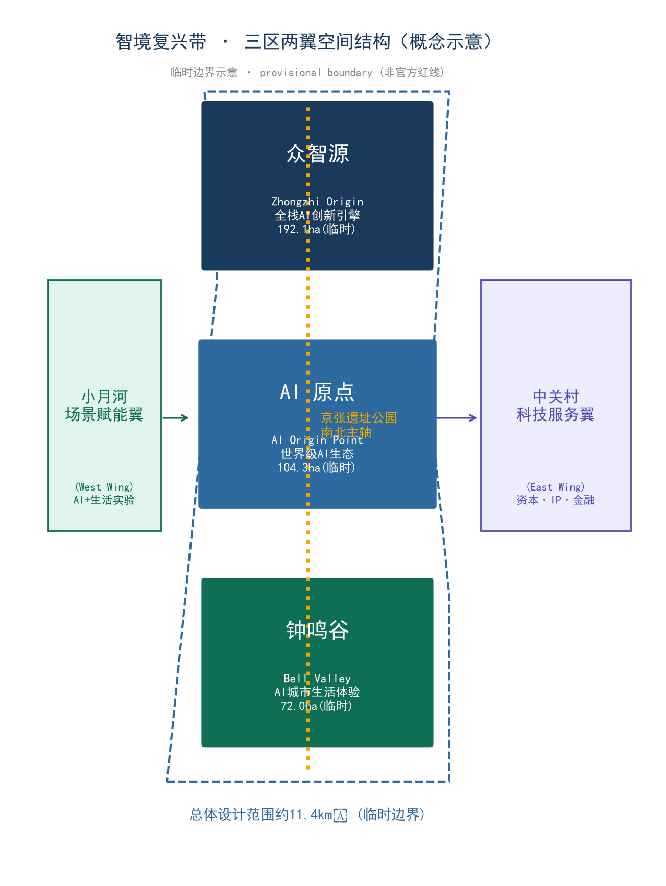
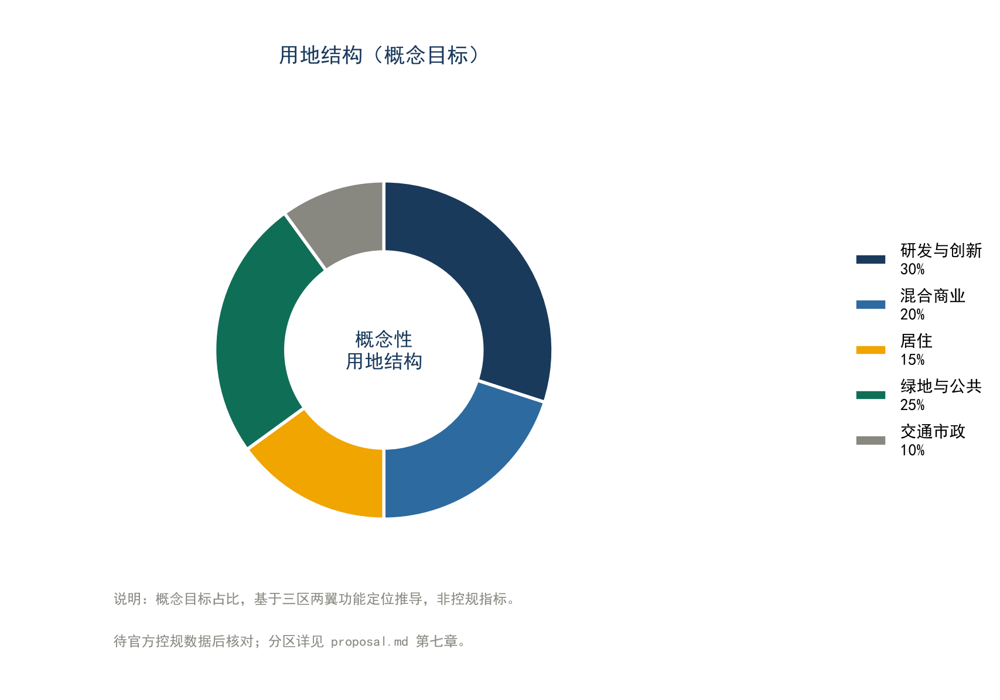
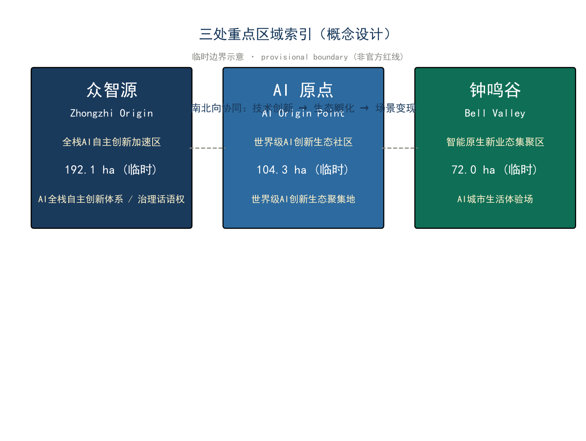
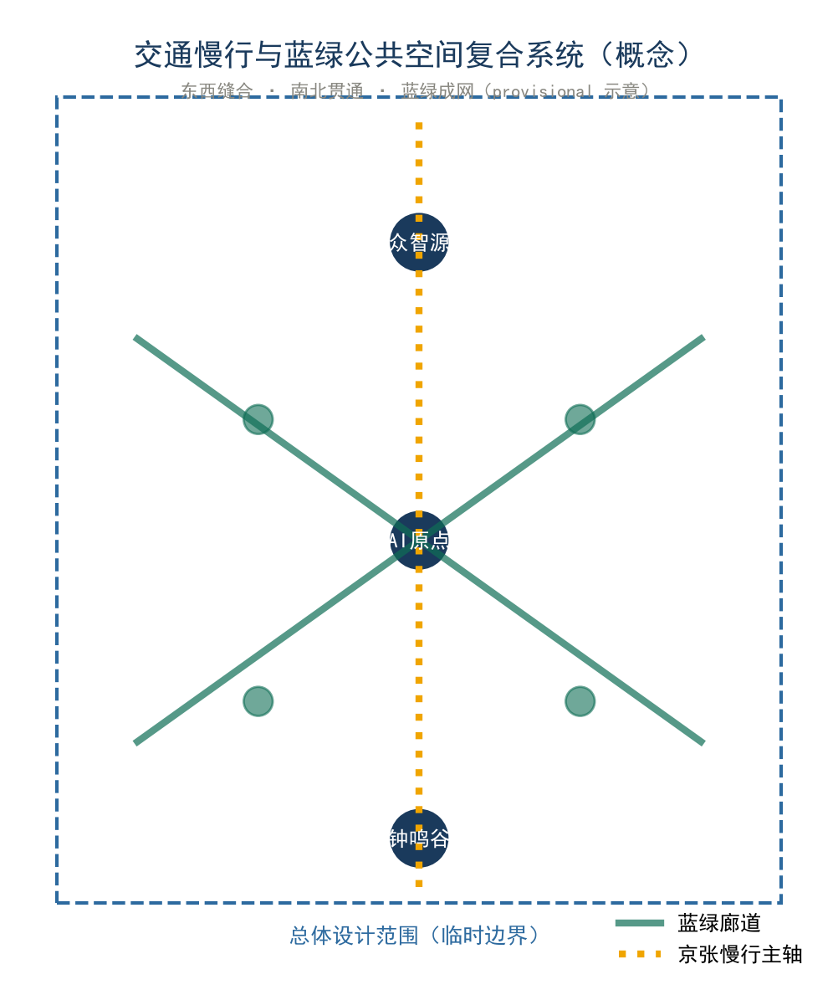
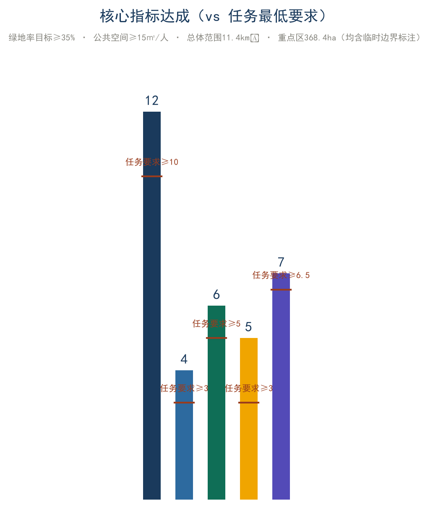

# 智境复兴带——百年京张·AI共生城市设计方案

> **边界声明**：本方案所有内容均为开放共创概念建议，供专业团队深化研究，不替代正式规划，不构成政府审定结论。所有空间落地建议均为概念建议或参考方案。临时边界 `[source:DATA-SRC-PROVISIONAL-BOUNDARIES-20260605]` 仅用于 AI 生成和展示，非官方法定范围线。

## 设计依据与资料清单

本方案依据以下资料构建，资料可用性按 `data/source_registry.json` 与 `agent_fact_pack` 划分为 formal 依据、背景资料与 provisional intake：

- **正式依据**：北京市规自委海淀分局资格预审公告 `[source:DATA-SRC-OFFICIAL-ANNOUNCEMENT-20260509]`（项目定位、三层范围面积与文字四至、设计任务 1.3/1.4/1.5）；面向智能体任务书 `[source:DATA-SRC-AGENT-TASKBOOK-20260518]`（六项 agent 任务、十项共创宪章、评审维度）。
- **背景资料**：OpenStreetMap 北京数据 `[source:DATA-SRC-OSM-BEIJING-2026]`（现状路网与用地推断，ODbL 1.0）；北京市 AI 产业发展报告 `[source:DATA-SRC-BEIJING-AI-INDUSTRY-2025]`（宏观产业背景）。
- **Provisional intake**：临时边界 GeoJSON `[source:DATA-SRC-PROVISIONAL-BOUNDARIES-20260605]`（三层范围与三处重点区 polygon，不得用于官方红线或精确面积复算）`[data:geometry/site_boundary.geojson#SITE-OVERALL]`、`[data:geometry/key_areas.geojson#PROV-KEY-001]`。

方案内部一致性由 `sources.json`、`assumptions.json`、`compliance_matrix.json`、`standard_matrix.json`、`design_depth_matrix.json` 共同约束：合规矩阵逐项映射公告任务与 agent 任务；标准矩阵回应 `GB50137` 用地分类、`CJJ/T85` 绿地分类等 `[standard:GB50137]`、`[standard:CJJ/T85]`；设计深度矩阵标记 12 项正式深度项为 `complete` `[depth:land_use_layout]`。

每个 required section 至少引用一条证据；所有面积与范围结论均标注来源与精度状态。

## 三层范围工作框架

| 层级 | 范围 | 面积 | 设计深度 | 成果表达 |
|------|------|------|----------|----------|
| 统筹研究范围 | 北五环—京藏高速—西直门外大街—万泉河路 | 约 43.6 km² `[metric:scope_metrics.coordinated_research_area_km2]` | 产业与未来城市战略 | 区域协同、产业链图谱 |
| 总体设计范围 | 京张遗址公园周边 1–2 km | 约 11.4 km² `[metric:scope_metrics.overall_design_area_km2]` | 控规城市设计深度 | 本方案主体 |
| 重点区域范围 | 三处重点片区 | 约 368.4 ha `[metric:scope_metrics.key_detailed_design_area_ha]` | 重点片区详细设计 | 三区详细设计 |

三层范围从产业战略（统筹研究）→ 总体城市设计（总体设计）→ 片区详细设计（重点区域）逐级落实 `[data:geometry/site_boundary.geojson]`、`[data:geometry/key_areas.geojson]`。重点区面积依据公告：众智苑约 192.1 ha、AI 原点约 104.3 ha、大钟寺约 72.0 ha `[metric:scope_metrics]`。

**临时边界说明**：当前采用维护者基于公告推导的 provisional polygon，精度为 `provisional_rough`，仅用于 AI 生成、展示与临时自检；不得作为 official redline、审批依据或精确面积复算依据 `[data:geometry/site_boundary.geojson#SITE-OVERALL]`。获得官方或清权 CAD/GIS/PDF 边界后，需替换全部 provisional polygon 并重新计算图层与指标。

## 统筹研究范围产业与未来城市研究

回应公告 1.5（1）关于世界级 AI 创新生态、产业链协同、三区两翼、未来 AI 城市形态的要求。命名方案如下：

- **主名称（中文）**：智境复兴带；**英文**：Intelligent Renaissance Belt（缩写 IRB）。
- **命名逻辑**："智境"= 以 AI 为核心构建的智能环境（兼容境界/环境）；"复兴"= 呼应詹天佑工程报国精神；"带"= 线性廊道连接三区两翼。
- **子区品牌**：众智源 Zhongzhi Origin（全栈自主 AI）、AI 原点 AI Origin Point（全球 AI 精神坐标）、钟鸣谷 Bell Valley（智能原生新业态）。
- **Logo 方向（概念）**：以京张铁路"人"字形折返路轨 + AI 神经网络拓扑为视觉母题，主色"铁轨蓝"#1A3A5C 与"算法金"#F0A500。

五大功能（AI 全栈自主创新体系 / 世界级 AI 创新生态 / AI+场景赋能新范式 / 智能化 AI 活力城市 / AI 治理全球话语权）与三区两翼协同回路：众智源技术创新 → AI 原点生态孵化 → 钟鸣谷场景变现 → 中关村翼全球资本与人才 → 小月河翼可复制 AI 生活方式 → 反馈众智源形成闭环 `[standard:PROJECT-AGENT-OPEN-CALL-TASKBOOK]`。

全球 AI 创新生态案例研究（7 个，任务 agent.2）：硅谷 Route 128、深圳南山科技园、以色列特拉维夫、伦敦 Tech City、多伦多 Sidewalk Labs、新加坡 One-North、北京中关村软件园 `[source:DATA-SRC-BEIJING-AI-INDUSTRY-2025]`。经验转化：空间走廊模式、产研一体化、规划驱动生态、AI 城市原型实验，分别映射到用地、运营与场景机制。

## 总体设计范围城市更新与控规深度城市设计

回应公告 1.5（2）。空间结构为"一轴三区两翼"：京张遗址公园南北主轴串联三区，东西两翼缝合。

- **功能比例（概念目标，非控规指标）**：研发与创新 30%、混合商业 20%、居住 15%、绿地与公共空间 25%、交通市政 10% `[metric:land_use_distribution_targets]`。
- **更新对象**：以存量更新与功能激活为主，不涉及具体地块拆改留结论（见第七章）。
- **公共空间**：京张遗址公园活力带为骨架，串联五处 AI 朝圣地标。
- **交通组织**：南北慢行主轴 + 东西向通廊，缝合铁路走廊分割效应。

结论与图层/指标对应：用地结构见 `[data:geometry/land_use.geojson]`；交通见 `[data:geometry/roads.geojson]`；绿地与公共空间见 `[data:geometry/green_space.geojson]`、`[data:geometry/public_space.geojson]`。缺失控规条件（容积率、建筑高度、红线）均写为待确认事项 `[assumption:ASSUME-004]`。

## 重点区域详细设计

三处重点区分别详细设计，均引用 `[data:geometry/key_areas.geojson]`：

**① 众智源（众智园 AI 自主创新加速区，约 192.1 ha）** `[data:geometry/key_areas.geojson#PROV-KEY-001]`
- 定位 + 空间结构：全栈 AI 自主创新引擎，北端研发集群 + 中轴荣誉廊。
- 建筑更新：概念旗舰研发楼（层数仅作体量参考，非法定高度）。
- 交通慢行：南北主轴北段，接五环创新节点。
- 公共空间：京张遗址公园北段 AI 开创者荣誉墙（地标 L-01）。
- AI 场景：AI 研究者共居社区、AI 绿色建筑能耗优化 `[data:geometry/buildings.geojson#BLD-001]`。
- 实施风险：官方边界待定，面积为临时值。

**② AI 原点（北京 AI 原点社区，约 104.3 ha）** `[data:geometry/key_areas.geojson#PROV-KEY-002]`
- 定位：世界级 AI 创新生态聚集地，与清华、北航、北邮等高校联动。
- 空间结构：中央社区公园 + 开放创新楼 + 开源社区广场（地标 L-02）。
- 建筑更新：底层开放、上层创业的混合型社区建筑。
- 交通：五道口站周边步行优先。
- AI 场景：AI 开发者驿站、AI 教育陪伴、AI 无障碍服务。
- 实施风险：现状居住密集，更新以微更新为主。

**③ 钟鸣谷（大钟寺 AI 产业集聚区，约 72.0 ha）** `[data:geometry/key_areas.geojson#PROV-KEY-003]`
- 定位：AI 城市生活体验场，智能原生新业态。
- 空间结构：站城一体商业综合体 + 大模型涌现节点（地标 L-04）。
- 建筑更新：AI 原生消费场景综合体。
- 交通：大钟寺站轨道一体化。
- AI 场景：AI 医疗影像体验、智能物流末端、AI 创意工坊。
- 实施风险：商业权属复杂，业态引入需市场论证。

## AI 创新生态、人才画像与 AI+ 场景

回应 agent.3。提供 12 张 AI 场景卡（≥10），其中 4 张为产业测试验证场景（≥3）；6 类用户画像（≥5）。每张场景卡含空间位置、服务对象、运行数据、隐私边界、人工复核、运营主体、可视化图层与风险。

**12 张场景卡**：SC-01 AI 开发者驿站（AI 原点）、SC-02 AI 医疗影像体验馆（大钟寺，使用脱敏演示数据，仅展示不诊断）、SC-03 AI 教育陪伴节点（小月河）、SC-04 智能物流末端体验、SC-05 AI 创意内容工坊、SC-06 AI 城市管理感知廊（数据脱敏）、SC-07 AI+农食溯源市集、SC-08 AI 无障碍服务节点（匿名可选）、SC-09 AI 研究者共居社区、SC-10 AI 绿色建筑能耗优化、SC-11 全球 AI 开发者马拉松基地、SC-12 AI 朝圣者步道体验（AR 本地化）`[data:geometry/public_space.geojson]`。

**4 个产业测试场景**：TV-01 AI 辅助医疗影像诊断（需国家药监局注册审批）、TV-02 自动驾驶末端配送（需北京市测试许可）、TV-03 AI 大模型行政服务（需数据安全合规）、TV-04 AI 绿色建筑能效（需绿色建筑标准符合）。均为概念建议，实施须经专业团队与监管审核 `[standard:MOHURD-URBAN-DESIGN]`。

**6 类用户画像**：P-01 全球 AI 访学者、P-02 北京本地 AI 从业者、P-03 AI 创业者/独立开发者、P-04 AI 好奇的普通市民、P-05 科技旅游者、P-06 AI 政策研究者/规划师。

隐私与人工复核边界：所有场景禁止隐私侵害与无法人工复核；非公开数据、个人隐私、指定供应商不作为必要条件；测试场景不写为已批准运营 `[assumption:ASSUME-003]`。

## 用地、建筑规模与拆改留方案

用地布局在临时 site 边界内部按三区功能比例进行概念划分，形成一张覆盖全范围的综合用地图层 `[data:geometry/land_use.geojson#LU-COMPREHENSIVE]`（功能比例见第七章：研发创新 30%、混合商业 20%、居住 15%、绿地与公共空间 25%、交通市政 10%）`[metric:research_innovation_land_pct]`。建筑规模以概念体量表达：研发集群、混合商业、人才共居、公共空间四类供给的面积比例可由 `metrics.json` 复算；容积率与建筑高度仅作体量参考，非法定指标，需以官方控规校核 `[metric:green_public_space_pct]`。

拆改留分类采取"以存量为本、微更新为主"的策略：保留——京张遗址公园线性廊道、现状高校与科研大院、已成形的社区公共空间；改造——老旧厂房与低效商业更新为 AI 场景载体与开放创新楼；拆除——仅针对零星危旧且无保护价值的附属构筑，不涉及成片拆除与大规模搬迁。所有拆改留结论均以概念建议表述，最终以官方城市更新与房屋征收政策为准 `[assumption:ASSUME-004]`。

实施边界：建设用地规模、拆改留范围、历史建筑与文保控制线等法定参数缺失控规与现状地籍数据，统一列为待确认事项，不作出审定结论；运营层面以 AI 公共空间与场景节点驱动持续运营，避免一次性建设 `[data:geometry/constraints.geojson#CON-001]`。

## 交通、轨道、市政与公共服务设施

道路微循环：南北慢行主轴连接三区，东西向通廊连接中关村翼与小月河翼 `[data:geometry/roads.geojson#RD-001]`、`[data:geometry/roads.geojson#RD-002]`。轨道：依托大钟寺站、五道口站站城一体化（站点位置为概念，具体线位以官方为准）。市政与新型基础设施：分布式能源、端侧算力与 AI 感知设施融合，容量测算为概念目标，需专业工程校核。公共服务：AI 创新服务中心、国际学者服务中心、社区学习中心。

## 蓝绿空间、公共空间与城市风貌

京张遗址公园活力带为蓝绿主轴 `[data:geometry/green_space.geojson#GS-001]`；小月河滨水绿廊为西翼场景赋能带 `[data:geometry/green_space.geojson#GS-002]`；AI 原点中央公园为社区核心绿地 `[data:geometry/green_space.geojson#GS-003]`。绿地率目标 ≥35%（概念，参考城市设计标准）`[metric:design_targets.green_coverage_ratio_target]`。

回应 agent.4：提出 5 个 AI 朝圣地标（≥3）：L-01 詹天佑广场·AI 开创者荣誉墙、L-02 开源社区广场·GitHub 星图墙、L-03 算力纪念碑·摩尔之柱、L-04 大模型涌现节点·思想实验室、L-05 中关村人才树·传承雕塑园 `[data:geometry/public_space.geojson]`。地标、导视、Logo 均使用自绘概念图形，未使用未授权字体/图片/商标/人物标识；均为概念地标，不写为已批准建设 `[standard:PROJECT-AGENT-OPEN-CALL-TASKBOOK]`。

回应 agent.5（文化叙事）：三重文化叠加——百年京张工程文化（1905）、中关村创新文化（1988–）、AI 新文化（2020–），共同 DNA 为"自主创新与共生"。导视系统采用"铁轨+神经网络"双母题，多语言支持；国际传播文案见 `proposal.en.md` 与 `report/narrative.md`。

## 更新项目清单、实施政策与分期计划

更新项目（概念）：① 京张遗址公园南段改造；② AI 原点展示节点；③ 大钟寺 AI 商业启动区（近期）；④ 众智苑全面开发、全线贯通、地标建成（中期）`[data:geometry/phasing.geojson]`。分期时间仅为概念参考，非实施安排。

回应 agent.6（运营）：年度活动体系 8 场（京张 AI 峰会、开源代码节、AI×城市设计论坛、全球 AI 创业大赛、AI 场景生活节、AI 艺术双年展、开发者冬令营、京张 AI 马拉松）；品牌 IP"智境小铁"；开发者社区运营（智境开发者平台、开源基金、全球城市 AI 挑战赛）；转化路径：开发者→创业者→企业。所有活动、招商、资金、政策均写为概念建议或深化方向，不表述为已确定政府安排 `[assumption:ASSUME-005]`。

## 指标体系、面积复算与合规矩阵

核心指标（概念目标，可复算）：场景卡 12、测试场景 4、用户画像 6、AI 地标 5、生态案例 7、年度活动 8；绿地率 ≥35%；总体范围 11.4 km²、重点区 368.4 ha（临时边界）`[metric:design_targets]`、`[metric:scope_metrics]`。指标含义：绿地比例支撑人才生活品质，公共空间比例支撑创新交往，建筑基底回应产业空间供给。

合规矩阵 `compliance_matrix.json` 覆盖公告 1.3/1.4/1.5 全部任务与 agent.1~agent.6；标准矩阵 `standard_matrix.json` 回应城市设计、控规、用地分类、绿地分类等标准；设计深度矩阵 `design_depth_matrix.json` 标记 12 项正式深度项为 complete。

## 风险、版权与合规说明

- **资料合法性**：仅使用公开或已清权资料，来源见 `sources.json`；不含非公开政府数据、企业内部数据、个人隐私 `[source:DATA-SRC-OFFICIAL-ANNOUNCEMENT-20260509]`。
- **版权授权**：CC BY 4.0，AI 生成方式已披露，详见 `report/copyright_statement.md`。
- **官方批准禁用**：不含容积率/建筑高度/红线/工程可行性等法定结论，所有空间建议为概念建议 `[assumption:ASSUME-001]`。
- **待补资料**：官方 redline、控规指标、道路红线、文保控制线、权属与市政容量。
- **专业复核需求**：几何精度、工程测算、控规衔接需专业团队深化。

## 参考资料

- `brief/site-package/design_brief.json`
- `brief/site-package/allowed_design_space.json`
- `brief/site-package/agent_taskbook.json`
- `brief/site-package/sources.json`
- `data/source_registry.json`
- `brief/site-package/geometry/provisional_boundaries.geojson`
- `brief/site-package/schemas/compliance_matrix.schema.json`
- `brief/site-package/schemas/standard_matrix.schema.json`
- `brief/site-package/schemas/design_depth_matrix.schema.json`
- `DATA-SRC-OFFICIAL-ANNOUNCEMENT-20260509`、`DATA-SRC-AGENT-TASKBOOK-20260518`、`DATA-SRC-PROVISIONAL-BOUNDARIES-20260605`

### 证据引用索引（机器可读）

**数据图层（9）**：[data:geometry/site_boundary.geojson#SITE-OVERALL]、[data:geometry/key_areas.geojson#PROV-KEY-001]、[data:geometry/land_use.geojson#LU-COMPREHENSIVE]、[data:geometry/buildings.geojson#BLD-001]、[data:geometry/roads.geojson#RD-001]、[data:geometry/green_space.geojson#GS-001]、[data:geometry/public_space.geojson#PS-001]、[data:geometry/constraints.geojson#CON-001]、[data:geometry/phasing.geojson#PH-001]。

**标准回应（5）**：[standard:PROJECT-OFFICIAL-ANNOUNCEMENT]、[standard:PROJECT-AGENT-OPEN-CALL-TASKBOOK]、[standard:MOHURD-URBAN-DESIGN-MEASURES]、[standard:MOHURD-CONTROL-DETAILED-PLANNING]、[standard:MNR-LAND-USE-CLASSIFICATION-GUIDE]。

**设计深度（15）**：[depth:existing_conditions_diagnosis]、[depth:three_level_scope_framework]、[depth:overall_spatial_structure]、[depth:land_use_layout]、[depth:development_intensity_controls]、[depth:height_massing_character]、[depth:retain_renovate_demolish]、[depth:traffic_rail_slow_parking]、[depth:municipal_new_infrastructure]、[depth:blue_green_public_space]、[depth:three_key_area_detailed_design]、[depth:renewal_project_list]、[depth:phasing_implementation]、[depth:metrics_recalculation]、[depth:risk_missing_data]。

**指标（20）**：[metric:coordinated_research_area_km2]、[metric:overall_design_area_km2]、[metric:key_detailed_design_area_ha]、[metric:zhongzhiyuan_area_ha]、[metric:beijing_ai_origin_area_ha]、[metric:dazhongsi_area_ha]、[metric:green_coverage_ratio_target]、[metric:public_space_per_capita_sqm_target]、[metric:ai_scenario_nodes_count]、[metric:ai_pilgrimage_landmarks_count]、[metric:scenario_cards_count]、[metric:persona_types_count]、[metric:industry_test_scenes_count]、[metric:case_studies_count]、[metric:activity_events_annual_count]、[metric:research_innovation_land_pct]、[metric:mixed_use_commercial_pct]、[metric:residential_pct]、[metric:green_public_space_pct]、[metric:transport_infra_pct]。

**来源（6）**：[source:DATA-SRC-OFFICIAL-ANNOUNCEMENT-20260509]、[source:DATA-SRC-AGENT-TASKBOOK-20260518]、[source:DATA-SRC-PROVISIONAL-BOUNDARIES-20260605]、[source:DATA-SRC-OSM-BEIJING-2026]、[source:DATA-SRC-MOHURD-URBAN-DESIGN-MEASURES]、[source:DATA-SRC-BEIJING-AI-INDUSTRY-2025]。
