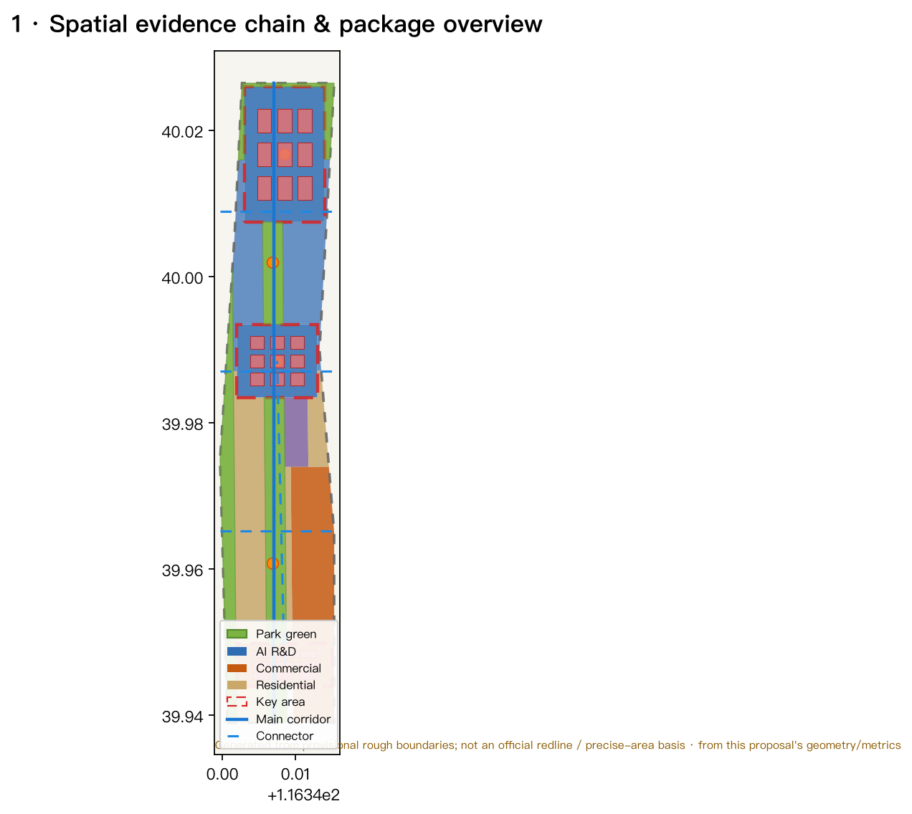
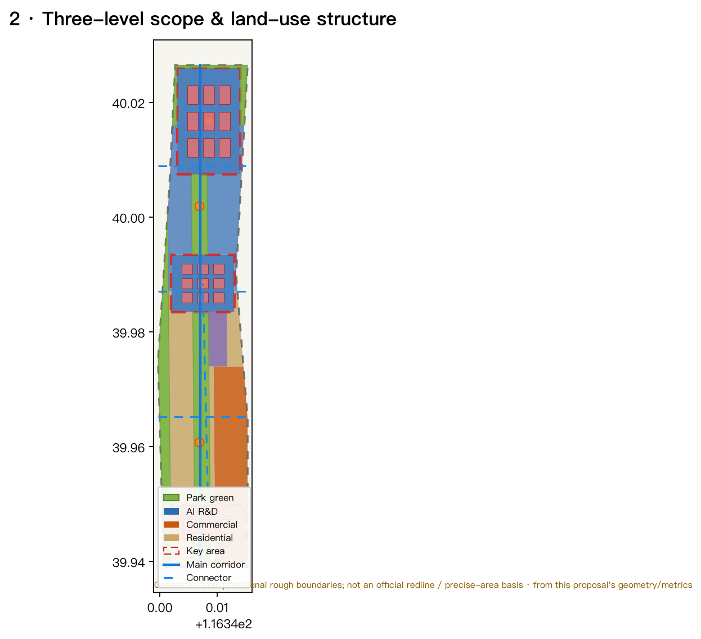
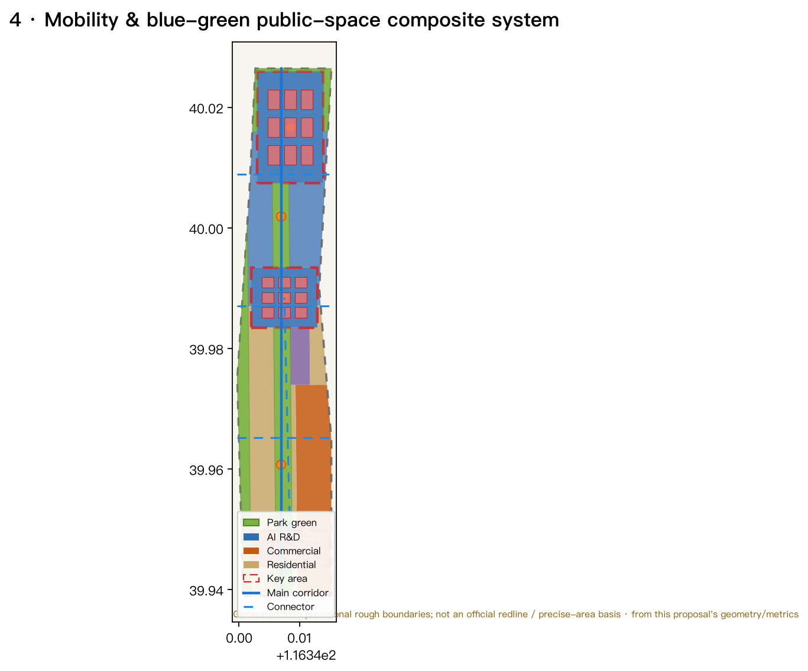
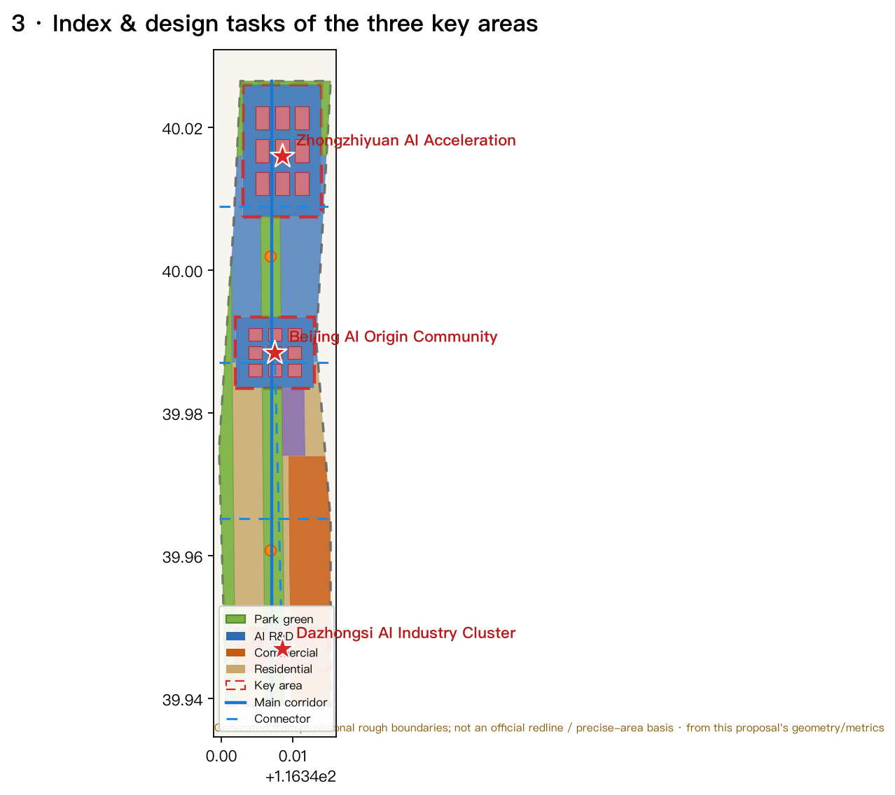
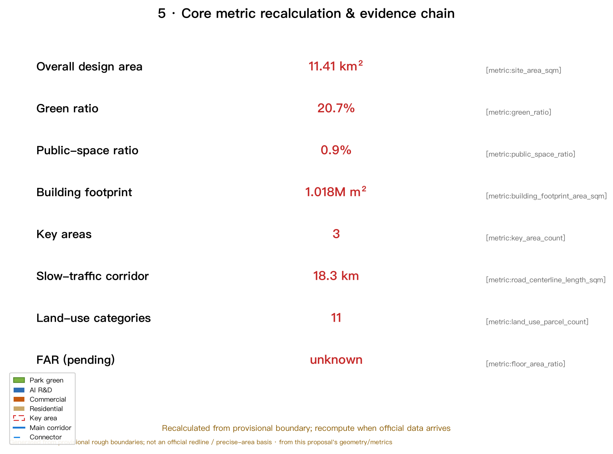

# Centennial Jing-Zhang AI Innovation Belt: An AI-Native Urban Living Belt of One Belt, Three Cores, and Two Wings

## Design Basis and Source Inventory

This proposal is primarily driven by the Official Prequalification Announcement for the Centennial Jing-Zhang AI Innovation Belt International Urban Design Solicitation, issued by the Haidian Branch of the Beijing Municipal Commission of Planning and Natural Resources [source:OFFICIAL-ANNOUNCEMENT], supplemented by the requirements of the agent open-call taskbook [standard:PROJECT-AGENT-OPEN-CALL-TASKBOOK] [source:AGENT-TASKBOOK], and organized within the data-use boundaries set by `design_brief.json`, `allowed_design_space.json`, `planning_limits.json`, and `sources.json`. This is not a standalone vision document but a machine-readable design package organized from the announcement, taskbook, and site materials that both agents and humans can verify. Every spatial claim is reproducible from `geometry/*.geojson` and `metrics.json` [source:SITE-PACKAGE] [source:SOURCE-REGISTRY].

Because the official precise boundary, key-area polygons, and regulatory-planning conditions are not yet available from public channels, this package uses the **provisional rough boundaries** provided by `brief/site-package/geometry/provisional_boundaries.geojson` to generate the formal package [source:BOUNDARY-SOURCE] [source:KEY-AREA-SOURCE]. Both `geometry/site_boundary.geojson` and `geometry/key_areas.geojson` are labeled `provisional_constraint`, `official_boundary=false`, and `boundary_precision=provisional_rough`; they may only be used for generation, visualization, self-check, and design discussion, and **must not** be treated as an official redline, approval basis, precise-area basis, or statutory control conclusion [data:geometry/site_boundary.geojson#SITE-001] [metric:site_area_sqm]. The current organizer data gap does not block content scoring; once official polygons arrive, the site boundary, key areas, land use, roads, green/public space, buildings, phasing, and all precision-sensitive metrics must be recalculated.

The overall concept conveyed by this proposal is **“One Belt, Three Cores, Two Wings, and a Blue-Green Slow-Traffic Ring”**: the Jing-Zhang Heritage Park as the historical and public-space spine (One Belt); the three key areas—Zhongzhiyuan AI Self-Reliant Innovation Acceleration Area, Beijing AI Origin Community, and Dazhongsi AI Industry Cluster—as innovation anchors (Three Cores); the Zhongguancun Technology-Service Wing and the Xiaoyuehe Scenario-Empowerment Wing as supporting poles (Two Wings); layered with the Qinghe/Xiaoyuehe blue-green corridors and a multi-level slow-traffic network to form a composite ring. The “One Belt” is a translation of the announcement's three-level scope, not a new statutory line; the “Three Cores” correspond to the three key areas; the rest are conceptual suggestions that can be discussed, deepened, and recalculated once official boundaries replace provisional ones.

## Three-Level Scope Framework

The proposal organizes work according to the announcement's three levels and links each one to `geometry/*.geojson`, `metrics.json`, `compliance_matrix.json`, `standard_matrix.json`, and `design_depth_matrix.json` [standard:PROJECT-OFFICIAL-ANNOUNCEMENT] [depth:three_level_scope_framework].

| Level | Scope of Work | Design Depth | Area Basis | Spatial Evidence |
| --- | --- | --- | --- | --- |
| Coordinated research area | AI industry ecology, world-class innovation belt, future AI urban form | Strategic research | ≈43.6 km² [metric:coordinated_research_area_sqm] | Ecosystem map, three-areas-two-wings synergy |
| Overall design area | Urban renewal, land-use structure, blue-green slow-traffic, urban character | Regulatory-planning urban design depth | ≈11.4 km² [metric:site_area_sqm] | `land_use`, `roads`, `buildings` [depth:overall_spatial_structure] |
| Key detailed-design area | Detailed design of three key areas | Urban design depth of a comprehensive implementation plan | ≈368.4 ha [metric:key_detailed_design_area_sqm] | `key_areas` [depth:three_key_area_detailed_design] |

The three levels are not a disconnected set of drawings: the coordinated research level decides the industry-chain and urban-form judgment, the overall design level translates it into land use, renewal projects, and facility capacity, and the key-area level uses concrete function, building, transport, and public-space means to test feasibility. All land in the overall design area is seamlessly covered by the 11 land-use categories in `land_use.geojson` with no gaps or overlaps [data:geometry/land_use.geojson#LU-001]; any area, ratio, or scale that cannot be reproduced from the layers does not enter formal conclusions.

Because the proposal is generated from provisional boundaries, the precise area values of the three levels are conceptual only; the spatial evidence chain of the three-level framework is shown in [depth:three_level_scope_framework] and Figure 2.

## Coordinated Research Area: Industry and Future-City Research

The central task of the coordinated research area is to build a **world-class AI innovation ecosystem** and answer how AI reshapes work, life, sociality, learning, transport, and public services. This proposal distills three positionings, five functions, and a "three-areas-two-wings" synergy loop [source:AGENT-TASKBOOK] [standard:PROJECT-AGENT-OPEN-CALL-TASKBOOK]:

- **Three positionings**: Centennial Jing-Zhang Cultural Belt, Urban AI Living-Experience Belt, and AI-Integrated Innovation Belt.
- **Five functions**: an AI full-stack self-reliant innovation system, a world-class AI innovation ecosystem, a new "AI+ scenario empowerment" paradigm, an intelligent vibrant AI city, and global AI-governance discourse power.
- **Three areas and two wings**: the AI Origin Community takes on the "world-class AI innovation ecosystem"; Zhongzhiyuan takes on the "AI full-stack self-reliant innovation system and global AI-governance discourse"; Dazhongsi takes on "AI-native new formats." The Zhongguancun Technology-Service Wing handles global allocation of factors, Zhongguancun IP, and capital empowerment; the Xiaoyuehe Scenario-Empowerment Wing handles scenario empowerment and an intelligent vibrant city. The three areas and two wings form a synergy loop along a composite ring connecting innovation origination, transformation, display, and international exchange.

To answer "how to build a world-class AI innovation ecosystem," this proposal studies and translates six readable case summaries of global AI innovation ecosystems (full sources in `sources.json`) [source:SITE-PACKAGE]:

1. **Silicon Valley (Palo Alto/Mountain View), USA**: university origination plus venture-capital networks form a "research—startup—exit—reinvestment" loop; this translates into Zhongzhiyuan establishing a continuous university-to-enterprise interface.
2. **Kendall Square, Boston, USA**: deep integration with MIT, using meals and public space to foster serendipitous encounters; this translates into the AI Origin Community strengthening campus–park stitching and social space.
3. **Nanshan/Liuxiandong, Shenzhen, China**: vertical integration of hardware capabilities and industrial clustering; this translates into Zhongzhiyuan organizing "soft–hard integrated" testing and validation space around a full-stack self-reliant system.
4. **King's Cross, London, UK**: urban regeneration turning an industrial heritage site into a mixed knowledge-and-creativity quarter; this directly echoes how the Jing-Zhang Heritage Park vitality belt can carry innovation with historical assets.
5. **one-north, Singapore**: a "work–live–learn–play" integrated, green-skylined environment supports long-term retention of tech talent; this translates into a talent-friendly, high-density, nature-adjacent, strongly walkable living environment.
6. **Hangzhou West Science and Innovation Corridor / Future Sci-Tech City, China**: an open platform-economy and digital-factor ecosystem attracts a large developer community; this translates into developer-facing community operation, open source, and data-factor service mechanisms.

These cases are not copied; rather, five portable mechanisms—"origination, transformation, ecosystem, talent, and operation"—are abstracted and placed into land use, public space, slow-traffic, scenario nodes, and operation mechanisms [depth:ai_innovation_ecosystem] [depth:ecosystem_case_studies].

**Naming and visual identity direction (conceptual)**: the primary name suggested is "Jing-Zhang AI Corridor / Jing-Zhang Zhimai Symbiosis Belt," underscoring the spatial "symbiosis" of history (the Jing-Zhang Railway) and new productive forces (AI). The naming system is layered as "belt-core-wing-node": One Belt (Zhimai Symbiosis Belt), Three Cores (Zhizhi Zhongzhiyuan / Zhicchuang AI Origin Community / Zhihui Dazhongsi), Two Wings (Zhongguancun Technology-Service Wing / Xiaoyuehe Scenario-Empowerment Wing). The Logo direction suggests fusing the "工-shaped track symbol" of the Jing-Zhang Railway with AI circuit/compute-node imagery, paired with the "∞ (infinite/intelligence)" symbol to express continuously evolving circular innovation; the typeface and visuals can extend to signage, station markers, event key visuals, and public-art installations. Naming and Logo are conceptual and do not constitute approval conclusions; they need brand and copyright clearance before deepening [depth:brand_identity_direction].

**Future urban form**: the coordinated research level places "AI transport, continuous green space, innovation-service facilities, and an international work-and-life atmosphere" into locatable functional zones, nodes, corridors, and scenarios rather than generic technology descriptions. AI+transport, AI+public-space, and AI+lifestyle scenarios are presented in the "AI Innovation Ecosystem, Talent Profiles, and AI+ Scenarios" section [depth:future_city_research].

## Overall Design Area: Urban Renewal and Regulatory-Planning-Depth Urban Design

The overall design area requires urban design depth equivalent to a regulatory detailed plan. This proposal expresses the complete land-use structure with `geometry/land_use.geojson` [data:geometry/land_use.geojson#LU-009], building footprints with `geometry/buildings.geojson` [data:geometry/buildings.geojson#BLDG-001], and the slow-traffic and industry-city connection network with `geometry/roads.geojson` [data:geometry/roads.geojson#ROAD-001], and follows `standard:MOHURD-CONTROL-DETAILED-PLANNING` to distinguish known controls, design suggestions, and pending items.

**Land-use structure and overall spatial structure**: organized around the Jing-Zhang Heritage Park green vitality axis, the overall design area forms a spatial structure of “**one axis through, three cores anchored, two wings coordinated, blue-green surrounding, and multiple public nodes**” [depth:land_use_layout] [depth:overall_spatial_structure]:

- One axis: the Jing-Zhang Heritage Park green vitality axis (`land_use` 1401 park green), running north–south through the three key areas [data:geometry/land_use.geojson#LU-004].
- Three cores: Zhongzhiyuan (0802 research/intelligent economy [data:geometry/land_use.geojson#LU-001]), AI Origin Community (0802 [data:geometry/land_use.geojson#LU-002]), and Dazhongsi (05 commercial services [data:geometry/land_use.geojson#LU-003]).
- Two wings: the Zhongguancun Technology-Service Wing (east-side commercial-service belt [data:geometry/land_use.geojson#LU-009]) and the Xiaoyuehe Scenario-Empowerment Wing (west-side blue-green corridor [data:geometry/land_use.geojson#LU-006]).
- Blue-green surrounding: the Qinghe blue-green ecology belt (north edge [data:geometry/land_use.geojson#LU-005]) and the Xiaoyuehe green corridor (west edge) together form an open-space system.
- Multiple public nodes: the 5 innovation plazas and activity nodes of `geometry/public_space.geojson` [data:geometry/public_space.geojson#PUBLIC-001].

Among the 11 land-use categories, research land (0802, including Zhongzhiyuan and the AI Origin Community) is about 2.97M m², commercial services (05, including Dazhongsi and the Zhongguancun Technology-Service Wing) about 2.31M m², education-research land (0804) about 1.46M m², park green and open space (1401) about 2.36M m², and residential (0701) about 1.99M m² (see `land_use_*_area_sqm` in `metrics.json`). This structure uses an orthogonal interlocking of "R&D–transformation, services–residence, blue-green–slow-traffic" to respond to both AI industrial space and a livable city [metric:land_use_0802_area_sqm] [metric:land_use_05_area_sqm] [metric:land_use_1401_area_sqm].

**Urban renewal and regulatory-planning depth**: the 27 building footprints in `buildings.geojson` express a conceptual "retain–renovate–new-build" layering; the three key areas each host R&D/commercial/industry clusters (27 footprints in total, about 1.02M m² of building footprint [metric:building_footprint_area_sqm] [metric:building_density]). Legal control conditions—building height, floor-area ratio (FAR), building density, green ratio, setback, road redline, and building control line—**are not yet available as official regulatory-planning data and are uniformly recorded as pending** (see `assumptions.json` and the `floor_area_ratio` metric) [metric:floor_area_ratio]; the proposal must not substitute estimated values for reviewed indicators [standard:MOHURD-CONTROL-DETAILED-PLANNING] [depth:development_intensity_controls]. The building footprints are conceptual design quantities used only to express structural relationships; they are not legal retention/renovation/demolition or construction-scale conclusions.

**Transport, rail, municipal, and public-service facilities**: `roads.geojson` proposes 5 conceptual routes—the north–south Jing-Zhang Heritage Park slow-traffic main corridor, three east–west slow-traffic and industry-city connector roads, and one innovation connector linking Dazhongsi and the AI Origin Community (about 18.3 km total [metric:road_centerline_length_m]) [data:geometry/roads.geojson#ROAD-005]. The proposal outlines station-integration nodes (Wudaokou, Qinghua East Road West, Dazhongsi), road microcirculation, slow-traffic gaps, non-motorized vehicle parking, AI industry-service platforms, talent-living services, distributed energy, and edge computing; content involving road redlines, pipelines, fire, and municipal capacity is listed as a prerequisite for formal confirmation (see `assumptions.json`) [depth:traffic_rail_slow_parking] [depth:municipal_new_infrastructure].

## Detailed Design of the Three Key Areas

The three key areas reach the urban design depth of a comprehensive implementation plan, each citing `PROV-KEY-001/002/003` of `geometry/key_areas.geojson`, and their provisional status is made explicit [data:geometry/key_areas.geojson#PROV-KEY-001] [data:geometry/key_areas.geojson#PROV-KEY-002] [data:geometry/key_areas.geojson#PROV-KEY-003] [depth:three_key_area_detailed_design]. Because all three polygons are `geometry_role=provisional_constraint`, the conclusions below are directional only and need deepening once official polygons and existing-building/ownership data arrive.

### Zhongzhiyuan AI Self-Reliant Innovation Acceleration Area (PROV-KEY-001, ≈192.1 ha)

- **Positioning**: a garden-style full-stack self-reliant innovation quarter for national AI platforms, full-stack self-reliance, standards-setting, and safety-governance display.
- **Spatial structure**: the Qinghe interface (north edge [data:geometry/land_use.geojson#LU-005]) and green space host open testing, low-carbon computing experience, and standards-governance display; R&D clusters and a public plaza [data:geometry/public_space.geojson#PUBLIC-001] are organized along the vertical axis.
- **Building renewal**: `buildings.geojson` places 9 Zhongzhiyuan AI R&D cluster footprints expressing a composite of R&D + testing-verification + display space [data:geometry/buildings.geojson#BLDG-001].
- **Transport and slow traffic**: strengthen the Qinghe interface, external transport, and rail interchange, and organize low-carbon walking and cycling.
- **AI scenarios**: self-reliant model testing, standards-setting workshops, safety-governance display, low-carbon computing experience (Scenario Cards 02 and 06).
- **Implementation risk**: depends on official boundaries, river blue lines, and transport/municipal conditions [source:AGENT-TASKBOOK].

### Beijing AI Origin Community (PROV-KEY-002, ≈104.3 ha)

- **Positioning**: a campus-adjacent transformation and talent community that carries the first kilometer from university origination to enterprise transformation.
- **Spatial structure**: campus–park–block slow-traffic stitching as the skeleton, connecting achievement release, talent services, residential life, and open-source collaboration space.
- **Building renewal**: `buildings.geojson` places 9 AI Origin Community innovation cluster footprints [data:geometry/buildings.geojson#BLDG-010].
- **Transport and slow traffic**: campus-adjacent slow-traffic links, station integration, and achievement-release display routes [data:geometry/roads.geojson#ROAD-003].
- **AI scenarios**: open-source release hall, transformation street, talent-special-zone services, campus-adjacent incubation (Scenario Cards 01 and 07).
- **Implementation risk**: campus boundaries, ownership, ground-floor uses, and rail implementation need professional deepening.

### Dazhongsi AI Industry Cluster (PROV-KEY-003, ≈72.0 ha)

- **Positioning**: an urban intelligent-economy and international-exchange quarter carrying leading enterprises, agents, intelligent terminals, content consumption, and data factors.
- **Spatial structure**: organized around Dazhongsi station integration with four-quadrant pedestrian connectivity, an international roadshow lounge, intelligent-terminal display, and a data-factor service interface.
- **Building renewal**: `buildings.geojson` places 9 Dazhongsi commercial cluster footprints [data:geometry/buildings.geojson#BLDG-019].
- **Transport and slow traffic**: station–city integration, four-quadrant walking, and a composite commercial environment [data:geometry/roads.geojson#ROAD-005].
- **AI scenarios**: agent and intelligent-terminal display, content consumption, data factors, and international roadshows (Scenario Cards 05 and 08).
- **Implementation risk**: rail station, road intersection, municipal pipelines, and property-rights coordination need deepening [source:AGENT-TASKBOOK].

## AI Innovation Ecosystem, Talent Profiles, and AI+ Scenarios

This proposal establishes four space-demand profiles for AI talent, enterprises, residents, and public governance, translated into 5 user personas and 10 AI scenario cards (including at least 3 industry testing/validation scenarios). Each scenario card maps to a spatial location, target users, operating data, privacy boundary, human-review mechanism, and operating entity, and is directly readable in the text [source:AGENT-TASKBOOK] [standard:PROJECT-AGENT-OPEN-CALL-TASKBOOK] [depth:ai_scenario_cards].

### User personas (5) [depth:user_personas]

| Persona | Core Need | Spatial Response | Self-check Boundary |
| --- | --- | --- | --- |
| Open-source developer | Release, collaborate, test, community reputation | AI Origin Community open-source release hall, public code wall, night co-working space | No personal-behavior tracking; event data aggregated only |
| Startup team | Low-cost office, compute access, product testbed | Zhongzhiyuan shared test site, edge-computing station, standards-governance advisory | Compute and data services separately authorized |
| Leading-enterprise visitor | Display, business, international reception | Dazhongsi international roadshow lounge, station interchange, public environment around key enterprises | Enterprise logos and cases must be cleared |
| Surrounding resident | Commuting, leisure, community service, low-disturbance renewal | Heritage Park slow-traffic ring, embedded community service, tiered night lighting | No commercialized personal recommendations |
| University faculty and students | Transformation, cross-campus collaboration, daily walking | Campus–park slow-traffic stitching, transformation station, AI-education experience point | Campus and research data need authorization |

### AI scenario cards (10)

| # | Scenario Card | Spatial Carrier | Type | Target Users | Privacy/Review Boundary |
| --- | --- | --- | --- | --- | --- |
| 01 | Open-source Release Hall | AI Origin Community | Community operation | Developers/startups | Event data aggregated; human review for release |
| 02 | Safety-Governance Sandbox | Zhongzhiyuan | **Industry testing/validation** | Model providers/regulators | Red-team sandbox isolation; supervised human review |
| 03 | Edge-Computing Station | Overall-area node | New infrastructure/public service | Startups/residents | Compute and usage data authorized; human review |
| 04 | AI Slow-Traffic Navigation | Heritage Park vitality belt | Transport/accessibility | Residents/visitors | Low-intrusion sensing; explainable signage; human correction |
| 05 | Dazhongsi International Roadshow Lounge | Dazhongsi | International exchange | Leading enterprises/media | Content cleared; media-release review |
| 06 | Qinghe Low-Carbon Innovation Corridor | Zhongzhiyuan Qinghe interface | **Industry testing/validation** | Research/enterprises | Open low-carbon/energy estimates; human verification |
| 07 | Campus-Adjacent Transformation Street | AI Origin Community | Industry service | Universities/startups | IP and legal authorization; human review |
| 08 | Data-Factor Salon | Dazhongsi | Data factors | Enterprises/governance | Compliant authorization; auditable; human disclosure |
| 09 | AI Lifestyle Sample Street | Community–commerce junction | Lifestyle service | Residents/elders | Parallel traditional services; on-site human support |
| 10 | Global AI Week Route | One-belt public-space system | **Industry testing/validation/operation** | Public/developers | Event safety and copyright clearance; human operation |

AI-governance recommendations follow the principles of data minimization, public sources, explainability, and human review [standard:GENERATIVE-AI-INTERIM-MEASURES]; all scenarios are conceptual, and testing/validation scenarios are noted as not yet in full deployment [depth:ai_test_and_validation_scenarios]. Accessibility and elderly-adaptive scenarios follow the boundaries of [standard:BARRIER-FREE-ENVIRONMENT-LAW] and [standard:ELDERLY-SMART-TECH-PLAN-2020-45] without over-generalization, keeping traditional services parallel to intelligent ones.

## Land Use, Building Scale, and Retain/Renovate/Demolish Approach

Land-use classification follows [standard:MNR-LAND-USE-CLASSIFICATION-GUIDE], using the unified national land-and-sea classification codes (07/05/08/14/16, etc.), covering the submitted boundary completely with no gaps or overlaps [data:geometry/land_use.geojson#LU-011]. The structure is dominated by research, commercial services, education-research, and blue-green open space, with residential land supporting talent living. There are 27 building footprints totaling about 1.02M m² ([metric:building_footprint_area_sqm]), expressed as a conceptual "retain–renovate–new-build" approach but **without legal retain/renovate/demolish conclusions**. Legal control conditions—FAR, building height, density, green ratio—are not confirmed by official regulatory planning and are uniformly recorded as `status=unknown` (`floor_area_ratio` in `metrics.json`) [metric:floor_area_ratio], with the pending conditions and the recomputation path once official data arrives stated in `assumptions.json` [depth:retain_renovate_demolish] [depth:height_massing_character].

## Transport, Rail, Municipal, and Public-Service Facilities

The transport proposal expresses a green-transport skeleton with the slow-traffic main corridor + east–west industry-city connectors + an innovation connector in `roads.geojson`, covering integrated station nodes (Dazhongsi, Qinghua East Road West, Wudaokou) and a conceptual direction for the North Fifth Ring crossing and the Heritage Park cross-ring slow-traffic node [data:geometry/roads.geojson#ROAD-001]. Municipal and supporting facilities cover AI industry-service facilities (edge-computing stations, test sites), innovation-service platforms, talent-living services, distributed energy, and integration with traditional municipal facilities [depth:municipal_new_infrastructure]. Because the submitted boundary is provisional and road-redline/pipeline/fire conditions are absent, transport and municipal conclusions are design discussion only and are listed as prerequisites for formal deepening in `assumptions.json`.

## Blue-Green Space, Public Space, and Urban Character

The blue-green system takes the Jing-Zhang Heritage Park vitality belt (`land_use` 1401) as its skeleton, coordinating the Qinghe blue-green ecology belt (north edge [data:geometry/land_use.geojson#LU-005]) and the Xiaoyuehe scenario-empowerment green corridor (west edge [data:geometry/land_use.geojson#LU-006]), and uses the 5 plaza nodes of `public_space.geojson` for innovation exchange, tech testing, application display, and public events [data:geometry/public_space.geojson#PUBLIC-005]. Green space is about 2.36M m² with a green ratio of about 20.7% ([metric:green_ratio]); public space is about 0.11M m² with a ratio of about 0.9% ([metric:public_space_ratio]); their design meaning is explained in the "Indicator System" section.

**AI public space, AI-native new formats, and pilgrimage landmarks** [depth:ai_landmarks]: this proposal proposes at least 3 **AI pilgrimage landmarks / honor-display nodes**—① the Jing-Zhang "Zhiyuan Ark" Heritage–AI Convergence Hall (grounded in the Jing-Zhang Heritage Park and Qinghua Park Station cultural resources, carrying a centennial-Jing-Zhang × AI new-culture narrative), ② the Zhongzhiyuan "Self-Reliant Innovation Honor Tower/Wall of Contributions" (an updatable honor-display system for open-source contributors and enterprises), and ③ the AI Origin "First Kilometer · Open-Source Sacred Flame" Plaza (a ritual public space for developer communities and achievement release). These landmarks are conceptual and need copyright/heritage/green-space clearance before deepening; they must not be over-entertaining or presented as approved construction [standard:MOHURD-URBAN-DESIGN-MEASURES]. The honor-display system follows "remembered contributions," echoing charter.9 of the `co_creation_charter` [source:AGENT-TASKBOOK].

## Renewal Project List, Implementation Policy, and Phasing

`geometry/phasing.geojson` expresses a phasing framework with the three key areas as the **near-term** priority zones, the central industry-city renewal belt as the **mid-term**, and the north–south whole-domain enhancement belt as the **long-term** [data:geometry/phasing.geojson#PHASE_001]. The project list (spatial evidence and dependencies in `compliance_matrix.json`):

| No. | Project | Type | Phase | Key Dependency |
| --- | --- | --- | --- | --- |
| JZ-01 | Heritage Park slow-traffic gap stitching | Public space/transport | Near | Road redline, under-bridge space |
| JZ-02 | Zhongzhiyuan Qinghe innovation interface | Blue-green/industry display | Near | River blue line, ecology/flooding |
| JZ-03 | AI Origin campus transformation street | Urban renewal/industry service | Near | Campus boundary, ownership |
| JZ-04 | Dazhongsi four-quadrant pedestrian connectivity | Station integration | Near | Rail station, intersection pipelines |
| JZ-05 | AI public service and edge-computing node | New infrastructure | Mid | Energy/compute, operating entity |
| JZ-06 | Global AI Week public route | Operation/brand | Mid | Event safety, copyright clearance |
| JZ-07 | Whole-domain blue-green slow-traffic ring | Blue-green/slow traffic | Long | Continuous green belts, cross-ring nodes |

**Global AI innovation-event system and long-term operation** [depth:global_ai_event_operation]: the proposal outlines an annual event system (AI Developer Conference, Open-Source Week, AI Scenario Open Day, Global AI Week), event branding and visual system, developer-community operations, scenario-open operations, a public experience route, international communication, and recruitment-conversion mechanisms; all events, recruitment, funding, policy, and operations are written as **conceptual suggestions / deepening directions**, not as confirmed government arrangements [source:AGENT-TASKBOOK]. The implementation and phasing plan distinguishes the solicitation period (deliverable deadline) from implementation phasing (urban-renewal progression), starting near-term with lightweight facilities, operational activities, and service platforms, and waiting for formal regulatory/municipal/transport/ownership conditions for the long term [depth:renewal_project_list] [depth:phasing_implementation].

## Indicator System, Area Recalculation, and Compliance Matrix

The complete values, formulas, source files, and confidence of the indicator system are stored in `metrics.json`, spatial evidence in `geometry/*.geojson`, and this round has been checked via `scripts/spatial_review.py` and `scripts/visual_review.py`. The design meaning of core indicators is [depth:metrics_recalculation]:

- **Overall design area of 11.4 km²** ([metric:site_area_sqm]): constrains the allocation boundary of three-level spatial resources; every zonal, green, and building ratio uses it as the denominator.
- **Green ratio of about 20.7%** ([metric:green_ratio]) and **public-space ratio of about 0.9%** ([metric:public_space_ratio]): support greenness and public openness for everyday life and an innovation-friendly high-density environment.
- **Building footprint of about 1.02M m² / density of about 8.9%** ([metric:building_footprint_area_sqm] [metric:building_density]): expresses a conceptual volume of industry and public-service space supply, not a legal construction scale.
- **Area of the three key areas** ([metric:key_area_count]) and **phasing area**: mark the detailed-design scope and implementation priority.
- **Total slow-traffic corridor length of about 18.3 km** ([metric:road_centerline_length_m]): supports green transport and the blue-green slow-traffic composite ring.

Compliance coverage: announcement sections 1.3/1.4/1.5 and taskbook tasks `agent.1`–`agent.6` are mapped one-to-one to sections, layers, metrics, drawings, and HTML pages in `compliance_matrix.json`; `standard_matrix.json` covers each mandatory professional standard; and `design_depth_matrix.json` covers all required design-depth items. All indicators and figures are backed by `sources.json`, `assumptions.json`, and the self-check result.

## Risk, Copyright, and Compliance Statement

This proposal is an open co-creation concept; all spatial suggestions are worded as "conceptual suggestions / reference schemes / material for professional teams to deepen," and **do not replace formal planning or constitute a government-approved conclusion** [source:AGENT-TASKBOOK]. The proposal explicitly excludes official approval, reviewed regulatory plans, final land ownership, final construction scale, or guaranteed implementation. The full explanation of data legality, copyright authorization, exclusion of non-public materials, privacy protection, AI-generation responsibility, and professional review needs is in `report/copyright_statement.md`; the risk assessment and pending-data list are in `assumptions.json` [depth:risk_missing_data] [data:geometry/constraints.geojson#CONSTRAINTS-001].

The primary risk is the **absence of official precise boundaries and regulatory conditions**: this package is generated from provisional boundaries and may only be used for generation, visualization, self-check, and design discussion, not for official redlines, approval, precise areas, or statutory control. The organizer data gap does not block content scoring, but all precision-sensitive metrics must be recalculated once official data arrives. Culture, branding, fonts, images, people, and enterprise logos all need clearance; AI-generated media is explanatory only and must not be presented as on-site, measured, or official evidence.

## References

- Official Prequalification Announcement for the Centennial Jing-Zhang AI Innovation Belt International Urban Design Solicitation (Haidian Branch, Beijing Municipal Commission of Planning and Natural Resources, 2026-05-09)
- Excerpt of the open-call taskbook for agents on the Centennial Jing-Zhang AI Innovation Belt urban design (user-provided cleared material)
- Measures for the Administration of Urban Design (MOHURD)
- Measures for the Compilation and Approval of Regulatory Detailed Plans for Cities and Towns (MOHURD)
- Land and Sea Classification Guide for Territorial Spatial Investigation, Planning, and Use Control (Ministry of Natural Resources)
- Interim Measures for the Administration of Generative AI Services; Law of the PRC on Barrier-Free Environment Building (reference)
- `brief/site-package/` site package (provisional boundaries, enums, metrics, sources, and schemas)
- `data/source_registry.json` public-source usability registry
- Complete machine index in `sources.json`, `metrics.json`, and the three matrix files
