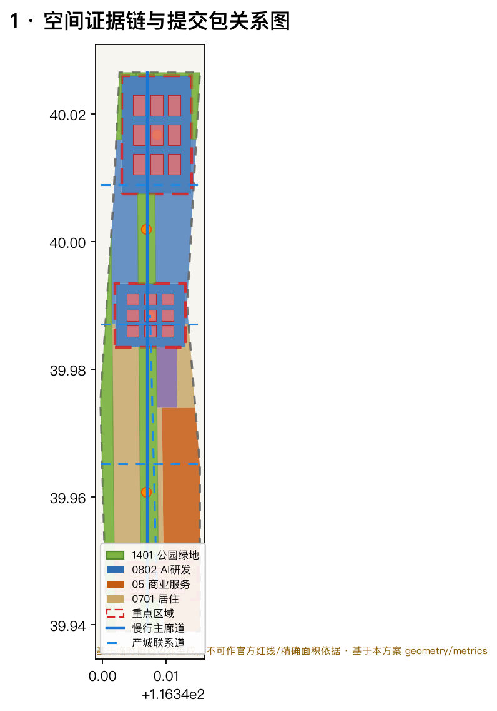
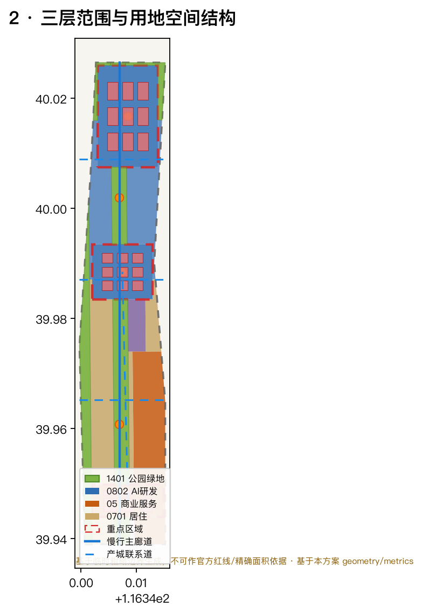
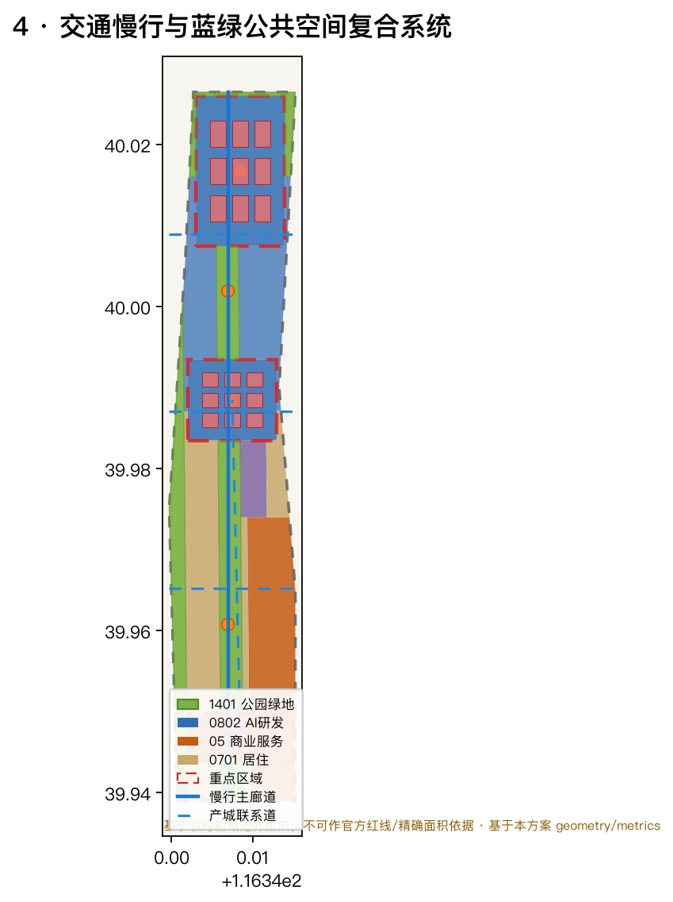
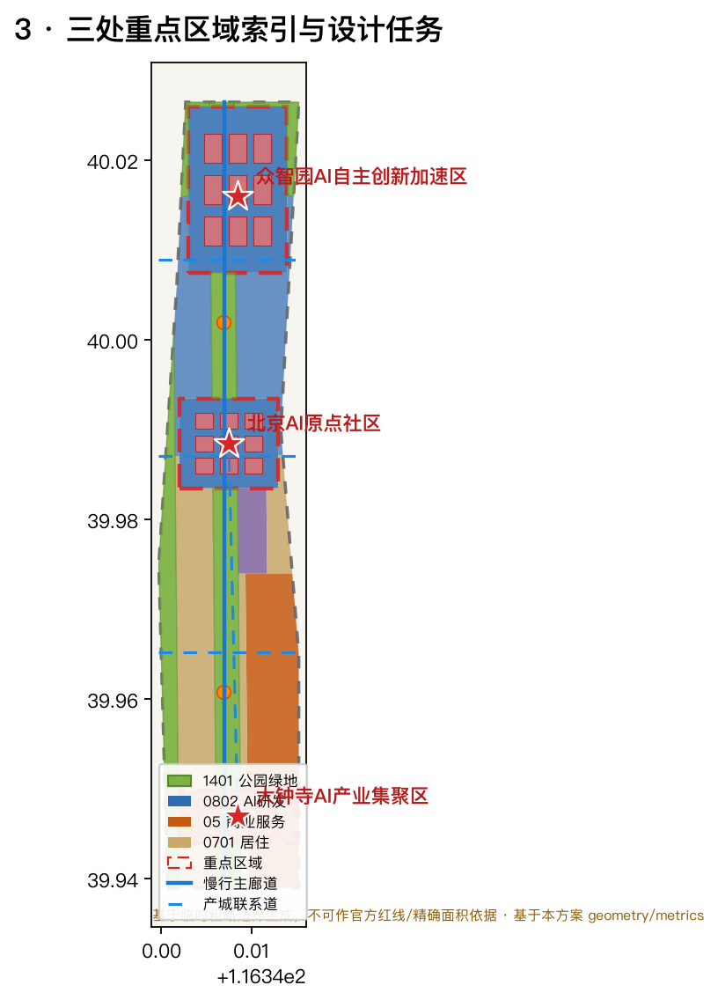
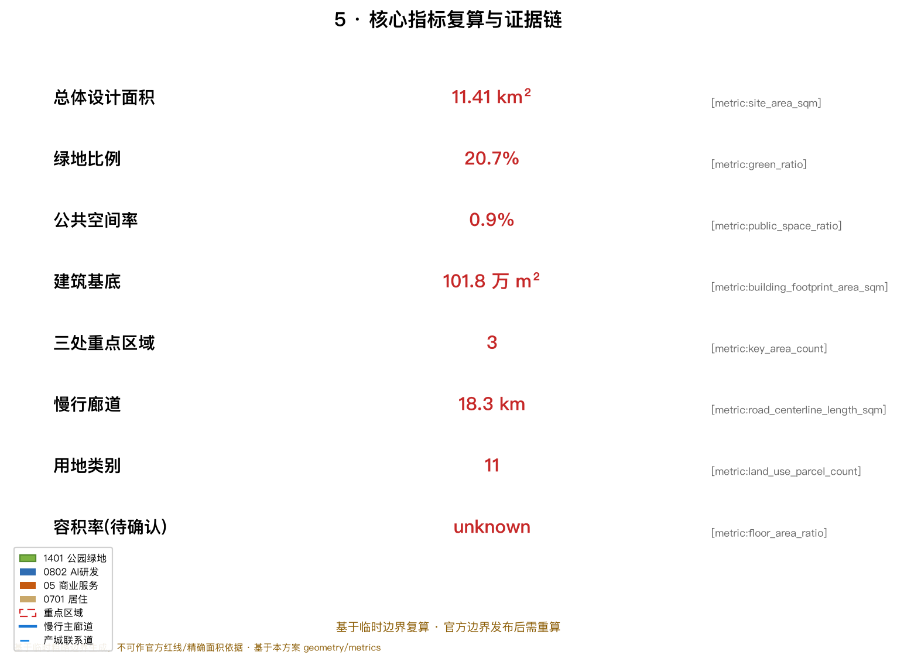

# 百年京张AI创新带：一带三核双翼的智能原生城市生活带

## 设计依据与资料清单

本方案以北京市规划和自然资源委员会海淀分局发布的《百年京张AI创新带城市设计国际方案征集资格预审公告》为主控依据 [source:OFFICIAL-ANNOUNCEMENT]，以面向全球智能体开源征集任务书摘录的要求为补充 [standard:PROJECT-AGENT-OPEN-CALL-TASKBOOK] [source:AGENT-TASKBOOK]，在 `design_brief.json`、`allowed_design_space.json`、`planning_limits.json` 与 `sources.json` 界定的资料边界内组织成果。方案不是独立愿景文本，而是从公告、任务书和场地资料出发、能够被智能体和人类共同复核的机器可读设计包。所有空间判断均可回到 `geometry/*.geojson` 与 `metrics.json` 复算 [source:SITE-PACKAGE] [source:SOURCE-REGISTRY]。

由于官方精确边界、重点区域 polygon 与控规条件尚未从公开渠道取得，本包使用 `brief/site-package/geometry/provisional_boundaries.geojson` 提供的 **临时粗略边界** 生成 formal 方案 [source:BOUNDARY-SOURCE] [source:KEY-AREA-SOURCE]。`geometry/site_boundary.geojson` 与 `geometry/key_areas.geojson` 均标注为 `provisional_constraint`、`official_boundary=false`、`boundary_precision=provisional_rough`，只能用于方案生成、可视化、自检和设计讨论，**不得**作为官方红线、审批依据、精确面积复算或法定控制结论 [data:geometry/site_boundary.geojson#SITE-001] [metric:site_area_sqm]。组织方当前的数据缺口本身不阻断内容评分；官方 polygon 发布后，site boundary、key areas、land use、roads、green/public space、buildings、phasing 与所有精密指标均需重算。

本方案传达的总体概念是 **“一带三核双翼、蓝绿慢行复合环”**：以京张遗址公园为历史与公共空间主轴（一带），以众智园AI自主创新加速区、北京AI原点社区、大钟寺AI产业集聚区三处重点片区为创新锚点（三核），以中关村科技服务翼与小月河场景赋能翼为协同支撑（双翼），并叠合清河/小月河蓝绿廊道与多层次慢行网络形成复合环。这里的“一带”是对公告三层范围的转译，不是新增的法定红线；“三核”对应三处重点区域；其余都是可讨论、可深化、可替换官方边界后重算的概念建议。

## 三层范围工作框架

方案依照公告确定的三层范围组织工作，并在 `geometry/*.geojson`、`metrics.json`、`compliance_matrix.json`、`standard_matrix.json` 与 `design_depth_matrix.json` 中逐项挂接 [standard:PROJECT-OFFICIAL-ANNOUNCEMENT] [depth:three_level_scope_framework]。

| 层级 | 工作内容 | 设计深度 | 面积依据 | 空间证据 |
| --- | --- | --- | --- | --- |
| 统筹研究范围 | AI产业生态、世界级创新带与未来AI城市形态 | 战略研究 | 约43.6 km² [metric:coordinated_research_area_sqm] | 产业生态图谱、三区两翼协同 |
| 总体设计范围 | 城市更新、用地结构、蓝绿慢行、风貌控制 | 控规深度城市设计 | 约11.4 km² [metric:site_area_sqm] | `land_use`、`roads`、`buildings` [depth:overall_spatial_structure] |
| 重点区域范围 | 三处重点片区详细设计 | 规划综合实施方案深度 | 约368.4 ha [metric:key_detailed_design_area_sqm] | `key_areas` [depth:three_key_area_detailed_design] |

三层工作不是相互割裂的图纸集合：统筹研究决定产业链与城市形态判断，总体设计把判断落实到用地、更新项目与设施承载，重点区域详细设计则用具体的功能、建筑、交通与公共空间检验可实施性。总体设计范围的全部用地由 `land_use.geojson` 的 11 个类别无缝覆盖、无重叠无空隙 [data:geometry/land_use.geojson#LU-001]，任何无法从图层复算的面积、比例或规模都不进入正式结论。

本方案基于临时边界生成，三层范围的精确面积值仅具概念参考意义；三层范围工作框架的空间证据链见 [depth:three_level_scope_framework] 与图 2。

## 统筹研究范围产业与未来城市研究

统筹研究范围的核心任务是构建 **世界级AI创新生态体系**，并回答人工智能如何改变工作、生活、社交、学习、交通与公共服务。本方案归纳为三大定位、五大功能与“三区两翼”协同回路 [source:AGENT-TASKBOOK] [standard:PROJECT-AGENT-OPEN-CALL-TASKBOOK]：

- **三大定位**：百年京张文化带、都市AI生活体验带、AI融合创新带。
- **五大功能**：AI全栈自主创新体系、世界级AI创新生态、AI+场景赋能新范式、智能化AI活力城市、AI治理全球话语权。
- **三区两翼**：AI原点社区承担“世界级AI创新生态”，众智园承担“AI全栈自主创新体系与AI治理全球话语权”，大钟寺承担“智能原生新业态”；中关村科技服务翼负责要素全球化配置、中关村IP与资本赋能，小月河场景赋能翼负责AI场景赋能与智能化活力城市。三区两翼通过一条串联创新策源、转化、展示与国际交往的复合环形成协同回路。

为回答“如何构建世界级AI创新生态”，本方案研究并转译了 6 个全球AI创新生态案例的可读摘要（完整来源见 `sources.json`）[source:SITE-PACKAGE]：

1. **美国硅谷（Palo Alto/Mountain View）**：依托斯坦福等大学策源与风险资本网络，形成“研究—创业—退出—回流”再投资闭环；经验转译为众智园应建立高校策源到企业转化的连续界面。
2. **美国波士顿肯德尔广场（Kendall Square）**：园区与麻省理工深度融合、以餐叙与公共空间促进偶然相遇；经验转译为AI原点社区应强化校区—园区慢行缝合与公共交往空间。
3. **中国深圳南山/留仙洞**：以硬件整机能力的垂直整合与产业链集聚见长；经验转译为众智园应以全栈自主体系为核心组织“软硬一体”测试验证空间。
4. **英国伦敦国王十字（King's Cross）**：城市更新把工业遗址转化为知识与创意混合街区；经验直接回指京张遗址公园活力带如何用历史资产承载创新。
5. **新加坡纬壹科技城（one-north）**：以“工作—生活—学习—休闲”一体化和绿色天际线支撑科创人才长期留住；经验转译为人才友好型高密度、近绿化、强慢行的城市环境。
6. **中国杭州城西科创大走廊/未来科技城**：以平台经济与数字要素开放生态吸引庞大开发者群体；经验转译为面向开发者的社区运营、开源与数据要素服务机制。

这些案例并非照搬，而是抽取“策源—转化—生态—人才—运营”五类可移植机制，落到用地、公共空间、慢行、场景节点与运营机制上 [depth:ai_innovation_ecosystem] [depth:ecosystem_case_studies]。

**命名与视觉识别方向（概念建议）**：主名建议为“京张智脉共生带 / Jing-Zhang AI Corridor”，强调历史（京张铁路）与新质生产力（AI）在空间上的“共生”。体系化命名以“带—核—翼—节点”分层：一带（智脉共生带）、三核（智源众智园/智创原点社区/智汇大钟寺）、双翼（中关村科技服务翼/小月河场景赋能翼）。Logo 方向建议以京张铁路的“工”字形轨道符号与AI电路/算力节点意象融合，配合“∞（无穷/智能）”符号表达持续演进的循环创新；字体与视觉可延展至导视、站牌、活动主视觉与公共艺术装置。命名与Logo均为概念建议，不构成批准结论，需经品牌与版权清权后深化 [depth:brand_identity_direction]。

**未来城市形态**：统筹研究把“AI交通系统、连续绿色空间、创新服务设施与国际化生活工作氛围”落实为可定位的功能区、节点、廊道与场景，而不是泛述技术。AI+交通、AI+公共空间、AI+生活服务等场景分见“AI 创新生态、人才画像与 AI+ 场景”一节 [depth:future_city_research]。

## 总体设计范围城市更新与控规深度城市设计

总体设计范围要求达到控制性详细规划的城市设计深度。本方案以 `geometry/land_use.geojson` 表达完整用地结构 [data:geometry/land_use.geojson#LU-009]，以 `geometry/buildings.geojson` 表达建筑基底 [data:geometry/buildings.geojson#BLDG-001]，以 `geometry/roads.geojson` 表达慢行与产城联系网络 [data:geometry/roads.geojson#ROAD-001]，并据 `standard:MOHURD-CONTROL-DETAILED-PLANNING` 区分已知控制条件、设计建议与待确认事项。

**用地结构与总体空间结构**：总体设计范围围绕京张遗址公园绿色活力轴组织，形成“**一轴贯通、三核锚定、双翼协同、蓝绿环绕、多点公共**”的空间结构 [depth:land_use_layout] [depth:overall_spatial_structure]：

- 一轴：京张遗址公园绿色活力轴（`land_use` 1401 公园绿地），南北贯通三处重点片区 [data:geometry/land_use.geojson#LU-004]。
- 三核：众智园（0802科研/智能经济 [data:geometry/land_use.geojson#LU-001]）、AI原点社区（0802 [data:geometry/land_use.geojson#LU-002]）、大钟寺（05商业服务业 [data:geometry/land_use.geojson#LU-003]）。
- 双翼：中关村科技服务翼（东侧商业服务业带 [data:geometry/land_use.geojson#LU-009]）、小月河场景赋能翼（西侧蓝绿廊道 [data:geometry/land_use.geojson#LU-006]）。
- 蓝绿环绕：清河蓝绿生态带（北缘 [data:geometry/land_use.geojson#LU-005]）与小月河绿廊（西缘）共同形成开放空间体系。
- 多点公共：`geometry/public_space.geojson` 的 5 处创新广场与活动节点 [data:geometry/public_space.geojson#PUBLIC-001]。

用地 11 类中，科研用地（0802，含众智园与原点社区）约 297万 m²、商业服务业（05，含大钟寺与中关村科技服务翼）约 231万 m²、教育科研用地（0804）约 146万 m²、公园绿地与开敞空间（1401）约 236万 m²、城镇住宅（0701）约 199万 m²（详见 `metrics.json` 的 `land_use_*_area_sqm`）。这一结构以“研发—转化、服务—居住、蓝绿—慢行”的正交咬合回应 AI 产业空间与宜居城市的双重要求 [metric:land_use_0802_area_sqm] [metric:land_use_05_area_sqm] [metric:land_use_1401_area_sqm]。

**城市更新与控规深度**：`buildings.geojson` 的 27 处建筑基底表达“保留—改造—新建”的概念性分层，其中三处重点片区各布置研发/商务/产业组团（共 27 个基底、约 102万 m² 建筑基底 [metric:building_footprint_area_sqm] [metric:building_density]）。建筑高度、容积率、建筑密度、绿地率、退线、道路红线与建筑控制线等法定控制条件**尚未取得官方控规数据，统一记为待确认**（见 `assumptions.json` 与 `metrics.json` 的 `floor_area_ratio`）[metric:floor_area_ratio]；方案不得用推测值冒充审定指标 [standard:MOHURD-CONTROL-DETAILED-PLANNING] [depth:development_intensity_controls]。`buildings.geojson` 中的建筑基底为概念设计量，仅用于表达结构关系，不等于法定拆改留或建设规模结论。

**交通、轨道、市政与配套设施**：`roads.geojson` 提出 5 条概念性路径——南北京张遗址公园慢行主廊道、三条东西向慢行与产城联系道、一条串联大众寺—原点社区的创新联系廊（总长约 18.3 km [metric:road_centerline_length_m]）[data:geometry/roads.geojson#ROAD-005]。方案围绕轨道站点一体化（五道口、清华东路西口、大钟寺站）、道路微循环、慢行断点、非机动车停放、AI产业服务平台、人才生活服务、分布式能源与端侧算力提出布局方向；涉及道路红线、管线、消防与市政容量的内容均作为待正式条件确认的前置（见 `assumptions.json`）[depth:traffic_rail_slow_parking] [depth:municipal_new_infrastructure]。

## 重点区域详细设计

三处重点区域达到规划综合实施方案的城市设计深度，分别引用 `geometry/key_areas.geojson` 的 `PROV-KEY-001/002/003`，并明确其 provisional 属性 [data:geometry/key_areas.geojson#PROV-KEY-001] [data:geometry/key_areas.geojson#PROV-KEY-002] [data:geometry/key_areas.geojson#PROV-KEY-003] 。由于三处 polygon 均为 `geometry_role=provisional_constraint`，下列结论仅作方向性设计，需在官方 polygon 与现状建筑/权属数据补齐后深化。

### 众智园AI自主创新加速区（PROV-KEY-001，约 192.1 ha）

- **定位**：花园型全栈自主创新街区，承担国家AI平台、全栈自主、标准制定与安全治理展示。
- **空间结构**：以清河界面（北缘 [data:geometry/land_use.geojson#LU-005]）与绿色空间承载开放测试、低碳算力体验与标准治理展示；沿纵向组织研发组团与公共广场 [data:geometry/public_space.geojson#PUBLIC-001]。
- **建筑更新**：`buildings.geojson` 布置 9 处众智园AI研发组团基底，表达科研 + 测试验证 + 展示空间的复合 [data:geometry/buildings.geojson#BLDG-001]。
- **交通慢行**：强化清河界面与对外交通、轨道接驳，组织低碳步行与骑行。
- **AI场景**：自主模型测试、标准制定工作坊、安全治理展示、低碳算力体验（见场景卡 02、06）。
- **实施风险**：依赖官方边界、河道蓝线、交通与市政条件确认 [source:AGENT-TASKBOOK]。

### 北京AI原点社区（PROV-KEY-002，约 104.3 ha）

- **定位**：近校型成果转化与人才社区，承担高校策源到企业转化的第一公里。
- **空间结构**：以校区—园区—街区慢行缝合为骨架，串联成果发布、人才服务、居住生活与开源协作空间。
- **建筑更新**：`buildings.geojson` 布置 9 处原点社区创新组团基底 [data:geometry/buildings.geojson#BLDG-010]。
- **交通慢行**：组织近校慢行联系、轨道站点一体化和成果发布展示路径 [data:geometry/roads.geojson#ROAD-003]。
- **AI场景**：开源发布厅、成果转化街、人才特区服务、近校孵化（见场景卡 01、07）。
- **实施风险**：校区边界、权属、首层业态与轨道实施需专业深化。

### 大钟寺AI产业集聚区（PROV-KEY-003，约 72.0 ha）

- **定位**：城市型智能经济与国际交往街区，承担领军企业、智能体、智能终端、内容消费与数据要素。
- **空间结构**：围绕大钟寺站一体化组织四象限步行连通，布局国际路演客厅、智能终端展示与数据要素服务界面。
- **建筑更新**：`buildings.geojson` 布置 9 处大钟寺商务组团基底 [data:geometry/buildings.geojson#BLDG-019]。
- **交通慢行**：站城一体化、四象限步行与复合商业环境 [data:geometry/roads.geojson#ROAD-005]。
- **AI场景**：智能体与智能终端展示、内容消费、数据要素与国际路演（见场景卡 05、08）。
- **实施风险**：轨道站点、道路交叉口、市政管线与产权协同需深化 [source:AGENT-TASKBOOK]。

## AI 创新生态、人才画像与 AI+ 场景

本方案面向 AI 人才、企业、居民与公共治理建立四类空间需求画像，并转译为 5 类用户画像与 10 张 AI 场景卡（含不少于 3 张产业测试验证场景）。每张场景卡均映射到空间位置、服务对象、运行数据、隐私边界、人工复核与运营主体，可在正文直接阅读 [source:AGENT-TASKBOOK] [standard:PROJECT-AGENT-OPEN-CALL-TASKBOOK] [depth:ai_scenario_cards]。

### 用户画像（5 类）[depth:user_personas]

| 画像 | 典型需求 | 空间响应 | 自检边界 |
| --- | --- | --- | --- |
| 开源开发者 | 发布、协作、测试、社区声誉 | 原点社区开源发布厅、公共代码墙、夜间协作空间 | 不采集个人行为轨迹，活动数据仅聚合 |
| 初创团队 | 低成本办公、算力入口、产品试验场 | 众智园共享测试场、端侧算力驿站、标准治理咨询 | 算力与数据服务另行授权 |
| 头部企业访客 | 展示、商务、国际接待 | 大钟寺国际路演客厅、轨道站点接驳、重点企业周边公共环境 | 企业标识与案例须清权 |
| 周边居民 | 通勤、休闲、社区服务、低扰动更新 | 遗址公园慢行环、社区服务嵌入、夜间照明分级 | 不作商业化个人推荐 |
| 高校师生 | 成果转化、跨校协作、日常慢行 | 校区—园区慢行缝合、成果转化驿站、AI教育体验点 | 校园与科研数据需授权 |

### AI 场景卡（10 张）

| # | 场景卡 | 空间载体 | 类型 | 服务对象 | 隐私/复核边界 |
| --- | --- | --- | --- | --- | --- |
| 01 | 开源发布厅 | AI原点社区 | 社区运营 | 开发者/初创 | 活动数据聚合，人工发布审核 |
| 02 | 安全治理沙盒 | 众智园 | **产业测试验证** | 模型方/监管 | 红队测试沙箱隔离，人工监管陪同 |
| 03 | 端侧算力驿站 | 总体范围节点 | 新基建/公共服务 | 初创/居民 | 算力与用量数据授权，人工复核 |
| 04 | AI慢行导航 | 遗址公园活力带 | 交通/无障碍 | 居民/游客 | 低侵入传感，可解释导视，人工纠偏 |
| 05 | 大钟寺国际路演客厅 | 大钟寺 | 国际交往 | 头部企业/媒体 | 内容清权，媒体发布审核 |
| 06 | 清河低碳创新廊 | 众智园清河界面 | **产业测试验证** | 科研/企业 | 低碳与能耗测算开放，人工校核 |
| 07 | 近校成果转化街 | AI原点社区 | 产业服务 | 高校/初创 | 知识产权与法务授权，人工评审 |
| 08 | 数据要素会客厅 | 大钟寺 | 数据要素 | 企业/治理方 | 合规授权、可审计、人工披露 |
| 09 | AI生活服务样板街 | 社区商业交汇 | 生活服务 | 居民/老人 | 传统服务并行，人工现场支持 |
| 10 | 全球AI活动周路线 | 一带公共空间 | **产业测试验证/运营** | 公众/开发者 | 活动安全与版权清权，人工运营 |

AI治理建议遵循数据最小化、公开来源、可解释与人工复核原则 [standard:GENERATIVE-AI-INTERIM-MEASURES]；所有场景为概念建议，标注测试验证场景未进入全面部署 [depth:ai_test_and_validation_scenarios]。无障碍与适老化场景参照 [standard:BARRIER-FREE-ENVIRONMENT-LAW] 与 [standard:ELDERLY-SMART-TECH-PLAN-2020-45] 的边界处理，不泛化为普遍结论，并保持传统服务与智能化并行。

## 用地、建筑规模与拆改留方案

用地分类依据 [standard:MNR-LAND-USE-CLASSIFICATION-GUIDE]，以统一国土空间用地用海分类代码（07/05/08/14/16 等）表达，完整覆盖提交边界且无重叠空隙 [data:geometry/land_use.geojson#LU-011]。用地结构以科研研发、商业服务、教育科研、蓝绿开敞为主体，城镇住宅承载人才居住。建筑基底共 27 处、约 102万 m²（[metric:building_footprint_area_sqm]），以“保留—改造—新建”概念性表达，但**不给出法定拆改留结论**。容积率、建筑高度、建筑密度、绿地率等法定控制条件未经官方控规确认，统一记为 `status=unknown`（`metrics.json` 的 `floor_area_ratio`）[metric:floor_area_ratio]，并在 `assumptions.json` 说明待补条件与官方数据到位后的复算路径 [depth:retain_renovate_demolish] [depth:height_massing_character]。

## 交通、轨道、市政与公共服务设施

交通方案以 `roads.geojson` 的慢行主廊道 + 东西向产城联系道 + 创新联系廊表达绿色交通骨架，覆盖大钟寺站、清华东路西口、五道口等重点轨道站点一体化节点，并对北五环跨环慢行、京张遗址公园跨环路节点提出概念方向 [data:geometry/roads.geojson#ROAD-001]。市政与配套设施覆盖 AI 产业服务设施（端侧算力驿站、测试场）、创新服务平台、人才生活服务、分布式能源与传统市政融合 [depth:municipal_new_infrastructure]。因提交边界为 provisional 且缺少道路红线/管线/消防条件，交通市政结论仅作设计讨论，作为正式深化前置条件列入 `assumptions.json`。

## 蓝绿空间、公共空间与城市风貌

蓝绿空间以京张遗址公园活力带（`land_use` 1401）为骨架，统筹清河蓝绿生态带（北缘 [data:geometry/land_use.geojson#LU-005]）与小月河场景赋能绿廊（西缘 [data:geometry/land_use.geojson#LU-006]），并以 `public_space.geojson` 的 5 处广场节点承载创新交往、科技测试、应用展示与公共活动 [data:geometry/public_space.geojson#PUBLIC-005]。绿地约 236万 m²、绿率约 20.7%（[metric:green_ratio]），公共空间约 10.6万 m²、公共空间率约 0.9%（[metric:public_space_ratio]），指标含义见“指标体系”一节。

**AI 公共空间、智能原生新业态与朝圣地标** [depth:ai_landmarks]：本方案提出不少于 3 个 **AI 朝圣地标/荣誉展示节点**——① 京张“智源方舟”遗产与AI交汇馆（依托京张遗址公园与清华园车站文化资源，承载百年京张 × AI 新文化叙事）、② 众智园“自主创新荣誉塔/贡献墙”（面向开源贡献者与企业建立可更新的荣誉展示体系）、③ AI原点“第一公里·开源圣火”广场（面向开发者社区与成果发布的仪式性公共空间）。这些地标均为概念建议，需经验版权/文保/绿地约束清权后深化，不得过度娱乐化或写成已批准建设 [standard:MOHURD-URBAN-DESIGN-MEASURES]。荣誉展示体系以“贡献可记忆”为原则，与 `co_creation_charter` 的 charter.9 呼应 [source:AGENT-TASKBOOK]。

## 更新项目清单、实施政策与分期计划

`geometry/phasing.geojson` 以三处重点片区为**近期**先行区、中部产城更新带为**中期**、南北全域提升带为**远期**，表达分期实施框架 [data:geometry/phasing.geojson#PHASE_001]。项目清单（空间证据与依赖见 `compliance_matrix.json`）：

| 编号 | 项目 | 类型 | 分期 | 主要依赖 |
| --- | --- | --- | --- | --- |
| JZ-01 | 京张遗址公园慢行断点缝合 | 公共空间/交通 | 近期 | 道路红线、桥下空间 |
| JZ-02 | 众智园清河创新界面 | 蓝绿/产业展示 | 近期 | 河道蓝线、生态防洪 |
| JZ-03 | 原点社区近校成果转化街 | 城市更新/产业服务 | 近期 | 校区边界、权属 |
| JZ-04 | 大钟寺站四象限步行连通 | 轨道一体化 | 近期 | 轨道站点、交叉口管线 |
| JZ-05 | AI公共服务与端侧算力节点 | 新基建 | 中期 | 能源算力、运营主体 |
| JZ-06 | 全球AI活动周公共路线 | 运营/品牌 | 中期 | 活动安全、版权清权 |
| JZ-07 | 全域蓝绿慢行复合环贯通 | 蓝绿/慢行 | 远期 | 连续绿带、跨环节点 |

**全球 AI 创新活动体系与长期运营** [depth:global_ai_event_operation]：方案提出年度活动体系（AI 开发者大会、开源周、AI 场景开放日、全球 AI 活动周）、活动品牌与传播视觉、开发者社区运营、场景开放运营、公共体验路线、国际传播与招引转化机制；所有活动、招商、资金、政策与运营安排均写成 **概念建议/深化方向**，不表述为已确定政府安排 [source:AGENT-TASKBOOK] [charter]。实施与分期方案强调征集周期（成果提交时限）≠ 实施分期（城市更新推进路径），近期以轻量设施、运营活动与服务平台启动，长期等待正式控规/市政/交通/权属条件确认 [depth:renewal_project_list] [depth:phasing_implementation]。

## 指标体系、面积复算与合规矩阵

指标体系的完整数值、公式、来源文件与置信度保存于 `metrics.json`，空间证据保存于 `geometry/*.geojson`，本轮已通过 `scripts/spatial_review.py` 与 `scripts/visual_review.py` 复核。核心指标的设计含义如下 [depth:metrics_recalculation]：

- **总体设计面积 11.4 km²**（[metric:site_area_sqm]）：约束三层空间资源的分配边界，任何分区、绿地与建筑比例均以它为分母。
- **绿地比例约 20.7%**（[metric:green_ratio]）与 **公共空间率约 0.9%**（[metric:public_space_ratio]）：支持人才日常生活与高密度创新友好环境的绿意与公共开放度。
- **建筑基底约 102万 m² / 密度约 8.9%**（[metric:building_footprint_area_sqm] [metric:building_density]）：表达产业与公共服务空间供给的概念体量，不等于法定建设规模。
- **三处重点区域面积**（[metric:key_area_count]）与 **分期面积**：标识详细设计范围与实施优先级。
- **慢行廊道总长约 18.3 km**（[metric:road_centerline_length_m]）：支撑绿色交通与蓝绿慢行复合环。

合规覆盖：公告 1.3/1.4/1.5 与任务书 `agent.1`–`agent.6` 六项任务在 `compliance_matrix.json` 中逐条映射到章节、图层、指标、图纸与 HTML 页面，`standard_matrix.json` 覆盖各强制性专业标准，`design_depth_matrix.json` 覆盖全部必需设计深度项。所有指标与图件由 `sources.json`、`assumptions.json` 与自检结果兜底。

## 风险、版权与合规说明

本方案为开放共创概念建议，所有空间落地建议均表述为“概念建议/参考方案/可供专业团队深化研究”，**不替代正式规划，不构成政府审定结论**[source:AGENT-TASKBOOK]。方案明确不包含官方批准、审定控规、最终土地权属、最终建设规模、保证实施的声明。资料合法性、版权授权、非公开资料排除、隐私保护、AI 生成责任与专业复核需求的完整说明见 `report/copyright_statement.md`，风险评估与待补资料清单见 `assumptions.json` [depth:risk_missing_data] [data:geometry/constraints.geojson#CONSTRAINTS-001]。

其中首要风险是**官方精确边界与控规条件缺失**：本包基于 provisional boundary 生成，仅适用于方案生成、可视化、自检与设计讨论，不能用于官方红线、审批、精确面积或法定控制。组织方数据缺口不阻断内容评分，但官方数据发布后所有精密指标必须重算。文化、品牌、字体、图像、人物与企业标识均需清权，AI 生成媒体仅作解释层，不得冒充现场、实测或官方证据。

## 参考资料

- 北京市规划和自然资源委员会海淀分局《百年京张AI创新带城市设计国际方案征集资格预审公告》（官方公告，2026-05-09）
- 《面向全球智能体开展“百年京张AI创新带城市设计开源征集”的任务书摘录》（用户提供清权材料）
- 《城市设计管理办法》（住建部）
- 《城市、镇控制性详细规划编制审批办法》（住建部）
- 《国土空间调查、规划、用途管制用地用海分类指南》（自然资源部）
- 《生成式人工智能服务管理暂行办法》《中华人民共和国无障碍环境建设法》等规范参照
- `brief/site-package/` 场地包（临时边界、枚举、指标、来源与 schema）
- `data/source_registry.json` 公开资料用途登记
- 完整机器索引以 `sources.json`、`metrics.json` 与三个矩阵文件为准 [source:SITE-PACKAGE]
