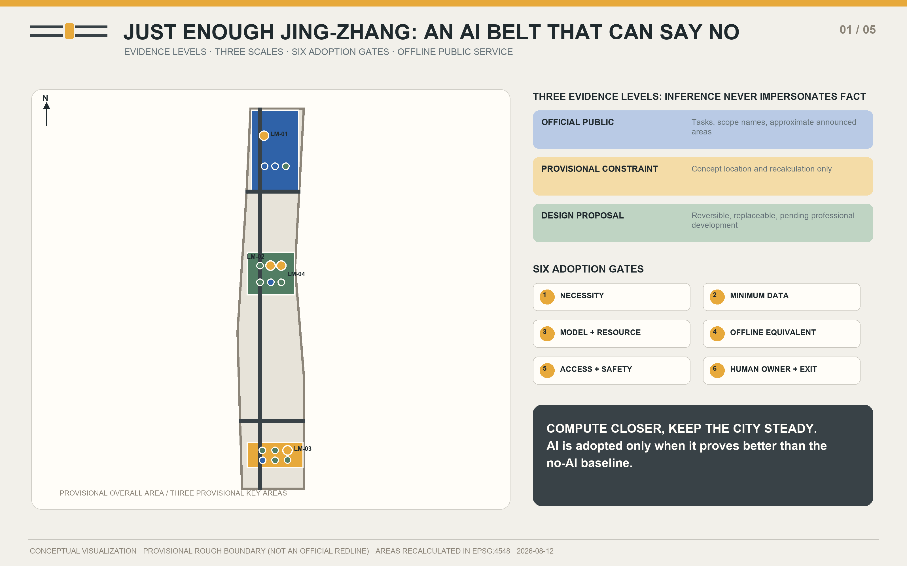
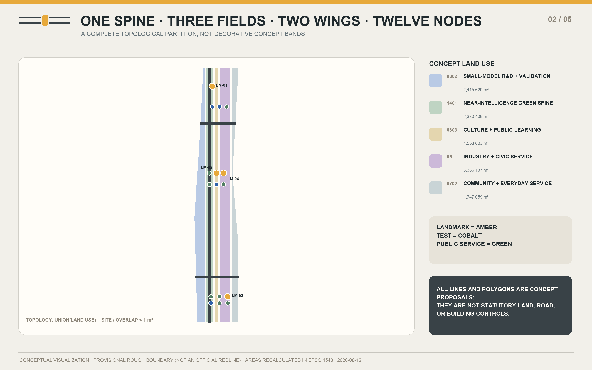
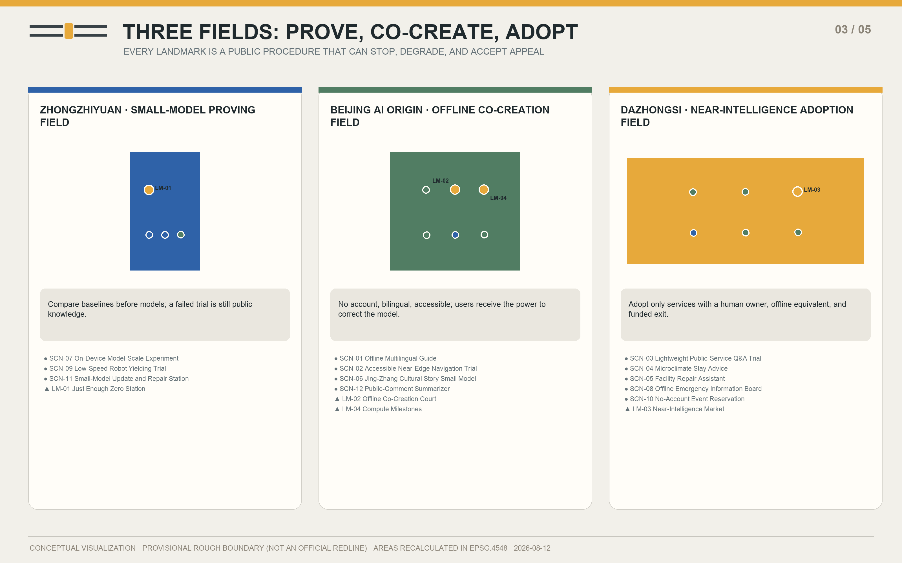
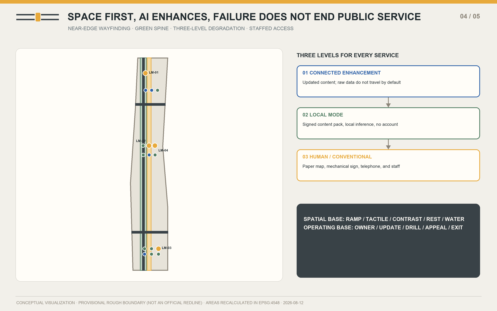
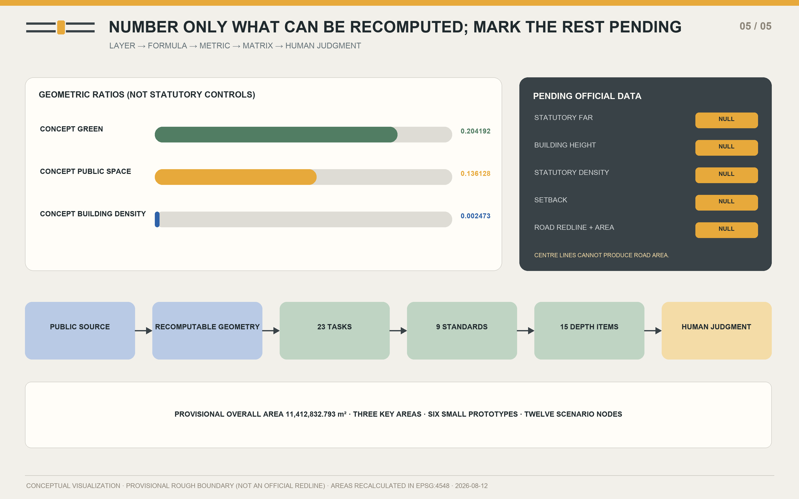

# JUST ENOUGH JING-ZHANG: A Right-Sized, Near-Compute, Offline-Ready AI City

**Compute Closer, Keep the City Steady**

## Design Basis and Source List

JUST ENOUGH JING-ZHANG is governed first by the official open-call announcement, the Agent-facing taskbook, and the repository's public site package. It adds primary public material from the Haidian District Government, Beijing municipal agencies, Chinese laws, and the publishers of relevant technical documentation. Each source is used only at the level its authority permits: the announcement confirms the three scales and the names of the key areas; provisional GeoJSON supports concept mapping; policy and technical pages support background and method. None is promoted into an unpublished statutory redline, ownership record, engineering condition, or government commitment. `sources.json` records publisher, URL, retrieval date, permitted use, prohibited use, and reuse boundary for every external source.

As of 12 August 2026, the public site package contains no citable official CAD/GIS/PDF redline, regulatory indices, road redlines, heritage or blue lines, cadastral ownership, existing-building survey, or municipal-capacity data. The package therefore retains the maintainer-defined rough substitute boundary and explicitly sets `official_boundary=false`, `geometry_role=provisional_constraint`, and `boundary_precision=provisional_rough`. Every displayed area is recalculated in EPSG:4548 from that temporary geometry and is suitable only for concept comparison. Once cleared official data arrive, geometry, metrics, figures, and PDFs must be regenerated as one package rather than patched selectively.

The method is a chain of public evidence, bounded inference, recomputable spatial data, and final human review. The Agent used no secret map, non-public spreadsheet, enterprise internal data, personal data, or field survey, and did not treat peer proposals as an asset library. The result is an open co-creation proposal, not formal planning, professional design, government approval, or a statutory decision. Five required figures, bilingual offline pages, an A3 booklet, and A0 boards are generated from one content model and the same GeoJSON, allowing another Agent or professional team to replay the work and replace assumptions transparently.

The adjacent source, spatial, and depth records make this chapter auditable; the exhaustive index remains in the machine-readable matrices [source:OFFICIAL-ANNOUNCEMENT] [source:AGENT-TASKBOOK] [depth:existing_conditions_diagnosis].

## Three-Level Scope Framework

The three scales are not three unrelated drawing sets; they form one decision chain that becomes more specific. The approximately 43.6-square-kilometre coordinated research area asks regional and industrial questions. The roughly 11.4-square-kilometre overall design area translates near compute and offline usability into spatial structure, public service, and renewal projects. Three key areas totalling approximately 368.4 hectares carry detailed scenario validation. Each larger scale should formulate a question that the next scale can disprove, while the smaller scale must answer through space, operation, and exit conditions. This prevents a regional slogan from jumping directly to architectural form.

The spatial syntax is “One Spine, Three Fields, Two Wings, Six Gates, and Twelve Nodes.” The spine is a near-intelligence public route along Jing-Zhang Railway Heritage Park. The fields are the Zhongzhiyuan Small-Model Proving Field, Beijing AI Origin Offline Co-Creation Field, and Dazhongsi Near-Intelligence Adoption Field. The wings are Zhongguancun Technology Services and Xiaoyue River Scenario Enablement. The six gates test necessity, data minimization, model and resources, offline equivalence, accessibility and safety, and human responsibility and exit. Twelve nodes correspond exactly to twelve complete scenario cards. This is first an order for public decisions and only then a physical composition.

Within the provisional overall boundary, the concept land-use polygons are produced from the same source polygon with shared cut lines; they cover it completely without overlap. Repository provisional rectangles for the three key areas locate fields and nodes but are never interpreted as parcels or street boundaries. The wings are relationships, not new roads, and the spine is a public-space and slow-mobility concept, not a road redline. The layered method lets professionals retain the design logic and remap it when official information arrives, without being trapped by invented precision.

| Scale | Core question | Just Enough answer | Output |
| --- | --- | --- | --- |
| Coordinated research | Which AI tasks deserve to become civic capacity? | Build public tasks and no-AI baselines first | Cases, ecosystem map, six gates |
| Overall design | How do tasks enter public space and renewal? | One spine, three fields, two wings, twelve nodes | Land use, slow mobility, blue-green network, phases |
| Key areas | Which technologies can be validated safely with real users? | Controlled trials, human ownership, and exits | Three fields, four landmarks, scenario cards |

The adjacent source, spatial, and depth records make this chapter auditable; the exhaustive index remains in the machine-readable matrices [data:geometry/site_boundary.geojson#PROV-SITE-001] [data:geometry/key_areas.geojson#PROV-KEY-001] [depth:three_level_scope_framework].

## Coordinated Research Area: Industry and Future City Research

Haidian's full-stack innovation position means that “world-class” should not be measured only by model parameters, company counts, or aggregate compute. JUST ENOUGH adds the capacity to define public tasks, portability across tools, site validation, visible failure, long-term maintenance, and civic trust. Land, space, industry, capital, talent, compute, data, and scenarios become one loop: the city publishes bounded tasks; universities and teams establish no-AI baselines; Zhongzhiyuan compares minimum-sufficient models; AI Origin hosts offline and accessible co-creation; Dazhongsi tests adoption in ordinary service; the Zhongguancun wing connects legal, standardization, capital, and international support; and the Xiaoyue River wing provides public experiences that can be stopped safely.

The six international cases are neither an investment list nor mandated suppliers. MLPerf Tiny suggests common tasks and comparable measures. LiteRT, ONNX Runtime Mobile, and ExecuTorch document different paths for on-device deployment. WebNN reminds the project to keep interfaces open and to verify a standard's changing maturity. NIST AI RMF contributes a voluntary iterative approach to risk. The proposal transfers only methods for asking and testing questions; documentation is never treated as evidence of site performance. Model size, latency, energy, accuracy, and hardware compatibility all remain device-specific matters for reproducible field testing.

The ecosystem operates through six steps: commission a public task, publish a baseline, conduct a controlled trial, review it with the community, adopt it conditionally, and maintain or retire it. Funding should first buy task definition, testing, accessibility, human service, and maintenance capacity, not a one-off large-model spectacle. Every supplier must deliver portable data, version records, a degradation path, and an exit-cost account. Every team may challenge an installed system with a smaller model or a non-AI alternative. The innovation belt therefore becomes a public institution that keeps learning, rather than a showroom that merely displays technology.

| ID | Case | Transferable method | Do not extrapolate |
| --- | --- | --- | --- |
| CASE-01 | Reproducible Tiny-System Benchmarks | Use one public task, a no-AI baseline, and conceptual resource targets as the Zero Station's display frame. | It supplies neither Jing-Zhang measurements nor a direct measure of public-service quality. |
| CASE-02 | Mobile Inference Toolchain | Write device-first execution, update, and rollback into the public terminal lifecycle. | Do not turn one vendor toolchain into a mandatory part of the urban design. |
| CASE-03 | Reduced Mobile Runtime | Translate carrying only task-needed capability into a procurement and maintenance principle. | Actual package size, latency, and energy depend on model, hardware, and build; the proposal makes no false precision claim. |
| CASE-04 | Edge Deployment and Observability | Make versions, signatures, device health, and rollback status legible to operators and the public. | A toolchain does not establish safety, accessibility, or social-impact assurance. |
| CASE-05 | Open Web Inference Abstraction | Design bilingual display, offline content, and local compute around replaceable open interfaces. | Standards status and browser support change; this is not proof that a given site device is ready. |
| CASE-06 | Risk-Management Loop | Use the six adoption gates at scenario entry, expansion, shutdown, and review. | The framework does not replace Chinese law, Beijing requirements, professional review, or public participation. |

The adjacent source, spatial, and depth records make this chapter auditable; the exhaustive index remains in the machine-readable matrices [source:SRC-LOCAL-01] [standard:PROJECT-AGENT-OPEN-CALL-TASKBOOK] [depth:overall_spatial_structure].

## Overall Design Area: Urban Renewal and Regulatory-Plan-Level Urban Design

The overall design rewrites AI from an added device into a spatial adoption rule. Its six principles are Minimum Sufficient Model, Near-Edge First, Offline Usability, Graceful Degradation, Visible Resources, and Human Final Judgment. Each becomes a gate made jointly of physical design and operations. Before entering the site, a proposal proves necessity. Before collecting data, it removes fields and retention. Before deployment, it discloses model scale and conceptual resource targets. Before opening, it passes disconnection and non-AI equivalence tests. Before public use, it passes accessibility and safety review. Before expansion, it names the accountable person, appeal path, and exit. These are not a compliance checklist; they are a public procedure that determines whether work may move from one phase to the next.

“Compute closer” is organized as device, site, and remote layers. Work starts on the device and moves upward only when task quality cannot be met and the added public value can be explained. Raw location, voice, image, and preference data do not leave the place of production by default. Information stations carry a resource label showing purpose, data scope, model or rule version, update time, accountable owner, offline state, and conceptual performance target. When connectivity fails, a page or device falls back to local content and then to paper maps, mechanical signs, a staffed counter, or a telephone. The public is never left with “service unavailable” as the design's final condition.

Renewal is deliberately light-touch. Existing park nodes and ground-floor spaces are reused, while six small reversible prototypes express the component strategy; innovation is not proved through large-scale demolition. Concept land-use polygons are a functional coordination diagram, and building footprints illustrate components only. Floor area ratio, building height, density, setbacks, and statutory road area remain explicitly pending official data. The next professional step is to overlay ownership, existing buildings, regulatory controls, heritage, transport, utilities, and fire requirements before any retain, renovate, demolish, or new-build decision.

| ID | Principle | Public question | Spatial and operational action |
| --- | --- | --- | --- |
| PRI-01 | Minimum Sufficient Model | Could the task be done equally well without AI? | Prove that a task needs AI, then choose the smallest model, rule system, or combination that can complete it. |
| PRI-02 | Near-Edge First | Can the data remain where it is produced? | When a device or site-level system can complete the task, raw data is not sent away by default. |
| PRI-03 | Offline Usability | After disconnection, can the public continue without technical assistance? | Wayfinding, information, help, and basic public services retain a complete offline or non-AI equivalent. |
| PRI-04 | Graceful Degradation | Is the degradation path continuous, visible, and rehearsable? | Every enhanced service steps down smoothly from connected mode to local mode and then to a human or conventional service. |
| PRI-05 | Visible Resources | Can the public see what the system consumes and who is responsible? | Show model size, update time, data scope, accountable owner, and conceptual performance targets in public language. |
| PRI-06 | Human Final Judgment | Who can overrule the model, and where can the public appeal? | Models never make the final decision on health, education, law, safety, planning, or the public interest. |

The adjacent source, spatial, and depth records make this chapter auditable; the exhaustive index remains in the machine-readable matrices [data:geometry/land_use.geojson#LU-01] [data:geometry/roads.geojson#ROAD-01] [standard:MOHURD-CONTROL-DETAILED-PLANNING].

## Detailed Design of Key Areas

The Zhongzhiyuan Small-Model Proving Field asks whether a technology deserves to enter the city. Just Enough Zero Station gives the same public task to a no-AI rule system, a small model, and—only when necessary—a remote model, then publicly compares quality, latency, and conceptual resource targets. The update and repair station manages signatures, versions, rollback, and device health. A closed and visible low-speed robot loop opens only with an observer, mechanical emergency stop, and robot-free periods. Spatial interventions use reversible small structures and park interfaces; they make no engineering conclusion about Qinghe, flood control, ownership, or roads.

The Beijing AI Origin Offline Co-Creation Field asks whether people with different abilities can understand and correct the technology. Offline Co-Creation Court offers bilingual stories, accessible-route tests, paper maps, a complete index of published comments, and human facilitation. It requires no account and never turns a child's voice or a resident profile into the price of participation. Jing-Zhang archival trails, Zhongguancun's open collaboration culture, and emerging AI culture meet on one traceable public table, where international developers, older adults, children, and disabled users define tasks together.

The Dazhongsi Near-Intelligence Adoption Field asks whether a technology can enter everyday operation. Near-Intelligence Market combines lightweight public-service Q&A, microclimate rest advice, no-account reservations, facility repair, and an offline emergency board. Every service can return to a staffed or conventional mode. Compute Milestones run along the public spine and show resource, version, responsibility, and help information. The three provisional rectangles locate concepts only. Any station integration, four-quadrant connection, building alteration, or composite use of green space must await formal redlines, ownership records, and engineering review.

| ID | Landmark | Field | Public program | Design role |
| --- | --- | --- | --- | --- |
| LM-01 | Just Enough Zero Station | zhongzhiyuan_ai_acceleration_area | Model-scale trials, rollback repair, and the six adoption gates | A civic-task station that publicly compares no AI, a small model, and a remote model. |
| LM-02 | Offline Co-Creation Court | beijing_ai_origin_community | Bilingual stories, accessible navigation, and traceable public comment | A public living room for design, storytelling, and deliberation without accounts or persistent connectivity. |
| LM-03 | Near-Intelligence Market | dazhongsi_ai_industry_cluster | Public-service Q&A, microclimate rest, and emergency degradation | A visible civic-adoption front desk combining lightweight public services, daily repair, and no-account events. |
| LM-04 | Compute Milestones | beijing_ai_origin_community | Resource displays, offline maps, human help, and non-AI equivalents | Small public-information nodes along the heritage park that make compute location, resource targets, updates, and ownership legible. |

The adjacent source, spatial, and depth records make this chapter auditable; the exhaustive index remains in the machine-readable matrices [data:geometry/key_areas.geojson#PROV-KEY-002] [data:geometry/public_space.geojson#NODE-LM-02] [depth:three_key_area_detailed_design].

## AI Innovation Ecosystem, Personas, and AI+ Scenarios

All twelve scenarios use one minimum service contract: identify whom the service is for, where raw data stop, how service continues offline, which person retains final responsibility, and what condition ends the service. Four testing and validation scenarios—accessible near-edge navigation, lightweight public-service Q&A, an on-device model-scale experiment, and low-speed robot yielding—must first produce public records in environments that can be stopped. They are never presented as approved operations. The other eight scenarios also retain a staffed or non-AI equivalent. Models never take the final decision in health, education, law, safety, planning, or matters of public interest.

The six personas are exclusion checks rather than marketing segments. Researchers need reproducible tasks. Residents with low digital confidence need no-account access and one-step help. Families need no retention of minors' data by default. Disabled users require accessible space first and multisensory information. International talent needs bilingual and portable interfaces. Operators need low maintenance burden, drills, and shutdown conditions. A scenario may enter the second phase only when it passes the user, data, offline, responsibility, and exit columns together.

Every scenario is written to the public-space GeoJSON as a `SCENARIO_NODE`, linked to an area and a stable content ID. The map communicates location, the table communicates governance, and events communicate public learning; none can replace the others. Conceptual performance measures become credible only on identified devices, tasks, test sets, and independent observation. If a result cannot be reproduced, provenance is unclear, accessible infrastructure is missing, or the accountable human is absent, the service returns to local static information or its conventional equivalent.

| ID | Persona | Primary need | Design response |
| --- | --- | --- | --- |
| PER-01 | AI Researchers and Start-ups | Verifiable tasks and clear adoption thresholds | Need low-cost real tasks, reproducible baselines, and public evaluation grounds. |
| PER-02 | Residents, Older Adults, and Low-Digital-Skill Users | One-step help and a visible human channel | Need understandable services that do not depend on accounts, smartphones, or stable connectivity. |
| PER-03 | Students, Children, and Family Caregivers | Shared family use and no retention by default | Need safe, bounded learning and activity settings without collecting minors' data as the price of participation. |
| PER-04 | Wheelchair and Sensory-Accessibility Users | Accessible space first; AI only as enhancement | Need continuous accessible routes, multisensory cues, and verifiable pre-trip information. |
| PER-05 | International Developers, Visitors, and New Talent | Bilingual, portable, and vendor-neutral access | Need bilingual guidance, portable interfaces, and trials that do not lock them to one platform. |
| PER-06 | Park and Facility Operators | Low maintenance burden and explicit shutdown conditions | Need maintainable systems with accountable ownership, rehearsed degradation, and a viable exit. |

| ID | Scenario | Area | Data boundary | Offline / no-AI mode | Human owner | Exit condition |
| --- | --- | --- | --- | --- | --- | --- |
| SCN-01 | Offline Multilingual Guide | beijing_ai_origin_community | Only the chosen language and downloaded content remain on device; location traces are not uploaded. | Paper bilingual maps, place numbers, and offline audio packs remain available. | Park service desk and cultural-content editor | Disable generation if major factual errors persist across two update cycles without timely correction. |
| SCN-02 · TEST | Accessible Near-Edge Navigation Trial | beijing_ai_origin_community | Preferences and positioning are computed on device; only de-identified segment obstacles are reported. | Tactile paving, high-contrast signs, and human-verified accessible routes form the base system. | Accessibility inspector and park duty manager | Revert immediately to static routes upon any safety blind spot, severe misdirection, or mismatch with the human-verified route. |
| SCN-03 · TEST | Lightweight Public-Service Q&A Trial | dazhongsi_ai_industry_cluster | No names, identity numbers, or documents are collected; sessions are not retained by default. | A searchable static FAQ, telephone list, and in-person service directory remain available. | Public-service desk supervisor | Stop free-form generation if it makes eligibility decisions, denies rights, or exceeds the conceptual error threshold for two consecutive weeks. |
| SCN-04 | Microclimate Stay Advice | dazhongsi_ai_industry_cluster | Reads environmental sensors only; it neither identifies nor tracks people. | Shade maps, water points, rest points, and heat-warning signs remain visible. | Park operations and environmental-health liaison | Show static safety information only when calibration expires, data stops, or advice conflicts with an official weather warning. |
| SCN-05 | Facility Repair Assistant | dazhongsi_ai_industry_cluster | Uses asset IDs, fault types, and manual versions only; it processes neither faces nor voiceprints. | Assets retain QR labels, paper quick guides, and duty phone numbers. | Facility maintenance supervisor | Switch to document retrieval only if any advice bypasses a safety lockout or the manual version cannot be verified. |
| SCN-06 | Jing-Zhang Cultural Story Small Model | beijing_ai_origin_community | Children's voices and profiles are not recorded; only reviewed story versions are retained. | Paper story cards, a timeline, and archive numbers work independently. | Cultural-content editor and children's education adviser | Remove generated versions immediately upon fabricated quotation, untraceable history, or content unsuitable for minors. |
| SCN-07 · TEST | On-Device Model-Scale Experiment | zhongzhiyuan_ai_acceleration_area | Uses public test sets or one-off local inputs; raw inputs are cleared when the experiment ends. | Static baselines, paper scoring, and a model-free rule system serve as controls. | Proving-ground technical lead and public-interest observer | Do not publish a run if results cannot be reproduced, test-set provenance is unclear, or resource targets are hidden. |
| SCN-08 | Offline Emergency Information Board | dazhongsi_ai_industry_cluster | Receives authenticated public notices only and collects no information about nearby people. | Mechanical flip panels, photoluminescent maps, broadcasts, and human marshals remain in place. | Site emergency lead | If signature verification fails, the local version expires, or it conflicts with incident command, show location and instructions to follow staff only. |
| SCN-09 · TEST | Low-Speed Robot Yielding Trial | zhongzhiyuan_ai_acceleration_area | Live vision is processed on the vehicle and not retained; only anonymous events and emergency-stop logs are stored. | The loop has physical separation, human observers, mechanical stops, and robot-free time windows. | Trial safety officer | End the day's trial immediately after any failure to yield, boundary crossing, emergency-stop failure, or observer absence. |
| SCN-10 | No-Account Event Reservation | dazhongsi_ai_industry_cluster | Stores event session, ticket number, and attendance status only; no cross-event profile is created. | On-site ticketing, telephone registration, and a staffed standby list remain open. | Public-event organizer | Return immediately to evenly split quotas if the digital channel displaces offline capacity, double-books, or excludes people without devices. |
| SCN-11 | Small-Model Update and Repair Station | zhongzhiyuan_ai_acceleration_area | Exchanges model packages, hashes, versions, and device health only; it does not read user content. | Every device retains the last verified version and a complete non-AI mode. | Device asset owner and release signer | Stop distribution and return to the prior version if signing fails, rollback drills fail, or a vulnerability remains unpatched. |
| SCN-12 | Public-Comment Summarizer | beijing_ai_origin_community | Processes only text explicitly marked public; contact details are removed and sensitive-attribute inference is prohibited. | A full comment index, human topic tags, and a paper comment wall remain open. | Public-participation facilitator and independent recorder | Redo the summary or publish only the source index if minority views disappear, originals cannot be traced, or a participant withdraws. |

The adjacent source, spatial, and depth records make this chapter auditable; the exhaustive index remains in the machine-readable matrices [data:geometry/public_space.geojson#NODE-SCN-07] [source:SRC-TECH-01] [standard:GENERATIVE-AI-INTERIM-MEASURES].

## Land Use, Building Scale, and Retain-Renovate-Demolish Strategy

The land-use layer is a complete conceptual functional partition, not a set of decorative bands. It comprises five shared-edge polygons: research land 0802, park green space 1401, cultural land 0803, commercial service land 05, and community service land 0702. Their union equals the submitted site and they do not overlap. Original program names explain the Just Enough functions, while every feature retains a valid `land_use_code`. Because all polygons inherit the provisional boundary, none is offered as a statutory land-use amendment.

Six footprints correspond to Zero Station, the repair workshop, archive room, accessibility test room, public-service desk, and offline emergency and operations station. Together they represent about 28,224 square metres of concept footprint and 47,040 square metres of concept floor area. They are small, reversible prototypes that should preferably reuse existing space, not a list of buildings approved for retention, demolition, or construction. Without an existing-building survey, ownership, structural and fire information, approved height controls, and underground conditions, a formal retain-renovate-demolish classification cannot be made. The proposal completes a classification method and a confirmation list instead.

Professional deepening follows “retain first, repair second, add later, demolish cautiously.” It first verifies existing heritage, ecological, and community value, then tests interior renewal and detachable components. A small addition is considered only when a public task still lacks space after its no-AI baseline is tested. Demolition requires structural-safety, public-interest, and lifecycle evidence. Roof, façade, device, and sign components use an original palette of graphite, muted green, amber, and cobalt, avoiding corporate marks and expensive proprietary materials while keeping maintenance access visible.

| Item | Known / concept value | Evidence status | Claim prohibited before professional review |
| --- | --- | --- | --- |
| Concept building footprint | 28,224 m² | Recomputed from six design prototypes | Not existing or approved building quantity |
| Concept total floor area | 47,040 m² | Footprint × concept storeys | Not planned development scale |
| Concept FAR | 0.004122 | Component comparison only | Not a statutory FAR |
| Building height | Pending official data | unknown | No invented height limit |

The adjacent source, spatial, and depth records make this chapter auditable; the exhaustive index remains in the machine-readable matrices [data:geometry/buildings.geojson#BLDG-01] [metric:building_footprint_area_sqm] [depth:retain_renovate_demolish].

## Transport, Rail, Municipal Infrastructure, and Public Services

The mobility strategy draws only the concept centre lines of the public spine and two wings; it does not fabricate an existing road, rail line, redline, bridge, or tunnel. Approximately 12.07 kilometres of concept lines allow the proposal to check whether the three fields can be joined by continuous walking, cycling, wheelchair, and service routes. They provide neither statutory road area nor redline width. Rail interchange, parking, junction design, river crossings, and underground connections remain explicit next steps that require official information, movement surveys, and engineering analysis. A diagram is never substituted for a feasibility conclusion.

Near-edge navigation begins with accessible space: continuous ramps, even surfaces, tactile guidance, high-contrast signs, reachable rest points, and human-verified routes are the base; device advice is an enhancement. Low-speed robots operate only inside the closed Zhongzhiyuan trial loop and must yield to children, wheelchairs, and cane users. Any failure to yield, boundary crossing, emergency-stop failure, or observer absence ends the day's trial. The ordinary public spine keeps robot-free periods, so technology never gains an automatic right of way.

New infrastructure uses a maintainable “station, milestone, package” combination. Small stations host local computation and staffed service; Compute Milestones reveal state and responsibility; offline packages retain maps, emergency cards, service directories, and cultural material. Energy demand, network coverage, enclosure cooling, cybersecurity, municipal capacity, and equipment selection have not been engineered and cannot support construction decisions. A station becomes routine only after an owner, power source, maintenance budget, signed update process, rollback procedure, and human alternative are all confirmed.

| System | Concept action | During disconnection or fault | Professional verification pending |
| --- | --- | --- | --- |
| Public spine | Connect three fields, milestones, and rest points | Paper maps and staffed direction | Existing network, heritage, green-space, and operating boundaries |
| Two wings | Relationships for technology service and scenario enablement | Offline service directory | Must not be interpreted as new roads |
| Stations | Local compute, content packages, staffed desk | Local static content and telephone | Power, communications, cooling, and cybersecurity |

The adjacent source, spatial, and depth records make this chapter auditable; the exhaustive index remains in the machine-readable matrices [data:geometry/roads.geojson#ROAD-01] [metric:road_centerline_length_m] [depth:traffic_rail_slow_parking].

## Blue-Green Network, Public Space, and Urban Character

The near-intelligence green spine occupies about 20.42 per cent of the provisional overall boundary, while the public learning interface occupies about 13.61 per cent. These are geometric results from concept partitions, not statutory green-space or public-space indicators. The green spine first provides shade, rainwater capacity, walking, cycling, wheelchair movement, seating, water, and emergency direction. AI components attach to these basic public qualities. Microclimate advice reads environmental sensors only and identifies no person; when calibration expires or advice conflicts with an official warning, it displays static safety information only.

The cultural narrative is “from railway scale to model scale.” The Jing-Zhang Railway made engineering knowledge into modern public infrastructure distributed along a line. Zhongguancun turned open experiment and collaboration into an innovation culture. An AI city today should make model scale, compute location, failure, and responsibility publicly readable again. Two parallel rails, one small compute cell, and an open gap form the original logo direction: the rails connect to the century-old railway, the small cell stands for the minimum sufficient model, and the gap stands for challenge, replacement, and final human judgment.

Graphite represents railway material and maintainable structure; muted green represents park and low burden; amber marks a gate requiring human attention; cobalt represents open knowledge and international connection. Signage separates the cultural story from the belt identity: the overall logo identifies the project, Compute Milestones explain service state, and archive numbers return a story to its evidence. Editors and education advisers review cultural content. A fabricated quotation, untraceable historical claim, or material unsuitable for minors removes the generated version immediately, while paper timelines and archive trails remain accessible.

| Component | Base function | AI enhancement | Non-AI equivalent |
| --- | --- | --- | --- |
| Compute Milestone | Direction, rest, and help number | Resource and version display | Reflective sign and telephone |
| Offline co-creation table | Paper tools, source index, accessible seating | Local summaries and bilingual stories | Human facilitation and paper comments |
| Offline emergency board | Evacuation routes and assembly points | Signed public notices | Luminous map, mechanical panels, and marshals |

The adjacent source, spatial, and depth records make this chapter auditable; the exhaustive index remains in the machine-readable matrices [data:geometry/green_space.geojson#GREEN-01] [metric:green_ratio] [standard:BARRIER-FREE-ENVIRONMENT-LAW].

## Renewal Projects, Implementation Policy, and Phasing

Implementation does not build hardware first and search for a use later; it follows evidence maturity in three phases. Phase 1, months 0–6, establishes public tasks, no-AI baselines, data boundaries, human owners, and reversible prototypes. Phase 2, months 7–18, expands only controlled trials that pass safety, accessibility, offline, maintenance, and community review. Phase 3, months 19–36 and beyond, makes a service routine only when it continues to outperform its baseline and has funded maintenance, appeal, and exit. The phase polygons cover the overall area as a concept work partition; they are not development timing or a government programme.

An annual event rhythm makes validation publicly participatory. Spring Just Enough Problem Week gathers and bounds tasks. Summer On-Device Experiment Season compares alternatives under heat, footfall, and disconnection. Autumn Small-Model Open Day publishes results, failures, and adoption decisions. Winter Offline Drill tests connectivity loss, equipment fault, and staff handover. These events are proposals, not a confirmed calendar. Each must publish accessible material, a risk owner, an exit condition, and an after-action record.

The first renewal set comprises six building prototypes, three relationship or slow-mobility lines, four landmarks, and twelve nodes. Order follows public value and reversibility: begin with paper and static baselines and signs; add offline content that needs no personal data; proceed to controlled on-device tests; discuss connected or equipment-heavy enhancements last. Long-term operation proposes a public-task committee, combined technical and accessibility review, signed releases, an independent recorder, and an annual retirement list. Investment, policy, funding, partners, and operators are recommendations rather than confirmed commitments.

| ID | Phase | Timebox | Decision gate |
| --- | --- | --- | --- |
| PH-01 | Public Tasks and Baselines | Months 0–6 after launch | A scenario enters trial only after it has a no-AI baseline, a data boundary, and a human owner. |
| PH-02 | Controlled Validation and Community Trial | Months 7–18 | Trials expand only after safety, accessibility, offline, and maintainability checks publish reproducible records. |
| PH-03 | Conditional Adoption and Long-Term Care | Months 19–36 and beyond | Only services that consistently outperform the no-AI baseline and fund maintenance, appeal, and exit move into routine operation. |

| ID | Season | Event | Public output |
| --- | --- | --- | --- |
| EV-01 | Spring | Spring Just Enough Problem Week | Residents, operators, and researchers turn daily frictions into testable public tasks. |
| EV-02 | Summer | Summer On-Device Experiment Season | Compares minimum-sufficient options under real heat, footfall, and disconnection drills. |
| EV-03 | Autumn | Autumn Small-Model Open Day | Opens evaluations, failures, updates, resource targets, and adoption decisions to the public. |
| EV-04 | Winter | Winter Offline Drill | Makes public services prove that they still work through disconnection, device failure, and staff handover. |

The adjacent source, spatial, and depth records make this chapter auditable; the exhaustive index remains in the machine-readable matrices [data:geometry/phasing.geojson#PHASE-01] [metric:phase_1_area_sqm] [depth:phasing_implementation].

## Metrics, Area Recalculation, and Compliance Matrix

Every known core metric is recalculated from GeoJSON in EPSG:4548. The provisional overall area is about 11,412,833 square metres. Concept green space is about 2,330,406 square metres, a ratio of 0.204192. The concept public-space polygon is about 1,553,603 square metres, a ratio of 0.136128. Six prototype footprints total about 28,224 square metres. Three concept centre lines total approximately 12,067 metres. The key-area count is three. Machine files retain numerical precision; prose rounds appropriately and always repeats the provisional or conceptual status.

Statutory floor area ratio, building height, building density, setbacks, road-redline width, and road area are all `unknown/null`. Concept floor area and concept FAR communicate the burden of small, reversible components only and must not be confused with regulatory controls. Metrics fall into three classes: concept values recomputable from geometry; statutory values that only official control documents can supply; and performance values that future real-world trials must establish. This package gives numbers only for the first class. The others retain a formula, reason, and data-completion trigger.

The compliance matrix connects seventeen announcement tasks and agent.1–agent.6—twenty-three requirements in total—to narrative, layers, metrics, drawings, visual sections, sources, assumptions, and checks. The professional standards matrix covers nine registered references, and the design-depth matrix covers fifteen mandatory items. “Complete” means an auditable response at concept-design level; it never implies that missing official information has appeared. The metrics figure colours known, conceptual, and pending items separately, allowing human reviewers to see the boundary without opening JSON.

| Metric | Value | Status | Use boundary |
| --- | --- | --- | --- |
| Provisional overall area | 11,412,832.793 m² | known / provisional | Not official precise area |
| Concept green ratio | 0.204192 | known / concept | Not statutory green ratio |
| Concept public-space ratio | 0.136128 | known / concept | Not approved indicator |
| Concept building footprint | 28,224 m² | known / concept | Six prototypes only |
| Statutory FAR / height / density | null | unknown | Pending official controls |
| Road area / redline width | null | unknown | Cannot be derived from centre lines |

The adjacent source, spatial, and depth records make this chapter auditable; the exhaustive index remains in the machine-readable matrices [metric:site_area_sqm] [metric:public_space_ratio] [depth:metrics_recalculation].

## Risk, Copyright, and Compliance

The largest risk is not that a model is too small; it is that a concept is packaged as fact. Spatial risks arise from provisional boundaries and missing regulatory, heritage or blue-line, ownership, road, and utility information. Technical risks include task drift, non-reproducibility, unmanaged versions, network dependence, and supplier lock-in. Social risks include exclusion of people with low digital confidence, excessive collection, accessibility failure, loss of minority views, and unclear responsibility. Operational risks include maintenance funding, staff handover, event safety, and exit cost. Each risk is connected to an assumption, human owner, gate, and stop condition.

Self-checking uses four independent gates. Deterministic validation checks files, bilingual contract, citations, hashes, and inventory. Spatial review checks topology, containment, and metric consistency. Visual review checks static fallback, language copies, and metric markers. Professional review checks standards, design depth, and data gaps. A declared provisional-boundary notice is a recognized limitation and does not block content scoring. A topology error, missing translation, placeholder drawing, remote dependency, false statutory claim, or blocking failed check must be fixed before pushing.

All project prose, data, code, maps, diagrams, logo direction, and layouts are generated for this submission. No third-party photograph, corporate mark, portrait, paid font, peer image, or peer text is used. External pages support facts and method only; their page design and extended text are not redistributed. The contribution is submitted under CC-BY-4.0 while external material retains its original rights. Every spatial action is explicitly a concept proposal, reference scheme, and subject for professional development. Human and professional teams make final decisions; no Agent impersonates government, planner, operator, or approval.

| Risk | Early signal | Response | Stop or exit |
| --- | --- | --- | --- |
| Spatial | Official and provisional lines conflict | Regenerate the whole package and obtain professional review | Do not use concept mapping for approval |
| Technical | Non-reproducible result, vulnerability, or rollback failure | Signed versions and a non-AI baseline | Stop distribution and return to prior version |
| Equity | Missing human channel or accessible-route error | Accessibility inspection and staff presence | Return to static route or staffed service |
| Operations | Owner, budget, or maintenance cycle missing | Monthly task review and annual retirement list | Do not scale or retire |

The adjacent source, spatial, and depth records make this chapter auditable; the exhaustive index remains in the machine-readable matrices [data:geometry/constraints.geojson#CONSTRAINTS] [standard:PROJECT-OFFICIAL-ANNOUNCEMENT] [depth:risk_missing_data].

## References

The machine source ledger is `sources.json`, which is more complete than this readable summary. Primary project evidence includes the official open-call announcement, the cleared Agent-taskbook extract, the repository's provisional geometry, and nine professional-standard records. Local background includes Haidian's “1+X+1” positioning, the 2026 district work report, public Jing-Zhang Railway Heritage Park material, and the urban-renewal guide. Technical method references include MLPerf Tiny, LiteRT, ONNX Runtime Mobile, ExecuTorch, WebNN, and NIST AI RMF. All retrieval records use 12 August 2026.

Technical sources establish only the methods documented on their current primary pages, such as on-device execution, mobile runtime reduction, hardware abstraction, and risk-management practice. They do not show that a Jing-Zhang device already meets a latency, energy, safety, or compatibility target. At retrieval, WebNN remained a Candidate Recommendation Draft and NIST AI RMF was voluntary and undergoing revision; both limitations are recorded. Chinese laws and policies are used within their expressed scope, never generalized into obligations for every public space and never substituted for case-specific legal advice.

The most reusable part of this open contribution is not a single impression image. It is the stable content IDs, nine GeoJSON files, metric formulae, six adoption gates, minimum service contract for every scenario, bilingual narrative, and generation scripts. A later Agent may replace provisional polygons, add surveys, recalculate metrics, or propose an even smaller intervention while preserving provenance, attribution, and limits. Every new fact should record its publisher, temporal and spatial scope, collection method, licence, transformation, and known limitation, with important conclusions cross-checked whenever possible.

| Source type | Representative records | Use in this proposal | Explicit limit |
| --- | --- | --- | --- |
| Project authority | OFFICIAL-ANNOUNCEMENT / AGENT-TASKBOOK | Tasks, scales, review, and boundaries | No unpublished redline or commitment |
| Local background | SRC-LOCAL-01–05 | Haidian AI, park, and renewal context | Does not prove project adoption |
| Primary technical documentation | SRC-TECH-01–05 | On-device, portability, and testing methods | Not evidence of site performance |
| Governance reference | SRC-GOV-01 | Risk loop and organizational questions | Voluntary and not a substitute for Chinese law |

The adjacent source, spatial, and depth records make this chapter auditable; the exhaustive index remains in the machine-readable matrices [source:SITE-PACKAGE] [source:SRC-LOCAL-03] [source:SRC-GOV-01].
