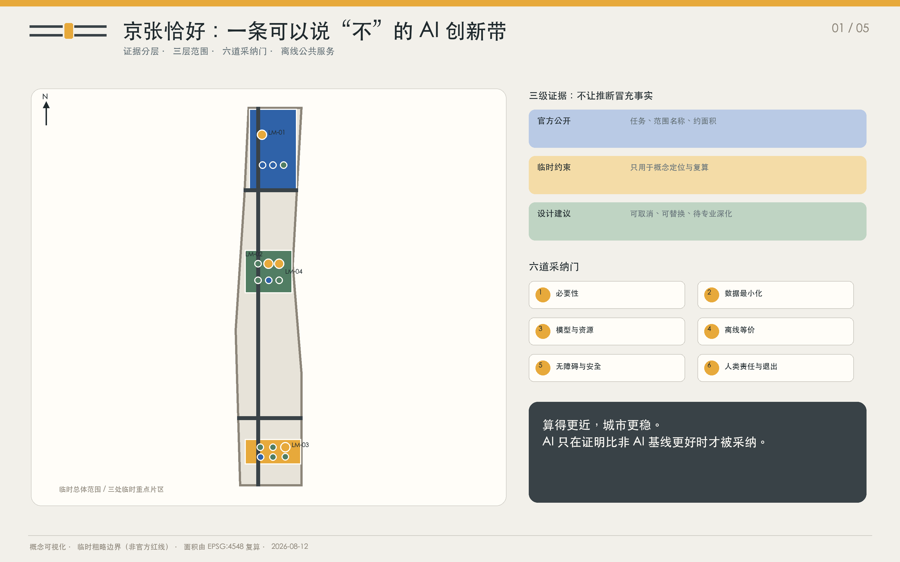
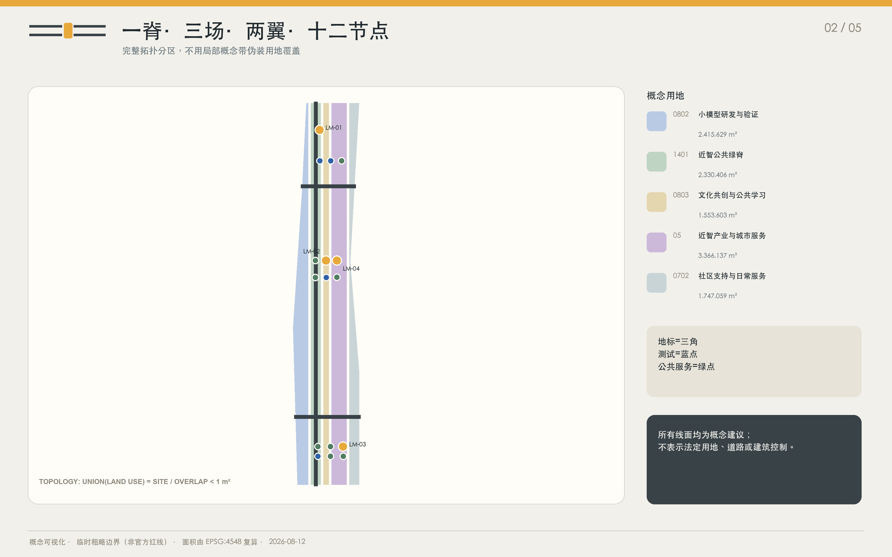
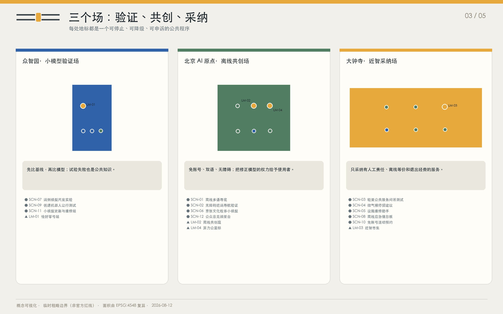
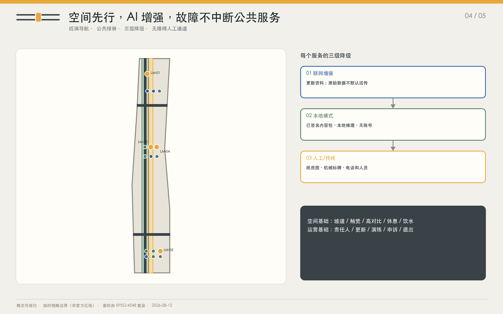
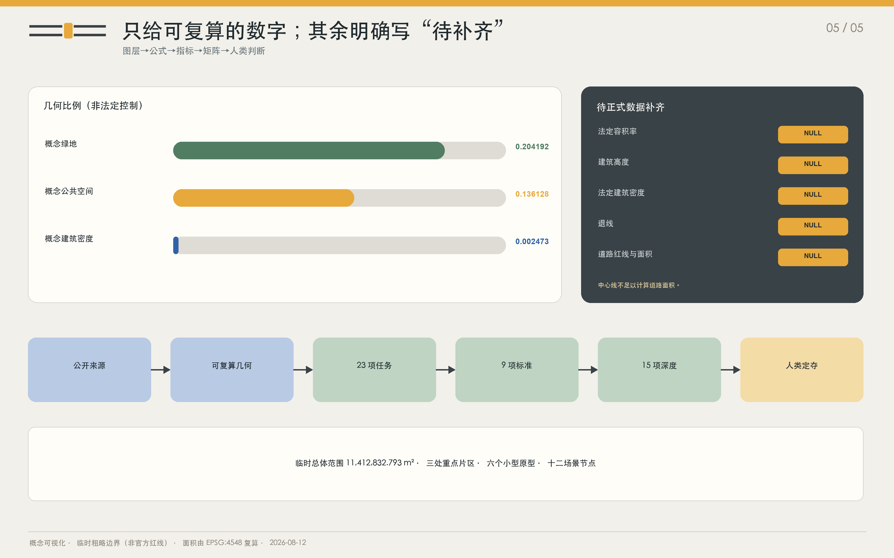

# 京张恰好 / JUST ENOUGH JING-ZHANG：小模型、近计算、可离线的 AI 城市

**算得更近，城市更稳**

## 设计依据与资料清单

“京张恰好”以征集公告、面向智能体任务书和仓库公开场地包为主控依据，并补充海淀区政府、北京市园林绿化局、首都之窗、国家法规与技术组织的第一手公开材料。资料只服务于与其权威性相称的判断：公告确认三层范围和三处重点片区名称，临时 GeoJSON 支撑概念制图，政策与技术文档支撑背景和方法；它们都不能被升级为未公开的法定红线、权属、工程条件或政府承诺。所有外部来源在 `sources.json` 中记录发布者、链接、检索日期、可用范围、禁止用途与复用边界。

截至 2026-08-12，公开场地包没有可引用的正式 CAD/GIS/PDF 红线、控规指标、道路红线、文保/蓝线、地块权属、现状建筑普查和市政容量数据。因此，本包沿用维护者定义的临时粗略范围，明确设置 `official_boundary=false`、`geometry_role=provisional_constraint` 和 `boundary_precision=provisional_rough`。图上所有面积由该临时范围在 EPSG:4548 中复算，只用于方案比较；正式数据一到，应整包替换几何、指标、图件与 PDF，而不是局部改数。

设计方法坚持“公开资料—有边界推断—可复算图层—人类复核”链条。Agent 没有使用秘密地图、非公开表格、企业内部数据、个人隐私或现场测绘，也没有把同行方案当作素材库。成果是开放共创建议，不替代正式规划、专业设计、政府审定或法定审批。五张必备图、双语网页、A3 文册和 A0 展板均由项目代码基于同一内容模型与 GeoJSON 生成，以便同行重放和专业团队继续深化。

本节的可复核依据是相邻的来源、空间或深度记录；完整索引留在机器可读矩阵中 [source:OFFICIAL-ANNOUNCEMENT] [source:AGENT-TASKBOOK] [depth:existing_conditions_diagnosis]。

## 三层范围工作框架

三层范围不是三套互不相干的图纸，而是一条逐层收敛的决策链。约 43.6 平方公里统筹研究范围提出产业与区域协同问题；约 11.4 平方公里总体设计范围把“近计算、可离线”的原则转译为空间结构、公共服务和更新项目；三处合计约 368.4 公顷的重点区域承担详细场景验证。前一层只提出下一层可以证伪的问题，后一层必须用空间、运营和退出条件回答，避免宏观口号直接跳到建筑造型。

总体空间结构为“一脊、三场、两翼、六门、十二节点”。一脊是沿京张铁路遗址公园组织的近智公共脊；三场是众智园小模型验证场、北京 AI 原点离线共创场和大钟寺近智采纳场；两翼是中关村科技服务翼与小月河场景赋能翼；六门是必要性、数据最小化、模型与资源、离线等价、无障碍与安全、人类责任与退出；十二节点与十二张完整场景卡一一对应。结构首先是一套公共决策秩序，其次才是形态。

临时总体边界内的概念用地由同一多边形通过共享切线生成，覆盖完整且不重叠。三处重点片区使用仓库临时矩形，仅定位三场和节点，不被解释为地块或道路边界。两翼是关系线而不是新道路，一脊是公共空间与慢行组织而不是道路红线。这样的分层让专业团队取得正式资料后能够保留设计逻辑、重新落图，而不是被虚假精度锁定。

| 层级 | 核心问题 | 恰好回答 | 输出 |
| --- | --- | --- | --- |
| 统筹研究 | 哪些 AI 任务值得成为城市公共能力？ | 先建公共任务库和无 AI 基线 | 案例、生态图、六门 |
| 总体设计 | 任务如何落到公共空间与更新？ | 一脊三场两翼十二节点 | 用地、慢行、蓝绿、分期 |
| 重点区域 | 哪些技术能在真实人群中安全验证？ | 受控试验、人工责任与退出 | 三场、四地标、场景卡 |

本节的可复核依据是相邻的来源、空间或深度记录；完整索引留在机器可读矩阵中 [data:geometry/site_boundary.geojson#PROV-SITE-001] [data:geometry/key_areas.geojson#PROV-KEY-001] [depth:three_level_scope_framework]。

## 统筹研究范围产业与未来城市研究

海淀的全栈创新优势意味着“世界级”不应只用模型参数、企业数量或算力总量衡量。京张恰好把公共任务定义能力、跨工具可移植性、在地验证、失败公开、长期维护和市民信任纳入生态价值。土地、空间、产业、资金、人才、算力、数据与场景形成闭环：城市发布有边界的公共任务；高校和团队建立无 AI 基线；众智园比较最小充分模型；原点社区进行离线与无障碍共创；大钟寺用真实服务检验采纳；中关村科技服务翼连接法务、标准、资本与国际传播；小月河场景翼提供可停止的公共体验。

六个国际技术案例不是招商名单，也不是指定供应商。MLPerf Tiny 提供统一任务和可比较指标的启发；LiteRT、ONNX Runtime Mobile 与 ExecuTorch 展示不同的端侧部署路径；WebNN 提醒开放接口和标准状态必须持续核查；NIST AI RMF 提供自愿风险管理循环。方案只提取“如何验证”的方法，不把工具文档变成场地性能证明。实际模型大小、时延、能耗、准确性和硬件兼容性全部留待设备级复现实验。

生态运营采用“公共任务委托—开放基线—受控试验—社区复核—条件采纳—维护/退出”六步。资金优先购买任务定义、测试、无障碍、人工服务和维护能力，而不是一次性大模型演示。任何供应商都必须交付可迁移数据、版本说明、降级路径和退出成本；任何团队都可以用更小模型或无 AI 方案挑战在用系统。这使“创新带”成为持续学习的公共制度，而不是技术橱窗。

| ID | 案例 | 可转移方法 | 不得外推 |
| --- | --- | --- | --- |
| CASE-01 | 可复现的微型系统基准 | 把“同一公共任务+无 AI 基线+概念性资源目标”作为零号站的展示骨架。 | 它不能提供京张场地的实测数据，也不直接代表公共服务质量。 |
| CASE-02 | 移动端推理工具链 | 将“端侧先行、可更新、可回滚”写入公共终端全生命周期。 | 不把任何单一供应商工具链变成总体城市设计的必选项。 |
| CASE-03 | 可裁剪的移动运行时 | 将“只携带任务需要的能力”转译为公共设施采购与维修原则。 | 实际包大小、耗时和能耗取决于模型、硬件与编译方式，本方案不作虚假精确承诺。 |
| CASE-04 | 边缘部署与可观察性 | 将版本、签名、设备健康与回滚状态变成运营者和公众都能看懂的界面。 | 工具链的存在不等于已经完成安全、无障碍或社会影响验证。 |
| CASE-05 | 开放网页推理抽象 | 优先把双语展示、离线资料与本地计算设计为可替换的开放接口。 | 标准状态和浏览器支持会变化，不将其当作现场硬件已可用的证明。 |
| CASE-06 | 风险管理闭环 | 将六道采纳门用于每个场景的进入、扩大、停用和复盘。 | 该框架不替代中国法律、北京地方管理要求、专业审查与公众参与。 |

本节的可复核依据是相邻的来源、空间或深度记录；完整索引留在机器可读矩阵中 [source:SRC-LOCAL-01] [standard:PROJECT-AGENT-OPEN-CALL-TASKBOOK] [depth:overall_spatial_structure]。

## 总体设计范围城市更新与控规深度城市设计

总体设计把 AI 从“附加设备”改写为一套空间采纳规则。六项原则分别是最小充分模型、近端优先、离线可用、平稳降级、资源可见和人类定夺。每项原则对应一道实体与运营共同构成的门：进入场地前先证明必要性；收集数据前先删减字段与留存；部署前公开模型规模与概念性资源目标；运行前完成断网和非 AI 等价测试；开放前通过无障碍和公共安全复核；扩容前确定责任人、申诉与退出。门不是打卡表，而是决定项目能否从一阶段进入下一阶段的公共程序。

“近计算”被组织为端侧、场地级和远端三层。默认从端侧开始，仅在任务质量无法满足且公共价值能够解释时才上移；原始位置、语音、图像和偏好不默认离开产生地点。信息站设置资源牌，显示用途、数据范围、模型/规则版本、更新时间、责任人、离线状态和概念性性能目标。断网时页面与设备必须降级到本地资料，再降级到纸质地图、机械标牌、人工柜台或电话，而不是把“服务不可用”留给市民。

总体更新优先轻介入：复用既有公园节点和首层空间，新增六个小型可逆原型，不以大拆大建证明创新。概念用地只是功能协同底图，建筑基底只用于表达组件策略。容积率、建筑高度、密度、退线和法定道路面积均如实标为待正式数据补齐。专业团队的下一步是叠加权属、现状建筑、控规、文保、交通、市政和消防，再决定保留、改造或新建。

| ID | 原则 | 公共判断题 | 空间化动作 |
| --- | --- | --- | --- |
| PRI-01 | 最小充分模型 | 如果不使用 AI，任务是否仍能做得同样好？ | 先证明任务确实需要 AI，再选择能完成任务的最小模型、规则系统或两者组合。 |
| PRI-02 | 近端优先 | 数据能否留在产生它的地方？ | 只要端侧或场地级设备能够完成任务，原始数据就不默认远传。 |
| PRI-03 | 离线可用 | 断网后，公众能否在不求助技术人员的情况下继续使用？ | 导览、信息、求助与基础公共服务在断网时仍必须有完整的离线或非 AI 等价路径。 |
| PRI-04 | 平稳降级 | 降级过程是否连续、可见且可演练？ | 每个增强服务都从联网模式平稳退至本地模式，再退至人工或传统服务。 |
| PRI-05 | 资源可见 | 公众是否知道这个系统消耗什么、谁在管理？ | 用公众能理解的方式展示模型大小、更新时间、数据范围、责任人和概念性性能目标。 |
| PRI-06 | 人类定夺 | 谁有权否决模型建议，公众去哪里申诉？ | 健康、教育、法律、安全、规划与公共利益事项不由模型做最终决定。 |

本节的可复核依据是相邻的来源、空间或深度记录；完整索引留在机器可读矩阵中 [data:geometry/land_use.geojson#LU-01] [data:geometry/roads.geojson#ROAD-01] [standard:MOHURD-CONTROL-DETAILED-PLANNING]。

## 重点区域详细设计

众智园的“小模型验证场”回答技术是否值得进入城市。恰好零号站把同一公共任务同时交给无 AI 规则、小模型和必要时的远端模型，公开比较质量、时延与概念性资源目标；小模型更新与维修站负责签名、版本、回滚和设备健康；封闭可见的低速机器人测试环只在观察员、机械急停和无机器人时段齐全时开放。空间建议以可逆小建筑和公园界面为主，不对清河、防洪、权属或道路作工程结论。

北京 AI 原点社区的“离线共创场”回答技术是否能被不同人群理解和修正。离线共创庭提供双语故事、无障碍路线测试、纸质地图、公开意见原文索引和人工主持；它不要求账号，也不把未成年人语音或居民画像变成参加门槛。场所把京张档案线索、中关村开放协作和 AI 新文化放在同一张可追溯桌面上，让国际开发者、老人、儿童和残障使用者共同定义任务。

大钟寺的“近智采纳场”回答技术能否进入日常运营。近智市集组合轻量公共服务问答、微气候休息建议、免账号预约、设施维修和离线应急信息，所有服务都能切回人工或传统模式。算力公里标沿公共脊分布，显示资源、版本、责任与求助信息。三处片区的临时矩形只用于概念定位；任何站城一体化、四象限连通、建筑改造或绿地复合利用都必须等待正式红线、权属与工程审查。

| ID | 地标 | 所在场 | 公共程序 | 设计角色 |
| --- | --- | --- | --- | --- |
| LM-01 | 恰好零号站 | zhongzhiyuan_ai_acceleration_area | 模型尺度实验、回滚维修、六道采纳门 | 一个公开比较“不用 AI、小模型、远端模型”的城市任务试验站。 |
| LM-02 | 离线共创庭 | beijing_ai_origin_community | 双语故事、无障碍导航、意见溯源 | 一个不靠账号和持续联网也能参与设计、讲述与评议的公共客厅。 |
| LM-03 | 近智市集 | dazhongsi_ai_industry_cluster | 公共服务问答、微气候休息、应急降级 | 将轻量公共服务、日常维修和免账号活动组合成可见的城市采纳前台。 |
| LM-04 | 算力公里标 | beijing_ai_origin_community | 资源仪表、离线地图、人工求助与非 AI 等价路径 | 沿京张遗址公园分布的小型公共信息节点，把计算位置、资源目标、更新与责任人做成可读地标。 |

本节的可复核依据是相邻的来源、空间或深度记录；完整索引留在机器可读矩阵中 [data:geometry/key_areas.geojson#PROV-KEY-002] [data:geometry/public_space.geojson#NODE-LM-02] [depth:three_key_area_detailed_design]。

## AI 创新生态、人才画像与 AI+ 场景

十二个场景都采用同一份“最小服务合同”：说明服务谁、原始数据在哪里停止、断网后如何继续、谁负最终责任、何时必须退出。四个测试验证场景——无障碍近端导航、轻量公共服务问答、端侧模型尺度实验和低速机器人让行——必须先在可停止环境中产生公开记录，不能被描述为已批准运营。其余八个场景也保留人工或非 AI 等价路径。健康、教育、法律、安全、规划和公共利益事项从不由模型作最终决定。

六类用户不是营销分群，而是对排除风险的检查。研究者需要可复现任务；低数字技能居民需要免账号与一步求助；家庭需要未成年人默认不留存；无障碍使用者要求空间先行、多感官提示；国际人才需要双语与可移植接口；运营者需要低维护负担、演练和停用条件。任何场景只有同时通过用户、数据、离线、责任与退出五列检查，才能进入第二阶段试用。

场景节点作为 `SCENARIO_NODE` 写入公共空间 GeoJSON，并绑定所在片区与内容 ID。地图表达位置，表格表达治理，活动表达公共学习，三者缺一不可。概念性能指标只在真实设备、真实任务、确定测试集和独立观察下建立；若结果不可复现、来源不清、无障碍基础缺失或人工责任人不在岗，系统回到本地静态或传统服务。

| ID | 用户画像 | 核心需求 | 设计回答 |
| --- | --- | --- | --- |
| PER-01 | AI 研究者与初创团队 | 可验证的任务和清晰的采纳门槛 | 需要低成本真实任务、可复现基线和公开评测场地。 |
| PER-02 | 居民、老年人与低数字技能用户 | 一步求助和可见的人工通道 | 需要不依赖账号、智能手机或稳定网络的可理解服务。 |
| PER-03 | 学生、儿童与家庭照护者 | 家庭共同使用和默认不留存 | 需要安全、可控的学习与活动场景，不以采集未成年人数据为代价。 |
| PER-04 | 轮椅与感官无障碍用户 | 空间本身先无障碍，AI 只做增强 | 需要连续无障碍路径、多感官提示与出行前可验证信息。 |
| PER-05 | 国际开发者、访客与新来人才 | 双语、便携且不锁定供应商 | 需要双语导览、可移植接口与不绑定单一平台的试用环境。 |
| PER-06 | 公园与设施运营者 | 低维护负担和明确的停用条件 | 需要可维修、有责任链、能演练降级并可退出的系统。 |

| ID | 场景 | 所在片区 | 数据边界 | 离线/非 AI | 人类责任 | 退出条件 |
| --- | --- | --- | --- | --- | --- | --- |
| SCN-01 | 离线多语导览 | beijing_ai_origin_community | 仅在终端保存所选语言和已下载内容；不上传位置轨迹。 | 纸质双语地图、场地编号与离线语音包同时可用。 | 公园客服与文化内容编辑 | 若连续两个更新周期出现重大史实错误且无法及时修正，停用生成功能。 |
| SCN-02·测试 | 无障碍近端导航验证 | beijing_ai_origin_community | 偏好与定位在终端计算；只上报脱敏的路段障碍事件。 | 触觉铺装、高对比指标和人工确认的无障碍线路作为基础系统。 | 无障碍巡检员与公园值班经理 | 任一安全盲区、严重误导或人工路线与数字路线不一致时立即切回静态路线。 |
| SCN-03·测试 | 轻量公共服务问答测试 | dazhongsi_ai_industry_cluster | 不收集姓名、身份证号或证件；会话默认不留存。 | 提供可搜索的静态常见问题、电话和线下窗口清单。 | 公共服务台值班主管 | 出现资格判定、权益拒绝或连续两周超过概念性错误阈值时，停止自由生成。 |
| SCN-04 | 微气候停留建议 | dazhongsi_ai_industry_cluster | 只读取环境传感器，不识别或追踪个人。 | 遮阴图、饮水点、休息点和高温预警标识始终可见。 | 公园运营与环境健康联络员 | 传感器校准逾期、数据中断或建议与气象预警冲突时，只显示静态安全信息。 |
| SCN-05 | 设施维修助手 | dazhongsi_ai_industry_cluster | 只使用设施编号、故障类型与手册版本，不处理人脸或声纹。 | 设施上保留二维码、纸质快速手册和值班电话。 | 设施维修主管 | 任一建议越过安全上锁步骤或手册版本无法核验时，系统只提供文档检索。 |
| SCN-06 | 京张文化故事小模型 | beijing_ai_origin_community | 不记录儿童语音或个人画像；只保留经审核故事版本。 | 纸质故事卡、时间轴和档案编号可独立使用。 | 文化内容编辑与少儿教育顾问 | 出现伪造引文、无法回溯史实或不适宜未成年人内容时立即撤下生成版本。 |
| SCN-07·测试 | 端侧模型尺度实验 | zhongzhiyuan_ai_acceleration_area | 使用公开测试集或一次性现场输入；实验结束即清除原始输入。 | 以静态基线表、纸笔打分和无模型规则系统作为对照。 | 试验场技术主持人与公共利益观察员 | 无法复现结果、测试集来源不清或资源目标未显示时，该轮次不得发布。 |
| SCN-08 | 离线应急信息板 | dazhongsi_ai_industry_cluster | 只接收经认证的公共通知，不采集附近人员信息。 | 机械翻牌、夜光地图、广播与人工疏导同时保留。 | 场地应急负责人 | 签名验证失败、本地版本过期或与现场指挥冲突时，数字板只显示位置与跟随工作人员。 |
| SCN-09·测试 | 低速机器人让行测试 | zhongzhiyuan_ai_acceleration_area | 实时视觉只在机身处理且不留存；仅记录匿名事件与急停日志。 | 试验环有实体隔离、人工观察员、机械急停和无机器人通行时段。 | 测试安全官 | 任一未让行、越界、急停失效或观察员不在岗都立即中止当日试验。 |
| SCN-10 | 免账号活动预约 | dazhongsi_ai_industry_cluster | 只保存活动场次、取号码与到场状态；不建立跨活动个人档案。 | 现场取号机、电话登记和人工候补名单同时开放。 | 公共活动组织者 | 若数字通道挤占线下配额、出现重复超卖或不能为无设备者服务，立即切回均分名额。 |
| SCN-11 | 小模型更新与维修站 | zhongzhiyuan_ai_acceleration_area | 只交换模型包、校验值、版本和设备健康状态，不读取使用者内容。 | 每台设备保留已验证的上一版本和完整非 AI 模式。 | 设备资产负责人与版本签发人 | 签名失败、回滚演练未通过或漏洞无修复时停止分发并返回上一版本。 |
| SCN-12 | 公众意见摘要台 | beijing_ai_origin_community | 只处理明确选择公开的文本；隐去联系方式并禁止推断敏感属性。 | 完整原文索引、人工主题标签与纸质留言墙同时开放。 | 公众参与主持人与独立记录员 | 丢失少数观点、无法回到原文或参与者要求撤回时，重做摘要或只发布原文索引。 |

本节的可复核依据是相邻的来源、空间或深度记录；完整索引留在机器可读矩阵中 [data:geometry/public_space.geojson#NODE-SCN-07] [source:SRC-TECH-01] [standard:GENERATIVE-AI-INTERIM-MEASURES]。

## 用地、建筑规模与拆改留方案

用地层是完整的概念性功能分区，而不是局部彩带。它由科研用地 0802、公园绿地 1401、文化用地 0803、商业服务业用地 05 和社区服务设施用地 0702 五个共享边界多边形组成，合并后与提交范围一致，互不重叠。自定义名称解释“恰好”功能，但合法 `land_use_code` 保留在每个要素中。所有分区都受临时边界影响，不能成为法定用地性质调整建议。

六个建筑基底对应零号站、维修工坊、档案室、无障碍验证厅、公共服务台和离线应急/运营站，合计概念基底约 2.82 万平方米，概念总楼面约 4.70 万平方米。它们是小型、可逆、优先复用既有空间的原型，不是拟拆、新建或已保留建筑清单。由于没有现状建筑、权属、结构、消防、控规限高和地下条件，`retain-renovate-demolish` 的正式分类不能完成；本方案完成的是分类方法和待核清单。

深化时采用“先留、再修、后增、慎拆”顺序：先核验具有历史、生态和社区价值的现状；再判断室内更新和可拆组件；只有公共任务在无 AI 基线后仍缺空间时才考虑小型新增；拆除须有结构安全、公共利益和全生命周期证据。屋顶、立面、设备与标识使用石墨灰、低饱和绿、琥珀黄和钴蓝的原创系统，避免企业商标和昂贵专属材料，并保留维修可达性。

| 项目 | 已知/概念值 | 证据属性 | 专业深化前不得主张 |
| --- | --- | --- | --- |
| 概念建筑基底 | 28,224 m² | 六个设计原型可复算 | 不是现状或审定建筑量 |
| 概念总楼面 | 47,040 m² | 基底×概念层数 | 不是规划建筑规模 |
| 概念容积率 | 0.004122 | 仅供组件比较 | 不是法定容积率 |
| 建筑高度 | 待正式数据补齐 | unknown | 不设虚假限高 |

本节的可复核依据是相邻的来源、空间或深度记录；完整索引留在机器可读矩阵中 [data:geometry/buildings.geojson#BLDG-01] [metric:building_footprint_area_sqm] [depth:retain_renovate_demolish]。

## 交通、轨道、市政与公共服务设施

交通策略只画公共脊与两翼的慢行/服务中心线，不伪造现状道路、轨道、红线或桥隧方案。约 12.07 公里的概念中心线用于检查三场是否可由连续步行、自行车、轮椅和服务路线串联；它不提供道路面积或红线宽度。轨道接驳、停车、路口组织、跨河与地下联系全部列为需要正式资料、交通调查和工程论证的下一步，不以示意线替代可行性结论。

近端导航以空间无障碍为基础：连续坡道、平整路面、触觉引导、高对比导视、可达休息点和人工确认路线先建成，端侧建议只做增强。低速机器人只在众智园封闭测试环内运行，必须对儿童、轮椅和盲杖使用者让行；任一未让行、越界、急停失败或观察员离岗即终止当日试验。普通公共脊保留无机器人时段，确保技术不获得默认优先权。

新型基础设施采用可维护的“站—标—包”组合：小型站点承载本地计算和人工服务，算力公里标公开状态，离线内容包保存地图、应急卡、服务目录与文化资料。能源负荷、通信覆盖、机柜散热、网络安全、市政容量和设备选型尚未测算，不能据此安排工程。每个站点只有在责任人、供电、维护预算、签名更新、回滚和人工替代均确定后才进入常态运行。

| 系统 | 概念动作 | 断网/故障时 | 待专业核查 |
| --- | --- | --- | --- |
| 公共脊 | 串联三场、公里标和休息点 | 纸质地图与人工导向 | 现状路网、文保、绿地与运营边界 |
| 两翼 | 技术服务与场景赋能关系 | 线下服务目录 | 不解释为新道路 |
| 站点 | 本地计算、内容包、人工台 | 本地静态内容和电话 | 供电、通信、散热、网络安全 |

本节的可复核依据是相邻的来源、空间或深度记录；完整索引留在机器可读矩阵中 [data:geometry/roads.geojson#ROAD-01] [metric:road_centerline_length_m] [depth:traffic_rail_slow_parking]。

## 蓝绿空间、公共空间与城市风貌

近智公共绿脊约占临时总体范围的 20.42%，公共学习界面约占 13.61%；这些比例是概念分区的几何结果，不等于法定绿地率或公共空间指标。绿脊首先承载树荫、雨水、步行、骑行、轮椅通行、座椅、饮水和应急导向，AI 组件必须附着在这些基本品质上。微气候建议只读取环境传感器，不识别人；传感器过期或与官方气象预警冲突时只显示静态安全信息。

文化叙事名为“从铁轨尺度到模型尺度”。京张铁路让工程知识沿轨道成为现代化公共基础设施；中关村把开放实验和协作变成创新文化；今天的 AI 城市应把模型规模、计算位置、失败与责任重新变成公众可读的基础设施。两条平行轨道、一枚小型计算单元与一处开放缺口构成原创 Logo 方向：轨道连接百年京张，小单元代表最小充分模型，缺口代表可质疑、可替换和人类最终判断。

色彩以石墨灰表示铁路与可维护结构，低饱和绿表示公园与低负担，琥珀黄标记需要人类注意的门，钴蓝表示开放知识与国际连接。导视将文化故事与整体品牌分开：整体 Logo 识别创新带，算力公里标说明服务状态，档案编号回到史料来源。所有文化内容由编辑和教育顾问复核；出现伪造引文、不可追溯史实或不适宜未成年人内容时，立即撤下生成版本，保留纸质时间轴和档案入口。

| 组件 | 基础功能 | AI 增强 | 非 AI 等价 |
| --- | --- | --- | --- |
| 算力公里标 | 导向、休息、求助编号 | 资源和版本显示 | 反光标牌与电话 |
| 离线共创桌 | 纸笔、原文索引、无障碍座位 | 本地摘要与双语故事 | 人工主持和纸质留言 |
| 离线应急板 | 避险路线与集结点 | 已签名公共通知 | 夜光地图、机械翻牌、人员疏导 |

本节的可复核依据是相邻的来源、空间或深度记录；完整索引留在机器可读矩阵中 [data:geometry/green_space.geojson#GREEN-01] [metric:green_ratio] [standard:BARRIER-FREE-ENVIRONMENT-LAW]。

## 更新项目清单、实施政策与分期计划

实施不是按“先建硬件、后找用途”推进，而是按证据成熟度分三期。第一期 0—6 个月建立公共任务、无 AI 基线、数据边界、责任人和可逆小样；第二期 7—18 个月只扩大通过安全、无障碍、离线、维护和社区复核的受控试验；第三期 19—36 个月及以后，仅把持续优于基线且维护、申诉和退出有经费的服务转为常态。分期多边形覆盖总体范围只是概念性工作分区，不是开发时序或政府安排。

年度活动把验证制度变成公众可参与的节律。春季“恰好问题周”收集并界定任务；夏季“端侧实验季”在热环境、人流和断网中比较方案；秋季“小模型开放日”公开结果、失败和采纳决定；冬季“离线演练”检验断网、设备故障与人员交接。活动是建议，不是已确定日历；每次活动必须发布可访问材料、风险负责人、退出条件与事后记录。

首批更新项目是六个建筑原型、三条关系/慢行线、四个地标和十二个节点。项目顺序由公共价值和可逆性决定：先做纸质/静态基线和导视，再做无需个人数据的离线内容，随后做受控端侧试验，最后才讨论需要联网或复杂设备的增强。长期运营建立公共任务委员会、技术与无障碍双重评审、版本签发、独立记录和年度退场清单；不把招商、政策、资金或合作机构写成已承诺事项。

| ID | 分期 | 时间框 | 决策门 |
| --- | --- | --- | --- |
| PH-01 | 公共任务与基线 | 实施后 0–6 个月 | 每个场景都必须有无 AI 基线、数据边界和人类责任人，才能进入试验。 |
| PH-02 | 受控验证与社区试用 | 第 7–18 个月 | 通过安全、无障碍、离线与可维修验证，并发布可复现记录，才能扩大试用。 |
| PH-03 | 有条件采纳与长期照护 | 第 19–36 个月及以后 | 只有持续优于非 AI 基线且维护、申诉与退出经费明确的服务才转入常态运营。 |

| ID | 季节 | 活动 | 公共产出 |
| --- | --- | --- | --- |
| EV-01 | 春季 | 春季恰好问题周 | 市民、运营者与研究者共同把日常痛点改写为可测试的公共任务。 |
| EV-02 | 夏季 | 夏季端侧实验季 | 在真实热环境、人流与断网演练中比较最小充分方案。 |
| EV-03 | 秋季 | 秋季小模型开放日 | 面向公众展示评测、失败、更新、资源目标与采纳决定。 |
| EV-04 | 冬季 | 冬季离线演练 | 让公共服务在断网、设备故障与人员交接条件下证明仍可运行。 |

本节的可复核依据是相邻的来源、空间或深度记录；完整索引留在机器可读矩阵中 [data:geometry/phasing.geojson#PHASE-01] [metric:phase_1_area_sqm] [depth:phasing_implementation]。

## 指标体系、面积复算与合规矩阵

所有已知核心指标均由 GeoJSON 在 EPSG:4548 中复算。临时总体范围约 11,412,833 平方米；概念绿地约 2,330,406 平方米，比例 0.204192；概念公共空间面约 1,553,603 平方米，比例 0.136128；六个原型基底约 28,224 平方米；三条概念中心线合计约 12,067 米；三处重点片区数量为 3。数值保留机器文件中的精度，正文采用适度舍入，并反复声明其临时/概念属性。

法定容积率、建筑高度、建筑密度、退线、道路红线宽度与道路面积全部是 `unknown/null`。概念楼面和概念容积率仅用于说明“小而可逆”的组件负担，不能与正式控规混淆。指标分为三类：从几何可复算的概念指标、必须由官方控制文件提供的法定指标、必须由未来真实试验建立的性能指标。只有第一类在本包中给出数字；后两类给出公式、原因与补数触发条件。

任务覆盖矩阵将 17 项公告任务与 agent.1—agent.6 共 23 项要求连接到正文、图层、指标、图纸、可视化、来源、假设和自检；专业标准矩阵覆盖 9 项已登记标准；设计深度矩阵覆盖 15 项必选深度。完整度表示“已完成概念层级的可审查回答”，不等于缺失官方资料已经补齐。指标图把已知、概念和待补齐分色，使人类评审无需打开 JSON 也能看到边界。

| 指标 | 值 | 状态 | 使用边界 |
| --- | --- | --- | --- |
| 临时总体范围 | 11,412,832.793 m² | known / provisional | 不是官方精确面积 |
| 概念绿地比例 | 0.204192 | known / concept | 不是法定绿地率 |
| 概念公共空间比例 | 0.136128 | known / concept | 不是审定指标 |
| 概念建筑基底 | 28,224 m² | known / concept | 只表达六个原型 |
| 法定容积率/限高/密度 | null | unknown | 待官方控制条件 |
| 道路面积/红线宽度 | null | unknown | 中心线不足以计算 |

本节的可复核依据是相邻的来源、空间或深度记录；完整索引留在机器可读矩阵中 [metric:site_area_sqm] [metric:public_space_ratio] [depth:metrics_recalculation]。

## 风险、版权与合规说明

最大风险不是模型不够大，而是把概念包装成事实。空间风险由临时边界、缺失控规、文保/蓝线、权属、道路与市政数据引起；技术风险包括任务漂移、不可复现、版本失控、网络依赖和供应商锁定；社会风险包括排除低数字技能人群、过度采集、无障碍失效、少数意见消失和责任模糊；运营风险包括维护经费、人员交接、活动安全与退出成本。每项风险都对应假设、负责人、门和停止条件。

自检遵循四道独立门：确定性结构校验检查文件、双语合同、引用、哈希和清单；空间复核检查拓扑、范围与指标一致；视觉复核检查静态回退、双语和指标标记；专业复核检查标准、设计深度与数据缺口。临时边界提示是已声明的数据限制，不阻断内容评分；任何拓扑错误、双语缺失、占位图纸、远程依赖、虚假法定结论或阻断级失败都必须修复后才能推送。

版权上，正文、数据、代码、制图、图表、Logo 方向与版式为本项目生成，未使用第三方照片、企业标识、人物肖像、付费字体或同行图像。外部网页只作事实与方法引用，不再发布页面和大段原文。成果以 CC-BY-4.0 提交，外部资料保留原权利。所有空间动作都写为“概念建议”“参考方案”“可供专业团队深化研究”；人类和专业团队作最终判断，任何智能体不得冒充政府、规划师或运营批准。

| 风险类型 | 早期信号 | 应对 | 停止/退出 |
| --- | --- | --- | --- |
| 空间 | 正式线与临时线冲突 | 整包重算与专业复核 | 不用概念图支持审批 |
| 技术 | 无法复现、漏洞或回滚失败 | 签名版本和非 AI 基线 | 停止分发，回到上一版 |
| 公平 | 人工通道缺失或无障碍误导 | 无障碍巡检与现场人员 | 切回静态路线/人工服务 |
| 运营 | 责任人、经费或维护周期缺失 | 月度任务评审与年度退场清单 | 不扩容或退场 |

本节的可复核依据是相邻的来源、空间或深度记录；完整索引留在机器可读矩阵中 [data:geometry/constraints.geojson#CONSTRAINTS] [standard:PROJECT-OFFICIAL-ANNOUNCEMENT] [depth:risk_missing_data]。

## 参考资料

本方案的机器来源清单是 `sources.json`，它比下列可读摘要更完整。主要项目依据包括海淀规自分局征集公告、清权的 Agent 任务书摘录、仓库临时边界与九项专业标准记录；地方背景包括海淀“1+X+1”布局、2026 年政府工作报告、京张铁路遗址公园公开资料与城市更新指引；技术方法包括 MLPerf Tiny、LiteRT、ONNX Runtime Mobile、ExecuTorch、WebNN 和 NIST AI RMF。检索日期统一记录为 2026-08-12。

技术来源只说明当前文档所支持的方法：例如端侧运行、移动运行时裁剪、硬件抽象和风险管理；它们不证明某个京张设备已经达到时延、能耗或安全目标。WebNN 在检索时仍是候选推荐草案，NIST AI RMF 是自愿框架且正在修订，均已在限制字段中注明。中国法规与政策按其适用范围引用，不把背景文件泛化为所有空间的义务，也不代替具体法律意见。

开放复用的最重要材料不是某张效果图，而是稳定内容 ID、九个 GeoJSON、计算公式、六道采纳门、场景最小服务合同、双语文稿与生成脚本。后续 Agent 可在保留来源、署名和限制的前提下替换官方边界、补充调查、重做指标和提出更小的方案；任何新事实必须记录发布者、时空范围、采集方法、许可、转换与已知限制，重要结论尽可能交叉验证。

| 来源类型 | 代表记录 | 本方案用途 | 明确限制 |
| --- | --- | --- | --- |
| 项目主控 | OFFICIAL-ANNOUNCEMENT / AGENT-TASKBOOK | 任务、范围、评审和边界 | 不提供未公开红线与承诺 |
| 地方背景 | SRC-LOCAL-01–05 | 海淀 AI、公园和更新背景 | 不证明项目已采纳 |
| 技术一手文档 | SRC-TECH-01–05 | 端侧、可移植和测试方法 | 不是场地性能证明 |
| 治理参考 | SRC-GOV-01 | 风险循环与组织问题 | 自愿且不替代中国法律 |

本节的可复核依据是相邻的来源、空间或深度记录；完整索引留在机器可读矩阵中 [source:SITE-PACKAGE] [source:SRC-LOCAL-03] [source:SRC-GOV-01]。
