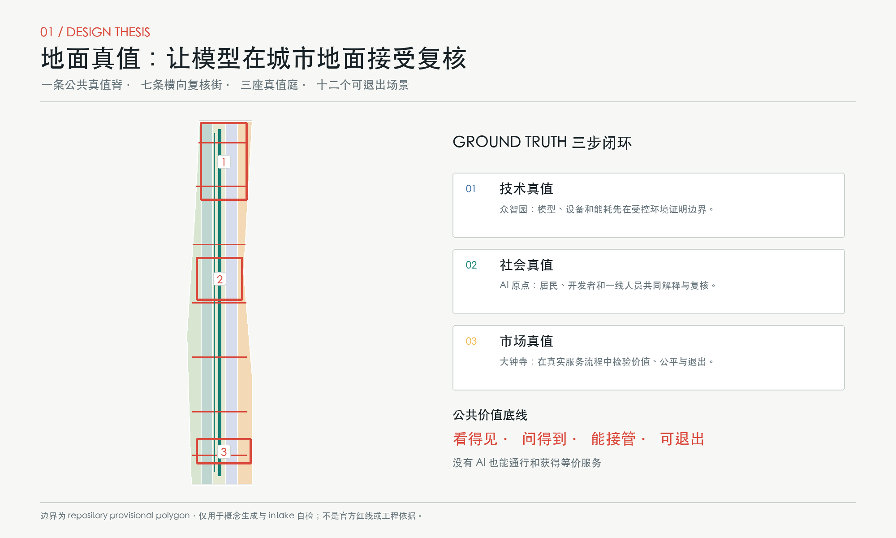
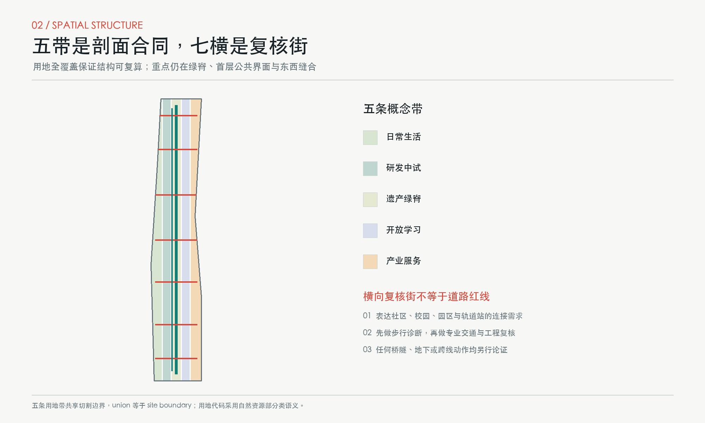
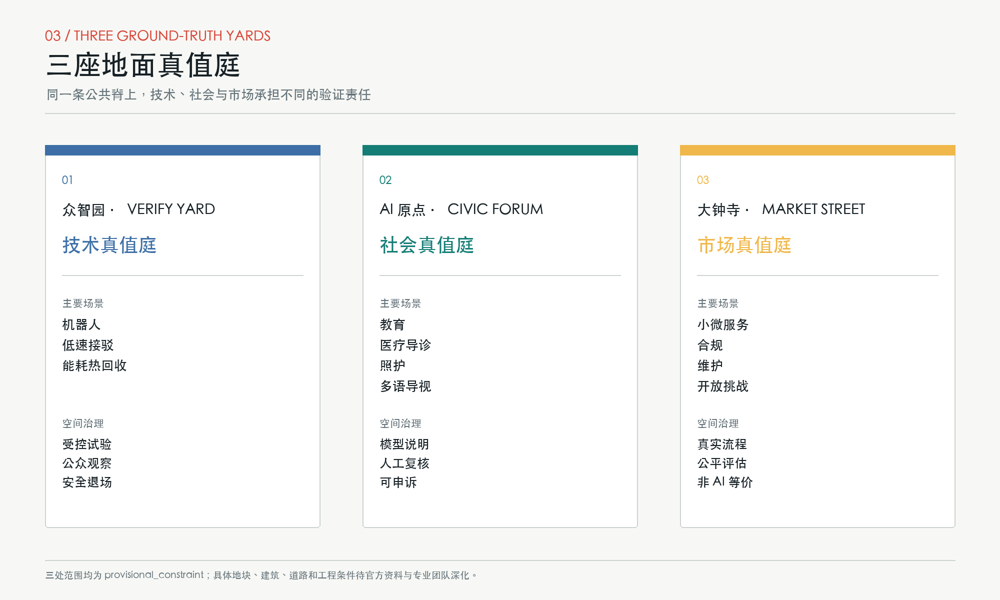
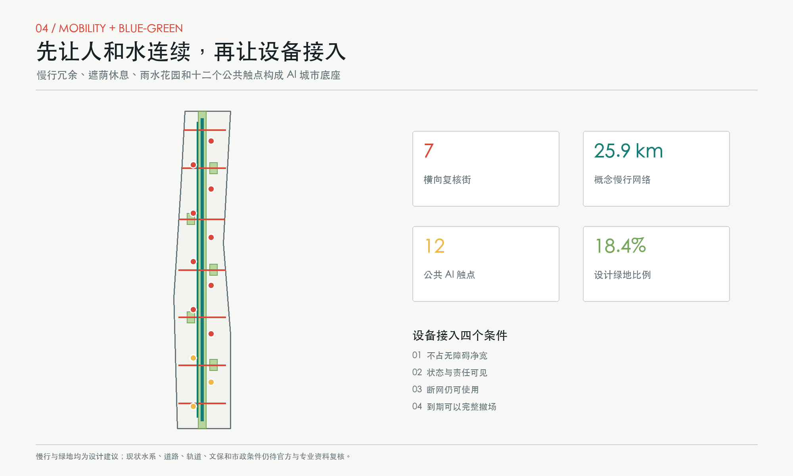
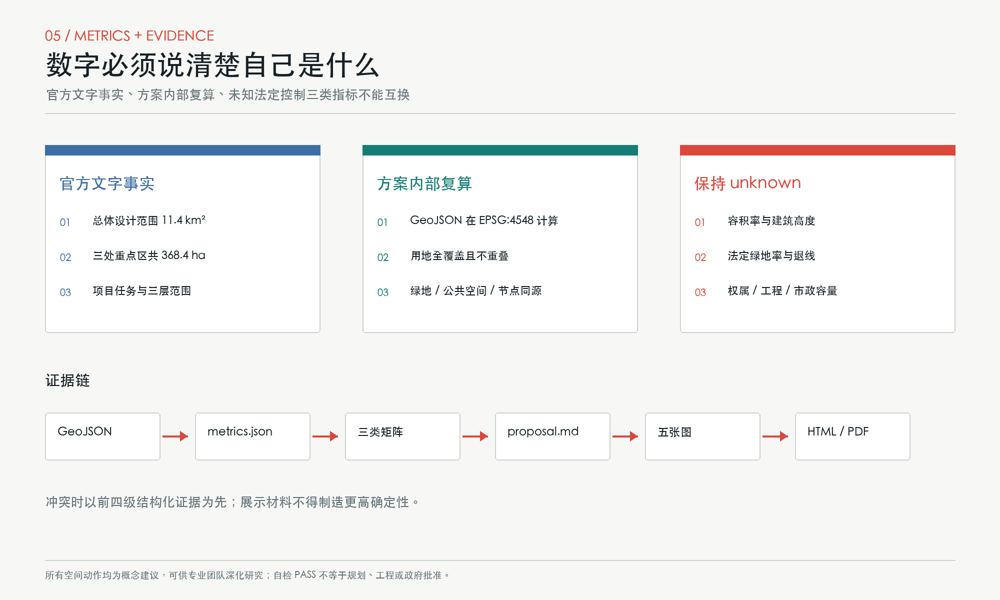

# 地面真值 GROUND TRUTH：百年京张AI公共接口带

**主张。** 在机器学习里，Ground Truth 是模型必须面对的真实参照；在城市里，它就是脚下的路、首层的门、人的身体、日常服务和可以当面提出异议的公共空间。百年前，京张铁路把测量、坡度与工程判断落成一条可通行的轨道；今天，AI 创新也应从屏幕和园区内部走到地面，接受公共价值的复核。由此提出“一脊、七横、三庭、十二触点”：京张遗址公园是公共真值脊，七条横向复核街缝合东西，三处重点区分别承担技术、社会与市场复核，十二个场景触点把 AI 服务变成看得见、问得到、能接管、可退出的城市界面。

本成果是开放共创建议。所有空间落地内容均为“概念建议”“参考方案”或“可供专业团队深化研究”，不替代正式规划，不构成政府审定、投资、工程可行性或实施承诺。[source:AGENT-TASKBOOK] [standard:PROJECT-AGENT-OPEN-CALL-TASKBOOK]

## 设计依据与资料清单

本方案首先读取仓库资料包、任务书、公开资料登记、专业标准本地快照与缺失数据清单。[source:SITE-PACKAGE] [source:SOURCE-REGISTRY] [source:PROCESSED-FACT-PACK] 官方公告提供项目名称、文字四至、三层范围面积和设计任务，是任务主控依据；面向智能体任务书提供三大定位、五大功能、三区两翼与六项智能体任务。[source:OFFICIAL-ANNOUNCEMENT] [source:AGENT-TASKBOOK] 海淀“1+X+1”材料只作为 AI 核心产业与科技服务生态的背景，不推导具体企业、投资或政策承诺。[source:HAIDIAN-1X1]

资料等级被明确分开。`site_boundary.geojson` 与 `key_areas.geojson` 来自仓库临时粗略 polygon，只能支持生成、展示和 intake 自检；它们不是官方红线，不支持精确面积、权属或法定控制判断。[source:BOUNDARY-SOURCE] [source:KEY-AREA-SOURCE] 用地代码采用自然资源部分类语义，但本包的五条用地带仍是概念性功能分配，不是已批准用地。[source:MNR-LAND-USE] [standard:MNR-LAND-USE-CLASSIFICATION-GUIDE]

专业响应遵循《城市设计管理办法》关于公共空间、特色风貌、建筑体量与平立体统筹的要求，并以控规编制审批办法提醒自己区分“已知事实、设计建议、待确认控制”。[standard:MOHURD-URBAN-DESIGN-MEASURES] [standard:MOHURD-CONTROL-DETAILED-PLANNING] 建筑工程设计深度规定的官方来源文件尚缺，因此只登记为深化提醒，不作为本包的权威控制依据。[standard:MOHURD-ARCH-DESIGN-DEPTH-2016] 项目公告的三层范围和成果语境贯穿全篇。[standard:PROJECT-OFFICIAL-ANNOUNCEMENT]

几何、指标、矩阵、正文、图件、PDF 与离线网页按权威顺序互相校验；若它们发生冲突，以 GeoJSON 和 `metrics.json` 为先。[depth:existing_conditions_diagnosis] 当前最关键缺口是官方红线、现状建筑和权属调查、控规指标、道路与轨道控制、市政容量、文保和工程条件。缺口不被“合理猜测”填满，而被记录为后续专业工作的明确入口。

## 三层范围工作框架

**统筹研究范围 43.6 平方公里。** 这一层研究海淀 AI 产业、人才、资本、教育、生活服务与区域协同，不在本包中绘制新的法定边界。策略是把“三大定位”理解为三条同时发生的城市经验：百年京张文化提供时间轴，都市 AI 生活提供公共价值检验，AI 融合创新提供产业循环。[source:OFFICIAL-ANNOUNCEMENT] [depth:three_level_scope_framework]

**总体设计范围约 11.4 平方公里。** 本包用临时总体 polygon 建立五条完整用地概念带：西侧日常生活、研发中试、中央遗产绿脊、开放学习、东侧产业服务。五条带完整覆盖提交边界而不留空白；这是一种跨区段通用的“城市剖面合同”，不是控规地块划分。[data:geometry/site_boundary.geojson#SITE-001] [data:geometry/land_use.geojson#LU-GT-01] [metric:official_overall_design_area_sqm]

**重点区域范围约 368.4 公顷。** 众智园、北京 AI 原点社区、大钟寺分别形成“技术真值庭、社会真值庭、市场真值庭”。每庭都包含开放首层、受控试验、人工复核和退出机制，但具体用地、建筑和道路位置待官方 polygon 及现状调查后深化。[data:geometry/key_areas.geojson#PROV-KEY-001] [metric:key_area_count] [depth:three_key_area_detailed_design]

临时边界的替换流程是确定的：以官方 polygon 替换约束层；重新裁切五条用地带、绿地、公共空间、建筑基底和三期范围；在 EPSG:4548 下重算全部面积与比例；再生成五张图、HTML 与 PDF。当前几何面积 `[metric:site_area_sqm]` 仅用于本包内部一致性，不与公告面积差值做官方精度判断。

## 统筹研究范围产业与未来城市研究

### 名称、标识与空间语法

主名称为 **地面真值 GROUND TRUTH**，副名称为“百年京张 AI 公共接口带”。命名不把 AI 当作装饰，而给出一条可操作判断：任何进入公共城市的模型、设备或服务，都必须说明它在何处、由谁、用什么证据接受现实检验。三级命名为“带 - 庭 - 触点”：全带共享规则，三庭承担不同验证阶段，十二触点对应具体服务。Logo 方向由两条平行轨线和七条短横校准刻线组成，中间一枚红色实点表示“回到地面”；只使用本方案自行生成的几何和系统字体，不借用企业标识。

空间结构将三大定位、五大功能和三区两翼转译为一个闭环：众智园负责全栈自主创新和治理方法；AI 原点社区负责开源协作、人才与公共解释；大钟寺负责智能原生服务与市场反馈；中关村科技服务翼输送资本、法律、知识产权和国际化服务；小月河场景赋能翼提供社区、生态、交通和公共服务问题。成果不是“研发 - 展示”的单行线，而是“问题提出 - 小试 - 公共复核 - 有限采用 - 复盘退出”的循环。[source:AGENT-TASKBOOK] [depth:overall_spatial_structure]

### 六个全球案例的可转译经验

1. **Barcelona 22@。** 官方经济议程把工业更新、创新设施、创意产业与交通改善并置，并通过城市创新实验服务让公共问题进入真实条件测试。可转译为大钟寺的市场真值街与全带开放题机制，而不是照搬开发强度。[source:CASE-BARCELONA-22AT]
2. **Singapore one-north。** JTC 以多个差异化片区组织研究、企业、学习、居住和社区活动，并保留试验与初创空间。可转译为三区差异化分工和共享服务翼。[source:CASE-ONE-NORTH]
3. **Cambridge Kendall Square / The Foundry。** 城市在创新区与既有社区交界设置公共文化、技术、创业和职业教育空间。可转译为“园区首层向公共前庭交付可见价值”。[source:CASE-KENDALL-FOUNDRY]
4. **Helsinki Smart Kalasatama。** living lab 使用设计冲刺和小规模真实环境试验，把居民纳入方案形成。可转译为有期限、有人审、能暂停的场景触点，而非全域部署。[source:CASE-KALASATAMA]
5. **Seoul Digital Media City。** 案例显示公共设施、企业支持、文化开放和运营分工需要同时设计。可转译为三庭的空间责任清单和长期运营台账。[source:CASE-SEOUL-DMC]
6. **Toronto Quayside。** 公共部门主导基础设施与公共空间，并以设计审查和社区参与不断校正方案。可转译为先建公共界面和治理规则、再扩展产业场景的分期逻辑。[source:CASE-QUAYSIDE]

这些案例只用于方法比较，不用其数字替代京张本地条件。同行方案目录用于检查概念重合，本方案未下载或复制同行图件与媒体；“地面真值”选择首层和街道作为 AI 与城市相遇的关键设计对象。[source:PEER-CATALOG]

## 总体设计范围城市更新与控规深度城市设计

总体空间由 **一条公共真值脊、七条横向复核街、五条剖面带、三座重点庭** 组成。公共真值脊沿京张遗址公园组织连续步行、骑行、遮荫、历史解释和公共服务；七条横向复核街把两侧社区、校园、园区、轨道站和商业界面接回主脊。它们在 GeoJSON 中是概念连线，表达连接需求，不是道路红线、桥隧或交通组织结论。[data:geometry/roads.geojson#ROAD-GT-00] [metric:concept_mobility_network_length_m] [depth:traffic_rail_slow_parking]

城市更新不以大拆大建为默认。每个候选地块按四步判断：先确认历史、公共服务和可继续使用的建筑；再用首层开门、共享大厅、遮荫连廊和设备更新做轻介入；第三步才讨论局部增建；只有经权属、结构、文保、消防和社会影响评估后，专业团队才可研究拆除。提交的九个建筑基底只表示“公共首层接口可能落位的空间类型”，不对应真实建筑拆改留结论。[data:geometry/buildings.geojson#BLDG-GT-11] [depth:retain_renovate_demolish]

五条用地带形成从生活到研发、从绿脊到学习和产业服务的连续剖面；首层重点配置可共享会议、样机展示、无障碍卫生间、托育与照护、餐饮和夜间安全服务，上层功能与规模待控规和现状核实。法定容积率 `[metric:floor_area_ratio]` 与高度 `[metric:building_height_m]` 均保持 unknown；本包只计算概念建筑基底，不将其解释为获批建设量。[depth:land_use_layout] [depth:development_intensity_controls] [depth:height_massing_character]

公共空间以“先有无 AI 也成立”为底线：断网时仍能通行，关闭识别时仍能求助，没有智能手机仍能预约人工服务。市政与新型基础设施采用可维护的分层接口：地下和机房条件待专业核实；地面只设置可替换设备位、检修边界、能源和数据状态公示；运营侧建立责任人、人工接管、故障通报和退场清单。[depth:municipal_new_infrastructure]

## 重点区域详细设计

### 众智园：技术真值庭 VERIFY YARD

定位是把全栈自主创新从“模型指标”推到受控物理环境。空间结构为一个可分隔测试庭、若干首层样机间、公众观察廊和安全退场口；建筑策略优先利用可核实的存量空间进行适应性改造，新增基底仅作位置类型示意。慢行系统把员工入口、观察廊和京张绿脊连成无障碍回路；试验与公共通行物理分隔，机器人、低速接驳与端侧能耗三项产业测试必须经过安全员放行、限定时段、事故上报和人工急停。[data:geometry/key_areas.geojson#PROV-KEY-001] [data:geometry/public_space.geojson#NODE-S01]

公共空间不是产品展台，而是“方法可见”的验证庭：公布测试目标、适用边界、失败记录和是否进入下一阶段。实施风险包括临时重点区边界不精确、现状建筑未知、设备安全和噪声影响，故不得形成具体工程结论；专业团队需补充结构、消防、交通和伦理审查。

### 北京 AI 原点社区：社会真值庭 CIVIC FORUM

定位是让开发者、学生、居民和公共服务人员共同判断 AI 是否值得进入日常。空间结构为开源工坊、模型说明室、人工复核台、社区议事长桌和无 AI 等价服务窗口；首层沿公共真值脊形成可进入的“公共模型说明书”。慢行和公共空间以短距离、可停留、可饮水、可如厕、可照护为重点，不以大屏幕和识别设备占据注意力。[data:geometry/key_areas.geojson#PROV-KEY-002] [data:geometry/public_space.geojson#NODE-S05]

AI 场景以教育、医疗导诊、法律咨询、多语导视和社区照护为主；所有建议均保留人工确认，敏感数据不进入公共展示。这里也是全带“贡献可记忆”节点：开放源代码、数据说明、公众反馈和修复记录以可撤下、可更正的方式展示，而不是为企业做永久广告。风险包括隐私、数字排斥和社区运营负担，需设置申诉、撤回与独立复核。

### 大钟寺：市场真值庭 MARKET STREET

定位是验证 AI 是否能在真实商业与服务流程中创造可支付、可解释、对小微主体公平的价值。空间结构是一条可步行市场街、共享试用柜台、合规与知识产权服务台、夜间服务节点和公共反馈厅；建筑首层强调小开间、连续雨棚和可替换展示，不预设具体商户。交通策略把轨道接驳、步行、自行车和配送时段分开讨论，具体流线待官方道路与客流数据深化。[data:geometry/key_areas.geojson#PROV-KEY-003] [data:geometry/public_space.geojson#NODE-S06]

场景包括小微企业合规助手、公共设施维护分诊、多语导视与城市开放挑战。试点不能绑定单一供应商，必须公开服务水平、人工兜底和退出后的数据处理。风险包括商业化挤压公共空间、夜间扰民和算法差别待遇，故每个柜台都应有“非 AI 也能办”的平行路径。

## AI 创新生态、人才画像与 AI+ 场景

生态机制围绕八种要素形成闭环：土地提供可逆的首层接口，空间提供受控试验和公共观察，产业提出可验证问题，资金只支持阶段门通过的试点，人才在三庭间轮转，算力披露能耗与责任，数据按最小必要收集，场景以人工复核和退出条件收口。它把五大功能落到可运营的空间责任，而不是在传统园区上贴 AI 标签。[depth:renewal_project_list]

### 六类用户画像

- **研发工程师与创业团队：** 需要合规中试、共享设备、方法同行评审和失败可记录的空间。
- **社区居民与照护者：** 需要不被强制采集、能找到人工、可休息和可提出异议的日常服务。
- **学生与青年开发者：** 需要低门槛学习、开源协作、导师和可公开贡献的路径。
- **一线公共服务人员：** 需要 AI 减少重复劳动但不剥夺专业判断，并能报告错误和接管流程。
- **小微企业与专业服务者：** 需要可负担试用、合规、知识产权、采购和市场验证支持。
- **老年人、残障人士与国际访客：** 需要无障碍、多语、低认知负担和非智能手机等价服务。

画像数量由正文计数 `[metric:persona_count]`，不是对真实人群规模的统计；后续需通过公开参与和专业社会调查校正。

### 十二张场景卡

**S01 机器人通行与无障碍共测（产业测试）。** 众智园受控测试庭；服务研发团队与轮椅、盲杖、婴儿车使用者；只记录通过率、近失事件和人工急停，不做身份识别；安全员放行，异常立即退场。[data:geometry/public_space.geojson#NODE-S01]

**S02 低速接驳人机接管测试（产业测试）。** 重点区内部候选闭环；记录接管次数、停靠误差和无障碍登乘反馈；驾驶安全员和交通专业人员拥有最终权力，未获道路条件核实前不进入开放道路。

**S03 端侧算力能耗与热回收测试（产业测试）。** 众智园机房和设备界面类型；记录电、水、温度与可回收热量，不采集个人数据；能源和消防人员人工复核，达不到能耗和安全门槛即停止。

**S04 AI 医疗导诊公共柜台。** 原点社区；只做信息导航和预约辅助，不诊断、不替代医生；敏感输入本地处理并可选择人工窗口。

**S05 开源模型学习工坊。** 原点社区；面向学生、开发者和居民，公开模型卡、数据边界与失败案例；教师和社区导师审核内容，未成年人活动单独授权。

**S06 小微企业合规助手。** 大钟寺；提供法规检索、合同问题清单和知识产权导航，不构成法律意见；专业人员确认后才能对外使用。

**S07 多语与无障碍导视。** 七条复核街与轨道接驳界面；语音和视觉信息均有实体标识备份，错误可一键报告，人工服务台负责更新。

**S08 公共设施维护分诊。** 全带公共空间；AI 只对报修文本和设备状态做优先级建议，不自动关闭工单；市政维护人员确认、反馈和复盘。

**S09 微气候舒适度协商。** 绿脊与口袋雨水花园；使用匿名环境数据和自愿感受，不追踪个人；景观专业人员与公众共同决定遮荫、座椅和喷雾是否调整。

**S10 京张口述史共编。** 遗址公园公共真值脊；参与者明确授权，史实与个人记忆分栏，文化专业人员复核，贡献者可以更正或撤回。

**S11 社区照护人工接力。** 原点社区和生活带；AI 只做资源导航和提醒，紧急与复杂需求转人工，禁止用预测结果决定福利资格。

**S12 城市问题开放挑战。** 大钟寺反馈厅与线上公开台账；公众提出问题，团队提交可复现实验，评审记录公开；不以点击量代替公共价值判断。

十二节点和三项产业测试分别由 `[metric:scenario_node_count]` 与 `[metric:industry_test_scenario_count]` 计数。场景共同遵守四道门：合法和必要、技术与安全、公共价值、退出与修复。任何门未通过，场景都停留在研究或沙盒阶段。

## 用地、建筑规模与拆改留方案

完整用地分区由五个共享边界的纵向概念带构成：居住 `0701`、科研 `0802`、公园绿地 `1401`、教育 `0804`、商业服务 `05`。面积分别可由 `[metric:land_use_0701_area_sqm]`、`[metric:land_use_0802_area_sqm]`、`[metric:land_use_1401_area_sqm]`、`[metric:land_use_0804_area_sqm]`、`[metric:land_use_05_area_sqm]` 复算。它们是为了确保全边界有解释的结构性剖分，不表示真实地块权属或获批用途。[data:geometry/land_use.geojson#LU-GT-03]

建筑策略采用“留 - 改 - 补 - 退”四类动作。**留**：对经调查有历史、社会、产业或使用价值的建筑优先保留；**改**：通过首层开放、节能、无障碍、消防和设备更新延长寿命；**补**：只在公共服务和连续街道界面确有缺口时讨论可逆增建；**退**：试验设施到期、无运营责任或不能满足安全伦理时撤场。缺少现状调查意味着本包不对任何真实建筑做拆除判断。

概念建筑基底面积 `[metric:building_footprint_area_sqm]` 与比例 `[metric:concept_building_footprint_ratio]` 只检验图层一致性，不代表开发规模或建筑密度审批值。真实总建筑面积、容积率、建筑高度、密度和拆改留须在官方控规、产权、结构、消防、文保和社会影响资料到位后由专业团队深化。[data:geometry/buildings.geojson#BLDG-GT-22]

## 交通、轨道、市政与公共服务设施

交通优先级为步行、无障碍、骑行、公共交通接驳、必要配送和机动车。公共真值脊提供南北连续慢行，七条横向复核街解决“能到公园却过不去街区”的东西连接问题，骑行复线提供慢行冗余。[metric:cross_check_street_count] 这些线只表达网络关系；任何跨铁路、跨道路、地下或桥隧动作都需取得官方线位、客流、安全、产权和工程条件后另行论证。[data:geometry/roads.geojson#ROAD-GT-CYCLE]

轨道站点周边的概念接口包括清晰换乘、遮雨等候、无障碍导航、自行车停放、夜间照明和人工服务，不假定新建轨道线位。停车策略优先共享既有资源和分时管理，避免以新增地面停车占用公共空间；具体供需和出入口需交通调查。

市政与新型基础设施采用“可见责任、隐藏设备、可替换接口”：端侧算力柜、传感器、充电和通信设备应进入可检修设备带，不侵占无障碍净宽；状态、能耗、维护责任和停用方法在地面公示。传统给排水、供电、消防、环卫与应急是 AI 场景的前置条件，不用“智慧化”绕过容量校核。公共服务设施以人工窗口、社区空间、学习工坊、照护和卫生设施为底座，AI 只做增强层。

## 蓝绿空间、公共空间与城市风貌

蓝绿系统以京张遗址公园为连续绿脊，横向复核街配置口袋雨水花园、遮荫、座椅、饮水和生物多样性小微节点。已生成绿地面积和设计比例 `[metric:green_space_area_sqm]`、`[metric:green_ratio]`，但法定绿地率 `[metric:statutory_green_ratio]` 保持 unknown。公共空间由十二个场景界面与七个横向节点构成，面积和比例 `[metric:public_space_area_sqm]`、`[metric:public_space_ratio]` 只描述本方案图层。[data:geometry/green_space.geojson#GREEN-GT-01]

城市风貌遵循“轨道秩序、首层温度、设备克制”。轨道秩序来自平行线、里程刻度和可读构造；首层温度来自连续门廊、透明但不暴露隐私的工作界面、可坐可停的前庭；设备克制要求大屏、摄像、机器人和广告不得成为公共空间主角。建筑高度、体量、色彩和屋顶应在官方控制与城市设计专业复核后形成分区规则，本包只提出低饱和材料、可维护节点和夜间低眩光方向。[depth:blue_green_public_space]

四处 AI 朝圣地标均是公共知识设施而非纪念性巨构：**真值零公里**位于 AI 原点社区，展示问题和版本；**公开基准厅**位于众智园，展示测试方法与失败记录；**城市反馈钟**位于大钟寺，显示人工响应与修复时间而非商业流量；**贡献轨枕**沿绿脊记录可核实、可更正的开源与公共贡献。数量由 `[metric:pilgrimage_landmark_count]` 计数，位置均需专业团队和权属方深化。

文化叙事从“测量 - 建造 - 运营 - 维护”展开：京张铁路的价值不只在通车瞬间，也在长期可读、可修、可复核的工程系统；中关村文化把自主创新和开放讨论带入当代；AI 新文化则必须接受人的现实、权利和公共后果。导视以中文、英文、图形和触觉四种通道表达，“总体 Logo”与各庭标识保持层级区分。

## 更新项目清单、实施政策与分期计划

**近期：建立地面规则。** 项目包括真值零公里、两处可逆公共柜台、首批三项产业测试沙盒、两条横向复核街的步行诊断、公开场景权利清单和人工接管台账。启动条件是官方边界替换、现状与权属初查、伦理和安全审查；不是自动开工安排。

**中期：形成三区联动。** 项目包括众智园公开基准厅、原点社区公共模型说明书、大钟寺市场真值街、连续骑行复线、口袋雨水花园、共享专业服务和贡献轨枕。只有近期试点复盘通过、维护责任明确、非 AI 等价服务稳定后，才建议扩大。[data:geometry/phasing.geojson#PHASE-GT-02] [depth:phasing_implementation]

**远期：全带迭代而非一次建成。** 项目包括七条横向复核街完整网络、跨区年度开放挑战、国际开发者驻留与公共成果归档；每三年对场景、设备、空间和品牌资产做一次保留、修复、替换或退出评审。三期数量由 `[metric:phase_count]` 计数，不代表政府确定时序。

政策建议包括：公共 AI 场景分级准入；采购合同写入数据退出、人工接管和可迁移性；公共首层以可达性和服务时长换取运营支持；试验结果同时公开成功与失败；社会影响和无障碍评估进入阶段门；运营方为设备退场和数据删除预留预算。

年度活动系统命名为 **GROUND TRUTH WEEK / 地面真值周**：春季发布城市问题，夏季进行受控小试，秋季由公众与专业人员共同复核，冬季发布“采用、继续研究或退出”清单。开发者社区以问题为入口，不以赞助商曝光为入口；国际传播使用“Models meet the city at ground level”作为解释语。活动、招商、资金和运营均为概念建议。[source:AGENT-TASKBOOK]

## 指标体系、面积复算与合规矩阵

本包的指标分三类。第一类是官方文字事实，如总体设计面积 11.4 平方公里；第二类是由临时几何和设计图层复算的“方案内部指标”，如绿地、公共空间、道路长度、用地分区和节点数量；第三类是未知的法定或工程控制，如容积率、高度和法定绿地率。三类不得互换。[depth:metrics_recalculation]

核心指标的设计含义如下：公共空间比例检验 AI 场景是否真的获得可进入的地面位置，而不是只存在于应用里；绿地比例检验人才生活、遮荫和遗产公园是否成为空间骨架；概念建筑基底检验三庭是否有首层接口承载；交通网络长度与横向街数量检验东西缝合是否落入图层；十二场景、六类画像、四处地标和三期计划检验任务书内容是否可读、可定位、可运营。

全部已知指标引用索引：`site_area_sqm` [metric:site_area_sqm]；`official_overall_design_area_sqm` [metric:official_overall_design_area_sqm]；`building_footprint_area_sqm` [metric:building_footprint_area_sqm]；`concept_building_footprint_ratio` [metric:concept_building_footprint_ratio]；`green_space_area_sqm` [metric:green_space_area_sqm]；`green_ratio` [metric:green_ratio]；`public_space_area_sqm` [metric:public_space_area_sqm]；`public_space_ratio` [metric:public_space_ratio]；`concept_mobility_network_length_m` [metric:concept_mobility_network_length_m]；`cross_check_street_count` [metric:cross_check_street_count]；`scenario_node_count` [metric:scenario_node_count]；`industry_test_scenario_count` [metric:industry_test_scenario_count]；`persona_count` [metric:persona_count]；`pilgrimage_landmark_count` [metric:pilgrimage_landmark_count]；`key_area_count` [metric:key_area_count]；`phase_count` [metric:phase_count]；五类用地面积 [metric:land_use_0701_area_sqm] [metric:land_use_0802_area_sqm] [metric:land_use_1401_area_sqm] [metric:land_use_0804_area_sqm] [metric:land_use_05_area_sqm]。

合规矩阵覆盖公告 1.3、1.4、1.5 和 agent.1 至 agent.6；标准矩阵连接五项强制依据与一个资料缺口项；深度矩阵把现状诊断、三层范围、结构、用地、强度、风貌、拆改留、交通、市政、蓝绿、重点区、项目、分期、指标和风险逐项映射到正文与结构化证据。[depth:risk_missing_data]

数据引用索引：范围 `[data:geometry/site_boundary.geojson#SITE-001]`、重点区 `[data:geometry/key_areas.geojson#PROV-KEY-002]`、用地 `[data:geometry/land_use.geojson#LU-GT-05]`、建筑 `[data:geometry/buildings.geojson#BLDG-GT-31]`、道路 `[data:geometry/roads.geojson#ROAD-GT-04]`、绿地 `[data:geometry/green_space.geojson#GREEN-GT-03]`、公共空间 `[data:geometry/public_space.geojson#PUBLIC-S09]`、约束披露 `[data:geometry/constraints.geojson#collection]`、分期 `[data:geometry/phasing.geojson#PHASE-GT-03]`。

深度引用索引：[depth:existing_conditions_diagnosis] [depth:three_level_scope_framework] [depth:overall_spatial_structure] [depth:land_use_layout] [depth:development_intensity_controls] [depth:height_massing_character] [depth:retain_renovate_demolish] [depth:traffic_rail_slow_parking] [depth:municipal_new_infrastructure] [depth:blue_green_public_space] [depth:three_key_area_detailed_design] [depth:renewal_project_list] [depth:phasing_implementation] [depth:metrics_recalculation] [depth:risk_missing_data]。

## 风险、版权与合规说明

**空间与规划风险。** 临时边界可能与官方红线、重点区、道路、文保、水系或权属不一致；所有面积与图面需在官方 polygon 到位后重算。未知容积率、高度、密度、退线和市政容量不被本方案推定。任何建筑、道路、桥隧、地下、能源和消防动作需专业设计、评估和审批。[data:geometry/constraints.geojson#collection]

**AI 与数据风险。** 场景默认数据最小化、用途限定、短期保存、人工复核、可申诉和非 AI 等价服务。涉及医疗、法律、照护、未成年人、无障碍和公共安全时，AI 只提供辅助信息；责任主体不能被“模型决定”取代。供应商锁定通过开放接口、数据可迁移和退出条款控制。

**公平与运营风险。** 公共场景可能增加一线人员负担或排斥不用智能设备的人，因此每个触点必须同时计算维护工时、人工容量、无障碍和断网状态。活动和招商设想不构成已确定安排；试点不能依靠一次性展览维持。

**版权与生成责任。** 正文、图件、GeoJSON、离线网页和 PDF 由 OpenAI Codex 在公开或清权资料边界内生成，核心图使用同包几何和指标绘制，不使用商业地图瓦片、新闻图片、企业标识、人物肖像或同行媒体。外部案例仅以文字概括并保留来源；详情见 `report/copyright_statement.md`。本方案采用 CC BY 4.0 发布，第三方来源仍遵守其各自条款。

自检不等于专业批准。它只证明文件结构、拓扑、指标一致性、引用、离线安全和 PR 范围满足仓库规则；选址、规划、工程、历史、社会、伦理和运营判断仍须人类与专业团队完成。

## 参考资料

- 项目资料包、任务书、标准快照与公开资料登记。[source:SITE-PACKAGE] [source:SOURCE-REGISTRY]
- 官方公告、海淀产业背景与自然资源部用地分类。[source:OFFICIAL-ANNOUNCEMENT] [source:HAIDIAN-1X1] [source:MNR-LAND-USE]
- 临时边界与重点区几何。[source:BOUNDARY-SOURCE] [source:KEY-AREA-SOURCE]
- 面向智能体任务书与处理后的事实导航。[source:AGENT-TASKBOOK] [source:PROCESSED-FACT-PACK]
- 全球案例：Barcelona 22@、one-north、Kendall Square / The Foundry、Smart Kalasatama、Seoul DMC、Toronto Quayside。[source:CASE-BARCELONA-22AT] [source:CASE-ONE-NORTH] [source:CASE-KENDALL-FOUNDRY] [source:CASE-KALASATAMA] [source:CASE-SEOUL-DMC] [source:CASE-QUAYSIDE]
- 同行方案公开目录，仅用于差异化检查。[source:PEER-CATALOG]
